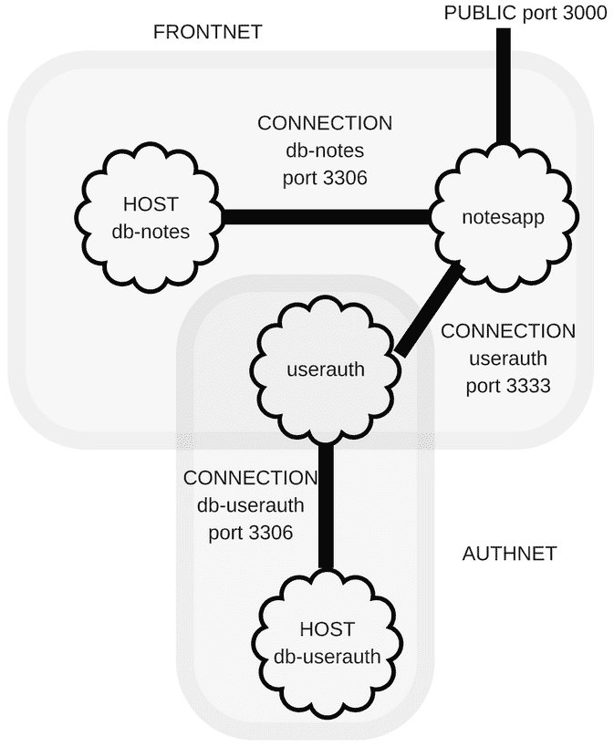

将 Node.js 应用程序部署到 Linux 服务器

现在 Notes 应用程序已经相当完整，是时候考虑如何将其部署到真实服务器上了。我们已经创建了一个合作笔记概念的最小实现，效果相当不错。为了发展，Notes 必须离开我们的笔记本电脑，生活在一个真正的服务器上。

要实现的用户故事是访问托管应用程序，即使您的笔记本电脑关闭，也可以进行评估。开发者的故事是识别几种部署解决方案之一，确保系统在崩溃时具有足够的可靠性，以及用户可以在不占用开发者太多时间的情况下访问应用程序。

在本章中，我们将涵盖以下主题：

+   应用程序架构的讨论，以及如何实施部署的想法

+   在 Linux 服务器上进行传统的 LSB 兼容的 Node.js 部署

+   配置 Ubuntu 以管理后台任务

+   调整 Twitter 应用程序认证的设置

+   使用 PM2 可靠地管理后台任务

+   部署到虚拟 Ubuntu 实例，可以是我们笔记本电脑上的虚拟机（VM）或虚拟专用服务器（VPS）提供商

Notes 应用程序由两个服务组成：Notes 本身和用户认证服务，以及相应的数据库实例。为了可靠地向用户提供这些服务，这些服务必须部署在公共互联网上可见的服务器上，并配备系统管理工具，以保持服务运行，处理服务故障，并扩展服务以处理大量流量。一个常见的方法是依赖于在服务器启动期间执行脚本来启动所需的后台进程。

即使我们的最终目标是在具有自动扩展和所有流行词的基于云的平台上部署，您仍必须从如何在类 Unix 系统上后台运行应用程序的基础知识开始。

让我们通过再次审查架构并思考如何在服务器上最佳部署来开始本章。

# 第十四章：注意应用程序架构和部署考虑事项

在我们开始部署 Notes 应用程序之前，我们需要审查其架构并了解我们计划做什么。我们已将服务分成两组，如下图所示：



用户界面部分是 Notes 服务及其数据库。后端，用户认证服务及其数据库需要更多的安全性。在我们的笔记本电脑上，我们无法为该服务创建设想中的保护墙，但我们即将实施一种形式的保护。

增强安全性的一种策略是尽可能少地暴露端口。这减少了所谓的攻击面，简化了我们在加固应用程序防止安全漏洞方面的工作。对于 Notes 应用程序，我们只需要暴露一个端口：用户访问应用程序的 HTTP 服务。其他端口——两个用于 MySQL 服务器，一个用于用户认证服务端口——不应该对公共互联网可见，因为它们仅供内部使用。因此，在最终系统中，我们应该安排暴露一个 HTTP 端口，并将其他所有内容与公共互联网隔离开来。

在内部，Notes 应用程序需要访问 Notes 数据库和用户认证服务。反过来，该服务需要访问用户认证数据库。Notes 服务不需要访问用户认证数据库，用户认证服务也不需要访问 Notes 数据库。按照目前的设想，不需要外部访问任何数据库或认证服务。

这给了我们一个将要实施的感觉。要开始，让我们学习在 Linux 上部署应用程序的传统方式。

# Node.js 服务的传统 Linux 部署

在本节中，我们将探讨传统的 Linux/Unix 服务部署。我们将在笔记本电脑上运行一个虚拟的 Ubuntu 实例来完成这个目标。目标是创建后台进程，这些进程在启动时自动启动，如果进程崩溃，则重新启动，并允许我们监视日志文件和系统状态。

传统的 Linux/Unix 服务器应用部署使用 init 脚本来管理后台进程。它们在系统启动时启动，并在系统停止时干净地关闭。名称“init 脚本”来自系统中启动的第一个进程的名称，其传统名称为`/etc/init`。init 脚本通常存储在`/etc/init.d`中，并且通常是简单的 shell 脚本。一些操作系统使用其他进程管理器，例如`upstart`、`systemd`或`launchd`，但遵循相同的模型。虽然这是一个简单的模型，但具体情况在一个操作系统（OS）到另一个操作系统（OS）之间差异很大。

Node.js 项目本身不包括任何脚本来管理任何操作系统上的服务器进程。基于 Node.js 实现完整的 Web 服务意味着我们必须创建脚本来与您的操作系统上的进程管理集成。

在互联网上拥有 Web 服务需要在服务器上运行后台进程，并且这些进程必须是以下内容：

+   **可靠性**：例如，当服务器进程崩溃时，它们应该能够自动重新启动。

+   **可管理性**：它们应该与系统管理实践很好地集成。

+   **可观察性**：管理员必须能够从服务中获取状态和活动信息。

为了演示涉及的内容，我们将使用 PM2 来实现*Notes*的后台服务器进程管理。PM2 将自己标榜为*进程管理器*，意味着它跟踪它正在管理的进程的状态，并确保这些进程可靠地执行并且可观察。PM2 会检测系统类型，并可以自动集成到本机进程管理系统中。它将创建一个 LSB 风格的 init 脚本（[`wiki.debian.org/LSBInitScripts`](http://wiki.debian.org/LSBInitScripts)），或者根据您的服务器需要创建其他脚本。

本章的目标是探讨如何做到这一点，有几种实现这一目标的途径：

+   传统的虚拟机管理应用程序，包括 VirtualBox、Parallels 和 VMware，让我们在虚拟环境中安装 Ubuntu 或任何其他操作系统。在 Windows 上，Hyper-V 随 Windows 10 Pro 一起提供类似的功能。在这些情况下，您下载引导 CD-ROM 的 ISO 镜像，从该 ISO 镜像引导虚拟机，并运行完整的操作系统安装，就像它是一台普通的计算机一样。

+   您可以从全球数百家网络托管提供商中租用廉价的 VPS。通常选择受限于 Ubuntu 服务器。在这些情况下，您将获得一个预先准备好的服务器系统，可用于安装运行网站的服务器软件。

+   一种新产品 Multipass 是一种基于轻量级虚拟化技术的轻量级虚拟机管理工具，适用于每台台式计算机操作系统。它为您提供了与从托管提供商租用 VPS 或使用 VirtualBox 等 VM 软件获得的完全相同的起点，但对系统的影响要比 VirtualBox 等传统 VM 应用程序低得多。就像在笔记本电脑上获得 VPS 一样。

从启动后台进程的工具和命令的角度来看，这些选择之间没有实际区别。在 VirtualBox 中安装的 Ubuntu 实例与从 Web 托管提供商那里租用的 VPS 上的 Ubuntu 相同，与在 Multipass 实例中启动的 Ubuntu 相同。它是相同的操作系统，相同的命令行工具和相同的系统管理实践。不同之处在于对笔记本电脑性能的影响。使用 Multipass，我们可以在几秒钟内设置一个虚拟的 Ubuntu 实例，并且很容易在笔记本电脑上运行多个实例而几乎不会影响性能。使用 VirtualBox、Hyper-V 或其他 VM 解决方案的体验是，使用笔记本电脑会很快感觉像在糖浆中行走，特别是在同时运行多个 VM 时。

因此，在本章中，我们将在 Multipass 上运行此练习。本章中显示的所有内容都可以轻松转移到 VirtualBox/VMware/等上的 Ubuntu 或从 Web 托管提供商那里租用的 VPS 上。

对于此部署，我们将使用 Multipass 创建两个 Ubuntu 实例：一个用于 Notes 服务，另一个用于用户服务。在每个实例中，都将有一个对应数据库的 MySQL 实例。然后我们将使用 PM2 配置这些系统，在启动时在后台启动我们的服务。

由于 Multipass 和 WSL2 之间存在明显的不兼容性，因此在 Windows 上使用 Multipass 可能会遇到困难。如果遇到问题，我们有一节描述应该怎么做。

第一项任务是复制上一章的源代码。建议您创建一个新目录`chap10`，作为`chap09`目录的同级目录，并将`chap09`中的所有内容复制到`chap10`中。

首先，让我们安装 Multipass，然后我们将开始部署和测试用户认证服务，然后部署和测试 Notes。我们还将涵盖 Windows 上的设置问题。

## 安装 Multipass

Multipass 是由 Canonical 开发的开源工具。它是一个非常轻量级的用于管理 VM 的工具，特别是基于 Ubuntu 的 VM。它足够轻便，可以在笔记本电脑上运行迷你云主机系统。

要安装 Multipass，请从[`multipass.run/`](https://multipass.run/)获取安装程序。它也可能通过软件包管理系统可用。

安装了 Multipass 后，您可以运行以下命令中的一些来尝试它：

```

Because we did not supply a name for the machine, Multipass created a random name. It isn't shown in the preceding snippet, but the first command included the download and setup of a VM image. The `shell` command starts a login shell inside the newly created VM, where you can use tools like `ps` or `htop` to see that there is indeed a full complement of processes running already.

Since one of the first things you do with a new Ubuntu install is to update the system, let's do so the Multipass way:

```

这按预期工作，您会看到`apt-get`首先更新其可用软件包的列表，然后要求您批准下载和安装软件包以进行更新，之后它会这样做。熟悉 Ubuntu 的人会觉得这很正常。不同之处在于从主机计算机的命令行环境中执行此操作。

这很有趣，但我们有一些工作要做，我们对 Multipass 基于野马的机器名称不满意。让我们学习如何删除 Multipass 实例：

```

We can easily delete a VM image with the `delete` command; it is then marked as `Deleted`*.* To truly remove the VM, we must use the `purge` command.

We've learned how to create, manage, and delete VMs using Multipass. This was a lot faster than some of the alternative technologies. With VirtualBox, for example, we would have had to find and download an ISO, then boot a VirtualBox VM instance and run the Ubuntu installer, taking a lot more time. 

There might be difficulties using Multipass on Windows, so let's talk about that and how to rectify it.

### Handling a failure to launch Multipass instances on Windows

The Multipass team makes their application available to on run Windows systems, but issues like the following can crop up:

```

它通过设置实例的所有步骤，但在最后一步，我们收到了这条消息，而不是成功。运行`multipass list`可能会显示实例处于`Running`状态，但没有分配 IP 地址，运行`multipass shell`也会导致超时。

如果在计算机上安装了 WSL2 和 Multipass，则会观察到此超时。WSL2 是 Windows 的轻量级 Linux 子系统，被称为在 Windows 上运行 Linux 命令的极佳环境。同时运行 WSL2 和 Multipass 可能会导致不希望的行为。

在本章中，WSL2 没有用。这是因为 WSL2 目前不支持安装在重启后持续存在的后台服务，因为它不支持`systemd`。请记住，我们的目标是学习设置持久的后台服务。

可能需要禁用 WSL2。要这样做，请使用 Windows 任务栏中的搜索框查找“打开或关闭 Windows 功能”控制面板。因为 WSL2 是一个功能而不是一个安装或卸载的应用程序，所以可以使用此控制面板来启用或禁用它。只需向下滚动以找到该功能，取消选中复选框，然后重新启动计算机。

Multipass 在线文档中有一个用于 Windows 的故障排除页面，其中包含一些有用的提示，网址为[`multipass.run/docs/troubleshooting-networking-on-windows`](https://multipass.run/docs/troubleshooting-networking-on-windows)。

WSL2 和 Multipass 都使用 Hyper-V。这是 Windows 的虚拟化引擎，它还支持以类似于 VirtualBox 或 VMware 的模式安装 VM。可以轻松下载 Ubuntu 或任何其他操作系统的 ISO 并在 Hyper-V 上安装它。这将导致完整的操作系统，可以在其中进行后台进程部署的实验。您可能更喜欢在 Hyper-V 内部运行这些示例。

安装了虚拟机后，本章其余大部分说明都将适用。具体来说，`install-packages.sh`脚本可用于安装完成说明所需的 Ubuntu 软件包，`configure-svc`脚本可用于将服务“部署”到`/opt/notes`和`/opt/userauth`。建议在虚拟机内部使用 Git 克隆与本书相关的存储库。最后，pm2-single 目录中的脚本可用于在 PM2 下运行 Notes 和 Users 服务。

我们的目的是学习如何在 Linux 系统上部署 Node.js 服务，而无需离开我们的笔记本电脑。为此，我们熟悉了 Multipass，因为它是管理 Ubuntu 实例的绝佳工具。我们还了解了诸如 Hyper-V 或 VirtualBox 之类的替代方案，这些替代方案也可以用于管理 Linux 实例。

让我们开始探索使用用户认证服务进行部署。

## 为用户认证服务配置服务器

由于我们希望拥有分段基础架构，并将用户认证服务放在一个隔离区域中，让我们首先尝试构建该架构。使用 Multipass，我们将创建两个服务器实例`svc-userauth`和`svc-notes`。每个实例将包含自己的 MySQL 实例和相应的基于 Node.js 的服务。在本节中，我们将设置`svc-userauth`，然后在另一节中，我们将复制该过程以设置`svc-notes`。

对于我们的 DevOps 团队，他们要求对所有管理任务进行自动化，我们将创建一些 shell 脚本来管理服务器的设置和配置。

这里显示的脚本处理了部署到两个服务器的情况，其中一个服务器保存认证服务，另一个保存*Notes*应用程序。在本书的 GitHub 存储库中，您将找到其他脚本，用于部署到单个服务器。如果您使用的是 VirtualBox 而不是 Multipass 等较重的虚拟化工具，则可能需要单个服务器方案。

在本节中，我们将创建用户认证后端服务器`svc-userauth`，在后面的部分中，我们将创建*Notes*前端的服务器`svc-notes`。由于这两个服务器实例将设置类似，我们可能会质疑为什么要设置两个服务器。这是因为我们决定的安全模型。

涉及几个步骤，包括一些用于自动化 Multipass 操作的脚本，如下所示：

1.  创建一个名为`chap10/multipass`的目录，用于管理 Multipass 实例的脚本。

1.  然后，在该目录中创建一个名为`create-svc-userauth.sh`的文件，其中包含以下内容：

```

On Windows, instead create a file named `create-svc-userauth.ps1` containing the following:

```

这两者几乎相同，只是计算当前目录的方法不同。

Multipass 中的`mount`命令将主机目录附加到给定位置的实例中。因此，我们将`multipass`目录附加为`/build`，将`users`附加为`/build-users`。

``pwd``符号是 Unix/Linux shell 环境的一个特性。它意味着运行`pwd`进程并捕获其输出，将其作为命令行参数提供给`multipass`命令。对于 Windows，我们在 PowerShell 中使用`(get-location)`来达到同样的目的。

1.  通过运行脚本创建实例：

```

Or, on Windows, run this:

```

运行脚本中的命令，将启动实例并从主机文件系统挂载目录。

1.  创建一个名为`install-packages.sh`的文件，其中包含以下内容：

```

This installs Node.js 14.x and sets up other packages required to run the authentication service. This includes a MySQL server instance and the MySQL client.

The Node.js documentation ([`nodejs.org/en/download/package-manager/`](https://nodejs.org/en/download/package-manager/)) has documentation on installing Node.js from package managers for several OSes. This script uses the recommended installation for Debian and Ubuntu systems because that's the OS used in the Multipass instance.

A side effect of installing the `mysql-server` package is that it launches a running MySQL service with a default configuration. Customizing that configuration is up to you, but for our purposes here and now, the default configuration will work.

5.  Execute this script inside the instance like so:

```

正如我们之前讨论的，`exec`命令会导致在主机系统上运行此命令，从而在容器内部执行命令。

1.  在`users`目录中，编辑`user-server.mjs`并更改以下内容：

```

Previously, we had specified a hardcoded `'localhost'` here. The effect of this was that the user authentication service only accepted connections from the same computer. To implement our vision of *Notes* and the user authentication services running on different computers, this service must support connections from elsewhere.

This change introduces a new environment variable, `REST_LISTEN`, where we will declare where the server should listen for connections.

As you edit the source files, notice that the changes are immediately reflected inside the Multipass machine in the `/build-users` directory.

7.  Create a file called `users/sequelize-mysql.yaml` containing the following:

```

这是允许用户服务与本地 MySQL 实例连接的配置。`dbname`、`username`和`password`参数必须与之前显示的配置脚本中的值匹配。

1.  然后，在`users/package.json`文件中，将这些条目添加到`scripts`部分：

```

The `on-server` script contains the runtime configuration we'll use on the server.

9.  Next, in the `users` directory, run this command:

```

由于我们现在正在使用 MySQL，我们必须安装驱动程序包。

1.  现在创建一个名为`configure-svc-userauth.sh`的文件，其中包含以下内容：

```

This script is meant to execute inside the Ubuntu system managed by Multipass. The first section sets a user identity in the database. The second section copies the user authentication service code, from `/build-users` to `/userauth`, into the instance, followed by installing the required packages.

Since the MySQL server is already running, the `mysql` command will access the running server to create the database, and create the `userauth` user. We will use this user ID to connect with the database from the user authentication service.

But, why are some files removed before copying them into the instance? The primary goal is to delete the `node_modules` directory; the other files are simply unneeded. The `node_modules` directory contains modules that were installed on your laptop, and surely your laptop has a different OS than the Ubuntu instance running on the server? Therefore, rerunning `npm install` on the Ubuntu server ensures the packages are installed correctly.

11.  Run the `configure-svc-userauth` script like so:

```

请记住源代码中的`multipass`目录被挂载到实例内部作为`/build`。一旦我们创建了这个文件，它就会出现在`/build`目录中，我们可以在实例内部执行它。

在本书中，我们已经多次谈到了明确声明所有依赖关系和自动化一切的价值。这证明了这个价值，因为现在，我们只需运行几个 shell 脚本，服务器就配置好了。而且我们不必记住如何启动服务器，因为`package.json`中的`scripts`部分。

1.  现在我们可以启动用户认证服务器，就像这样：

```

Notice that our notation is to use `$` to represent a command typed on the host computer, and `ubuntu@svc-userauth:~$` to represent a command typed inside the instance. This is meant to help you understand where the commands are to be executed.

In this case, we've logged into the instance, changed directory to `/opt/userauth`, and started the server using the corresponding npm script.

### Testing the deployed user authentication service

Our next step at this point is to test the service. We created a script, `cli.mjs`, for that purpose. In the past, we ran this script on the same computer where the authentication service was running. But this time, we want to ensure the ability to access the service remotely.

Notice that the URL printed is `http://[::]:5858`. This is shorthand for listening to connections from any IP address.

On our laptop, we can see the following:

```

Multipass 为实例分配了一个 IP 地址。您的 IP 地址可能会有所不同。

在我们的笔记本电脑上有源代码的副本，包括`cli.mjs`的副本。这意味着我们可以在笔记本电脑上运行`cli.mjs`，告诉它访问`svc-userauth`上的服务。这是因为我们提前考虑并添加了`--host`和`--port`选项到`cli.mjs`。理论上，使用这些选项，我们可以在互联网上的任何地方访问这个服务器。目前，我们只需要在笔记本电脑的虚拟环境中进行访问。

在您的笔记本电脑上，而不是在 Multipass 内部的常规命令环境中，运行这些命令：

```

Make sure to specify the correct host IP address and port number.

If you remember, the script retrieves the newly created user entry and prints it out. But we need to verify this and can do so using the `list-users` command. But let's do something a little different, and learn how to access the database server.

In another command window on your laptop, type these commands:

```

这显示了我们创建的用户的数据库条目。请注意，当登录到 Multipass 实例时，我们可以使用任何 Ubuntu 命令，因为我们面前有完整的操作系统。

我们不仅在 Ubuntu 服务器上启动了用户认证服务，而且还验证了我们可以从服务器外部访问该服务。

在本节中，我们设置了我们想要运行的两个服务器中的第一个。我们仍然需要创建`svc-notes`服务器。

但在此之前，我们首先需要讨论在 Windows 上运行脚本。

## 在 Windows 上使用 PowerShell 执行脚本

在本章中，我们将编写几个 shell 脚本。其中一些脚本需要在您的笔记本电脑上运行，而不是在 Ubuntu 托管的服务器上运行。一些开发人员使用 Windows，因此我们需要讨论在 PowerShell 上运行脚本。

在 Windows 上执行脚本是不同的，因为它使用 PowerShell 而不是 Bash，还有许多其他考虑因素。对于这个和接下来的脚本，做出以下更改。

PowerShell 脚本文件名必须以`.ps1`扩展名结尾。对于大多数这些脚本，所需的只是将`.sh`脚本复制为`.ps1`文件，因为脚本非常简单。要执行脚本，只需在 PowerShell 窗口中键入`.\scriptname.ps1`。换句话说，在 Windows 上，刚才显示的脚本必须命名为`configure-svc-userauth.ps1`，并且以`.\configure-svc-userauth.ps1`执行。

要执行这些脚本，您可能需要更改 PowerShell 执行策略：

```

Obviously, there are security considerations with this change, so change the execution policy back when you're done.

A simpler method on Windows is to simply paste these commands into a PowerShell window. 

It was useful to discuss script execution on PowerShell. Let's return to the task at hand, which is provisioning the Notes stack on Ubuntu. Since we have a functioning user authentication service, the remaining task is the Notes service.

## Provisioning a server for the Notes service

So far, we have set up the user authentication service on Multipass. Of course, to have the full Notes application stack running, the Notes service must also be running. So let's take care of that now.

The first server, `svc-userauth`, is running the user authentication service. Of course, the second server will be called `svc-notes`, and will run the Notes service. What we'll do is very similar to how we set up `svc-userauth`.

There are several tasks in the `multipass` directory to prepare this second server. As we did with the `svc-userauth` server, here, we set up the `svc-notes` server by installing and configuring required Ubuntu packages, then set up the Notes application:

1.  Create a script named `multipass/create-svc-notes.sh` containing the following:

```

这个任务是启动 Multipass 实例，并且与`create-svc-userauth`非常相似，但是更改为使用单词`notes`。

对于 Windows，创建一个名为`multipass/create-svc-notes.ps1`的文件，其中包含以下内容：

```

This is the same as before, but using `(get-location)` this time.

2.  Create the instance by running the script as follows:

```

或者，在 Windows 上，运行以下命令：

```

Either one runs the commands in the scripts that will launch the instance and mount directories from the host filesystem.

3.  Install the required packages like so:

```

此脚本安装了 Node.js、MySQL 服务器和其他一些必需的软件包。

1.  现在创建一个文件，`notes/models/sequelize-mysql.yaml`，其中包含以下内容：

```

This is the database name, username, and password credentials for the database configured previously.

5.  Because we are now using MySQL, run this command:

```

我们需要 MySQL 驱动程序包来使用 MySQL。

1.  然后，在`notes/package.json`文件中，将此条目添加到`scripts`部分：

```

This uses the new database configuration for the MySQL server and the IP address for the user authentication service. Make sure that the IP address matches what Multipass assigned to `svc-userauth`.

You'll, of course, get the IP address in the following way:

```

`on-server`脚本将需要相应地更新。

1.  复制`multipass/configure-svc-userauth.sh`以创建一个名为`multipass/configure-svc-notes.sh`的脚本，并将最后两个部分更改为以下内容：

```

This is also similar to what we did for `svc-userauth`. This also changes things to use the word `notes` where we used `userauth` before.

Something not explicitly covered here is ensuring the `.env` file you created to hold Twitter secrets is deployed to this server. We suggested ensuring this file is not committed to a source repository. That means you'll be handling it semi-manually perhaps, or you'll have to use some developer ingenuity to create a process for managing this file securely.

8.  Run the `configure-svc-notes` script like so:

```

请记住，源树中的`multipass`目录被挂载到实例内部作为`/build`。一旦我们创建了这个文件，它就会出现在`/build`目录中，并且我们可以在实例内部执行它。

1.  现在可以使用以下命令运行 Notes 服务：

```

As with `svc-userauth`, we shell into the server, change the directory to `/opt/notes`, and run the `on-server` script. If you want Notes to be visible on port `80`, simply change the `PORT` environment variable. After that, the URL in the `TWITTER_CALLBACK_HOST` variable must contain the port number on which Notes is listening. For that to work, the `on-server` script needs to run as `root`, so therefore we will run the following:

```

更改是使用`sudo`以`root`身份执行命令。

为了测试这一点，我们当然需要使用浏览器连接到 Notes 服务。为此，我们需要使用`svc-notes`的 IP 地址，这是我们之前从 Multipass 学到的。使用这个例子，URL 是`http://172.23.89.142:3000`。

您会发现，由于我们在外观和感觉类别中没有改变任何内容，我们的*Notes*应用程序看起来一直都是这样。从功能上讲，您将无法使用 Twitter 凭据登录，但可以使用我们在测试期间创建的本地帐户之一登录。

一旦两个服务都在运行，您可以使用浏览器与*Notes*应用程序进行交互，并通过其功能运行它。

我们已经构建了两个服务器，`svc-userauth`和`svc-notes`，在这两个服务器上运行 Notes 应用程序堆栈。这给了我们两个 Ubuntu 实例，每个实例都配置了数据库和 Node.js 服务。我们能够手动运行身份验证和 Notes 服务，并从一个 Ubuntu 实例连接到另一个 Ubuntu 实例，每个实例都与其相应的数据库一起工作。要将其作为完全部署的服务器，我们将在后面的部分中使用 PM2。

我们已经学到了一些关于配置 Ubuntu 服务器的知识，尽管运行服务作为后台进程仍然存在问题。在解决这个问题之前，让我们纠正一下 Twitter 登录功能的情况。Twitter 登录的问题在于应用现在位于不同的 IP 地址，因此为了解决这个问题，我们现在必须在 Twitter 的管理后端中添加该 IP 地址。

# 调整 Twitter 身份验证以在服务器上工作

正如我们刚才指出的，当前部署的*Notes*应用程序不支持基于 Twitter 的登录。任何尝试都会导致错误。显然，我们不能这样部署它。

我们之前为*Notes*设置的 Twitter 应用程序将无法工作，因为引用我们笔记本电脑的身份验证 URL 对于服务器来说是不正确的。要使 OAuth 在这个新服务器上与 Twitter 一起工作，请转到`developer.twitter.com/en/apps`并重新配置应用程序以使用服务器的 IP 地址。

该页面是您已在 Twitter 注册的应用程序的仪表板。单击`Details`按钮，您将看到配置的详细信息。单击`Edit`按钮，编辑回调 URL 的列表如下：


当然，您必须替换服务器的 IP 地址。如果您的 Multipass 实例被分配了 IP 地址`192.168.64.9`，则此处显示的 URL 是正确的。这将通知 Twitter 使用一个新的正确的回调 URL。同样，如果您已经配置*Notes*监听端口`80`，那么您指向 Twitter 的 URL 也必须使用端口`80`。您必须为将来使用的任何回调 URL 更新此列表。

接下来要做的是更改*Notes*应用程序，以便在`svc-notes`服务器上使用这个新的回调 URL。在`routes/users.mjs`中，默认值是`http://localhost:3000`，用于我们的笔记本电脑。但是现在我们需要使用服务器的 IP 地址。幸运的是，我们事先考虑到了这一点，软件有一个环境变量来实现这个目的。在`notes/package.json`中，将以下环境变量添加到`on-server`脚本中：

```

Use the actual IP address or domain name assigned to the server being used. In a real deployment, we'll have a domain name to use here. 

Additionally, to enable Twitter login support, it is required to supply Twitter authentication tokens in the environment variables:

```

这不应该添加在`package.json`中，而应通过其他方式提供。我们还没有找到合适的方法，但我们确实发现将这些变量添加到`package.json`中意味着将它们提交到源代码存储库，这可能会导致这些值泄漏给公众。

目前，服务器可以这样启动：

```

This is still a semi-manual process of starting the server and specifying the Twitter keys, but you'll be able to log in using Twitter credentials. Keep in mind that we still need a solution for this that avoids committing these keys to a source repository.

The last thing for us to take care of is ensuring the two service processes restart when the respective servers restart. Right now, the services are running at the command line. If we ran `multipass restart`, the service instances will reboot and the service processes won't be running.

In the next section, we'll learn one way to configure a background process that reliably starts when a computer is booted.

# Setting up PM2 to manage Node.js processes

We have two servers, `svc-notes` and `svc-userauth`, configured so we can run the two services making up the Notes application stack. A big task remaining is to ensure the Node.js processes are properly installed as background processes.

To see the problem, start another command window and run these commands:

```

服务器实例正在 Multipass 下运行，`restart`命令导致命名实例`stop`，然后`start`。这模拟了服务器的重启。由于两者都在前台运行，您将看到每个命令窗口退出到主机命令 shell，并且再次运行`multipass list`将显示两个实例处于`Running`状态。最重要的是，两个服务都不再运行。

有许多方法可以管理服务器进程，以确保在进程崩溃时重新启动等。我们将使用**PM2**（[`pm2.keymetrics.io/`](http://pm2.keymetrics.io/)），因为它针对 Node.js 进程进行了优化。它将进程管理和监控捆绑到一个应用程序中。

现在让我们看看如何使用 PM2 来正确地管理 Notes 和用户身份验证服务作为后台进程。我们将首先熟悉 PM2，然后创建脚本来使用 PM2 来管理服务，最后，我们将看到如何将其与操作系统集成，以便正确地将服务作为后台进程进行管理。

## 熟悉 PM2

为了熟悉 PM2，让我们使用`svc-userauth`服务器设置一个测试。我们将创建一个目录来保存`pm2-userauth`项目，在该目录中安装 PM2，然后使用它来启动用户身份验证服务。在此过程中，我们将学习如何使用 PM2。

首先在`svc-userauth`服务器上运行以下命令：

```

The result of these commands is an npm project directory containing the PM2 program and a `package.json` file that we can potentially use to record some scripts.

Now let's start the user authentication server using PM2:

```

这归结为运行`pm2 start ./user-server.mjs`，只是我们添加了包含配置值的环境变量，并且指定了 PM2 的完整路径。这样可以在后台运行我们的用户服务器。

我们可以重复使用`cli.mjs`来列出已知的身份验证服务器用户的测试：

```

Since we had previously launched this service and tested it, there should be user IDs already in the authentication server database. The server is running, but because it's not in the foreground, we cannot see the output. Try this command:

```

因为 PM2 捕获了服务器进程的标准输出，任何输出都被保存起来。`logs`命令让我们查看那些输出。

其他一些有用的命令如下：

+   `pm2 status`：列出 PM2 当前正在管理的所有命令及其状态

+   `pm2 stop SERVICE`：停止命名服务

+   `pm2 start SERVICE`或`pm2 restart SERVICE`：启动命名服务

+   `pm2 delete SERVICE`：使 PM2 忘记命名服务

还有其他几个命令，PM2 网站包含了完整的文档。[`pm2.keymetrics.io/docs/usage/pm2-doc-single-page/`](https://pm2.keymetrics.io/docs/usage/pm2-doc-single-page/)

暂时，让我们关闭它并删除受管进程：

```

We have familiarized ourselves with PM2, but this setup is not quite suitable for any kind of deployment. Let's instead set up scripts that will manage the Notes services under PM2 more cleanly. 

## Scripting the PM2 setup on Multipass

We have two Ubuntu systems onto which we've copied the Notes and user authentication services, and also configured a MySQL server for each machine. On these systems, we've manually run the services and know that they work, and now it's time to use PM2 to manage these services as persistent background processes.

With PM2 we can create a file, `ecosystem.json`, to describe precisely how to launch the processes. Then, with a pair of PM2 commands, we can integrate the process setup so it automatically starts as a background process.

Let's start by creating two directories, `multipass/pm2-notes` and `multipass/pm2-userauth`. These will hold the scripts for the corresponding servers. 

In `pm2-notes`, create a file, `package.json`, containing the following:

```

这为我们记录了对 PM2 的依赖，因此可以轻松安装它，以及一些有用的脚本可以在 PM2 上运行。

然后在同一目录中，创建一个包含以下内容的`ecosystem.json`文件：

```

The `ecosystem.json` file is how we describe a process to be monitored to PM2.

In this case, we've described a single process, called `Notes`. The `cwd` value declares where the code for this process lives, and the `script` value describes which script to run to launch the service. The `env` value is a list of environment variables to set.

This is where we would specify the Twitter authentication tokens. But since this file is likely to be committed to a source repository, we shouldn't do so. Instead, we'll forego Twitter login functionality for the time being. 

The `USER_SERVICE_URL` and `TWITTER_CALLBACK_HOST` variables are set according to the `multipass list` output we showed earlier. These values will, of course, vary based on what was selected by your host system.

These environment variables are the same as we set in `notes/package.json` – except, notice that we've set `PORT` to `80` so that it runs on the normal HTTP port. To successfully specify port `80`, PM2 must execute as root.

In `pm2-userauth`, create a file named `package.json` containing the folllowing:

```

这与`pm2-notes`相同，只是名称不同。

然后，在`pm2-userauth`中，创建一个名为`ecosystem.json`的文件，其中包含以下内容：

```

This describes the user authentication service. On the server, it is stored in the `/userauth` directory and is launched using the `user-server.mjs` script, with that set of environment variables.

Next, on both servers create a directory called `/opt/pm2`. Copy the files in `pm2-notes` to the `/opt/pm2` directory on `svc-notes`, and copy the files in `pm2-userauth` to the `/opt/pm2` directory on `svc-userauth`.

On both `svc-notes` and `svc-userauth`, you can run these commands:

```

这样做会启动两个服务器实例上的服务。 `npm run logs` 命令让我们可以实时查看日志输出。我们已经在更符合 DevOps 的日志配置中配置了两个服务，没有启用 DEBUG 日志，并且使用了*common*日志格式。

对于测试，我们访问与之前相同的 URL，但是端口改为`80`而不是`3000`。

因为`svc-notes`上的 Notes 服务现在在端口`80`上运行，我们需要再次更新 Twitter 应用程序的配置，如下所示：


这将从服务器的 URL 中删除端口`3000`。应用程序不再在端口`3000`上运行，而是在端口`80`上运行，我们需要告诉 Twitter 这个变化。

## 将 PM2 设置集成为持久后台进程

*Notes*应用程序应该完全正常运行。还有一个小任务要完成，那就是将其与操作系统集成。

在类 Unix 系统上的传统方法是在`/etc`目录中的一个目录中添加一个 shell 脚本。Linux 社区为此目的定义了 LSB Init Script 格式，但由于每个操作系统对于管理后台进程的脚本有不同的标准，PM2 有一个命令可以为每个操作系统生成正确的脚本。

让我们从`svc-userauth`开始，运行这些命令：

```

With `npm run save`, we run the `pm2 save` command. This command saves the current configuration into a file in your home directory. 

With `npm run startup`, we run the `pm2 startup` command. This converts the saved current configuration into a script for the current OS that will manage the PM2 system. PM2, in turn, manages the set of processes you've configured with PM2.

In this case, it identified the presence of the `systemd` init system, which is the standard for Ubuntu. It generated a file, `/etc/systemd/system/pm2-root.service`, that tells Ubuntu about PM2\. In amongst the output, it tells us how to use `systemctl` to start and stop the PM2 service.

Do the same on `svc-notes` to implement the background service there as well.

And now we can test restarting the two servers with the following commands:

```

机器应该能够正确重启，并且在我们不进行干预的情况下，服务将会运行。您应该能够对*Notes*应用程序进行测试，并查看它是否正常工作。此时 Twitter 登录功能将无法使用，因为我们没有提供 Twitter 令牌。

在每台服务器上运行这个命令尤其有益：

```

The `monit` command starts a monitoring console showing some statistics including CPU and memory use, as well as logging output.

When done, run the following command:

```

当然，这将关闭服务实例。由于我们所做的工作，您随时可以重新启动它们。

在这一部分，我们学到了很多关于将*Notes*应用程序配置为受管后台进程的知识。通过一系列 shell 脚本和配置文件，我们组建了一个系统，使用 PM2 来管理这些服务作为后台进程。通过编写我们自己的脚本，我们更清楚地了解了底层的工作原理。

有了这些，我们就可以结束本章了。

# 总结

在本章中，我们开始了解将 Node.js 服务部署到生产服务器的过程。目标是学习部署到云托管，但为了达到这个目标，我们学习了在 Linux 系统上获得可靠后台进程的基础知识。

我们首先回顾了 Notes 应用程序的架构，并看到这将如何影响部署。这使我们能够了解服务器部署的要求。

然后我们学习了在 Linux 上使用 init 脚本部署服务的传统方法。为此，我们学习了如何使用 PM2 来管理进程，并将其集成为持久后台进程。PM2 是 Unix/Linux 系统上管理后台进程的有用工具。部署和管理持久性是任何开发 Web 应用程序的关键技能。

虽然这是在您的笔记本电脑上执行的，但完全相同的步骤可以在公共服务器上执行，比如从 Web 托管公司租用的 VPS。通过一点工作，我们可以使用这些脚本在公共 VPS 上设置一个测试服务器。我们需要更好的自动化工作，因为 DevOps 团队需要完全自动化的部署。

即使在云托管平台的时代，许多组织仍然使用我们在本章讨论的相同技术部署服务。他们不使用基于云的部署，而是租用一个或几个 VPS。但即使在使用 Docker、Kubernetes 等云基部署时，开发人员也必须知道如何在类 Unix 系统上实现持久服务。Docker 容器通常是 Linux 环境，必须包含可靠的持久后台任务，这些任务是可观察和可维护的。

在下一章中，我们将转向不同的部署技术：Docker。Docker 是一种流行的系统，用于将应用程序代码打包在一个*容器*中，在我们的笔记本电脑上执行，或者在云托管平台上按比例执行而不改变。
