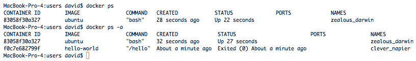
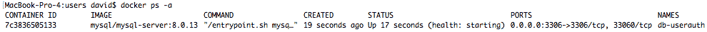
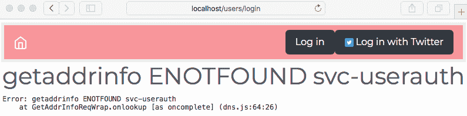
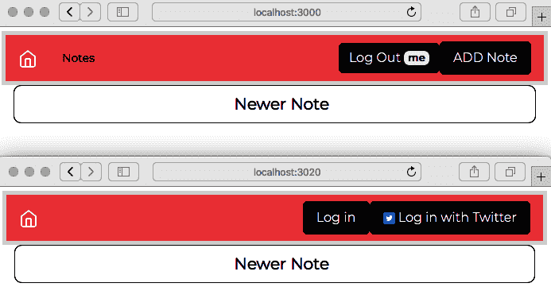

使用 Docker 部署 Node.js 微服务

现在我们已经体验了传统的 Linux 部署应用程序的方式，让我们转向 Docker，这是一种流行的新的应用程序部署方式。

Docker（http://docker.com）是软件行业中一个很酷的新工具。它被描述为*面向开发人员和系统管理员的分布式应用程序的开放平台*。它是围绕 Linux 容器化技术设计的，并专注于描述在任何 Linux 变体上的软件配置。

Docker 容器是 Docker 镜像的运行实例。Docker 镜像是一个包含特定 Linux 操作系统、系统配置和应用程序配置的捆绑包。Docker 镜像使用 Dockerfile 来描述，这是一个相当简单的编写脚本，描述如何构建 Docker 镜像。Dockerfile 首先通过指定一个基础镜像来开始构建，这意味着我们从其他镜像派生 Docker 镜像。Dockerfile 的其余部分描述了要添加到镜像中的文件，要运行的命令以构建或配置镜像，要公开的网络端口，要在镜像中挂载的目录等等。

Docker 镜像存储在 Docker 注册服务器上，每个镜像存储在自己的存储库中。最大的注册表是 Docker Hub，但也有第三方注册表可用，包括您可以安装在自己硬件上的注册服务器。Docker 镜像可以上传到存储库，并且可以从存储库部署到任何 Docker 服务器。

我们实例化一个 Docker 镜像来启动一个 Docker 容器。通常，启动容器非常快速，而且通常情况下，容器会在短时间内实例化，然后在不再需要时被丢弃。

运行的容器感觉像是在虚拟机上运行的虚拟服务器。然而，Docker 容器化与诸如 VirtualBox 或 Multipass 之类的虚拟机系统非常不同。容器不是完整计算机的虚拟化。相反，它是一个极其轻量级的外壳，创建了已安装操作系统的外观。例如，容器内运行的进程实际上是在主机操作系统上运行的，使用某些 Linux 技术（cgroups、内核命名空间等）创建了运行特定 Linux 变体的幻觉。您的主机操作系统可以是 Ubuntu，容器操作系统可以是 Fedora 或 OpenSUSE，甚至是 Windows；Docker 使所有这些都能运行。

虽然 Docker 主要针对 x86 版本的 Linux，但它也适用于几种基于 ARM 的操作系统，以及其他处理器。甚至可以在单板计算机上运行 Docker，比如树莓派，用于面向硬件的物联网（IoT）项目。

Docker 生态系统包含许多工具，它们的数量正在迅速增加。对于我们的目的，我们将专注于以下两个工具：

+   **Docker 引擎**：这是协调一切的核心执行系统。它在 Linux 主机系统上运行，公开一个基于网络的 API，客户端应用程序使用它来进行 Docker 请求，比如构建、部署和运行容器。

+   **Docker Compose**：这有助于您在一个文件中定义一个多容器应用程序及其所有定义的依赖关系。

还有其他与 Docker 密切相关的工具，比如 Kubernetes，但一切都始于构建一个容器来容纳您的应用程序。通过学习 Docker，我们学会了如何将应用程序容器化，这是我们可以在 Docker 和 Kubernetes 中使用的技能。

学习如何使用 Docker 是学习其他流行系统的入门，比如 Kubernetes 或 AWS ECS。这两个是用于在云托管基础设施上大规模管理容器部署的流行编排系统。通常，容器是 Docker 容器，但它们是由其他系统部署和管理的，无论是 Kubernetes、ECS 还是 Mesos。这使得学习如何使用 Docker 成为学习这些其他系统的绝佳起点。

在本章中，我们将涵盖以下主题：

+   在我们的笔记本电脑上安装 Docker

+   开发我们自己的 Docker 容器并使用第三方容器

+   在 Docker 中设置用户认证服务及其数据库

+   在 Docker 中设置 Notes 服务及其数据库

+   在 Docker 中部署 MySQL 实例，并为 Docker 中的应用程序提供数据持久性，例如数据库

+   使用 Docker Compose 描述完整应用程序的 Docker 部署

+   在 Docker 基础设施中扩展容器实例并使用 Redis 来缓解扩展问题

第一项任务是复制上一章的源代码。建议您创建一个新目录`chap11`，作为`chap10`目录的兄弟目录，并将`chap10`中的所有内容复制到`chap11`中。

在本章结束时，您将对使用 Docker、创建 Docker 容器以及使用 Docker Compose 管理 Notes 应用程序所需的服务有扎实的基础。

借助 Docker，我们将在笔记本电脑上设计第十章中显示的系统，*将 Node.js 应用程序部署到 Linux 服务器*。这一章，以及第十二章，*使用 Terraform 在 AWS EC2 上部署 Docker Swarm*，形成了一个覆盖 Node.js 三种部署风格的弧线。

# 第十五章：在您的笔记本电脑或计算机上设置 Docker

学习如何在笔记本电脑上安装 Docker 的最佳地方是 Docker 文档。我们要找的是 Docker **Community Edition**（CE），这就是我们所需要的：

+   macOS 安装：[`docs.docker.com/docker-for-mac/install/`](https://docs.docker.com/docker-for-mac/install/)

+   Windows 安装：[`docs.docker.com/docker-for-windows/install/`](https://docs.docker.com/docker-for-windows/install/)

+   Ubuntu 安装：[`docs.docker.com/install/linux/docker-ce/ubuntu/`](https://docs.docker.com/install/linux/docker-ce/ubuntu/)

还有其他几种发行版的安装说明。一些有用的 Linux 后安装说明可在[`docs.docker.com/install/linux/linux-postinstall/`](https://docs.docker.com/install/linux/linux-postinstall/)找到。

Docker 在 Linux 上本地运行，安装只是 Docker 守护程序和命令行工具。要在 macOS 或 Windows 上运行 Docker，您需要安装 Docker for Windows 或 Docker for Mac 应用程序。这些应用程序在轻量级虚拟机中管理一个虚拟 Linux 环境，在其中运行着一个在 Linux 上运行的 Docker Engine 实例。在过去（几年前），我们不得不手工设置这个环境。必须感谢 Docker 团队，他们使得这一切像安装应用程序一样简单，所有复杂性都被隐藏起来。结果非常轻量级，Docker 容器可以在后台运行而几乎不会产生影响。

现在让我们学习如何在 Windows 或 macOS 机器上安装 Docker。

## 使用 Docker for Windows 或 macOS 安装和启动 Docker

Docker 团队使得在 Windows 或 macOS 上安装 Docker 变得非常简单。您只需下载安装程序，并像大多数其他应用程序一样运行安装程序。它会负责安装并为您提供一个应用程序图标，用于启动 Docker。在 Linux 上，安装稍微复杂一些，因此最好阅读并遵循官方说明。

在 Windows 或 macOS 上启动 Docker 非常简单，一旦您遵循了安装说明。您只需找到并双击应用程序图标。有可用的设置，使得 Docker 在每次启动笔记本电脑时自动启动。

在 Docker for Windows 和 Docker for Mac 上，CPU 必须支持**虚拟化**。Docker for Windows 和 Docker for Mac 中内置了一个超轻量级的 hypervisor，而这又需要 CPU 的虚拟化支持。

对于 Windows，这可能需要 BIOS 配置。有关更多信息，请参阅[`docs.docker.com/docker-for-windows/troubleshoot/#virtualization-must-be-enabled`](https://docs.docker.com/docker-for-windows/troubleshoot/#virtualization-must-be-enabled)。

对于 macOS，这需要 2010 年或之后的硬件，具有英特尔对**内存管理单元**（**MMU**）虚拟化的硬件支持，包括**扩展页表**（**EPTs**）和无限制模式。您可以通过运行`sysctl kern.hv_support`来检查此支持。还需要 macOS 10.11 或更高版本。

安装完软件后，让我们尝试并熟悉 Docker。

## 熟悉 Docker

完成设置后，我们可以使用本地 Docker 实例创建 Docker 容器，运行一些命令，并且通常学习如何使用它。

就像许多软件之旅一样，这一切都始于“Hello World”：

```

The `docker run` command downloads a Docker image, named on the command line, initializes a Docker container from that image, and then runs that container. In this case, the image, named `hello-world`, was not present on the local computer and had to be downloaded and initialized. Once that was done, the `hello-world` container was executed and it printed out these instructions.

The `docker run hello-world` command is a quick way to verify that Docker is installed correctly.

Let's follow the suggestion and start an Ubuntu container:

```

“无法找到镜像”这个短语意味着 Docker 尚未下载命名的镜像。因此，它不仅下载了 Ubuntu 镜像，还下载了它所依赖的镜像。任何 Docker 镜像都可以分层构建，这意味着我们总是根据基础镜像定义镜像。在这种情况下，我们看到 Ubuntu 镜像总共需要四层。

镜像由 SHA-256 哈希标识，并且有长格式标识符和短格式标识符。我们可以在此输出中看到长标识符和短标识符。

`docker run`命令下载图像，配置其执行，并执行图像。`-it`标志表示在终端中交互式运行图像。

在`docker run`命令行中，图像名称后面要执行的部分作为命令选项传递到容器中以执行。在这种情况下，命令选项表示要运行`bash`，这是默认的命令 shell。事实上，我们得到了一个命令提示符，可以运行 Linux 命令。

您可以查询您的计算机，看到`hello-world`容器已经执行并完成，但它仍然存在：



`docker ps`命令列出正在运行的 Docker 容器。正如我们在这里看到的，`hello-world`容器不再运行，但 Ubuntu 容器在运行。使用`-a`开关，`docker ps`还会显示那些存在但当前未运行的容器。

最后一列是容器名称。由于在启动容器时我们没有指定容器名称，Docker 为我们创建了一个半随机的名称。

使用容器后，您可以使用以下命令进行清理：

```

The `clever_napier` name is the container name automatically generated by Docker. While the image name was `hello-world`, that was not the container name. Docker generated the container name so that you have a more user-friendly identifier for the containers than the hex ID shown in the `CONTAINER ID` column:

```

也可以指定十六进制 ID。但是，相对于十六进制 ID，为容器指定一个名称当然更加用户友好。在创建容器时，可以轻松地指定任何您喜欢的容器名称。

我们已经在笔记本电脑或计算机上安装了 Docker，并尝试了一些简单的命令来熟悉 Docker。现在让我们开始一些工作。我们将首先在 Docker 容器中设置用户认证服务。

# 在 Docker 中设置用户认证服务

在我们的脑海中有这么多理论，现在是时候做一些实际的事情了。让我们首先设置用户认证服务。我们将称之为 AuthNet，并且它包括一个用于存储用户数据库的 MySQL 实例，认证服务器和一个私有子网来连接它们。

最好让每个容器专注于提供一个服务。每个容器提供一个服务是一个有用的架构决策，因为我们可以专注于为特定目的优化每个容器。另一个理由与扩展有关，因为每个服务有不同的要求来满足其提供的流量。在我们的情况下，根据流量负载，我们可能需要一个单独的 MySQL 实例和 10 个用户认证实例。

Docker Hub（[`hub.docker.com`](https://hub.docker.com)）上有大量预定义的 Docker 镜像库。最好重用其中一个镜像作为构建我们所需服务的起点。

Docker 环境不仅让我们定义和实例化 Docker 容器，还可以定义容器之间的网络连接。这就是我们之前所说的*私有子网*。通过 Docker，我们不仅可以管理容器，还可以配置子网、数据存储服务等等。

在接下来的几节中，我们将仔细地将用户认证服务基础架构 docker 化。我们将学习如何为 Docker 设置一个 MySQL 容器，并在 Docker 中启动一个 Node.js 服务。

让我们首先学习如何在 Docker 中启动一个 MySQL 容器。

## 在 Docker 中启动一个 MySQL 容器

在公开可用的 Docker 镜像中，有超过 11,000 个适用于 MySQL 的镜像。幸运的是，MySQL 团队提供的`mysql/mysql-server`镜像易于使用和配置，所以让我们使用它。

可以指定 Docker 镜像名称，以及通常是软件版本号的*标签*。在这种情况下，我们将使用`mysql/mysql-server:8.0`，其中`mysql/mysql-server`是镜像存储库 URL，`mysql-server`是镜像名称，`8.0`是标签。截至撰写本文时，MySQL 8.x 版本是当前版本。与许多项目一样，MySQL 项目使用版本号标记 Docker 镜像。

按照以下方式下载镜像：

```

The `docker pull` command retrieves an image from a Docker repository and is conceptually similar to the `git pull` command, which retrieves changes from a `git` repository.

This downloaded four image layers in total because this image is built on top of three other images. We'll see later how that works when we learn how to build a Dockerfile. 

We can query which images are stored on our laptop with the following command:

```

目前有两个可用的镜像——我们刚刚下载的`mysql-server`镜像和之前运行的`hello-world`镜像。

我们可以使用以下命令删除不需要的镜像：

```

Notice that the actual `delete` operation works with the SHA256 image identifier.

A container can be launched with the image, as follows:

```

`docker run`命令接受一个镜像名称，以及各种参数，并将其作为运行中的容器启动。

我们在前台启动了这项服务，当 MySQL 初始化其容器时，会有大量的输出。由于`--name`选项，容器的名称是`mysql`。通过环境变量，我们告诉容器初始化`root`密码。

既然我们有一个运行中的服务器，让我们使用 MySQL CLI 来确保它实际上正在运行。在另一个窗口中，我们可以在容器内运行 MySQL 客户端，如下所示：

```

The **`docker exec`** command lets you run programs inside the container. The `-it` option says the command is run interactively on an assigned terminal. In this case, we used the `mysql` command to run the MySQL client so that we could interact with the database. Substitute `bash` for `mysql`, and you will land in an interactive `bash` command shell.

This `mysql` command instance is running inside the container. The container is configured by default to not expose any external ports, and it has a default `my.cnf` file. 

Docker containers are meant to be ephemeral, created and destroyed as needed, while databases are meant to be permanent, with lifetimes sometimes measured in decades. A very important discussion on this point and how it applies to database containers is presented in the next section.

It is cool that we can easily install and launch a MySQL instance. However, there are several considerations to be made:

*   Access to the database from other software, specifically from another container
*   Storing the database files outside the container for a longer lifespan
*   Custom configuration, because database admins love to tweak the settings
*   We need a path to connect the MySQL container to the AuthNet network that we'll be creating

Before proceeding, let's clean up. In a terminal window, type the following:

```

这关闭并清理了我们创建的容器。重申之前提到的观点，容器中的数据库已经消失了。如果那个数据库包含重要信息，你刚刚丢失了它，没有机会恢复数据。

在继续之前，让我们讨论一下这对我们服务设计的影响。

## Docker 容器的短暂性

Docker 容器被设计为易于创建和销毁。在试验过程中，我们已经创建并销毁了三个容器。

在过去（几年前），设置数据库需要提供特别配置的硬件，雇佣具有特殊技能的数据库管理员，并仔细地为预期的工作负载进行优化。在短短几段文字中，我们已经实例化和销毁了三个数据库实例。这是多么崭新的世界啊！

在数据库和 Docker 容器方面，数据库相对是永恒的，而 Docker 容器是短暂的。数据库预计会持续数年，甚至数十年。在计算机年代，那几乎是不朽的。相比之下，一个被使用后立即丢弃的 Docker 容器只是与数据库预期寿命相比的短暂时间。

这些容器可以快速创建和销毁，这给了我们很大的灵活性。例如，编排系统，如 Kubernetes 或 AWS ECS，可以自动增加或减少容器的数量以匹配流量，重新启动崩溃的容器等等。

但是数据库容器中的数据存放在哪里？在前一节中运行的命令中，数据库数据目录位于容器内部。当容器被销毁时，数据目录也被销毁，我们数据库中的任何数据都被永久删除。显然，这与我们在数据库中存储的数据的生命周期要求不兼容。

幸运的是，Docker 允许我们将各种大容量存储服务附加到 Docker 容器。容器本身可能是短暂的，但我们可以将永久数据附加到短暂的容器。只需配置数据库容器，使数据目录位于正确的存储系统上。

足够的理论，现在让我们做点什么。具体来说，让我们为身份验证服务创建基础架构。

## 定义身份验证服务的 Docker 架构

Docker 支持在容器之间创建虚拟桥接网络。请记住，Docker 容器具有已安装的 Linux 操作系统的许多功能。每个容器都可以有自己的 IP 地址和公开的端口。Docker 支持创建类似虚拟以太网段的东西，称为**桥接网络**。这些网络仅存在于主机计算机中，并且默认情况下，外部计算机无法访问它们。

因此，Docker 桥接网络的访问受到严格限制。连接到桥接网络的任何 Docker 容器都可以与连接到该网络的其他容器进行通信，并且默认情况下，该网络不允许外部流量。容器通过主机名找到彼此，并且 Docker 包含一个嵌入式 DNS 服务器来设置所需的主机名。该 DNS 服务器配置为不需要域名中的点，这意味着每个容器的 DNS/主机名只是容器名称。我们将在后面发现，容器的主机名实际上是`container-name.network-name`，并且 DNS 配置允许您跳过使用`network-name`部分的主机名。使用主机名来标识容器的策略是 Docker 对服务发现的实现。

在`users`和`notes`目录的同级目录中创建名为`authnet`的目录。我们将在该目录中处理`authnet`。

在该目录中创建一个名为`package.json`的文件，我们将仅使用它来记录管理 AuthNet 的命令：

```

We'll be adding more scripts to this file. The `build-authnet` command builds a virtual network using the `bridge` driver, as we just discussed. The name for this network is `authnet`.

Having created `authnet`, we can attach containers to it so that the containers can communicate with one another.

Our goal for the Notes application stack is to use private networking between containers to implement a security firewall around the containers. The containers will be able to communicate with one another, but the private network is not reachable by any other software and is, therefore, more or less safe from intrusion.

Type the following command:

```

这将创建一个 Docker 桥接网络。长编码字符串是此网络的标识符。`docker network ls`命令列出当前 Docker 系统中的现有网络。除了短十六进制 ID 外，网络还具有我们指定的名称。

使用以下命令查看有关网络的详细信息：

```

At the moment, this won't show any containers attached to `authnet`. The output shows the network name, the IP range of this network, the default gateway, and other useful network configuration information. Since nothing is connected to the network, let's get started with building the required containers:

```

此命令允许我们从 Docker 系统中删除网络。但是，由于我们需要此网络，重新运行命令以重新创建它。

我们已经探讨了设置桥接网络，因此我们的下一步是用数据库服务器填充它。

## 为身份验证服务创建 MySQL 容器

现在我们有了一个网络，我们可以开始将容器连接到该网络。除了将 MySQL 容器连接到私有网络外，我们还将能够控制与数据库一起使用的用户名和密码，并且还将为其提供外部存储。这将纠正我们之前提到的问题。

要创建容器，可以运行以下命令：

```

This does several useful things all at once. It initializes an empty database configured with the named users and passwords, it mounts a host directory as the MySQL data directory, it attaches the new container to `authnet`, and it exposes the MySQL port to connections from outside the container.

The `docker run` command is only run the first time the container is started. It combines building the container by running it for the first time. With the MySQL container, its first run is when the database is initialized. The options that are passed to this `docker run` command are meant to tailor the database initialization.

The `--env` option sets environment variables inside the container. The scripts driving the MySQL container look to these environment variables to determine the user IDs, passwords, and database to create.

In this case, we configured a password for the `root` user, and we configured a second user—`userauth`—with a matching password and database name.

There are many more environment variables available.

The official MySQL Docker documentation provides more information on configuring a MySQL Docker container ([`dev.mysql.com/doc/refman/8.0/en/docker-mysql-more-topics.html`](https://dev.mysql.com/doc/refman/8.0/en/docker-mysql-more-topics.html)).

The MySQL server recognizes an additional set of environment variables ([`dev.mysql.com/doc/refman/8.0/en/environment-variables.html`](https://dev.mysql.com/doc/refman/8.0/en/environment-variables.html)).

The MySQL server recognizes a long list of configuration options that can be set on the command line or in the MySQL configuration file ([`dev.mysql.com/doc/refman/8.0/en/server-option-variable-reference.html`](https://dev.mysql.com/doc/refman/8.0/en/server-option-variable-reference.html)).

The `--network` option attaches the container to the `authnet` network.

The `-p` option exposes a TCP port from inside the container so that it is visible outside the container. By default, containers do not expose any TCP ports. This means we can be very selective about what to expose, limiting the attack surface for any miscreants seeking to gain illicit access to the container.

The `--mount` option is meant to replace the older `--volume` option. It is a powerful tool for attaching external data storage to a container. In this case, we are attaching a host directory, `userauth-data`, to the `/var/lib/mysql` directory inside the container. This ensures that the database is not inside the container, and that it will last beyond the lifetime of the container. For example, while creating this example, we deleted this container several times to fine-tune the command line, and it kept using the same data directory.

We should also mention that the `--mount` option requires the `src=` option be a full pathname to the file or directory that is mounted. We are using ``pwd`` to determine the full path to the file. However, this is, of course, specific to Unix-like OSes. If you are on Windows, the command should be run in PowerShell and you can use the `$PSScriptRoot` variable. Alternatively, you can hardcode an absolute pathname.

It is possible to inject a custom `my.cnf` file into the container by adding this option to the `docker run` command:

```

换句话说，Docker 不仅允许您挂载目录，还允许您挂载单个文件。

命令行遵循以下模式：

```

So far, we have talked about the options for the `docker run` command. Those options configure the characteristics of the container. Next on the command line is the image name—in this case, `mysql/mysql-server:8.0`. Any command-line tokens appearing after the image name are passed into the container. In this case, they are interpreted as arguments to the MySQL server, meaning we can configure this server using any of the extensive sets of command-line options it supports. While we can mount a `my.cnf` file in the container, it is possible to achieve most configuration settings this way.

The first of these options, `--bind_address`, tells the server to listen for connections from any IP address.

The second, `--socket=/tmp/mysql.sock`, serves two purposes. One is security, to ensure that the MySQL Unix domain socket is accessible only from inside the container. By default, the scripts inside the MySQL container put this socket in the `/var/lib/mysql` directory, and when we attach the data directory, the socket is suddenly visible from outside the container.

On Windows, if this socket is in `/var/lib/mysql`, when we attach a data directory to the container, that would put the socket in a Windows directory. Since Windows does not support Unix domain sockets, the MySQL container will mysteriously fail to start and give a misleadingly obtuse error message. The `--socket` option ensures that the socket is instead on a filesystem that supports Unix domain sockets, avoiding the possibility of this failure. 

When experimenting with different options, it is important to delete the mounted data directory each time you recreate the container to try a new setting. If the MySQL container sees a populated data directory, it skips over most of the container initialization scripts and will not run. A common mistake when trying different container MySQL configuration options is to rerun `docker run` without deleting the data directory. Since the MySQL initialization doesn't run, nothing will have changed and it won't be clear why the behavior isn't changing.

Therefore, to try a different set of MySQL options, execute the following command:

```

这将确保您每次都从新数据库开始，并确保容器初始化运行。

这也暗示了一个行政模式要遵循。每当您希望更新到较新的 MySQL 版本时，只需停止容器，保留数据目录。然后，删除容器，并使用新的`mysql/mysql-server`标签重新执行`docker run`命令。这将导致 Docker 使用不同的镜像重新创建容器，但使用相同的数据目录。使用这种技术，您可以通过拉取更新的镜像来更新 MySQL 版本。

一旦 MySQL 容器运行，输入以下命令：



这将显示当前容器状态。如果我们使用`docker ps -a`，我们会看到`PORTS`列显示`0.0.0.0:3306->3306/tcp, 33060/tcp`。这表示容器正在监听从任何地方（`0.0.0.0`）到端口`3306`的访问，这个流量将连接到容器内部的端口`3306`。此外，还有一个端口`33060`可用，但它没有暴露到容器外部。

尽管它配置为监听整个世界，但容器附加到`authnet`，限制了连接的来源。限制可以连接到数据库的进程的范围是一件好事。但是，由于我们使用了`-p`选项，数据库端口暴露给了主机，这并不像我们想要的那样安全。我们稍后会修复这个问题。

### 数据库容器中的安全性

一个要问的问题是是否像这样设置`root`密码是一个好主意。`root`用户对整个 MySQL 服务器有广泛的访问权限，而其他用户，如`userauth`，对给定数据库的访问权限有限。由于我们的目标之一是安全性，我们必须考虑这是否创建了一个安全或不安全的数据库容器。

我们可以使用以下命令以`root`用户身份登录：

```

This executes the MySQL CLI client inside the newly created container. There are a few commands we can run to check the status of the `root` and `userauth` user IDs. These include the following:

```

连接到 MySQL 服务器包括用户 ID、密码和连接的来源。这个连接可能来自同一台计算机内部，也可能来自另一台计算机的 TCP/IP 套接字。为了批准连接，服务器会在`mysql.user`表中查找与`user`、`host`（连接来源）和`password`字段匹配的行。用户名和密码是作为简单的字符串比较进行匹配的，但主机值是一个更复杂的比较。与 MySQL 服务器的本地连接将与主机值为`localhost`的行匹配。

对于远程连接，MySQL 会将连接的 IP 地址和域名与`host`列中的条目进行比较。`host`列可以包含 IP 地址、主机名或通配符模式。SQL 的通配符字符是`%`。单个`%`字符匹配任何连接源，而`172.%`的模式匹配第一个 IPv4 八位是`172`的任何 IP 地址，或者`172.20.%.%`匹配`172.20.x.x`范围内的任何 IP 地址。

因此，由于`userauth`的唯一行指定了`%`的主机值，我们可以从任何地方使用`userauth`。相比之下，`root`用户只能在`localhost`连接中使用。

下一个任务是检查`userauth`和`root`用户 ID 的访问权限：

```

This says that the `userauth` user has full access to the `userauth` database. The `root` user, on the other hand, has full access to every database and has so many permissions that the output of that does not fit here. Fortunately, the `root` user is only allowed to connect from `localhost`.

To verify this, try connecting from different locations using these commands:

```

我们展示了访问数据库的四种模式，表明`userauth` ID 确实可以从同一容器或远程容器访问，而`root` ID 只能从本地容器使用。

使用`docker run --it --rm ... container-name ..`启动一个容器，运行与容器相关的命令，然后在完成后退出容器并自动删除它。

因此，通过这两个命令，我们创建了一个单独的`mysql/mysql-server:8.0`容器，连接到`authnet`，以运行`mysql`CLI 程序。`mysql`参数是使用给定的用户名（`root`或`userauth`）连接到名为`db-userauth`的主机上的 MySQL 服务器。这演示了从一个独立的连接器连接到数据库，并显示我们可以使用`userauth`用户远程连接，但不能使用`root`用户。

然后，最终的访问实验涉及省略`--network`选项：

```

This demonstrates that if the container is not attached to `authnet`, it cannot access the MySQL server because the `db-userauth` hostname is not even known.

Where did the `db-userauth` hostname come from? We can find out by inspecting a few things:

```

换句话说，`authnet`网络具有`172.20.0.0/16`网络号，而`db-userauth`容器被分配了`172.20.0.2`IP 地址。这种细节很少重要，但在第一次仔细检查设置时是有用的，这样我们就能理解我们正在处理的内容。

存在一个严重的安全问题，违反了我们的设计。即，数据库端口对主机是可见的，因此，任何可以访问主机的人都可以访问数据库。这是因为我们在错误的认为下使用了`-p 3306:3306`，以为这是必需的，这样`svc-userauth`才能在下一节中访问数据库。我们将通过删除该选项来解决这个问题。

现在我们已经为认证服务设置了数据库实例，让我们看看如何将其 Docker 化。

## Docker 化认证服务

*Dockerize*一词意味着为软件创建一个 Docker 镜像。然后可以与他人共享 Docker 镜像，或部署到服务器上。在我们的情况下，目标是为用户认证服务创建一个 Docker 镜像。它必须连接到`authnet`，以便可以访问我们刚刚在`db-userauth`容器中配置的数据库服务器。

我们将命名这个新容器为`svc-userauth`，以表示这是用户认证 REST 服务，而`db-userauth`容器是数据库。

Docker 镜像是使用 Dockerfile 定义的，Dockerfile 是描述在服务器上安装应用程序的文件。它们记录了 Linux 操作系统的设置，安装的软件以及 Docker 镜像中所需的配置。这实际上是一个名为`Dockerfile`的文件，其中包含 Dockerfile 命令。Dockerfile 命令用于描述镜像的构建方式。

请参考[`docs.docker.com/engine/reference/builder/`](https://docs.docker.com/engine/reference/builder/)获取文档。

### 创建认证服务 Dockerfile

在`users`目录中，创建一个名为`Dockerfile`的文件，其中包含以下内容：

```

The `FROM` command specifies a pre-existing image, called the base image, from which to derive a given image. Frequently, you define a Docker image by starting from an existing image. In this case, we're using the official Node.js Docker image ([`hub.docker.com/_/node/`](https://hub.docker.com/_/node/)), which, in turn, is derived from `debian`.

Because the base image, `node`, is derived from the `debian` image, the commands available are what are provided on a Debian OS. Therefore, we use `apt-get` to install more packages. 

The `RUN` commands are where we run the shell commands required to build the container. The first one installs required Debian packages, such as the `build-essential` package, which brings in compilers required to install native-code Node.js packages.

It's recommended that you always combine `apt-get update`, `apt-get upgrade`, and `apt-get install` in the same command line like this because of the Docker build cache. Docker saves each step of the build to avoid rerunning steps unnecessarily. When rebuilding an image, Docker starts with the first changed step. Therefore, in the set of Debian packages to install changes, we want all three of those commands to run.

Combining them into a single command ensures that this will occur. For a complete discussion, refer to the documentation at [`docs.docker.com/develop/develop-images/dockerfile_best-practices/`](https://docs.docker.com/develop/develop-images/dockerfile_best-practices/).

The `ENV` commands define environment variables. In this case, we're using the same environment variables that were defined in the `package.json` script for launching the user authentication service.

Next, we have a sequence of lines to create the `/userauth` directory and to populate it with the source code of the user authentication service. The first line creates the `/userauth` directory. The `COPY` command, as its name implies, copies the files for the authentication service into that directory. The `WORKDIR` command changes the working directory to `/userauth`. This means that the last `RUN` command, `npm install`, is executed in `/userauth`, and therefore, it installs the packages described in `/userauth/package.json` in `/userauth/node_modules`.

There is a new `SEQUELIZE_CONNECT` configuration file mentioned: `sequelize-docker-mysql.yaml`. This will describe the Sequelize configuration required to connect to the database in the `db-userauth` container.

Create a new file named `users/sequelize-docker-mysql.yaml` containing the following:

```

不同之处在于，我们使用`db-userauth`而不是`localhost`作为数据库主机。之前，我们探索了`db-userauth`容器，并确定这是容器的主机名。通过在这个文件中使用`db-userauth`，认证服务将使用容器中的数据库。

`EXPOSE`命令通知 Docker 容器监听指定的 TCP 端口。这不会将端口暴露到容器之外。`-p`标志是将给定端口暴露到容器之外的方式。

最后，`CMD`命令记录了在执行容器时启动的过程。`RUN`命令在构建容器时执行，而`CMD`表示容器启动时执行的内容。

我们本可以在容器中安装`PM2`，然后使用`PM2`命令来启动服务。然而，Docker 能够实现相同的功能，因为它自动支持在服务进程死掉时重新启动容器。

### 构建和运行认证服务 Docker 容器

现在我们已经在 Dockerfile 中定义了镜像，让我们来构建它。

在`users/package.json`中，将以下行添加到`scripts`部分：

```

As has been our habit, this is an administrative task that we can record in `package.json`, making it easier to automate this task.

We can build the authentication service as follows:

```

`docker build`命令从 Dockerfile 构建一个镜像。请注意，构建一步一步进行，每个步骤都与 Dockerfile 中的命令完全对应。

每个步骤都存储在缓存中，因此不必重新运行。在后续构建中，执行的唯一步骤是更改的步骤和所有后续步骤。

在`authnet/package.json`中，我们需要相当多的脚本来管理用户认证服务：

```

This is the set of commands that were found to be useful to manage building the images, starting the containers, and stopping the containers.

Look carefully and you will see that we've added `--detach` to the `docker run` commands. So far, we've used `docker run` without that option, and the container remained in the foreground. While this was useful to see the logging output, it's not so useful for deployment. With the `--detach` option, the container becomes a background task.

On Windows, for the -`-mount` option, we need to change the `src= parameter` (as discussed earlier) to use a Windows-style hard-coded path. That means it should read:

```

此选项需要绝对路径名，并且以这种方式指定路径在 Windows 上有效。

另一个需要注意的是`-p 3306:3306`选项的缺失。有两个原因确定这是不必要的。首先，该选项将数据库暴露给主机，`db-userauth`的安全模型要求不这样，因此删除该选项可以获得所需的安全性。其次，`svc-userauth`在删除此选项后仍然能够访问`db-userauth`数据库。

有了这些命令，我们现在可以输入以下内容来构建，然后运行容器：

```

These commands build the pieces required for the user authentication service. As a side effect, the containers are automatically executed and will launch as background tasks.

Once it is running, you can test it using the `cli.mjs` script as before. You can shell into the `svc-userauth` container and run `cli.mjs` there; or, since the port is visible to the host computer, you can run it from outside the container.

Afterward, we can manage the whole service as follows:

```

这将停止并启动构成用户认证服务的两个容器。

我们已经创建了托管用户认证服务的基础设施，以及一系列脚本来管理该服务。我们的下一步是探索我们创建的内容，并了解 Docker 为我们创建的基础设施的一些情况。

## 探索 AuthNet

请记住，AuthNet 是认证服务的连接介质。为了了解这个网络是否提供了我们正在寻找的安全性增益，让我们探索一下我们刚刚创建的内容：

```

This prints out a large JSON object describing the network, along with its attached containers, which we've looked at before. If everything went well, we will see that there are now two containers attached to `authnet` where there'd previously have just been one.

Let's go into the `svc-userauth` container and poke around:

```

`/userauth`目录位于容器内，包含使用`COPY`命令放置在容器中的文件，以及`node_modules`中安装的文件：

```

We can run the `cli.mjs` script to test and administer the service. To get these database entries set up, use the `add` command with the appropriate options:

```

进程列表是值得研究的。进程`PID 1`是 Dockerfile 中的`node ./user-server.mjs`命令。我们在`CMD`行中使用的格式确保`node`进程最终成为进程 1。这很重要，以便正确处理进程信号，从而允许 Docker 正确管理服务进程。以下博客文章的末尾有关于这个问题的很好讨论：

[`www.docker.com/blog/keep-nodejs-rockin-in-docker/`](https://www.docker.com/blog/keep-nodejs-rockin-in-docker/)

`ping`命令证明两个容器作为与容器名称匹配的主机名可用：

```

From outside the containers, on the host system, we cannot ping the containers. That's because they are attached to `authnet` and are not reachable.

We have successfully Dockerized the user authentication service in two containers—`db-userauth` and `svc-userauth`. We've poked around the insides of a running container and found some interesting things. However, our users need the fantastic Notes application to be running, and we can't afford to rest on our laurels.

Since this was our first time setting up a Docker service, we went through a lot of details. We started by launching a MySQL database container, and what is required to ensure that the data directory is persistent. We then set up a Dockerfile for the authentication service and learned how to connect containers to a common Docker network and how containers can communicate with each other over the network. We also studied the security benefits of this network infrastructure, since we can easily wall off the service and its database from intrusion.

Let's now move on and Dockerize the Notes application, making sure that it is connected to the authentication server.

# Creating FrontNet for the Notes application

We have the back half of our system set up in Docker containers, as well as the private bridge network to connect the backend containers. It's now time to do the same for the front half of the system: the Notes application (`svc-notes`) and its associated database (`db-notes`). Fortunately, the tasks required to build FrontNet are more or less the same as what we did for AuthNet.

The first task is to set up another private bridge network, `frontnet`. Like `authnet`, this will be the infrastructure for the front half of the Notes application stack.

Create a directory, `frontnet`, and in that directory, create a `package.json` file that will contain the scripts to manage `frontnet`: 

```

与`authnet`一样，这只是起点，因为我们还有几个脚本要添加。

让我们继续创建`frontnet`桥接网络：

```

We have two virtual bridge networks. Over the next few sections, we'll set up the database and Notes application containers, connect them to `frontnet`, and then see how to manage everything.

## MySQL container for the Notes application

As with `authnet`, the task is to construct a MySQL server container using the `mysql/mysql-server` image. We must configure the server to be compatible with the `SEQUELIZE_CONNECT` file that we'll use in the `svc-notes` container. For that purpose, we'll use a database named `notes` and a `notes` user ID.

For that purpose, add the following to the `scripts` section of the `package.json` file:

```

这与`db-userauth`几乎相同，只是将`notes`替换为`userauth`。请记住，在 Windows 上，`-mount`选项需要 Windows 风格的绝对路径名。

现在让我们运行脚本： 

```

This database will be available in the `db-notes` domain name on `frontnet`. Because it's attached to `frontnet`, it won't be reachable by containers connected to `authnet`. To verify this, run the following command:

```

由于`db-notes`位于不同的网络段，我们已经实现了隔离。但我们可以注意到一些有趣的事情。`ping`命令告诉我们，`db-userauth`的完整域名是`db-userauth.authnet`。因此，可以推断`db-notes`也被称为`db-notes.frontnet`。但无论如何，我们无法从`authnet`上的容器访问`frontnet`上的容器，因此我们已经实现了所需的隔离。

我们能够更快地移动以构建 FrontNet，因为它非常类似于 AuthNet。我们只需要做以前做过的事情，并微调名称。

在本节中，我们创建了一个数据库容器。在下一节中，我们将为 Notes 应用程序创建 Dockerfile。

## Docker 化 Notes 应用程序

我们的下一步当然是将 Notes 应用程序 Docker 化。这始于创建一个 Dockerfile，然后添加另一个 Sequelize 配置文件，最后通过向`frontnet/package.json`文件添加更多脚本来完成。

在`notes`目录中，创建一个名为`Dockerfile`的文件，其中包含以下内容：

```

This is similar to the Dockerfile we used for the authentication service. We're using the environment variables from `notes/package.json`, plus a new one: `NOTES_SESSION_DIR`.

The most obvious change is the number of `COPY` commands. The Notes application is a lot more involved, given the number of sub-directories full of files that must be installed. We start by creating the top-level directories of the Notes application deployment tree. Then, one by one, we copy each sub-directory into its corresponding sub-directory in the container filesystem.

In a `COPY` command, the trailing slash on the destination directory is important. Why? Because the Docker documentation says that the trailing slash is important, that's why.

The big question is *why use multiple *`COPY`* commands like this*? This would have been incredibly simple:

```

然而，多个`COPY`命令让我们可以精确控制复制的内容。避免复制`node_modules`目录是最重要的。不仅是主机上的`node_modules`文件很大，如果复制到容器中会使容器膨胀，而且它是为主机操作系统而不是容器操作系统设置的。`node_modules`目录必须在容器内部构建，安装过程发生在容器的操作系统上。这个约束导致选择明确地将特定文件复制到目标位置。

我们还有一个新的`SEQUELIZE_CONNECT`文件。创建`models/sequelize-docker-mysql.yaml`，其中包含以下内容：

```

This will access a database server on the `db-notes` domain name using the named database, username, and password. 

Notice that the `USER_SERVICE_URL` variable no longer accesses the authentication service at `localhost`, but at `svc-userauth`. The `svc-userauth` domain name is currently only advertised by the DNS server on AuthNet, but the Notes service is on FrontNet. Therefore, this will cause a failure for us when we get to running the Notes application, and we'll have to make some connections so that the `svc-userauth` container can be accessed from `svc-notes`.

In Chapter 8*,* *Authenticating Users with a Microservice*, we discussed the need to protect the API keys supplied by Twitter. We could copy the `.env` file to the Dockerfile, but this may not be the best choice, and so we've left it out of the Dockerfile.

Unfortunately, this does not protect the Twitter credentials to the level required. The `.env` file is available as plaintext inside the container. Docker has a feature, Docker Secrets, that can be used to securely store data of this sort. Unfortunately, it is only available when using Swarm mode, which we are not doing at this time; but we will use this feature in Chapter 12, *Deploying a Docker Swarm to AWS EC2 Using Terraform*.

The value of `TWITTER_CALLBACK_HOST` needs to reflect where Notes is deployed. Right now, it is still on your laptop, but if it is deployed to a server, this variable will require the IP address or domain name of the server.

In `notes/package.json`, add the following `scripts` entry:

```

与身份验证服务器一样，这使我们能够为 Notes 应用程序服务构建容器镜像。

然后，在`frontnet/package.json`中添加这些脚本：

```

Now, we can build the container image:

```

这将创建容器镜像，然后启动容器。

注意，暴露的端口`3000`与`-p 80:3000`映射到正常的 HTTP 端口。由于我们准备在真实服务上部署，我们可以停止使用端口`3000`。

此时，我们可以将浏览器连接到`http://localhost`并开始使用 Notes 应用程序。但是，我们很快就会遇到一个问题：



用户体验团队将对这个丑陋的错误消息大声疾呼，所以把它放在您的待办事项中，生成一个更漂亮的错误屏幕。例如，一群鸟将鲸鱼从海洋中拉出是很受欢迎的。

这个错误意味着 Notes 无法访问名为`svc-userauth`的主机上的任何内容。该主机确实存在，因为容器正在运行，但它不在`frontnet`上，并且无法从`notes`容器中访问。相反，它在`authnet`上，目前无法被`svc-notes`访问：

```

We can reach `db-notes` from `svc-notes` but not `svc-userauth`. This is as expected since we have attached these containers to different networks.

If you inspect FrontNet and AuthNet, you'll see that the containers attached to each do not overlap:

```

在第十章中呈现的架构图中，*将 Node.js 应用程序部署到 Linux 服务器*，我们展示了`svc-notes`和`svc-userauth`容器之间的连接。这种连接是必需的，以便 Notes 可以对其用户进行身份验证。但是这种连接尚不存在。

Docker 要求您采取第二步将容器连接到第二个网络：

```

With no other change, the Notes application will now allow you to log in and start adding and editing notes. Furthermore, start a shell in `svc-notes` and you'll be able to ping both `svc-userauth` and `db-userauth`.

There is a glaring architecture question staring at us. Do we connect the `svc-userauth` service to `frontnet`, or do we connect the `svc-notes` service to `authnet`? We just connected `svc-notes` to `authnet`, but maybe that's not the best choice. To verify which network setup solves the problem, run the following commands:

```

第一次，我们将`svc-notes`连接到`authnet`，然后将其从`authnet`断开连接，然后将`svc-userauth`连接到`frontnet`。这意味着我们尝试了两种组合，并且如预期的那样，在这两种情况下，`svc-notes`和`svc-userauth`都能够通信。

这是一个安全专家的问题，因为考虑到任何入侵者可用的攻击向量。假设 Notes 存在安全漏洞，允许入侵者访问。我们如何限制通过该漏洞可达到的内容？

主要观察是通过将`svc-notes`连接到`authnet`，`svc-notes`不仅可以访问`svc-userauth`，还可以访问`db-userauth`。要查看这一点，请运行以下命令：

```

This sequence reconnects `svc-notes` to `authnet` and demonstrates the ability to access both the `svc-userauth` and `db-userauth` containers. Therefore, a successful invader could access the `db-userauth` database, a result we wanted to prevent. Our diagram in Chapter 10, *Deploying Node.js Applications to Linux Servers,* showed no such connection between `svc-notes` and `db-userauth`.

Given that our goal for using Docker was to limit the attack vectors, we have a clear distinction between the two container/network connection setups. Attaching `svc-userauth` to `frontnet` limits the number of containers that can access `db-userauth`. For an intruder to access the user information database, they must first break into `svc-notes`, and then break into `svc-userauth`; unless, that is, our amateur attempt at a security audit is flawed.

For this and a number of other reasons, we arrive at this final set of scripts for `frontnet/package.json`:

```

主要是添加一个命令`connect-userauth`，将`svc-userauth`连接到`frontnet`。这有助于我们记住如何加入容器的决定。我们还借此机会进行了一些重新组织。

在本节中，我们学到了很多关于 Docker 的知识——使用 Docker 镜像，从镜像创建 Docker 容器，并在考虑一些安全约束的情况下配置一组 Docker 容器。我们在本节中实现了我们最初的架构想法。我们有两个私有网络，容器连接到它们适当的网络。唯一暴露的 TCP 端口是 Notes 应用程序，可在端口`80`上看到。其他容器使用不可从容器外部访问的 TCP/IP 连接相互连接。

在继续下一部分之前，您可能希望关闭我们启动的服务。只需执行以下命令：

```

Because we've automated many things, it is this simple to administer the system. However, it is not as automated as we want it to be. To address that, let's learn how to make the Notes stack more easily deployable by using Docker Compose to describe the infrastructure.

# Managing multiple containers with Docker Compose

It is cool that we can create encapsulated instantiations of the software services that we've created. In theory, we can publish these images to Docker repositories, and then launch the containers on any server we want. For example, our task in Chapter 10, *Deploying Node.js Applications to Linux Servers*, would be greatly simplified with Docker. We could simply install Docker Engine on the Linux host and then deploy our containers on that server, and not have to deal with all those scripts and the PM2 application.

But we haven't properly automated the process. The promise was to use the Dockerized application for deployment on cloud services. In other words, we need to take all this learning and apply it to the task of simplifying deployment.

We've demonstrated that, with Docker, Notes can be built using four containers that have a high degree of isolation from each other and from the outside world. 

There is a glaring problem: our process in the previous section was partly manual, partly automated. We created scripts to launch each portion of the system, which is good practice. However, we did not automate the entire process to bring up Notes and the authentication services, nor is this solution scalable beyond one machine.

Let's start with the last issue first—scalability. Within the Docker ecosystem, several **Docker orchestrator** services are available. An orchestrator automatically deploys and manages Docker containers over a group of machines. Some examples of Docker orchestrators are Docker Swarm, Kubernetes, CoreOS Fleet, and Apache Mesos. These are powerful systems that can automatically increase/decrease resources as needed to move containers from one host to another, and more. We mention these systems for you to further study as your needs grow. In Chapter 12, *Deploying a Docker Swarm to AWS EC2 with Terraform*, we will build on the work we're about to do in order to deploy Notes in a Docker Swarm cluster that we'll build on AWS EC2 infrastructure.

Docker Compose ([`docs.docker.com/compose/overview/`](https://docs.docker.com/compose/overview/)) will solve the other problems we've identified. It lets us easily define and run several Docker containers together as a complete application. It uses a YAML file, `docker-compose.yml`, to describe the containers, their dependencies, the virtual networks, and the volumes. While we'll be using it to describe deployment on a single host machine, Docker Compose can be used for multi-machine deployments. Namely, Docker Swarm directly uses compose files to describe the services you launch in a swarm. In any case, learning about Docker Compose will give you a headstart on understanding the other systems.

Before proceeding, ensure that Docker Compose is installed. If you've installed Docker for Windows or Docker for Mac, everything that is required is installed. On Linux, you must install it separately by following the instructions in the links provided earlier.

## Docker Compose file for the Notes stack

We just talked about Docker orchestration services, but Docker Compose is not itself such a service. Instead, Docker Compose uses a specific YAML file structure to describe how to deploy Docker containers. With a Docker Compose file, we can describe one or more containers, networks, and volumes involved in launching a Docker-based service.

Let's start by creating a directory, `compose-local`, as a sibling to the `users` and `notes` directories. In that directory, create a file named `docker-compose.yml`:

```

这是整个 Notes 部署的描述。它在相当高的抽象级别上，大致相当于我们迄今为止使用的命令行工具中的选项。它相当简洁和自解释，正如我们将看到的，`docker-compose`命令使这些文件成为管理 Docker 服务的便利方式。

`version`行表示这是一个版本 3 的 Compose 文件。版本号由`docker-compose`命令检查，以便它可以正确解释其内容。完整的文档值得阅读，网址是[`docs.docker.com/compose/compose-file/`](https://docs.docker.com/compose/compose-file/)。

这里使用了三个主要部分：`services`、`volumes`和`networks`。`services`部分描述了正在使用的容器，`networks`部分描述了网络，`volumes`部分描述了卷。每个部分的内容都与我们之前创建的容器相匹配。我们已经处理过的配置都在这里，只是重新排列了一下。

有两个数据库容器——`db-userauth`和`db-notes`——以及两个服务容器——`svc-userauth`和`svc-notes`。服务容器是从`build`属性中指定的目录中的 Dockerfile 构建的。数据库容器是从 Docker Hub 下载的镜像实例化的。两者都直接对应于我们之前所做的，使用`docker run`命令创建数据库容器，并使用`docker build`生成服务的镜像。

`container_name`属性等同于`--name`属性，并为容器指定了一个用户友好的名称。我们必须指定容器名称，以便指定容器主机名以实现 Docker 风格的服务发现。

`networks`属性列出了此容器必须连接的网络，与`--net`参数完全相同。即使`docker`命令不支持多个`--net`选项，我们可以在 Compose 文件中列出多个网络。在这种情况下，网络是桥接网络。与之前一样，网络本身必须单独创建，在 Compose 文件中，这是在`networks`部分完成的。

`ports`属性声明要发布的端口及其与容器端口的映射。在`ports`声明中，有两个端口号，第一个是要发布的端口号，第二个是容器内部的端口号。这与之前使用的`-p`选项完全相同。

`depends_on`属性允许我们控制启动顺序。依赖于另一个容器的容器将等待直到被依赖的容器正在运行。

`volumes`属性描述了容器目录到`host`目录的映射。在这种情况下，我们定义了两个卷名称——`db-userauth-data`和`db-notes-data`——然后将它们用于卷映射。但是，当我们部署到 AWS EC2 上的 Docker Swarm 时，我们需要改变这个实现方式。

请注意，我们没有为卷定义主机目录。Docker 会为我们分配一个目录，我们可以使用`docker volume inspect`命令了解这个目录。

`restart`属性控制容器死亡时或者何时发生的情况。当容器启动时，它运行`CMD`指令中指定的程序，当该程序退出时，容器也退出。但是，如果该程序是要永远运行的，Docker 不应该知道它应该重新启动该进程吗？我们可以使用后台进程监视器，如 Supervisord 或 PM2。但是，Docker 的`restart`选项会处理这个问题。

`restart`属性可以取以下四个值之一：

+   `no`: 不重新启动。

+   `on-failure:count`: 最多重新启动*N*次。

+   `always`: 总是重新启动。

+   `unless-stopped`: 除非明确停止，否则启动容器。

在本节中，我们学习了如何通过创建描述 Notes 应用程序堆栈的文件来构建 Docker Compose 文件。有了这个，让我们看看如何使用这个工具来启动容器。

## 使用 Docker Compose 构建和运行 Notes 应用程序

使用 Docker Compose CLI 工具，我们可以管理任何可以在`docker-compose.yml`文件中描述的 Docker 容器集。我们可以构建容器，启动和关闭它们，查看日志等。在 Windows 上，我们可以无需更改地运行本节中的命令。

我们的第一个任务是通过运行以下命令来创建一个干净的状态：

```

We first needed to stop and delete any existing containers left over from our previous work. We can also use the scripts in the `frontnet` and `authnet` directories to do this. `docker-compose.yml` used the same container names, so we need the ability to launch new containers with those names.

To get started, use this command:

```

这将构建`docker-compose.yml`中列出的镜像。请注意，我们最终得到的镜像名称都以`compose-local`开头，这是包含该文件的目录的名称。因为这相当于在每个目录中运行`docker build`，它只构建镜像。

构建了容器之后，我们可以使用`docker-compose up`或`docker-compose start`一次性启动它们所有：

```

We can use `docker-compose stop` to shut down the containers. With `docker-compose start`, the containers run in the background.

We can also run `docker-compose up` to get a different experience:

```

如果需要，`docker-compose up`将首先构建容器。此外，它将保持所有容器在前台运行，以便我们可以查看日志。它将所有容器的日志输出合并在一起，每行开头显示容器名称。对于像 Notes 这样的多容器系统，这非常有帮助。

我们可以使用此命令检查状态：

```

This is related to running `docker ps`, but the presentation is a little different and more compact.

In `docker-compose.yml`, we insert the following declaration for `svc-userauth`:

```

这意味着`svc-userauth`的 REST 服务端口已经发布。确实，在状态输出中，我们看到端口已经发布。这违反了我们的安全设计，但它确实让我们可以从笔记本电脑上使用`users/cli.mjs`运行测试。也就是说，我们可以像以前那样向数据库添加用户。

只要它保持在我们的笔记本电脑上，这种安全违规是可以接受的。`compose-local`目录的命名是专门用于在我们的笔记本电脑上与 Docker Compose 一起使用的。

或者，我们可以像以前一样在`svc-userauth`容器内运行命令：

```

We started the Docker containers using `docker-compose`, and we can use the `docker-compose` command to interact with the containers. In this case, we demonstrated using both the `docker-compose` and `docker` commands to execute a command inside one of the containers. While there are slight differences in the command syntax, it's the same interaction with the same results.

Another test is to go into the containers and explore:

```

从那里，我们可以尝试 ping 每个容器，以查看哪些容器可以被访问。这将作为一个简单的安全审计，以确保我们创建的内容符合我们期望的安全模型。

在执行此操作时，我们发现`svc-userauth`可以 ping 通每个容器，包括`db-notes`。这违反了安全计划，必须更改。

幸运的是，这很容易解决。只需通过更改配置，我们可以在`docker-compose.yml`中添加一个名为`svcnet`的新网络：

```

`svc-userauth` is no longer connected to `frontnet`, which is how we could ping `db-notes` from `svc-userauth`. Instead, `svc-userauth` and `svc-notes` are both connected to a new network, `svcnet`, which is meant to connect the service containers. Therefore, both service containers have exactly the required access to match the goals outlined at the beginning.

That's an advantage of Docker Compose. We can quickly reconfigure the system without rewriting anything other than the `docker-compose.yml` configuration file. Furthermore, the new configuration is instantly reflected in a file that can be committed to our source repository.

When you're done testing the system, simply type *CTRL* +* C* in the terminal:

```

如图所示，这将停止整组容器。偶尔，它会退出用户到 shell，并且容器仍然在运行。在这种情况下，用户将不得不使用其他方法来关闭容器：

```

The `docker-compose` commands—`start`, `stop`*,* and `restart`—all serve as ways to manage the containers as background tasks. The default mode for the `docker-compose up` command is, as we've seen, to start the containers in the foreground. However, we can also run `docker-compose up` with the `-d` option, which says to detach the containers from the terminal to run in the background.

We're getting closer to our end goal. In this section, we learned how to take the Docker containers we've designed and create a system that can be easily brought up and down as a unit by running the `docker-compose` command.

While preparing to deploy this to Docker Swarm on AWS EC2, a horizontal scaling issue was found, which we can fix on our laptop. It is fairly easy with Docker Compose files to test multiple `svc-notes` instances to see whether we can scale Notes for higher traffic loads. Let's take a look at that before deploying to the swarm.

# Using Redis for scaling the Notes application stack

In the previous section, we learned how to use Docker Compose to manage the Notes application stack. Looking ahead, we can see the potential need to use multiple instances of the Notes container when we deploy to Docker Swarm on AWS EC2\. In this section, we will make a small modification to the Docker Compose file for an ad hoc test with multiple Notes containers. This test will show us a couple of problems. Among the available solutions are two packages that fix both problems by installing a Redis instance.

A common tactic for handling high traffic loads is to deploy multiple service instances as needed. This is called horizontal scaling, where we deploy multiple instances of a service to multiple servers. What we'll do in this section is learn a little about horizontal scaling in Docker by starting two Notes instances to see how it behaves.

As it currently exists, Notes stores some data—the session data—on the local disk space. As orchestrators such as Docker Swarm, ECS, and Kubernetes scale containers up and down, containers are constantly created and destroyed or moved from one host to another. This is done in the name of handling the traffic while optimizing the load on the available servers. In this case, whatever active data we're storing on a local disk will be lost. Losing the session data means users will be randomly logged out. The users will be rightfully upset and will then send us support requests asking what's wrong and whether we have even tested this thing!

In this section, we will learn that Notes does not behave well when we have multiple instances of `svc-notes`. To address this problem, we will add a Redis container to the Docker Compose setup and configure Notes to use Redis to solve the two problems that we have discovered. This will ensure that the session data is shared between multiple Notes instances via a Redis server.

Let's get started by performing a little ad hoc testing to better understand the problem.

## Testing session management with multiple Notes service instances

We can easily verify whether Notes properly handles session data if there are multiple `svc-notes` instances. With a small modification to `compose-local/docker-compose.yml`, we can start two `svc-notes` instances, or more. They'll be on separate TCP ports, but it will let us see how Notes behaves with multiple instances of the Notes service.

Create a new service, `svc-notes-2`, by duplicating the `svc-notes` declaration. The only thing to change is the container name, which should be `svc-notes-2`, and the published port, which should be port `3020`.

For example, add the following to `compose-local/docker-compose.yml`:

```

这是我们刚刚描述的`svc-notes-2`容器的服务定义。因为我们设置了`PORT`变量，所以容器将在端口`3020`上监听，这也是在`ports`属性中宣传的端口。

与以前一样，当我们快速重新配置网络配置时，注意到只需对 Docker Compose 文件进行简单编辑就足以改变事物。

然后，按照以下步骤重新启动 Notes 堆栈：

```

In this case, there was no source code change, only a configuration change. Therefore, the containers do not need to be rebuilt, and we can simply relaunch with the new configuration.

That will give us two Notes containers on different ports. Each is configured as normal; for example, they connect to the same user authentication service. Using two browser windows, visit both at their respective port numbers. You'll be able to log in with one browser window, but you'll encounter the following situation:



The browser window on port `3020` is logged out, while the window open to port `3000` is logged in. Remember that port `3020` is `svc-notes-2`, while port `3000` is `svc-notes`. However, as you use the two windows, you'll observe some flaky behavior with regard to staying logged in. 

The issue is that the session data is not shared between `svc-notes` and `svc-notes-2`. Instead, the session data is in files stored within each container.

We've identified a problem whereby keeping the session data inside the container makes it impossible to share session data across all instances of the Notes service. To fix this, we need a session store that shares the session data across processes.

## Storing Express/Passport session data in a Redis server

Looking back, we saw that we might have multiple instances of `svc-notes` deployed on Docker Swarm. To test this, we created a second instance, `svc-notes-2`, and found that user sessions were not maintained between the two Notes instances. This told us that we must store session data in a shared data storage system.

There are several choices when it comes to storing sessions. While it is tempting to use the `express-session-sequelize` package, because we're already using Sequelize to manage a database, we have another issue to solve that requires the use of Redis. We'll discuss this other issue later.

For a list of Express session stores, go to [`expressjs.com/en/resources/middleware/session.html#compatible-session-stores`](http://expressjs.com/en/resources/middleware/session.html#compatible-session-stores).

Redis is a widely used key-value data store that is known for being very fast. It is also very easy to install and use. We won't have to learn anything about Redis, either.

Several steps are required in order to set up Redis:

1.  In `compose-local/docker-compose.yml`, add the following definition to the `services` section:

```

这在一个名为`redis`的容器中设置了一个 Redis 服务器。这意味着想要使用 Redis 的其他服务将在名为`redis`的主机上访问它。

对于您定义的任何`svc-notes`服务（`svc-notes`和`svc-notes-2`），我们现在必须告诉 Notes 应用程序在哪里找到 Redis 服务器。我们可以通过使用环境变量来实现这一点。

1.  在`compose-local/docker-compose.yml`中，向任何此类服务添加以下环境变量声明：

```

Add this to both the `svc-notes` and `svc-notes-2` service declarations. This passes the Redis hostname to the Notes service.

3.  Next, install the package:

```

这将安装所需的软件包。`redis`软件包是用于从 Node.js 使用 Redis 的客户端，而`connect-redis`软件包是 Redis 的 Express 会话存储。

1.  我们需要更改`app.mjs`中的初始化，以使用`connect-redis`包来存储会话数据：

```

This brings in the Redis-based session store provided by `connect-redis`.

The configuration for these packages is taken directly from the relevant documentation.

For `connect-redis`, refer to [`www.npmjs.com/package/connect-redis`](https://www.npmjs.com/package/connect-redis). [](https://www.npmjs.com/package/connect-redis) For `redis`, refer to [`github.com/NodeRedis/node-redis`](https://github.com/NodeRedis/node-redis).

This imports the two packages and then configures the `connect-redis` package to use the `redis` package. We consulted the `REDIS_ENDPOINT` environment variable to configure the `redis` client object. The result landed in the same `sessionStore` variable we used previously. Therefore, no other change is required in `app.mjs`.

If no Redis endpoint is specified, we instead revert to the file-based session store. We might not always deploy Notes in a context where we can run Redis; for example, while developing on our laptop. Therefore, we require the option of not using Redis, and, at the moment, the choice looks to be between using Redis or the filesystem to store session data.

With these changes, we can relaunch the Notes application stack. It might help to relaunch the stack using the following command:

```

由于源文件发生了更改，需要重新构建容器。这些选项确保了这一点。

现在我们将能够连接到`http://localhost:3000`（`svc-notes`）上的 Notes 服务和`http://localhost:3020`（`svc-notes-2`）上的服务，并且它将处理两个服务上的登录会话。

然而，还应该注意另一个问题，即实时通知在两个服务器之间没有发送。要看到这一点，设置四个浏览器窗口，两个用于每个服务器。将它们全部导航到相同的笔记。然后，添加和删除一些评论。只有连接到相同服务器的浏览器窗口才会动态显示评论的更改。连接到另一个服务器的浏览器窗口不会。

这是第二个水平扩展问题。幸运的是，它的解决方案也涉及使用 Redis。

## 使用 Redis 分发 Socket.IO 消息

在测试多个`svc-notes`容器时，我们发现登录/注销不可靠。我们通过安装基于 Redis 的会话存储来解决了这个问题，以便将会话数据存储在可以被多个容器访问的地方。但我们也注意到另一个问题：基于 Socket.IO 的消息传递并不能可靠地在所有浏览器窗口中引发更新。

请记住，我们希望在浏览器中发生的更新是由对`SQNotes`或`SQMessages`表的更新触发的。更新任一表时由服务器进行更新时发出的事件。发生在一个服务容器中的更新（比如`svc-notes-2`）将从该容器发出一个事件，但不会从另一个容器（比如`svc-notes`）发出。没有机制让其他容器知道它们应该发出这样的事件。

Socket.IO 文档谈到了这种情况：

[`socket.io/docs/using-multiple-nodes/`](https://socket.io/docs/using-multiple-nodes/)

Socket.IO 团队提供了`socket.io-redis`包作为解决这个问题的方案。它确保通过 Socket.IO 由任何服务器发出的事件将传递到其他服务器，以便它们也可以发出这些事件。

由于我们已经安装了 Redis 服务器，我们只需要按照说明安装包并进行配置。再次强调，我们不需要学习有关 Redis 的任何内容：

```

This installs the `socket.io-redis` package.

Then, we configure it in `app.mjs`, as follows:

```

唯一的变化是添加粗体字中的行。`socket.io-redis`包是 Socket.IO 团队称之为适配器的东西。通过使用`io.adapter`调用，可以将适配器添加到 Socket.IO 中。

只有在指定了 Redis 端点时，我们才连接这个适配器。与以前一样，这是为了需要时可以在没有 Redis 的情况下运行 Notes。

不需要其他任何东西。如果重新启动 Notes 应用程序堆栈，现在将在连接到 Notes 服务的每个实例的每个浏览器窗口中接收更新。

在这一部分，我们提前考虑了部署到云托管服务的情况。知道我们可能想要实现多个 Notes 容器，我们在笔记本上测试了这种情况，并发现了一些问题。通过安装 Redis 服务器并添加一些包，这些问题很容易解决。

我们准备完成本章，但在此之前有一项任务要处理。`svc-notes-2`容器对于临时测试很有用，但不是部署多个 Notes 实例的正确方式。因此，在`compose-local/docker-compose.yml`中，注释掉`svc-notes-2`的定义。

这让我们对一个广泛使用的新工具——Redis 有了宝贵的了解。我们的应用现在似乎也已经准备好部署。我们将在下一章处理这个问题。

# 总结

在本章中，我们迈出了一个巨大的步伐，朝着在云托管平台上部署 Notes 的愿景迈进。Docker 容器在云托管系统上被广泛用于应用程序部署。即使我们最终不使用 Docker Compose 文件，我们仍然可以进行部署，并且我们已经解决了如何将 Notes 堆栈的每个方面都 Docker 化。

在本章中，我们不仅学习了如何为 Node.js 应用程序创建 Docker 镜像，还学习了如何启动包括 Web 应用程序在内的一整套服务系统。我们了解到，Web 应用程序不仅涉及应用程序代码，还涉及数据库、我们使用的框架，甚至其他服务，比如 Redis。

为此，我们学习了如何创建自己的 Docker 容器以及如何使用第三方容器。我们学习了如何使用`docker run`和 Docker Compose 启动容器。我们学习了如何使用 Dockerfile 构建自定义 Docker 容器，以及如何自定义第三方容器。

为了连接容器，我们学习了关于 Docker 桥接网络。这在单主机 Docker 安装中非常有用，它是一个私有通信通道，容器可以在其中找到彼此。作为一个私有通道，桥接网络相对安全，可以让我们安全地将服务绑定在一起。我们有机会尝试 Docker 内部的不同网络架构，并探索每种架构的安全影响。我们了解到 Docker 提供了一个在主机系统上安全部署持久服务的绝佳方式。

展望将 Notes 部署到云托管服务的任务，我们对 Notes 服务的多个实例进行了一些临时测试。这凸显了多个实例可能出现的一些问题，我们通过将 Redis 添加到应用程序堆栈中来解决了这些问题。

这使我们全面了解了如何准备 Node.js 服务以在云托管提供商上部署。请记住，我们的目标是将 Notes 应用程序作为 Docker 容器部署到 AWS EC2 上，作为云部署的一个示例。在本章中，我们探讨了 Docker 化 Node.js 应用程序堆栈的不同方面，为我们提供了在 Docker 上部署服务的坚实基础。我们现在已经准备好将这个应用程序部署到公共互联网上的服务器上。

在下一章中，我们将学习两种非常重要的技术。第一种是**Docker Swarm**，它是一个与 Docker 捆绑在一起的 Docker 编排器。我们将学习如何在 AWS EC2 基础设施上构建的 Swarm 中将我们的 Docker 堆栈部署为服务。我们将学习的第二种技术是 Terraform，它是一种用于描述云托管系统上服务配置的开源工具。我们将使用它来描述 Notes 应用程序堆栈的 AWS EC2 配置。
