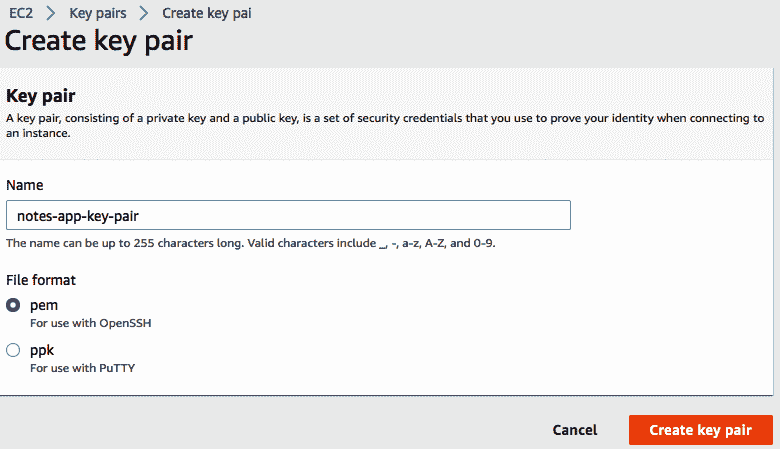
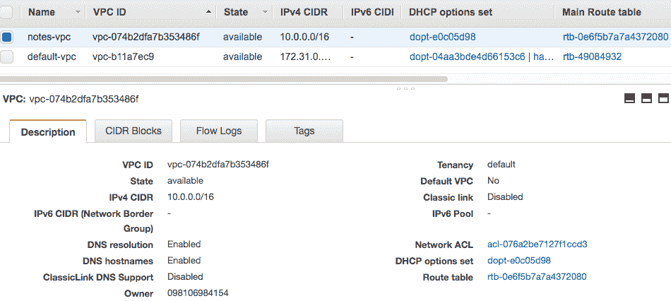
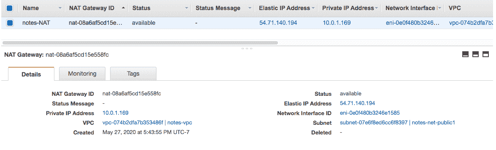
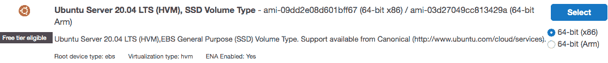
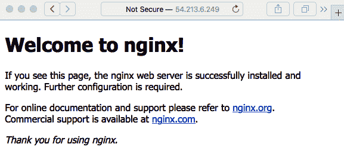

使用 Terraform 将 Docker Swarm 部署到 AWS EC2

到目前为止，在本书中，我们已经创建了一个基于 Node.js 的应用程序堆栈，包括两个 Node.js 微服务、一对 MySQL 数据库和一个 Redis 实例。在上一章中，我们学习了如何使用 Docker 轻松启动这些服务，打算在云托管平台上这样做。Docker 被广泛用于部署我们这样的服务，对于在公共互联网上部署 Docker，我们有很多可用的选项。

由于 Amazon Web Services（AWS）是一个成熟且功能丰富的云托管平台，我们选择在那里部署。在 AWS 上有许多可用于托管 Notes 的选项。我们在第十一章《使用 Docker 部署 Node.js 微服务》中的工作中，最直接的路径是在 AWS 上创建一个 Docker Swarm 集群。这使我们能够直接重用我们创建的 Docker compose 文件。

Docker Swarm 是可用的 Docker 编排系统之一。这些系统管理一个或多个 Docker 主机系统上的一组 Docker 容器。换句话说，构建一个 Swarm 需要为一个或多个服务器系统进行配置，安装 Docker Engine，并启用 Swarm 模式。Docker Swarm 内置于 Docker Engine 中，只需几个命令即可将这些服务器加入到 Swarm 中。然后，我们可以将基于 Docker 的服务部署到 Swarm 中，Swarm 会在服务器系统之间分发容器，监视每个容器，重新启动任何崩溃的容器等。

Docker Swarm 可以在具有多个 Docker 主机系统的任何情况下使用。它不受 AWS 的限制，因为我们可以从世界各地的数百家 Web 托管提供商那里租用合适的服务器。它足够轻量级，以至于您甚至可以在笔记本电脑上使用虚拟机实例（Multipass、VirtualBox 等）来尝试 Docker Swarm。

在本章中，我们将使用一组 AWS Elastic Compute Cloud（EC2）实例。EC2 是 AWS 的虚拟专用服务器（VPS）的等价物，我们可以从 Web 托管提供商那里租用。EC2 实例将部署在 AWS 虚拟私有云（VPC）中，以及我们将在其上实施之前概述的部署架构的网络基础设施。

让我们谈谈成本，因为 AWS 可能成本高昂。AWS 提供了所谓的免费层，对于某些服务，只要保持在一定阈值以下，成本就为零。在本章中，我们将努力保持在免费层内，除了我们将有三个 EC2 实例部署一段时间，这超出了 EC2 使用的免费层。如果您对成本敏感，可以通过在不需要时销毁 EC2 实例来将其最小化。我们将在稍后讨论如何做到这一点。

本章将涵盖以下主题：

+   注册 AWS 并配置 AWS 命令行界面（CLI）

+   要部署的 AWS 基础设施概述

+   使用 Terraform 创建 AWS 基础设施

+   在 AWS EC2 上设置 Docker Swarm 集群

+   为 Notes Docker 镜像设置 Elastic Container Registry（ECR）存储库

+   为部署到 Docker Swarm 创建 Docker 堆栈文件

+   为完整的 Docker Swarm 配置 EC2 实例

+   将 Notes 堆栈文件部署到 Swarm

在本章中，您将学到很多东西，从如何开始使用 AWS 管理控制台，设置 AWS 上的身份和访问管理（IAM）用户，到如何设置 AWS 命令行工具。由于 AWS 平台如此庞大，重要的是要对其内容和我们在本章中将使用的功能有一个概述。然后，我们将学习 Terraform，这是一种在各种云平台上配置服务的主要工具。我们将学习如何使用它来配置 AWS 资源，如 VPC、相关的网络基础设施，以及如何配置 EC2 实例。接下来，我们将学习 Docker Swarm，这是内置在 Docker 中的编排系统，以及如何设置一个 Swarm，以及如何在 Swarm 中部署应用程序。

为此，我们将学习 Docker 镜像注册表、AWS 弹性容器注册表（ECR）、如何将镜像推送到 Docker 注册表，以及如何在 Docker 应用程序堆栈中使用来自私有注册表的镜像。最后，我们将学习创建 Docker 堆栈文件，该文件允许您描述要在群集中部署的 Docker 服务。

让我们开始吧。

# 第十六章：注册 AWS 并配置 AWS CLI

要使用 AWS 服务，当然必须拥有 AWS 账户。AWS 账户是我们向 AWS 进行身份验证的方式，也是 AWS 向我们收费的方式。

首先，访问[`aws.amazon.com`](https://aws.amazon.com)并注册一个账户。

Amazon 免费套餐是一种零成本体验 AWS 服务的方式：[`aws.amazon.com/free/`](https://aws.amazon.com/free/)。文档可在[`docs.aws.amazon.com`](https://docs.aws.amazon.com)找到。

AWS 有两种我们可以使用的账户，如下：

+   **根账户**是我们注册 AWS 账户时创建的账户。根账户对 AWS 服务拥有完全访问权限。

+   IAM 用户账户是您可以在根账户中创建的权限较低的账户。根账户的所有者创建 IAM 账户，并为每个 IAM 账户分配权限范围。

直接使用根账户是不好的行为，因为根账户对 AWS 资源拥有完全访问权限。如果根账户的凭据泄露给公众，可能会对您的业务造成重大损害。如果 IAM 用户账户的凭据泄露，损害仅限于该用户账户控制的资源以及该账户被分配的权限。此外，IAM 用户凭据可以随时被撤销，然后生成新的凭据，防止持有泄霩凭据的任何人进一步造成损害。另一个安全措施是为所有账户启用多因素身份验证（MFA）。

如果您还没有这样做，请前往上述链接之一的 AWS 网站并注册一个账户。请记住，以这种方式创建的账户是您的 AWS 根账户。

我们的第一步是熟悉 AWS 管理控制台。

## 找到 AWS 账户的方法

由于 AWS 平台上有如此多的服务，看起来就像是一个迷宫。但是，稍微了解一下，我们就能找到自己的路。

首先，看一下窗口顶部的导航栏。右侧有三个下拉菜单。第一个是您的账户名称，并有与账户相关的选项。第二个可以让您选择 AWS 区域的默认设置。AWS 将其基础设施划分为*区域*，基本上意味着 AWS 数据中心所在的世界地区。第三个可以让您联系 AWS 支持。

左侧是一个标有“服务”的下拉菜单。这会显示所有 AWS 服务的列表。由于服务列表很长，AWS 为您提供了一个搜索框。只需输入服务的名称，它就会显示出来。AWS 管理控制台首页也有这个搜索框。

在我们找到自己的路的同时，让我们记录根帐户的帐户号。我们以后会需要这些信息。在帐户下拉菜单中，选择“我的帐户”。帐户 ID 在那里，以及您的帐户名称。

建议在 AWS 根帐户上设置 MFA。MFA 简单地意味着以多种方式对人进行身份验证。例如，服务可能使用通过短信发送的代码号作为第二种身份验证方法，同时要求输入密码。理论上，如果服务验证了我们输入了正确的密码并且我们携带了其他日子携带的同一部手机，那么服务对我们的身份更加确定。

要在根帐户上设置 MFA，请转到“我的安全凭据”仪表板。在 AWS 管理控制台菜单栏中可以找到指向该仪表板的链接。这将带您到一个页面，控制与 AWS 的所有形式的身份验证。从那里，您可以按照 AWS 网站上的说明进行操作。有几种可能的工具可用于实施 MFA。最简单的工具是在智能手机上使用 Google Authenticator 应用程序。设置 MFA 后，每次登录到根帐户都需要从验证器应用程序输入代码。

到目前为止，我们已经处理了在线 AWS 管理控制台。我们真正的目标是使用命令行工具，为此，我们需要在笔记本电脑上安装和配置 AWS CLI。让我们接下来处理这个问题。

## 使用 AWS 身份验证凭据设置 AWS CLI

AWS CLI 工具是通过 AWS 网站提供的下载。在幕后，它使用 AWS 应用程序编程接口（API），并且还要求我们下载和安装身份验证令牌。

一旦您有了帐户，我们就可以准备 AWS CLI 工具。

AWS CLI 使您能够从笔记本电脑的命令行与 AWS 服务进行交互。它具有与每个 AWS 服务相关的广泛的子命令集。

安装 AWS CLI 的说明可以在此处找到：[`docs.aws.amazon.com/cli/latest/userguide/install-cliv2.html`](https://docs.aws.amazon.com/cli/latest/userguide/install-cliv2.html)。

配置 AWS CLI 的说明可以在此处找到：[`docs.aws.amazon.com/cli/latest/userguide/cli-chap-configure.html`](https://docs.aws.amazon.com/cli/latest/userguide/cli-chap-configure.html)。

一旦在笔记本电脑上安装了 AWS CLI 工具，我们必须配置所谓的*配置文件*。

AWS 提供了支持广泛的工具来操作 AWS 基础架构的 AWS API。AWS CLI 工具使用该 API，第三方工具如 Terraform 也使用该 API。使用 API 需要访问令牌，因此 AWS CLI 和 Terraform 都需要相同的令牌。

要获取 AWS API 访问令牌，请转到“我的安全凭据”仪表板，然后单击“访问密钥”选项卡。

单击此按钮，将显示两个安全令牌，即访问密钥 ID 和秘密访问密钥。您将有机会下载包含这些密钥的逗号分隔值（CSV）文件。CSV 文件如下所示：

```

You will receive a file that looks like this. These are the security tokens that identify your account. Don't worry, as no secrets are being leaked in this case. Those particular credentials have been revoked. The good news is that you can revoke these credentials at any time and download new credentials.

Now that we have the credentials file, we can configure an AWS CLI profile.

The `aws configure` command, as the name implies, takes care of configuring your AWS CLI environment. This asks a series of questions, the first two of which are those keys. The interaction looks like this:

```

对于前两个提示，粘贴您下载的密钥。区域名称提示选择您的服务将在其中提供服务的默认 Amazon AWS 数据中心。AWS 在世界各地都有设施，每个地点都有一个代码名称，例如`us-west-2`（位于俄勒冈州）。最后一个提示询问您希望 AWS CLI 如何向您呈现信息。

对于区域代码，在 AWS 控制台中，查看区域下拉菜单。这会显示可用的区域，描述区域和每个区域的区域代码。对于这个项目，最好使用靠近您的 AWS 区域。对于生产部署，最好使用最接近您的受众的区域。可以配置跨多个区域工作的部署，以便您可以为多个地区的客户提供服务，但这种实现远远超出了我们在本书中涵盖的范围。

通过使用`--profile`选项，我们确保创建了一个命名的配置文件。如果我们省略该选项，我们将创建一个名为`default`的配置文件。对于任何`aws`命令，`--profile`选项选择要使用的配置文件。顾名思义，默认配置文件是如果我们省略`--profile`选项时使用的配置文件。

在使用 AWS 身份时，最好始终明确。一些指南建议根本不创建默认的 AWS 配置文件，而是始终使用`--profile`选项以确保始终使用正确的 AWS 配置文件。

验证 AWS 配置的一种简单方法是运行以下命令：

```

The AWS **Simple Storage Service** (**S3**) is a cloud file-storage system, and we are running these commands solely to verify the correct installation of the credentials.  The `ls` command lists any files you have stored in S3\. We don't care about the files that may or may not be in an S3 bucket, but whether this executes without error.

The first command shows us that execution with no `--profile` option, and no `default` profile, produces an error. If there were a `default` AWS profile, that would have been used. However, we did not create a `default` profile, so therefore no profile was available and we got an error. The second shows the same command with an explicitly named profile. The third shows the `AWS_PROFILE` environment variable being used to name the profile to be deployed.

Using the environment variables supported by the AWS CLI tool, such as `AWS_PROFILE`, lets us skip using command-line options such as `--profile` while still being explicit about which profile to use.

As we said earlier, it is important that we interact with AWS via an IAM user, and therefore we must learn how to create an IAM user account. Let's do that next.

## Creating an IAM user account, groups, and roles

We could do everything in this chapter using our root account but, as we said, that's bad form. Instead, it is recommended to create a second user—an IAM user—and give it only the permissions required by that user. 

To get to the IAM dashboard, click on Services in the navigation bar, and enter `IAM`. IAM stands for Identity and Access Management. Also, the My Security Credentials dashboard is part of the IAM service, so we are probably already in the IAM area.

The first task is to create a role. In AWS, roles are used to associate privileges with a user account. You can create roles with extremely limited privileges or an extremely broad range of privileges.

In the IAM dashboard, you'll find a navigation menu on the left. It has sections for users, groups, roles, and other identity management topics. Click on the Roles choice. Then, in the Roles area, click on Create Role. Perform the following steps:

1.  Under Type of trusted identity, select Another AWS account. Enter the account ID, which you will have recorded earlier while familiarizing yourself with the AWS account. Then, click on Next.
2.  On the next page, we select the permissions for this role. For our purpose, select `AdministratorAccess`, a privilege that grants full access to the AWS account. Then, click on Next.
3.  On the next page, you can add tags to the role. We don't need to do this, so click Next.
4.  On the last page, we give a name to the role. Enter `admin` because this role has administrator permissions. Click on Create Role.

You'll see that the role, admin, is now listed in the Role dashboard. Click on admin and you will be taken to a page where you can customize the role further. On this page, notice the characteristic named Role ARN. Record this **Amazon Resource Name** (**ARN**) for future reference.

ARNs are identifiers used within AWS. You can reliably use this ARN in any area of AWS where we can specify a role. ARNs are used with almost every AWS resource.

Next, we have to create an administrator group. In IAM, users are assigned to groups as a way of passing roles and other attributes to a group of IAM user accounts. To do this, perform the following steps:

1.  In the left-hand navigation menu, click on Group, and then, in the group dashboard, click on Create Group. 
2.  For the group name, enter `Administrators`. 
3.  Skip the Attach Policy page, click Next Step*,* and then, on the Review page, simply click Create Group.
4.  This creates a group with no permissions and directs you back to the group dashboard. 
5.  Click on the Administrators group, and you'll be taken to the overview page. Record the ARN for the group.
6.  Click on Permissions to open that tab, and then click on the Inline policies section header. We will be creating an inline policy, so click on the Click here link.
7.  Click on Custom Policy, and you'll be taken to the policy editor.
8.  For the policy name, enter `AssumeAdminRole`. Below that is an area where we enter a block of **JavaScript Object Notation** (**JSON**) code describing the policy. Once that's done, click the Apply Policy button.

The policy document to use is as follows:

```

这描述了为管理员组创建的策略。它为该组提供了我们之前在管理员角色中指定的权限。资源标签是我们输入之前创建的管理员组的 ARN 的地方。确保将整个 ARN 放入此字段。

导航回到组区域，然后再次点击创建组。我们将创建一个名为`NotesDeveloper`的组，供分配给 Notes 项目的开发人员使用。它将为这些用户帐户提供一些额外的特权。执行以下步骤：

1.  输入`NotesDeveloper`作为组名。然后，点击下一步。

1.  对于“附加策略”页面，有一个要考虑的策略长列表；例如，`AmazonRDSFullAccess`，`AmazonEC2FullAccess`，`IAMFullAccess`，`AmazonEC2ContainerRegistryFullAccess`，`AmazonS3FullAccess`，`AdministratorAccess`和`AmazonElasticFileSystemFullAccess`。

1.  然后，点击下一步，如果在审阅页面上一切看起来都正确，请点击**创建组**。

这些策略涵盖了完成本章所需的服务。AWS 错误消息指出用户没有足够的特权访问该功能时，很好地告诉您所需的特权。如果这是用户需要的特权，那么回到这个组并添加特权。

在左侧导航中，点击用户，然后点击创建用户。这开始了创建 IAM 用户所涉及的步骤，如下所述：

1.  对于用户名，输入`notes-app`，因为此用户将管理与 Notes 应用程序相关的所有资源。对于访问类型，点击程序访问和 AWS 管理控制台访问，因为我们将同时使用两者。第一个授予使用 AWS CLI 工具的能力，而第二个涵盖了 AWS 控制台。然后，点击下一步。

1.  对于权限，选择将用户添加到组，并选择管理员和 NotesDeveloper 两个组。这将用户添加到您选择的组。然后，点击下一步。

1.  没有其他事情要做，所以继续点击下一步，直到您到达审阅页面。如果您满意，请点击创建用户。

您将被带到一个宣布成功的页面。在这个页面上，AWS 提供了可以与此帐户一起使用的访问令牌（也称为安全凭证）。在您做任何其他操作之前，请下载这些凭证。您随时可以撤销这些凭证并生成新的访问令牌。

您新创建的用户现在列在用户部分。点击该条目，因为我们有一些数据项要记录。第一个显然是用户帐户的 ARN。第二个是一个**统一资源定位符**（**URL**），您可以使用它以此用户身份登录到 AWS。对于该 URL，请点击安全凭证选项卡，登录链接将在那里。

建议还为 IAM 帐户设置 MFA。AWS 任务栏中的“My Security Credentials”选项可让您进入包含设置 MFA 按钮的屏幕。请参阅前几页关于为根帐户设置 MFA 的讨论。

要测试新用户帐户，请注销，然后转到登录网址。输入帐户的用户名和密码，然后登录。

在完成本节之前，返回命令行并运行以下命令：

```

This will create another AWS CLI profile, this time for the `notes-app` IAM user.

Using the AWS CLI, we can list the users in our account, as follows:

```

这是验证 AWS CLI 是否正确安装的另一种方法。此命令从 AWS 查询用户信息，如果执行无误，则已正确配置 CLI。

AWS CLI 命令遵循类似的结构，其中有一系列子命令，后面跟着选项。在这种情况下，子命令是`aws`，`iam`和`list-users`。AWS 网站为 AWS CLI 工具提供了广泛的在线文档。

### 创建 EC2 密钥对

由于我们将在此练习中使用 EC2 实例，我们需要一个 EC2 密钥对。这是一个加密证书，其作用与我们用于无密码登录到服务器的普通**安全外壳**（**SSH**）密钥相同。实际上，密钥对文件具有相同的作用，允许使用 SSH 无密码登录到 EC2 实例。执行以下步骤：

1.  登录到 AWS 管理控制台，然后选择您正在使用的区域。

1.  接下来，导航到 EC2 仪表板，例如，通过在搜索框中输入`EC2`。

1.  在导航侧边栏中，有一个名为“网络和安全”的部分，其中包含一个名为“密钥对”的链接。

1.  单击该链接。右上角有一个标有“创建密钥对”的按钮。单击此按钮，您将进入以下屏幕：



1.  输入密钥对的所需名称。根据您使用的 SSH 客户端，使用`.pem`（用于`ssh`命令）或`.ppk`（用于 PuTTY）格式的密钥对文件。

1.  单击“创建密钥对”，您将返回到仪表板，并且密钥对文件将在浏览器中下载。

1.  下载密钥对文件后，需要将其设置为只读，可以使用以下命令：

```

Substitute here the pathname where your browser downloaded the file.

For now, just make sure this file is correctly stored somewhere. When we deploy EC2 instances, we'll talk more about how to use it.

We have familiarized ourselves with the AWS Management Console, and created for ourselves an IAM user account. We have proved that we can log in to the console using the sign-in URL. While doing that, we copied down the AWS access credentials for the account.

We have completed the setup of the AWS command-line tools and user accounts. The next step is to set up Terraform.

# An overview of the AWS infrastructure to be deployed

AWS is a complex platform with dozens of services available to us. This project will touch on only the part required to deploy Notes as a Docker swarm on EC2 instances. In this section, let's talk about the infrastructure and AWS services we'll put to use.

An AWS VPC is what it sounds like—namely, a service within AWS where you build your own private cloud service infrastructure. The AWS team designed the VPC service to look like something that you would construct in your own data center, but implemented on the AWS infrastructure. This means that the VPC is a container to which everything else we'll discuss is attached.

The AWS infrastructure is spread across the globe into what AWS calls regions. For example, `us-west-1` refers to Northern California, `us-west-2` refers to Oregon, and `eu-central-1` refers to Frankfurt. For production deployment, it is recommended to use a region nearer your customers, but for experimentation, it is good to use the region closest to you. Within each region, AWS further subdivides its infrastructure into **availability zones** (a.k.a. **AZs**). An AZ might correspond to a specific building at an AWS data center site, but AWS often recommends that we deploy infrastructure to multiple AZs for reliability. In case one AZ goes down, the service can continue in the AZs that are running.

When we allocate a VPC, we specify an address range for resources deployed within the VPC. The address range is specified with a **Classless Inter-Domain Routing** (**CIDR**) specifier. These are written as `10.3.0.0/16` or `10.3.20.0/24`, which means any **Internet Protocol version 4** (**IPv4**) address starting with `10.3` and `10.3.20`, respectively.

Every device we attach to a VPC will be attached to a subnet, a virtual object similar to an Ethernet segment. Each subnet will be assigned a CIDR from the main range. A VPC assigned the `10.3.0.0/16` CIDR might have a subnet with a CIDR of `10.3.20.0/24`. Devices attached to the subnet will have an IP address assigned within the range indicated by the CIDR for the subnet.

EC2 is AWS's answer to a VPS that you might rent from any web hosting provider. An EC2 instance is a virtual computer in the same sense that Multipass or VirtualBox lets you create a virtual computer on your laptop. Each EC2 instance is assigned a **central processing unit** (**CPU**), memory, disk capacity, and at least one network interface. Hence, an EC2 instance is attached to a subnet and is assigned an IP address from the subnet's assigned range.

By default, a device attached to a subnet has no internet access. The internet gateway and **network address translation** (**NAT**) gateway resources on AWS play a critical role in connecting resources attached to a VPC via the internet. Both are what is known as an internet router, meaning that both handle the routing of internet traffic from one network to another. Because a VPC contains a VPN, these gateways handle traffic between that network and the public internet, as follows:

*   **Internet gateway**: This handles two-way routing, allowing a resource allocated in a VPC to be reachable from the public internet. An internet gateway allows external traffic to enter the VPC, and it also allows resources in the VPC to access resources on the public internet.

*   **NAT gateway**: This handles one-way routing, meaning that resources on the VPC will be able to access resources on the public internet, but does not allow external traffic to enter the VPC. To understand the NAT gateway, think about a common home Wi-Fi router because they also contain a NAT gateway. Such a gateway will manage a local IP address range such as `192.168.0.0/16`, while the **internet service provider** (**ISP**) might assign a public IP address such as `107.123.42.231` to the connection. Local IP addresses, such as `192.168.1.45`, will be assigned to devices connecting to the NAT gateway. Those local IP addresses do not appear in packets sent to the public internet. Instead, the NAT gateway translates the IP addresses to the public IP address of the gateway, and then when reply packets arrive, it translates the IP address to that of the local device. NAT translates IP addresses from the local network to the IP address of the NAT gateway. 

In practical terms, this determines the difference between a private subnet and a public subnet. A public subnet has a routing table that sends traffic for the public internet to an internet gateway, whereas a private subnet sends its public internet traffic to a NAT gateway.

Routing tables describe how to route internet traffic. Inside any internet router, such as an internet gateway or a NAT gateway, is a function that determines how to handle internet packets destined for a location other than the local subnet. The routing function matches the destination address against routing table entries, and each routing table entry says where to forward matching packets.

Attached to each device deployed in a VPC is a security group. A security group is a firewall controlling what kind of internet traffic can enter or leave that device. For example, an EC2 instance might have a web server supporting HTTP (port `80`) and HTTPS (port `443`) traffic, and the administrator might also require SSH access (port `22`) to the instance. The security group would be configured to allow traffic from any IP address on ports `80` and `443` and to allow traffic on port `22` from IP address ranges used by the administrator.

A network **access control list** (**ACL**) is another kind of firewall that's attached to subnets. It, too, describes which traffic is allowed to enter or leave the subnet. The security groups and network ACLs are part of the security protections provided by AWS.

If a device connected to a VPC does not seem to work correctly, there might be an error in the configuration of these parts. It's necessary to check the security group attached to the device, and to the NAT gateway or internet gateway, and that the device is connected to the expected subnet, the routing table for the subnet, and any network ACLs.

# Using Terraform to create an AWS infrastructure

Terraform is an open source tool for configuring a cloud hosting infrastructure. It uses a declarative language to describe the configuration of cloud services. Through a long list of plugins, called providers, it has support for a variety of cloud services. In this chapter, we'll use Terraform to describe AWS infrastructure deployments.

To install Terraform, download an installer from [`www.terraform.io/downloads.html`](https://www.terraform.io/downloads.html).

Alternatively, you will find the Terraform CLI available in many package management systems.

Once installed, you can view the Terraform help with the following command:

```

Terraform 文件具有`.tf`扩展名，并使用相当简单、易于理解的声明性语法。Terraform 不关心您使用的文件名或创建文件的顺序。它只是读取所有具有`.tf`扩展名的文件，并寻找要部署的资源。这些文件不包含可执行代码，而是声明。Terraform 读取这些文件，构建依赖关系图，并确定如何在使用的云基础设施上实现这些声明。

一个示例声明如下：

```

The first word, `resource` or `variable`, is the block type, and in this case, we are declaring a resource and a variable. Within the curly braces are the arguments to the block, and it is helpful to think of these as attributes.

Blocks have labels—in this case, the labels are `aws_vpc` and `main`. We can refer to this specific resource elsewhere by joining the labels together as `aws_vpc.main`. The name, `aws_vpc`, comes from the AWS provider and refers to VPC elements. In many cases, a block—be it a resource or another kind—will support attributes that can be accessed. For example, the CIDR for this VPC can be accessed as `aws_vpc.main.cidr_block`.

The general structure is as follows:

```

区块类型包括资源（resource），声明与云基础设施相关的内容，变量（variable），声明命名值，输出（output），声明模块的结果，以及其他一些类型。

区块标签的结构因区块类型而异。对于资源区块，第一个区块标签指的是资源的类型，而第二个是该资源的特定实例的名称。

参数的类型也因区块类型而异。Terraform 文档对每个变体都有广泛的参考。

Terraform 模块是包含 Terraform 脚本的目录。当在目录中运行`terraform`命令时，它会读取该目录中的每个脚本以构建对象树。

在模块内，我们处理各种值。我们已经讨论了资源、变量和输出。资源本质上是与云托管平台上的某些东西相关的对象值。变量可以被视为模块的输入，因为有多种方法可以为变量提供值。输出值如其名称所示，是模块的输出。当执行模块时，输出可以打印在控制台上，或保存到文件中，然后被其他模块使用。与此相关的代码可以在以下片段中看到：

```

This is what the `variable` and `output` declarations look like. Every value has a data type. For variables, we can attach a description to aid in their documentation. The declaration uses the word `default` rather than `value` because there are multiple ways (such as Terraform command-line arguments) to specify a value for a variable. Terraform users can override the default value in several ways, such as the `--var` or `--var-file` command-line options.

Another type of value is local. Locals exist only within a module because they are neither input values (variables) nor output values, as illustrated in the following code snippet:

```

在这种情况下，我们定义了与要在 VPC 中创建的子网的 CIDR 相关的几个本地变量。`cidrsubnet`函数用于计算子网掩码，例如`10.1.1.0/24`。

Terraform 的另一个重要特性是提供者插件。Terraform 支持的每个云系统都需要一个定义如何使用 Terraform 与该平台的具体细节的插件模块。

提供者插件的一个效果是 Terraform 不会尝试成为平台无关的。相反，给定平台的所有可声明资源都是唯一的。您不能直接在另一个系统（如 Azure）上重用 AWS 的 Terraform 脚本，因为资源对象都是不同的。您可以重用的是 Terraform 如何处理云资源声明的知识。 

另一个任务是在你的编程编辑器中寻找一个 Terraform 扩展。其中一些支持 Terraform，包括语法着色、检查简单错误，甚至代码补全。

尽管如此，这已经足够的理论了。要真正学会这个，我们需要开始使用 Terraform。在下一节中，我们将从实现 VPC 结构开始，然后在其中部署 Notes 应用程序堆栈。

## 使用 Terraform 配置 AWS VPC

AWS VPC 就像它的名字一样，是 AWS 内的一个服务，用来容纳您定义的云服务。AWS 团队设计了 VPC 服务，看起来有点像您在自己的数据中心构建的东西，但是在 AWS 基础设施上实现。

在本节中，我们将构建一个包含公共子网和私有子网、互联网网关和安全组定义的 VPC。

在项目工作区中，创建一个名为`terraform-swarm`的目录，它是`notes`和`users`目录的同级目录。

在该目录中，创建一个名为`main.tf`的文件，其中包含以下内容：

```

This says to use the AWS provider plugin. It also configures this script to execute using the named AWS profile. Clearly, the AWS provider plugin requires AWS credential tokens in order to use the AWS API. It knows how to access the credentials file set up by `aws configure`.

To learn more about configuring the AWS provider plugin, refer to [`www.terraform.io/docs/providers/aws/index.html`](https://www.terraform.io/docs/providers/aws/index.html).

As shown here, the AWS plugin will look for the AWS credentials file in its default location, and use the `notes-app` profile name.

In addition, we have specified which AWS region to use. The reference, `var.aws_region`, is a Terraform variable. We use variables for any value that can legitimately vary. Variables can be easily customized to any value in several ways.

To support the variables, we create a file named `variables.tf`, starting with this:

```

`default`属性为变量设置了默认值。正如我们之前看到的，声明也可以指定变量的数据类型和描述。

有了这个，我们现在可以运行我们的第一个 Terraform 命令，如下所示：

```

This initializes the current directory as a Terraform workspace. You'll see that it creates a directory, `.terraform`, and a file named `terraform.tfstate` containing data collected by Terraform. The `.tfstate` files are what is known as state files. These are in JSON format and store the data Terraform collects from the platform (in this case, AWS) regarding what has been deployed. State files must not be committed to source code repositories because it is possible for sensitive data to end up in those files. Therefore, a `.gitignore` file listing the state files is recommended.

The instructions say we should run `terraform plan`, but before we do that, let's declare a few more things.

To declare the VPC and its related infrastructure, let's create a file named `vpc.tf`. Start with the following command:

```

这声明了 VPC。这将是我们正在创建的基础设施的容器。

`cidr_block`属性确定将用于此 VPC 的 IPv4 地址空间。CIDR 表示法是一个互联网标准，例如`10.0.0.0/16`。该 CIDR 将覆盖以`10.0`开头的任何 IP 地址。

`enable_dns_support`和`enable_dns_hostnames`属性确定是否为连接到 VPC 的某些资源生成**域名系统**（**DNS**）名称。DNS 名称可以帮助一个资源在运行时找到其他资源。

`tags`属性用于将名称/值对附加到资源上。名称标签被 AWS 用来为资源设置显示名称。每个 AWS 资源都有一个计算生成的、用户不友好的名称，带有一个长编码的字符串，当然，我们人类需要友好的名称。名称标签在这方面很有用，AWS 管理控制台将通过在仪表板中使用这个名称来做出响应。

在`variables.tf`中，添加以下内容以支持这些资源声明：

```

These values will be used throughout the project. For example, `var.project_name` will be widely used as the basis for creating name tags for deployed resources.

Add the following to `vpc.tf`:

```

`resource`块声明了托管平台上的某些内容（在本例中是 AWS），`data`块从托管平台检索数据。在这种情况下，我们正在检索当前选择区域的 AZ 列表。以后在声明某些资源时会用到这个数据。

### 配置 AWS 网关和子网资源

请记住，公共子网与互联网网关相关联，私有子网与 NAT 网关相关联。这种区别决定了附加到每个子网的互联网访问设备的类型。

创建一个名为`gw.tf`的文件，其中包含以下内容：

```

This declares the internet gateway and the NAT gateway. Remember that internet gateways are used with public subnets, and NAT gateways are used with private subnets.

An **Elastic IP** (**EIP**) resource is how a public internet IP address is assigned. Any device that is to be visible to the public must be on a public subnet and have an EIP. Because the NAT gateway faces the public internet, it must have an assigned public IP address and an EIP.

For the subnets, create a file named `subnets.tf` containing the following:

```

这声明了公共和私有子网。请注意，这些子网分配给了特定的 AZ。通过添加名为`public2`、`public3`、`private2`、`private3`等子网，很容易扩展以支持更多子网。如果这样做，最好将这些子网分布在不同的 AZ 中。建议在多个 AZ 中部署，这样如果一个 AZ 崩溃，应用程序仍在仍在运行的 AZ 中运行。

带有`[0]`的这种表示是什么样子的——一个数组。值`data.aws_availability_zones.available.names`是一个数组，添加`[0]`确实访问了该数组的第一个元素，就像你期望的那样。数组只是 Terraform 提供的数据结构之一。

每个子网都有自己的 CIDR（IP 地址范围），为了支持这一点，我们需要在`variables.tf`中列出这些 CIDR 分配，如下所示：

```

These are the CIDRs corresponding to the resources declared earlier.

For these pieces to work together, we need appropriate routing tables to be configured. Create a file named `routing.tf` containing the following:

```

要为公共子网配置路由表，我们修改连接到 VPC 的主路由表的路由表。我们在这里做的是向该表添加一条规则，指定公共互联网流量要发送到互联网网关。我们还有一个路由表关联声明，公共子网使用这个路由表。

对于`aws_route_table.private`，私有子网的路由表，声明指定将公共互联网流量发送到 NAT 网关。在路由表关联中，此表用于私有子网。

之前，我们说公共子网和私有子网的区别在于公共互联网流量是发送到互联网网关还是 NAT 网关。这些声明就是实现这一点的方式。

在这一部分中，我们声明了 VPC、子网、网关和路由表，换句话说，我们将部署 Docker Swarm 的基础架构。

在连接容纳 Swarm 的 EC2 实例之前，让我们将其部署到 AWS 并探索设置的内容。

## 使用 Terraform 将基础架构部署到 AWS

我们现在已经声明了我们需要的 AWS 基础架构的基本结构。这是 VPC、子网和路由表。让我们将其部署到 AWS，并使用 AWS 控制台来探索创建了什么。

之前，我们运行了`terraform init`来初始化我们的工作目录中的 Terraform。这样做时，它建议我们运行以下命令：

```

This command scans the Terraform files in the current directory and first determines that everything has the correct syntax, that all the values are known, and so forth. If any problems are encountered, it stops right away with error messages such as the following:

```

Terraform 的错误消息通常是不言自明的。在这种情况下，原因是决定只使用一个公共子网和一个私有子网。这段代码是从两个子网的情况遗留下来的。因此，这个错误指的是容易删除的陈旧代码。

`terraform plan`的另一个作用是构建所有声明的图表并打印出一个列表。这让你了解 Terraform 打算部署到所选云平台上的内容。因此，这是你检查预期基础架构并确保它是你想要使用的机会。

一旦您满意了，请运行以下命令：

```

With `terraform apply`, the report shows the difference between the actual deployed state and the desired state as reflected by the Terraform files. In this case, there is no deployed state, so therefore everything that is in the files will be deployed. In other cases, you might have deployed a system and have made a change, in which case Terraform will work out which changes have to be deployed based on the changes you've made. Once it calculates that, Terraform asks for permission to proceed. Finally, if we have said yes, it will proceed and launch the desired infrastructure.

Once finished, it tells you what happened. One result is the values of the `output` commands in the scripts. These are both printed on the console and are saved in the backend state file.

To see what was created, let's head to the AWS console and navigate to the VPC area, as follows:



Compare the VPC ID in the screenshot with the one shown in the Terraform output, and you'll see that they match. What's shown here is the main routing table, and the CIDR, and other settings we made in our scripts. Every AWS account has a default VPC that's presumably meant for experiments. It is a better form to create a VPC for each project so that resources for each project are separate from other projects.

The sidebar contains links for further dashboards for subnets, route tables, and other things, and an example dashboard can be seen in the following screenshot:



For example, this is the NAT gateway dashboard showing the one created for this project.

Another way to explore is with the AWS CLI tool. Just because we have Terraform doesn't mean we are prevented from using the CLI. Have a look at the following code block:

```

这列出了创建的 VPC 的参数。

记得要么配置`AWS_PROFILE`环境变量，要么在命令行上使用`--profile`。

要列出子网上的数据，请运行以下命令：

```

To focus on the subnets for a given VPC, we use the `--filters` option, passing in the filter named `vpc-id` and the VPC ID for which to filter.

Documentation for the AWS CLI can be found at [`docs.aws.amazon.com/cli/latest/reference/index.html`](https://docs.aws.amazon.com/cli/latest/reference/index.html). [](https://docs.aws.amazon.com/cli/latest/reference/index.html) For documentation relating to the EC2 sub-commands, refer to [`docs.aws.amazon.com/cli/latest/reference/ec2/index.html`](https://docs.aws.amazon.com/cli/latest/reference/ec2/index.html).

The AWS CLI tool has an extensive list of sub-commands and options. These are enough to almost guarantee getting lost, so read carefully.

In this section, we learned how to use Terraform to set up the VPC and related infrastructure resources, and we also learned how to navigate both the AWS console and the AWS CLI to explore what had been created.

Our next step is to set up an initial Docker Swarm cluster by deploying an EC2 instance to AWS.

# Setting up a Docker Swarm cluster on AWS EC2

What we have set up is essentially a blank slate. AWS has a long list of offerings that could be deployed to the VPC that we've created. What we're looking to do in this section is to set up a single EC2 instance to install Docker, and set up a single-node Docker Swarm cluster. We'll use this to familiarize ourselves with Docker Swarm. In the remainder of the chapter, we'll build more servers to create a larger swarm cluster for full deployment of Notes.

A Docker Swarm cluster is simply a group of servers running Docker that have been joined together into a common pool. The code for the Docker Swarm orchestrator is bundled with the Docker Engine server but it is disabled by default. To create a swarm, we simply enable swarm mode by running `docker swarm init` and then run a `docker swarm join` command on each system we want to be part of the cluster. From there, the Docker Swarm code automatically takes care of a long list of tasks. The features for Docker Swarm include the following:

*   **Horizontal scaling**: When deploying a Docker service to a swarm, you tell it the desired number of instances as well as the memory and CPU requirements. The swarm takes that and computes the best distribution of tasks to nodes in the swarm.
*   **Maintaining the desired state**: From the services deployed to a swarm, the swarm calculates the desired state of the system and tracks its current actual state. Suppose one of the nodes crashes—the swarm will then readjust the running tasks to replace the ones that vaporized because of the crashed server.
*   **Multi-host networking**: The overlay network driver automatically distributes network connections across the network of machines in the swarm.
*   **Secure by default**: Swarm mode uses strong **Transport Layer Security** (**TLS**) encryption for all communication between nodes.
*   **Rolling updates**: You can deploy an update to a service in such a manner where the swarm intelligently brings down existing service containers, replacing them with updated newer containers.

For an overview of Docker Swarm, refer to [`docs.docker.com/engine/swarm/`](https://docs.docker.com/engine/swarm/).

We will use this section to not only learn how to set up a Docker Swarm but to also learn something about how Docker orchestration works.

To get started, we'll set up a single-node swarm on a single EC2 instance in order to learn some basics, before we move on to deploying a multi-node swarm and deploying the full Notes stack.

## Deploying a single-node Docker Swarm on a single EC2 instance

For a quick introduction to Docker Swarm, let's start by installing Docker on a single EC2 node. We can kick the tires by trying a few commands and exploring the resulting system.

This will involve deploying Ubuntu 20.04 on an EC2 instance, configuring it to have the latest Docker Engine, and initializing swarm mode.

### Adding an EC2 instance and configuring Docker

To launch an EC2 instance, we must first select which operating system to install. There are thousands of operating system configurations available. Each of these configurations is identified by an **AMI** code, where AMI stands for **Amazon Machine Image**.

To find your desired AMI, navigate to the EC2 dashboard on the AWS console. Then, click on the Launch Instance button, which starts a wizard-like interface to launch an instance. You can, if you like, go through the whole wizard since that is one way to learn about EC2 instances. We can search the AMIs via the first page of that wizard, where there is a search box.

For this exercise, we will use Ubuntu 20.04, so enter `Ubuntu` and then scroll down to find the correct version, as illustrated in the following screenshot:



This is what the desired entry looks like. The AMI code starts with `ami-` and we see one version for x86 CPUs, and another for **ARM** (previously **Advanced RISC Machine**). ARM processors, by the way, are not just for your cell phone but are also used in servers. There is no need to launch an EC2 instance from here since we will instead do so with Terraform.

Another attribute to select is the instance size. AWS supports a long list of sizes that relate to the amount of memory, CPU cores, and disk space. For a chart of the available instance types, click on the Select button to proceed to the second page of the wizard, which shows a table of instance types and their attributes. For this exercise, we will use the `t2.micro` instance type because it is eligible for the free tier.

Create a file named `ec2-public.tf` containing the following:

```

在 Terraform AWS 提供程序中，EC2 实例的资源名称是`aws_instance`。由于此实例附加到我们的公共子网，我们将其称为`aws_instance.public`。因为它是一个公共的 EC2 实例，`associate_public_ip_address`属性设置为`true`。

属性包括 AMI ID、实例类型、子网 ID 等。`key_name`属性是指我们将用于登录 EC2 实例的 SSH 密钥的名称。我们稍后会讨论这些密钥对。`vpc_security_group_ids`属性是指我们将应用于 EC2 实例的安全组。`depends_on`属性导致 Terraform 等待数组中命名的资源的创建。`user_data`属性是一个 shell 脚本，一旦创建实例就在实例内执行。

对于 AMI、实例类型和密钥对数据，请将这些条目添加到`variables.tf`，如下所示：

```

The AMI ID shown here is specifically for Ubuntu 20.04 in `us-west-2`. There will be other AMI IDs in other regions. The `key_pair` name shown here should be the key-pair name you selected when creating your key pair earlier.

It is not necessary to add the key-pair file to this directory, nor to reference the file you downloaded in these scripts. Instead, you simply give the name of the key pair. In our example, we named it `notes-app-key-pair`, and downloaded `notes-app-key-pair.pem`.

The `user_data` feature is very useful since it lets us customize an instance after creation. We're using this to automate the Docker setup on the instances. This field is to receive a string containing a shell script that will execute once the instance is launched. Rather than insert that script inline with the Terraform code, we have created a set of files that are shell script snippets. The Terraform `file` function reads the named file, returning it as a string. The Terraform `join` function takes an array of strings, concatenating them together with the delimiter character in between. Between the two we construct a shell script. The shell script first installs Docker Engine, then initializes Docker Swarm mode, and finally changes the hostname to help us remember that this is the public EC2 instance.

Create a directory named `sh` in which we'll create shell scripts, and in that directory create a file named `docker_install.sh`. To this file, add the following:

```

此脚本源自 Ubuntu 上安装 Docker Engine **Community Edition** (**CE**)的官方说明。第一部分是支持`apt-get`从 HTTPS 存储库下载软件包。然后将 Docker 软件包存储库配置到 Ubuntu 中，之后安装 Docker 和相关工具。最后，确保`docker`组已创建并确保`ubuntu`用户 ID 是该组的成员。Ubuntu AMI 默认使用此用户 ID `ubuntu` 作为 EC2 管理员使用的用户 ID。

对于此 EC2 实例，我们还运行`docker swarm init`来初始化 Docker Swarm。对于其他 EC2 实例，我们不运行此命令。用于初始化`user_data`属性的方法让我们可以轻松地为每个 EC2 实例设置自定义配置脚本。对于其他实例，我们只运行`docker_install.sh`，而对于此实例，我们还将初始化 swarm。

回到`ec2-public.tf`，我们还有两件事要做，然后我们可以启动 EC2 实例。看一下以下代码块：

```

This is the security group declaration for the public EC2 instance. Remember that a security group describes the rules of a firewall that is attached to many kinds of AWS objects. This security group was already referenced in declaring `aws_instance.public`.

The main feature of security groups is the `ingress` and `egress` rules. As the words imply, `ingress` rules describe the network traffic allowed to enter the resource, and `egress` rules describe what's allowed to be sent by the resource. If you have to look up those words in a dictionary, you're not alone.

We have two `ingress` rules, and the first allows traffic on port `22`, which covers SSH traffic. The second allows traffic on port `80`, covering HTTP. We'll add more Docker rules later when they're needed.

The `egress` rule allows the EC2 instance to send any traffic to any machine on the internet.

These `ingress` rules are obviously very strict and limit the attack surface any miscreants can exploit.

The final task is to add these output declarations to `ec2-public.tf`, as follows:

```

这将让我们知道公共 IP 地址和公共 DNS 名称。如果我们感兴趣，输出还会告诉我们私有 IP 地址和 DNS 名称。

### 在 AWS 上启动 EC2 实例

我们已经添加了用于创建 EC2 实例的 Terraform 声明。

现在我们已经准备好将其部署到 AWS 并查看我们可以做些什么。我们已经知道该怎么做了，所以让我们运行以下命令：

```

If the VPC infrastructure were already running, you would get output similar to this. The addition is two new objects, `aws_instance.public` and `aws_security_group.ec2-public-sg`. This looks good, so we proceed to deployment, as follows:

```

这构建了我们的 EC2 实例，我们有了 IP 地址和域名。因为初始化脚本需要几分钟才能运行，所以最好等待一段时间再进行系统测试。

`ec2-public-ip`值是 EC2 实例的公共 IP 地址。在以下示例中，我们将放置文本`PUBLIC-IP-ADDRESS`，当然您必须替换为您的 EC2 实例分配的 IP 地址。

我们可以这样登录到 EC2 实例：

```

On a Linux or macOS system where we're using SSH, the command is as shown here. The `-i` option lets us specify the **Privacy Enhanced Mail** (**PEM**) file that was provided by AWS for the key pair. If on Windows using PuTTY, you'd instead tell it which **PuTTY Private Key** (**PPK**) file to use, and the connection parameters will otherwise be similar to this.

This lands us at the command-line prompt of the EC2 instance. We see that it is Ubuntu 20.04, and the hostname is set to `notes-public`, as reflected in Command Prompt and the output of the `hostname` command. This means that our initialization script ran because the hostname was the last configuration task it performed.

### Handling the AWS EC2 key-pair file

Earlier, we said to safely store the key-pair file somewhere on your computer.  In the previous section, we showed how to use the PEM file with SSH to log in to the EC2 instance. Namely, we use the PEM file like so:

```

每次使用 SSH 时记住添加`-i`标志可能会不方便。为了避免使用此选项，运行此命令：

```

As the command name implies, this adds the authentication file to SSH. This has to be rerun on every reboot of the computer, but it conveniently lets us access EC2 instances without remembering to specify this option.

### Testing the initial Docker Swarm

We have an EC2 instance and it should already be configured with Docker, and we can easily verify that this is the case as follows:

```

设置脚本也应该已经将此 EC2 实例初始化为 Docker Swarm 节点，以下命令验证了是否发生了这种情况：

```

The `docker info` command, as the name implies, prints out a lot of information about the current Docker instance. In this case, the output includes verification that it is in Docker Swarm mode and that this is a Docker Swarm manager instance.

Let's try a couple of swarm commands, as follows:

```

`docker node`命令用于管理集群中的节点。在这种情况下，只有一个节点 - 这个节点，并且它被显示为不仅是一个管理者，而且是集群的领导者。当你是集群中唯一的节点时，成为领导者似乎很容易。

`docker service`命令用于管理集群中部署的服务。在这种情况下，服务大致相当于 Docker compose 文件中`services`部分的条目。换句话说，服务不是正在运行的容器，而是描述启动给定容器一个或多个实例的配置的对象。 

要了解这意味着什么，让我们启动一个`nginx`服务，如下所示：

```

We started one service using the `nginx` image. We said to deploy one replica and to expose port `80`. We chose the `nginx` image because it has a simple default HTML file that we can easily view, as illustrated in the following screenshot:



Simply paste the IP address of the EC2 instance into the browser location bar, and we're greeted with that default HTML.

We also see by using `docker node ls` and `docker service ps` that there is one instance of the service. Since this is a swarm, let's increase the number of `nginx` instances, as follows:

```

一旦服务部署完成，我们可以使用`docker service update`命令来修改部署。在这种情况下，我们告诉它使用`--replicas`选项增加实例的数量，现在`notes-public`节点上运行了三个`nginx`容器的实例。

我们还可以运行正常的`docker ps`命令来查看实际的容器，如下面的代码块所示：

```

This verifies that the `nginx` service with three replicas is actually three `nginx` containers.

In this section, we were able to launch an EC2 instance and set up a single-node Docker swarm in which we launched a service, which gave us the opportunity to familiarize ourselves with what this can do.

While we're here, there is another thing to learn—namely, how to set up the remote control of Docker hosts.

## Setting up remote control access to a Docker Swarm hosted on EC2

A feature that's not well documented in Docker is the ability to control Docker nodes remotely. This will let us, from our laptop, run Docker commands on a server. By extension, this means that we will be able to manage the Docker Swarm from our laptop.

One method for remotely controlling a Docker instance is to expose the Docker **Transmission Control Protocol** (**TCP**) port. Be aware that miscreants are known to scan an internet infrastructure for Docker ports to hijack. The following technique does not expose the Docker port but instead uses SSH.

The following setup is for Linux and macOS, relying on features of SSH. To do this on Windows would rely on installing OpenSSH. From October 2018, OpenSSH became available for Windows, and the following commands may work in PowerShell (failing that, you can run these commands from a Multipass or **Windows Subsystem for Linux** (**WSL**) 2 instance on Windows):

```

退出 EC2 实例上的 shell，这样你就可以在笔记本电脑的命令行上了。

运行以下命令：

```

We discussed this command earlier, noting that it lets us log in to EC2 instances without having to use the `-i` option to specify the PEM file.  This is more than a simple convenience when it comes to remotely accessing Docker hosts. The following steps are dependent on having added the PEM file to SSH, as shown here. 

To verify you've done this correctly, use this command:

```

通常在 EC2 实例上，我们会使用`-i`选项，就像之前展示的那样。但是在运行`ssh-add`之后，就不再需要`-i`选项了。

这使我们能够创建以下环境变量：

```

The `DOCKER_HOST` environment variable enables the remote control of Docker hosts. It relies on a passwordless SSH login to the remote host. Once you have that, it's simply a matter of setting the environment variable and you've got remote control of the Docker host, and in this case, because the host is a swarm manager, a remote swarm.

But this gets even better by using the Docker context feature. A *context* is a configuration required to access a remote node or swarm. Have a look at the following code snippet:

```

我们首先删除环境变量，因为我们将用更好的东西来替代它，如下所示：

```

We create a context using `docker context create`, specifying the same SSH URL we used in the `DOCKER_HOST` variable. We can then use it either with the `--context` option or by using `docker context use` to switch between contexts.

With this feature, we can easily maintain configurations for multiple remote servers and switch between them with a simple command.

For example, the Docker instance on our laptop is the *default* context. Therefore, we might find ourselves doing this:

```

有时候我们必须意识到当前的 Docker 上下文是什么，以及何时使用哪个上下文。在下一节中，当我们学习如何将镜像推送到 AWS ECR 时，这将是有用的。

我们在本节中学到了很多知识，所以在进行下一个任务之前，让我们清理一下我们的 AWS 基础设施。没有必要保持这个 EC2 实例运行，因为我们只是用它进行了一个快速的熟悉之旅。我们可以轻松地删除这个实例，同时保留其余的基础设施配置。最有效的方法是将`ec2-public.tf`重命名为`ec2-public.tf-disable`，然后重新运行`terraform apply`，如下面的代码块所示：

```

The effect of changing the name of one of the Terraform files is that Terraform will not scan those files for objects to deploy. Therefore, when Terraform maps out the state we want Terraform to deploy, it will notice that the deployed EC2 instance and security group are not listed in the local files, and it will, therefore, destroy those objects. In other words, this lets us undeploy some infrastructure with very little fuss. 

This tactic can be useful for minimizing costs by turning off unneeded facilities. You can easily redeploy the EC2 instances by renaming the file back to `ec2-public.tf` and rerunning `terraform apply`.

In this section, we familiarized ourselves with Docker Swarm by deploying a single-node swarm on an EC2 instance on AWS. We first added suitable declarations to our Terraform files. We then deployed the EC2 instance on AWS. Following deployment, we set about verifying that, indeed, Docker Swarm was already installed and initialized on the server and that we could easily deploy Docker services on the swarm. We then learned how to set up remote control of the swarm from our laptop.

Taken together, this proved that we can easily deploy Docker-based services to EC2 instances on AWS. In the next section, let's continue preparing for a production-ready deployment by setting up a build process to push Docker images to image repositories.

# Setting up ECR repositories for Notes Docker images

We have created Docker images to encapsulate the services making up the Notes application. So far, we've used those images to instantiate Docker containers on our laptop. To deploy containers on the AWS infrastructure will require the images to be hosted in a Docker image repository.

This requires a build procedure by which the `svc-notes` and `svc-userauth` images are correctly pushed to the container repository on the AWS infrastructure. We will go over the commands required and create a few shell scripts to record those commands. 

A site such as Docker Hub is what's known as a Docker Registry. Registries are web services that store Docker images by hosting Docker image repositories. When we used the `redis` or `mysql/mysql-server` images earlier, we were using Docker image repositories located on the Docker Hub Registry. 

The AWS team offers a Docker image registry, ECR. An ECR instance is available for each account in each AWS region. All we have to do is log in to the registry, create repositories, and push images to the repositories.

It is extremely important to run commands in this section in the default Docker context on your laptop. The reason is that Docker builds must not happen on the Swarm host but on some other host, such as your laptop.

Because it is important to not run Docker build commands on the Swarm infrastructure, execute this command:

```

这个命令将 Docker 上下文切换到本地系统。

为了保存与管理 AWS ECR 存储库相关的脚本和其他文件，创建一个名为`ecr`的目录，作为`notes`，`users`和`terraform-swarm`的同级目录。

构建过程需要几个命令来创建 Docker 镜像，对其进行标记，并将其推送到远程存储库。为了简化操作，让我们创建一些 shell 脚本以及 PowerShell 脚本来记录这些命令。

第一个任务是连接到 AWS ECR 服务。为此，创建一个名为`login.sh`的文件，其中包含以下内容：

```

This command, and others, are available in the ECR dashboard. If you navigate to that dashboard and then create a repository there, a button labeled View Push Command is available. This and other useful commands are listed there, but we have substituted a few variable names to make this configurable.

If you are instead using Windows PowerShell, AWS recommends the following:

```

这依赖于 PowerShell 的 AWS 工具包（参见[`aws.amazon.com/powershell/`](https://aws.amazon.com/powershell/)），它似乎提供了一些有用于 AWS 服务的强大工具。然而，在测试中，这个命令并没有表现得很好。

相反，发现以下命令效果更好，你可以将其放在一个名为`login.ps1`的文件中：

```

This is the same command as is used for Unix-like systems, but with Windows-style references to environment variables.  

You may wish to explore the `cross-var` package, since it can convert Unix-style environment variable references to Windows. For the documentation, refer to [`www.npmjs.com/package/cross-var`](https://www.npmjs.com/package/cross-var).

Several environment variables are being used, but just what are those variables being used and how do we set them?

## Using environment variables for AWS CLI commands

Look carefully and you will see that some environment variables are being used. The AWS CLI commands know about those environment variables and will use them instead of command-line options. The environment variables we're using are the following:

*   `AWS_PROFILE`: The AWS profile to use with this project. 
*   `AWS_REGION`: The AWS region to deploy the project to.
*   `AWS_USER`: The numeric user ID for the account being used. This ID is available on the IAM dashboard page for the account.

The AWS CLI recognizes some of these environment variables, and others. For further details, refer to [`docs.aws.amazon.com/cli/latest/userguide/cli-configure-envvars.html`](https://docs.aws.amazon.com/cli/latest/userguide/cli-configure-envvars.html).

The AWS command-line tools will use those environment variables in place of the command-line options. Earlier, we discussed using the `AWS_PROFILE` variable instead of the `--profile` option. The same holds true for other command-line options.

This means that we need an easy way to set those variables. These Bash commands can be recorded in a shell script like this, which you could store as `env-us-west-2`:

```

当然，这个脚本遵循 Bash shell 的语法。对于其他命令环境，你必须适当地进行转换。要在 Bash shell 中设置这些变量，请运行以下命令：

```

For other command environments, again transliterate appropriately. For example, in Windows and in PowerShell, the variables can be set with these commands:

```

这些值应该是相同的，只是在 Windows 中被识别的语法。

我们已经定义了正在使用的环境变量。现在让我们回到定义构建 Docker 镜像并将其推送到 ECR 的过程。

## 定义一个构建 Docker 镜像并将其推送到 AWS ECR 的过程

我们正在探索一个将 Docker 容器推送到 ECR 存储库的构建过程，直到我们开始谈论环境变量。让我们回到手头的任务，那就是轻松地构建 Docker 镜像，创建 ECR 存储库，并将镜像推送到 ECR。

正如本节开头提到的，确保切换到*default* Docker 上下文。我们必须这样做，因为 Docker Swarm 的政策是不使用集群主机来构建 Docker 镜像。

要构建镜像，让我们添加一个名为`build.sh`的文件，其中包含以下内容：

```

This handles running `docker build` commands for both the Notes and user authentication services. It is expected to be executed in the `ecr` directory and takes care of executing commands in both the `notes` and `users` directories.

Let's now create and delete a pair of registries to hold our images. We have two images to upload to the ECR, and therefore we create two registries. 

Create a file named `create.sh` containing the following:

```

还要创建一个名为`delete.sh`的伴随文件，其中包含以下内容：

```

Between these scripts, we can create and delete the ECR repositories for our Docker images. These scripts are directly usable on Windows; simply change the filenames to `create.ps1` and `delete.ps1`.

In `aws ecr delete-repository`, the `--force` option means to delete the repositories even if they contain images.

With the scripts we've written so far, they are executed in the following order:

```

`aws ecr create-repository`命令会输出这些镜像存储库的描述符。需要注意的重要数据是`repositoryUri`值。这将在稍后的 Docker 堆栈文件中用于命名要检索的镜像。

`create.sh` 脚本只需要执行一次。

除了创建仓库，工作流程如下：

+   构建图像，我们已经创建了一个名为 `build.sh` 的脚本。

+   使用 ECR 仓库的**统一资源标识符**（**URI**）标记图像。

+   将图像推送到 ECR 仓库。

对于后两个步骤，我们仍然有一些脚本要创建。

创建一个名为 `tag.sh` 的文件，其中包含以下内容：

```

The `docker tag` command we have here takes `svc-notes:latest`, or `svc-userauth:latest`, and adds what's called a target image to the local image storage area. The target image name we've used is the same as what will be stored in the ECR repository.

For Windows, you should create a file named `tag.ps1` using the same commands, but with Windows-style environment variable references.

Then, create a file named `push.sh` containing the following:

```

`docker push` 命令会将目标图像发送到 ECR 仓库。同样，对于 Windows，创建一个名为 `push.ps1` 的文件，其中包含相同的命令，但使用 Windows 风格的环境变量引用。

在 `tag` 和 `push` 脚本中，我们使用了仓库 URI 值，但插入了两个环境变量。这将使其在我们将 Notes 部署到另一个 AWS 区域时变得通用。

我们已经将工作流程实现为脚本，现在让我们看看如何运行它，如下：

```

This builds the Docker images. When we run `docker build`, it stores the built image in an area on our laptop where Docker maintains images. We can inspect that area using the `docker images` command, like this:

```

如果我们没有指定标签，`docker build` 命令会自动添加标签 `latest`。

然后，要将图像推送到 ECR 仓库，我们执行以下命令：

```

Since the images are rather large, it will take a long time to upload them to the AWS ECR. We should add a task to the backlog to explore ways to trim Docker image sizes. In any case, expect this to take a while. 

After a period of time, the images will be uploaded to the ECR repositories, and you can inspect the results on the ECR dashboard.

Once the Docker images are pushed to the AWS ECR repository, we no longer need to stay with the default Docker context. You will be free to run the following command at any time:

```

请记住，不要使用 swarm 主机构建 Docker 图像。在本节开始时，我们切换到默认上下文，以便构建发生在我们的笔记本电脑上。

在本节中，我们学习了如何设置构建过程，将我们的 Docker 图像推送到 AWS ECR 服务的仓库。这包括使用一些有趣的工具，简化了在 `package.json` 脚本中构建复杂构建过程。

我们的下一步是学习如何使用 Docker compose 文件来描述在 Docker Swarm 上的部署。

# 为部署到 Docker Swarm 创建 Docker stack 文件

在之前的章节中，我们学习了如何使用 Terraform 设置 AWS 基础架构。我们设计了一个将容纳 Notes 应用程序堆栈的 VPC，我们在单个 EC2 实例上构建了单节点 Docker Swarm 集群，并设置了一个将 Docker 图像推送到 ECR 的过程。

我们的下一个任务是为部署到 swarm 准备一个 Docker stack 文件。一个 stack 文件几乎与我们在第十一章中使用的 Docker compose 文件相同，*使用 Docker 部署 Node.js 微服务*。Compose 文件用于普通的 Docker 主机，而 stack 文件用于 swarm。为了使其成为一个 stack 文件，我们添加了一些新的标签并更改了一些内容，包括网络实现。

之前，我们使用 `docker service create` 命令测试了 Docker Swarm，以在 swarm 上启动一个服务。虽然这很容易，但它并不构成可以提交到源代码库的代码，也不是一个自动化的过程。

在 swarm 模式下，服务是在 swarm 节点上执行任务的定义。每个服务由若干任务组成，这个数量取决于副本设置。每个任务是部署到 swarm 中的节点上的容器。当然，还有其他配置参数，如网络端口、卷连接和环境变量。

Docker 平台允许使用 compose 文件将服务部署到 swarm。这种情况下，compose 文件被称为 stack 文件。有一组用于处理 stack 文件的 `docker stack` 命令，如下：

+   在普通的 Docker 主机上，`docker-compose.yml` 文件称为 compose 文件。我们在 compose 文件上使用 `docker-compose` 命令。

+   在 Docker swarm 上，`docker-compose.yml` 文件称为 stack 文件。我们在 stack 文件上使用 `docker stack` 命令。

请记住，Compose 文件有一个`services`标签，该标签中的每个条目都是要部署的容器配置。当用作堆栈文件时，`services`标签中的每个条目当然是刚才描述的服务。这意味着就像`docker run`命令和 Compose 文件中的容器定义之间有很多相似之处一样，`docker service create`命令和堆栈文件中的服务条目之间也有一定程度的相似性。

一个重要的考虑是构建不应该发生在 Swarm 主机上的策略。相反，这些机器必须仅用于部署和执行容器。这意味着堆栈文件中列出的服务中的任何`build`标签都会被忽略。相反，有一个`deploy`标签，用于在 Swarm 中部署的参数，当文件与 Compose 一起使用时，`deploy`标签会被忽略。更简单地说，我们可以将同一个文件同时用作 Compose 文件（使用`docker compose`命令）和堆栈文件（使用`docker stack`命令），具有以下条件：

+   当用作 Compose 文件时，使用`build`标签，忽略`deploy`标签。

+   当用作堆栈文件时，忽略`build`标签，使用`deploy`标签。

这一政策的另一个后果是根据需要切换 Docker 上下文的必要性。我们已经讨论过这个问题——我们在笔记本上使用*默认*的 Docker 上下文构建镜像，当与 AWS EC2 实例上的 Swarm 进行交互时，我们使用 EC2 上下文。

要开始，创建一个名为`compose-stack`的目录，它是`compose-local`，`notes`，`terraform-swarm`和其他目录的同级目录。然后，将`compose-local/docker-compose.yml`复制到`compose-stack`中。这样，我们可以从我们知道工作良好的东西开始。

这意味着我们将从我们的 Compose 文件创建一个 Docker 堆栈文件。这涉及到几个步骤，我们将在接下来的几个部分中进行介绍。这包括添加部署标签，为 Swarm 配置网络，控制 Swarm 中服务的位置，将秘密存储在 Swarm 中，以及其他任务。

## 从 Notes Docker compose 文件创建 Docker 堆栈文件

有了这个理论基础，现在让我们来看看现有的 Docker compose 文件，并了解如何使其对部署到 Swarm 有用。

由于我们将需要一些高级的`docker-compose.yml`功能，将版本号更新为以下内容：

```

For the Compose file we started with, version `'3'` was adequate, but to accomplish the tasks in this chapter the higher version number is required, to enable newer features.

Fortunately, most of this is straightforward and will require very little code.

*Deployment parameters*: These are expressed in the `deploy` tag, which covers things such as the number of replicas, and memory or CPU requirements. For documentation, refer to [`docs.docker.com/compose/compose-file/#deploy`](https://docs.docker.com/compose/compose-file/#deploy).

For the deployment parameters, simply add a `deploy` tag to each service. Most of the options for this tag have perfectly reasonable defaults. To start with, let's add this to every service, as follows:

```

这告诉 Docker 我们想要每个服务的一个实例。稍后，我们将尝试添加更多的服务实例。我们稍后会添加其他参数，比如放置约束。稍后，我们将尝试为`svc-notes`和`svc-userauth`添加多个副本。将服务的 CPU 和内存限制放在服务上是很诱人的，但这并不是必要的。

很高兴得知，使用 Swarm 模式，我们可以简单地更改`replicas`设置来更改实例的数量。

接下来要注意的是镜像名称。虽然存在`build`标签，但要记住它会被忽略。对于 Redis 和数据库容器，我们已经在 Docker Hub 中使用镜像，但对于`svc-notes`和`svc-userauth`，我们正在构建自己的容器。这就是为什么在本章的前面，我们设置了将镜像推送到 ECR 存储库的程序。现在我们可以从堆栈文件中引用这些镜像。这意味着我们必须进行以下更改：

```

If we use this with `docker-compose`, it will perform the build in the named directories, and then tag the resulting image with the tag in the `image` field. In this case, the `deploy` tag will be ignored as well. However, if we use this with `docker stack deploy`, the `build` tag will be ignored, and the images will be downloaded from the repositories listed in the `image` tag. In this case, the `deploy` tag will be used.

For documentation on the `build` tag, refer to [`docs.docker.com/compose/compose-file/#build`](https://docs.docker.com/compose/compose-file/#build). For documentation on the `image` tag, refer to [`docs.docker.com/compose/compose-file/#image`](https://docs.docker.com/compose/compose-file/#image)[.](https://docs.docker.com/compose/compose-file/#build)

When running the compose file on our laptop, we used `bridge` networking. This works fine for a single host, but with swarm mode, we need another network mode that handles multi-host deployments. The Docker documentation clearly says to use the `overlay` driver in swarm mode, and the `bridge` driver for a single-host deployment. 

*Virtual networking for containers*: Since `bridge` networking is designed for a single-host deployment, we must use `overlay` networking in swarm mode. For documentation, refer to [`docs.docker.com/compose/compose-file/#network-configuration-reference`](https://docs.docker.com/compose/compose-file/#network-configuration-reference).

To use overlay networking, change the `networks` tag to the following:

```

为了支持在 Swarm 中使用这个文件，或者用于单主机部署，我们可以保留`bridge`网络设置，但将其注释掉。然后，根据上下文的不同，我们可以更改哪个被注释掉，从而改变`overlay`或`bridge`网络的活动状态。

`overlay`网络驱动程序在 Swarm 节点之间设置了一个虚拟网络。这个网络支持容器之间的通信，也方便访问外部发布的端口。

`overlay`网络配置了集群中的容器自动分配与服务名称匹配的域名。与之前使用的`bridge`网络一样，容器通过域名相互找到。对于部署多个实例的服务，`overlay`网络确保可以将请求路由到该容器的任何实例。如果连接到一个容器，但在同一主机上没有该容器的实例，`overlay`网络将请求路由到另一台主机上的实例。这是一种简单的服务发现方法，通过使用域名，但在集群中跨多个主机进行扩展。

这解决了将 compose 文件转换为堆栈文件的简单任务。然而，还有一些其他任务需要更多的注意。

### 在集群中放置容器

我们还没有这样做，但我们将向集群添加多个 EC2 实例。默认情况下，集群模式会在集群节点上均匀分配任务（容器）。然而，我们有两个考虑因素，应该强制一些容器部署在特定的 Docker 主机上，即以下：

1.  我们有两个数据库容器，需要为数据文件安排持久存储。这意味着数据库必须每次部署到相同的实例，以便它可以使用相同的数据目录。

1.  名为`notes-public`的公共 EC2 实例将成为集群的一部分。为了维护安全模型，大多数服务不应该部署在这个实例上，而是应该部署在将附加到私有子网的实例上。因此，我们应该严格控制哪些容器部署到`notes-public`。

Swarm 模式允许我们声明任何服务的放置要求。有几种实现方式，例如匹配主机名或分配给每个节点的标签。

有关堆栈文件`placement`标签的文档，请参阅[`docs.docker.com/compose/compose-file/#placement`](https://docs.docker.com/compose/compose-file/#placement)。[](https://docs.docker.com/compose/compose-file/#placement) `docker stack create`命令的文档包括对部署参数的进一步解释：[ ](https://docs.docker.com/compose/compose-file/#placement)[`docs.docker.com/engine/reference/commandline/service_create`](https://docs.docker.com/engine/reference/commandline/service_create)。

将`deploy`标签添加到`db-userauth`服务声明中：

```

The `placement` tag governs where the containers are deployed. Rather than Docker evenly distributing the containers, we can influence the placement with the fields in this tag. In this case, we have two examples, such as deploying a container to a specific node based on the hostname or selecting a node based on the labels attached to the node.

To set a label on a Docker swarm node, we run the following command:

```

此命令将标签命名为`type`，值为`public`，附加到名为`notes-public`的节点上。我们使用这个来设置标签，正如你所看到的，标签可以有任何名称和任何值。然后可以使用标签和其他属性来影响容器在集群节点上的放置。

对于堆栈文件的其余部分，添加以下放置约束：

```

This gives us three labels to assign to our EC2 instances: `db`, `svc`, and `public`. These constraints will cause the databases to be placed on nodes where the `type` label is `db`, the user authentication service is on the node of type `svc`, the Notes service is on the `public` node, and the Redis service is on any node that is not the `public` node.

The reasoning stems from the security model we designed. The containers deployed on the private network should be more secure behind more layers of protection. This placement leaves the Notes container as the only one on the public EC2 instance. The other containers are split between the `db` and `svc` nodes. We'll see later how these labels will be assigned to the EC2 instances we'll create.

### Configuring secrets in Docker Swarm

With Notes, as is true for many kinds of applications, there are some secrets we must protect. Primarily, this is the Twitter authentication tokens, and we've claimed it could be a company-ending event if those tokens were to leak to the public. Maybe that's overstating the danger, but leaked credentials could be bad. Therefore, we must take measures to ensure that those secrets do not get committed to a source repository as part of any source code, nor should they be recorded in any other file.

For example, the Terraform state file records all information about the infrastructure, and the Terraform team makes no effort to detect any secrets and suppress recording them. It's up to us to make sure the Terraform state file does not get committed to source code control as a result.

Docker Swarm supports a very interesting method for securely storing secrets and for making them available in a secure manner in containers.

The process starts with the following command:

```

这就是我们在 Docker 集群中存储秘密的方法。`docker secret create`命令首先需要秘密的名称，然后是包含秘密文本的文件的说明符。这意味着我们可以将秘密的数据存储在文件中，或者—就像在这种情况下一样—我们使用`-`来指定数据来自标准输入。在这种情况下，我们使用`printf`命令，它适用于 macOS 和 Linux，将值发送到标准输入。

Docker Swarm 安全地记录加密数据作为秘密。一旦您将秘密交给 Docker，您就无法检查该秘密的价值。

在`compose-stack/docker-compose.yml`中，在最后添加此声明：

```

This lets Docker know that this stack requires the value of those two secrets. 

The declaration for `svc-notes` also needs the following command:

```

这通知了集群 Notes 服务需要这两个秘密。作为回应，集群将使秘密的数据在容器的文件系统中可用，如`/var/run/secrets/TWITTER_CONSUMER_KEY`和`/var/run/secrets/TWITTER_CONSUMER_SECRET`。它们被存储为内存文件，相对安全。

总结一下，所需的步骤如下：

+   使用`docker secret create`在 Swarm 中注册秘密数据。

+   在堆栈文件中，在顶级秘密标签中声明`secrets`。

+   在需要秘密的服务中，声明一个`secrets`标签，列出此服务所需的秘密。

+   在服务的环境标签中，创建一个指向`secrets`文件的环境变量。

Docker 团队对环境变量配置有一个建议的约定。您可以直接在环境变量中提供配置设置，例如`TWITTER_CONSUMER_KEY`。但是，如果配置设置在文件中，则文件名应该在不同的环境变量中给出，其名称附加了`_FILE`。例如，我们将使用`TWITTER_CONSUMER_KEY`或`TWITTER_CONSUMER_KEY_FILE`，具体取决于值是直接提供还是在文件中。

这意味着我们必须重写 Notes 以支持从文件中读取这些值，除了现有的环境变量。

为了支持从文件中读取，将此导入添加到`notes/routes/users.mjs`的顶部：

```

Then, we'll find the code corresponding to these environment variables further down the file. We should rewrite that section as follows:

```

这与我们已经使用过的代码类似，但组织方式有点不同。它首先尝试从环境中读取 Twitter 令牌。如果失败，它会尝试从命名文件中读取。因为这段代码是在全局上下文中执行的，所以我们必须使用`readFileSync`来读取文件。

如果令牌可以从任一来源获取，则设置`twitterLogin`变量，然后我们启用对`TwitterStrategy`的支持。否则，Twitter 支持将被禁用。我们已经组织了视图模板，以便如果`twitterLogin`为`false`，则 Twitter 登录按钮不会出现。

这就是我们在第八章中所做的，*使用微服务对用户进行身份验证*，但增加了从文件中读取令牌。

### 在 Docker Swarm 中持久化数据

我们在第十一章中使用的数据持久化策略，*使用 Docker 部署 Node.js 微服务*，需要将数据库文件存储在卷中。卷的目录位于容器之外，并且在我们销毁和重新创建容器时仍然存在。

该策略依赖于有一个单一的 Docker 主机来运行容器。卷数据存储在主机文件系统的目录中。但在 Swarm 模式下，卷不以兼容的方式工作。

使用 Docker Swarm，除非我们使用放置标准，否则容器可以部署到任何 Swarm 节点。 Docker 中命名卷的默认行为是数据存储在当前 Docker 主机上。如果容器被重新部署，那么卷将在一个主机上被销毁，并在新主机上创建一个新的卷。显然，这意味着该卷中的数据不是持久的。

有关在 Docker Swarm 中使用卷的文档，请参阅[`docs.docker.com/compose/compose-file/#volumes-for-services-swarms-and-stack-files`](https://docs.docker.com/compose/compose-file/#volumes-for-services-swarms-and-stack-files)。

文档中建议的做法是使用放置标准来强制这些容器部署到特定的主机。例如，我们之前讨论的标准将数据库部署到具有`type`标签等于`db`的节点。

在下一节中，我们将确保 Swarm 中恰好有一个这样的节点。为了确保数据库数据目录位于已知位置，让我们更改`db-userauth`和`db-notes`容器的声明，如下所示：

```

In `docker-local/docker-compose.yml`, we used the named volumes, `db-userauth-data` and `db-notes-data`. The top-level `volumes` tag is required when doing this. In `docker-swarm/docker-compose.yml`, we've commented all of that out. Instead, we are using a `bind` mount, to mount specific host directories in the `/var/lib/mysql` directory of each database.

Therefore, the database data directories will be in `/data/users` and `/data/notes`, respectively.

This result is fairly good, in that we can destroy and recreate the database containers at will and the data directories will persist. However, this is only as persistent as the EC2 instance this is deployed to. The data directories will vaporize as soon as we execute `terraform destroy`.

That's obviously not good enough for a production deployment, but it is good enough for a test deployment such as this. 

It is preferable to use a volume instead of the `bind` mount we just implemented. Docker volumes have a number of advantages, but to make good use of a volume requires finding the right volume driver for your needs. Two examples are as follows:

1.  In the Docker documentation, at [`docs.docker.com/storage/volumes/`](https://docs.docker.com/storage/volumes/), there is an example of mounting a **Network File System** (**NFS**) volume in a Docker container. AWS offers an NFS service—the **Elastic Filesystem** (**EFS**) service—that could be used, but this may not be the best choice for a database container.
2.  The REX-Ray project ([`github.com/rexray/rexray`](https://github.com/rexray/rexray)) aims to advance the state of the art for persistent data storage in various containerization systems, including Docker.

Another option is to completely skip running our own database containers and instead use the **Relational Database Service** (**RDS**). RDS is an AWS service offering several **Structured Query Language** (**SQL**) database solutions, including MySQL. It offers a lot of flexibility and scalability, at a price. To use this, you would eliminate the `db-notes` and `db-userauth` containers, provision RDS instances, and then update the `SEQUELIZE_CONNECT` configuration in `svc-notes` and `svc-userauth` to use the database host, username, and password you configured in the RDS instances.

For our current requirements, this setup, with a `bind` mount to a directory on the EC2 host, will suffice. These other options are here for your further exploration.

In this section, we converted our Docker compose file to be useful as a stack file. While doing this, we discussed the need to influence which swarm host has which containers. The most critical thing is ensuring that the database containers are deployed to a host where we can easily persist the data—for example, by running a database backup every so often to external storage. We also discussed storing secrets in a secure manner so that they may be used safely by the containers.

At this point, we cannot test the stack file that we've created because we do not have a suitable swarm to deploy to. Our next step is writing the Terraform configuration to provision the EC2 instances. That will give us the Docker swarm that lets us test the stack file.

# Provisioning EC2 instances for a full Docker swarm

So far in this chapter, we have used Terraform to create the required infrastructure on AWS, and then we set up a single-node Docker swarm on an EC2 instance to learn about Docker Swarm. After that, we pushed the Docker images to ECR, and we have set up a Docker stack file for deployment to a swarm. We are ready to set up the EC2 instances required for deploying a full swarm.

Docker Swarm is able to handle Docker deployments to large numbers of host systems. Of course, the Notes application only has delusions of grandeur and doesn't need that many hosts. We'll be able to do everything with three or four EC2 instances. We have declared one so far, and will declare two more that will live on the private subnet. But from this humble beginning, it would be easy to expand to more hosts.

Our goal in this section is to create an infrastructure for deploying Notes on EC2 using Docker Swarm. This will include the following:

*   Configuring additional EC2 instances on the private subnet, installing Docker on those instances, and joining them together in a multi-host Docker Swarm
*   Creating semi-automated scripting, thereby making it easy to deploy and configure the EC2 instances for the swarm
*   Using an `nginx` container on the public EC2 instance as a proxy in front of the Notes container

That's quite a lot of things to take care of, so let's get started.

## Configuring EC2 instances and connecting to the swarm

We have one EC2 instance declared for the public subnet, and it is necessary to add two more for the private subnet. The security model we discussed earlier focused on keeping as much as possible in a private secure network infrastructure. On AWS, that means putting as much as possible on the private subnet.

Earlier, you may have renamed `ec2-public.tf` to `ec2-public.tf-disable`. If so, you should now change back the filename to `ec2-public.tf`. Remember that this tactic is useful for minimizing AWS resource usage when it is not needed.

Create a new file in the `terraform-swarm` directory named `ec2-private.tf`, as follows:

```

这声明了两个附加到私有子网的 EC2 实例。除了名称之外，这些实例之间没有区别。因为它们位于私有子网上，所以它们没有分配公共 IP 地址。

因为我们将`private-db1`实例用于数据库，所以我们为根设备分配了 50GB 的空间。`root_block_device`块用于自定义 EC2 实例的根磁盘。在可用的设置中，`volume_size`设置其大小，以 GB 为单位。

`private-db1`中的另一个区别是`instance_type`，我们已经将其硬编码为`t2.medium`。问题在于将两个数据库容器部署到此服务器。`t2.micro`实例有 1GB 内存，而观察到两个数据库会压倒这台服务器。如果您想要调试这种情况，将此值更改为`var.instance_type`，默认为`t2.micro`，然后阅读本章末尾关于调试发生的情况的部分。

请注意，对于`user_data`脚本，我们只发送安装 Docker 支持的脚本，而不是初始化 swarm 的脚本。swarm 是在公共 EC2 实例中初始化的。其他实例必须使用`docker swarm join`命令加入 swarm。稍后，我们将介绍如何初始化 swarm，并看看如何完成这个过程。对于`public-db1`实例，我们还创建了`/data/notes`和`/data/users`目录，用于保存数据库数据目录。

将以下代码添加到`ec2-private.tf`中：

```

This is the security group for these EC2 instances. It allows any traffic from inside the VPC to enter the EC2 instances. This is the sort of security group we'd create when in a hurry and should tighten up the ingress rules, since this is very lax.

Likewise, the `ec2-public-sg` security group needs to be equally lax. We'll find that there is a long list of IP ports used by Docker Swarm and that the swarm will fail to operate unless those ports can communicate. For our immediate purposes, the easiest option is to allow any traffic, and we'll leave a note in the backlog to address this issue in Chapter 14, *Security in Node.js Applications*.

In `ec2-public.tf`, edit the `ec2-public-sg` security group to be the following:

```

这实际上不是最佳实践，因为它允许来自任何 IP 地址的任何网络流量到达公共 EC2 实例。但是，这确实给了我们在此时开发代码而不担心协议的自由。我们稍后会解决这个问题并实施最佳安全实践。看一下以下代码片段：

```

This outputs the useful attributes of the EC2 instances.

In this section, we declared EC2 instances for deployment on the private subnet. Each will have Docker initialized. However, we still need to do what we can to automate the setup of the swarm.

## Implementing semi-automatic initialization of the Docker Swarm

Ideally, when we run `terraform apply`, the infrastructure is automatically set up and ready to go. Automated setup reduces the overhead of running and maintaining the AWS infrastructure. We'll get as close to that goal as possible.

For this purpose, let's revisit the declaration of `aws_instance.public` in `ec2-public.tf`. Let's rewrite it as follows:

```

这基本上与以前一样，但有两个更改。第一个是向`depends_on`属性添加对私有 EC2 实例的引用。这将延迟公共 EC2 实例的构建，直到其他两个实例正在运行。

另一个更改是扩展附加到`user_data`属性的 shell 脚本。该脚本的第一个添加是在`notes-public`节点上设置`type`标签。该标签与服务放置一起使用。

最后的更改是一个脚本，我们将用它来设置 swarm。我们将生成一个脚本来创建 swarm，而不是直接在`user_data`脚本中设置 swarm。在`sh`目录中，创建一个名为`swarm-setup.sh`的文件，其中包含以下内容：

```

This generates a shell script that will be used to initialize the swarm. Because the setup relies on executing commands on the other EC2 instances, the PEM file for the AWS key pair must be present on the `notes-public` instance. However, it is not possible to send the key-pair file to the `notes-public` instance when running `terraform apply`. Therefore, we use the pattern of generating a shell script, which will be run later.

The pattern being followed is shown in the following code snippet:

```

`<<EOF`和`EOF`之间的部分作为`cat`命令的标准输入提供。因此，`/home/ubuntu/swarm-setup.sh`最终会以这些标记之间的文本结束。另一个细节是一些变量引用被转义，如`PEM=\$1`。这是必要的，以便在设置此脚本时不评估这些变量，但在生成的脚本中存在。

此脚本使用`templatefile`函数进行处理，以便我们可以使用模板命令。主要是使用`%{for .. }`循环生成配置每个 EC2 实例的命令。您会注意到每个实例都有一个数据数组，通过`templatefile`调用传递。

因此，`swarm-setup.sh`脚本将包含每个 EC2 实例的以下一对命令的副本：

```

The first line uses SSH to execute the `swarm join` command on the EC2 instance. For this to work, we need to supply the AWS key pair, which must be specified on the command file so that it becomes the `PEM` variable. The second line adds the `type` label with the named value to the named swarm node.

What is the `$join` variable? It has the output of running `docker swarm join-token`, so let's take a look at what it is.

Docker uses a swarm join token to facilitate connecting Docker hosts as a node in a swarm. The token contains cryptographically signed information that authenticates the attempt to join the swarm. We get the token by running the following command:

```

这里的`manager`一词意味着我们正在请求一个作为管理节点加入的令牌。要将节点连接为工作节点，只需将`manager`替换为`worker`。

一旦 EC2 实例部署完成，我们可以登录到`notes-public`，然后运行此命令获取加入令牌，并在每个 EC2 实例上运行该命令。然而，`swarm-setup.sh`脚本会为我们处理这一切。一旦 EC2 主机部署完成，我们所要做的就是登录到`notes-public`并运行此脚本。

它运行`docker swarm join-token manager`命令，通过一些`sed`命令将用户友好的文本提取出来。这样就留下了`join`变量，其中包含`docker swarm join`命令的文本，然后使用 SSH 在每个实例上执行该命令。

在本节中，我们研究了如何尽可能自动化 Docker swarm 的设置。

现在让我们来做吧。

## 在部署 Notes 堆栈之前准备 Docker Swarm

当您制作煎蛋卷时，最好在加热平底锅之前切好所有的蔬菜和香肠，准备好黄油，将牛奶和鸡蛋搅拌成混合物。换句话说，我们在进行关键操作之前准备好了所有的配料。到目前为止，我们已经准备好了成功将 Notes 堆栈部署到 AWS 上使用 Docker Swarm 的所有要素。现在是时候打开平底锅，看看它的效果如何了。

我们在 Terraform 文件中声明了所有内容，可以使用以下命令部署我们的完整系统：

```

This deploys the EC2 instances on AWS. Make sure to record all the output parameters. We're especially interested in the domain names and IP addresses for the three EC2 instances.

As before, the `notes-public` instance should have a Docker swarm initialized. We have added two more instances, `notes-private-db1` and `notes-private-svc1`. Both will have Docker installed, but they are not joined to the swarm. Instead, we need to run the generated shell script for them to become nodes in the swarm, as follows:

```

我们已经在我们的笔记本电脑上运行了`ssh-add`，因此 SSH 和**安全复制**（**SCP**）命令可以在不明确引用 PEM 文件的情况下运行。然而，`notes-public` EC2 实例上的 SSH 没有 PEM 文件。因此，为了访问其他 EC2 实例，我们需要 PEM 文件可用。因此，我们使用了`scp`将其复制到`notes-public`实例上。

如果您想验证实例正在运行并且 Docker 处于活动状态，请输入以下命令：

```

In this case, we are testing the private EC2 instances from a shell running on the public EC2 instance. That means we must use the private IP addresses printed when we ran Terraform. This command verifies SSH connectivity to an EC2 instance and verifies its ability to download and execute a Docker image.

Next, we can run `swarm-setup.sh`. On the command line, we must give the filename for the PEM file as the first argument, as follows:

```

我们可以使用 SSH 在每个 EC2 实例上执行`docker swarm join`命令来看到这一点，从而使这两个系统加入到 swarm 中，并在实例上设置标签，如下面的代码片段所示：

```

Indeed, these systems are now part of the cluster. 

The swarm is ready to go, and we no longer need to be logged in to `notes-public`. Exiting back to our laptop, we can create the Docker context to control the swarm remotely, as follows:

```

我们已经看到了这是如何工作的，这样做之后，我们将能够在我们的笔记本电脑上运行 Docker 命令；例如，看一下下面的代码片段：

```

From our laptop, we can query the state of the remote swarm that's hosted on AWS. Of course, this isn't limited to querying the state; we can run any other Docker command.

We also need to run the following commands, now that the swarm is set up:

```

请记住，新创建的 swarm 没有任何秘密。要安装秘密，需要重新运行这些命令。

如果您希望创建一个 shell 脚本来自动化这个过程，请考虑以下内容：

```

This script executes the same commands we just went over to prepare the swarm on the EC2 hosts. It requires the environment variables to be set, as follows:

*   `AWS_KEY_PAIR`: The filename for the PEM file
*   `NOTES_PUBLIC_IP`: The IP address of the `notes-public` EC2 instance
*   `TWITTER_CONSUMER_KEY`, `TWITTER_CONSUMER_SECRET`: The access tokens for Twitter authentication

In this section, we have deployed more EC2 instances and set up the Docker swarm. While the process was not completely automated, it's very close. All that's required, after using Terraform to deploy the infrastructure, is to execute a couple of commands to get logged in to `notes-public` where we run a script, and then go back to our laptop to set up remote access.

We have set up the EC2 instances and verified we have a working swarm. We still have the outstanding issue of verifying the Docker stack file created in the previous section. To do so, our next step is to deploy the Notes app on the swarm.

# Deploying the Notes stack file to the swarm

We have prepared all the elements required to set up a Docker Swarm on the AWS EC2 infrastructure, we have run the scripts required to set up that infrastructure, and we have created the stack file required to deploy Notes to the swarm.

What's required next is to run `docker stack deploy` from our laptop, to deploy Notes on the swarm. This will give us the chance to test the stack file created earlier. You should still have the Docker context configured for the remote server, making it possible to remotely deploy the stack. However, there are four things to handle first, as follows:

1.  Install the secrets in the newly deployed swarm.
2.  Update the `svc-notes` environment configuration for the IP address of `notes-public`.
3.  Update the Twitter application for the IP address of `notes-public`.
4.  Log in to the ECR instance.

Let's take care of those things and then deploy the Notes stack.

## Preparing to deploy the Notes stack to the swarm

We are ready to deploy the Notes stack to the swarm that we've launched. However, we have realized that we have a couple of tasks to take care of.

The environment variables for `svc-notes` configuration require a little adjustment. Have a look at the following code block:

```

我们的主要要求是调整`TWITTER_CALLBACK_HOST`变量。`notes-public`实例的域名在每次部署 AWS 基础设施时都会更改。因此，`TWITTER_CALLBACK_HOST`必须更新以匹配。

同样，我们必须转到 Twitter 开发者仪表板并更新应用程序设置中的 URL。正如我们已经知道的那样，每当我们在不同的 IP 地址或域名上托管 Notes 时，都需要这样做。要使用 Twitter 登录，我们必须更改 Twitter 识别的 URL 列表。

更新`TWITTER_CALLBACK_HOST`和 Twitter 应用程序设置将让我们使用 Twitter 帐户登录到 Notes。

在这里，我们应该审查其他变量，并确保它们也是正确的。

最后的准备步骤是登录到 ECR 存储库。要做到这一点，只需执行以下命令：

```

This has to be rerun every so often since the tokens that are downloaded time out after a few hours.

We only need to run `login.sh`, and none of the other scripts in the `ecr` directory.

In this section, we prepared to run the deployment. We should now be ready to deploy Notes to the swarm, so let's do it.

## Deploying the Notes stack to the swarm

We just did the final preparation for deploying the Notes stack to the swarm. Take a deep breath, yell out *Smoke Test*, and type the following command:

```

这部署了服务，swarm 通过尝试启动每个服务来做出响应。`--with-registry-auth`选项将 Docker Registry 身份验证发送到 swarm，以便它可以从 ECR 存储库下载容器映像。这就是为什么我们必须先登录到 ECR。

### 验证 Notes 应用程序堆栈的正确启动

使用以下命令来监视启动过程将会很有用：

```

The `service ls` command lists the services, with a high-level overview. Remember that the service is not the running container and, instead, the services are declared by entries in the `services` tag in the stack file. In our case, we declared one replica for each service, but we could have given a different amount. If so, the swarm will attempt to distribute that number of containers across the nodes in the swarm.

Notice that the pattern for service names is the name of the stack that was given in the `docker stack deploy` command, followed by the service name listed in the stack file. When running that command, we named the stack `notes`; so, the services are `notes_db-notes`, `notes_svc-userauth`, `notes_redis`, and so on.

The `service ps` command lists information about the tasks deployed for the service. Remember that a task is essentially the same as a running container. We see here that one instance of the `svc-notes` container has been deployed, as expected, on the `notes-public` host.

Sometimes, the `notes_svc-notes` service doesn't launch, and instead, we'll see the following message:

```

错误`no suitable node`意味着 swarm 无法找到符合放置条件的节点。在这种情况下，`type=public`标签可能没有正确设置。

以下命令很有帮助：

```

Notice that the `Labels` entry is empty. In such a case, you can add the label by running this command:

```

一旦运行了这个命令，swarm 将在`notes-public`节点上放置`svc-notes`服务。

如果发生这种情况，将以下命令添加到`aws_instance.public`的`user_data`脚本中可能会有用（在`ec2-public.tf`中），就在设置`type=public`标签之前：

```

It would appear that this provides a small window of opportunity to allow the swarm to establish itself.

### Diagnosing a failure to launch the database services

Another possible deployment problem is that the database services might fail to launch, and the `notes-public-db1` node might become `Unavailable`. Refer back to the `docker node ls` output and you will see a column marked `Status`. Normally, this column says `Reachable`, meaning that the swarm can reach and communicate with the swarm agent on that node. But with the deployment as it stands, this node might instead show an `Unavailable` status, and in the `docker service ls` output, the database services might never show as having deployed.

With remote access from our laptop, we can run the following command:

```

输出将告诉您当前的状态，例如部署服务时的任何错误。但是，要调查与 EC2 实例的连接，我们必须登录到`notes-public`实例，如下所示：

```

That gets us access to the public EC2 instance. From there, we can try to ping the `notes-private-db1` instance, as follows:

```

这应该可以工作，但是`docker node ls`的输出可能会显示节点为`Unreachable`。问问自己：如果一台计算机内存不足会发生什么？然后，认识到我们已经将两个数据库实例部署到只有 1GB 内存的 EC2 实例上——这是写作时` t2.micro` EC2 实例的内存容量。问问自己，您是否可能已经部署到给定服务器的服务已经超负荷了该服务器。

要测试这个理论，在`ec2-private.tf`中进行以下更改：

```

This changes the instance type from `t2.micro` to `t2.medium`, or even `t2.large`, thereby giving the server more memory.

To implement this change, run `terraform apply` to update the configuration. If the swarm does not automatically correct itself, then you may need to run `terraform destroy` and then run through the setup again, starting with `terraform apply`. 

Once the `notes-private-db1` instance has sufficient memory, the databases should successfully deploy.

In this section, we deployed the Notes application stack to the swarm cluster on AWS. We also talked a little about how to verify the fact that the stack deployed correctly, and how to handle some common problems.

Next, we have to test the deployed Notes stack to verify that it works on AWS.

## Testing the deployed Notes application

Having set up everything required to deploy Notes to AWS using Docker Swarm, we have done so. That means our next step is to put Notes through its paces. We've done enough ad hoc testing on our laptop to have confidence it works, but the Docker swarm deployment might show up some issues.

In fact, the deployment we just made very likely has one or two problems. We can learn a lot about AWS and Docker Swarm by diagnosing those problems together.

The first test is obviously to open the Notes application in the browser. In the outputs from running `terraform apply` was a value labeled `ec2-public-dns`. This is the domain name for the `notes-public` EC2 instance. If we simply paste that domain name into our browser, the Notes application should appear.

However, we cannot do anything because there are no user IDs available to log in with.

### Logging in with a regular account on Notes

Obviously, in order to test Notes, we must log in and add some notes, make some comments, and so forth. It will be instructive to log in to the user authentication service and use `cli.mjs` to add a user ID.

The user authentication service is on one of the private EC2 instances, and its port is purposely not exposed to the internet. We could change the configuration to expose its port and then run `cli.mjs` from our laptop, but that would be a security problem and we need to learn how to access the running containers anyway.

We can find out which node the service is deployed on by using the following command:

```

`notes_svc-userauth`任务已部署到`notes-private-svc1`，正如预期的那样。

要运行`cli.mjs`，我们必须在容器内部获得 shell 访问权限。由于它部署在私有实例上，这意味着我们必须首先 SSH 到`notes-public`实例；然后从那里 SSH 到`notes-private-svc1`实例；然后在那里运行`docker exec`命令，在运行的容器中启动一个 shell，如下面的代码块所示：

```

We SSHd to the `notes-public` server and, from there, SSHd to the `notes-private-svc1` server. On that server, we ran `docker ps` to find out the name of the running container. Notice that Docker generated a container name that includes a coded string, called a *nonce*, that guarantees the container name is unique. With that container name, we ran `docker exec -it ... bash` to get a root shell inside the container.

Once there, we can run the following command:

```

这验证了用户认证服务器的工作，并且它可以与数据库通信。为了进一步验证这一点，我们可以访问数据库实例，如下所示：

```

From there, we can explore the database and see that, indeed, Ashildr's user ID exists.

With this user ID set up, we can now use our browser to visit the Notes application and log in with that user ID.

### Diagnosing an inability to log in with Twitter credentials

The next step will be to test logging in with Twitter credentials. Remember that earlier, we said to ensure that the `TWITTER_CALLBACK_HOST` variable has the domain name of the EC2 instance, and likewise that the Twitter application configuration does as well. 

Even with those settings in place, we might run into a problem. Instead of logging in, we might get an error page with a stack trace, starting with the message: `Failed to obtain request token`. 

There are a number of possible issues that can cause this error. For example, the error can occur if the Twitter authentication tokens are not deployed. However, if you followed the directions correctly, they will be deployed correctly.

In `notes/appsupport.mjs`, there is a function, `basicErrorHandler`, which will be invoked by this error. In that function, add this line of code:

```

这将打印完整的错误，包括导致失败的原始错误。您可能会看到打印的以下消息：`getaddrinfo EAI_AGAIN api.twitter.com`。这可能令人困惑，因为该域名肯定是可用的。但是，由于 DNS 配置的原因，它可能在`svc-notes`容器内部不可用。

从`notes-public`实例，我们将能够 ping 该域名，如下所示：

```

However, if we attempt this inside the `svc-notes` container, this might fail, as illustrated in the following code snippet:

```

理想情况下，这也将在容器内部起作用。如果在容器内部失败，这意味着 Notes 服务无法访问 Twitter 以处理使用 Twitter 凭据登录所需的 OAuth 过程。

问题在于，在这种情况下，Docker 设置了不正确的 DNS 配置，容器无法为许多域名进行 DNS 查询。在 Docker Compose 文档中，建议在服务定义中使用以下代码：

```

These two DNS servers are operated by Google, and indeed this solves the problem. Once this change has been made, you should be able to log in to Notes using Twitter credentials.

In this section, we tested the Notes application and discussed how to diagnose and remedy a couple of common problems. While doing so, we learned how to navigate our way around the EC2 instances and the Docker Swarm.

Let's now see what happens if we change the number of instances for our services.

## Scaling the Notes instances

By now, we have deployed the Notes stack to the cluster on our EC2 instances. We have tested everything and know that we have a correctly functioning system deployed on AWS. Our next task is to increase the number of instances and see what happens.

To increase the instances for `svc-notes`, edit `compose-swarm/docker-compose.yml` as follows:

```

这会增加副本的数量。由于现有的放置约束，两个实例都将部署到具有`type`标签`public`的节点上。要更新服务，只需要重新运行以下命令：

```

Earlier, this command described its actions with the word *Creating*, and this time it used the word *Updating*. This means that the services are being updated with whatever new settings are in the stack file.

After a few minutes, you may see this:

```

确实，它显示了`svc-notes`服务的两个实例。`2/2`表示两个实例当前正在运行，而请求的实例数为两个。

要查看详细信息，请运行以下命令：

```

As we saw earlier, this command lists to which swarm nodes the service has been deployed. In this case, we'll see that both instances are on `notes-public`, due to the placement constraints.

Another useful command is the following:

```

最终，部署到 Docker 集群的每个服务都包含一个或多个正在运行的容器。

您会注意到这显示`svc-notes`正在端口`3000`上监听。在环境设置中，我们没有设置`PORT`变量，因此`svc-notes`将默认监听端口`3000`。回到`docker service ls`的输出，您应该会看到这个：`*:80->3000/tcp`，这意味着 Docker 正在处理从端口`80`到端口`3000`的映射。

这是由`docker-swarm/docker-compose.yml`中的以下设置引起的：

```

这表示要发布端口`80`并将其映射到容器上的端口`3000`。

在 Docker 文档中，我们了解到在集群中部署的服务可以通过所谓的“路由网格”访问。连接到已发布端口会将连接路由到处理该服务的容器之一。因此，Docker 充当负载均衡器，在您配置的服务实例之间分发流量。

在本节中，我们终于将 Notes 应用程序堆栈部署到了我们在 AWS EC2 实例上构建的云托管环境。我们创建了一个 Docker Swarm，配置了该 Swarm，创建了一个堆栈文件来部署我们的服务，并将其部署到该基础设施上。然后我们测试了部署的系统，并发现它运行良好。

有了这些，我们可以结束本章了。

# 总结

本章是学习 Node.js 应用部署的旅程的最高潮。我们开发了一个仅存在于我们的笔记本电脑上的应用，并添加了许多有用的功能。为了在公共服务器上部署该应用以获得反馈，我们进行了三种类型的部署。在第十章《将 Node.js 应用部署到 Linux 服务器》中，我们学习了如何在 Linux 上使用 PM2 启动持久后台任务。在第十一章《使用 Docker 部署 Node.js 微服务》中，我们学习了如何将 Notes 应用程序堆叠进行 Docker 化，并如何使用 Docker 运行它。

在本章中，我们建立在此基础上，学习了如何在 Docker Swarm 集群上部署我们的 Docker 容器。AWS 是一个功能强大且全面的云托管平台，拥有长长的可用服务列表。我们在 VPC 中使用了 EC2 实例和相关基础设施。

为了实现这一目标，我们使用了 Terraform，这是一种流行的工具，用于描述云部署，不仅适用于 AWS，还适用于许多其他云平台。AWS 和 Terraform 在各种大小的项目中被广泛使用。

在这个过程中，我们学到了很多关于 AWS、Terraform 以及如何使用 Terraform 在 AWS 上部署基础设施；如何设置 Docker Swarm 集群；以及如何在该基础设施上部署多容器服务。

我们首先创建了 AWS 账户，在笔记本电脑上设置了 AWS CLI 工具，并设置了 Terraform。然后我们使用 Terraform 定义了一个 VPC 和网络基础设施，用于部署 EC2 实例。我们学会了如何使用 Terraform 自动化大部分 EC2 配置细节，以便快速初始化 Docker Swarm。

我们了解到 Docker Compose 文件和 Docker 堆栈文件是非常相似的东西。后者与 Docker Swarm 一起使用，是描述 Docker 服务部署的强大工具。

在下一章中，我们将学习单元测试和功能测试。虽然测试驱动开发的核心原则是在编写应用程序之前编写测试，但我们却反其道而行之，将关于单元测试的章节放在了书的最后。这并不是说单元测试不重要，因为它确实很重要。
