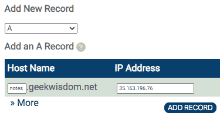

Node.js 应用程序中的安全性

我们即将结束学习 Node.js 的旅程。但还有一个重要的话题需要讨论：**安全**。您的应用程序的安全性非常重要。您想因为您的应用程序是自 Twitter 以来最伟大的东西而上新闻，还是因为通过您的网站发起的大规模网络安全事件而闻名？

多年来，全球各地的网络安全官员一直呼吁加强互联网安全。诸如互联网连接的安全摄像头之类的东西中的安全漏洞已被不法分子武器化为庞大的僵尸网络，并用于殴打网站或进行其他破坏。在其他情况下，由于安全入侵而导致的猖獗身份盗窃对我们所有人构成了财务威胁。几乎每天，新闻中都会有更多关于网络安全问题的揭示。

我们在本书中多次提到了这个问题。从第十章开始，即*在 Linux 上部署 Node.js 应用程序*，我们讨论了需要将 Notes 的部署分段以对抗入侵，并特别是将用户数据库隔离在受保护的容器中。您在关键系统周围放置的安全层越多，攻击者进入的可能性就越小。虽然 Notes 是一个玩具应用程序，但我们可以用它来学习如何实施 Web 应用程序安全。

安全不应该是事后才考虑的，就像测试不应该是事后才考虑的一样。两者都非常重要，即使只是为了避免公司因错误原因而上新闻。

在本章中，我们将涵盖以下主题：

+   在 AWS ECS 上为 Express 应用程序实施 HTTPS/SSL

+   使用 Helmet 库为内容安全策略、DNS 预取控制、帧选项、严格传输安全性和减轻 XSS 攻击实施标头

+   防止跨站点请求伪造攻击表单

+   SQL 注入攻击

+   对已知漏洞的软件包进行预部署扫描

+   审查 AWS 上可用的安全设施

对于一般建议，Express 团队在[`expressjs.com/en/advanced/best-practice-security.html`](https://expressjs.com/en/advanced/best-practice-security.html)上有一个出色的安全资源页面。

如果尚未这样做，请复制第十三章，*单元测试和功能测试*，源树，您可能已经称为`chap13`，以创建一个*安全*源树，您可以称为`chap14`。

在本章结束时，您将了解到提供 SSL 证书的详细信息，使用它们来实施 HTTPS 反向代理。之后，您将了解有关改进 Node.js Web 应用程序安全性的几种工具。这应该为您提供 Web 应用程序安全的基础。

让我们从为部署的 Notes 应用程序实施 HTTPS 支持开始。

# 第十八章：在部署的 Node.js 应用程序中为 Docker 实施 HTTPS

当前的最佳实践是每个网站都必须使用 HTTPS 访问。传输未加密信息的时代已经过去。这种旧模式容易受到中间人攻击和其他威胁的影响。

使用 SSL 和 HTTPS 意味着互联网连接经过身份验证和加密。加密足够好，可以阻止除最先进的窥探者之外的所有人，而身份验证意味着我们确信网站就是它所说的那样。HTTPS 使用 HTTP 协议，但使用 SSL 或安全套接字层进行加密。实施 HTTPS 需要获取 SSL 证书并在 Web 服务器或 Web 应用程序中实施 HTTPS 支持。

给定一个合适的 SSL 证书，Node.js 应用程序可以很容易地实现 HTTPS，因为只需少量代码就可以给我们一个 HTTPS 服务器。但还有另一种方法，可以提供额外的好处。NGINX 是一个备受推崇的 Web 服务器和代理服务器，非常成熟和功能丰富。我们可以使用它来实现 HTTPS 连接，并同时获得另一层保护，防止潜在的不法分子和 Notes 应用程序之间的攻击。

我们已经在 AWS EC2 集群上使用 Docker swarm 部署了 Notes。使用 NGINX 只是简单地向 swarm 添加另一个容器，配置所需的工具来提供 SSL 证书。为此，我们将使用一个将 NGINX 与 Let's Encrypt 客户端程序结合在一起，并编写脚本来自动更新证书的 Docker 容器。Let's Encrypt 是一个非营利性组织，提供免费 SSL 证书的优秀服务。使用他们的命令行工具，我们可以根据需要提供和管理 SSL 证书。

在这一部分，我们将做以下工作：

1.  配置一个域名指向我们的 swarm

1.  整合一个包含 NGINX、Cron 和 Certbot（Let's Encrypt 客户端工具之一）的 Docker 容器

1.  在该容器中实现自动化流程来管理证书的更新

1.  配置 NGINX 监听端口`443`（HTTPS）以及端口`80`（HTTP）

1.  配置 Twitter 应用程序以支持网站的 HTTPS

这可能看起来是很多工作，但每项任务都很简单。让我们开始吧。

## 为部署在 AWS EC2 上的应用程序分配一个域名

Notes 应用程序是使用在 AWS EC2 实例上构建的 Docker swarm 部署的。其中一个实例有一个由 AWS 分配的公共 IP 地址和域名。最好给 EC2 实例分配一个域名，因为 AWS 分配的名称不仅用户不友好，而且在下次重新部署集群时会更改。给 EC2 实例分配一个域名需要有一个注册的域名，添加一个列出其 IP 地址的 A 记录，并在 EC2 IP 地址更改时更新 A 记录。

添加 A 记录意味着什么？**域名系统**（**DNS**）是让我们可以使用`geekwisdom.net`这样的名称来访问网站，而不是 IP 地址`216.239.38.21`。在 DNS 协议中，有几种类型的*记录*可以与系统中的域名条目相关联。对于这个项目，我们只需要关注其中一种记录类型，即 A 记录，用于记录域名的 IP 地址。一个被告知访问任何域的网络浏览器会查找该域的 A 记录，并使用该 IP 地址发送网站内容的 HTTP(S)请求。

将 A 记录添加到域的 DNS 条目的具体方法在不同的域注册商之间差异很大。例如，一个注册商（Pair Domains）有这样的屏幕：



在特定域的仪表板中，可能有一个用于添加新 DNS 记录的部分。在这个注册商中，下拉菜单可以让你在记录类型中进行选择。选择 A 记录类型，然后在你的域名中在右侧框中输入 IP 地址，在左侧框中输入子域名。在这种情况下，我们正在创建一个子域，`notes.geekwisdom.net`，这样我们就可以部署一个测试站点，而不会影响到托管在该域上的主站点。这也让我们避免了为这个项目注册一个新域名的费用。

一旦你点击“添加记录”按钮，A 记录就会被发布。由于 DNS 记录通常需要一些时间来传播，你可能无法立即访问域名。如果这需要超过几个小时，你可能做错了什么。

一旦 A 记录成功部署，你的用户就可以访问`notes.geekwisdom.net`这样一个漂亮的域名的 Notes 应用程序。

请注意，每次重新部署 EC2 实例时，IP 地址都会更改。如果重新部署 EC2 实例，则需要更新新地址的 A 记录。

在本节中，我们已经了解了将域名分配给 EC2 实例。这将使我们的用户更容易访问 Notes，同时也让我们可以提供 HTTPS/SSL 证书。

添加域名意味着更新 Twitter 应用程序配置，以便 Twitter 知道该域名。

## 更新 Twitter 应用程序

Twitter 需要知道哪些 URL 对我们的应用程序有效。到目前为止，我们已经告诉 Twitter 我们笔记本上的测试 URL。我们在一个真实域上有 Notes，我们需要告诉 Twitter 这一点。

我们已经做过这个几次了，所以你已经知道该怎么做了。前往`developers.twitter.com`，使用您的 Twitter 帐户登录，然后转到应用程序仪表板。编辑与您的 Notes 实例相关的应用程序，并将您的域名添加到 URL 列表中。

我们将为 Notes 应用程序实现 HTTP 和 HTTPS，因此 Notes 将具有`http://`和`https://` URL。这意味着您不仅必须将 HTTP URL 添加到 Twitter 配置站点，还必须将 HTTPS URL 添加到其中。

在`compose-stack/docker-compose.yml`文件中，`svc-notes`配置中的`TWITTER_CALLBACK_HOST`环境变量也必须使用该域名进行更新。

现在我们已经有了与 EC2 集群关联的域名，并且我们已经通知了 Twitter 该域名。我们应该能够重新部署 Notes 到集群，并能够使用该域名。这包括能够使用 Twitter 登录，创建和删除笔记等。在这一点上，您不能将 HTTPS URL 放入`TWITTER_CALLBACK_HOST`，因为我们还没有实现 HTTPS 支持。

这些步骤为在 Notes 上使用 Let's Encrypt 实现 HTTPS 做好了准备。但首先，让我们来了解一下 Let's Encrypt 的工作原理，以便更好地为 Notes 实现它。

## 规划如何使用 Let's Encrypt

与每个 HTTPS/SSL 证书提供商一样，Let's Encrypt 需要确保您拥有您正在请求证书的域。成功使用 Let's Encrypt 需要在发出任何 SSL 证书之前进行成功验证。一旦域名注册到 Let's Encrypt，注册必须至少每 90 天更新一次，因为这是他们 SSL 证书的到期时间。域名注册和证书更新因此是我们必须完成的两项主要任务。

在本节中，我们将讨论注册和更新功能的工作原理。我们的目标是了解我们将如何管理我们计划使用的任何域的 HTTPS 服务。

Let's Encrypt 支持 API，并且有几个客户端应用程序用于此 API。Certbot 是 Let's Encrypt 请求的推荐用户界面。它可以轻松安装在各种操作系统上。例如，它可以通过 Debian/Ubuntu 软件包管理系统获得。

有关 Let's Encrypt 文档，请参阅[`letsencrypt.org/docs/`](https://letsencrypt.org/docs/)。

有关 Certbot 文档，请参阅[`certbot.eff.org/docs/intro.html`](https://certbot.eff.org/docs/intro.html)。

验证域名所有权是 HTTPS 的核心特性，这使得它成为任何 SSL 证书供应商确保正确分发 SSL 证书的核心要求。Let's Encrypt 有几种验证策略，在这个项目中，我们将专注于其中一种，即 HTTP-01 挑战。

HTTP-01 挑战涉及 Let's Encrypt 服务向 URL 发出请求，例如`http://<YOUR_DOMAIN>/.well-known/acme-challenge/<TOKEN>`。`<TOKEN>`是 Let's Encrypt 提供的编码字符串，Certbot 工具将其写入目录中的文件。我们的任务是以某种方式允许 Let's Encrypt 服务器使用此 URL 检索该文件。

一旦 Certbot 成功地将域名注册到 Let's Encrypt，它将收到一对 PEM 文件，包括 SSL 证书。Certbot 跟踪各种管理细节和 SSL 证书，通常在`/etc/letsencrypt`目录中。然后必须使用 SSL 证书来实现 Notes 的 HTTPS 服务器。

Let's Encrypt SSL 证书在 90 天后过期，我们必须创建一个自动化的管理任务来更新证书。Certbot 也用于证书更新，通过运行`certbot renew`。这个命令查看在这台服务器上注册的域名，并对任何需要更新的域名重新运行验证过程。因此，必须保持启用 HTTP-01 挑战所需的目录。

拥有 SSL 证书后，我们必须配置一些 HTTP 服务器实例来使用这些证书来实现 HTTPS。非常有可能配置`svc-notes`服务来独立处理 HTTPS。在 Node.js 运行时中有一个 HTTPS 服务器对象，可以处理这个要求。在`notes/app.mjs`中进行小的重写以适应 SSL 证书来实现 HTTPS，以及 HTTP-01 挑战。

但还有另一种可能的方法。诸如 NGINX 之类的 Web 服务器非常成熟、稳健、经过充分测试，最重要的是支持 HTTPS。我们可以使用 NGINX 来处理 HTTPS 连接，并使用所谓的*反向代理*将流量传递给`svc-notes`作为 HTTP。也就是说，NGINX 将被配置为接受入站 HTTPS 流量，将其转换为 HTTP 流量发送到`svc-notes`。

除了实现 HTTPS 的安全目标之外，这还有一个额外的优势，即使用一个备受推崇的 Web 服务器（NGINX）来作为对抗某些类型攻击的屏障。

在查看了 Let's Encrypt 文档之后，我们知道了如何继续。有一个可用的 Docker 容器，可以处理我们需要在 NGINX 和 Let's Encrypt 中进行的所有操作。在下一节中，我们将学习如何将该容器与 Notes 堆栈集成，并实现 HTTPS。

## 使用 NGINX 和 Let's Encrypt 在 Docker 中为 Notes 实现 HTTPS

我们刚刚讨论了如何使用 Let's Encrypt 为 Notes 实现 HTTPS。我们将采取的方法是使用一个预先制作的 Docker 容器，Cronginx（[`hub.docker.com/r/robogeek/cronginx`](https://hub.docker.com/r/robogeek/cronginx)），其中包括 NGINX、Certbot（Let's Encrypt 客户端）和一个用于管理 SSL 证书更新的 Cron 服务器和 Cron 作业。这只需要向 Notes 堆栈添加另一个容器，进行一些配置，并运行一个命令来注册我们的域名到 Let's Encrypt。

在开始本节之前，请确保您已经设置了一个域名，我们将在这个项目中使用。

在 Cronginx 容器中，Cron 用于管理后台任务以更新 SSL 证书。是的，Cron，Linux/Unix 管理员几十年来一直用来管理后台任务的服务器。

NGINX 配置将同时处理 HTTP-01 挑战并为 HTTPS 连接使用反向代理。*代理服务器*充当中间人；它接收来自客户端的请求，并使用其他服务来满足这些请求。*反向代理*是一种从一个或多个其他服务器检索资源的代理服务器，同时使其看起来像资源来自代理服务器。在这种情况下，我们将配置 NGINX 以访问`http://svc-notes:3000`上的 Notes 服务，同时使 Notes 服务看起来是由 NGINX 代理托管的。

如果您不知道如何配置 NGINX，不用担心，因为我们将准确地展示该怎么做，而且相对简单。

### 添加 Cronginx 容器以支持 Notes 上的 HTTPS

我们已经确定，添加 HTTPS 支持需要向 Notes 堆栈添加另一个容器。这个容器将处理 HTTPS 连接，并集成用于管理从 Let's Encrypt 获取的 SSL 证书的工具。

在`compose-stack`目录中，编辑`docker-compose.yml`如下：

```

Because the `svc-notes` container will not be handling inbound traffic, we start by disabling its `ports` tag. This has the effect of ensuring it does not export any ports to the public. Instead, notice that in the `cronginx` container we export both port `80` (HTTP) and port `443` (HTTPS). That container will take over interfacing with the public internet.

Another change on `svc-notes` is to set the `TWITTER_CALLBACK_HOST` environment variable. Set this to the domain name you've chosen. Remember that correctly setting this variable is required for successful login using Twitter. Until we finish implementing HTTPS, this should have an HTTP URL.

The `deploy` tag for Cronginx is the same as for `svc-notes`. In theory, because `svc-notes` is no longer interacting with the public it could be redeployed to an EC2 instance on the private network. Because both are attached to `frontnet`, either will be able to access the other with a simple domain name reference, which we'll see in the configuration file.

This container uses the same DNS configuration, because Certbot needs to be able to reach the Let's Encrypt servers to do its work.

The final item of interest is the volume mounts. In the previous section, we discussed certain directories that must be mounted into this container. As with the database containers, the purpose is to persist the data in those directories while letting us destroy and recreate the Cronginx container as needed. Each directory is mounted from `/home/ubuntu` because that's the directory that is available on the EC2 instances. The three directories are as follows:

*   `/etc/letsencrypt`: As discussed earlier, Certbot uses this directory to track administrative information about domains being managed on the server. It also stores the SSL certificates in this directory.
*   `/webroots`: This directory will be used in satisfying the HTTP-01 request to the `http://<YOUR_DOMAIN>/.well-known/acme-challenge/<TOKEN>` URL.
*   `/etc/nginx/conf.d`: This directory holds the NGINX configuration files for each domain we'll handle using this Cronginx instance.

For NGINX configuration, there is a default config file at `/etc/nginx/nginx.conf`. That file automatically includes any configuration file in `/etc/nginx/conf.d`, within an `http` context. What that means is each such file should have one or more `server` declarations. It won't be necessary to go deeper into learning about NGINX since the config files we will use are very straightforward.

We will be examining NGINX configuration files. If you need to learn more about these files, the primary documentation is at [`nginx.org/en/docs/`](https://nginx.org/en/docs/).

Further documentation for the commercial NGINX Plus product is at [`www.nginx.com/resources/admin-guide/`](https://www.nginx.com/resources/admin-guide/).

The NXING website has a *Getting Started* section with many useful recipes at [`www.nginx.com/resources/wiki/start/`](https://www.nginx.com/resources/wiki/start/).

It will be a useful convention to follow to have one file in the `/etc/nginx/conf.d` directory for each domain you are hosting. That means, in this project, you will have one domain, and therefore you'll store one file in the directory named `YOUR-DOMAIN.conf`. For the example domain we configured earlier, that file would be `notes.geekwisdom.net.conf`.

### Creating an NGINX configuration to support registering domains with Let's Encrypt

At this point, you have selected a domain you will use for Notes. To register a domain with Let's Encrypt, we need a web server configured to satisfy requests to the `http://<YOUR_DOMAIN>/.well-known/acme-challenge/<TOKEN>` URL, and where the corresponding directory is writable by Certbot. All the necessary elements are contained in the Cronginx container. 

What we need to do is create an NGINX configuration file suitable for handling registration, then run the shell script supplied inside Cronginx. After registration is handled, there will be another NGINX configuration file that's suitable for HTTPS. We'll go over that in a later section.

Create a file for your domain named `initial-YOUR-DOMAIN.conf`, named this way because it's the initial configuration file for the domain. It will contain this:

```

正如我们所说，NGINX 配置文件相对简单。这声明了一个服务器，本例中监听端口为`80`（HTTP）。如果需要，可以轻松开启 IPv6 支持。

`server_name`字段告诉 NGINX 要处理哪个域名。`access_log`和`error_log`字段，顾名思义，指定了日志输出的位置。

`location`块描述了如何处理域的 URL 空间的部分。在第一个块中，它表示`/.well-known` URL 上的 HTTP-01 挑战是通过从`/webroots/YOUR-DOMAIN`读取文件来处理的。我们已经在`docker-compose.yml`文件中看到了该目录的引用。

第二个`location`块描述了反向代理配置。在这种情况下，我们配置它以在端口`3000`上对`svc-notes`容器运行 HTTP 代理。这对应于`docker-compose.yml`文件中的配置。

这就是配置文件，但在部署到 swarm 之前，我们需要做一些工作。

### 在 EC2 主机上添加所需的目录

我们已经确定了三个用于 Cronginx 的目录。请记住，每个 EC2 主机都是由我们在 Terraform 文件的`user_data`字段中提供的 shell 脚本进行配置的。该脚本安装 Docker 并执行另一个设置。因此，我们应该使用该脚本来创建这三个目录。

在`terraform-swarm`中，编辑`ec2-public.tf`并进行以下更改：

```

There is an existing shell script that performs the Docker setup. These three lines are appended to that script and create the directories.

With this in place, we can redeploy the EC2 cluster, and the directories will be there ready to be used.

### Deploying the EC2 cluster and Docker swarm

Assuming that the EC2 cluster is currently not deployed, we can set it up as we did in Chapter 12, *Deploying a Docker Swarm to AWS EC2 with Terraform*. In `terraform-swarm`, run this command:

```

到目前为止，你已经做了几次这样的事情，知道该怎么做。等待部署完成，记录 IP 地址和其他数据，然后初始化 swarm 集群并设置远程控制访问，这样你就可以在笔记本上运行 Docker 命令。

一个非常重要的任务是获取 IP 地址并转到您的 DNS 注册商，更新域的 A 记录为新的 IP 地址。

我们需要将 NGINX 配置文件复制到`/home/ubuntu/nginx-conf-d`，操作如下：

```

The `chown` command is required because when Terraform created that directory it became owned by the `root` user. It needs to be owned by the `ubuntu` user for the `scp` command to work.

At this point make sure that, in `compose-swarm/docker-compose.yml`, the `TWITTER_CALLBACK_HOST` environment variable for `svc-notes` is set to the HTTP URL (`http://YOUR-DOMAIN`) rather than the HTTPS URL. Obviously you have not yet provisioned HTTPS and can only use the HTTP domain.

With those things set up, we can run this:

```

这将向 swarm 添加所需的秘密，并部署 Notes 堆栈。几分钟后，所有服务应该都已启动。请注意，Cronginx 是其中之一。

一旦完全启动，您应该能够像以往一样使用 Notes，但使用您配置的域名。您甚至可以使用 Twitter 登录。

### 使用 Let's Encrypt 注册域名

我们刚刚在 AWS EC2 基础设施上部署了 Notes 堆栈。这次部署的一部分是 Cronginx 容器，我们将用它来处理 HTTPS 配置。

我们已经在 swarm 上部署了 Notes，`cronginx`容器充当 HTTP 代理。在该容器内预先安装了 Certbot 工具和一个脚本（`register.sh`）来帮助注册域名。我们必须在`cronginx`容器内运行`register.sh`，一旦域名注册完成，我们将需要上传一个新的 NGINX 配置文件。

在`cronginx`容器内启动 shell 可能会很容易：

```

You see there is a file named `register.sh` containing the following:

```

该脚本旨在创建`/webroots`中所需的目录，并使用 Certbot 注册域名并提供 SSL 证书。参考配置文件，您将看到`/webroots`目录的使用方式。

`certbot certonly`命令只检索 SSL 证书，不会在任何地方安装它们。这意味着它不会直接集成到任何服务器中，而只是将证书存储在一个目录中。该目录位于`/etc/letsencrypt`层次结构内。

`--webroot`选项意味着我们正在与现有的 Web 服务器合作。必须配置它以从指定为`-w`选项的目录中提供`/.well-known/acme-challenge`文件，这就是我们刚刚讨论过的`/webroots/YOUR-DOMAIN`目录。`-d`选项是要注册的域名。

简而言之，`register.sh`与我们创建的配置文件相匹配。

脚本的执行方式如下：

```

We run the shell script using `sh -x register.sh` and supply our chosen domain name as the first argument. Notice that it creates the `/webroots` directory, which is required for the Let's Encrypt validation. It then runs `certbot certonly`, and the tool starts asking questions required for registering with the service.

The registration process ends with this message:

```

关键数据是构成 SSL 证书的两个 PEM 文件的路径名。它还告诉您定期运行`certbot renew`来更新证书。我们已经通过安装 Cron 作业来处理了这个问题。

正如他们所说，将这个目录持久化存储在其他地方是很重要的。我们已经采取了第一步，将其存储在容器外部，这样我们可以随意销毁和重新创建容器。但是当需要销毁和重新创建 EC2 实例时怎么办？在您的待办事项中安排一个任务来设置备份程序，然后在 EC2 集群初始化期间从备份中安装这个目录。

现在我们的域名已经注册到 Let's Encrypt，让我们修改 NGINX 配置以支持 HTTPS。

## 使用 Let's Encrypt 证书实现 NGINX HTTPS 配置

好了，我们离加密如此之近，我们可以感受到它的味道。我们已经将 NGINX 和 Let's Encrypt 工具部署到了笔记应用程序堆栈中。我们已经验证了仅支持 HTTP 的 NGINX 配置是否正确。我们已经使用 Certbot 为 HTTPS 从 Let's Encrypt 提供 SSL 证书。现在是时候重写 NGINX 配置以支持 HTTPS，并将该配置部署到笔记堆栈中。

在`compose-stack/cronginx`中创建一个新文件，`YOUR-DOMAIN.conf`，例如`notes.geekwisdom.net.conf`。之前的文件有一个前缀`initial`，因为它在实现 HTTPS 的初始阶段为我们提供了服务。现在域名已经注册到 Let's Encrypt，我们需要一个不同的配置文件：

```

This reconfigures the HTTP server to do permanent redirects to the HTTPS site. When an HTTP request results in a 301 status code, that is a permanent redirect. Any redirect tells web browsers to visit a URL provided in the redirect. There are two kinds of redirects, temporary and permanent, and the 301 code makes this a permanent redirect. For permanent redirects, the browser is supposed to remember the redirect and apply it in the future. In this case, the redirect URL is computed to be the request URL, rewritten to use the HTTPS protocol.

Therefore our users will silently be sent to the HTTPS version of Notes, with no further effort on our part.

To implement the HTTPS server, add this to the config file:

```

这是 NGINX 中的 HTTPS 服务器实现。与 HTTP 服务器声明有许多相似之处，但也有一些特定于 HTTPS 的项目。它在端口`443`上监听，这是 HTTPS 的标准端口，并告诉 NGINX 使用 SSL。它具有相同的服务器名称和日志配置。

下一部分告诉 NGINX SSL 证书的位置。只需用 Certbot 给出的路径名替换它。

下一部分处理了`/.well-known`的 URL，用于将来使用 Let's Encrypt 进行验证请求。HTTP 和 HTTPS 服务器定义都已配置为从同一目录处理此 URL。我们不知道 Let's Encrypt 是否会通过 HTTP 或 HTTPS URL 请求验证，因此我们可能会在两个服务器上都支持这一点。

下一部分是一个代理服务器，用于处理`/socket.io`的 URL。这需要特定的设置，因为 Socket.IO 必须从 HTTP/1.1 升级到 WebSocket。否则，JavaScript 控制台会打印错误，并且 Socket.IO 功能将无法工作。有关更多信息，请参见代码中显示的 URL。

最后一部分是设置一个反向代理，将 HTTPS 流量代理到运行在端口`3000`上的 HTTP 后端服务器上的笔记应用程序。

创建了一个新的配置文件后，我们可以将其上传到`notes-public` EC2 实例中，方法如下：

```

The next question is how do we restart the NGINX server so it reads the new configuration file? One way is to send a SIGHUP signal to the NGINX process, causing it to reload the configuration:

```

`nginx.pid`文件包含 NGINX 进程的进程 ID。许多 Unix/Linux 系统上的后台服务都将进程 ID 存储在这样的文件中。这个命令向该进程发送 SIGHUP 信号，NGINX 在接收到该信号时会重新读取其配置。SIGHUP 是标准的 Unix/Linux*信号*之一，通常用于导致后台进程重新加载其配置。有关更多信息，请参见`signal(2)`手册页。

但是，使用 Docker 命令，我们可以这样做：

```

That will kill the existing container and start a new one.

Instead of that rosy success message, you might get this instead:

```

这表示 Docker swarm 看到容器退出了，因此无法重新启动服务。

在 NGINX 配置文件中很容易出错。首先仔细查看配置，看看可能出了什么问题。诊断的下一阶段是查看 NGINX 日志。我们可以使用`docker logs`命令来做到这一点，但我们需要知道容器的名称。因为容器已经退出，我们必须运行这个命令：

```

The `-a` option causes `docker ps` to return information about every container, even the ones that are not currently running. With the container name in hand, we can run this:

```

事实上，问题是语法错误，它甚至会友好地告诉您行号。

一旦您成功重新启动了`cronginx`服务，请访问您部署的 Notes 服务并验证它是否处于 HTTPS 模式。

在本节中，我们成功地为基于 AWS EC2 的 Docker 集群部署了 Notes 应用程序堆栈的 HTTPS 支持。我们使用了上一节中创建的 Docker 容器文件，并将更新后的 Notes 堆栈部署到了集群中。然后我们运行 Certbot 来注册我们的域名并使用 Let's Encrypt。然后我们重写了 NGINX 配置以支持 HTTPS。

我们的下一个任务是验证 HTTPS 配置是否正常工作。

## 测试 Notes 应用程序的 HTTPS 支持

在本书中，我们对 Notes 进行了临时测试和更正式的测试。因此，您知道要确保 Notes 在这个新环境中正常工作需要做什么。但是还有一些特定于 HTTPS 的事项需要检查。

在浏览器中，转到您托管应用程序的域名。如果一切顺利，您将会看到应用程序，并且它将自动重定向到 HTTPS 端口。

为了让我们人类知道网站是在 HTTPS 上，大多数浏览器在地址栏中显示一个*锁*图标。

您应该能够单击该锁图标，浏览器将显示一个对话框，提供有关证书的信息。证书将验证这确实是正确的域，并且还将显示证书是由 Let's Encrypt 通过**Let's Encrypt Authority X3**颁发的。

您应该能够浏览整个应用程序并仍然看到锁图标。

您应该注意*mixed content*警告。这些警告将出现在 JavaScript 控制台中，当 HTTPS 加载的页面上的某些内容使用 HTTP URL 加载时会出现。混合内容场景不够安全，因此浏览器会向用户发出警告。消息可能会出现在浏览器内的 JavaScript 控制台中。如果您正确地按照本书中的说明操作，您将不会看到此消息。

最后，前往 Qualys SSL Labs SSL 实现测试页面。该服务将检查您的网站，特别是 SSL 证书，并为您提供一个分数。要检查您的分数，请参阅[`www.ssllabs.com/ssltest/`](https://www.ssllabs.com/ssltest/)。

完成了这项任务后，您可能希望关闭 AWS EC2 集群。在这样做之前，最好先从 Let's Encrypt 中注销域名。这也只需要运行带有正确命令的 Certbot：

```

As before, we run `docker ps` to find out the exact container name. With that name, we start a command shell inside the container. The actual act is simple, we just run `certbot delete` and specify the domain name.

Certbot doesn't just go ahead and delete the registration. Instead, it asks you to verify that's what you want to do, then it deletes the registration.

In this section, we have finished implementing HTTPS support for Notes by learning how to test that it is implemented correctly.

We've accomplished a redesign of the Notes application stack using a custom NGINX-based container to implement HTTPS support. This approach can be used for any service deployment, where an NGINX instance is used as the frontend to any kind of backend service.

But we have other security fish to fry. Using HTTPS solves only part of the security problem. In the next section, we'll look at Helmet, a tool for Express applications to set many security options in the HTTP headers.

# Using Helmet for across-the-board security in Express applications

While it was useful to implement HTTPS, that's not the end of implementing security measures. It's hardly the beginning of security, for that matter. The browser makers working with the standards organizations have defined several mechanisms for telling the browser what security measures to take. In this section, we will go over some of those mechanisms, and how to implement them using Helmet.

Helmet ([`www.npmjs.com/package/helmet`](https://www.npmjs.com/package/helmet)) is, as the development team says, not a security silver bullet (do Helmet's authors think we're trying to protect against vampires?). Instead, it is a toolkit for setting various security headers and taking other protective measures in Node.js applications. It integrates with several packages that can be either used independently or through Helmet.

Using Helmet is largely a matter of importing the library into `node_modules`, making a few configuration settings, and integrating it with Express.

In the `notes` directory, install the package like so:

```

然后将此添加到`notes/app.mjs`中：

```

That's enough for most applications. Using Helmet out of the box provides a reasonable set of default security options. We could be done with this section right now, except that it's useful to examine closely what Helmet does, and its options.

Helmet is actually a cluster of 12 modules for applying several security techniques. Each can be individually enabled or disabled, and many have configuration settings to make. One option is instead of using that last line, to initialize and configure the sub-modules individually. That's what we'll do in the following sections.

## Using Helmet to set the Content-Security-Policy header

The **Content-Security-Policy** (**CSP**) header can help to protect against injected malicious JavaScript and other file types.

We would be remiss to not point out a glaring problem with services such as the Notes application. Our users could enter any code they like, and an improperly behaving application will simply display that code. Such applications can be a vector for JavaScript injection attacks among other things.

To try this out, edit a note and enter something like this:

```

单击保存按钮，您将看到此代码显示为文本。Notes 的危险版本将在 notes 视图页面中插入`<script>`标签，以便加载恶意 JavaScript 并为访问者造成问题。相反，`<script>`标签被编码为安全的 HTML，因此它只会显示为屏幕上的文本。我们并没有为这种行为做任何特殊处理，Handlebars 为我们做了这个。

实际上，这更有趣一些。如果我们查看 Handlebars 文档，[`handlebarsjs.com/expressions.html`](http://handlebarsjs.com/expressions.html)，我们会了解到这个区别：

```

In Handlebars, a value appearing in a template using two curly braces (`{{encoded}}`) is encoded using HTML coding. For the previous example, the angle bracket is encoded as `&lt;` and so on for display, rendering that JavaScript code as neutral text rather than as HTML elements. If instead, you use three curly braces (`{{{notEncoded}}}`), the value is not encoded and is instead presented as is. The malicious JavaScript would be executed in your visitor's browser, causing problems for your users.

We can see this problem by changing `views/noteview.hbs` to use raw HTML output:

```

我们不建议这样做，除非作为一个实验来看看会发生什么。效果是，正如我们刚才说的，允许用户输入 HTML 代码并将其原样显示。如果 Notes 以这种方式行事，任何笔记都可能携带恶意 JavaScript 片段或其他恶意软件。

让我们回到 Helmet 对 Content-Security-Policy 头的支持。有了这个头部，我们指示 Web 浏览器可以从哪个范围下载某些类型的内容。具体来说，它让我们声明浏览器可以从哪些域下载 JavaScript、CSS 或字体文件，以及浏览器允许连接哪些域进行服务。

因此，这个标头解决了所命名的问题，即我们的用户输入恶意 JavaScript 代码。但它还处理了恶意行为者入侵并修改模板以包含恶意 JavaScript 代码的类似风险。在这两种情况下，告诉浏览器特定的允许域名列表意味着恶意网站的 JavaScript 引用将被阻止。从`pirates.den`加载的恶意 JavaScript 不会运行。

要查看此 Helmet 模块的文档，请参阅[`helmetjs.github.io/docs/csp/`](https://helmetjs.github.io/docs/csp/)。

有很多选项。例如，您可以导致浏览器将任何违规行为报告给您的服务器，这样您就需要为`/report-violation`实现一个路由处理程序。这段代码对 Notes 来说已经足够了：

```

For better or for worse, the Notes application implements one security best practice—all CSS and JavaScript files are loaded from the same server as the application. Therefore, for the most part, we can use the `'self'` policy. There are several exceptions:

*   `scriptSrc`: Defines where we are allowed to load JavaScript. We do use inline JavaScript in `noteview.hbs` and `index.hbs`, which must be allowed.
*   `styleSrc`, `fontSrc`: We're loading CSS files from both the local server and from Google Fonts.
*   `connectSrc`: The WebSockets channel used by Socket.IO is declared here.

To develop this, we can open the JavaScript console or Chrome DevTools while browsing the website. Errors will show up listing any domains of failed download attempts. Simply add such domains to the configuration object.

### Making the ContentSecurityPolicy configurable

Obviously, the ContentSecurityPolicy settings shown here should be configurable. If nothing else the setting for `connectSrc` must be, because it can cause a problem that prevents Socket.IO from working. As shown here, the `connectSrc` setting includes the URL `wss://notes.geekwisdom.net`. The `wss` protocol here refers to WebSockets and is designed to allow Socket.IO to work while Notes is hosted on `notes.geekwisdom.net`. But what about when we want to host it on a different domain?

To experiment with this problem, change the hard coded string to a different domain name then redeploy it to your server. In the JavaScript console in your browser you will get an error like this:

```

发生的情况是，静态定义的常量不再与 Notes 部署的域兼容。您已重新配置此设置，以限制连接到不同域，例如`notes.newdomain.xyz`，但服务仍托管在现有域，例如`notes.geekwisdom.net`。浏览器不再相信连接到`notes.geekwisdom.net`是安全的，因为您的配置说只信任`notes.newdomain.xyz`。

最好的解决方案是通过声明另一个环境变量来使其成为可配置的设置，以便根据需要进行设置以自定义行为。

在`app.mjs`中，将`contentSecurityPolicy`部分更改为以下内容：

```

This lets us define an environment variable, `CSP_CONNECT_SRC_URL`, which will supply a URL to be added into the array passed to the `connectSrc` parameter. Otherwise, the `connectSrc` setting will be limited to `"'self'"`.

Then in `compose-swarm/docker-compose.yml`, we can declare that variable like so:

```

我们现在可以在配置中设置它，根据需要进行更改。

重新运行`docker stack deploy`命令后，错误消息将消失，Socket.IO 功能将开始工作。

在本节中，我们了解了网站向浏览器发送恶意脚本的潜力。接受用户提供内容的网站，如 Notes，可能成为恶意软件的传播途径。通过使用这个标头，我们能够通知网络浏览器在访问这个网站时信任哪些域名，从而阻止任何恶意内容被恶意第三方添加。

接下来，让我们学习如何防止过多的 DNS 查询。

## 使用头盔设置 X-DNS-Prefetch-Control 标头

DNS Prefetch 是一些浏览器实现的一种便利，其中浏览器将预先为给定页面引用的域名进行 DNS 请求。如果页面有指向其他网站的链接，它将为这些域名进行 DNS 请求，以便填充本地 DNS 缓存。这对用户很好，因为它提高了浏览器的性能，但它也是一种侵犯隐私的行为，并且可能使人看起来好像访问了他们没有访问的网站。有关文档，请参阅[`helmetjs.github.io/docs/dns-prefetch-control`](https://helmetjs.github.io/docs/dns-prefetch-control)。

使用以下内容设置 DNS 预取控制：

```

In this case, we learned about preventing the browser from making premature DNS queries. The risk is that excess DNS queries give a false impression of which websites someone has visited.

Let's next look at how to control which browser features can be enabled.

## Using Helmet to control enabled browser features using the Feature-Policy header

Web browsers nowadays have a long list of features that can be enabled, such as vibrating a phone, or turning on the camera or microphone, or reading the accelerometer. These features are interesting and very useful in some cases, but can be used maliciously. The Feature-Policy header lets us notify the web browser about which features to allow to be enabled, or to deny enabling.

For Notes we don't need any of those features, though some look intriguing as future possibilities. For instance, we could pivot to taking on Instagram if we allowed people to upload photos, maybe? In any case, this configuration is very strict:

```

要启用一个功能，要么将其设置为`'self'`以允许网站启用该功能，要么将其设置为第三方网站的域名，以允许启用该功能。例如，启用支付功能可能需要添加`'paypal.com'`或其他支付处理器。

在本节中，我们学习了允许启用或禁用浏览器功能。

在下一节中，让我们学习如何防止点击劫持。

## 使用头盔设置 X-Frame-Options 标头

**点击劫持**与劫持汽车无关，而是一种巧妙的技术，用于诱使人们点击恶意内容。这种攻击使用一个包含恶意代码的不可见`<iframe>`，放置在看起来诱人点击的东西上。然后用户会被诱使点击恶意内容。

Helmet 的`frameguard`模块将设置一个标头，指示浏览器如何处理`<iframe>`。有关文档，请参阅[`helmetjs.github.io/docs/frameguard/`](https://helmetjs.github.io/docs/frameguard/)。

```

This setting controls which domains are allowed to put this page into an `<iframe>`. Using `deny`, as shown here, prevents all sites from embedding this content using an `<iframe>`. Using `sameorigin` allows the site to embed its own content. We can also list a single domain name to be allowed to embed this content.

In this section, you have learned about preventing our content from being embedded into another website using `<iframe>`.

Now let's learn about hiding the fact that Notes is powered by Express.

## Using Helmet to remove the X-Powered-By header

The `X-Powered-By` header can give malicious actors a clue about the software stack in use, informing them of attack algorithms that are likely to succeed. The Hide Powered-By submodule for Helmet simply removes that header.

Express can disable this feature on its own:

```

或者您可以使用 Helmet 来这样做：

```

Another option is to masquerade as some other stack like so:

```

没有什么比让坏人迷失方向更好的了。

我们已经学会了如何让您的 Express 应用程序隐身，以避免给坏人提供关于如何闯入的线索。接下来让我们学习一下如何声明对 HTTPS 的偏好。

## 通过严格传输安全性改进 HTTPS

在实现了 HTTPS 支持之后，我们还没有完全完成。正如我们之前所说的，最好让我们的用户使用 Notes 的 HTTPS 版本。在我们的 AWS EC2 部署中，我们强制用户使用 HTTPS 进行重定向。但在某些情况下，我们无法这样做，而必须试图鼓励用户访问 HTTPS 站点而不是 HTTP 站点。

严格传输安全性标头通知浏览器应该使用站点的 HTTPS 版本。由于这只是一个通知，还需要实现从 HTTP 到 HTTPS 版本的重定向。

我们设置严格传输安全性如下：

```

This tells the browser to stick with the HTTPS version of the site for the next 60 days, and never visit the HTTP version.

And, as long as we're on this issue, let's learn about `express-force-ssl`, which is another way to implement a redirect so the users use HTTPS. After adding a dependency to that package in `package.json`, add this in `app.mjs`:

```

安装了这个软件包后，用户不必被鼓励使用 HTTPS，因为我们在默默地强制他们这样做。

在我们在 AWS EC2 上的部署中，使用这个模块会导致问题。因为 HTTPS 是在负载均衡器中处理的，Notes 应用程序不知道访问者正在使用 HTTPS。相反，Notes 看到的是一个 HTTP 连接，如果使用了`forceSSL`，它将强制重定向到 HTTPS 站点。但是因为 Notes 根本没有看到 HTTPS 会话，它只看到 HTTP 请求，而`forceSSL`将始终以重定向方式响应。

这些设置并非在所有情况下都有用。您的环境可能需要这些设置，但对于像我们在 AWS EC2 上部署的环境来说，这根本不需要。对于这些有用的站点，我们已经了解到如何通知 Web 浏览器使用我们网站的 HTTPS 版本，以及如何强制重定向到 HTTPS 站点。

接下来让我们学习一下**跨站脚本**（**XSS**）攻击。

## 使用 Helmet 减轻 XSS 攻击

XSS 攻击试图将 JavaScript 代码注入到网站输出中。通过在另一个网站中注入恶意代码，攻击者可以访问他们本来无法检索的信息，或者引起其他类型的麻烦。 X-XSS-Protection 标头可以防止某些 XSS 攻击，但并非所有类型的 XSS 攻击，因为 XSS 攻击有很多种类型：

```

This causes an X-XSS-Protection header to be sent specifying `1; mode=block`. This mode tells the browser to look for JavaScript in the request URL that also matches JavaScript on the page, and it then blocks that code. This is only one type of XSS attack, and therefore this is of limited usefulness. But it is still useful to have this enabled.

In this section, we've learned about using Helmet to enable a wide variety of security protections in web browsers. With these settings, our application can work with the browser to avoid a wide variety of attacks, and therefore make our site significantly safer.

But with this, we have exhausted what Helmet provides. In the next section, we'll learn about another package that prevents cross-site request forgery attacks.

# Addressing Cross-Site Request Forgery (CSRF) attacks

CSRF attacks are similar to XSS attacks in that both occur across multiple sites. In a CSRF attack, malicious software forges a bogus request on another site. To prevent such an attack, CSRF tokens are generated for each page view. The tokens are to be included as hidden values in HTML FORMs and then checked when the FORM is submitted. A mismatch on the tokens causes the request to be denied.

The `csurf` package is designed to be used with Express [`www.npmjs.com/package/csurf`](https://www.npmjs.com/package/csurf) . In the `notes` directory, run this:

```

这将安装`csurf`软件包，并在`package.json`中记录依赖关系。

然后像这样安装中间件：

```

The `csurf` middleware must be installed following the `cookieParser` middleware.

Next, for every page that includes a FORM, we must generate and send a token with the page. That requires two things, in the `res.render` call we generate the token, sending the token with other data for the page, and then in the view template we include the token as a hidden INPUT on any form in the page. We're going to be touching on several files here, so let's get started.

In `routes/notes.mjs,` add the following as a parameter to the `res.render` call for the `/add`, `/edit`, `/view`, and `/destroy` routes:

```

这将生成 CSRF 令牌，确保它与其他数据一起发送到模板。同样，在`routes/users.mjs`中的`/login`路由也要这样做。我们的下一个任务是确保相应的模板将令牌呈现为隐藏的输入。 

在`views/noteedit.hbs`和`views/notedestroy.hbs`中，添加以下内容：

```

This is a hidden INPUT, and whenever the FORM containing this is submitted this value will be carried along with the FORM parameters.

The result is that code on the server generates a token that is added to each FORM. By adding the token to FORMs, we ensure it is sent back to the server on FORM submission. Other software on the server can then match the received token to the tokens that have been sent. Any mismatched token will cause the request to be rejected.

In `views/login.hbs`, make the same addition but adding it inside the FORM like so:

```

在`views/noteview.hbs`中，有一个用于提交评论的表单。做出以下更改：

```

In every case, we are adding a hidden INPUT field. These fields are not visible to the user and are therefore useful for carrying a wide variety of data that will be useful to receive on the server. We've already used hidden INPUT fields in Notes, such as in `noteedit.hbs` for the `docreate` flag.

This `<input>` tag renders the CSRF token into the FORM. When the FORM is submitted, the `csurf` middleware checks it for the correctness and rejects any that do not match.

In this section, we have learned how to stop an important type of attack, CSRF.

# Denying SQL injection attacks

SQL injection is another large class of security exploits, where the attacker puts SQL commands into input data. See [`www.xkcd.com/327/`](https://www.xkcd.com/327/) for an example.

The best practice for avoiding this problem is to use parameterized database queries, allowing the database driver to prevent SQL injections simply by correctly encoding all SQL parameters. For example, we do this in the SQLite3 model:

```

这使用了一个参数化字符串，`key`的值被编码并插入到问号的位置。大多数数据库驱动程序都有类似的功能，并且它们已经知道如何将值编码到查询字符串中。即使坏人将一些 SQL 注入到`key`的值中，因为驱动程序正确地对`key`的内容进行了编码，最坏的结果也只是一个 SQL 错误消息。这自动使任何尝试的 SQL 注入攻击无效。

与我们本可以编写的另一种选择形成对比：

```

The template strings feature of ES6 is very tempting to use everywhere. But it is not appropriate in all circumstances. In this case, the database query parameter would not be screened nor encoded, and if a miscreant can get a custom string to that query it could cause havoc in the database.

In this section, we learned about SQL injection attacks. We learned that the best defense against this sort of attack is the coding practice all coders should follow anyway, namely to use parameterized query methods offered by the database driver.

In the next section, we will learn about an effort in the Node.js community to screen packages for vulnerabilities.

# Scanning for known vulnerabilities in Node.js packages

Built-in to the npm command-line tool is a command, `npm audit`, for reporting known vulnerabilities in the dependencies of your application. To support this command is a team of people, and software, who scan packages added to the npm registry. Every third-party package used by your application is a potential security hole.

It's not just that a query against the application might trigger buggy code, whether in your code or third-party packages. In some cases, packages that explicitly cause harm have been added to the npm registry.

Therefore the security audits of packages in the npm registry are extremely helpful to every Node.js developer.

The `audit` command consults the vulnerability data collected by the auditing team and tells you about vulnerabilities in packages your application uses.

When running `npm install`, the output might include a message like this:

```

这告诉我们，当前安装的软件包中有八个已知的漏洞。每个漏洞在这个规模上被分配了一个严重性等级（[`docs.npmjs.com/about-audit-reports`](https://docs.npmjs.com/about-audit-reports)）：

+   *严重*: 立即处理

+   *高*: 尽快处理

+   *中等*: 尽可能快地处理

+   *低*: 自行处理

在这种情况下，运行`npm audit`告诉我们，所有低优先级问题都在`minimist`软件包中。例如，报告中包括了这样的内容：

```

In this case, `minimist` is reported because `hbs` uses `handlebars`, which uses `optimist`, which uses `minimist`. There are six more instances where `minimist` is used by some package that's used by another package that our application is using.

In this case, we're given a recommendation, to upgrade to `hbs@4.1.1`, because that release results in depending on the correct version of `minimist`.

In another case, the chain of dependencies is this:

```

在这种情况下，没有推荐的修复方法，因为这些软件包都没有发布依赖于正确版本的`minimist`的新版本。这种情况的推荐解决方案是向每个相应的软件包团队提交问题，要求他们将其依赖项更新为有问题软件包的后续版本。

在最后一种情况下，是我们的应用直接依赖于有漏洞的软件包：

```

Therefore it is our responsibility to fix this problem because it is in our code. The good news is that this particular package is not executed on the server side since jQuery is a client-side library that just so happens to be distributed through the npm repository.

The first step is to read the advisory to learn what the issue is. That way, we can evaluate for ourselves how serious this is, and what we must do to correctly fix the problem.

What's not recommended is to blindly update to a later package release just because you're told to do so. What if the later release is incompatible with your application? The best practice is to test that the update does not break your code. You may need to develop tests that illustrate the vulnerability. That way, you can verify that updating the package dependency fixes the problem.

In this case, the advisory says that jQuery releases before 3.5.0 have an XSS vulnerability. We are using jQuery in Notes because it is required by Bootstrap, and on the day we read the Bootstrap documentation we were told to use a much earlier jQuery release. Today, the Bootstrap documentation says to use jQuery 3.5.1\. That tells us the Bootstrap team has already tested against jQuery 3.5.1, and we are therefore safe to go ahead with updating the dependency.

In this section, we have learned about the security vulnerability report we can get from the npm command-line tool. Unfortunately for Yarn users, it appears that Yarn doesn't support this command. In any case, this is a valuable resource for being warned about known security issues.

In the next section, we'll learn about the best practices for cookie management in Express applications.

# Using good cookie practices

Some nutritionists say eating too many sweets, such as cookies, is bad for your health. Web cookies, however, are widely used for many purposes including recording whether a browser is logged in or not. One common use is for cookies to store session data to aid in knowing whether someone is logged in or not.

In the Notes application, we're already following the good practices described in the Express security guidelines:

*   We're using an Express session cookie name different from the default shown in the documentation.
*   The Express session cookie secret is not the default shown in the documentation.
*   We use the `express-session` middleware, which only stores a session ID in the cookie, rather than the whole session data object.

Taken together, an attacker can't exploit any known vulnerability that relies on the default values for these items. While it is convenient that many software products have default values, such as passwords, those defaults could be security vulnerabilities. For example, the default Raspberry Pi login/password is *pi* and *raspberry*. While that's cute, any Raspbian-based IoT device that's left with the default login/password is susceptible to attack.

But there is more customization we can do to the cookie used with `express-session`. That package has a few options available for improving security. See [`www.npmjs.com/package/express-session`](https://www.npmjs.com/package/express-session), and then consider this change to the configuration:

```

这些是看起来有用的额外属性。`secure`属性要求 Cookie 只能通过 HTTPS 连接发送。这确保了 Cookie 数据通过 HTTPS 加密进行加密。`maxAge`属性设置了 Cookie 有效的时间，以毫秒表示。

Cookie 在 Web 浏览器中是一个非常有用的工具，即使有很多对网站如何使用 Cookie 的过度炒作的担忧。与此同时，滥用 Cookie 并造成安全问题是可能的。在这一部分，我们学习了如何通过会话 Cookie 来减轻风险。

在下一节中，我们将回顾 AWS ECS 部署的最佳实践。

# 加固 AWS EC2 部署

还有一个问题留在了第十二章中，*使用 Terraform 在 AWS EC2 上部署 Docker Swarm*，即 EC2 实例的安全组配置。我们配置了具有宽松安全组的 EC2 实例，最好是严格定义它们。我们当时确实描述了这不是最佳实践，并承诺稍后解决这个问题。这就是我们要做的地方。

在 AWS 中，要记住安全组描述了一个*防火墙*，根据 IP 端口和 IP 地址允许或禁止流量。这个工具存在是为了减少不法分子获取我们系统非法访问的潜在攻击面。

对于`ec2-public-sg`安全组，编辑`ec2-public.tf`并将其更改为以下内容：

```

This declares many specific network ports used for specific protocols. Each rule names the protocol in the `description` attribute. The `protocol` attribute says whether it is a UDP or TCP protocol. Remember that TCP is a stream-oriented protocol that ensures packets are delivered, and UDP, by contrast, is a packet-oriented protocol that does not ensure delivery. Each has characteristics making them suitable for different purposes.

Something missing is an `ingress` rule for port `3306`, the MySQL port. That's because the `notes-public` server will not host a MySQL server based on the placement constraints.

Another thing to note is which rules allow traffic from public IP addresses, and which limit traffic to IP addresses inside the VPC. Many of these ports are used in support of the Docker swarm, and therefore do not need to communicate anywhere but other hosts on the VPC.

An issue to ponder is whether the SSH port should be left open to the entire internet. If you, or your team, only SSH into the VPC from a specific network, such as an office network, then this setting could list that network. And because the `cidr_blocks` attribute takes an array, it's possible to configure a list of networks, such as a company with several offices each with their own office network.

In `ec2-private.tf`, we must make a similar change to `ec2-private-sg`:

```

这基本上是相同的，但有一些具体的区别。首先，因为私有 EC2 实例可以有 MySQL 数据库，我们声明了端口`3306`的规则。其次，除了一个规则外，所有规则都限制流量到 VPC 内的 IP 地址。

在这两个安全组定义之间，我们严格限制了 EC2 实例的攻击面。这将在任何不法分子试图侵入 Notes 服务时设置一定的障碍。

虽然我们已经为 Notes 服务实施了几项安全最佳实践，但总是还有更多可以做的。在下一节中，我们将讨论如何获取更多信息。

# AWS EC2 安全最佳实践

在设计 Notes 应用程序堆栈部署的开始，我们描述了一个应该导致高度安全部署的安全模型。我们是那种可以在餐巾纸背面设计安全部署基础设施的安全专家吗？可能不是。但 AWS 团队确实雇佣了具有安全专业知识的工程师。当我们转向 AWS EC2 进行部署时，我们了解到它提供了一系列我们在原始计划中没有考虑到的安全工具，最终我们得到了一个不同的部署模型。

在这一部分，让我们回顾一下我们做了什么，还要回顾一些 AWS 上可用的其他工具。

AWS **虚拟私有云** (**VPC**) 包含许多实现安全功能的方法，我们使用了其中的一些：

+   *安全组*充当一个严格控制进出受安全组保护的事物流量的防火墙。安全组附加到我们使用的每个基础设施元素上，在大多数情况下，我们配置它们只允许绝对必要的流量。

+   我们确保数据库实例是在 VPC 内创建的，而不是托管在公共互联网上。这样可以将数据库隐藏起来，避免公共访问。

虽然我们没有实施最初设想的分割，但围绕 Notes 的屏障足够多，应该相对安全。

在审查 AWS VPC 安全文档时，还有一些其他值得探索的设施。

AWS 虚拟私有云中的安全性：[`docs.aws.amazon.com/vpc/latest/userguide/security.html`](https://docs.aws.amazon.com/vpc/latest/userguide/security.html)。

在本节中，您有机会审查部署到 AWS ECS 的应用程序的安全性。虽然我们做得相当不错，但还有更多可以利用 AWS 提供的工具来加强应用程序的内部安全性。

有了这些，现在是时候结束本章了。

# 总结

在本章中，我们涵盖了一个非常重要的主题，应用程序安全。由于 Node.js 和 Express 社区的辛勤工作，我们能够通过在各处添加一些代码来配置安全模块，从而加强安全性。

我们首先启用了 HTTPS，因为这是现在的最佳实践，并且对我们的用户有积极的安全收益。通过 HTTPS，浏览器会对网站进行身份验证。它还可以防止中间人安全攻击，并加密用于在互联网上传输的通信，防止大部分窥探。

`helmet`包提供了一套工具，用于设置安全头，指示 Web 浏览器如何处理我们的内容。这些设置可以防止或减轻整类安全漏洞。通过`csurf`包，我们能够防止跨站点请求伪造（CSRF）攻击。

这些几个步骤是确保 Notes 应用程序安全的良好开端。但是你不应该就此止步，因为有一系列永无止境的安全问题需要解决。我们任何人都不能忽视我们部署的应用程序的安全性。

在本书的过程中，旅程是关于学习开发和部署 Node.js 网络应用程序所需的主要生命周期步骤。这始于使用 Node.js 的基础知识，然后是应用程序概念的开发，然后我们涵盖了开发、测试和部署应用程序的每个阶段。

在整本书中，我们学习了高级 JavaScript 功能，如异步函数和 ES6 模块在 Node.js 应用程序中的使用。为了存储我们的数据，我们学习了如何使用几种数据库引擎，以及一种使在不同引擎之间轻松切换的方法。

在当今的环境中，移动优先开发非常重要，为了实现这一目标，我们学习了如何使用 Bootstrap 框架。

实时通信在各种网站上都是期望的，因为先进的 JavaScript 功能意味着我们现在可以在网络应用程序中提供更多的互动服务。为了实现这一目标，我们学习了如何使用 Socket.IO 实时通信框架。

将应用程序服务部署到云主机是被广泛使用的，既可以简化系统设置，也可以扩展服务以满足用户需求。为了实现这一目标，我们学会了使用 Docker，然后学会了如何使用 Terraform 将 Docker 服务部署到 AWS ECS。我们不仅在生产部署中使用 Docker，还用它来部署测试基础设施，其中我们可以运行单元测试和功能测试。
