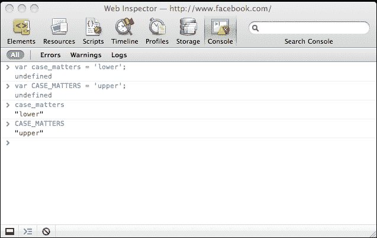
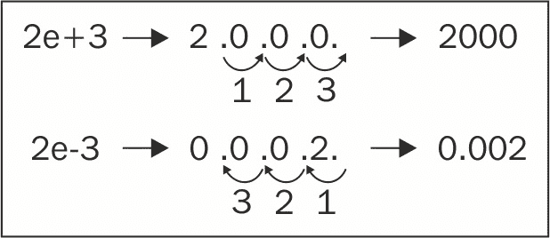
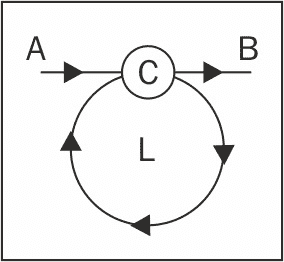

# 第二章：原始数据类型、数组、循环和条件

在深入研究 JavaScript 的面向对象特性之前，让我们首先看一些基础知识。本章将介绍以下主题：

+   JavaScript 中的原始数据类型，如字符串和数字

+   数组

+   常见运算符，如`+`、`-`、`delete`和`typeof`

+   流程控制语句，如循环和`if...else`条件

# 变量

变量用于存储数据；它们是具体值的占位符。编写程序时，使用变量而不是实际数据更方便，因为写`pi`比写`3.141592653589793`要容易得多；特别是当它在程序中多次出现时。存储在变量中的数据可以在最初分配后进行更改，因此称为**变量**。您还可以使用变量存储在编写代码时对您未知的数据，例如稍后操作的结果。

使用变量需要以下两个步骤。您需要：

+   声明变量

+   初始化它，即给它一个值

要声明变量，您将使用`var`语句，如下面的代码片段：

```js
    var a; 
    var thisIsAVariable;  
    var _and_this_too;  
    var mix12three; 

```

对于变量的名称，可以使用字母、数字、下划线字符和美元符号的任何组合。但是，不能以数字开头，这意味着以下代码声明无效：

```js
    var 2three4five; 

```

初始化变量意味着为第一次（初始）赋予它一个值。以下是两种方法：

+   首先声明变量，然后初始化它

+   声明并用单个语句初始化它

后者的示例如下：

```js
    var a = 1; 

```

现在名为`a`的变量包含值`1`。

您可以使用单个`var`语句声明，并可选择初始化多个变量；只需用逗号分隔声明，如下行代码所示：

```js
    var v1, v2, v3 = 'hello', v4 = 4, v5; 

```

为了可读性，通常使用每行一个变量来编写，如下所示：

```js
    var v1,  
        v2,  
        v3 = 'hello',  
        v4 = 4,  
        v5; 

```

### 注意

变量名称中的$字符

您可能会看到变量名称中使用美元符号字符（`$`），如`$myvar`或不太常见的`my$var`。变量名称中允许此字符出现在任何位置，尽管以前的 ECMA 标准版本不鼓励在手写程序中使用它，并建议它只能在生成的代码（由其他程序编写的程序）中使用。JavaScript 社区并不太尊重这个建议，实际上$在实践中常用作函数名。

## 变量区分大小写

变量名称区分大小写。您可以轻松通过 JavaScript 控制台验证此语句。尝试按下每行后的*Enter*键输入以下代码：

```js
    var case_matters = 'lower'; 
    var CASE_MATTERS = 'upper';  
    case_matters; 
    CASE_MATTER; 

```

在输入第三行时，为了节省按键次数，您可以输入`case`并按*Tab*或右箭头键。**Console**会自动将变量名补全为`case_matters`。类似地，对于最后一行，输入`CASE`并按*Tab*键。最终结果如下图所示：



在本书的其余部分，只提供示例的代码，而不是屏幕截图，如下所示：

```js
    > var case_matters = 'lower'; 
    > var CASE_MATTERS = 'upper'; 
    > case_matters; 
    "lower" 
    > CASE_MATTERS; 
    "upper" 

```

大于号（`>`）显示您键入的代码；其余部分是**Console**中打印的结果。再次提醒，当您看到这样的代码示例时，强烈建议您自己键入代码。然后，您可以通过稍微调整代码来进行实验，以更好地了解其工作原理。

### 注意

你可以在前面的截图中看到，有时你在**控制台**中输入的内容会导致**undefined**这个词。你可以简单地忽略它，但如果你好奇的话，当评估（执行）你输入的内容时，**控制台**会打印返回的值。一些表达式，比如`var a = 1;`，不会显式地返回任何东西，在这种情况下，它们会隐式地返回特殊值**undefined**（稍后会详细介绍）。当一个表达式返回某个值（例如，前面例子中的`case_matters`或类似`1 + 1`的东西）时，结果值会被打印出来。并非所有的控制台都会打印**undefined**值；例如，Firebug 控制台。

# 运算符

运算符接受一个或两个值（或变量），执行一个操作，并返回一个值。让我们看一个使用运算符的简单例子，以澄清术语：

```js
    > 1 + 2; 
    3 

```

在上面的代码中：

+   `+`符号是运算符

+   操作是加法

+   输入值是`1`和`2`（它们也被称为操作数）

+   结果值是`3`

+   整个东西被称为表达式

不要直接在表达式中使用值`1`和`2`，你可以使用变量。你也可以使用一个变量来存储操作的结果，如下面的例子所示：

```js
    > var a = 1; 
    > var b = 2; 
    > a + 1; 
    2 
    > b + 2; 
    4 
    > a + b; 
    3 
    > var c = a + b; 
    > c; 
    3 

```

以下表格列出了基本的算术运算符：

| **运算符符号** | **操作** | **示例** |
| --- | --- | --- |
| `+` | 加法 |

```js
> 1 + 2;   
3   

```

|

| `-` | 减法 |
| --- | --- |

```js
> 99.99 - 11;   
88.99   

```

|

| `*` | 乘法 |
| --- | --- |

```js
> 2 * 3;   
6   

```

|

| `/` | 除法 |
| --- | --- |

```js
> 6 / 4;   
1.5   

```

|

| `%` | 取模，除法的余数 |
| --- | --- |

```js
> 6 % 3;   
0   
> 5 % 3;   
2   

```

有时候测试一个数字是偶数还是奇数是很有用的。使用取模运算符，很容易做到这一点。所有奇数被 2 整除时返回`1`，而所有偶数返回`0`，例如：

```js
> 4 % 2;   
0   
> 5 % 2;   
1   

```

|

| `++` | 将值增加`1` | 后增加是指在返回之后增加输入值，例如：

```js
> var a = 123;    
> var b = a++;   
> b;   
123   
> a;   
124   

```

相反的是前增加。输入值首先增加`1`，然后返回，例如：

```js
> var a = 123;    
> var b = ++a;   
> b;   
124   
> a;   
124   

```

|

| `--` | 将值减 1 | 后减：

```js
> var a = 123;    
> var b = a--;   
> b;   
123   
> a;   
122   

```

前减：

```js
> var a = 123;    
> var b = --a;   
> b;   
122   
> a;   
122   

```

|

`var a = 1;`也是一个操作；它是简单的赋值操作，`=`是**简单赋值运算符**。

还有一类运算符，它们是赋值和算术运算符的组合。这些被称为**复合运算符**。它们可以使你的代码更加简洁。让我们看一些例子：

```js
    > var a = 5; 
    > a += 3; 
    8 

```

在这个例子中，`a += 3;`只是`a = a + 3;`的一种更简洁的方式。例如：

```js
    > a -= 3; 
    5 

```

在这里，`a -= 3;`和`a = a - 3;`是一样的：

```js
    > a *= 2; 
    10 
    > a /= 5; 
    2 
    > a %= 2; 
    0 

```

除了之前讨论的算术和赋值运算符之外，还有其他类型的运算符，你将在本章和下一章中看到。

### 注意

**最佳实践**

始终用分号结束你的表达式。JavaScript 有一个分号插入机制，如果你忘记在行尾加上分号，它会自动添加分号。然而，这也可能是一个错误的来源，所以最好确保你总是明确地声明你想要结束表达式的地方。换句话说，`> 1 + 1`和`> 1 + 1;`都可以工作；但在整本书中，你总是会看到第二种类型，以分号结束，只是为了强调这个习惯。

# 基本数据类型

你使用的任何值都是某种类型的。在 JavaScript 中，以下是一些基本的数据类型：

1.  **数字**：这包括浮点数和整数。例如，这些值都是数字-`1`，`100`，`3`.`14`。

1.  **字符串**：这些由任意数量的字符组成，例如，`a`，`one`和`one 2 three`。

1.  **布尔**：这可以是`true`或`false`。

1.  **未定义**：当你尝试访问一个不存在的变量时，你会得到特殊值未定义。当你声明一个变量但尚未给它赋值时，也会发生同样的情况。JavaScript 在幕后用值`undefined`初始化变量。未定义数据类型只能有一个值-特殊值`undefined`。

1.  **Null**：这是另一种特殊的数据类型，只能有一个值-`null`值。它表示没有值，空值或无。与未定义的区别在于，如果变量具有空值，则仍然已定义；只是它的值恰好是空的。您很快就会看到一些例子。

不属于这里列出的五种原始类型之一的任何值都是对象。甚至 null 也被认为是对象，这有点尴尬，有一个（东西）实际上是什么都没有的对象。我们将在第四章*对象*中了解更多关于对象的知识，但目前，只需记住在 JavaScript 中，数据类型如下：

+   原始（先前列出的五种类型）

+   非原始（对象）

## 查找值类型-typeof 运算符

如果您想知道变量或值的类型，可以使用特殊的`typeof`运算符。此运算符返回表示数据类型的字符串。使用`typeof`的返回值是以下之一：

+   数字

+   字符串

+   布尔值

+   未定义

+   对象

+   函数

在接下来的几节中，您将看到`typeof`在使用每种五种原始数据类型的示例中的作用。

## 数字

最简单的数字是整数。如果将`1`分配给变量，然后使用`typeof`运算符，它将返回字符串`number`，如下所示：

```js
    > var n = 1; 
    > typeof n; 
    "number" 
    > n = 1234; 
    > typeof n; 
    "number" 

```

在前面的示例中，您可以看到第二次设置变量值时，不需要`var`语句。

数字也可以是浮点数（小数），例如：

```js
    > var n2 = 1.23; 
    > typeof n; 
    "number" 

```

您可以直接在值上调用`typeof`，而无需首先将其分配给变量，例如：

```js
    > typeof 123; 
    "number" 

```

### 八进制和十六进制数

当数字以`0`开头时，它被视为八进制数。例如，八进制`0377`是十进制`255`：

```js
    > var n3 = 0377; 
    > typeof n3; 
    "number" 
    > n3; 
    255 

```

前面示例中的最后一行打印了八进制值的十进制表示。

ES6 提供了一个前缀`0o`（或`0O`，但在大多数等宽字体中看起来非常令人困惑）来表示八进制。例如，考虑以下代码行：

```js
    console.log(0o776); //510 

```

虽然您可能不太熟悉八进制数，但您可能已经在 CSS 样式表中使用十六进制值来定义颜色。

在 CSS 中，您有几种选项来定义颜色，其中两种如下：

+   使用十进制值来指定 R（红色）、G（绿色）和 B（蓝色）的数量，范围从`0`到`255`。例如，*rgb(0, 0, 0)*是黑色，*rgb(255, 0, 0)*是红色（红色的最大量，没有绿色或蓝色）。

+   使用十六进制并为每个 R、G 和 B 值指定两个字符。例如，*#000000*是黑色，*#ff0000*是红色。这是因为*ff*是`255`的十六进制值。

在 JavaScript 中，您可以在十六进制值之前加上`0x`，也称为十六进制，例如：

```js
    > var n4 = 0x00; 
    > typeof n4; 
    "number" 
    > n4; 
    0 
    > var n5 = 0xff; 
    > typeof n5; 
    "number" 
    > n5; 
    255 

```

### 二进制文字

直到 ES6，如果您需要整数的二进制表示，您必须将它们作为字符串传递给`parseInt()`函数，基数为`2`，如下所示：

```js
    console.log(parseInt('111',2)); //7 

```

在 ES6 中，您可以使用`0b`（或`0B`）前缀表示二进制整数。例如：

```js
    console.log(0b111); //7 

```

### 指数文字

`1e1`（也写作`1e+1`或`1E1`或`1E+1`）表示数字 1 后面跟着一个 0，换句话说，是`10`。同样，`2e+3`表示数字 2 后面跟着三个 0，或者`2000`，例如：

```js
    > 1e1; 
    10 
    > 1e+1; 
    10 
    > 2e+3; 
    2000 
    > typeof 2e+3; 
    "number" 

```

`2e+3`表示将数字**2**的小数点向右移动三位。还有`2e-3`，意思是将数字**2**的小数点向左移动三位。看一下下面的图：



以下是代码：

```js
    > 2e-3; 
    0.002 
    > 123.456E-3; 
    0.123456 
    > typeof 2e-3; 
    "number" 

```

### 无穷大

JavaScript 中有一个称为 Infinity 的特殊值。它表示 JavaScript 无法处理的数字太大。Infinity 确实是一个数字，因为在控制台中键入`typeof Infinity`将确认。您还可以快速检查具有`308`个零的数字是否正常，但`309`个零太多。准确地说，JavaScript 可以处理的最大数字是`1.7976931348623157e+308`，而最小数字是`5e-324`，请看下面的示例：

```js
    > Infinity; 
    Infinity 
    > typeof Infinity; 
    "number" 
    > 1e309; 
    Infinity 
    > 1e308; 
    1e+308 

```

除以零会得到无穷大，例如：

```js
    > var a = 6 / 0; 
    > a; 
    Infinity 

```

`Infinity`是最大的数（或者比最大的数稍微大一点），但最小的数呢？它是带有负号的无穷大；`-Infinity`，例如：

```js
    > var i = -Infinity; 
    > i; 
    -Infinity 
    > typeof i; 
    "number" 

```

这是否意味着你可以有一个正好是无穷大两倍的东西，从 0 到无穷大，然后从 0 到负无穷大？嗯，并不是真的。当你把`Infinity`和`-Infinity`相加时，你得到的不是`0`，而是一个被称为**Not a Number**（**NaN**）的东西，例如：

```js
    > Infinity - Infinity; 
    NaN 
    > -Infinity + Infinity; 
    NaN 

```

任何其他算术运算中的`Infinity`作为操作数之一都会得到`Infinity`，例如：

```js
    > Infinity - 20; 
    Infinity 
    > -Infinity * 3; 
    -Infinity 
    > Infinity / 2; 
    Infinity 
    > Infinity - 99999999999999999; 
    Infinity 

```

有一个不太为人知的全局方法`isFinite()`，它告诉你值是否是无穷大。ES6 添加了一个`Number.isFinite()`方法来做到这一点。你可能会问为什么还需要另一个方法。全局的`isFinite()`方法试图通过 Number(value)来转换值，而`Number.isFinite()`不会，因此它更准确。

### NaN

在前面的例子中，这个`NaN`是什么？原来，尽管它的名字是 Not a Number，`NaN`是一个特殊的值，也是一个数字：

```js
    > typeof NaN; 
    "number" 
    > var a = NaN; 
    > a; 
    NaN 

```

当你尝试执行假定数字的操作，但操作失败时，你会得到`NaN`。例如，如果你尝试将`10`乘以字符`"f"`，结果是`NaN`，因为`"f"`显然不是乘法的有效操作数：

```js
    > var a = 10 * "f"; 
    > a;   
    NaN 

```

`NaN`是具有传染性的，所以如果你的算术运算中有一个`NaN`，整个结果都会泡汤，例如：

```js
    > 1 + 2 + NaN; 
    NaN 

```

#### Number.isNaN

ES5 有一个全局方法-`isNaN()`。它确定一个值是否是`NaN`。ES6 提供了一个非常相似的方法-`Number.isNaN()`（请注意，这个方法不是全局的）。

全局`isNaN()`和`Number.isNaN()`之间的区别在于，全局`isNaN()`在评估之前会转换非数字值为`NaN`。让我们看下面的例子。我们使用 ES6 的`Number.isNaN()`方法来测试某个值是否是`NaN`：

```js
    console.log(Number.isNaN('test')); //false : Strings are not NaN 
    console.log(Number.isNaN(123)); //false : integers are not NaN 
    console.log(Number.isNaN(NaN)); //true : NaNs are NaNs 
    console.log(Number.isNaN(123/'abc')); //true : 123/'abc' results in an NaN 

```

我们看到 ES5 的全局`isNaN()`方法首先转换非数字值，然后进行比较；其结果与 ES6 的对应方法不同：

```js
    console.log(isNaN('test')); //true 

```

总的来说，与其全局变量相比，`Number.isNaN()`更正确。然而，它们都不能用来判断某个值是否不是一个数字-它们只是回答这个值是否是`NaN`。实际上，你更感兴趣的是知道一个值是否被识别为一个数字。Mozilla 建议使用以下 polyfill 方法来做到这一点：

```js
    function isNumber(value) { 
      return typeof value==='number' && !Number.isNaN(value); 
    } 

```

#### Number.isInteger

这是 ES6 中的一个新方法。如果数字是有限的并且不包含任何小数点（是一个整数），它返回`true`：

```js
    console.log(Number.isInteger('test')); //false 
    console.log(Number.isInteger(Infinity)); //false 
    console.log(Number.isInteger(NaN)); //false 
    console.log(Number.isInteger(123)); //true 
    console.log(Number.isInteger(1.23)); //false 

```

## 字符串

字符串是用来表示文本的字符序列。在 JavaScript 中，放在单引号或双引号之间的任何值都被视为字符串。这意味着`1`是一个数字，但`"1"`是一个字符串。当与字符串一起使用时，`typeof`返回字符串`"string"`，例如：

```js
    > var s = "some characters"; 
    > typeof s; 
    "string" 
    > var s = 'some characters and numbers 123 5.87'; 
    > typeof s; 
    "string" 

```

这是一个在字符串上下文中使用的数字的例子：

```js
    > var s = '1'; 
    > typeof s; 
    "string" 

```

如果你在引号中什么都不放，它仍然是一个字符串（一个空字符串），例如：

```js
    > var s = ""; typeof s; 
    "string" 

```

正如你已经知道的，当你用加号和两个数字一起使用时，这是算术加法运算。然而，如果你用加号和字符串一起使用，这是一个字符串连接操作，并且返回两个字符串粘在一起：

```js
    > var s1 = "web";  
    > var s2 = "site";  
    > var s = s1 + s2;  
    > s; 
    "website" 
    > typeof s; 
    "string" 

```

`+`运算符的双重用途是错误的根源。因此，如果你打算连接字符串，最好确保所有的操作数都是字符串。加法也是一样；如果你打算加上数字，那么确保操作数是数字。你将在本章和本书的后面学到各种方法来做到这一点。

### 字符串转换

当你使用类似数字的字符串，例如，`"1"`，作为算术运算中的操作数时，字符串在幕后被转换为数字。这对所有算术运算都有效，除了加法，因为它存在歧义。考虑以下例子：

```js
    > var s = '1';  
    > s = 3 * s;  
    > typeof s; 
    "number" 
    > s; 
    3 
    > var s = '1'; 
    > s++; 
    > typeof s; 
    "number" 
    > s; 
    2 

```

将任何类似数字的字符串转换为数字的一种懒惰方法是将其乘以`1`（另一种方法是使用一个名为`parseInt()`的函数，您将在下一章中看到）：

```js
    > var s = "100"; typeof s; 
    "string" 
    > s = s * 1; 
    100 
    > typeof s; 
    "number" 

```

如果转换失败，您将得到`NaN`：

```js
    > var movie = '101 dalmatians'; 
    > movie * 1; 
    NaN 

```

您可以通过将其乘以`1`将字符串转换为数字。相反-将任何东西转换为字符串-可以通过与空字符串连接来完成，如下所示：

```js
    > var n = 1; 
    > typeof n; 
    "number" 
    > n = "" + n; 
    "1" 
    > typeof n; 
    "string" 

```

### 特殊字符串

还有一些具有特殊含义的字符串，如下表所示：

| **String** | **Meaning** | **Example** |
| --- | --- | --- |

| `\\``'``"` | `\`是转义字符。当您想在字符串中使用引号时，您可以转义它们，以便 JavaScript 不认为它们意味着字符串的结束。如果您想在字符串中有一个实际的反斜杠，请用另一个反斜杠转义它。| `> var s = 'I don't know';`: 这是一个错误，因为 JavaScript 认为字符串是`I don`，其余是无效的代码。以下代码是有效的：

```js
> var s = 'I don't know';   
> var s = "I don't know";   
> var s = "I don't know";   
> var s = '"Hello",   he said.';   
> var s = ""Hello",   he said.";   
Escaping the escape:   
> var s = "1\\2"; s;   
"1\2"   

```

|

| `\n` | 行尾。 |
| --- | --- |

```js
> var s = '\n1\n2\n3\n';   
> s;   
"   
1   
2   
3   
"   

```

|

| `\r` | 回车。|考虑以下陈述：

```js
> var s = '1\r2';   
> var s = '1\n\r2';   
> var s = '1\r\n2';   

```

所有这些的结果如下：

```js
> s;   
"1   
2"   

```

|

| `\t` | 制表符。 |
| --- | --- |

```js
> var s = "1\t2";   
> s;   
"1 2"   

```

|

| `\u` | `\u`后跟字符代码，允许您使用 Unicode。|以下是我的保加利亚名字，用西里尔字母写成：

```js
> "\u0421\u0442\u043E\u044F\u043D";   
"Стoян"   

```

|

还有一些很少使用的其他字符：`\b`（退格）、`\v`（垂直制表符）和`\f`（换页符）。

### 字符串模板文字

ES6 引入了模板文字。如果您熟悉其他编程语言，Perl 和 Python 现在已经支持模板文字一段时间了。模板文字允许在常规字符串中嵌入表达式。ES6 有两种文字：模板文字和标记文字。

模板文字是带有嵌入表达式的单行或多行字符串。例如，您一定做过类似的事情：

```js
    var log_level="debug"; 
    var log_message="meltdown"; 
    console.log("Log level: "+ log_level + 
      " - message : " + log_message); 
    //Log level: debug - message : meltdown 

```

您也可以使用模板文字来实现相同的效果，如下所示：

```js
    console.log(`Log level: ${log_level} - message: ${log_message}`) 

```

模板文字用反引号（```js`) (grave accent) character instead of the usual double or single quotes. Template literal place holders are indicated by the dollar sign and curly braces (`${expression}`). By default, they are concatenated to form a single string. The following example shows a template literal with a slightly complex expression:

```

var a = 10;

var b = 10;

console.log(`Sum is ${a + b} and Multiplication would be ${a * b}.`);

//Sum is 20 and Multiplication would be 100\.

```js

How about embedding a function call?

```

var a = 10;

var b = 10;

函数 sum(x,y){

返回 x+y

}

函数 multi(x,y){

返回 x*y

}

console.log(`Sum is ${sum(a,b)} and Multiplication

将是${multi(a,b)}.`);

```js

Template literals also simplify multiline string syntax. Instead of writing the following line of code:

```

console.log("This is line one \n" + "and this is line two");

```js

You can have a much cleaner syntax using template literals, which is as follows:

```

console.log(`This is line one and this is line two`);

```js

ES6 has another interesting literal type called **Tagged Template Literals**. Tagged templates allow you to modify the output of template literals using a function. If you prefix an expression to a template literal, that prefix is considered to be a function to be invoked. The function needs to be defined before we can use the tagged template literal. For example, the following expression:

```

transform`Name is ${lastname}, ${firstname} ${lastname}`

```js

The preceding expression is converted into a function call:

```

transform([["Name is ", ", ", " "],firstname, lastname)

```js

The tag function, 'transform', gets two parameters-template strings like `Name is` and substitutions defined by `${}`. The substitutions are only known at runtime. Let's expand the `transform` function:

```

函数转换（字符串，...替代品）{

console.log(strings[0]); //"Name is"

console.log(substitutes[0]); //Bond

}

var firstname = "James";

var lastname = "Bond"

transform`Name is ${lastname}, ${firstname} ${lastname}`

```js

When template strings (`Name is`) are passed to the tag function, there are two forms of each template string, as follows:

*   The raw form where the backslashes are not interpreted
*   The cooked form where the backslashes has special meaning

You can access the raw string form using raw property, as the following example shows:

```

函数 rawTag(strings,...substitutes){

console.log(strings.raw[0])

}

rawTag`This is a raw text and \n are not treated differently`

//This is a raw text and \n are not treated differently

```js

## Booleans

There are only two values that belong to the Boolean data type-the `true` and `false` values used without quotes:

```

> var b = true;
> 
> typeof b;

"boolean"

> var b = false;
> 
> typeof b;

"boolean"

```js

If you quote `true` or `false`, they become strings, as shown in the following example:

```

> var b = "true";
> 
> typeof b;

"string"

```js

### Logical operators

There are three operators, called logical operators, that work with Boolean values. These are as follows:

```

! - 逻辑非（否定）

&& - 逻辑与

|| - 逻辑或

```js

You know that when something is not true, it must be false. Here's how this is expressed using JavaScript and the logical `!` operator:

```

> var b = !true;
> 
> b;

错误

```js

If you use the logical `NOT` twice, you will get the original value, which is as follows:

```

> var b = !!true;
> 
> b;

真

```js

If you use a logical operator on a non-Boolean value, the value is converted to Boolean behind the scenes, as follows:

```

> var b = "one";
> 
> !b;

错误

```js

In the preceding case, the string value `"one"` is converted to a Boolean, `true`, and then negated. The result of negating `true` is `false`. In the following example, there's a double negation, so the result is `true`:

```

> var b = "one";
> 
> !!b;

真

```js

You can convert any value to its Boolean equivalent using a double negation. Understanding how any value converts to a Boolean is important. Most values convert to `true` with the exception of the following, which convert to `false`:

*   The empty string `""`
*   null
*   undefined
*   The number `0`
*   The number `NaN`
*   The Boolean `false`

These six values are referred to as falsy, while all others are truthy, (including, for example, the strings `"0"`, `" "`, and `"false"`).

Let's see some examples of the other two operators-the logical `AND` (`&&`) and the logical `OR` (`||`). When you use `&&`, the result is `true` only if all of the operands are `true`. When you use `||`, the result is `true` if at least one of the operands is `true`:

```

> var b1 = true, b2 = false;
> 
> b1 || b2;

真

> b1 && b2;

错误

```js

Here's a list of the possible operations and their results:

| **Operation** | **Result** |
| `true && true` | `true` |
| `true && false` | `false` |
| `false && true` | `false` |
| `false && false` | `false` |
| `true &#124;&#124; true` | `true` |
| `true &#124;&#124; false` | `true` |
| `false &#124;&#124; true` | `true` |
| `false &#124;&#124; false` | `false` |

You can use several logical operations one after the other, as follows:

```

> 真 && true && false && true;

错误

> false || true || false;

真

```js

You can also mix `&&` and `||` in the same expression. In such cases, you should use parentheses to clarify how you intend the operation to work. Consider the following example:

```

> false && false || true && true;

真

> false && (false || true) && true;

错误

```js

### Operator precedence

You might wonder why the previous expression (`false && false || true && true`) returned `true`. The answer lies in the operator precedence, as you know from mathematics:

```

> 1 + 2 * 3;

7

```js

This is because multiplication has a higher precedence over addition, so `2 * 3` is evaluated first, as if you typed:

```

> 1 + (2 * 3);

7

```js

Similarly for logical operations, `!` has the highest precedence and is executed first, assuming there are no parentheses that demand otherwise. Then, in the order of precedence, comes `&&` and finally, `||`. In other words, the following two code snippets are the same. The first one is as follows:

```

> false && false || true && true;

真

```js

And the second one is as follows:

```

> （false && false）||（true && true）;

真

```js

### Note

**Best practice**

Use parentheses instead of relying on operator precedence. This makes your code easier to read and understand.

The ECMAScript standard defines the precedence of operators. While it may be a good memorization exercise, this book doesn't offer it. First of all, you'll forget it, and second, even if you manage to remember it, you shouldn't rely on it. The person reading and maintaining your code will likely be confused.

### Lazy evaluation

If you have several logical operations one after the other, but the result becomes clear at some point before the end, the final operations will not be performed because they don't affect the end result. Consider the following line of code as an example:

```

> 真 || false || true || false || true;

真

```js

As these are all `OR` operations and have the same precedence, the result will be `true` if at least, one of the operands is `true`. After the first operand is evaluated, it becomes clear that the result will be `true`, no matter what values follow. So, the JavaScript engine decides to be lazy (OK, efficient) and avoids unnecessary work by evaluating code that doesn't affect the end result. You can verify this short-circuiting behavior by experimenting in the console, as shown in the following code block:

```

> var b = 5;
> 
> 真 || (b = 6);

真

> b;

5

> 真 && (b = 6);

6

> b;

6

```js

This example also shows another interesting behavior-if JavaScript encounters a non-Boolean expression as an operand in a logical operation, the non-Boolean is returned as a result:

```

> 真 || "something";

真

> 真 && "something";

"something"

> 真 && "something" && true;

真

```js

This behavior is not something you should rely on because it makes the code harder to understand. It's common to use this behavior to define variables when you're not sure whether they were previously defined. In the next example, if the `mynumber` variable is defined, its value is kept; otherwise, it's initialized with the value `10`:

```

> var mynumber = mynumber || 10;
> 
> mynumber;

10

```js

This is simple and looks elegant, but be aware that it's not completely foolproof. If `mynumber` is defined and initialized to `0`, or to any of the six falsy values, this code might not behave as you expect, as shown in the following piece of code:

```

> var mynumber = 0;
> 
> var mynumber = mynumber || 10;
> 
> mynumber;

10

```js

### Comparison

There's another set of operators that all return a Boolean value as a result of the operation. These are the comparison operators. The following table lists them together with example uses:

| **Operator symbol** | **Description** | **Example** |
| `==` | **Equality comparison**: This returns `true` when both operands are equal. The operands are converted to the same type before being compared. They're also called loose comparison. |  
```

> 1 == 1;

真

> 1 == 2;

错误

> 1 =='1';

真

```js

 |
| `===` | **Equality and type comparison**: This returns `true` if both operands are equal and of the same type. It's better and safer to compare this way because there's no behind-the-scenes type conversions. It is also called strict comparison. |  
```

> 1 === '1';

错误

> 1 === 1;

真

```js

 |
| `!=` | **Non-equality comparison**: This returns `true` if the operands are not equal to each other (after a type conversion). |  
```

> 1 != 1;

错误

> 1 != '1';

错误

> 1 != '2';

真

```js

 |
| `!==` | **Non-equality comparison without type conversion**: Returns `true` if the operands are not equal or if they are of different types. |  
```

> 1 !== 1;

错误

> 1 !== '1';

真

```js

 |
| `>` | This returns `true` if the left operand is greater than the right one. |  
```

> 1 > 1;

错误

> 33 > 22;

真

```js

 |
| `>=` | This returns `true` if the left operand is greater than or equal to the right one. |  
```

> 1 >= 1;

真

```js

 |
| `<` | This returns `true` if the left operand is less than the right one. |  
```

> 1 < 1;

错误

> 1 < 2;

真

```js

 |
| `<=` | This returns `true` if the left operand is less than or equal to the right one. |  
```

> 1 <= 1;

真

> 1 <= 2;

真

```js

 |

Note that `NaN` is not equal to anything, not even itself. Take a look at the following line of code:

```

> NaN == NaN;

假

```js

## Undefined and null

If you try to use a non-existing variable, you'll get the following error:

```

> foo;

ReferenceError: foo is not defined

```js

Using the `typeof` operator on a non-existing variable is not an error. You will get the `"undefined"` string back, as follows:

```

> typeof foo;

"未定义"

```js

If you declare a variable without giving it a value, this is, of course, not an error. But, the `typeof` still returns `"undefined"`:

```

> var somevar;
> 
> somevar;
> 
> typeof somevar;

"未定义"

```js

This is because, when you declare a variable without initializing it, JavaScript automatically initializes it with the `undefined` value, as shown in the following lines of code:

```

> var somevar;
> 
> somevar === undefined;

真

```js

The `null` value, on the other hand, is not assigned by JavaScript behind the scenes; it's assigned by your code, which is as follows:

```

> var somevar = null;

null

> somevar;

null

> typeof somevar;

"对象"

```js

Although the difference between `null` and `undefined` is small, it can be critical at times. For example, if you attempt an arithmetic operation, you will get different results:

```

> var i = 1 + 未定义;
> 
> i;

NaN

> var i = 1 + null;
> 
> i;

1

```js

This is because of the different ways `null` and `undefined` are converted to the other primitive types. The following examples show the possible conversions:

*   Conversion to a number:

```

> 1 * undefined;

```js

*   Conversion to NaN:

```

> 1 * null;

0

```js

*   Conversion to a Boolean:

```

> !!undefined;

假

> !!null;

假

```js

*   Conversion to a string:

```

> "value: " + null;

"value: null"

> "value: " + undefined;

"value: undefined"

```js

## Symbols

ES6 introduced a new primitive type-symbols. Several languages have a similar notion. Symbols look very similar to regular strings, but they are very different. Let's see how these symbols are created:

```

var atom = Symbol()

```js

Notice that we don't use `new` operator while creating symbols. You will get an error when you do use it:

```

var atom = new Symbol() //Symbol is not a constructor

```js

You can describe `Symbol` as well:

```

var atom = Symbol('原子符号')

```js

Describing symbols comes in very handy while debugging large programs where there are lots of symbols scattered across.

The most important property of `Symbol` (and hence the reason of their existence) is that they are unique and immutable:

```

console.log(Symbol() === Symbol()) //false

console.log(Symbol('atom') === Symbol('atom')) // false

```js

For now, we will have to pause this discussion on symbols. Symbols are used as property keys and places where you need unique identifiers. We will discuss symbols in a later part of this book.

# Primitive data types recap

Let's quickly summarize some of the main points discussed so far:

*   There are five primitive data types in JavaScript:

    *   Number
    *   String
    *   Boolean
    *   Undefined
    *   Null 

*   Everything that is not a primitive data type is an object.

    The primitive number data type can store positive and negative integers or floats, hexadecimal numbers, octal numbers, exponents, and the special numbers-`NaN`, `Infinity`, and `-Infinity`.

*   The string data type contains characters in quotes. Template literals allow embedding of expressions inside a string.
*   The only values of the Boolean data type are `true` and `false`.
*   The only value of the null data type is the `null` value.
*   The only value of the undefined data type is the `undefined` value.
*   All values become `true` when converted to a Boolean, with the exception of the following six falsy values:

    *   `""`
    *   `null`
    *   `undefined`
    *   `0`
    *   `NaN`
    *   `false`

# Arrays

Now that you know about the basic primitive data types in JavaScript, it's time to move to a more powerful data structure-the array.

So, what is an array? It's simply a list (a sequence) of values. Instead of using one variable to store one value, you can use one array variable to store any number of values as elements of the array.

To declare a variable that contains an empty array, you can use square brackets with nothing between them, as shown in the following line of code:

```

> var a = [];

```js

To define an array that has three elements, you can write the following line of code:

```

> var a = [1, 2, 3];

```js

When you simply type the name of the array in the console, you can get the contents of your array:

```

> a;

[1, 2, 3]

```js

Now the question is how to access the values stored in these array elements. The elements contained in an array are indexed with consecutive numbers, starting from zero. The first element has index (or position) 0, the second has index 1, and so on. Here's the three-element array from the previous example:

| **Index** | **Value** |
| 0 | 1 |
| 1 | 2 |
| 2 | 3 |

To access an array element, you can specify the index of that element inside square brackets. So, `a[0]` gives you the first element of the array `a`, `a[1]` gives you the second, and so on, as shown in the following example:

```

> a[0];

1

> a[1];

2

```js

## Adding/updating array elements

Using the index, you can also update the values of the elements of the array. The next example updates the third element (index 2) and prints the contents of the new array, as follows:

```

> a[2] = 'three';

"three"

> a;

[1, 2, "three"]

```js

You can add more elements by addressing an index that didn't exist before, as shown in the following lines of code:

```

> a[3] = 'four';

"四"

> a;

[1, 2, "three", "four"]

```js

If you add a new element but leave a gap in the array, those elements in between don't exist and return the `undefined` value if accessed. Check out the following example:

```

> var a = [1, 2, 3];
> 
> a[6] = 'n`xew';

"新"

> a;

[1, 2, 3, undefined x 3, "new"]

```js

## Deleting elements

To delete an element, you can use the `delete` operator. However, after the deletion, the length of the array does not change. In a sense, you may get a hole in the array:

```

> var a = [1, 2, 3];
> 
> delete a[1];

真

> a;

[1, undefined, 3]

> typeof a[1];

"未定义"

```js

## Arrays of arrays

Arrays can contain all types of values, including other arrays:

```

> var a = [1, "two", false, null, undefined];
> 
> a;

[1, "two", false, null, undefined]

> a[5] = [1, 2, 3];

[1, 2, 3]

> a;

[1, "two", false, null, undefined, Array[3]]

```js

The `Array[3]` in the result is clickable in the console and it expands the array values. Let's look at an example where you have an array of two elements, both of them being other arrays:

```

> var a = [[1, 2, 3], [4, 5, 6]];
> 
> a;

[Array[3], Array[3]]

```js

The first element of the array is `[0]`, and it's also an array:

```

> a[0];

[1, 2, 3]

```js

To access an element in the nested array, you can refer to the element index in another set of square brackets, as follows:

```

> a[0][0];

1

> a[1][2];

6

```js

Note that you can use the array notation to access individual characters inside a string, as shown in the following code block:

```

> var s = 'one';
> 
> s[0];

"o"

> s[1];

"n"

> s[2];

"e"

```js

### Note

Array access to strings was supported by many browsers for a while (not older IEs), but it was officially recognized only as late as ECMAScript 5.

There are more ways to have fun with arrays (and we get to those in Chapter 4, *Objects*), but let's stop here for now, remembering the following points:

*   An array is a data store
*   An array contains indexed elements
*   Indexes start from zero and increment by one for each element in the array
*   To access an element of an array, you can use its index in square brackets
*   An array can contain any type of data, including other arrays

# Conditions and loops

Conditions provide a simple but powerful way to control the flow of code execution. Loops allow you to perform repetitive operations with less code. Let's take a look at:

*   `if` conditions
*   `switch` statements
*   `while`, `do...while`, `for`, and `for...in` loops

### Note

The examples in the following sections require you to switch to the multiline Firebug console. Or, if you use the WebKit console, press *Shift* + *Enter* instead of *Enter* to add a new line.

## Code blocks

In the preceding examples, you saw the use of code blocks. Let's take a moment to clarify what a block of code is, because you will use blocks extensively when constructing conditions and loops.

A block of code consists of zero or more expressions enclosed in curly brackets, which is shown in the following lines of code:

```

{

var a = 1;

var b = 3;

}

```js

You can nest blocks within each other indefinitely, as shown in the following example:

```

{

var a = 1;

var b = 3;

var c, d;

{

c = a + b;

{

d = a - b;

}

}

}

```js

### Note

**Best practice tips**

Use end-of-line semicolons, as discussed previously in the chapter. Although the semicolon is optional when you have only one expression per line, it's good to develop the habit of using them. For best readability, the individual expressions inside a block should be placed one per line and separated by semicolons.

Indent any code placed within curly brackets. Some programmers like one tab indentation, some use four spaces, and some use two spaces. It really doesn't matter, as long as you're consistent. In the preceding example, the outer block is indented with two spaces, the code in the first nested block is indented with four spaces, and the innermost block is indented with six spaces.

Use curly brackets. When a block consists of only one expression, the curly brackets are optional, but for readability and maintainability, you should get into the habit of always using them, even when they're optional.

### The if condition

Here's a simple example of an `if` condition:

```

var result = '', a = 3;

如果 (a > 2) {

result = 'a 大于 2';

}

```js

The parts of the `if` condition are as follows:

*   The `if` statement
*   A condition in parentheses-`is a greater than 2`?
*   A block of code wrapped in `{}` that executes if the condition is satisfied

The condition (the part in parentheses) always returns a Boolean value, and may also contain the following:

*   A logical operation-`!`, `&&`, or `||`
*   A comparison, such as `===`, `!=`, `>`, and so on
*   Any value or variable that can be converted to a Boolean
*   A combination of the above

### The else clause

There can also be an optional else part of the `if` condition. The `else` statement is followed by a block of code that runs if the condition evaluates to `false`:

```

如果 (a > 2) {

result = 'a 大于 2';

} else {

result = 'a 不大于 2';

}

```js

In between the `if` and the `else` statements, there can also be an unlimited number of `else...if` conditions. Here's an example:

```

如果 (a > 2 || a < -2) {

结果 = 'a 不在-2 和 2 之间';

} else if (a === 0 && b === 0) {

result = 'a 和 b 都是零';

} 否则 if (a === b) {

结果 = 'a 和 b 相等';

} else {

result = '我放弃';

}

```js

You can also nest conditions by putting new conditions within any of the blocks, as shown in the following piece of code:

```

如果 (a === 1) {

如果 (b === 2) {

result = 'a is 1 and b is 2';

} else {

result = 'a 是 1，但 b 肯定不是 2';

}

} else {

result = 'a 不是 1，b 不知道';

}

```js

### Checking if a variable exists

Let's apply the new knowledge about conditions for something practical. It's often necessary to check whether a variable exists. The laziest way to do this is to simply put the variable in the condition part of the `if` statement, for example, `if (somevar) {...}`. But, this is not necessarily the best method. Let's take a look at an example that tests whether a variable called `somevar` exists, and if so, sets the `result` variable to `yes`:

```

> var result = '';
> 
> 如果 (somevar) {

result = '是的';

}

ReferenceError: somevar is not defined

> 结果;

""

```js

This code obviously works because the end result was not `yes`. But firstly, the code generated an error-`somevar` is not defined, and you don't want your code to behave like that. Secondly, just because `if (somevar)` returns `false`, it doesn't mean that `somevar` is not defined. It could be that `somevar` is defined and initialized but contains a falsy value like `false` or `0`.

A better way to check if a variable is defined is to use `typeof`:

```

> var result = "";
> 
> 如果 (typeof somevar !== "未定义") {

result = "是的";

}

> 结果;

""

```js

The `typeof` operator always returns a string, and you can compare this string with the string `"undefined"`. Note that the `somevar` variable may have been declared but not assigned a value yet and you'll still get the same result. So, when testing with `typeof` like this, you're really testing whether the variable has any value other than the `undefined` value:

```

> var somevar;
> 
> 如果 (typeof somevar !== "未定义") {

result = "是的";

}

> 结果;

""

> somevar = undefined;
> 
> 如果 (typeof somevar !== "未定义") {

result = "是的";

}

> 结果;

""

```js

If a variable is defined and initialized with any value other than `undefined`, its type returned by `typeof` is no longer `"undefined"`, as shown in the following piece of code:

```

> somevar = 123;
> 
> 如果 (typeof somevar !== "未定义") {

result = '是的';

}

> 结果;

"是的"

```js

### Alternative if syntax

When you have a simple condition, you can consider using an alternative `if` syntax. Take a look at this:

```

var a = 1;

var result = '';

如果 (a === 1) {

result = "a 是一个";

} else {

result = "a 不是一个";

}

```js

You can also write this as:

```

> var a = 1;
> 
> var result = (a === 1) ? "a 是一个" : "a 不是一个";

```js

You should only use this syntax for simple conditions. Be careful not to abuse it, as it can easily make your code unreadable. Here's an example.

Let's say you want to make sure a number is within a certain range, say between `50` and `100`:

```

> var a = 123;
> 
> a = a > 100 ? 100 : a < 50 ? 50: a;
> 
> a;

100

```js

It may not be clear how this code works exactly because of the multiple ?. Adding parentheses makes it a little clearer, as shown in the following code block:

```

> var a = 123;
> 
> a = (a > 100 ? 100 : a < 50) ? 50 : a;
> 
> a;

50

> var a = 123;
> 
> a = a > 100 ? 100 : (a < 50 ? 50 : a);
> 
> a;

100

```js

`?:` is called a ternary operator because it takes three operands.

### Switch

If you find yourself using an `if` condition and having too many `else...if` parts, you can consider changing the `if` to a `switch`, as follows:

```

var a = '1',

结果 = '';

switch (a) {

情况 1:

result = '数字 1';

休息;

情况 '1':

result = '字符串 1';

break;

默认:

result = '我不知道';

休息;

}

```js

The result after executing this is `"String 1"`. Let's see what the parts of a `switch` are:

*   The `switch` statement.
*   An expression in parentheses. The expression most often contains a variable, but can be anything that returns a value.
*   A number of `case` blocks enclosed in curly brackets.
*   Each `case` statement is followed by an expression. The result of the expression is compared to the expression found after the `switch` statement. If the result of the comparison is `true`, the code that follows the colon after the `case` is executed.
*   There is an optional `break` statement to signal the end of the `case` block. If this `break` statement is reached, the `switch` statement is all done. Otherwise, if the `break` is missing, the program execution enters the next `case` block.
*   There's an optional default case marked with the `default` statement and followed by a block of code. The `default` case is executed if none of the previous cases evaluated to `true`.

In other words, the step-by-step procedure to execute a `switch` statement is as follows:

1.  Evaluate the `switch` expression found in parentheses; remember it.
2.  Move to the first case and compare its value with the one from Step 1.
3.  If the comparison in Step 2 returns `true`, execute the code in the `case` block.
4.  After the `case` block is executed, if there's a `break` statement at the end of it, exit `switch`.
5.  If there's no `break` or Step 2 returned `false`, move on to the next `case` block.
6.  Repeat steps 2 to 5.
7.  If you are still here (no exit in Step 4), execute the code following the `default` statement.

### Tip

Indent the code that follows the case lines. You can also indent case from the switch, but that doesn't give you much in terms of readability.

#### Don't forget to break

Sometimes, you may want to omit the break intentionally, but that's rare. It's called a fall-through and should always be documented because it may look like an accidental omission. On the other hand, sometimes you may want to omit the whole code block following a case and have two cases sharing the same code. This is fine, but it doesn't change the rule that if there's code that follows a case statement, this code should end with a break. In terms of indentation, aligning the break with the case or with the code inside the case is a personal preference; again, being consistent is what matters.

Use the default case. This helps you make sure that you always have a meaningful result after the switch statement, even if none of the cases matches the value being switched.

## Loops

The `if...else` and `switch` statements allow your code to take different paths, as if you're at a crossroad, and decide which way to go depending on a condition. Loops, on the other hand, allow your code to take a few roundabouts before merging back into the main road. How many repetitions? That depends on the result of evaluating a condition before (or after) each iteration.

Let's say you are (your program execution is) traveling from **A** to **B**. At some point, you will reach a place where you have to evaluate a condition, **C**. The result of evaluating **C** tells you whether you should go into a loop, **L**. You make one iteration and arrive at **C** again. Then, you evaluate the condition once again to see if another iteration is needed. Eventually, you move on your way to **B**:



An infinite loop is when the condition is always `true`, and your code gets stuck in the loop forever. This is, of course, a logical error, and you should look out for such scenarios.

In JavaScript, the following are the four types of loops:

*   `while` loops
*   `do-while` loops
*   `for` loops
*   `for-in` loops

### While loops

The `while` loops are the simplest type of iteration. They look like the following:

```

var i = 0;

当 (i < 10) {

i++;

}

```js

The `while` statement is followed by a condition in parentheses and a code block in curly brackets. As long as the condition evaluates to `true`, the code block is executed over and over again.

### Do-while loops

The `do...while` loops are a slight variation of `while` loops. An example is shown as follows:

```

var i = 0;

做 {

i++;

} while (i < 10);

```js

Here, the `do` statement is followed by a code block and a condition after the block. This means that the code block is always executed, at least once, before the condition is evaluated.

If you initialize `i` to `11` instead of `0` in the last two examples, the code block in the first example (the `while` loop) will not be executed, and `i` will still be `11` at the end, while in the second (the `do...while` loop), the code block will be executed once and `i` will become `12`.

### For loops

The `for` loop is the most widely used type of loop, and you should make sure you're comfortable with this one. It requires just a little bit more in terms of syntax:


In addition to the **C** condition and the **L** code block, you have the following:

*   **Initialization**: This is the code that is executed before you even enter the loop (marked with **0** in the diagram)
*   **Increment**: This is the code that is executed after every iteration (marked with **++** in the diagram)

The following is the most widely used `for` loop pattern:

*   In the initialization part, you can define a variable (or set the initial value of an existing variable), most often called `i`
*   In the condition part, you can compare `i` to a boundary value, such as `i < 100`
*   In the increment part, you can increase `i` by `1`, such as `i++`

Here's an example:

```

var punishment = '';

为 (var i = 0; i < 100; i++) {

惩罚 += '我再也不会这样做了，';

}

```js

All three parts (initialization, condition, and increment) can contain multiple expressions separated by commas. Say you want to rewrite the example and define the variable `punishment` inside the initialization part of the loop:

```

为 (var i = 0, 惩罚 = ''; i < 100; i++) {

惩罚 += '我再也不会这样做了，';

}

```js

Can you move the body of the loop inside the increment part? Yes, you can, especially as it's a one-liner. This gives you a loop that looks a little awkward, as it has no body. Note that this is just an intellectual exercise; it's not recommended that you write awkward-looking code:

```

为 (

var i = 0, punishment = '';

i < 100;

i++, punishment += '我再也不会这样做了，') {

// nothing here

}

```js

These three parts are all optional. Here's another way of rewriting the same example:

```

var i = 0, punishment = '';

为 (;;) {

punishment += '我再也不会这样做了，';

如果 (++i == 100) {

break;

}

}

```js

Although the last rewrite works exactly the same way as the original, it's longer and harder to read. It's also possible to achieve the same result using a `while` loop. But, the `for` loops make the code tighter and more robust because the mere syntax of the `for` loop makes you think about the three parts (initialization, condition, and increment), and thus helps you reconfirm your logic and avoid situations such as being stuck in an infinite loop.

The `for` loops can be nested within each other. Here's an example of a loop that is nested inside another loop and assembles a string containing ten rows and ten columns of asterisks. Think of `i` being the row and `j` being the column of an image:

```

var res = '\n';

为 (var i = 0; i < 10; i++) {

为 (var j = 0; j < 10; j++) {

res += '* ';

}

res += '\n';

}

```js

The result is a string, as shown here:

```

"

* * * * * * * * * *

* * * * * * * * * *

* * * * * * * * * *

* * * * * * * * * *

* * * * * * * * * *

* * * * * * * * * *

* * * * * * * * * *

* * * * * * * * * *

* * * * * * * * * *

* * * * * * * * * *

"

```js

Here's another example that uses nested loops and a modulo operation to draw a snowflake-like result:

```

var res = '\n', i, j;

为 (i = 1; i <= 7; i++) {

为 (j = 1; j <= 15; j++) {

res += (i * j) % 8 ? ' ' : '*';

}

res += '\n';

}

```js

The result is as follows:

```

"

*

+   +   *

*

* * * * * * *

*

+   +   *

*

"

```js

### For...in loops

The `for...in` loop is used to iterate over the elements of an array, or an object, as you'll see later. This is its only use; it cannot be used as a general-purpose repetition mechanism to replace `for` or `while`. Let's see an example of using a `for-in` to loop through the elements of an array. But, bear in mind that this is for informational purposes only, as `for...in` is mostly suitable for objects and the regular `for` loop should be used for arrays.

In this example, you can iterate over all of the elements of an array and print out the index (the key) and the value of each element, for example:

```

// example for information only

// for-in loops are used for objects

// regular for is better suited for arrays

var a = ['a', 'b', 'c', 'x', 'y', 'z'];

var result = '\n';

对于 (var i 在 a 中) {

result += '索引：' + i + '，值：' + a[i] + '\n';

}

结果是：

"

索引：0，值：a

索引：1，值：b

索引：2，值：c

索引：3，值：x

索引：4，值：y

索引：5，值：z

"

```js

# Comments

One last thing for this chapter-comments. Inside your JavaScript program, you can put comments. These are ignored by the JavaScript engine and don't have any effect on how the program works. But they can be invaluable when you revisit your code after a few months, or transfer the code to someone else for maintenance.

The following two types of comments are allowed:

*   Single line comments start with `//` and end at the end of the line.
*   Multiline comments start with `/*` and end with `*/` on the same line or any subsequent line. Note that any code in between the comment start and the comment end is ignored.

Some examples are as follows:

```

// 行的开头

var a = 1; // 在任何一行

/* 单行的多行注释 */

/*

跨越多行的注释

*/

```js

There are even utilities, such as JSDoc and YUIDoc, that can parse your code and extract meaningful documentation based on your comments.

# Exercises

1.  What is the result of executing each of these lines in the console? Why?

```

> var a; typeof a;
> 
> var s = '1s'; s++;
> 
> !!"false";
> 
> !!未定义；
> 
> typeof -无穷大；
> 
> 10 % "0";
> 
> 未定义 == null;
> 
> false === "";
> 
> typeof "2E+2";
> 
> a = 3e+3; a++;

```js

2.  What is the value of v after the following?

```

> var v = v || 10;

```

首先尝试将`v`设置为`100`，`0`或`null`进行实验。

1.  编写一个打印乘法表的小程序。提示：在另一个循环内嵌套使用循环。

# 总结

在本章中，你学到了关于 JavaScript 程序的基本构建块。现在你知道以下原始数据类型：

+   数字

+   字符串

+   布尔值

+   未定义

+   空

你也知道了相当多的运算符，它们如下：

+   **算术运算符**：`+`，`-`，`*`，`/`和`%`

+   **递增运算符**：`++`和`-`

+   **赋值运算符**：`=`，`+=`，`-=`，`*=`，`/=`和`%=` 

+   **特殊运算符**：`typeof`和`delete`

+   **逻辑运算符**：`&&`，`||`和`!`

+   **比较运算符**：`==`，`===`，`!=`，`!==`，`<`，`>`，`>=`和`<=`

+   **三元运算符**：`?`

然后你学会了如何使用数组来存储和访问数据，最后你看到了使用条件（`if...else`或`switch`）和循环（`while`，`do...while`，`for`和`for...in`）来控制程序流程的不同方法。

这是相当多的信息；在深入下一章之前，给自己一个当之无愧的鼓励。更有趣的内容即将到来！
