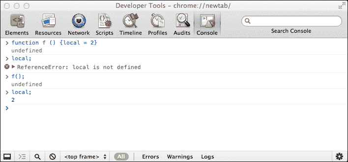
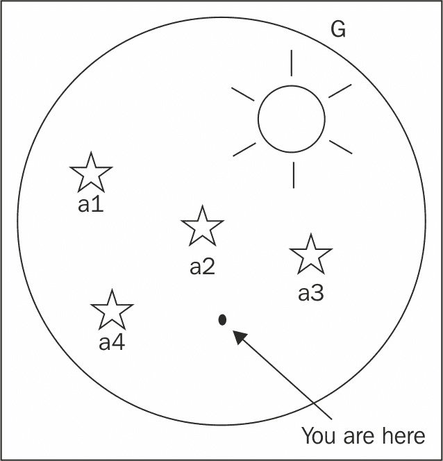

# 第三章：函数

掌握函数是学习任何编程语言时的重要技能，尤其是在学习 JavaScript 时更是如此。这是因为 JavaScript 对函数有许多用途，语言的灵活性和表现力大部分来自于函数。大多数编程语言对于一些面向对象的特性都有特殊的语法，而 JavaScript 只使用函数。本章将涵盖以下主题：

+   如何定义和使用函数

+   向函数传递参数

+   您可以免费使用的预定义函数

+   JavaScript 中变量的作用域

+   函数只是数据的概念，尽管是一种特殊类型的数据

理解这些主题将为您提供一个坚实的基础，使您能够深入本章的第二部分，其中展示了一些有趣的函数应用，如下所示：

+   使用匿名函数

+   回调

+   立即（自调用）函数

+   内部函数（在其他函数内定义的函数）

+   返回函数的函数

+   重新定义自己的函数

+   闭包

# 什么是函数？

函数允许您将代码组合在一起，给它一个名称，并在以后重复使用，通过您给它的名称进行调用。让我们考虑以下代码作为示例：

```js
    function sum(a, b) { 
      var c = a + b; 
      return c; 
    } 

```

组成函数的部分如下所示：

+   `function`关键字。

+   函数的名称；在这种情况下是`sum`。

+   函数参数；在这种情况下是`a`和`b`。函数可以接受任意数量的参数，或者没有参数，用逗号分隔。

+   代码块，也称为函数的主体。

+   `return`语句。函数总是返回一个值。如果它没有显式返回一个值，它将隐式返回值`undefined`。

请注意，函数只能返回单个值。如果需要返回更多值，您可以简单地返回一个包含您需要的所有值的数组作为此数组的元素。

前面的语法称为函数声明。这只是在 JavaScript 中创建函数的一种方式，还有更多的方式即将出现。

## 调用函数

为了使用函数，您需要调用它。您可以简单地使用函数的名称调用函数，可选地在括号中跟随任意数量的值。调用函数是另一种说法是调用。

让我们调用`sum()`函数，传递两个参数，并将函数返回的值赋给变量`result`：

```js
    > var result = sum(1, 2); 
    > result; 
    3 

```

## 参数

在定义函数时，您可以指定函数在调用时期望接收的参数。函数可能不需要任何参数，但如果需要，并且您忘记传递它们，JavaScript 将为您跳过的参数分配`undefined`值。在下一个示例中，函数调用返回`NaN`，因为它尝试对`1`和`undefined`进行求和：

```js
    > sum(1); 
    NaN 

```

从技术上讲，参数和参数之间有区别，尽管两者经常可以互换使用。参数与函数一起定义，而参数在调用函数时传递给函数。考虑以下示例：

```js
    > function sum(a, b) { 
        return a + b; 
      } 
    > sum(1, 2); 

```

这里，`a`和`b`是参数，而`1`和`2`是参数。

当涉及接受参数时，JavaScript 并不挑剔。如果您传递的参数多于函数所期望的，额外的参数将被静默忽略，如下例所示：

```js
    > sum(1, 2, 3, 4, 5); 
    3 

```

此外，您可以创建接受参数数量灵活的函数。这是由于在每个函数内部自动创建的特殊值`arguments`。以下是一个简单返回传递给它的任何参数的函数：

```js
    > function args() { 
        return arguments; 
      } 
    > args(); 
    [] 
    > args( 1, 2, 3, 4, true, 'ninja'); 
    [1, 2, 3, 4, true, "ninja"] 

```

使用`arguments`，您可以改进`sum()`函数以接受任意数量的参数并将它们全部相加，如下例所示：

```js
    function sumOnSteroids() { 
      var i, 
          res = 0, 
          number_of_params = arguments.length; 
      for (i = 0; i < number_of_params; i++) { 
        res += arguments[i]; 
      } 
      return res; 
    } 

```

如果您通过使用不同数量的参数或甚至根本不使用参数来调用此函数进行测试，您可以验证它是否按预期工作，如下例所示：

```js
    > sumOnSteroids(1, 1, 1); 
    3 
    > sumOnSteroids(1, 2, 3, 4); 
    10 
    > sumOnSteroids(1, 2, 3, 4, 4, 3, 2, 1); 
    20 
    > sumOnSteroids(5); 
    5 
    > sumOnSteroids(); 
    0 

```

`arguments.length`表达式返回函数调用时传递的参数数量。如果语法不熟悉，不用担心，我们将在下一章节详细讨论。您还会看到`arguments`不是一个数组（尽管看起来像），而是一个类似数组的对象。

ES6 在函数参数周围引入了几个重要的改进。ES6 函数参数现在可以有默认值、剩余参数，并允许解构。下一节将详细讨论这些概念。

# 默认参数

函数参数可以分配默认值。在调用函数时，如果省略了参数，则使用分配给参数的默认值：

```js
    function render(fog_level=0, spark_level=100){ 
      console.log(`Fog Level: ${fog_level} and spark_level:
       ${spark_level}`) 
    } 
    render(10); //Fog Level: 10 and spark_level: 100 

```

在这个例子中，我们省略了`spark_level`参数，因此使用了分配给参数的默认值。重要的是要注意`undefined`被视为参数值的缺失；例如考虑以下代码行：

```js
    render(undefined,10); //Fog Level: 0 and spark_level: 10 

```

在提供参数的默认值时，也可以引用其他参数：

```js
    function t(fog_level=1, spark_level=fog_level){
      console.log(`Fog Level: ${fog_level} and spark_level: 
       ${spark_level}`) 
      //Fog Level: 10 and spark_level: 10 
    } 
    function s(fog_level=10, spark_level = fog_level*10){ 
      console.log(`Fog Level: ${fog_level} and spark_level:
       ${spark_level}`) 
      //Fog Level: 10 and spark_level: 100 
    } 
    t(10); 
    s(10); 

```

默认参数有它们自己的作用域；这个作用域夹在外部函数作用域和函数内部作用域之间。如果参数被内部作用域中的变量遮蔽，令人惊讶的是，内部变量是不可用的。下面的例子将有助于解释这一点：

```js
    var scope="outer_scope"; 
    function scoper(val=scope){ 
      var scope="inner_scope"; 
      console.log(val); //outer_scope 
    } 
    scoper(); 

```

你可能期望`val`被内部定义的`scope`变量所遮蔽，但是由于默认参数有它们自己的作用域，所以赋给`val`的值不受内部作用域的影响。

# 剩余参数

ES6 引入了剩余参数。剩余参数允许我们以数组的形式向函数发送任意数量的参数。剩余参数只能是参数列表中的最后一个，并且只能有一个剩余参数。在最后一个形式参数之前放置一个剩余运算符(`...`)表示该参数是一个剩余参数。以下示例显示在最后一个形式参数之前添加一个剩余运算符：

```js
    function sayThings(tone, ...quotes){ 
      console.log(Array.isArray(quotes)); //true 
      console.log(`In ${tone} voice, I say ${quotes}`) 
    } 
    sayThings("Morgan Freeman","Something serious"," 
     Imploding Universe"," Amen"); 
    //In Morgan Freeman voice, I say Something serious,
     Imploding Universe,Amen 

```

传递给函数的第一个参数在`tone`中接收，而其余的参数作为数组接收。可变参数（var-args）已经成为其他几种语言的一部分，并且是 ES6 的一个受欢迎的新增功能。剩余参数可以替代略有争议的`arguments`变量。剩余参数和`arguments`变量之间的主要区别在于剩余参数是真正的数组。所有数组方法都适用于剩余参数。

# 展开运算符

展开运算符看起来与剩余运算符完全相同，但执行相反的功能。在调用函数或定义数组时，展开运算符用于提供参数。展开运算符接受一个数组并将其元素分割成单独的变量。以下示例说明了展开运算符在调用以数组作为参数的函数时提供了更清晰的语法：

```js
    function sumAll(a,b,c){ 
      return a+b+c 
    } 
    var numbers = [6,7,8] 
    //ES5 way of passing array as an argument of a function 
    console.log(sumAll.apply(null,numbers)); //21 
    //ES6 Spread operator 
    console.log(sumAll(...numbers))//21 

```

在 ES5 中，当将数组作为参数传递给函数时，通常使用`apply()`函数。在前面的例子中，我们有一个数组需要传递给一个函数，而函数接受三个变量。将数组传递给这个函数的 ES5 方法使用`apply()`函数，第二个参数允许将数组传递给被调用的函数。ES6 的展开运算符提供了一种更清晰和精确处理这种情况的方法。在调用`sumAll()`时，我们使用展开运算符(`...`)并将`numbers`数组传递给函数调用。然后数组被分割成单独的变量-`a`、`b`和`c`。

展开运算符提高了 JavaScript 中数组的功能。如果要创建由另一个数组组成的数组，则现有的数组语法不支持这一点。您必须使用`push`、`splice`和`concat`来实现这一点。然而，使用展开运算符，这变得微不足道：

```js
    var midweek = ['Wed', 'Thu']; 
    var weekend = ['Sat', 'Sun']; 
    var week = ['Mon','Tue', ...midweek, 'Fri', ...weekend]; 
     //["Mon","Tue","Wed","Thu","Fri","Sat","Sun"] 
    console.log(week); 

```

在上面的例子中，我们使用两个数组`midweek`和`weekend`，使用扩展运算符构造了一个`week`数组。

## 预定义函数

JavaScript 引擎中内置了许多函数，供您使用。让我们来看看它们。在这样做的过程中，您将有机会尝试使用函数、它们的参数和返回值，并且变得熟悉使用函数。以下是内置函数的列表：

+   parseInt()

+   parseFloat()

+   isNaN()

+   isFinite()

+   encodeURI()

+   decodeURI()

+   encodeURIComponent()

+   decodeURIComponent()

+   eval()

### 注意

**黑匣子函数**

通常，当您调用函数时，您的程序不需要知道这些函数在内部是如何工作的。您可以将函数视为一个黑匣子，给它一些值（作为输入参数），然后获取它返回的输出结果。这对于任何函数都是正确的-无论是内置在 JavaScript 引擎中的函数，您创建的函数，还是同事或其他人创建的函数。

### parseInt()

`parseInt()`函数接受任何类型的输入（通常是字符串）并尝试将其转换为整数。如果失败，它将返回`NaN`，如下面的代码所示：

```js
    > parseInt('123'); 
    123 
    > parseInt('abc123'); 
    NaN 
    > parseInt('1abc23'); 
    1 
    > parseInt('123abc'); 
    123 

```

该函数接受一个可选的第二个参数，即基数，告诉函数期望的数字类型-十进制、十六进制、二进制等。例如，尝试从字符串`FF`中提取一个十进制数是没有意义的，因此结果是`NaN`，但如果您尝试将`FF`作为十六进制，则会得到`255`，如下面的代码片段所示：

```js
    > parseInt('FF', 10); 
    NaN 
    > parseInt('FF', 16); 
    255 

```

另一个例子是解析带有基数`10`（十进制）和基数`8`（八进制）的字符串：

```js
    > parseInt('0377', 10); 
    377 
    > parseInt('0377', 8); 
    255 

```

如果在调用`parseInt()`时省略第二个参数，函数将假定`10`（十进制），以下是一些例外情况：

+   如果您传递以`0x`开头的字符串，则假定基数为`16`（假定为十六进制数）。

+   如果您传递的字符串以`0`开头，函数会假定基数为`8`（假定为八进制数）。请考虑以下示例：

```js
        > parseInt('377'); 
        377 
        > console.log(0o377); 
        255 
        > parseInt('0x377'); 
        887 

```

最安全的做法是始终指定基数。如果省略基数，您的代码在 99%的情况下可能仍然有效（因为大多数情况下您解析十进制数）；然而，偶尔可能会在调试一些边缘情况时导致您有点头发丢失。例如，想象一下，您有一个表单字段接受日历天数或月份，用户输入`06`或`08`。

### 注意

ECMAScript 5 删除了八进制文字值，并避免了与`parseInt()`和未指定基数的混淆。

### parseFloat()

`parseFloat()`函数类似于`parseInt()`函数，但在尝试从输入中找出数字时，它还会寻找小数。该函数只接受一个参数，如下所示：

```js
    > parseFloat('123'); 
    123 
    > parseFloat('1.23'); 
    1.23 
    > parseFloat('1.23abc.00'); 
    1.23 
    > parseFloat('a.bc1.23'); 
    NaN 

```

与`parseInt()`一样，`parseFloat()`在遇到意外字符的第一次出现时就会放弃，即使字符串的其余部分可能包含可用的数字：

```js
    > parseFloat('a123.34'); 
    NaN 
    > parseFloat('12a3.34'); 
    12 

```

`parseFloat()`函数理解输入中的指数（与`parseInt()`不同）：

```js
    > parseFloat('123e-2'); 
    1.23 
    > parseFloat('1e10'); 
    10000000000 
    > parseInt('1e10'); 
    1 

```

### isNaN()

使用`isNaN()`，您可以检查输入值是否是一个有效的数字，可以安全地用于算术运算。这个函数也是一个方便的方法来检查`parseInt()`，`parseFloat()`或任何算术操作是否成功：

```js
    > isNaN(NaN); 
    true 
    > isNaN(123); 
    false 
    > isNaN(1.23); 
    false 
    > isNaN(parseInt('abc123')); 
    true 

```

该函数还将尝试将输入转换为数字：

```js
    > isNaN('1.23'); 
    false 
    > isNaN('a1.23'); 
    true 

```

`isNaN()`函数很有用，因为特殊值`NaN`与任何东西都不相等，包括它自己。换句话说，`NaN === NaN`是`false`。因此，`NaN`不能用来检查一个值是否是有效的数字。

### isFinite()

`isFinite()`函数检查输入是否是既不是`Infinity`也不是`NaN`的数字：

```js
    > isFinite(Infinity); 
    false 
    > isFinite(-Infinity); 
    false 
    > isFinite(12); 
    true 
    > isFinite(1e308); 
    true 
    > isFinite(1e309); 
    false 

```

如果您对最后两个调用返回的结果感到困惑，请记住前一章中提到的 JavaScript 中最大的数字是`1.7976931348623157e+308`，因此`1e309`实际上是无穷大。

### 编码/解码 URI

在**统一资源定位符**（**URL**）或**统一资源标识符**（**URI**）中，一些字符具有特殊含义。如果你想转义这些字符，你可以使用`encodeURI()`或`encodeURIComponent()`函数。第一个函数将返回一个可用的 URL，而第二个函数假定你只传递了 URL 的一部分，比如一个查询字符串，它将编码所有适用的字符，如下所示：

```js
    > var url = 'http://www.packtpub.com/script.php?q=this and that'; 
    > encodeURI(url); 
    "http://www.packtpub.com/script.php?q=this%20and%20that" 
    > encodeURIComponent(url); 
    "http%3A%2F%2Fwww.packtpub.com%2Fscript.php%3Fq%3Dthis%20and%20that" 

```

`encodeURI()`和`encodeURIComponent()`的相反函数分别是`decodeURI()`和`decodeURIComponent()`。

有时，在旧代码中，你可能会看到`escape()`和`unescape()`函数用于编码和解码 URL，但这些函数已经被弃用；它们进行编码的方式不同，不应该使用。

### eval()

`eval()`函数接受一个字符串输入并将其作为 JavaScript 代码执行，如下所示：

```js
    > eval('var ii = 2;'); 
    > ii; 
    2 

```

因此，`eval('var ii = 2;')`等同于`var ii = 2;`

`eval()`函数有时可能会有用，但如果有其他选择，应该避免使用它。大多数情况下，都有替代方案，而且在大多数情况下，这些替代方案更加优雅、更容易编写和维护。*Eval is evil*是一个你经常会听到有经验的 JavaScript 程序员说的口头禅。使用`eval()`的缺点如下：

+   **安全性**：JavaScript 很强大，这也意味着它可能会造成损害。如果你不信任传递给`eval()`的输入源，就不要使用它。

+   **性能**：评估实时代码比直接在脚本中编写代码要慢。

#### 一个奖励 - alert()函数

让我们再看一个常见的函数-`alert()`。它不是核心 JavaScript 的一部分（在 ECMA 规范中找不到它），但它是由宿主环境-浏览器提供的。它在消息框中显示一串文本。它也可以作为一个原始的调试工具，尽管现代浏览器中的调试器更适合这个目的。

这里有一张截图显示了执行`alert("Hi There")`代码的结果：


在使用这个函数之前，请记住它会阻塞浏览器线程，这意味着在用户关闭警告框之前不会执行其他代码。如果你有一个繁忙的 Ajax 类型应用程序，通常不建议使用`alert()`。

# 变量的作用域

特别要注意的是，如果你从其他语言转到 JavaScript，JavaScript 中的变量不是在块作用域中定义的，而是在函数作用域中定义的。这意味着如果一个变量在函数内部定义，它在函数外部是不可见的。但是，如果它在`if`或`for`代码块中定义，它在块外是可见的。全局变量这个术语描述了你在任何函数之外定义的变量（在全局程序代码中），与局部变量相对，局部变量是在函数内部定义的。函数内部的代码可以访问所有全局变量以及它自己的局部变量。

在下一个例子中：

+   `f()`函数可以访问`global`变量

+   在`f()`函数外部，`local`变量不存在

```js
        var global = 1; 
        function f() { 
          var local = 2; 
          global++; 
          return global; 
        } 

```

让我们测试一下：

```js
    > f(); 
    2 
    > f(); 
    3 
    > local; 
    ReferenceError: local is not defined 

```

还要注意的是，如果你不使用`var`来声明一个变量，这个变量会自动分配一个全局作用域。让我们看一个例子：



发生了什么？`f()`函数包含`local`变量。在调用函数之前，这个变量是不存在的。当你第一次调用函数时，`local`变量会被创建为全局作用域。然后，如果你在函数外部访问`local`变量，它将是可用的。

### 注意

**最佳实践提示**

减少全局变量的数量以避免命名冲突。想象两个人在同一个脚本中工作的两个不同函数中工作，他们都决定使用相同的名称作为他们的全局变量。这很容易导致意外的结果和难以找到的错误。始终使用`var`语句声明变量。考虑使用单一`var`模式。在函数中定义所需的所有变量，这样你就有一个地方可以查找变量，希望可以防止意外的全局变量。

## 变量提升

下面是一个有趣的例子，展示了本地作用域与全局作用域的一个重要方面：

```js
    var a = 123; 

    function f() { 
      alert(a); 
      var a = 1; 
      alert(a); 
    } 

    f(); 

```

你可能期望第一个`alert()`函数将显示`123`（全局变量`a`的值），第二个将显示`1`（局部变量`a`）。但是，情况并非如此。第一个警报将显示`undefined`。这是因为，在函数内部，局部作用域比全局作用域更重要。因此，局部变量会覆盖同名的全局变量。在第一个`alert()`时，`a`变量尚未定义（因此为`undefined`值），但它仍然存在于局部空间中，这是由于称为**提升**的特殊行为。

当 JavaScript 程序执行进入新函数时，函数中任何地方声明的所有变量都会被移动、提升或提升到函数顶部。这是一个重要的概念要记住。此外，只有声明被提升，意味着只有变量的存在被移动到顶部。任何赋值保持原样。在前面的例子中，局部变量`a`的声明被提升到顶部。只有声明被提升，而不是对`1`的赋值。就好像函数是这样写的：

```js
    var a = 123; 

    function f() { 
      var a; // same as: var a = undefined; 
      alert(a); // undefined 
      a = 1; 
      alert(a); // 1 
    } 

```

你也可以采用之前提到的最佳实践部分的单一 var 模式。在这种情况下，你将进行一种手动的变量提升，以防止与 JavaScript 提升行为混淆。

# 块作用域

ES6 在声明变量时提供了额外的作用域。我们看了函数作用域以及它对使用`var`关键字声明的变量的影响。如果你在 ES6 中编码，块作用域将大多取代你使用`var`声明变量的需求。虽然，如果你仍在使用 ES5，我们希望你确保仔细观察变量提升的行为。

ES6 引入了`let`和`const`关键字，允许我们声明变量。

使用`let`声明的变量是块作用域的。它们只存在于当前块中。使用`var`声明的变量是函数作用域的，正如我们之前所看到的。下面的例子说明了块作用域：

```js
    var a = 1; 
    { 
        let a = 2; 
        console.log( a );   // 2 
    } 
    console.log( a );       // 1 

```

大括号`'{'`和`'}'`之间的作用域是一个块。如果你来自 Java 或 C/C++的背景，块作用域的概念对你来说将非常熟悉。在这些语言中，程序员引入块只是为了定义一个作用域。然而，在 JavaScript 中，有必要习惯性地引入块，因为它们没有与之关联的作用域。然而，ES6 允许你使用`let`关键字创建块作用域变量。正如你在前面的例子中看到的，块内创建的变量`a`在块内是可用的。在声明块作用域变量时，通常建议在块的顶部添加`let`声明。让我们看另一个例子，以清楚地区分函数作用域和块作用域：

```js
    function swap(a,b){ // <--function scope starts here 
      if(a>0 && b>0){   // <--block scope starts here 
        let tmp=a; 
        a=b; 
        b=tmp; 
      }                // <--block scope ends here 
      console.log(a,b); 
      console.log(tmp); // tmp is not defined as it is available
       only in the block scope 
      return [a,b]; 
    } 
    swap(1,2); 

```

如你所见，`tmp`是用`let`声明的，并且只在它被定义的块中可用。在实际操作中，你应该最大化使用块作用域变量。除非有非常特定的事情需要你使用`var`声明，否则请确保你优先使用块作用域变量。然而，错误地使用`let`关键字可能会导致一些问题。首先，你不能在同一个函数或块作用域中使用`let`关键字重新声明相同的变量：

```js
    function blocker(x){ 
      if(x){ 
        let f; 
        let f; //duplicate declaration "f" 
      } 
    } 

```

在 ES6 中，使用`let`关键字声明的变量被提升到块作用域。然而，在声明之前引用变量是一个错误。

ES6 中引入的另一个关键字是`const`。使用`const`关键字声明的变量创建一个只读引用值。这并不意味着引用持有的值是不可变的。然而，变量标识符不能被重新分配。常量与使用`let`关键字创建的变量一样是块作用域的。此外，在声明变量时必须为变量赋值。

尽管它听起来像是，`const`与不可变值无关。常量创建不可变绑定。这是一个重要的区别，需要正确理解。让我们考虑下面的例子：

```js
    const car = {} 
    car.tyres = 4 

```

这是一个有效的代码；在这里我们将`{}`赋值给一个常量`car`。一旦赋值，这个引用就不能被改变。在 ES6 中，你应该这样做：

+   尽可能使用`const`。对所有值不会改变的变量使用它：

```js
        Use let 

```

+   避免使用`var`。

# 函数是数据

JavaScript 中的函数实际上是数据。这是一个我们以后会需要的重要概念。这意味着你可以创建一个函数并将它分配给一个变量，如下所示：

```js
    var f = function () { 
      return 1; 
    }; 

```

这种定义函数的方式有时被称为**函数文字表示法**。

`function () { return 1;}`部分是一个**函数表达式**。函数表达式可以选择地有一个名字，这样它就成为了**命名函数表达式**（**NFE**）。因此，这也是允许的，尽管在实践中很少见（并且会导致 IE 错误地在封闭作用域中创建两个变量-`f`和`myFunc`）：

```js
    var f = function myFunc() { 
      return 1; 
    }; 

```

如你所见，命名函数表达式和函数声明之间没有区别。但实际上它们是不同的。区分两者的唯一方法是看它们被使用的上下文。函数声明只能出现在程序代码中（在另一个函数的主体中或在主程序中）。你将在本书的后面看到更多的函数示例，这将澄清这些概念。

当你在一个包含函数值的变量上使用`typeof`运算符时，它返回字符串`"function"`，如下例所示：

```js
    > function define() { 
        return 1;  
      } 

    > var express = function () {  
        return 1;  
      }; 

    > typeof define; 
    "function" 

    > typeof express; 
    "function" 

```

因此，JavaScript 函数是数据，但是一种具有以下两个重要特征的特殊数据：

+   它们包含代码

+   它们是可执行的（它们可以被调用）

正如你之前所见，执行函数的方法是在函数名后面加括号。如下一个例子所示，这种方法可以在不管函数是如何定义的情况下工作。在这个例子中，你还可以看到函数是如何被视为一个常规值的；它可以被复制到另一个变量中，如下所示：

```js
    > var sum = function (a, b) { 
        return a + b; 
      }; 

    > var add = sum; 
    > typeof add; 
    function 
    > add(1, 2); 
    3 

```

因为函数是分配给变量的数据，所以命名函数的命名规则与变量的命名规则相同-函数名不能以数字开头，它可以包含任意组合的字母、数字、下划线字符和美元符号。

## 匿名函数

正如你现在所知道的，存在一种函数表达式语法，你可以像下面这样定义一个函数：

```js
    var f = function (a) { 
      return a; 
    }; 

```

这也经常被称为**匿名函数**（因为它没有名字），特别是当这样的函数表达式即使没有分配给变量也被使用时。在这种情况下，这样的匿名函数有两种优雅的用法，如下所示：

+   可以将匿名函数作为参数传递给另一个函数。接收函数可以对您传递的函数执行一些有用的操作。

+   您可以定义一个匿名函数并立即执行它。

让我们更详细地看看匿名函数的这两个应用。

## 回调函数

由于函数就像分配给变量的任何其他数据一样，它可以被定义、复制，并且也可以作为参数传递给其他函数。

这是一个接受两个函数作为参数、执行它们并返回它们各自返回值之和的函数的例子：

```js
    function invokeAdd(a, b) { 
      return a() + b(); 
    } 

```

现在，让我们使用仅返回硬编码值的函数声明模式来定义两个简单的附加函数：

```js
    function one() { 
      return 1; 
    } 

    function two() { 
      return 2; 
    } 

```

现在，您可以将这些函数传递给原始函数`invokeAdd()`，并获得以下结果：

```js
    > invokeAdd(one, two); 
    3 

```

将函数作为参数传递的另一个例子是使用匿名函数（函数表达式）。您可以简单地执行以下操作，而不是定义`one()`和`two()`：

```js
    > invokeAdd(function () {return 1; }, function () {return 2; }); 
    3 

```

或者，您可以使其更易读，如下面的代码所示：

```js
    > invokeAdd( 
        function () { return 1; },  
        function () { return 2; } 
      ); 
    3 

```

或者，您可以这样做：

```js
    > invokeAdd( 
        function () { 
          return 1; 
        },  
        function () { 
          return 2; 
        } 
      ); 
    3 

```

当您将函数 A 传递给另一个函数 B，然后 B 执行 A 时，通常会说 A 是一个**回调**函数。如果 A 没有名称，那么您可以说它是一个匿名回调函数。

回调函数何时有用？让我们看一些示例，演示回调函数的好处，即：

+   它们让您无需命名即可传递函数，这意味着浮动的变量更少。

+   您可以将调用函数的责任委托给另一个函数，这意味着要编写的代码更少

+   它们可以通过推迟执行或解除阻塞调用来提高性能

### 回调函数示例

看看这种常见情况-您有一个返回值的函数，然后将其传递给另一个函数。在我们的例子中，第一个函数`multiplyByTwo()`接受三个参数，循环遍历它们，将它们乘以二，并返回包含结果的数组。第二个函数`addOne()`接受一个值，将其加一，并返回它，如下所示：

```js
    function multiplyByTwo(a, b, c) { 
      var i, ar = []; 
      for (i = 0; i < 3; i++) { 
        ar[i] = arguments[i] * 2; 
      } 
      return ar; 
    } 

    function addOne(a) { 
      return a + 1; 
    } 

```

让我们测试这些函数：

```js
    > multiplyByTwo(1, 2, 3); 
    [2, 4, 6] 
    > addOne(100); 
    101 

```

现在，假设您想要有一个包含三个元素的数组`myarr`，并且每个元素都要通过这两个函数传递。首先，让我们从调用`multiplyByTwo()`开始：

```js
    > var myarr = []; 
    > myarr = multiplyByTwo(10, 20, 30); 
    [20, 40, 60] 

```

现在，循环遍历每个元素，将其传递给`addOne()`：

```js
    > for (var i = 0; i < 3; i++) { 
        myarr[i] = addOne(myarr[i]); 
      } 
    > myarr; 
    [21, 41, 61] 

```

正如您所看到的，一切都运行正常，但还有改进的空间。例如，有两个循环。如果循环次数很多，循环可能会很昂贵。您可以通过只有一个循环来实现相同的结果。以下是如何修改`multiplyByTwo()`以便接受回调函数并在每次迭代时调用该回调的方法：

```js
    function multiplyByTwo(a, b, c, callback) { 
      var i, ar = []; 
      for (i = 0; i < 3; i++) { 
        ar[i] = callback(arguments[i] * 2); 
      } 
      return ar; 
    } 

```

使用修改后的函数，所有工作都是通过一个函数调用完成的，该函数传递了起始值和`callback`函数，如下所示：

```js
    > myarr = multiplyByTwo(1, 2, 3, addOne); 
    [3, 5, 7] 

```

您可以使用匿名函数来定义`addOne()`，从而节省额外的全局变量：

```js
    > multiplyByTwo(1, 2, 3, function (a) { 
        return a + 1; 
      }); 
    [3, 5, 7] 

```

匿名函数很容易更改，如果需要的话：

```js
    > multiplyByTwo(1, 2, 3, function (a) { 
        return a + 2; 
      }); 
    [4, 6, 8] 

```

## 立即函数

到目前为止，我们已经讨论了使用匿名函数作为回调。让我们看看匿名函数的另一个应用-在定义后立即调用函数。这是一个例子：

```js
    ( 
      function () { 
        alert('boo'); 
      } 
    )(); 

```

语法一开始可能看起来有点吓人，但你所做的就是简单地将一个函数表达式放在括号内，然后再加上另一组括号。第二组括号表示立即执行，也是放置您的匿名函数可能接受的任何参数的地方，例如：

```js
    ( 
      function (name) { 
        alert('Hello ' + name + '!'); 
      } 
    )('dude'); 

```

或者，您可以将第一组括号的关闭移到末尾。这两种方法都可以：

```js
    (function () { 
      // ... 
    }()); 

    // vs.  

    (function () { 
      // ... 
    })(); 

```

立即（自我调用）匿名函数的一个很好的应用是在不创建额外全局变量的情况下完成一些工作。当然，缺点是您无法两次执行相同的函数。这使得立即函数最适合一次性或初始化任务。

如果需要，立即函数也可以选择返回一个值。看到以下代码并不罕见：

```js
    var result = (function () { 
      // something complex with 
      // temporary local variables... 
      // ... 

      // return something; 
    }()); 

```

在这种情况下，您不需要将函数表达式包装在括号中；您只需要调用函数的括号。因此，以下代码片段也有效：

```js
    var result = function () { 
      // something complex with 
      // temporary local variables 
      // return something; 
    }(); 

```

这种语法有效，但可能看起来有点令人困惑；如果没有阅读函数的结尾，您就不知道`result`是一个函数还是立即函数的返回值。

## 内部（私有）函数

请记住，函数就像任何其他值一样，没有什么能阻止您在另一个函数中定义一个函数，下面是一个例子：

```js
    function outer(param) { 
      function inner(theinput) { 
        return theinput * 2; 
      } 
      return 'The result is ' + inner(param); 
    } 

```

使用函数表达式，这也可以写成如下形式：

```js
    var outer = function (param) { 
      var inner = function (theinput) { 
        return theinput * 2; 
      }; 
      return 'The result is ' + inner(param); 
    }; 

```

当您调用全局`outer()`函数时，它将在内部调用本地`inner()`函数。由于`inner()`是本地的，所以在`outer()`之外是无法访问的，因此可以说它是一个私有函数：

```js
    > outer(2); 
    "The result is 4" 
    > outer(8); 
    "The result is 16" 
    > inner(2); 
    ReferenceError: inner is not defined 

```

使用私有函数的好处如下：

+   您可以保持全局命名空间的清洁，这样不太可能引起命名冲突

+   隐私-您只能向外界公开您决定的那些函数，并将不打算被应用程序的其余部分使用的功能保留给自己

## 返回函数的函数

如前所述，函数总是返回一个值，如果没有使用`return`显式返回，则会隐式返回`undefined`。函数只能返回一个值，而这个值也可以很容易地是另一个函数，例如：

```js
    function a() { 
      alert('A!'); 
      return function () { 
        alert('B!'); 
      }; 
    } 

```

在这个例子中，`a()`函数完成其工作（警报`A!`），然后返回另一个执行其他操作的函数（警报`B!`）。您可以将返回值分配给一个变量，然后像普通函数一样使用这个变量，如下所示：

```js
    > var newFunc = a(); 
    > newFunc(); 

```

在这里，第一行将警报`A!`，第二行将警报`B!`。

如果您想立即执行返回的函数而不将其分配给一个新变量，您可以简单地使用另一组括号。最终结果将是相同的：

```js
    > a()(); 

```

## 函数，重写自己！

由于函数可以返回函数，您可以使用新函数来替换旧函数。继续使用前面的例子，您可以使用调用`a()`的返回值来覆盖实际的`a()`函数：

```js
    > a = a(); 

```

前一行代码会警报`A!`，但下一次调用`a()`时会警报`B!`。当函数有一些初始的一次性工作要做时，这是很有用的。函数在第一次调用后会覆盖自身，以避免每次调用时都做不必要的重复工作。

在前面的例子中，函数是从外部重新定义的，并且返回的值被重新分配给函数。但是，函数实际上可以从内部重写自身，如下例所示：

```js
    function a() { 
      alert('A!'); 
      a = function () { 
        alert('B!'); 
      }; 
    } 

```

如果您第一次调用此函数，它将执行以下操作：

+   警报`A!`（将其视为一次性的准备工作）

+   重新定义全局变量`a`并将新函数分配给它

每次调用该函数时，它都会警报`B!`。

这是另一个例子，结合了本章最后几节讨论的几种技术：

```js
    var a = (function () { 

      function someSetup() { 
        var setup = 'done'; 
      } 

      function actualWork() { 
        alert('Worky-worky'); 
      } 

      someSetup(); 
      return actualWork; 

    }()); 

```

从这个例子中，您可以注意到以下几点：

+   您有私有函数；`someSetup()`和`actualWork()`。

+   您有一个立即函数：一个匿名函数，使用其定义后面的括号调用自身。

+   该函数首次执行时，调用`someSetup()`，然后返回对`actualWork`变量的引用，该变量是一个函数。请注意，在`return`语句中没有括号，因为您返回的是函数引用，而不是调用此函数的结果。

+   由于整个过程以`var a =`开始，自调用函数的返回值被分配给`a`。

如果你想测试一下刚才讨论的话题的理解程度，请回答以下问题。在以下情况下，前面的代码会弹出什么：

+   它最初加载了吗？

+   之后你调用`a()`？

在浏览器环境中，这些技术可能非常有用。不同的浏览器可能有不同的实现相同结果的方式。如果你知道浏览器特性在函数调用之间不会改变，你可以让一个函数确定在当前浏览器中做工作的最佳方式，然后重新定义自己，以便浏览器能力检测只做一次。你将在本书的后面看到这种情况的具体例子。

# 闭包

本章的其余部分是关于闭包的（还有什么更好的方式来结束一个章节呢？）。闭包可能一开始有点难以理解，所以如果你在第一次阅读时没有理解，不要感到沮丧。你应该阅读本章的其余部分，并自己尝试示例，但如果你觉得自己没有完全理解这个概念，可以在本章前面讨论的话题有机会消化后再回来看。

在继续讨论闭包之前，让我们首先回顾并扩展 JavaScript 中作用域的概念。

## 作用域链

如你所知，在 JavaScript 中，没有花括号作用域，但有函数作用域。在函数中定义的变量在函数外部不可见，但在代码块（例如`if`或`for`循环）中定义的变量在块外部可见，例如：

```js
    > var a = 1;  
    > function f() { 
        var b = 1;  
        return a; 
      } 
    > f(); 
    1 
    > b; 
    ReferenceError: b is not defined 

```

变量`a`在全局空间中，而`b`在函数`f()`的作用域中。所以，我们有以下情况：

+   在`f()`内部，`a`和`b`都是可见的

+   在`f()`外部，`a`是可见的，但`b`不可见

如果你在`outer()`内部嵌套定义一个`inner()`函数，它将可以访问其自己的作用域中的变量，以及其父级的作用域。这就是所谓的作用域链，链可以很长（深），可以根据需要延伸：

```js
    var global = 1; 
    function outer() { 
      var outer_local = 2; 
      function inner() { 
        var inner_local = 3; 
        return inner_local + outer_local + global; 
      } 
      return inner(); 
    } 

```

让我们测试一下`inner()`函数是否可以访问所有变量：

```js
    > outer(); 
    6 

```

## 使用闭包打破链条

让我们通过一个示例来介绍闭包，并看看以下代码发生了什么：

```js
    var a = "global variable"; 
    var F = function () { 
      var b = "local variable"; 
      var N = function () { 
        var c = "inner local"; 
      }; 
    }; 

```

首先是全局作用域**G**。把它想象成宇宙，好像它包含了一切：



它可以包含全局变量，如**a1**和**a2**，以及全局函数，如**F**：


函数有自己的私有空间，并且可以用它来存储其他变量，比如**b**，以及内部函数，比如**N**（用于内部）。在某个时候，你会得到以下的图片：


如果你在点 a，你就在全局空间内。如果你在点**b**，也就是在**F**函数的空间内，那么你就可以访问全局空间和**F**空间。如果你在点**c**，也就是在**N**函数的空间内，那么你可以访问全局空间、**F**空间和**N**空间。你无法从**a**到达**b**，因为**b**在**F**外部是不可见的。但是，如果你愿意，你可以从**c**到达**b**，或者从**N**到达**b**。有趣的是，当**N**以某种方式打破了**F**并进入了全局空间时，闭包效果就会发生。


然后会发生什么？**N**在与**a**相同的全局空间中。而且，由于函数记住了它们被定义的环境，**N**仍然可以访问**F**空间，因此可以访问**b**。这很有趣，因为**N**在**a**所在的地方，但**N**确实可以访问**b**，但**a**不行。

另外，**N**是如何打破链条的？通过使自己成为全局的（省略`var`）还是通过让**F**将其传递（或`return`）到全局空间。让我们看看这在实践中是如何做的。

### 闭包 #1

看一下下面的函数，它和之前的一样，只是`F`返回`N`，而`N`返回`b`，通过作用域链它可以访问到`b`：

```js
    var a = "global variable"; 
    var F = function () { 
      var b = "local variable"; 
      var N = function () { 
        var c = "inner local"; 
        return b; 
      }; 
      return N; 
    }; 

```

`F`函数包含`b`变量，它是局部的，因此无法从全局空间访问：

```js
    > b; 
    ReferenceError: b is not defined 

```

`N`函数可以访问它的私有空间，`F()`函数的空间和全局空间。因此，它可以看到`b`。由于`F()`可以从全局空间调用（它是一个全局函数），你可以调用它并将返回的值赋给另一个全局变量。结果是一个新的全局函数，它可以访问`F()`函数的私有空间：

```js
    > var inner = F(); 
    > inner(); 
    "local variable" 

```

### 闭包＃2

下一个例子的最终结果将与前一个例子相同，但实现方式略有不同。`F()`不返回一个函数，而是在其内部创建一个新的全局函数`inner()`。

让我们首先声明一个全局函数的占位符。这是可选的，但总是好习惯。然后，你可以定义`F()`函数如下：

```js
    var inner; // placeholder 
    var F = function () { 
      var b = "local variable"; 
      var N = function () { 
        return b; 
      }; 
      inner = N; 
    }; 

```

现在，让我们看看如果你调用`F()`会发生什么：

```js
    > F(); 

```

在`F()`内部定义了一个新函数`N()`，并赋值给全局的`inner`函数。在定义时，`N()`在`F()`内部，因此它可以访问`F()`函数的作用域。即使`inner()`函数是全局空间的一部分，它也将保持对`F()`函数作用域的访问，例如：

```js
    > inner(); 
    "local variable". 

```

### 定义和闭包＃3

每个函数都可以被视为一个闭包。这是因为每个函数都保持着一个秘密的链接到它被创建的环境（作用域）。但是，大多数情况下，这个作用域会被销毁，除非发生一些有趣的事情（如前面的代码所示）导致它被保留。

根据你目前所见，你可以说当一个函数在其父级返回后仍保持对其父级作用域的链接时，就创建了一个闭包。而且，每个函数都是一个闭包，因为至少每个函数都保持对全局作用域的访问，而全局作用域永远不会被销毁。

让我们再看一个闭包的例子，这次使用函数参数。函数参数的行为就像这个函数的局部变量，但它们是隐式创建的；你不需要为它们使用`var`。你可以创建一个返回另一个函数的函数，然后返回其父级的参数，如下所示：

```js
    function F(param) { 
      var N = function () { 
        return param; 
      }; 
      param++; 
      return N; 
    } 

```

你可以按以下方式使用该函数：

```js
    > var inner = F(123); 
    > inner(); 
    124 

```

注意`param++`在函数定义后递增，但当调用`inner()`时，它返回了更新后的值。这表明函数保持对其定义时的作用域的引用，而不是在函数执行期间在作用域中找到的变量和它们的值的引用。

## 循环中的闭包

让我们看看闭包时一个经典的新手错误。这很容易导致难以发现的错误，因为表面上一切都很正常。

让我们循环三次，每次创建一个返回循环序列号的新函数。新函数将被添加到一个数组中，并在最后返回该数组。以下是函数：

```js
    function F() { 
      var arr = [], i; 
      for (i = 0; i < 3; i++) { 
        arr[i] = function () { 
          return i; 
        }; 
      } 
      return arr; 
    } 

```

让我们运行该函数，并将结果赋给`arr`数组：

```js
    > var arr = F(); 

```

现在你有了一个包含三个函数的数组。让我们在每个数组元素后面加上括号来调用它们。预期的行为是打印出循环序列`0`、`1`和`2`。让我们试试：

```js
    > arr[0](); 
    3 
    > arr[1](); 
    3 
    > arr[2](); 
    3 

```

嗯，不太符合预期。这里发生了什么？所有三个函数指向同一个局部变量：`i`。为什么？这些函数不记住值，它们只保留一个指向它们创建时的环境的链接（引用）。在这种情况下，`i`变量恰好存在于定义这三个函数的环境中。因此，所有函数在需要访问该值时，都会回到环境中找到`i`的最新值。循环结束后，`i`变量的值为`3`。因此，所有三个函数指向相同的值。

为什么是三而不是两是另一个更好的问题，以便更好地理解`for`循环。

那么，如何实现正确的行为呢？答案是使用另一个闭包，如下面的代码所示：

```js
    function F() { 
      var arr = [], i; 
      for (i = 0; i < 3; i++) { 
        arr[i] = (function (x) { 
          return function () { 
            return x; 
          }; 
        }(i)); 
      } 
      return arr; 
    } 

```

这将给你期望的结果如下：

```js
    > var arr = F(); 
    > arr[0](); 
    0 
    > arr[1](); 
    1 
    > arr[2](); 
    2 

```

在这里，您不仅创建一个返回`i`的函数，还将`i`变量的当前值传递给另一个立即函数。在这个函数中，`i`变成了本地值`x`，并且`x`每次都有不同的值。

或者，您可以使用一个普通的（而不是立即的）内部函数来实现相同的结果。关键是使用中间函数在每次迭代时将`i`的值局部化，如下所示：

```js
    function F() { 

      function binder(x) { 
        return function () { 
          return x; 
        }; 
      } 

      var arr = [], i; 
      for (i = 0; i < 3; i++) { 
        arr[i] = binder(i); 
      } 
      return arr; 
    } 

```

## Getter 和 setter

让我们看看使用闭包的另外两个例子。第一个涉及创建 getter 和 setter 函数。想象一下，您有一个变量，它应该包含特定类型的值或特定范围的值。您不想暴露这个变量，因为您不希望代码的任何部分都能够改变它的值。您可以将这个变量保护在一个函数内，并提供两个额外的函数——一个用于获取值，一个用于设置值。设置它的函数可以包含一些逻辑来验证值在分配给受保护的变量之前。让我们简化验证部分（为了保持示例简短）并只接受数字值。

您可以将 getter 和 setter 函数都放在包含`secret`变量的同一个函数中，以便它们共享相同的作用域：

```js
    var getValue, setValue; 

    (function () { 

      var secret = 0; 

      getValue = function () { 
        return secret; 
      }; 

      setValue = function (v) { 
        if (typeof v === "number") { 
          secret = v; 
        } 
      }; 

    }()); 

```

在这种情况下，包含所有内容的函数是一个立即函数。它将`setValue()`和`getValue()`定义为全局函数，而`secret`变量保持本地和无法直接访问，如下例所示：

```js
    > getValue(); 
    0 
    > setValue(123); 
    > getValue(); 
    123 
    > setValue(false); 
    > getValue(); 
    123 

```

## 迭代器

最后一个闭包示例（也是本章的最后一个示例）展示了使用闭包来实现迭代器功能。

您已经知道如何循环遍历一个简单的数组，但可能存在更复杂的数据结构的情况，其中有不同的规则来确定值的顺序。您可以将复杂的下一个逻辑封装到一个易于使用的`next()`函数中。然后，您可以在需要连续值的每个时间简单地调用`next()`。

对于这个例子，让我们只使用一个简单的数组而不是一个复杂的数据结构。这是一个初始化函数，它接受一个输入数组，并定义一个秘密指针`i`，它将始终指向数组中的下一个元素：

```js
    function setup(x) { 
      var i = 0; 
      return function () { 
        return x[i++]; 
      }; 
    } 

```

调用带有数据数组的`setup()`函数将为您创建`next()`函数，如下所示：

```js
    > var next = setup(['a', 'b', 'c']); 

```

从那里开始就很容易和有趣了；一遍又一遍地调用相同的函数给你下一个元素，如下所示：

```js
    > next(); 
    "a" 
    > next(); 
    "b" 
    > next(); 
    "c" 

```

# IIFE 与块

由于 ES5 没有提供块作用域，实现块作用域的一种流行模式是使用**立即调用的函数表达式**（**IIFE**），例如：

```js
    (function () { 
      var block_scoped=0; 
    }()); 
    console.log(block_scoped); //reference error 

```

有了 ES6 对块作用域的支持，您可以简单地使用`let`或`const`声明。

# 箭头函数

JavaScript 几乎使用了所有箭头的变体。ES6 引入了一种新的语法来编写函数。我们一直在 JavaScript 中编写函数表达式。在 JavaScript 中写代码像这样是惯用的（此示例是在 jQuery 中）：

```js
    $("#submit-btn").click(function (event) { 
      validateForm(); 
      submitMessage(); 
    }); 

```

这是一个典型的 jQuery 事件处理程序。事件处理程序`click()`函数接受一个函数作为参数，我们将简单地创建一个内联的匿名函数表达式并将其传递给 click 函数。这种写法匿名函数表达式被称为**Lambda 函数**。其他几种语言支持这个特性。虽然 lambda 在新语言中更或多或少是标准的，但 JavaScript 负责推广它们的使用。然而，JavaScript 中的 lambda 语法并不是非常简洁。ES6 箭头函数填补了这一空白，并提供了一种简洁的语法来编写函数。

箭头函数提供了比传统函数表达式更简洁的语法；例如，考虑以下代码片段：

```js
    const num = [1,2,3] 
    const squares = num.map(function(n){ 
      return n*n; 
    }); 
    console.log(squares); //[1,4,9] 

```

箭头函数语法可以简化函数为以下代码行：

```js
    const squares_6 =num.map( n=> n*n) 

```

正如你所看到的，任何地方都没有`function`或`return`关键字。如果你的函数只有一个参数，你将会写成`identifer => expression`。

当你需要多个参数时，你需要用括号包裹参数列表：

+   **没有参数**：`() => {...}`

+   **一个参数**：`a => {...}`

+   **多个参数**：`(a,b) => {...}`

箭头函数可以有语句块体和表达式体：

```js
    n => { return n+n}  //statement block 
    n =>n+n            //expression 

```

两者是等价的，但第二种变体更简洁，更受欢迎。箭头函数始终是匿名的。箭头函数的一个重要方面是，它们不会绑定`this`关键字的值-该值是从周围作用域中词法推导出来的。由于我们还没有详细讨论`this`关键字，我们将把讨论推迟到本书的后面部分。

# 练习

1.  编写一个函数，将十六进制颜色（例如蓝色(`#0000FF`)）转换为其 RGB 表示形式，`rgb(0, 0, 255)`。将你的函数命名为`getRGB()`，并使用以下代码进行测试（提示：将字符串视为字符数组）：

```js
        > var a = getRGB("#00FF00"); 
        > a; 
        "rgb(0, 255, 0)" 

```

1.  以下每行代码在控制台中打印什么？

```js
        > parseInt(1e1); 
        > parseInt('1e1'); 
        > parseFloat('1e1'); 
        > isFinite(0/10); 
        > isFinite(20/0); 
        > isNaN(parseInt(NaN)); 

```

1.  这段代码会弹出什么？

```js
        var a = 1; 

        function f() { 
         function n() { 
            alert(a); 
          } 
          var a = 2; 
          n(); 
        } 

        f(); 

```

1.  所有以下示例都会弹出`"Boo!"`。你能解释为什么吗？

+   例 1：

```js
        var f = alert; 
        eval('f("Boo!")'); 

```

+   例 2：

```js
        var e; 
        var f = alert; 
        eval('e=f')('Boo!'); 

```

+   例 3：

```js
        (function(){ 
          return alert;} 
        )()('Boo!'); 

```

# 总结

你现在已经完成了与 JavaScript 中函数相关的基本概念的介绍。这为你快速掌握面向对象的 JavaScript 概念和现代 JavaScript 编程中使用的模式奠定了基础。到目前为止，我们一直在避免面向对象的特性，但是当你达到本书的这一部分时，从现在开始会变得更加有趣。让我们花一点时间回顾本章讨论的主题：

+   如何使用函数声明语法或函数表达式定义和调用函数的基础知识

+   函数参数及其灵活性

+   内置函数-`parseInt()`、`parseFloat()`、`isNaN()`、`isFinite()`和`eval()`，以及四个编码/解码 URL 的函数

+   JavaScript 中的变量作用域-没有花括号作用域，变量只有函数作用域和作用域链

+   函数作为数据-函数就像你分配给变量的任何其他数据一样，这样会有很多有趣的应用程序，比如：

+   私有函数和私有变量

+   匿名函数

+   回调

+   立即函数

+   函数覆盖自身

+   闭包

+   箭头函数
