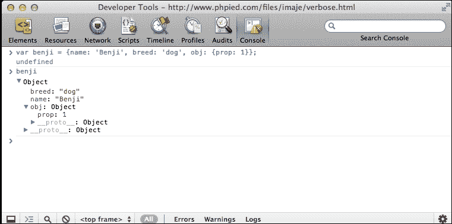
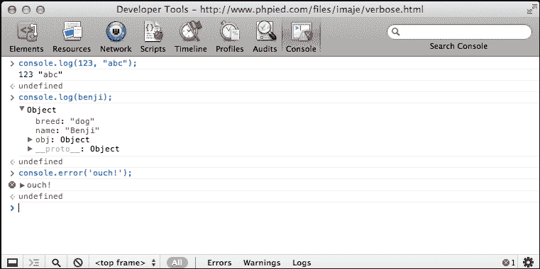

# 第四章：对象

既然你已经掌握了 JavaScript 的原始数据类型、数组和函数，现在是时候兑现本书标题的承诺，谈论对象了。

JavaScript 对经典的面向对象编程有着独特的看法。面向对象编程是最流行的编程范式之一，并且一直是大多数编程语言（如 Java 和 C++）的主要内容。经典 OOP 提出了一些明确定义的概念，大多数语言都采用了这些概念。然而，JavaScript 对此有不同的看法。我们将看看 JavaScript 支持 OOP 的方式。

在本章中，你将学习以下主题：

+   如何创建和使用对象

+   构造函数是什么

+   存在哪些内置的 JavaScript 对象类型以及它们能为你做什么

# 从数组到对象

正如你已经从第二章中所知道的，*原始数据类型、数组、循环和条件*，数组只是一个值的列表。每个值都有一个从零开始递增的索引（一个数字键）。考虑以下例子：

```js
    > var myarr = ['red', 'blue', 'yellow', 'purple']; 
    > myarr; 
    ["red", "blue", "yellow", "purple"]. 
    > myarr[0]; 
    "red" 
    > myarr[3]; 
    "purple" 

```

如果你将索引放在一列，值放在另一列，你将得到一个键/值对的表格，如下所示：

| **键** | **值** |
| --- | --- |
| 0 | 红色 |
| 1 | 蓝色 |
| 2 | 黄色 |
| 3 | 紫色 |

对象类似于数组，但不同之处在于你自己定义键。你不仅限于使用数字索引，还可以使用更友好的键，如`first_name`、`age`等。

让我们看一个简单的对象并检查它的部分：

```js
    var hero = { 
      breed: 'Turtle',  
      occupation: 'Ninja' 
    }; 

```

你可以看到：

+   指向对象的变量的名称是`hero`

+   与用于定义数组的`[`和`]`不同，你用`{`和`}`来定义对象

+   用逗号分隔对象中包含的元素（称为属性）

+   键/值对由冒号分隔，如 `key:value`

键（属性的名称）可以选择性地放在引号中。例如，这些键都是相同的：

```js
    var hero = {occupation: 1}; 
    var hero = {"occupation": 1}; 
    var hero = {'occupation': 1}; 

```

建议不要给属性的名称加引号（这样打字更少），但也有一些情况下你必须使用引号。这里列举了一些情况：

+   如果属性名称是 JavaScript 中的保留字之一（参见附录 A, *保留字*）

+   如果它包含空格或特殊字符（除了字母、数字和`_`和`$`字符之外的任何字符）

+   如果它以数字开头

换句话说，如果你为属性选择的名称在 JavaScript 中不是有效的变量名称，那么你需要用引号括起来。

看看这个看起来奇怪的对象：

```js
    var o = { 
      $omething: 1, 
      'yes or no': 'yes', 
      '!@#$%^&*': true 
    }; 

```

这是一个有效的对象。第二个和第三个属性需要引号；否则，你会得到一个错误。

在本章的后面，你将看到定义对象和数组的其他方法，除了`[]`和`{}`。然而，首先，让我们介绍一些术语 - 使用`[]`定义数组称为**数组字面量表示法**，使用大括号`{}`定义对象称为**对象字面量表示法**。

## 元素，属性，方法和成员

当谈论数组时，你说它们包含元素。当谈论对象时，你说它们包含属性。在 JavaScript 中没有什么显著的区别；这只是人们习惯于的术语，可能来自其他编程语言。

对象的属性可以指向一个函数，因为函数只是数据。指向函数的属性也被称为方法。在下面的例子中，`talk` 是一个方法：

```js
    var dog = { 
      name: 'Benji', 
      talk: function () { 
        alert('Woof, woof!'); 
      } 
    }; 

```

在前一章中，你已经看到，也可以将函数存储为数组元素并调用它们，但在实践中你不会经常看到这样的代码：

```js
    > var a = []; 
    > a[0] = function (what) { alert(what); }; 
    > a0; 

```

你也会看到人们使用成员这个词来指代对象的属性，通常是当属性是函数或不是函数都无所谓的时候。

## 哈希和关联数组

在一些编程语言中，有一个区别：

+   常规数组，也称为**索引**或**枚举**数组（键是数字）

+   关联数组，也称为**哈希**或**字典**（键是字符串）

JavaScript 使用数组表示索引数组，使用对象表示关联数组。如果你想在 JavaScript 中使用哈希，你会使用对象。

## 访问对象的属性

有两种访问对象属性的方法：

+   使用方括号表示法，例如，`hero['occupation']`

+   使用点表示法，例如，`hero.occupation`

点表示法更易于阅读和编写，但并非总是可用。引用属性名称的规则相同。如果属性名称不是有效的变量名称，则不能使用点表示法。

让我们再看一下 `hero` 对象：

```js
    var hero = { 
      breed: 'Turtle', 
      occupation: 'Ninja' 
    }; 

```

以下是使用点表示法访问属性的示例：

```js
    > hero.breed; 
    "Turtle" 

```

让我们看一个使用方括号表示法访问属性的例子：

```js
    > hero['occupation']; 
    "Ninja" 

```

考虑以下示例，访问一个不存在的属性返回 `undefined`：

```js
    > 'Hair color is ' + hero.hair_color; 
    "Hair color is undefined" 

```

对象可以包含任何数据，包括其他对象：

```js
    var book = { 
      name: 'Catch-22', 
      published: 1961, 
      author: { 
        firstname: 'Joseph', 
        lastname: 'Heller' 
      } 
    }; 

```

要访问 `book` 对象的 `author` 属性中包含的对象的 `firstname` 属性，你可以使用以下代码行：

```js
    > book.author.firstname; 
    "Joseph" 

```

让我们看一个使用方括号表示法的例子：

```js
    > book['author']['lastname']; 
    "Heller" 

```

即使你混合使用：

```js
    > book.author['lastname']; 
    "Heller" 
    > book['author'].lastname; 
    "Heller" 

```

另一个需要使用方括号的情况是需要访问的属性名称事先不知道。在运行时，它会动态存储在一个变量中：

```js
    > var key = 'firstname'; 
    > book.author[key]; 
    "Joseph" 

```

## 调用对象的方法

你知道方法只是一个恰好是函数的属性，所以你访问方法的方式与访问属性的方式相同-使用点表示法或使用方括号。调用（调用）方法与调用任何其他函数相同-只需在方法名称后添加括号，这实际上是在说执行！：

```js
    > var hero = { 
        breed: 'Turtle', 
        occupation: 'Ninja', 
        say: function () { 
          return 'I am ' + hero.occupation; 
        } 
      }; 
    > hero.say(); 
    "I am Ninja" 

```

如果有任何要传递给方法的参数，你会像处理普通函数一样进行：

```js
    > hero.say('a', 'b', 'c'); 

```

由于可以使用类似数组的方括号访问属性，这意味着你也可以使用方括号访问和调用方法：

```js
    > hero['say'](); 

```

这不是一个常见的做法，除非在编写代码时不知道方法名，而是在运行时定义：

```js
    var method = 'say'; 
    hero[method](); 

```

### 注意

除非必须使用点表示法访问方法和属性，并且不要在对象文字中引用属性。

## 修改属性/方法

JavaScript 允许你随时更改现有对象的属性和方法。这包括添加新属性或删除它们。你可以从一个空白对象开始，然后稍后添加属性。让我们看看你可以如何做到这一点。

没有属性的对象如下所示：

```js
    > var hero = {}; 

```

### 注意

**“空白”对象**

在本节中，你从一个“空白”对象开始，`var hero = {}`。引号中的“空白”是因为这个对象并不真的是空的和无用的。尽管在这个阶段它没有自己的属性，但它已经继承了一些属性。

稍后你会了解更多关于自有属性与继承属性的知识。因此，在 ES3 中，对象从来不是真正的空白或空的。不过，在 ES5 中，有一种方法可以创建一个完全空白的对象，它不继承任何东西，但我们不要过多地超前。

1.  以下是访问不存在属性的代码：

```js
        > typeof hero.breed; 
        "undefined" 

```

1.  添加两个属性和一个方法：

```js
        > hero.breed = 'turtle'; 
        > hero.name = 'Leonardo'; 
        > hero.sayName = function () { 
            return hero.name;  
          }; 

```

1.  调用方法：

```js
        > hero.sayName(); 
        "Leonardo" 

```

1.  删除属性：

```js
        > delete hero.name; 
        true 

```

1.  如果再次调用该方法，它将不再找到已删除的 `name` 属性：

```js
        > hero.sayName(); 
        "undefined" 

```

### 注意

**可变对象**

你可以随时更改任何对象，例如添加和删除属性以及更改它们的值。但是，这个规则也有例外。一些内置对象的一些属性是不可更改的（例如 `Math.PI`，稍后你会看到）。此外，ES5 允许你阻止对对象的更改。你将在附录 C 中了解更多关于它的知识，*内置对象*。

## 使用 this 值

在上一个例子中，`sayName()`方法使用了`hero.name`来访问`hero`对象的`name`属性。然而，在方法内部，还有另一种访问方法所属对象的方式。这种方法就是使用特殊值`this`：

```js
    > var hero = { 
        name: 'Rafaelo', 
        sayName: function () { 
          return this.name; 
        } 
      }; 
    > hero.sayName(); 
    "Rafaelo" 

```

因此，当你说`this`时，实际上是在说-这个对象或当前对象。

## 构造函数

还有另一种创建对象的方式-使用构造函数。让我们看一个例子：

```js
    function Hero() { 
      this.occupation = 'Ninja'; 
    } 

```

为了使用这个函数创建一个对象，你可以使用`new`操作符，如下所示：

```js
    > var hero = new Hero(); 
    > hero.occupation; 
    "Ninja" 

```

使用构造函数的好处是它们可以接受参数，在创建新对象时可以使用这些参数。让我们修改构造函数以接受一个参数并将其赋值给`name`属性：

```js
    function Hero(name) { 
      this.name = name; 
      this.occupation = 'Ninja'; 
      this.whoAreYou = function () { 
        return "I'm " + 
               this.name + 
               " and I'm a " + 
               this.occupation; 
      }; 
    } 

```

现在，你可以使用相同的构造函数创建不同的对象：

```js
    > var h1 = new Hero('Michelangelo'); 
    > var h2 = new Hero('Donatello'); 
    > h1.whoAreYou(); 
    "I'm Michelangelo and I'm a Ninja" 
    > h2.whoAreYou(); 
    "I'm Donatello and I'm a Ninja" 

```

### 注意

按照惯例，你应该将构造函数的第一个字母大写，以便你有一个视觉线索表明它们不打算作为常规函数调用。

如果你调用一个被设计为构造函数的函数但省略了`new`操作符，这不会报错。但是，它不会给你期望的结果：

```js
    > var h = Hero('Leonardo'); 
    > typeof h; 
    "undefined" 

```

这里发生了什么？没有`new`操作符，所以没有创建新对象。函数被像任何其他函数一样调用，所以变量`h`包含函数返回的值。函数没有返回任何东西（没有`return`函数），所以实际上返回了`undefined`，这个值被赋给了变量`h`。

在这种情况下，`this`指的是什么？它指的是全局对象。

## 全局对象

你已经学习了一些关于全局变量（以及你应该避免它们）的知识。你也知道 JavaScript 程序运行在一个宿主环境中（例如浏览器）。现在你了解了对象，是时候说出整个真相了，宿主环境提供了一个全局对象，所有全局变量都可以作为全局对象的属性访问。

如果你的宿主环境是 Web 浏览器，全局对象被称为**window**。另一种访问全局对象的方式（在大多数其他环境中也是如此）是在构造函数之外的全局程序代码中使用`this`关键字。

举例来说，你可以在任何函数外声明一个全局变量，如下所示：

```js
    > var a = 1; 

```

然后，你可以以各种方式访问这个全局变量：

+   作为变量`a`

+   作为全局对象的属性，例如`window['a']`或`window.a`

+   作为全局对象的属性，称为`this`：

```js
    > var a = 1; 
    > window.a; 
    1 
    > this.a; 
    1 

```

让我们回到你定义一个构造函数并在没有`new`操作符的情况下调用它的情况。在这种情况下，`this`指的是全局对象，并且所有设置为`this`的属性都成为`window`的属性。

声明一个构造函数并在没有使用 new 的情况下调用它会返回`"undefined"`：

```js
    > function Hero(name) { 
        this.name = name; 
      } 
    > var h = Hero('Leonardo'); 
    > typeof h; 
    "undefined" 
    > typeof h.name; 
    TypeError: Cannot read property 'name' of undefined 

```

正如你在`Hero`函数内部使用了`this`关键字，一个全局变量（全局对象的属性）叫做`name`被创建了：

```js
    > name; 
    "Leonardo" 
    > window.name; 
    "Leonardo" 

```

如果你使用`new`调用相同的构造函数，那么会返回一个新对象，并且`this`指向它：

```js
    > var h2 = new Hero('Michelangelo'); 
    > typeof h2; 
    "object" 
    > h2.name; 
    "Michelangelo" 

```

你在第三章中看到的内置全局函数*函数*也可以作为`window`对象的方法来调用。因此，以下两个调用会得到相同的结果：

```js
    > parseInt('101 dalmatians'); 
    101 
    > window.parseInt('101 dalmatians') 
    101 

```

## 构造函数属性

当创建一个对象时，会在幕后为其分配一个特殊的属性-`constructor`属性。它包含了用于创建`this`对象的构造函数的引用。

继续上一个例子：

```js
    > h2.constructor; 
    function Hero(name) { 
      this.name = name; 
    } 

```

由于`constructor`属性包含对函数的引用，你也可以调用这个函数来生成一个新对象。以下代码就像在说：“我不在乎对象`h2`是如何创建的，但我想要另一个和它一样的对象”：

```js
    > var h3 = new h2.constructor('Rafaello'); 
    > h3.name; 
    "Rafaello" 

```

如果使用对象文字表示法创建对象，则其构造函数是内置的`Object()`构造函数（本章后面将更多介绍）：

```js
    > var o = {}; 
    > o.constructor; 
    function Object() { [native code] } 
    > typeof o.constructor; 
    "function" 

```

## instanceof 运算符

使用`instanceof`运算符，您可以测试对象是否是使用特定的`constructor`函数创建的：

```js
    > function Hero() {} 
    > var h = new Hero(); 
    > var o = {}; 
    > h instanceof Hero; 
    true 
    > h instanceof Object; 
    true 
    > o instanceof Object; 
    true 

```

请注意，您在函数名称后面不要放括号（不要使用`h instanceof Hero()`）。这是因为您没有调用此函数，而只是通过名称引用它，就像引用任何其他变量一样。

## 返回对象的函数

除了使用`constructor`函数和`new`运算符创建对象之外，您还可以使用普通函数创建对象，而无需使用`new`运算符。您可以有一个函数进行一些准备工作，并将对象作为返回值。

例如，这是一个简单的`factory()`函数，用于生成对象：

```js
    function factory(name) { 
      return { 
        name: name 
      }; 
    } 

```

考虑以下使用`factory()`函数的示例：

```js
    > var o = factory('one'); 
    > o.name; 
    "one" 
    > o.constructor; 
    function Object() { [native code] } 

```

实际上，您还可以使用`constructor`函数和`return`与`this`关键字不同的对象。这意味着您可以修改`constructor`函数的默认行为。让我们看看如何做到这一点。

这是正常的构造函数场景：

```js
    > function C() { 
        this.a = 1; 
      } 
    > var c = new C(); 
    > c.a; 
    1 

```

然而，现在，看看这种情况：

```js
    > function C2() { 
        this.a = 1; 
        return {b: 2}; 
      } 
    > var c2 = new C2(); 
    > typeof c2.a; 
    "undefined" 
    > c2.b; 
    2 

```

这里发生了什么？构造函数没有返回包含属性`a`的`this`对象，而是返回了另一个包含属性`b`的对象。只有在返回值是对象的情况下才可能发生这种情况。否则，如果您尝试返回任何不是对象的东西，构造函数将继续其通常的行为并返回`this`。

如果您考虑构造函数内部如何创建对象，您可以想象在函数顶部定义了一个名为`this`的变量，然后在末尾返回。考虑以下代码：

```js
    function C() { 
      // var this = {}; // pseudo code, you can't do this 
      this.a = 1; 
      // return this; 
    } 

```

## 传递对象

当您将对象分配给不同的变量或将其传递给函数时，您只传递了对该对象的引用。因此，如果您对引用进行更改，实际上是修改了原始对象。

这是一个示例，演示了如何将一个对象分配给另一个变量，然后对副本进行更改。结果，原始对象也被更改了：

```js
    > var original = {howmany: 1}; 
    > var mycopy = original; 
    > mycopy.howmany; 
    1 
    > mycopy.howmany = 100; 
    100 
    > original.howmany; 
    100 

```

将对象传递给函数时也是一样的：

```js
    > var original = {howmany: 100}; 
    > var nullify = function (o) { o.howmany = 0; }; 
    > nullify(original); 
    > original.howmany; 
    0 

```

## 比较对象

当您比较对象时，只有在比较两个指向同一对象的引用时才会得到`true`。如果比较两个不同的对象，这两个对象恰好具有完全相同的方法和属性，结果将是`false`。

让我们创建两个看起来相同的对象：

```js
    > var fido  = {breed: 'dog'}; 
    > var benji = {breed: 'dog'}; 

```

将它们进行比较会返回`false`：

```js
    > benji === fido; 
    false 
    > benji == fido; 
    false 

```

您可以创建一个新变量`mydog`，并将其中一个对象分配给它。这样，变量`mydog`实际上指向同一个对象：

```js
    > var mydog = benji; 

```

在这种情况下，`benji`是`mydog`，因为它们是同一个对象（更改`mydog`变量的属性将更改`benji`变量的属性）。比较结果为`true`：

```js
    > mydog === benji; 
    true 

```

由于`fido`是一个不同的对象，它与`mydog`不相等：

```js
    > mydog === fido; 
    false 

```

## WebKit 控制台中的对象

在深入研究 JavaScript 中的内置对象之前，让我们快速谈一下在 WebKit 控制台中使用对象的工作。

在本章的示例中玩耍后，您可能已经注意到对象在控制台中的显示方式。如果您创建一个对象并键入其名称，您将得到一个指向对象的箭头。

对象是可点击的，并展开以显示对象的所有属性列表。如果属性也是对象，则旁边也有一个箭头，因此您也可以展开它。这很方便，因为它可以让您深入了解这个对象的确切内容。考虑以下示例：



### 注意

您现在可以忽略`__proto__`；下一章将更多介绍。

### 使用 console.log 方法记录

控制台还为您提供了一个名为`console`的对象和一些方法，例如`console.log()`和`console.error()`，您可以使用它们在控制台中显示任何您想要的值。



`console.log()`方法在您想要快速测试某些内容时非常方便，以及在您的真实脚本中想要转储一些中间调试信息时非常方便。以下是您可以尝试循环的示例：

```js
    > for (var i = 0; i < 5; i++) { 
        console.log(i);  
      } 
    0 
    1 
    2 
    3 
    4 

```

## ES6 对象字面量

ES6 在使用对象字面量时引入了更简洁的语法。ES6 为属性初始化和函数定义提供了几种简写。ES6 的简写与熟悉的 JSON 语法非常相似。考虑以下代码片段：

```js
    let a = 1 
    let b = 2 
    let val = {a: a, b: b} 
    console.log(val) //{"a":1,"b":2} 

```

这是分配属性值的典型方式。如果变量的名称和属性键相同，ES6 允许您使用简写语法。上述代码可以写成如下形式：

```js
    let a = 1 
    let b = 2 
    let val = {a, b} 
    console.log(val) //{"a":1,"b":2} 

```

方法定义也有类似的语法。正如我们所讨论的，方法只是对象的属性，其值是函数。考虑以下示例：

```js
    var obj = { 
      prop: 1, 
      modifier:  function() { 
        console.log(this.prop);   
      } 
    } 

```

在 ES6 中定义方法的一种简洁方式。您只需删除`function`关键字和`:`。在 ES6 中等效的代码如下所示：

```js
    var obj = { 
      prop: 1, 
      modifier () { 
        console.log(this.prop); 
      } 
    } 

```

ES6 允许您计算属性的键。在 ES6 之前，您只能使用固定的属性名称。以下是一个例子：

```js
    var obj = { 
      prop: 1, 
      modifier: function () { 
        console.log(this.prop);   
      } 
    } 
    obj.prop = 2; 
    obj.modifier(); //2 

```

正如您所看到的，我们在这种情况下受限于使用固定的键名称：`prop`和`modifier`。然而，ES6 允许您使用计算属性键。还可以使用由函数返回的值动态创建属性键：

```js
    let vehicle = "car" 
    function vehicleType(){ 
      return "truck" 
    } 
    let car = { 
      [vehicle+"_model"]: "Ford" 
    } 
    let truck= { 
      [vehicleType() + "_model"]: "Mercedez" 
    } 
    console.log(car) //{"car_model":"Ford"} 
    console.log(truck) //{"truck_model":"Mercedez"} 

```

我们正在使用变量`vehicle`的值与固定字符串连接，以推导出创建`car`对象时的属性键。在第二个片段中，我们通过将固定字符串与函数返回的值连接来创建属性。这种计算属性键的方式在创建对象时提供了很大的灵活性，并且可以消除大量样板和重复的代码。

此语法也适用于方法定义：

```js
    let object_type = "Vehicle" 
    let obj = { 
      ["get"+object_type]() { 
        return "Ford" 
      } 
    } 

```

# 对象属性和属性

每个对象都有一些属性。每个属性又有一个键和属性。属性的状态存储在这些属性中。所有属性都具有以下属性：

+   **可枚举（布尔值）**：这表示您是否可以枚举对象的属性。系统属性是不可枚举的，而用户属性是可枚举的。除非有充分的理由，否则应该保持不变。

+   **可配置（布尔值）**：如果此属性为`false`，则该属性无法被删除或编辑（它不能更改任何属性）。

您可以使用`Object.getOwnPropertyDescriptor()`方法来检索对象的自有属性：

```js
    let obj = { 
      age: 25 
    } 
    console.log(Object.getOwnPropertyDescriptor(obj, 'age')); 
    //{"value":25,"writable":true,"enumerable":true,"configurable":true} 

```

同时，可以使用`Object.defineProperty()方法`来定义属性：

```js
    let obj = { 
      age: 25 
    } 
    Object.defineProperty(obj, 'age', { configurable: false }) 
    console.log(Object.getOwnPropertyDescriptor(obj, 'age')); 
    //{"value":25,"writable":true,"enumerable":true,"configurable":false} 

```

虽然你可能永远不会使用这些方法，但了解对象属性和属性是很重要的。在下一节中，我们将讨论一些`object`方法在某些属性的上下文中是如何使用的。

# ES6 对象方法

ES6 引入了一些对象的静态辅助方法。`Object.assign`是一个辅助方法，用于执行对象的浅复制，取代了流行的混合方法。

## 使用 Object.assign 复制属性

此方法用于将目标对象的属性复制到源对象中。换句话说，此方法将源对象与目标对象合并，并修改目标对象：

```js
    let a = {} 
    Object.assign(a, { age: 25 }) 
    console.log(a)  //{"age":25} 

```

`Object.assign`的第一个参数是要复制源属性的目标对象。同一个目标对象将返回给调用者。现有属性将被覆盖，而不是源对象的一部分的属性将被忽略：

```js
    let a = {age : 23, gender: "male"} 
    Object.assign(a, { age: 25 })    // age overwritten, but gender ignored 
    console.log(a)  //{"age":25, "gender":"male"} 

```

`Object.assign`可以接受多个源对象。您可以编写`Object.assign(target, source1, source2)`。以下是一个例子：

```js
    console.log(Object.assign({a:1, b:2}, {a: 2}, {c: 4}, {b: 3})) 
    //Object { 
    //"a": 2,  
    //"b": 3, 
    //"c": 4 
    // 

```

在这个片段中，我们正在从多个源对象中分配属性。另外，请注意`Object.assign()`如何返回目标对象，然后我们将其用在`console.log()`中。

需要注意的一点是，只有可枚举的自有（非继承的）属性才能使用`Object.assign()`进行复制。原型链中的属性（在本章后面讨论继承时将会讨论）不会被考虑。我们之前讨论的可枚举属性将帮助您理解这种区别。

在下面的例子中，我们将使用`defineProperty()`创建一个不可枚举的属性，并验证`Object.assign()`忽略该属性的事实：

```js
    let a = {age : 23, gender: "male"} 
    Object.defineProperty(a, 'superpowers', {enumberable:false, value: 'ES6'}) 
    console.log(
```

定义为`superpowers`的属性的可枚举属性设置为`false`。在复制属性时，此属性将被忽略。

## 使用 Object.is 比较值

ES6 提供了一种稍微精确比较值的方式。我们已经讨论了严格相等运算符`===`。然而，对于`NaN`和`-0`和`+0`，严格相等运算符的行为是不一致的。这里有一个例子：

```js
    console.log(NaN===NaN) //false 
    console.log(-0===+0) //true 
    //ES6 Object.is 
    console.log(Object.is(NaN,NaN)) //true 
    console.log(Object.is(-0,+0)) //false 

```

除了这两种情况，`Object.is()`可以安全地替换为`===`运算符。

# 解构

编码时，您将一直使用对象和数组。JavaScript 对象和数组的表示方式类似于 JSON 格式。您将定义对象和数组，然后从中检索元素。ES6 提供了一种方便的语法，显著改进了我们从对象和数组中访问属性/成员的方式。让我们考虑一个您经常会写的典型代码：

```js
    var config = { 
      server: 'localhost', 
      port: '8080' 
    } 
    var server = config.server; 
    var port = config.port; 

```

在这里，我们从`config`对象中提取了`server`和`port`的值，并将它们分配给本地变量。非常简单明了！然而，当这个对象有一堆属性，其中一些是嵌套的，这个简单的操作可能会变得非常乏味。

ES6 解构语法允许在赋值语句的左侧使用对象字面量。在下面的例子中，我们将定义一个带有几个属性的对象`config`。稍后，我们将使用解构来将对象`config`的值分配给赋值语句左侧的各个属性：

```js
    let config = { 
      server: 'localhost', 
      port: '8080', 
      timeout: 900, 
    } 
    let {server,port} = config  
    console.log(server, port) //"localhost" "8080" 

```

如您所见，`server`和`port`是本地变量，它们从`config`对象中获取了属性，因为属性的名称与本地变量的名称相同。您还可以在将它们分配给本地变量时挑选特定的属性。这里有一个例子：

```js
    let {timeout : t} =config 
    console.log(t) //900 

```

在这里，我们只从`config`对象中挑选`timeout`并将其赋值给一个本地变量`t`。

您还可以使用解构语法将值分配给已声明的变量。在这种情况下，您必须在赋值周围加上括号：

```js
    let config = { 
      server: 'localhost', 
      port: '8080', 
      timeout: 900, 
    } 
    let server = '127.0.0.1'; 
    let port = '80'; 
    ({server,port} = config) //assignment surrounded by () 
    console.log(server, port) //"localhost" "8080" 

```

由于解构表达式评估为表达式的右侧，因此可以在期望值的任何位置使用它。例如，在函数调用中，如下所示：

```js
    let config = { 
      server: 'localhost', 
      port: '8080', 
      timeout: 900, 
    } 
    let server='127.0.0.1'; 
    let port ='80'; 
    let timeout ='100'; 

    function startServer(configValue){ 
      console.log(configValue) 
    } 
    startServer({server,port,timeout} = config) 

```

如果您指定一个在对象中不存在的属性名称的本地变量，那么本地变量将获得一个`undefined`值。然而，在解构赋值中使用变量时，您可以选择指定默认值：

```js
    let config = { 
      server: 'localhost', 
      port: '8080' 
    } 
    let {server,port,timeout=0} = config 
    console.log(timeout) 

```

在这个例子中，对于不存在的属性`timeout`，我们提供了一个默认值，以防止将`undefined`值分配给本地变量。

解构也适用于数组，并且语法与对象的语法非常相似。我们只需要用`array:literals`替换对象字面量语法：

```js
    const arr = ['a','b'] 
    const [x,y] = arr 
    console.log (x,y) /"a" "b" 

```

如您所见，这与我们之前看到的完全相同的语法。我们定义了一个数组`arr`，然后使用解构语法将该数组的元素分配给两个本地变量`x`和`y`。在这里，赋值是基于数组中元素的顺序进行的。由于您只关心元素的位置，如果需要，可以跳过其中一些元素。这里有一个例子：

```js
    const days = ['Thursday','Friday','Saturday','Sunday'] 
    const [,,sat,sun] = days 
    console.log (sat,sun) //"Saturday" "Sunday" 

```

在这里，我们知道我们需要位置 2 和 3 的元素（数组的索引从 0 开始），因此，我们忽略位置 0 和 1 的元素。数组解构可以在交换两个变量的值时消除对`temp`变量的使用。考虑以下内容：

```js
    let a=1, b=2; 
    [b,a] = [a,b] 
    console.log(a,b) //2 1 

```

您可以使用剩余运算符（`...`）来提取剩余的元素并将它们分配给数组。剩余运算符只能在解构期间作为最后一个运算符使用：

```js
    const [x, ...y] = ['a', 'b', 'c']; // x='a'; y=['b', 'c'] 

```

# 内置对象

在本章的前面，您遇到了`Object()`构造函数。当您使用对象文字表示法创建对象并访问它们的`constructor`属性时，它将返回。`Object()`是内置构造函数之一；还有其他一些，在本章的其余部分中您将看到它们全部。

内置对象可以分为三组：

+   **数据包装对象**：这些是`Object`，`Array`，`Function`，`Boolean`，`Number`和`String`。这些对象对应于 JavaScript 中的不同数据类型。对于`typeof`返回的每个不同值（在第二章中讨论），都有一个数据包装对象，除了`undefined`和`null`。

+   **实用对象**：这些是`Math`，`Date`和`RegExp`，可能会派上用场。

+   错误对象：这些包括通用的`Error`对象，以及其他更具体的对象，可以帮助您的程序在发生意外情况时恢复其工作状态。

本章将讨论内置对象的少数方法。有关完整的参考信息，请参阅附录 C，*内置对象*。

如果您对内置对象和内置构造函数感到困惑，那么它们是相同的。一会儿，您将看到函数，因此构造函数也是对象。

## 对象

对象是所有 JavaScript 对象的父对象，这意味着您创建的每个对象都继承自它。要创建一个新的空对象，可以使用文字表示法或`Object()`构造函数。以下两行是等效的：

```js
    > var o = {}; 
    > var o = new Object(); 

```

如前所述，空（或空白）对象并不是完全无用的，因为它已经包含了几个继承的方法和属性。在本书中，空表示像`{}`这样的没有自己属性的对象，除了它自动获得的属性。让我们看看即使是空白对象已经具有的一些属性：

+   `o.constructor`属性返回对构造函数的引用

+   `o.toString()`是一个返回对象的字符串表示的方法

+   `o.valueOf()`返回对象的单个值表示；通常，这就是对象本身

让我们看看这些方法的实际应用。首先，创建一个对象：

```js
    > var o = new Object(); 

```

调用`toString()`返回对象的字符串表示：

```js
    > o.toString(); 
    "[object Object]" 

```

当 JavaScript 在字符串上下文中使用对象时，将在内部调用`toString()`方法。例如，`alert()`仅适用于字符串，因此如果调用`alert()`函数并传递一个对象，则`toString()`方法将在幕后调用。这两行产生相同的结果：

```js
    > alert(o); 
    > alert(o.toString()); 

```

另一种字符串上下文是字符串连接。如果尝试将对象与字符串连接，将首先调用对象的`toString()`方法：

```js
    > "An object: " + o; 
    "An object: [object Object]" 

```

`valueOf()`方法是所有对象提供的另一种方法。对于简单对象（其构造函数为`Object()`），`valueOf()`方法返回对象本身：

```js
    > o.valueOf() === o; 
    true 

```

总结一下：

+   您可以使用`var o = {};`（对象文字表示法，首选方法）或`var o = new Object();`来创建对象

+   任何对象，无论多么复杂，都继承自`Object`对象，因此提供诸如`toString()`之类的方法和构造函数之类的属性

## 数组

`Array()`是一个内置函数，您可以将其用作构造函数来创建数组：

```js
    > var a = new Array(); 

```

这相当于数组文字表示法：

```js
    > var a = []; 

```

无论数组如何创建，都可以像通常一样向其添加元素：

```js
    > a[0] = 1; 
    > a[1] = 2; 
    > a; 
    [1, 2] 

```

在使用 `Array()` 构造函数时，还可以传递要分配给新数组元素的值：

```js
    > var a = new Array(1, 2, 3, 'four'); 
    > a; 
    [1, 2, 3, "four"] 

```

一个例外是当将单个数字传递给构造函数时。在这种情况下，该数字被视为数组的长度：

```js
    > var a2 = new Array(5); 
    > a2; 
     [undefined x 5] 

```

由于数组是用构造函数创建的，这是否意味着数组实际上是对象？是的，您可以使用 `typeof` 运算符来验证这一点：

```js
    > typeof [1, 2, 3]; 
    "object" 

```

由于数组是对象，这意味着它们继承了父对象的属性和方法：

```js
    > var a = [1, 2, 3, 'four']; 
    > a.toString(); 
    "1,2,3,four" 
    > a.valueOf(); 
    [1, 2, 3, "four"] 
    > a.constructor; 
    function Array() { [native code] } 

```

数组是对象，但是一种特殊类型的对象，因为：

+   它们的属性名称会自动使用从 0 开始的数字进行分配。

+   它们有一个包含数组中元素数量的 `length` 属性。

+   除了从父对象继承的方法之外，它们还有更多内置方法。

让我们来看看数组和对象之间的区别，首先创建空数组 `a` 和空对象 `o`：

```js
    > var a = [], o = {}; 

```

数组对象自动为它们定义了一个 `length` 属性，而普通对象没有：

```js
    > a.length; 
    0 
    > typeof o.length; 
    "undefined" 

```

向数组和对象都可以添加数字和非数字属性是可以的：

```js
    > a[0] = 1;  
    > o[0] = 1; 
    > a.prop = 2; 
    > o.prop = 2; 

```

`length` 属性始终与数字属性的数量保持同步，而忽略非数字属性：

```js
    > a.length; 
    1 

```

`length` 属性也可以由您设置。将其设置为大于数组中当前项目数的值会为额外的元素腾出空间。如果尝试访问这些不存在的元素，将得到值 `undefined`：

```js
    > a.length = 5; 
    5 
    > a; 
    [1, undefined x 4] 

```

将 `length` 属性设置为较小的值会移除尾随元素：

```js
    > a.length = 2; 
    2 
    > a; 
    [1, undefined x 1] 

```

### 一些数组方法

除了从父对象继承的方法之外，数组对象还具有专门用于处理数组的方法，例如 `sort()`、`join()` 和 `slice()` 等（有关完整列表，请参见 附录 C，“内置对象”）。

让我们拿一个数组来尝试一些这些方法：

```js
    > var a = [3, 5, 1, 7, 'test']; 

```

`push()` 方法将一个新元素追加到数组的末尾。`pop()` 方法移除最后一个元素。`a.push('new')` 方法的作用类似于 `a[a.length] = 'new'`，而 `a.pop()` 类似于 `a.length-`。

`push()` 方法返回更改后数组的长度，而 `pop()` 返回移除的元素：

```js
    > a.push('new'); 
    6 
    > a; 
    [3, 5, 1, 7, "test", "new"] 
    > a.pop(); 
    "new" 
    > a; 
    [3, 5, 1, 7, "test"] 

```

`sort()` 方法对数组进行排序并返回它。在下一个例子中，排序后，`a` 和 `b` 都指向同一个数组：

```js
    > var b = a.sort(); 
    > b; 
    [1, 3, 5, 7, "test"] 
    > a === b; 
    true 

```

`join()` 方法返回一个包含数组中所有元素值的字符串，这些值使用传递给 `join()` 的字符串参数粘合在一起：

```js
    > a.join(' is not '); 
    "1 is not 3 is not 5 is not 7 is not test" 

```

`slice()` 方法返回一个数组的一部分，而不修改源数组。`slice()` 的第一个参数是起始索引（从零开始），第二个是结束索引（两个索引都是从零开始）。起始索引包括在内，而结束索引不包括在内。看下面的例子：

```js
    > b = a.slice(1, 3); 
    [3, 5] 
    > b = a.slice(0, 1); 
    [1] 
    > b = a.slice(0, 2); 
    [1, 3] 

```

在所有切片之后，源数组仍然是相同的：

```js
    > a; 
    [1, 3, 5, 7, "test"] 

```

`splice()` 方法修改源数组。它移除一个片段，返回它，并可选择用新元素填充空白。前两个参数定义要移除的片段的起始索引和长度（元素数量）；其他参数传递新值：

```js
    > b = a.splice(1, 2, 100, 101, 102); 
    [3, 5] 
    > a; 
    [1, 100, 101, 102, 7, "test"] 

```

用新元素填充空白是可选的，所以您可以跳过它：

```js
    > a.splice(1, 3);  
    [100, 101, 102] 
    > a; 
    [1, 7, "test"] 

```

# ES6 数组方法

数组获得了一堆有用的方法。像 **lodash** 和 **underscore** 这样的库提供了语言中缺少的功能。有了新的辅助方法，数组的创建和操作变得更加功能化和易于编码。

## Array.from

在 JavaScript 中，将类似数组的值转换为数组一直是一个挑战。人们已经使用了几种技巧并编写了库，只是为了让您有效地处理数组。

ES6 引入了一个非常有用的方法，可以将类似数组的对象和可迭代值转换为数组。类似数组的值是具有长度属性和索引元素的对象。每个函数都有一个隐式的`arguments`变量，其中包含传递给函数的所有参数的列表。这个变量是一个类似数组的对象。在 ES6 之前，我们将`arguments`对象转换为数组的唯一方法是遍历它并将值复制到一个新数组中：

```js
    function toArray(args) { 
        var result = []; 
        for (var i = 0, len = args.length; i < len; i++) { 
            result.push(args[i]); 
        } 
        return result; 
    } 
    function doSomething() { 
        var args = toArray(arguments); 
        console.log(args) 
    } 
    doSomething("hellow", "world") 
    //Array [ 
    //  "hellow", 
    //  "world" 
    //] 

```

在这里，我们正在创建一个新数组，以复制`arguments`对象的所有元素。这是浪费的，需要大量不必要的编码。`Array.from()`是将类似数组的对象转换为数组的简洁方式。我们可以使用`Array.from()`将这个例子转换为更简洁的一个：

```js
    function doSomething() { 
        console.log(Array.from(arguments)) 
    } 
    doSomething("hellow", "world") 
    //Array [ 
    //  "hellow", 
    //  "world" 
    //] 

```

在调用`Array.from()`时，您可以通过提供映射函数来提供自己的映射方案。这个函数在对象的所有元素上被调用并进行转换。这是许多常见用例的一个有用构造，例如：

```js
    function doSomething() { 
       console.log(Array.from(arguments, function(elem) 
      { return elem + " mapped"; })); 
    } 

```

在这个例子中，我们正在使用`Array.from`解构`arguments`对象，并对`arguments`对象中的每个元素调用一个函数。

## 使用 Array.of 创建数组

使用`Array()`构造函数创建数组会引起一些问题。构造函数的行为基于参数的数量和类型而有所不同。当您将单个数值传递给`Array()`构造函数时，将创建一个包含未定义元素的数组，其长度的值被分配给参数的值：

```js
    let arr = new Array(2) 
    console.log(arr) //[undefined, undefined] 
    console.log(arr.length) //2 

```

另一方面，如果您只传递一个非数值值，它将成为数组中的唯一项：

```js
    let arr = new Array("2") 
    console.log(arr) //["2"] 
    console.log(arr.length) //1 

```

这还不是全部。如果传递多个值，它们将成为数组的元素：

```js
    let arr = new Array(1,"2",{obj: "3"}) 
    console.log(arr.length) //3 

```

因此，显然，需要有更好的方法来创建数组，以避免混淆。ES6 引入了`Array.of`方法，它的工作方式类似于`Array()`构造函数，但保证了一种标准行为。`Array.of`从其参数创建一个数组，而不管它们的数量和类型：

```js
    let arr = Array.of(1,"2",{obj: "3"}) 
    console.log(arr.length) //3 

```

## Array.prototype 方法

ES6 引入了几种有趣的方法作为数组实例的一部分。这些方法有助于数组迭代和搜索数组中的元素，这两种操作都是非常频繁和有用的。

以下是用于迭代数组的方法：

+   `Array.prototype.entries()`

+   `Array.prototype.values()`

+   `Array.prorotype.keys()`

所有三种方法都返回一个迭代器。这个迭代器可以用于使用`Array.from()`创建数组，并且可以在 for 循环中用于迭代：

```js
    let arr = ['a','b','c'] 
    for (const index of arr.keys()){ 
      console.log(index) //0 1 2 
    } 
    for (const value of arr.values()){ 
      console.log(value) //a b c 
    } 
    for (const [index,value] of arr.entries()){ 
      console.log(index,value)  
    } 
    //0 "a" 
    //1 "b" 
    //2 "c" 

```

同样，有新的方法用于在数组中搜索。在数组中查找元素通常涉及迭代整个列表，并将它们与一个值进行比较，因为没有内置的方法来实现这一点。虽然`indexOf()`和`lastIndexOf()`有助于找到单个值，但没有办法根据复杂条件找到元素。使用 ES6，以下内置方法帮助使用`this`关键字。

+   `Array.prototype.find`

+   `Array.prototype.findIndex`

这两种方法都接受两个参数-第一个是`callback`函数（其中包含谓词条件），第二个是可选的`this`关键字。`callback`接受三个参数：数组元素，该元素的索引和数组。如果元素与谓词匹配，则`callback`返回`true`：

```js
    let numbers = [1,2,3,4,5,6,7,8,9,10]; 
    console.log(numbers.find(n => n > 5)); //6 
    console.log(numbers.findIndex(n => n > 5)); //5 

```

## 函数

您已经知道函数是一种特殊的数据类型。然而，事实证明，函数不仅仅是如此：函数实际上是对象。有一个内置的`constructor`函数叫做`Function()`，它允许以一种替代的方式（但不一定推荐）创建函数。

以下示例显示了定义函数的三种方法：

```js
    > function sum(a, b) { // function declaration 
        return a + b; 
      } 
    > sum(1, 2); 
    3 
    > var sum = function (a, b) { // function expression 
        return a + b; 
      }; 
    > sum(1, 2) 
    3 
    > var sum = new Function('a', 'b', 'return a + b;'); 
    > sum(1, 2) 
    3 

```

当使用`Function()`构造函数时，首先传递参数名称（作为字符串），然后传递函数主体的源代码（再次作为字符串）。JavaScript 引擎需要评估您传递的源代码并为您创建新的函数。这种源代码评估遭受与`eval()`函数相同的缺点，因此在可能的情况下应避免使用`Function()`构造函数定义函数。

如果您使用`Function()`构造函数创建具有许多参数的函数，请记住参数可以作为单个逗号分隔的列表传递；因此，例如，这些是相同的：

```js
    > var first = new Function( 
        'a, b, c, d', 
        'return arguments;' 
      ); 
    > first(1, 2, 3, 4); 
           [1, 2, 3, 4] 
    > var second = new Function( 
        'a, b, c', 
        'd', 
        'return arguments;' 
       ); 
    > second(1, 2, 3, 4); 
           [1, 2, 3, 4] 
    > var third = new Function( 
        'a', 
        'b', 
        'c', 
        'd', 
        'return arguments;' 
      ); 
    > third(1, 2, 3, 4);  
          [1, 2, 3, 4] 

```

### 注意

不要使用`Function()`构造函数。与`eval()`和`setTimeout()`（本书后面讨论）一样，始终尝试避免将 JavaScript 代码作为字符串传递。

### 函数对象的属性

与任何其他对象一样，函数都有一个`constructor`属性，其中包含对`Function()`构造函数的引用。无论您使用哪种语法创建函数，这都是正确的：

```js
    > function myfunc(a) { 
        return a;  
      } 
    > myfunc.constructor; 
    function Function() { [native code] } 

```

函数还有一个`length`属性，其中包含函数期望的形式参数的数量：

```js
    > function myfunc(a, b, c) { 
        return true; 
      } 
    > myfunc.length; 
       3 

```

### 使用 prototype 属性

函数对象最广泛使用的属性之一是`prototype`属性。您将在下一章中详细讨论这个属性，但现在，让我们先说一下：

+   `function`对象的`prototype`属性指向另一个对象

+   只有当您将此`function`用作构造函数时，其优势才会显现

+   使用此`function`创建的所有对象都保留对`prototype`属性的引用，并且可以将其属性用作自己的属性

让我们看一个快速的例子来演示`prototype`属性。拿一个简单的对象，它有一个属性名称和一个`say()`方法：

```js
    var ninja = { 
      name: 'Ninja', 
      say: function () { 
        return 'I am a ' + this.name; 
      } 
    }; 

```

当您创建一个函数（即使没有主体），您可以验证它自动具有指向新对象的`prototype`属性：

```js
    > function F() {} 
    > typeof F.prototype; 
    "object" 

```

当您修改`prototype`属性时，情况变得有趣。您可以向其中添加属性，或者您可以用任何其他对象替换默认对象。让我们将`ninja`分配给`prototype`：

```js
    > F.prototype = ninja; 

```

现在，这就是魔术发生的地方，使用`F()`函数作为`constructor`函数，您可以创建一个新对象`baby_ninja`，它将可以访问`F.prototype`的属性（指向`ninja`）就像它自己的属性一样：

```js
    > var baby_ninja = new F(); 
    > baby_ninja.name; 
    "Ninja" 
    > baby_ninja.say(); 
    "I am a Ninja" 

```

以后会有更多关于这个主题的内容。事实上，下一章就是关于`prototype`属性的。

### 函数对象的方法

函数对象作为顶级父对象的后代，获得默认方法，例如`toString()`。当在函数上调用`toString()`方法时，它将返回函数的源代码：

```js
    > function myfunc(a, b, c) { 
        return a + b + c; 
      } 
    > myfunc.toString(); 
    "function myfunc(a, b, c) { 
      return a + b + c; 
    }" 

```

如果您尝试窥探内置函数的源代码，您将得到`[native code]`字符串，而不是函数的主体：

```js
    > parseInt.toString(); 
    "function parseInt() { [native code] }" 

```

正如您所看到的，您可以使用`toString()`来区分原生方法和开发者定义的方法。

### 注意

函数的`toString()`的行为取决于环境，并且在浏览器之间在间距和换行方面有所不同。

### 调用和应用

函数对象具有`call()`和`apply()`方法。您可以使用它们来调用函数并传递任何参数给它。

这些方法还允许您的对象从其他对象中借用方法并将其作为自己的方法调用。这是一种重用代码的简单而强大的方式。

假设您有一个`some_obj`对象，其中包含`say()`方法：

```js
    var some_obj = { 
      name: 'Ninja', 
      say: function (who) { 
        return 'Haya ' + who + ', I am a ' + this.name; 
      } 
   }; 

```

您可以调用`say()`方法，它在内部使用`this.name`来访问自己的名称属性：

```js
    > some_obj.say('Dude'); 
    "Haya Dude, I am a Ninja" 

```

现在，让我们创建一个简单的对象`my_obj`，它只有一个名称属性：

```js
    > var my_obj = {name: 'Scripting guru'}; 

```

`my_obj`非常喜欢`some_obj`对象的`say()`方法，以至于它想将其作为自己的方法调用。这可以使用`say()`函数对象的`call()`方法实现：

```js
    > some_obj.say.call(my_obj, 'Dude'); 
    "Haya Dude, I am a Scripting guru" 

```

成功了！但这里发生了什么？您通过传递两个参数-`my_obj`对象和`Dude`字符串来调用`say()`函数对象的`call()`方法。结果是，当调用`say()`时，它包含的 this 值的引用指向`my_obj`。这样，`this.name`不会返回`Ninja`，而是返回`Scripting guru`。

如果在调用`call()`方法时有更多参数要传递，只需继续添加它们：

```js
    some_obj.someMethod.call(my_obj, 'a', 'b', 'c'); 

```

如果您没有将对象作为`call()`的第一个参数传递，或者传递`null`，则假定为全局对象。

`apply()`方法的工作方式与`call()`相同，但不同之处在于要传递给其他对象方法的所有参数都作为数组传递。以下两行是等效的：

```js
    some_obj.someMethod.apply(my_obj, ['a', 'b', 'c']); 
    some_obj.someMethod.call(my_obj, 'a', 'b', 'c'); 

```

继续上一个示例，您可以使用以下代码行：

```js
    > some_obj.say.apply(my_obj, ['Dude']); 
    "Haya Dude, I am a Scripting guru" 

```

### 重新访问 arguments 对象

在上一章中，您已经看到了如何从函数内部访问称为`arguments`的东西，其中包含传递给函数的所有参数的值：

```js
    > function f() { 
        return arguments; 
      } 
    > f(1, 2, 3); 
    [1, 2, 3] 

```

`arguments`看起来像一个数组，但实际上它是一个类似数组的对象。它看起来像一个数组，因为它包含索引元素和`length`属性。然而，相似之处就在这里，因为 arguments 不提供任何数组方法，比如`sort()`或`slice()`。

但是，您可以将`arguments`转换为数组，并从所有数组好处中受益。练习您新学到的`call()`方法，您可以这样做：

```js
    > function f() { 
        var args = [].slice.call(arguments); 
        return args.reverse(); 
      } 

    > f(1, 2, 3, 4); 
     [4, 3, 2, 1] 

```

正如您所看到的，您可以使用`[].slice`或更冗长的`Array.prototype.slice`来借用`slice()`。

# 箭头函数中的词法 this

我们在上一章中详细讨论了 ES6 箭头函数和语法。然而，箭头函数的一个重要方面是它们的行为与普通函数不同。差异是微妙但重要的。箭头函数没有自己的`this`值。箭头函数中的`this`值是从封闭（词法）范围继承的。

函数有一个特殊的变量`this`，它指的是调用该方法的对象。由于`this`的值是根据函数调用动态给出的，有时被称为动态`this`。函数在两个范围中执行-词法和动态。词法范围是包围函数范围的范围，动态范围是调用函数的范围（通常是一个对象）。

在 JavaScript 中，传统函数扮演着几种角色。它们是非方法函数（也称为子例程或函数）、方法（对象的一部分）和构造函数。当函数执行子例程的职责时，由于动态`this`，存在一个小问题。由于子例程不是在对象上调用的，因此在严格模式下`this`的值为未定义，否则设置为全局范围。这使得编写`回调`变得困难。考虑以下示例：

```js
    var greeter = { 
      default: "Hello ", 
      greet: function (names){ 
        names.forEach(function(name) { 
    console.log(this.default + name); //Cannot read property 
      'default' of undefined 
       }) 
      } 
    }     
    console.log(greeter.greet(['world', 'heaven'])) 

```

我们正在将一个子例程传递给`names`数组上的`forEach()`函数。这个子例程的`this`值是未定义的，不幸的是，它无法访问外部方法`greet`的`this`。显然，这个子例程需要一个词法`this`，从`greet`方法的周围范围派生`this`。传统上，为了解决这个限制，我们将词法`this`分配给一个变量，然后通过闭包使子例程可以访问它。

我们可以按照以下方式修复之前的示例：

```js
    var greeter = { 
      default: "Hello ", 
      greet: function (names){ 
        let that = this 
        names.forEach(function(name) { 
          console.log(that.default + name);  
       }) 
      } 
    }     
    console.log(greeter.greet(['world', 'heaven'])) 

```

这是一个合理的黑客来模拟词法`this`。然而，这种黑客的问题是它为编写或审查`this`代码的人创建了太多噪音。首先，您必须了解`this`行为的怪癖。即使您很好地理解了`this`的行为，您也需要不断地留意代码中的这种黑客。

箭头函数具有词法`this`，不需要这样的黑客。由于`this`，它们更适合作为子例程。我们可以使用箭头函数将前面的示例转换为使用词法`this`：

```js
    var greeter = { 
      default: "Hello ", 
      greet: function (names){ 
        names.forEach(name=> { 
          console.log(this.default + name);   //lexical 'this' 
           available for this subroutine 
       }) 
     } 
    }     
    console.log(greeter.greet(['world', 'heaven'])) 

```

## 推断对象类型

您可以看到，您有一个类似数组的参数对象，看起来非常像一个数组对象。您如何可靠地区分这两者？此外，当与数组一起使用时，`typeof`返回一个对象。因此，您如何区分对象和数组之间的区别？

银弹是`Object`对象的`toString()`方法。它为您提供了用于创建给定对象的内部类名称：

```js
    > Object.prototype.toString.call({}); 
    "[object Object]" 
    > Object.prototype.toString.call([]); 
    "[object Array]" 

```

您必须调用`Object`构造函数原型中定义的原始`toString()`方法。否则，如果调用`Array`函数的`toString()`，它将给出不同的结果，因为它已被重写，用于数组对象的特定目的：

```js
    > [1, 2, 3].toString(); 
    "1,2,3" 

```

前面的代码与以下代码相同：

```js
    > Array.prototype.toString.call([1, 2, 3]); 
    "1,2,3" 

```

让我们再来玩一下`toString()`。创建一个方便的参考以节省输入：

```js
    > var toStr = Object.prototype.toString; 

```

以下示例显示了如何区分数组和类似数组对象`arguments`：

```js
    > (function () { 
        return toStr.call(arguments); 
      }()); 
    "[object Arguments]" 

```

甚至可以检查 DOM 元素：

```js
    > toStr.call(document.body); 
    "[object HTMLBodyElement]" 

```

## 布尔

您在 JavaScript 中内置对象的旅程继续进行，接下来的三个对象都相当简单。它们是布尔值、数字和字符串。它们只是包装了原始数据类型。

您已经从第二章*原始数据类型、数组、循环和条件*中了解了很多关于布尔值。现在，让我们来认识`Boolean()`构造函数：

```js
    > var b = new Boolean(); 

```

重要的是要注意，这将创建一个新对象`b`，而不是原始的布尔值。要获取原始值，可以调用`valueOf()`方法（从`Object`类和自定义继承）：

```js
    > var b = new Boolean(); 
    > typeof b; 
    "object" 
    > typeof b.valueOf(); 
    "boolean" 
    > b.valueOf(); 
    false 

```

总的来说，使用`Boolean()`构造函数创建的对象并不太有用，因为它们除了继承的方法或属性之外没有提供任何其他方法。

`Boolean()`函数在没有`new`的情况下作为普通函数调用时，将非布尔值转换为布尔值（这类似于使用双重否定`!!`值）：

```js
    > Boolean("test"); 
    true 
    > Boolean(""); 
    false 
    > Boolean({}); 
    true 

```

除了六个`false`值，JavaScript 中的其他所有内容都是`true`，包括所有对象。这也意味着使用`new Boolean()`创建的所有布尔对象也都是`true`，因为它们是对象：

```js
    > Boolean(new Boolean(false)); 
    true 

```

这可能会令人困惑，由于布尔对象没有提供任何特殊方法，最好只使用常规原始布尔值。

## 数字

与`Boolean()`类似，`Number()`函数可以用作：

+   一个`constructor`函数（使用`new`）来创建对象。

+   一个普通函数，用于尝试将任何值转换为数字。这类似于使用`parseInt()`或`parseFloat()`：

```js
    > var n = Number('12.12'); 
    > n; 
    12.12 
    > typeof n; 
    "number" 
    > var n = new Number('12.12'); 
    > typeof n; 
    "object" 

```

由于函数也是对象，它们也可以有属性。`Number()`函数具有内置的常量属性，您无法修改：

```js
    > Number.MAX_VALUE; 
    1.7976931348623157e+308 
    > Number.MIN_VALUE; 
    5e-324 
    > Number.POSITIVE_INFINITY; 
    Infinity 
    > Number.NEGATIVE_INFINITY; 
    -Infinity 
    > Number.NaN; 
    NaN 

```

数字对象提供了三种方法-`toFixed()`，`toPrecision()`和`toExponential()`（有关更多详细信息，请参见附录 C，*内置对象*）：

```js
    > var n = new Number(123.456); 
    > n.toFixed(1); 
    "123.5" 

```

请注意，您可以在不显式创建`Number`对象的情况下使用这些方法。在这种情况下，`Number`对象会在幕后为您创建（并销毁）：

```js
    > (12345).toExponential(); 
    "1.2345e+4" 

```

与所有对象一样，`Number`对象也提供了`toString()`方法。当与`Number`对象一起使用时，此方法接受一个可选的基数参数（默认为 10）：

```js
    > var n = new Number(255); 
    > n.toString(); 
    "255" 
    > n.toString(10); 
    "255" 
    > n.toString(16); 
    "ff" 
    > (3).toString(2); 
    "11" 
    > (3).toString(10); 
    "3" 

```

## 字符串

您可以使用`String()`构造函数来创建字符串对象。字符串对象提供了方便的文本操作方法。

以下是一个示例，显示了`String`对象和`primitive`字符串数据类型之间的区别：

```js
    > var primitive = 'Hello'; 
    > typeof primitive; 
    "string" 
    > var obj = new String('world'); 
    > typeof obj; 
    "object" 

```

`String`对象类似于字符数组。字符串对象为每个字符都有一个索引属性（在 ES5 中引入，但在许多浏览器中长期受支持，除了旧的 IE），它们还有一个`length`属性。

```js
    > obj[0]; 
    "w" 
    > obj[4]; 
    "d" 
    > obj.length; 
    5 

```

要从`String`对象中提取`primitive`值，可以使用从`Object`继承的`valueOf()`或`toString()`方法。您可能永远不需要这样做，因为如果在`primitive`字符串上下文中使用对象，则会在幕后调用`toString()`：

```js
    > obj.valueOf(); 
    "world" 
    > obj.toString(); 
    "world" 
    > obj + ""; 
    "world" 

```

`primitive` 字符串不是对象，因此它们没有任何方法或属性。但是，JavaScript 还为您提供了将 `primitive` 字符串视为对象的语法（就像您已经看到的原始数字一样）。

在下面的示例中，每当您将 `primitive` 字符串视为对象时，都会在后台创建（然后销毁）`String` 对象：

```js
    > "potato".length; 
    6 
    > "tomato"[0]; 
    "t" 
    > "potatoes"["potatoes".length - 1]; 
    "s" 

```

以下是一个最终示例，用于说明 `primitive` 字符串和 `String` 对象之间的区别。在此示例中，我们将它们转换为布尔值。空字符串是一个假值，但任何字符串对象都是真值（因为所有对象都是真值）：

```js
    > Boolean(""); 
    false 
    > Boolean(new String("")); 
    true 

```

与 `Number()` 和 `Boolean()` 类似，如果您在没有 `new` 的情况下使用 `String()` 函数，它会将参数转换为原始值：

```js
    > String(1); 
    "1" 

```

如果您将对象传递给 `String()`，则首先将调用该对象的 `toString()` 方法：

```js
    > String({p: 1}); 
       "[object Object]" 
    > String([1, 2, 3]); 
       "1,2,3" 
    > String([1, 2, 3]) === [1, 2, 3].toString(); 
       true 

```

### 字符串对象的一些方法

让我们尝试一下您可以在字符串对象上调用的一些方法（请参见附录 C，“内置对象”，获取完整列表）。

首先创建一个字符串对象：

```js
    > var s = new String("Couch potato"); 

```

`toUpperCase()` 和 `toLowerCase()` 方法可以转换字符串的大小写：

```js
    > s.toUpperCase(); 
    "COUCH POTATO" 
    > s.toLowerCase(); 
    "couch potato" 

```

`charAt()` 方法告诉您在指定位置找到的字符，这与使用方括号（将字符串视为字符数组）相同：

```js
    > s.charAt(0); 
    "C" 
    > s[0]; 
    "C" 

```

如果您向 `charAt()` 传递一个不存在的位置，您将得到一个空字符串：

```js
    > s.charAt(101); 
    "" 

```

`indexOf()` 方法允许您在字符串中进行搜索。如果找到匹配项，该方法将返回找到第一个匹配项的位置。位置计数从 0 开始，因此 `Couch` 中的第二个字符是位置 1 处的 `o`：

```js
    > s.indexOf('o'); 
    1 

```

您可以选择指定从哪里（在什么位置）开始搜索。以下示例找到第二个 `o`，因为 `indexOf()` 被指示从位置 2 开始搜索：

```js
    > s.indexOf('o', 2); 
    7 

```

`lastIndexOf()` 从字符串的末尾开始搜索（但是匹配的位置仍然从开头计数）：

```js
    > s.lastIndexOf('o'); 
    11 

```

您可以搜索字符，也可以搜索字符串，搜索区分大小写：

```js
    > s.indexOf('Couch'); 
    0 

```

如果没有匹配项，该函数将返回位置 `-1`：

```js
    > s.indexOf('couch'); 
    -1 

```

对于不区分大小写的搜索，您可以先将字符串转换为小写，然后再搜索：

```js
    > s.toLowerCase().indexOf('couch'.toLowerCase()); 
    0 

```

如果得到 `0`，这意味着字符串的匹配部分从位置 `0` 开始。这可能会在使用 `if` 时引起混淆，因为 `if` 将位置 `0` 转换为布尔值 `false`。因此，尽管这在语法上是正确的，但在逻辑上是错误的：

```js
    if (s.indexOf('Couch')) {...} 

```

检查字符串是否包含另一个字符串的正确方法是将 `indexOf()` 的结果与数字 `-1` 进行比较：

```js
    if (s.indexOf('Couch') !== -1) {...} 

```

`slice()` 和 `substring()` 在指定开始和结束位置时返回字符串的一部分：

```js
    > s.slice(1, 5); 
    "ouch" 
    > s.substring(1, 5); 
    "ouch" 

```

请注意，您传递的第二个参数是结束位置，而不是片段的长度。这两种方法之间的区别在于它们如何处理负参数。`substring()` 将它们视为零，而 `slice()` 将它们添加到字符串的长度。因此，如果您将参数 `(1, -1)` 传递给这两种方法，它等同于 `substring(1,0)` 和 `slice(1,s.length-1)`：

```js
    > s.slice(1, -1); 
    "ouch potat" 
    > s.substring(1, -1); 
    "C" 

```

还有一个非标准的 `substr()` 方法，但您应该尽量避免使用它，而使用 `substring()`。

`split()` 方法使用您传递的另一个字符串作为分隔符从字符串创建一个数组：

```js
    > s.split(" "); 
    ["Couch", "potato"] 

```

`split()` 方法是 `join()` 方法的相反，它从数组创建一个字符串：

```js
    > s.split(' ').join(' '); 
    "Couch potato" 

```

`concat()` 将字符串粘合在一起，就像 `+` 运算符对 `primitive` 字符串一样：

```js
    > s.concat("es"); 
    "Couch potatoes" 

```

请注意，虽然前面讨论的一些方法返回新的 `primitive` 字符串，但它们都不会修改源字符串。在之前列出的所有方法调用之后，初始字符串仍然是相同的：

```js
    > s.valueOf(); 
    "Couch potato" 

```

你已经知道如何使用`indexOf()`和`lastIndexOf()`在字符串中进行搜索，但还有更强大的方法（`search()`，`match()`和`replace()`）可以将正则表达式作为参数。稍后你会看到这些方法在`RegExp()`构造函数中。

在这一点上，你已经完成了所有的数据包装对象，所以让我们继续讨论实用对象`Math`，`Date`和`RegExp`。

## Math

`Math`与你之前看到的其他内置全局对象有些不同。它不是一个函数，因此不能与`new`一起用来创建对象。`Math`是一个内置的全局对象，为数学运算提供了许多方法和属性。

`Math`对象的属性是常数，所以你不能改变它们的值。它们的名称都是大写的，以强调它们与普通属性的区别（类似于`Number()`构造函数的常量属性）。让我们看一些这些常量属性：

+   常数 PI：

```js
    > Math.PI; 
      3.141592653589793 

```

+   2 的平方根：

```js
    > Math.SQRT2; 
      1.4142135623730951 

```

+   欧拉常数：

```js
    > Math.E; 
      2.718281828459045 

```

+   2 的自然对数：

```js
    > Math.LN2; 
      0.6931471805599453 

```

+   10 的自然对数：

```js
    > Math.LN10; 
      2.302585092994046 

```

现在，你知道了如何在下一次朋友们（不管出于什么原因）开始想知道“*e*的值是多少？我记不清了。”时给他们留下深刻印象。只需在控制台中输入`Math.E`，你就有了答案。

让我们来看一下`Math`对象提供的一些方法（完整列表在附录 C 中，“内置对象”）。

生成随机数：

```js
    > Math.random(); 
    0.3649461670235814 

```

`random()`函数返回一个在`0`和`1`之间的数字，所以如果你想要一个在`0`和`100`之间的数字，你可以使用以下代码：

```js
    > 100 * Math.random(); 

```

对于任意两个值之间的数字，使用公式`((max-min) * Math.random())+min`。例如，可以使用以下公式获得 2 到 10 之间的随机数：

```js
    > 8 * Math.random() + 2; 
    9.175650496668485 

```

如果你只需要一个整数，你可以使用以下其中一种取整方法：

+   `floor()`向下取整

+   `ceil()`向上取整

+   `round()`四舍五入

例如，要获得`0`或`1`，你可以使用以下代码：

```js
    > Math.round(Math.random()); 

```

如果你需要一组数字中的最低或最高值，你可以使用`min()`和`max()`方法。所以，如果你在页面上有一个要求有效月份的表单，你可以确保你总是使用合理的数据（一个值在`1`和`12`之间）：

```js
    > Math.min(Math.max(1, input), 12); 

```

`Math`对象还提供了执行数学运算的能力，而这些运算没有专门的运算符。这意味着你可以使用`pow()`进行乘方运算，使用`sqrt()`找到平方根，并执行所有的三角函数运算-`sin()`，`cos()`，`atan()`等等。

例如，要计算`2`的`8`次方，你可以使用以下代码：

```js
    > Math.pow(2, 8); 
    256 

```

要计算`9`的平方根，你可以使用以下代码：

```js
    > Math.sqrt(9); 
    3 

```

## 日期

`Date()`是一个创建日期对象的构造函数。您可以通过传递来创建一个新对象：

+   无（默认为今天的日期）

+   类似日期的字符串

+   分别为天、月、时间等提供值

+   时间戳

这是一个使用今天的日期/时间实例化的对象（使用浏览器的时区）：

```js
    > new Date(); 
    Wed Feb 27 2013 23:49:28 GMT-0800 (PST) 

```

控制台显示了在`Date`对象上调用`toString()`方法的结果，所以你会得到这个长字符串`Wed Feb 27 2013 23:49:28 GMT-0800 (PST)`作为日期对象的表示。

以下是使用字符串初始化`Date`对象的一些示例。请注意你可以使用多种不同的格式来指定日期：

```js
    > new Date('2015 11 12'); 
    Thu Nov 12 2015 00:00:00 GMT-0800 (PST) 
    > new Date('1 1 2016'); 
    Fri Jan 01 2016 00:00:00 GMT-0800 (PST) 
    > new Date('1 mar 2016 5:30'); 
    Tue Mar 01 2016 05:30:00 GMT-0800 (PST) 

```

`Date`构造函数可以从不同的字符串中找出一个日期，但这并不是一个定义精确日期的可靠方法，例如，当将用户输入传递给构造函数时。更好的方法是向`Date()`构造函数传递表示：

+   年

+   月 - 0（一月）到 11（十二月）

+   日 - 1 到 31

+   小时 - 0 到 23

+   分钟 - 0 到 59

+   秒 - 0 到 59

+   毫秒 - 0 到 999

让我们看一些例子。

通过编写以下代码来传递所有参数：

```js
    > new Date(2015, 0, 1, 17, 05, 03, 120); 
    Tue Jan 01 2015 17:05:03 GMT-0800 (PST) 

```

通过编写以下代码来传递日期和小时：

```js
    > new Date(2015, 0, 1, 17); 
    Tue Jan 01 2015 17:00:00 GMT-0800 (PST) 

```

要注意月份是从 0 开始的，所以 1 代表二月：

```js
    > new Date(2016, 1, 28); 
    Sun Feb 28 2016 00:00:00 GMT-0800 (PST) 

```

如果传递的值大于允许的值，您的日期将向前溢出。由于 2016 年没有 2 月 30 日，这意味着它必须是 3 月 1 日（2016 年是闰年）：

```js
    > new Date(2016, 1, 29); 
    Mon Feb 29 2016 00:00:00 GMT-0800 (PST) 
    > new Date(2016, 1, 30); 
    Tue Mar 01 2016 00:00:00 GMT-0800 (PST) 

```

同样，12 月 32 日变成了下一年的 1 月 1 日：

```js
    > new Date(2012, 11, 31); 
    Mon Dec 31 2012 00:00:00 GMT-0800 (PST) 
    > new Date(2012, 11, 32); 
    Tue Jan 01 2013 00:00:00 GMT-0800 (PST) 

```

最后，日期对象可以使用时间戳（自 UNIX 纪元以来的毫秒数，其中 0 毫秒是 1970 年 1 月 1 日）进行初始化：

```js
    > new Date(1357027200000); 
    Tue Jan 01 2013 00:00:00 GMT-0800 (PST) 

```

如果调用`Date()`而不使用`new`，则会得到一个表示当前日期的字符串，无论是否传递任何参数。以下示例给出了当前时间（在运行此示例时的当前时间）：

```js
    > Date(); 
    Wed Feb 27 2013 23:51:46 GMT-0800 (PST) 
    > Date(1, 2, 3, "it doesn't matter"); 
    Wed Feb 27 2013 23:51:52 GMT-0800 (PST) 
    > typeof Date(); 
    "string" 
    > typeof new Date(); 
    "object" 

```

### 用于处理日期对象的方法

创建日期对象后，您可以在该对象上调用许多方法。大多数方法可以分为`set*()`和`get*()`方法，例如`getMonth()`、`setMonth()`、`getHours()`、`setHours()`等。让我们看一些例子。

通过编写以下代码创建日期对象：

```js
    > var d = new Date(2015, 1, 1); 
    > d.toString(); 
    Sun Feb 01 2015 00:00:00 GMT-0800 (PST) 

```

将月份设置为三月（月份从 0 开始）：

```js
    > d.setMonth(2); 
    1425196800000 
    > d.toString(); 
    Sun Mar 01 2015 00:00:00 GMT-0800 (PST) 

```

通过编写以下代码来获取月份：

```js
    > d.getMonth(); 
    2 

```

除了日期对象的所有方法外，`Date()`函数/对象还有两种方法（ES5 中添加了一种方法），它们是`Date()`函数/对象的属性。这些不需要`date`对象；它们的工作方式就像`Math`对象的方法一样。在基于类的语言中，这样的方法被称为静态方法，因为它们不需要实例。

`Date.parse()`方法接受一个字符串并返回一个时间戳：

```js
    > Date.parse('Jan 11, 2018'); 
    1515657600000 

```

`Date.UTC()`方法接受年、月、日等所有参数，并在**世界标准时间**（**UT**）中生成一个时间戳：

```js
    > Date.UTC(2018, 0, 11); 
    1515628800000 

```

由于`new Date()`构造函数可以接受时间戳，因此可以将`Date.UTC()`的结果传递给它。使用以下示例，您可以看到`UTC()`如何与世界标准时间一起工作，而`new Date()`与本地时间一起工作：

```js
    > new Date(Date.UTC(2018, 0, 11)); 
    Wed Jan 10 2018 16:00:00 GMT-0800 (PST) 
    > new Date(2018, 0, 11); 
    Thu Jan 11 2018 00:00:00 GMT-0800 (PST) 

```

`Date`构造函数的 ES5 新增方法是`now()`，它返回当前时间戳。它提供了一个更方便的方法来获取时间戳，而不是像在 ES3 中那样在`Date`对象上使用`getTime()`方法：

```js
    > Date.now(); 
    1362038353044 
    > Date.now() === new Date().getTime(); 
    true 

```

你可以将日期的内部表示想象成一个整数时间戳，而所有其他方法都是在其上的糖。因此，`valueOf()`是一个时间戳是有意义的：

```js
    > new Date().valueOf(); 
    1362418306432 

```

此外，日期可以通过`+`运算符转换为整数：

```js
    > +new Date(); 
    1362418318311 

```

#### 计算生日

让我们看一个最后的`Date`对象的工作示例。我很好奇我的生日在 2016 年是星期几：

```js
    > var d = new Date(2016, 5, 20); 
    > d.getDay(); 
    1 

```

从 0 开始计数（星期日），1 代表星期一。是这样吗？

```js
    > d.toDateString(); 
    "Mon Jun 20 2016" 

```

好的，知道了，但是星期一不一定是举办派对的最佳日子。那么，我们来看看一个循环，展示从 2016 年到 3016 年 6 月 20 日是星期五的次数，或者更好的是，让我们看看一周中所有日期的分布。毕竟，随着 DNA 技术的进步，我们都将在 3016 年活得好好的。

首先，让我们用七个元素初始化一个数组，每个元素代表一周的一天。这些将被用作计数器。然后，当循环到 3016 年时，让我们递增计数器：

```js
    var stats = [0, 0, 0, 0, 0, 0, 0]; 

```

以下是循环：

```js
    for (var i = 2016; i < 3016; i++) { 
       stats[new Date(i, 5, 20).getDay()]++; 
    } 

```

这是结果：

```js
    > stats; 
    [140, 146, 140, 145, 142, 142, 145] 

```

142 个星期五和 145 个星期六。哇哦！

## RegExp

正则表达式提供了一种强大的搜索和操作文本的方法。不同的语言有不同的正则表达式语法实现（考虑方言）。JavaScript 使用 Perl 5 语法。

人们通常将正则表达式缩写为 regex 或 regexp。

正则表达式由以下部分组成：

+   用于匹配文本的模式

+   零个或多个修饰符（也称为标志），提供有关应如何使用模式的更多指令

模式可以是简单的文字文本，以便逐字匹配，但这种情况很少见，而且在这种情况下，最好使用`indexOf()`。大多数情况下，模式更复杂，可能难以理解。掌握正则表达式的模式是一个庞大的主题，在这里不会详细讨论。相反，你将看到 JavaScript 在语法、对象和方法方面提供了什么来支持正则表达式的使用。你也可以参考附录 D，*正则表达式*，在你编写模式时帮助你。

JavaScript 提供了`RegExp()`构造函数，允许你创建正则表达式对象：

```js
    > var re = new RegExp("j.*t");  

```

还有更方便的**正则表达式字面量表示法**：

```js
    > var re = /j.*t/; 

```

在上面的例子中，`j.*t`是正则表达式模式。它表示`"`匹配任何以`j`开头，以`t`结尾，并且中间有零个或多个字符的字符串`"`。星号（`*`）表示`"`前面的零个或多个，`"`点（`.`）表示`"`任何字符`"`。传递给`RegExp()`构造函数时，模式需要用引号括起来。

### RegExp 对象的属性

正则表达式对象有以下属性：

+   `global`：如果这个属性是`false`，也就是默认值，那么当找到第一个匹配时搜索就会停止。如果你想要所有的匹配，就把它设置为`true`。

+   `ignoreCase`：当匹配不区分大小写时，这个属性默认为`false`（意味着默认是区分大小写的匹配）。

+   `multiline`：搜索可能跨越多行的匹配，默认为`false`。

+   `lastIndex`：开始搜索的位置；默认为`0`。

+   `source`：这包含了`RegExp`模式。

除了`lastIndex`之外，这些属性都不能在对象创建后被改变。

在上面的列表中，前三个项目代表了正则表达式修饰符。如果你使用构造函数创建一个正则表达式对象，你可以将以下任意组合的字符作为第二个参数传递：

+   `g`代表`global`

+   `i`代表`ignoreCase`

+   `m`代表`multiline`

这些字母可以以任何顺序出现。如果传递了一个字母，相应的修饰符属性就会被设置为`true`。在下面的例子中，所有修饰符都被设置为`true`：

```js
    > var re = new RegExp('j.*t', 'gmi'); 

```

让我们验证一下：

```js
    > re.global; 
    true 

```

一旦设置，修饰符就不能被改变：

```js
    > re.global = false; 
    > re.global; 
    true 

```

要使用正则表达式字面量设置任何修饰符，你需要在闭合斜杠后添加它们：

```js
    > var re = /j.*t/ig; 
    > re.global; 
    true 

```

### RegExp 对象的方法

正则表达式对象提供了两种方法来查找匹配-`test()`和`exec()`。它们都接受一个字符串参数。`test()`方法返回一个布尔值（当有匹配时为`true`，否则为`false`），而`exec()`返回一个匹配字符串的数组。显然，`exec()`做了更多的工作，所以只有在你真的需要对匹配做一些操作时才使用`test()`。人们经常使用正则表达式来验证数据。在这种情况下，`test()`应该足够了。

在下面的例子中，由于大写的`J`，没有匹配：

```js
    > /j.*t/.test("Javascript"); 
    false 

```

一个不区分大小写的测试会得到一个积极的结果：

```js
    > /j.*t/i.test("Javascript"); 
    true 

```

使用`exec()`进行相同的测试会返回一个数组，你可以像下面这样访问第一个元素：

```js
    > /j.*t/i.exec("Javascript")[0]; 
    "Javascript" 

```

### 接受正则表达式作为参数的字符串方法

在本章的前面，你学习了字符串对象以及如何使用`indexOf()`和`lastIndexOf()`方法在文本中进行搜索。使用这些方法，你只能指定文字字符串模式进行搜索。更强大的解决方案是使用正则表达式来查找文本。字符串对象为你提供了这种能力。

字符串对象提供了以下接受正则表达式对象作为参数的方法：

+   `match()`：返回一个匹配的数组

+   `search()`：返回第一个匹配的位置

+   `replace()`：允许你用另一个字符串替换匹配的文本

+   `split()`：在将字符串分割成数组元素时接受一个正则表达式

### search()和 match()

让我们看一些使用`search()`和`match()`方法的例子。首先，你创建一个字符串对象：

```js
    > var s = new String('HelloJavaScriptWorld'); 

```

使用`match()`，你得到一个只包含第一个匹配的数组：

```js
    > s.match(/a/); 
    ["a"] 

```

使用`g`修饰符，你执行全局搜索，所以结果数组包含两个元素：

```js
    > s.match(/a/g); 
    ["a", "a"] 

```

不区分大小写的匹配如下：

```js
    > s.match(/j.*a/i); 
    ["Java"] 

```

`search()`方法给出了匹配字符串的位置：

```js
    > s.search(/j.*a/i); 
    5 

```

### replace()

`replace()`方法允许你用其他字符串替换匹配的文本。以下示例删除所有大写字母（用空字符串替换它们）：

```js
    > s.replace(/[A-Z]/g, ''); 
    "elloavacriptorld" 

```

如果你省略`g`修饰符，你只会替换第一个匹配：

```js
    > s.replace(/[A-Z]/, ''); 
    "elloJavaScriptWorld" 

```

当找到匹配时，如果你想在替换字符串中包含匹配的文本，你可以使用`$&`来访问它。下面是如何在保留匹配的同时在匹配前添加下划线：

```js
    > s.replace(/[A-Z]/g, "_$&"); 
    "_Hello_Java_Script_World" 

```

当正则表达式包含组（用括号表示），每个组的匹配都可以作为`$1`表示第一个组，`$2`表示第二个组，依此类推：

```js
    > s.replace(/([A-Z])/g, "_$1"); 
    "_Hello_Java_Script_World" 

```

想象一下，你的网页上有一个注册表单，要求输入电子邮件地址、用户名和密码。用户输入他们的电子邮件 ID，然后，你的 JavaScript 开始并建议用户名，从电子邮件地址中获取：

```js
    > var email = "stoyan@phpied.com"; 
    > var username = email.replace(/(.*)@.*/, "$1"); 
    > username; 
    "stoyan" 

```

### 替换回调

在指定替换时，你也可以传递一个返回字符串的函数。这使你能够在指定替换之前实现任何特殊逻辑：

```js
    > function replaceCallback(match) { 
       return "_" + match.toLowerCase(); 
      } 

    > s.replace(/[A-Z]/g, replaceCallback); 
    "_hello_java_script_world" 

```

回调函数接收多个参数（前面的例子忽略了除第一个参数之外的所有参数）：

+   第一个参数是`match`

+   最后是被搜索的字符串

+   倒数第二个是`match`的位置

+   其余的参数包含你的正则表达式模式中任何组匹配的任何字符串

让我们测试一下。首先，让我们创建一个变量来存储传递给回调函数的整个参数数组：

```js
    > var glob; 

```

接下来，定义一个具有三个组并匹配格式为`something@something.something`的电子邮件地址的正则表达式：

```js
    > var re = /(.*)@(.*)\.(.*)/; 

```

最后，让我们定义一个回调函数，将参数存储在`glob`中，然后返回替换：

```js
    var callback = function () { 
      glob = arguments; 
      return arguments[1] + ' at ' + 
        arguments[2] + ' dot ' +  arguments[3]; 
    }; 

```

现在，执行一个测试：

```js
    > "stoyan@phpied.com".replace(re, callback); 
    "stoyan at phpied dot com" 

```

这是回调函数接收到的参数：

```js
    > glob; 
    ["stoyan@phpied.com", "stoyan", "phpied", "com", 0,  
    "stoyan@phpied.com"] 

```

### split()

你已经知道`split()`方法，它可以从输入字符串和分隔符字符串创建一个数组。让我们取一个逗号分隔的值的字符串并将其拆分：

```js
    > var csv = 'one, two,three ,four'; 
    > csv.split(','); 
    ["one", " two", "three ", "four"] 

```

因为输入字符串恰好在逗号之前和之后有随机不一致的空格，所以数组结果也有空格。使用正则表达式，你可以使用`\s*`来修复这个问题，它表示零个或多个空格：

```js
    > csv.split(/\s*,\s*/); 
    ["one", "two", "three", "four"] 

```

### 当期望一个正则表达式时传递一个字符串

最后要注意的一点是，你刚刚看到的这四种方法（`split()`、`match()`、`search()`和`replace()`）也可以接受字符串而不是正则表达式。在这种情况下，字符串参数被用来产生一个新的正则表达式，就好像它被传递给`new RegExp()`一样。

将字符串传递给`replace`的示例如下所示：

```js
    > "test".replace('t', 'r'); 
    "rest" 

```

前面的代码行与下面的代码行相同：

```js
    > "test".replace(new RegExp('t'), 'r'); 
    "rest" 

```

当你传递一个字符串时，你不能像使用普通构造函数或正则表达式字面量那样设置修饰符。当使用字符串而不是正则表达式对象进行字符串替换时，存在一个常见的错误来源，这是因为`g`修饰符默认为`false`。结果是只有第一个字符串被替换，这与大多数其他语言不一致，有点令人困惑。这里有一个例子：

```js
    > "pool".replace('o', '*'); 
    "p*ol" 

```

很可能，你想要替换所有出现的：

```js
    > "pool".replace(/o/g, '*'); 
    "p**l" 

```

### 错误对象

错误会发生，有必要有机制来让你的代码意识到发生了错误，并以一种优雅的方式从中恢复。JavaScript 提供了`try`、`catch`和`finally`语句来帮助你处理错误。如果发生错误，将抛出一个错误对象。错误对象是使用这些内置构造函数之一创建的-`EvalError`、`RangeError`、`ReferenceError`、`SyntaxError`、`TypeError`和`URIError`。所有这些构造函数都继承自`Error`。

让我们只是引发一个错误，看看会发生什么。引发错误的简单方法是什么？只需调用一个不存在的函数。在控制台中键入以下内容：

```js
    > iDontExist(); 

```

您将得到类似以下的内容：


错误的显示在不同的浏览器和其他主机环境中可能会有很大的差异。事实上，大多数最近的浏览器倾向于隐藏错误。但是，您不能假设所有用户都已禁用错误显示，并且您有责任确保他们的体验是无错误的。之前的错误传播给用户，因为代码没有尝试捕获（catch）此错误。代码没有预期错误，也没有准备好处理它。幸运的是，捕获错误是微不足道的。您只需要`try`语句，后跟`catch`语句。

这段代码会隐藏错误：

```js
    try { 
      iDontExist(); 
    } catch (e) { 
      // do nothing 
     } 

```

在这里你有：

+   `try`语句后跟一块代码。

+   `catch`语句后跟括号中的变量名，然后是另一个代码块。

可以有一个可选的`finally`语句（在此示例中未使用），后跟一块代码，无论是否出现错误都会执行。

在上一个例子中，紧随`catch`语句之后的代码块什么也没做。然而，这是你放置代码的地方，可以帮助从错误中恢复，或者至少向用户提供反馈，表明你的应用程序知道存在特殊条件。

`catch`语句括号中的变量`e`包含一个错误对象。与任何其他对象一样，它包含属性和方法。不幸的是，不同的浏览器以不同的方式实现这些方法和属性，但有两个属性是一致实现的-`e.name`和`e.message`。

现在让我们尝试这段代码：

```js
    try { 
      iDontExist(); 
    } catch (e) { 
      alert(e.name + ': ' + e.message); 
    } finally { 
      alert('Finally!'); 
    } 

```

这将显示一个`alert()`，显示`e.name`和`e.message`，然后另一个`alert()`显示`Finally!`。

在 Firefox 和 Chrome 中，第一个警报将显示**ReferenceError: iDontExist is not defined**。在 Internet Explorer 中，它将是**TypeError: Object expected**。这告诉我们两件事：

+   `e.name`方法包含用于创建错误对象的构造函数的名称

+   由于错误对象在主机环境（浏览器）中不一致，根据错误类型（`e.name`的值）使您的代码以不同方式行事可能有些棘手

您还可以使用`new Error()`或任何其他错误构造函数自己创建错误对象，然后使用`throw`语句告诉 JavaScript 引擎存在错误条件。

例如，想象一种情况，您调用`maybeExists()`函数，然后进行计算。您希望以一种一致的方式捕获所有错误，无论是`maybeExists()`不存在还是您的计算发现了问题。考虑以下代码：

```js
    try { 
      var total = maybeExists(); 
      if (total === 0) { 
        throw new Error('Division by zero!'); 
      } else { 
        alert(50 / total); 
      } 
    } catch (e) { 
       alert(e.name + ': ' + e.message); 
     } finally { 
      alert('Finally!'); 
    } 

```

这段代码将根据`maybeExists()`是否定义以及它返回的值而显示不同的消息：

+   如果`maybeExists()`不存在，Firefox 中会得到**ReferenceError: maybeExists() is not defined**，IE 中会得到**TypeError: Object expected**

+   如果`maybeExists()`返回`0`，您将得到**Error: Division by zero!**

+   如果`maybeExists()`返回`2`，您将得到一个显示**25**的警报

在所有情况下，都会有第二个警报，显示**Finally!**。

不要抛出通用错误，`thrownewError('Divisionbyzero!')`，如果选择，可以更具体，例如抛出`thrownewRangeError('Divisionbyzero!')`。或者，您不需要构造函数；您可以简单地抛出一个普通对象：

```js
    throw { 
      name: "MyError", 
      message: "OMG! Something terrible has happened" 
    } 

```

这使您可以跨浏览器控制错误名称。

# 练习

让我们解决以下练习：

1.  看看以下代码：

```js
        function F() { 
          function C() { 
           return this; 
          } 
          return C(); 
        } 
        var o = new F(); 

```

`this`的值是指全局对象还是对象`o`？

1.  执行此代码片段的结果是什么？

```js
        function C(){  
          this.a = 1; 
          return false; 
        } 
        console.log(typeof new C()); 

```

1.  执行以下代码片段的结果是什么？

```js
        > c = [1, 2, [1, 2]]; 
        > c.sort(); 
        > c.join('--');  
        > console.log(c);  

```

1.  想象一下`String()`构造函数不存在。创建一个名为`MyString()`的构造函数，尽可能接近`String()`的行为。你不允许使用任何内置的字符串方法或属性，并且记住`String()`不存在。你可以使用这段代码来测试你的构造函数：

```js
        > var s = new MyString('hello'); 
        > s.length; 
              5 
        > s[0]; 
              "h" 
        > s.toString(); 
              "hello" 
        > s.valueOf(); 
              "hello" 
        > s.charAt(1); 
              "e" 
        > s.charAt('2'); 
              "l" 
        > s.charAt('e'); 
              "h" 
        > s.concat(' world!'); 
              "hello world!" 
        > s.slice(1, 3); 
              "el" 
        > s.slice(0, -1); 
              "hell" 
        > s.split('e'); 
              ["h", "llo"] 
        > s.split('l'); 
              ["he", "", "o"] 

```

### 注意

你可以使用`for`循环来遍历输入字符串，将其视为数组。

1.  更新你的`MyString()`构造函数，包括一个`reverse()`方法。

### 注意

尝试利用数组具有`reverse()`方法的事实。

1.  想象一下`Array()`和数组文字表示法不存在。创建一个名为`MyArray()`的构造函数，其行为尽可能接近`Array()`。使用以下代码进行测试：

```js
        > var a = new MyArray(1, 2, 3, "test"); 
        > a.toString(); 
              "1,2,3,test" 
        > a.length; 
              4 
        > a[a.length - 1]; 
              "test" 
        > a.push('boo'); 
              5 
        > a.toString(); 
              "1,2,3,test,boo" 
        > a.pop(); 
              "boo" 
        > a.toString(); 
              "1,2,3,test" 
        > a.join(','); 
              "1,2,3,test" 
        > a.join(' isn't '); 
              "1 isn't 2 isn't 3 isn't test" 

```

+   如果你觉得这个练习有趣，不要停留在`join()`方法上；尽可能多地使用其他方法。

1.  想象一下`Math`不存在。创建一个`MyMath`对象，还提供以下额外的方法：

+   `MyMath.rand(min, max, inclusive)`: 这将在`min`和`max`之间生成一个随机数，如果`inclusive`为`true`（默认）

+   `MyMath.min(array)`: 这将返回给定数组中的最小数

+   `MyMath.max(array)`: 这将返回给定数组中的最大数

# 总结

在第二章中，*原始数据类型、数组、循环和条件*，你看到有五种原始数据类型（`number`、`string`、`Boolean`、`null`和`undefined`），我们也说过，不是原始数据的一切都是对象。现在，你也知道：

+   对象就像数组，但你要指定键

+   对象包含属性

+   属性可以是函数（函数是数据；记住`var f = function () {};`）。函数是属性的也称为方法

+   数组实际上是具有预定义数值属性和自动递增`length`属性的对象

+   数组对象有许多方便的方法（如`sort()`或`slice()`）

+   函数也是对象，它们有属性（如`length`和`prototype`）和方法（如`call()`和`apply()`）

关于五种原始数据类型，除了`undefined`和`null`之外，其他三种都有相应的构造函数-`Number()`、`String()`和`Boolean()`。使用这些，你可以创建包含用于处理原始数据元素的方法的对象，称为包装对象。

`Number()`、`String()`和`Boolean()`可以被调用：

+   使用`new`运算符，创建新对象。

+   没有`new`运算符，将任何值转换为相应的原始数据类型。

你现在熟悉的其他内置构造函数包括`Object()`、`Array()`、`Function()`、`Date()`、`RegExp()`和`Error()`。你也熟悉`Math`-一个不是构造函数的全局对象。

现在，你可以看到对象在 JavaScript 编程中起着核心作用，因为几乎一切都是对象，或者可以被对象包装。

最后，让我们总结一下你现在熟悉的文字表示法：

| **名称** | **文字** | **构造函数** | **示例** |
| --- | --- | --- | --- |
| 对象 | `{}` | `new Object()` | `{prop: 1}` |
| 数组 | `[]` | `new Array()` | `[1,2,3,'test']` |
| 正则表达式 | `/pattern/modifiers` | `new RegExp('pattern', 'modifiers')` | `/java.*/img` |
