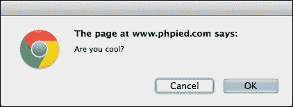
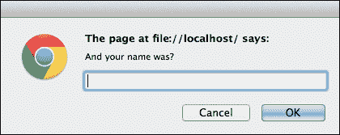
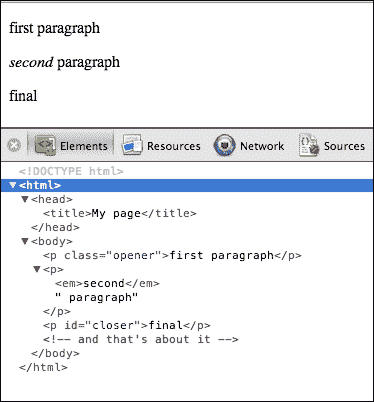
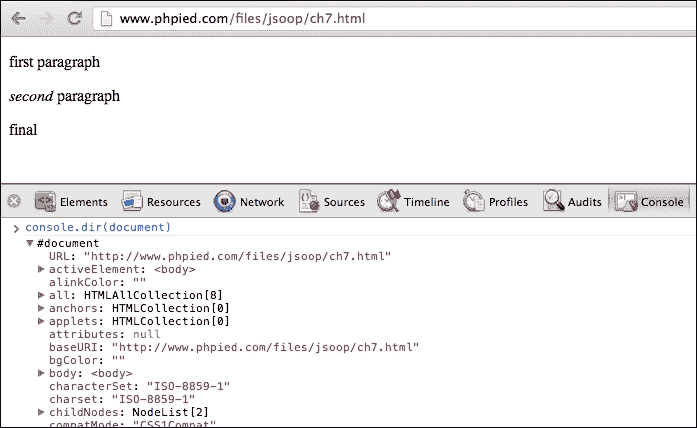
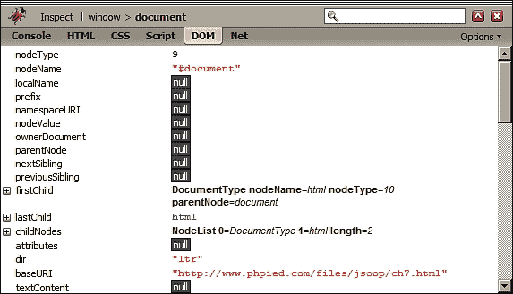
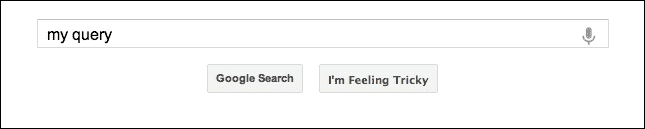
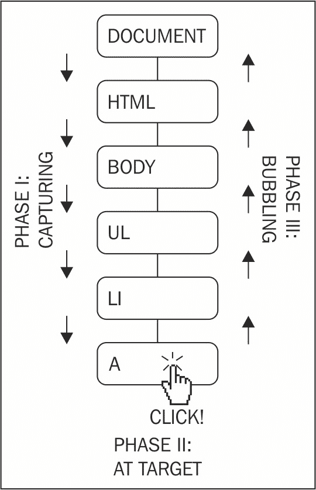

# 第十章：浏览器环境

您知道 JavaScript 程序需要一个宿主环境。到目前为止，您在本书中学到的大部分内容都与核心 ECMAScript/JavaScript 有关，并且可以在许多不同的宿主环境中使用。现在，让我们把重点转移到浏览器上，因为这是 JavaScript 程序最受欢迎和自然的宿主环境。在本章中，您将学习以下主题：

+   **浏览器对象模型**（**BOM**）

+   **文档对象模型**（**DOM**）

+   浏览器事件

+   `XMLHttpRequest`对象

# 在 HTML 页面中包含 JavaScript

要在 HTML 页面中包含 JavaScript，您需要使用以下`<script>`标签：

```js
    <!DOCTYPE> 
    <html> 
      <head> 
        <title>JS test</title> 
        <script src="somefile.js"></script> 
      </head> 
      <body> 
        <script> 
          var a = 1; 
          a++; 
        </script> 
      </body> 
    </html> 

```

在此示例中，第一个`<script>`标签包含一个外部文件`somefile.js`，其中包含 JavaScript 代码。第二个`<script>`标签直接在页面的 HTML 代码中包含 JavaScript 代码。浏览器按照在页面上找到的顺序执行 JavaScript 代码，并且所有标签中的代码共享相同的全局命名空间。这意味着当您在`somefile.js`中定义一个变量时，它也存在于第二个`<script>`块中。

# BOM 和 DOM - 概述

页面中的 JavaScript 代码可以访问多个对象。这些对象可以分为以下类型：

+   **核心 ECMAScript 对象**：这包括前几章中提到的所有对象

+   **DOM**：这包括与当前加载的页面有关的对象，也称为文档

+   **BOM**：这包括处理页面外的一切内容-浏览器窗口和桌面屏幕

DOM 代表文档对象模型，BOM 代表浏览器对象模型。

DOM 是由**万维网联盟**（**W3C**）制定的标准，有不同的版本，称为 DOM Level 1、DOM Level 2 等。今天使用的浏览器对标准的遵从程度不同，但总的来说，它们几乎都完全实现了 DOM Level 1。在浏览器供应商各自实现了访问文档的方式之后，DOM 被标准化后事实上成为了标准。W3C 接管之前的遗留部分仍然存在，并被称为 DOM 0，尽管实际上并不存在真正的 DOM Level 0 标准。DOM 0 的一些部分已成为事实上的标准，因为所有主要浏览器都支持它们；其中一些已添加到 DOM Level 1 标准中。未能在 DOM 1 中找到其位置的 DOM 0 的其余部分太过特定于浏览器，这里不会讨论。

从历史上看，BOM 不是任何标准的一部分。与 DOM 0 类似，它具有所有主要浏览器支持的对象的子集，以及特定于浏览器的另一个子集。HTML5 标准对浏览器之间的共同行为进行了编码，并包括了常见的 BOM 对象。此外，移动设备配备了它们特定的对象（HTML5 也旨在标准化这些对象），这在传统上对于台式电脑来说并不是必需的，但在移动世界中是有意义的，例如地理位置、相机访问、振动、触摸事件、电话和短信。

本章仅讨论 BOM 和 DOM Level 1 的跨浏览器子集，除非在文本中另有说明。即使这些安全子集构成了一个很大的主题，但完整的参考资料超出了本书的范围。您还可以参考以下参考资料：

+   Mozilla DOM 参考（[`developer.mozilla.org/en/docs/Gecko_DOM_Reference`](http://developer.mozilla.org/en/docs/Gecko_DOM_Reference)）

+   Mozilla 的 HTML5 维基（[`developer.mozilla.org/en-US/docs/HTML/HTML5`](https://developer.mozilla.org/en-US/docs/HTML/HTML5)）

+   微软的 Internet Explorer 文档（[`msdn2.microsoft.com/en-us/library/ms533050(vs.85).aspx`](http://msdn2.microsoft.com/en-us/library/ms533050(vs.85).aspx)）

+   W3C 的 DOM 规范（[`www.w3.org/DOM/DOMTR`](http://www.w3.org/DOM/DOMTR)）

# BOM

BOM 是一组对象，它们让你可以访问浏览器和计算机屏幕。这些对象可以通过全局对象`window`访问。

## window 对象重访

正如您已经知道的，在 JavaScript 中，宿主环境提供了一个全局对象。在浏览器环境中，可以使用`window`访问此全局对象。所有全局变量也可以作为`window`对象的属性访问。例如，看一下以下代码：

```js
    > window.somevar = 1; 
           1 
    > somevar; 
           1 

```

此外，所有核心 JavaScript 函数，如第二章中讨论的*基本数据类型、数组、循环和条件*，都是全局对象的方法。考虑以下代码片段：

```js
    > parseInt('123a456'); 
           123 
    > window.parseInt('123a456'); 
           123 

```

除了作为全局对象的引用外，`window`对象还有第二个目的-提供有关浏览器环境的信息。每个框架、iframe、弹出窗口或浏览器选项卡都有一个`window`对象。

让我们看看`window`对象的一些与浏览器相关的属性。同样，这些属性在不同浏览器中可能会有所不同，因此让我们只考虑在所有主要浏览器中一致可靠实现的属性。

## 使用 window.navigator 属性

`navigator`是一个对象，其中包含有关浏览器及其功能的一些信息。一个属性是`navigator.userAgent`，它是浏览器标识的长字符串。在 Firefox 中，您将获得以下输出：

```js
    > window.navigator.userAgent; 
        "Mozilla/5.0 (Macintosh; Intel Mac OS X 10_8_3) 
          AppleWebKit/536.28.10
          (KHTML, like Gecko) Version/6.0.3 Safari/536.28.10" 

```

在 Microsoft Internet Explorer 中，`userAgent`字符串如下所示：

```js
       "Mozilla/5.0 (compatible; MSIE 10.0; Windows NT 6.1; Trident/6.0)" 

```

由于浏览器具有不同的功能，开发人员使用`userAgent`字符串来识别浏览器并提供代码的不同版本。例如，以下代码片段搜索`MSIE`字符串的存在以识别 Internet Explorer：

```js
    if (navigator.userAgent.indexOf('MSIE') !== -1) { 
      // this is IE 
    } else { 
      // not IE 
    } 

```

最好不要依赖`userAgent`字符串，而是使用特性嗅探（也称为能力检测）。原因是很难跟踪所有浏览器及其不同的版本。简单检查您打算在用户的浏览器中使用的功能是否确实可用。例如，看一下以下代码片段：

```js
    if (typeof window.addEventListener === 'function') { 
      // feature is supported, let's use it 
    } else { 
      // hmm, this feature is not supported, will have to 
      // think of another way 
    } 

```

避免使用`userAgent`嗅探的另一个原因是，一些浏览器允许用户修改字符串并假装他们正在使用不同的浏览器。

## 您的控制台是一个速查表

控制台允许您检查对象中的内容，包括所有 BOM 和 DOM 属性。只需键入以下代码：

```js
    > navigator; 

```

然后单击结果。结果是属性及其值的列表，如下截图所示：


## 使用 window.location 属性

`location`属性指向一个包含有关当前加载页面的 URL 信息的对象。例如，`location.href`是完整的 URL，`location.hostname`只是域名。通过简单的循环，您可以查看`location`对象的完整属性列表。

假设您在具有以下 URL 的页面上：

[`search.phpied.com:8080/search?q=java&what=script#results`](http://search.phpied.com:8080/search?q=java&what=script#results)。

考虑以下代码：

```js
    for (var i in location) { 
      if (typeof location[i] === "string") { 
        console.log(i + ' = "' + location[i] + '"'); 
      } 
    } 
           href = "http://search.phpied.com:8080/search?
             q=java&what=script#results" 
           hash = "#results" 
           host = "search.phpied.com:8080" 
           hostname = "search.phpied.com" 
           pathname = "/search" 
           port = <<8080>> 
           protocol = <<http:>> 
           search = "?q=java&what=script" 

```

`location`属性还提供了三种方法，即`reload()`、`assign()`和`replace()`。

有很多不同的方法可以让您导航到另一个页面。以下是一些方法：

```js
    > window.location.href = 'http://www.packtpub.com'; 
    > location.href = 'http://www.packtpub.com'; 
    > location = 'http://www.packtpub.com'; 
    > location.assign('http://www.packtpub.com'); 

```

`replace()`方法与`assign()`几乎相同。不同之处在于它不会在浏览器的历史记录中创建条目，如下所示：

```js
    > location.replace('http://www.yahoo.com'); 

```

要重新加载页面，您可以使用以下代码：

```js
    > location.reload(); 

```

或者，您可以使用`location.href`将其指向自身，如下所示：

```js
    > window.location.href = window.location.href; 

```

或者，只需使用以下代码：

```js
    > location = location; 

```

## 使用 window.history 属性

`window.history` 属性允许有限访问同一浏览器会话中先前访问的页面。例如，您可以查看用户在访问您的页面之前访问了多少页面，如下所示：

```js
    > window.history.length; 
           5 

```

但是你无法看到实际的 URL。出于隐私原因，这是行不通的。看下面的代码：

```js
    > window.history[0]; 

```

然而，您可以像用户点击后退/前进浏览器按钮一样在用户会话中前后导航，如下所示：

```js
    > history.forward(); 
    > history.back(); 

```

您还可以使用 `history.go()` 来前后跳转页面。这与调用 `history.back()` 相同。`history.go()` 的代码如下：

```js
    > history.go(-1); 

```

要后退两页，请使用以下代码：

```js
    > history.go(-2); 

```

使用以下代码重新加载当前页面：

```js
    > history.go(0); 

```

更近期的浏览器还支持 HTML5 历史 API，它允许您在不重新加载页面的情况下更改 URL。这对于动态页面非常理想，因为它们可以允许用户收藏特定的 URL，该 URL 代表应用程序的状态，当他们回来时，或与朋友分享时，页面可以根据 URL 恢复应用程序状态。要了解历史 API 的情况，请转到任何页面并在控制台中编写以下代码行：

```js
    > history.pushState({a: 1}, "", "hello"); 
    > history.pushState({b: 2}, "", "hello-you-too"); 
    > history.state; 

```

注意 URL 的变化，但页面是相同的。现在，在浏览器中尝试使用后退和前进按钮，并再次检查 `history.state` 对象。

## 使用 `window.frames` 属性

`window.frames` 属性是当前页面中所有框架的集合。它不区分框架和 iframe（内联框架）。无论页面上是否有框架，`window.frames` 都始终存在并指向 `window`，如下所示：

```js
    > window.frames === window; 
           true 

```

让我们考虑一个页面有一个 iframe 的例子，如下所示：

```js
    <iframe name="myframe" src="hello.html" /> 

```

为了判断页面上是否有任何框架，您可以检查 `length` 属性。在一个 iframe 的情况下，您将看到以下输出：

```js
    > frames.length 
           1 

```

每个框架包含另一个页面，该页面有自己的全局 `window` 对象。

要访问 iframe 的 `window`，可以执行以下任何一个：

```js
    > window.frames[0]; 
    > window.frames[0].window; 
    > window.frames[0].window.frames; 
    > frames[0].window; 
    > frames[0]; 

```

从父页面，您也可以访问子框架的属性。例如，您可以按如下方式重新加载框架：

```js
    > frames[0].window.location.reload(); 

```

从子页面内部，您可以按如下方式访问父页面：

```js
    > frames[0].parent === window; 
           true 

```

使用名为 `top` 的属性，您可以从任何框架内访问顶部页面-包含所有其他框架的页面，如下所示：

```js
    > window.frames[0].window.top === window; 
           true 
    > window.frames[0].window.top === window.top; 
           true 
    > window.frames[0].window.top === top; 
           true 

```

此外，`self` 与 `window` 是相同的，如下面的代码片段所示：

```js
    > self === window; 
           true 
    > frames[0].self == frames[0].window; 
           true 

```

如果一个框架有一个 `name` 属性，你不仅可以通过名称访问框架，还可以通过索引访问，如下面的代码片段所示：

```js
    > window.frames['myframe'] === window.frames[0]; 
           true 

```

或者，您可以使用以下代码：

```js
    > frames.myframe === window.frames[0]; 
           true 

```

## 使用 `window.screen` 属性

`screen` 属性提供有关浏览器外部环境的信息。例如，`screen.colorDepth` 属性包含显示器的颜色位深度（颜色质量）。这主要用于统计目的。看一下以下代码行：

```js
    > window.screen.colorDepth; 
           32 

```

您还可以检查可用的屏幕房地产（分辨率），如下所示：

```js
    > screen.width; 
           1440 
    > screen.availWidth; 
           1440 
    > screen.height; 
           900 
    > screen.availHeight; 
           847 

```

`height` 和 `availHeight` 之间的区别在于 `height` 是整个屏幕，而 `availHeight` 减去了任何操作系统菜单，例如 Windows 任务栏。`width` 和 `availWidth` 也是如此。

与下面的代码相关的属性有：

```js
    > window.devicePixelRatio; 
           1 

```

它告诉您在移动设备的视网膜显示器中物理像素和设备像素之间的差异（比率），例如，iPhone 中的值为 2。

## `window.open()/close()` 方法

在探索了`window`对象的一些最常见的跨浏览器属性之后，让我们转向一些方法。其中一种方法是`open()`，它允许你打开新的浏览器窗口（弹出窗口）。各种浏览器策略和用户设置可能会阻止你打开弹出窗口（因为滥用该技术进行营销目的），但通常情况下，如果是用户发起的，你应该能够打开一个新窗口。否则，如果你尝试在页面加载时打开弹出窗口，很可能会被阻止，因为用户没有明确发起它。

`window.open()`方法接受以下参数：

+   要在新窗口中加载的 URL

+   新窗口的名称，可以作为表单`target`属性的值

+   以逗号分隔的功能列表，如下所示：

+   `resizable`：用户是否可以调整新窗口的大小

+   `width`、`height`：弹出窗口的宽度和高度

+   `status`：状态栏是否可见

`window.open()`方法返回对新创建的浏览器实例的`window`对象的引用。以下是一个例子：

```js
    var win = window.open('http://www.packtpub.com', 'packt', 
      'width=300,height=300,resizable=yes'); 

```

`win`变量指向弹出窗口的`window`对象。你可以检查`win`是否为假值，这意味着弹出窗口被阻止了。

`win.close()`方法关闭新窗口。

出于可访问性和可用性原因，最好不要打开新窗口。如果你不喜欢网站给你弹出窗口，为什么要对你的用户这样做呢？有合法的目的，比如在填写表单时提供帮助信息，但通常可以用替代方案实现，比如在页面内使用浮动的`<div>`。

## window.moveTo()和 window.resizeTo()方法

继续过去的不良做法，以下是更多方法来激怒你的用户，前提是他们的浏览器和个人设置允许你这样做：

+   `window.moveTo(100, 100)`：这将浏览器窗口移动到屏幕位置`x = 100`和`y = 100`，从左上角计算

+   `window.moveBy(10, -10)`：这将窗口从当前位置向右移动 10 像素，向上移动 10 像素

+   `window.resizeTo(x, y)`和`window.resizeBy(x, y)`：这些方法接受与移动方法相同的参数，但它们调整窗口的大小而不是移动它

再次尝试解决你面临的问题，而不要求助于这些方法。

## window.alert()、window.prompt()和 window.confirm()方法

在第二章中，*基本数据类型、数组、循环和条件*，我们讨论了`alert()`函数。现在你知道全局函数可以作为全局对象的方法访问，所以`alert('小心')`和`window.alert('小心')`是完全相同的。

`alert()`函数不是 ECMAScript 函数，而是 BOM 方法。除此之外，还有两个 BOM 方法允许你通过系统消息与用户交互。以下是这些方法：

+   `confirm()`：这给用户两个选项，**确定**和**取消**

+   `prompt()`：这收集文本输入

它的工作原理如下：

```js
    > var answer = confirm('Are you cool?');  
    > answer; 

```

它会显示一个类似于以下截图的窗口（确切的外观取决于浏览器和操作系统）：



你会注意到以下几点：

+   在关闭此消息之前，不会有任何内容写入控制台，这意味着任何 JavaScript 代码执行都会被冻结，等待用户的答复

+   点击**确定**返回`true`，点击**取消**或使用**X**图标关闭消息，或按下**ESC**键，返回`false`。

这对于确认用户操作非常方便，如下面的代码所示：

```js
    if (confirm('Sure you want to delete this?')) { 
      // delete 
    } else { 
      // abort 
    } 

```

确保为禁用 JavaScript 的用户或搜索引擎蜘蛛提供确认用户操作的替代方法。

`window.prompt()`方法向用户显示一个对话框，让其输入文本，如下所示：

```js
    > var answer = prompt('And your name was?');  
    > answer; 

```

这导致了以下对话框（Chrome，MacOS）：



`answer`的值是以下之一：

+   `null`：如果你点击**Cancel**，**X**图标，或按**ESC**键，就会发生这种情况。

+   `""`（空字符串）：如果你点击**OK**或按下没有输入任何内容的**Enter**

+   文本字符串：如果你输入一些内容然后点击**OK**或按**Enter**

该函数还接受一个字符串作为第二个参数，并将其显示为预填充到输入字段中的默认值。

## 使用 window.setTimeout()和 window.setInterval()方法

`setTimeout()`和`setInterval()`方法允许安排执行一段代码。`setTimeout()`方法尝试在指定的毫秒数后执行给定的代码一次。`setInterval()`方法尝试在指定的毫秒数后重复执行它。

这将在大约 2 秒后（2000 毫秒）显示一个警报。考虑以下代码：

```js
    > function boo() { alert('Boo!'); } 
    > setTimeout(boo, 2000); 
           4 

```

正如你所看到的，该函数返回了一个整数（在这种情况下是`4`），表示超时的 ID。你可以使用这个 ID 来使用`clearTimeout()`取消超时。在以下示例中，如果你足够快，并在 2 秒钟之前清除超时，警报将永远不会显示，就像你在以下代码中看到的那样：

```js
    > var id = setTimeout(boo, 2000); 
    > clearTimeout(id); 

```

让我们将`boo()`改为更不具侵入性的东西，如下所示：

```js
    > function boo() { console.log('boo'); } 

```

现在，使用`setInterval()`，你可以安排`boo()`每 2 秒执行一次，直到你用`clearInterval()`取消安排的执行。考虑以下代码：

```js
    > var id = setInterval(boo, 2000); 
           boo 
           boo 
           boo 
           boo 
           boo 
           boo 
    > clearInterval(id); 

```

请注意，这两个函数都接受一个回调函数的指针作为第一个参数。它们也可以接受一个字符串，该字符串将使用`eval()`进行评估；然而，正如你所知，`eval()`是邪恶的，所以应该避免使用。此外，如果你想向函数传递参数怎么办？在这种情况下，你可以将函数调用包装在另一个函数中。

以下代码是有效的，但不建议使用：

```js
    // bad idea 
    var id = setInterval("alert('boo, boo')", 2000); 

```

这个替代方案更受欢迎：

```js
    var id = setInterval( 
      function () { 
        alert('boo, boo'); 
      }, 
      2000 
    ); 

```

请注意，安排一个函数在一定的毫秒数后执行并不保证它会准确地在那个时间执行。一个原因是大多数浏览器没有毫秒分辨率的时间。如果你安排在 3 毫秒后执行某事，在较旧的 IE 中至少要等待 15 毫秒，而在更现代的浏览器中会更快，但很可能不会在 1 毫秒内执行。另一个原因是浏览器维护一个你要求它们执行的队列。100 毫秒的超时意味着在 100 毫秒后添加到队列中。然而，如果队列被某些慢的事情延迟了，你的函数将不得不等待并在之后执行，比如说在 120 毫秒后。

更近期的浏览器实现了`requestAnimationFrame()`函数。它比超时函数更可取，因为你要求浏览器在有可用资源时调用你的函数，而不是在预定义的毫秒时间之后。尝试在控制台中执行以下代码片段：

```js
    function animateMe() { 
      webkitRequestAnimationFrame(function(){ 
        console.log(new Date()); 
        animateMe(); 
      }); 
    } 

    animateMe(); 

```

## window.document 属性

`window.document`属性是一个 BOM 对象，指的是当前加载的文档（页面）。它的方法和属性属于 DOM 对象的范畴。深呼吸一下（也许先看一下本章末尾的 BOM 练习），然后让我们深入了解 DOM。

# DOM

DOM 将 XML 或 HTML 文档表示为节点树。使用 DOM 方法和属性，你可以访问页面上的任何元素，修改或删除元素，或添加新元素。DOM 是一种与语言无关的 API，不仅可以在 JavaScript 中实现，还可以在任何其他语言中实现。例如，你可以使用 PHP 的 DOM 实现（[`php.net/dom`](http://php.net/dom)）在服务器端生成页面。

看一下这个示例 HTML 页面：

```js
    <!DOCTYPE html> 
    <html> 
      <head> 
        <title>My page</title> 
      </head> 
      <body> 
        <p class="opener">first paragraph</p> 
        <p><em>second</em> paragraph</p> 
        <p id="closer">final</p> 
        <!-- and that's about it --> 
      </body> 
    </html> 

```

考虑第二段（<p><em>第二</em>段</p>）。您会看到它是一个<p>标签，并且包含在<body>标签中。如果您从家庭关系的角度思考，您可以说<body>是<p>的父级，<p>是子级。第一和第三段也将是<body>标签的子级，并且与第二段同时是兄弟姐妹。<em>标签是第二个<p>的子级，因此<p>是其父级。父子关系可以在一个称为 DOM 树的祖先树中以图形方式表示：



前面的屏幕截图显示了在 WebKit 控制台的**元素**选项卡中展开每个节点后会看到的内容。

您可以看到所有标签都显示为树上可展开的节点。尽管没有显示，但存在所谓的文本节点，例如`<em>`标签内的文本（单词 second）是一个文本节点。空格也被视为文本节点。HTML 代码中的注释也是树中的节点，HTML 源代码中的`<!- and that's about it ->`注释是树中的注释节点。

DOM 树中的每个节点都是一个对象，右侧的**属性**部分列出了您可以使用的所有属性和方法，遵循了创建此对象的继承链：


您还可以看到在幕后使用的构造函数来创建这些对象。尽管这对日常任务来说并不太实用，但知道例如`<p>`是由`HTMLParagraphElement()`构造函数创建的，表示`head`标签的对象是由`HTMLHeadElement()`创建的等等可能会很有趣。但是，您不能直接使用这些构造函数创建对象。

## 核心 DOM 和 HTML DOM

在继续更实际的示例之前，最后再偏离一下。正如您现在所知，DOM 代表 XML 文档和 HTML 文档。实际上，HTML 文档是 XML 文档，但更具体。因此，作为 DOM Level 1 的一部分，有一个适用于所有 XML 文档的核心 DOM 规范，还有一个 HTML DOM 规范，它扩展并构建在核心 DOM 之上。当然，HTML DOM 并不适用于所有 XML 文档，而只适用于 HTML 文档。让我们看一些核心 DOM 和 HTML DOM 构造函数的示例：

| **构造函数** | **继承自** | **核心或 HTML** | **注释** |
| --- | --- | --- | --- |
| `Node` |  | 核心 | 树上的任何节点 |
| `Document` | `Node` | 核心 | 文档对象，任何 XML 文档的主要入口点 |
| `HTMLDocument` | `Document` | HTML | 这是 window.document 或简单地 document，前一个对象的 HTML 特定版本，您将广泛使用它 |
| `Element` | `Node` | 核心 | 源代码中的每个标签都由一个元素表示。这就是为什么您说-`P`元素表示`<p></p>`标签 |
| `HTMLElement` | `Element` | HTML | 通用构造函数，所有 HTML 元素的构造函数都继承自它 |
| `HTMLBodyElement` | `HTMLElement` | HTML | 表示`<body>`标签的元素 |
| `HTMLLinkElement` | `HTMLElement` | HTML | A 元素：`<a href="..."></a>`标签 |
| 和其他构造函数 | `HTMLElement` | HTML | 所有其他 HTML 元素 |
| `CharacterData` | `Node` | 核心 | 用于处理文本的通用构造函数 |
| `Text` | `CharacterData` | 核心 | 标签内的文本节点；在`<em>`second`</em>`中，您有元素节点`EM`和值为 second 的文本节点 |
| `Comment` | `CharacterData` | 核心 | `<!-- 任何注释 -->` |
| `Attr` | `Node` | 核心 | 表示标签的属性；在`<p id="closer">`中，`id`属性是由`Attr()`构造函数创建的 DOM 对象 |
| `NodeList` |  | 核心 | 节点列表，具有`length`属性的类似数组的对象 |
| `NamedNodeMap` |  | 核心 | 与 `NodeList` 相同，但节点可以通过名称访问，而不仅仅是通过数字索引。 |
| `HTMLCollection` |  | HTML | 类似于 `NamedNodeMap`，但专门用于 HTML。 |

这些绝不是所有核心 DOM 和 HTML DOM 对象。 要获取完整列表，请参阅 [`www.w3.org/TR/DOM-Level-1/`](http://www.w3.org/TR/DOM-Level-1/)。

既然 DOM 理论的这一部分已经过去了，让我们专注于处理 DOM 的实际方面。 在接下来的几节中，您将学习以下主题：

+   访问 DOM 节点

+   修改节点

+   创建新节点

+   删除节点

## 访问 DOM 节点

在您可以验证页面上表单中的用户输入或交换图像之前，您需要访问要检查或修改的元素。 幸运的是，有许多方法可以访问任何元素，无论是通过导航遍历 DOM 树还是使用快捷方式。

最好是您开始尝试所有新对象和方法。 您将看到的示例使用了与 DOM 部分开头看到的相同简单文档，您可以在 [`www.phpied.com/files/jsoop/ch7.html`](http://www.phpied.com/files/jsoop/ch7.html) 上访问。 打开控制台，让我们开始吧。

### 文档节点

`document` 节点使您可以访问当前文档。 要探索此对象，您可以使用控制台作为备忘单。 输入 `console.dir`(document) 并单击结果：



或者，您可以在**元素**面板中浏览 `document` 对象 DOM 属性的所有属性和方法：


所有节点，包括文档节点、文本节点、元素节点和属性节点都有 `nodeType`、`nodeName` 和 `nodeValue` 属性：

```js
    > document.nodeType; 
           9 

```

有 12 种节点类型，用整数表示。 如您所见，文档节点类型是 `9`。 最常用的是 `1`（元素）、`2`（属性）和 `3`（文本）。

节点也有名称。 对于 HTML 标签，节点名称是标签名称（`tagName` 属性）。 对于文本节点，它是 `#text`，对于文档节点，名称如下：

```js
    > document.nodeName; 
           "#document" 

```

节点也可以有节点值。 例如，对于文本节点，值是实际文本。 文档节点没有值，可以如下所示：

```js
    > document.nodeValue; 
           null 

```

### documentElement

现在，让我们在树中移动。 XML 文档始终有一个根节点，用于包装文档的其余部分。 对于 HTML 文档，根是 `<html>` 标签。 要访问根，您将使用 `document` 对象的 `documentElement` 属性。

```js
    > document.documentElement; 
           <html>...</html> 

```

`nodeType` 是 `1`（元素节点），可以如下所示：

```js
    > document.documentElement.nodeType; 
           1 

```

对于元素节点，`nodeName` 和 `tagName` 属性都包含标签的名称，如下所示：

```js
    > document.documentElement.nodeName; 
           "HTML" 
    > document.documentElement.tagName; 
           "HTML" 

```

### 子节点

要确定节点是否有任何子节点，您将使用 `hasChildNodes()`，如下所示：

```js
    > document.documentElement.hasChildNodes(); 
           true 

```

HTML 元素有三个子节点，`head` 和 `body` 元素以及它们之间的空格（在大多数浏览器中计算空格）。 您可以使用 `childNodes` 类似数组的集合来访问它们，如下所示：

```js
    > document.documentElement.childNodes.length; 
           3 
    > document.documentElement.childNodes[0]; 
           <head>...</head> 
    > document.documentElement.childNodes[1]; 
           #text 
    > document.documentElement.childNodes[2]; 
           <body>...</body> 

```

任何子节点都可以通过 `parentNode` 属性访问其父节点，如下所示：

```js
    > document.documentElement.childNodes[1].parentNode; 
           <html>...</html> 

```

让我们将 body 的引用分配给一个变量，如下所示：

```js
    > var bd = document.documentElement.childNodes[2]; 

```

`body` 元素有多少子节点？ 考虑以下代码片段

```js
    > bd.childNodes.length; 
           9 

```

作为复习，这里是文档的主体：

```js
      <body> 
        <p class="opener">first paragraph</p> 
        <p><em>second</em> paragraph</p> 
        <p id="closer">final</p> 
        <!-- and that's about it --> 
      </body> 

```

为什么 `body` 有 `9` 个子节点？ 好吧，三个段落加上一个注释共四个节点。 这四个节点之间的空格产生了另外三个文本节点。 到目前为止总共有七个。 `<body>` 和第一个 `<p>` 之间的空格是第八个节点。 注释和闭合 `</body>` 之间的空格是另一个文本节点。 这样总共有九个子节点。 只需在控制台中键入 `bd.childNodes` 来检查它们。

### 属性

由于 body 的第一个子节点是空格，因此第二个子节点（索引 1）是第一个段落。请参考以下代码片段：

```js
    > bd.childNodes[1]; 
           <p class="opener">first paragraph</p> 

```

您可以使用`hasAttributes()`来检查元素是否具有属性，如下所示：

```js
    > bd.childNodes[1].hasAttributes(); 
            true 

```

有多少属性？在这个例子中，一个是`class`属性，可以如下所示：

```js
    > bd.childNodes[1].attributes.length; 
            1 

```

您可以按索引和名称访问属性。您还可以使用`getAttribute()`方法获取值，如下所示：

```js
    > bd.childNodes[1].attributes[0].nodeName; 
           "class" 
    > bd.childNodes[1].attributes[0].nodeValue; 
           "opener" 
    > bd.childNodes[1].attributes['class'].nodeValue; 
           "opener" 
    > bd.childNodes[1].getAttribute('class'); 
           "opener" 

```

### 访问标签内的内容

让我们来看看第一段：

```js
    > bd.childNodes[1].nodeName; 
           "P" 

```

您可以使用`textContent`属性获取段落中包含的文本。它在旧版 IE 中不存在，但另一个名为`innerText`的属性返回相同的值，如下输出所示：

```js
    > bd.childNodes[1].textContent; 
           "first paragraph" 

```

还有`innerHTML`属性。尽管它以前存在于所有主要浏览器中，但它是 DOM 标准的一个相对较新的添加。它返回（或设置）节点中包含的 HTML 代码。您可以看到这有点不一致，因为 DOM 将文档视为节点树，而不是标签字符串。然而，`innerHTML`非常方便使用，您会在各处看到它。请参考以下代码：

```js
    > bd.childNodes[1].innerHTML; 
           "first paragraph" 

```

第一段只包含文本，所以`innerHTML`与`textContent`（或 IE 中的`innerText`）相同。然而，第二段包含一个`em`节点，因此您可以如下所示看到差异：

```js
    > bd.childNodes[3].innerHTML; 
           "<em>second</em> paragraph" 
    > bd.childNodes[3].textContent; 
           "second paragraph" 

```

另一种获取第一段中包含的文本的方法是使用`p`节点内包含的文本节点的`nodeValue`方法，如下所示：

```js
    > bd.childNodes[1].childNodes.length; 
            1 
    > bd.childNodes[1].childNodes[0].nodeName; 
           "#text" 
    > bd.childNodes[1].childNodes[0].nodeValue; 
           "first paragraph" 

```

### DOM 访问快捷方式

使用`childNodes`、`parentNode`、`nodeName`、`nodeValue`和`attributes`，您可以在树中上下导航并对文档进行任何操作。然而，空格是文本节点的事实使得这种处理 DOM 的方式很脆弱。如果页面发生变化，您的脚本可能不再正确工作。此外，如果要深入树中的节点，可能需要一些代码才能到达那里。这就是为什么有快捷方式方法，即`getElementsByTagName()`、`getElementsByName()`和`getElementById()`。

`getElementsByTagName()`方法接受一个标签名称（元素节点的名称）并返回一个匹配标签名称的节点的 HTML 集合（类似数组的对象）。例如，以下示例要求给出所有段落的计数，如下所示：

```js
    > document.getElementsByTagName('p').length; 
            3 

```

您可以使用括号表示法或`item()`方法访问列表中的项目，并传递索引（第一个元素为 0）。使用`item()`是不鼓励的，因为数组括号更一致，而且输入更短。请参考以下代码片段：

```js
    > document.getElementsByTagName('p')[0]; 
            <p class="opener">first paragraph</p> 
    > document.getElementsByTagName('p').item(0); 
            <p class="opener">first paragraph</p> 

```

获取第一个`p`的内容可以如下所示：

```js
    > document.getElementsByTagName('p')[0].innerHTML; 
           "first paragraph" 

```

访问最后一个`p`可以如下所示：

```js
    > document.getElementsByTagName('p')[2]; 
            <p id="closer">final</p> 

```

要访问元素的属性，您可以使用`attributes`集合或`getAttribute()`，如前所示。但是，更简洁的方法是将属性名称作为要处理的元素的属性。因此，要获取`id`属性的值，您只需将`id`作为属性使用，如下所示：

```js
    > document.getElementsByTagName('p')[2].id; 
           "closer" 

```

但是，无法获取第一段的`class`属性。这是一个例外，因为在 ECMAScript 中 class 是一个保留字。您可以使用`className`代替，如下所示：

```js
    > document.getElementsByTagName('p')[0].className; 
           "opener" 

```

使用`getElementsByTagName()`，您可以获取页面上的所有元素，如下所示：

```js
    > document.getElementsByTagName('*').length; 
            8 

```

在 IE7 之前的早期版本中，`*`作为标签名称是不可接受的。要获取所有元素，可以使用 IE 的专有`document.all`集合，尽管很少需要选择每个元素。

另一个提到的快捷方式是`getElementById()`。这可能是访问元素的最常见方法。您只需为要处理的元素分配 ID，以后访问它们会很容易，如下代码所示：

```js
    > document.getElementById('closer'); 
    <p id="closer">final</p> 

```

更近期浏览器中的其他快捷方式方法包括以下内容：

+   `getElementByClassName()`:此方法使用其 class 属性查找元素

+   `querySelector()`:该方法使用 CSS 选择器字符串查找元素

+   `querySelectorAll()`:该方法与前一个方法相同，但返回所有匹配的元素，而不仅仅是第一个

### 兄弟节点、body、第一个和最后一个子节点

一旦您有了对一个元素的引用，`nextSibling`和`previousSibling`是另外两个方便的属性，用于导航 DOM 树。考虑以下代码：

```js
    > var para = document.getElementById('closer'); 
    > para.nextSibling; 
           #text 
    > para.previousSibling; 
           #text 
    > para.previousSibling.previousSibling; 
           <p>...</p> 
    > para.previousSibling.previousSibling.previousSibling; 
           #text 
    > para.previousSibling.previousSibling.nextSibling.nextSibling; 
           <p id="closer">final</p> 

```

`body`元素经常使用，因此它有自己的快捷方式，如下所示：

```js
    > document.body; 
            <body>...</body> 
    > document.body.nextSibling; 
            null 
    > document.body.previousSibling.previousSibling; 
            <head>...</head> 

```

`firstChild`和`lastChild`属性也很方便。`firstChild`属性与`childNodes[0]`相同，`lastChild`与`childNodes[childNodes.length - 1]`属性相同：

```js
    > document.body.firstChild; 
           #text 
    > document.body.lastChild; 
           #text 
    > document.body.lastChild.previousSibling; 
            <!-- and that's about it --> 
    > document.body.lastChild.previousSibling.nodeValue; 
           " and that's about it " 

```

以下屏幕截图显示了 body 和其中三个段落之间的家族关系。为简单起见，屏幕截图中删除了所有空白文本节点：



### 遍历 DOM

总之，以下是一个函数，它接受任何节点并从给定节点开始递归地遍历 DOM 树，如下所示：

```js
   function walkDOM(n) { 
      do { 
        console.log(n); 
        if (n.hasChildNodes()) { 
          walkDOM(n.firstChild); 
        } 
      } while (n = n.nextSibling); 
    } 

```

您可以按照以下方式测试该函数：

```js
    > walkDOM(document.documentElement); 
    > walkDOM(document.body); 

```

## 修改 DOM 节点

现在您已经了解了访问 DOM 树及其属性的许多方法，让我们看看如何修改这些节点：

让我们将指针分配给最后一个段落，变量名为`my`，如下所示：

```js
    > var my = document.getElementById('closer'); 

```

现在，更改段落的文本可以像更改`innerHTML`值一样简单，如下所示：

```js
    > my.innerHTML = 'final!!!'; 
           "final!!!" 

```

由于`innerHTML`接受 HTML 源代码的字符串，因此您也可以按照以下方式在 DOM 树中创建新的`em`节点：

```js
    > my.innerHTML = '<em>my</em> final'; 
           "<em>my</em> final" 

```

新的`em`节点成为树的一部分。让我们看一下以下代码：

```js
    > my.firstChild; 
           <em>my</em> 
    > my.firstChild.firstChild; 
           "my" 

```

改变文本的另一种方法是获取实际的文本节点并更改其`nodeValue`，如下所示：

```js
    > my.firstChild.firstChild.nodeValue = 'your'; 
           "your" 

```

### 修改样式

通常您不会更改节点的内容，而是更改其呈现方式。元素具有`style`属性，该属性又具有映射到每个 CSS 属性的属性。例如，更改段落的样式以添加红色边框，如下所示：

```js
    > my.style.border = "1px solid red"; 
           "1px solid red" 

```

CSS 属性通常带有破折号，但是在 JavaScript 标识符中破折号是不可接受的。在这种情况下，您跳过破折号并将下一个字母大写。因此，`padding-top`变成了`paddingTop`，`margin-left`变成了`marginLeft`，等等。看一下以下代码：

```js
    > my.style.fontWeight = 'bold'; 
           "bold" 

```

您还可以访问`style`的`cssText`属性，它允许您将样式作为字符串进行处理，如下所示：

```js
    > my.style.cssText; 
           "border: 1px solid red; font-weight: bold;" 

```

此外，修改样式是一种字符串操作：

```js
    > my.style.cssText += " border-style: dashed;" 
    "border: 1px dashed red; font-weight: bold; border-style: dashed;" 

```

### 表单乐趣

如前所述，JavaScript 非常适合客户端输入验证，并且可以节省几次往返服务器。让我们练习表单操作，并在一个流行页面上玩一下，[www.google.com](http://www.google.com)上的表单：


使用`querySelector()`方法和 CSS 选择器字符串查找第一个文本输入的方法如下：

```js
    > var input = document.querySelector('input[type=text]'); 

```

访问搜索框。考虑以下代码：

```js
    > input.name; 
           "q" 

```

通过设置`value`属性中包含的文本来更改搜索查询的结果如下所示：

```js
    > input.value = 'my query'; 
 **"my query"**

```

现在，让我们玩得开心，将按钮中的**Lucky**更改为**Tricky**：

```js
    > var feeling = document.querySelectorAll("button")[2]; 
    > feeling.textContent = feelingtextContent.replace(/Lu/, 'Tri'); 
 **"I'm Feeling Tricky"**

```



现在，让我们实现一些技巧，并使该按钮在一秒钟内显示和隐藏。您可以使用一个简单的函数来实现这一点。让我们称之为`toggle()`。每次调用该函数时，它都会检查 CSS 属性`visibility`的值，并使用以下代码片段将其设置为可见（如果它是隐藏的）或相反：

```js
    function toggle() { 
      var st = document.querySelectorAll('button')[2].style; 
      st.visibility = (st.visibility === 'hidden') 
        ? 'visible' 
        : 'hidden'; 
    } 

```

不要手动调用该函数，让我们设置一个间隔，每秒调用一次：

```js
    > var myint = setInterval(toggle, 1000); 

```

结果？按钮开始闪烁，使得点击变得更加困难。当您厌倦追逐它时，只需编写以下代码来删除超时间隔：

```js
    > clearInterval(myint); 

```

## 创建新节点

要创建新节点，可以使用`createElement()`和`createTextNode()`方法。一旦有了新节点，可以使用`appendChild()`、`insertBefore()`或`replaceChild()`将它们添加到 DOM 树中。

重新加载[`www.phpied.com/files/jsoop/ch7.html`](http://www.phpied.com/files/jsoop/ch7.html)，让我们来玩一下。

创建一个新的`p`元素并设置其`innerHTML`，如下所示：

```js
    > var myp = document.createElement('p'); 
    > myp.innerHTML = 'yet another'; 
           "yet another" 

```

新元素自动获得所有默认属性，比如`style`，你可以按照以下方式修改它：

```js
    > myp.style; 
           CSSStyleDeclaration 
    > myp.style.border = '2px dotted blue'; 
           "2px dotted blue" 

```

使用`appendChild()`，你可以将新节点添加到 DOM 树中。在`document.body`节点上调用此方法意味着在最后一个子节点之后创建一个更多的子节点，如下所示：

```js
    > document.body.appendChild(myp); 
           <p style="border: 2px dotted blue;">yet another</p> 

```

以下是在新节点附加后页面的示例：


### 仅使用 DOM 方法

`innerHTML`属性比纯 DOM 更快地完成了一些工作。在纯 DOM 中，你需要执行以下步骤：

1.  创建一个包含另一个文本的新文本节点。

1.  创建一个新的段落节点。

1.  将文本节点作为段落的子节点添加。

1.  将段落作为子节点添加到 body。

这样，你可以创建任意数量的文本节点和元素，并将它们嵌套，就像你喜欢的那样。假设你想要将以下 HTML 添加到 body 的末尾：

```js
    <p>one more paragraph<strong>bold</strong></p> 

```

将前面的代码呈现为层次结构，会像以下代码片段一样：

```js
    P element 
        text node with value "one more paragraph" 
        STRONG element 
            text node with value "bold" 

```

实现这一点的代码如下：

```js
    // create P 
    var myp = document.createElement('p'); 
    // create text node and append to P 
    var myt = document.createTextNode('one more paragraph'); 
    myp.appendChild(myt); 
    // create STRONG and append another text node to it 
    var str = document.createElement('strong'); 
    str.appendChild(document.createTextNode('bold')); 
    // append STRONG to P 
    myp.appendChild(str); 
    // append P to BODY 
    document.body.appendChild(myp); 

```

### 使用 cloneNode()方法

另一种创建节点的方法是通过复制或克隆现有节点。`cloneNode()`方法可以做到这一点，并接受一个布尔参数（`true` = 深拷贝，包括所有子节点，`false` = 浅拷贝，只有这个节点）。让我们测试一下这个方法。

获取要克隆的元素的引用可以通过以下方式完成：

```js
    > var el = document.getElementsByTagName('p')[1]; 

```

现在，`el`指的是页面上第二个段落，如下所示的代码：

```js
    <p><em>second</em> paragraph</p> 

```

让我们创建`el`的浅克隆，并将其附加到`body`中，如下所示：

```js
    > document.body.appendChild(el.cloneNode(false)); 

```

你在页面上看不到任何区别，因为浅拷贝只复制了`P`节点而没有任何子节点。这意味着段落内的文本节点子节点没有被克隆。前面的行等同于以下代码行：

```js
    > document.body.appendChild(document.createElement('p')); 

```

然而，如果你创建一个深拷贝，从`P`开始的整个 DOM 子树都会被复制，包括文本节点和`EM`元素。这一行将第二段复制（在视觉上也是）到文档的末尾。考虑以下代码行：

```js
    > document.body.appendChild(el.cloneNode(true)); 

```

如果需要，你也可以只复制`EM`，就像以下代码行所示：

```js
    > document.body.appendChild(el.firstChild.cloneNode(true)); 
           <em>second</em> 

```

或者，你可以只复制值为`second`的文本节点，如下所示：

```js
    > document.body.appendChild( 
        el.firstChild.firstChild.cloneNode(false)); 
           "second" 

```

### 使用 insertBefore()方法

使用`appendChild()`，你只能在所选元素的末尾添加新的子节点。要更精确地控制位置，可以使用`insertBefore()`。这与`appendChild()`相同，但接受一个额外的参数，指定在哪里（在哪个元素之前）插入新节点。例如，以下代码在`body`元素的末尾插入一个文本节点：

```js
    > document.body.appendChild(document.createTextNode('boo!')); 

```

此外，这将创建另一个文本节点，并将其添加为`body`元素的第一个子节点：

```js
    document.body.insertBefore( 
      document.createTextNode('first boo!'), 
      document.body.firstChild 
    ); 

```

## 移除节点

要从 DOM 树中移除节点，可以使用`removeChild()`方法。同样，让我们从具有相同 body 的同一页开始：

```js
      <body> 
        <p class="opener">first paragraph</p> 
        <p><em>second</em> paragraph</p> 
        <p id="closer">final</p> 
        <!-- and that's about it --> 
      </body> 

```

以下是如何移除第二段的方法：

```js
    > var myp = document.getElementsByTagName('p')[1]; 
    > var removed = document.body.removeChild(myp); 

```

如果你想以后使用，该方法会返回已移除的节点。即使元素不再在树中，你仍然可以使用所有 DOM 方法。让我们看一下以下代码：

```js
    > removed; 
           <p>...</p> 
    > removed.firstChild; 
           <em>second</em> 

```

还有一个`replaceChild()`方法，它删除一个节点并将另一个节点放在它的位置。

移除节点后，树的结构如下：

```js
      <body> 
        <p class="opener">first paragraph</p> 
        <p id="closer">final</p> 
        <!-- and that's about it --> 
      </body> 

```

现在，第二段是 ID 为`"closer"`的段落，如下所示：

```js
    > var p = document.getElementsByTagName('p')[1]; 
    > p; 
           <p id="closer">final</p> 

```

让我们用`removed`变量中的段落替换这个段落。考虑以下代码：

```js
    > var replaced = document.body.replaceChild(removed, p); 

```

就像`removeChild()`一样，`replaceChild()`返回一个对现在已经不在树中的节点的引用：

```js
    > replaced; 
           <p id="closer">final</p> 

```

现在，body 看起来像下面的代码：

```js
      <body> 
        <p class="opener">first paragraph</p> 
        <p><em>second</em> paragraph</p> 
        <!-- and that's about it --> 
      </body> 

```

清除子树的所有内容的快速方法是将`innerHTML`设置为空字符串。这将删除`body`元素的所有子元素：

```js
    > document.body.innerHTML = ''; 
           "" 

```

测试如下进行：

```js
    > document.body.firstChild; 
           null 

```

使用`innerHTML`进行删除快速而简单。仅使用 DOM 的方法将是遍历所有子节点并逐个删除每个节点。以下是一个从给定起始节点删除所有节点的小函数：

```js
    function removeAll(n) { 
      while (n.firstChild) { 
        n.removeChild(n.firstChild); 
      } 
    } 

```

如果要删除`body`元素的所有子元素，并使页面保留一个空的`<body></body>`，请使用以下代码：

```js
    > removeAll(document.body); 

```

## 仅适用于 HTML 的 DOM 对象

如您所知，DOM 适用于 XML 和 HTML 文档。您之前学到的关于遍历树，然后添加、删除或修改节点的内容，适用于任何 XML 文档。然而，有一些仅适用于 HTML 的对象和属性。

`document.body`是这样一个仅适用于 HTML 的对象。在 HTML 文档中有一个`<body>`标签是如此常见，而且经常被访问，因此有一个比等效的`document.getElementsByTagName('body')[0]`更短更友好的对象是有意义的。

`document.body`元素是从史前 DOM Level 0 继承并移至 DOM 规范的 HTML 扩展的`legacy`对象的一个示例。还有其他类似`document.body`元素的对象。对于其中一些对象，没有核心 DOM 等效物，对于其他对象，有一个等效物；然而，DOM 0 原始版本无论如何都被简化和保留了遗留目的。让我们看看其中一些对象。

### 访问文档的原始方法

对 HTML 文档的元素进行访问。这主要是通过一些集合来完成的，这些集合如下：与 DOM 不同，DOM 可以访问任何元素，甚至是注释和空格，最初，JavaScript 只能有限地访问 HTML 文档的元素。这主要是通过一些集合来完成的，这些集合如下：

+   `document.images`：这是页面上所有图像的集合。核心 DOM 等效物是`document.getElementsByTagName('img')`。

+   `document.applets`：这与`document.getElementsByTagName('applet')`相同。

+   `document.links`：`document.links`集合包含页面上所有`<a href="..."></a>`标签的列表，即具有`href`属性的`<a>`标签。

+   `document.anchors`：`document.anchors`集合包含所有具有`name`属性的链接（`<a name="..."></a>`）。

+   `document.forms`：最常用的集合之一是`document.forms`，其中包含`<form>`元素的列表。

让我们玩一个包含表单和输入的页面（[`www.phpied.com/files/jsoop/ch7-form.html`](http://www.phpied.com/files/jsoop/ch7-form.html)）。以下代码行让您访问页面上的第一个表单：

```js
    > document.forms[0]; 

```

它与以下代码行相同：

```js
    > document.getElementsByTagName('forms')[0]; 

```

`document.forms`集合包含通过`elements`属性访问的输入字段和按钮的集合。以下是如何访问页面上第一个表单的第一个输入：

```js
    > document.forms[0].elements[0]; 

```

一旦您访问了一个元素，就可以将其属性作为对象属性进行访问。测试页面中第一个表单的第一个字段如下：

```js
    <input name="search" id="search" type="text" size="50" 
        maxlength="255" value="Enter email..." /> 

```

您可以使用以下代码更改字段中的文本（`value`属性的值）：

```js
    > document.forms[0].elements[0].value = 'me@example.org'; 
        "me@example.org" 

```

如果要动态禁用字段，请使用以下代码：

```js
    > document.forms[0].elements[0].disabled = true; 

```

当表单或`form`元素具有`name`属性时，您也可以按名称访问它们，如下所示：

```js
    > document.forms[0].elements['search']; // array notation 
    > document.forms[0].elements.search;    // object property 

```

### 使用`document.write()`方法

`document.write()`方法允许您在页面加载时将 HTML 插入页面。您可以有以下代码：

```js
    <p>It is now  
      <script> 
        document.write("<em>" + new Date() + "</em>"); 
      </script> 
    </p> 

```

这与您直接在 HTML 文档的源代码中使用日期是一样的，如下所示：

```js
    <p>It is now
      <em>Fri Apr 26 2013 16:55:16 GMT-0700 (PDT)</em> 
    </p> 

```

请注意，只能在页面加载时使用`document.write()`方法。如果尝试在页面加载后使用它，它将替换整个页面的内容。

很少情况下你会需要`document.write()`方法，如果你认为需要，尝试另一种方法。首选使用 DOM Level 1 提供的修改页面内容的方式，更加灵活。

### Cookies、标题、引荐者和域

你将在本节中看到的`document`的四个附加属性也是从 DOM Level 0 移植到 DOM Level 1 的 HTML 扩展中。与之前的不同，对于这些属性，没有核心 DOM 等价物。

`document.cookie`是一个包含字符串的属性。这个字符串是服务器和客户端之间交换的 cookie 的内容。当服务器向浏览器发送页面时，它可能包含`Set-Cookie` HTTP 头。当客户端向服务器发送请求时，它会在`Cookie`头中将 cookie 信息发送回去。使用`document.cookie`，你可以改变浏览器发送到服务器的 cookie。例如，访问`cnn.com`并在控制台中输入`document.cookie`会得到以下输出：

```js
    > document.cookie;
      "mbox=check#true#1356053765|session#1356053704195-121286#1356055565;... 

```

`document.title`属性允许你更改浏览器窗口中显示的页面标题。例如，看下面的代码：

```js
    > document.title = 'My title'; 
       "My title" 

```

请注意，这不会改变`<title>`元素的值，而只是在浏览器窗口中显示，因此它不等同于`document.querySelector('title')`。

`document.referrer`属性告诉你先前访问的页面的 URL。这是浏览器在请求页面时发送的`Referer` HTTP 头的相同值。（注意，在 HTTP 头中`Referer`拼写错误，但在 JavaScript 的`document.referrer`中是正确的）。如果你先在 Yahoo 上搜索后访问 CNN 页面，你可以看到类似以下的内容：

```js
    > document.referrer; 
       "http://search.yahoo.com/search?p=cnn&ei=UTF-8&fr=moz2" 

```

`document.domain`属性允许你访问当前加载页面的域名。当你需要执行所谓的域放宽时，这通常会被使用。想象一下你的页面是`www.yahoo.com`，在其中，你有一个托管在`music.yahoo.com`子域上的 iframe。这是两个独立的域，所以浏览器的安全限制不允许页面和 iframe 进行通信。为了解决这个问题，你可以在两个页面上都设置`document.domain`属性为`yahoo.com`，它们就可以互相通信了。

请注意，你只能将域设置为更少特定的域，例如，你可以将`www.yahoo.com`更改为`yahoo.com`，但你不能将`yahoo.com`更改为`www.yahoo.com`，或者任何其他非雅虎域。考虑以下代码：

```js
    > document.domain; 
       "www.yahoo.com" 
    > document.domain = 'yahoo.com'; 
       "yahoo.com" 
    > document.domain = 'www.yahoo.com'; 
       Error: SecurityError: DOM Exception 18 
    > document.domain = 'www.example.org'; 
       Error: SecurityError: DOM Exception 18 

```

在本章中，你看到了`window.location`对象。同样的功能也可以通过`document.location`对象实现：

```js
    > window.location === document.location; 
       true 

```

# 事件

想象一下你正在听收音机节目，他们宣布说：“大事件！巨大的！外星人已经降落在地球上！”你可能会想：“是啊，随便”;其他一些听众可能会想“他们是和平的”;还有一些人可能会想：“我们都会死！”同样，浏览器会广播事件，如果你决定调整并监听事件发生，你的代码可以被通知。一些示例事件如下：

+   用户点击按钮

+   用户在表单字段中输入字符

+   页面加载完成

你可以将一个名为事件监听器或事件处理程序的 JavaScript 函数附加到特定事件上，浏览器将在事件发生时立即调用你的函数。让我们看看如何做到这一点。

## 内联 HTML 属性

向标签添加特定属性是最懒惰但最不可维护的方式；以以下代码为例：

```js
    <div onclick="alert('Ouch!')">click</div> 

```

在这种情况下，当用户点击`<div>`时，点击事件触发，`onclick`属性中包含的 JavaScript 代码字符串将被执行。虽然没有明确的函数监听点击事件；然而，在幕后，仍然创建了一个函数，它包含你在`onclick`属性的值中指定的代码。

## 元素属性

当点击事件触发时，另一种执行一些代码的方法是将函数分配给 DOM 节点元素的`onclick`属性。例如，看一下以下代码片段：

```js
    <div id="my-div">click</div> 
    <script> 
      var myelement = document.getElementById('my-div'); 
      myelement.onclick = function () { 
        alert('Ouch!'); 
        alert('And double ouch!'); 
      }; 
    </script> 

```

这种方式更好，因为它有助于保持`<div>`标签不含任何 JavaScript 代码。请始终记住，HTML 用于内容，JavaScript 用于行为，CSS 用于格式化，您应尽可能将这三者分开。

这种方法的缺点是您只能将一个函数附加到事件，就像广播节目只有一个听众一样。确实，您可以在同一个函数中做很多事情，但这并不总是方便的，就像所有广播听众都在同一个房间里一样。

## DOM 事件监听器

与浏览器事件一起工作的最佳方法是使用 DOM Level 2 中概述的事件监听器方法，其中可以有多个函数监听事件。当事件触发时，所有函数都会被执行。所有监听器不需要相互了解，并且可以独立工作。它们可以随时调整，而不会影响其他监听器。

让我们使用上一节中相同的简单标记，你可以在[`www.phpied.com/files/jsoop/ch7.html`](http://www.phpied.com/files/jsoop/ch7.html)上玩耍。它有以下标记：

```js
    <p id="closer">final</p> 

```

您的 JavaScript 代码可以使用`addEventListener()`方法为点击事件分配监听器。让我们按如下方式附加两个监听器：

```js
    var mypara = document.getElementById('closer'); 
    mypara.addEventListener('click', function () { 
      alert('Boo!'); 
    }, false); 
    mypara.addEventListener( 
      'click', console.log.bind(console), false); 

```

正如你所看到的，`addEventListeners`

## 捕获和冒泡

在调用`addEventListener()`时，有一个第三个参数-`false`。让我们看看它是什么。

假设您在无序列表中有一个链接，如下所示：

```js
    <body> 
      <ul> 
        <li><a href="http://phpied.com">my blog</a></li> 
      </ul> 
    </body> 

```

当您点击链接时，实际上也点击了列表项`<li>`，`<ul>`列表，`<body>`标签，最终是整个文档。这称为事件传播。单击链接也可以看作是单击文档。传播事件的过程可以通过以下两种方式实现：

+   **事件捕获**：此点击首先发生在文档中，然后向下传播到 body，列表，列表项，最后到链接

+   **事件冒泡**：此点击发生在链接上，然后冒泡到文档

DOM Level 2 事件规范建议事件在三个阶段传播，即捕获，目标，冒泡。这意味着事件从文档传播到链接（目标），然后再冒泡回文档。事件对象具有一个`eventPhase`属性，反映当前阶段：



从历史上看，IE 和 Netscape（各自独立工作，没有遵循的标准）实现了完全相反的方法。IE 只实现了冒泡，而 Netscape 只实现了捕获。今天，在 DOM 规范很久之后，现代浏览器实现了所有三个阶段。

与事件传播相关的实际影响如下：

+   `addEventListener()`的第三个参数指定是否使用捕获。为了使您的代码在各种浏览器中更具可移植性，最好始终将此参数设置为`false`并仅使用冒泡。

+   您可以在监听器中停止事件传播，使其停止冒泡并永远不会到达文档。为此，您可以调用事件对象的`stopPropagation()`方法；下一节中有一个示例。

+   您还可以使用事件委托。如果在`<div>`内有十个按钮，您可以始终附加十个事件监听器，每个按钮一个。但是，更明智的做法是仅将一个监听器附加到包装的`<div>`上，一旦事件发生，检查哪个按钮是点击的目标。

顺便说一句，在旧版 IE 中也有一种方法可以使用事件捕获（使用`setCapture()`和`releaseCapture()`方法），但仅适用于鼠标事件。不支持捕获任何其他事件（例如按键事件）。

## 停止传播

让我们看一个示例，说明如何阻止事件冒泡。回到测试文档，有这段代码：

```js
    <p id="closer">final</p> 

```

让我们定义一个处理段落点击的函数，如下所示：

```js
    function paraHandler() { 
      alert('clicked paragraph'); 
    } 

```

现在，让我们将此函数作为点击事件的侦听器附加：

```js
    var para = document.getElementById('closer'); 
    para.addEventListener('click', paraHandler, false); 

```

让我们还将侦听器附加到 body、document 和浏览器窗口的点击事件：

```js
    document.body.addEventListener('click', function () { 
      alert('clicked body'); 
    }, false); 
    document.addEventListener('click', function () { 
      alert('clicked doc'); 
    }, false); 
    window.addEventListener('click', function () { 
      alert('clicked window'); 
    }, false); 

```

请注意，DOM 规范对窗口上的事件没有任何说明。为什么会这样呢？因为 DOM 处理的是文档，而不是浏览器。因此，浏览器对窗口事件的实现是不一致的。

现在，如果您点击段落，您将看到四个警报，内容如下：

+   点击段落

+   点击 body

+   点击文档

+   点击窗口

这说明了同一个单击事件是如何从目标一直冒泡到窗口的。

`addEventLister()`的相反操作是`removeEventListener()`，它接受完全相同的参数。让我们通过编写以下代码来删除附加到段落的侦听器：

```js
    > para.removeEventListener('click', paraHandler, false); 

```

如果您现在尝试，您将只会在 body、document 和 window 的点击事件上看到警报，而不会在段落上看到。

现在，让我们停止事件的传播。您作为侦听器添加的函数将接收事件对象作为参数，并且您可以调用该事件对象的`stopPropagation()`方法，如下所示：

```js
    function paraHandler(e) { 
      alert('clicked paragraph'); 
      e.stopPropagation(); 
    } 

```

添加修改后的侦听器如下所示：

```js
    para.addEventListener('click', paraHandler, false); 

```

现在，当您点击段落时，您将只会看到一个警报，因为事件不会冒泡到 body、document 或 window。

请注意，当您删除侦听器时，您必须传递指向先前附加的相同函数的指针。否则，以下操作不起作用，因为第二个参数是一个新函数，而不是您在添加事件侦听器时传递的相同函数，即使 body 完全相同也是如此。请考虑以下代码：

```js
    document.body.removeEventListener('click',  
      function () { 
        alert('clicked body'); 
      },  
    false); //  does NOT remove the handler 

```

## 阻止默认行为

一些浏览器事件具有预定义的行为。例如，单击链接会导致浏览器导航到另一个页面。您可以附加侦听器以监听链接的点击，并且还可以通过在事件对象上调用`preventDefault()`方法来禁用默认行为。

让我们看看如何通过每次点击链接时询问“您确定要跟随此链接吗？”来打扰您的访问者？如果用户点击“取消”（导致`confirm()`返回`false`），则调用`preventDefault()`方法，如下所示：

```js
    // all links 
    var all_links = document.getElementsByTagName('a');  
    for (var i = 0; i < all_links.length; i++) { // loop all links 
      all_links[i].addEventListener( 
        'click',       // event type 
        function (e) { // handler 
          if (!confirm('Sure you want to follow this link?')) { 
            e.preventDefault(); 
          } 
        }, 
        false // don't use capturing 
      );  
    } 

```

请注意，并非所有事件都允许您阻止默认行为。大多数事件都可以，但如果您想确保，可以检查事件对象的`cancellable`属性。

## 跨浏览器事件侦听器

正如您已经知道的那样，大多数现代浏览器几乎完全实现了 DOM Level 1 规范。但是，直到 DOM 2 标准化之前，事件才得到标准化。因此，IE 在版本 9 之前实现此功能与现代浏览器相比存在相当多的差异。

查看一个示例，导致被点击元素（目标元素）的`nodeName`被写入控制台：

```js
    document.addEventListener('click', function (e) { 
      console.log(e.target.nodeName); 
    }, false); 

```

现在，让我们看看 IE 有何不同：

+   在 IE 中，没有`addEventListener()`方法；尽管自 IE 5 版本以来，有一个等效的`attachEvent()`方法。对于早期版本，您唯一的选择是直接访问属性，例如`onclick`。

+   使用`attachEvent()`时，`click`事件变为`onclick`。

+   如果您以老式方式监听事件（例如，通过将函数值设置为`onclick`属性），当调用回调函数时，它不会作为参数传递事件对象。但是，无论您如何在 IE 中附加侦听器，始终存在一个指向最新事件的全局对象`window.event`。

+   在 IE 中，事件对象没有目标属性，告诉您事件触发的元素，但它确实有一个称为`srcElement`的等效属性。

+   如前所述，事件捕获不适用于所有事件，因此只应使用冒泡。

+   没有`stopPropagation()`方法，但是你可以将 IE 专用的`cancelBubble`属性设置为`true`。

+   没有`preventDefault()`方法，但是你可以将 IE 专用的`returnValue`属性设置为`false`。

+   要停止监听事件，而不是在 IE 中使用`removeEventListener()`，您将需要`detachEvent()`。

因此，这是先前代码的修订版本，可在各种浏览器中使用：

```js
    function callback(evt) { 
      // prep work 
      evt = evt || window.event; 
      var target = evt.target || evt.srcElement; 

     // actual callback work 
      console.log(target.nodeName); 
    } 

    //  start listening for click events 
    if (document.addEventListener) { // Modern browsers 
      document.addEventListener('click', callback, false); 
    } else if (document.attachEvent) { // old IE 
      document.attachEvent('onclick', callback); 
    } else { 
      document.onclick = callback; // ancient 
    } 

```

## 事件类型

现在您知道如何处理跨浏览器事件了。但是，所有先前的示例只使用了点击事件。其他事件正在发生吗？您可能已经猜到，不同的浏览器提供不同的事件。有一组跨浏览器事件和一些特定于浏览器的事件。要获取事件的完整列表，您应该查阅浏览器的文档，但是这里是一些跨浏览器事件的选择：

+   鼠标事件

+   `mouseup`，`mousedown`，`click`（顺序为 mousedown-up-click），`dblclick`

+   `mouseover`（鼠标悬停在元素上），`mouseout`（鼠标悬停在元素上但离开了它），`mousemove`

+   键盘事件

+   `keydown`，`keypress`，`keyup`（按此顺序发生）

+   加载/窗口事件

+   `load`（加载图像或页面及其所有组件完成加载），`unload`（用户离开页面），`beforeunload`（脚本可以为用户提供停止卸载的选项）

+   `abort`（用户停止在 IE 中加载页面或图像），`error`（JavaScript 错误，也是在 IE 中无法加载图像时）

+   `resize`（浏览器窗口被调整大小），`scroll`（页面被滚动），`contextmenu`（右键菜单出现）

+   表单事件

+   `focus`（进入表单字段），`blur`（离开表单字段）

+   `change`（在值更改后离开字段），`select`（在文本字段中选择文本）

+   `reset`（清除所有用户输入），`submit`（发送表单）

此外，现代浏览器提供拖动事件（`dragstart`，`dragend`，`drop`等），触摸设备提供`touchstart`，`touchmove`和`touchend`。

这结束了事件的讨论。请参考本章末尾的练习部分，挑战自己创建自己的事件实用程序来处理跨浏览器事件。

# XMLHttpRequest

`XMLHttpRequest()`是一个允许您从 JavaScript 发送 HTTP 请求的对象（构造函数）。从历史上看，XHR（`XMLHttpRequest`）是在 IE 中引入的，并且被实现为 ActiveX 对象。从 IE7 开始，它是一个本机浏览器对象，就像其他浏览器中一样。跨浏览器对此对象的常见实现产生了所谓的 Ajax 应用程序，不再需要每次需要新内容时刷新整个页面。使用 JavaScript，您可以向服务器发出 HTTP 请求，获取响应，并仅更新页面的一部分。这样，您可以构建更具响应性和类似桌面的网页。

**Ajax**代表**异步 JavaScript 和 XML**：

+   异步是因为在发送 HTTP 请求后，您的代码不需要等待响应；但是，它可以做其他事情，并在响应到达时通过事件通知。

+   JavaScript，因为很明显 XHR 对象是用 JavaScript 创建的。

+   XML，因为最初开发人员正在为 XML 文档发出 HTTP 请求，并且正在使用其中包含的数据来更新页面。尽管这不再是常见做法，因为您可以请求以纯文本、更方便的 JSON 格式或简单地作为准备插入页面的 HTML 的数据。

使用`XMLHttpRequest`对象有两个步骤，如下所示：

+   **发送请求**：这包括创建一个`XMLHttpRequest`对象并附加事件监听器

+   **处理响应**：当您的事件监听器得到通知响应已经到达，并且您的代码忙于处理响应时

## 发送请求

为了创建一个对象，你只需使用以下代码（让我们稍后再处理浏览器的不一致性）：

```js
    var xhr = new XMLHttpRequest(); 

```

接下来要做的是将事件监听器附加到对象触发的`readystatechange`事件上：

```js
    xhr.onreadystatechange = myCallback; 

```

然后，您需要调用`open()`方法，如下所示：

```js
    xhr.open('GET', 'somefile.txt', true); 

```

第一个参数指定 HTTP 请求的类型，例如`GET`，`POST`，`HEAD`等。`GET`和`POST`是最常见的。当您不需要发送太多数据的请求并且您的请求不会修改（写入）服务器上的数据时，请使用`GET`，否则请使用`POST`。第二个参数是您正在请求的 URL。在这个例子中，它是位于与页面相同目录中的文本文件`somefile.txt`。最后一个参数是一个布尔值，指定请求是异步的（`true`，始终首选）还是同步的（`false`，阻止所有 JavaScript 执行并等待直到响应到达）。

最后一步是发出请求，步骤如下：

```js
    xhr.send(''); 

```

`send()`方法接受您想要发送的请求数据。对于`GET`请求，这是一个空字符串，因为数据在 URL 中。对于`POST`请求，它是一个查询字符串，形式为`key=value&key2=value2`。

此时，请求已发送，您的代码和用户可以继续其他任务。当响应从服务器返回时，回调函数`myCallback`将被调用。

## 处理响应

监听器附加到`readystatechange`事件。那么，准确来说 ready 状态是什么，它是如何改变的呢？

XHR 对象有一个叫做`readyState`的属性。每次它改变时，`readystatechange`事件就会触发。`readyState`属性的可能值如下：

+   0-未初始化

+   1-加载

+   2-已加载

+   3-交互

+   4-完成

当`readyState`得到值`4`时，意味着响应已经返回并准备好被处理。在`myCallback`中，确保`readyState`是`4`后，要检查的另一件事是 HTTP 请求的状态码。例如，您可能已经请求了一个不存在的 URL，并得到了`404`（文件未找到）的状态码。有趣的代码是`200`（`OK`）代码，所以`myCallback`应该检查这个值。状态码在 XHR 对象的`status`属性中可用。

一旦`xhr.readyState`是`4`且`xhr.status`是`200`，您就可以使用`xhr.responseText`属性访问所请求的 URL 的内容。让我们看看如何实现`myCallback`来简单地`alert()`所请求的 URL 的内容：

```js
    function myCallback() { 

      if (xhr.readyState < 4) { 
        return; // not ready yet 
      } 

      if (xhr.status !== 200) { 
        alert('Error!'); // the HTTP status code is not OK 
        return; 
      } 

      //  all is fine, do the work 
      alert(xhr.responseText); 
    } 

```

一旦您收到了您请求的新内容，您可以将其添加到页面上，用于一些计算，或者用于您认为合适的任何其他目的。

总的来说，这个两步过程（发送请求和处理响应）是整个 XHR/Ajax 功能的核心。现在您已经了解了基础知识，可以继续构建下一个 Gmail。哦是的，让我们看看一些次要的浏览器不一致性。

## 在 IE 7 之前创建 XMLHttpRequest 对象

在 Internet Explorer 7 之前的版本中，`XMLHttpRequest`对象是一个 ActiveX 对象，因此创建 XHR 实例有点不同。步骤如下：

```js
    var xhr = new ActiveXObject('MSXML2.XMLHTTP.3.0'); 

```

`MSXML2.XMLHTTP.3.0`是您想要创建的对象的标识符。`XMLHttpRequest`对象有几个版本，如果您的页面访问者没有安装最新版本，您可以在放弃之前尝试两个旧版本。

为了一个完全跨浏览器的解决方案，您应该首先测试用户的浏览器是否支持`XMLHttpRequest`作为一个原生对象，如果不支持，尝试 IE 的方式。因此，创建 XHR 实例的整个过程可能如下所示：

```js
    var ids = ['MSXML2.XMLHTTP.3.0', 
           'MSXML2.XMLHTTP', 
           'Microsoft.XMLHTTP']; 

    var xhr; 
    if (XMLHttpRequest) { 
      xhr = new XMLHttpRequest(); 
    } else { 
      // IE: try to find an ActiveX object to use 
      for (var i = 0; i < ids.length; i++) { 
        try { 
          xhr = new ActiveXObject(ids[i]); 
          break; 
        } catch (e) {} 
      } 
    } 

```

这是在做什么？`ids`数组包含要尝试的 ActiveX 程序 ID 列表。`xhr`变量指向新的 XHR 对象。代码首先检查`XMLHttpRequest`是否存在。如果存在，这意味着浏览器原生支持`XMLHttpRequest()`，因此浏览器相对较新。如果不存在，代码会循环尝试创建对象。`catch(e)`块会静默忽略失败，循环继续。一旦创建了`xhr`对象，就会跳出循环。

如您所见，这是相当多的代码，最好将其抽象成一个函数。实际上，在本章末尾的练习中，有一个练习要求您创建自己的 Ajax 实用程序。

## A 代表异步

现在您知道如何创建 XHR 对象，给它一个 URL 并处理请求的响应。当您异步发送两个请求时会发生什么？如果第二个请求的响应在第一个请求之前到达会怎么样？

在上面的示例中，XHR 对象是全局的，`myCallback`依赖于全局对象的存在来访问其`readyState`、`status`和`responseText`属性。另一种方法，可以避免依赖全局变量，就是将回调函数封装在闭包中。让我们看看：

```js
    var xhr = new XMLHttpRequest(); 

    xhr.onreadystatechange = (function (myxhr) { 
      return function () {  
        myCallback(myxhr);  
      }; 
    }(xhr)); 

    xhr.open('GET', 'somefile.txt', true); 
    xhr.send(''); 

```

在这种情况下，`myCallback()`将 XHR 对象作为参数接收，并不会在全局空间中寻找它。这也意味着在接收响应时，原始的`xhr`可能会被重用来进行第二次请求。闭包保持指向原始对象。

## X 代表 XML

尽管如今 JSON（在下一章中讨论）作为数据传输格式优先于 XML，但 XML 仍然是一个选项。除了`responseText`属性之外，XHR 对象还有另一个属性叫做`responseXML`。当您发送一个 XML 文档的 HTTP 请求时，`responseXML`指向一个 XML DOM 文档对象。要处理此文档，您可以使用本章前面讨论过的所有核心 DOM 方法，比如`getElementsByTagName()`、`getElementById()`等。

## 一个例子

让我们用一个例子总结不同的 XHR 主题。您可以访问位于[`www.phpied.com/files/jsoop/xhr.html`](http://www.phpied.com/files/jsoop/xhr.html)的页面来自己操作示例。

主页`xhr.html`是一个简单的静态页面，里面只包含三个`<div>`标签，如下所示：

```js
    <div id="text">Text will be here</div> 
    <div id="html">HTML will be here</div> 
    <div id="xml">XML will be here</div> 

```

使用控制台，您可以编写代码请求三个文件，并将它们各自的内容加载到每个`<div>`中。

要加载的三个文件如下：

+   `content.txt`：这是一个包含文本`I am a text file`的简单文本文件

+   `content.html`：这是一个包含 HTML 代码的文件`I am <strong>formatted</strong> <em>HTML</em>`

+   `content.xml`：这是一个包含以下代码的 XML 文件：

```js
    <?xml version="1.0" ?> 
    <root> 
        I'm XML data. 
    </root> 

```

所有文件都存储在与`xhr.html`相同的目录中。

### 注

出于安全原因，您只能使用原始的`XMLHttpRequest`来请求与同一域上的文件。然而，现代浏览器支持 XHR2，允许您进行跨域请求，前提是适当的 Access-Control-Allow-Origin HTTP 头已经就位。

首先，让我们创建一个函数来抽象请求/响应部分：

```js
    function request(url, callback) { 
      var xhr = new XMLHttpRequest();  
      xhr.onreadystatechange = (function (myxhr) { 
        return function () { 
          if (myxhr.readyState === 4 && myxhr.status === 200) { 
            callback(myxhr); 
          } 
        }; 
      }(xhr)); 
      xhr.open('GET', url, true); 
      xhr.send(''); 
    } 

```

此函数接受一个要请求的 URL 和一个一旦响应到达就要调用的回调函数。让我们调用该函数三次，每次请求一个文件，如下所示：

```js
    request( 
      'http://www.phpied.com/files/jsoop/content.txt', 
      function (o) { 
        document.getElementById('text').innerHTML = 
          o.responseText; 
      } 
    ); 
    request( 
      'http://www.phpied.com/files/jsoop/content.html', 
      function (o) { 
        document.getElementById('html').innerHTML = 
          o.responseText; 
      } 
    ); 
    request( 
      'http://www.phpied.com/files/jsoop/content.xml', 
      function (o) { 
        document.getElementById('xml').innerHTML = 
          o.responseXML 
           .getElementsByTagName('root')[0] 
           .firstChild 
           .nodeValue; 
      }   
    ); 

```

回调函数是内联定义的。前两个是相同的。它们只是用请求文件的内容替换相应`<div>`的 HTML。第三个有点不同，因为它涉及 XML 文档。首先，您将访问 XML DOM 对象作为`o.responseXML`。然后，使用`getElementsByTagName()`，您将得到所有`<root>`标签的列表（只有一个）。`<root>`的`firstChild`是一个文本节点，`nodeValue`是其中包含的文本（`I'm XML data`）。然后，只需用新内容替换`<div id="xml">`的 HTML。结果如下截图所示：


在处理 XML 文档时，您还可以使用`o.responseXML.documentElement`来获取`<root>`元素，而不是`o.responseXML.getElementsByTagName('root')[0]`。请记住，`documentElement`给您提供了 XML 文档的根节点。HTML 文档中的根节点始终是`<html>`标签。

# 练习

在以前的章节中，练习的解决方案可以在章节的文本中找到。这一次，一些练习需要您进行更多阅读或实验，超出本书的范围。

1.  BOM：作为 BOM 练习，尝试编写一些错误的、侵入性的、用户不友好的，总的来说，非常 Web 1.0 的代码，使浏览器窗口摇晃。尝试实现打开一个 200 x 200 的弹出窗口，然后慢慢地将其调整大小到 400 x 400。接下来，移动窗口，就像发生地震一样。您只需要一个`move*()`函数，一个或多个`setInterval()`调用，也许还有一个`setTimeout()`/`clearInterval()`来停止整个过程。或者，这里有一个更简单的方法-在`document.title`中打印当前日期/时间，并每秒更新一次，就像时钟一样。

1.  DOM：

+   以不同的方式实现`walkDOM()`。还使其接受回调函数，而不是硬编码`console.log()`。

+   使用`innerHTML`删除内容很容易（`document.body.innerHTML = ''`），但并非总是最佳选择。问题将出现在已附加到已删除元素的事件侦听器上；它们在 IE 中不会被移除，导致浏览器泄漏内存，因为它存储对不存在的东西的引用。实现一个通用函数，删除 DOM 节点，但首先删除任何事件侦听器。您可以循环遍历节点的属性，并检查值是否为函数。如果是，它很可能是像`onclick`这样的属性。在删除元素之前，您需要将其设置为`null`。

+   创建一个名为`include()`的函数，根据需要包含外部脚本。这意味着您需要动态创建一个新的`<script>`标签，设置其`src`属性，并将其附加到文档的`<head>`中。通过使用以下代码进行测试：

```js
        > include('somescript.js'); 

```

1.  事件：

+   创建一个名为`myevent`的事件实用程序（对象），它具有以下跨浏览器工作的方法：

+   `addListener``(element`, `event_name`, `callback)`，其中`element`也可以是元素的数组

+   `removeListener``(element`, `event_name`, `callback)`

+   `getEvent(event)`只是为了检查旧版本 IE 的`window.event`

+   getTarget(event)

+   stopPropagation(event)

+   preventDefault(event)

+   使用示例如下：

```js
        function myCallback(e) { 
          e = myevent.getEvent(e); 
          alert(myevent.getTarget(e).href); 
          myevent.stopPropagation(e); 
          myevent.preventDefault(e); 
        } 
        myevent.addListener(document.links, 'click', myCallback); 

```

+   示例代码的结果应该是文档中的所有链接都不起作用，只会弹出`href`属性。

+   创建一个绝对定位的`<div>`，比如在`x = 100px`，`y = 100px`的位置。编写代码，使得能够使用箭头键或*J*（左）、*K*（右）、*M*（下）和*I*（上）键在页面上移动 div。重用您自己的事件实用程序从 3.1。

1.  XMLHttpRequest：

+   创建您自己的 XHR 实用程序（对象）称为`ajax`。例如，看一下以下代码：

```js
        function myCallback(xhr) { 
          alert(xhr.responseText); 
        } 
        ajax.request('somefile.txt', 'get', myCallback); 
        ajax.request('script.php', 'post', myCallback, 
        'first=John&last=Smith'); 

```

# 摘要

在本章中，您学到了很多东西。您学到了以下跨浏览器 BOM 对象：

+   全局`window`对象的属性，如`navigator`、`location`、`history`、`frames`、`screen`

+   方法，如`setInterval()`和`setTimeout()`；`alert()`、`confirm()`和`prompt()`；`moveTo/By()`和`resizeTo/By()`

然后，您学习了 DOM，这是一个用于表示 HTML 或 XML 文档的 API，它将其表示为树结构，其中每个标签或文本都是树上的一个节点。您还学习了如何执行以下操作：

+   访问节点：

+   使用父/子关系属性，如`parentNode`、`childNodes`、`firstChild`、`lastChild`、`nextSibling`和`previousSibling`

+   使用`getElementsById()`、`getElementsByTagName()`、`getElementsByName()`和`querySelectorAll()`

+   修改节点：

+   使用`innerHTML`或`innerText/textContent`

+   使用`nodeValue`或`setAttribute()`，或者只是将属性作为对象属性使用

+   使用`removeChild()`或`replaceChild()`删除节点

+   使用`appendChild()`、`cloneNode()`和`insertBefore()`添加新节点

您还学习了以下 DOM 0（预标准化）属性，迁移到 DOM Level 1：

+   集合，如`document.forms`、`images`、`links`、`anchors`、`applets`。不建议使用这些，因为 DOM1 具有更灵活的`getElementsByTagName()`方法。

+   `document.body`元素，它方便地让您访问`<body>`。

+   `document.title`、`cookie`、`referrer`和`domain`。

接下来，您学习了浏览器如何广播事件，您可以监听这些事件。以跨浏览器的方式执行此操作并不直接，但是是可能的。事件会冒泡，因此您可以使用事件委托来更全局地监听事件。您还可以阻止事件的传播并干预默认的浏览器行为。

最后，您学习了`XMLHttpRequest`对象，它允许您构建响应式网页，执行以下任务：

+   向服务器发出 HTTP 请求以获取数据片段

+   处理响应以更新页面的部分
