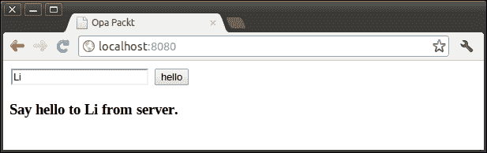
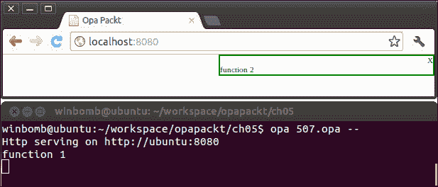
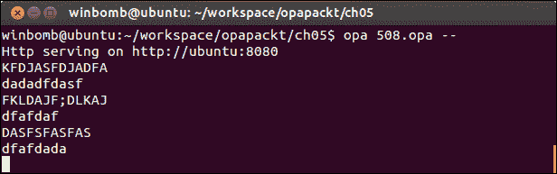
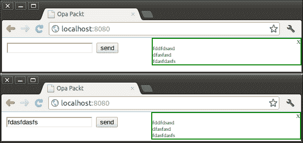

# 第五章. 客户端与服务器之间的通信

Opa 与大多数其他 Web 开发语言的一个重要区别是，其他技术通常需要使用多种语言来编写客户端和服务器端代码，而在 Opa 中，我们可以使用单一语言完成这两者。这使我们能够像调用本地函数一样调用远程过程。我们不需要自己发送 Ajax 请求并解析响应数据。在本章中，我们将首先讨论如何使用 Opa 切片服务器端和客户端代码，以及当自动切片不足时我们可以做些什么来帮助切片器。然后，我们将介绍客户端和服务器之间通信的三个原语：会话、单元格和网络。

# 客户端和服务器端切片

Opa 允许开发者在同一个模块中使用同一种语言编写服务器端和客户端代码。而且更好，Opa 切片器自动化了客户端和服务器之间的调用。不再需要手动编写的 Ajax 调用或值序列化！

## 一个简单的例子

让我们从简单的例子开始。假设我们想将我们的名字发送到服务器，并请求服务器以“从服务器向 [name] 说你好”的词语响应：



这相当简单，几乎我们可以用我们熟悉的任何语言来完成。通常，你会发送一个带有名字作为请求数据的 Ajax 请求到服务器，服务器将响应一个包含我们想要的字符串的 JSON 对象。以下代码片段演示了我们可以如何使用 jQuery 作为客户端代码和 ASP 作为服务器端代码来完成这个操作：

```js
//code fragment on server side: ajax.aspx
Response.ContentType = "application/json";
Response.Write("{result: 'Say hello to " 
+ Request["Name"] + "from server.'}");

//request code fragment on client side
$.post( "ajax.aspx",             //request url
{Name:"Li"},                     //request data
function (data, textStatus){},   //call back
"json");                         //data type
```

使用 Opa，事情变得更加简单。我们可以跳过发送 Ajax 请求的步骤，也不需要自己解析 JSON 响应数据。我们只需要编写一个带有 `server` 标签的正常函数，并从客户端调用该函数。以下是完整的代码：

```js
server function sayhello(name){
  "Say hello to " + name + " from server."
}
function page(){
  <input id=#name type="text"/>
  <input type="button" value="hello" onclick={function(_){
    #text = sayhello(Dom.get_value(#name))
  }}/>
  <h3 id=#text></h3>
}
Server.start(Server.http,{title:"Opa Packt",~page})
```

在前面的代码中，我们在 `sayhello` 函数之前添加了一个 `server` 标签，以指示它是一个服务器端的函数，并在客户端作为正常客户端函数调用此函数。如果移除 `server` 标签，则 `sayhello` 函数将在这个例子中成为客户端函数，客户端和服务器之间将没有通信。

## 切片注解

`server` 标签指示 Opa 编译器将 `sayhello` 函数放置在服务器端。Opa 是一种可以在客户端和服务器端执行的语言，但在编译过程中某个时刻，必须决定代码最终在哪个端运行，以及是否存在任何远程调用。

如果开发者没有通过在函数或模块之前添加切片注释（服务器、客户端和两边）来提供切片信息，那么 Opa 将自动执行切片任务。Opa 默认遵循的切片规则相当简单。如果可能，Opa 将在服务器和客户端上实现函数。如果不可能在服务器和客户端上实现函数，那么 Opa 将根据函数可以在哪里实现来在服务器或客户端上实现函数。例如，如果我们从上一个示例中的 `sayhello` 函数中删除 `server` 标签，那么 Opa 的切片器将实现该函数两次，一次在服务器上，一次在客户端。结果，调用不再是远程调用，而是一个本地调用。

当自动切片不足以满足需求时，例如，如果我们希望一个函数仅在服务器端或客户端可用，我们可以在函数关键字之前添加切片注释来告诉切片器一个声明应该在哪里结束。有三个切片注释：**服务器**、**客户端**和**两边**。

+   **服务器**：Opa 将在服务器上实现该函数（但这并不意味着它对在客户端运行的代码不可见）

+   **客户端**：Opa 将在客户端实现代码（但这并不意味着它对在服务器上运行的代码不可见）

+   **两边**：函数在服务器和客户端都实现

很容易理解 **服务器** 和 **客户端** 的含义，但 **两边** 关键字不太直观。问题是定义可以有任意副作用。

### 注意

**副作用**：在计算机科学中，如果一个函数或表达式除了返回一个值之外，还修改了一些状态或与调用函数或外部世界有可观察的交互，那么它被认为有副作用。

因此，有两种可能的含义：要么副作用在两边都执行，要么副作用在服务器上执行一次，然后结果值在两边之间共享。默认情况下，切片器会复制一些副作用，如打印，并避免复制可变结构的分配。

考虑以下示例：

```js
println("Hello Opa!")
counter = Mutable.make(0)
function page(){ <h1>...</h1> }
Server.start(Server.http,{title:"Opa Packt", ~page})
```

如果我们编译并运行前面的代码，它将在服务器和客户端上打印 "Hello Opa!"，但只会创建一个唯一的可变变量 `counter`，该变量在客户端和服务器之间共享。

但是，我们有时确实希望在两边都重复声明。在这种情况下，我们可以使用 `@both_implem` 指令。例如：

```js
@both_implem counter = Mutable.make(100)
```

这将在服务器启动时以及在每个客户端创建一个可变变量 `counter`。

## 模块切片

当切片注释引用一个模块时，它成为其组件的默认切片注释，但可以通过对组件进行另一个注释来覆盖。考虑以下示例：

```js
server module Logic{
  function f1() { println("function 1") }
  client function f2(){ println("function 2") }
}
function page(){
  <div onready={function(_){ Logic.f1(); Logic.f2() }}></div>
}
Server.start(Server.http,{title:"Opa Packt", ~page})
```

因为我们将 `server` 放在 `Logic` 模块之前，所以函数 `f1` 最终会在服务器端。但我们用 `client` 覆盖了函数 `f2` 的切片注解，所以函数 `f2` 将在客户端。当页面准备就绪时，我们调用 `f1` 和 `f2`，`f1` 将在服务器端打印 **function1**，而 `f2` 将在客户端打印 **function2**。以下截图显示了预期的结果：



## 表达式切片

有时，我们希望在服务器和客户端有不同的行为。我们可以使用 `@sliced_expr` 指令来实现这一点。考虑以下示例：

```js
side = @sliced_expr({server: "server", client:"client"}) 
println(side) //will print "server" on server side and "client"
             // on client side.
function page(){ <h1>Test Page</h1> }
Server.start(Server.http, {title:"Opa Packt", ~page});
```

前面的代码将在服务器端打印 "server"，在客户端打印 "client"。

# 客户端和服务器通信

Opa 提供了三个用于客户端和服务器之间通信的原语：会话、单元和网络。我们可以使用这三个原语在客户端和服务器之间交换消息。

## 会话

会话是客户端和服务器之间的一种单向异步通信。会话可以在服务器或客户端创建，并且可以在多个服务器之间共享。

要创建一个会话，可以使用 `Session.make` 或 `Session.NonBlocking.make`。`Session.make` 函数创建一个会话，该会话在后台处理所有消息，但一次只处理一条消息。这确保了会话状态的绝对一致性，但可能不适合所有应用程序。

相比之下，`Session.NonBlocking.make` 函数创建的会话可以同时处理任意数量的消息。这确保了最大的响应性，但消息处理器不能确定它是否持有状态的最新值。让我们看看 `Session.make` 是如何声明的：

```js
channel(`message) make(`state state, 
(`state, `message -> Session.instruction(`state) on_message)
```

第一个参数 `state` 是会话的初始状态。第二个参数是此会话的消息处理器。当向此会话发送消息时，将调用消息处理器。此函数的返回值是一个通道，我们可以使用 `Session.send` 函数通过该通道向会话发送消息。

考虑以下示例：假设我们想通过会话向服务器发送一个字符串，如果此会话的状态是奇数，则我们发送给服务器的任何内容都将打印为大写。相反，如果会话的状态是偶数，则我们打印为小写。代码如下：

```js
channel(string) s = Session.make(0,function(state,msg){
  if(mod(state,2) == 0) println(String.to_upper(msg)) 
  else                  println(String.to_lower(msg))
  {set:state+1}         //update the state of this session
})
function page(){
  <input type="text" id=#text/>
  <input type="button" value="send" onclick={function(_){
         Session.send(s, Dom.get_value(#text))
  }}/>
}
Server.start(Server.http,{title:"Opa Packt", ~page})
```

如果我们编译并运行前面的代码，那么在服务器上我们将看到以下结果：



## 单元

一个单元是一个会话，其中发送消息会产生返回值。它是客户端和服务器之间的双向同步通信。我们可以使用 `Cell.make` 创建一个单元，并通过 `Cell.call` 调用它。在以下示例中，单元几乎与我们在上一个示例中描述的相同，但它将字符串返回给客户端而不是在服务器上打印。以下是代码片段：

```js
s = Cell.make(0,function(state,msg){
   text =  if(mod(state,2) == 0)   String.to_upper(msg) 
           else                    String.to_lower(msg)
    {return: text, instruction: {set: state+1}}
});
function page(){
    <input type="text" id=#text/>
    <input type="button" value="send" onclick={function(_){
         #result = Cell.call(s, Dom.get_value(#text))
    }}/>
    <h2 id=#result></h2>
}
Server.start(Server.http, {title:"Opa Packt", ~page})
```

## 网络

网络是向观察者广播信息的基础设施。观察者可能位于同一台机器上，或者位于任何客户端或服务器上。

我们可以使用 `Network.empty()` 函数创建一个网络，或者使用 `Network.cloud(key)` 函数构建一个在服务器之间自动共享的网络。

我们可以使用 `Network.observe(cb,network)` 函数观察一个网络，其中 `cb` 是一个回调函数，当网络接收到消息时执行。要向一个网络的全部观察者发送消息，请使用 `Network.broadcast(msg,network)`。

以下示例是一个非常简单的聊天应用；当客户端页面准备就绪时，它将观察网络，并在发送按钮被触发时广播一条消息。我们将在第九章 构建聊天应用 中学习如何构建一个更复杂的网络聊天应用。

```js
Network.network(string) n = Network.empty();
function ready(_){
    _ = Network.observe(function(msg){ println("{msg}") },n)
    void
}
function page(){
    <div onready={ready}>
        <input type="text" id=#text/>
        <input type="button" value="send" onclick={function(_){
            Network.broadcast(Dom.get_value(#text),n)
        }}/>
    </div>
}
Server.start(Server.http,{title:"Opa Packt", ~page})
```

编译并运行前面的代码，然后在几个浏览器中打开网络应用。我们可以通过发送我们输入的消息在浏览器之间进行通信。以下是截图：



# 摘要

在本章中，我们首先讨论了 Opa 切片器。如果我们不提供切片信息，切片器会在可能的情况下尝试将代码放在两边，在没有办法将代码放在两边的情况下，则将代码放在一边。当这种自动切片不足以满足需求时，我们可以在函数和模块前添加切片注释（服务器、客户端和两者），以告诉切片器我们希望在哪个方面结束我们的代码。然后，我们讨论了客户端和服务器之间通信的三个原语。会话是一种单向异步通信，单元是双向同步通信，网络用于向任何数量的观察者广播消息。
