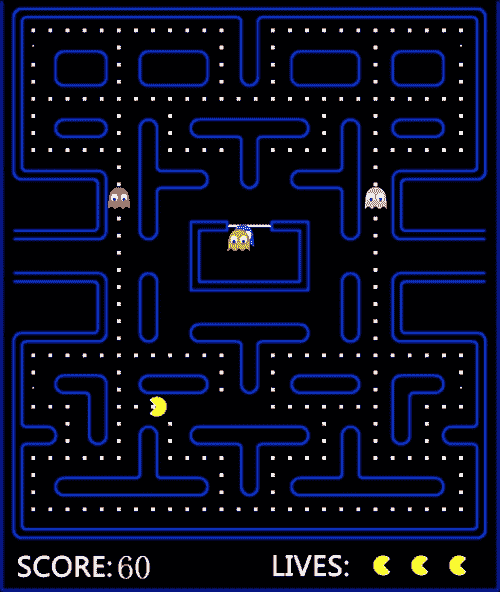
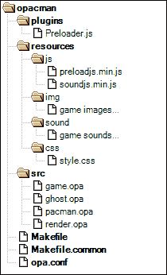
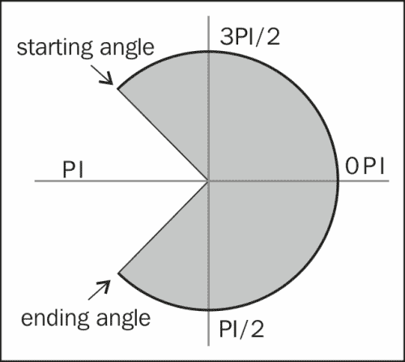

# 第十章. 构建游戏 - Pacman

在本章中，我们将构建名为**Pacman**的游戏。我们将学习如何在 Opa 的帮助下使用 HTML5 Canvas 进行编程，包括在画布上绘制形状、文本和图像。我们还将讨论如何使用外部 JavaScript 库。完整的源代码可以在[`github.com/winbomb/opapackt/tree/master/opacman`](https://github.com/winbomb/opapackt/tree/master/opacman)找到。以下是我们的 Pacman 游戏的截图：



# 项目结构

使用`opa create opacman`命令创建一个空的 Opa 项目。我们需要修改项目结构。让我们首先看看我们的 Pacman 游戏的修改后的项目结构：



以下是对项目文件的简要描述：

+   `src`：源代码，`ghost.opa`和`pacman.opa`定义了幽灵和 Pacman 的类型，`render.opa`负责在画布上绘制，而`game.opa`包含游戏逻辑

+   `resources`：此文件夹包含所需资源，包括图像、声音和样式

+   `resources/js`：`Preloadjs.min.js`和`soundjs.min.js`是两个开源 JavaScript 库，用于预加载游戏资源和播放声音

+   `plugins`：`Preloader.js`是我们编写的用于加载游戏资源的插件。

+   我们需要重写`opa.conf`文件以在`src`目录中包含源代码：

    `opacman.game`包含以下文件：

    +   `src/game.opa`

    +   `src/ghost.opa`

    +   `src/pacman.opa`

    +   `src/render.opa`

我们需要修改`Makefile`以移除数据库支持，因为我们在这个应用程序中不需要数据库。我们还需要告诉编译器编译插件时使用源代码。这两项工作可以通过将`FLAG`更改为以下行来完成：

```js
FLAG = --opx-dir _build $(PCKDIR)Preloader.js
```

# HTML5 Canvas

首先，我们需要一个画布元素来绘制我们的图形。HTML5 Canvas 元素与`<div>`、`<a>`和`<table>`标签类似，不同之处在于其内容是用 JavaScript 渲染的。在 Opa 中，我们创建画布元素的方式与创建其他 HTML 元素的方式完全相同：

```js
function page(){
    <canvas id=#gamecanvas width="520" height="620" 
onready={Game.gamestart}>
</canvas>
}
```

此代码创建了一个具有`gamecanvas` ID 的画布。当画布元素准备好时，`Game.gamestart`函数将被调用以开始游戏。

接下来，我们必须获取画布上下文。对于我们来说，理解画布元素和画布上下文之间的区别很重要。画布元素是嵌入在 HTML 页面中的 DOM 节点，而画布上下文是一个具有属性和方法的对象，您可以使用这些属性和方法在画布元素内渲染图形。上下文可以是 2D 或 3D（WebGL）。在我们的 Pacman 游戏中，我们使用的是 2D 上下文。要获取画布 2D 上下文，我们使用`Canvas.get_context_2d`函数。以下代码片段演示了如何为给定 ID 获取画布上下文：

```js
ctx = match(Canvas.get(#gamecanvas)){
case  {none}: {none}
case ~{some}: Canvas.get_context_2d(some)
}
```

注意，每个画布元素只能有一个上下文。如果我们对同一个元素多次使用 `Canvas.get_context_2d` 方法，它将返回相同的上下文。

# 绘制一个形状

现在我们已经获得了画布元素的上下文，我们可以在它上面绘制图形。Opa 和 JavaScript 使用类似的代码来绘制图形。它们之间的主要区别是 Opa 中的绘图函数是静态的。所有绘图方法都可以在 `Canvas` 模块中找到。

## 使用填充和描边属性

每当我们想在画布上绘制形状时，我们需要设置两个属性：`Stroke` 和 `Fill`。`Stroke` 和 `fill` 决定了形状的绘制方式。`stroke` 属性用于形状的轮廓；`fill` 属性用于形状的内部。在以下示例中，前两行填充了一个矩形，而后三行则描边了一个矩形：

```js
Canvas.save(ctx)
Canvas.set_fill_style(ctx,{color: Color.red})
Canvas.fill_rect(ctx,10,10,100,50)
Canvas.set_stroke_style(ctx,{color: Color.black})
Canvas.set_line_width(ctx,5.0)
Canvas.stroke_rect(ctx,120,10,100,50)
Canvas.restore(ctx)
```

下面的代码片段显示了前面的结果：


注意，我们在前面的代码中使用了 `Canvas.save` 和 `Canvas.restore`。每个画布上下文都维护着一个包含诸如 `fillStyle` 和 `strokeStyle` 等绘图状态的栈。由于画布只能有一个 2D 上下文，因此使用 `Canvas.save` 和 `Canvas.restore` 来在短时间内保存和恢复画布状态。

## 绘制一个曲线

在我们的游戏中，我们通过在画布上绘制一个弧线来创建我们的 Pacman。当 Pacman 的嘴巴张开时，我们绘制一个饼形，当它闭合时，我们绘制一个圆形。

我们可以使用 `Canvas.arc` 函数绘制饼形和圆形。弧线由一个中心点、一个半径、一个起始角度、一个结束角度和绘制方向（顺时针或逆时针）定义。以下图表显示了当 Pacman 面向左时我们应该如何绘制它：



首先，我们将移动到中心点，并从起始角度 `5*PI/4` 开始绘制。然后我们按顺时针方向绘制一个到结束角度 `3*PI/4` 的弧线。最后，我们填充和描边这个形状。以下是代码：

```js
Canvas.set_stroke_style(ctx,{color:Color.black})
Canvas.set_fill_style(ctx,{color:Color.yellow})
Canvas.begin_path(ctx)
Canvas.move_to(ctx,100,100)
Canvas.arc(ctx,100,100,50,5.0*Math.PI/4.0,3.0*Math.PI/4.0,{false})
Canvas.close_path(ctx)
Canvas.fill(ctx)
Canvas.stroke(ctx)
```

# 绘制一个图像

在 Opa 中，要在 HTML5 Canvas 上显示图像，我们可以使用 `Canvas.draw_image` 函数，该函数需要一个图像对象和一个目标点。由于 `draw_image` 方法需要一个图像对象，我们必须首先创建一个图像，并在它加载完成后才能在画布上绘制它。在我们的游戏中，我们将在游戏开始时预加载所有图像和声音，正如你稍后将会看到的。`Canvas.draw_image` 函数声明如下：

```js
void draw_image(Canvas.context ctx, Canvas.image img, int x, int y)
```

我们传递给 `draw_image` 的第一个参数是我们检索到的画布上下文。第二个参数是类型为 `Canvas.image` 的图像对象。`Canvas.image` 类型声明如下：

```js
type Canvas.image = {Image.image   image} 
                 or {Canvas.canvas canvas} 
                 or {Video.video   video}
```

`Image.image` 是一个外部类型。它与我们在 JavaScript 中使用 `new Image()` 代码创建的图像类型相同。

当游戏开始时，我们预加载图像。当需要时，我们将通过调用以下插件函数来获取图像对象：

```js
function IMAGE(key){
    {image: %%Preloader.get%%(key)}
} 
```

除了 `draw_image` 函数外，还有两个我们可以用来在画布上绘制图像的函数：

```js
Canvas.draw_image_with_dimensions(ctx, img, x, y, w, h)
Canvas.draw_image_full(ctx, img, sx, sy, sw, sh, dx, dy, dw, dh)
```

要设置图像的大小，我们可以使用 `draw_image_with_dimensions`。这将按目标大小缩放图像。`draw_image_full` 函数功能更强大，因为我们可以使用它来裁剪图像。

# 绘制文本

要在 Opa 画布上显示文本，我们可以使用 `Canvas.fill_text` 或 `Canvas.stroke_text` 方法。我们可以通过调用 `Canvas.set_fill_style` 或 `Canvas.set_stroke_style` 分别更改填充样式或描边样式。

要设置文本的字体，请使用 `Canvas.set_font` 函数。我们应该将字体信息传递给该方法；字体信息是一个与以下模式匹配的字符串：

```js
    [font-style] [font-weight] [font-size] [font-family]
```

以下代码绘制了单词 "start" 两次，一个是填充的，另一个是描边的，两者都带有字体信息 `italic bold 40px verdana`：

```js
Canvas.set_fill_style(ctx,{color:Color.red})
Canvas.set_font(ctx,"italic bold 40px verdana")
Canvas.fill_text(ctx,"Start",5,50)
Canvas.set_stroke_style(ctx,{color:Color.red})
Canvas.set_line_width(ctx,2.0)
Canvas.stroke_text(ctx,"Start",200,50)
```

上述代码片段的结果如下：


# 绑定外部 JavaScript 库

在我们的 Pacman 游戏中，我们需要预加载游戏资源，如图像和声音。我们还需要播放声音和音乐。当然，我们可以编写自己的代码来完成这些任务。然而，为什么要重新发明轮子呢？有无数的 JavaScript 库可以使我们的工作变得更简单。下一节将展示如何将现有的 JavaScript 库绑定到我们的游戏中。

## 预加载资源

当一个程序需要多个图像和声音时，就像我们的 Pacman 游戏一样，通常在显示或播放它们之前加载所有资源是个好主意。有许多优秀的 JavaScript 库可供选择。就我们的目的而言，Preload JS 0.3.0（用于资源）和 SoundJS 0.4.0（用于声音）库是一个不错的选择。您可以从 [`github.com/CreateJS/PreloadJS`](https://github.com/CreateJS/PreloadJS) 下载 Preload JS 0.3.0，SoundJS 0.4.0 库可在 [`github.com/CreateJS/SoundJS`](https://github.com/CreateJS/SoundJS) 获取。

要绑定 JavaScript 库，我们必须注册我们计划从我们的 Opa 代码中调用的那些函数。我们已经在 第六章 *与其他语言绑定* 中讨论了如何绑定 JavaScript。在我们的 Pacman 游戏中，我们注册了一个 `preload` 函数：

```js
/** @register {( -> void) -> void} */
function preload(callback) {
    //use LoadQueue to preload resources, invoke callback when finish.
    queue = new createjs.LoadQueue();
    queue.installPlugin(createjs.Sound);
    queue.addEventListener("complete", callback);
    queue.loadManifest([ ... ])
}
```

`preload` 函数使用 `PreloadJS` 预加载资源，并在完成后调用回调函数。我们可以在 Opa 中以下方式调用 `preload` 函数：

```js
%%Preloader.preload%%(function(){
    //start our game after resources have been loaded.
})
```

完整的代码可以在 `plugins/preloader.js` 和 `/src/game.opa` 中找到。

## 播放声音

我们绑定 `SoundJS` 库并通过在 `preloader.js` 插件文件中注册一个函数来播放声音。该函数调用 SoundJS 中的方法来构建声音实例然后播放它。`SoundJS` 库完全超出了本书的范围。有关该库的更多详细信息，请访问 SoundJS 主页。

# 摘要

在本章中，我们构建了一个名为**Pacman**的游戏。首先，我们讨论了如何声明一个 HTML5 画布元素以及如何获取画布上下文。然后，我们回顾了如何在画布上绘制形状、图像和文本。最后，我们展示了如何编写插件并将外部 JavaScript 库嵌入到应用程序中。
