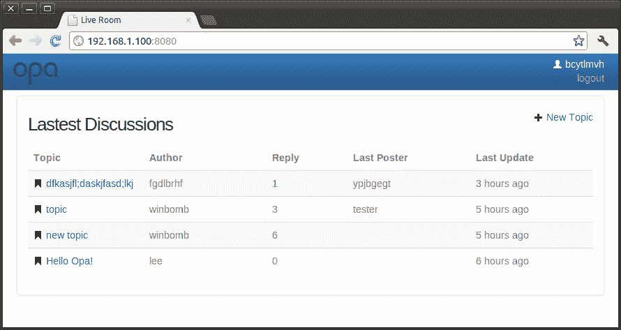
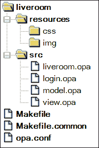
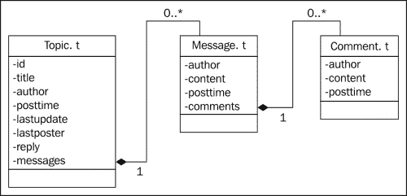

# 第十一章. 开发社交移动应用 – LiveRoom

在本章中，我们将构建一个名为 LiveRoom 的社交移动 Web 应用。LiveRoom 提供类似于论坛的功能。用户可以登录并发布讨论和消息；他们也可以使用 Facebook 账户登录。该应用将支持移动设备和桌面浏览器。以下是 LiveRoom 的截图，源代码可在[`github.com/winbomb/opapackt/tree/master/liveroom`](https://github.com/winbomb/opapackt/tree/master/liveroom)找到。



# 项目结构

首先，让我们看一下项目结构。这是一个经典的 Opa 项目结构；我们可以使用以下命令行创建一个类似的结构：

```js
opa create liveroom

```



+   `liveroom.opa`: 应用的入口点。它声明数据库，分发请求，并启动 Web 服务器。

+   `login.opa`: 登录模块。它显示登录页面，处理用户登录和注销时的 `UserContext`，并在用户尝试使用 Facebook 登录时连接到 Facebook。

+   `model.opa`: 应用的数据模型。它定义数据模型并处理数据库的读写操作。

+   `view.opa`: 用户界面（UI）。它显示页面，将我们从数据库中获取的内容映射到 XHTML，然后在页面上显示它们。此外，它获取用户的输入，并尝试通过 `Model` 模块将数据插入数据库。

+   `style.css`: 外部样式表。它在 Web 服务器启动时注册，因此我们可以在应用程序范围内使用此文件中的样式。

要编译和运行应用，请输入 `make run`。

# 授权用户

在本节中，我们将讨论如何创建一个简单的登录和注销系统，这是本论坛的一个基本部分，也是其他类型网站经常需要的功能子集。

## 登录和注销

为了简化，我们不提供应用的注册流程。输入非空用户名和密码的用户可以登录系统。如果授权失败，`Model.auth` 返回 `{none}`，否则返回 `{user}`，其中用户是包含当前用户信息的类型 `User.t` 的值。只有已登录的用户才能创建主题和发布消息。本节将展示用户登录时应执行的操作。以下代码片段演示了登录过程，代码可以在 `login.opa` 文件中找到：

```js
type Login.user = {unlogged} or {User.t user}
state = UserContext.make(Login.user {unlogged})
function login(_) {
username = Dom.get_value(#username)
  password = Dom.get_value(#password)
  match(Model.auth(username,password)){
  case {none}: Client.reload()
  case {some:user}: {
      UserContext.change(function(_){~{user}},state)
          Client.goto("/")
  }}
}
```

类型 `Login.user` 是一个联合类型：`{unlogged}` 表示当前用户尚未登录；`{Usert.t user}` 表示当前用户已登录，并且用户信息存储在此记录中。从第二行我们可以看到，`UserContext` 用于管理登录状态。`UserContext` 是基于 cookie 的高级机制，用于将值与每个客户端关联。存储在 `UserContext` 中的用户数据只能由拥有此数据的使用者访问和修改。对于我们的大多数需求，我们只需要使用 `UserContext` 提供的以下函数。

使用 `UserContext.make` 函数创建一个带有默认值的 `UserContext`；这就是我们在第二行所做的事情。

使用 `UserContext.change` 函数更改此用户的 `UserContext` 当前状态。注意，在前面的代码的第 9 行，我们在成功授权后更改了状态为 `~{user}`。

使用 `UserContext.remove` 函数移除当前值。以下代码在用户注销时移除值：

```js
function logout(_){
UserContext.remove(state)
  Client.reload()
}
```

使用 `UserContext.get` 函数获取 `UserContext` 的当前值。以下代码使用此函数获取当前已登录用户的姓名：

```js
function get_user() {
  match(UserContext.get(state)){
    case {unlogged}: "anonymous"
    case ~{user}:    user.nickname
  }
}
```

这就是我们实现默认用户登录的方式。然而，我们也可以允许用户使用其 Facebook 或 Twitter 账户完成登录。

## 使用 Facebook 登录

Opa 提供了 FbAuth 和 Twitter 模块，分别用于连接 Facebook 和 Twitter。在 LiveRoom 的登录页面中，有一个链接按钮，允许用户使用 Facebook 登录。与 Facebook 进行身份验证需要一些额外的步骤，但这本书的范围不包括所有关于 Facebook 身份验证的细节，因为我们更希望专注于 Opa 语言。那些想了解更多关于 Facebook 身份验证的人应该查看以下优秀的教程：[`github.com/akoprow/opa-devcamp-facebook`](https://github.com/akoprow/opa-devcamp-facebook)。

注意，你应该将 `login.opa` 中的 x 替换为你的真实数据：

```js
config = { 
app_id: "xxxxxxxxxxxxxxx",
api_key: "xxxxxxxxxxxxxxx",
app_secret: "xxxxxxxxxxxxxxxxxxxxxxxxxxxxxxxx"
}
```

`App_id` 和 `app_key` 是相同的，而 `app_secret` 不应与任何人共享。

# 应用程序

LiveRoom 主要关于发布主题和消息。当用户登录时，他们可以通过创建新主题来开始讨论。新创建的主题将显示在最新讨论列表中，即最新讨论列表。如果用户点击一个主题，他/她将进入讨论并获取与该主题相关的消息列表。如果用户已登录，他/她将能够发布与所选主题相关的消息，或对现有消息进行评论。以下图显示了主题、消息和评论的数据模型：



以下是 Opa 中的类型定义：

```js
type Topic.t = {
  int   id,    //id, the primary key
  string title,    //title of the topic
  string author,  //the author
  int   posttime,  //post time
  int   lastupdate,  //last update time, 
  string lastposter,  //last poster
  int   reply,    //number of replies
  stringmap(Message.t) messages
}
type Message.t = { 
string author, string content, int posttime, 
  list(Comment.t) comments
}
type Comment.t = { string author, string content, int posttime }
```

在这些数据模型定义到位后，我们可以声明我们的数据库 `liveroom`：

```js
database liveroom {
  int     /next_id
  Topic.t /topics[{id}]
}
```

数据库路径`next_id`是一个整数，持有最大主题 id；这是模拟 MongoDB 原生不支持的自增键的解决方案。`topics`路径存储用户创建的主题。主键是主题的 id。

## 列出主题

在 LiveRoom 的主页上，我们将显示从数据库中检索到的最近讨论的话题。在 Opa 中，这是一个简单的任务。以下函数查询检索指定页面的主题：

```js
function query(page){
  topics = /liveroom/topics[skip page*50;limit 50;order -lastupdate]
  DbSet.iterator(topics)
}
```

真的很简单，不是吗？正如我们在第七章中讨论的，*与数据库一起工作*，我们可以通过使用数据库路径（如`/liveroom/topics`）从数据库中读取数据。方括号中的语句是查询条件。查询结果`topics`是一个 dbset，我们在下一行将其转换为迭代，这样我们就可以以下面的方式循环结果：

```js
Iter.map(function(t){
... //map a topic to an xhtml showing on the page
}, query(0))
```

这正是我们在用户界面代码中所做的。请参阅模块 View 中的`list_topics`以获取详细信息。要列出消息和评论，您也需要使用类似的代码。首先，我们根据给定的 id 从数据库中检索一个主题：

```js
function get(id) { 
/liveroom/topics[~{id}] 
}
```

然后，我们在模块 View 中的消息和评论上进行迭代，将它们转换为 XHTML 并在页面上显示。代码如下：

```js
topic = Model.get(id)
Map.iter(function(key, msg){
  ...
  List.map(function(comment){
      ...
  }, msg.comments)
}, topic.messages)
```

请查看模块 View 中的`show_messages`函数以获取完整的代码。

## 创建主题

LiveRoom 最重要的用例之一是创建一个主题。当用户登录后，他们可以通过点击主页上的**新主题**来创建一个主题。这将导航用户到一个创建主题的页面，在那里他们可以输入标题和内容。当用户点击**创建**按钮时，将调用`add_topic`函数：

```js
function add_topic(_){L
  topic = ...  //create a topic record from user's input
match(Model.insert(topic)){  //insert the record into database
    case {success: _}: Client.goto("/")  //go back to main page
    case {failure: f}: show_alert("{f}")  //show alert info
  }
}
```

`add_topic`函数首先从用户的输入中创建一个类型为`Topic.t`的记录。然后，它尝试通过调用如下定义的`Model.insert`函数将主题插入到数据库中：

```js
function insert(topic){
  match(next_id()){
  case {none}: {failure: "Failed to generate next id!"}
  case {some:id}:{
    /liveroom/topics[~{id}] <- {topic with ~id}
    {success: id}  
  }}
}
```

由于 MongoDB 中没有自增 id，我们使用`next_id`函数来获取一个唯一的标识符。如果函数失败，则返回`{none}`，否则返回`some(id)`，其中`id`是下一个标识符。在`next_id`函数中，我们使用 Mongo API `MongoCommands.findAndUpdateOpa`执行原子操作：

```js
my_db = MongoConnection.openfatal("default")
function next_id(){
  if(?/liveroom/next_id == none) { /liveroom/next_id <- 0 }
    r = MongoCommands.findAndUpdateOpa(
         my_db, "liveroom", "_default",
         Bson.opa2doc({_id : "/liveroom/next_id"}),
         Bson.opa2doc({`$inc` : { value : 1}}), 
{some : true}, {none}
  );
  match (r) {
    case { success : {string _id, int value} v }: some(v.value)
    case { failure : e }: {none}
}
}
```

## 发布消息和评论

从我们用来在主题内部字符串映射中存储消息的数据类型`Topic.t`可以看出，我们需要一个字符串键来访问或更新一条消息。在 LiveRoom 中，我们使用`{topic id}_{system time}_{random string}`作为键。在插入消息后，还需要更新一些其他字段，例如回复。

```js
function post_message(id, message){
  now = get_now()  //current time in milliseconds
  key = "{id}_{now}_{Random.string(5)}"
  /liveroom/topics[~{id}]/messages[key] <- message
  /liveroom/topics[~{id}]/reply++
  /liveroom/topics[~{id}]/lastupdate = now
  /liveroom/topics[~{id}]/lastposter = message.author
}
```

要发表评论，只需将一个新项目追加到给定主题 id 和消息键的评论列表中：

```js
function post_comment(id, key, comment){
  /liveroom/topics[~{id}]/messages[key]/comments <+ comment
}
```

## 为移动设备设计

为了确保我们的 LiveRoom 应用程序在移动设备上得到支持，我们不得不做更多的工作。需要在页面的`<head>`标签中添加一个 viewport 元标签：

```js
header = <><meta name="viewport" content="width=device-width, initial-scale=1.0, user-scalable=no"></>
xhtml = <>...</> //the body of the page
Resource.full_page("Live Room", xhtml, header, {success}, [])
```

在这里，我们使用 `Resource.full_page` 将 `viewport` 元标签嵌入我们的页面。关于此函数的详细描述可以在网上找到([`doc.opalang.org`](http://doc.opalang.org))。

接下来，我们需要导入 `bootstrap.responsive` 以帮助我们的应用更加响应式。

```js
import stdlib.themes.{bootstrap, bootstrap.responsive}
```

你可以在 Bootstrap 主页上找到更多关于响应式 Bootstrap 类的信息：[`twitter.github.io/bootstrap/scaffolding.html#responsive`](http://twitter.github.io/bootstrap/scaffolding.html#responsive)

在我们的 LiveRoom 应用中，我们使用响应式 Bootstrap 类 `hide-phone` 来隐藏在列出主题时移动手机上的 `最后发布者` 列，因为可能没有足够的宽度。以下代码展示了我们如何做到这一点：

```js
  <td align="center" class="hidden-phone">{t.lastposter}</td>
  …
  <th align="center" class="hidden-phone">Last Poster</th>
```

我们可以在 `view.opa` 的 `main` 函数中找到代码。

# 摘要

在本章中，我们描述了如何在 Opa 中编写一个社交移动网页应用。首先，我们讨论了用户授权流程；我们使用 `UserContext` 来维护特定客户端的登录状态。我们还提到了如何在 Opa 中连接到 Facebook。在下一节中，我们详细讨论了如何实现 LiveRoom，这包括从数据库读取数据并在网页中显示它，以及将用户提交的主题、消息和评论插入到数据库中。请参考源代码以查看完整的代码。
