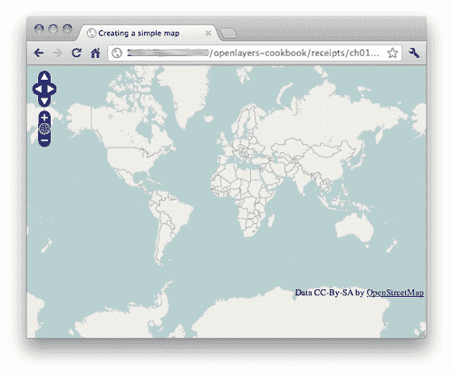
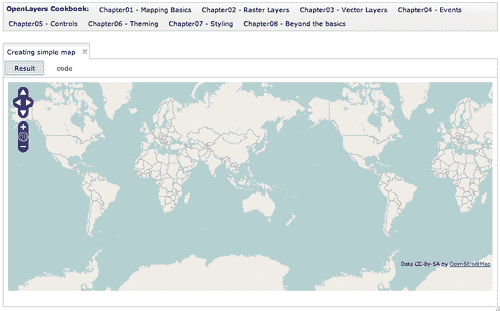
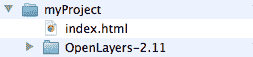
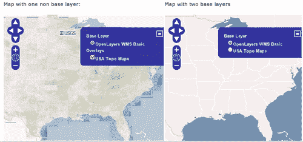
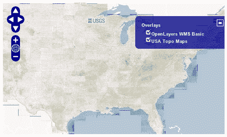
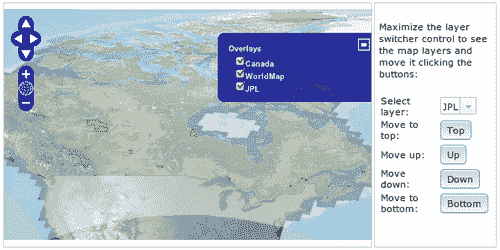
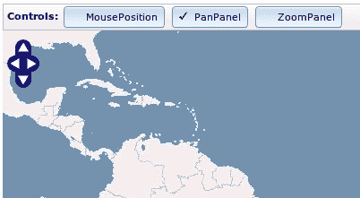
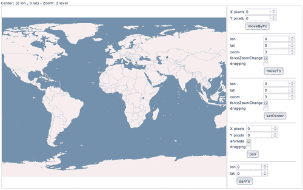
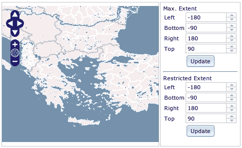

# 第一章. 网络地图基础

在本章中，我们涵盖了：

+   创建一个简单的全屏地图

+   包含 OpenLayers 的不同方法

+   理解基本图层和非基本图层

+   避免需要基本图层

+   玩转地图选项

+   管理地图的堆叠图层

+   管理地图控件

+   在地图视图中移动

+   限制地图范围

# 简介

每个历史都有开始，同样每个食谱都是从最初的调料开始的。

本章向我们展示了在开始使用 OpenLayers 创建我们的第一个网络地图应用程序时需要了解的基本和更重要的事情。

正如我们将在本章和下一章中看到的，OpenLayers 是一个庞大且复杂的框架，但与此同时，它也非常强大和灵活。

与其他库（如简单但功能更强大的 Leaflet 项目 [`leaflet.cloudmade.com`](http://leaflet.cloudmade.com)）相比，OpenLayers 试图实现开发者创建网络 GIS 应用程序所需的所有功能。也就是说，不仅包括地图、图层或标准格式等 GIS 相关概念，还包括文档元素的操纵或辅助函数以进行异步请求。

简单来说，我们在下一段中描述了框架的大致轮廓。

OpenLayers 中的主要概念是地图。它表示信息渲染的视图。地图可以包含任意数量的图层，这些图层可以是栅格图层或矢量图层。在它的过程中，每个图层都有一个数据源，以它自己的格式提供数据：一个 PNG 图像，一个 KML 文件等等。此外，地图还可以包含控件，这些控件有助于与地图及其内容进行交互：平移、缩放、要素选择等等。

让我们从通过示例学习 OpenLayers 开始吧。

# 创建一个简单的全屏地图

当你在地图应用程序中工作时，首要且重要的任务是创建地图本身。地图是应用程序的核心，你将在其中添加和可视化数据。

本食谱将指导您完成创建我们第一个非常简单的网络地图应用程序的过程。

### 注意

假设已经配置并准备好了网络服务器。记住，我们的食谱不过是 HTML、CSS 和 JavaScript 代码，因此我们需要一个网络服务器来提供这些代码，以便在浏览器端进行解释。

## 准备工作

使用 OpenLayers 进行编程主要与编写 HTML 代码和，当然，JavaScript 代码有关。因此，我们只需要一个文本编辑器就可以开始编写我们的食谱。

存在着许多优秀的文本编辑器，其中许多具有网络编程功能。因为我们将要开始探索像 OpenLayers 这样的开源项目，我们将参考几个优秀的开源项目。

对于 Windows 用户来说，Notepad++ ([`notepad-plus-plus.org`](http://notepad-plus-plus.org)) 是默认文本编辑器的一个很好的替代品。它简单快捷，提供语法高亮显示，并可以添加插件以扩展功能。

另一方面，你不仅可以找到支持网页开发的完整开发框架，而且这些框架不仅提供语法高亮，还提供自动完成、代码导航等功能，而不是仅仅使用文本编辑器。

在这个组中，有两个项目在开源项目宇宙中是明星：Eclipse ([`www.eclipse.org`](http://www.eclipse.org)) 和 NetBeans ([`netbeans.org`](http://netbeans.org))。这两个项目都是基于 Java 的，并且可以在任何平台上运行。

你可以在`recipe/ch01/ch01_simple_map_book.html`文件中找到源代码。

## 如何做到这一点...

1.  让我们先创建一个新的空`index.html`文件，并在其中插入以下代码块。我们将在下一节中一步一步地解释它：

    ```js
    <!DOCTYPE html> 
    <html> 
        <head> 
            <title>Creating a simple map</title> 
            <meta http-equiv="Content-Type" 
                content="text/html; charset=UTF-8"> 

            <!-- Include OpenLayers library --> 
            <script type="text/javascript" 
                src="http://openlayers.org/api/2.11/
                OpenLayers.js"></script> 
            <style> 
                html, body { 
                    width: 100%; 
                    height: 100%; 
                    margin: 0; 
                    padding: 0; 
                } 
            </style> 

            <!-- The magic comes here --> 
            <script type="text/javascript"> 
                function init() { 
                    // Create the map using the specified 
                    // DOM element 
                    var map = new OpenLayers.Map("rcp1_map"); 

                    // Create an OpenStreeMap raster layer 
                    // and add to the map 
                    var osm = new OpenLayers.Layer.OSM(); 
                    map.addLayer(osm); 

                    // Set view to zoom maximum map extent 
                    map.zoomToMaxExtent(); 
                } 
            </script> 
        </head> 
        <body onload="init()"> 
            <div id="rcp1_map" style="width: 100%; 
                height: 100%;"></div> 
        </body> 
    </html>

    ```

    ### 小贴士

    **下载示例代码**

    你可以从你购买的所有 Packt 书籍的账户中下载示例代码文件。[`www.packtpub.com`](http://www.packtpub.com)。如果你在其他地方购买了这本书，你可以访问[`www.packtpub.com/support`](http://www.packtpub.com/support)并注册，以便将文件直接通过电子邮件发送给你。

1.  在你的浏览器中打开文件，查看结果。你将看到一个全屏地图，在左上角有一些控件，如下面的截图所示：



## 它是如何工作的...

让我们一步一步地解释这个神秘步骤。首先，我们创建了一个 HTML5 文档，查看`doctype`声明代码`<!DOCTYPE html>`。

在`head`部分，我们通过`script`元素包含了对 OpenLayers 库的引用，如下所示：

```js
<script type="text/javascript" 
src="img/OpenLayers.js"></script>

```

我们添加了一个`style`元素来强制文档占据整个页面，如下所示：

```js
<style> 
    html, body { 
        width: 100%; 
        height: 100%; 
        margin: 0; 
        padding: 0; 
    } 
</style>

```

在`style`元素之后是带有一些 JavaScript 代码的`script`元素，但我们将它在最后进行解释。

在`head`部分开始后，`body`部分开始。我们的`body`与一个`onload`事件相关联。这意味着，一旦浏览器完全加载了`body`部分的所有内容，`init()`函数将被调用：

```js
<body onload="init()">

```

最后，在`body`中，我们放置了一个具有标识符`rcp1_map`的`div`元素，OpenLayers 将使用它来渲染地图。

再次，我们强制元素填充整个父元素的空间：

```js
<div id="rcp1_map" style="width: 100%; height: 100%;"></div>

```

### 小贴士

**关于样式的说明...**

将`div`元素的`width/height`设置为`100%`意味着它将填充父元素的 100%空间。在这种情况下，父元素是`body`元素，它也被设置为填充 100%的页面空间。更多和更好的关于 CSS 的信息可以在[`www.w3schools.com/css`](http://www.w3schools.com/css)找到。

现在，让我们看看`head`部分中的`script`元素。

如我们之前提到的，使用`onload`事件，我们确保在浏览器加载完整个`body`元素后执行`init`函数，这意味着我们可以无任何问题地访问`<div id="rcp1_map" ...>`。

首先，我们创建了一个`OpenLayers.Map`对象，它将在之前提到的`div`元素中渲染。这是通过在构造函数中传递`DOM`元素标识符来实现的：

```js
// Create the map using the specified DOM element
var map = new OpenLayers.Map("rcp1_map");

```

接下来，我们创建了一个新的栅格图层，它将显示来自`OpenStreetMaps`项目的图像：

```js
// Create an OpenStreetMap raster layer and add to the map
var osm = new OpenLayers.Layer.OSM();

```

一旦创建，我们就将其添加到地图中：

```js
map.addLayer(osm);

```

最后，将地图视图设置为最大有效范围：

```js
// Set view to zoom maximum map extent
map.zoomToMaxExtent();

```

## 还有更多...

记住，做事情没有唯一的方法。

本书中的配方并没有作为独立应用程序编写。相反，为了提高用户体验，我们创建了一个丰富的应用程序，允许你选择并运行所需的配方，同时还有查看源代码的可能性。



因此，书中编写配方的方法略有不同，因为它们必须与应用程序的设计集成。例如，它们不需要包含 OpenLayers 库，因为这在主应用程序的另一个地方已经包含了。

此外，*如何做*部分中介绍的方法更倾向于独立应用程序。

如果你正在查看这个配方的源代码，位于`recipes/ch01/ch01_simple_map.html`，我们会看到略微不同的代码：

```js
<!-- Map DOM element -->
<div id="ch1_simple_map" style="width: 100%; height: 95%;"></div>

<!-- The magic comes here -->
<script type="text/javascript">

    // Create the map using the specified DOM element
    var map = new OpenLayers.Map("ch1_simple_map");

    // Create an OpenStreeMap raster layer and add to the map
    var osm = new OpenLayers.Layer.OSM();
    map.addLayer(osm);

    // Set view to zoom maximum map extent
    map.zoomToMaxExtent();
</script>

```

如我们所见，它包含了前几节中描述的主要部分。我们有一个`div`元素来包含地图实例，以及一个包含所有必需 JavaScript 代码的`script`元素。

为了创建丰富的应用程序，我们必须使用 Dojo Toolkit 框架([`dojotoolkit.org`](http://dojotoolkit.org))，它提供了几乎任何所需的功能：访问和修改文档对象结构、事件处理、国际化等等。但我们选择它的主要原因是因为，除了提供一套优秀的同质化小部件（标签页、按钮、列表等等）来创建外观和感觉都很好的应用程序之外。

教授 Dojo 超出了本书的范围，但它的使用非常简单和具体，不会干扰本配方的目标，即教授 OpenLayers。

## 参见

+   *包含 OpenLayers 的不同方法*配方

+   *理解基本层和非基本层*配方

# 包含 OpenLayers 的不同方法

根据我们工作的环境，即开发或生产，我们可以以不同的方式将 OpenLayers 包含到我们的项目中。

环境指的是我们流程中某个阶段所需的服务器层。这样，开发环境与开发过程相关联，程序员每天在这里工作，进行测试和检查。

生产环境指的是项目的最终阶段。它必须在稳定的服务器上运行，且没有依赖问题。

如我们很快将看到的，我们可以将包含 OpenLayers JavaScript 代码的解决方案总结为两组，一组是在远程服务器上托管代码的，另一组是在我们自己的服务器上托管代码的。

让我们开始，看看每种解决方案的优缺点。

## 准备工作

创建一个名为 `myProject` 的文件夹，它将包含所有我们的项目文件和库依赖项。然后创建一个 `index.html` 文件，并继续使用 *创建一个简单的全屏地图* 菜单中给出的代码。

### 注意

假设项目文件夹位于可以被 web 服务器文件夹访问的文件夹中，因此它可以提供其内容。

现在，从项目的网页 [`www.openlayers.org`](http://www.openlayers.org) 下载 OpenLayers 代码。

### 注意

在撰写本书时，OpenLayers 版本 2.11 是稳定版本，可以在 [`openlayers.org/download/OpenLayers-2.11.tar.gz`](http://openlayers.org/download/OpenLayers-2.11.tar.gz) 找到。

将包保存到 `myProject` 文件夹中，并解压缩它。我们需要有一个类似于以下截图的文件夹结构：



## 如何操作...

我们有三种方法将 OpenLayers 库包含到我们的代码中：

+   `<script type="text/javascript" src="img/OpenLayers.js"> </script>`

+   `<script type="text/javascript" src="img/OpenLayers.js"></script>`

+   `<script type="text/javascript" src="img/OpenLayers.js"></script>`

## 它是如何工作的...

第一个选项包括一个由 OpenLayers 项目服务器托管的全压缩文件。它使用简单，但无法在离线模式下本地工作：

```js
<script type="text/javascript" 
src="img/OpenLayers.js"></script>

```

### 注意

压缩的全压缩文件 `OpenLayers.js` 的大小接近 1 MB，因此在具有大量请求的生产环境中，可能最好将此文件托管在内容分发网络或 CDN ([`en.wikipedia.org/wiki/Content_delivery_network`](http://en.wikipedia.org/wiki/Content_delivery_network)) 上。

第二个选项与第一个选项非常相似，但全压缩文件附加到项目中。此选项适用于需要 OpenLayers 在自己的服务器上，并且与你的应用程序代码一起使用的场景。

```js
<script type="text/javascript" src="../js/
OpenLayers-2.11/OpenLayers.js"></script>

```

最后，第三个选项包括 OpenLayers 库的未压缩代码，实际上它还包括许多其他文件，如图层、控件等所需的文件。

```js
<script type="text/javascript" src="../js/
OpenLayers-2.11/lib/OpenLayers.js"></script> 

```

此选项主要供想要扩展 OpenLayers 并需要调试代码的程序员使用。

### 小贴士

我鼓励你在这种模式下工作。使用一些工具，例如 Firefox 网络浏览器的 Firebug 或 Chrome 浏览器控制台，并在 OpenLayers 类上设置断点，以更好地理解正在发生的事情。

值得注意的是，使用这种方法会从服务器加载很多文件，每个类一个，这意味着会发起更多的服务器请求。

这种方法最显著的影响是页面加载时间比前几种选项长得多。

## 还有更多...

如果你选择下载 OpenLayers 并将其包含在你的项目中，你不需要放置整个未压缩的包。正如你所见，它包含了很多文件和文件夹：源代码、构建脚本、测试代码和其他工具，但只有少数是真正需要的。

在这种情况下，你需要附加的只有：

+   全压缩的 `OpenLayers.js` 文件

+   `theme`和`img`文件夹

## 参见

+   **理解基图层和非基图层**食谱

+   **创建一个简单的全屏地图**食谱

# 理解基图层和非基图层

在使用 OpenLayers 时，您需要清楚的第一件事之一就是基图层概念。

**基图层**是一种特殊的图层，它始终可见，并确定一些地图属性，如投影和缩放级别。

一个地图可以拥有多个基图层，但一次只能有一个处于活动状态。

此外，如果您向地图添加多个标记的基图层，则第一个添加的基图层将被用作地图的当前活动基图层。

本食谱将向您展示如何向地图添加图层，并将它们标记为基图层。我们将创建一个包含两个并排地图的页面，每个地图都将有一个图层切换器控件，允许您控制地图图层。



## 准备工作

我们假设您已经创建了一个`index.html`文件，并像我们在*不同的方式包含 OpenLayers*食谱中看到的那样包含了 OpenLayers 库。

## 如何做到这一点...

1.  首先，创建必要的 HTML 代码以使我们的地图并排显示：

    ```js
    <table style="width: 100%; height: 100%;"> 
        <tr> 
            <td> 
                <p>Map with one non base layer:</p> 
                <div id="ch01_base_nonbase_map_a" 
                    style="width: 100%; height: 500px;">
                </div> 
            </td> 
            <td> 
                <p>Map with two base layers</p> 
                <div id="ch01_base_nonbase_map_b" 
                    style="width: 100%; height: 500px;">
                </div> 
            </td> 
        </tr> 
    </table>

    ```

1.  在此之后，添加一个`script`元素`(<script type="text/javascript"></script>)`，其中包含初始化每个地图所需的代码。左侧的地图将包含两个图层，一个基图层和一个非基图层：

    ```js
    // 
    // Initialize left map 
    // 

    // Create the map using the specified DOM element 
    var map_a = new OpenLayers.Map("ch01_base_nonbase_map_a"); 
    // Add a WMS layer 
    var wms = new OpenLayers.Layer.WMS("OpenLayers WMS Basic", "http://vmap0.tiles.osgeo.org/wms/vmap0", 
    { 
        layers: 'basic' 
    }); 
    map_a.addLayer(wms); 
    // Add a WMS layer 
    var topo = new OpenLayers.Layer.WMS("USA Topo Maps", "http://terraservice.net/ogcmap.ashx", 
    { 
        layers: "DRG" 
    }, 
    { 
        opacity: 0.5, 
        isBaseLayer: false 
    }); 
    map_a.addLayer(topo); 
    // Add LayerSwitcher control 
    map_a.addControl(new OpenLayers.Control.LayerSwitcher()); 

    // Set view to zoom maximum map extent 
    // NOTE: This will fail if there is no base layer defined 
    map_a.setCenter(new OpenLayers.LonLat(-100, 40), 5);

    ```

1.  右侧的地图将包含两个基图层：

    ```js
    // 
    // Initialize right map 
    // 

    // Create the map using the specified DOM element 
    var map_b = new OpenLayers.Map("ch01_base_nonbase_map_b"); 
    // Add a WMS layer 
    var wms = new OpenLayers.Layer.WMS("OpenLayers WMS Basic", "http://vmap0.tiles.osgeo.org/wms/vmap0", 
    { 
        layers: 'basic' 
    }); 
    map_b.addLayer(wms); 
    // Add a WMS layer 
    var topo = new OpenLayers.Layer.WMS("USA Topo Maps", "http://terraservice.net/ogcmap.ashx", 
    { 
        layers: "DRG" 
    }); 
    map_b.addLayer(topo); 
    // Add LayerSwitcher control 
    map_b.addControl(new OpenLayers.Control.LayerSwitcher()); 

    // Set view to zoom maximum map extent 
    // NOTE: This will fail if there is no base layer defined 
    map_b.setCenter(new OpenLayers.LonLat(-100, 40), 5);

    ```

### 工作原理...

让我们看看左侧地图的解释。我们首先做的是创建一个`OpenLayers.Map`实例，它将在为其准备的`div`元素中渲染，位于左侧：

```js
var map_a = new OpenLayers.Map("ch01_base_nonbase_map_a");

```

接下来，我们已经创建了两个图层并将它们添加到地图中。将第二个图层变为非基图层的魔法来自于构造函数中指定的属性：

```js
var topo = new OpenLayers.Layer.WMS("USA Topo Maps", "http://terraservice.net/ogcmap.ashx", 
{ 
    layers: "DRG" 
}, 
{ 
    opacity: 0.5, 
    isBaseLayer: false 
});

```

在 OpenLayers 中，所有图层类都是从基类`OpenLayers.Layer`继承的。这个类定义了所有图层共有的某些属性，例如`opacity`或`isBaseLayer`。

`isBaseLayer`布尔属性被地图用来知道一个图层是否必须作为基图层或非基图层。

### 注意

非基图层也称为**叠加图层**。

如您所想象，`opacity`属性是一个介于 0.0 到 1.0 之间的浮点值，指定了图层的透明度。我们将其设置为`50%`的透明度，以便允许通过叠加图层查看，即能够看到基图层。

对于右侧地图，我们没有添加任何特定属性的图层。默认情况下，这使得 WMS 图层成为基图层。

如果您展开图层切换器控件，您会看到在左侧地图中您可以显示/隐藏叠加图层，但无法隐藏基图层。相比之下，在右侧地图中，两者都是基图层，它们是互斥的，这意味着一次只能有一个处于活动状态。

### 更多...

当你玩转图层切换器控制时，会内部调用地图的 `setBaseLayer(newBaseLayer)` 方法。该方法负责更改地图使用的活动底图。

除了在构造时指定属性外，你还可以使用 `setOpacity(opacity)` 和 `setIsBaseLayer(isBaseLayer)` 设置器方法在运行时更改值。

### 相关内容

+   *避免需要底图* 菜谱

+   *管理地图堆叠图层* 菜谱

# 避免需要底图

可能会有这样的情况，你不想有底图，只想处理一些图层。

想象一个在线 GIS 编辑器，用户可以添加和删除图层，但他们没有义务始终显示一个图层。

这个菜谱展示了我们如何轻松地避免在地图内设置底图的要求。



## 如何操作...

1.  和往常一样，创建一个 DOM 元素来渲染地图：

    ```js
    <div id="ch1_avoid_baselayer" style="width: 100%; 
    height: 100%;"></div>

    ```

1.  现在创建一个新的 `OpenLayers.Map` 实例，并将 `allOverlays` 属性设置为 `true`：

    ```js
    // Create the map using the specified DOM element 
    var map = new OpenLayers.Map("ch1_avoid_baselayer", { 
        allOverlays: true 
    });

    ```

1.  添加两个图层以查看结果。同时添加图层切换器控制：

    ```js
    // Add a WMS layer 
    var wms = new OpenLayers.Layer.WMS("OpenLayers WMS Basic", "http://vmap0.tiles.osgeo.org/wms/vmap0", 
    { 
        layers: 'basic' 
    }); 
    map.addLayer(wms); 
    // Add a WMS layer 
    var topo = new OpenLayers.Layer.WMS("USA Topo Maps", "http://terraservice.net/ogcmap.ashx", 
    { 
        layers: "DRG" 
    },
    { 
        opacity: 0.5 
    }); 
    map.addLayer(topo); 
    // Add LayerSwitcher control 
    map.addControl(new OpenLayers.Control.LayerSwitcher()); 

    ```

1.  将地图视图中心定位到某个不错的地方：

    ```js
    // Set view to zoom maximum map extent 
    // NOTE: This will fail if there is no base layer defined 
    map.setCenter(new OpenLayers.LonLat(-100, 40), 5);

    ```

### 它是如何工作的...

当地图的属性 `allOverlays` 设置为 `true` 时，地图会忽略图层的 `isBaseLayer` 属性。

如果你展开图层切换器控制，你会看到它包含两个叠加图层，没有底图，你可以显示或隐藏它们，如果需要，可以留一个没有图层的空白地图。

此外，在这个菜谱中，我们使用了 `map.setCenter()` 方法，它需要一个位置、一个 `OpenLayers.LonLat` 实例和一个缩放级别才能工作。

### 还有更多...

当在 `allOverlays` 模式下工作时，最低层将充当底图，尽管所有图层都将被标记为 `isBaseLayer` 设置为 `false`。

### 相关内容

+   *理解底图和非底图图层* 菜谱

+   *在地图视图中移动* 菜谱

+   *限制地图范围* 菜谱

# 玩转地图的选项

当你创建一个地图来可视化数据时，你需要考虑一些重要的事情：要使用的投影、可用的缩放级别、图层请求将使用的默认瓦片大小等等。

大多数这些重要的事情都包含在所谓的地图属性中，如果你在 `allOverlays` 模式下工作，你需要特别注意它们。

这个菜谱展示了如何设置一些最常见的地图属性。

## 准备工作

在继续之前，重要的是要注意，`OpenLayers.Map` 类的实例可以通过三种方式创建：

+   指定地图将被渲染的 DOM 元素的标识符：

    ```js
    var map = new OpenLayers.Map("map_id");

    ```

+   指定 DOM 元素的标识符，并指定一组选项：

    ```js
    var map = new OpenLayers.Map("map_id", {some_options_here});

    ```

+   只指定一组选项。这样我们就可以稍后设置地图将被渲染的 DOM 元素：

    ```js
    var map = new OpenLayers.Map({some_options_here});

    ```

### 如何操作...

执行以下步骤：

1.  创建一个 DOM 元素来渲染地图：

    ```js
    <div id="ch1_map_options" style="width: 100%; 
    height: 100%;"></div>

    ```

1.  定义一些地图选项：

    ```js
    var options = { 
        div: "ch1_map_options", 
        projection: "EPSG:4326", 
        units: "dd", 
        displayProjection: new OpenLayers.Projection("EPSG:900913"),
        numZoomLevels: 7
    };

    ```

1.  通过传递 `options` 创建地图：

    ```js
    var map = new OpenLayers.Map(options);

    ```

1.  添加 `MousePosition` 控制以查看鼠标在地图上的位置：

    ```js
    map.addControl(new OpenLayers.Control.MousePosition());

    ```

1.  添加 WMS 图层并设置地图视图到某个期望的位置：

    ```js
    var wms = new OpenLayers.Layer.WMS("OpenLayers WMS Basic", "http://vmap0.tiles.osgeo.org/wms/vmap0", 
    { 
        layers: 'basic' 
    }); 
    map.addLayer(wms); 
    map.setCenter(new OpenLayers.LonLat(-100, 40), 5);

    ```

#### 它是如何工作的...

在这种情况下，我们使用了五个地图选项来初始化我们的 `OpenLayers.Map` 实例。

我们使用了 `div` 选项来传递将要渲染地图的 DOM 元素的标识符：`div: "ch1_map_options"`。

### 注意

`OpenLayers.Map` 类为其大多数选项使用一些默认值：`projection="EPSG:4326", units="degrees"` 等。

`projection` 选项用于设置地图用于渲染来自图层的投影：`projection: "EPSG:4326"`。请注意，它必须是一个包含投影代码的字符串。在其他类或选项中，它也可以是一个 `OpenLayers.Projection` 实例。

地图的投影有一些影响。首先，填充 WMS 图层的瓦片将使用地图的投影请求，如果没有其他投影被图层明确使用。因此，您需要确保 WMS 服务器接受该投影。其次，矢量图层的数据将从每个矢量图层的特定投影转换为地图的投影，因此您需要在创建它们时设置矢量图层的投影选项。

### 注意

对于除 `EPSG:4326` 和 `EPSG:900913` 之外的翻译，您需要在您的网络应用程序中包含 `Proj4js` 项目 ([`proj4js.org`](http://proj4js.org))。

教学地图投影超出了本书的范围。有关详细信息，请参阅维基百科 ([`en.wikipedia.org/wiki/Map_projection`](http://en.wikipedia.org/wiki/Map_projection))。

EPSG 代码是一种命名和分类可用投影集的方法。Spatial Reference ([`spatialreference.org`](http://spatialreference.org)) 网站是查找更多关于它们的好地方。

`units` 选项指定地图使用的单位是十进制度：`units: "dd"`。此选项与某些分辨率选项相关。

`displayProjection` 选项允许我们指定必须用于显示鼠标位置的投影：`displayProjection: new OpenLayers.Projection("EPSG:900913")`。在这种情况下，我们的地图位于 `EPSG:4326` 投影，也称为 `WGS84`，以度为单位，但我们以 `EPSG:900913` 显示鼠标位置，也称为 **球面墨卡托**，它以米为单位。

最后，`numZoomLevels` 设置用户可以更改的可用缩放级别数量。`7` 的值意味着用户可以从 *缩放级别 0* 切换到 *缩放级别 6*。

#### 更多...

来自 Google Maps 或 OpenStreetMap 等来源的图像是特殊情况，其中图像金字塔之前已使用球面墨卡托投影 - EPSG:900913 创建。这意味着在请求瓦片时不能设置投影，因为它隐含的。

如果您将图层放置在除地图使用的投影之外的其他投影中，它将被自动禁用。

#### 参见

+   *理解基本和非基本图层*，食谱

+   *管理地图的堆叠层*，食谱

+   *管理地图控件*，食谱

+   *处理投影*，食谱在第八章，*超越基础*。

# 管理地图的堆叠层

地图是 OpenLayers 的核心概念。它允许我们可视化来自不同类型图层的信息，并为我们提供了管理附加到其上的图层的方法。

在这个食谱中，我们将学习如何控制图层。这很重要，因为添加、删除或重新排序图层是我们几乎在每一个网络地图应用中都需要执行的操作。



应用程序将在左侧显示地图，在右侧显示控制面板，并有一些按钮来控制图层。

### 注意

记住我们使用了 Dojo 工具包框架([`dojotoolkit.org`](http://dojotoolkit.org))来编写一个更美观、更丰富的应用程序，以展示本书的食谱。

由于这个原因，你可以在 HTML 元素中看到一些奇怪的属性，例如`dojoType="dijit.form.Button"`或`onClick="topLayer"`。不必担心，在我们这本书中涵盖的 OpenLayers 代码中，这没有任何影响。

## 如何做到这一点...

1.  首先，创建一个`index.html`文件来放置创建应用程序布局所需的代码。我们将其放置在一个表格中。在左侧放置地图：

    ```js
    <table class="tm"> 
        <tr> 
            <td class="left"> 
                <div id="ch1_managing_layers" 
                    style="width: 100%; height: 500px;">
                </div> 
            </td> 

    ```

1.  然后，在右侧放置控件：

    ```js
            <td class="right"> 
                <p>Maximize the layer switcher control to see 
                    the map layers and move it clicking the 
                    buttons:</p> 

                <table class="tb"> 
                    <tr> 
                        <td>Select layer:</td> 
                        <td> 
                            <select id="layerSelection" 
                                data-dojo-type=
                                "dijit.form.Select"> 
                                <option value="JPL">
                                    JPL</option> 
                                <option value="WorldMap">
                                    WorldMap</option> 
                                <option value="Canada">
                                    Canada</option> 
                            </select> 
                        </td> 
                    </tr> 
                    <tr> 
                        <td>Move to top:</td> 
                        <td><button dojoType=
                            "dijit.form.Button" onClick=
                            "topLayer">Top</button></td> 
                    </tr> 
                    <tr> 
                        <td>Move up:</td> 
                        <td><button dojoType=
                             "dijit.form.Button" onClick=
                             "raiseLayer">Up</button></td> 
                    </tr> 
                    <tr> 
                        <td>Move down:</td> 
                        <td><button dojoType=
                            "dijit.form.Button" onClick=
                            "lowerLayer">Down</button></td> 
                    </tr> 
                    <tr> 
                        <td>Move to bottom:</td> 
                        <td><button dojoType=
                            "dijit.form.Button" onClick=
                            "bottomLayer">Bottom</button>
                        </td> 
                    </tr> 
                </table> 

            </td> 
        </tr> 
    </table>

    ```

1.  创建一个在`allOverlays`模式下工作的`OpenLayers.Map`实例：

    ```js
    var map = new OpenLayers.Map("ch1_managing_layers", {
        allOverlays: true
    });

    ```

1.  向地图添加一些图层：

    ```js
    var jpl = new OpenLayers.Layer.WMS("JPL", 
        [
        "http://t1.hypercube.telascience.org/tiles?",
        "http://t2.hypercube.telascience.org/tiles?",
        "http://t3.hypercube.telascience.org/tiles?",
        "http://t4.hypercube.telascience.org/tiles?"
        ], 
        {
            layers: 'landsat7'
        });
    var worldmap = new OpenLayers.Layer.WMS("WorldMap", 
        "http://vmap0.tiles.osgeo.org/wms/vmap0", 
    {
        layers: 'basic', 
        format: 'image/png' 
    },
    {
        opacity: 0.5
    });
    var canada = new OpenLayers.Layer.WMS("Canada", 
        "http://www2.dmsolutions.ca/cgi-bin/mswms_gmap",
    {
        layers: "bathymetry,land_fn,park",
        transparent: "true", 
        format: "image/png" 
    },
    {
        opacity: 0.5
    });
    map.addLayers([jpl, worldmap, canada]);

    ```

1.  添加一个图层切换控件（以显示图层）并居中地图视图：

    ```js
    map.addControl(new OpenLayers.Control.LayerSwitcher({
        ascending: false
    }));
    map.setCenter(new OpenLayers.LonLat(-100, 40), 4);

    ```

1.  最后，添加当前四个按钮被点击时将触发的 JavaScript 代码：

    ```js
    function raiseLayer() {
        var layerName = 
            dijit.byId('layerSelection').get('value');
        var layer = map.getLayersByName(layerName)[0];
        map.raiseLayer(layer, 1);
    }
    function lowerLayer() {
        var layerName = 
            dijit.byId('layerSelection').get('value');
        var layer = map.getLayersByName(layerName)[0];
        map.raiseLayer(layer, -1);
    }
    function topLayer() {
        var layerName = 
            dijit.byId('layerSelection').get('value');
        var layer = map.getLayersByName(layerName)[0];
        var lastIndex = map.getNumLayers()-1;
        map.setLayerIndex(layer, lastIndex);
    }
    function bottomLayer() {
        var layerName = 
            dijit.byId('layerSelection').get('value');
        var layer = map.getLayersByName(layerName)[0];
        map.setLayerIndex(layer, 0);
    }

    ```

### 它是如何工作的...

关于布局的 HTML 代码没有太多可说的。我们使用了一个表格将地图放在左侧，将按钮组放在右侧。此外，我们还为按钮关联了动作，当它们被点击时将执行这些动作。

关于 OpenLayers 代码，我们创建了一个在`allOverlays`模式下工作的地图实例。这将使我们能够移动任何图层而不用担心基础图层：

```js
var map = new OpenLayers.Map("ch1_managing_layers", {
    allOverlays: true
});

```

之后，我们创建了三个 WMS 图层并将它们添加到地图中。对于其中一些，我们将`opacity`属性设置为`50%`以便可以看到它们：

```js
map.addLayers([jpl, worldmap, canada]);

```

非常重要的是要注意，我们在 HTML 选择元素的选项值属性中使用了与图层相同的名称。这将在以后允许我们通过名称选择地图的图层。

接下来，我们通过将`ascending`属性设置为`false`添加了一个`OpenLayers.Control.LayerSwitcher`控件：

```js
map.addControl(new OpenLayers.Control.LayerSwitcher({
    ascending: false
}));

```

你可以将地图想象为存储在堆栈中的图层，并且它们从底部到顶部渲染，因此上面的图层可以隐藏在下面的图层下面，这取决于其不透明度和范围。

### 小贴士

默认情况下，`ascending`属性为`true`，层切换控件以相反的顺序显示地图的层，即控制中首先绘制底层，最后绘制顶层。你可以通过将`ascending`设置为`false`来避免这种情况。

最后，我们需要查看的是负责按钮操作的代码，这是这个配方中最有趣的代码。

让我们看看`raiseLayer()`操作（它与`lowerLayer()`操作非常相似）：

```js
function raiseLayer() {
    var layerName = dijit.byId('layerSelection').get('value');
    var layer = map.getLayersByName(layerName)[0];
    map.raiseLayer(layer, 1);
}

```

首先，我们在选择元素中获取当前选中层的名称（如果你不完全理解这一行，不要担心，这更多与 Dojo 框架相关，而不是 OpenLayers）。

然后，我们使用`map.getLayersByName()`方法，它返回一个包含所有具有指定名称的层的数组。因此，我们得到数组的第一个元素。

现在我们有了层实例的引用。我们可以使用`map.raiseLayer()`方法在地图中提升它。你可以通过指定一个`delta`数字来提升一个或多个位置，或者，就像在`lowerLayer()`函数中一样，你可以通过指定一个负值来降低一个或多个位置。

内部`OpenLayers.Map`将层存储在数组（`layers`属性）中，并且它们按照在数组中存储的顺序渲染（因此第一个元素是底层）。

`topLayer()`和`bottomLayer()`操作也类似，它们将指定的层移动到堆栈的顶部或底部。它们都使用`map.setLayerIndex()`方法，该方法负责将层移动到指定的位置。

### 注意

`map.setLayerIndex()`方法被`map.raiseLayer()`内部用于移动层。

因为底层对应于层数组中的第一层，所以`bottomLayer()`操作是最容易实现的，因为我们只需要将层移动到第一个位置：

```js
function bottomLayer() {
    var layerName = dijit.byId('layerSelection').get('value');
    var layer = map.getLayersByName(layerName)[0];
    map.setLayerIndex(layer, 0);
}

```

对于`topLayer()`操作，我们需要将层移动到最后的位置。为此，我们可以从`map.getNumLayers()`方法获得帮助，它返回地图中层的总数。这样，如果我们有四个层在地图中，最后一个对应于索引`3`（因为索引值从`0`变为`3`）。

```js
function topLayer() {
    var layerName = dijit.byId('layerSelection').get('value');
    var layer = map.getLayersByName(layerName)[0];
    var lastIndex = map.getNumLayers()-1;
    map.setLayerIndex(layer, lastIndex);
}

```

### 还有更多...

`OpenLayers.Map`类有许多方法可以操作包含的层。我们在这些配方中看到了一些，例如添加层、通过名称获取层、在堆栈中上下移动等。但你还可以找到更多方法来删除层、通过位置获取层等。

### 参见

+   *管理地图控件*的配方

+   *在地图视图中移动*的配方

+   *限制地图范围*的配方

# 管理地图控件

OpenLayers 附带了许多与地图交互的控件：平移、缩放、显示概览图、编辑要素等。

与层类似，`OpenLayers.Map`类有管理附加到地图上的控件的方法。



## 如何做到这一点...

按照给定的步骤进行：

1.  创建一个新的 HTML 文件并添加 OpenLayers 依赖项。

1.  现在，添加必要的代码来创建按钮和`div`元素以容纳地图实例：

    ```js
    <div class="sample_menu" dojoType="dijit.MenuBar">
        <span class="title">Controls: </span>
        <div dojoType="dijit.form.ToggleButton" 
            iconClass="dijitCheckBoxIcon" 
            onChange="updateMousePosition">MousePosition
        </div>
        <div dojoType="dijit.form.ToggleButton" 
            iconClass="dijitCheckBoxIcon" 
            onChange="updatePanPanel">PanPanel</div>
        <div dojoType="dijit.form.ToggleButton" 
            iconClass="dijitCheckBoxIcon" 
            onChange="updateZoomPanel">ZoomPanel</div>
    </div>
    <!-- Map DOM element -->
    <div id="ch1_managing_controls" style="width: 100%; height: 500px;"></div>

    ```

1.  在`script`元素部分，创建地图实例：

    ```js
    var map = new OpenLayers.Map("ch1_managing_controls", {
        controls: [
        new OpenLayers.Control.Navigation()
        ]
    });

    ```

1.  向地图添加一些图层并居中视图：

    ```js
    var wms = new OpenLayers.Layer.WMS("OpenLayers WMS Basic", "http://vmap0.tiles.osgeo.org/wms/vmap0",
    {
        layers: 'basic'
    },
    {
        wrapDateLine: false
    });
    map.addLayer(wms);
    // Center the view
    map.setCenter(OpenLayers.LonLat.fromString("0,0"),3);

    ```

1.  最后，添加与按钮关联的动作代码：

    ```js
    function updateMousePosition(checked) {
        if(checked) {
            map.addControl(new 
                OpenLayers.Control.MousePosition());
        } else {
            var controls = 
                map.getControlsByClass
                ("OpenLayers.Control.MousePosition");
            console.log(controls);
            map.removeControl(controls[0]);
        }
    }
    function updatePanPanel(checked) {
        if(checked) {
            map.addControl(new 
                OpenLayers.Control.PanPanel());
        } else {
            var controls = map.getControlsByClass
                ("OpenLayers.Control.PanPanel");
            map.removeControl(controls[0]);
        }
    }
    function updateZoomPanel(checked) {
        if(checked) {
            // Place Zoom control at specified pixel
            map.addControl(new OpenLayers.Control.ZoomPanel()
                , new OpenLayers.Pixel(50,10));
        } else {
            var controls = map.getControlsByClass
                ("OpenLayers.Control.ZoomPanel");
            map.removeControl(controls[0]);
        }
    }

    ```

### 它是如何工作的...

每个按钮动作函数都会检查切换按钮是否被选中或取消选中，并根据值将控制添加到地图或从地图中删除控制：

```js
if(checked) {
    // Place Zoom control at specified pixel
    map.addControl(new OpenLayers.Control.ZoomPanel(), new OpenLayers.Pixel(50,10));
} else {
    var controls = map.getControlsByClass("OpenLayers.Control.ZoomPanel");
    map.removeControl(controls[0]);
}

```

通过`map.addControl()`方法添加控制相对简单，该方法接受一个控制实例（可选地，一个`OpenLayers.Pixel`实例），并将控制添加到地图的指定位置。

### 注意

通常，控制位置是通过修改控制所使用的 CSS 类中的`top`和`left`值来控制的。如果你使用一个`OpenLayers.Pixel`值来定位控制，那么该值将覆盖 CSS 中的值。

要删除一个控制，我们需要有一个要删除的实例的引用。`map.getControlsByClass()`方法返回一个指定类的控制数组，帮助我们获取所需控制的引用。接下来，我们可以使用`map.removeControl()`方法来删除它。

### 更多...

注意，在这个菜谱中，我们通过传递一个以不同方式创建的`OpenLayers.LonLat`实例来居中地图的视图。我们不是使用`new`操作符，而是使用了`OpenLayers.LonLat.fromString`方法，它从一个字符串创建了一个新的实例：

```js
map.setCenter(OpenLayers.LonLat.fromString("0,0"),3);

```

此外，在这个菜谱中创建的地图实例仅初始化了一个控制，即`OpenLayers.Control.Navigation()`，这允许我们使用鼠标导航地图：

```js
var map = new OpenLayers.Map("ch1_managing_controls", {
    controls: [
    new OpenLayers.Control.Navigation()
    ]
});

```

### 注意

将空数组传递给`controls`属性将创建一个没有任何控制与之关联的地图实例。此外，如果没有指定`controls`属性，OpenLayers 将为地图创建一组默认控制，包括`OpenLayers.Control.Navigation`和`OpenLayers.Control.PanZoom`控制。

### 参见

+   *管理地图堆叠层*菜谱

+   *在地图视图中移动*菜谱

# 在地图视图中移动

除非你想创建一个完全静态的地图，没有用户平移或缩放所需的控制，否则你希望用户能够导航和探索地图。

有可能存在控制不够用的情况。想象一个用户可以搜索如珠穆朗玛峰的 Web 应用程序，应用程序必须找到其位置并飞到那里。在这种情况下，你需要通过代码导航，而不是使用控制。

这个菜谱展示了`OpenLayers.Map`类的一些方法，这些方法将允许你提高用户体验。



应用布局包含三个主要部分。在顶部有一个标签来显示当前地图中心位置和缩放级别。当地图移动或缩放改变时，它会自动更新。

地图位于中心，右侧有一堆控件来设置和测试与视图交互的主要地图方法。

正如你所看到的，地图上没有附加控件，所以与地图交互的唯一方式是通过右侧的控件。

### 注意

我们省略了创建应用程序布局所需的 HTML 代码，所以如果你对 HTML 代码感兴趣，可以查看 Packt Publishing 网站上的源代码。

## 如何操作...

1.  创建一个包含 OpenLayers 依赖项的 HTML 文件。

    ### 注意

    上一个截图中的按钮和布局的 HTML 代码非常长，并且与本书的目标无关，所以这里我们避免编写它。

1.  添加一个`div`元素来包含地图实例：

    ```js
    <div id="ch1_moving_around" style="width: 100%; 
        height: 500px;"></div>

    ```

1.  创建一个地图实例。这次我们指定一个监听器，用于更新地图顶部标签的中心点和缩放值的一些事件：

    ```js
    var map = new OpenLayers.Map("ch1_moving_around", {
        controls: [],
        eventListeners: {
            "move": changeListener,
            "moveend": changeListener,
            "zoomend": changeListener
        }
    });
    function changeListener() {
        var center = map.getCenter();
        document.getElementById("center").innerHTML = 
            "("+center.lon + " lon , " + center.lat + 
            " lat)";
        var zoom = map.getZoom();
        document.getElementById("zoom").innerHTML = zoom + 
        " level";
    }

    ```

1.  添加一个图层并定位视图：

    ```js
    var wms = new OpenLayers.Layer.WMS("OpenLayers WMS Basic", "http://vmap0.tiles.osgeo.org/wms/vmap0",
    {
        layers: 'basic'
    });
    map.addLayer(wms);
    map.setCenter(new OpenLayers.LonLat(0, 0), 2);

    ```

1.  插入将由按钮动作执行的代码：

    ```js
    function moveByPx() {
        var x = dijit.byId('movebyxpix').get('value');
        var y = dijit.byId('movebyypix').get('value');

        map.moveByPx(x,y);
    }
    function moveTo() {
        var lon = dijit.byId('movetolon').get('value');
        var lat = dijit.byId('movetolat').get('value');
        var zoom = dijit.byId('movetozoom').get('value');
        var force = dijit.byId
            ('movetoforceZoomChange').get('checked');
        var drag = dijit.byId
            ('movetodragging').get('checked');

        map.moveTo(new OpenLayers.LonLat(lon, lat), zoom, {
            forceZoomChange: force,
            dragging: drag
        });
    }
    function setCenter() {
        var lon = dijit.byId('setCenterlon').get('value');
        var lat = dijit.byId('setCenterlat').get('value');
        var zoom = dijit.byId('setCenterzoom').get('value');
        var force = dijit.byId
            ('setCenterforceZoomChange').get('checked');
        var drag = dijit.byId
            ('setCenterdragging').get('checked');

        map.setCenter(new OpenLayers.LonLat(lon, lat), 
        zoom, {
            forceZoomChange: force,
            dragging: drag
        });
    }
    function pan() {
        var x = dijit.byId('panxpix').get('value');
        var y = dijit.byId('panypix').get('value');
        var anim = dijit.byId('pananimate').get('checked');
        var drag = dijit.byId('pandragging').get('checked');

        map.pan(x,y, {
            animate: anim,
            dragging: drag
        });
    }
    function panTo() {
        var lon = dijit.byId('panTolon').get('value');
        var lat = dijit.byId('panTolat').get('value');

        map.panTo(new OpenLayers.LonLat(lon, lat));
    }

    ```

### 它是如何工作的...

为了更新顶部中心点和缩放级别值，我们实例化了`Map`对象，并附加了一些事件监听器。实际上，相同的监听器函数附加到了所有三个事件上：

```js
var map = new OpenLayers.Map("ch1_moving_around", {
    controls: [],
    eventListeners: {
        "move": changeListener,
        "moveend": changeListener,
        "zoomend": changeListener
    }
});

```

在`changeListener()`函数中，我们使用`map.getCenter()`，它返回一个`OpenLayers.LonLat`对象，以及`map.getZoom()`来获取当前值并更新顶部的左上角标签。

```js
function changeListener() {
    var center = map.getCenter();
    document.getElementById("center").innerHTML = 
        "("+center.lon + " lon , " + center.lat + " lat)";
    var zoom = map.getZoom();
    document.getElementById("zoom").innerHTML = zoom + " level";
}

```

对于每个按钮，都会执行一个动作。它们负责获取所需的值并调用一个`map`方法。

`map.moveByPx()` 方法通过指定像素值移动地图。注意，它移动地图；它不会平移，所以不要期望有任何效果。

```js
function moveByPx() {
    var x = dijit.byId('movebyxpix').get('value');
    var y = dijit.byId('movebyypix').get('value');

    map.moveByPx(x,y);
}

```

`map.moveTo()`方法与上一个类似，但它将视图移动到指定的位置（而不是增量）并使用`OpenLayers.LonLat`实例指定。

`map.setCenter()`方法与`map.moveTo()`类似，但它将视图中心定位在指定的位置。

最后，有两个与平移相关的动作，它们可以产生平滑的移动效果。`map.pan()`方法通过指定像素增量移动视图。`map.panTo()`方法做类似的事情，它将视图移动到指定的位置。

### 参见

+   *管理地图的堆叠图层* 菜谱

+   *限制地图范围* 菜谱

# 限制地图范围

经常会有这样的情况，你希望向用户展示数据，但只限于特定的区域，这些区域与你的可用数据相对应（一个国家、一个地区、一个城市等等）。

在这种情况下，允许用户探索整个世界没有意义，因此你需要限制用户可以导航的范围。

在这个菜谱中，我们介绍了一些限制用户可探索区域的方法。



## 如何操作...

1.  创建一个地图实例。看看构造函数中使用的几个属性：

    ```js
    var map = new OpenLayers.Map("ch1_restricting_view", {
        maxExtent: OpenLayers.Bounds.fromString
            ("-180,-90,180,90"),
        restrictedExtent: OpenLayers.Bounds.fromString
            ("-180,-90,180,90")
    });

    ```

1.  和往常一样，添加一些图层来查看内容并定位视图：

    ```js
    var wms = new OpenLayers.Layer.WMS("OpenLayers WMS Basic", "http://vmap0.tiles.osgeo.org/wms/vmap0",
    {
        layers: 'basic'
    });
    map.addLayer(wms);
    map.setCenter(new OpenLayers.LonLat(0, 0), 2);

    ```

1.  添加当按钮被点击时将执行的函数：

    ```js
    function updateMaxExtent() {
        var left = dijit.byId('left_me').get('value');
        var bottom = dijit.byId('bottom_me').get('value');
        var right = dijit.byId('rigth_me').get('value');
        var top = dijit.byId('top_me').get('value');      
        map.setOptions({
            maxExtent: new OpenLayers.Bounds(left, bottom, 
            right, top)
        });
    }
    function updateRestrictedExtent() {
        var left = dijit.byId('left_re').get('value');
        var bottom = dijit.byId('bottom_re').get('value');
        var right = dijit.byId('rigth_re').get('value');
        var top = dijit.byId('top_re').get('value');
        map.setOptions({
            restrictedExtent: new OpenLayers.Bounds(left, 
            bottom, right, top)
        });
    }

    ```

### 它是如何工作的...

正如你所见，地图是通过使用两个属性`maxExtent`和`restrictedExtent`实例化的，这两个属性负责限制我们可以探索的地图区域。

虽然相似，但这两个属性有不同的含义。设置`maxExtent`属性会限制视口，使其中心不能超出指定的边界。通过设置`restrictedExtent`属性，地图本身不能超出给定的边界。

当按钮被点击时，响应的函数会从输入字段获取值，并通过`map.setOptions()`方法应用新值：

```js
map.setOptions({
    maxExtent: new OpenLayers.Bounds(left, bottom, right, top)
});

```

我们可以将创建新的`OpenLayers.Map`实例时使用的相同属性传递给`map.setOptions()`方法，它将负责更新它们。

### 还有更多...

限制地图范围并不是限制我们向用户展示信息的唯一方法。图层也有类似的属性来过滤或限制它们必须渲染的信息。

### 参见

+   *在地图视图中移动*菜谱
