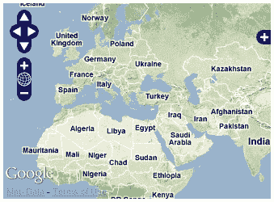
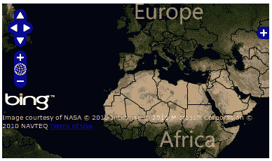
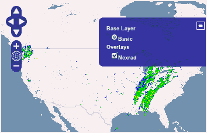
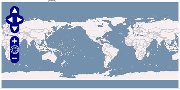
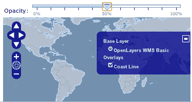
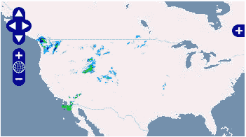

# 第二章：添加栅格图层

在本章中，我们将介绍以下内容：

+   使用 Google Maps 图像

+   使用 Bing 图像

+   添加 WMS 图层

+   包装日期线选项

+   改变缩放效果

+   改变图层不透明度

+   使用单瓦片模式的 WMS

+   缓存图层数据以改善地图导航

+   创建图像图层

+   在 WMS 图层中设置瓦片大小

# 简介

本章主要介绍如何处理栅格图层。我们试图通过一系列的食谱，总结出在日常工作使用 OpenLayers 时最常见和重要的用例。

图像是在 GIS 系统中处理的最重要类型的数据之一。

OpenLayers 提供了几个类来与不同的图像提供商集成，从专有提供商如 Google Maps 和 Bing Maps，到开源的如 OpenStreetMap，甚至是任何 WMS 服务提供商。

任何图层类型的基类是 `OpenLayers.Layer` 类，它提供了一套通用属性并定义了其他任何类的通用行为。

此外，许多图层继承自 `OpenLayers.Layer.Grid` 类，它将图层划分为不同的缩放级别。这样，每个缩放级别覆盖相同的区域，但使用更大的瓦片集。例如，在零级，一个瓦片覆盖整个世界；在一级，四个瓦片覆盖整个世界，以此类推。正如我们所看到的，在每个级别上，瓦片的数量和它们的分辨率都会增加。

本章介绍了如何使用栅格图层，特别关注 WMS 图层，以及如何管理最常用的属性。

# 使用 Google Maps 图像

Google Maps 可能是全球最知名的网页地图应用。他们的瓦片层图像方式为人们所熟知；他们习惯了其图层风格，因此你可能对在自己的网络地图项目中使用它们感兴趣。



OpenLayers 使用 `OpenLayers.Layer.Google` 类，实际上是在 Google Maps API 上的包装代码，允许我们在 OpenLayers API 中以统一的方式使用 Google Maps 瓦片。

### 注意

不要混淆 Google Maps API 和 Google Maps 图像。Google Maps API 是一组 JavaScript 代码，可免费使用，而访问 Google Maps 图像则有一些使用限制，并且根据访问次数，可能需要支付一定的费用。

## 如何做到...

要使用 Google Maps 图像，请执行以下步骤：

1.  创建一个 HTML 文件并添加 OpenLayers 依赖项。

1.  按如下方式包含 Google Maps API：

    ```js
    <script type="text/javascript" src="img/js?v=3.5&sensor=false"></script>

    ```

1.  添加一个 `div` 元素来包含地图，如下所示：

    ```js
    <!-- Map DOM element -->
    <div id="ch2_google" style="width: 100%; height: 100%;"></div>

    ```

1.  在 `script` 元素内，添加创建地图实例并添加图层切换控件的相关代码，如下所示：

    ```js
    <!-- The magic comes here --> 
    <script type="text/javascript"> 

        // Create the map using the specified DOM element 
        var map = new OpenLayers.Map("ch2_google"); 
        map.addControl(new OpenLayers.Control.LayerSwitcher()); 

    ```

1.  创建一些基于 Google 的地图，并添加如下：

    ```js
        var streets = new OpenLayers.Layer.Google("Google Streets", { 
            numZoomLevels: 20 
        }); 
        var physical = new OpenLayers.Layer.Google("Google Physical", { 
            type: google.maps.MapTypeId.TERRAIN 
        }); 
        var hybrid = new OpenLayers.Layer.Google("Google Hybrid", { 
            type: google.maps.MapTypeId.HYBRID, numZoomLevels: 20 
        }); 
        var satellite = new OpenLayers.Layer.Google("Google Satellite", { 
            type: google.maps.MapTypeId.SATELLITE, numZoomLevels: 22 
        }); 
        map.addLayers([physical, streets, hybrid, satellite]); 

    ```

1.  最后，将地图中心定位在所需位置，如下所示：

    ```js
        map.setCenter(new OpenLayers.LonLat(0, 0), 2); 
    </script>

    ```

### 它是如何工作的...

如你所见，代码有三个主要部分。首先我们放置了一个`div`元素，它将被用作地图，如下所示：

```js
<div id="ch2_google" style="width: 100%; height: 100%;"></div>

```

接下来，我们包含了 Google Maps API 代码，如下所示：

```js
<script type="text/javascript" src="img/js?v=3.5&sensor=false"></script>

```

### 注意

记住，OpenLayers 仅仅是一个包装器，因此我们需要在我们的应用程序中使用真实的 Google Maps API 代码。

在`<script type="text/javascript"> </script>`元素中，我们添加了初始化地图和添加图层切换控件所需的代码，如下所示：

```js
    var map = new OpenLayers.Map("ch2_google"); 
    map.addControl(new OpenLayers.Control.LayerSwitcher()); 

```

最后，我们添加了一些知名的 Google Maps 图层，并居中地图的视口，如下所示：

```js
    var streets = new OpenLayers.Layer.Google("Google Streets", { 
        numZoomLevels: 20 
    }); 
    var physical = new OpenLayers.Layer.Google("Google Physical", { 
        type: google.maps.MapTypeId.TERRAIN 
    }); 
    var hybrid = new OpenLayers.Layer.Google("Google Hybrid", { 
        type: google.maps.MapTypeId.HYBRID, numZoomLevels: 20 
    }); 
    var satellite = new OpenLayers.Layer.Google("Google Satellite", { 
        type: google.maps.MapTypeId.SATELLITE, numZoomLevels: 22 
    }); 
    map.addLayers([physical, streets, hybrid, satellite]); 
    map.setCenter(new OpenLayers.LonLat(0, 0), 2); 

```

图层的类型由 Google Maps API 类`google.maps.MapTypeId`定义，你可以在[`code.google.com/apis/maps/documentation/javascript/reference.html#MapTypeId`](http://code.google.com/apis/maps/documentation/javascript/reference.html#MapTypeId)找到。

### 注意

注意，我们正在使用两个 API，OpenLayers 和 Google Maps API，因此查看 Google Maps API 以更好地了解其功能会是个不错的选择。

文档可以在[`developers.google.com/maps/documentation/javascript/tutorial`](http://https://developers.google.com/maps/documentation/javascript/tutorial)找到。

### 还有更多...

在这个配方中，我们展示了如何使用 Google Maps API 版本 3 将 Google 影像添加到你的 OpenLayers 项目中。

对于之前的版本 2，Google 要求你注册为用户并获取一个 API 密钥，你需要使用这个密钥来初始化`OpenLayers.Layer.Google`实例。这个密钥随后在每次瓦片请求中都会使用，以识别你，这样 Google 就能了解你的使用情况。

正如你所见，版本 3 在 OpenLayers 中使用起来要简单得多。

### 参见

+   *添加 WMS 图层*配方

+   *使用 Bing 影像*配方

+   *在第一章的*“理解基本和非基本图层”配方中，*网络制图基础*

# 使用 Bing 影像

Bing Maps，之前被称为 Virtual Earth，是由微软提供的地图服务。

与 Google Maps 一样，OpenLayers 提供了一个`OpenLayers.Layer.Bing`类，这为我们带来了在项目中添加 Bing 影像的可能性。



## 准备工作

Bing Maps 要求你注册为消费者用户。一旦注册，你将获得一个 API 密钥，用于初始化`OpenLayers.Layer.Bing`图层，并且这个密钥将在每次请求中使用以验证你的 Bing Maps 服务身份。

与 Google Maps 相反，Bing 不需要任何 JavaScript 代码，`OpenLayers.Layer.Bing`类也不作为包装器。Bing Maps 提供了一个 REST 服务，可以直接使用你的 API 密钥访问瓦片。

### 注意

你可以在[`msdn.microsoft.com/en-us/library/ff428642.aspx`](http://msdn.microsoft.com/en-us/library/ff428642.aspx)了解如何注册为用户。

此外，你还可以在[`msdn.microsoft.com/en-us/library/ff701713.aspx`](http://msdn.microsoft.com/en-us/library/ff701713.aspx)了解 Bing Maps REST 服务。

到目前为止，假设您有一个 API 密钥，将在下一部分代码中使用。

## 如何做到这一点...

在本节中，我们将看到如何使用 Bing 影像。要使用 Bing 影像，请执行以下步骤：

1.  创建一个 HTML 文件并添加 OpenLayers 依赖项。

1.  添加一个`DOM`元素来放置地图，如下所示：

    ```js
    <div id="ch2_bing" style="width: 100%; height: 100%;"></div>

    ```

1.  在一个`script`元素中创建地图实例并添加一个图层切换器控件，如下所示：

    ```js
    <script type="text/javascript"> 
        // Create the map using the specified DOM element 
        var map = new OpenLayers.Map("ch2_bing"); 
        map.addControl(new OpenLayers.Control.LayerSwitcher()); 

    ```

1.  创建一些 Bing 图层，添加到地图中并居中地图的视口，如下所示：

    ```js
        var bingApiKey = "your_bing_API_must_be_put_here"; 
        var road = new OpenLayers.Layer.Bing({ 
            name: "Road", 
            type: "Road", 
            key: bingApiKey 
        }); 
        var hybrid = new OpenLayers.Layer.Bing({ 
            name: "Hybrid",        
            type: "AerialWithLabels", 
            key: bingApiKey 
        }); 
        var aerial = new OpenLayers.Layer.Bing({ 
            name: "Aerial", 
            type: "Aerial", 
            key: bingApiKey 
        }); 
        map.addLayers([road, hybrid, aerial]); 

        map.setCenter(new OpenLayers.LonLat(0, 0), 2); 
    </script>

    ```

### 它是如何工作的...

在这个食谱中，我们需要考虑的主要点是我们在使用 Microsoft 服务。我们使用我们的 API 密钥请求一个 URL 并获取一个瓦片。因此，每个 Bing 图层在实例化时都必须包含一个`key`参数，如下所示：

```js
var bingApiKey = "your_bing_API_must_be_put_here"; 
var road = new OpenLayers.Layer.Bing({ 
    name: "Road", 
    type: "Road", 
    key: bingApiKey 
}); 

```

我们知道`name`参数在所有图层中都是通用的。`name`参数用于为图层添加一个描述性名称，它将被切换器控件使用。

如前所述，`key`参数在每次瓦片请求中使用，并标识我们为注册的 Bing 消费者用户。

`type`参数是必要的，用于指定我们想要从 Bing Maps 获取的瓦片类型。Bing 提供了道路、航空或带有标签的航空等多种类型。

### 注意

您可以在[`msdn.microsoft.com/en-us/library/ff701716.aspx`](http://msdn.microsoft.com/en-us/library/ff701716.aspx)找到有关 Bing Maps 图层类型的更多信息。

### 参见

+   **使用 Google Maps 影像**的食谱

+   **添加 WMS 图层**的食谱

+   在第一章的*理解基本图层和非基本图层*食谱中，*网络制图基础*

# 添加 WMS 图层

**Web Map Service (WMS**) 是由**开放地理空间联盟 (OGC**) 开发的一个标准，由许多地理空间服务器实现，其中我们可以找到免费和开源项目 GeoServer ([`geoserver.org`](http://geoserver.org)) 和 MapServer ([`mapserver.org`](http://mapserver.org))。有关 WMS 的更多信息，可以在[`en.wikipedia.org/wiki/Web_Map_Service`](http://en.wikipedia.org/wiki/Web_Map_Service)找到。

作为一个非常基本的总结，您可以将 WMS 服务器理解为一个正常的 HTTP 网络服务器，它接受带有一些 GIS 相关参数（如投影、边界框等）的请求，并返回类似于以下截图的地图。



### 注意

我们将使用远程 WMS 服务器，因此您不需要安装一个。作为建议，请注意，我们不对这些服务器负责，它们可能存在问题，或者您阅读本节时可能不可用。

可以使用任何其他 WMS 服务器，但必须知道 URL 和图层名称。

## 如何做到这一点...

要添加 WMS 图层，请执行以下步骤：

1.  创建一个 HTML 文件并添加 OpenLayers 依赖项。

1.  添加一个`div`元素来容纳地图，如下所示：

    ```js
    <div id="ch2_wms_layer" style="width: 100%; height: 100%;"></div>

    ```

1.  按以下方式创建地图实例：

    ```js
    // Create the map using the specified DOM element
    var map = new OpenLayers.Map("ch2_wms_layer");

    ```

1.  现在，添加两个 WMS 图层。第一个将是基本图层，第二个将是叠加图层，如下所示：

    ```js
    // Add a WMS layer 
    var wms = new OpenLayers.Layer.WMS("Basic", "http://vmap0.tiles.osgeo.org/wms/vmap0", 
    { 
        layers: 'basic' 
    }); 

    // Add Nexrad WMS layer 
    var nexrad = new OpenLayers.Layer.WMS("Nexrad", "http://mesonet.agron.iastate.edu/cgi-bin/wms/nexrad/n0r.cgi", 
    { 
        layers: "nexrad-n0r", 
        transparent: "true", 
        format: 'image/png' 
    }, 
    { 
        isBaseLayer: false 
    }); 

    map.addLayers([wms, nexrad]); 

    ```

1.  最后，我们添加了一个图层切换控件并居中视图，如下所示：

    ```js
    // Add layer switcher control 
    map.addControl(new OpenLayers.Control.LayerSwitcher()); 
    // Set the center of the view 
    map.setCenter(new OpenLayers.LonLat(-90,40), 4);

    ```

### 它是如何工作的...

`OpenLayers.Layer.WMS`类构造函数需要四个参数来实例化（实际上第四个是可选的），它们是：

```js
new OpenLayers.Layer.WMS(name, url, params, options)

```

参数如下：

+   `name`对所有层都是通用的，并用作用户友好的描述

+   `url`是一个字符串，必须指向 WMS 服务器

+   `params`参数是一个对象，可以包含 WMS 请求中使用的任何参数：层、格式、样式等

### 注意

检查 WMS 标准以了解你可以在`params`中使用哪些参数。

层的使用是强制性的，所以你总是需要指定这个值。此外，如果你使用 SRS WMS 请求参数，请注意它总是被忽略，因为它来自基础层的投影或地图的投影。

+   `options`参数是一个可选的对象，它包含用于图层对象的特定属性：`opacity`、`isBaseLayer`等

在这个配方中，我们添加了一个基础层，如下所示：

```js
var wms = new OpenLayers.Layer.WMS("Basic", "http://vmap0.tiles.osgeo.org/wms/vmap0", 
{ 
    layers: 'basic' 
}); 

```

它使用了`name`、`url`和`params`参数，表明`basic`是唯一需要请求的图层。

之后，我们在爱荷华州立大学的服务器上添加了一个带有 NEXRAD（[`en.wikipedia.org/wiki/NEXRAD`](http://en.wikipedia.org/wiki/NEXRAD)）气象雷达信息的第二层叠加（你可以在[`mesonet.agron.iastate.edu/ogc)`](http://mesonet.agron.iastate.edu/ogc)找到更多信息），如下所示：

```js
var nexrad = new OpenLayers.Layer.WMS("Nexrad", "http://mesonet.agron.iastate.edu/cgi-bin/wms/nexrad/n0r.cgi", 
{ 
    layers: "nexrad-n0r", 
    transparent: "true", 
    format: 'image/png' 
}, 
{ 
    isBaseLayer: false 
}); 

```

在这种情况下，除了`layers`参数外，我们还使用了`transparent`和`format`参数。

`format`参数用于 WMS 请求中，以指定我们希望以什么图像格式接收图像。

`transparent`属性设置为`true`。如果没有设置，我们会得到带有一些彩色雷达数据的白色瓦片，这将隐藏底层。使用`transparent: "false"`进行测试。

对于这个图层，我们还设置了图层参数`isBaseLayer`为`false`，以表示我们希望它作为叠加层使用。

### 还有更多...

WMS 服务器无论我们请求的边界框中是否有信息都会返回图像。

之前提到的 Nexrad WMS 层，显示带有白色背景的瓦片图像并不理想，因此我们使用了`transparent`参数来解决这个问题。

当你将`transparent`参数设置为`true`时，无论你指定什么格式，WMS 类都会确保使用`format image/png`或`image/gif`进行请求，以保证那些没有数据的像素的透明度。

最后，请记住我们可以在请求中传递任何由 WMS 标准定义的参数，只需在`params`参数中指定它们即可。

### 参见

+   *使用谷歌地图影像*配方

+   *使用单瓦片模式的 WMS*配方

+   *更改图层不透明度*配方

+   *缓冲层数据以改善地图导航*配方

# 包装日期线选项

可能会有这样的情况，你不希望你的地图在-180 或+180 经度度结束，因为你正在该区域工作，需要一个连续的地图。例如，想象一个地图，在左边你可以看到俄罗斯的尽头，在右边是阿拉斯加，如下面的截图所示：



这个属性是基类`OpenLayers.Layer`的一个常见属性，称为`wrapDateLine`。

## 如何做到这一点...

要包裹日期线选项，执行以下步骤：

1.  创建一个 HTML 文件并添加 OpenLayers 依赖项。

1.  在开始时，我们放置了一个复选框来激活/停用包裹数据线功能，如下所示：

    ### 注意

    不要担心`dojoType="dijit.form.CheckBox"`属性，因为它是因为在示例中使用了 Dojo Toolkit ([`dojotoolkit.org`](http://dojotoolkit.org))。

    想象它就像一个普通的 HTML 输入元素。

1.  接下来，我们添加了用于渲染地图的`DOM`元素，如下所示：

    ```js
    <div id="ch2_wrapdataline" style="width: 100%; height: 100%;"></div>

    ```

1.  在`script`元素内创建地图实例，如下所示：

    ```js
    <script type="text/javascript">
        // Create the map using the specified DOM element
        var map = new OpenLayers.Map("ch2_wrapdataline");

    ```

1.  现在，创建一个指定`wrapDateLine`属性的 WMS 图层，如下所示：

    ```js
        // Add a WMS layer
        var wms = new OpenLayers.Layer.WMS("OpenLayers WMS Basic", "http://labs.metacarta.com/wms/vmap0",
        {
            layers: 'basic'
        },
        {
            wrapDateLine: true
        });
        map.addLayer(wms);   

        // Center map view
        map.setCenter(new OpenLayers.LonLat(-110,0), 2);

    ```

1.  最后，实现一个将更改`wrapDateLine`属性值的函数，如下所示：

    ```js
        function wrapDateLine(checked) {
            wms.wrapDateLine = checked;
            wms.redraw();
        }
    </script>

    ```

### 它是如何工作的...

这个菜谱的所有魔法都藏在`OpenLayers.Layer`类中的`wrapDateLine`属性里。你需要将其设置为`true`，以便在它们的经度轴上包裹并创建一个连续的图层。

此外，我们创建了一个函数，它会根据复选框的变化来激活/停用`wrapDateLine`属性，如下面的代码所示：

```js
    function wrapDateLine(checked) {
        wms.wrapDateLine = checked;
        wms.redraw();
    }

```

注意，在更改属性值后，我们需要重新绘制图层，以便它生效。这是通过从`OpenLayers.Layer`基类继承的`redraw()`方法完成的。

`wrapDateLine`属性不是地图的属性，而是每个图层的属性；所以如果你想整个地图都有相同的行为，你需要在所有图层中将其设置为`true`。

### 参见

+   *添加 WMS 图层*菜谱

+   *使用单瓦片模式的 WMS*菜谱

# 改变缩放效果

平移和缩放效果是与用户导航体验非常相关的关键动作。

在第一章，*网络制图基础*中，菜谱*在地图视图中移动*展示了如何控制并创建地图平移的方式。

以同样的方式，你可以控制图层之间两个缩放级别之间的过渡效果。

`OpenLayers.Layer`类有一个`transitionEffect`属性，它决定了在缩放级别改变时应用于图层的效果。目前只允许两个值：`null`和`resize`。

`null`值表示不会应用过渡效果，因为当你更改缩放级别时，你可能会看到图层消失，直到新缩放级别的瓦片加载完成。

当我们放大到某个级别时，`resize`值会使当前瓦片调整大小，以适应新的缩放，直到新级别的瓦片在后台加载。这样图像总是可见的，我们避免了看到空白地图几秒钟的丑陋效果。

## 如何操作...

要更改缩放级别，执行以下步骤：

1.  创建一个 HTML 文件并包含所需的 OpenLayers 依赖项。

1.  对于这个菜谱，我们将添加一个复选框按钮，允许我们在单个图层之间切换过渡效果，如下所示：

    ```js
    Transition effect: <input dojoType="dijit.form.CheckBox" checked onChange="transitionEffect" /> Resize

    ```

1.  接下来，添加`div`元素，如下所示，它包含地图：

    ```js
    <!-- Map DOM element -->
    <div id="ch2_transition_effect" style="width: 100%; height: 100%;"></div>

    ```

1.  添加初始化地图并创建一个 WMS 图层的 JavaScript 代码，如下所示：

    ```js
    <!-- The magic comes here -->
    <script type="text/javascript">

        // Create the map using the specified DOM element
        var map = new OpenLayers.Map("ch2_transition_effect");

        // Add a WMS layer
        var wms = new OpenLayers.Layer.WMS("OpenLayers WMS Basic", "http://vmap0.tiles.osgeo.org/wms/vmap0",
        {
            layers: 'basic'
        },
        {
            wrapDateLine: true,
            transitionEffect: 'resize'
        });
        map.addLayer(wms);   

        // Center map view
        map.setCenter(new OpenLayers.LonLat(0,0), 3);

    ```

1.  最后，放置一个切换`transitionEffect`属性值的函数，如下所示：

    ```js
        function transitionEffect(checked) {
            if(checked) {
                wms.transitionEffect = 'resize';
            } else {
                wms.transitionEffect = null;
            }
        }
    </script>

    ```

### 它是如何工作的...

如菜谱开头所述，所有魔法都集中在`transitionEffect`属性上。

由于该属性是针对图层而不是`OpenLayers.Map`属性，如果你想将相同的效果应用于整个地图，你需要将其设置在其所有包含的图层上。

### 更多...

一个或多个`OpenLayers.Tile.Image` 形成一个栅格图层，因此当它被渲染时，绘制瓦片的实际工作由瓦片本身简化。

虽然`transitionEffect`是在`OpenLayers.Layer`类（或其子类）中定义的，但每个单独的瓦片负责绘制过渡效果。

如果你计划创建一个新的缩放过渡效果，你还需要查看`OpenLayers.Tile.Image`的代码。

### 参见

+   *添加 WMS 图层* 菜谱

+   *更改图层不透明度* 菜谱

+   *使用单瓦片模式 WMS* 菜谱

# 更改图层不透明度

当你与许多图层（包括栅格和矢量图层）一起工作时，你可能会遇到一个图层在另一个图层之上，从而隐藏了下面的图层的情况。这在没有将`transparent`属性设置为`true`的栅格 WMS 图层（如 OpenStreetMaps、Google 和 Bing）或瓦片图层时更为常见。以下截图中的图层不透明度设置为**50%**：



`OpenLayers.Layer` 基类有一个`opacity`属性，由具体的子类实现，允许我们修改图层的透明度。它是一个浮点值，范围从`0.0`（完全透明）到`1.0`（完全不透明）。

## 如何操作...

可以更改图层的不透明度。要更改图层的不透明度，请执行以下步骤：

1.  创建一个 HTML 文件并添加所需的 OpenLayers 依赖项。

    ### 注意

    我们有意省略了用于滑块控制的 HTML 代码。在这里，我们专注于 OpenLayers 的代码。如果你对滑块的代码感兴趣，可以在菜谱的源代码中找到。

1.  添加一个`div`元素来包含地图，如下所示：

    ```js
    <div id="ch2_opacity" style="width: 100%; height: 100%;"></div>

    ```

1.  接下来，创建一个地图实例并添加两个图层，如下所示：

    ```js
    // Create the map using the specified DOM element 
    var map = new OpenLayers.Map("ch2_opacity"); 

    // Add a WMS layer 
    var wms = new OpenLayers.Layer.WMS("OpenLayers WMS Basic", "http://vmap0.tiles.osgeo.org/wms/vmap0", 
    { 
        layers: 'basic' 
    }); 
    map.addLayer(wms);  

    // Add coast line layer 
    var wms2 = new OpenLayers.Layer.WMS("Coast Line", "http:// vmap0.tiles.osgeo.org/wms/vmap0", 
    { 
        layers: 'coastline_01,coastline_02' 
    }, 
    { 
        isBaseLayer: false 
    }); 
    map.addLayer(wms2); 

    ```

1.  添加一个图层切换控件并居中地图的视口，如下所示：

    ```js
    map.addControl(new OpenLayers.Control.LayerSwitcher()); 

    // Center map view 
    map.setCenter(new OpenLayers.LonLat(0,0), 3);

    ```

1.  最后，实现一个函数，该函数接收滑动控制器的更改并更改图层的不透明度，如下所示：

    ```js
    function opacity(value) { 
        wms2.setOpacity(value/100); 
    }

    ```

### 它是如何工作的...

正如我们评论的那样，`opacity` 属性是这个菜谱的关键，修改它的方式不是直接更改属性值，而是使用 `setOpacity()` 方法。

`setOpacity()` 方法负责修改 `opacity` 属性，除了修改任何 `DOM` 元素（例如，瓦片的图像）外，还会发出一个 `changelayer` 事件，通知任何感兴趣的监听器有关图层更改的通知。

### 参见

+   *包裹日期线选项*菜谱

+   在第一章的*理解基本和非基本图层*菜谱中，*网络制图基础*

+   *添加 WMS 图层*菜谱

+   *缓冲图层数据以改善地图导航*菜谱

# 使用单瓦片模式的 WMS

**Web Map Service (WMS)** 是一个用于提供地理参考地图图像的协议。

基本思想是，给定一个边界框和一些其他参数，例如图层名称，客户端向 WMS 服务器发送一个 HTTP 请求，服务器计算并返回一个包含指定图层和指定边界框内所有数据的图像。

在 OpenLayers 中，当你将 WMS 图层添加到地图中时，`OpenLayers.Layer.WMS` 实例会提供一些参数，例如分辨率和瓦片大小。WMS 服务器会计算每个缩放级别的正确瓦片数量，并将图层分成这么多瓦片。

这样，当你将 WMS 图层添加到地图中时，不仅只有一个请求发送到服务器，而且每个瓦片都会发送一个请求，以形成当前缩放级别的瓦片。

### 注意

当配置了缓存系统时，从服务器端的角度来看，将 WMS 图层分成瓦片可能更好。这样瓦片只生成一次，然后多次提供服务。

如果你有多于一个使用指向同一 WMS 服务器的 WMS 图层的网络制图应用程序，所有瓦片都可以从缓存中提供，这将大大减少服务器的负载。

将图层分成瓦片不是唯一与 WMS 图层一起工作的方式；如果需要，你可以使用所谓的单瓦片模式。

在这种模式下，只使用一张图像来覆盖整个视图——地图的边界框，而不是使用瓦片模式所需的多个瓦片。

每次图层必须刷新（当你移动地图或更改缩放级别时），就会向 WMS 服务器发送一个请求，请求新地图边界框的数据。

正如你所见，在单瓦片模式下，对服务器的请求次数远少于瓦片模式。相比之下，在瓦片模式下，每个瓦片请求很容易缓存，因为每个缩放级别的瓦片边界框是固定的；而在单瓦片模式下，每个请求通常与其他请求略有不同（因为边界框有细微的变化）并且会导致对 WMS 服务器的请求，从而产生相应的计算时间。

## 如何实现...

按照以下步骤使用 WMS 的单瓦片模式：

1.  创建一个 HTML 文件并添加 OpenLayers 依赖项。

1.  现在，我们将创建两个并排的地图，每个地图都包含一个 WMS 图层，如下所示：

    ```js
    <table style="width: 100%; height: 95%;"> 
        <tr> 
            <td style="width: 50%;"> 
                <p>WMS layer:</p> 
                <div id="ch02_wms_non_singleTile" style="width: 100%; height: 100%;"></div> 
            </td> 
            <td style="width: 50%;"> 
                <p>WMS using <em>singleTile</em> property:</p> 
                <div id="ch02_wms_singleTile" style="width: 100%; height: 100%;"></div> 
            </td> 
        </tr> 
    </table>

    ```

1.  接下来，编写所需的 JavaScript 代码以初始化两个地图。第一个将包含一个正常的 WMS 图层，如下所示：

    ```js
    <script type="text/javascript"> 

        // Create the map using the specified DOM element 
        var map_a = new OpenLayers.Map("ch02_wms_non_singleTile");    

        // Add a WMS layer 
        var wms = new OpenLayers.Layer.WMS("Basic", "http://vmap0.tiles.osgeo.org/wms/vmap0", 
        { 
            layers: 'basic' 
        }); 
        map_a.addLayer(wms); 

        // Set the center of the view 
        map_a.setCenter(new OpenLayers.LonLat(-90,0), 2);

    ```

1.  第二个地图将包含一个指向同一服务器但在单瓦片模式下工作的 WMS 图层，如下所示：

    ```js
        // Create the map using the specified DOM element 
        var map_b = new OpenLayers.Map("ch02_wms_singleTile");    

        // Add a WMS layer 
        var wms = new OpenLayers.Layer.WMS("Basic", "http:// vmap0.tiles.osgeo.org/wms/vmap0", 
        { 
            layers: 'basic' 
        }, 
        { 
            singleTile: true 
        }); 
        map_b.addLayer(wms); 

        // Set the center of the view 
        map_b.setCenter(new OpenLayers.LonLat(-90,0), 2); 
    </script>

    ```

### 它是如何工作的...

菜单代码相当简单。开头冗长的解释，即 WMS 图层如何在单瓦片模式下工作，实际上只需使用`OpenLayers.Layer`类的`singleTile`属性即可实现。拖动或缩放地图以查看其工作方式的不同。

### 参见

+   *缓存图层数据以改善地图导航*菜谱

+   *添加 WMS 图层*菜谱

+   *更改图层不透明度*菜谱

# 缓存图层数据以改善地图导航

地图导航是改善用户体验的重要因素。

当我们平移地图时，很多时候我们会看到空白区域（表示内容正在加载），几秒钟后图像出现。

在栅格图层和在单瓦片模式下工作的 WMS 图层上，我们可以通过增加请求次数或增加服务器端的计算时间来改善这一点。

### 注意

大多数栅格图层都继承自基类`OpenLayers.Layer.Grid`，该类负责将每个缩放级别划分为瓦片。

对于在单瓦片模式下工作的 WMS 图层，网格仅由一个瓦片组成，该瓦片填充整个地图视图。

改善地图导航背后的想法很简单；在用户在地图视图中平移之前加载瓦片，以便它们在用户平移地图视图之前加载。

本菜谱向您展示了如何为栅格图层和在单瓦片模式下工作的 WMS 图层预加载内容，以便您可以改善用户的导航体验。

## 如何操作...

1.  创建一个 HTML 文件并包含 OpenLayers 依赖项。

1.  我们将创建两个并排的地图，并在每个地图上方添加一个旋转控件，该控件来自 Dojo Toolkit 框架（[`dojotoolkit.org`](http://dojotoolkit.org)），用于控制`buffer`和`singleTile`属性值：

    ```js
    <table style="width: 100%; height: 95%;"> 
        <tr> 
            <td style="width: 50%;"> 
                <p> 
                    WMS layer with <em>buffer</em>: <input id="buffer_a" dojoType="dijit.form.NumberSpinner" onChange="changeBufferA" 
                                                           intermediateChanges="true" style="width:100px" value="0" smallDelta="1" constraints="{min:0,max:5}" /> 
                </p> 
                <div id="ch02_wms_buffer" style="width: 100%; height: 100%;"></div> 
            </td> 
            <td style="width: 50%;"> 
                <p> 
                    WMS using <em>singleTile</em> property and <em>ratio</em>: <input id="buffer_b" dojoType="dijit.form.NumberSpinner" onChange="changeBufferB" 
                                                                                      intermediateChanges="true" style="width:100px" value="1.0" smallDelta="0.1" constraints="{min:0.0,max:2.0}" /> 
                </p> 
                <div id="ch02_wms_ratio" style="width: 100%; height: 100%;"></div> 
            </td> 
        </tr> 
    </table>

    ```

1.  左侧面板将展示如何控制可以加载到地图视图之外瓦片数量：

    ```js
    <script type="text/javascript"> 
        // Create the map using the specified DOM element 
        var map_a = new OpenLayers.Map("ch02_wms_buffer");    

        // Add a WMS layer 
        var wms_a = new OpenLayers.Layer.WMS("Basic", "http://vmap0.tiles.osgeo.org/wms/vmap0", 
        { 
            layers: 'basic' 
        }, 
        { 
            buffer: 0 
        }); 
        map_a.addLayer(wms_a); 

        // Set the center of the view 
        map_a.setCenter(new OpenLayers.LonLat(-90,0), 3);

    ```

1.  右侧面板显示了如何控制在单瓦片模式下工作的 WMS 图层中可以预加载的数据量。

    ```js
        // Create the map using the specified DOM element 
        var map_b = new OpenLayers.Map("ch02_wms_ratio");    

        // Add a WMS layer 
        var wms_b = new OpenLayers.Layer.WMS("Basic", "http://vmap0.tiles.osgeo.org/wms/vmap0", 
        { 
            layers: 'basic' 
        }, 
        { 
            singleTile: true, 
            ratio: 1 
        }); 
        map_b.addLayer(wms_b); 

        // Set the center of the view 
        map_b.setCenter(new OpenLayers.LonLat(-90,0), 3);

    ```

1.  最后，以下是负责在旋转控件上更改代码的代码，如下所示：

    ```js
        // Handle events 
        function changeBufferA(value) { 
            wms_a.addOptions({buffer: value}); 
        } 
        function changeBufferB(value) { 
            map_b.removeLayer(wms_b); 
            wms_b.destroy(); 
            wms_b = new OpenLayers.Layer.WMS("Basic", "http:// vmap0.tiles.osgeo.org/wms/vmap0", 
            { 
                layers: 'basic' 
            }, 
            { 
                singleTile: true, 
                ratio: value 
            }); 
            map_b.addLayer(wms_b); 
        } 
    </script>

    ```

### 它是如何工作的...

左侧地图包含一个在默认瓦片模式下工作的 WMS 图层。在此模式下，基类`OpenLayers.Layer.Grid`中的`buffer`属性指定了必须加载到地图视图之外的瓦片数量。

当用户更改`buffer`属性的旋转控件值时，我们只需使用以下代码行更新它：

```js
    function changeBufferA(value) { 
        wms_a.addOptions({buffer: value}); 
    } 

```

右侧的地图另一方面有一个在单瓦片模式下工作的 WMS 图层（见 `singleTile` 属性设置为 `true`）。在这种模式下，只发出一个请求来获取图像，该图像填充整个地图视图。

我们可以通过 `ratio` 属性来控制图像的大小，该属性属于 `OpenLayers.Layer.WMS` 类。值为 1.0 的比率意味着图像具有与地图视图精确尺寸相同的尺寸。默认的比率值是 1.5，这意味着我们请求的图像尺寸是地图视图尺寸加上一半。

在这种情况下，比率值在创建图层时设置一次，要更新它，我们需要删除之前的图层并使用新值创建一个新的图层。这如下所示：

```js
    function changeBufferB(value) { 
        map_b.removeLayer(wms_b); 
        wms_b.destroy(); 
        wms_b = new OpenLayers.Layer.WMS("Basic", "http://vmap0.tiles.osgeo.org/wms/vmap0", 
        { 
            layers: 'basic' 
        }, 
        { 
            singleTile: true, 
            ratio: value 
        }); 
        map_b.addLayer(wms_b); 
    } 

```

### 注意

我们首先从地图中删除图层，然后调用 `destroy()` 方法来释放图层使用的内部资源，避免内存泄漏。

### 更多...

记住，我们加载的瓦片越多，对服务器的请求就越多。对于单瓦片模式的 WMS 图层也是如此；你请求的边界框越大，服务器上的计算时间就越长。

因此，过多地增加 `buffer` 或 `ratio` 值并不总是最佳解决方案。

考虑你的数据和用户如何探索它。如果你的数据更适合在扩展中探索——在同一缩放级别的一个大区域——那么一个一或两个像素的缓冲区可能是个好主意。如果你的数据主要被缩放，但用户对探索大区域不感兴趣，那么默认值就足够了。

### 参见

+   *使用单瓦片模式的 WMS* 菜单

+   *设置 WMS 图层中的瓦片大小* 菜单

+   *添加 WMS 图层* 菜单

# 创建图像图层

有时候，像 Google Maps、OpenStreetMap 或 WMS 这样的瓦片图层并不是你需要的。完全有可能你有一个地理参考图像，知道它的投影和边界框，并想在地图上渲染它。

在这些情况下，OpenLayers 提供了 `OpenLayers.Layer.Image` 类，允许我们基于简单图像创建图层。地理参考图像如下截图所示：



## 如何做...

要创建图像图层，执行以下步骤：

1.  让我们创建一个包含 OpenLayers 依赖项的 HTML 文件。

1.  首先，添加将包含地图的 `div` 元素，如下所示：

    ```js
    <!-- Map DOM element -->
    <div id="ch2_image" style="width: 100%; height: 100%;"></div>

    ```

1.  接下来，初始化地图并添加一个 WMS 基本图层，如下所示：

    ```js
    <!-- The magic comes here -->
    <script type="text/javascript">
        // Create the map using the specified DOM element
        var map = new OpenLayers.Map("ch2_image", {
            allOverlays: true
        });
        map.addControl(new OpenLayers.Control.LayerSwitcher());

        // Add WMs layer
        var wms = new OpenLayers.Layer.WMS("OpenLayers WMS Basic", "http://vmap0.tiles.osgeo.org/wms/vmap0",
        {
            layers: 'basic'
        });
        map.addLayer(wms);

    ```

1.  现在，定义图像 URL、其范围和大小，并按如下方式创建图像图层：

    ```js
        // Add an Image layer
        var img_url = "http://localhost:8080/openlayers-cookbook/data/nexrad.png";
        var img_extent = new OpenLayers.Bounds(-131.0888671875, 30.5419921875, -78.3544921875, 53.7451171875);
        var img_size = new OpenLayers.Size(780, 480);

        var image = new OpenLayers.Layer.Image("Image Layer", img_url, img_extent, img_size, {
            isBaseLayer: false,
            alwaysInRange: true // Necessary to always draw the image
        });
        map.addLayer(image);

        // Center the view
        map.setCenter(new OpenLayers.LonLat(-85, 40), 3);
    </script>

    ```

### 它是如何工作的...

`OpenLayers.Layer.Image` 类的构造函数需要五个参数，如下所示：

+   **name:** 这是图层的期望描述性名称

+   **url:** 这是图像的 URL

+   **extent:** 这是一个 `OpenLayers.Bounds` 类的实例，包含图像的边界框

+   **size:** 这是一个 `OpenLayers.Size` 的实例，包含图像的像素尺寸

+   **options:** 这表示一个包含图层不同选项的 JavaScript 对象

在这个菜谱中使用的图像之前是从 NEXRAD 获得的（见 [`mesonet.agron.iastate.edu/current/mcview.phtml`](http://mesonet.agron.iastate.edu/current/mcview.phtml)），因此我们知道它们的边界框的确切坐标。它们是：

```js
var img_extent = new OpenLayers.Bounds(-131.0888671875, 30.5419921875, -78.3544921875, 53.7451171875);

```

### 注意

重要提示：边界必须以与地图相同的投影表示，在这种情况下为 EPSG:4326。

我们还知道图像的大小（以像素为单位）：

```js
var img_size = new OpenLayers.Size(780, 480);

```

给定图像范围和大小，OpenLayers 计算适当的分辨率（将其视为缩放级别），在这些分辨率下必须显示图像。

在这种情况下，我们始终希望在地图上显示图像，无论我们处于哪个缩放级别，因此我们已将 `alwaysInRange` 属性设置为 `true`。

### 参见

+   *Adding WMS layer* 菜谱

+   使用单瓦片模式的 *Using WMS with single tile mode* 菜谱

+   *Buffering the layer data to improve the map navigation* 菜谱

# 在 WMS 图层中设置瓦片大小

`OpenLayers.Layer.Grid` 类是一种特殊的图层，它将图层划分为由瓦片网格组成的不同缩放级别的图层。

`OpenLayers.Layer.WMS` 类是前面类的子类，除了在单瓦片模式下工作外，它还可以在瓦片模式下工作。

当然，控制 WMS 请求的瓦片大小可以影响性能。默认情况下，瓦片大小为 256 x 256 像素，但我们可以将此设置为任何所需的值。更大的瓦片大小意味着对服务器的请求更少，但生成更大图像的计算时间更长。相反，较小的瓦片大小意味着对服务器的请求更多，计算较小图像的时间更少。

## 如何做到这一点...

要设置瓦片大小，请执行以下步骤：

1.  创建一个包含 OpenLayers 库依赖关系的 HTML 文件。

1.  添加一个 `div` 元素，该元素将包含地图，如下所示：

    ```js
    <!-- Map DOM element -->
    <div id="ch2_tilesize" style="width: 100%; height: 100%;"></div>

    ```

1.  接下来，初始化地图并添加两个图层，如下所示：

    ```js
    <!-- The magic comes here -->
    <script type="text/javascript">
        // Create the map using the specified DOM element
        var map = new OpenLayers.Map("ch2_tilesize", {
            allOverlays: true,
            tileSize: new OpenLayers.Size(256, 256)
        });
        map.addControl(new OpenLayers.Control.LayerSwitcher());

        // Add WMs layer
        var wms1 = new OpenLayers.Layer.WMS("OpenLayers WMS Basic", "http://vmap0.tiles.osgeo.org/wms/vmap0",
        {
            layers: 'basic'
        });
        map.addLayer(wms1);

    ```

1.  对于第二层，指定瓦片大小如下：

    ```js
        var wms2 = new OpenLayers.Layer.WMS("Coast Line", "http://vmap0.tiles.osgeo.org/wms/vmap0",
        {
            layers: 'coastline_01,coastline_02'
        },
        {
            tileSize: new OpenLayers.Size(512, 512),
            opacity: 0.65
        });
        map.addLayer(wms2); 

        // Center the view
        map.setCenter(new OpenLayers.LonLat(-85, 40), 3);
    </script>

    ```

### 它是如何工作的...

在这个菜谱中没有什么神秘之处。`tileSize` 属性对于 `OpenLayers.Map` 和 `OpenLayers.Layer.Grid` 子类都是可用的。

`tileSize` 必须是 `OpenLayers.Size` 类的实例，表示像素宽度和高度。

当在地图实例中设置瓦片大小时，所有图层都使用此值，除非您为每个单独的图层指定另一个值。

默认情况下，OpenLayers.Map 实例配置为使用 256 x 256 大小的瓦片。因此，第一层使用 256 x 256 像素的瓦片大小向 WMS 服务器发出请求。

另一方面，我们已为第二层指定了 512 x 512 的瓦片大小值，因此对 WMS 的请求是在等待 512 x 512 大小的瓦片。

### 还有更多...

对于瓦片服务，如 Google Maps 或 OpenStreetMap，`tileSize` 属性被简单地忽略，因为这些服务已经预先计算了固定 256 x 256 大小的图像。

瓦片大小值为 256 x 256 像素的原因是每个图像文件的大小（以字节为单位）对于带宽使用是最优的。

### 参见

+   *使用单瓦片模式的 WMS* 菜单

+   *缓冲层数据以改善地图导航* 菜单
