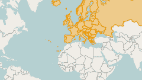
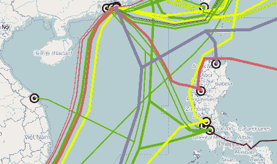
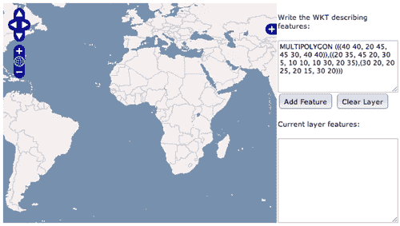
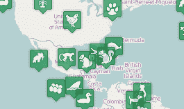
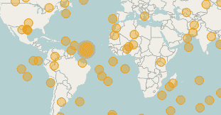
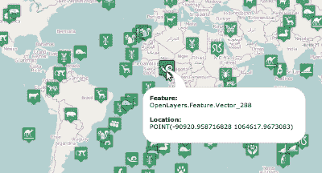
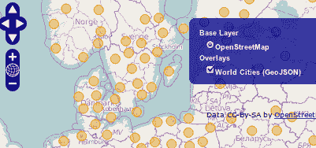
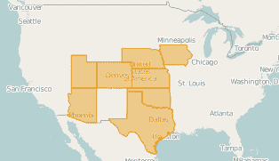
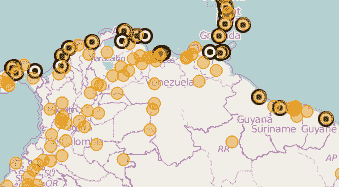

# 第三章.处理矢量图层

在本章中，我们将涵盖：

+   添加 GML 图层

+   添加 KML 图层

+   以编程方式创建特征

+   从 WKT 读取和创建特征

+   在地图上添加标记

+   使用点特征作为标记

+   处理弹出窗口

+   从 WFS 服务器添加特征

+   使用聚类策略

+   在 WFS 请求中过滤特征

+   直接使用协议读取特征

# 简介

本章讨论矢量图层。除了栅格信息外，矢量信息是我们在 GIS 系统中可以处理的其他重要信息类型。

本章试图总结您在 OpenLayers 中可能需要使用的一些最常见和重要的菜谱。

在 GIS 中，现实世界现象通过特征的概念来表示。它可以是一个地点——比如一个城市或村庄——它可以是道路或铁路，它可以是地区、湖泊、国家的边界或类似的东西。

每个特征都有一组属性：人口、长度等等。它通过几何符号进行视觉表示：点、线、多边形等等，使用一些视觉风格：颜色、半径、宽度等等。

如您所见，在处理矢量信息时需要考虑许多概念。幸运的是，OpenLayers 为我们提供了处理它们的类。我们将在本章中了解更多关于这些类的内容。

矢量图层的基础类是`OpenLayers.Layer.Vector`类，它定义了所有子类的公共属性和行为。

`OpenLayers.Layer.Vector`类包含一组特征。这些特征是`OpenLayers.Feature.Vector`子类的实例（实际上，它们是从更通用的`OpenLayers.Feature`类继承而来的）。

每个特征都有一个`attributes`属性和一个与它关联的`OpenLayers.Geometry`类实例。

矢量图层本身或每个特征都可以关联一个与之相关的视觉风格，该风格将用于在地图上渲染特征。

除了屏幕上的表示外，我们还需要考虑数据源。OpenLayers 提供类来从/向许多来源或协议读取/写入特征，并使用不同的格式：GML、KML、GeoJSON、GeoRSS 等等。

矢量图层可以可选地关联一个`OpenLayers.Protocol`类的实例和一个`OpenLayers.Strategy`类实例的列表。第一个负责使用某些协议（如 HTTP 或 WFS）读取/写入数据，而第二个（策略）负责控制诸如何时加载或刷新图层中的数据等任务：只加载一次，每次图层移动时，每隔几秒等等。

让我们开始，看看这些类是如何工作的。

# 添加 GML 图层

**地理标记语言（GML）**是一种用于表达地理特征的 XML 语法。它是一个 OGC 标准，并且被 GIS 社区广泛接受。



在这个菜谱中，我们将向您展示如何从 GML 文件创建矢量图层。

### 注意

您可以在 Packt Publishing 网站上找到此书的源代码中附加的 GML 格式文件。

## 如何做...

1.  创建一个包含所需 OpenLayers 依赖项的 HTML 文件，并插入以下代码。首先添加 `div` 元素来容纳地图：

    ```js
    <!-- Map DOM element --> 
    <div id="ch3_gml" style="width: 100%; 
        height: 100%;"></div> 

    ```

1.  接下来，添加初始化地图、添加基本层和图层切换控件所需的 JavaScript 代码：

    ```js
    <!-- The magic comes here --> 
    <script type="text/javascript"> 
        // Create the map using the specified DOM element 
        var map = new OpenLayers.Map("ch3_gml");    

        var layer = new 
            OpenLayers.Layer.OSM("OpenStreetMap"); 
        map.addLayer(layer); 

        map.addControl(new 
            OpenLayers.Control.LayerSwitcher()); 
        map.setCenter(new OpenLayers.LonLat(0,0), 2); 

    ```

1.  最后，添加一个带有 GML 数据的矢量层：

    ```js
        map.addLayer(new OpenLayers.Layer.Vector("Europe (GML)", { 
            protocol: new OpenLayers.Protocol.HTTP({ 
                url: "http://localhost:8080/
                    openlayers-cookbook/recipes/
                    data/europe.gml", 
                format: new OpenLayers.Format.GML() 
            }), 
            strategies: [new OpenLayers.Strategy.Fixed()] 
        })); 
    </script>

    ```

### 它是如何工作的...

在使用 `OpenLayers.Layer.Vector` 类之前，我们需要考虑一些方面。

如果我们需要从某个来源加载数据，那么我们需要设置一个协议和策略。在这种情况下，我们使用了一个固定的策略，通过 `OpenLayers.Strategy.Fixed` 类实例，这意味着数据内容只加载一次。它永远不会刷新或再次加载。

```js
new OpenLayers.Layer.Vector("Europe (GML)", { 
        protocol: new OpenLayers.Protocol.HTTP({ 
            url: "http://localhost:8080/openlayers-cookbook/recipes/data/europe.gml", 
            format: new OpenLayers.Format.GML() 
        }), 
        strategies: [new OpenLayers.Strategy.Fixed()] 
    })

```

要加载的数据可以通过 HTTP 协议和一个指向文件的 URL 访问。该协议作为 `OpenLayers.Protocol.HTTP` 类的一个实例，负责从指定的资源读取数据，并需要一个 URL 和一个格式来了解如何读取数据。

OpenLayers 提供了许多格式类来读取/写入数据，但在这个菜谱中，我们使用了 `OpenLayer.Format.GML` 实例，因为我们的数据源是一个 GML 文件。

### 参见

+   **添加 KML 层** 菜谱

+   **程序化创建要素** 菜谱

# 添加 KML 层

Google Maps 的到来导致 GIS 和网络制图领域的爆炸式增长。Google 不仅引入了一个 API，还引入了一些文件格式。

**关键孔标记语言 (KML**) 已成为最广泛使用的格式之一，最终它成为了一个 OGC 标准。



这个菜谱将向您展示如何轻松地从 KML 文件中添加要素。您可以在 Packt Publishing 网站上找到此书源代码中附加的 KML 格式文件。

## 如何做...

1.  创建一个包含 OpenLayers 库的 HTML 文件，并在其中插入以下代码。首先，添加将容纳地图的 `DOM` 元素：

    ```js
    <!-- Map DOM element -->
    <div id="ch3_kml" style="width: 100%; height: 100%;"></div>

    ```

1.  接下来，初始化地图实例，添加基本层，添加图层切换控件，并居中视图：

    ```js
    <!-- The magic comes here --> 
    <script type="text/javascript"> 

        // Create the map using the specified DOM element 
        var map = new OpenLayers.Map("ch3_kml");    

        var layer = new OpenLayers.Layer.OSM("OpenStreetMap"); 
        layer.wrapDateLine = false;
        map.addLayer(layer); 

        map.addControl(new OpenLayers.Control.LayerSwitcher()); 
        map.setCenter(new OpenLayers.LonLat(0,0), 2); 

    ```

1.  最后，添加一个将加载数据从 KML 文件中的矢量层：

    ```js
        // Global Undersea Fiber Cables
        map.addLayer(new OpenLayers.Layer.Vector("Global 
            Undersea Fiber Cables", {
            protocol: new OpenLayers.Protocol.HTTP({
                url: "http://localhost:8080/
                openlayers-cookbook/recipes/
                data/global_undersea.kml",
                format: new OpenLayers.Format.KML({
                    extractStyles: true,
                    extractAttributes: true
                })
            }),
            strategies: [new OpenLayers.Strategy.Fixed()]
        }));
    </script> 

    ```

### 它是如何工作的...

在初始化地图后，我们居中视图并添加了一些控件。然后我们添加了一个矢量层。

因为我们想从 KML 文件加载数据，该文件可以通过 HTTP 协议访问，所以我们设置了一个 `OpenLayers.Protocol.HTTP` 实例作为矢量层的协议。它使用文件的 URL，并使用 `OpenLayers.Format.KML` 实例作为 `format` 属性。

此外，我们还将 `OpenLayers.Strategy.Fixed` 实例设置为矢量层的策略，这使得文件只加载一次。

此外，我们还使用了几个 `OpenLayers.Format.KML` 类，`extractStyles` 和 `extractAttributes`，以保持源 KML 文件中指定的颜色样式和属性。否则，OpenLayers 将应用默认样式。

### 更多...

KML 格式，就像 GML 一样，提供了大量的选项和可能性，但代价是复杂性。

在 KML 格式中，地标可以附加描述，如果你在谷歌地图中加载 KML 文件，当你点击它们时，地标描述会以气球（或弹出窗口）的形式显示。

在 OpenLayers 中，这种方法略有不同。正如我们将在*使用弹出窗口*食谱中看到的那样，加载 KML 数据和显示它们的行为完全不同。因此，不要期望加载数据的矢量层也会附加控制点击事件、显示弹出窗口等所需的代码。这是我们的工作。

### 参见

+   *添加 GML 层*食谱

+   *创建特征的方法*食谱

+   *使用弹出窗口*食谱

# 创建特征的方法

从外部源加载数据不是唯一与矢量层一起工作的方式。

想象一个网络地图应用程序，用户可以实时创建新特征：城市、河流、感兴趣区域等，并将它们以某种样式添加到矢量层中。这种场景需要能够以编程方式创建和添加特征的能力。

在本食谱中，我们将看到一些创建和管理特征的方法。

## 如何做...

1.  首先，创建一个新的 HTML 文件，并添加所需的 OpenLayers 依赖项。添加`div`元素以容纳地图：

    ```js
    <!-- Map DOM element -->
    <div id="ch3_features_programmatically" 
        style="width: 100%; height: 100%;"></div>

    ```

1.  接下来，初始化地图实例并添加一个基本层：

    ```js
    <!-- The magic comes here -->
    <script type="text/javascript">

        // Create the map using the specified DOM element
        var map = new 
            OpenLayers.Map("ch3_features_programmatically");    

        // Add a WMS layer
        var wms = new OpenLayers.Layer.WMS("Basic", 
            "http://vmap0.tiles.osgeo.org/wms/vmap0",
        {
            layers: 'basic'
        });
        map.addLayer(wms);

        map.addControl(new 
            OpenLayers.Control.LayerSwitcher());
        map.setCenter(new OpenLayers.LonLat(0,0), 2);

    ```

1.  现在，创建三个矢量层以放置三种不同类型的特征：

    ```js
        // Create some empty vector layers
        var pointLayer = new 
            OpenLayers.Layer.Vector("Points");
        var lineLayer = new OpenLayers.Layer.Vector("Lines");
        var polygonLayer = new 
            OpenLayers.Layer.Vector("Polygon");

        // Add layers to the map
        map.addLayers([polygonLayer, lineLayer, pointLayer]);

    ```

1.  调用创建点、线和多边形特征并将其添加到每个先前层的函数：

    ```js
        // Fill layers
        initializePointLayer();
        initializeLineLayer();
        initializePolygonLayer();

        // Create some random points.
        function initializePointLayer() {
            var pointFeatures = [];
            for(var i=0; i< 50; i++) {
                var px = Math.random()*360-180;
                var py = Math.random()*180-90;

                var pointGeometry = new 
                    OpenLayers.Geometry.Point(px, py);
                var pointFeature = new 
                    OpenLayers.Feature.Vector(pointGeometry);
                pointFeatures.push(pointFeature);
            }
            pointLayer.addFeatures(pointFeatures);
        }

        // Create some random lines
        function initializeLineLayer() {
            for(var j=0; j< 2; j++) {
                var pointGeometries = [];
                for(var i=0; i< 10; i++) {
                    var px = Math.random()*240-120;
                    var py = Math.random()*100-50;

                    var pointGeometry = new 
                        OpenLayers.Geometry.Point(px, py);
                    pointGeometries.push(pointGeometry);
                }
                var lineGeometry = new OpenLayers.Geometry.
                    LineString(pointGeometries);
                var lineFeature = new 
                    OpenLayers.Feature.Vector(lineGeometry);
                lineLayer.addFeatures(lineFeature);
            }
        }

        // Create some random polygons
        function initializePolygonLayer() {
            for(var j=0; j< 2; j++) {
                var pointGeometries = [];
                for(var i=0; i< 5; i++) {
                    var px = Math.random()*240-180;
                    var py = Math.random()*100-90;

                    var pointGeometry = new 
                        OpenLayers.Geometry.Point(px, py);
                    pointGeometries.push(pointGeometry);
                }
                var linearGeometry = new OpenLayers.Geometry.
                    LinearRing(pointGeometries);
                var polygonGeometry = new OpenLayers.
                    Geometry.Polygon([linearGeometry]);
                var polygonFeature = new OpenLayers.
                    Feature.Vector(polygonGeometry);
                polygonLayer.addFeatures(polygonFeature);
            }
        }
    </script>

    ```

### 它是如何工作的...

如本章引言所述，矢量层包含一组特征。每个特征代表现实世界中的某种现象，并与其关联一个几何形状和样式，这将决定其视觉表示。

让我们来看看负责创建随机点的代码：

```js
        var pointFeatures = [];
        for(var i=0; i< 50; i++) {
            var px = Math.random()*360-180;
            var py = Math.random()*180-90;

            var pointGeometry = new 
                OpenLayers.Geometry.Point(px, py);
            var pointFeature = new 
                OpenLayers.Feature.Vector(pointGeometry);
            pointFeatures.push(pointFeature);
        }
        pointLayer.addFeatures(pointFeatures);

```

在这种情况下，每个特征由一个点几何形状表示，因为我们首先需要创建一个带有点坐标的`OpenLayers.Geometry.Point`实例。

### 注意

记住，要以地图使用的适当投影表达坐标，或者在矢量层中设置正确的投影，以便 OpenLayers 可以转换坐标。

一旦我们有了几何实例，我们可以通过传递要由特征使用的所需几何实例来创建一个新的`OpenLayers.Feature.Vector`实例。

注意，我们将在另一章中介绍如何使用特征样式。它将以默认的 OpenLayers 样式进行渲染。

所有特征都存储在一个数组中，并使用`addFeatures()`方法一次性传递给矢量层。

在难度顺序中，接下来是创建线，在几何对象术语中被称为 LineStrings。当你想要将一个特征表示为 LineString 时，你需要使用几何类`OpenLayers.Geometry.LineString`的一个实例。正如我们可以在下面的代码块中看到的那样，线字符串构造函数需要一个`OpenLayers.Geometry.Point`实例的数组，该数组符合构成线的点集。

```js
            var pointGeometries = [];
            for(var i=0; i< 10; i++) {
                var px = Math.random()*240-120;
                var py = Math.random()*100-50;

                var pointGeometry = new OpenLayers.Geometry.Point(px, py);
                pointGeometries.push(pointGeometry);
            }
            var lineGeometry = new OpenLayers.Geometry.LineString(pointGeometries);
            var lineFeature = new OpenLayers.Feature.Vector(lineGeometry);
            lineLayer.addFeatures(lineFeature);

```

### 注意

OGC 的简单特征访问规范([`www.opengeospatial.org/standards/sfa`](http://www.opengeospatial.org/standards/sfa))包含了对标准的深入描述。它还包含一个 UML 类图，其中你可以看到所有几何类和层次结构。

最后，我们找到了创建一些多边形的代码。

多边形是表示州或国家等区域的优秀几何形状。我们可以将多边形视为一组简单的线，其中起点和终点相同，称为*LineRing*，并用某种颜色填充。但请注意，多边形可以是非常复杂的结构，这可能会使我们必须表达它们的方式变得复杂。

例如，考虑一个内部有空洞的区域。在这种情况下，我们有两个线环来描述外部和内部周界。我们还必须指定哪些部分必须着色。

看看下面的代码：

```js
            var pointGeometries = [];
            for(var i=0; i< 5; i++) {
                var px = Math.random()*240-180;
                var py = Math.random()*100-90;

                var pointGeometry = new 
                    OpenLayers.Geometry.Point(px, py);
                pointGeometries.push(pointGeometry);
            }
            var linearGeometry = new 
                OpenLayers.Geometry.LinearRing(pointGeometries);
            var polygonGeometry = new 
                OpenLayers.Geometry.Polygon([linearGeometry]);
            var polygonFeature = new 
                OpenLayers.Feature.Vector(polygonGeometry);
            polygonLayer.addFeatures(polygonFeature);

```

在这里，我们通过传递一个`OpenLayers.Geometry.Point`的数组，其中包含构成线环的点集，创建了一个`OpenLayers.Geometry.LineRing`实例。

一旦我们有一个或多个线环，我们可以创建`OpenLayers.Geometry.Polygon`类的新实例，该实例将用于渲染我们新的矢量层特征。

### 参见

+   *向地图添加标记*菜谱

+   *从 WKT 读取和创建特征*菜谱

+   *使用弹出窗口工作*菜谱

+   第七章中的*使用符号化样式特征*菜谱

# 从 WKT 读取和创建特征

OpenLayers 附带了一套优秀的格式类，用于从/向不同的文件数据格式读写。GeoJSON、GML 或 GPX 是我们能找到的许多格式中的一些。

如果你已经阅读了本章中的*添加 GML 层*菜谱，你就会知道矢量类可以读取存储在文件中的特征，指定数据源的格式，并将包含的特征放置在地图上。

这个菜谱想要展示的就是这一点。我们将看到负责从文件中读取数据并使用格式类将其转换为对应特征的神奇步骤。

### 注意

为了简单起见，我们只看看如何从 WKT 文本中读取特征。你可以从[`en.wikipedia.org/wiki/Well-known_text`](http://en.wikipedia.org/wiki/Well-known_text)了解更多关于 WKT（Well-Known Text）格式的信息。

如前一个屏幕截图所示，我们将在左侧创建一个地图，在右侧我们将放置一些文本区域组件来添加和获取 WKT 格式的特征。



## 如何做到这一点...

1.  创建一个新的 HTML 文件，并添加 OpenLayers 依赖项。然后，为地图、文本区域和按钮添加以下 HTML 代码：

    ```js
    <!-- Map DOM element -->
    <table style="width: 100%; height: 95%;">
        <tr>
            <td>
                <div id="ch3_reading_wkt" style="width: 100%; 
                    height: 100%;"></div>
            </td>
            <td style="width: 30%; vertical-align: top;">
                <p>Write the WKT describing features:</p>
                <textarea id="wktText" 
                    dojoType="dijit.form.SimpleTextarea" 
                    rows="10" style="width: 100%;">
                    MULTIPOLYGON 
                    (((40 40, 20 45, 45 30, 40 40)),
                    ((20 35, 45 20, 30 5, 10 10, 10 30, 20 35),
                    (30 20, 20 25, 20 15, 30 20)))</textarea>
                <button dojoType="dijit.form.Button" 
                    onClick="addFeature">Add Feature</button>
                <button dojoType="dijit.form.Button" 
                    onClick="clearLayer">Clear Layer</button>
            </td>
        </tr>
    </table>

    ```

    ### 注意

    记住，我们正在使用 Dojo 工具包框架（[`dojotoolkit.org`](http://dojotoolkit.org)）来改进我们的组件，因此一些元素将具有如 `dojoType="dijit.form.Button"` 这样的属性。

1.  现在，我们将初始化地图组件并放置一个基本图层：

    ```js
    <!-- The magic comes here -->
    <script type="text/javascript">
        // Create the map using the specified DOM element
        var map = new OpenLayers.Map("ch3_reading_wkt");    

        // Add a WMS layer
        var wms = new OpenLayers.Layer.WMS("Basic", 
            "http://vmap0.tiles.osgeo.org/wms/vmap0",
        {
            layers: 'basic'
        });
        map.addLayer(wms);

        map.addControl(new 
            OpenLayers.Control.LayerSwitcher());
        map.setCenter(new OpenLayers.LonLat(0,0), 2);

    ```

1.  让我们继续创建一个矢量层来保存我们将从 WKT 中读取的特征：

    ```js
        // Create some empty vector layers
        var wktLayer = new 
            OpenLayers.Layer.Vector("wktLayer");
        // Add layers to the map
        map.addLayer(wktLayer);

    ```

1.  我们需要几个函数来处理按钮事件。第一个函数负责清理矢量层：

    ```js
        function clearLayer() {
            wktLayer.removeAllFeatures();
        }

    ```

1.  第二个函数读取 WKT 字符串中的数据，并将特征放置在矢量层上：

    ```js
        function addFeature() {
            // Read features and add to the vector layer
            var text = dijit.byId('wktText').get('value');
            var wkt = new OpenLayers.Format.WKT();
            var features = wkt.read(text);
            wktLayer.addFeatures(features);

            // Dump the vector layer features to WKt format
            var currentWkt = wkt.write(wktLayer.features);
            dijit.byId('wktFeatures').set('value', currentWkt);
        }
    </script>

    ```

### 它是如何工作的...

所有格式类都继承自 `OpenLayers.Format` 基类，该基类定义了格式类的基行为，即具有 `read` 和 `write` 方法。

`read()` 方法应该以某种格式（JSON 字符串、WKT 字符串等）读取数据，并返回一个特征数组，作为 `OpenLayers.Feature.Vector` 类的实例。

另一方面，`write()` 方法接收一个特征数组，并返回一个表示所需格式的字符串。

### 注意

根据格式子类的不同，`read` 和 `write` 方法可以接受额外的参数。始终要小心，并阅读 API 文档。

要从 WKT 字符串中读取特征，我们只需要实例化所需的格式类，并通过传递一个有效的字符串作为参数来调用其 `read` 方法：

```js
        var wkt = new OpenLayers.Format.WKT();
        var features = wkt.read(text);
        wktLayer.addFeatures(features);

```

然后，我们获取矢量层的当前特征，并通过将它们传递给 `write` 方法将它们转换为 WKT 表示：

```js
        // Dump the vector layer features to WKt format
        var currentWkt = wkt.write(wktLayer.features);
        dijit.byId('wktFeatures').set('value', currentWkt);

```

### 参见

+   *添加 GML 层的配方*

+   *通过编程创建特征*的配方

+   *直接使用协议读取特征*的配方

# 将标记添加到地图

标记在网络地图应用中被广泛使用。它们允许我们通过在期望的位置显示一个图标来快速识别兴趣点（POI）。

这个配方展示了如何使用 `OpenLayers.Marker` 和 `OpenLayers.Layer.Markers` 类将标记添加到我们的地图中。



## 如何做到这一点...

1.  首先，创建一个依赖于 OpenLayers 库的 HTML 页面。添加将包含地图的 `div` 元素：

    ```js
    <!-- Map DOM element -->
    <div id="ch3_markers" style="width: 100%; height: 100%;"></div>

    Create the map instance, add a base layer and a layer switcher control:
    <!-- The magic comes here -->
    <script type="text/javascript">

        // Create the map using the specified DOM element
        var map = new OpenLayers.Map("ch3_markers");    

        layer = new OpenLayers.Layer.OSM("OpenStreetMap");
        map.addLayer(layer);

        map.addControl(new 
            OpenLayers.Control.LayerSwitcher());
        map.setCenter(new OpenLayers.LonLat(0,0), 3);

    ```

1.  现在，添加一个新的图层类型，`OpenLayers.Layer.Markers`，专门设计用来包含 `OpenLayers.Marker` 实例：

    ```js
        var markers = new 
            OpenLayers.Layer.Markers("Markers");
        map.addLayer(markers);

    ```

1.  我们现在将通过使用数组中的一个随机图标在随机位置创建标记：

    ```js
        // Create some random markers with random icons
        var icons = [
             // Here goes an array of image file names
        ];

        for(var i=0; i< 150; i++) {
            // Compute a random icon and lon/lat position.
            var icon = Math.floor(Math.random() * 
                icons.length);
            var px = Math.random() * 360 - 180;
            var py = Math.random() * 170 - 85;

            // Create size, pixel and icon instances
            var size = new OpenLayers.Size(32, 37);
            var offset = new OpenLayers.Pixel(-(size.w/2), 
                -size.h);
            var icon = new OpenLayers.Icon('./recipes/data/
                icons/'+icons[icon], size, offset);
            icon.setOpacity(0.7);

            // Create a lonlat instance and transform it to 
            // the map projection.
            var lonlat = new OpenLayers.LonLat(px, py);
            lonlat.transform(new 
                OpenLayers.Projection("EPSG:4326"), new 
                OpenLayers.Projection("EPSG:900913"));

            // Add the marker
            var marker = new OpenLayers.Marker(lonlat, icon);

            // Event to handler when the mouse is over
            // Inflate the icon and change its opacity
            marker.events.register("mouseover", marker, 
                function() {
                console.log("Over the marker "+this.id+" 
                    at place "+this.lonlat);
                this.inflate(1.2);
                this.setOpacity(1);
            });
            // Event to handler when the mouse is out
            // Inflate the icon and change its opacity
            marker.events.register("mouseout", marker, 
                function() {
                console.log("Out the marker "+this.id+" at 
                    place "+this.lonlat);
                this.inflate(1/1.2);
                this.setOpacity(0.7);
            });

            markers.addMarker(marker);
        }
    </script>

    ```

### 它是如何工作的...

`OpenLayers.Layer.Markers` 类是 `OpenLayers.Layer` 基类的一个直接子类，并且专门设计用来包含标记。

另一方面，标记由 `OpenLayers.Layer.Markers` 类的实例表示。每个标记都有一个关联的点，用 `OpenLayers.LonLat` 类的实例表示，以及使用 `OpenLayers.Icon` 类的实例表示的图标。

一个图标需要一个要加载的图像的 *URL*，一个表示为 `OpenLayers.Size` 实例的 *大小*，以及一个表示为 `OpenLayers.Pixel` 实例的 *偏移量*。

此外，对于每个已注册的标记，我们有两个监听器，一个用于知道鼠标何时悬停在标记上，另一个用于知道鼠标何时离开标记。这样，我们就可以修改标记的大小和透明度，以突出显示鼠标何时选中或取消选中它。

在处理函数内部，我们使用了 `inflate()` 方法，以改变图标的尺寸，增加其比例，以及 `setOpacity()` 方法，以改变图标的透明度：

```js
        marker.events.register("mouseover", marker, function() {
            console.log("Over the marker "+this.id+" at place "+this.lonlat);
            this.inflate(1.2);
            this.setOpacity(1);
        });

```

### 注意

对于 JavaScript 初学者，请记住调用处理标记事件的匿名函数的对象是标记本身。因为 `this` 关键字引用的是标记，我们可以调用 `inflate()` 或 `setOpacity()` 方法。

### 更多内容...

通过 `OpenLayers.Marker` 和 `OpenLayers.Layer.Markers` 类使用标记并不是我们展示地图中 POI 的唯一方式。

正如你在 *使用点特征作为标记* 配方中所看到的，我们还可以使用特征来显示 POI，这是一个可以通过使用策略、格式等改进的替代方案。

此外，OpenLayers 提供了一些类，如 `OpenLayers.Layer.GeoRSS` 或 `OpenLayers.Layer.Text`，它们可以自动从 GeoRSS 和 CSV 文件中创建标记。它们相对简单，是为了特定的用途实现的，而且，你很快就会需要比这些类提供的更多灵活性。

### 参见

+   *使用点特征作为标记* 的配方

+   *通过编程创建特征* 的配方

+   *直接使用协议读取特征* 的配方

# 使用点特征作为标记

显示标记不仅限于使用 `OpenLayers.Marker` 和 `OpenLayers.Layer.Markers` 类。

标记可以理解为兴趣点（POI），我们在其中放置一个图标来识别它，并与之关联一些信息：一座纪念碑、一个停车场、一座桥梁等。

在这个配方中，我们将学习如何使用这些特征与一个与点几何类型关联的创建标记。



## 如何做到这一点...

1.  一旦你创建了包含 OpenLayers 依赖项的正确 HTML 文件，添加一个 `div` 元素来包含地图：

    ```js
    <div id="ch3_feature_markers" style="width: 100%; 
    height: 100%;"></div>

    ```

1.  开始初始化地图实例并添加一个基本层和控制：

    ```js
        // Create the map using the specified DOM element
        var map = new OpenLayers.Map("ch3_feature_markers");    

        var layer = new 
            OpenLayers.Layer.OSM("OpenStreetMap");
        map.addLayer(layer);

        map.addControl(new 
            OpenLayers.Control.LayerSwitcher());
        map.setCenter(new OpenLayers.LonLat(0,0), 2);

    ```

1.  接下来，添加一个矢量层，它将包含一组随机标记：

    ```js
        var pointLayer = new 
            OpenLayers.Layer.Vector("Features", {
            projection: "EPSG:933913"
        });
        map.addLayer(pointLayer);

    ```

1.  创建一些随机点。为了提高性能，我们将所有点添加到一个数组中，然后一次性使用 `addFeatures` 方法将它们添加到矢量层中：

    ```js
        // Create some random feature points
        var pointFeatures = [];
        for(var i=0; i< 150; i++) {
            var px = Math.random() * 360 - 180;
            var py = Math.random() * 170 - 85;

            // Create a lonlat instance and transform it 
            // to the map projection.
            var lonlat = new OpenLayers.LonLat(px, py);
            lonlat.transform(new 
                OpenLayers.Projection("EPSG:4326"), 
                new OpenLayers.Projection("EPSG:900913"));

            var pointGeometry = new 
                OpenLayers.Geometry.Point
                (lonlat.lon, lonlat.lat);
            var pointFeature = new 
                OpenLayers.Feature.Vector(pointGeometry);

            pointFeatures.push(pointFeature);
        }
        // Add features to the layer
        pointLayer.addFeatures(pointFeatures); 

    ```

1.  现在，将两个事件监听器附加到矢量层上，用于 `featureselected` 和 `featureunselected` 事件。监听器将负责更改特征样式：

    ```js
        // Event handler for feature selected
        pointLayer.events.register("featureselected", null, 
            function(event){
            var layer = event.feature.layer;
            event.feature.style = {
                fillColor: '#ff9900',
                fillOpacity: 0.7,
                strokeColor: '#aaa',
                pointRadius: 12
            };
            layer.drawFeature(event.feature);
        });
        // Event handler for feature unselected
        pointLayer.events.register("featureunselected", null, 
            function(event){
            var layer = event.feature.layer;
            event.feature.style = null;
            event.feature.renderIntent = null;
            layer.drawFeature(event.feature);
        });

    ```

1.  最后，我们需要将一个 `SelectFeature` 控制器附加到地图上，并引用矢量层：

    ```js
        // Add select feature control required to trigger events on the vector layer.
        var selectControl = new OpenLayers.Control.SelectFeature(pointLayer);
        map.addControl(selectControl);
        selectControl.activate();

    ```

### 它是如何工作的...

这个想法很简单，向层中添加点要素并监听它们的选取事件以更改样式。

与使用`OpenLayers.Marker`实例的方式不同，我们需要使用以下代码将监听器附加到矢量层而不是要素本身：

```js
    pointLayer.events.register("featureselected", null, 
        function(event){
        // Code here
    });

```

在监听器函数中，我们可以通过`event`变量访问选定的要素或它所属的矢量层：

```js
        var layer = event.feature.layer;
        event.feature.style = {
            fillColor: '#ff9900',
            fillOpacity: 0.7,
            strokeColor: '#aaa',
            pointRadius: 12
        };

```

### 注意

在第七章，*要素样式*中，我们将学习更多关于要素样式以及如何使用图像改进其外观，类似于`OpenLayers.Marker`类。

一旦要素样式更改，我们就可以在矢量层上调用`drawFeature()`来刷新地图上的要素：

```js
        layer.drawFeature(event.feature);

```

要允许矢量层触发事件，我们需要将一个`SelectFeature`控件附加到地图上，引用矢量层，并激活它。没有它，监听器永远不会被调用。

```js
    var selectControl = new OpenLayers.Control.SelectFeature(pointLayer);
    map.addControl(selectControl);
    selectControl.activate();

```

### 参见

+   *程序化创建要素*配方

+   *向地图添加标记*配方

+   *处理弹出窗口*配方

+   *使用集群策略*配方

# 处理弹出窗口

网络地图应用的一个共同特征是能够显示与地图包含的要素相关的信息。要素意味着任何我们可以用点、线、多边形等视觉表示的真实现象或方面。

当然，我们可以选择一个要素，检索其关联信息并在我们的应用程序布局中的任何位置显示它，但最常见的方式是通过弹出窗口显示。



## 如何做到这一点...

1.  创建一个包含 OpenLayers 依赖项的 HTML 文件。然后添加`div`元素以容纳地图：

    ```js
    <div id="ch3_popups" style="width: 100%; height: 100%;">
    </div>

    ```

1.  在 JavaScript 部分，初始化地图并添加一个基本图层：

    ```js
        var map = new OpenLayers.Map("ch3_popups");    
        var layer = new 
            OpenLayers.Layer.OSM("OpenStreetMap");
        map.addLayer(layer);
        map.addControl(new 
            OpenLayers.Control.LayerSwitcher());
        map.setCenter(new OpenLayers.LonLat(0,0), 2);

    ```

1.  创建一个矢量层并向其中添加一些要素：

    ```js
        var pointLayer = new 
            OpenLayers.Layer.Vector("Features", {
            projection: "EPSG:900913"
        });
        map.addLayer(pointLayer);

    ```

1.  接下来，向矢量层添加一些随机要素：

    ```js
        var pointFeatures = [];
        for(var i=0; i< 150; i++) {
            var icon = Math.floor(Math.random() * 
                icons.length);
            var px = Math.random() * 360 - 180;
            var py = Math.random() * 170 - 85;

            // Create a lonlat instance and transform it to 
            // the map projection.
            var lonlat = new OpenLayers.LonLat(px, py);
            lonlat.transform(new 
                OpenLayers.Projection("EPSG:4326"), new 
                OpenLayers.Projection("EPSG:900913"));

            var pointGeometry = new 
                OpenLayers.Geometry.Point(lonlat.lon, 
                lonlat.lat);
            var pointFeature = new 
                OpenLayers.Feature.Vector(pointGeometry, 
                null, {
                pointRadius: 16,
                fillOpacity: 0.7,
                externalGraphic: 
                    'http://localhost:8080/
                    openlayers-cookbook/recipes/data/
                    icons/'+icons[icon]
            });

            pointFeatures.push(pointFeature);
        }
        // Add features to the layer
        pointLayer.addFeatures(pointFeatures); 

    ```

    ### 注意

    您需要将之前的 URL 更改为您自定义服务器的正确地址。

1.  最后，添加负责管理要素选取以显示弹出窗口的代码：

    ```js
    // Add select feature control required to trigger events on the vector layer.    
        var selectControl = new 
            OpenLayers.Control.SelectFeature(pointLayer, {
            hover: true,
            onSelect: function(feature) {
                var layer = feature.layer;
                feature.style.fillOpacity = 1;
                feature.style.pointRadius = 20;
                layer.drawFeature(feature);

                var content = "<div><strong>Feature:</strong> 
                    <br/>" + feature.id +
                    "<br/><br/><strong>Location:</strong> 
                    <br/>" + feature.geometry +"</div>";

                var popup = new OpenLayers.Popup.FramedCloud(
                feature.id+"_popup", 
                feature.geometry.getBounds().
                getCenterLonLat(),
                new OpenLayers.Size(250, 100),
                content,
                null, 
                false, 
                null);
                feature.popup = popup;
                map.addPopup(popup);
            },
            onUnselect: function(feature) {
                var layer = feature.layer;
                feature.style.fillOpacity = 0.7;
                feature.style.pointRadius = 16;
                feature.renderIntent = null;
                layer.drawFeature(feature);

                map.removePopup(feature.popup);
            }
        });
        map.addControl(selectControl);
        selectControl.activate(); 

    ```

### 它是如何工作的...

在创建矢量层之后，我们首先创建了一些随机的点要素。

由于我们在计算十进制度数的随机纬度和经度值（"EPSG:4326"投影），我们需要将其转换为地图使用的投影。在这种情况下，因为`OpenStreetMap`是基本图层，它使用`"EPSG:900913"`投影作为地图的投影。

```js
        var lonlat = new OpenLayers.LonLat(px, py);
        lonlat.transform(new OpenLayers.Projection("EPSG:4326"), 
            new OpenLayers.Projection("EPSG:900913"));

        var pointGeometry = new 
            OpenLayers.Geometry.Point(lonlat.lon, lonlat.lat);
        var pointFeature = new 
            OpenLayers.Feature.Vector(pointGeometry, null, {
            pointRadius: 16,
            fillOpacity: 0.7,
            externalGraphic: 'http://localhost:8080/
                openlayers-cookbook/recipes/
                data/icons/'+icons[icon]
        });

```

在这里，我们正在创建具有自定义样式的要素。`OpenLayers.Feature.Vector`类的构造函数接受三个参数：一个必需的*几何*参数，以及两个可选参数，要素的*属性*和要素的*样式*。

我们的特征没有特殊属性，所以我们传递了一个`null`值，但另一方面，我们使用自定义样式来显示图标图像，而不是简单的点来表示它们。

一旦我们获得了想要的特征，就在特征被选择时显示一个带有一些美好描述的弹出窗口。

为了实现这一点，我们使用了`SelectFeature`控件。给定一个图层，此控件允许用户选择特征。我们可以使用`options`参数自定义控件的行为：

```js
var selectControl = new 
    OpenLayers.Control.SelectFeature(pointLayer, {
    hover: true,
    onSelect: function(feature) { ... },
    onUnselect: function(feature) { ... }
});

```

在这个菜谱中，我们使用了以下三个选项：

+   `hover:` 它表示无需点击即可选择或取消选择特征，只需将鼠标移到按钮上即可。

+   `onSelect:` 当特征被选择时执行此函数。它接收选择的特征作为参数。

+   `onUnselect:` 当特征被取消选择时执行此函数。它接收取消选择的特征作为参数。

现在，让我们看看如何创建弹出窗口。

这里需要注意的重要一点是，弹出窗口被添加到地图中。它们不是添加到特征或图层中。因此，要显示或隐藏弹出窗口，我们只需使用`addPopup()`或`removePopup()`方法将其添加或从地图中移除。

OpenLayers 提供了一些用作弹出窗口的类，但它们都继承自基本类`OpenLayers.Popup`。

我们选择了`OpenLayers.Popup.FramedCloud`子类，这是一个视觉上相当不错的样式弹出窗口。构造函数需要以下参数：

+   `id:` 一个字符串，用于在所有可以附加到地图的弹出窗口中标识弹出窗口

+   `lonlat:` 弹出窗口必须出现的位置

+   `contentSize:` 弹出窗口的尺寸，作为`OpenLayers.Size`类的实例

+   `contentHTML:` 要作为内容放入的 HTML 字符串

+   `anchor:` 弹出窗口将被锚定的对象

+   `closeBox:` 布尔值，指示是否必须显示关闭按钮

+   `closeBoxCallback:` 当用户点击关闭按钮时将被执行的功能

使用所有这些参数，我们创建`FramedCloud`弹出窗口的代码如下：

```js
            var popup = new OpenLayers.Popup.FramedCloud(
            feature.id+"_popup", 
            feature.geometry.getBounds().getCenterLonLat(),
            new OpenLayers.Size(250, 100),
            content,
            null, 
            false, 
            null);

```

创建后，我们将其添加到地图中，使其自动可见：

```js
            feature.popup = popup;
            map.addPopup(popup);

```

我们还在特征中存储了弹出窗口的引用。这样，我们可以在特征被取消选择时执行的功能中轻松找到弹出窗口的引用并将其从地图中移除：

```js
            map.removePopup(feature.popup);

```

### 注意

作为备注，地图的`addPopup()`方法有一个第二个可选参数`exclusive`，如果设置，则在添加新弹出窗口时自动从地图中移除所有现有弹出窗口。

### 参见

+   **向地图添加标记**的菜谱

+   **使用点特征作为标记**的菜谱

# 从 WFS 服务器添加特征

**Web 特征服务（WFS）**是一个 OGC 标准，它提供独立平台调用，向服务器请求地理特征。在实践中，这意味着客户端向实现 WFS 标准的服务器发出 HTTP 请求，并获取一组 GML（地理标记语言，[`en.wikipedia.org/wiki/Geography_Markup_Language`](http://en.wikipedia.org/wiki/Geography_Markup_Language)）格式的特征。

### 注意

你可以在关于 WFS 的教程中找到对 WFS 的良好介绍，该教程可在 [`www.e-education.psu.edu/geog585/book/export/html/1724`](http://https://www.e-education.psu.edu/geog585/book/export/html/1724) 找到。如果你想了解更多关于这个话题的信息，可以在 OGC 网站上找到完整的规范 [`www.opengeospatial.org/standards/wfs`](http://www.opengeospatial.org/standards/wfs).

从 OpenLayers 的角度来看，WFS 仅仅是我们可以读取以填充矢量图层的数据源之一。

在继续之前，有一个重要的要点需要考虑。OpenLayers 在加载数据时（例如 GML、KML 或 GeoRSS 文件）做出的大多数请求都是通过辅助类 `OpenLayers.Request` 以异步方式进行的。

任何 JavaScript 调用都受到浏览器强加的安全模型限制，这避免了跨域请求。这意味着你只能向网页最初来自的服务器发出请求。

有不同的方法可以避免这一点，但一个简单的方法是在服务器端使用代理。

### 注意

你可以在以下链接中阅读更清晰的解释

[`developer.yahoo.com/javascript/howto-proxy.html`](http://developer.yahoo.com/javascript/howto-proxy.html).

代理的想法很简单，我们不是直接向跨域请求，而是向同一域上的一个脚本发出请求，该脚本负责进行跨域请求并返回结果。

一个脚本，比如 PHP、Python 或 Java servlet，不受跨域请求的限制。它只受浏览器在 JavaScript 调用中的安全限制。

OpenLayers 提供了一个作为 Python 脚本的代理实现，我们可以在我们的应用程序中使用它。它可以在源代码包中的 `examples/proxy.cgi` 文件中找到。

这不是唯一的选择。在这个食谱中，我们将使用来自 `MapBuilder` 项目的 PHP 代理文件（请参阅书中源代码中的 `utils/proxy.php` 文件）。

## 如何做...

1.  创建一个 HTML 文件，设置 OpenLayers 依赖项，并添加一个 `div` 元素来容纳地图：

    ```js
    <!-- Map DOM element --> 
    <div id="ch3_wfs" style="width: 100%; 
        height: 100%;"></div> 

    ```

1.  将 `OpenLayers.ProxyHost` 变量设置为我们的代理 URL：

    ```js
    <!-- The magic comes here --> 
    <script type="text/javascript"> 
        OpenLayers.ProxyHost = "./utils/proxy.php?url="; 

    ```

1.  初始化地图并添加一个基本图层：

    ```js
        // Create the map using the specified DOM element 
        var map = new OpenLayers.Map("ch3_wfs");    

        var baseLayer = new 
            OpenLayers.Layer.OSM("OpenStreetMap"); 
        map.addLayer(baseLayer); 

        map.addControl(new 
            OpenLayers.Control.LayerSwitcher()); 
        map.setCenter(new OpenLayers.LonLat(0,0), 2); 

    ```

1.  最后，创建一个使用 WFS 协议访问数据源的矢量图层：

    ```js
        var statesLayer = new 
            OpenLayers.Layer.Vector("States", { 
            protocol: new OpenLayers.Protocol.WFS({ 
                url: "http://demo.opengeo.org/geoserver/wfs", 
                featureType: "states", 
                featureNS: "http://www.openplans.org/topp" 
            }), 
            strategies: [new OpenLayers.Strategy.BBOX()] 
        }); 
        map.addLayer(statesLayer); 
    </script>

    ```

### 它是如何工作的...

第一个重要步骤是设置 `OpenLayers.ProxyHost` 变量：

```js
    OpenLayers.ProxyHost = "./utils/proxy.php?url="; 

```

OpenLayers 中的大多数 JavaScript 请求都是通过辅助类 `OpenLayers.Request` 进行的，该类会检查前一个变量是否已设置。如果是这样，所有请求都将通过代理进行。

然后，这个食谱中的主要操作是创建一个从 WFS 服务器填充数据的矢量图层：

```js
    var statesLayer = new OpenLayers.Layer.Vector("States", { 
        protocol: new OpenLayers.Protocol.WFS({ 
            url: "http://demo.opengeo.org/geoserver/wfs", 
            featureType: "states", 
            featureNS: "http://www.openplans.org/topp" 
        }), 
        strategies: [new OpenLayers.Strategy.BBOX()] 
    }); 

```

如你所见，唯一要做的就是设置图层要使用的协议。在这种情况下，我们使用 `OpenLayers.Protocol.WFS` 类的一个实例。

WFS 协议构造函数有很多参数，但最重要的如下：

+   `url:` WFS 服务器的 URL

+   `featureType:` 要查询的特征

+   `featureNS:` 特征的命名空间

其他重要选项以及或多或少常用的选项如下：

+   `geometryName:` 指定存储特征几何信息的属性名称。默认为`the_geom`。

+   `srsName:` 请求中使用的空间参考系统。默认为`"EPSG:4326"`。

最后，向量层使用一个`OpenLayers.Strategy.BBOX`策略，该策略负责在地图的视口每次更改时刷新图层的内容。

### 更多...

许多时候，支持 WMS 和 WFS 协议的地图服务器，可以以栅格和向量格式同时提供相同的信息。

想象一组存储在 PostgreSQL/PostGIS 中的区域和地图服务器，例如 GeoServer，其中配置了一个国家图层，既可以通过 WMS 请求作为栅格图像提供，也可以通过 WFS 请求作为向量 GML 格式提供。

在这些情况下，如果我们之前创建了一个`OpenLayers.Layer.WMS`图层，有一个简单的方法可以创建一个新的 WFS 协议实例，即使用静态方法`OpenLayers.Protocol.WFS.fromWMSLayer`。

给定一个 WMS 层和一些选项，该方法初始化一个`OpenLayers.Protocol.WFS`实例，假设 WFS 的`url`、`srsName`和其他属性与 WMS 实例相同。

### 参见

+   在 WFS 请求中过滤特征的方法

+   与弹出窗口一起工作的方法

+   使用点特征作为标记的方法

+   直接使用协议读取特征的方法

# 使用聚类策略

正如我们在章节引言中看到的，向量层的行为由我们附加给它们的策略决定。

想象一个场景，我们想要展示世界上每个城市的所有博物馆。当用户在地图内导航并设置缩放级别以查看整个世界时会发生什么？我们简单地看到一个点云，所有点都在同一个地方。

解决这个问题的方法是聚类每个缩放级别的特征。



这个方法展示了在向量层上使用聚类策略是多么简单，该策略负责将特征聚类以避免我们刚才提到的情况。

## 如何实现...

1.  创建一个 HTML 文件，并在其中插入以下代码：

    ```js
    <!-- Map DOM element -->
    <div id="ch3_cluster" style="width: 100%; 
        height: 100%;"></div>

    <!-- The magic comes here -->
    <script type="text/javascript">
        // Create the map using the specified DOM element
        var map = new OpenLayers.Map("ch3_cluster");    

        layer = new OpenLayers.Layer.OSM("OpenStreetMap");
        map.addLayer(layer);

        map.addControl(new 
           OpenLayers.Control.LayerSwitcher());
        map.setCenter(new OpenLayers.LonLat(0,0), 2);

    ```

1.  如您所见，向量层正在使用两种策略：

    ```js
        // World Cities
        var citiesLayer = new OpenLayers.Layer.Vector("World 
            Cities (GeoJSON)", {
            protocol: new OpenLayers.Protocol.HTTP({
                url: "http://localhost:8080/
                openlayers-cookbook/recipes/
                data/world_cities.json",
                format: new OpenLayers.Format.GeoJSON()
            }),
            strategies: [
                new OpenLayers.Strategy.Fixed(), 
                new OpenLayers.Strategy.Cluster({distance: 
                    15})
            ]
        });
        map.addLayer(citiesLayer);
    </script>

    ```

### 它是如何工作的...

一个向量层可以与多个策略相关联。在这个方法中，我们添加了`OpenLayers.Strategy.Fixed`策略，它只加载一次图层内容，以及`OpenLayers.Strategy.Cluster`策略，该策略自动聚类特征以避免由重叠引起的丑陋特征云：

```js
        strategies: [
            new OpenLayers.Strategy.Fixed(), 
            new OpenLayers.Strategy.Cluster({distance: 15})
        ]

```

每次我们更改缩放级别时，聚类策略都会计算所有特征之间的距离，并将符合同一聚类某些参数的所有特征添加到聚类中。

我们可以使用以下主要参数来控制聚类策略的行为：

+   `distance:` 被考虑在同一个簇中的特征之间的像素距离。默认设置为 20 像素。

+   `threshold:` 如果簇中的特征数量小于阈值，则它们将直接添加到图层而不是簇中

### 还有更多...

OpenLayers 提供了一套基本但非常常见的策略，我们可以将其组合到矢量图层中：

+   *框* 策略，每次地图视口改变时请求特征

+   *刷新* 策略，在一段时间后定期更新图层特征

+   *过滤* 策略以限制图层必须请求的特征

我们鼓励那些更高级的 JavaScript 读者仔细查看 OpenLayers 源代码，并了解更多关于策略如何工作的信息。

### 相关内容

+   *以编程方式创建特征* 食谱

+   *从 WFS 服务器添加特征* 食谱

# WFS 请求中的特征过滤

与 WFS 服务器交互时的一个关键概念是过滤器的概念。

在许多其他规范中，OGC 定义了一个标准，该标准定义了用于过滤的符号表示法，即 *Filter Encoding Specification*。

过滤器类似于 SQL 中的 `WHERE` 子句，并允许我们选择满足某些条件的特征。

### 注意

您可以在 OGC 网站上找到 Filter Encoding Specification，网址为 [`www.opengeospatial.org/standards/filter`](http://www.opengeospatial.org/standards/filter)。

正如我们在 第七章 中将看到的，*特征样式*，过滤器不仅用于查询特征，还用于定义样式规则。

OpenLayers 提供了一套适合与规范定义的过滤器一起工作的类：属性过滤器（`PropertyIsEqualTo`、`PropertyIsLessThan` 等），逻辑过滤器和空间过滤器（`Intersects`、`Within` 等）。



此食谱展示了使用过滤器类的基本用法来限制在 WFS 服务器上查询的特征。

## 准备工作

我们将要查询一个远程 WFS 服务器，因此我们需要一个代理脚本，该脚本配置在我们的服务器上以执行真实的 WFS 请求。

有关代理脚本的信息，请参阅本章的 *从 WFS 服务器添加特征* 食谱。

## 如何做到这一点...

1.  创建一个 HTML 文件并插入以下代码：

    ```js
    <!-- Map DOM element -->
    <div id="ch3_filtering" style="width: 100%; 
        height: 100%;"></div>

    <!-- The magic comes here -->
    <script type="text/javascript">

    ```

1.  JavaScript 代码中的第一步是设置解决跨域请求策略所需的代理脚本：

    ```js
        OpenLayers.ProxyHost = "./utils/proxy.php?url=";

        // Create the map using the specified DOM element
        var map = new OpenLayers.Map("ch3_filtering"); 

    ```

1.  将 OSM 设置为底图：

    ```js
        var baseLayer = new 
            OpenLayers.Layer.OSM("OpenStreetMap");
        map.addLayer(baseLayer);

        map.addControl(new 
            OpenLayers.Control.LayerSwitcher());

    ```

1.  要将地图视口中心定位在具体位置，我们需要将所需位置从纬度/经度转换为底图使用的投影，即地图使用的投影：

    ```js
        var center = new OpenLayers.LonLat(-100, 41);
        center.transform(new 
            OpenLayers.Projection("EPSG:4326"), 
            map.getProjectionObject());
        map.setCenter(center, 4);

    ```

1.  添加一个矢量图层，它请求一些状态：

    ```js
        // Filter features with the query.
        var statesLayer = new 
            OpenLayers.Layer.Vector("States", {
            protocol: new OpenLayers.Protocol.WFS({
                url: "http://demo.opengeo.org/geoserver/wfs",
                featureType: "states",
                featureNS: "http://www.openplans.org/topp"
            }),
            strategies: [new OpenLayers.Strategy.BBOX()],
            filter: new OpenLayers.Filter.Logical({
                type: OpenLayers.Filter.Logical.AND,
                filters: [
                    new OpenLayers.Filter.Comparison({
                        type: OpenLayers.Filter.
                            Comparison.GREATER_THAN,
                        property: "MALE",
                        value: "700000"
                    }),
                    new OpenLayers.Filter.Spatial({
                        type: 
                            OpenLayers.Filter.Spatial.WITHIN,
                        value: OpenLayers.Bounds.fromArray
                            ([-120, 10,-90,50])
                    })
                ]
            })
        });

        map.addLayer(statesLayer);    
    </script>

    ```

### 它是如何工作的...

此食谱的主要部分是涉及矢量图层实例化的代码。构造函数接收两个参数，名称和一个选项对象。在选项对象中，我们设置了三个属性：

```js
    var statesLayer = new OpenLayers.Layer.Vector("States", {
        protocol: ...,
        strategies: ...,
        filter: ...
    });

```

让我们看看该层中使用的协议、策略和过滤器。我们正在查询一个 WFS 服务器，因此我们需要使用一个 `OpenLayers.Protocol.WFS` 实例来与之通信：

```js
OpenLayers.Protocol.WFS instance to talk to it:
        protocol: new OpenLayers.Protocol.WFS({
            url: "http://demo.opengeo.org/geoserver/wfs",
            featureType: "states",
            featureNS: "http://www.openplans.org/topp"
        })

```

### 注意

与 WMS 一样，WFS 服务器有 `GetCapabilities` 动作，它允许客户端了解它提供的功能：特征的类型、可用的操作等等。

检查菜谱中使用的服务器返回的响应：[`demo.opengeo.org/geoserver/wfs?request=GetCapabilities`](http://demo.opengeo.org/geoserver/wfs?request=GetCapabilities)。

作为策略，我们希望层在地图视口每次修改时刷新功能，因此 `OpenLayers.Strategy.BBOX` 是正确的实例：

```js
        strategies: [new OpenLayers.Strategy.BBOX()],

```

最后，有一个 `filter` 属性，在这个菜谱中执行所有魔法。我们尝试使用一个或多或少完整的过滤器，它包括一个逻辑过滤器、一个比较过滤器和一个空间过滤器：

```js
        filter: new OpenLayers.Filter.Logical({
            type: OpenLayers.Filter.Logical.AND,
            filters: [
                new OpenLayers.Filter.Comparison({
                    type: OpenLayers.Filter.
                        Comparison.GREATER_THAN,
                    property: "MALE",
                    value: "700000"
                }),
                new OpenLayers.Filter.Spatial({
                    type: OpenLayers.Filter.Spatial.WITHIN,
                    value: OpenLayers.Bounds.fromArray
                        ([-120, 10,-90,50])
                })
            ]
        })

```

根据过滤器的类型，它们可以有不同的属性和不同的允许值。

我们的过滤器查询 WFS 服务器中指定层内的所有状态，这些状态位于由 `[-120, 10,-90,50]` 定义的边界框内，并且 `MALE` 人口数量大于 `700,000`。

### 更多...

`OpenLayers.Protocol` 类有一个 `defaultFilter` 属性，它允许我们为请求设置默认过滤器。

矢量层中指定的过滤器将是逻辑 AND 运算符，它在发出请求之前合并。

### 参见

+   *从 WFS 服务器添加功能* 菜单

+   *直接使用协议读取功能* 菜单

# 直接使用协议读取功能

OpenLayers 允许我们从不同的来源和资源读取数据。正如我们在章节引言中所描述的，OpenLayers 提供了辅助类：协议和格式。

协议旨在简化从不同来源检索数据的任务：通过 HTTP、从 WFS 服务器等。

另一方面，格式简化了从（或写入）给定数据格式的任务。从不同来源加载数据并知道如何直接与可以极大地简化此任务的协议一起工作是非常常见的。



例如，这个菜谱展示了我们如何通过直接与协议实例工作，在同一个矢量层中添加来自不同数据源的功能。

## 如何操作...

1.  创建一个 HTML 文件并添加 OpenLayers 依赖项。然后创建一个 `DOM` 元素来保存地图：

    ```js
    <!-- Map DOM element -->
    <div id="ch3_protocol" style="width: 100%; 
        height: 100%;"></div>

    ```

1.  接下来，初始化地图，添加一些基本图层，并定位视口：

    ```js
    <script type="text/javascript">
        // Create the map using the specified DOM element
        var map = new OpenLayers.Map("ch3_protocol");    

        var baseLayer = new 
            OpenLayers.Layer.OSM("OpenStreetMap");
        map.addLayer(baseLayer);

        map.addControl(new 
            OpenLayers.Control.LayerSwitcher());
        map.setCenter(new OpenLayers.LonLat(0,0), 2);

    ```

1.  现在，创建一个矢量层：

    ```js
        var vectorLayer = new 
            OpenLayers.Layer.Vector("Vector Layer");
        map.addLayer(vectorLayer);

    ```

1.  创建两个指向所需远程文件的协议：

    ```js
        // Create HTTP protocol to read GML file
        var gmlReq = new OpenLayers.Protocol.HTTP({
            url: "http://localhost:8080/
            openlayers-cookbook/recipes/data/
            world_cities.json",
            format: new OpenLayers.Format.GeoJSON(),
            callback: addFeaturesFromResponse
        });
        gmlReq.read();

        // Create HTTP protocol to read KML file
        var kmlReq = new OpenLayers.Protocol.HTTP({
            url: "http://localhost:8080/
            openlayers-cookbook/recipes/data/
            global_undersea.kml",
            format: new OpenLayers.Format.KML({
                extractStyles: true,
                extractAttributes: true
            }),
            callback: addFeaturesFromResponse
        });
        kmlReq.read();

    ```

1.  最后，添加当协议实例从远程文件加载数据时要执行的回调函数：

    ```js
        // Translate features from EPSG:4326 to OSM 
        // projection and add to the layer only 
        // the Point geometry features.
        function addFeaturesFromResponse(response) {
            for(var i=0; i<response.features.length; ++i) {        
                if(response.features[i].
                geometry.CLASS_NAME == 
                "OpenLayers.Geometry.Point") {
                    response.features[i].geometry.transform
                    (vectorLayer.projection, 
                    map.getProjectionObject());
                    vectorLayer.addFeatures
                        ([response.features[i]]);
                }
            }
        }
    </script>

    ```

### 工作原理...

这个菜谱的目标是展示我们如何直接与协议一起工作，并在同一个矢量层中从不同的数据源加载数据。

由于这个原因，我们创建了一个空的矢量层，没有指定要使用的协议和策略：

```js
    var vectorLayer = new OpenLayers.Layer.Vector("Vector Layer");

```

之后，我们创建了一个 `OpenLayers.Protocol.HTTP` 实例，用于读取远程的 `GeoJSON` 文件：

```js
    var gmlReq = new OpenLayers.Protocol.HTTP({
        url: "http://localhost:8080/
            openlayers-cookbook/recipes/data/world_cities.json",
        format: new OpenLayers.Format.GeoJSON(),
        callback: addFeaturesFromResponse
    });

```

注意我们如何指定一个回调函数，该函数将在文件加载并读取后调用，并使用所需的格式读取它。该函数接收一个类型为 `OpenLayers.Protocol.Response` 的参数，其中包含一个 `features` 数组属性，其中包含从文件中读取的特征集。

要使协议开始读取过程，我们只需调用：

```js
gmlReq.read();

```

最后，让我们看看回调函数。当两个协议都完成数据读取时，会调用此函数。我们已实现它以将特征转换为正确的投影，并将类型为 `OpenLayers.Geometry.Point:` 的特征添加到矢量层中：

```js
    function addFeaturesFromResponse(response) {
        for(var i=0; i<response.features.length; ++i) {        
            if(response.features[i].geometry.CLASS_NAME == "OpenLayers.Geometry.Point") {
                response.features[i].geometry.transform(vectorLayer.projection, map.getProjectionObject());
                vectorLayer.addFeatures([response.features[i]]);
            }
        }
    }

```

如我们所见，这是在矢量层中过滤我们放入内容的另一种方式，但请注意，过滤是在客户端而不是在服务器端进行的。这意味着整个数据都是从服务器传输到客户端的。

### 更多内容...

我们想提到的是，在这个配方中我们没有设置 `OpenLayers.ProxyHost` 变量。这是因为我们通过 AJAX 请求的文件与加载 HTML 文件的域相同。

### 参见

+   *添加 GML 层* 的配方

+   *从 WFS 服务器添加特征* 的配方

+   *在 WFS 请求中过滤特征* 的配方
