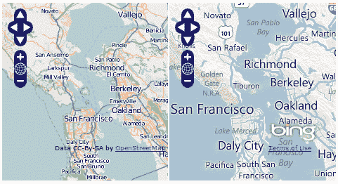
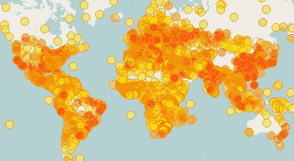
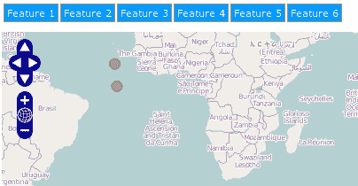
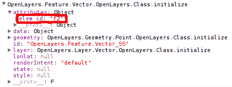

# 第四章. 使用事件

在本章中，我们将介绍以下内容：

+   创建并排地图比较器

+   实现地图图层的工作进度指示器

+   监听矢量图层特征的事件

+   监听非 OpenLayers 事件

# 简介

本章专注于事件，这是任何 JavaScript 程序中的重要概念。尽管本章内容简短，但这里解释的概念对于使用 OpenLayers 来说非常重要。

事件是 JavaScript 的核心。它们是产生反应的冲动。作为地图应用程序的程序员，我们感兴趣的是在地图缩放改变、图层加载或特征被添加到图层时做出反应。任何可能发出事件的类都负责管理其监听器（那些在事件被触发时感兴趣的人）并在某些情况下发出事件。

例如，我们可以注册一个函数，监听`OpenLayers.Map`实例上的`zoomend`事件。每当地图实例改变其缩放时，它负责触发`zoomend`事件，因此所有监听器都将通过新事件得到通知。

为了帮助完成所有这些过程，OpenLayers 有一个`OpenLayers.Events`类，负责注册监听器并简化向所有监听器触发事件的操作。具体来说，它允许：

+   定义事件

+   注册监听器

+   触发事件以通知所有监听器

许多类，如`OpenLayers.Map`和`OpenLayers.Layer`，都有一个`events`属性，它是一个`OpenLayers.Events`的实例，负责注册对通知感兴趣的事件监听器。

此外，这些类通常定义一个`EVENT_TYPES`数组属性（它是常量）并列出你可以为该类注册的可用事件。例如，对于`OpenLayers.Map`类，`EVENT_TYPES`被设置为以下内容：

```js
    EVENT_TYPES: [ 
        "preaddlayer", "addlayer","preremovelayer", "removelayer", 
        "changelayer", "movestart",
        "move", "moveend", "zoomend", "popupopen", "popupclose",
        "addmarker", "removemarker", "clearmarkers", "mouseover",
        "mouseout", "mousemove", "dragstart", "drag", "dragend",
        "changebaselayer"]

```

作为程序员，你需要查看 OpenLayers API 文档([`dev.openlayers.org/releases/OpenLayers-2.11/doc/apidocs/files/OpenLayers/Map-js.html`](http://dev.openlayers.org/releases/OpenLayers-2.11/doc/apidocs/files/OpenLayers/Map-js.html))，或者你也可以参考源代码以了解可以在每个类上注册的可用事件。

# 创建并排地图比较器

我们将创建一个地图比较器。目标是使两个来自不同提供商的地图并排显示，并使用`OpenLayers.Map`实例提供的某些事件来保持地图在相同的位置和缩放级别上同步。



## 如何实现...

要使两个地图并排显示，请执行以下步骤：

1.  开始创建一个带有 OpenLayers 库依赖的 HTML。

1.  现在，添加所需的 HTML 代码以使两个地图并排显示。这里我们使用一个带有行和两列的表格：

    ```js
    <table style="width: 100%; height: 95%;">
        <tr>
            <td>
                <div id="ch04_map_a" style="width: 100%; height: 100%;"></div>
            </td>
            <td>
                <div id="ch04_map_b" style="width: 100%; height: 100%;"></div>
            </td>
        </tr>
    </table>

    ```

1.  现在，让我们编写 JavaScript 代码。创建两个地图并使用期望的图像提供者进行初始化。这里我们使用了`OpenStreetMap`和`Bing:`

    ```js
    <script type="text/javascript">
        // Create left hand side map
        var map_a = new OpenLayers.Map("ch04_map_a");    
        var layer_a = new OpenLayers.Layer.OSM("OpenStreetMap");
        map_a.addLayer(layer_a);
        map_a.setCenter(new OpenLayers.LonLat(0,0), 2);

        // Create right hand side map
        var map_b = new OpenLayers.Map("ch04_map_b");    
        var bingApiKey = "AvcVU_Eh1H2_xVcK0EeRO70MD7Zm6qwLhrVC12C3D997DylUewCWaKR9XTZgWwu6";
        var layer_b = new OpenLayers.Layer.Bing({
            name: "Road",
            type: "Road",
            key: bingApiKey
        });
        map_b.addLayer(layer_b);
        map_b.setCenter(new OpenLayers.LonLat(0,0), 2);

    ```

1.  现在，在两个图层上注册`move`和`zoomend`事件：

    ```js
        // Register events on map_a using 'on':
        map_a.events.on({
            "move": moveListener,
            "zoomend": zoomListener
        });

        // Register events on map_a using 'register':
        map_b.events.register("move", null, moveListener);
        map_b.events.register("zoomend", null, zoomListener);

    ```

1.  最后，实现每次事件发生时被调用的`listener`函数：

    ```js
        // Listener functions
        function moveListener(event) {
            if(event.object == map_a) {
                map_b.setCenter(map_a.getCenter());
            } else {
                map_a.setCenter(map_b.getCenter());
            }
        }
        function zoomListener(event) {
            if(event.object == map_a) {
                map_b.zoomTo(map_a.getZoom()-1);
            } else {
                map_a.zoomTo(map_b.getZoom()+1);
            }
        }
    </script>

    ```

### 它是如何工作的...

为了使两个地图始终在相同的位置和缩放级别上保持同步，我们需要知道地图何时移动以及缩放级别何时改变。

`move`事件在每次地图移动时都会触发。此外，还有`movestart`和`moveend`事件，它们只在`move`动作开始或结束时触发，但在这里它们并不有用，因为我们需要捕捉到每一次移动。

当地图的缩放级别改变时，会触发`zoomend`事件。那么，我们如何监听地图中的事件呢？这是通过`events`属性实现的，它是一个`OpenLayers.Events`的实例。

有两种方式（实际上还有第三种，我们将在*还有更多*部分看到）来注册地图事件的监听器——使用`on`或`register`方法。

在第一张地图上，我们使用了`on`方法一次性注册多个事件：

```js
    map_a.events.on({
        "move": moveListener,
        "zoomend": zoomListener
    });

```

`on`方法需要一个对象，其中其属性的名称是事件名称，值是在事件触发时被调用的监听函数。

`on`方法接受一个特殊属性，称为`scope`。这允许我们将所有指定的事件注册为在相同的上下文中执行。也就是说，当`listener`函数执行时，`this`关键字将指向`scope`属性中指定的对象。

### 注意

对于刚开始学习 JavaScript 的人来说，上下文可能是一个高级话题。一个有趣的讨论可以在[`stackoverflow.com/questions/1798881/javascript-context`](http://stackoverflow.com/questions/1798881/javascript-context)找到。

在第二张地图上，我们使用了`register`方法，它允许我们一次注册一个事件监听器：

```js
    map_b.events.register("move", null, moveListener);
    map_b.events.register("zoomend", null, zoomListener);

```

`events.register()`函数接受四个参数：

+   `type:` 这是我们要监听的事件。

+   `object:` 这是函数执行的环境（类似于`on`方法中的`scope`属性）。

+   `function:` 这是事件触发时要执行的功能。

+   `priority:` 这是一个布尔值。如果它是`true`，则监听器将在事件队列的前端排队，而不是在末尾。

现在，我们将被通知任何两个地图产生的`move`或`zoomend`事件。

重要的是要注意，OpenLayers 事件机制总是通过传递一个`event`参数来调用`listener`函数。这个`event`对象包含由触发事件的`source`对象编写的任何信息，以及以下三个总是自动添加的属性：

+   `type:` 包含事件名称（移动、`zoomend`等）

+   `object:` 指向触发事件的对象

+   `element:` 与事件相关的`DOM`元素

让我们看看我们的监听器函数。`moveListener`函数检查哪个地图触发了事件，然后获取地图的`center`，并将相同的`center`分配给另一个地图：

```js
    function moveListener(event) {
        if(event.object == map_a) {
            map_b.setCenter(map_a.getCenter());
        } else {
            map_a.setCenter(map_b.getCenter());
        }
    }

```

如您所见，我们可以通过`event.object.`获取触发事件的地图的引用。

类似地，`zoomListener`函数获取源事件地图上的缩放级别，并将其应用于另一个地图。

```js
    function zoomListener(event) {
        if(event.object == map_a) {
            map_b.zoomTo(map_a.getZoom()-1);
        } else {
            map_a.zoomTo(map_b.getZoom()+1);
        }
    }

```

### 注意

Bing 地图在其影像上具有与`OpenStreetMap`不同的分辨率级别。我们可以这样说，与其他影像提供商相比，它相差一个缩放级别，因为我们是在添加或从缩放级别中减去这个值。

### 更多...

正如我们可以对监听事件感兴趣一样，我们也可以对停止通知感兴趣。

`OpenLayers.Events`类有`un`和`unregister`方法，允许我们在某些事件被触发时注销我们的监听器函数。

与`on`方法类似，`un`方法允许注销多个监听器，而`unregister`方法允许一次注销一个监听器。以这个配方为例，我们可以在地图上注销事件如下：

```js
    map_a.events.un({
        "move": moveListener,
        "zoomend": zoomListener
    });
    map_b.events.unregister("move", null, moveListener);

```

#### 注册事件监听器的另一种方法

除了`on`和`register`方法之外，还有第三种注册事件监听器的方法。

当创建`OpenLayers.Map`、`OpenLayers.Layer`和`OpenLayers.Control`实例时，我们可以使用`eventListeners`属性，就像我们使用`on`方法来注册一组监听器一样。例如：

```js
map = new OpenLayers.Map('map', { 
    eventListeners: { 
        "move": moveListener, 
        "zoomend": zoomListener 
    } 
});

```

实际上发生的情况是传递给`eventListener`属性的对象直接通过`on`方法用来初始化监听器。

### 参见

+   在第二章的*使用 Bing 影像*配方中，*添加栅格图层*

+   *实现地图图层的工作进度指示器*的配方

+   *监听矢量图层事件*的配方

# 实现地图图层的工作进度指示器

在创建优秀应用程序的艺术中，最重要的考虑因素是用户体验。一个好的应用程序完成它必须做的事情，但通过让用户感到舒适。

当与远程服务器一起工作时，大多数时间用户都在等待数据检索。例如，当与 WMS 图层一起工作时，每次我们更改缩放级别，用户都必须等待几秒钟，直到从服务器获取数据并且瓦片开始渲染。

通过使用图标、进度条等来向用户显示一些反馈，告知应用程序正在工作但需要一些时间，这将非常棒。

这个配方展示了我们如何通过通知应用程序正在从不同的服务器加载数据，利用一些图层事件，来给用户一些反馈。

### 注意

就像在这本书的许多其他配方中一样，我们使用了 Dojo 工具包框架([`dojotoolkit.org`](http://dojotoolkit.org))来提供更好的用户体验。我们可以看到的主要区别是，一个基本的 HTML 页面是它提供的丰富小部件（按钮、工具栏、进度条等）的集合。如果 HTML 页面上的某些内容不清楚，请不要担心，这本书的目标不是教授 Dojo，这不会改变对 OpenLayers 概念的说明。

## 如何做到这一点...

执行以下步骤：

1.  创建一个包含 OpenLayers 依赖项的 HTML 文件。

1.  首先，我们将添加显示进度条的 HTML 代码。注意它如何通过使用 Dojo 框架简单创建。使用`data-dojo-type`和`data-dojo-props`属性标记一个普通的`span`元素。

    ```js
    <span data-dojo-type="dijit.ProgressBar" style="width: 100px;" id="progress"
          data-dojo-props="'indeterminate': true, 
          label:''"></span>

    ```

1.  和往常一样，放置`div`元素以容纳地图：

    ```js
    <div id="ch04_work_progress" style="width: 100%; height: 100%;"></div>

    ```

1.  对于开始 JavaScript 部分代码，我们需要考虑到我们正在从远程 WFS 服务器请求功能，因为这是我们需要做的第一件事来设置要使用的代理 URL：

    ```js
    <!-- The magic comes here -->
    <script type="text/javascript">
        OpenLayers.ProxyHost = "./utils/proxy.php?url=";

    ```

1.  现在，创建地图和两个图层——一个 WMS 图层，它是基础图层，和一个 WFS 图层：

    ```js
        // Create left map
        var map = new OpenLayers.Map("ch04_work_progress");   
        var wms = new OpenLayers.Layer.WMS("Basic", 
        "http://labs.metacarta.com/wms/vmap0",
        {
            layers: 'basic'
        });        
        var wfs = new OpenLayers.Layer.Vector("States", {
            protocol: new OpenLayers.Protocol.WFS({
                url: "http://demo.opengeo.org/geoserver/wfs",
                featureType: "states",
                featureNS: "http://www.openplans.org/topp"
            }),
            strategies: [new OpenLayers.Strategy.BBOX()]
        });
        map.addLayers([wms, wfs]);

    ```

1.  添加图层切换控件并集中地图：

    ```js
        map.addControl(new 
        OpenLayers.Control.LayerSwitcher());
        map.setCenter(new OpenLayers.LonLat(-100, 41), 8);

    ```

1.  在 WMS 和 WFS 图层上注册事件监听器：

    ```js
        // Register events on layers using 'on':
        wms.events.on({
            "loadstart": updateLoader,
            "loadend": updateLoader, 
            "loadcancel": updateLoader
        });
        wfs.events.on({
            "loadstart": updateLoader,
            "loadend": updateLoader, 
            "loadcancel": updateLoader
        });

    ```

1.  最后，实现监听函数，以便在两个图层中的任何一个加载其内容时显示进度条：

    ```js
        // Listener functions
        var wmsLoading = false;
        var wfsLoading = false;
        function updateLoader(event) {
            var progress = dijit.byId('progress');
            if(event.type == "loadstart") {
                if(event.object == wms) {
                    wmsLoading = true;
                }
                if(event.object == wfs) {
                    wfsLoading = true;
                }

                var label = "";
                if(wmsLoading) {
                    label += "WMS ";
                }
                if(wfsLoading) {
                    label += "+ WFS";
                }

                progress.set('value', 'Infinity');
                progress.set('label', label);
                dojo.style(progress.domNode, "visibility", "visible");
            } else {
                if(event.object == wms) {
                    wmsLoading = false;
                }
                if(event.object == wfs) {
                    wfsLoading = false;
                }
                progress.set('value', '0');
                dojo.style(progress.domNode, "visibility", "hidden");
            }
        }
    </script>

    ```

### 它是如何工作的...

在创建地图和两个图层之后，在两个图层上注册我们的监听函数，用于事件`loadstart, loadend`和`loadcancel`：

```js
    wms.events.on({
        "loadstart": updateLoader,
        "loadend": updateLoader, 
        "loadcancel": updateLoader
    });
    wfs.events.on({
        "loadstart": updateLoader,
        "loadend": updateLoader, 
        "loadcancel": updateLoader
    });

```

这些是所有图层都有的常见事件，因为它们是从`OpenLayers.Layer`类继承而来的。

当图层开始加载数据时，会触发`loadstart`事件，而`loadend`或`loadcancel`则会在过程结束或被取消时触发。

在这个前提下，繁琐的`updateLoader`监听函数负责在两个图层中的任何一个加载数据时显示一个不确定的进度条和文本消息。文本消息可以是 WMS、WFS 或 WMS WFS，具体取决于正在加载内容的图层。

### 更多...

正如我们之前提到的，这个配方中使用的这些事件对所有图层都是通用的。

`OpenLayers.Layer`类的具体子类可以有自己的事件，例如`OpenLayers.Layer.Vector`，它有事件来通知特征被添加、删除等情况。

### 参见

+   第二章中的*添加 WMS 图层*配方，*添加栅格图层*

+   从 WFS 服务器添加功能中的*从 WFS 服务器添加功能*配方，*处理矢量图层*

+   *创建并排地图比较器*的配方

+   *监听矢量图层特征事件*的配方

# 监听矢量图层特征事件

当与矢量层一起工作时，通常会遇到需要了解正在发生什么的情况，即当新特征即将被添加到层中或特征已被修改、删除等情况。幸运的是，矢量层具有触发大量事件的能力。

本菜谱的目标是展示在矢量层中监听事件是多么容易，以及了解其上正在发生什么。

我们将加载一个包含世界各地一些城市的 GML 文件，并根据某些特征属性设置其填充颜色。



## 如何操作...

1.  创建一个 HTML 文件并添加 OpenLayers 库的依赖文件。然后，添加一个 `div` 元素来定义放置地图实例的位置：

    ```js
    <div id="ch04_vector_layer_listener" style="width: 100%; height: 100%;"></div>

    ```

1.  初始化地图实例，添加基本层，并中央化视口：

    ```js
    <!-- The magic comes here -->
    <script type="text/javascript">
        // Create map
        var map = new 
        OpenLayers.Map("ch04_vector_layer_listener");    
        var layer = new 
        OpenLayers.Layer.OSM("OpenStreetMap");
        map.addLayer(layer);
        map.setCenter(new OpenLayers.LonLat(0,0), 4);

    ```

1.  创建一个矢量层来读取 GML 文件。同时，通过注册一个监听 `beforefeatureadded` 事件的监听器来初始化它：

    ```js
        var vectorLayer = new 
        OpenLayers.Layer.Vector("States", {
            protocol: new OpenLayers.Protocol.HTTP({
                url: "http://localhost:8080/openlayers-
                cookbook/recipes/data/world_cities.json",
                format: new OpenLayers.Format.GeoJSON()
            }),
            strategies: [new OpenLayers.Strategy.Fixed()],
            eventListeners: {
                "beforefeatureadded": featureAddedListener
            }
        });
        map.addLayer(vectorLayer);

    ```

1.  编写监听函数的代码。定义一个颜色方案，根据 `POP_RANK` 属性为每个特征分配填充颜色：

    ```js
        // Define color palette
        var colors = [
            "#CC0000",
            "#FF0000",
            "#FF3300",
            "#FF6600",
            "#FF9900",
            "#FFCC00",
            "#FFFF00"
        ];
        function featureAddedListener(event){
            // Set feature color depending on the rank attribute
            var feature = event.feature;
            var rank = feature.attributes.POP_RANK;
            feature.style = OpenLayers.Util.extend({}, OpenLayers.Feature.Vector.style['default']);
            feature.style.fillColor = colors[rank-1];
        }
    </script>

    ```

### 工作原理...

在初始化地图和基本层之后，我们必须创建一个矢量层：

```js
    var vectorLayer = new OpenLayers.Layer.Vector("States", {
        protocol: new OpenLayers.Protocol.HTTP({
            url: "http://localhost:8080/openlayers-cookbook/recipes/data/world_cities.json",
            format: new OpenLayers.Format.GeoJSON()
        }),
        strategies: [new OpenLayers.Strategy.Fixed()],
        eventListeners: {
            "beforefeatureadded": featureAddedListener
        }
    });

```

作为一种协议，我们使用 `OpenLayers.Protocol.HTTP` 实例，它将通过 HTTP 协议从指定的 URL 获取数据，并使用 `OpenLayers.Format.GeoJSON` 格式读取器读取它。

矢量层使用 `OpenLayers.Strategy.Fixed`，这意味着无论我们是否移动地图的视口，内容都只加载一次。

有几种方法可以注册事件监听器。其中一种方法是通过 `on` 或 `register` 方法，但我们选择在初始化层时使用 `eventListener` 属性同时注册事件监听器。

这样，每次当特征即将被添加到层中（在它被添加之前），监听函数都会被调用，并接收一个作为参数的 `event` 对象，其中包含与层事件相关的某些信息：

```js
    function featureAddedListener(event){
        var feature = event.feature;
        var rank = feature.attributes.POP_RANK;
        feature.style = OpenLayers.Util.extend({}, OpenLayers.Feature.Vector.style['default']);
        feature.style.fillColor = colors[rank-1];
    }

```

从事件中，我们可以获取到特征及其属性的引用。在这里，我们使用 `POP_RANK` 属性来选择特征的填充颜色。

### 注意

关于我们可以更改的特征样式属性，更多信息请参阅 [`dev.openlayers.org/releases/OpenLayers-2.11/doc/apidocs/files/OpenLayers/Feature/Vector-js.html#OpenLayers.Feature.Vector.OpenLayers.Feature.Vector.style`](http://dev.openlayers.org/releases/OpenLayers-2.11/doc/apidocs/files/OpenLayers/Feature/Vector-js.html#OpenLayers.Feature.Vector.OpenLayers.Feature.Vector.style)。

### 更多内容...

在本菜谱中，我们可以使用 `OpenLayers.Util.extend` 方法设置特征的初始样式，然后设置所需的填充颜色：

```js
feature.style = OpenLayers.Util.extend(
    {},
    OpenLayers.Feature.Vector.style['default']
);

```

`OpenLayers.Util.extend` 方法需要两个参数——目标和源对象。其功能是将源对象中找到的所有属性复制到目标对象。

### 注意

`OpenLayers.Util.extend` 方法对于在 OpenLayers 中创建层次结构和继承非常重要。然而，它的命名空间是 `OpenLayers.Util`，它位于 `OpenLayers/BaseTypes/Class.js` 文件中，该文件讨论了其重要性。

另一方面，`OpenLayers.Feature.Vector.style` 是一个对象，其中包含一些预定义的样式，如 `default, selected, delete` 等。

因此，前面的行意味着可以创建一个新的对象，它扩展了一个空对象，并包含 `OpenLayers.Feature.Vector.style['default']` 对象中的所有属性。

### 参见

+   *使用符号化器设置要素样式* 策略在 第七章，*设置要素样式*

+   在 第三章 的 *添加 GML 层* 策略中，*处理矢量层*

+   *创建并排地图比较器* 策略

+   *监听非 OpenLayers 事件* 策略

# 监听非 OpenLayers 事件

在开发网络地图应用时，OpenLayers 的使用只是我们需要使用的工具集中的一个部分。添加其他组件，如按钮、图片、列表等，并与它们交互是其他我们必须完成的任务。

与 `OpenLayers.Map` 实例或 `OpenLayers.Layer` 子类交互很简单，因为它们会触发特定的事件，但如果我们想在按钮或任何 `DOM` 元素上监听事件怎么办呢？

为了这个目的，OpenLayers 为我们提供了 `OpenLayers.Event` 类（不要与复数 `OpenLayers.Events` 类混淆）。这是一个辅助类，它允许我们在浏览器无关的方式下监听非 OpenLayers 元素中的事件。

### 注意

不幸的是，在 JavaScript 中注册事件监听器的方法在所有浏览器中并不相同。此外，Microsoft 与 W3C（万维网联盟）在注册监听器的方式上有所不同。你可以在 [`www.quirksmode.org/js/events_advanced.html`](http://www.quirksmode.org/js/events_advanced.html) 找到更多信息。

如果你的项目使用 jQuery、Dojo 或 ExtJS 等库或框架，你可能会使用它们的功能来访问 DOM 元素、注册事件等。

如果你正在处理一个没有上述库的更简单的项目，通过 `OpenLayers.Event` 类注册事件是一个好主意，因为它与浏览器无关，这意味着你的应用程序将与更多浏览器兼容。

此外，还有一个原因要阅读这个策略，那就是 OpenLayers 使用 `OpenLayers.Event` 类来内部实现许多处理程序和控制，我们将在未来的章节中看到。

让我们看看如何通过 `OpenLayers.Event` 类在 HTML 元素上监听事件。



策略是创建六个按钮，并将六个点要素添加到矢量层中。然后当鼠标进入按钮时突出显示要素，当鼠标离开时取消选择。

## 如何操作...

要监听非 OpenLayers 事件，请按照以下步骤操作：

1.  创建一个带有 OpenLayers 库依赖的 HTML。开始为按钮添加一些 CSS 样式。以下代码定义了当按钮未被选中（鼠标不在上面）时的样式，以及当鼠标悬停在按钮上时具有不同背景色的样式：

    ```js
    <style>
        .square {
            border: 1px solid #888;
            background-color: #0099FF;
            color: #fff;
            padding: 3px;
        }
        .square:hover {
            background-color: #0086d2;
        }
    </style>

    ```

1.  创建一个表格来存放六个按钮。一个按钮将由一个带有标识符的 `span` 元素表示：

    ```js
    <table>
        <tr>
            <td><span id="f0" class="square">Feature 
            1</span></td>
            <td><span id="f1" class="square">Feature 
            2</span></td>
            <td><span id="f2" class="square">Feature 
            3</span></td>
            <td><span id="f3" class="square">Feature 
            4</span></td>
            <td><span id="f4" class="square">Feature 
            5</span></td>
            <td><span id="f5" class="square">Feature 
            6</span></td>
        </tr>
    </table>
    <br/>

    ```

1.  添加一个 `div` 元素来存放地图：

    ```js
    <div id="ch04_dom_events" style="width: 100%; height: 100%;"></div>

    ```

1.  现在，添加所需的 JavaScript 代码以实例化地图对象，设置基本图层，并添加矢量图层：

    ```js
    <!-- The magic comes here -->
    <script type="text/javascript">
        // Create left map
        var map = new OpenLayers.Map("ch04_dom_events");    
        var osm = new OpenLayers.Layer.OSM();        
        // Create a vector layer with one feature for each 
        previous SPAN element
        var vectorLayer = new 
        OpenLayers.Layer.Vector("Features");

    ```

1.  用六个特征填充矢量图层。每个特征都将包含代表它的按钮的标识符：

    ```js
        var pointFeatures = [];
        for(var i=0; i< 6; i++) {
            // Create the ID
            var id = "f"+i;
            // Regiter listeners to handle when mouse enters 
            and leaves the DOM element
            OpenLayers.Event.observe(OpenLayers.Util.
            getElement(id), 'mouseover', mouseOverListener);
            OpenLayers.Event.observe(OpenLayers.Util.
            getElement(id), 'mouseout', mouseOutListener);

            // Create a random point
            var px = Math.random()*360-180;
            var py = Math.random()*160-80;
            var pointGeometry = new 
            OpenLayers.Geometry.Point(px, py);
            OpenLayers.Projection.transform(pointGeometry, 
            new OpenLayers.Projection("EPSG:4326"), new 
            OpenLayers.Projection("EPSG:900913"));
            var pointFeature = new 
            OpenLayers.Feature.Vector(pointGeometry, {
                elem_id: id
            });
            pointFeatures.push(pointFeature);
        }
        vectorLayer.addFeatures(pointFeatures);

        map.addLayers([osm, vectorLayer]);
        map.setCenter(new OpenLayers.LonLat(0, 0), 1);

    ```

1.  最后，添加实现事件监听器的代码：

    ```js
        // Listeners
        function mouseOverListener(event) {
            var id = event.target.id;
            var feature = vectorLayer.
            getFeaturesByAttribute('elem_id', id);
            vectorLayer.drawFeature(feature[0], "select");
        }
        function mouseOutListener(event) {
            var id = event.target.id;
            var feature = vectorLayer.
            getFeaturesByAttribute('elem_id', id);
            vectorLayer.drawFeature(feature[0], "default");
        }
    </script>

    ```

### 它是如何工作的...

我们创建了六个按钮，从 `f0` 到 `f5` 进行标识，我们想要创建六个代表它们的特征。为此，在 `for` 循环中，首先创建一个带有标识符的字符串：

```js
        var id = "f"+i;

```

然后，为 `mouseover` 和 `mouseout` 事件注册一个事件监听器函数：

```js
        OpenLayers.Event.observe(OpenLayers.Util.getElement(id), 
        'mouseover', mouseOverListener);
        OpenLayers.Event.observe(OpenLayers.Util.getElement(id), 
        'mouseout', mouseOutListener);

```

这是通过使用 `OpenLayers.Event.observe` 方法实现的，它需要三个参数。这些参数如下：

+   `elementParam:` 我们想要监听 `tis` 事件的 `DOM` 元素引用或其标识符

+   `name:` 你想要监听的事件

+   `observer:` 将作为监听器的函数

因为我们需要传递 `DOM` 元素引用，所以我们需要先获取它。当其标识符可用时，我们可以使用辅助方法 `OpenLayers.Util.getElement` 来获取元素引用。

从 `elementParam` 定义中，你可以看到使用 `OpenLayers.Util.getElement` 并不是严格必要的。如果我们传递一个 ID，`OpenLayers.Event.observe` 方法将内部使用 `OpenLayers.Util.getElement` 函数来获取元素引用，所以接下来的两行将产生相同的结果：

```js
        OpenLayers.Event.observe(id, 'mouseover', mouseOverListener);
        OpenLayers.Event.observe(OpenLayers.Util.getElement(id), 'mouseover', mouseOverListener);

```

### 注意

`OpenLayers.Util` 类有许多方法可以帮助处理 `DOM` 元素、数组以及许多其他功能。我们鼓励您查看。

一旦注册了监听器，我们创建一个随机点功能并将其添加到矢量图层：

```js
        var px = Math.random()*360-180;
        var py = Math.random()*160-80;
        var pointGeometry = new OpenLayers.Geometry.Point(px, py);

```

记住要将点坐标转换为地图使用的投影。在这种情况下，因为基本图层是 OSM，并且地图没有指定投影属性，所以将使用 OSM 投影：

```js
        OpenLayers.Projection.transform(pointGeometry, new 
        OpenLayers.Projection("EPSG:4326"), new 
        OpenLayers.Projection("EPSG:900913"));
        var pointFeature = new 
        OpenLayers.Feature.Vector(pointGeometry, {
            elem_id: id
        });
        pointFeatures.push(pointFeature);

```

我们通过传递一个自定义属性 `elem_id` 创建了这个功能，该属性将存储代表该功能的按钮的标识符。这样我们就有了一个连接功能和按钮的引用。

以下截图显示了自定义属性是如何存储在功能的 `attributes` 属性中的：



到目前为止，我们有了六个按钮和六个功能，它们将相应的按钮标识符作为自定义属性存储。现在，任务是实现监听器函数。让我们看看 `mouseOverListener` 函数。

```js
    function mouseOverListener(event) {
        var id = event.target.id;
        var feature = 
        vectorLayer.getFeaturesByAttribute('elem_id', id);
        vectorLayer.drawFeature(feature[0], "select");
    }

```

从事件，它是一个浏览器 `MouseEvent`，我们获取触发事件的元素标识符：

```js
        var id = event.target.id;

```

接下来，使用 `OpenLayers.Layers.Vector.getFeatureByAttribute` 方法，我们获取具有 `elem_id` 值 `id` 的矢量层内的特征数组。当然，这里它将始终返回只包含一个元素的数组：

```js
        var feature = 
        vectorLayer.getFeaturesByAttribute('elem_id', id);

```

现在，我们有了特征。只需用不同的渲染意图重新绘制它。选择突出显示选定的特征并将其样式恢复到默认值：

```js
        vectorLayer.drawFeature(feature[0], "select");

```

### 注意

我们将在 第七章 的 *样式化特征* 中了解更多关于样式化特征的内容。同时，考虑将渲染意图作为预定义样式来渲染特征。

### 更多...

OpenLayers 定义了一个全局变量 `$`，它指向 `OpenLayers.Util.getElement` 函数，如果它不存在。这样我们就可以以简短的方式获取一个元素的引用。

例如，下面两行有相同的结果：

```js
$("some_ID")
OpenLayers.Util.getElement("some_ID")

```

在使用 `$` 函数时要小心。许多 JavaScript 库，其中最著名的是 jQuery 库 ([`jquery.com`](http://jquery.com))，也将全局 `$` 对象定义为操作它的常用方式。因此，请检查你应用程序中导入库的顺序以及 `$` 函数真正指向的位置。

作为一种好奇，当通过 `OpenLayers.Util.getElement` 函数根据其标识符获取元素引用时：

```js
$("some_ID")

```

jQuery 库要求你使用 `#` 字符：

```js
$("#some_ID")

```

#### 停止观察

我们可能对观察某些事件感兴趣，同样，我们可能也希望停止观察它。

与 `OpenLayers.Event.observe` 方法类似，给定一个元素引用或一个字符串标识符，`OpenLayers.Event.stopObservingElement` 方法允许我们停止观察某些 `DOM` 元素。

### 参见

+   在 第三章 的 *程序化创建特征* 菜单，*处理矢量层*

+   在 第七章 的 *使用符号化样式化特征* 菜单，*样式化特征*

+   *创建并排地图比较器* 菜单

+   *监听矢量层特征事件* 菜单
