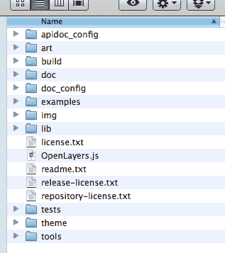
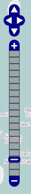
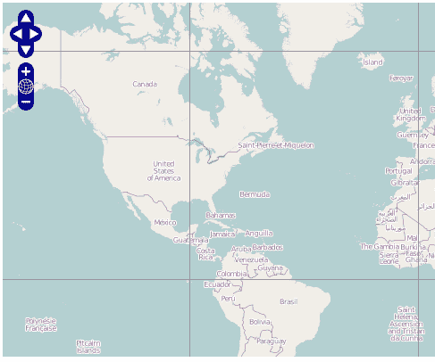
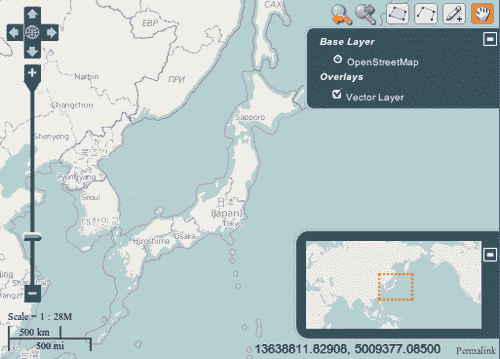
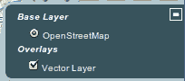
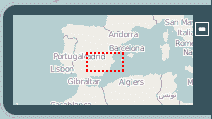
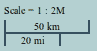
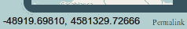
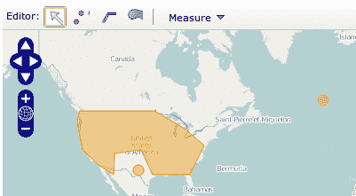
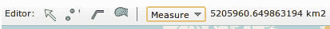

# 第六章。主题化

在本章中，我们将涵盖：

+   使用 `img` 文件夹理解主题的工作原理

+   使用 `theme` 文件夹理解主题的工作原理

+   在栅格层中定义瓦片

+   创建新的 OpenLayers 主题

+   在控件外启动操作

# 简介

值得注意的是，在软件应用程序中，第一印象是最重要的，它们由两个因素决定：外观和感觉。

本章旨在展示我们如何通过主题化 OpenLayers 来改善我们的网络制图应用程序的外观和感觉。

与许多其他网络应用程序一样，OpenLayers 库的外观和感觉是通过图像和 CSS 类控制的，这些类定义了任何 OpenLayers 组件的位置、尺寸和视觉方面。

在此刻，随着 2.11 版本的推出，我们可以在捆绑发行版中找到 `img` 和 `theme` 文件夹，并且两者都用于控制 OpenLayers 应用程序的外观。

### 提示

请记住，在按照第一章中“包含 OpenLayers 的不同方法”配方所述使用 OpenLayers 时，将这些文件夹放置到您的项目中。



`theme` 文件夹包含 CSS 文件，以及一些在 CSS 中使用的图像，而 `img` 文件夹只包含图像，以更硬编码（且不推荐）的方式由一些控件使用。

我们可以说，使用 `theme` 文件夹和 CSS 样式是实现控件的首选方式，而使用 `img` 文件夹则保留给那些尚未更新以使用 CSS 样式的控件。

成为一位*杰出*的网页设计师超出了本书的范围，但确实，如果我们想稍微调整一下 OpenLayers 的外观，我们需要了解一些 HTML 和 CSS 的工作原理。

### 注意

我们可以在 [`en.wikipedia.org/wiki/Cascading_Style_Sheets`](http://en.wikipedia.org/wiki/Cascading_Style_Sheets) 找到 CSS 标准的描述，但我们在网上可以找到大量的优秀教程，例如 [`www.csstutorial.net`](http://www.csstutorial.net)。

浏览器使用三种主要技术：HTML、CSS 和 JavaScript。用非常简短的句子总结，我们可以这样说：

+   HTML 使用段落、标题、部分等定义网页的内容。

+   CSS 定义了 HTML 元素的视觉方面，即段落必须使用的文本颜色、标题的文本大小等。

+   最后，JavaScript 是一种由浏览器处理的编程语言，可以用来动态地操作页面的任何方面。例如，我们可以添加新的 HTML 元素，更改 CSS，并在将表单发送到服务器之前检查表单字段是否有效。

### 注意

**文档对象模型 (DOM)** 是一个用于访问和操作 HTML 文档的标准。我们可以将其视为将 HTML 文档分解为一个元素和属性的树。

查看：[`www.w3schools.com/htmldom/default.asp`](http://www.w3schools.com/htmldom/default.asp)

OpenLayers 属于第三类。它是一个 JavaScript 库，允许我们使用地图、图层或特征等概念来创建网络地图应用程序，同时抽象出渲染它们所需的 HTML DOM 元素和 CSS 方面。

当我们创建一个 OpenLayers 组件，例如地图、图层或控制实例时，它也会创建所需的 HTML 元素来渲染它们，并将它们放置在 HTML 页面的 DOM 结构的正确位置。

本章的目标是展示如何为主题化最重要的 OpenLayers 组件。因此，使用许多后续的菜谱，我们将能够创建一个具有定制外观的新网络地图应用程序。

# 使用 img 文件夹理解主题的工作方式



如本章 *简介* 部分所述，有一些控制可以通过存储在 `img` 文件夹中的图片简单地主题化。

这种方式是为主题化控制的最古老方式，对于新的实现，首选的主题化方式是使用 CSS，即使用 `theme` 文件夹。

在其更新之前，我们可以使用任何两种主题化形式的控制，因此了解如何主题化两者是很重要的。

在这个菜谱中，我们将描述如何使用 `img` 文件夹中的图片基于旧方式为主题化的 `PanZoomBar` 控制器。

## 如何做到这一点...

1.  创建一个包含 OpenLayers 依赖项的 HTML 文件，并在文档的 body 元素中开始添加 `div` 元素以包含地图：

    ```js
    <div id="ch06_theming_img" style="width: 100%; height: 90%;"></div>

    ```

1.  现在，添加以下 JavaScript 代码以初始化地图并添加一个基本图层：

    ```js
        var map = new OpenLayers.Map("ch06_theming_img ");    
        var osm = new OpenLayers.Layer.OSM();        
        map.addLayer(osm);
        map.setCenter(new OpenLayers.LonLat(0, 0), 2);

    ```

1.  最后，只需创建一个 `OpenLayers.Control.PanZoomBar` 控制实例并将其添加到地图中：

    ```js
    var panZoomBar = new OpenLayers.Control.PanZoomBar();
    map.addControl(panZoomBar);

    ```

### 它是如何工作的...

当我们创建控制时，实际上发生的是 OpenLayers 自动创建一组 HTML 元素并将它们放置在页面的 DOM 结构中。

从 OpenLayers 的 JavaScript API 视角来看，这仅仅是向地图添加一个控制组件，但从 HTML 代码的角度来看，这意味着在页面上创建了一组复杂的元素来表示所有按钮和图片，以形成一个漂亮的平移和缩放控制：

```js
<div id="OpenLayers.Control.PanZoomBar_71" style="... left: 4px; top: 4px; ..." class="olControlPanZoomBar olControlNoSelect" ...> 
    <div id="OpenLayers.Control.PanZoomBar_71_panup" ...> 
         
    </div> 
    <div id="OpenLayers.Control.PanZoomBar_71_panleft" ...> 
         
    </div> 
     <div id="OpenLayers.Control.PanZoomBar_71_panright" ...> 
         
    </div> 
     <div id="OpenLayers.Control.PanZoomBar_71_pandown" ...> 
         
    </div> 
    <div id="OpenLayers.Control.PanZoomBar_71_zoomin" ...> 
         
    </div> 
</div>

```

通过查看生成的代码，我们可以说：

+   主要控制元素使用一个名为 `olControlPanZoomBar` 的 CSS 类

+   所使用的所有图片都是从 OpenLayers 的 `img` 文件夹中加载的，例如 `img/north-mini.png`、`img/east-mini.png` 和 `img/zoom-minus-mini.png`

+   控制的位置及其按钮的设置是在 `style` 属性中进行的，而不是使用 CSS 类

结论很简单：要改变这个控制的外观，只能通过更改 `img` 文件夹中的图片来实现。

此外，如果我们想将控件放置在不同的位置，我们需要调整`OpenLayers.Control.PanZoom.X`和`OpenLayers.Control.PanZoom.Y`属性，这些属性用于设置主控件 HTML 元素`style`属性中`top`和`left`属性的值。例如，设置：

```js
OpenLayers.Control.PanZoom.X = 50;

```

生成以下 HTML 代码：

```js
<div id="OpenLayers.Control.PanZoomBar_71" style="position: absolute; left: 50px; top: 4px; ...

```

这意味着，尽管你在`olControlPanZoomBar`类中重新定义了`top`和`left`属性，但它们不会生效，因为`style`属性中指定的属性具有优先级：

```js
.olControlPanZoomBar { 
    top: 50px; 
    left: 50px; 
}

```

### 还有更多...

有几点重要的事情需要注意。

首先，每个 OpenLayers 实例都有一个 ID 属性。我们可以在创建实例时手动设置它，或者让 OpenLayers 为我们计算一个，但请注意，ID 必须是唯一的。

在这种情况下，`PanZoomBar`控件的 ID 是字符串`OpenLayers.Control.PanZoomBar_71`，它也用于识别 HTML 元素。

其次，如果一个控件使用了 CSS 类，按照惯例，类的名称将是`olControl`后跟控件的名称，例如：`olControlPanZoomBar`。

### 参见

+   *使用主题文件夹理解主题如何工作*配方

+   第五章中的*添加和移除控件*配方，*添加控件*

# 使用主题文件夹理解主题如何工作

如我们在本章引言中解释的，有一些 OpenLayers 控件强烈依赖于 CSS 类来作为主题。

在这个组中，我们可以找到`PanPanel`控件，它是由一组四个按钮组成的小控件，允许用户在四个方向上平移地图：


## 如何做到这一点...

1.  创建一个 HTML 页面并添加 OpenLayers 库依赖项：

    ```js
    <script type="text/javascript" src="img/OpenLayers.js"></script>

    ```

1.  然后，我们需要包含要使用的主题的 CSS 文件。这里我们使用默认主题：

    ```js
    <link rel="stylesheet" href="./js/OpenLayers-2.11/theme/default/style.css" type="text/css">

    ```

1.  在文档的`body`元素中，添加`div`元素以容纳地图：

    ```js
    <div id="ch06_theming_theme" style="width: 100%; height: 90%;"></div>

    ```

1.  在`script`元素中，添加创建带有基本层的地图的代码：

    ```js
        var map = new OpenLayers.Map("ch06_theming_img ");    
        var osm = new OpenLayers.Layer.OSM();        
        map.addLayer(osm);
        map.setCenter(new OpenLayers.LonLat(0, 0), 2);

    ```

1.  最后，创建一个`OpenLayers.Control.PanPanel`实例并将其添加到地图中：

    ```js
    var panControl = new OpenLayers.Control.PanPanel(); 
    map.addControl(panControl);

    ```

### 它是如何工作的...

当`OpenLayers.Control.PanPanel`实例添加到地图中时，实际上是在 DOM 页面结构中添加了一组新的 HTML 元素：

```js
<div id="OpenLayers.Control.PanPanel_71" style="position: absolute; z-index: 1006; " class="olControlPanPanel olControlNoSelect" unselectable="on"> 
    <div class="olControlPanNorthItemInactive"></div> 
    <div class="olControlPanSouthItemInactive"></div> 
    <div class="olControlPanEastItemInactive"></div> 
    <div class="olControlPanWestItemInactive"></div> 
</div>

```

对于控件，有一个主要元素包含其他表示四个按钮的元素。

主要 HTML 元素附加了一个名为`olControlPanPanel`的 CSS 类。这个类名是由 OpenLayers 自动创建的，并遵循以下约定：`olControl`加上控件名称。

在之前的 HTML 代码中使用的所有 CSS 类都可以在`theme/default/style.css`主题文件中的源代码中找到。

### 还有更多...

通过查看控件使用的 CSS 类，我们可以更好地理解其工作原理。

首先，我们通过修改 CSS 类的属性来更改控件的位置：

```js
.olControlPanPanel {
    top: 10px;
    left: 5px;
}  

```

接下来，CSS 代码设置了要使用的图像和按钮的大小：

```js
.olControlPanPanel div {
    background-image: url(img/pan-panel.png);
    height: 18px;
    width: 18px;
    cursor: pointer;
    position: absolute;
}

```

我们可以看到图像精灵是如何从文件 `theme/default/img/pan-panel.png:` 中提取的：


### 注意

**图像精灵**是将多个图像放入同一个文件中的集合。稍后，我们可以使用 CSS 属性来获取图像精灵的一部分，用于元素。

图像精灵在页面加载时减少了向服务器发送的请求数量。

接下来，每个按钮定义了提取用作按钮的图像片段所需的属性：

```js
.olControlPanPanel .olControlPanSouthItemInactive { 
    top: 36px; 
    left: 9px; 
    background-position: 18px 0; 
}

```

我们可以看到，只需一点 CSS 知识，我们就可以修改几乎任何想要的控件属性。

### 参见

+   [理解如何使用 img 文件夹工作主题] 菜谱

+   第五章中的*添加和删除控件*菜谱，*添加控件*

+   第一章中的*创建一个简单的全屏地图*菜谱，*网络地图基础*

+   第一章中的*不同方式包含 OpenLayers* 菜谱，*网络地图基础*

# 在栅格层中划分瓦片

为了展示使用 CSS 如何轻松地更改元素的外观，在这个菜谱中我们将向任何栅格层的所有瓦片添加边框，以显示每个瓦片的界限：



## 如何做到...

1.  创建一个包含 OpenLayers 依赖项的 HTML 文件，并在 `head` 部分添加一个包含以下 CSS 代码的 `style` 元素：

    ```js
    <style>
        .olTileImage {
            border: 1px solid #999;
        }
    </style>

    ```

1.  接下来，在文档的 `body` 元素中，添加 `div` 元素来包含地图：

    ```js
    <div id="ch06_tile_borders" style="width: 100%; height: 90%;"></div>

    ```

1.  现在，添加以下 JavaScript 代码以初始化地图并添加一个基本层：

    ```js
        var map = new OpenLayers.Map("ch06_tile_borders");    
        var osm = new OpenLayers.Layer.OSM();        
        map.addLayer(osm);
        map.setCenter(new OpenLayers.LonLat(0, 0), 2);

    ```

### 它是如何工作的...

创建地图实例和层的代码相当简单，我们只是创建了它们的实例并将层添加到地图中。最后，我们使地图的视口居中。

尽管这看起来令人难以置信，但这个菜谱的所有魔法都在顶部的 CSS 代码中：

```js
    .olTileImage {
        border: 1px solid #999;
    }

```

每个栅格层类都使用图像来渲染数据瓦片。为此，层创建了一些 HTML 元素并将它们添加到 DOM 结构中，如下所示：

```js
<div id="OpenLayers.Layer.OSM_315" ... class="olLayerDiv"> 
     <div ...> 
         
    </div> 
    <div ...> 
         
    </div> 
</div>

```

每个 OpenLayers 组件都被转换为一个或多个使用 CSS 类来定义其可视化方式的 HTML 元素。

正如你所见，一个 `div` 元素被创建来代表整个由 `OpenLayers.Layer.OSM_315` 标识的层，其类参数被设置为 `olLayerDiv` CSS。在其中我们可以找到指向要渲染的瓦片的 `img` 元素。这些元素应用了 `olTileImage` 类。

多亏了这个菜谱中的 CSS 类，我们只需指定适当的属性就可以在每个瓦片上设置边框。

### 参见

+   [理解如何使用主题文件夹工作主题] 菜谱

# 创建一个新的 OpenLayers 主题

有可能我们希望 OpenLayers 主题的外观完全不同。

正如我们在本章引言和其他菜谱（理解*使用 img 文件夹中的主题工作方式*和*理解使用主题文件夹中的主题工作方式*）中提到的，OpenLayers 主题是基于图像和 CSS 文件：



在这个菜谱中，我们将看到如何基于`theme/default`文件夹中可以找到的默认主题创建一个新的 OpenLayers 主题。我们将更改一些最常用控件的某些方面，例如比例或比例线、概览图或图层切换器。

## 准备工作

要创建一个新的主题，我们需要为 OpenLayers 发行版的`img`和`theme`文件夹的内容创建副本。这两个文件夹都包含用于控件的图像，因此很容易看出良好的图形设计对于创建良好的主题是多么重要。

本章使用的名为**绿色主题**的主题分为`recipes/data/green_img`和`recipes/data/green_theme`文件夹。

## 如何做到这一点...

1.  创建一个 HTML 文件。在`head`部分，我们需要附加 OpenLayers 库的依赖项以及我们自定义主题的 CSS 样式表：

    ```js
        <head> 
            <title>Creating a new OpenLayers theme</title> 
            <meta http-equiv="Content-Type" content="text/html; charset=UTF-8"> 

            <!-- Include OpenLayers library --> 
            <script type="text/javascript" src="img/OpenLayers.js"></script> 

            <!-- OpenLayers Theme --> 
            <link rel="stylesheet" href="../../js/OpenLayers-2.11/theme/default/style.css" type="text/css"> 

            <!-- Out customer Green Theme --> 
            <link rel="stylesheet" href="../data/green_theme/style.css" type="text/css"> 

    ```

1.  在继续查看`head`部分的代码之前，让我们在将包含地图实例和导航历史工具的`body`部分中编写以下代码：

    ```js
        <body onload="init()"> 
            <div id="ch06_theme" style="width: 100%; height: 100%;"></div> 
            <div id="history" class="historyClass"></div> 
        </body> 

    ```

1.  再次，在`head`部分中，添加以下必要的样式代码，用于之前用于包含导航历史工具的`div`元素：

    ```js
            <style> 
                .historyClass { 
                    position: absolute; 
                    top: 5px; 
                    right: 125px; 
                    z-index: 9999; 
                } 
            </style> 

    ```

1.  在`script`部分中，添加以下 JavaScript 代码，指定 OpenLayers 可以找到的文件夹`img:`的位置：

    ```js
                OpenLayers.ImgPath = "http://localhost:8080/openlayers-cookbook/recipes/data/green_img/"; 

    ```

1.  实现`init`函数，该函数在`body`加载时执行。它创建地图实例，并添加一个基本图层和一组最常用的控件：

    ```js
                function init() { 
                    // Create map 
                    var map = new OpenLayers.Map("ch06_theme", { 
                        controls: [] 
                    });    
                    var osm = new OpenLayers.Layer.OSM();        
                    map.addLayer(osm); 
                    map.setCenter(new OpenLayers.LonLat(0, 0), 2); 

                    var vectorLayer = new OpenLayers.Layer.Vector("Vector Layer"); 
                    map.addLayer(vectorLayer); 

                    // Add controls 
                    map.addControl(new OpenLayers.Control.Navigation()); 
                    map.addControl(new OpenLayers.Control.LayerSwitcher({roundedCorner: false})); 
                    map.addControl(new OpenLayers.Control.PanZoomBar({zoomWorldIcon: true})); 
                    map.addControl(new OpenLayers.Control.MousePosition()); 
                    map.addControl(new OpenLayers.Control.OverviewMap()); 
                    map.addControl(new OpenLayers.Control.Scale()); 
                    map.addControl(new OpenLayers.Control.ScaleLine()); 
                    map.addControl(new OpenLayers.Control.Permalink()); 
                    map.addControl(new OpenLayers.Control.EditingToolbar(vectorLayer)); 

                    var history = new OpenLayers.Control.NavigationHistory(); 
                    var panel = new OpenLayers.Control.Panel({ 
                        div: document.getElementById('history') 
                    }); 
                    panel.addControls([history.next, history.previous]); 
                    map.addControls([history, panel]); 
                } 

    ```

### 它是如何工作的...

让我们简要地描述一下 JavaScript 代码。我们创建了一个地图，添加了一个基本图层，并最终添加了一组控件。

特别注意我们是如何添加导航历史控件的，因为这是应用程序的第一个主题点：

```js
        var history = new OpenLayers.Control.NavigationHistory(); 
        var panel = new OpenLayers.Control.Panel({ 
            div: document.getElementById('history') 
        }); 
        panel.addControls([history.next, history.previous]); 
        map.addControls([history, panel]); 

        ...
        ...
        <div id="history" class="historyClass"></div> 
        ...
        ...

```

我们已经实例化了控件，并将其按钮放置在`Panel`控件上。除了在网页的特定`div`元素中渲染`Panel`控件外，我们还设置了其`div`属性指向所需元素。

CSS 的`historyClass`是一个类，允许我们将浮动在右侧（靠近编辑工具栏控件）的控件放置：

```js
.historyClass { 
    position: absolute; 
    top: 5px; 
    right: 125px; 
    z-index: 9999; 
}

```

输出将如以下截图所示：


主题的其余部分基于两个重要的文件夹。

由于一些控件基于`img`文件夹中的图像，我们在 JavaScript 代码的开头设置了该文件夹的路径。例如`PanZoomBar`或`LayerSwitcher`控件需要以下文件夹来获取它们的图标：

```js
OpenLayers.ImgPath = "http://localhost:8080/openlayers-cookbook/recipes/data/green_img/";

```

以下截图显示了`PanZoomBar`控件的图标：


另一方面，例如`Scale`或`ScaleLine`控件，`MousePosition`，或者`LayerSwitcher`控件的许多方面，都是通过`theme`文件夹中的`style.css`文件及其图像通过 CSS 定义的。这是通过文档的`<link>`标签包含的：

```js
<!-- OpenLayers Theme --> 
<link rel="stylesheet" href="../../js/OpenLayers-2.11/theme/default/style.css" type="text/css"> 

<!-- Out customer Green Theme --> 
<link rel="stylesheet" href="../data/green_theme/style.css" type="text/css">

```

`green_theme/style.css`文件并不包含对 OpenLayers 默认主题中找到的所有类的完整重新定义。我们只是重新定义了一些影响某些控件颜色或位置的类。为此，我们首先包含了`default/style.css`文件，然后是我们的自定义`green_theme/style.css`文件，该文件仅通过添加或更改样式来重新定义了一些类。

没有关于如何为主题 CSS 控件的方法的魔法配方。我们需要检查控件生成的 HTML 代码，看看它们使用了哪些 CSS 类，以及我们可以应用哪些其他类。让我们看看一些主题化的控件。

在`LayerSwitcher`控件上，我们更改了字体大小，背景和边框颜色，添加了边框半径（仅适用于 CSS3 兼容的浏览器），并将基础和叠加部分的标题改为斜体：

```js
.olControlLayerSwitcher {
    font-size: x-small;
    font-weight: normal;
}
.olControlLayerSwitcher .layersDiv {
    background-color: #38535c;
    border-radius: 1em;
    border-width: 3px 0 3px 3px;
    border-style: solid;
    border-color: #b6c6ce;
}
.olControlLayerSwitcher .layersDiv .baseLbl,
.olControlLayerSwitcher .layersDiv .dataLbl {
    font-style: italic;
    font-weight: bolder;
}

```

以下截图显示了使用前面代码所做的更改的`LayerSwitcher`控件：



对于`OverviewMap`控件，我们添加了背景和边框颜色，边框半径，并将其稍微向上移动，为下面的控件留出空间：

```js
.olControlOverviewMapContainer {
    bottom: 20px;
}
.olControlOverviewMapElement {
    background-color: #38535c;
    border-radius: 1em 0 0 1em;
    border-width: 3px 0 3px 3px;
    border-style: solid;
    border-color: #b6c6ce;
}

```

以下截图显示了使用前面代码所做的更改的`OverviewMap`控件：



`Scale`和`ScaleLine`控件已经移动到左侧，并且颜色已经改变，以符合绿色主题：

```js
.olControlScaleLine {
    bottom: 10px;
    font-size: x-small;
}
.olControlScaleLineTop {
    border: solid 2px #38535c;
    border-top: none;
}
.olControlScaleLineBottom {
    border: solid 2px #38535c;
    border-bottom: none;
}
.olControlScale {
    left: 10px;
    bottom: 40px;
    font-size: x-small;
}

```

以下截图显示了使用前面代码所做的更改的`Scale`和`ScaleLine`控件：



对于`MousePosition`和`Permalink`控件，我们稍微移动了它们并更改了文本颜色：

```js
div.olControlMousePosition {
    bottom: 5px;
    right: 60px;
    font-size: small;
}

.olControlPermalink {
    bottom: 5px;
    font-size: x-small;
}
.olControlPermalink a {
    color: #38535c;
    text-decoration: none;
}

```

以下截图显示了使用前面代码所做的更改的`MousePosition`和`Permalink`控件：



最后，对于`NavigationHistory`控件，我们需要重新定义一个 CSS 类，以便按钮水平排列，而不是默认的垂直排列：

```js
.olControlNavigationHistory {
    float: right;
}

```


### 还有更多...

正如我们提到的，没有简单的方法来为主题组件。我们需要考虑将渲染组件的 HTML 代码，它使用的图像，以及可能应用的 CSS 样式。

改变你的地图应用程序外观的最简单方法是像我们在这里做的那样玩弄图标和 CSS。更彻底的改进包括创建自己的控件或将控件放置在外部框架提供的按钮上，例如 Dojo ([`dojotoolkit.org`](http://dojotoolkit.org))，jQueryUI ([`jqueryui.com`](http://jqueryui.com))，或 ExtJS ([`www.sencha.com/products/extjs`](http://www.sencha.com/products/extjs))，并编写必要的代码来激活或禁用控件。GeoExt 项目 ([`geoext.org`](http://geoext.org)) 是一个很好的例子，该项目基于之前的 ExtJS 项目提供了丰富的组件。

### 参见

+   使用`img`文件夹理解主题如何工作的配方

+   使用`theme`文件夹理解主题如何工作的配方

+   在第五章“添加控件”中的添加导航历史控件配方

+   在第五章“添加控件”中的将控件放置在地图外配方

# 控件外开始操作

另一种不同且彻底改变我们应用程序外观的方法是将控件放置在地图外，并将它们附加到我们自己的组件上。

大多数 OpenLayers 控件都有两个特性：

+   他们执行一些操作（编辑要素、创建线条等）

+   他们知道如何将自己在地图上显示出来

为了实现本配方的目标，想法是将可视化与控件执行的操作分离。这样，我们可以创建一些按钮，并根据按下的按钮激活或禁用控件：



正如我们在截图中所见，我们将创建一个工具栏并放置：

+   我们可以在`OpenLayers.Control.EditingToolbar`中找到的相同控件集，这将允许我们绘制点、线和多边形

+   一个下拉按钮，允许我们启动`OpenLayers.Control.Measure`操作

## 准备工作

我们将使用 Dojo Toolkit 框架 ([`dojotoolkit.org/`](http://dojotoolkit.org/))，这是我们与本书源代码一起使用的，但如果您更喜欢，可以使用纯 HTML 按钮或`div`元素。

## 如何做...

1.  创建一个 HTML 文件并添加 OpenLayers 依赖项，包括 JavaScript 和 CSS。在将用于样式化我们自定义按钮的`style`元素中添加以下 CSS 类：

    ```js
    <style>
        .pointer { background-image: url(./recipes/data/gis_icons/pointer.png); }
        .point { background-image: url(./recipes/data/gis_icons/point.png); }
        .line { background-image: url(./recipes/data/gis_icons/line.png); }
        .polygon { background-image: url(./recipes/data/gis_icons/polygon.png); }
        .area { background-image: url(./recipes/data/gis_icons/area-measure.png); }
        .length { background-image: url(./recipes/data/gis_icons/length-measure.png); }
    </style>

    ```

1.  现在，让我们创建工具栏。它将包含四个切换按钮来选择编辑操作：

    ```js
    <div data-dojo-type="dijit.Toolbar">
        Editor:
        <div data-dojo-type="dijit.form.ToggleButton" 
             data-dojo-props="iconClass:'dijitEditorIcon pointer', showLabel:false, onClick:pointerAction, checked:true">Pan</div>
        <div data-dojo-type="dijit.form.ToggleButton" 
             data-dojo-props="iconClass:'dijitEditorIcon point', showLabel:false, onClick:pointAction">Point</div>
        <div data-dojo-type="dijit.form.ToggleButton" 
             data-dojo-props="iconClass:'dijitEditorIcon line', showLabel:false, onClick:lineAction">Line</div>
        <div data-dojo-type="dijit.form.ToggleButton" 
             data-dojo-props="iconClass:'dijitEditorIcon polygon', showLabel:false, onClick:polygonAction">Polygon</div>

    ```

1.  以及一个下拉按钮来选择要进行的测量类型：

    ```js
        <span data-dojo-type="dijit.ToolbarSeparator"></span>

        <div data-dojo-type="dijit.form.DropDownButton">
            <span>Measure</span>
            <div data-dojo-type="dijit.DropDownMenu">
                <div data-dojo-type="dijit.MenuItem" data-dojo-props="iconClass:'dijitEditorIcon length', onClick:measureLengthAction">Distance</div>
                <div data-dojo-type="dijit.MenuItem" data-dojo-props="iconClass:'dijitEditorIcon area', onClick:measureAreaAction">Area</div>
            </div>
        </div>

    ```

    以下截图显示了创建的下拉按钮：

    

1.  此外，工具栏将包含一个`span`元素来显示测量值：

    ```js
        <span id="value"></span>
    </div>

    ```

1.  现在，我们可以放置将包含地图的`div`元素：

    ```js
    <div id="ch06_external" style="width: 100%; height: 90%;"></div>

    ```

1.  现在，添加初始化地图所需的 JavaScript 代码，并添加一个基础图层和一个矢量图层以向地图添加功能：

    ```js
    <script type="text/javascript">
        // Create map
        var map = new OpenLayers.Map("ch06_external");    
        var osm = new OpenLayers.Layer.OSM();        
        map.addLayer(osm);

        map.setCenter(new OpenLayers.LonLat(0, 0), 2);

        var vectorLayer = new OpenLayers.Layer.Vector("VectorLayer");
        map.addLayer(vectorLayer);

    ```

1.  接下来，将控件添加到地图中。首先，添加与 `DrawFeature` 控件相关的控件：

    ```js
        // Add controls
        var pointControl = new OpenLayers.Control.DrawFeature(vectorLayer, OpenLayers.Handler.Point);
        var lineControl = new OpenLayers.Control.DrawFeature(vectorLayer, OpenLayers.Handler.Path);
        var polygonControl = new OpenLayers.Control.DrawFeature(vectorLayer, OpenLayers.Handler.Polygon);

    ```

1.  然后添加 `Measure` 控件，允许我们测量距离和面积：

    ```js
        var measureControl = new OpenLayers.Control.Measure(OpenLayers.Handler.Path, {
            persist: true,
            immediate: true,
            eventListeners: {
                'measure': updateMeasure,
                'measurepartial': updateMeasure
            }
        }); 
        map.addControls([pointControl, lineControl, polygonControl, measureControl]);

    ```

1.  实现处理表示 `EditingToolbar`（手、绘制点、绘制路径和绘制多边形）动作的函数：

    ```js
        // Functions to control button actions
        var currentControl = null;
        function pointerAction() {
            _unselectButtons(this);
            _selectControl(null);
        }
        function pointAction(){
            _unselectButtons(this);
            _selectControl(pointControl);
        }
        function lineAction(){
            _unselectButtons(this);
            _selectControl(lineControl);
        }
        function polygonAction(){
            _unselectButtons(this);
            _selectControl(polygonControl);
        }
    Implement the actions for the measure control:
        function measureLengthAction(){
            _unselectButtons(this);
            measureControl.updateHandler(OpenLayers.Handler.Path, {persist: true});
            _selectControl(measureControl);
        }
        function measureAreaAction(){
            _unselectButtons(this);
            measureControl.updateHandler(OpenLayers.Handler.Polygon, {persist: true});
            _selectControl(measureControl);
        }

    ```

1.  最后，添加两个辅助函数的代码：

    ```js
        function _selectControl(control) {
            if(currentControl) {
                currentControl.deactivate();
            }
            if(control) {
                currentControl = control;
                currentControl.activate();
            }
        }
        function _unselectButtons(context) {
            dijit.registry.byClass('dijit.form.ToggleButton').forEach(function(button){
                if(context==button) return;
                button.set('checked', false);
            });
        }
        function updateMeasure(event) {
            var message = event.measure + " " + event.units;
            if(event.order>1) {
                message += "2";
            }
            dojo.byId('value').innerHTML = message;
        }
    </script>

    ```

### 它是如何工作的...

每个控件都必须附加到地图上，但像在这个食谱中一样，控件不需要有可见的表示。

同样地，我们可以对 `OpenLayers.Map` 实例调用方法以进行放大或缩小。我们可以无需面板或图标即可编程激活或停用控件。

对于允许我们创建新功能（点、线和多边形）的三个按钮，我们基于 `OpenLayers.Control.DrawFeature` 控件创建了三个控件。

此控件需要两个参数：矢量层（用于添加新功能）和处理程序（在创建功能时用于与地图交互）：

```js
    var pointControl = new OpenLayers.Control.DrawFeature(vectorLayer, OpenLayers.Handler.Point);
    var lineControl = new OpenLayers.Control.DrawFeature(vectorLayer, OpenLayers.Handler.Path);
    var polygonControl = new OpenLayers.Control.DrawFeature(vectorLayer, OpenLayers.Handler.Polygon);

```

### 注意

在工具栏中这三个控件（以按钮形式表示）之前，有一个指针按钮，允许我们停用当前控件并平移地图。它不需要与任何控件相关联。当按钮被点击时，我们只需停用当前控件，允许地图再次平移。

虽然在下拉按钮中从视觉上看有两个选项，但内部上，两者都对应于同一个控件，即 `OpenLayers.Control.Measure` 控件。当点击测量选项之一时，我们设置控件使用的处理程序：

```js
    function measureLengthAction(){
        _unselectButtons(this);
        measureControl.updateHandler(OpenLayers.Handler.Path, {persist: true});
        _selectControl(measureControl);
    }
    function measureAreaAction(){
        _unselectButtons(this);
        measureControl.updateHandler(OpenLayers.Handler.Polygon, {persist: true});
        _selectControl(measureControl);
    }

```

我们已将 `Measure` 控件的 `persist` 属性指定为 `true`。这使得绘制的线或多边形在测量结束时仍然显示并保持在地图上可见。

`immediate` 属性允许测量过程在鼠标每次移动时触发一个事件。

最后，我们指定了事件监听器，即当测量完成时触发的 `measure` 事件和每次鼠标移动时触发的 `measurepartial` 事件。

两个事件都会执行 `updateMeasure` 函数，该函数负责更新工具栏中显示的测量值：

```js
    function updateMeasure(event) {
        var message = event.measure + " " + event.units;
        if(event.order>1) {
            message += "2";
        }
        dojo.byId('value').innerHTML = message;
    }

```

负责处理逻辑以同时保持一个按钮或控件激活的代码实现于 `pointAction` 函数中，并使用了 `currentControl` 变量。

目标很简单，每次按下按钮时，当前选定的按钮会被切换，相关的控件在激活新选定的控件之前会被停用。

### 还有更多...

**GeoExt**项目([`geoext.org`](http://geoext.org))，是一个基于 ExtJS([`www.sencha.com/products/extjs/`](http://www.sencha.com/products/extjs/))的工具包，它提供了一套丰富的用户界面组件，以简化丰富网络应用的开发。

使用 GeoExt 创建一个图层树或网格来编辑特征属性相当简单。

### 注意

用于构建网络应用的 ESRI JavaScript API 基于 dojo Toolkit 框架。

不管怎样，这两个都是优秀的框架。

### 参见

+   在第五章的*将控件放置在地图外部*配方中，*添加控件*

+   在第五章的*添加和删除控件*配方中，*添加控件*
