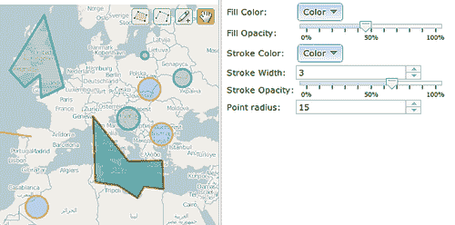
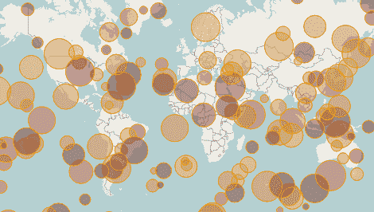
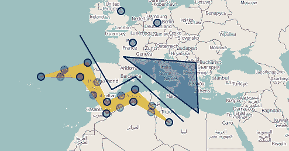
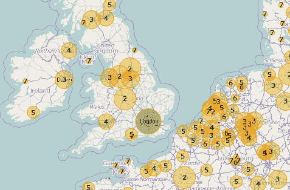
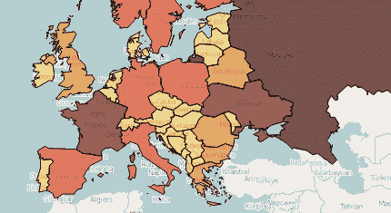
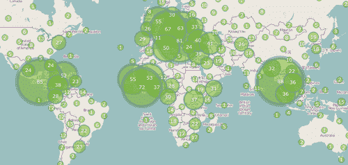

# 第七章。样式化特征

在本章中，我们将介绍：

+   使用符号化器对特征进行样式化

+   使用 StyleMap 和替换特征属性来改进样式

+   玩转 StyleMap 和渲染意图

+   使用唯一值规则进行工作

+   定义自定义规则以样式化特征

+   样式化聚合特征

# 简介

一旦我们知道了如何处理矢量图层，例如添加新特征或修改现有特征，我们可能会想到的问题就是：如何对它们进行样式化？

特征的视觉表示，即**样式**，是 GIS 应用中最重要的概念之一。它不仅从用户体验或设计师的角度来看很重要，而且作为信息需求也很重要，例如，用于识别符合某些规则的特征。

我们可视化特征的方式不仅对我们使应用程序更具吸引力很重要，而且也有助于改善我们向用户传达信息的方式。例如，给定一组代表某些温度的点，如果我们对最热的区域感兴趣，我们可以用不同的半径和颜色值来表示它们。这样，较小的半径和接近蓝色的颜色意味着冷区，而较大的半径和接近红色的颜色意味着热区。

OpenLayers 在样式化特征方面提供了很高的灵活性，这最初可能看起来有点复杂。例如，符号化器、StyleMap、规则或过滤器等概念都与样式化过程相关。

让我们看看以下菜谱中的所有这些内容。

# 使用符号化器对特征进行样式化

要查看样式化特征的最低形式，我们将创建一个小型地图编辑器，允许通过指定一些样式属性来添加新特征：



每个`OpenLayers.Feature.Vector`实例都可以与其关联一个样式。这个样式被称为**符号化器**，它只是一个具有一些字段的 JavaScript 对象，这些字段指定了填充颜色、描边等。例如：

```js
{ 
    fillColor: "#ee9900", 
    fillOpacity: 0.4, 
    strokeColor: "#ee9900", 
    strokeOpacity: 1, 
    strokeWidth: 1 
}

```

在代码中，每次要向地图添加特征时，代码将从左侧的控件中获取填充和描边属性，并为新特征创建一个新的符号化器哈希值。

## 准备工作

源代码有两个主要部分，一个用于 HTML，其中放置了所有控件，另一个用于 JavaScript 代码。

HTML 部分包含大量与选择填充和描边属性相关的代码。这些控件来自 Dojo Toolkit 项目([`dojotoolkit.org`](http://dojotoolkit.org))，因为它们不是本菜谱的目标，所以我们没有在这里介绍。我们鼓励读者查看本书的代码包。

让我们看看 JavaScript 代码。

## 如何操作...

1.  在创建包含 OpenLayers 依赖项的 HTML 文件（参见 *准备就绪* 部分中的 HTML 代码）后，在 `div` 元素中创建 `map` 实例，其标识符为 `ch07_using_symbolizers`，并添加一个基本图层：

    ```js
        // Create the map using the specified DOM element
        var map = new OpenLayers.Map("ch07_using_symbolizers");

        var osm = new OpenLayers.Layer.OSM();
        map.addLayer(osm);

        map.setCenter(new OpenLayers.LonLat(0,0), 3)

    ```

1.  现在，添加一个矢量层，其中将放置新特征：

    ```js
        var vectorLayer = new OpenLayers.Layer.Vector("Features");
        vectorLayer.events.register('beforefeatureadded', vectorLayer, setFeatureStyle);
        map.addLayer(vectorLayer);

    ```

1.  添加 `OpenLayers.Control.EditingToolbar` 控件，允许向之前的矢量层添加新特征：

    ```js
        var editingControl = new OpenLayers.Control.EditingToolbar(vectorLayer);
        map.addControl(editingControl);

    ```

1.  添加负责获取并应用于新特征的样式的代码：

    ```js
        function setFeatureStyle(event) {
            var fillColor = dijit.byId('fillColor').get('value');
            var fillOpacity = dijit.byId('fillOpacity').get('value')/100;
            var strokeColor = dijit.byId('strokeColor').get('value');
            var strokeWidth = dijit.byId('strokeWidth').get('value');
            var strokeOpacity = dijit.byId('strokeOpacity').get('value')/100;
            var pointRadius = dijit.byId('pointRadius').get('value');

            var style = OpenLayers.Util.extend({}, OpenLayers.Feature.Vector.style['default']);
            style.fillColor = fillColor;
            style.fillOpacity = fillOpacity;
            style.strokeColor = strokeColor;
            style.strokeWidth = strokeWidth;
            style.strokeOpacity = strokeOpacity;
            style.pointRadius = pointRadius;

            event.feature.style = style;
        }

    ```

### 它是如何工作的...

理念是，每次使用 EditingToolbar 控件将特征添加到图层时，创建一个符号化器并将其应用于新特征。

第一步是在矢量层中注册一个 `beforefeatureadded` 事件监听器，以便我们能在每次新特征即将添加时得到通知：

```js
    vectorLayer.events.register('beforefeatureadded', vectorLayer, setFeatureStyle);

```

每次添加新特征时都会调用 `setFeatureStyle` 函数。每次调用都会传递一个 `event` 参数，指向要添加的特征（`event.feature`）和矢量层的引用（`event.object`）。

### 提示

`event.object` 引用了在 `event.register(event_type, object, listener)` 方法中作为 `object` 参数传递的对象。

```js
    function setFeatureStyle(event) {
        var fillColor = dijit.byId('fillColor').get('value');
        var fillOpacity = dijit.byId('fillOpacity').get('value')/100;
        var strokeColor = dijit.byId('strokeColor').get('value');
        var strokeWidth = dijit.byId('strokeWidth').get('value');
        var strokeOpacity = dijit.byId('strokeOpacity').get('value')/100;
        var pointRadius = dijit.byId('pointRadius').get('value');

        var style = OpenLayers.Util.extend({}, OpenLayers.Feature.Vector.style['default']);
        style.fillColor = fillColor;
        style.fillOpacity = fillOpacity;
        style.strokeColor = strokeColor;
        style.strokeWidth = strokeWidth;
        style.strokeOpacity = strokeOpacity;
        style.pointRadius = pointRadius;

        event.feature.style = style;
    }

```

一旦我们从 Dojo 小部件中获取属性值，我们就创建一个新的符号化器。

`OpenLayers.Feature.Vector` 类在 `style` 数组属性中定义了一些样式符号化器，因此最快的方式是复制其中之一（实际上我们已经扩展了它），然后修改其一些属性。

### 更多内容...

在这里可能出现的疑问是：在样式化时，是应用于矢量层的规则优先，还是应用于单个特征的符号化器优先？

答案是：样式从下到上应用，也就是说，如果我们在一个特征中指定了符号化器，则它将被用来渲染它，否则，任何分配给矢量层的规则或 StyleMap 都将应用于其特征。

### 参见

+   *使用 StyleMap 和替换特征属性改进样式* 的配方

+   *玩转 StyleMap 和渲染意图* 的配方

# 使用 StyleMap 和替换特征属性改进样式

我们可以总结说，有三种方式来样式化一个特征。第一种是直接将符号化器散列应用于特征（参见 *使用符号化器样式化特征* 配方）。第二种是将样式应用于图层，使得其中的每个特征都变得样式化。

在许多情况下，第二种方法是首选的。这是一种通用的方式，通过设置一些样式和规则来样式化图层中的所有特征。

这个配方展示了我们如何使用 `StyleMap` 实例，以及我们如何轻松地样式化图层中的所有点，而无需对每个特征应用样式。此配方的输出应类似于以下截图：



此外，我们将使用的技巧允许我们涉及特征的属性来选择点半径和颜色，更动态地创建它们所有。

## 如何做到这一点...

1.  一旦我们创建了包含 OpenLayers 依赖项的 HTML 文件，就开始创建将包含地图实例的 `div` 元素：

    ```js
    <div id="ch07_styleMap" style="width: 100%; height: 95%;"></div>

    ```

1.  现在，创建地图实例并添加一个基本图层：

    ```js
    <script type="text/javascript">
        // Create the map using the specified DOM element
        var map = new OpenLayers.Map("ch07_styleMap");

        var osm = new OpenLayers.Layer.OSM();
        map.addLayer(osm);

        map.setCenter(new OpenLayers.LonLat(0,0), 2)

    ```

1.  现在，让我们开始定义整个图层的样式。首先为点创建一个调色板：

    ```js
        // Create stylemap for the layer
        var colors = ['#EBC137','#E38C2D','#DB4C2C','#771E10','#48110C'];

    ```

1.  从之前的符号化器哈希创建一个样式实例：

    ```js
        var style = OpenLayers.Util.extend({}, OpenLayers.Feature.Vector.style["default"]);
        style.pointRadius = "${radius}";
        style.fillColor = '${colorFunction}';

        var defaultStyle = new OpenLayers.Style(style, {
            context: {
                colorFunction: function(feature) {
                    return colors[feature.attributes.temp];
                }
            }
        });

    ```

1.  应用所需的 `StyleMap` 创建矢量图层：

    ```js
        // Create the vector layer
        var vectorLayer = new OpenLayers.Layer.Vector("Features", {
            styleMap: new OpenLayers.StyleMap(defaultStyle)
        });
        map.addLayer(vectorLayer);

    ```

1.  最后，创建一些随机点。每个特征将有两个属性 `radius` 和 `temp`，它们具有随机值：

    ```js
        // Create random feature points.
        var pointFeatures = [];
        for(var i=0; i< 150; i++) {
            var px = Math.random() * 360 - 180;
            var py = Math.random() * 170 - 85;

            // Create a lonlat instance and transform it to the map projection.
            var lonlat = new OpenLayers.LonLat(px, py);
            lonlat.transform(new OpenLayers.Projection("EPSG:4326"), new OpenLayers.Projection("EPSG:900913"));

            var pointGeometry = new OpenLayers.Geometry.Point(lonlat.lon, lonlat.lat);
            var pointFeature = new OpenLayers.Feature.Vector(pointGeometry);

            // Add random attributes
            var radius = Math.round(Math.random() * 15 + 4);
            var temp = Math.round(Math.random() * 4);
            pointFeature.attributes.radius = radius;
            pointFeature.attributes.temp = temp;

            pointFeatures.push(pointFeature);
        }
        // Add features to the layer
        vectorLayer.addFeatures(pointFeatures); 

    </script>

    ```

### 它是如何工作的...

让我们来描述首先添加到矢量图层中的随机点特征。

想法是在随机位置创建一些随机点。正因为如此，我们创建了一些随机的 x-y 值，将它们转换为地图坐标，创建几何形状，最后创建一个具有该几何形状的特征：

```js
        var px = Math.random() * 360 - 180;
        var py = Math.random() * 170 - 85;

        // Create a lonlat instance and transform it to the map projection.
        var lonlat = new OpenLayers.LonLat(px, py);
        lonlat.transform(new OpenLayers.Projection("EPSG:4326"), new OpenLayers.Projection("EPSG:900913"));

        var pointGeometry = new OpenLayers.Geometry.Point(lonlat.lon, lonlat.lat);
        var pointFeature = new OpenLayers.Feature.Vector(pointGeometry);

```

此外，我们在每个特征中设置了一对具有随机值的属性（`radius` 和 `temp`）：

```js
        // Add random attributes
        var radius = Math.round(Math.random() * 15 + 4);
        var temp = Math.round(Math.random() * 4);
        pointFeature.attributes.radius = radius;
        pointFeature.attributes.temp = temp;

```

这些属性将在特征样式定义中稍后使用。

让我们来描述矢量图层样式的创建。

我们希望每个特征都使用属性 `radius` 作为点的半径和 `temp` 属性作为点的颜色来表示。

第一步是创建一个通过哈希复制（实际上扩展）的符号化器，它在 `OpenLayers.Feature.Vector.style["default"])` 中定义。

```js
    var style = OpenLayers.Util.extend({}, OpenLayers.Feature.Vector.style["default"]);

```

如果你查看源代码，你会发现 `OpenLayers.Feature.Vector.style["default"])` 被定义为：

```js
{ 
    fillColor: "#ee9900", 
    fillOpacity: 0.4, 
    hoverFillColor: "white", 
    hoverFillOpacity: 0.8, 
    strokeColor: "#ee9900", 
    strokeOpacity: 1, 
    strokeWidth: 1, 
    strokeLinecap: "round", 
    strokeDashstyle: "solid", 
    hoverStrokeColor: "red", 
    hoverStrokeOpacity: 1, 
    hoverStrokeWidth: 0.2, 
    pointRadius: 6, 
    hoverPointRadius: 1, 
    hoverPointUnit: "%", 
    pointerEvents: "visiblePainted", 
    cursor: "inherit" 
}

```

一旦我们有一个新的符号化器副本，我们就更改 `fillColor` 和 `pointRadius` 属性。这里的挑战是什么？嗯，我们不想为这些属性使用固定值，我们希望这些属性从它们所修饰的特征的属性中获取它们的值。

幸运的是，OpenLayers 帮助我们使用 **属性替换** 语法。同样，我们可以按如下方式写入一个字面值：

```js
pointRadius: 15

```

我们可以指定半径值必须来自特征的 `featureRadius` 属性：

```js
pointRadius: '${featureRadius}'

```

因此，在我们的示例中，我们的特征具有属性 `radius`，定义为可以在此处使用的随机值：

```js
    style.pointRadius = "${radius}";

```

与我们可以使用一个属性作为属性值替换一样，我们也可以设置一个必须返回用作属性值的值的函数。这是 `fillColor` 属性的情况：

```js
    style.fillColor = '${colorFunction}';

```

正如我们接下来将要看到的，函数 `colorFunction` 返回一个值，这个值取决于特征的 `temp` 属性，也就是说，我们不想直接使用 `temp` 属性，而想使用从它计算出的值。

不幸的是，属性替换不能直接在应用于特征或图层的符号化哈希中直接使用，它只能通过 `OpenLayers.Style` 实例使用。此外，多亏了 `OpenLayers.Style` 实例，我们可以定义函数，例如 `colorFunction`，用于计算样式属性值。

### 注意

属性替换只能通过 `OpenLayers.Style` 实例使用。

在菜谱中，一旦我们定义了符号化哈希，我们就可以创建一个实例，如下所示：

```js
    var defaultStyle = new OpenLayers.Style(style, {
        context: {
            colorFunction: function(feature) {
                return colors[feature.attributes.temp];
            }
        }
    });

```

第一个参数是之前定义的符号化哈希，它使用了属性的替换功能。第二个参数，`context`，是在渲染特征的过程中传入的对象。在这里，我们定义了所需的函数，例如 `colorFunction`，它将在渲染过程中可用，并将根据每个特征的 `temp` 属性定义 `fillColor` 的值。

到目前为止，我们几乎完成了。唯一剩下的事情就是创建一个使用定义的 `OpenLayers.Style` 实例来样式化特征的向量层。

`OpenLayers.Layer.Vector` 类有一个 `styleMap` 属性，用于指定应用于特征的样式。`OpenLayers.StyleMap` 类可以通过传递不同的参数来实例化，但在这里我们使用之前定义的 `OpenLayers.Style` 样式来创建它：

```js
    var vectorLayer = new OpenLayers.Layer.Vector("Features", {
        styleMap: new OpenLayers.StyleMap(defaultStyle)
    });
    map.addLayer(vectorLayer);

```

现在，我们的菜谱已经完成。正如我们所看到的，我们不需要为每个特征创建符号化并将其应用到每个特征上。我们唯一需要做的是定义一个样式并将其分配给向量层。

### 参见

+   *玩转 StyleMap 和渲染意图* 的菜谱

+   *使用符号化样式化特征* 的菜谱

+   第三章 中 *Creating features programmatically* 的菜谱，*Vector Layers*

# 玩转 StyleMap 和渲染意图

有一些控件，如 `SelectFeature`、`ModifyFeature` 或 `EditingToolbar`，根据特征当前的状态（即是否被选中或正在被编辑）改变特征的风格。OpenLayers 如何管理这一点？答案是，通过 **渲染意图**：



这个菜谱展示了我们如何修改每个渲染意图所使用的样式，以改变我们应用程序的外观。

这样，特征将以蓝色而不是橙色在地图上绘制。将要创建的临时特征将以绿色绘制。最后，那些被选中的特征，或者处于修改过程中的特征，将以橙色绘制。

## 如何做到这一点...

1.  创建一个新的 HTML 文件并添加 OpenLayers 依赖项。第一步是添加 `div` 元素以容纳地图实例：

    ```js
    <div id="ch07_rendering_intents" style="width: 100%; height: 95%;"></div>

    ```

1.  在 JavaScript 部分，初始化地图实例，添加基本图层，并定位视口：

    ```js
    <script type="text/javascript">
        // Create the map using the specified DOM element
        var map = new OpenLayers.Map("ch07_rendering_intents");

        var osm = new OpenLayers.Layer.OSM();
        map.addLayer(osm);

        map.setCenter(new OpenLayers.LonLat(0,0), 2)

    ```

1.  现在我们将创建三种不同的样式：

    ```js
        var defaultStyle = new OpenLayers.Style({
            fillColor: "#336699",
            fillOpacity: 0.4, 
            hoverFillColor: "white",
            hoverFillOpacity: 0.8,
            strokeColor: "#003366",
            strokeOpacity: 0.8,
            strokeWidth: 2,
            strokeLinecap: "round",
            strokeDashstyle: "solid",
            hoverStrokeColor: "red",
            hoverStrokeOpacity: 1,
            hoverStrokeWidth: 0.2,
            pointRadius: 6,
            hoverPointRadius: 1,
            hoverPointUnit: "%",
            pointerEvents: "visiblePainted",
            cursor: "inherit"
        });
        var selectStyle = new OpenLayers.Style({
            fillColor: "#ffcc00",
            fillOpacity: 0.4, 
            hoverFillColor: "white",
            hoverFillOpacity: 0.6,
            strokeColor: "#ff9900",
            strokeOpacity: 0.6,
            strokeWidth: 2,
            strokeLinecap: "round",
            strokeDashstyle: "solid",
            hoverStrokeColor: "red",
            hoverStrokeOpacity: 1,
            hoverStrokeWidth: 0.2,
            pointRadius: 6,
            hoverPointRadius: 1,
            hoverPointUnit: "%",
            pointerEvents: "visiblePainted",
            cursor: "pointer"
        });
        var temporaryStyle = new OpenLayers.Style({
            fillColor: "#587058",
            fillOpacity: 0.4, 
            hoverFillColor: "white",
            hoverFillOpacity: 0.8,
            strokeColor: "#587498",
            strokeOpacity: 0.8,
            strokeLinecap: "round",
            strokeWidth: 2,
            strokeDashstyle: "solid",
            hoverStrokeColor: "red",
            hoverStrokeOpacity: 1,
            hoverStrokeWidth: 0.2,
            pointRadius: 6,
            hoverPointRadius: 1,
            hoverPointUnit: "%",
            pointerEvents: "visiblePainted",
            cursor: "inherit"
        });

    ```

1.  然后，创建一个包含作为三个不同渲染意图创建的三个样式的 `StyleMap` 实例：

    ```js
        var styleMap = new OpenLayers.StyleMap({
            'default': defaultStyle,
            'select': selectStyle,
            'temporary': temporaryStyle
        });

    ```

1.  现在，我们可以使用之前的 `StyleMap` 实例创建一个矢量层：

    ```js
        var vectorLayer = new OpenLayers.Layer.Vector("Features", {
            styleMap: styleMap
        });
        map.addLayer(vectorLayer);

    ```

1.  最后，我们将向地图添加一些控件，以允许添加新特征和修改现有特征：

    ```js
        var editingControl = new OpenLayers.Control.EditingToolbar(vectorLayer);
        var modifyControl = new OpenLayers.Control.ModifyFeature(vectorLayer, {
            toggle: true
        });
        editingControl.addControls([modifyControl]);
        map.addControl(editingControl);
    </script>

    ```

### 如何工作...

每个矢量层都可以与一个 `OpenLayers.StyleMap` 实例相关联。单独的 `StyleMap` 实例存储一个或多个对 `OpenLayers.Style` 实例的引用，每个实例都充当一个渲染意图：

```js
    var styleMap = new OpenLayers.StyleMap({
        'default': defaultStyle,
        'select': selectStyle,
        'temporary': temporaryStyle
    });

```

每个 `Style` 实例存储有关样式的信息，通常它们是从符号化哈希创建的，如本食谱中所示：

```js
    var defaultStyle = new OpenLayers.Style({
        fillColor: "#336699",
        fillOpacity: 0.4, 
        hoverFillColor: "white",
        hoverFillOpacity: 0.8,
        strokeColor: "#003366",
        strokeOpacity: 0.8,
        strokeWidth: 2,
        strokeLinecap: "round",
        strokeDashstyle: "solid",
        hoverStrokeColor: "red",
        hoverStrokeOpacity: 1,
        hoverStrokeWidth: 0.2,
        pointRadius: 6,
        hoverPointRadius: 1,
        hoverPointUnit: "%",
        pointerEvents: "visiblePainted",
        cursor: "inherit"
    });

```

在这里，我们为三种渲染意图定义了新的样式：`default`、`select` 和 `temporary`，这些是大多数控件使用的已知渲染意图。

`StyleMap` 可以存储我们想要的任意多的渲染意图，我们并不局限于这三种常用的渲染意图。例如，我们可以定义如 `red` 或 `hidden` 这样的渲染意图，并为它们关联一个 `Style`，使其以红色渲染特征或完全不显示。

### 小贴士

通过在样式的符号化哈希中设置属性 `display` 为 `"none"`，我们可以隐藏特征。这通常用于 `delete` 渲染意图。

`default`、`select` 和 `temporary` 这样的渲染意图在 OpenLayers 的许多组件中被广泛使用。这样，当特征被渲染时，使用 `default` 样式。当使用 `OpenLayers.Control.SelectFeature` 控件选择特征时，使用 `select` 渲染意图来渲染特征。当我们使用 `OpenLayers.Control.EditingToolbar`（内部使用 `OpenLayers.Control.DrawFeature`）创建新特征时，控件使用在 `temporary` 渲染意图上定义的样式来渲染特征。

因此，创建新的渲染意图没有问题。此外，我们可以创建我们自己的自定义控件，并让它们决定图层必须使用哪种渲染意图来渲染特征。

最后，让我们简要描述一下创建带有控制面板的代码。

首先，我们创建了一个 `OpenLayers.Control.EditingToolbar` 实例：

```js
    var editingControl = new OpenLayers.Control.EditingToolbar(vectorLayer);

```

这是一个包含激活/停用一些 `OpenLayers.Control.DrawFeature` 控件的按钮的 `OpenLayers.Control.Panel` 控件。接下来，我们创建了一个 `OpenLayers.ControlModifyFeature` 实例，这是一个单独的控件，我们将其添加到 EditingToolbar 控件中，使其作为一个新按钮可见：

```js
    var modifyControl = new OpenLayers.Control.ModifyFeature(vectorLayer, {
        toggle: true
    });
    editingControl.addControls([modifyControl]);

```


在截图上，`ModifyFeature` 控件由交叉图标表示。

### 还有更多...

样式化和渲染一个特征的流程是复杂的。以下行总结了特征样式化过程中涉及的主要步骤。

对于每个特征，矢量层必须渲染以下内容：

+   调用方法 `OpenLayers.Layer.Vector.drawFeature(feature, style)`。它接受两个参数：要绘制的 `feature` 和要使用的 `style`。它可以是符号化器或渲染意图字符串。

+   如果要素有一个 `style` 属性，它将用于渲染要素。

+   否则，如果矢量层有一个 `style` 属性，它将用于渲染要素。

+   否则，如果提供了 `style` 参数，并且它是一个样式符号化器，那么它将用于渲染要素。

+   如果 `style` 是一个渲染意图字符串，那么将使用 `createSymbolizer` 方法从与渲染意图关联的 `Style` 属性创建一个符号化器。这是在符号化器内合并要素属性的地方。

### 参见

+   使用符号化器的 *风格化要素* 菜谱

+   *使用 StyleMap 和替换要素属性来改进样式* 菜谱

# 使用唯一值规则工作

通常，我们不仅根据要素所代表的内容来风格化要素，例如城市或村庄，我们还根据它们的属性来风格化，例如公民数量、成立年份和广场数量。

为了帮助这些情况，OpenLayers 提供了我们定义规则以决定如何风格化要素的可能性。例如，我们可以定义一个规则，对于人口超过 100,000 的所有城市要素，可以渲染一个半径为 20、颜色为棕色的点，而对于人口少于 100,000 的城市，可以渲染一个半径为 10、颜色为橙色、半透明的点。

从规则的世界开始，唯一值规则的概念是我们能找到的最简单的情况。这个想法很简单，根据要素属性的值应用一种样式或另一种样式。

在这个菜谱中，我们将加载一个 GeoJSON 文件，包含世界上的一些城市，并应用一个规则，该规则将根据流行度排名属性（`POP_RANK` 属性）设置点的半径，如下面的截图所示：



## 如何做到这一点...

1.  开始创建一个新的 HTML 文件，并添加 OpenLayers 依赖项。添加一个 `div` 元素来包含地图实例：

    ```js
    <div id="ch07_unique_value_rules" style="width: 100%; height: 95%;"></div>

    ```

1.  在 `script` 元素中，添加初始化地图和添加基本层的所需代码：

    ```js
    <script type="text/javascript">
        // Create the map using the specified DOM element
        var map = new OpenLayers.Map("ch07_unique_value_rules");

        var osm = new OpenLayers.Layer.OSM();
        map.addLayer(osm);

        map.setCenter(new OpenLayers.LonLat(0,0), 4)

    ```

1.  现在定义要在 `POP_RANK` 特征属性上使用的不同样式：

    ```js
        var styles = {
          7: { pointRadius: 4, label: "${POP_RANK}" },
          6: { pointRadius: 7, label: "${POP_RANK}" },
          5: { pointRadius: 10, label: "${POP_RANK}" },
          4: { pointRadius: 13, label: "${POP_RANK}" },
          3: { pointRadius: 15, label: "${POP_RANK}" },
          2: { pointRadius: 18, label: "${POP_RANK}", fillColor: "yellow" },
          1: { pointRadius: 21, label: "${POP_RANK}", fillColor: "green" }
        };

    ```

1.  创建一个 `StyleMap` 实例并定义一个唯一值规则：

    ```js
        var styleMap = new OpenLayers.StyleMap();
        styleMap.addUniqueValueRules("default", "POP_RANK", styles);

    ```

1.  最后，添加一个包含世界上一些城市的矢量层，并使用之前的 `StyleMap` 实例：

    ```js
        map.addLayer(new OpenLayers.Layer.Vector("World Cities (GeoJSON)", {
            protocol: new OpenLayers.Protocol.HTTP({
                url: "http://localhost:8080/openlayers-cookbook/recipes/data/world_cities.json",
                format: new OpenLayers.Format.GeoJSON()
            }),
            styleMap: styleMap,
            strategies: [new OpenLayers.Strategy.Fixed()]
        }));
    </script>

    ```

### 它是如何工作的...

这个菜谱的大部分魔法都集中在 `OpenLayers.StyleMap.addUniqueValueRules()` 方法上。所以，这个句子：

```js
    styleMap.addUniqueValueRules("default", "POP_RANK", styles);

```

表示，根据 `POP_RANK` 属性的值，应用指定的 `style` 属性到 `default` 渲染意图。

一旦我们查看哈希样式，它就更有意义了。根据 `POP_RANK` 的值，代表城市的点的半径将在 `4` 和 `21` 之间变化：

```js
    var styles = {
      7: { pointRadius: 4, label: "${POP_RANK}" },
      6: { pointRadius: 7, label: "${POP_RANK}" },
      5: { pointRadius: 10, label: "${POP_RANK}" },
      4: { pointRadius: 13, label: "${POP_RANK}" },
      3: { pointRadius: 15, label: "${POP_RANK}" },
      2: { pointRadius: 18, label: "${POP_RANK}", fillColor: "yellow" },
      1: { pointRadius: 21, label: "${POP_RANK}", fillColor: "green" }
    };

```

最后，我们在地图上添加了一个矢量层，该层使用之前创建的 `StyleMap` 实例，其中定义了唯一值规则：

```js
    map.addLayer(new OpenLayers.Layer.Vector("World Cities (GeoJSON)", {
        protocol: new OpenLayers.Protocol.HTTP({
            url: "http://localhost:8080/openlayers-cookbook/recipes/data/world_cities.json",
            format: new OpenLayers.Format.GeoJSON()
        }),
        styleMap: styleMap,
        strategies: [new OpenLayers.Strategy.Fixed()]
    }));

```

此外，矢量层使用 `OpenLayers.Protocol.HTTP` 实例来加载 GeoJSON 文件，并使用 `OpenLayers.Strategy.Fixed` 实例仅加载一次源数据。

### 还有更多...

通过 `addUniqueValueRules()` 方法使用唯一值规则很简单，但正如我们所理解的，它只适用于离散值范围。

此外，灵活性较差，因为它相当于一个 *等于* 规则，我们无法将值范围映射到相同的样式。

### 参见

+   *玩转 StyleMap 和渲染意图* 菜谱

+   *定义自定义规则以样式化特征* 菜谱

+   *使用点特征作为标记* 菜谱在 第三章，*矢量层*

+   第三章中的 *使用弹出窗口工作* 菜谱，*矢量层*

# 定义自定义规则以样式化特征

在继续本菜谱之前，我们将简要解释一下。目标，就像本章中的其他菜谱一样，是根据特征的属性值或特征类型来样式化矢量层的特征。

因此，`OpenLayers.Layer.Vector` 层类可以与一个 `OpenLayers.StyleMap` 实例相关联，该实例确定如果只有一个 `OpenLayers.Style`，则层的默认样式，或者如果包含多个 `OpenLayers.Style`，则可以应用于每个渲染意图的样式集。以自己的方式，每个 `OpenLayers.Style` 实例都可以以两种形式使用：

+   具有作为应用于特征的默认样式的符号化器散列

+   与它关联一些 `OpenLayers.Rule` 实例

这里我们来到了本菜谱的主要概念，即**规则**。

规则不过是一个过滤器（具体来说是 `OpenLayers.Filter`）和符号化器之间的连接，如果过滤器匹配特征，则应用符号化器。

这简单的事情为我们提供了很多灵活性和样式化特征的强大功能。除了可以使用具有属性替换的符号化器之外，我们还可以使用 OpenLayers 提供的过滤器集合：比较过滤器、空间过滤器或逻辑过滤器。

本菜谱的目标是加载一个包含欧洲国家的 GML 文件，并根据它们的 `AREA` 属性对其进行样式化，如下面的截图所示：



## 如何做...

1.  一旦创建了包含 OpenLayers 依赖项的 HTML 文件，请添加 `div` 元素以容纳地图：

    ```js
    <div id="ch07_custom_rules" style="width: 100%; height: 95%;"></div>

    ```

1.  在 JavaScript 代码部分，初始化地图，将 OpenStreetMap 作为底图，并将地图中心定位在所需位置：

    ```js
    <script type="text/javascript">
        // Create the map using the specified DOM element
        var map = new OpenLayers.Map("ch07_custom_rules");

        var osm = new OpenLayers.Layer.OSM();
        map.addLayer(osm);

        map.setCenter(new OpenLayers.LonLat(40,50).transform(new OpenLayers.Projection("EPSG:4326"), 
        new OpenLayers.Projection("EPSG:900913")), 3);

    ```

1.  现在，定义五个不同的规则，根据特征的 `AREA` 属性来样式化元素。以下代码包含检查值是否小于 10,000 的规则：

    ```js
        var aRule = new OpenLayers.Rule({
            filter: new OpenLayers.Filter.Comparison({
                type: OpenLayers.Filter.Comparison.LESS_THAN,
                property: "AREA",
                value: 10000
            }),
            symbolizer: {
                fillColor: "#EBC137",
                fillOpacity: 0.5, 
                strokeColor: "black"
            }
        });

    ```

1.  以下代码包含检查值是否在 10,000 到 25,000 之间的规则：

    ```js
        var bRule = new OpenLayers.Rule({
            filter: new OpenLayers.Filter.Logical({
                type: OpenLayers.Filter.Logical.AND,
                filters: [
                    new OpenLayers.Filter.Comparison({
                        type: OpenLayers.Filter.Comparison.GREATER_THAN,
                        property: "AREA",
                        value: 10000
                    }),
                    new OpenLayers.Filter.Comparison({
                        type: OpenLayers.Filter.Comparison.LESS_THAN_OR_EQUAL_TO,
                        property: "AREA",
                        value: 25000
                    })
                ]
            }),
            symbolizer: {
                fillColor: "#E38C2D",
                fillOpacity: 0.7, 
                strokeColor: "black"
            }
        });

    ```

1.  检查值是否在 25,000 到 50,000 之间的规则：

    ```js
        var cRule = new OpenLayers.Rule({
            filter: new OpenLayers.Filter.Logical({
                type: OpenLayers.Filter.Logical.AND,
                filters: [
                    new OpenLayers.Filter.Comparison({
                        type: OpenLayers.Filter.Comparison.GREATER_THAN,
                        property: "AREA",
                        value: 25000
                    }),
                    new OpenLayers.Filter.Comparison({
                        type: OpenLayers.Filter.Comparison.LESS_THAN_OR_EQUAL_TO,
                        property: "AREA",
                        value: 50000
                    })
                ]
            }),
            symbolizer: {
                fillColor: "#DB4C2C",
                fillOpacity: 0.7, 
                strokeColor: "black"
            }
        });

    ```

1.  检查值是否在 50,000 到 100,000 之间的规则：

    ```js
        var dRule = new OpenLayers.Rule({
            filter: new OpenLayers.Filter.Logical({
                type: OpenLayers.Filter.Logical.AND,
                filters: [
                    new OpenLayers.Filter.Comparison({
                        type: OpenLayers.Filter.Comparison.GREATER_THAN,
                        property: "AREA",
                        value: 50000
                    }),
                    new OpenLayers.Filter.Comparison({
                        type: OpenLayers.Filter.Comparison.LESS_THAN_OR_EQUAL_TO,
                        property: "AREA",
                        value: 100000
                    })
                ]
            }),
            symbolizer: {
                fillColor: "#771E10",
                fillOpacity: 0.7, 
                strokeColor: "black"
            }
        });

    ```

1.  最后，检查值是否大于 100,000 的规则：

    ```js
        var eRule = new OpenLayers.Rule({
            filter: new OpenLayers.Filter.Comparison({
                type: OpenLayers.Filter.Comparison.GREATER_THAN_OR_EQUAL_TO,
                property: "AREA",
                value: 100000
            }),
            symbolizer: {
                fillColor: "#48110C",
                fillOpacity: 0.7, 
                strokeColor: "black"
            }
        });

    ```

1.  使用之前定义的常规规则创建样式：

    ```js
        var style = new OpenLayers.Style();
        style.addRules([aRule, bRule, cRule, dRule, eRule]);

    ```

1.  最后，创建一个矢量层，加载 GML 文件并使用之前的样式：

    ```js
        map.addLayer(new OpenLayers.Layer.Vector("World Cities (GeoJSON)", {
            protocol: new OpenLayers.Protocol.HTTP({
                url: "http://localhost:8080/openlayers-cookbook/recipes/data/europe.gml",
                format: new OpenLayers.Format.GML()
            }),
            styleMap: new OpenLayers.StyleMap(style),
            strategies: [new OpenLayers.Strategy.Fixed()]
        }));
    </script>

    ```

### 它是如何工作的...

如配方开头所述，`OpenLayers.Style`实例接受一组`OpenLayers.Rule`实例来样式化特征。

给定一个规则，所有匹配指定`OpenLayers.Filter`的特征都将使用指定的符号化哈希进行样式化，并且多亏了过滤器，我们有足够的灵活性来创建比较或逻辑过滤器。

在代码中，我们创建了五个过滤器。让我们描述其中两个。

`aRule`规则由一个比较过滤器组成，匹配所有具有小于 10,000 的`AREA`属性值的特征：

```js
    var aRule = new OpenLayers.Rule({
        filter: new OpenLayers.Filter.Comparison({
            type: OpenLayers.Filter.Comparison.LESS_THAN,
            property: "AREA",
            value: 10000
        }),
        symbolizer: {
            fillColor: "#EBC137",
            fillOpacity: 0.5, 
            strokeColor: "black"
        }
    });

```

`bRule`使用更复杂的规则。在这种情况下，它是一个由两个比较过滤器组成的逻辑`AND`过滤器。它匹配所有特征，检查它们的`AREA`属性是否大于 10,000 且小于或等于 25,000：

```js
    var bRule = new OpenLayers.Rule({
        filter: new OpenLayers.Filter.Logical({
            type: OpenLayers.Filter.Logical.AND,
            filters: [
                new OpenLayers.Filter.Comparison({
                    type: OpenLayers.Filter.Comparison.GREATER_THAN,
                    property: "AREA",
                    value: 10000
                }),
                new OpenLayers.Filter.Comparison({
                    type: OpenLayers.Filter.Comparison.LESS_THAN_OR_EQUAL_TO,
                    property: "AREA",
                    value: 25000
                })
            ]
        }),
        symbolizer: {
            fillColor: "#E38C2D",
            fillOpacity: 0.7, 
            strokeColor: "black"
        }
    });

```

一旦我们创建了所有所需的规则，我们就可以创建一个`OpenLayers.Style`实例：

```js
    var style = new OpenLayers.Style();
    style.addRules([aRule, bRule, cRule, dRule, eRule]);

```

然后将其应用于矢量层：

```js
    map.addLayer(new OpenLayers.Layer.Vector("World Cities (GeoJSON)", {
        protocol: new OpenLayers.Protocol.HTTP({
            url: "http://localhost:8080/openlayers-cookbook/recipes/data/europe.gml",
            format: new OpenLayers.Format.GML()
        }),
        styleMap: new OpenLayers.StyleMap(style),
        strategies: [new OpenLayers.Strategy.Fixed()]
    }));

```

### 注意

我们创建了一个`OpenLayers.StyleMap`实例，只传递一个样式，而不是每个期望的渲染意图的样式。这意味着层中不会有渲染意图，或者换句话说，所有渲染意图都将使用相同的样式渲染。

因为矢量层必须从我们的服务器上的 GML 文件中读取数据，所以我们使用了`OpenLayers.Protocol.HTTP`实例，该实例从指定的 URL 加载文件，并使用`OpenLayers.Format.GML`格式的实例来读取它。

最后，为了使地图视口居中，我们需要转换坐标。

因为地图的基本层是 OpenStreetMap，这使得地图的投影变为 EPSG:900913，而我们在指定中心位置时使用的是 EPSG:4326。因此，我们需要进行转换：

```js
  map.setCenter(new OpenLayers.LonLat(40,50).transform(new OpenLayers.Projection("EPSG:4326"), 
    new OpenLayers.Projection("EPSG:900913")), 3);

```

### 还有更多...

在我们的代码中，我们使用以下句子创建了样式：

```js
    var style = new OpenLayers.Style();
    style.addRules([aRule, bRule, cRule, dRule, eRule]);

```

但是`OpenLayers.Style`构造函数可以接受两个参数：一个符号化哈希，用作默认样式，以及一组选项，其中我们需要指定实例属性。考虑到这一点，我们也可以这样实例化样式：

```js
    var style = new OpenLayers.Style({
        our_default_style
    }, {
        rules: [aRule, bRule, cRule, dRule, eRule]
    });

```

### 参见

+   使用唯一值规则进行样式化配方

+   使用符号化进行特征样式化配方

+   使用 StyleMap 改进样式以及替换特征属性的配方

# 样式化聚类特征

当处理大量的特征点时，通常使用聚类策略来避免点重叠并提高渲染性能。

在这个配方中，我们将展示如何轻松地使用聚类策略对矢量层进行样式化：



我们的数据层将读取包含世界上一些城市的 GeoJSON 文件。样式将具有以下特征：

+   对于每个聚类，我们将显示包含的要素数量

+   点半径和边框将取决于包含的要素数量，包含的要素越多，半径就越大

## 如何做到这一点...

1.  开始添加地图的`div`元素：

    ```js
    <div id="ch07_cluster_number_style" style="width: 100%; height: 95%;"></div>

    ```

1.  实例化一个`OpenLayers.Map`实例：

    ```js
    <script type="text/javascript">
        // Create the map using the specified DOM element
        var map = new OpenLayers.Map("ch07_cluster_number_style");

    ```

1.  将 OpenStreetMap 作为基本图层并居中视口：

    ```js
        var osm = new OpenLayers.Layer.OSM();
        map.addLayer(osm);

        map.setCenter(new OpenLayers.LonLat(0,20).transform(new OpenLayers.Projection("EPSG:4326"), 
        new OpenLayers.Projection("EPSG:900913")), 2);

    ```

1.  从 GeoJSON 文件加载数据并应用所需的样式：

    ```js
        var cities = new OpenLayers.Layer.Vector("World Cities (GeoJSON)", {
            protocol: new OpenLayers.Protocol.HTTP({
                url: "http://localhost:8080/openlayers-cookbook/recipes/data/world_cities.json",
                format: new OpenLayers.Format.GeoJSON()
            }),
            strategies: [new OpenLayers.Strategy.Fixed(), new OpenLayers.Strategy.Cluster({distance: 25})],
            styleMap: new OpenLayers.StyleMap({
                'default': new OpenLayers.Style({
                    strokeWidth: '${strokeFunction}',
                    strokeOpacity: 0.5,
                    strokeColor: "#88aaaa",
                    fillColor: "#99CC55",
                    fillOpacity: 0.5,
                    pointRadius: '${radiusfunction}',
                    label: "${count}",
                    fontColor: "#ffffff"
                }, {
                    context: {
                        strokeFunction: function(feature) {
                            var count = feature.attributes.count;
                            var stk = Math.max(0.1 * count, 1);
                            return stk;
                        },
                        radiusFunction: function(feature) {
                            var count = feature.attributes.count;
                            var radius = Math.max(0.60 * count, 7);
                            return radius;
                        }
                    }
                })
            })
        });
        map.addLayer(cities);
    </script>

    ```

### 它是如何工作的...

在创建地图实例并添加基本图层后，我们已将视口居中。注意我们如何将坐标从 EPSG:4326（纬度/经度）转换为地图使用的 EPSG:900913（隐式用于 OpenStreetMap 图层）：

```js
    map.setCenter(new OpenLayers.LonLat(0,20).transform(new OpenLayers.Projection("EPSG:4326"), 
    new OpenLayers.Projection("EPSG:900913")), 2);

```

接下来，我们添加了矢量图层：

```js
    var cities = new OpenLayers.Layer.Vector("World Cities (GeoJSON)", {
        protocol: new OpenLayers.Protocol.HTTP({
            url: "http://localhost:8080/openlayers-cookbook/recipes/data/world_cities.json",
            format: new OpenLayers.Format.GeoJSON()
        }),
        strategies: [new OpenLayers.Strategy.Fixed(), new OpenLayers.Strategy.Cluster({distance: 25})],
        styleMap: new OpenLayers.StyleMap({
            'default': ...
        })
    });

```

为了从我们的服务器加载 GeoJSON 文件，我们使用了`OpenLayers.Protocol.HTTP`实例和`OpenLayers.Format.GeoJSON`格式来读取它。

对于图层策略，我们指定了`OpenLayers.Strategy.Fixed`以加载内容一次，以及`OpenLayers.Strategy.Cluster({distance: 25})`来分组要素。属性`distance`设置了定义两个要素必须进入同一聚类的像素距离。

在这个阶段，在继续食谱之前，我们需要描述聚类过程是如何工作的。

当图层即将渲染时，聚类算法会检查每个要素是否与其他要素过于接近。对于过于接近的要素集，会创建一个新的点（聚类）并渲染。这样可以在地图上大大减少需要绘制的点数。此外，每个聚类点要素将包含它所代表的要素集的引用，以及一个包含要素数量的`count`属性。

返回到我们的代码，让我们看看应用于图层的样式，这是食谱中最重要的事情。

首先，我们为`default`渲染意图设置了样式：

```js
        styleMap: new OpenLayers.StyleMap({
            'default': ...
        })

```

这意味着如果我们使用一些控制来更改图层的渲染意图为不同于默认值，样式可能不同。

### 注意

如果我们不直接传递样式实例来创建`OpenLayers.StyleMap`实例，即不指定渲染意图，那么样式将适用于任何渲染意图：`new OpenLayers.StyleMap(our_style_here)`。

现在，让我们看看为图层定义的`OpenLayers.Style`实例：

```js
new OpenLayers.Style({ 
    strokeWidth: '${strokeFunction}', 
    strokeOpacity: 0.5, 
    strokeColor: "#88aaaa", 
    fillColor: "#99CC55", 
    fillOpacity: 0.5, 
    pointRadius: '${radiusfunction}', 
    label: "${count}", 
    fontColor: "#ffffff" 
}, { 
    context: { 
        strokeFunction: function(feature) { 
            var count = feature.attributes.count; 
            var stk = Math.max(0.1 * count, 1); 
            return stk; 
        }, 
        radiusFunction: function(feature) { 
            var count = feature.attributes.count; 
            var radius = Math.max(0.60 * count, 7); 
            return radius; 
        } 
    } 
})

```

构造函数接收两个参数：一个符号化哈希，它定义了样式属性，以及一组选项。

在符号化哈希中，我们使用了属性替换功能：

```js
    strokeWidth: '${strokeFunction}', 
    ...
    pointRadius: '${radiusfunction}', 
    label: "${count}", 
    ....

```

`count`属性来自聚类点要素的属性，正如我们之前解释的那样。

另一方面，`strokeFunction`和`radiusFunction`不是属性，而是在`OpenLayers.Style`选项的`context`属性中定义的函数。所有符号化属性都是针对`context`对象进行评估的。因此，每当图层即将渲染时，每个函数都会接收到一个特征引用。

在`radiusFunction`的情况下，它根据`count`属性计算点的半径，返回`count`的 60%或`7`之间的最大值：

```js
        radiusFunction: function(feature) { 
            var count = feature.attributes.count; 
            var radius = Math.max(0.60 * count, 7); 
            return radius; 
        } 

```

如我们所见，上下文的使用足够强大，允许我们根据其他特征属性动态设置样式属性。

### 参见

+   *使用 StyleMap 和替换特征属性来改进样式*的配方

+   *定义自定义规则以样式化特征*的配方

+   在第三章的*使用聚类策略*配方中，*矢量图层*
