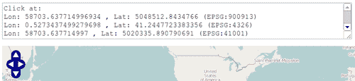
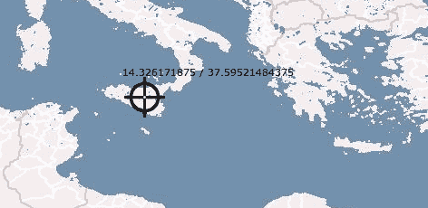
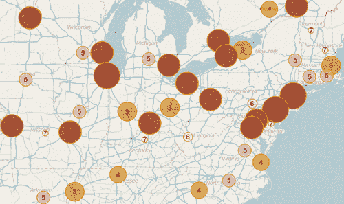
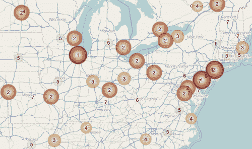
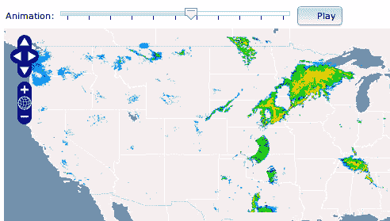

# 第八章. 基础之外

在本章中，我们将介绍：

+   使用投影

+   使用`OpenLayers.Request`请求远程数据

+   创建自定义控件

+   创建自定义渲染器

+   选择与线相交的特征

+   使用图像图层制作动画

# 简介

OpenLayers 是一个庞大且复杂的框架。没有其他选项可以用于一个允许处理许多 GIS 标准、从许多不同的数据源读取、在不同的浏览器技术上进行渲染等的框架。这种力量是有代价的。

OpenLayers 的实现试图尽可能减少对外部库的依赖。这意味着，OpenLayers 需要实现许多在其他项目中可以找到的功能：DOM 元素的操纵、AJAX 请求等。

本章展示了这些功能中的一些，以及我们在日常工作中可能需要的一些其他可能的常见需求，这些需求在其他章节中没有解释，例如创建图层动画或实现自定义控件。因此，本章更适合有经验的 JavaScript 程序员。

# 使用投影

与其他 JavaScript 地图库相比，OpenLayers 允许使用大量的投影。

通常，我们指定地图所需的投影。稍后当向地图添加矢量图层时，我们需要指定图层的投影，以便 OpenLayers 将图层投影中的特征转换为地图投影。

但是，默认情况下，OpenLayers 在投影方面有一个很大的限制：我们只能使用**EPSG:4326**和**EPSG:900913**。为什么？因为投影之间的转换不是一项简单的任务，而且还有其他优秀的项目可以做到这一点。

因此，当我们想要使用 EPSG:4326 和 EPSG:900913 之外的投影时，OpenLayers 使用**Proj4js 库**([`trac.osgeo.org/proj4js`](http://trac.osgeo.org/proj4js))。

### 注意

关于投影的教学超出了本书的范围。EPSG 代码只是对大量可用投影进行分类和识别的一种标准化方式。EPSG:4326 对应于 WGS84（世界大地测量系统），而 EPSG:900913 是球面墨卡托投影，因其被用于谷歌地图而广受欢迎。

让我们看看如何将 Proj4js 与 OpenLayers 集成，以及如何轻松地使用它。想法是创建一个显示地图和文本区域的程序，该文本区域将显示点击位置的坐标：



## 准备工作

我们必须将一些可用的 Proj4js 文件放置在我们的 Web 应用程序目录中。为此，请执行以下步骤：

+   访问 Proj4js 项目的网页并下载分发 ZIP 文件（对于这个食谱，我们使用了[`download.osgeo.org/proj4js/proj4js-1.1.0.zip`](http://download.osgeo.org/proj4js/proj4js-1.1.0.zip)）

+   解压缩下载的文件，并将`proj4js-compressed.js`文件和`defs`文件夹复制到您的网络应用程序文件夹中

## 如何操作...

1.  创建一个 HTML 文件并添加 OpenLayers 依赖项。作为一个依赖项，还包括`Proj4js`库：

    ```js
    <script type="text/javascript" src="img/proj4js-compressed.js"></script>

    ```

1.  现在添加文本区域和地图的代码：

    ```js
    <textarea id="textarea" name="textarea" data-dojo-type="dijit.form.SimpleTextarea" rows="4" cols="80"></textarea>
    <br/><br/>
    <div id="ch08_projections" style="width: 100%; height: 85%;"></div>

    ```

1.  在 JavaScript 部分，创建一个新的控制来管理点击事件：

    ```js
    <script type="text/javascript">
        // Create the click control
        OpenLayers.Control.Click = OpenLayers.Class(OpenLayers.Control, {    

            defaultHandlerOptions: {
                'single': true,
                'double': false,
                'pixelTolerance': 0,
                'stopSingle': false,
                'stopDouble': false
            },

            initialize: function(options) {
                this.handlerOptions = OpenLayers.Util.extend({}, this.defaultHandlerOptions);
                OpenLayers.Control.prototype.initialize.apply(this, arguments); 
                this.handler = new OpenLayers.Handler.Click(
                this, {
                    'click': this.trigger
                }, 
                this.handlerOptions);
            }, 

    ```

1.  在`trigger`函数上，添加以下代码以在`textarea`对象中转换并显示坐标：

    ```js
            trigger: function(e) {
                var lonlatS = map.getLonLatFromViewPortPx(e.xy);
                var lonlatT1 = lonlatS.clone().transform( map.getProjectionObject(), new OpenLayers.Projection("EPSG:41001") );
                var lonlatT2 = lonlatS.clone().transform( map.getProjectionObject(), new OpenLayers.Projection("EPSG:4326") );

                var message = "Click at: \n"+
                    "Lon: " + lonlatS.lon + " , Lat: "+lonlatS.lat + " ("+map.getProjection()+")\n" +
                    "Lon: " + lonlatT2.lon + " , Lat: "+lonlatT2.lat + " (EPSG:4326) \n" +
                    "Lon: " + lonlatT1.lon + " , Lat: "+lonlatT1.lat + " (EPSG:41001) \n";

                dijit.byId("textarea").set('value', message);
            },

            CLASS_NAME: "OpenLayers.Control.Click"
        });

    ```

1.  创建地图实例，添加基本图层，并定位视口：

    ```js
        var map = new OpenLayers.Map("ch08_projections");
        var osm = new OpenLayers.Layer.OSM();
        map.addLayer(osm);
        map.setCenter(new OpenLayers.LonLat(0,0), 2);

    ```

1.  最后，创建一个新的点击控制实例并将其添加到地图中：

    ```js
        var click = new OpenLayers.Control.Click();
        map.addControl(click);
        click.activate();
    </script>

    ```

### 它是如何工作的...

当 Proj4js 代码可用时，OpenLayers 会内部使用 Proj4js 代码。因此，作为 OpenLayers 开发者，我们不需要直接使用 Proj4js API，唯一的要求是在我们的应用程序中添加 Proj4js 依赖项：

```js
<script type="text/javascript" src="img/proj4js-compressed.js"></script>

```

当用户在地图上的某个位置点击时，点击控制（我们稍后将看到）执行`trigger`函数。`e`变量包含所有点击事件的信息，包括像素的 xy 位置。

```js
        trigger: function(e) {
            var lonlatS = map.getLonLatFromViewPortPx(e.xy);
            var lonlatT1 = lonlatS.clone().transform( map.getProjectionObject(), new OpenLayers.Projection("EPSG:41001") );
            var lonlatT2 = lonlatS.clone().transform( map.getProjectionObject(), new OpenLayers.Projection("EPSG:4326") );
            ...
            ...

```

### 注意

确保您使用的投影定义在`defs`文件夹中定义。否则，您需要创建一个新文件，其中包含以 proj4 表示法的转换。

给定一个`OpenLayers.LonLat`实例，我们可以使用`transform()`方法在投影之间进行转换。

### 注意

我们始终可以使用`transform()`方法，但如果不包含 Proj4js 依赖项，它们将仅在 EPSG:4326 和 EPSG:900913 之间进行转换。

多亏了`OpenLayers.Map.getLonLatFromViewPortPx()`方法，我们可以从`OpenLayers.Pixel`转换到`OpenLayers.LonLat`实例。

因为转换方法会修改当前实例，所以我们使用`clone()`方法创建一个新的实例以避免修改源变量。

到目前为止，`trigger`方法可以构建一个消息字符串并将其放置在文本区域中。

最后，让我们简要描述在食谱中使用的点击控制。

第一步是定义新的控制作为`OpenLayers.Control`类的子类：

```js
    OpenLayers.Control.Click = OpenLayers.Class(OpenLayers.Control, {

```

控制将使用`OpenLayers.Handler`，因此在这里我们将定义一些选项：

```js
        defaultHandlerOptions: {
            'single': true,
            'double': false,
            'pixelTolerance': 0,
            'stopSingle': false,
            'stopDouble': false
        },

```

`initialize`方法负责初始化控制实例。首先，我们创建一组选项，作为先前定义的对象和用户作为参数传递的选项的组合（使用`OpenLayers.Util.extend()`方法）：

```js
        initialize: function(options) {
            this.handlerOptions = OpenLayers.Util.extend({}, this.defaultHandlerOptions);
            OpenLayers.Control.prototype.initialize.apply(this, arguments); 
            this.handler = new OpenLayers.Handler.Click(
            this, {
                'click': this.trigger
            }, 
            this.handlerOptions);
        }, 

```

我们已经初始化了一个`OpenLayers.Handler.Click`实例，以便每次检测到用户按下鼠标按钮时执行`trigger`监听器函数。

最后，作为一个好的实践，我们设置`CLASS_NAME`属性，使用一个字符串来标识我们的新控制类：

```js
        CLASS_NAME: "OpenLayers.Control.Click"
    });

```

### 参见

+   在第一章的“*使用地图选项进行游戏*”食谱中，*网络地图基础*

+   在第三章的“*程序化创建要素*”食谱中，*处理矢量图层*

# 使用 OpenLayers.Request 检索远程数据

数据是网络地图应用的基础。我们可以在地图上添加栅格或矢量图层，这将加载图像或矢量信息。

在矢量图层的情况下，多亏了 `OpenLayers.Protocol` 和 `OpenLayers.Format` 子类，我们可以配置图层从不同的来源和不同的格式加载数据。

无论如何，可能会有这样的情况，我们需要自己请求数据，读取特定格式，并添加功能。我们正在讨论如何进行异步 JavaScript 调用。

这个菜谱展示了我们如何使用辅助类 `OpenLayers.Request` 从远程服务器异步请求数据。

这里，我们将请求一个返回随机 x 和 y 值的 URL，我们将这些值作为地图上的点要素进行处理。

### 注意

OpenLayers 是为 GIS 网络开发者设计的框架，因此它被设计为独立于其他项目，例如 jQuery 和 Dojo，它们提供了请求远程数据和实现自己的功能。

## 如何做到这一点...

1.  创建包含 OpenLayers 库依赖关系的 HTML 文件后，添加一个 `div` 元素来容纳地图：

    ```js
    <div id="ch08_requesting" style="width: 100%; height: 95%;"></div>

    ```

1.  在 JavaScript 部分，创建地图实例，添加基本图层，并定位视口：

    ```js
        var map = new OpenLayers.Map("ch08_requesting");
        var osm = new OpenLayers.Layer.OSM();
        map.addLayer(osm);

        // Certer viewport
        map.setCenter(new OpenLayers.LonLat(0,0), 2);

    ```

1.  创建一个矢量图层并将其添加到地图中：

    ```js
        var vectorLayer = new OpenLayers.Layer.Vector("Points");
        map.addLayer(vectorLayer);

    ```

1.  最后，向返回一组随机 x 和 y 值的 `points.php` 工具代码发起请求：

    ```js
        OpenLayers.Request.GET({
            url: "utils/points.php",
            params: {
                num: 100
            },
            success: function(response) {
                var format = new OpenLayers.Format.JSON();

                var points = format.read(response.responseText);
                for(var i=0; i< points.length; i++) {
                    var p = new OpenLayers.Geometry.Point(points[i].x, points[i].y);
                    p.transform(new OpenLayers.Projection("EPSG:4326"), new OpenLayers.Projection("EPSG:900913"));

                    var f = new OpenLayers.Feature.Vector(p);
                    vectorLayer.addFeatures([f]);
                }
            },
            failure: function(response) {
                alert("Sorry, there was an error requesting data !!!");
            }
        });

    ```

### 它是如何工作的...

在 JavaScript 中，`XMLHttpRequest` 对象允许我们与服务器端进行通信。

### 注意

关于如何使用 `XMLHttpRequest` 的更多信息可以在 [`acuriousanimal.com/blog/2011/01/27/working-with-the-javascript-xmlhttprequest-object`](http://acuriousanimal.com/blog/2011/01/27/working-with-the-javascript-xmlhttprequest-object) 和 [`developer.mozilla.org/en/AJAX/Getting_Started`](https://developer.mozilla.org/en/AJAX/Getting_Started) 找到。

由于浏览器之间的兼容性问题，OpenLayers 使用了一个跨浏览器的 W3C 兼容版本的 `XMLHttpRequest` 对象，并通过包装实现了 `OpenLayers.Request` 类。

`OpenLayers.Request` 类实现了 HTTP 方法：`GET, POST, PUT, DELETE, HEAD` 和 `OPTIONS`，并且被其他 OpenLayers 类用于从/向远程服务器（如 `OpenLayers.Protocol.HTTP`）获取/发送数据。

### 注意

HTTP 简介可以在：[`developer.mozilla.org/en/HTTP`](https://developer.mozilla.org/en/HTTP) 找到。

在这个菜谱中，我们使用了 `OpenLayers.Request.GET` 方法，并带有以下参数：

+   `url:` 它是我们将要请求的 URL

+   `params:` 它是一组我们可以发送到 `GET` 请求中的选项参数

+   `success:` 它是一个在成功请求 URL 时将被执行的回调函数

+   `failure:` 它是一个在发生任何问题时将被执行的回调函数

在我们的代码中，我们通过传递一个 `num` 参数请求 `utils/points.php`，这等同于请求 URL `utils/points.php?num=100`：

```js
    OpenLayers.Request.GET({
        url: "utils/points.php",
        params: {
            num: 100
        },
        success: function(response) {
            ...
        },
        failure: function(response) {
            ...
        }
    });

```

如果由于某种原因请求失败，将执行 `failure` 方法并显示一个警告消息。另一方面，如果请求成功，我们将读取返回的响应并将点特征添加到地图中。

`points.php` 脚本根据 `num` 参数返回一个随机的 x 和 y 值，编码为 JSON 数组。调用响应的内容不过是一段需要解释的文本，我们可以在响应的 `responseText` 属性中找到它。

要将 JSON 字符串转换为 JavaScript 对象，我们可以使用 `OpenLayers.Format.JSON` 类：

```js
            var format = new OpenLayers.Format.JSON();            
            var points = format.read(response.responseText);

```

最后，对于每个读取的对象，我们读取 x 和 y 值并创建一个点特征：

```js
            for(var i=0; i< points.length; i++) {
                var p = new OpenLayers.Geometry.Point(points[i].x, points[i].y);
                p.transform(new OpenLayers.Projection("EPSG:4326"), new OpenLayers.Projection("EPSG:900913"));

                var f = new OpenLayers.Feature.Vector(p);
                vectorLayer.addFeatures([f]);
            }

```

### 注意

PHP 脚本返回的 x 和 y 值范围从 -180 到 180（x 轴）和 -80 到 80（y 轴）。因此，我们将坐标从 EPSG:4326 转换为 EPSG:900913，这是地图的基本图层投影。

### 还有更多...

`OpenLayers.Request` 是一个功能强大的类，允许使用几乎任何 HTTP 方法。例如，除了 `GET` 方法外，我们还可以使用 `POST` 方法向服务器发送数据。

### 注意

如果你打算在你的应用程序中广泛使用 AJAX，务必了解**跨域请求（XDR）**和**同源策略**（[`en.wikipedia.org/wiki/Same_origin_policy`](http://en.wikipedia.org/wiki/Same_origin_policy)）的限制。

最后，仔细查看 `OpenLayers.Request` 类的选项。你可以找到选项，例如 `async` 来指定请求是否必须同步执行，`user/password` 来对使用基本身份验证的服务器进行请求，或者 `headers` 来设置请求的 HTTP 头。

### 参见

+   在第三章 *Working with Vector Layers* 的 *Reading features using Protocols directly* 节中，*Working with Vector Layers*，介绍了如何直接使用协议读取特征。

+   在第三章 *Working with Vector Layers* 的 *Reading and creating features from a WKT* 节中，*Working with Vector Layers*，介绍了如何从 WKT 读取和创建特征。

# 创建自定义控件

OpenLayers 提供了大量的控件，可以满足广泛的需求。不幸的是，我们可能需要为构建新的网络应用程序而创建一个新的控件，或者扩展一个现有的控件：



在本食谱中，我们将创建一个新的名为 **Cross** 的控件。该控件将显示一个类似于古代战机的目标选择器的十字准线符号，如图中所示，它将显示所指向的位置。此外，该控件将允许注册点击事件，这些事件将返回当前位置。

## 如何做到这一点...

1.  创建一个 HTML 文件并添加 OpenLayers 依赖项，然后包含我们新控件的代码：

    ```js
    <script type="text/javascript" src="img/crossControl.js"></script>

    ```

1.  接下来，添加两个所需的 CSS 类以控制：

    ```js
    <style>
        .olControlCross {
            width: 48px;
            height: 48px;
            background: url('./recipes/data/target.png') no-repeat;
        }
        .olControlCrossText {
            position: relative;
            top: -10px;
            width: 200px;
            color: black;
        }
    </style>

    ```

1.  现在，添加一个 `div` 元素来包含地图：

    ```js
    <div id="ch08_drawing_cross" style="width: 100%; height: 95%;"></div>

    ```

1.  在 JavaScript 代码中，创建地图实例并添加一个基本图层：

    ```js
        var map = new OpenLayers.Map("ch08_drawing_cross");
        var layer = new OpenLayers.Layer.WMS( "OpenLayers WMS",
        "http://vmap0.tiles.osgeo.org/wms/vmap0", {layers: 'basic'} );
        map.addLayer(layer);

        // Certer viewport
        map.setCenter(new OpenLayers.LonLat(0,0), 2);

    ```

1.  创建交叉控件，将其添加到地图中，并激活它：

    ```js
        var crossControl = new OpenLayers.Control.Cross({
            eventListeners: {
                "crossClick": function(event) {
                    var lonlat = event.lonlat;
                    var message = "Clicked on: " + lonlat.lon + " / " + lonlat.lat;
                    alert(message);
                }
            }
        });
        map.addControl(crossControl);
        crossControl.activate();

    ```

1.  现在，我们将逐步描述我们创建的新控制的源代码。首先，创建一个新的 `crossControl.js` 文件，并开始应用关于控制的最佳实践，编写描述：

    ```js
    /** 
     * Class: OpenLayers.Control.Cross 
     * The Cross control renders a cross in the middle of the map. 
     * 
     * Inherits from: 
     *  - <OpenLayers.Control> 
     */ 

    ```

1.  接下来，创建一个新的 `OpenLayers.Control.Cross` 类，作为 `OpenLayers.Control:` 的子类。

    ```js
    OpenLayers.Control.Cross = OpenLayers.Class(OpenLayers.Control, {

    ```

1.  定义新控制的一组属性和方法。第一步是初始化一个数组，包含我们的控制可以发出的集合事件：

    ```js
        /** 
         * crossClick event is triggered when the cross is clicked by the mouse. 
         */ 
        EVENT_TYPES: ["crossClick"], 

    ```

1.  接下来，有一个 `size` 属性，它用于知道图像控制的大小，并且需要计算确切的控制位置：

    ```js
        /** 
         * Parameter: size 
         * {OpenLayers.Size} with the desired dimension for the image 
         */ 
        size: null, 

    ```

1.  最后一个属性用于存储用作标签的 DOM 元素的引用，以显示当前控制目标的位置：

    ```js
        /** 
         * Parameter: element 
         * {DOMElement} for the label shown by the control 
         */ 
        element: null, 

    ```

1.  一旦我们定义了类中使用的所有必需属性，我们需要初始化控制。再次强调，按照 OpenLayers 的约定在源代码中进行注释是一个好习惯：

    ```js
        /** 
         * Constructor: OpenLayers.Control.Cross 
         * Draw a cross in the middle of the map. 
         * 
         * Parameters: 
         * options - {Object} An optional object whose properties will be used 
         *     to extend the control. 
         */ 
        initialize: function(options) { 
            // Concatenate events specific to measure with those from the base 
            this.EVENT_TYPES = 
            OpenLayers.Control.Cross.prototype.EVENT_TYPES.concat( 
                OpenLayers.Control.prototype.EVENT_TYPES); 

            if(!options) { 
                options = {}; 
            }        
            if(!options.size) { 
                options.size = new OpenLayers.Size(48, 48); 
            } 
            OpenLayers.Control.prototype.initialize.apply(this, [options]); 
        }, 

    ```

1.  接下来，我们需要实现 `draw` 方法，该方法在控制准备在页面上显示时被调用，并负责设置所需的 DOM 元素以渲染控制。第一步涉及计算控制的位置，即地图的中间位置：

    ```js
        /** 
         * Method: draw 
         * 
         * Returns: 
         * {DOMElement} 
         */    
        draw: function() { 

            // Compute center position 
            var position = new OpenLayers.Pixel( 
                (this.map.div.offsetWidth - this.size.w) / 2, 
                (this.map.div.offsetHeight - this.size.h) / 2 
                ); 

    ```

1.  然后，我们可以调用超类的 `draw` 方法来绘制控制。这将初始化 `this.div` 属性（从 `OpenLayers.Control` 继承而来）与将包含控制的 DOM 元素。默认情况下，CSS 类 `olControlCross` 被添加到 `div` 元素中，因此我们可以轻松地对其进行样式化：

    ```js
            OpenLayers.Control.prototype.draw.apply(this, [position]); 

    ```

1.  在此之后，我们可以创建一个新的 `div` 元素用于标签，该标签将显示当前目标的位置。这是通过使用 `OpenLayers.Util.createDiv` 方法完成的。此外，由于 `OpenLayers.Element.addClass` 方法，我们设置了 CSS 类 `olControlCrossText` 到标签，以便用户可以对其进行样式化：

    ```js
            // Create location label element 
            this.element = OpenLayers.Util.createDiv(null); 
            OpenLayers.Element.addClass(this.element, "olControlCrossText"); 

    ```

1.  计算当前的 `OpenLayers.LonLat` 位置并设置标签文本。我们省略了 `computeLonLat` 函数的代码，该函数可以在控制类中找到：

    ```js
            var lonlat = this.computeLonLat();(); 
            this.element.innerHTML = lonlat.lon + " / " + lonlat.lat; 

    ```

1.  将标签元素添加到主控制元素中：

    ```js
            this.div.appendChild(this.element);

    ```

1.  作为最后一步，我们注册了两个监听器。首先，一个监听 `this.div` 元素以检测鼠标点击控制：

    ```js
            // Listen for event in the control's div 
            OpenLayers.Event.observe(this.div, 'click', OpenLayers.Function.bind(this.onClick, this));

    ```

1.  第二步，添加一个监听地图的 `move` 事件，以便我们可以更新控制的位置标签：

    ```js
            // Register event for map's move event. 
            this.map.events.register("move", this, this.onMove); 

    ```

1.  最后，返回对 `this.div` 元素的引用：

    ```js
            return this.div; 
        }, 

    ```

1.  接下来是两个监听器的代码。`onMove` 方法在地图每次移动时更新标签的文本（目标位置）：

    ```js
        /** 
         * Updates the location text. 
         */ 
        onMove: function (event) { 
            var lonlat = this.computeLonLat(); 
            this.element.innerHTML = lonlat.lon + " / " + lonlat.lat; 
        }, 

    ```

1.  当在控制上发生鼠标点击时，`onClick` 函数被执行。其责任是触发 `crossClick` 事件，以便任何外部监听器都可以被通知：

    ```js
        /** 
         * Fires a crossClick event. 
         */ 
        onClick: function (event) { 
            var lonlat = this.computeLonLat(); 
            this.events.triggerEvent("crossClick", { 
                lonlat: lonlat 
            }); 
        }, 

    ```

1.  这是计算 `OpenLayers.LonLat` 的辅助函数的代码，从当前控制器的像素位置：

    ```js
        /** 
         * Computes the control location. 
         * 
         * Returns: 
         * {<OpenLayers.LonLat>} 
         */ 
        computeLonLat: function() { 
            var pixel = this.position.clone(); 
            pixel.x += this.size.w/2; 
            pixel.y += this.size.h/2; 
            return this.map.getLonLatFromPixel(pixel); 
        }, 

    ```

1.  最后，但同样重要的是，我们必须设置属性 `CLASS_NAME`，它是一个字符串，用于标识控制名称。按照惯例，它是控制的整个命名空间：

    ```js
        CLASS_NAME: "OpenLayers.Control.Cross" 
    }); 

    ```

### 它是如何工作的...

除了我们创建的基础图层外，程序没有太多神秘之处，还有一个交叉控件：

```js
    var crossControl = new OpenLayers.Control.Cross({
        eventListeners: {
            "crossClick": function(event) {
                var lonlat = event.lonlat;
                var message = "Clicked on: " + lonlat.lon + " / " + lonlat.lat;
                alert(message);
            }
        }
    });

```

### 注意

我们通过在`crossClick`事件上注册监听函数来初始化交叉控制，该事件在每次点击交叉图像时都会触发。

### 还有更多...

注意我们如何创建新的控件类：

```js
OpenLayers.Control.Cross = OpenLayers.Class(OpenLayers.Control, { 
    ...
});

```

使用`OpenLayers.Class`可以轻松创建新类或子类。它需要两个参数：

+   **源**类

+   一个具有类定义的对象，该定义将扩展源类

在我们的代码中，我们通过对象字面量中定义的第二个参数中的属性和函数扩展了`OpenLayers.Control`类。

此外，任何类都必须使用`initialize`方法进行初始化。通常要执行的操作的顺序是：

1.  将`EVENT_TYPES`控制数组的数组与基础`OpenLayers.Control`类中定义的数组合并。这意味着我们正在扩展基础事件类型，以包含新交叉控制中定义的集合：

    ```js
        initialize: function(options) { 
            // Concatenate events specific to measure with those from the base 
            this.EVENT_TYPES = 
            OpenLayers.Control.Cross.prototype.EVENT_TYPES.concat( 
                OpenLayers.Control.prototype.EVENT_TYPES);

    ```

1.  如果在构造函数中未定义实例属性，则为它们设置默认值：

    ```js
            if(!options) { 
                options = {}; 
            }        
            if(!options.size) { 
                options.size = new OpenLayers.Size(48, 48); 
            } 

    ```

1.  调用超类构造函数。一旦我们初始化了子类，我们需要初始化超类。这是一个自下而上的初始化：

    ```js
            OpenLayers.Control.prototype.initialize.apply(this, [options]); 
        }, 

    ```

#### 参见

+   在第五章的*添加控件*配方中，*添加和删除控件*

+   在第四章的*监听非 OpenLayers 事件*配方中，*处理事件*

+   在第二章的*添加 WMS 图层*配方中，*添加栅格图层*

# 创建自定义渲染器

当与矢量图层一起工作时，样式是一个强大的功能，它为我们提供了很多可能性：填充颜色和透明度、描边颜色、标签和文字颜色等等。但是，如果我们需要更多呢？

每个`OpenLayers.Layer.Vector`实例都包含一个渲染器，该渲染器负责使用浏览器中可用的最佳技术渲染图层特征（如点、路径和多边形）在地图上。这些可以是许多现代浏览器（如 Firefox 或 Chrome）中可用的 HTML5 Canvas 元素([`en.wikipedia.org/wiki/Canvas_element`](http://en.wikipedia.org/wiki/Canvas_element))，SVG([`en.wikipedia.org/wiki/Scalable_Vector_Graphics`](http://en.wikipedia.org/wiki/Scalable_Vector_Graphics))，或 VML([`en.wikipedia.org/wiki/Vector_Markup_Language`](http://en.wikipedia.org/wiki/Vector_Markup_Language))。

当`OpenLayers.Layer.Vector`被初始化时，OpenLayers 会寻找最佳可用的渲染引擎，并创建一个`OpenLayers.Renderer`实例，该实例将渲染地图上的特征。

本配方旨在展示我们如何创建一个新的渲染器来改进特征的可视化。



上一张截图显示了某些样式化的点几何特征，并使用默认的 OpenLayers 渲染器进行渲染。

以下截图显示了使用我们新的渲染器实现渲染的相同特征：



### 注意

我们将扩展`OpenLayers.Renderer.Canvas`，以改进可视化。这个渲染器使用 HTML5 Canvas 元素。这意味着新的渲染器只能在 HTML5 兼容的浏览器上工作。您可以在[`html5test.com`](http://html5test.com)检查您的浏览器是否支持 canvas 元素：

## 如何做到这一点...

1.  创建包含 OpenLayers 依赖项的 HTML 文件后，第一步是包含具有新渲染器类实现的文件：

    ```js
    <script type="text/javascript" src="img/gradientRenderer.js"></script>

    ```

1.  现在，像往常一样，你可以添加将包含地图的`div`元素：

    ```js
    <div id="ch08_renderer" style="width: 100%; height: 95%;"></div>

    ```

1.  在 JavaScript 部分，添加以下代码以初始化地图并添加一个基本图层：

    ```js
        var map = new OpenLayers.Map("ch08_renderer");    
        var osm = new OpenLayers.Layer.OSM();
        map.addLayer(osm);

    ```

1.  将地图的视口居中：

    ```js
        var center = new OpenLayers.LonLat(-80,40);
        center.transform(new OpenLayers.Projection("EPSG:4326"), new OpenLayers.Projection("EPSG:900913"));
        map.setCenter(center, 5);

    ```

1.  使用基于特征的`POP_RANK`属性的**唯一值规则**创建一个`StyleMap`实例：

    ```js
        var styles = {
            7: { pointRadius: 5, label: "${POP_RANK}", fillColor: "#FFF8DC", fillOpacity: 0.6},
            6: { pointRadius: 8, label: "${POP_RANK}", fillColor: "#FFE4C4", fillOpacity: 0.6},
            5: { pointRadius: 11, label: "${POP_RANK}", fillColor: "#DEB887", fillOpacity: 0.6},
            4: { pointRadius: 14, label: "${POP_RANK}", fillColor: "#DAA520", fillOpacity: 0.7},
            3: { pointRadius: 16, label: "${POP_RANK}", fillColor: "#CD853F", fillOpacity: 0.8},
            2: { pointRadius: 19, label: "${POP_RANK}", fillColor: "#A0522D", fillOpacity: 0.9},
            1: { pointRadius: 22, label: "${POP_RANK}", fillColor: "#B22222", fillOpacity: 1.0}
        };

        var styleMap = new OpenLayers.StyleMap();
        styleMap.addUniqueValueRules("default", "POP_RANK", styles);

    ```

1.  创建矢量图层并将其添加到地图中：

    ```js
        var vectorLayer = new OpenLayers.Layer.Vector("Cities", {
            styleMap: styleMap,
            renderers: ["Gradient"],
            protocol: new OpenLayers.Protocol.HTTP({
                url: "http://localhost:8080/openlayers-cookbook/recipes/data/world_cities.json",
                format: new OpenLayers.Format.GeoJSON()
            }),
            strategies: [new OpenLayers.Strategy.Fixed()]
        });
        map.addLayer(vectorLayer);

    ```

1.  让我们看看`OpenLayers.Renderer.Gradient`的实现，它美化了以漂亮的渐变样式渲染的点特征。开始创建一个名为`gradientRenderer.js`的 JavaScript 文件，我们之前已经在主程序中包含了它。遵循良好的实践，我们在文件中开始注释：

    ```js
    /** 
     * Class: OpenLayers.Renderer.Gradient 
     * Improved canvas based rendered to draw points using gradient. 
     * 
     * Inherits: 
     *  - <OpenLayers.Renderer.Canvas> 
     */ 

    ```

1.  现在，创建一个名为`OpenLayers.Renderer.Canvas`的子类，命名为`OpenLayers.Renderer.Gradient`：

    ```js
    OpenLayers.Renderer.Gradient = OpenLayers.Class(OpenLayers.Renderer.Canvas, {

    ```

1.  在新的 OpenLayers 类中要实现的第一种方法是`initialize()`方法：

    ```js
        /** 
         * Constructor: OpenLayers.Renderer.Gradient 
         * 
         * Parameters: 
         * containerID - {<String>} 
         * options - {Object} Optional properties to be set on the renderer. 
         */ 
        initialize: function(containerID, options) { 
            OpenLayers.Renderer.Canvas.prototype.initialize.apply(this, arguments); 
        }, 

    ```

1.  接下来，我们实现`drawPoint()`方法，该方法继承自`OpenLayers.Renderer.Canvas`类，负责渲染图层中的点几何特征。现在，该方法接收三个参数：几何对象、要应用的样式以及特征标识属性：

    ```js
        /** 
         * Method: drawPoint 
         * This method is only called by the renderer itself. 
         * 
         * Parameters: 
         * geometry - {<OpenLayers.Geometry>} 
         * style    - {Object} 
         * featureId - {String} 
         */ 
        drawPoint: function(geometry, style, featureId) { 

    ```

1.  从`geometry`参数中，使用从`OpenLayers.Renderer.Canvas`类继承的`getLocalXY()`方法计算点的确切像素位置。

    ```js
            var pt = this.getLocalXY(geometry); 
            var p0 = pt[0]; 
            var p1 = pt[1]; 

            if(!isNaN(p0) && !isNaN(p1)) {  
                if(style.fill !== false) { 
                    this.setCanvasStyle("fill", style); 

    ```

1.  使用`fillColor`和`fillOpacity`属性创建一个字符串，用于应用渐变的颜色：

    ```js
                    // Create color from fillColor and fillOpacity properties. 
                    var color = style.fillColor; 
                    color += "ff"; 
                    color = color.replace("#", "0x"); 

                    var colorRGBA = 'rgba(' + 
                    ((color >> 24) & 0xFF) + ',' + 
                    ((color >> 16) & 0xFF) + ',' + 
                    ((color >>  8) & 0xFF) + ',' + 
                    style.fillOpacity + ')'; 

    ```

1.  然后创建一个以特征位置为中心、半径值由特征样式指定的 canvas 渐变：

    ```js
                    var gradient = this.canvas.createRadialGradient(p0, p1, 0, p0, p1, style.pointRadius); 

    ```

1.  定义必要的步骤，以便渐变从白色渐变到之前创建的 RGB 颜色：

    ```js
                    gradient.addColorStop(0, '#FFFFFF'); 
                    gradient.addColorStop(0.9, colorRGBA); 
                    gradient.addColorStop(1, 'rgba(1,255,0,0)'); 

                    this.canvas.fillStyle = gradient;            
                    this.canvas.fillRect(0, 0, this.root.width, this.root.height); 

                    this.canvas.fill(); 
                } 
            } 
        }, 

    ```

1.  最后，通过设置`CLASS_NAME`属性来识别新的类：

    ```js
        CLASS_NAME: "OpenLayers.Renderer.Gradient " 
    });

    ```

### 它是如何工作的...

这个菜谱的重要点在于我们为矢量图层指定的一个属性，即`renderers`。

`renderers`属性允许我们指定图层可以使用的`OpenLayers.Renderer`集合。通常这个属性从不使用，并且默认值是：`renderers: ['SVG', 'VML', 'Canvas']`。这意味着图层可以使用的支持的渲染器实例是`OpenLayers.Renderer.SVG, OpenLayers.Renderer.VML`和`OpenLayers.Renderer.Canvas`。

对于这个菜谱，我们创建了`OpenLayers.Renderer.Gradient`类，我们将在后面描述。设置`renderers: ["Gradient"]`意味着我们只想允许图层与`OpenLayers.Renderer.Gradient`实例一起工作。

让我们更详细地描述如何初始化矢量图层：

```js
  var vectorLayer = new OpenLayers.Layer.Vector("Cities", {
        styleMap: styleMap,
        renderers: ["Gradient"],
        protocol: new OpenLayers.Protocol.HTTP({
            url: "http://localhost:8080/openlayers-cookbook/recipes/data/world_cities.json",
            format: new OpenLayers.Format.GeoJSON()
        }),
        strategies: [new OpenLayers.Strategy.Fixed()]
    });

```

除了渲染器之外，我们还使用了一个`OpenLayers.Protocol.HTTP`实例和一个`OpenLayers.Format.GeoJSON`实例，来加载包含世界上一些城市的 GeoJSON 文件。文件中的特征包括`POP_RANK`属性等。

多亏了`OpenLayers.Strategy.Fixed`策略实例，图层只通过之前的协议加载数据源一次。我们不需要在地图缩放时每次都加载文件。

最后，但同样重要的是，我们已经将`styleMap`属性设置为一个先前创建的`OpenLayers.StyleMap`实例：

```js
    var styleMap = new OpenLayers.StyleMap();
    styleMap.addUniqueValueRules("default", "POP_RANK", styles);

```

这个样式图是通过基于`POP_RANK`属性的唯一值规则功能定义的。该属性从`1`到`7`取值，因此我们为每个可能的值定义了一个符号化哈希样式，通过调整半径和填充颜色属性：

```js
    var styles = {
        7: { pointRadius: 5, label: "${POP_RANK}", fillColor: "#FFF8DC", fillOpacity: 0.6},
        6: { pointRadius: 8, label: "${POP_RANK}", fillColor: "#FFE4C4", fillOpacity: 0.6},
        5: { pointRadius: 11, label: "${POP_RANK}", fillColor: "#DEB887", fillOpacity: 0.6},
        4: { pointRadius: 14, label: "${POP_RANK}", fillColor: "#DAA520", fillOpacity: 0.7},
        3: { pointRadius: 16, label: "${POP_RANK}", fillColor: "#CD853F", fillOpacity: 0.8},
        2: { pointRadius: 19, label: "${POP_RANK}", fillColor: "#A0522D", fillOpacity: 0.9},
        1: { pointRadius: 22, label: "${POP_RANK}", fillColor: "#B22222", fillOpacity: 1.0}
    };

```

对于主程序，没有更多要评论的，除了我们如何使地图视口居中的方式。

因为基本图层是`OpenStreetMap`，默认使用 EPSG:900913 投影，而我们指定了 EPSG:4326 投影的中心，所以我们需要将坐标转换到适当的地图投影。

### 还有更多...

通常，这个`initialize`方法会先调用其父类的`initialize`方法，然后设置实例的具体属性。

在这种情况下，我们的类没有特定的初始化属性，因此实现这个方法并不是严格必要的，但作为一个例子（以及良好的实践），我们已经编写了对父类调用的代码：

```js
    initialize: function(containerID, options) {
        OpenLayers.Renderer.Canvas.prototype.initialize.apply(this, arguments); 
    }, 

```

在`OpenLayers.Renderer.Canvas`类中遵循的渲染图层特征的过程稍微复杂一些，但可以总结如下：

+   对于每个特征，类都会检查其几何形状

+   根据几何类型，类会调用专门设计用于渲染点、线或多边形的不同方法

因为我们的渲染器是为了美化点而实现的，所以我们只重写了`drawPoint`方法，该方法负责渲染点几何形状。

我们在这里定义的渲染器使用 HTML5 canvas 元素，因此菜谱的主要部分与这项技术相关。

### 注意

关于 HTML5 canvas 元素的信息可以在互联网上找到。我们想指向 Mozilla 项目中的这个教程：[`developer.mozilla.org/en/Canvas_tutorial`](http://https://developer.mozilla.org/en/Canvas_tutorial)。

一个很好的练习是创建这个渲染器的 SVG 版本。这样，就可以在更多浏览器中渲染渐变点。

### 参见

+   *创建自定义控件*菜谱

+   在第七章的“样式化特征”中的*使用符号化样式化特征*菜谱

+   在第七章的“样式化特征”中的*定义自定义规则以样式化特征*菜谱

# 选择与线相交的特征

在处理矢量层中的特征时，一个常见的操作是选择特征，当然，OpenLayers 有一些特征选择控件。

`OpenLayers.Control.SelectFeature`控件特别有用作为选择控件，因为选择是在客户端进行的，也就是说，选择是通过浏览器中加载的特征进行的。没有向 WFS 服务器发出请求。

`OpenLayers.Control.SelectFeature`控件可以以不同的方式工作。我们可以通过点击来选择一个特征，或者我们可以画一个框来选择所有包含的特征。

相反，它不允许选择与路径相交的特征。

在这个菜谱中，我们将看到如何扩展`OpenLayers.Control.SelectFeature`控件以允许通过绘制路径选择特征。

## 如何做到这一点...

1.  创建一个 HTML5 文件并添加 OpenLayers 库依赖项。现在，包括新的`OpenLayers.Control.SelectFeature`控件的代码：

    ```js
    <script type="text/javascript" src="img/selectFeaturePath.js"></script>

    ```

1.  在`body`部分中，添加一个`div`元素来容纳地图实例：

    ```js
    <div id="ch08_selecting" style="width: 100%; height: 95%;"></div>

    ```

1.  接下来，将 JavaScript 代码放置在文档的`head`元素中的`script`元素内：

    ```js
    <script type="text/javascript">

    ```

1.  创建地图实例，添加基础图层，并居中视口：

    ```js
        var map = new OpenLayers.Map("ch08_selecting");
        var osm = new OpenLayers.Layer.OSM();
        map.addLayer(osm);

        // Certer viewport
        var center = new OpenLayers.LonLat(25,50);
        center.transform(new OpenLayers.Projection("EPSG:4326"), new OpenLayers.Projection("EPSG:900913"));
        map.setCenter(center, 4);

    ```

1.  现在，创建一个加载欧洲国家 GML 文件的矢量图层：

    ```js
        var vectorLayer = new OpenLayers.Layer.Vector("Europe", {
            protocol: new OpenLayers.Protocol.HTTP({
                url: "http://localhost:8080/openlayers-cookbook/recipes/data/europe.gml",
                format: new OpenLayers.Format.GML()
            }),
            strategies: [new OpenLayers.Strategy.Fixed()]
        });
        map.addLayer(vectorLayer);

    ```

1.  然后，创建我们新的`OpenLayers.Control.SelectFeaturePath`控件实例，将其添加到地图中并激活它：

    ```js
        var sp = new OpenLayers.Control.SelectFeaturePath(vectorLayer);
        map.addControl(sp);
        sp.activate();  
    </script>

    ```

1.  现在，我们将看到新的`SelectFeaturePath`控制器的实现。创建一个`selectFeaturePath.js`文件并添加一些控制描述：

    ```js
    /**
     * Class: OpenLayers.Control.SelectFeaturePath
     * The SelectFeaturePath control selects vector features from a given layer 
     * that intersects with a path.
     *
     * Inherits from:
     *  - <OpenLayers.Control.SelectFeature>
     */

    ```

1.  创建新的类：

    ```js
    OpenLayers.Control.SelectFeaturePath = OpenLayers.Class(OpenLayers.Control.SelectFeature, {

    ```

1.  实现负责初始化控件的`initialize`方法。注意我们如何调用父类的`initialize`方法来初始化父类：

    ```js
        /**
         * Constructor: OpenLayers.Control.SelectFeaturePath
         * Create a new control for selecting features using 
         * an OpenLayers.Handler.Path handler.
         *
         * Parameters:
         * layers - {<OpenLayers.Layer.Vector>}, or an array of vector layers. The
         *     layer(s) this control will select features from.
         * options - {Object} 
         */
        initialize: function(layers, options) {
            OpenLayers.Control.SelectFeature.prototype.initialize.apply(this, arguments);

            this.box = true;                    
            this.handlers.box = new OpenLayers.Handler.Path(this, {
                done: this.selectPath
            });
        },

    ```

1.  实现`selectPath`方法。此方法选择与创建的线相交的特征：

    ```js
        /**
         * Method: selectPath
         * Callback from the handlers.box set up when <path> selection is done.
         * Select those features that intersect with the path.
         *
         * Parameters:
         * path - {<OpenLayers.Geometry.LineString>}  
         */
        selectPath: function(path) {
            // If multiple is false, first deselect currently selected features
            if (!this.multipleSelect()) {
                this.unselectAll();
            }

            // Consider we want multiple selection
            var prevMultiple = this.multiple;
            this.multiple = true;
            var layers = this.layers || [this.layer];
            var layer;
            for(var l=0; l<layers.length; ++l) {
                layer = layers[l];
                for(var i=0, len = layer.features.length; i<len; ++i) {
                    var feature = layer.features[i];
                    // Check if the feature is displayed
                    if (!feature.getVisibility()) {
                        continue;
                    }

                    if (this.geometryTypes == null || OpenLayers.Util.indexOf(
                        this.geometryTypes, feature.geometry.CLASS_NAME) > -1) {
                        if (path.intersects(feature.geometry)) {
                            if (OpenLayers.Util.indexOf(layer.selectedFeatures, feature) == -1) {
                                this.select(feature);
                            }
                        }
                    }
                }
            }
            this.multiple = prevMultiple;        
        },

    ```

1.  最后，为类创建一个唯一的标识符：

    ```js
        CLASS_NAME: "OpenLayers.Control.SelectFeaturePath"
    });

    ```

### 它是如何工作的...

主程序没有太多神秘之处。我们创建了一个地图，添加了一个矢量图层，然后添加了我们的自定义`SelectFeaturePath`控件：

```js
    var sp = new OpenLayers.Control.SelectFeaturePath(vectorLayer);
    map.addControl(sp);
    sp.activate(); 

```

注意我们是如何将坐标转换以使地图视口居中的。这是因为我们正在指定 EPSG:4326 坐标系中的位置，而地图使用的是 EPSG:900913 的基础图层：

```js
    var center = new OpenLayers.LonLat(25,50);
    center.transform(new OpenLayers.Projection("EPSG:4326"), new OpenLayers.Projection("EPSG:900913"));
    map.setCenter(center, 4);

```

因为我们的控件是`OpenLayers.Control.SelectFeature`控件的扩展，所以在进入代码描述之前简要描述它很重要。

正如我们在菜谱开头所评论的，此控件在客户端工作，也就是说，没有向数据源发出请求。控件遍历图层（或图层集）中的所有特征，并选择符合标准的特征。

默认情况下，在实例化时未指定任何选项，控制允许我们通过点击它来选择要素。我们还可以设置属性，例如`hover`属性，允许我们突出显示鼠标所指的要素，或者在这里很重要的`box`属性，允许通过绘制框来选择要素。

这样做是因为控制内部使用了一个`OpenLayers.Handler.Box`处理器的实例，它负责绘制一个框并返回边界框的坐标，以便控制可以检查哪些要素在框内。

扩展我们的控制并允许通过绘制路径来选择要素的想法很简单，我们不再使用`OpenLayers.Handler.Box`处理器，而是将使用`OpenLayers.Handler.Path`处理器。

好的，我们已经了解了我们需要的基础知识。让我们去看看我们做得怎么样。

我们使用`OpenLayers.Class`方法创建了新的`OpenLayers.Control.SelectFeaturePath`类。这个类允许合并两个对象的属性和方法：

```js
OpenLayers.Control.SelectFeaturePath = OpenLayers.Class(OpenLayers.Control.SelectFeature, { 
    ...
    ...
});

```

在上一行中，我们正在合并`OpenLayers.Control.SelectFeature`类的属性和方法与第二个参数中定义的属性，该参数是一个字面量表示法中的对象。

在`initialize()`方法中，设置从超类继承的`box`和`handlers.box`属性非常重要。将`handlers.box`设置为`OpenLayers.Handler.Path`的新实例使控制使用路径处理器而不是框处理器来选择要素。

设置为`true`的`box`属性表示我们想要使用处理器而不是简单地点击来选择要素：

```js
    initialize: function(layers, options) {
        OpenLayers.Control.SelectFeature.prototype.initialize.apply(this, arguments);

        this.box = true;                    
        this.handlers.box = new OpenLayers.Handler.Path(this, {
            done: this.selectPath
        });
    },

```

使用名为`handlers.box`的属性来指定路径处理器并不是最清晰的方法，但相比之下，这是最简单的方法。`OpenLayers.Control.SelectFeature`类使用这个属性来获取适当的处理器以进行选择。

在前面的代码中，当路径处理器初始化时，我们为`done`事件设置了一个监听函数，该事件在路径处理器完成绘制线条时触发。

`selectPath`方法负责找出哪些要素与路径相交，并更改其渲染样式以突出显示它们。

注意，监听函数接收一个包含创建的路径的`OpenLayers.Geometry.LineString`实例：

```js
    selectPath: function(path) { 
        // If multiple is false, first deselect currently selected features 
        if (!this.multipleSelect()) { 
            this.unselectAll(); 
        } 

```

因为控制可以与多个图层一起工作，所以我们需要遍历所有图层以及每个图层上的所有要素：

```js
        // Consider we want multiple selection 
        var prevMultiple = this.multiple; 
        this.multiple = true; 
        var layers = this.layers || [this.layer]; 
        var layer; 
        for(var l=0; l<layers.length; ++l) { 
            layer = layers[l]; 
            for(var i=0, len = layer.features.length; i<len; ++i) { 
                var feature = layer.features[i]; 
                // Check if the feature is displayed 
                if (!feature.getVisibility()) { 
                    continue; 
                } 

```

在检查要素是否可见之后，我们可以使用`intersects`方法检查要素是否与路径相交：

```js
                if (this.geometryTypes == null || OpenLayers.Util.indexOf( 
                    this.geometryTypes, feature.geometry.CLASS_NAME) > -1) { 
                    if (path.intersects(feature.geometry)) { 
                        if (OpenLayers.Util.indexOf(layer.selectedFeatures, feature) == -1) { 
                            this.select(feature); 
                        } 
                    } 
                } 
            } 
        } 
        this.multiple = prevMultiple;        
    }, 

```

### 注意

`OpenLayers.Util.indexOf(array, object)`函数返回一个对象在数组中找到的索引。

要更改要素的渲染样式，我们只需调用从`OpenLayers.Control.SelectFeature`类继承的`select`方法。

### 注意

向量图层可以使用不同的样式渲染特征，称为渲染意图：默认、选择或临时是我们可以使用的基本渲染意图。

### 参见

+   *创建自定义渲染器*的食谱

+   在第七章“特征样式”的“使用 StyleMap 和渲染意图”食谱中，*样式特征*

# 使用图像图层制作动画

当处理地理信息时，其空间中的几何表示并不是唯一重要的事情。日复一日，时间正成为需要考虑的新维度。

这样，可视化必须显示数据随时间的变化：城市人口、国家边界、道路建设等等。

有许多方法可以动画化数据随时间的变化，但正如往常一样，我们使用 Web 技术，可以分为两组：基于服务器端和基于客户端的解决方案。

对于服务器端解决方案，我们可以在 WMS 和 WFS 标准中找到`TIME`参数。它允许我们请求特定时间或时间范围内的栅格或矢量数据。

服务器端解决方案意味着客户端必须在我们想要显示不同区间数据时每次都请求服务器。

对于客户端，一个简单的解决方案是在内存中保存所有数据，并且只显示我们感兴趣的区间对应的数据。

在本食谱中，我们将展示如何轻松地在客户端创建动画。

我们将从**NEXTRAD**（[`en.wikipedia.org/wiki/NEXRAD`](http://en.wikipedia.org/wiki/NEXRAD)）加载一些图像，展示不同时间点的降雨演变（如图下截图所示），并且我们将通过简单地显示或隐藏图像来创建动画：



## 如何做到这一点...

1.  创建一个新的 HTML 文件，并添加 OpenLayers 依赖项。在`body`部分开始添加播放按钮和滑块所需的元素：

    ```js
    <table>
        <tr>
            <td>
                Animation:
            </td>
            <td>
                <div id="animSlider" dojoType="dijit.form.HorizontalSlider" value="0" minimum="0" maximum="100" intermediateChanges="true"
                     showButtons="false" style="width:300px;" onChange="animation">
                    <div dojoType="dijit.form.HorizontalRule" container="bottomDecoration" count=11 style="height:5px;"></div>
                </div> 
            </td>
            <td>
                <div dojoType="dijit.form.ToggleButton" iconClass="dijitCheckBoxIcon" onChange="animateAction">Play</div>
            </td>
        </tr>
    </table>

    ```

    ### 注意

    除了 OpenLayers，我们还使用 Dojo Toolkit 框架（[`dojotoolkit.org`](http://dojotoolkit.org)）来创建更吸引人的用户界面。学习 Dojo 超出了本书的范围，而且，了解它也不是理解本食谱所必需的。

1.  接下来，添加`div`元素来包含地图：

    ```js
    <div id="ch08_animating_raster" style="width: 100%; height: 100%;"></div>

    ```

1.  现在，在头部部分添加以下 JavaScript 代码。开始初始化地图实例，添加一个基本图层，并定位视口：

    ```js
    <script type="text/javascript">
        var map = new OpenLayers.Map("ch08_animating_raster");
        var wms = new OpenLayers.Layer.WMS("OpenLayers WMS Basic", "http://labs.metacarta.com/wms/vmap0",
        {
            layers: 'basic'
        });
        map.addLayer(wms);

        // Center the view
        map.setCenter(new OpenLayers.LonLat(-85, 40), 4);

    ```

1.  现在，我们将创建一些栅格图像图层，将它们添加到地图中，并将它们存储在数组中以控制它们的可见性：

    ```js
        var img_extent = new OpenLayers.Bounds(-131.0888671875, 30.5419921875, -78.3544921875, 53.7451171875);
        var img_size = new OpenLayers.Size(780, 480);

        var img_ulr = image = null;
        var imgArray = [];
        for(var i=1; i<=32; i++) {
            index = (i<10) ? "0"+i : i;
            img_url = "http://localhost:8080/openlayers-cookbook/recipes/data/radar/nexrad"+index+".png";        
            image = new OpenLayers.Layer.Image("Image Layer", img_url, img_extent, img_size, {
                isBaseLayer: false,
                alwaysInRange: true, // Necessary to always draw the image
                visibility: false
            });
            imgArray.push(image);
            map.addLayer(image);
        }
        imgArray[0].setVisibility(true);

    ```

1.  以下代码控制滑块小部件的变化：

    ```js
        var currentIndex = 0;
        function animation(value){
            imgArray[currentIndex].setVisibility(false);
            currentIndex = Math.floor(value * 31 / 100);
            imgArray[currentIndex].setVisibility(true);
        }

    ```

1.  最后，以下代码控制当点击**播放**按钮时的自动动画：

    ```js
        var interval = null;
        function animateAction(checked) {
            if(checked) {
                interval = setInterval(function() {
                    var v = dijit.byId('animSlider').get('value');
                    v = (v>=100) ? 0 : (v+1);
                    dijit.byId('animSlider').set('value', v);
                    animation(v);
                },50);
            } else {
                clearInterval(interval);
            }
        }
    </script>

    ```

### 它是如何工作的...

如本食谱开头所述，想法是在客户端动画化一些天气雷达。因此，我们从服务器加载一系列图像，为每个图像创建一个图层。

在这里使用`OpenLayers.Layer.Image`类来保存每个图像作为一个单独的层。其构造函数需要五个参数：

+   `name:` 层的名称

+   `url:` 图像必须获取的 URL

+   `extent:` 图像在地图内的范围

+   `size:` 像素大小

+   `options:` 要传递给层的选项集

### 注意

`extent`和`size`参数用于计算图像的分辨率。

在我们的情况下，所有图像层将具有相同的`extent`和`size`：

```js
    var img_extent = new OpenLayers.Bounds(-131.0888671875, 30.5419921875, -78.3544921875, 53.7451171875);
    var img_size = new OpenLayers.Size(780, 480);

```

在创建所有图像层的循环中，我们动态设置`img_url`变量的值，并将一些选项传递给`OpenLayers.Layer.Image`构造函数：

```js
        image = new OpenLayers.Layer.Image("Image Layer", img_url, img_extent, img_size, {
            isBaseLayer: false,
            alwaysInRange: true, // Necessary to always draw the image
            visibility: false
        });
        imgArray.push(image);

```

通过将`isBaseLayer`属性设置为`false`，我们指定我们的层不是基础层，它将作为覆盖层。此外，我们将`visibility`属性设置为`false`以最初隐藏层。稍后，我们将设置第一个图像层为可见层：

```js
    imgArray[0].setVisibility(true);

```

`alwaysInRange`属性是从超类`OpenLayers.Layer`继承的，在此情况下特别有用。我们希望我们的图像层在任何缩放级别都可见。我们不希望 OpenLayers 计算正确的分辨率；给定图像层的范围和大小，层必须显示。因此，将`alwaysInRange`设置为`true`使层始终可见。

接下来，我们将看到如何自动自动化动画。当按下播放按钮时执行`animateAction`。它是一个切换按钮，因此根据其状态，布尔参数`checked`如果被选中则为`true`，如果没有选中则为`false`：

```js
    function animateAction(checked) {
        if(checked) {

```

如果播放按钮被选中，则我们创建一个间隔，每 50 毫秒执行一次给定的匿名函数，实际上增加了滑块的值并调用`animation`函数：

```js
            interval = setInterval(function() {
                var v = dijit.byId('animSlider').get('value');
                v = (v>=100) ? 0 : (v+1);
                dijit.byId('animSlider').set('value', v);
                animation(v);
            },50);
        } else {

```

如果按钮未选中，则我们移除间隔引用以停止执行：

```js
            clearInterval(interval);
        }

```

### 注意

**间隔**和**超时**在 JavaScript 中用于创建动画和延迟。

可以在[`www.w3schools.com/jsref/met_win_setinterval.asp`](http://www.w3schools.com/jsref/met_win_setinterval.asp)找到 JavaScript 中关于间隔的良好解释。

最后，让我们看看`animation`函数，它负责更改层可见性和创建动画效果。

所有层都添加到地图中，并存储在`imgArray`中。全局`currentIndex`变量用于保存当前可见层。动画函数执行三件事：

+   隐藏当前可见层

+   给定一个从 0 到 100 的数值`value`，计算层数组索引，该索引从 0 到 31

+   显示新的当前层

```js
    var currentIndex = 0;
    function animation(value){
        imgArray[currentIndex].setVisibility(false);
        currentIndex = Math.floor(value * 31 / 100);
        imgArray[currentIndex].setVisibility(true);
    }

```

那就是全部！一旦将层集加载到客户端，使用任何现代浏览器，动画的性能都足够好。

这只是一个示例，所以有很多地方可以改进。例如，考虑如何实现一个情况，即我们有一个远程服务器，上面有数百张图片需要顺序加载。在这种情况下，我们不能一次性加载所有图片，因为这可能会在浏览器中引起内存不足的问题。

假设我们有一千张图片需要动画化，我们可以实施一些缓冲策略。给定一个包含十张图片的缓冲区，我们可以从服务器加载前十张图片，然后对它们进行动画处理，当动画到达最后加载的图片时，再从服务器加载下十张图片。

正如我们所见，这些情况超出了本书的范围，不仅与 OpenLayers 有关，还与软件架构和设计有关。

### 参见

+   在第二章的*创建图像图层*配方中，*添加栅格图层*

+   在第二章的*改变图层不透明度*配方中，*添加栅格图层*
