# 第一章。让我们开始本地化！

世界上有各种各样的语言，很可能你希望你的应用能够被尽可能广泛地使用和分发，这意味着你需要给你的应用提供多语言的能力。这可能是一项棘手的任务；本地化、翻译、货币格式、日期格式等等都需要很多工作。但幸运的是，有一些非常聪明的人已经解决了许多痛苦的问题。现在，轮到我们把这些工作用到好的用途上了。

# 我们要构建什么？

我们将要创建的项目是一个简单的游戏，名为 *Quiz Time!* 游戏将基本上以玩家的母语随机提出十个问题，并在游戏结束时总计并展示他们的分数。最后，应用将询问用户是否想要再次尝试。

应用本身将帮助你了解如何使用一个名为 **YASMF** （**Yet Another Simple Mobile Framework**）的简单框架来创建移动应用。市面上有无数的出色框架（jQuery Mobile、jQuery Touch、iUI、Sencha Touch 等等），但本书的目的并不是教你如何使用特定的框架；相反，目的是展示你如何使用 PhoneGap 做一些令人惊叹的事情。你选择使用的框架最终并不那么重要——它们都做了它们所宣传的事情——我们使用自定义框架并不是为了让你感到困惑。使用这个特定自定义框架的主要原因是因为它非常轻量级和简单，这意味着它所使用的概念将很容易转移到任何框架上。有关框架的更多信息，请访问 [`github.com/photokandyStudios/YASMF/wiki`](https://github.com/photokandyStudios/YASMF/wiki)。

应用本身也将成为创建未来本地化应用的基础。本地化在开发初期就至关重要，这就是为什么我们从这里开始，为什么我们给予它如此重要的地位。本质上，这个第一个项目旨在使你未来的应用开发生涯更加容易。

## 它能做什么？

作为一款应用，Quiz Time! 非常简单。只有三个屏幕，其中只有一个稍微复杂。游戏内置了十个问题，会随机向玩家提问。如果问题回答正确，玩家会收到通知，并且他们的分数会增加一个任意大的数字。这是为了展示我们正确处理了玩家所在地区的数字显示。如果问题回答错误，我们也会通知用户，然后减少他们的分数。如果他们回答了足够多的问题错误，他们最终会进入负分区域，这对我们的本地化技能也是一个很好的测试。

一旦游戏结束，我们将向玩家显示分数和日期，并给他们再次尝试的机会。如果玩家选择再次尝试，我们将重置一切并重新开始游戏。

## 为什么它很棒？

你将主要学习两件事：在 PhoneGap 中构建一个简单的游戏，并从一开始就本地化该应用。许多项目直到项目接近尾声才考虑本地化，这时可怜的开发者会发现，在项目的大部分开发完成后强行加入本地化非常困难。例如，分配给某些文本的空间可能太小，无法容纳某些语言，或者用作按钮或其他小部件的图像可能不足以容纳本地化文本。应用本身可能在某些语言中崩溃，因为它没有预料到会接收到任何非英语字符。通过在应用开发的早期实现本地化，你将节省自己很多精力，即使你的应用的第一版只本地化到一个地区。

### 注意

你会在本书的代码示例中经常看到`Cordova`这个词。PhoneGap 最近被 Adobe 收购，其底层代码被提交给了 Apache 孵化器项目。这个项目被命名为`Cordova`，PhoneGap 利用它来提供其各种服务。所以如果你看到`Cordova`，现在它实际上意味着同一件事。

## 我们将如何做到这一点？

我们将遵循典型的开发周期：设计、实现和测试应用。我们的设计阶段不仅包括用户界面，还包括数据模型，即我们的问题是如何存储和检索的。实现将专注于我们应用的三阶段：*起始*视图、*游戏*视图和*结束*视图。实现后，我们将测试应用，不仅是为了确保它正确处理本地化，还要确保游戏能正确运行。

这里是总体概述：

+   设计应用，UI/交互

+   设计数据模型

+   实现数据模型

+   实现起始视图

+   实现游戏视图

+   实现结束视图

+   整合所有内容

## 我需要准备些什么才能开始？

首先，请确保从[`phonegap.com/download`](http://phonegap.com/download)下载最新版本的 PhoneGap，目前是 2.2.0（在撰写本文时），并将其提取到适当的目录中。（例如，我使用`/Applications/phonegap/phonegap220`。）确保你已经安装了适当的 IDE（iOS 开发的 Xcode 和 Android 开发的 Eclipse）。

接下来，从[`github.com/photokandyStudios/YASMF/downloads`](https://github.com/photokandyStudios/YASMF/downloads)下载最新版本的 YASMF 框架，并将其提取到任何位置。（例如，我使用了我的`下载`文件夹。）

如果你想要这本书的项目副本以便查看，或者为了避免以下项目创建步骤，你可以从[`github.com/photokandyStudios/phonegap-hotshot`](https://github.com/photokandyStudios/phonegap-hotshot)下载。

接下来，您需要为您打算支持的各个平台创建一个项目。以下是我们在 Mac OS X 上同时创建两个项目的步骤。这些命令经过一点修改后应该适用于 Linux 和仅 Android 的项目，同样，在 Windows 上创建 Android 项目时也需要进行一些额外的修改。对于以下步骤，请将 `$PROJECT_HOME` 理解为您项目的位置，`$PHONEGAP_HOME` 理解为您安装 PhoneGap 的位置，`$YASMF_DOWNLOAD` 理解为您解压 YASMF 框架的位置。

### 注意

以下步骤只是我在设置项目时使用的步骤。当然，您可以根据自己的喜好来结构化它，但您需要自己进行任何有关文件引用等方面的修改。

以下步骤假设您已经下载了 PhoneGap (Cordova) 2.2.0。如果您下载了更晚的版本，以下步骤*应该*经过最小修改后可以工作：

### 提示

**下载示例代码**

您可以从您在 [`www.packtpub.com`](http://www.packtpub.com) 购买的所有 Packt 书籍的账户中下载示例代码文件。如果您在其他地方购买了这本书，您可以访问 [`www.packtpub.com/support`](http://www.packtpub.com/support) 并注册以将文件直接通过电子邮件发送给您。

1.  使用以下代码片段：

    ```js
    mkdir $PROJECT_HOME
    cd $PROJECT_HOME
    mkdir Android iOS www
    cd $PHONEGAP_HOME/lib/android/bin
    ./create $PROJECT_HOME/Android/QuizTime com.phonegaphotshot.QuizTime QuizTime
    cd $PHONEGAP_HOME/lib/ios/bin
    ./create $PROJECT_HOME/iOS com.phonegaphotshot.QuizTime QuizTime
    cd $PROJECT_HOME
    mkdir www/cordova
    cp Android/QuizTime/assets/www/cordova-2.2.0.js www/cordova/cordova-2.2.0-android.js
    cp iOS/www/cordova-2.2.0.js www/cordova/cordova-2.2.0-ios.js
    cd Android/QuizTime/assets
    rm –rf www
    ln –s ../../../www
    cd ../../../iOS
    rm –rf www
    ln  -s ../www
    cd ..
    cd www
    cp –r $YASMF_DOWNLOAD/framework .
    mkdir images models views style
    cd ..
    cd Android/QuizTime/src/com/phonegaphotshot/QuizTime
    edit QuizTime.java
    Change "index.html" to "index_android.html"
    Save the file.
    cd $PROJECT_HOME/iOS/QuizTime
    ```

1.  编辑 `Cordova.plist`。

1.  搜索 `UIWebViewBounce`。

1.  将其下面的 `<true/>` 标签更改为 `<false/>`。

1.  搜索 `ShowSplashScreenSpinner`。

1.  将其下面的 `<true/>` 标签更改为 `<false/>`。

1.  搜索 `ExternalHosts`。

1.  删除 `<array/>` 行，并用 "`<array>`", "`<string>*</string>`" 和 "`</array>`" 替换它。这并不是您在发布应用程序时总是想要做的事情，但因为它允许我们的应用程序无限制地访问互联网，所以这对于测试目的来说很好。

1.  保存文件。

1.  启动 Eclipse。

1.  **导航到文件** | **新建** | **项目…**。

1.  选择**Android 项目**。

1.  点击**下一步** **>**.

1.  选择**从现有源创建项目**选项。

1.  点击**浏览**。

1.  导航到 `$PROJECT_HOME/Android/QuizTime/`。

1.  点击**打开**。

1.  点击**下一步** **>**。

1.  取消勾选并重新勾选最高的**Google APIs**条目。（由于某种原因，Eclipse 在执行此操作时并不总是保留正确的 SDK 版本，因此您可能需要在项目创建后返回并重置它。只需右键单击任何目录，**配置构建路径…**并转到**Android**部分。然后您可以重新选择最高的 SDK。）

1.  点击**下一步** **>**。

1.  将**最小 SDK**值更改为 8。

1.  点击**完成**。

1.  启动 Xcode。

1.  导航到**文件** | **打开…**。

1.  导航到 `$PROJECT_HOME/iOS` 中的项目。

1.  点击**打开**。

1.  到目前为止，您应该已经打开了 Xcode 和 Eclipse 并加载了项目。请关闭它们；我们现在将使用我们最喜欢的编辑器。

当项目创建时，以下目录结构会出现：

+   `/Android: Android 项目`

+   `/iOS: iOS 项目`

+   `/www`

    +   `/cordova`：我们将在这里放置 PhoneGap 支持库。

    +   `/framework`：我们的框架将放在这个目录中。

    +   `/cultures`：任何本地化配置都将放在这里。框架自带`en-US`。

    +   `/images`：我们所有的图像都将放在这个目录中。

    +   `/views`：所有我们的视图都将放在这里。

    +   `/models`：所有我们的数据模型都将放在这里。

    +   `/style`：我们需要的任何自定义 CSS 都将放在这里。

一旦你创建了项目，你还需要从[`github.com/jquery/globalize`](https://github.com/jquery/globalize)下载 jQuery/Globalize 仓库。那里有很多内容，但我们最感兴趣的是`lib`目录。将`globalize.culture.en-US.js`和`globalize.culture.es-ES.js`文件复制到`www/framework/cultures`目录。（如果你想，也可以复制其他文化文件，如果你想尝试在你所了解的语言中进行本地化。）

### 注意

如果你使用 Eclipse，你必须确保你在`www`目录中使用的所有文件都设置为正确的编码。最简单的方法是在`assets`目录上右键单击，点击`属性`，然后点击`其他`。从下拉列表中选择`UTF-8`选项，然后点击`应用`。如果你不这样做，完全有可能你的一些本地化内容将无法正确显示。

# 设计应用程序 – UI/交互

在这个第一个任务中，我们将设计应用程序的外观和感觉，以及指定用户界面中各种元素与播放器之间的交互。对于这个任务的大部分，你可以使用铅笔和纸或者图形编辑器，但在某个时候，你需要一个图形编辑器，如 Adobe Photoshop 或 GIMP，以便创建应用程序所需的某些资源。

## 开始行动

设计一个可以在多个平台上运行的应用程序时遇到的困难是，每个平台在屏幕上如何显示事物方面都有自己的许多不同想法。有几种方法可以解决这个问题；以下将进行讨论：

+   你可以为你的主要市场构建用户界面，并在所有其他设备上使用完全相同的界面（但要注意；这通常会导致差评）。

+   你可以决定为每个设备定制应用程序的用户界面。这通常需要大量的工作来完成，并且要确保做得“恰到好处”，但这可以是非常有回报的，尤其是当最终用户不知道应用程序不是只为他们的平台编写的。

+   或者，你可以创建一个平台无关的外观和感觉。这是我们在这个应用中将要采取的方向。界面在 iOS 和 Android 设备上都会感觉相当舒适。这并不是说这两个设备上的外观将完全相同；它们不会，但它们将相似，同时也会融入一些特定平台的观念。

在我们走得更远之前，我们需要拿出我们的铅笔和纸，并勾勒出我们想要的应用程序外观的想法。它应该类似于以下截图：

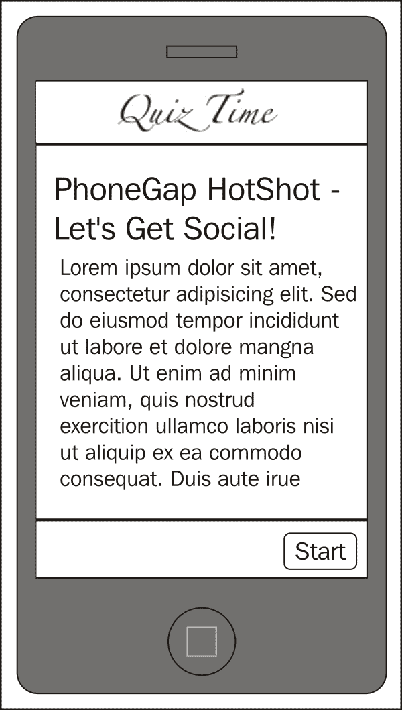

我们的开场视图是一个相当简单的视图。在视图的顶部，我们将有一个包含我们应用程序标题的导航栏。在其他视图中，这个栏通常会包含其他按钮，包括一个返回上一个视图的按钮。在视图的底部，我们将有一个包含与当前视图相关的按钮的工具栏。

应用程序的标题将是一个包含应用程序标题的图像。这个图像应该使用有趣和风格的字体制作。图像将适当本地化。

在工具栏中我们将有一个按钮：一个**开始**按钮。文本需要本地化。

在导航栏下方是内容区域。在这里我们描述应用将要做什么。我们这里不会有非常花哨的东西；我们的空间有限，尤其是因为我们被限制在手机屏幕大小内。在未来，我们将讨论如何允许内容滚动，但现在我们将保持简洁。

我们确实想要在视图中添加一点魅力，所以我们将添加背景的彩色泼溅。你可以把它做成任何你想要的样子，我们将选择从底部向上射出的彩色光线。

我们的游戏视图看起来如下截图所示：

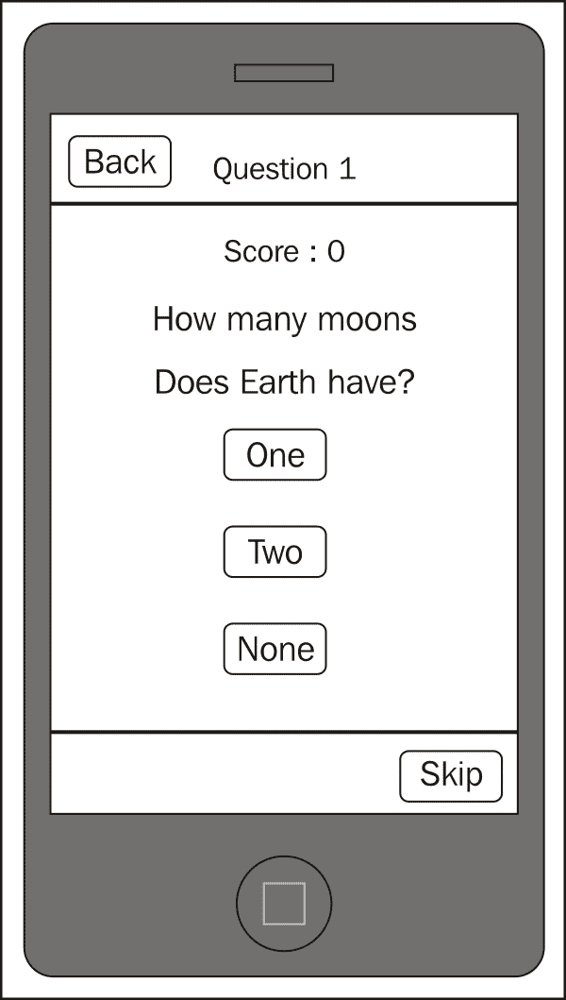

我们的游戏视图是我们在这个应用程序中最复杂的视图。让我们从外部开始，逐步深入。

在顶部，我们的导航栏将指示当前问题编号。这会让玩家知道他们已经回答了多少问题。在文本的左侧是一个**返回**按钮。如果点击，它应该将玩家带回到开场视图。

在底部，我们的工具栏中只有一个按钮：**跳过**。这个按钮将允许玩家跳过他们不想回答的任何问题。目前，我们不会对跳过问题进行任何惩罚，但如果你愿意，可以添加分数扣除或其他更糟糕的惩罚。如果你完全移除了这个按钮，那么也明智地移除工具栏。

在中间是我们的内容区域，这是视图中最复杂的部分；在顶部我们显示玩家的得分，这需要本地化。在其下方是正在提出的问题，同样需要正确本地化。

在问题下方，我们有几个按钮；这些按钮需要根据提出的问题动态生成。并非每个问题都会有三个答案；可能有些有两个答案，或者有四个或更多。答案本身也需要正确本地化。

点击一个按钮将检查按钮是否标记了正确的答案。如果是，我们将显示一个漂亮的提示并增加分数。如果不是，我们将指出这一点并减少分数。

在回答或跳过一个问题后，我们将得到一个新的问题并在屏幕上显示它。然后，在回答了十个问题之后，我们将结束游戏。结束视图看起来如下截图所示：

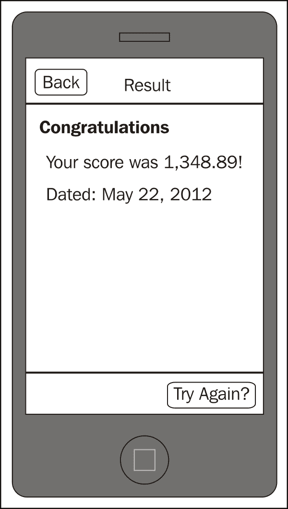

结束视图与起始视图相似，它并不特别复杂，但它确实有一些额外的功能。它需要正确显示最终得分并允许玩家再次玩游戏。

导航栏包含文本**结果**以及一个**返回**按钮。如果被点击，它与从头开始玩游戏相同。

工具栏包含**重试？**按钮。如果被点击，它也会重新开始游戏。

在内容区域，我们显示包含最终得分和完成日期的消息。

当然，视图上的所有内容都需要进行适当的本地化。数字已经很难处理；日期更是如此。幸好我们有 jQuery/Globalize 可以依赖，否则我们就不得不自己进行日期的本地化工作。

现在我们已经绘制了用户界面，是时候开始构建我们应用程序中需要的资源了。打开您的图形编辑器，构建一个任何视图可能看起来像的模板。我们在这里做的是确定显示的哪些部分需要生成图像，哪些部分可以使用文本或 CSS 生成。

并非绝对需要您有任何特定设备的精确尺寸。毕竟，应用程序可以在许多不同的设备上运行，每个设备都有不同的屏幕尺寸。我们将使用 640 x 920 px，这恰好是 iPhone 4 Retina 显示屏上的可用区域。

### 注意

您确实需要使用足够高的分辨率进行设计，以便从设计中获得 Retina 品质的资产。也就是说，如果您期望一个图标为 32 x 32 px，您实际上希望它是 64 x 64 px。现在，您是否构建在确切的大小上取决于您，但最好针对您认为将获得最多使用的设备。

这里是我们使用的最终模板：

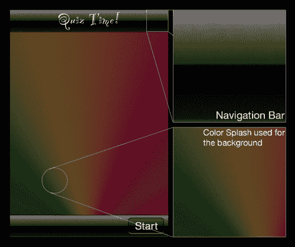

那里有一点纹理。虽然您可以在 CSS 中完成这个任务，但使用图像更容易。这个纹理是可平铺的，因此它可以适应任何屏幕尺寸。导航栏应放置在`images`目录中，并命名为`NavigationBar.png`。

注意标题吗？虽然这也可以通过 CSS 和将字体添加到您的应用程序中处理，但这会涉及到许多棘手的许可问题。相反，我们将使用它的图像，这意味着字体本身永远不会被分发。标题应放置在`images`目录中，并命名为`AppTitle-enus.png`。西班牙语版本（应读作*¡Examen Tiempo!）应命名为`AppTitle-eses.png`。

背景也将是一张图片，尽管你很可能会用 CSS 来近似它（尽管在那里获得纹理可能会有些痛苦）。由于我们支持许多平台和屏幕尺寸，图片方法是最好的。这张图片应保存在`images`目录中，命名为`Background.jpg`。

我们将构建应用程序，使图片拉伸以填充屏幕。当然，会有一些轻微的扭曲，但鉴于这张图片只是一个色彩泼溅，这并不重要。（其他选项包括创建不同分辨率的背景，或者创建一个可平铺的背景，可以轻松填充到任何分辨率。）

另一方面，按钮在 CSS 中构建起来很容易，而且在许多平台上很容易正确设置。在最坏的情况下，按钮可能不会那么闪亮或圆润，但它仍然会传达出它应该被触摸的信息。

中间区域是放置其他所有内容的地方，玩家的得分、当前问题、问题的答案等等。由于所有这些都可以用 HTML、CSS 和 JavaScript 轻松实现，所以我们不会担心将这些元素放入模板中。

## 我们做了什么？

在这个任务中，我们设计了用户界面，并详细说明了各种视图和组件之间的交互。我们指出了哪些部分需要本地化（所有内容！）然后在我们的首选图形编辑器中绘制了一个漂亮的版本。从这个版本中，我们可以剪切需要保存为图片的各种元素，同时确定哪些部分可以用 HTML、CSS 和 JavaScript 渲染。

# 设计数据模型

数据模型正确性至关重要：这是我们存储问题、问题的答案以及每个问题的正确答案的方式。我们还将定义如何与模型交互，即如何获取问题、询问答案是否正确，等等。

## 准备工作

让我们再次拿出铅笔和纸，或者如果你更喜欢，使用你熟悉的图表工具。我们真正试图在这个步骤中做的是找出模型需要存储问题的属性，以及它为了正确完成我们所要求的一切所需的交互。

## 继续前进

我们将基本上有两个数据模型：单个问题和问题集合。让我们从问题模型应该做什么开始：

+   存储实际问题

+   有一个所有可能答案的列表

+   知道正确答案

+   创建时设置问题

+   当被要求时返回问题

+   将答案添加到其答案列表中

+   当被要求时返回答案列表（以随机顺序）

+   设置正确答案

+   当被要求时给出正确答案

+   当被要求时返回列表中的特定答案

+   检查给定的答案是否正确

+   返回答案的数量

我们可以通过创建以下简单的图表来表示这一点：

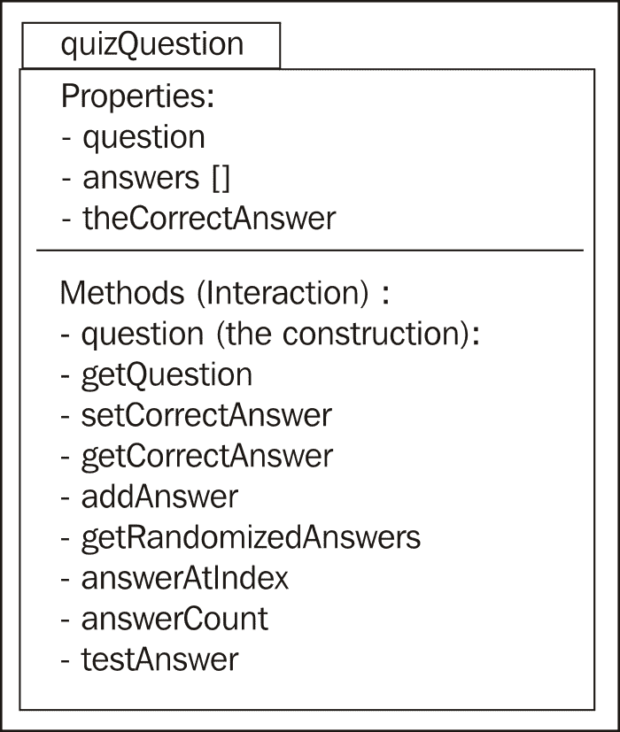

我们的问题集合应该：

+   拥有一个所有问题的列表

+   能够将问题添加到该列表中

+   返回列表中的问题总数

+   从列表中返回一个随机问题

包含这些点的图表看起来如下截图所示：

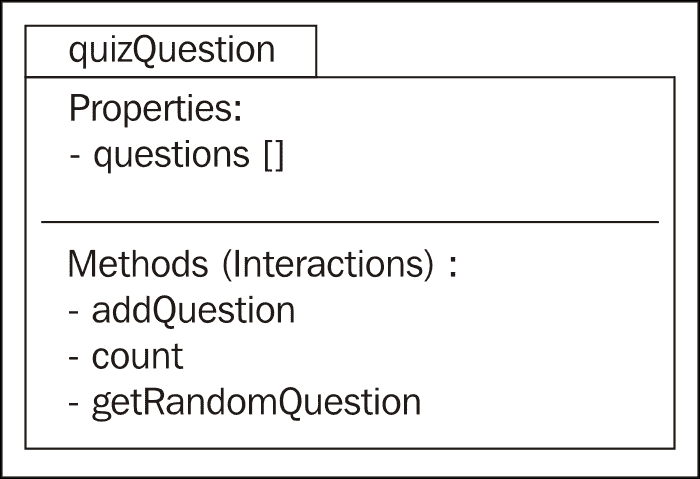

在定义了两个模型之后，让我们想出我们将要提出的问题，以及与之相关的答案（对于问题的完整列表，请参阅本书下载中的`chapter1/www/models/quizQuestions.js`）：

| # | 英语 | 西班牙语 |
| --- | --- | --- |
| `1` | 太阳的颜色是什么？ | 太阳的颜色是什么？ |
|   | 绿色 | 绿色 |
|   | 白色 | 白色 |
|   | 黄色（正确） | 黄色（正确） |
| `2` | 第四颗行星的名字是什么？ | ¿Cuál es el nombre del cuarto planeta? |
|   | 火星（正确） | 火星（正确） |
|   | 金星 | 金星 |
|   | 水星 | 水星 |

我们的模型设计完成，以及我们将要提出的问题，这个任务就完成了。接下来，我们将编写代码来实现这个模型。

# 我们做了什么？

在这个任务中，我们设计了两个数据模型：单个问题和问题集合。我们还确定了我们将要提出的问题，以及它们的本地化版本。

# 实现数据模型

我们将在`www/models`目录中创建两个 JavaScript 文件，分别命名为`quizQuestion.js`和`quizQuestions.js`。`quizQuestion.js`将是实际的模型：它将指定数据应该如何格式化以及我们如何与之交互。`quizQuestions.js`将包含我们实际的问题数据。

## 继续前进

在我们定义我们的模型之前，让我们定义一个命名空间，它将驻留于此。这是一个重要的习惯，因为它使我们不必担心是否会与其他具有相同名称的函数、对象或变量发生冲突。

虽然有各种方法可以创建命名空间，但我们将使用以下代码片段简单地完成它：

```js
// quizQuestion.js

var QQ = QQ || {};
```

现在我们已经定义了命名空间，我们可以创建我们的`question`对象如下：

```js
QQ.Question = function ( theQuestion )
{
    var self = this;
```

### 注意

注意`self`的使用：这将允许我们使用`self`来引用对象，而不是使用`this`。（JavaScript 的`this`有点疯狂，所以我们总是最好引用一个我们知道它始终指向对象的变量。）

接下来，我们将根据第二步中创建的图表设置属性，使用以下代码片段：

```js
    self.question = theQuestion;
    self.answers = Array();
    self.correctAnswer = -1;
```

我们将`self.correctAnswer`的值设置为`-1`，以表示，目前，玩家提供的任何答案都被认为是正确的。这意味着你可以提出所有答案都正确的问题。

我们下一步是定义对象将拥有的方法或交互。让我们从确定一个答案是否正确开始。在以下代码中，我们将取一个传入的答案并将其与`self.correctAnswer`值进行比较。如果它们匹配，或者`self.correctAnswer`的值是`-1`，我们将表示答案正确：

```js
    self.testAnswer = function( theAnswerGiven )
    {
        if ((theAnswerGiven == self.correctAnswer) 
            || (self.correctAnswer == -1))
        {
            return true;
        }    
        else
        {
            return false;
        }
    }
```

我们需要一种方法来访问特定的答案，所以我们将定义`answerAtIndex`函数如下：

```js
    self.answerAtIndex = function ( theIndex )
    {
        return self.answers[ theIndex ];
    }
```

为了成为一个定义良好的模型，我们应该始终有一种方法来确定模型中的项目数量，如下面的代码片段所示：

```js
    self.answerCount = function ()
    {
        return self.answers.length;
    }
```

接下来，我们需要定义一个方法，允许向我们的对象添加一个答案。注意，借助返回值，我们返回自己以允许代码中的链式调用：

```js
    self.addAnswer = function( theAnswer )
    {
        self.answers.push ( theAnswer );
        return self;
    }
```

理论上，我们可以按照对象接收到的顺序显示问题的答案。在实践中，那将是一个非常无聊的游戏：答案总是以相同的顺序出现，而且第一个答案很可能是正确答案。所以让我们使用以下代码片段来给自己一个随机列表：

```js
    self.getRandomizedAnswers = function ()
    {
        var randomizedArray = Array();
        var theRandomNumber;
        var theNumberExists;

        // go through each item in the answers array
        for (var i=0; i<self.answers.length; i++)
        {

            // always do this at least once
            do 
            {
                // generate a random number less than the 
                // count of answers
                theRandomNumber = Math.floor ( Math.random() * 
                                  self.answers.length );
                theNumberExists = false;

                // check to see if it is already in the array
                for (var j=0; j<randomizedArray.length; j++)
                {
                    if (randomizedArray[j] == theRandomNumber)
                    {
                        theNumberExists = true;
                    }
                }

                // If it exists, we repeat the loop.
            } while ( theNumberExists );

            // We have a random number that is unique in the   
            // array; add it to it.
            randomizedArray.push ( theRandomNumber );
        }

        return randomizedArray;
    }
```

随机列表只是一个数字数组，它索引到`answers[]`数组。为了获取实际的答案，我们必须使用`answerAtIndex()`方法。

我们的模型仍然需要一个设置正确答案的方法。再次注意以下代码片段中的返回值，它允许我们稍后进行链式调用：

```js
    self.setCorrectAnswer = function ( theIndex )
    {
        self.correctAnswer = theIndex;
        return self;
    }
```

现在我们已经正确地设置了正确答案，如果我们需要询问对象正确答案是什么怎么办？为此，让我们定义一个`getCorrectAnswer`函数，使用以下代码片段：

```js
    self.getCorrectAnswer = function ()
    {
        return self.correctAnswer;
    }
```

当然，我们的对象还需要返回在创建时给出的任何问题；这可以通过以下代码片段来完成：

```js
    self.getQuestion = function()
    {
        return self.question;
    }
}
```

对于`question`对象来说，这就足够了。接下来，我们将创建一个容器来存储所有的问题，使用以下代码行：

```js
QQ.questions = Array();
```

我们可以采取常规的面向对象方法，将容器也做成一个对象，但在这个游戏中我们只有一个问题列表，所以这样做更简单。

接下来，我们需要有能力向容器中添加一个问题，这可以通过以下代码片段来完成：

```js
QQ.addQuestion = function (theQuestion)
{
    QQ.questions.push ( theQuestion );
}
```

任何好的数据模型都需要知道我们有多少个问题；我们可以使用以下代码片段来了解这一点：

```js
QQ.count = function ()
{
    return QQ.questions.length;
}
```

最后，我们需要能够从列表中随机获取一个问题，以便我们可以向玩家展示；这可以通过以下代码片段来完成：

```js
QQ.getRandomQuestion = function ()
{
    var theQuestion = Math.floor (Math.random() * QQ.count());
    return QQ.questions[theQuestion];
}
```

我们的数据模型已经正式完成。让我们使用以下代码片段来定义一些问题：

```js
// quizQuestions.js
//
// QUESTION 1
//
QQ.addQuestion ( new QQ.Question ( "WHAT_IS_THE_COLOR_OF_THE_SUN?" )
                       .addAnswer( "YELLOW" )
                       .addAnswer( "WHITE" )
                       .addAnswer( "GREEN" )
                       .setCorrectAnswer ( 0 ) );
```

注意我们是如何将`addAnswer`和`setCorrectAnswer`方法附加到新的问题对象上的。这就是所谓的链式调用：它帮助我们少写一点代码。

你可能想知道为什么我们使用大写字母来表示问题和答案。这是因为我们将如何本地化文本，这是下一步：

```js
PKLOC.addTranslation ( "en", "WHAT_IS_THE_COLOR_OF_THE_SUN?", "What is the color of the Sun?" );
PKLOC.addTranslation ( "en", "YELLOW", "Yellow" );
PKLOC.addTranslation ( "en", "WHITE",  "White" );
PKLOC.addTranslation ( "en", "GREEN",  "Green" );

PKLOC.addTranslation ( "es", "WHAT_IS_THE_COLOR_OF_THE_SUN?", "¿Cuál es el color del Sol?" );
PKLOC.addTranslation ( "es", "YELLOW", "Amarillo" );
PKLOC.addTranslation ( "es", "WHITE",  "Blanco" );
PKLOC.addTranslation ( "es", "GREEN",  "Verde" );                        
```

问题与答案本身是实际翻译的钥匙。这有两个作用：它使我们的代码中的键显而易见，这样我们知道文本将在以后被替换，如果我们忘记为某个键包含翻译，它将以大写字母的形式出现。

在前面的代码片段中使用的 `PKLOC` 是我们用于本地化库的命名空间。它在 `www/framework/localization.js` 中定义。`addTranslation` 方法是一个将翻译添加到特定区域的方法。第一个参数是我们为定义翻译指定的区域，第二个参数是键，第三个参数是翻译文本。

`PKLOC.addTranslation` 函数看起来像以下代码片段：

```js
PKLOC.addTranslation = function (locale, key, value)
{
  if (PKLOC.localizedText[locale])
  {
    PKLOC.localizedText[locale][key] = value;
  }
  else
  {
    PKLOC.localizedText[locale] = {};
    PKLOC.localizedText[locale][key] = value;
  }
}
```

`addTranslation` 方法首先检查在 `PKLOC.localizedText` 数组下是否定义了所需区域的数组。如果存在，它就添加键/值对。如果不存在，它首先创建数组，然后添加键/值对。你可能想知道 `PKLOC.localizedText` 数组最初是如何定义的。答案是它在脚本加载时定义，在文件中稍微高一点的位置：

```js
PKLOC.localizedText = {};
```

以这种方式继续添加问题，直到你创建了所有想要的问题。`quizQuestions.js` 文件包含十个问题。当然，你可以添加尽可能多的。

## 我们做了什么？

在这个任务中，我们创建了我们的数据模型并为模型创建了一些数据。我们还展示了如何将翻译添加到每个区域。

## 我还需要了解什么？

在我们继续进行下一个任务之前，让我们先了解一下我们将要使用的本地化库的一些内容。我们的本地化工作分为两个部分：翻译和数据格式化。

对于翻译工作，我们使用我们自己的简单翻译框架，实际上只是一个基于区域的键和值的数组。每当代码请求某个键的翻译时，我们将在数组中查找它，并返回我们找到的任何翻译，如果有的话。但首先，我们需要确定玩家的实际区域，使用以下代码片段：

```js
// www/framework/localization.js

PKLOC.currentUserLocale = "";

PKLOC.getUserLocale = function()
{
```

确定区域并不难，但也不是像你最初想象的那样容易。WebKit 浏览器下有一个属性（`navigator.language`），从技术上讲应该返回区域，但在 Android 下有一个错误，因此我们必须使用 `userAgent`。对于 WP7，我们必须使用三个属性之一来确定值。

因为这需要一些工作，所以我们会检查我们是否已经定义了它；如果我们已经定义了它，我们将返回那个值：

```js
  if (PKLOC.currentUserLocale)
  {
    return PKLOC.currentUserLocale;
  }
```

接下来，我们通过使用 Cordova 提供的 `device` 对象来确定我们当前所在的设备。我们首先检查它是否存在，如果不存在，我们将假设我们可以使用以下代码片段通过 `navigator` 对象的四个属性之一来访问它：

```js
  var currentPlatform = "unknown";
  if (typeof device != 'undefined')
  {
    currentPlatform = device.platform;
  }
```

如果我们无法确定用户的区域设置，我们将提供合适的默认区域设置，如下代码片段所示：

```js
  var userLocale = "en-US";
```

接下来，如果我们在 Android 平台上，我们将处理解析用户代理。以下代码大量借鉴了在线提供的答案 [`stackoverflow.com/a/7728507/741043`](http://stackoverflow.com/a/7728507/741043)。

```js
  if (currentPlatform == "Android")
  {
    var userAgent = navigator.userAgent;

    var tempLocale = userAgent.match(/Android.*([a-zA-Z]{2}-[a-zA-Z]{2})/);
    if (tempLocale)
    {
        userLocale = tempLocale[1];
    }
  }
```

如果我们在任何其他平台上，我们将使用 `navigator` 对象来检索区域设置，如下所示：

```js
  else
  {
    userLocale = navigator.language ||
                 navigator.browserLanguage ||
                 navigator.systemLanguage ||
                 navigator.userLanguage;
}
```

一旦我们有了区域设置，我们就如下返回它：

```js
  PKLOC.currentUserLocale = userLocale;
  return PKLOC.currentUserLocale;
}
```

这种方法被所有我们的翻译代码反复调用，这意味着它需要高效。这就是为什么我们定义了 `PKLOC.currentUserLocale` 属性。一旦设置，前面的代码就不会再尝试计算它。这也带来了另一个好处：我们可以通过覆盖此属性轻松测试我们的翻译代码。虽然始终重要的是要测试当设备设置为特定语言和区域时代码是否正确本地化，但切换这些设置通常需要相当多的时间。能够设置特定的区域设置有助于我们在初始测试中节省时间，因为它绕过了切换设备设置所需的时间。它还允许我们专注于特定的区域设置，尤其是在测试时。

文本翻译是通过名为 `__T()` 的便利函数完成的。便利函数将成为我们除特定命名空间之外的唯一函数，因为我们旨在使用易于输入和易于记忆的名称，这些名称不会使我们的代码变得复杂。这尤其重要，因为它们将包装我们代码中的每个字符串、数字、日期或百分比。

`__T()` 函数依赖于两个函数：`substituteVariables` 和 `lookupTranslation`。第一个函数定义如下：

```js
PKLOC.substituteVariables = function ( theString, theParms )
{
  var currentValue = theString;

  // handle replacement variables
  if (theParms)
  {
    for (var i=1; i<=theParms.length; i++)
    {
      currentValue = currentValue.replace("%" + i, theParms[i-1]);
    }
  }

  return currentValue;
}
```

此函数所做的只是处理替换变量。这意味着我们可以在文本中定义一个带有 `%1` 的翻译，并且我们能够用传递给函数的某个值替换 `%1`。

下一个函数 `lookupTranslation` 定义如下：

```js
PKLOC.lookupTranslation = function ( key, theLocale )
{
  var userLocale = theLocale || PKLOC.getUserLocale();

  if ( PKLOC.localizedText[userLocale] )
  {
    if ( PKLOC.localizedText[userLocale][key.toUpperCase()] )
    {
       return PKLOC.localizedText[userLocale][key.toUpperCase()];
    }
  }

  return null;
}
```

实际上，我们正在检查是否存在针对给定键和区域设置的特定翻译。如果存在，我们将返回翻译，如果不存在，我们将返回 `null`。请注意，键始终被转换为大写，因此在查找翻译时大小写无关紧要。

我们的 `__T()` 函数如下所示：

```js
function __T(key, parms, locale)
{
  var userLocale = locale || PKLOC.getUserLocale();
  var currentValue = "";
```

首先，我们确定请求的翻译是否可以在区域设置中找到，无论该区域设置是什么。请注意，它可以传递，因此可以覆盖当前区域设置。这可以通过以下代码片段完成：

```js
  if (! (currentValue=PKLOC.lookupTranslation(key,  
                                       userLocale)) )
  {
```

区域设置通常具有 `xx-YY` 的形式，其中 `xx` 是两位字符的语言代码，而 `YY` 是两位字符的区域代码。我的区域设置定义为 `en-US`。另一个玩家的可能被定义为 `es-ES`。

如果你记得，我们只为语言定义了翻译。这带来了一个问题：前面的代码除非我们为语言和国家定义了翻译，否则不会返回任何翻译。

### 注意

有时定义特定于语言和国家的翻译是至关重要的。虽然从技术角度来看，各个地区可能说同一种语言，但习语往往不同。如果你在翻译中使用习语，你需要将它们本地化到使用它们的特定地区，否则可能会产生混淆。

因此，我们截断国家代码，并尝试以下操作：

```js
    userLocale = userLocale.substr(0,2);

    if (! (currentValue=PKLOC.lookupTranslation(key, userLocale)) )
    {
```

但我们只为英语（`en`）和西班牙语（`es`）定义了翻译！如果玩家的区域设置为`fr-FR`（法语），前面的代码将失败，因为我们没有为`fr`语言（法语）定义任何翻译。因此，我们将检查合适的默认值，我们将其定义为`en-US`，美国英语：

```js
      userLocale = "en-US";      
      if (! (currentValue=PKLOC.lookupTranslation(key, userLocale)) )
      {
```

当然，我们现在又回到了之前的情况：在我们的游戏中没有为`en-US`定义翻译。因此，我们需要回退到`en`，如下所示：

```js
        userLocale = "en";      
        if (! (currentValue=PKLOC.lookupTranslation(key, userLocale)) )
        {
```

但如果我们根本找不到翻译怎么办？我们可以抛出一个恶意的错误，也许你确实想这么做，但在我们的例子中，我们只是返回传入的键。如果始终遵循将键大写的约定，我们仍然能够看到某些内容尚未翻译。

```js
          currentValue = key;
        }
      }
    }
  }
```

最后，我们将`currentValue`参数传递给`substituteVariables`属性，以便处理我们可能需要的任何替换，如下所示：

```js
  return PKLOC.substituteVariables( currentValue, parms 
         );
}
```

# 实现起始视图

要创建我们的视图，我们首先需要为其创建文件。文件应命名为`startView.html`，并位于`www/views`目录下。我们创建的视图最终将类似于以下 iOS 截图：

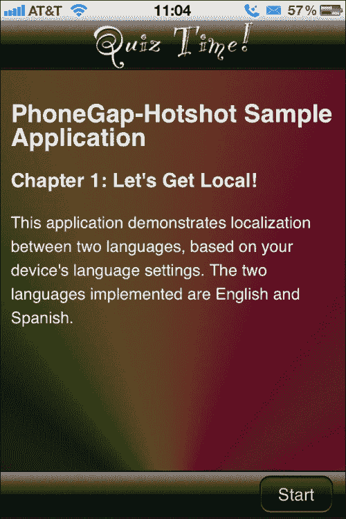

对于西班牙语本地化的 Android，视图将如下所示：

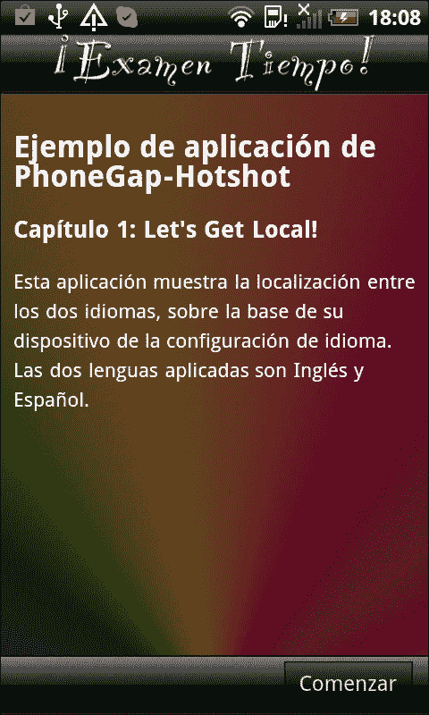

在我们实际创建视图之前，让我们定义视图的结构。根据使用的框架，视图的结构可能会有很大的不同。对于 YASMF 框架，我们的视图将包含一些依赖于预定义 CSS 的 HTML，以及在该 HTML 下方定义的一些 JavaScript。你可以很容易地提出将 JavaScript 和内联样式也分离出来的观点，如果你愿意，你可以这样做。

我们所有视图的 HTML 部分将具有以下形式：

```js
<div class="viewBackground">
 <div class="navigationBar">
  <div id="theView_AppTitle"></div>
  <button class="barButton backButton" 
   id="theView_backButton" style="left:10px" ></button>
 </div>
 <div class="content avoidNavigationBar avoidToolBar" 
  id="theView_anId">
 </div>
 <div class="toolBar">
  <button class="barButton" id="theView_aButton" 
   style="right:10px"></button>
 </div>
</div>
```

如你所见，在这段代码中没有任何可见的文本。由于一切都必须本地化，我们将通过 JavaScript 程序化地插入文本。

`viewBackground`类将是我们的视图容器：与视图结构相关的所有内容都在其中定义。样式定义在`www/framework/base.css`和`www/style/style.css`中；后者是用于我们应用的定制样式。

`navigationBar` 类表示 `div` 类只是一个导航栏。对于 iOS 用户来说，这具有即时意义，但对于其他人来说应该也很清楚：这个栏包含视图的标题以及任何用于导航的按钮（例如**返回**按钮）。请注意，**标题**和**返回**按钮都有 `id` 值。这个值使得我们稍后在 JavaScript 中访问它们变得容易。请注意，我们使用视图名称和下划线来命名空间这些 `id` 值；这是为了避免使用相同的 `id` 两次时出现任何问题。

下一个 `div` 类被赋予 `content avoidNavigationBar avoidToolBar` 类；所有内容都将放在这里。后两个类指定它应该从屏幕顶部偏移，并且足够短，以避免导航栏（已定义）和工具栏（即将出现）。

最后，定义了工具栏。这是一个与导航栏类似的栏，但目的是包含与视图相关的按钮。对于 Android，这通常会在屏幕顶部或附近显示，而对于 iPhone 和 WP7，这个栏在底部显示。（另一方面，iPad 会将其显示在导航栏下方或导航栏上。我们将在 项目 10 中关注这一点，*扩展*。）

在此 HTML 块下方，我们将定义我们可能需要的任何本地化模板，然后最后，任何我们需要的 JavaScript。

## 继续前进

在考虑到这些提示后，让我们创建我们的起始视图，它应该命名为 `startView.html` 并位于 `www/views` 目录中，如下所示：

```js
<div class="viewBackground">
 <div class="navigationBar">
  <div id="startView_AppTitle"></div>
 </div>
 <div class="content avoidNavigationBar avoidToolBar"   
  id="startView_welcome">
 </div>
 <div class="toolBar">
  <button class="barButton" id="startView_startButton" 
   style="right:10px"></button>
 </div>
</div>
```

上述代码几乎与之前定义的视图模板完全相同，只是我们缺少了一个 `back` 按钮。这是因为我们向用户显示的第一个视图没有返回的地方，所以我们省略了该按钮。`id` 值也发生了变化，包括我们视图的名称。

尽管如此，这些都没有定义我们的视图将看起来是什么样子。为了确定这一点，我们需要通过在 `www/style/style.css` 中设置它们来覆盖我们的框架样式。

首先，为了定义 `navigationBar` 的外观，我们使用项目早期定义的模板中的哑光黑色栏，如下所示：

```js
.navigationBar
{
  background-image: url(../images/NavigationBar.png);
  color: #FFF;
  background-color: transparent;
}
```

工具栏的定义与此类似，如下所示：

```js
.toolBar
{
  background-image: url(../images/ToolBar.png);
}
```

视图的背景定义如下：

```js
.viewBackground
{
  background-image: url(../images/Background.jpg);
  background-size: cover;
}
```

这就是使我们的起始视图开始看起来像真实应用所需的一切。当然，`www/framework/base.css` 中有很多预构建的内容，您可以在自己的项目中分析和重用。

现在，我们已经定义了视图和外观，我们需要定义一些视图的内容。我们将通过使用几个具有附加到其 `id` 值的本地化的隐藏 `div` 元素来完成此操作，如下所示：

```js
<div id="startView_welcome_en" class="hidden">
 <h2>PhoneGap-Hotshot Sample Application</h2>
 <h3>Chapter 1: Let's Get Local!</h3>
 <p>This application demonstrates localization
    between two languages, based on your device's
    language settings. The two languages implemented
    are English and Spanish.</p>
</div>

<div id="startView_welcome_es" class="hidden">
 <h2>Ejemplo de aplicación de PhoneGap-Hotshot</h2>
 <h3>Capítulo 1: Let's Get Local!</h3>
 <p>Esta aplicación muestra la localización
     entre los dos idiomas, sobre la base de su dispositivo de
     la configuración de idioma. Las dos lenguas aplicadas
     son Inglés y Español.</p>
</div>
```

这两个`div`元素被标记为`hidden`，因此它们对玩家不可见。然后我们将使用一些 JavaScript 将它们的内容复制到视图内部的内容区域。这比使用`__T()`和`PKLOC.addTranslation()`函数处理所有文本要简单得多，不是吗？

接下来是以下 JavaScript 代码：

```js
<script>
  var startView = $ge("startView") || {};  // properly namespace
```

我们的第一步是将所有脚本放入一个命名空间。与我们的其他大多数命名空间定义不同，我们实际上将利用"`startView`"元素（聪明的读者会注意到这个元素还没有定义；这将在本项目的末尾附近完成）。虽然这个元素是一个合适的 DOM 元素，但它也为我们提供了一个完美的附加点，只要我们避免使用 DOM 方法名称作为我们自己的，我保证我们不会这样做。

你可能想知道`$ge`做什么。由于我们没有包含任何 JavaScript 框架如 jQuery，我们没有通过 ID 获取元素的便利方法。jQuery 使用`$()`方法做这件事，因为你可能会在实际使用 jQuery 的同时使用我们正在使用的框架，我选择使用`$ge()`方法，简称*获取元素*。它在`www/framework/utility.js`中定义，如下代码片段，它只是`document.getElementById`的简写版本：

```js
function $ge ( elementId )
{
  return document.getElementById ( elementId );
}
```

回到我们的起始视图脚本，我们定义了视图初始化时需要发生的事情。在这里，我们*挂钩*到视图中的各种按钮和其他界面元素，以及如下本地化所有文本和内容：

```js
startView.initializeView = function ()
  {
    PKLOC.addTranslation ("en", "APP_TITLE_IMAGE", 
         "AppTitle-enus.png");
    PKLOC.addTranslation ("es", "APP_TITLE_IMAGE", 
         "AppTitle-eses.png");

    startView.applicationTitleImage = 
         $ge("startView_AppTitle");
    startView.applicationTitleImage.style.backgroundImage = 
        "url('./images/" + __T("APP_TITLE_IMAGE") + "')";
```

这是我们的第一次使用`__T()`函数。这就是我们如何正确本地化一个图片。`APP_TITLE_IMAGE`键被设置为指向标题图片的英语版本或西班牙语版本，而`__T()`函数根据我们的区域设置返回正确的版本。

```js
    PKLOC.addTranslation ("en", "START", "Start");
    PKLOC.addTranslation ("es", "START", "Comenzar");

    startView.startButton = $ge("startView_startButton");
    startView.startButton.innerHTML = __T("START");
```

现在我们已经正确本地化了`start`按钮，但我们如何让它做些什么呢？我们使用一个在`www/framework/ui-core.js`中定义的小函数`PKUI.CORE.addTouchListener()`，如下所示：

```js
    PKUI.CORE.addTouchListener( startView.startButton, 
        "touchend", startView.startGame );
```

最后，我们需要使用以下代码片段在内容区域显示正确的*欢迎*文本：

```js
    var theWelcomeContent = $geLocale("startView_welcome");
    $ge("startView_welcome").innerHTML = 
        theWelcomeContent.innerHTML;
  }
```

现在我们介绍另一个便利函数：`$geLocale()`函数。这个函数的行为类似于`$ge()`函数，但它假设我们将有一个区域设置附加到我们请求的元素的 ID 上。它在同一个文件（`utility.js`）中定义，如下所示：

```js
function $geLocale ( elementId )
{
  var currentLocale = PKLOC.getUserLocale();
  var theLocalizedElementId = elementId + "_" + currentLocale;
  if ($ge(theLocalizedElementId)) { return 
      $ge(theLocalizedElementId); }

  theLocalizedElementId = elementId + "_" + 
      currentLocale.substr(0,2);
  if ($ge(theLocalizedElementId)) { return 
      $ge(theLocalizedElementId); }

  theLocalizedElementId = elementId + "_en-US";
  if ($ge(theLocalizedElementId)) { return 
      $ge(theLocalizedElementId); }

  theLocalizedElementId = elementId + "_en";
  if ($ge(theLocalizedElementId)) { return 
      $ge(theLocalizedElementId); }
  return $ge( elementId );
}
```

与我们的`__T()`函数类似，它试图找到一个带有我们完整区域设置的元素（即`_xx-YY`）。如果找不到，它将尝试`_xx`，如果我们的区域是英语或西班牙语，这里应该会成功。如果不是，我们将寻找`_en-US`，如果找不到，我们将寻找`_en`。如果没有找到合适的元素，我们将返回原始元素——在我们的例子中，这个元素不存在，这意味着我们将返回"`undefined`"。

在我们的起始视图脚本中接下来，我们有一个函数，每当按下起始按钮时都会被调用，如下面的代码片段所示：

```js
startView.startGame = function()
  {
    PKUI.CORE.pushView ( gameView );
  }

</script>
```

简短而有力。这向玩家展示了我们的游戏视图，实际上开始游戏。对于支持它的设备（在撰写本文时，iOS 和 Android），玩家还会看到这个视图（起始）和下一个视图（游戏）之间的动画。

如果你想了解更多关于`pushView()`方法的工作原理，请访问[`github.com/photokandyStudios/YASMF/wiki/PKUI.CORE.pushView`](https://github.com/photokandyStudios/YASMF/wiki/PKUI.CORE.pushView)。

呼呼！对于一个相当简单的视图来说，这是一项大量的工作。幸运的是，实际上大部分工作都是由框架完成的，所以我们的实际`startView.html`文件相当小。

## 我们做了什么？

我们实现了起始视图，当玩家首次启动应用时呈现给玩家。我们根据玩家的地区正确本地化了视图的标题图像，并且根据地区正确本地化了 HTML 内容。

我们为视图上的小部件定义了各种钩子和文本，例如**起始**按钮，并将触摸监听器附加到它们上，使它们能够正确地工作。

我们还介绍了一部分框架，它提供了将视图推送到屏幕上的支持。

## 我还需要了解什么？

猜测起来可能不难，但`pushView`方法有几个互补函数：`popView`、`showView` 和 `hideView`。

`popView` 函数与 `pushView` 函数正好相反，即通过从视图栈中移除视图来将视图向右移动（而不是向左）。

`showView` 和 `hideView` 函数基本上做的是同一件事，但更简单。它们根本不做任何动画。此外，由于它们不涉及视图栈上的任何其他视图，所以在应用开始时最为有用，那时我们不得不确定如何显示我们的第一个视图，因为没有之前的视图来进行动画。

如果你想了解更多关于视图管理的知识，你可能想访问[`github.com/photokandyStudios/YASMF/wiki/Understanding-the-View-Stack-and-View-Management`](https://github.com/photokandyStudios/YASMF/wiki/Understanding-the-View-Stack-and-View-Management)并探索[`github.com/photokandyStudios/YASMF/wiki/PKUI.CORE`](https://github.com/photokandyStudios/YASMF/wiki/PKUI.CORE)。

# 实现我们的游戏视图

要开始，在`www/views`目录下创建一个名为`gameView.html`的文件。完成之后，我们将有一个如下截图所示的视图，适用于 iOS：

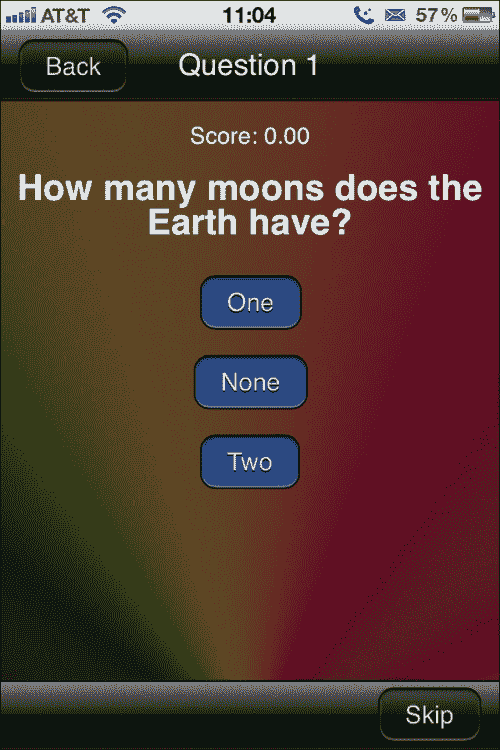

对于 Android，视图将如下截图所示：

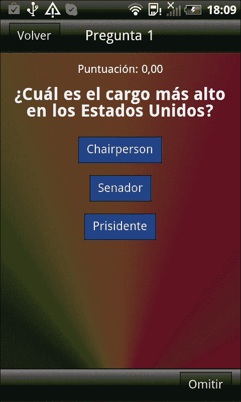

现在，在我们深入探讨视图本身之前，让我们先了解一下视图栈以及它是如何帮助我们处理导航的。视图栈在下面的屏幕截图中有展示：

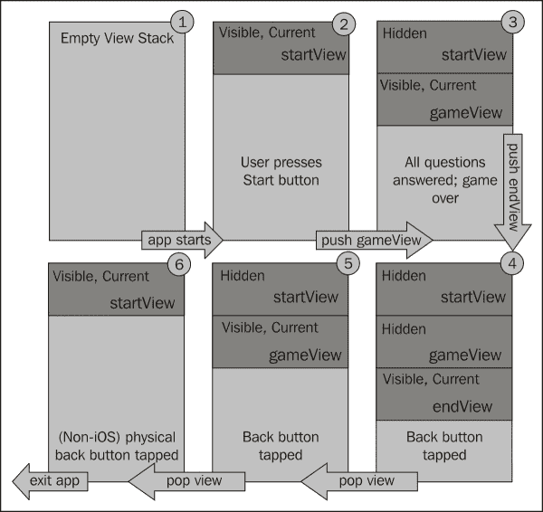

视图堆栈实际上只是一个堆栈，它维护着之前可见的视图列表和当前可见的视图。当我们的应用首次启动时，堆栈将是空的，如前一个截图中的第一步所示。然后，使用 `showView` 方法将 `startView` 视图推入堆栈，得到（2）中的堆栈。当玩家点击 **开始** 按钮时，`gameView` 视图被推入堆栈，结果是（3）中的堆栈。然后，当游戏结束时，我们将 `endView` 视图推入堆栈，结果是（4）。

由于我们正在跟踪所有这些视图，包括那些不再可见的视图（尤其是在游戏结束时），这使得返回到之前的视图变得容易。对于 iOS，这是通过 **后退** 按钮实现的。对于 Android，设备通常有一个物理后退按钮被用来代替。无论 `back` 事件是如何触发的，我们都需要能够回退堆栈。

假设用户现在决定在堆栈中返回；我们将得到（5）中的堆栈。如果他们决定再退一步，将得到（6）。在这个时候，iOS 不允许进一步回退，但对于 Android，另一个 `back` 事件应该让用户退出应用。

## 继续前进

游戏视图将非常类似于我们的起始视图，但它稍微复杂一些。毕竟，它要玩整个游戏。幸运的是，这里实际上没有什么特别新的东西，所以应该进展顺利。

让我们从视图的 HTML 部分开始，如下所示：

```js
<div class="viewBackground">
 <div class="navigationBar">
  <div id="gameView_title"></div>
 <button class="barButton backButton" 
 id="gameView_backButton" style="left:10px"></button>
 </div>
 <div class="content avoidNavigationBar avoidToolBar" 
  id="gameView_gameArea">
 <div id="gameView_scoreArea" style="height:1em; text- 
 align: center;"></div>
 <div id="gameView_questionArea" style="text-align: 
 center"></div>
 </div>
 <div class="toolBar">
  <button class="barButton" id="gameView_nextButton" 
   style="right:10px" ></button>
 </div>
</div>
```

我已经在前面的代码中突出显示了新的内容，但正如你所见，并不多。首先，我们定义了一个位于导航栏中的 `back` 按钮，在内容区域中我们定义了两个新的区域：一个用于玩家的得分，另一个用于实际的问题（和答案）。

接下来，虽然与起始视图中的本地化内容相似，但我们有模板指定了如何显示问题和其答案；如下所示：

```js
<div id="gameView_questionTemplate" class="hidden">
 <h2>%QUESTION%</h2>
 <div style="text-align:center;">%ANSWERS%</div>
</div>
```

首先，我们定义问题模板，它由一个二级标题组成，将包含问题的文本，以及一个包含所有答案的 div 元素。但答案看起来会是什么样子？接下来就会揭晓：

```js
<div id="gameView_answerTemplate" class="hidden">
 <button class="barButton answerButton" 
  onclick="gameView.selectAnswer(%ANSWER_INDEX%);">%ANSWER%
 </button><br/>
</div>
```

每个答案将以一个包含答案文本的按钮形式呈现，并且附加一个 `onclick` 事件来调用 `gameView.selectAnswer()` 方法以选择答案。

当然，由于这些是模板，它们不会显示给玩家，因此它们被赋予了 `hidden` 类。但当我们构建一个实际随机问题以显示给玩家时，我们肯定会使用它们。现在让我们来看看脚本：

```js
<script>

  var gameView = $ge("gameView") || {};

  gameView.questionNumber = -1;
  gameView.score = 0;
  gameView.theCurrentQuestion;
```

到现在为止，你应该已经熟悉我们的命名空间技术，这是我们代码中的第一部分。然而，之后我们定义了视图中的属性。问题编号，它将作为我们的计数器，以便当它达到十时，我们知道游戏结束了；得分；以及当前问题。后者并不明显，但它将是一个实际的问题对象，而不是对象的索引。

之后，我们有`initializeView`函数，它将连接所有小部件并完成文本的本地化，如下代码片段所示：

```js
gameView.initializeView = function ()
  {
 PKUTIL.include ( ["./models/quizQuestions.js", 
 "./models/quizQuestion.js"] );
  gameView.viewTitle = $ge("gameView_title");
  gameView.viewTitle.innerHTML = __T("APP_TITLE");

  gameView.backButton = $ge("gameView_backButton");
  gameView.backButton.innerHTML = __T("BACK");
  PKUI.CORE.addTouchListener(gameView.backButton, "touchend", 
      function () { PKUI.CORE.popView(); });

  gameView.nextButton = $ge("gameView_nextButton");
 gameView.nextButton.innerHTML = __T("SKIP");

  PKUI.CORE.addTouchListener(gameView.nextButton, "touchend", 
      gameView.nextQuestion);

 gameView.scoreArea = $ge("gameView_scoreArea");
 gameView.questionArea = $ge("gameView_questionArea");
}
```

我在前面的代码块中突出显示了一些区域。最后几个大致相同，因为我们正在将`gameView_scoreArea`和`gameView_questionArea`元素存储到属性中以供以后使用，所以这并不是什么新东西。它的新颖之处在于我们还没有将任何内容加载到它们中。

第二个亮点并不是你真的会添加到生产游戏中的东西。你可能会问，为什么它在这里？这个按钮的目的是让我们能够无惩罚地跳过当前问题。为什么？答案是测试。我不想不得不点击答案，点击提示说如果我对或错了一百万次，看看本地化是否对所有问题都有效。因此，跳过功能就诞生了。

第一个亮点更有趣。它是一个 JavaScript 包含。 “等等，”我听到你说，“JavaScript 不做包含。” 你是对的。

但是，可以通过使用`XmlHttpRequest`来模拟包含，这通常被称为 AJAX。通过这个简短的包含语句，我们要求浏览器代表我们加载两个引用的 JavaScript 文件（`quizQuestions.js`和`quizQuestion.js`）。这一点也很重要；否则，我们的游戏将没有问题！

`PKUTIL.include()`函数定义在`www/framework/utility.js`中。我们将在本项目的稍后部分关注完整的实现细节，但可以说，它确实做了它所说的。当我们需要使用问题时，脚本已经加载并等待我们。（此时，有无数问题的读者会问这个关键问题，“顺序重要吗？”答案是，“是的。”你很快就会看到原因。）

因此，现在我们已经完成了`gameView`的初始化，让我们看看另一个关键方法：`viewWillAppear`。它如下代码片段所示：

```js
gameView.viewWillAppear = function ()
{
  gameView.questionNumber =1;
  gameView.score = 0;
  gameView.nextQuestion();
}
```

这段代码的后半部分相当无害。我们将问题编号设置为 1，得分设为零，并调用`nextQuestion()`方法，它实际上渲染下一个问题并显示给玩家。

如您所记得的，`viewWillAppear()`函数是在`PKUI.CORE.pushView()`和`PKUI.CORE.showView()`方法在视图实际在屏幕上渲染之前的动画之前被调用的。因此，起始视图上的**开始**按钮将调用此函数，并开始游戏。

当我们通过弹出末尾视图从视图中返回时，它也适用。我们将收到一个`viewWillAppear`通知，重置游戏，就像用户得到了一个全新的游戏一样。这几乎是魔法！

### 注意

对于那些使用苹果框架进行过任何 Objective-C 编程的 iOS 开发者，我现在就为使用框架中的概念道歉。只是，嗯，它们与视图模型非常契合！如果你更喜欢 Android 的方法，或者微软的方法，请随意替换。我只是碰巧喜欢苹果为他们平台构建的框架。

当然，当按下返回按钮时，我们需要实际执行一些操作，以下是相应的代码：

```js
gameView.backButtonPressed = function ()
{
  PKUI.CORE.popView();
}
```

`popView()`方法实际上是`pushView`的逆操作。它获取当前可见视图（`gameView`），将其从堆栈中弹出，并显示下层的视图，在这种情况下是`startView`。这里最好的做法是提示玩家他们是否真的想这样做；这将结束他们的游戏，可能过早。现在，作为一个例子，我们将保持这个状态。

接下来，我们需要定义如何在屏幕上显示问题。我们在`nextQuestion()`中这样做，如下面的代码片段所示：

```js
gameView.nextQuestion = function ()
{
```

首先，我们将从`QQ`命名空间中随机获取一个问题：

```js
  // load the next question into the view
  gameView.theCurrentQuestion = QQ.getRandomQuestion();
```

接下来，我们获取我们的模板：

```js
  var theQuestionTemplate = 
    $ge("gameView_questionTemplate").innerHTML;
  var theAnswerTemplate   = 
    $ge("gameView_answerTemplate").innerHTML;
```

现在我们有了模板，我们将按照以下代码片段替换所有`"%QUESTION%"`的出现，以替换为翻译后的问题：

```js
  theQuestionTemplate = theQuestionTemplate.replace( 
    "%QUESTION%", 
    __T(gameView.theCurrentQuestion.getQuestion()) );
```

生成答案稍微有些复杂。任何一个问题可能有两个、三个或更多答案，因此我们首先为随机答案列表中的问题提问，然后在该列表中循环，同时构建 HTML 字符串，如下面的代码片段所示：

```js
  var theAnswers = 
    gameView.theCurrentQuestion.getRandomizedAnswers();

  var theAnswersHTML = "";

  for (var i=0; i<theAnswers.length; i++)
    {
```

对于每个答案，我们将用翻译后的答案文本替换`%ANSWER%`文本，并用当前索引（`i`）替换`"%ANSWER_INDEX%"`，如下面的截图所示：

```js
        theAnswersHTML += theAnswerTemplate.replace( 
          "%ANSWER%", 
          __T(gameView.theCurrentQuestion.answerAtIndex( 
          theAnswers[i] ) )).replace ( "%ANSWER_INDEX%", 
          theAnswers[i] );
    }
```

现在我们已经得到了答案的 HTML，我们可以按照以下方式将`%ANSWERS%`在问题模板中替换为它：

```js
    theQuestionTemplate = theQuestionTemplate.replace ( 
      "%ANSWERS%", theAnswersHTML );
```

到这一点，我们可以向玩家显示问题：

```js
    gameView.questionArea.innerHTML = theQuestionTemplate;
```

我们还希望更新玩家的分数。我们将采用一个人为的荒谬评分系统来突出我们的本地化是否正确工作。请注意，以下代码片段中的`2`指定我们希望在分数中保留两位小数。

```js
    gameView.scoreArea.innerHTML = __T("SCORE_%1", 
      [ __N(gameView.score, "2") ]);
```

我们还将更新视图的标题为当前问题编号。这次代码片段后面的"`0"`表示没有小数点：

```js
    gameView.viewTitle.innerHTML = __T("QUESTION_%1", 
      [ __N(gameView.questionNumber, "0") ]);

}
```

所有这些都很不错，但没有用户能够选择答案，这就需要下一个函数来处理：

```js
  gameView.selectAnswer = function ( theAnswer )
  {
```

首先，我们将使用以下代码片段来检查所选答案是否正确，并询问当前问题：

```js
    if (gameView.theCurrentQuestion.testAnswer ( theAnswer ))
    {
```

如果答案是正确的，我们将告诉用户他们答对了，并按照以下方式增加他们的分数：

```js
        alert (__T("CORRECT"));
        gameView.score += 483.07;
    }
    else
    {
```

但如果它是错误的，我们将表明它是错误的，并减少他们的分数（我们可能有点苛刻。其实并不是这样——我们想要测试负数也能工作。），使用以下代码片段：

```js
        alert (__T("INCORRECT"));
        gameView.score -= 192.19;
    }
```

接下来，我们检查是否已经问完了这个集合中的最后一个问题，如下所示：

```js
    if (gameView.questionNumber >= 10)
    {
```

如果我们有，我们将把分数传达给最终视图并将其推入堆栈。这样，游戏就结束了，使用以下代码片段：

```js
        endView.setScore ( gameView.score );
        PKUI.CORE.pushView ( endView );
    }
    else
    {
```

在这种情况下，我们还有更多的问题需要回答，所以我们按照以下方式加载下一个问题：

```js
        gameView.questionNumber++;
        gameView.nextQuestion();
    }
  }

</script>
```

这样，我们就完成了游戏视图。告诉我，这并不太难，对吧？

## 我们做了什么？

我们在一个视图中实现了实际的游戏。我们还学会了如何处理 Android 上的后退按钮和 iOS 上的后退导航。我们还了解了如何使用作为动态内容模板的隐藏 HTML 块。

## 我还需要知道什么？

如果你还记得，我提到过我们将会更详细地讨论那个奇妙的小`include`函数。让我们更仔细地看看它：

```js
PKUTIL.include = function ( theScripts, completion )
{
```

首先，让我给你透露一点：我们在这里使用递归来加载脚本。所以，正如你将在下面的代码中看到的，我们在测试传入数组的长度，如果它是零，我们就调用我们传递给`completion`方法的`completion`方法。这允许我们——如果我们喜欢——在所有脚本加载后调用代码。这个代码块如下：

```js
var theNewScripts = theScripts;
  if (theNewScripts.length == 0)
  {
    if (completion)
    {
       completion();
    }
    return;
  }
```

在下一节中，我们将弹出下一个要加载的脚本。这也解释了数组必须按照它们的依赖关系逆序包含脚本。是的，你可以自己反转数组，你应该这样做，但我想要强调这一点。弹出脚本的以下代码指令被使用：

```js
  var theScriptName = theNewScripts.pop();
```

然后，我们调用另一个之前未知的函数，`PKUTIL.load()`。这个方法接受脚本文件名，然后调用我们给它提供的`completion`函数。无论成功与否，它都会调用它。注意，它是完成函数的传入参数。这个函数在下面的屏幕截图中显示：

```js
  PKUTIL.load ( theScriptName, true, function ( success, data )
  {
```

如果脚本成功加载，我们创建一个`SCRIPT` DOM 元素并将数据添加到其中。需要注意的是，直到我们将脚本实际附加到 DOM 上，脚本都不会有任何动作。我们通过将子元素添加到`BODY`来实现这一点。正是在这一点上，脚本中的内容将被执行。这个条件`if`块在下面的代码片段中显示：

```js
    if (success)
    {
      var theScriptElement = document.createElement("script");
      theScriptElement.type = "text/javascript";
      theScriptElement.charset = "utf-8";
      theScriptElement.text = data;
      document.body.appendChild ( theScriptElement ); // add it as a script tag
    }
```

如果我们无法加载脚本，我们将在控制台生成一个日志消息。你可以认为应该发生更糟糕的事情，比如一个停止一切操作的致命错误，但这也允许加载可能存在或不存在库，并利用它们。也许这不是一个经常使用的功能，但有时仍然很有用。条件`else`块如下：

```js
    else
    {
      console.log ("WARNING: Failed to load " + theScriptName );
    }
```

然后向我们的这个小帮手，递归，问好。我们用脚本名称数组（减去我们刚刚弹出的那个）和 `completion` 函数调用自己，迟早我们会结束于数组中没有项目。然后，`completion` 函数将像以下代码块中所示那样被调用：

```js
    PKUTIL.include ( theNewScripts, completion );
  }
  );
}
```

`PKUTIL.load()` 函数是另一个有趣的生物，它必须正确工作，以便我们的包含能够工作。它定义得像以下这样（对于完整的实现细节，请访问 [`github.com/photokandyStudios/YASMF/blob/master/framework/utility.js#L126`](https://github.com/photokandyStudios/YASMF/blob/master/framework/utility.js#L126)）：

```js
PKUTIL.load = function ( theFileName, aSync, completion )
{
```

首先，我们将检查浏览器是否理解 `XMLHttpRequest`。如果不理解，我们将使用失败通知和描述我们无法加载任何内容的消息调用 `completion`，如下所示：

```js
  if (!window.XMLHttpRequest) 
  { 
    if (completion) 
    {
      completion ( PKUTIL.COMPLETION_FAILURE,
                   "This browser does not support 
                    XMLHttpRequest." );
      return;
    }
  }
```

接下来我们设置 `XMLHttpRequest`，并如下分配 `onreadystatechange` 函数：

```js
  var r = new XMLHttpRequest();
  r.onreadystatechange = function()
  {
```

在加载过程中，这个函数可以被多次调用，因此我们需要检查一个特定的值。在这种情况下，`4` 表示内容已经被加载：

```js
    if (r.readyState == 4)
    {
```

当然，仅仅因为我们得到了数据并不意味着它是可用的数据。我们需要验证加载的状态，在这里我们进入了一个有点模糊的区域。iOS 使用 `0` 值定义成功，而 Android 使用 `200`：

```js
      if ( r.status==200 || r.status == 0)
      {
```

如果我们成功加载了数据，我们将使用成功通知和数据调用 `completion` 函数，如下所示：

```js
        if (completion)
        {
          completion ( PKUTIL.COMPLETION_SUCCESS,
                       r.responseText );
        } 
      }
```

但如果我们未能加载数据，我们将使用失败通知和加载状态值调用 `completion` 函数，如下所示：

```js
      else
      {
        if (completion)
        {
          completion ( PKUTIL.COMPLETION_FAILURE,
                       r.status );
        }
      }
    }
  }
```

请记住，我们仍在设置 `XMLHttpRequest` 对象，并且我们尚未实际触发加载。

下一步是指定文件的路径，在这里我们在 WP7 与 Android 和 iOS 之间遇到了问题。在 Android 和 iOS 上，我们可以相对于 `index.html` 文件加载文件，但在 WP7 上，我们必须相对于 `/app/www` 目录加载它们。虽然难以追踪，但至关重要。尽管我们在这本书中不支持 WP7，但框架支持，因此它需要使用以下代码片段来处理此类情况：

```js
  if (device.platform=="WinCE")
  {
    r.open ('GET', "/app/www/" + theFileName, aSync); 
  }
  else
  {
    r.open ('GET', theFileName, aSync); 
  }
```

现在我们已经设置了文件名，我们开始加载：

```js
  r.send ( null );

}
```

### 注意

如果你决定支持 WP7，那么即使框架支持为 `aSync` 传递 `false`，这应该会导致同步加载，但你实际上绝对不应该这样做。当 WP7 的浏览器无法异步加载数据时，它会做一些奇怪的事情。一方面，它仍然会异步加载（这不是你预期的行为），另一方面，它倾向于认为文件根本不存在。所以，你不会加载脚本，而是在控制台得到错误，表明发生了 404 错误。你（我！）会挠头（我确实这样做了！）想不明白为什么文件就在那里却会出现这种情况。然后你会想起这个长长的笔记，将值改回 `true`，事情突然开始工作。（你真的不想知道我调试 WP7 了多少小时才最终弄清楚这个问题。我想把那些时间要回来！）

# 实现结束视图

我们将在 `www/views` 目录下创建文件名 `endView.html`。完成之后，我们将得到以下 iOS 视图：

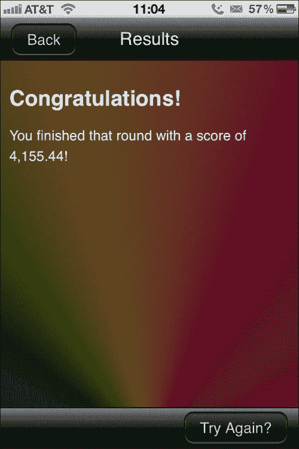

安卓的视图将如下所示：

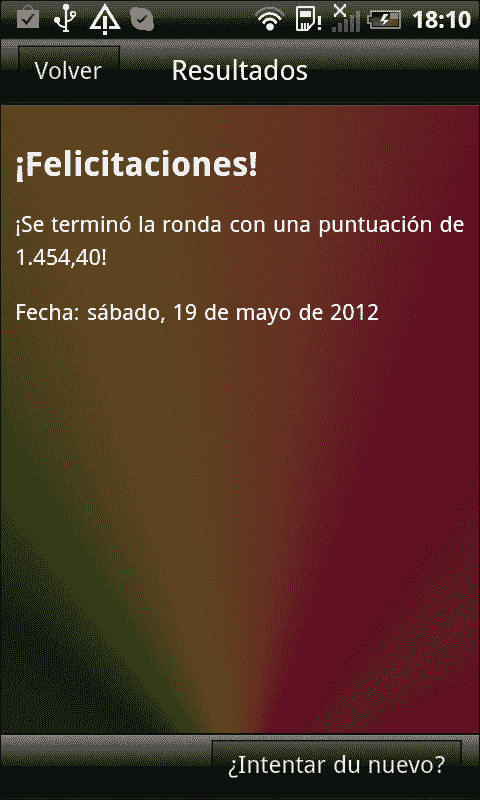

## 继续前进

和我们之前的视图一样，第一步是定义 HTML 表示：

```js
<div class="viewBackground">
 <div class="navigationBar">
  <div id="endView_title"></div>
  <button class="barButton backButton" id="endView_backButton" style="left:10px" ></button>
 </div>
 <div class="content avoidNavigationBar avoidToolBar" id="endView_gameArea">
  <div id="endView_resultsArea"></div>
 </div>
 <div class="toolBar">
  <button class="barButton" id="endView_tryAgainButton" style="right:10px" ></button>
 </div>
</div>
```

我在这段代码中突出显示了两个区域：`resultsArea`，我们将告诉玩家他们的得分，以及工具栏中的按钮，这次是一个 `Try Again?` 按钮。它的工作方式就像一个返回按钮一样。

接下来，我们需要本地化内容。在这种情况下，它既是本地化内容又是模板，如下面的代码片段所示：

```js
<div id="endView_template_en" class="hidden">
  <h2>Congratulations!</h2>
  <p>You finished that round with a score of %SCORE%!</p>
  <p>Dated: %DATE%</p>
</div>

<div id="endView_template_es" class="hidden">
  <h2>¡Felicitaciones!</h2>
  <p>¡Se terminó la ronda con una puntuación de %SCORE%!</p>
  <p>Fecha: %DATE%</p>
</div>
```

同样，这些 `div` 元素被隐藏起来，这样玩家就看不到它们，但我们会取它们的内容，替换 `%SCORE%` 和 `%DATE%`，然后将结果内容显示给玩家。

让我们看看我们的脚本：

```js
<script>

  var endView = $ge("endView") || {};  // properly namespace

  endView.score = 0;
```

首先，我们将分数设置为零，主要是为了初始化目的。我们将在下一节提供一个设置任何分数的实用函数。你应该记得，当游戏在游戏视图中结束时，会调用这个函数。初始化的代码片段如下：

```js
  endView.setScore = function( theScore )
  {
    endView.score = theScore;
  }
```

如同我们之前所有视图的典型做法，我们有一个 `initializeView()` 方法。有一点不同是它没有本地化内容区域；这是因为我们此时还不知道分数。`initializeView()` 函数在游戏甚至开始之前就被调用了，更不用说完成游戏了。这个函数的定义如下：

```js
  endView.initializeView = function ()
  {

    endView.viewTitle = $ge("endView_title");
    endView.viewTitle.innerHTML = __T("RESULTS"); 

    endView.backButton = $ge("endView_backButton");
    endView.backButton.innerHTML = __T("BACK");
    PKUI.CORE.addTouchListener(endView.backButton, "touchend", 
      function () { PKUI.CORE.popView(); });

    endView.nextButton = $ge("endView_tryAgainButton");
    endView.nextButton.innerHTML = __T("TRY_AGAIN?");

    PKUI.CORE.addTouchListener(endView.nextButton, "touchend", 
      function () { PKUI.CORE.popView(); });

    endView.questionArea = $ge("endView_resultsArea");
  }
```

注意到两个按钮，`back` 按钮和 `try again` 按钮都做同样的事情，它们弹出视图。这是因为当我们弹出视图时，`gameView` 将获得 `viewWillAppear` 通知，这将重置游戏。

这个视图也需要这样的通知来设置内容区域，因为我们会在 `endView` 出现在屏幕上时知道分数：

```js
  endView.viewWillAppear = function ()
  {
    var theTemplate = $geLocale("endView_template").innerHTML;

    theTemplate = theTemplate.replace ( "%SCORE%", 
        __N(endView.score, "2") );

    theTemplate = theTemplate.replace ( "%DATE%",  
        __D(new Date(), "D") );

    endView.questionArea.innerHTML = theTemplate;
  }
```

我们获取了正确本地化的模板，并用实际得分替换`%SCORE%`，用当前日期替换`%DATE%`（这里的`D`表示长格式日期）。然后我们将其展示给最终用户。所有这些都在视图在屏幕上动画之前发生。

我们需要编写能够处理按下“返回”按钮的代码，这将弹回到“游戏视图”：

```js
endView.backButtonPressed = function ()
  {
    PKUI.CORE.popView();
  }
```

令人惊讶的是，就是这样。这里真的没有新的领域要覆盖，没有新的框架方法，没有新的实用方法，也没有新的本地化概念。唯一看起来新的就是`__D()`函数，正如你可能猜到的，它是用来本地化日期的。实际上，还有两个类似的功能：`__C()`，用于本地化货币，以及`__PCT()`，用于本地化百分比。我们将在后面的应用程序中处理这些。

## 我们做了什么？

我们创建了结束视图。我们正确地本地化了内容模板，并本地化了数字和日期。

# 将一切整合起来

我们几乎已经拥有了一个功能齐全的应用程序，但我们缺少几个关键组件：加载所有内容并启动它的部分。为此，我们将在`www`目录下创建一个`app.js`文件和两个 HTML 文件。

## 继续前进

`index.html`和`index_android.html`文件通过加载必要的脚本并调用`app.js`来启动一切。这些通常是每个应用程序的标准配置，因此在整个书籍的其余部分中它们不会发生太大变化。

首先，`index.html`，这是为 iOS 准备的，如下所示：

```js
<!DOCTYPE html>
<html>
  <head>
    <title>Chapter 1 App: Quiz Time</title>
    <meta name="apple-mobile-web-app-capable" content="yes" />
    <meta name="viewport" content="width=device-width, maximum-scale=1.0" />
    <meta name="format-detection" content="telephone=no" />
    <link rel="stylesheet" href="./framework/base.css" type="text/css" />
    <link rel="stylesheet" href="./style/style.css" type="text/css" />
    <script type="application/javascript" charset="utf-8" src="img/cordova-2.2.0-ios.js"></script>
    <script type="application/javascript" charset="utf-8" src="img/utility.js"></script>
    <script type="application/javascript" charset="utf-8" src="img/app.js"></script>
  </head>
  <body>
    <div class="container" id="rootContainer">
    </div>
    <div id="preventClicks"></div>
  </body>
</html>
```

接下来是`index_android.html`，这是为 Android 准备的，如下所示：

```js
<!DOCTYPE html>
<html>
  <head>
    <title>Chapter 1 App: Quiz Time</title>
    <meta name="apple-mobile-web-app-capable" content="yes" />
    <meta name="viewport" content="width=device-width, maximum-scale=1.0, target-densityDpi=160" />
    <meta name="format-detection" content="telephone=no" />
    <link rel="stylesheet" href="./framework/base.css" type="text/css" />
    <link rel="stylesheet" href="./style/style.css" type="text/css" />
    <script type="application/javascript" charset="utf-8" src="img/cordova-2.2.0-android.js"></script>
    <script type="application/javascript" charset="utf-8" src="img/utility.js"></script>
    <script type="application/javascript" charset="utf-8" src="img/app.js"></script>
  </head>
  <body>
    <div class="container" id="rootContainer">
    </div>
    <div id="preventClicks"></div>
  </body>
</html>
```

`app.js`文件实际上是启动我们应用程序的文件。它也是初始化本地化、设置当前区域设置、加载各种库（如`ui-core.js`），并最终启动我们的应用程序的文件。现在让我们看看代码：

```js
var APP = APP || {};    
```

如同往常，我们设置了我们的命名空间，这次是 APP。接下来，我们将为`deviceready`事件附加一个事件监听器；这个事件在 Cordova 完成加载其库时触发。我们必须等待这个事件，然后我们才能做很多事情，特别是依赖于 Cordova 的事情。如果我们不这样做，我们会得到错误。我们将命名空间设置如下：

```js
document.addEventListener("deviceready", onDeviceReady, false);

function onDeviceReady()
{
  APP.start();
}
```

前面的函数所做的只是调用`APP.start()`函数，该函数定义如下：

```js
APP.start = function ()
{
  PKUTIL.include ( [ "./framework/ui-core.js", 
                     "./framework/device.js", 
                     "./framework/localization.js" ], 
           function () { APP.initLocalization(); } );
}
```

你已经看到了`PKUTIL.include`，所以它对你来说不是什么新东西，但在这里我们正在加载三个库，并包含一个`completion`函数来调用`APP.initLocalization`。因为包含是异步的，所以我们不能在这次调用之后继续编写依赖于这些库的代码，否则有很大可能库不会及时加载。因此，我们在所有三个库完全加载后调用`initLocalization`函数。

下一个函数`initLocalization`通过加载其库来初始化`jQuery/Globalize`，当它完成时，我们加载我们可能需要的任何地区。当这些地区加载完成后，我们调用`APP.init`，这里真正的任务开始了。`APP.init`函数如下所示：

```js
APP.initLocalization = function ()
{
  PKLOC.initializeGlobalization( 
   function ()
   {
      PKLOC.loadLocales ( ["en-US","en-AU","en-GB",
        "es-ES","es-MX","es-US","es"], 
      function ()
     {
       APP.init();
     } );
   }
  );
}
```

`APP.init()`函数定义了我们应用程序的基本翻译矩阵（你可能在这里看到之前见过的翻译；那是因为它们起源于这里），我们接着将我们创建的三个视图加载到文档中：

```js
APP.init = function ()
{ 
```

首先，我们通过将其设置为西班牙语语言和西班牙国家来模拟我们的地区设置。如果你想让应用程序通过查询系统来确定地区，请取消注释该行。

```js
  PKLOC.currentUserLocale = "es-ES";
```

接下来，我们有我们的基本翻译矩阵，应用程序标题，正确和错误的翻译，开始，返回和跳过，等等：

```js
  PKLOC.addTranslation ("en", "APP_TITLE",     "Quiz Time");
  PKLOC.addTranslation ("en", "APP_TITLE_IMAGE", "AppTitle-enus.png");
  PKLOC.addTranslation ("en", "CORRECT",       "Correct!");
  PKLOC.addTranslation ("en", "INCORRECT",     "Incorrect.");
  PKLOC.addTranslation ("en", "START",         "Start");
  PKLOC.addTranslation ("en", "BACK",          "Back");
  PKLOC.addTranslation ("en", "SKIP",          "Skip");
  PKLOC.addTranslation ("en", "QUESTION_%1",   "Question %1");
  PKLOC.addTranslation ("en", "SCORE_%1",   "Score: %1");
  PKLOC.addTranslation ("en", "RESULTS",    "Results");
  PKLOC.addTranslation ("en", "TRY_AGAIN?",    "Try Again?");

  PKLOC.addTranslation ("es", "APP_TITLE",     "Examen Tiempo");
  PKLOC.addTranslation ("es", "APP_TITLE_IMAGE", "AppTitle-eses.png");
  PKLOC.addTranslation ("es", "CORRECT",       "¡Correcto!");
  PKLOC.addTranslation ("es", "INCORRECT",     "Incorrecto.");
  PKLOC.addTranslation ("es", "START",         "Comenzar");
  PKLOC.addTranslation ("es", "BACK",          "Volver");
  PKLOC.addTranslation ("es", "SKIP",          "Omitir"); 
  PKLOC.addTranslation ("es", "QUESTION_%1",   "Pregunta %1");
  PKLOC.addTranslation ("es", "SCORE_%1",   "Puntuación: %1");
  PKLOC.addTranslation ("es", "RESULTS",    "Resultados");
  PKLOC.addTranslation ("es", "TRY_AGAIN?",    "¿Intentar du nuevo?");
```

接下来，我们调用`PKUI.CORE`中的一个函数`initializeApplication`。这个函数所做的只是附加一个特殊的事件处理器来跟踪设备的方向。但通过这样做，它也将设备、形态和方向附加到`BODY`元素上，这使得我们能够通过 CSS 针对各种平台。这个函数如下所示：

```js
  PKUI.CORE.initializeApplication ( );
```

接下来，我们加载一个视图，在这种情况下是`gameView`（顺序在这里并不重要）：

```js
  PKUTIL.loadHTML ( "./views/gameView.html", 
                    { id : "gameView", 
                      className: "container", 
                      attachTo: $ge("rootContainer"), 
                      aSync: true
                    },
                    function (success)
                    {
                      if (success)
                      {
                        gameView.initializeView();
                      }
                    });
```

我们通过调用`PKUTIL.loadHTML`来完成这个任务，如果你认为它和`PKUTIL.include`非常相似，你就对了。我们稍后会查看其定义，但可以简单地说，我们正在加载`gameView.html`内的内容，将其包裹在一个具有`id`值为`gameView`和`class`为`container`的`div`中，并将其附加到`rootContainer`上，并指示它可以异步加载。

一旦加载完成，我们将在其上调用`initializeView()`。

我们以相同的方式加载结束视图：

```js
  PKUTIL.loadHTML ( "./views/endView.html", 
                    { id : "endView", 
                      className: "container", 
                      attachTo: $ge("rootContainer"), 
                      aSync: true
                    },
                    function (success)
                    {
                      if (success)
                      {
                        endView.initializeView();
                      }
                    });
```

我们以几乎相同的方式加载起始视图，如下所示：

```js
  PKUTIL.loadHTML ( "./views/startView.html", 
                    { id : "startView", 
                      className: "container", 
                      attachTo: $ge("rootContainer"), 
                      aSync: true
                    },
                    function (success)
                    {
                      if (success)
                      {
                        startView.initializeView();
                        PKUI.CORE.showView (startView);
                      }
                    });

}
```

我们唯一不同的地方是在初始化后显示`startView`。此时游戏已经完全加载并运行，等待玩家点击**开始**。

## 我们做了什么？

我们通过创建`app.js`文件将所有内容整合在一起。我们学习了如何初始化 jQuery/Globalize 库，如何模拟地区设置，以及如何设置我们的翻译矩阵。我们还学习了如何加载视图，以及如何显示第一个视图。

## 我还需要了解什么？

让我们更仔细地看看`PKUTIL.loadHTML`：

```js
PKUTIL.loadHTML = function( theFileName, options, completion )
{
  var aSync = options["aSync"];
```

我们首先提取出`aSync`选项，我们需要它来调用`PKUTIL.load`。再次提醒，关于 WP7 和同步加载的警告仍然适用。最好假设你总是使用`true`，除非你可以排除 WP7 作为你的支持平台。我们使用`aSync`选项如下：

```js
  PKUTIL.load ( theFileName, aSync, function ( success, data )
  {
    if (success)
    {
```

到目前为止，我们已经成功加载了 HTML 文件，如下面的代码片段所示，现在我们必须弄清楚如何处理它：

```js
      var theId = options["id"];
      var theClass = options["className"];
      var attachTo = options["attachTo"];
```

首先，我们提取出我们需要的其他参数，即 `id`、`className` 和 `attachTo`：

```js
      var theElement = document.createElement ("DIV");
      theElement.setAttribute ("id", theId);
      theElement.setAttribute ("class", theClass);
      theElement.style.display = "none";
      theElement.innerHTML = data;
```

接下来，我们创建一个 `div` 元素，并给它 `id` 和 `class`。我们还将数据加载到元素中，如下面的代码块所示：

```js
      if (attachTo)
      {
        attachTo.appendChild (theElement);
      }
      else
      {
        document.body.appendChild (theElement);
      }
```

如果可能，我们将连接到 `attachTo` 中指定的元素，但如果它未定义，我们将连接到 `BODY` 元素。就在这一点上，我们成为了显示层次结构中的真实 DOM 元素。

不幸的是，这还不是全部。记住，我们的 HTML 文件中包含 `SCRIPT` 标签。由于某种原因，这些脚本以这种方式加载时不会自动执行。我们必须再次为它们创建 `SCRIPT` 标签，如下面的代码片段所示：

```js
      var theScriptTags = theElement.getElementsByTagName 
          ("script");
```

首先，我们获取我们新创建元素中的所有 `SCRIPT` 标签。然后我们将遍历每一个，如下所示：

```js
      for (var i=0;i<theScriptTags.length;i++)
      {
        try 
        {
          // inspired by 
          http://bytes.com/topic/javascript/answers/513633-innerhtml-script-tag
          var theScriptElement = 
              document.createElement("script");
          theScriptElement.type = "text/javascript";
          theScriptElement.charset = "utf-8";
          if (theScriptTags[i].src)
          {
            theScriptElement.src = theScriptTags[i].src;
          }
          else
          {
            theScriptElement.text = theScriptTags[i].text;
          }
          document.body.appendChild (theScriptElement);
```

如果这段代码看起来有些熟悉，那是因为 `PKUTIL.include` 有一个类似的变体。重要的区别是它只关注脚本的 数据；这里我们必须担心脚本是否定义为外部脚本。这就是为什么我们要检查 `SRC` 属性是否已定义。

我们还将其放在一个 `try`/`catch` 块中，以防脚本中存在错误：

```js
        }
        catch ( err )
        {
          console.log ( "When loading " + theFileName + 
                        ", error: " + err );
        }
      }
```

我们已经完成了 HTML 和脚本的加载，因此我们调用 `completion` 函数：

```js
      if (completion)
      {
        completion (PKUTIL.COMPLETION_SUCCESS);
      }
    }
```

如果由于某种原因我们无法加载视图，我们将生成一个日志消息，并调用 `completion` 函数，如下所示，带有失败通知：

```js
    else
    {
      console.log ("WARNING: Failed to load " + theFileName );
      if (completion)
      {
        completion (PKUTIL.COMPLETION_FAILURE);
      }
    }
  }
  );
}
```

接下来，我们应该回顾我们遇到的新本地化功能。第一个是 `PKLOC.initializeGlobalization()`：

```js
PKLOC.initializeGlobalization = function ( completion )
{
    PKUTIL.include ( [ "./framework/globalize.js" ], 
        completion );
}
```

如您所见，它所做的只是加载 `jQuery/Globalize` 框架，然后调用其完成处理程序。

下一个函数是 `PKLOC.loadLocales`。它旨在使加载 `jQuery/Globalize` 文化文件变得容易。这些文件位于 `www/framework/cultures` 目录中，你可以拥有并加载尽可能多的文件。只需记住，你拥有的越多，你的应用程序就越大，启动所需的时间就越长：

```js
PKLOC.loadLocales = function ( theLocales, completion )
{
   for (var i=0; i<theLocales.length; i++)
  {
     theLocales[i] =        
        "./framework/cultures/globalize.culture." + 
        theLocales[i] + ".js";
  }
   PKUTIL.include ( theLocales, completion );
}
```

我们利用 `PKUTIL.include` 接受脚本文件数组的事实。传入的本地化（没有真正的特定顺序；`jQuery/Globalize` 文化文件只依赖于已加载的 `jQuery/Globalize` 库）已经在一个数组中，因此我们修改数组以包含文化文件的完整路径和名称。完成之后，我们将它们包含进来，当它们全部加载完毕时，将调用 `completion` 函数。

# 游戏结束..... 结束

哇，在这个第一个项目中，我们一起经历了许多。我们也学到了很多，包括：

+   如何正确本地化文本

+   如何正确本地化数字

+   如何正确本地化日期

+   如何正确本地化图像

+   如何正确本地化 HTML

+   如何实现简单的 HTML 模板

+   如何创建一个新的视图

+   如何显示视图

+   如何将新视图推送到屏幕上，并将视图从屏幕上弹出

+   如何处理 Android/WP7 返回按钮

+   如何在我们的 JavaScript 中包含文件

+   如何确定用户的区域设置

+   如何初始化 jQuery/Globalize 以及加载我们可能需要的区域设置

有些资源你可能觉得很有趣。你可能想查阅 YASMF 文档，了解更多关于我们使用的框架的信息。以下是一些资源的提及：

+   Adobe Photoshop 在 [`www.adobe.com/PhotoshopFamily`](http://www.adobe.com/PhotoshopFamily)

+   GIMP 在 [`www.gimp.org`](http://www.gimp.org)

+   PhoneGap 下载在 [`www.phonegap.com/download`](http://www.phonegap.com/download)

+   PhoneGap 文档在 [`docs.phonegap.com`](http://docs.phonegap.com)

+   YASMF GitHub 在 [`github.com/photokandyStudios/YASMF/`](https://github.com/photokandyStudios/YASMF/)

+   YASMF 文档在 [`github.com/photokandyStudios/YASMF/wiki/`](https://github.com/photokandyStudios/YASMF/wiki/)

+   Xcode 在 [`developer.apple.com/xcode`](https://developer.apple.com/xcode)

+   Eclipse Classic 4.2.1 在 [`www.eclipse.org/downloads/packages/eclipse-classic-421/junosr1`](http://www.eclipse.org/downloads/packages/eclipse-classic-421/junosr1)

+   Android SDK 下载在 [`developer.android.com/sdk/index.html`](http://developer.android.com/sdk/index.html)

# 你能承受住热度吗？热手挑战

这个项目可以通过很多种方式来增强。你为什么不尝试其中之一或更多呢？

+   游戏目前支持英语和西班牙语。尝试添加另一种语言。

+   如果你玩这个游戏任何一段时间，你会发现同一个问题经常在同一个集合中再次被问起。让它变得如此，一个问题在每个集合中只能问一次。

+   为问题添加类别，然后允许用户选择他们想要玩过的类别。

+   为问题添加难度级别。这些可能会影响所获得的分数。允许用户选择他们想要玩的难度级别。

+   提出一个游戏的不同外观和感觉，并实现它。也许甚至允许用户决定他们想要使用的外观和感觉。
