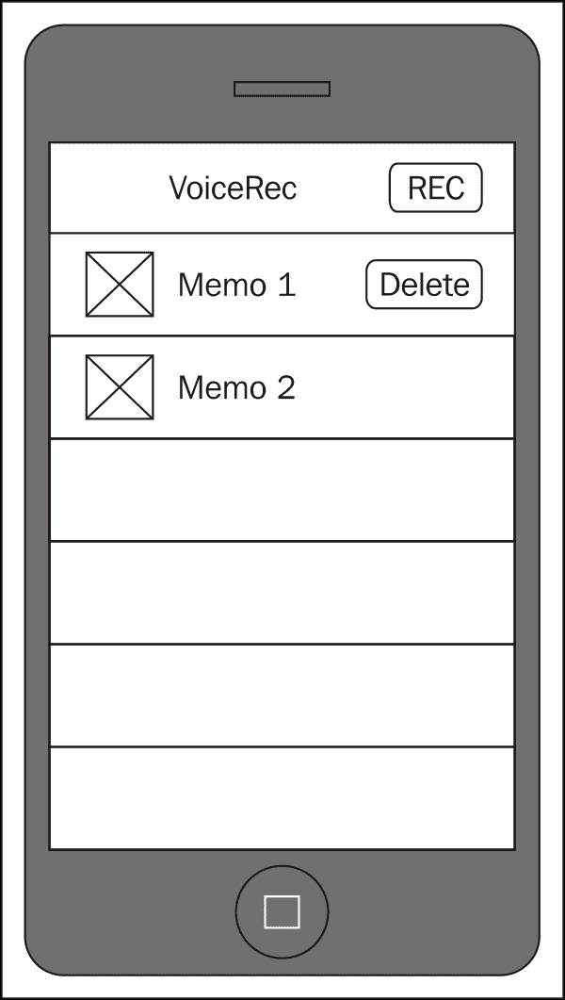
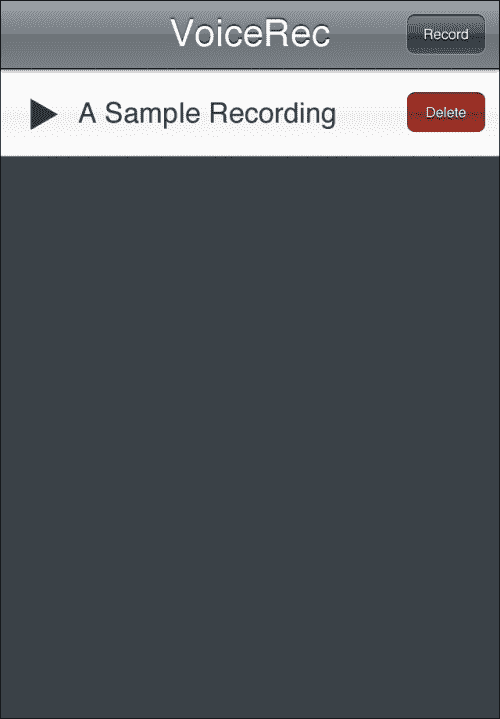
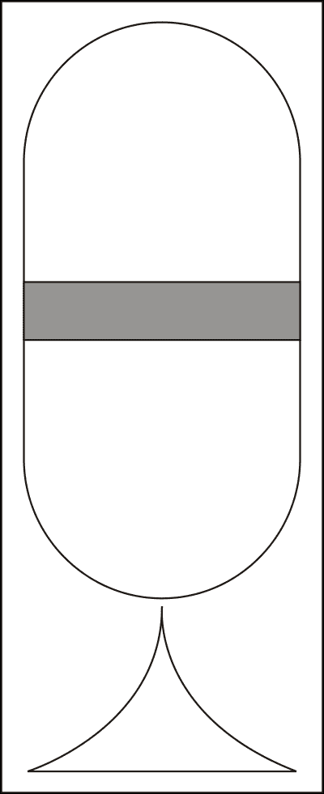
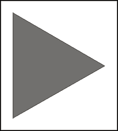
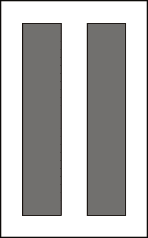
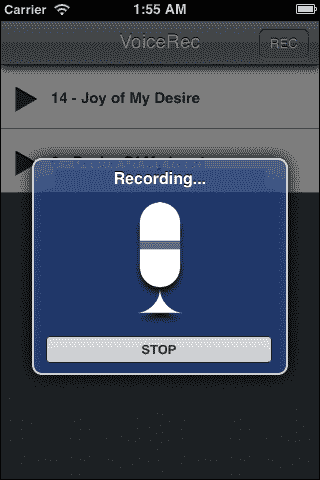
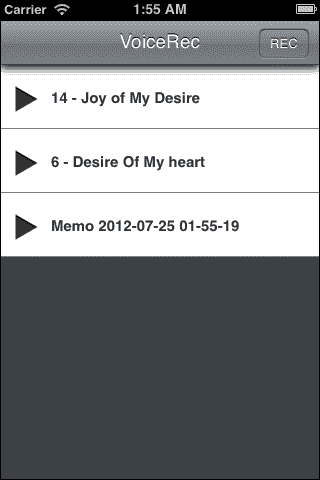
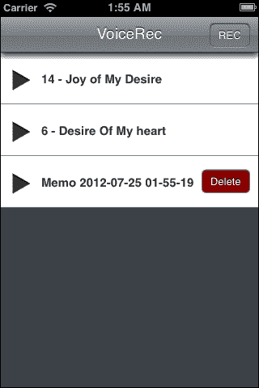
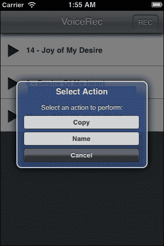

# 第五章 与您的应用对话

我们移动设备的媒体功能实际上非常惊人，尤其是当你考虑到五年、十年、十五年前我们所在的位置。第一台大规模生产的 MP3 播放器是 1997 年推出的*SaeHan/Eiger MPMan* ([`en.wikipedia.org/wiki/Portable_media_player#SaeHan.2FEiger_MPMan`](http://en.wikipedia.org/wiki/Portable_media_player#SaeHan.2FEiger_MPMan))。该设备有 32MB 的存储空间，足以存储大约 6 到 7 首歌曲（假设每分钟 1MB，每首歌 5 分钟）。虽然按照今天的标准可能看起来很少，但它是一场革命，并催生了一种新的听音乐的方式。

今天的设备现在不仅仅是便携式娱乐设备，可以玩游戏、视频和所有类型的音频。能够在您的应用程序中播放声音至关重要，而且很少有应用程序可以声称完全没有声音。虽然可能有些极端，但*TweetBot*是一个经典的例子，该应用程序通过用户的交互产生的声音得到了增强。

今天的设备也可以出于各种原因记录音频，无论是为了稍后提醒，记录演讲或会议，还是更多。有很多应用程序可能不需要这种功能，但对于某些细分市场来说，了解如何录音是很重要的。

# 我们要构建什么？

我们将构建一个相当简单的应用程序，其目的只有一个：存储和回放最终用户的录音，无论它们是什么。它们可能是一段简短的备忘录或一次会议。我们将大量使用我们现有的框架，从视觉上看可能不多，但在下面有很多东西在支持音频播放和录音。

## 它能做什么？

在这个项目中，您将能够播放和录音音频。我们将为 iOS 录制`WAV`格式，为 Android 录制`AMR`格式。其他平台支持其他格式，所以如果您针对的不是 Android 或 iOS 以外的平台，请务必核实支持哪些格式。

您还将能够播放音频；我们将支持 Android 上的`MP3`和`WAV`，以及 iOS 上的`WAV`（我们在这里排除 iOS 上的 MP3 的主要原因是一个导致`MP3`格式音频以糟糕的质量和极其大的音量渲染的 bug）。

## 这为什么很棒？

这个项目之所以如此出色还有另一个原因：我们引入了手势支持。没错：*滑动删除*和*长按*也将在这个应用程序中体现。

## 我们将如何实现？

我们将遵循与之前项目相同的任务列表：

+   设计用户界面和外观

+   设计数据模型

+   实现数据模型

+   实现手势支持

+   实现主视图

## 我需要准备些什么才能开始？

像往常一样，按照我们在以前项目中使用的相同步骤创建您的项目。您可能还想参考 PhoneGap 媒体 API 文档，因为我们将会大量使用它。（参考[`docs.phonegap.com/en/edge/cordova_media_media.md.html#Media`](http://docs.phonegap.com/en/edge/cordova_media_media.md.html#Media)）

# 设计用户界面和外观

这个应用将比我们之前的任何应用都要简单。我们只需要一个视图，而这个视图的外观已经由我们过去两个项目的 Android 界面在很大程度上定义了。没错；视图本质上是一个项目列表，没有太多花哨的地方。

## 继续前进

我们将在项目列表中做一些改变。本质上，我们将通过隐藏操作图标（删除、分享等）并在收到手势时显示它们来清理列表。我们还将列表项中包含**播放**和**暂停**按钮，而不是任何特定的文档图像。毕竟，我们没有用户自己创建的录音的专辑封面。

让我们看看原型：



如您所见，这个原型与我们在以前项目中使用的 Android 文件列表非常相似。它与 iOS 上的基于文档的列表有很大不同，但前面的视图足够常见，用户会知道如何使用它。

列表中的图标将不是文档图标。相反，我们将使用播放和暂停图标来显示文档的状态。如果它目前正在播放，我们将显示暂停图标，如果没有播放，我们将显示播放图标。

右侧的**删除**按钮是通过使用水平滑动手势来显示的；这些按钮在其他情况下是不可见的。

你可能会问，我们的文档操作，比如重命名或复制，在哪里？这是一个很好的问题。它们仍然可用，但只有在用户将手指放在项目上超过一秒时才可用。到那时，长按滑动将被识别，并弹出一个小菜单，询问用户他们想做什么。

**录音**按钮旨在开始录音会话。它将要求输入文件名，一旦输入，它将显示另一个弹出窗口，表明正在录音。用户可以通过按下弹出窗口上的**停止**按钮来停止录音。我们还会在这个弹出窗口上显示一个麦克风图标，以向用户表明应用正在录音。

现在我们已经完成了原型，让我们在我们的图形编辑器中处理我们的图形设计。结果将如下所示：



以下是我们作为原型的一部分创建的一些图标。您可以在本项目的代码文件中找到它们的图像。

麦克风如下所示：



播放按钮如下所示：



暂停按钮将如下所示：



注意，背景画布和导航栏与我们的前一个项目相同。我们真正需要为此任务提供的只是播放状态、暂停状态和麦克风的图标。其他一切都可以通过 CSS 和 HTML 处理。

## 我们做了什么？

在本节中，我们设计了用户界面并定义了应用程序的感觉。我们还设计了我们将需要的图标。

# 设计数据模型

数据模型并不特别复杂，但确实与我们的前一个项目略有不同。文档集合在本质上相同，所以我们不会介绍该模型，但文档本身是不同的。它必须加载和管理音频资源而不是常规文件。

## 开始行动

我们的模式定义如下：

| VoiceRecDocument |   |
| --- | --- |
| - fileEntry | 对象 |
| - filename | 字符串 |
| - fileType | 字符串 |
| - completion | 函数 |
| - failure | 函数 |
| - state | 字符串 |
| - title | 字符串 |
| - media | 对象 |
| - position | 数字 |
| - duration | 数字 |
| - playing | 布尔值 |
| - recording | 布尔值 |
| - paused | 布尔值 |
| - positionTimer | 定时器 ID |
| - durationTimer | 定时器 ID |
| - getFileName() |   |
| - setFileName() |
| - initializeMediaObject() |
| - isPlaying() |
| - isRecording() |
| - updatePosition() |
| - updateDuration() |
| - getPlaybackPosition() |
| - setPlaybackPosition() |
| - getDuration() |
| - startPlayback() |
| - pausePlayback() |
| - releaseResources() |
| - stopPlayback() |
| - startRecording() |
| - stopRecording() |
| - dispatchFailure() |
| - dispatchSuccess() |

让我们来看看每个属性和方法应该做什么：

+   `fileEntry` 属性存储从 File API 获取的文件条目。

+   `fileName` 属性存储音频文件的完整路径。

+   `fileType` 属性存储音频文件的扩展名（WAV、MP3 等）。

+   `completion` 和 `failure` 方法指向 `completion` 和 `failure` 函数。

+   `title` 属性存储文件名称（不包括路径和扩展名）。

+   `media` 属性将存储来自 `Media` API 的 `Media` 对象。

+   `position` 属性将指示当前播放位置（以秒为单位）。

+   `duration` 属性将指示当前录音时长或文件播放时长（以秒为单位）。

+   `playing`、`recording`、`paused` 是用于跟踪对象内部发生情况的内部状态方法。

+   `positionTimer` 和 `durationTimer` 是用于更新位置和时长属性的定时器 ID。

+   `get`/`setFileName` 方法获取/设置 `fileName` 属性。

+   `isPlaying`/`isRecording` 方法返回相应的属性。

+   `updatePosition`/`updateDuration` 是在播放和录音期间更新 `position` 和 `duration` 属性的内部方法。

+   `get`/`setPlaybackPosition` 将获取或设置当前播放位置。如果设置，这将使用 `Media` API 的 `seekTo()` 方法。

+   `start`/`pause`/`stopPlayback` 将开始、暂停或停止播放。

+   `releaseResources` 将允许释放媒体文件消耗的内存，以便我们不会耗尽内存。

+   `start`/`stopRecording` 将开始或停止录制。

+   `dispatchFailure`/`Success` 将调用 `failure` 或 `completion` 方法。

## 我们做了什么？

在这个任务中，我们定义了 `VoiceRecDocument` 的模型以及内部进行的各种交互。

# 实现数据模型

现在我们已经设计了模型，让我们继续实现它。

## 准备就绪

就像我们之前的工程项目一样，我们将有两个数据模型：第一个用于处理可播放文件的集合，第二个用于处理特定可播放文件的处理。第一个，`VoiceRecDocumentCollection.js` 与我们之前的工程项目非常相似，所以我们不会在这个任务中详细说明。但 `VoiceRecDocument.js` 文件非常不同，所以请打开它（位于 `www/models` 目录），这样你可以跟随操作。

## 继续前进

让我们开始使用以下代码片段：

```js
DOC.VoiceRecDocument = function(theFileEntry, completion, failure)
{
  var self = this;
  self.fileEntry = theFileEntry;
  self.fileName = self.fileEntry.fullPath;
  self.fileType = PKUTIL.FILE.getFileExtensionPart(self.fileName);
  self.completion = completion;
  self.failure = failure;
  self.state = "";
```

如同我们之前的工程项目，传入的参数包括从 `File` API 获取的文件条目。我们将使用它来确定要播放的音频文件的名称及其类型。我们使用一些新函数，这些函数是在本版本的框架中引入的，用于处理文件的不同部分，即路径、文件名和文件扩展名。之前，我们使用 `PKUTIL.FILE.getFileExtensionPart()` 来获取文件的类型，无论是 MP3、WAV 还是其他类型。

```js
  self.title = PKUTIL.FILE.getFileNamePart(self.fileName);
  self.media = null;
  self.position = 0;
  self.duration = 0;
  self.playing = false;
  self.recording = false;
  self.paused = false;
  self.positionTimer = -1;
  self.durationTimer = -1;
```

在这里，我们定义了几个属性，我们将使用它们来跟踪我们需要用于正确管理音频的各种状态和定时器：

+   `title`: 这个属性给出了文件的标题，基本上是文件名减去路径和扩展名。

+   `media`: 这个属性给出了 PhoneGap 提供的 `Media` 对象。每当程序需要播放声音或录制某些内容时，此属性将被设置。

+   `position`: 这个属性给出了播放时的近似位置。它之所以是近似的，是因为它每隔几毫秒就会更新位置。我们稍后会讨论原因。

+   `duration`: 这个属性给出了声音文件的持续时间（如果正在播放），或者录制（在录制期间或之后）的近似持续时间。

+   `playing`, `recording`, `paused`: 这些只是简单的布尔变量，旨在使我们能够轻松地确定我们在做什么。我们在播放文件，录制文件，如果我们正在播放，我们是否暂停？

+   `durationTimer`, `positionTimer`: 定时器 ID 用于跟踪每次我们加载媒体文件或为其录制做准备时创建的间隔。`durationTimer` 属性更新 `duration` 属性，而 `positionTimer` 属性更新位置。

    ```js
      self.getFileName = function()
      {
        return self.fileName;
      }

      self.setFileName = function(theFileName)
      {
        self.theFileName = theFileName;
        self.fileType = PKUTIL.FILE.getFileExtensionPart(self.fileName);
        self.title = PKUTIL.FILE.getFileNamePart(self.fileName);
      }
    ```

前面的代码片段处理获取和设置文件名。如果我们设置了一个文件名，我们必须更新文件名、类型和标题。

```js
  self.initializeMediaObject = function()
  {
```

这个方法是一个非常重要的方法；我们将在大多数与播放或录制一起工作的方法顶部调用它。这是为了确保`media`属性被正确初始化。但这也是为了确保一些其他细节被正确设置，如下所示：

```js
    if (self.media == null)
    {
      if (PKDEVICE.platform()=="android")
      {
        self.fileName = self.fileName.replace ("file://","");
      }
```

首先，我们只在这些步骤中执行这些步骤，如果我们已经有了`media`对象。如果我们已经有了，就没有必要再次初始化它。

其次，我们检查我们是否在 Android 上运行。如果是，从`File` API 出来的`file://`前缀会混淆`Media` API，所以我们将其移除。

```js
      self.media = new Media(self.fileName, self.dispatchSuccess, self.dispatchFailure);
```

接下来，我们使用一个新的`Media`对象初始化`media`属性。这个对象需要音频文件的文件名，以及两个函数：一个用于各种音频功能成功完成时（通常只在播放或录制停止时），另一个用于出错时。

```js
      self.positionTimer = setInterval(self.updatePosition, 250);
      self.durationTimer = setInterval(self.updateDuration, 250);
    }
  }
```

最后，我们也设置了两个计时器，每四分之一秒更新一次。这些时间可以根据你喜欢的更新粒度加快或减慢，但`250`毫秒似乎已经足够了。

```js
  self.isPlaying = function()
  {
    return self.playing;
  }

  self.isRecording = function()
  {
    return self.recording;
  }
```

当然，像任何好的模型一样，我们需要提供方法来指示我们的状态。因此，在先前的代码片段中使用了`isPlaying`和`isRecording`。

```js
  self.updatePosition = function()
  {
    if (self.playing)
    {
      self.media.getCurrentPosition(function(position)
      {
        self.position = position;
      }, self.dispatchFailure);
    } else
    {
      if (self.recording)
      {
        self.position += 0.25;
      } else
      {
        self.position = 0;
      }
    }
  }
```

如果你还记得，这个函数在播放和录制过程中会连续调用。如果在播放，我们会询问`Media` API 当前的位置，但我们必须提供一个回调方法才能实际找出位置。这通常应该几乎立即完成，但我们不能保证，这就是为什么我们稍微封装了获取位置的原因。我们将在后面定义一个`getPosition()`方法，它只是查看`position`属性，而不是每次我们想知道在音频文件中的位置时都要进行回调。

```js
  self.updateDuration = function()
  {
    if (self.media.getDuration() > -1)
    {
      self.duration = self.media.getDuration();
      clearInterval(self.durationTimer);
      self.durationTimer = -1;
    } else
    {
      self.duration--;
      if (self.duration < -20)
      {
        self.duration = -1;
        clearInterval(self.durationTimer);
        self.durationTimer = -1;
      }
    }
  }
```

获取持续时间比获取当前位置更困难，主要是因为`Media` API 很可能正在从互联网上流式传输文件，而不是播放本地文件。因此，获取持续时间可能需要一些时间。

只要持续时间计时器在运行，我们就会询问`Media` API 是否已经有了文件的持续时间。如果没有，它会返回`-1`。如果它确实返回一个大于`-1`的值，我们可以停止计时器，因为一旦我们得到持续时间，它不太可能改变。

没有必要永远不断地询问持续时间，特别是如果我们无法确定持续时间，所以我们使用`duration`属性的`-1`到`-20`的负数作为超时。每次我们未能获取有效的持续时间，我们就减去一，如果我们低于`-20`，我们就停止计时器放弃。

```js
  self.getPlaybackPosition = function()
  {
    return self.position;
  }

  self.setPlaybackPosition = function(newPosition)
  {
    self.position = newPosition;
    self.initializeMediaObject();
    self.media.seekTo(newPosition * 1000);
  }
```

获取播放位置现在很简单，我们只需返回自己的`position`属性。但有时我们需要更改当前的播放位置。为此，我们使用`Media` API 的`seekTo()`方法来调整位置。由于任何原因，`seekTo()`方法中使用的位置是以毫秒为单位的，而我们的计时器不断获取的位置是以秒为单位的，因此需要乘以`1000`。

```js
  self.getDuration = function()
  {
    return self.duration;
  }

  self.startPlayback = function()
  {
    self.initializeMediaObject();
    self.media.play();
    self.paused = false;
    self.recording = false;
    self.playing = true;
  }

  self.pausePlayback = function()
  {
    self.initializeMediaObject();
    self.media.pause();
    self.playing = false;
    self.paused = true;
    self.recording = false;
  }
```

开始播放实际上非常简单：一旦我们初始化对象，我们只需在它上面调用`play()`方法。播放将尽快开始。我们还设置我们的状态属性以指示我们正在播放。

一旦开始播放，我们也可以轻松暂停：我们只需调用`pause()`方法。我们更新我们的状态以反映我们已经暂停。

```js
  self.releaseResources = function()
  {
    if (self.recording)
    {
      self.stopRecording();
    }
    if (self.positionTimer > -1)
    {
      clearInterval(self.positionTimer);
    }
    if (self.durationTimer > -1)
    {
      clearInterval(self.durationTimer);
    }
    self.durationTimer = -1;
    self.positionTimer = -1;
    self.media.release();
    self.media = null;
  }
```

由于媒体文件可能会消耗大量内存，因此当它们不再使用时，应该从内存中释放。当我们释放文件时，如果计时器正在运行，我们还需要停止计时器。

```js
  self.stopPlayback = function()
  {
    self.initializeMediaObject();
    self.media.stop();
    self.isPlaying = false;
    self.isPaused = false;
    self.isRecording = false;
  }
```

停止播放相当简单：只需调用`stop()`方法而不是`pause()`方法。两者之间的区别在于，暂停播放允许后续调用`play()`方法立即从暂停的位置继续。调用`stop()`方法将重置我们的位置为零，因此下一个`play()`方法将从开头开始。

```js
  self.startRecording = function()
  {
    self.initializeMediaObject();
    self.media.startRecord();
    self.isPlaying = false;
    self.isPaused = false;
    self.isRecording = true;
  }

  self.stopRecording = function()
  {
    self.initializeMediaObject();
    self.media.stopRecord();
    self.isPlaying = false;
    self.isPaused = false;
    self.isRecording = false;
  }
```

录音同样简单：我们只需调用`startRecord()`或`stopRecord()`。在录音过程中没有提供暂停的功能。

```js
  self.dispatchFailure = function(e)
  {
    console.log("While " + self.State + ", encountered error: " + e.target.error.code);
    if (self.failure)
    {
      self.failure(e);
    }
  }
```

我们的`failure`方法相当简单。如果发生错误，我们将记录它，然后调用在创建此对象时给出的`failure`方法。

```js
  self.dispatchSuccess = function()
  {
    if (self.completion)
    {
      self.completion();
    }
  }
}
```

`success`函数甚至更简单：我们只需调用在创建对象时传入的`completion()`方法。

## 我们做了什么？

在这个任务中，我们创建了特定音频文件的数据模型以及启动、暂停和停止播放的方法，以及启动和停止录音的方法。

## 我还需要了解什么？

`completion`方法通常在播放结束时调用，尽管也可以出于其他原因调用。通常，人们会使用这个来清理媒体对象，但如果在预期之外调用，结果将是播放的突然停止。

另一个重要的问题是，每个平台只支持某些媒体文件进行播放，甚至对于录音支持不同的文件。以下是一个简短的列表：

| 平台 | 扮演 | 记录 |
| --- | --- | --- |
| iOS | WAV | WAV |
| Android | MP3,WAV, 3GR | 3GR |

# 实现手势支持

手势现在是大多数移动平台的一个关键组件，用户期望他们使用的应用程序支持它们。一个手势可以相当复杂（比如，绘制一个形状，或使用多个手指），或者很简单（只需按住一个项目一段时间），但重要的是你要习惯这个想法。

## 准备中

当使用原生代码在设备上工作时，手势识别通常几乎免费提供给我们。也就是说，操作系统提供的框架完成了识别手势的繁重工作。

不幸的是，使用 PhoneGap，我们失去了这部分免费服务，不得不自己实现手势。这就是 `www/framework` 目录中的 `ui-gestures.js` 发挥作用的地方。请打开它，这样我们可以了解它的一些功能。

## 继续前进

让我们看一下以下代码，从顶部开始：

```js
var GESTURES = GESTURES || {};

GESTURES.consoleLogging = false;

GESTURES.SimpleGesture = function(element)
{
```

我们首先定义一个新的命名空间，称为 `GESTURES`。然后我们在其中创建一个 `SimpleGesture` 类。`SimpleGesture` 将成为我们支持的所有单指手势的基础，包括长按手势、水平滑动手势和垂直滑动手势。

```js
  var self = this;

  self.theElement =  {  };

  self._touchStartX = 0;
  self._touchStartY = 0;
  self._touchX = 0;
  self._touchY = 0;
  self._deltaX = 0;
  self._deltaY = 0;
  self._duration = 0;
  self._timerId = -1;
  self._distance = 0;
  self._event =   {  };
  self._cleared = false;
```

有很多属性用于检测手势。本质上，我们必须跟踪触摸开始的位置，然后跟踪触摸结束的位置（`touchStartX`、`touchStartY`、`touchX`、`touchY`）。我们还需要知道最终触摸与开始时的距离（`deltaX`、`deltaY`、`distance`）。为了防止在某人长时间按住屏幕以缓慢滚动列表时识别手势，我们还跟踪触摸的持续时间。如果持续时间过长，我们拒绝检测手势，并可能中断用户执行的其他操作。

我们还跟踪手势是否已被识别或取消。这是通过 `_cleared` 属性完成的。如果 `_cleared` 是 `true`，则手势已被识别或取消，并且不得再次识别（直到用户从屏幕上抬起手指）。

```js
  self.attachToElement = function(element)
  {
    self.theElement = element;
    self.theElement.addEventListener("touchstart", self.touchStart, false);
    self.theElement.addEventListener("touchmove", self.touchMove, false);
    self.theElement.addEventListener("touchend", self.touchEnd, false);

    self.theElement.addEventListener("mousedown", self.mouseDown, false);
    self.theElement.addEventListener("mousemove", self.mouseMove, false);
    self.theElement.addEventListener("mouseup", self.mouseUp, false);

  }
```

然而，第一步是把我们所有的监听器都附加到特定的元素上。我们附加了六个，分别是 `touchstart`、`touchmove`、`touchend`、`mousedown`、`mousemove` 和 `mouseup`。前三个是为 WebKit 浏览器准备的；后三个是为 Windows Phone 浏览器准备的。（由于手势支持是 YASMF 框架的一部分，它需要支持不仅仅是 iOS 和 Android，因此这里也支持 WP7。）

```js
  self.recognizeGesture = function(o)
  {
    if (GESTURES.consoleLogging)
    {
      console.log("default recognizer...");
    }
  }
  self.attachGestureRecognizer = function(fn)
  {
    self.recognizeGesture = fn;
  }
```

`SimpleGesture` 类之所以如此灵活的部分原因在于它允许使用 `attachGestureRecognizer()` 方法覆盖先前代码片段中的 `recognizeGesture()` 方法。这也意味着作为默认实现的一部分，我们目前根本不识别任何手势。它只是一个为后续识别引擎预留的占位符。

```js
  self.updateGesture = function()
  {
    self._duration += 100;
    self._distance = Math.sqrt((self._deltaX * self._deltaX) + (self._deltaY * self._deltaY));
    if (GESTURES.consoleLogging)
    {
      console.log("gesture: start: (" + self._touchStartX + "," + self._touchStartY + ") current: (" + self._touchX + "," + self._touchY + ") delta: (" + self._deltaX + "," + self._deltaY + ") delay: " + self._duration + "ms, " + self._distance + "px");
    }
    if (!self._cleared)
    {
      self.recognizeGesture(self);
    }
  }
```

当一个疑似的手势正在进行时，我们每 `100` 毫秒调用一次 `updateGesture()` 方法。然后它将有助于计算初始触摸的距离，并调用 `recognizeGesture()` 方法，假设在此之前尚未识别出任何手势。

尝试找出我们如何获得距离；你应该能从你的几何课程中认出它。

```js
  self.clearEvent = function()
  {
    if (self._cleared)
    {
      if (self._event.cancelBubble)
      {
        self._event.cancelBubble();
      }
      if (self._event.stopPropagation)
      {
        self._event.stopPropagation();
      }
      if (self._event.preventDefault)
      {
        self._event.preventDefault();
      } else
      {
        self._event.returnValue = false;
      }
    }
    if (self._timerId > -1)
    {
      clearInterval(self._timerId);
      self._timerId = -1;
    }
    self._cleared = true;
  }
```

当我们识别一个手势或确定根本不存在手势时，实际上没有必要继续跟踪手指等，因此前述方法取消所有计时器。然而，它仅阻止了如果手势本身被物理识别（而不仅仅是取消）时本将发生的默认操作（如点击）。这是因为识别过程的一部分，我们可以调用此方法一次（取消）或两次（识别）。第二次调用时，我们将取消所有默认操作。这意味着只要手势没有被识别，将手势附加到元素上不会阻止点击事件触发。

```js
  self.eventStart = function()
  {
    if (GESTURES.consoleLogging)
    {
      console.log("eventstart");
    }
    self._duration = 0;
    self._deltaX = 0;
    self._deltaY = 0;
    self._cleared = false;
    self._touchStartX = self._touchX;
    self._touchStartY = self._touchY;
    self._timerId = setInterval(self.updateGesture, 100);
  }
```

`eventStart()` 是一个相当通用的函数。它所做的只是清除我们的一些属性，然后将其他属性设置为第一个触摸点。它还启动了调用 `updateGesture` 方法的计时器。

```js
  self.touchStart = function(event)
  {
    if (GESTURES.consoleLogging)
    {
      console.log("touchstart");
    }
    if (event)
    {
      self._touchX = event.touches[0].screenX;
      self._touchY = event.touches[0].screenY;
      self._event = event;
    } else
    {
      self._touchX = window.event.screenX;
      self._touchY = window.event.screenY;
      self._event = window.event;
    }
    self.eventStart();
  }

  self.mouseDown = function(event)
  {
    if (GESTURES.consoleLogging)
    {
      console.log("mousedown");
    }
    if (event)
    {
      self._touchX = event.screenX;
      self._touchY = event.screenY;
      self._event = event;
    } else
    {
      self._touchX = window.event.screenX;
      self._touchY = window.event.screenY;
      self._event = window.event;
    }
    self.eventStart();
  }
```

你可能会想知道为什么我们对 `touchstart` 和 `mousedown` 有如此相似的处理程序。这是因为框架的这一部分在技术上可以存在于框架之外。这意味着它可以在台式计算机上识别鼠标事件。然而，还有另一件事需要记住，WP7 认为触摸是鼠标事件，而不是触摸事件，这就是为什么我们必须跟踪差异。注意，我们调用 `eventStart()` 方法来完成每种方法共有的操作。

```js
  self.eventMove = function()
  {
    if (GESTURES.consoleLogging)
    {
      console.log("eventmove");
    }
    self._deltaX = self._touchX - self._touchStartX;
    self._deltaY = self._touchY - self._touchStartY;

  }
```

当触摸移动时，`eventMove` 最终将由 `touchMove()` 或 `mouseMove()` 调用。它们的代码与 `touchStart`/`mouseStart()` 非常相似，所以我们在这里不会介绍它们的代码。主要点是，随着触摸的移动，增量会不断更新，以便当调用 `updateGesture()` 时，可以准确地确定距离。

```js
  self.eventEnd = function()
  {
    if (GESTURES.consoleLogging)
    {
      console.log("eventend");
    }
      elf.clearEvent();
  }
```

当手指从屏幕上抬起时，`eventEnd()` 将由 `touchEnd()` 或 `mouseUp()` 调用。我们调用 `clearEvent()` 来重置所有涉及的跟踪和计时器。

```js
  self.attachToElement(element);
}
```

最后，在对象创建过程的最后，我们将事件附加到传入的元素上。在那个时刻，任何应用于元素的手势都将被跟踪，但尚未被识别。这正是下一段代码所涵盖的内容：

```js
GESTURES.LongPressGesture = function(element, whatToDo, delayToRecognition, delayToCancel)
{
```

检测长按可能是最容易的手势类型。本质上，长按是在一定时间内停留在某个特定位置上的触摸。由于人类并不完美，我们必须允许手指在这段时间内可以摆动的某些容差。因此，我们不能在检测到手指移动的瞬间取消手势。话虽如此，如果手指移动超出特定半径（这里我们将使用 25 px），我们应该取消手势，因为用户可能正在进行完全不同的手势（或者根本没有任何手势）。

```js
  var myGesture = new GESTURES.SimpleGesture(element);
```

首先，我们创建一个新的 `SimpleGesture` 对象。然后我们将使用一种简陋的继承方式来扩展它。（这并不是真正的面向对象继承，但对于我们的需求来说已经足够好了。）

```js
  myGesture._delayToRecognition = delayToRecognition || 1000;
  myGesture._delayToCancel = delayToCancel || 3000;
  myGesture._whatToDo = whatToDo;
```

我们然后将 `whatToDo`、`delayToRecognition` 和 `delayToCancel` 参数附加到新对象上。如果后两个参数未提供，我们将默认设置为 `3000` 毫秒，并且忽略手势，以及将 `1000` 毫秒用于长按的识别。

`whatToDo` 必须是一个函数；如果识别到手势，我们将调用它。

```js
  myGesture.attachGestureRecognizer(function(o)
  {
    if (GESTURES.consoleLogging)
    {
      console.log("longpress recognizer...");
    }
    if (o._distance < 25)
    {
      if (o._duration >= o._delayToRecognition && o._duration <= o._delayToCancel)
      {
        o.clearEvent();
        o._whatToDo(o);
      }
    } 
```

这里我们覆盖了 `SimpleGesture` 对象的 *do-nothing* 识别器，并附加了我们自己的识别器。如果触摸的第一个位置和当前位置之间的距离小于 25 px，我们将考虑查看这个手势。然后手势的持续时间必须长于 `delayToRecognition`（默认为 1000 毫秒）参数，但不能长于 `delayToCancel`（默认为 3000 毫秒）参数。如果我们处于两者之间，我们将清除事件并调用 `whatToDo()`。

```js
    else
    {
      o.clearEvent();
    }
  });
```

另一方面，如果距离超过 25 px，那么这个人不是在进行长按。他们正在做其他事情，因此我们完全取消手势。

```js
  return myGesture;
}

GESTURES.HorizontalSwipeGesture = function(element, whatToDo, radiusToRecognition, delayToCancel)
{
```

水平滑动稍微复杂一些，但并不太多。首先，我们需要有一个水平方向的定义。同样，当人们做出手势时，手指可能会轻微晃动和扭动。我们还需要一个最小长度；水平方向上移动几个像素不应该足以触发手势。在这里，我们将水平滑动定义为任何长度超过 50 px 的滑动，并且垂直方向上没有超过 25 px 的变化（总共 50 px）。

我们还取消了用于长按的 `delayToRecognition`，这是滑动长度发挥作用的地方。

```js
  var myGesture = new GESTURES.SimpleGesture(element);
```

就像我们的长按一样，我们将从 `SimpleGesture` 对象创建新的手势。

```js
  myGesture._radiusToRecognition = radiusToRecognition || 50;
  myGesture._delayToCancel = delayToCancel || 3000;
  myGesture._whatToDo = whatToDo;
```

然后我们附加各种参数。`radiusToRecognition` 参数实际上是滑动的长度。半径内的任何东西都不会被考虑，但半径外的任何东西都足够长，可以被考虑。

```js
  myGesture.attachGestureRecognizer(function(o)
  {
    if (GESTURES.consoleLogging)
    {
      console.log("horizontal recognizer...");
    }
    if (o._distance > o._radiusToRecognition)
    {
      if (o._duration <= o._delayToCancel)
      {
        if (Math.abs(o._deltaY) < 25)
        {
          o.clearEvent();
          o._whatToDo(o);
        }
      }
    }
  });
  return myGesture;
}
```

识别器本身相当简单；第一个点和当前点之间的距离必须大于 `radiusToRecognition` 参数，持续时间不能超过 `delayToCancel`（默认为 3000 毫秒）参数，并且手指从第一次触摸点起不能上下移动超过 `25` px。如果所有这些条件都满足，我们就检测到了水平滑动，然后清除事件并调用 `whatToDo()`。

垂直滑动本质上与之前代码中的使用 `deltaY` 相同，只是它使用的是 `deltaX`。只有当手指在水平轴上没有超过 `25` px 的变化时，垂直滑动才是有效的。由于它们非常相似，我们不会详细讲解代码。

## 我们做了什么？

在这个任务中，我们探讨了如何识别三种简单的手势，即长按手势、水平滑动手势和垂直滑动手势。在下一个任务中，我们将实现手势识别器，以便提供我们可以在文档上执行的各种操作，例如复制、重命名或删除它们。

# 实现主视图

我们的主视图在视觉上相当简单，但下面却绝对复杂。让我们看看最终结果将如何呈现。首先，这是录制时的样子：



接下来，这是录制后的样子：



如果我们在新录制的项上滑动，我们会在下一个屏幕截图中看到**删除**按钮：



如果我们长按录制的项，会出现以下屏幕：



## 准备就绪

请打开`www/views`中的`documentsView.js`文件，以便您可以跟随操作。

## 继续前进

让我们先看看视图的 HTML。第一部分（带有`viewBackground`类）与所有之前的项目类似，所以我们将跳过这部分，直接查看以下代码块中显示的屏幕上每个列表项的模板：

```js
<div id="documentsView_documentTemplate" class="hidden">
  <div class="documentContainer" 
    id="documentsView_item%INDEX%">
    <div class="documentTapArea" 
      id="documentsView_item%INDEX%_area"
    onclick="documentsView.documentContainerTapped(%INDEX%);">
    </div>
    <div class="documentImage">
      
    </div>
    <div class="documentTitle"
    onclick="documentsView.documentContainerTapped(%INDEX%);">
      <span>%TITLE%</span>
    </div>
    <div class="documentActions" 
      id="documentsView_actions%INDEX%">
      <button class="destructive barButton" 
      id="documentsView_deleteButton%INDEX%"
      onclick="documentsView.deleteDocument(%INDEX%); return 
        false;">
        %DELETE%
      </button>
    </div>
  </div>
</div>
```

这个模板与之前项目中使用的模板类似，但并不完全相同。我们所做的是将`div`元素的`documentImage`类更改为文档的状态。如果它显示一个**播放**图标，则可以点击该特定项以开始播放。如果显示**暂停**，则可以点击以暂停播放。

**删除**按钮包含在`div`元素的`documentActions`类中（默认情况下是隐藏的）。当点击时，它会调用带有被点击项索引的`deleteDocument()`。

所有其他元素，如`title`，调用`documentContainerTapped()`。这允许在可见时点击除**删除**按钮以外的任何内容以**开始**或**暂停**播放。如果我们没有在这些地方使用`onclick`处理程序，一些元素可能不会像我们预期的那样响应用户触摸。

现在我们来了解一下视图的工作原理：

```js
  var documentsView = $ge("documentsView") ||  {  };
  documentsView.firstTime = true;
  documentsView.lastScrollLeft = 0;
  documentsView.lastScrollTop = 0;
  documentsView.myScroll =  {  };
  documentsView.availableDocuments =  {  };
```

到目前为止，与之前的项目的实现几乎相同。

```js
  documentsView.currentDocument = null;
  documentsView.documentCurrentlyPlaying = -1;
```

然而，这里我们开始有所不同。我们需要存储当前播放的项及其索引。如果我们不这样做，并且我们点击两个或多个项，最终所有这些项都会同时播放。相反，我们需要停止之前的项并开始点击的项，以确保一次只播放一个音频文件。

我们将跳过初始化视图，因为它与其他所有项目类似。相反，我们将查看以下代码片段中的`documentContainterTapped()`方法：

```js
   documentsView.documentContainerTapped = function(idx)
  {
    var theElement = $ge("documentsView_item" + idx + "_img");

    if (documentsView.documentCurrentlyPlaying == idx)
    {
      if (documentsView.currentDocument.isPlaying())
      {
        documentsView.currentDocument.pausePlayback();
        theElement.setAttribute("src", "./images/playButton.png");
      } else
      {
        documentsView.currentDocument.startPlayback();
        theElement.setAttribute("src", "./images/pauseButton.png");
      }
    } 
```

首先，我们检查索引 (`idx`) 是否与当前播放的文件相同。如果是，我们需要暂停（或恢复）它。我们不希望释放任何资源或停止文件——否则当项目再次被点击时，播放将从头开始。我们还根据需要将特定项目的图像设置为**播放**或**暂停**图标。

```js
    else
    {
      if (documentsView.documentCurrentlyPlaying > -1)
      {
        var theOldElement = $ge("documentsView_item" + documentsView.documentCurrentlyPlaying + "_img");
        documentsView.currentDocument.releaseResources();
        documentsView.currentDocument = null;
        documentsView.documentCurrentlyPlaying = -1;
        theOldElement.setAttribute("src", "./images/playButton.png");
      }
```

如果索引 (`idx`) 不同，我们首先检查是否有任何内容正在播放（或暂停）。如果有，我们释放这些资源，这样在我们开始播放不同项目时就不会继续占用它们。

```js
      documentsView.currentDocument = new DOC.VoiceRecDocument(documentsView.availableDocuments.getDocumentAtIndex(idx), documentsView.mediaSuccess, null);
      documentsView.currentDocument.startPlayback();
      documentsView.documentCurrentlyPlaying = idx;
      theElement.setAttribute("src", "./images/pauseButton.png");
    }
 }

```

接下来，我们创建一个新的 `VoiceRecDocument` 函数并开始播放。

```js
  documentsView.mediaSuccess = function()
  {
    var theElement = $ge("documentsView_item" + documentsView.documentCurrentlyPlaying + "_img");
    documentsView.currentDocument.releaseResources();
    documentsView.currentDocument = null;
    documentsView.documentCurrentlyPlaying = -1;
    theElement.setAttribute("src", "./images/playButton.png");
  }
```

在创建 `VoiceRecDocument` 函数时传递的 `mediaSuccess()` 方法，通常在音频文件被强制停止（未暂停）或自行停止时调用。由于我们没有提供自己的**停止**方法，我们可以安全地假设文件是自行停止播放的。在这种情况下，我们释放资源，这样当文件没有播放时就不会占用任何内存。

然后，我们将跳转到 `documentIterator()` 方法：

```js
  documentsView.documentIterator = function(o)
  {
    var theHTML = "";
    var theNumberOfDocuments = 0;
    for (var i = 0; i < o.getDocumentCount(); i++)
    {
      var theDocumentEntry = o.getDocumentAtIndex(i);

      theHTML += PKUTIL.instanceOfTemplate($ge("documentsView_documentTemplate"),
      {
        "title" : PKUTIL.FILE.getFileNamePart ( theDocumentEntry.name ),
        "index" : i,
        "delete" : __T("DELETE")
      });
      theNumberOfDocuments++;
    }
    $ge("documentsView_contentArea").innerHTML = theHTML;
```

这一部分相当直观。我们将项目的标题分配给文件名（减去路径和扩展名），分配索引，并在遇到 `delete` 时填写该单词。

```js
    PKUTIL.delay(100, function()
    {
```

接下来，我们延迟一段时间，以确保在继续处理新项目之前，DOM 已经有时间处理所有新项目。

```js
      for (var i = 0; i < theNumberOfDocuments; i++)
      {
        var theElement = $ge("documentsView_item" + i + "");
```

我们创建的每个元素都需要应用两个手势：一个长按手势和一个水平滑动手势。因此，我们首先使用前面的代码片段查找元素。

```js
        var theLPGesture = new GESTURES.LongPressGesture(theElement, function(o)
        {
          documentsView.longPressReceived(o.data);
        });
          theLPGesture.data = i;
```

接下来，我们创建长按手势并将其附加到元素上。当手势被识别时，我们将使用 `o.data` 调用 `longpressReceived()`。这些数据是我们下一行设置的数据；它将是长按的项目索引。

```js
        var theHSGesture = new GESTURES.HorizontalSwipeGesture(theElement, function(o)
        {
          documentsView.horizontalSwipeReceived(o.data);
        });
        theHSGesture.data = i;
      }
    });
  }
```

分配水平滑动手势的过程几乎相同，只是我们调用 `horizontalSwipeReceived`。

```js
  documentsView.longPressReceived = function(idx)
  {
    var anAlert = new PKUI.MESSAGE.Confirm(__T("Select Action"), __T("Select an action to perform:"), "Copy|Rename|Cancel<", function(i)
    {
      PKUTIL.delay(100, function()
      {
        if (i == 0)
        {
          documentsView.copyDocument(idx);
        }
          if (i == 1)
        {
          documentsView.renameDocument(idx);
        }
      });
    });
    anAlert.show();
  }
```

当接收到长按时，我们将调用前面的方法。我们将创建一个带有三个可能操作的确认弹出窗口：`复制`、`重命名`和`取消`。我们稍微修改了框架以支持弹出窗口上的按钮超过两个，所以不用担心它们会占用太多空间。

如果用户点击**复制**，我们将调用 `copyDocument()` 方法，如果他们点击**重命名**，我们将调用 `renameDocument()`。

```js
  documentsView.horizontalSwipeReceived = function(idx)
  {
    var theActionContainer = $ge("documentsView_actions" + idx);
    if (theActionContainer.style.display == "block")
    {
      theActionContainer.style.opacity = "0";
      PKUTIL.delay(400, function()
      {
        theActionContainer.style.display = "none";
      });
    } else
    {
      theActionContainer.style.display = "block";
      PKUTIL.delay(50, function()
      {
        theActionContainer.style.opacity = "1";
      });
    }

  }
```

然而，当接收到水平滑动时，我们会做不同的事情：我们希望显示或隐藏该项目的**删除**按钮。我们可以通过检查 `style.display` 属性来查看它是否可见。我们已经采取了设置 `opacity` 和 `display` 来显示或隐藏它的方法。这可能并不完全符合原生方法（例如，iOS 会滑动此按钮），但它效果很好。

```js
  documentsView.startRecording = function (theFileEntry)
  {
```

录制可能是最复杂且最难做正确的事情。毕竟，每个平台都支持不同的录制类型，但它们也有自己的怪癖（例如，文件是否必须已经存在）。

```js
    documentsView.currentDocument = new DOC.VoiceRecDocument(theFileEntry, null, null);
```

首先，我们使用期望的文件名创建新文档；我们在`createDocument()`方法中询问用户。

```js
    var anAlert = new PKUI.MESSAGE.Confirm(
         __T("Recording..."),
         "",
         __T("STOP_"), function(i)
    {
      documentsView.currentDocument.stopRecording();
      documentsView.currentDocument.releaseResources();
      documentsView.currentDocument = null;
      documentsView.documentCurrentlyPlaying = -1;
      documentsView.reloadAvailableDocuments();
    });
    anAlert.show();
```

接下来，我们显示一个包含麦克风图像和**停止**按钮的简单警告框。（结尾的`_`表示让按钮填充整个警告框的宽度，这样更容易点击。）当用户点击**停止**按钮时，我们将停止录制并释放所有资源。我们还需要重新加载文档，以便用户可以点击它来播放，如果他们想的话。

```js
    documentsView.currentDocument.startRecording();
  }
```

在这里，我们利用了弹出系统的一个重要事实——它们不会阻塞我们的脚本执行。这意味着，我们可以在显示警告框的同时继续做其他工作，在这种情况下，就是录制。

```js
  documentsView.createNewDocument = function()
  {
```

这部分很简单；准备录制是难点。我们在`createNewDocument()`中做这件事，当按下**REC**按钮时会被调用。

```js
    var anAlert = new PKUI.MESSAGE.Prompt(__T("Create Document"), __T("This will create a new document with the name below:"), "text", "Memo " + __D(new Date(), "yyyy-MM-dd HH-mm-ss"), __T("Don't Create<|Create>"), function(i)
    {
```

和往常一样，我们要求用户为我们文档提供一个新名称。这里我们使用`Memo`和日期。

```js
      if (i === 1)
      {
        var fileType = ".wav";
        if (device.platform()=="android")
        {
          fileType = ".3gr";
        }
        documentsView.availableDocuments.createDocument("" + anAlert.inputElement.value + fileType, function()
```

首先，我们根据平台确定可以录制到哪种类型的文件，然后将它传递给`createDocument()`。然后，我们定义当`createDocument()`成功时应该发生什么：

```js
        {
          if (documentsView.documentCurrentlyPlaying > -1)
          {
            documentsView.mediaSuccess();
          }
```

如果我们正在播放现有的音频文件，我们会停止它。毕竟，我们不希望它干扰录制。

```js
          var theFileEntry = documentsView.availableDocuments.getFileEntry();
          if (PKDEVICE.platform()=="ios")
          {
            console.log(4);
            theFileEntry.createWriter(function(writer)
            {
              console.log(5);
              writer.onwriteend = function(e)
              {
                documentsView.startRecording (theFileEntry);
              };

              writer.write("It doesn't matter what goes here.");
              console.log(12);
            }, function(err)
            {
              console.log(6);
              var anAlert = new PKUI.MESSAGE.Alert(__T("Oops!"), __T("Couldn't create the file."));
              anAlert.show();
            });
        }
```

然后，对于 iOS，我们创建一个包含一些垃圾文本的新文件。由于某种原因，`Media` API 要求在录制之前文件必须存在，否则将无法录制。其他平台没有这个限制。

```js
        else
        {
          if (PKDEVICE.platform()=="android")
          {
            theFileEntry.remove( function () { documentsView.startRecording(theFileEntry); } , null );
          }
```

话虽如此，文件仍然会被创建，可能会让 Android 感到困惑。因此，在录制之前，我们完全删除该文件。

```js
          else
          {
            documentsView.startRecording(theFileEntry);
          }
        }
        }, function(e)
        {
          var anAlert = new PKUI.MESSAGE.Alert(__T("Oops!"), __T("Couldn't create the file."));
          anAlert.show();
        });
      }
    });
    anAlert.show();
  }

  documentsView.renameDocument = function(idx)
  {
    var theFile = documentsView.availableDocuments.getDocumentAtIndex(idx).name;
    var theFileName = PKUTIL.FILE.getFileNamePart(theFile);
    var theFileExt = PKUTIL.FILE.getFileExtensionPart(theFile);
```

此前，我们只需要担心列表中的一种文件类型。但在重命名文件或复制文件时，我们需要对正在处理的文件类型保持敏感，因为我们需要在新的名称上复制文件扩展名。我们通过在先前的代码片段中获取文件扩展名来实现这一点。

```js
    var anAlert = new PKUI.MESSAGE.Prompt(__T("Rename Document"), __T("Rename your document to the following:"), "text", theFileName, __T("Cancel<|Rename>"), function(i)
    {
      if (i == 1)
      {
        if (documentsView.documentCurrentlyPlaying > -1)
        {
          documentsView.currentDocument.releaseResources();
        }
```

然后，如果我们正在重命名（或删除）文件（我们不为此复制），我们在实际执行操作之前停止正在重命名（或删除）的文件的播放。

```js
 var theNewFileName = "" + anAlert.inputElement.value + PKUTIL.FILE.extensionSeparator + theFileExt;

```

接下来，我们使用与旧文件相同的扩展名构建新的文件名。从现在开始，代码与先前的项目相同，所以我们将不会详细说明。这里重要的是，在重命名或复制文件时，必须保留任何文件的文件扩展名。

## 我们做了什么？

我们创建了一个可以列出可用音频文件、管理它们的播放以及录制新文件的视图。我们还为每个项目创建了一个长按手势和一个水平滑动手势来实现必要的文件管理操作。

# 游戏结束..... 总结

我们创建了一个简单的媒体录制和回放应用程序。它可以管理它创建的所有文件（甚至播放它没有创建的一些文件）。它还首次支持简单的手势，这对于简化用户界面的复杂性至关重要。

# 你能承受热度吗？热手挑战

当然，你可以以许多方式增强这个项目，如下所示：

+   在播放项目时，在文档视图上弹出简单的媒体播放器视图。为用户提供一种在音频文件中向前和向后跳转的方法。

+   在录制时创建一个单独的视图，以突出显示的方式显示录制时长。

+   如果你想真正发挥创意，将这个项目添加到`Filer`项目中。允许在设备上编写文档时创建录音，然后在稍后查看该文档时播放录音，以便用户可以跟随。
