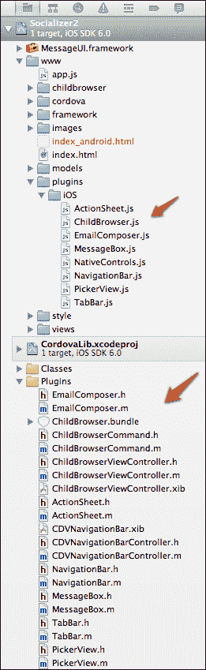
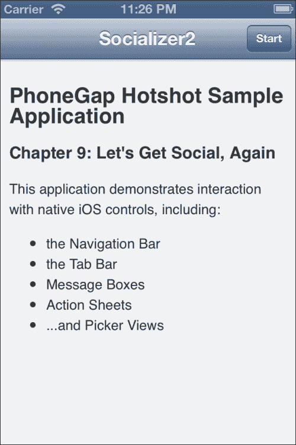
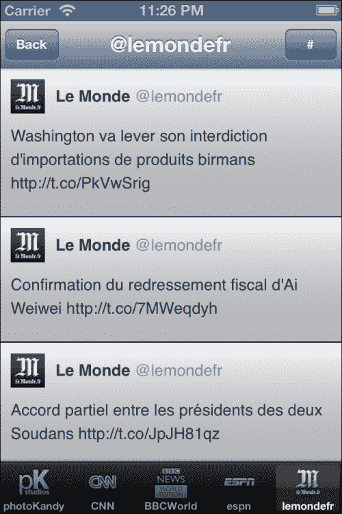
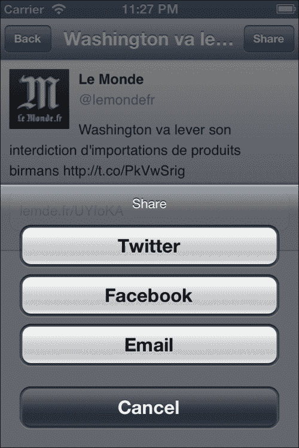
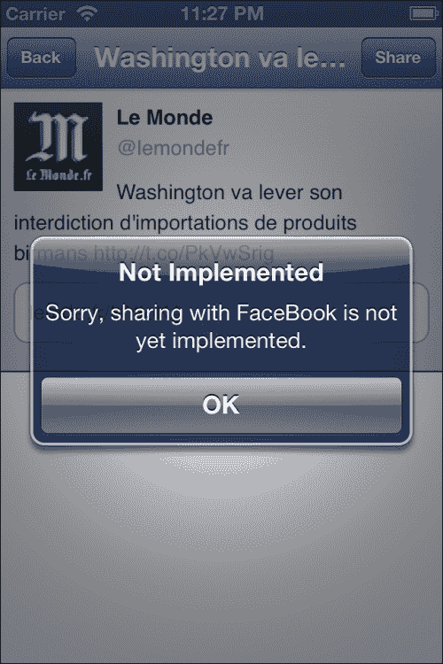
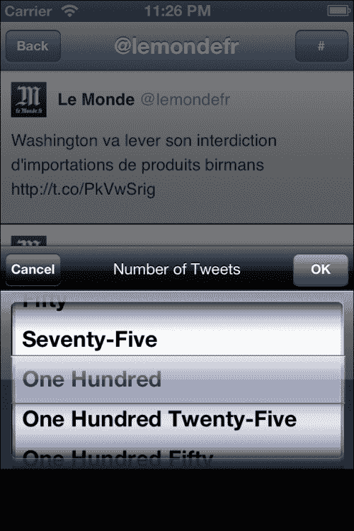
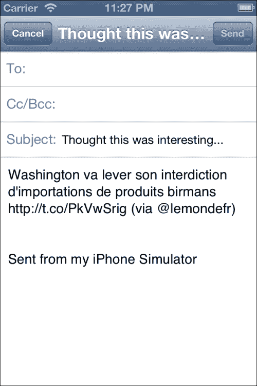

# 第九章。融入

CSS、HTML 和 JavaScript 可以让我们在构建感觉 99%原生的应用方面走得很远。也就是说，它几乎感觉原生，看起来几乎原生，行为上主要是原生。但如果你仔细观察，你可以看到那些告诉任何有丰富设备经验的用户，事情其实并不原生的小差异。为了帮助克服这一点，我们可以使用插件来*融入*我们的环境，这些插件使用真正的、纯正的原生组件。

# 我们将构建什么？

我们将重新审视项目 2 中的`Socializer`应用，*让我们社交吧！*它非常适合融入，我们可以在不担心太多改变应用本身的情况下轻松地添加我们的原生组件。当然，有一些小的变化，但总体来说，它的工作方式几乎相同，甚至在过程中增加了一些功能！

## 它有什么作用？

虽然我们将向应用添加一些功能，但此处的首要目标是使用原生组件。为此，我们将利用 PhoneGap 插件仓库中的几个优秀插件([`github.com/phonegap/phonegap-plugins/tree/master/iOS`](http://github.com/phonegap/phonegap-plugins/tree/master/iOS))。正如 URL 所暗示的，我们只为 iOS 做这件事。不幸的是，这个仓库中为 Android 提供的原生插件并不多。你可以四处搜索，这里那里找到一些（以及一些非常好的），但到目前为止，我们将专注于 iOS。

事实上，我们将使用相当多的原生组件：导航栏、标签栏、操作表、消息框、选择器和电子邮件编辑器。哦，别忘了 ChildBrowser！

## 为什么它很棒？

这个项目将使我们更好地理解与多个插件交互，我们也将更接近原生外观和感觉。

## 我们将如何做到这一点？

这里是我们将要遵循的步骤：

+   安装插件

+   添加导航栏

+   添加标签栏

+   添加操作表

+   添加消息框

+   添加选择器

+   添加电子邮件编辑器

## 我需要准备什么来开始？

确保你已经下载了此项目的代码，这样你就可以跟上了。

# 安装插件

我们已经处理过一些插件了，从 ChildBrowser 到我们自己的插件。但这次，我们将添加很多。要安装插件，请打开（或创建）你的 Xcode 项目。

## 开始行动

当你下载了 PhoneGap 插件仓库后，你应该能够提取它并导航到其中的`iOS`文件夹。按照项目 2 中*配置插件*部分所述，安装 ChildBrowser 插件，*让我们社交吧！*。一旦完成，你需要进入以下每个目录并安装每个插件：

+   `操作表`

    +   将`ActionSheet.h`和`ActionSheet.m`文件复制到 Xcode 的`Plugins`目录中。

    +   使用 Finder 将 `ActionSheet.js` 文件复制到 `www/plugins/iOS` 目录。

+   `EmailComposer`

    +   将 `EmailComposer.h` 和 `EmailComposer.m` 文件复制到 Xcode 的 `Plugins` 目录中。

    +   使用 Finder 将 `EmailComposer.js` 文件复制到 `www/plugins/iOS` 目录。

+   `MessageBox`

    +   将 `MessageBox.h` 和 `MessageBox.m` 文件复制到 Xcode 的 `Plugins` 目录中。

    +   使用 Finder 将 `MessageBox.js` 文件复制到 `www/plugins/iOS` 目录。

+   `NavigationBar`

    +   将 `CDVNavigationBar.xib`、`CDVNavigationBarController.h`、`CDVNavigationBarController.m`、`NavigationBar.h` 和 `NavigationBar.m` 文件复制到 Xcode 的 `Plugins` 目录中。

    +   使用 Finder 将 `NavigationBar.js` 文件复制到 `www/plugins/iOS` 目录。

+   `PickerView`

    +   将 `PickerView.h` 和 `PickerView.m` 文件复制到 Xcode 的 `Plugins` 目录中。

    +   使用 Finder 将 `PickerView.js` 文件复制到 `www/plugins/iOS` 目录。

+   `TabBar`

    +   将 `TabBar.h` 和 `TabBar.m` 文件复制到 Xcode 的 `Plugins` 目录中。

    +   使用 Finder 将 `TabBar.js` 文件复制到 `www/plugins/iOS` 目录。

完成后，你应该在 Xcode 中看到如下所示的内容：



接下来，导航到 `Resources` 目录中的 `Cordova.plist`，并在 `Plugins` 部分添加以下键值对：

+   `ActionSheet`, `String`, `ActionSheet`

+   `NavigationBar`, `String`, `NavigationBar`

+   `MessageBox`, `String`, `MessageBox`

+   `TabBar`, `String`, `TabBar`

+   `PickerView`, `String`, `PickerView`

+   `EmailComposer`, `String`, `EmailComposer`

结果应该看起来像以下截图：


接下来，将 `script` 标签添加到我们的 `index.html` 文件中：

```js
    <script type="application/javascript" charset="utf-8" src="img/ChildBrowser.js"></script>
    <script type="application/javascript" charset="utf-8" src="img/NavigationBar.js"></script>
    <script type="application/javascript" charset="utf-8" src="img/TabBar.js"></script>
    <script type="application/javascript" charset="utf-8" src="img/MessageBox.js"></script>
    <script type="application/javascript" charset="utf-8" src="img/ActionSheet.js"></script>
    <script type="application/javascript" charset="utf-8" src="img/PickerView.js"></script>
    <script type="application/javascript" charset="utf-8" src="img/EmailComposer.js"></script>
```

## 我们做了什么？

在本节中，你将我们项目将使用的所有插件添加到了 Xcode 中。

## 我还需要了解什么？

在编译过程中可能会遇到一些问题的几个文件——`ActionSheet.h` 和 `PickerView.h`。特别是，错误信息提到了无法找到 `CDVPlugin.h`。只需更改顶部的代码，直到它看起来像以下这样：

```js
//#ifdef CORDOVA_FRAMEWORK
#import <CORDOVA/CDVPlugin.h>
//#else
//#import "CDVPlugin.h"
//#endif
```

# 添加导航栏

我们已经非常熟悉导航栏的概念了。我们已经在我们的一些项目中使用它作为 HTML 视图的顶部导航栏了。然而，这次，我们将移除它，并用原生导航栏替换它。以下是它的样子：



## 准备中

这将需要对 `www/views` 目录中的三个视图——`startView.html`、`socialView.html` 和 `tweetView.html` 进行一些小的修改。请打开这些文件以便跟随，你可能还想打开 项目 2 的版本，*让我们社交!*，以便查看发生了什么变化。

## 继续前进

首先，我们的 HTML 视图将要发生变化，因为我们需要移除我们自己的导航栏。

对于 `startView.html`：

```js
<div class="viewBackground">
 <div class="content" style="padding:0; overflow: scroll; -webkit-overflow-scrolling: touch;" id="startView_scroller">
  <div class="content" id="startView_welcome">
  </div>
 </div>
</div>
```

对于 `socialView.html`：

```js
<div class="viewBackground">
  <div class="content" style="padding:0; overflow: scroll; -webkit-overflow-scrolling: touch;" id="socialView_scroller">
    <div id="socialView_contentArea" style="padding: 0; height: auto; position: relative;">
    </div>
  </div>
</div>
```

对于 `tweetView.html`：

```js
<div class="viewBackground">
  <div class="content " style="padding:0; overflow:scroll; -webkit-overflow-scrolling: touch;" id="tweetView_scroller">
    <div id="tweetView_contentArea" style="padding: 0; height: auto; position: relative;">
    </div>
  </div>
</div>
```

如果你将每个视图与 项目 2 进行比较，*让我们社交！* 每个视图中的导航栏和工具栏都已移除。我们还为每个视图添加了原生的 iOS 滚动 `-webkit-overflow-scrolling: touch`。

通过这样做，我们也移除了几个按钮：我们需要在导航栏中替换的按钮。但我们也需要移除对它们的旧引用，通常在每个视图的 `initializeView()` 方法中：

对于 `startView.html`：

```js
  startView.initializeView = function() {
    var theWelcomeContent = $geLocale("startView_welcome");
    $ge("startView_welcome").innerHTML = theWelcomeContent.innerHTML;
  }
```

对于 `socialView.html`：

```js
socialView.initializeView = function() {
  PKUTIL.include(["./models/twitterStreams.js", "./models/twitterStream.js"], function() {
    TWITTER.loadTwitterUsers(socialView.initializeToolbar);
  });
}
```

对于 `tweetView.html`：

```js
(the method is removed)
```

那么，如果我们不在 `intializeView()` 中初始化我们的按钮或导航栏，我们将在何时何地初始化它们？

首先，初始化部分实际上需要在 `app.js` 中发生。导航栏将跨越我们所有的视图，我们只能有一个。因此，我们需要在应用程序的非常开始处初始化它。所以，在 `app.js` 中的 `APP.init()` 方法（在 `PKUI.CORE.initializeApplication` 之后），我们添加以下代码片段：

```js
    window.addEventListener("resize", function() {
        plugins.navigationBar.resize();
    , false);
    plugins.navigationBar.init();
    plugins.navigationBar.create();
    plugins.navigationBar.hideLeftButton();
    plugins.navigationBar.hideRightButton();
    plugins.navigationBar.setTitle(__T("APP_TITLE"));
    plugins.navigationBar.show();
```

这将初始化并创建导航栏，隐藏其两个按钮，然后设置其标题。最后，我们在屏幕上显示它。

一旦我们这样做，我们就可以在我们的视图中做一些工作，以调整每个视图中的导航栏以满足我们的需求。

在 `startView.html` 中：

```js
  startView.viewDidAppear = function () {
    plugins.navigationBar.hideLeftButton();
    plugins.navigationBar.hideRightButton();
    plugins.navigationBar.setTitle(__T("APP_TITLE"));
    plugins.navigationBar.setupRightButton( __T("START"), null, startView.startApp);
    plugins.navigationBar.showRightButton();
  }
```

首先，我们隐藏按钮（以防万一有我们不想看到的可见按钮），然后将标题设置为应用程序的标题——`Socializer2`。然后，我们给右边的按钮一个标题为 `Start`，并将其链接到 `startApp()` 方法。最后，我们也显示了右边的按钮。

```js
  startView.viewWillHide = function ()
  {
    plugins.navigationBar.hideLeftButton();
    plugins.navigationBar.hideRightButton();
    plugins.navigationBar.setTitle("");
  }
```

当视图即将隐藏时，我们基本上会清除整个导航栏，这样按钮就不会在下一个视图中挂在那里。

在 `socialView.html` 中：

```js
socialView.viewDidAppear = function() {
  plugins.navigationBar.hideLeftButton();
  plugins.navigationBar.hideRightButton();
  plugins.navigationBar.setTitle(socialView.currentTitle);
  plugins.navigationBar.setupLeftButton( __T("BACK"), null, socialView.backButtonPressed);
  plugins.navigationBar.setupRightButton(__T("#"), null, socialView.changeReturnCount);
  plugins.navigationBar.showLeftButton();
  plugins.navigationBar.showRightButton();
…  
}
```

在这种情况下，我们将视图的标题设置为当前选定的 Twitter 账户，默认情况下将是第一个。我们在 `socialView` 中添加了 `currentTitle`，并在 `loadStreamFor()` 中设置它，以便我们可以跟踪它。

我们还在左侧添加了一个 `Back` 按钮，然后在右侧添加了一个 `#` 按钮。`Back` 按钮就像我们过去做的每一个返回按钮一样，所以它会带我们回到起始视图。`#` 按钮——这个按钮会很有趣，但我们稍后再说。

```js
socialView.viewWillHide = function() {
  plugins.navigationBar.hideLeftButton();
  plugins.navigationBar.hideRightButton();
  plugins.navigationBar.setTitle("");
…
}
```

再次，像好公民一样，我们清理自己的事情！

在 `tweetView.html` 中：

```js
tweetView.viewDidAppear = function ()
{
  plugins.navigationBar.hideLeftButton();
  plugins.navigationBar.hideRightButton();
  plugins.navigationBar.setupLeftButton( __T("BACK"), null, tweetView.backButtonPressed);
  plugins.navigationBar.showLeftButton();
  plugins.navigationBar.setupRightButton( __T("SHARE"), null, tweetView.share );
  plugins.navigationBar.showRightButton();
}
```

好吧，这有点不同。你注意到有什么缺失的吗？没错，我们没有设置标题。那是因为我们实际上会在 `loadTweet()` 中设置它：

```js
{ …
  plugins.navigationBar.setTitle(theTweet.text);
… }
```

因为我们在加载推文视图时立即加载推文，这会导致导航栏标题设置为推文文本。

但如果推文文本太长怎么办？实际上，它太长的可能性真的很大。原生导航栏会高兴地将其截断并在末尾添加一个“…”，所以我们永远不必担心它是否会实际溢出其边界。

当然，我们会清理我们的工作，但再次打印相同的代码是没有意义的。

## 我们做了什么？

在这个任务中，我们添加了导航栏并修改了其标题，并与导航栏上的按钮进行了交互。

## 我还需要了解什么？

iOS 原生导航栏可以完成许多酷炫的功能，但插件并没有暴露所有这些酷炫特性（例如更改色调颜色）。因此，目前我们只能得到一个看起来相当普通的导航栏——当然不是我们在项目 2 中使用的颜色，*让我们社交!*你可以通过使用一些原生 Objective-C 代码来解决这个问题，但插件本身并没有提供其他选项，只有黑色光泽导航栏。

很长一段时间以来，iOS 导航栏的限制是两个按钮——一个在左侧，一个在右侧。对于 iPhone 和 iPod Touch 来说，这仍然是一个相当好的主意。对于 iPad 来说，可以在不干扰任何文本的情况下在栏上添加相当多的按钮。然而，插件并没有暴露这个功能，所以我们只能有一个按钮在左侧，一个按钮在右侧。

通常左侧的按钮是**返回**按钮。这通常会给一个指向左边的箭头，但唯一的方法是创建一个图像并将其传递给插件。对我们来说，我们决定使用一个没有指向左边箭头的普通按钮。如果你想要它，插件确实有关于如何创建图像并将其添加到项目的说明。

# 添加标签栏

在社交视图和推文视图中，我们已经有了一个类似于 iOS 原生标签栏的东西——我们称之为工具栏。这是推文视图中的**分享**按钮所在的位置。不幸的是，没有原生的插件可以用于实际的工具栏，所以我们把**分享**按钮移到了导航栏上。

然而，在社交视图中，我们使用工具栏就像一个真正的标签栏——即切换视图内容的方法。我们有五个图标代表 Twitter 账户，按下任何一个都会加载该流中的最新帖子。这对于标签栏来说工作得很好。以下是它的样子：



## 准备工作

只有一个小问题。虽然我们能够在 HTML 标签栏中显示全彩、漂亮的头像，但 iOS 原生标签栏不支持这一点。实际上，它要求图像是遮罩。iOS 将根据这个遮罩创建标签栏上使用的非选中状态和选中状态的图像。本质上，所有*白色*（实际上，所有值不是透明的）都会画在标签栏上，而所有*透明*的则不会画在标签栏上。

这意味着我们不能使用我们从 Twitter 获得的图像。我们最终会得到五个矩形图标，与原始头像没有任何相似之处。因此，我们需要在 Photoshop 或你喜欢的编辑器中创建我们自己的版本。

对于标签栏，针对非视网膜显示屏的最佳尺寸是 30 x 30，而对于视网膜显示屏则是 60 x 60。然后，每个图像都保存为 `tab#.png` 和 `tab#@2x.png`。带有 `@2x` 的版本是为视网膜显示屏准备的。您可以在我们的代码下载中的 `www/images` 目录中看到每一个。我们所做的一切就是从 Twitter 上获取头像，将其颜色调整为白色，然后移除所有背景内容，使其透明。

## 继续前进

我们这次将在我们的社交视图中做大部分工作，因为它确实是唯一一个几乎能实现真实标签栏功能的视图。即便如此，我们还是需要在 `app.js` 中再次添加一些代码（与上一个任务相同的位置）：

```js
    window.addEventListener("resize", function() {
        plugins.navigationBar.resize();
        plugins.tabBar.resize(); }
    , false);

    plugins.navigationBar.init();
    plugins.tabBar.init();

    plugins.navigationBar.create();
    plugins.tabBar.create();

    plugins.navigationBar.hideLeftButton();
    plugins.navigationBar.hideRightButton();

    plugins.navigationBar.setTitle(__T("APP_TITLE"));

    plugins.navigationBar.show();
```

注意初始化和创建标签栏的两个命令。这里必须这样做，因为标签栏必须始终跟随导航栏的初始化和创建；否则，WebView（夹在中间）的大小将被错误设置。

现在，让我们转到我们的社交视图：

```js
socialView.initializeToolbar = function() {
  var users = TWITTER.users;

  if (users.error) {
    console.log(streams.error);
    alert("Rate limited. Please try again later.");
    return;
  }

  for (var i = 0; i < users.length; i++) {
    plugins.tabBar.createItem("tab" + i,users[i].getScreenName(),"/www/images/tab"+i+".png",
        {
        onSelect: function(tabName) {var i = tabName.substr(3,1);
          socialView.loadStreamFor('@' + users[i].getScreenName());
        }
    });

  }
}
```

首先，我们为每个 Twitter 账户创建一个标签栏项。我们给它命名为 `tab#`——所以是 `tab0`、`tab1` 等等。我们将 Twitter 账户名称作为标签栏的文本，然后我们使用之前创建的图像作为每个标签栏的图标，而不是使用 Twitter 提供的头像。请注意，我们从未指定 `@2x`；iOS 在视网膜显示屏上会自动使用它。（神奇！也值得注意，当编写原生代码时，这种情况也会发生；很少需要担心程序化地追加 `@2x`。）

我们还为每个标签项添加了一个 `onSelect` 处理器。我们将取标签项名称的最后一个字符，它将是一个从 `0` 到 `4` 的数字，然后加载该索引的流。这意味着点击第一个标签栏（命名为 `tab0`）将加载第一个 Twitter 账户的流。

```js
…
socialView.viewDidAppear = function() {
  plugins.navigationBar.hideLeftButton();
  plugins.navigationBar.hideRightButton();
  plugins.navigationBar.setTitle(socialView.currentTitle);
 plugins.navigationBar.setupLeftButton( __T("BACK"), null, socialView.backButtonPressed);
  plugins.navigationBar.setupRightButton(__T("#"), null, socialView.changeReturnCount);
  plugins.navigationBar.showLeftButton();
  plugins.navigationBar.showRightButton();

  plugins.tabBar.show();
  plugins.tabBar.showItems("tab0","tab1","tab2","tab3","tab4");
…
}
```

现在我们已经添加了显示标签栏的代码。我们还添加了显示每个标签栏项的代码。由于我们知道我们始终会有五个项，所以我们现在只是硬编码这些值，但同样也可以创建很多标签栏项，一次只显示几个。

```js
socialView.viewWillHide = function() {
  plugins.navigationBar.hideLeftButton();
  plugins.navigationBar.hideRightButton();
  plugins.navigationBar.setTitle("");
  plugins.tabBar.hide();
…
}
```

最后，我们在完成任务后清理，并在视图隐藏时隐藏标签栏。这确保了标签栏在任何其他视图中都不会可见。

## 我们做了什么？

在这个任务中，我们创建了标签栏，并将其分配给标签栏项。我们还为每个标签栏项分配了回调函数。

## 我还需要了解什么？

苹果在标签栏的工作方式上非常严格。一方面，在 iPad 之外的所有设备上，它不应有超过五个图标。（原因很明显：空间有限！）

那么，如果你需要超过五个标签页怎么办？可接受的方法是显示四个图标，添加一个*更多*图标（由三个点组成的图像），然后当用户点击该标签页时，以表格列表的形式显示剩余的标签页。你可以在 iPhone 和 iPod Touch 上的*音乐*应用中看到这种行为，如果我们编写的是原生代码，我们几乎可以免费获得这种行为。

但我们不是编写原生代码，因此我们必须手动完成。这意味着，如果你想要超过五个标签页，你需要手动创建*更多*标签页，并自行在列表中显示剩余的标签页。还有一个问题：在 iPad 上，你应该显示所有标签页——在 iPhone 和 iPod Touch 上显示*更多*按钮是有效的。

最后，苹果强烈建议在 iPad 上不要使用超过七个标签页，但这并不是强制执行的。

# 添加动作表

动作表是向用户展示有限选择的好方法，到目前为止，我们一直是通过使用带有多个按钮的弹出消息框来做到这一点的。对于这个项目，当用户在推文视图中点击**分享**按钮时，我们将显示一个动作表。它看起来会是这样：



## 继续进行

在`TweetView.html`中：

```js
tweetView.share = function() {
  var actionSheet = window.plugins.actionSheet;
  actionSheet.create(__T('Share'), ['Twitter', 'Facebook', __T('Email'), __T('Cancel')],
  function(buttonValue, buttonIndex) {
    if (buttonIndex==0)
    {
      PKUTIL.showURL("https://twitter.com/intent/tweet?text=" + encodeURIComponent(tweetView.theTweet.text) + "%20(via%20" + encodeURIComponent("@" + (tweetView.theTweet.from_user || tweetView.theTweet.user.screen_name)) + ")");
    }
  }, {cancelButtonIndex: 3});
```

首先，我们使用`actionSheet.create()`创建动作表。我们给表格一个标题（`分享`），然后指定可以出现的按钮（`Twitter`、`Facebook`、`Email`和`取消`）。然后我们指定动作表的处理程序，如果用户点击**Twitter**按钮，它将分享推文到 Twitter。对于其他按钮，目前它不会做任何事情。最后，我们指出**取消**按钮是最后一个按钮。这样 iOS 就会知道将**取消**按钮染成不同的颜色，使其明显不同。（记住索引是从零开始的。）

当我们的回调被调用时，我们得到两个值：`buttonIndex`和`buttonValue`。虽然`buttonValue`可能很有用，但很可能是任何东西，尤其是当我们考虑到本地化时。因此，最好使用`buttonIndex`。第一个按钮将是`buttonIndex` `零`，以此类推。

## 我们做了什么？

在这个任务中，当用户点击特定推文的**分享**按钮时，我们添加了一个动作表。

## 我还需要了解什么？

动作表是一个非常酷的东西，在 iPhone 或 iPod Touch 上工作得非常好。在 iPad 上，它将以弹出窗口的形式出现在屏幕中央，这不是最好的用户界面，但我们能处理。你可以使用原生方法来正确定位它并添加一个箭头，但苹果似乎也对使用居中动作表的应用程序不太关心，所以我们现在不考虑这个问题。

我们还需要知道的是，保持项目数量少是一个好主意，否则列表会变得非常长。虽然 ActionSheet 应该在发生这种情况时将这些内容压缩成可滚动的列表视图，但关于何时发生的情况存在一些错误。这意味着你可能会得到一个非常长的列表，其中一些按钮被截断或完全缺失。（这通常在 iPad 上最明显。）

长话短说，保持项目数量在一个合理的范围内。在小设备上，五项或更少可能是一个好主意，而在 iPad 上，十项或更少可能更合适。

# 添加消息框

到目前为止，我们自己的消息框做得相当不错。它并不完全像 iOS 原生消息框，但已经很接近了。然而，在这种情况下，我们想要做到极致。

## 开始行动

与消息框插件一起工作非常简单。让我们回到我们的 Tweet View 中的`share()`方法：

```js
tweetView.share = function() {
  var actionSheet = window.plugins.actionSheet;
  actionSheet.create('Share', ['Twitter', 'Facebook', 'Email', 'Cancel'],
  function(buttonValue, buttonIndex) {
    if (buttonIndex==0)
    {
      PKUTIL.showURL("https://twitter.com/intent/tweet?text=" + encodeURIComponent(tweetView.theTweet.text) + "%20(via%20" + encodeURIComponent("@" + (tweetView.theTweet.from_user || tweetView.theTweet.user.screen_name)) + ")");
    }
 if (buttonIndex==1)
 {
 var messageBox = window.plugins.messageBox;
 messageBox.alert('Not Implemented', 'Sorry, sharing with FaceBook is not yet implemented.',
 function(button) {
 console.log('button ' + button + ' pressed');
 });
 }
  }, {cancelButtonIndex: 3});
```

我已经突出显示了显示原生消息框的代码。在这种情况下，我们用它来显示我们的 ActionSheet 上的第二个按钮：`FaceBook`。由于我们还没有实现它，我们向用户显示一个友好的通知。它看起来是这样的：



就像 ActionSheet 和标签栏一样，我们可以响应（如果我们愿意）任何被按下的按钮。在这种情况下，我们只是将其记录到控制台，但可以使用确认消息框来根据按下的按钮执行不同的操作。

## 我们做了什么？

我们显示了一个原生消息框，并在按钮被按下时处理回调。

## 我还需要知道什么？

*永远不要在真实的应用程序中这样做*。我的意思不是永远不要使用消息框；不，我的意思是永远不要一开始就告诉用户一个功能尚未实现。实际上，永远不要向他们展示该功能原本打算实现但并未实现。用户对此并不太欣赏，而且如果苹果发现这种情况，肯定会拒绝该应用。

消息框插件描述了其他用途，包括确认框、输入框和密码输入框。阅读插件的 readme 以获取有关如何使用这些附加功能的更多信息。

# 添加选择器

选择器在 iOS 中到处都是，我们自己的框架中还没有一个好的类似物。这些东西看起来如下截图所示：



它们擅长同时显示多个选择并让用户选择一个。它们经常用于选择日历日期、时间，甚至只是从大量数字中选择一个特定的数字。它们之所以适合这样做，是因为它们允许用户快速滚动到大量范围。

在我们的例子中，我们只是提供了一些选项，但这里可以有二百个项目而不会真正损失功能（但实际上，在我们的情况下，用户不需要那么多）。

## 开始行动

我们将暂时回到社交视图，并回顾我们说过要回过头来的事情。还记得那个**#**按钮吗？是的，现在是我们处理它的时候了。

实际上，我们将给用户选择一次加载多少条推文的选项。酷吧？这可以通过 ActionSheet 来实现，但项目数量可能太多，不太适合，所以我们选择使用选择器。

```js
socialView.numberOfTweets = 100;
…
socialView.loadStreamFor = function(searchPhrase) {
…
  var aStream = new TWITTER.TwitterStream(searchPhrase, function(theStream) {
…
  }, socialView.numberOfTweets);
}
```

首先，我们在视图中添加了一个新属性：要加载的推文数量；并将其默认设置为`100`。然后我们修改了`loadStreamFor()`，使其使用这个值而不是项目 2 中的硬编码值 *Let's Get Social!*。

```js
socialView.changeReturnCount = function ()
{
  var pickerView = window.plugins.pickerView;
  var slots = [
    {name: 'count', value: socialView.numberOfTweets, data: [
        {value: 25, text: __T('Twenty-Five')},
        {value: 50, text: __T('Fifty')},
        {value: 75, text: __T('Seventy-Five')},
        {value:100, text: __T('One Hundred')},
        {value:125, text: __T('One Hundred Twenty-Five')},
        {value:150, text: __T('One Hundred Fifty')},
        {value:175, text: __T('One Hundred Seventy-Five')},
        {value:200, text: __T('Two Hundred')}
      ]}
  ];
```

接下来，我们创建我们想在选择器中显示的值。*名称*不会在任何地方显示；它只是在用户告诉我们他们选择了什么时使用。第一个*值*是当前选中的值。这意味着选择器将向用户显示当前选中的项。其余的项定义了每个项的值和显示文本。因此，用户将看到`Twenty-Five`，但我们会得到`25`。

```js
  pickerView.create(__T('Number of Tweets'), slots, function(selectedValues, buttonIndex) {
    if (buttonIndex == 1)
    {
      socialView.numberOfTweets = selectedValues["count"];
      socialView.loadStreamFor(socialView.currentTitle);
    }
  },  {style: 'black-opaque', doneButtonLabel: __T('OK'), cancelButtonLabel: __T('Cancel')});
}
```

接下来，我们实际上创建选择器。我们给它命名为`Number of Tweets`，这样用户就知道他们在设置什么。我们传入要显示的值（插槽），然后传入一个回调处理程序。这个处理程序将值设置为选中的值，并重新加载 Twitter 流，但只有当用户点击**OK**时。最后，我们设置样式（黑色），并传入两个按钮的名称。

选择器不仅限于单值列表。你可以创建多列，这在设置日期时很有用。例如，你可以有一个年份列、月份列和日期列。有关如何操作的更多信息，请参阅插件的 readme 文件。

## 我们做了什么？

我们创建了一个选择器，填充了数据，并响应用户选择特定结果。

# 添加电子邮件编辑器

通过电子邮件分享几乎内置在每一个应用中，但实际上不使用插件很难实现。由于这个应用旨在轻松分享，让我们添加通过电子邮件分享的功能。

## 继续前进

在我们的推文视图中，我们有以下内容：

```js
tweetView.share = function() {
  var actionSheet = window.plugins.actionSheet;
  actionSheet.create('Share', ['Twitter', 'Facebook', 'Email', 'Cancel'],
  function(buttonValue, buttonIndex) {
    if (buttonIndex==0)
    {
      PKUTIL.showURL("https://twitter.com/intent/tweet?text=" + encodeURIComponent(tweetView.theTweet.text) + "%20(via%20" + encodeURIComponent("@" + (tweetView.theTweet.from_user || tweetView.theTweet.user.screen_name)) + ")");
    }
    if (buttonIndex==1)
    {
      var messageBox = window.plugins.messageBox;
      messageBox.alert('Not Implemented', 'Sorry, sharing with FaceBook is not yet implemented.',
        function(button) {
          console.log('button ' + button + ' pressed');
        });
    }
 if (buttonIndex==2)
 {
 cordova.exec(null, null, "EmailComposer", "showEmailComposer",
 [{"body": tweetView.theTweet.text + " (via @" + (tweetView.theTweet.from_user || tweetView.theTweet.user.screen_name) + ")",
 "subject": "Thought this was interesting..." }]);
 }
  }, {cancelButtonIndex: 3});

}
```

再次，我们处于`share()`方法中，我已经突出显示了更改的代码。这里我们响应**电子邮件**按钮，它是索引`2`。我们使用`cordova.exec()`调用插件，给它插件名称和我们想要使用的方法（`showEmailComposer`）。然后我们向插件传递正文和主题。正文将是推文，以及它是谁发的，主题将是"*这个很有趣…"*。我们可以传递更多信息，例如消息应该发送给谁，但在我们的情况下，我们不知道这些信息，所以没有将其发送到插件。

一旦完成，我们就完全放手，尽管有可能确定用户是否实际上通过电子邮件分享了。在我们的情况下，我们并不关心他们是否这样做，只是我们提供了这样的选项。

这就是它的样子：



## 我们做了什么？

在这个任务中，我们创建了一个电子邮件编辑器，主题和正文设置为指定的数据。

# 游戏结束..... 结束

我们已经取得了一些成就——总共使用了七个插件，我们的应用看起来和感觉现在相当原生。它还不是完美的；例如，在原生应用中导航栏有一个酷炫的动画，而在我们的应用中，在视图变化时它会*变空白*，但除此之外，其他方面看起来和感觉都相当接近用户所期望的。

# 你能承受 HEAT 吗？热手挑战

当然，总有可以添加和改变的地方。你为什么不尝试以下几个挑战：

+   将 Facebook 分享功能添加到应用中。

+   存储要加载的推文数量，以便它成为一个持久的设置。

+   改变在每次视图结束时清除导航栏的方式；尝试达到更*原生*的感觉。要真正达到原生感觉，你可能需要深入研究原生代码。

+   想要一个真正复杂的挑战？从 Twitter 下载头像，然后找出如何程序化地遮罩它们。然后保存到用户的临时存储中，并用作标签栏上的图标。
