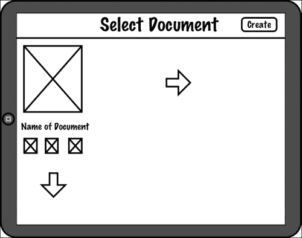

# 第十章。扩展

到目前为止，我们真正覆盖的只是如何为小设备如手机创建应用程序。但还有很多其他非手机形状的移动设备，即平板电脑（以及所谓的“大屏手机”，通常为 7 英寸而不是 10 英寸）。尽管拥有平板电脑的用户不如手机用户多，但这仍然是一个极其重要的市场。

有时，在更大的设备上简单地显示相同用户界面是可能的。这在游戏中很常见，图形和控制区域通常只是按设备屏幕大小进行缩放。有时，可以大量使用相同的用户界面，但需要对它进行一些小的调整，以便在更大的屏幕上良好运行。还有其他时候，别无选择；用户界面必须完全重新设计以适应更大的屏幕。

# 我们要构建什么？

在这个项目中，我们将回顾我们在项目 3 中创建的应用程序。该应用程序并不特别复杂，但它足够灵活，可以支持各种扩展方式，这正是我们将要做的。我们将创建几个不同的 Filer 版本，每个版本都有不同的扩展到平板电脑屏幕大小的概念。

## 它能做什么？

当一个人只针对小屏幕开发时，开发大屏幕的一个主要问题是“如何处理所有这些空间？”当一个人被限制在开发 320 x 80 或 600 x 800 的维度时，突然意识到自己有更多的像素要填充可能会感到震惊。通常，这些更大的显示器尺寸为 1024 x 768、1280 x 768、1280 x 800 或更高。实际上，iPad 3 的显示屏在技术上为 2048 x 1536，当你这么想的时候，这相当令人惊讶。幸运的是，iPad 3 将其缩放回 1024 x 768 为我们。

在这个项目中，我们将重新思考 Filer 的用户界面，以适应更大的显示区域。我们不会过多关注实际的功能性——我们已经在项目 3 中完成了这项工作，*提高生产力*，但我们将处理如何处理更大的屏幕。

我们将关注两种典型场景：**放大**，其中我们只是将界面放大以适应新的屏幕大小，以及**分割视图**（也称为**主详情**），其中我们将向界面添加侧边栏（例如，在 iPad 上你经常会看到，例如**设置**应用程序）。

## 它为什么这么好？

有时，应用程序只是需要更多的空间——记事应用程序也不例外。更大的屏幕意味着更大的屏幕键盘，更大的屏幕意味着有更多空间用于重要内容——例如文本。在其他时候，我们可以通过使用分割视图布局来将应用程序过渡到更大的屏幕，这些布局允许我们有效地简化应用程序的层次结构。我们将通过 Filer 的三个版本来探索所有这些选项。

## 我们将如何做到这一点？

我们将按以下方式处理这三个设计：

+   设计扩展的用户界面

+   实现扩展的用户界面

+   设计分割视图用户界面

+   实现分割视图用户界面

## 我需要准备些什么才能开始？

对于这个特定的任务，我们将使用这个项目的文件，所以如果你想跟上，请下载它们。有两个名为`1`和`2`的目录，这是本项目中的应用版本。第一个是我们接下来要关注的，而第二个是我们稍后要工作的。

# 设计扩展的用户界面

许多应用可以简单地“扩展”以适应更大的屏幕，幸运的是，我们的框架为我们做了很多“扩展”的工作。虽然这对游戏来说效果很好，但我们确实需要做更多的工作来使 Filer 更好地适应大屏幕。

## 开始行动

如果你还记得项目 3 中的 Filer 应用，那么在“提高生产力”中，有三个视图：一个**起始视图**、一个**文档视图**和一个**文档视图**。我们将放弃第一个视图——无论如何，在大屏幕上也没有什么可以做的来使其工作。相反，我们将专注于最后两个视图——坦白说，在这个任务中，我们主要将对第一个视图进行大量更改。

让我们看看项目 3 中“提高生产力”的 Filer 应用的文档视图截图：


对于我们的平板电脑尺寸的应用，我们将水平垂直地显示这个文档列表，而不仅仅是水平显示。在 iPad 上，纵向时大约显示三个图标，横向时显示四个图标。这意味着我们的原型看起来是这样的：



在这个项目的目的下，我们将保留导航栏上的**创建**按钮，但在项目结束时，我们将将其转变为文档列表中的一个更大功能。例如，一些应用可能有一个带有“+”图标的空白文档图像来表示创建新文档。其他应用可能使用虚线矩形来表示相同的意思。对于更大的显示，这样的设计无疑是合适的；而在小屏幕上，这会被视为空间的浪费。

除了对文档列表进行这个更改外，我们还将对这个应用进行其他一些更改。由于我们的框架设计为填充屏幕，其余部分在大屏幕上将按原样工作。

## 我们做了什么？

在这个任务中，我们回顾了项目 3 中的应用“提高生产力”，并为更大屏幕的用户界面创建了一个新的原型。

## 我还需要了解什么？

扩展 iPhone 应用相对简单，*只要*你已经为未来的扩展做好了规划。也就是说，如果你已经将所有事情规划到像素级别，并为 320 x 480 的屏幕构建了应用，那么你将不得不在更大的屏幕上更改所有这些像素。当处理像 Filer 这样的简单生产力应用时，构建可以扩展到更大屏幕的布局并不特别困难，但一旦涉及到更复杂的布局和图形，这就会变成一个挑战。

在某些方面，高度图形化的游戏既是最难也是最简单的。当扩展到新屏幕时，游戏可能保持相同的用户界面——可能只是对按钮位置或大小进行一些小的调整。然而，图形在视觉上将是相同的。然而，在底层，这些图形可能在不同的分辨率下渲染。某个图形可能在小型屏幕上运行良好，但放大到更大的屏幕上，它可能会显得太大或太小。为了避免强制浏览器缩放*所有*内容（这总是会减慢速度并导致一些模糊），最好是针对目标屏幕重新渲染图形，因为你永远不知道未来会有什么样的屏幕。因此，始终以矢量格式创建你的图形会更好——这样你就可以在需要新尺寸时始终创建新的版本。

其中最难妥善处理的是全屏图像。这些可能是游戏背景、菜单背景、启动画面等等，你希望它们看起来尽可能好。在我们的示例游戏(项目 8, *玩转*)中，我们没有过多关注这一点，但如果你有一个与我设备屏幕宽高比差异很大的设备，你可能会注意到当全屏资源显示时出现了一些黑边。这是不进行大量工作的方法之一——另一种方法是缩放并裁剪图像，可能会稍微模糊一些，并丢失图像的部分。唯一其他现实的选择是为每个支持的分辨率创建一个特定的图像。

为了最佳的视觉效果，你应该始终以设备的原生分辨率渲染你的图片。对于一个 Retina iPad，全屏图片的分辨率将是 2048 x 1536。当然，对于几乎每一款 Android 设备来说，这都不同，而且处理起来并没有特别简单的方法。你可以根据屏幕大小通过 JavaScript 替换图形，或者你可以使用媒体查询来针对特定的图形元素。你应该注意，尽管我们使用的框架确实在手机尺寸设备、平板尺寸设备以及非 Retina 和 Retina 显示之间做出了区分，但它对 Android 上所有不同的分辨率并没有做什么。你最好的选择是使用 CSS 媒体查询（更多信息，请参阅[`developer.mozilla.org/en-US/docs/CSS/Media_queries`](https://developer.mozilla.org/en-US/docs/CSS/Media_queries))。

在其他方面，非游戏应用在扩展时可能会非常痛苦。你可能正在处理大量格式化得相当复杂的内 容。在某个屏幕尺寸下看起来很棒，但在另一个屏幕上，东西可能会在奇怪的地方破裂，尤其是在仅仅缩放它的时候。有时我们使用 HTML 和 CSS 工作的事实会拯救我们——它旨在处理复杂的布局，但同样多的时间，它会导致外观和感觉以一种你没有预想到的方式出错。

这时，可能需要为平板尺寸屏幕创建特定的代码和布局。你可以在你的 JavaScript、HTML 和 CSS 代码中处理这些尺寸——你可以在 HTML 中放置一个带有`tablet`类的`DIV`标签，并有一个 CSS 规则在除了平板电脑之外隐藏它。同样，如果你试图创建一个可以在手机尺寸屏幕和平板尺寸屏幕上运行的全能应用，你可以隐藏手机 UI 元素。或者，如果你正在使用 JavaScript 定位某些东西，你总是可以查看你正在运行的设备类型，以获得关于要做什么的好主意——最坏的情况是查看屏幕的宽度和高度。再次强调，使用媒体查询在处理多个分辨率时通常很有帮助。

# 实现放大后的用户界面

现在我们已经为 Filer HD mark I 设计了用户界面，是时候实现它了。我们对代码所做的更改数量惊人地少，所以准备好保持警觉——眨眼之间，你可能会错过它！

## 准备工作

虽然我们主要关注 iOS 平台上的这个应用，但这些概念同样适用于任何基于平台的平板电脑。话虽如此，为了渲染针对 iPad 的 iOS 应用，需要在项目本身中设置一些设置，而不仅仅是代码之外：

在 Xcode 的项目设置中，将**设备**设置从**通用**更改为**iPad**。

你应该看到如下所示的项目设置：


除了这个更改（以及为 iOS 项目在`Cordova.plist`中设置我们的典型设置）之外，我们将从项目 3，*提高生产力*中复制文件。如果你想跟上来，请导航到本项目代码文件中的`/1/www`。

## 继续前进

实际上，我们为了使应用适应更大的屏幕所需要做的非常少。正如我们之前所说的，我们的框架确实做了很多工作——它总是试图确保内容填满屏幕，我们视图中的 HTML 也有帮助——尽可能，我们想使用百分比而不是像素。（这并不是说使用像素不好；例如，我们在处理导航栏上的按钮位置时，会大量使用它们。）

就此提醒一下，这是文档视图的 HTML：

```js
<div class="viewBackground">
 <div class="navigationBar">
  <div id="documentsView_title"></div>
  <button class="barButton" id="documentsView_createButton" style="right:10px" ></button>
 </div>
 <div class="content avoidNavigationBar " style="padding:0; overflow: scroll;" id="documentsView_scroller">
   <div id="documentsView_contentArea" style="padding: 0; height: auto; position: relative;">
   </div>
 </div>
</div>

<div id="documentsView_documentTemplate" class="hidden">
 <div class="documentContainer">
  <div class="documentImage">
   
  </div>
  <div class="documentTitle" onclick="documentsView.renameDocument(%INDEX%)">
   <span >%TITLE%</span>
  </div>
  <div class="documentActions">
   
   
   
  </div>
 </div>
</div>
```

这里实际上没有什么需要更改的。接下来，这是我们的部分样式：

```js
.documentContainer
{
    width: 240px;
    height: auto;
    padding: 40px;
    padding-left: 20px;
    padding-right: 0px;
    display: inline-block;
    text-align: center;
}
.documentContainer .documentImage img
{
    width: 190px;
    height: 242px;
}

.landscape .documentContainer
{
    padding: 10px;
}

.landscape .documentContainer .documentImage img
{
    width: 125px;
    height: 160px;
}
```

到目前为止，对于 iPad 设备没有变化。我们移除了将此转换为 Android 设备的列表的代码，因此所有平板设备都将获得漂亮的大文档图标。

我们进行了一些更改的地方实际上是在实际代码中，所以让我们看看那里：

```js
  documentsView.documentIterator = function ( o )
    {
        var theHTML = "";
        var theNumberOfDocuments = 0;
        for (var i=0; i<o.getDocumentCount(); i++)
        {
            var theDocumentEntry = o.getDocumentAtIndex ( i );

            theHTML += PKUTIL.instanceOfTemplate ( $ge("documentsView_documentTemplate"),
                                                   { "title": theDocumentEntry.name.substr(0, theDocumentEntry.name.length-4),
                                                     "index": i
                                                   }
                                                 );
            theNumberOfDocuments++;
        }
// code deleted
        $ge("documentsView_contentArea").innerHTML = theHTML;
    }
```

看到关于已删除代码的注释了吗？

没错——我们*删除*了一些东西！如果你记得，在 iPhone 上，我们希望文档列表可以*水平滚动*，所以有一些代码设置了文档列表容器的宽度为*项目数量乘以宽度*。这将使`DIV`变大，因此允许内容水平滚动。对于这个应用，我们希望宽度为单屏宽度，然后我们希望浏览器*换行*我们的文档，就像页面上的一行字。所以屏幕右侧的下一个文档实际上是在最左侧文档下方开始的新一行。

猜猜看——那就是*全部*。我们的按钮不需要改变位置，我们文档视图中的文本编辑器已经编码为填满整个屏幕，所以我们那里不需要做任何事情。唯一我们需要移除的是专门为手机尺寸设备编写的代码。


那现在看起来是什么样子？


## 我们做了什么？

在这个任务中，我们将一个手机应用转换成了平板应用。

## 我还需要了解什么？

我们通过实际上删除限制应用程序为手机版本的代码来实现这一点，但并非所有应用程序都可以如此简单地进行扩展。有时你可能需要重新定位按钮、内容和各种元素以更好地适应更大的屏幕。如果你想使应用程序保持通用性（即，它将在手机尺寸的设备和平板尺寸的设备上运行），你的工作将变得更加困难，因为你必须保留两种布局。幸运的是，CSS、HTML 和 JavaScript 来拯救我们，通过让我们使用 CSS 针对特定的类和 ID 或媒体查询，以及编写针对特定布局的 JavaScript 代码来帮助我们。在我们的情况下，我们可以通过检查设备的尺寸来保留手机尺寸的特定代码——框架愉快地处理了其余的尺寸问题。

有时你可以通过框架处理不同视口尺寸的方式应付过去，但往往会有时候这种方法不起作用——UI 在大型屏幕上可能太稀疏，在小型屏幕上可能太拥挤。如果发生这种情况，最好是针对每个设备尺寸专门构建你的 UI，而不是依赖框架来正确处理事情——因为有时候它并不正确。

# 设计分割视图用户界面

分割视图布局是将应用程序扩展到平板电脑的最受欢迎的方法之一。它还有附带的好处，即简化应用程序的信息层次结构，这仅仅是技术上的说法，意味着在应用程序中到达某个地方所需的“点击”次数更少。

大多数平板电脑平台以类似的方式实现这种视图——在横屏模式下它始终位于左侧（但有时位于右侧），而在竖屏模式下通常隐藏在屏幕之外，准备并等待用户点击按钮将其调出。有时在竖屏模式下视图始终可见，但这取决于应用程序的类型以及屏幕空间损失是否值得始终显示分割视图。

## 继续前进

分割视图实际上只是将两个视图组合在一起。这样思考起来很简单——一个视图位于左侧的较小侧边栏中，而第二个视图位于右侧。左侧视图在技术上被称为**主视图**，而右侧视图被称为**详细视图**。在技术上，这种模式被称为**主-详细**模式，当与数据记录一起工作时最为明显，记录选择发生在主视图（左侧），而记录的详细信息显示在详细视图中（右侧）。

在我们的应用程序中，我们将使文档列表成为主视图，以便文档本身可以成为用户的焦点。这意味着一个特定的文档将成为详细内容。然而，在这种安排中，我们需要从上一个版本应用程序中文档的精美网格列表切换回简单的列表。

现在看看我们的设计是什么样的：


在这个草图里唯一不太“真实”的是顶部的**创建**按钮。实际上，旁边还将有一个标题，只是由于原型设计中的空间不足，无法将其放置在那里。所以它看起来不会像上一个截图那样显得突兀。

不明显的是，当设备旋转到纵向模式时会发生什么。侧边栏实际上会消失——只留下文本文档可见。我们将在左侧有一个名为**文档**的按钮，点击它将恢复侧边栏，一旦侧边栏显示，将有一个**关闭**按钮可以关闭它。在项目末尾的挑战中，你将被要求实现手势来打开和关闭侧边栏。

## 我们做了什么？

在这个任务中，我们为分割视图布局设计了用户界面。

## 我还需要了解什么？

这实际上取决于你的应用，当应用处于纵向模式时，主视图是否需要消失。有些应用可以容忍屏幕宽度的损失，而有些应用则不能。当处理内容（如图形、文本等）时，在纵向模式下移除它可能是个好主意。如果你处理的是设置、属性或类似的内容，那么你可以保留它，对可用性的影响很小。

# 实现分割视图 UI

现在，我们需要实现使我们的应用成为分割视图应用所需的更改。从这一点开始，如果你想跟上，我们将工作在`/2/www`。我们从上一个任务中的代码开始，然后修改它以适应新的用户界面。

## 继续前进

与上次不同，我们将进行几次修改。请注意，这并不是很多代码，但我们将触及几个不同的文件，并对它们进行微调以支持更改。文档视图只进行了一些小的修改，尽管我们将显示从网格改为列表，文件视图则进行了几个修改。首先，它必须处理没有加载文档的情况（这将在应用开始时发生）。其次，它必须改变处理自动保存内容的方式（因为不再有视图的关闭操作）。

但首先，我们需要设置布局以显示两个视图并排。我们将从`index.html`开始：

```js
  <body>
    <div class="container" id="rootContainer">
      <div class="container leftSplit" id="leftSplitContainer">
      </div>
      <div class="container rightSplit" id="rightSplitContainer">
      </div>
    </div>
  </body>
```

注意我们已经向`rootContainer`元素添加了两个元素。第一个是`leftSplitContainer`，第二个是`rightSplitContainer`。这些元素的定位应该从它们的`ID`值中明显看出。

仅此还不够，我们还需要适当地对这些内容进行样式设计——为此，我们在框架的基本 CSS 中做了一些更改。查看`2/www/framework/base.css`：

```js
.landscape .container.leftSplit {
  width:319px;
}

.landscape .container.rightSplit {
  left:320px;
}
.portrait .container.leftSplit
{
  display: none;
  width: 319px;
  z-index:2;
  box-shadow: rgb(0, 0, 0) 0px 0px 8px;
}

.portrait .container.rightSplit
{
  left:0;
}
```

我们所做的是表明，当设备处于横屏方向时，两个分割应该并排显示。左侧将宽 319 像素，右侧视图将从像素 320 开始。屏幕上剩余的部分将决定右侧视图的宽度。*这个侧边栏的大小并不是一成不变的*——如果你的应用需要更小的侧边栏，可以适当减小尺寸——同样，如果需要更大的，可以设置得更大。然而，最好不要超过屏幕宽度的一半。如果你觉得有必要，现在是时候决定你的视图是否在正确的位置了。

在竖屏模式下，我们*隐藏*侧边栏。尽管如此，当用户想要时，这个侧边栏可以再次出现，所以我们还确保它被索引在其他所有内容之上。我们还给它添加了一个阴影，以便用户在侧边栏和下面的内容之间有一个视觉上的区分。

然而，仅仅改变样式是不够的。让我们看看我们在`app.js`中做了什么改变：

```js
 // load our document view
  PKUTIL.loadHTML ( "./views/documentsView.html",
                    { id : "documentsView",
                      className: "container", 
attachTo: $ge("leftSplitContainer"), 
                      aSync: true
                    },
                    function (success)
                    {
                      if (success)
                      {
                        documentsView.initializeView();
                        PKUI.CORE.showView ( documentsView );
                      }
                    });
  // load our fileView
  PKUTIL.loadHTML ( "./views/fileView.html",
                    { id : "fileView",
                      className: "container", 
                      attachTo: $ge("rightSplitContainer"), 
                      aSync: true
                    },
                    function (success)
                    {
                      if (success)
                      {
                        fileView.initializeView();
                        PKUI.CORE.showView ( fileView );
                      }
                    });

    window.addEventListener('orientationchange', APP.updateSidebar, false);
}
```

首先，我们的加载代码有所变化。注意，我们不再连接到`rootContainer`，而是连接到`leftSplitContainer`和`rightSplitContainer`。这一步至关重要，确保每个视图的内容最终显示在屏幕的正确位置。还要注意，我们显示*每个*视图。这也是新的——之前我们只会显示一个视图，但既然我们在屏幕上组合了两个视图，我们需要它们两个都可见。

在上一段代码的底部有一个最后的新特性——一个新的事件监听器。我们将覆盖以下代码，但基本上我们要求浏览器通知我们任何方向的变化。虽然 CSS 和 HTML 在很大程度上确保了方向变化时布局的正确性，但它们并不能做到全部，因此我们需要一些代码来找出其余的部分。

```js
APP.toggleSidebar = function ()
{
  $ge("leftSplitContainer").style.display = 
   ( ($ge("leftSplitContainer").style.display == "block") ? "none" : "block" );
}
```

这段代码被文档视图和文件视图同时调用，它的唯一目的是切换侧边栏的显示。如果侧边栏是可见的，这个函数将隐藏它，反之亦然。

```js
APP.updateSidebar = function ()
{
  if (PKDEVICE.isPortrait())
  {
    $ge("leftSplitContainer").style.display = "none";
  }
  else
  {
    $ge("leftSplitContainer").style.display = "block";    
  }
}
```

这段代码在每次方向变化时都会被调用。如果我们改变为竖屏，我们将隐藏侧边栏，如果改变为横屏，我们将显示它。

接下来，我们需要对文档视图做一些小的修改：

```js
<div class="viewBackground">
 <div class="navigationBar">
  <div id="documentsView_title"></div>
  <button class="barButton" id="documentsView_closeButton" style="left:10px" ></button>
  <button class="barButton" id="documentsView_createButton" style="right:10px" ></button>
 </div>
 <div class="content avoidNavigationBar " style="padding:0; overflow: scroll;" id="documentsView_scroller">
   <div id="documentsView_contentArea" style="padding: 0; height: auto; position: relative;">
   </div>
 </div>
</div>
```

主要的不同之处在于我们在视图中添加了一个**关闭**按钮——这个按钮将允许用户在之前选择在竖屏模式下显示它时关闭侧边栏。我们稍后会添加一些样式来防止它在横屏模式下可见。我们还更改了某些区域的点击处理程序，因为现在这是一个列表而不是网格。

为了支持新的按钮，我们在`documentsView.initializeView`中添加了一些代码：

```js
documentsView.initializeView = function ()
  {
    PKUTIL.include ( ["./models/FilerDocuments.js", "./models/FilerDocument.js"], function ()
                     {
                        // display the list of available documents
                        documentsView.displayAvailableDocuments();
                     }
                   );

    documentsView.viewTitle = $ge("documentsView_title");
    documentsView.viewTitle.innerHTML = __T("APP_TITLE");

    documentsView.closeButton = $ge("documentsView_closeButton");
    documentsView.closeButton.innerHTML = __T("CLOSE");
    PKUI.CORE.addTouchListener(documentsView.closeButton, "touchend", function () { APP.toggleSidebar(); });

    documentsView.createButton = $ge("documentsView_createButton");
    documentsView.createButton.innerHTML = __T("CREATE");
    PKUI.CORE.addTouchListener(documentsView.createButton, "touchend", function () { documentsView.createNewDocument(); });
```

这只是会在点击**关闭**按钮时调用`APP.toggleSidebar`。由于调用这个函数时侧边栏是可见的，这意味着它将通过隐藏它来关闭侧边栏。

唯一的其他更改？我们移除了对 `PKUI.CORE.pushView` 的调用。这些调用通常会将文件视图推入堆栈，但由于它已经可见，我们不需要推入任何内容。所以我们只是移除了那些行。

然而，我们确实对样式进行了更改（在 `style.css` 中）：

```js
.documentContainer
{
  padding: 10px;
  background-color: #FFFFFF;
  width: 100%;
  height: 90px;
  color: #000;
  text-align: left;
  border-bottom: 1px solid #C0C2C4;
}
.documentContainer .documentImage img
{
    width: 60px;
    height: 70px;
}
.documentContainer .documentImage
{
  width: 70px;
  height: 80px;
  float: left;
}

.documentContainer .documentTitle
{
  height: 2em;
}
```

之前的代码将使每个文档项成为一个带有图标在左侧、标题在右侧以及操作图标在下面的漂亮的小列表项。你可以从以前的项目中学到的东西，并添加手势支持。

文件视图本身发生了相当大的变化：

```js
<div class="viewBackground">
 <div class="navigationBar">
  <button class="barButton" id="fileView_documentsButton" style="left:10px" ></button>
  <div id="fileView_title"></div>
 </div>
 <div class="content avoidNavigationBar" style="padding:0; " id="fileView_scroller">
   <div id="fileView_contentArea">
     <textarea id="fileView_text"></textarea>
   </div>
 </div>
</div>
```

第一个不同之处在于，我们在导航栏上添加了一个文档按钮，取代了**返回**按钮。当处于纵向模式时，此按钮将显示侧边栏。当处于横向模式时，我们将有一个特殊样式使此按钮消失。

接下来，让我们看看代码：

```js
  fileView.initializeView = function ()
  {
    fileView.viewTitle = $ge("fileView_title");
    fileView.viewTitle.innerHTML = __T("Select or Create a Document");
    PKUI.CORE.addTouchListener(fileView.viewTitle, "touchend", function () { fileView.entitleDocument(); } ); 
    fileView.documentsButton = $ge("fileView_documentsButton");
    fileView.documentsButton.innerHTML = __T("DOCUMENTS");
    PKUI.CORE.addTouchListener(fileView.documentsButton, "touchend", function () {APP.toggleSidebar(); } )

    $ge("fileView_text").style.display = "none"; 
  }
```

这段代码相当类似——我们不是向 **返回** 按钮添加监听器，而是向 **文档** 按钮添加监听器。我们做的另一件事是隐藏 `TEXTAREA` 控制器——如果没有加载文档，就没有理由显示它。

```js
  fileView.hasLoadedDocument = false;
  …
  fileView.setFileEntry = function ( theNewFileEntry )
  {
      if (fileView.hasLoadedDocument)
      {
        // we're potentially loading a NEW document -- save the old one.
        if (fileView.theSaveTimer!==-1)
        {
            // clear the interval so we don't save again.
            clearInterval (fileView.theSaveTimer);
            fileView.theSaveTimer = -1;
        }
        fileView.saveDocument();    // force the save so we have the up-to-date contents
        documentsView.reloadAvailableDocuments(); // reload our directory structure (just in case)
      }

      // now load the correct document
      fileView.theFileEntry = theNewFileEntry;
      fileView.theFilerDocument = {};
      fileView.hasLoadedDocument = true;
      fileView.loadDocument();
  }
```

这段代码中没有新内容——只是大量代码的移动。其中一些代码曾经位于 `viewWillHide` 中——用于在视图消失前处理保存。但现在这个视图永远不会消失，我们如何知道应该保存文档呢？结果是，我们唯一知道的时候是当选择了一个新文档。所以在加载那个文档之前，我们保存当前加载的文档。我们可以通过 `fileView.hasLoadedDocument` 来判断是否已加载文档——一旦我们加载了一个文档，我们就将其设置为 `true`。

函数末尾的 `fileView.loadDocument()` 之前位于 `viewWillAppear` 中。由于我们可能没有选择文档（尤其是在应用开始时），我们不会尝试在那里加载一个不存在的文档，所以我们将其移动到这里。

说到加载文档，考虑以下代码：

```js
 fileView.loadDocument = function ()
  {
    // load our document.
    fileView.viewTitle = $ge("fileView_title");
    fileView.viewTitle.innerHTML = fileView.theFileEntry.name.substr(0,
                                          fileView.theFileEntry.name.length-4);
    fileView.theTextElement = $ge("fileView_text");
    fileView.theTextElement.value = "";
    $ge("fileView_text").style.display = "block";
   …
  }
```

在 `loadDocument` 中高亮的代码确保我们的 `TEXTAREA` 元素可见，以便用户可以编辑它。我们的代码没有做的一件事是在出现错误时再次隐藏它——你应该在你的代码中适当地处理错误，通过隐藏 `TEXTAREA` 元素并确保不自动保存等。

唯一必要的其他更改是移除处理返回按钮事件的任何代码——这使得 `viewWillAppear` 和 `viewWillHide` 完全为空！请注意，对于 Android，我们仍然需要一个 `backButtonPressed` 函数，但我们没有在其中做任何事情。（如果你愿意，你可以在其中保存文档并退出应用。）

我们几乎完成了——在退出之前还有最后一件事要做，那就是确保样式适当地隐藏我们的按钮。在 `style.css` 中，我们有：

```js
.landscape #documentsView_closeButton,
.landscape #fileView_documentsButton
{
  display: none;
}

.portrait #documentsView_closeButton,
.portrait #fileView_documentsButton
{
  display: inline-block;
}
```

就这样！以下是横向模式下的样子：


在纵向模式（侧边栏可见）下，它看起来像这样：


注意右边的图片，在纵向模式下侧边栏是可见的——这是因为我们点击了**文档**按钮将其展开。现在如果我们点击**关闭**，侧边栏就会消失。

## 我们做了什么？

我们将 Filer 应用转换成了适用于平板屏幕尺寸的分割视图应用。

## 我还需要了解什么？

如果你的应用包含几个视图（就像这个一样），那么转换将会非常简单。但如果你的应用需要在两个视图中进行导航，那么你将会遇到问题，因为我们的当前框架**实际上**不支持这一点。

我们当前框架实现的视图堆栈假设屏幕上一次只显示一个视图。但在分割视图应用中，你可以在屏幕上显示多个视图。尽管框架计划在不久的将来支持这一点，但目前尚不可用，因此你需要自己处理视图之间的导航。简而言之，不要尝试使用视图推送或弹出——否则会发生奇怪的事情。

如果你想在这个书之外跟踪框架的进展，请访问框架的 Github 页面：[`github.com/photokandyStudios/YASMF`](https://github.com/photokandyStudios/YASMF)。

# 游戏结束..... 总结

好吧，我们已经完成了。我们将一个应用转换成了两种不同的形式，以适应平板屏幕尺寸。尽管这些是目前最受欢迎的做法，但这并不意味着另一种方法可能不会更适合你的应用，或者几种方法的组合。这完全取决于你的内容和应用本身的工作方式。你最好也查阅一下你平台上的**人类界面指南**（附录 A, **快速设计模式参考**）。只有在你对内容、布局、图形等进行彻底审查之后，你才能确定哪种方法最好——即使如此，也不要害怕尝试和尝试其他方法。

# 你能承受压力吗？热手挑战

这个项目只涵盖了两种将界面扩展到平板的方法。当然，有无数种方法可以改进我们在这里展示的内容，或者使用其他设计模式来扩展到平板界面。你为什么不尝试几种呢？

+   分割视图模式在纵向模式下左侧分割视图（或主视图）会消失。当点击**文档**按钮时，它会立即出现。你为什么不添加一些动画，使这个过程不那么突兀呢？（别忘了在点击**关闭**时也要进行动画处理。）

+   继续这个主题，当在纵向模式下选择（或创建）文档时，自动关闭左侧分割视图。

+   今天的大多数应用都允许通过手势打开和关闭侧边栏（通常是水平滑动）。将这个功能添加到应用中。

+   最后，当应用在纵向模式下打开时，没有真正的指示要做什么（除了轻触**文档**按钮之外）——让侧边栏自动出现。

+   不要使用**创建**按钮来创建文档，而是在文档列表中使用“创建”选项。这可以与现有的文档项形状相似，也可以不同——由你决定！

+   将分割视图再进一步，并加入一个转折！如果你看过 Facebook 的 iOS 应用，你会知道侧边栏实际上位于主内容下方。然后可以将主内容向右滑动，从而露出下方的侧边栏。尝试实现这种应用风格。

+   尝试将分割视图的侧边栏放置在不同的位置。将其放在右侧是最简单的，但更难的挑战是将它放在屏幕的顶部或底部。
