# 附录 A. 快速设计模式参考

虽然让你的应用程序独特并脱颖而出很重要，但也要意识到一些事情已经相当标准化了，没有必要重新发明轮子。例如，当构建登录界面时，你知道你需要要求用户名或电子邮件和密码；这是因为这已经成为一个相当标准的设计模式，用户从他们在网站和其他应用程序的各种体验中已经熟悉了它。

本附录中展示的模式是快速草图。虽然附带了代码，但适用于这些模式的项目已被指出。每个草图的样式基于 iOS，但大多数移动平台中都有每个模式的对应形式。如果你想要一些真正优秀的模式和使用的应用程序，你可能需要考虑 Theresa Neil 的书籍，*《移动设计模式画廊：移动应用程序的 UI 模式》*，由*O'Reilly*出版。她还有一个网站，提供了许多有用的信息，网址为[`www.mobiledesignpatterngallery.com`](http://www.mobiledesignpatterngallery.com)。一些包含大量各种模式真实示例的其他有用网站包括：

+   [`www.mobile-patterns.com/`](http://www.mobile-patterns.com/)

+   [`inspired-ui.com/`](http://inspired-ui.com/)

+   [`pttrns.com/`](http://pttrns.com/)

+   [`www.mobiletuxedo.com/category/ui-patterns/`](http://www.mobiletuxedo.com/category/ui-patterns/)

不要忘记遵循你平台的**人机界面指南**（**HIG**）。在某些平台（如苹果的 iOS 和微软的 Windows Phone 7 和 8）上，不遵循 HIG 可能会导致你的应用程序完全被拒绝。无论如何，HIG 旨在确保所有应用程序都具有一定的统一性和用户友好性。HIG 并不是为了让你屈服；这些指南是出于合法的好理由。

查阅以下指南以获取更多信息：

+   Apple iOS HIG: [`developer.apple.com/library/ios/#documentation/UserExperience/Conceptual/MobileHIG/Introduction/Introduction.html`](http://developer.apple.com/library/ios/#documentation/UserExperience/Conceptual/MobileHIG/Introduction/Introduction.html)

+   Android 的 UI 指南：[`developer.android.com/guide/practices/ui_guidelines/index.html`](http://developer.android.com/guide/practices/ui_guidelines/index.html)

+   Windows Phone 指南：[`msdn.microsoft.com/en-us/library/windowsphone/design/hh202915(v=vs.92).aspx`](http://msdn.microsoft.com/en-us/library/windowsphone/design/hh202915(v=vs.92).aspx)

# 导航列表

导航列表是您应用程序的一个简单导航模式。如果您有一些希望用户执行的项目，您可以使用此模式向他们展示一个选择菜单。当您的应用程序中的每个主题都与其他主题不同时，此模式效果很好。在下面的例子中，获取报价、进行支付和报告事件都会是截然不同的工作流程。

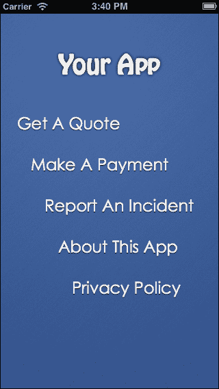

你可以充分利用这个机会来美化屏幕，但务必小心不要遮挡列表项本身。无论如何，包括图标等元素，但始终确保文本清晰易读。

如果用户需要为任何特定项目登录，确保他们在同一会话中使用的其他项目也能保持登录状态。（也就是说，如果我进行支付，我不应该再次登录来报告事件。）

通常情况下，这个列表中的项目数量应保持最少。如果你需要滚动查看，可能需要重新考虑你应用程序的层级结构。

# 网格

网格是一个用户非常熟悉的导航模式，对于图片和视频来说效果非常好（回想一下我们在项目 6、*说奶酪!*和项目 7、*我们去看电影!*中使用的`Imgn`和`Mem'ry`应用程序）。

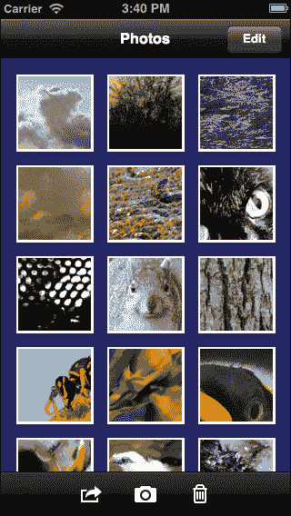

确保以足够大的比例显示缩略图，以便可以看到细节。如果你想要显示标题，它应该出现在图片下方。

点击缩略图通常会以更大的比例显示缩略图。然而，如果你使用这种导航模式，比如你应用程序的某个部分，每个缩略图都是一个图标，点击该图标将带你到应用程序的相应部分。在这种情况下，务必确保你的图标都是独特且可识别的。

使用此模式最适合图片和视频，而不太适合应用程序的部分。尽管过去一些应用程序（如 Facebook 的旧版本）曾使用过此模式，但大多数应用程序都倾向于使用其他机制。

在处理图片和视频时，长按缩略图通常会弹出一个包含删除、移动等操作的列表。或者，应用程序将允许用户重新排列列表（想想 iOS 设备上摇动的首页）。

# 轮播图 1

轮播图有许多不同的用途。在下面的例子中，我们正在水平轮播图中显示一系列文档。主图像下方的每个图像都是一个*操作*。用户可以点击它们对该文档进行特定的操作。此外，文档的*名称*（在主图像下方）通常是可点击的，允许用户重命名文档。如果你还记得，我们在项目 3、*提高生产力*和项目 10、*扩展规模*中使用了这种模式。

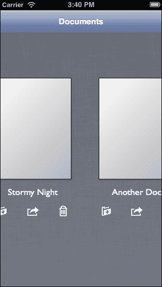

有时操作按钮可能不在轮播图中；它们可能位于工具栏或导航栏上。使用最适合您用户的方式。

如果有多个文档可用，确保屏幕两侧显示其中一个其他文档的部分是一个好主意；这有助于用户了解轮播图可以滚动。

大图像通常应该是实际文档的表示，通常是文档的第一页或一张纸的表示。

# 轮播图 2

这个轮播图与上一个不同。它更常用于逐个显示大图像或以友好界面显示应用程序的导游。它还常用于在有限的空间内显示不同组的信息或选项。

主内容下方的圆圈是可选的；如果您正在查看图像，用户通常知道左右滑动以查看上一张或下一张图像。如果您正在查看应用程序的导游或不同组的信息，则最好显示圆圈（或平台的等效功能），以便用户有一个关于内容页数的好主意。

当显示圆圈时，最好将页数限制在七页或八页以内。超过这个数字，圆圈本身可能会分散注意力，并影响内容。

# 登录界面

大多数应用程序都有它们，尽管它们有时是用户存在的烦恼（主要是因为在小型屏幕上输入密码很困难），但它们也非常重要。

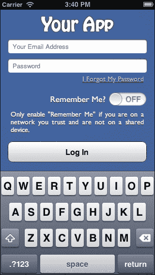

如果可能的话，最好使用电子邮件作为用户的唯一名称。这是他们已经知道并手头的信息。如果不可能，则将**电子邮件**替换为*用户名*。

总是让**密码**字段隐藏字符。这通常是通过在输入时用点代替每个字符来完成的。最后一个字符可以显示，但应该只显示很短的时间。大多数平台只要您指定输入字段是**密码**字段，就会免费提供这项服务。

有时，提供一个选项以显示整个密码是可以接受的。这通常是在**密码**字段下方提供的复选框或切换按钮。它并不常用，而且仅在密码本身可能非常复杂的情况下使用。一个很好的例子是在输入 Wi-Fi 信息时；一些设备允许您在不隐藏字母的情况下看到您输入的密码，因为 Wi-Fi 密码非常复杂。

让**登录**或**签到**按钮明显。它应该让人想点击。给它不同的颜色、更大的文字——任何能吸引用户注意的方法。

不要忘记为用户提供重置或检索其密码（以及如果未使用他们的电子邮件，则用户名）的方法。如果你的应用程序不提供这种机制，你将面临一些非常沮丧的用户。

如果你的应用程序适合，你可能还想要考虑一个**记住我**选项。这通常用于安全性不是特别重要，比如银行应用程序的应用程序中。如果你不希望应用程序永远记住用户，通常可以接受记住用户几周或一个月。如果你添加了这个功能，请务必警告用户在共享设备和不可信的网络中使用此功能的危险。

最后一点：使用 SSL。也就是说，登录过程应该在安全连接上进行。

# 注册表单

登录表单的对应物是注册表单。如果可能的话，如果用户需要登录才能使用你的应用程序，请包括此表单，并在登录表单上提供一个选项以显示此表单。某些平台限制了显示此类表单的能力（尤其是如果平台应用商店之外可以进行支付），但如果可能的话，为了用户的利益，请包括它。没有比发现登录界面，但无法创建全新的账户更糟糕的事情了。

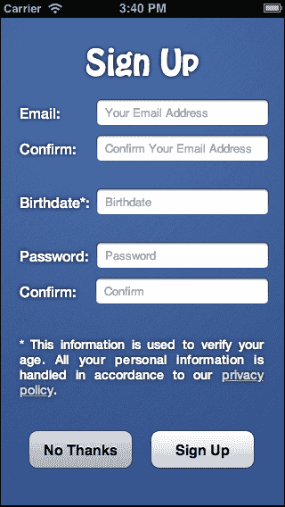

简洁明了。不要询问用户的生活故事，如果你必须询问大量字段，请使用多部分表单。最好将问题数量保持在七或八以下。你问的问题越少，用户注册的可能性就越大。

当要求电子邮件或密码时，使用第二个字段确认这些输入是个好主意。输入电子邮件或密码错误真是太容易了；如果没有确认，用户可能会继续下去，不知道自己犯了什么错误。然后当他们无法登录时，他们可能会责怪你的应用程序。

如果你必须要求提供个人信息，不要忘记解释你如何处理用户的私人数据。链接到你的隐私政策。并且不要忘记为注册表单使用 SSL。

让你的**注册**按钮看起来非常诱人，让人想点击。给它一个漂亮的颜色，大号字体；它需要引起注意。此外，如果可能的话，提供一个**不，谢谢**按钮，允许用户在不创建账户的情况下使用你的应用程序。对于某些应用程序，有很多内容可以在不登录的情况下浏览，一些用户会将其作为*演示*你的服务的方式。也就是说，他们会用它来看看是否想创建账户。如果你不需要，不要将你的内容放在登录墙后面。

# 表格

表格无处不在。我们在大多数应用程序中使用了它们，从项目 2 到 7，以及项目 9 到 10。这些可以设计得几乎无法辨认出是表格，但本质上任何可重复的内容都是表格。所以，推文列表、电子邮件列表或联系列表都是表格。

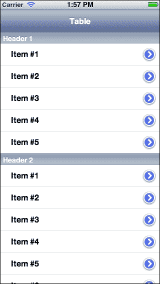

表格应以合理简洁的形式提供信息。重要的文本应突出显示，而辅助信息应使用较浅的颜色或较小的字体。如果提供了图像，请确保它足够大，以便有用，并且文本能够很好地围绕它包裹。仔细考虑图像的位置；位置可能传达重要信息（例如，在消息应用中，左侧的图像可能表示发送给您的消息，而右侧的图像可能表示您发送的消息）。

对于支持展开图标（箭头、勾选标记等）的平台，请确保将它们放置在您平台正确的位置。如果点击它们会执行不同于点击行所发生的操作，请确保提供足够大的可点击区域，以便用户能够定位。

一些应用为表格行添加了许多手势。TweetBot 是一个很好的例子，其中向一个方向滑动将执行一个动作，而向另一个方向滑动将执行另一个动作。通常这很新颖，用户不太可能在表格行上做很多滑动，除非看起来内容是可以删除的。在这种情况下，他们可能会从右向左滑动以尝试删除一行。（如果该行实际上是可以删除的，那么出现一个 **删除** 按钮将是合适的。）以下截图展示了这种情况：

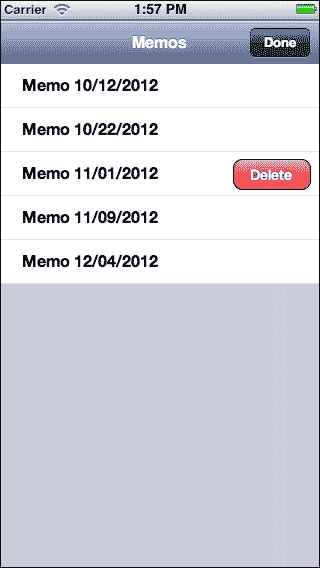

# 选择列表

这些以许多形式出现，但它们都归结为同一件事：应用希望您从列表中选择某项。列表可以是单选；也就是说，只能选择一个项目，或者它允许多选（这通常用单选按钮、勾选标记或其他类似图标表示）。

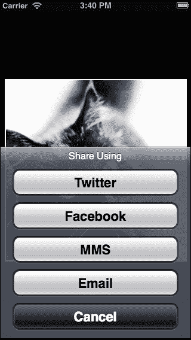

外观可能会有很大的差异，从 iOS 上的 *选择* 列表，到 iOS 的 *动作表单*，再到 Android 的菜单。选择最适合当前情况和平台的方法。

除非数量非常少，否则不要使用这些来选择数字。没有人愿意滚动浏览 100 行编号为 1-100 的内容，只是为了选择 97。对于这种情况，请使用输入字段。但如果可能的值是 25、50、75 和 100，那么这是可以的（尽管明智的做法可能是将数字拼写出来）。

# 批量处理事务

批量执行操作有许多不同的方法，但以下示例是一个非常常见的模式。我们在 项目 7，*让我们去看电影!* 和 项目 8，*玩耍* 中使用了类似的方法。

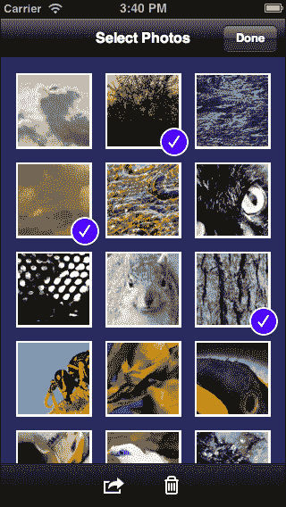

在前面的模式中，点击一个项目将标记该项目为选中状态。这可以通过在其旁边放置勾选标记、更改边框颜色（这是我们使用的），或使用其他方法突出显示来实现。只要明显标出哪些项目被选中，哪些项目未被选中，这里就有很多可能性。

一旦做出选择，那么这个模式底部的操作就会生效。用户可能会删除项目，或者他们可能想要做其他事情。如果您决定使用图标而不是文字，请确保使用用户已经理解的图标，例如，垃圾桶可以很好地代替*删除*。

尽量将可能采取的操作数量减少到绝对最小，尤其是在处理手机有限的可用空间时。

# 搜索

如果您的应用显示大量数据，几乎不可避免地需要提供一种机制来搜索这些数据。

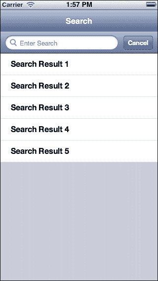

上述模式是大多数平台上最常见的模式之一。用户可以在**搜索**字段中输入内容，结果将显示在**搜索**字段下方的表格中。**取消**按钮并不总是存在。有时，它只是一个小的图标，但这取决于应用和平台。

搜索是在用户输入时发生，还是需要他们点击屏幕键盘上的**搜索**按钮，这取决于您。如果您可以快速搜索数据集，那么在用户输入时显示搜索结果可能很明智。这样他们可以快速看到结果集被缩小到他们想要的内容。

然而，如果搜索需要很长时间，那么最好等待用户输入他们想要的内容，然后告诉您何时进行搜索。然后您可以慢慢来（别忘了显示某种通知，表明您的应用正在思考），然后在搜索完成后显示结果。

搜索时的另一个常见模式是需要对搜索范围进行限定，如下面的模式所示：

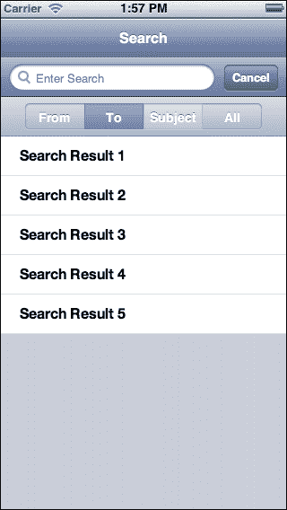

在这里，搜索栏下方的按钮是分段按钮，这是 iOS 的典型特征。大多数平台都有相应的功能。如果其中一个被点击，它会被突出显示，并且搜索只会在显示的范围内进行。

在这个例子中，如果用户点击**目的地**，那么搜索将只针对每个项目的**目的地**部分进行。

当涉及到搜索时，也经常有对数据进行排序和筛选的要求。您通常可以通过使用带有排序和筛选按钮的工具栏来满足这些要求，并显示一个列出各种选项的菜单。例如，点击**排序**按钮可能会显示一个包含姓氏、名字、账户号码等的菜单。可以实现更多复杂排序和筛选的各种模式，但如果可能的话，请保持简单。

# 需要记住的一些事项

通常，细节才是关键。以下是一些提示，帮助确保您不仅拥有一个外观出色的应用，而且还有一个感觉良好的应用：

+   避免新颖或不可发现的交互。或者，如果你确实想使用这样的交互，尝试也提供一个实现相同目的的第二个可发现的交互方法。有人可能会争辩说，类似于 Facebook 的滑动菜单可以被认为是新颖的，但如果手势没有被发现，触发菜单的按钮非常明显，很可能会被点击。

+   尊重用户对 UI 元素和手势的期望。一开始这似乎很明显；你不会通过点击垃圾桶来发送电子邮件。尽管如此，有很多方法你可以做用户没有预料到的事情，即使是以微妙的方式。用户的期望根据平台而高度具体，因此遵循你平台的 HIG 将在这个领域有很大帮助。

+   要融入。我的意思是，你的应用应该看起来像是属于你用户的设备。这意味着你的应用应该尊重平台的 HIG。这也意味着你的应用应该给人一种原生应用的外观。未能做到这一点可能会让用户感觉你的应用是这个设备上的二等公民。通过给人一种原生应用的外观，你的应用也应该尽力感觉原生——也就是说，它应该有接近原生应用的速度和响应性。（在某些平台上使用 PhoneGap 可能并不总是容易，甚至可能不可能。在这种情况下，你应该尝试尽可能接近，而不影响你的项目和其时间表。）

+   完美主义者。我的意思是，你应该确保所有你的对象对齐得很好，你的纹理无缝融合，图像缩放正确（特别是根据宽高比），等等。这需要细致入微的注意力，但最终你的应用看起来和感觉会更好。

+   保持响应。尽可能避免冻结用户界面。如果必须冻结 UI，那么向用户显示一个指示器，让他们知道他们的输入将被忽略。当谈到响应性时，这不仅仅是响应按钮的点击，还包括滚动性能。如果一个应用滚动得像抽搐一样，应用会感觉很慢。

+   节约你的数据。虽然你的应用可能经常在 Wi-Fi 连接下使用，但不要忘记那些可能需要处理蜂窝连接的用户。不仅他们的连接本身可能较慢，而且他们通常面临相当苛刻的数据限制。广泛地缓存。避免下载已经下载的内容。如果可以压缩，请务必压缩。或者，给用户提供一个“出路”——如果你的应用无论如何都会使用大量数据，你可能希望让他们在蜂窝连接时禁用使用大量数据的你的应用部分。

# 摘要

这些只是众多设计模式中的一小部分。在可能的情况下，做一些研究，看看在你的应用中是否有一个适合你想要做的模式的。是的，有时候，你的应用可能需要你做一些完全独特的事情，但大多数情况下，你会发现许多应用已经使用过的成功模式。你的应用将更加易于使用，你的用户也会因此感谢你。你也会收到更少的关于如何使用你应用的客服电话。
