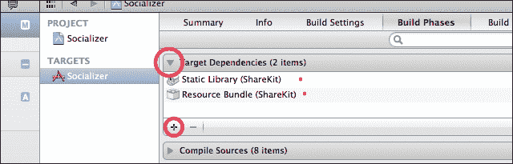
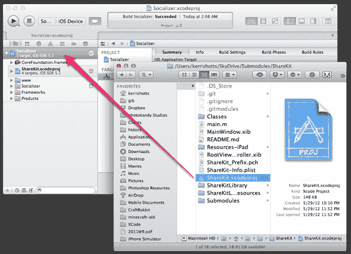
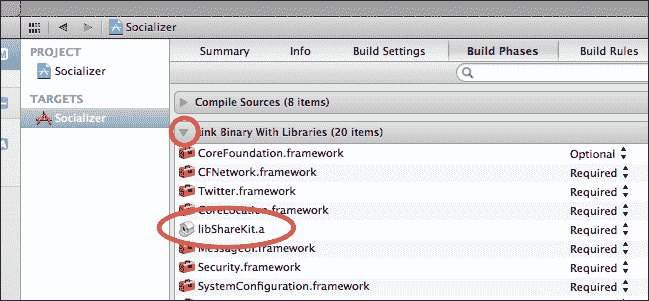
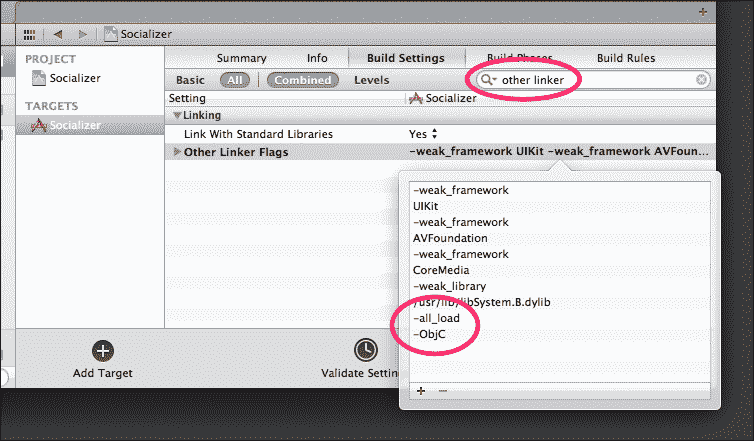
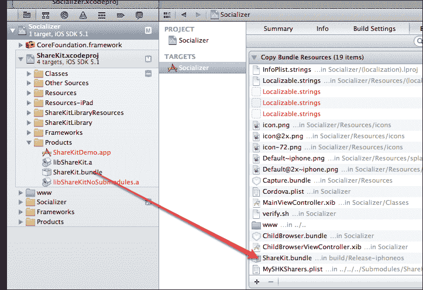
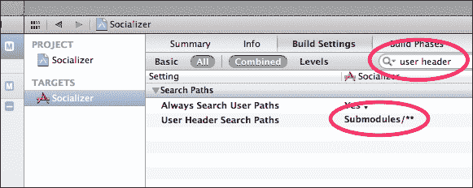
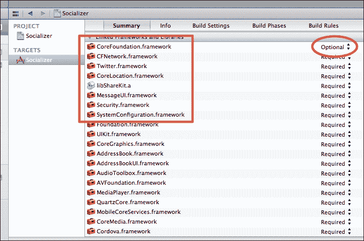
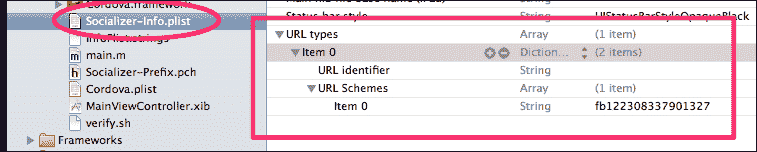
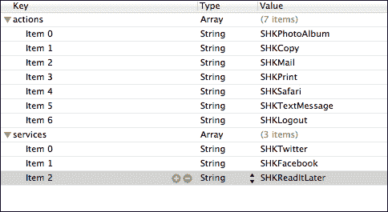

# 附录 B. 安装 ShareKit 2.0

实事求是地说，iOS 上没有系统定义的框架可以轻松地在许多不同的服务之间进行共享。iOS 5 确实提供了 Twitter 框架，iOS 6 通过提供 Facebook 框架对其进行了扩展，但没有任何系统定义的框架可以让你轻松地共享到更广泛的服务。也许 iOS 7 会解决这个问题，但不要抱太大希望。

幸运的是，有一个名为 ShareKit 的开源框架可以帮助解决这个问题。它为我们提供了一个轻松地将内容共享到任何数量服务的方法（假设每个服务都有一个 API 密钥），并且从 PhoneGap 调用它也不困难。不幸的是，安装它也是一个非常痛苦的过程。

我们列出了以下对我们有效的步骤。其中一些步骤来自 ShareKit 的 Wiki，网址为[`github.com/ShareKit/ShareKit/wiki/Installing-sharekit`](https://github.com/ShareKit/ShareKit/wiki/Installing-sharekit)，因此最好也参考该文档。

1.  您需要获取 ShareKit 文件。ShareKit 建议使用 Git 来完成此操作，或者您可以使用我们的副本——这是您的选择。坦白地说，使用我们代码包中`Submodules`目录下的副本会更简单。它可能不是 ShareKit 的最新版本，但它包含了工作所需的所有源代码更改。

1.  使用以下步骤将 ShareKit 添加到项目中：

    1.  导航到`Submodules/ShareKit`，并将`ShareKit.xcodeproj`拖动到你的项目中，如图所示：

    

1.  我们需要对 ShareKit 进行各种调整以允许其编译：

    1.  前往项目设置，点击**构建阶段**，展开**目标依赖**。添加**静态库（ShareKit）**和**资源包（ShareKit）**依赖项，如图所示：

    1.  展开**链接二进制库**，并添加如图所示的**libShareKit.a**：

    1.  展开**复制资源包**，并将 Sharekit 的资源包（位于`Products`文件夹下的 ShareKit 子项目中，命名为`ShareKit.bundle`）复制到列表中，如图所示：

    

1.  接下来我们需要调整头文件搜索路径和链接器标志：

    1.  切换到**构建设置**。

    1.  搜索`user header`。

    1.  双击名为**用户头文件搜索路径**的行。

    1.  添加**子模块**并勾选新条目旁边的复选框。它应该看起来像**子模块/****，如图所示：

    1.  现在搜索`other linker`。

    1.  双击名为**其他链接器标志**的行。

    1.  如果尚未添加，请添加`-all_load`和单独一行上的`-ObjC`，如图所示：

    

1.  我们需要添加此插件所需的各个 Apple 框架：

    1.  返回**摘要**选项卡。

    1.  滚动到**链接库和框架**。

    1.  添加`SystemConfiguration.framework`、`Security.framework`、`MessageUI.framework`、`CFNetwork.framework`（用于 Flickr 共享）、`CoreLocation.framework`（用于 FourSquare 共享）、`Twitter.Framework`和`CoreFoundation.framework`。

    1.  如以下截图所示，将`CoreFoundation.framework`设置为**可选**：

    

到目前为止，您应该能够无错误地构建项目。

### 小贴士

如果您没有使用我们的 ShareKit 副本，您可能会收到一个关于找不到协议定义的错误。这发生在 Flickr 代码中；要消除错误，只需删除导致错误的行上的`OFFlickrAPIRequestDelegate`。由于我们在示例中没有使用 Flickr，这不会引起问题。（然而，如果您将来决定使用 Flickr，可能会引起问题。）

我们需要获取我们打算使用的服务的 API 密钥。在我们的项目中，我们使用了 Twitter、Facebook 和 ReadItLater（现在称为 Pocket）。您可以使用任何您喜欢的服务，但您必须使用自己的 API 密钥来这样做。（我们的代码包不会为您提供 API 密钥。）请访问[`github.com/ShareKit/ShareKit/wiki/3rd-party-api-links`](https://github.com/ShareKit/ShareKit/wiki/3rd-party_api_links)获取有关如何获取这些密钥的一些有用信息。请参考以下步骤：

1.  我们必须使用这些密钥配置 ShareKit 2.0，因此请在 XCode 中创建一个新文件，并将其设置为`DefaultSHKConfigurator`的子类。我们使用了`MySHKConfiguration`作为名称，但您可以使用任何您喜欢的名称。请确保将此新文件保存到您的项目中，而不是子项目中。

1.  查看 ShareKit | 类 | ShareKit | 分享者 | 配置 | DefaultSHKConfigurator.m 以了解您可以覆盖的方法。每个方法都带有注释，指示针对每个社交网络服务的特定代码。

1.  复制您需要覆盖的代码，并将其粘贴到您自己的`configurator`文件中。

1.  修改每个方法以返回适当的 API 密钥、密钥或其它字符串。以下是一个示例：

    ```js
    - (NSString*)appName {
      return @"Socializer";
    }

    - (NSString*)appURL {
      return @"http://www.example.com";
    }

    - (NSString*)facebookAppId {
      return @"122308337901327";
    }

    - (NSString*)facebookLocalAppId {
      return @"";
    }

    - (NSArray*)facebookListOfPermissions {    
        return [NSArray arrayWithObjects:@"publish_stream", @"offline_access", nil];
    }

    - (NSString*)readItLaterKey {
      return @"apikey";
    }
    // Twitter - http://dev.twitter.com/apps/newhttp://dev.twitter.com/apps/new
    - (NSNumber*)forcePreIOS5TwitterAccess {
      return [NSNumber numberWithBool:true];
    }

    - (NSString*)twitterConsumerKey {
    	return @"apikey";
    }

    - (NSString*)twitterSecret {
      return @"apikey";
    }
    // You need to set this if using OAuth, see note above (xAuth users can skip it)
    - (NSString*)twitterCallbackUrl {
      return @"http://www.example.com/callback";
    }
    // To use xAuth, set to 1
    - (NSNumber*)twitterUseXAuth {
      return [NSNumber numberWithInt:0];
    }
    - (NSString*)twitterUsername {
      return @"";
    }
    ```

1.  导航到您的项目的`/Classes/AppDelegate.m`文件，并在`didFinishLaunchingWithOptions:`方法的末尾添加以下代码，紧接在返回语句之前（假设您的文件名为`MySHKConfigurator`）：

    ```js
    DefaultSHKConfigurator *configurator = [[MySHKConfigurator alloc] init]; 
    [SHKConfiguration sharedInstanceWithConfigurator:configurator];
    ```

1.  还需要在导入部分添加以下代码：

    ```js
    #import "SHK.h"
    #import "SHKConfiguration.h"
    #import "MySHKConfiguration.h"
    #import "SHKFacebook.h"
    ```

1.  接下来，我们需要启用离线共享（可选）：

    +   在上一步新添加的代码下方添加`[SHK flushOfflineQueue];`。

1.  如果您支持 Facebook，则需要支持单点登录（SSO）：

    +   在`AppDelegate.m`中的`handleOpenURL:`方法末尾添加以下代码（替换`return YES;`语句）：

        ```js
            return [self handleOpenURL:url];  
        }

        - (BOOL)handleOpenURL:(NSURL*)url
        {
          NSString* scheme = [url scheme];
          NSString* prefix = [NSString stringWithFormat:@"fb%@", SHKCONFIG(facebookAppId)];
          if ([scheme hasPrefix:prefix])
          return [SHKFacebook handleOpenURL:url];
          return YES;
        }

        - (BOOL)application:(UIApplication *)application openURL:(NSURL *)url sourceApplication:(NSString *)sourceApplication annotation:(id)annotation 
        {
          return [self handleOpenURL:url];
        }
        ```

    +   在您的项目的`info.plist`文件中添加自定义 URL 方案：

        +   添加**URL 类型**

        +   添加**项目 0**

        +   添加**URL 方案**

        +   添加**项目 0**，并设置值为"`fb`"以及您的 Facebook 应用 ID

    

为了确定您的`AppDelegate.m`文件完成后的样子，请将您的文件与下载的代码包中的我们的文件进行核对。

我们几乎完成了；现在我们只需要指出我们不支持的社交网络：

1.  将`ShareKit`子项目中的`SHKSharers.plist`文件复制到您的项目中。请确保将其重命名为不同的名称，例如`MySHKSharers.plist`。

1.  删除对应于您不支持的网络的行。以下是我们的一个示例：

1.  将以下代码添加到您的`configurator`文件末尾：

    ```js
    - (NSString*)sharersPlistName {
    	return @"MySHKSharers.plist";
    }
    ```

到目前为止，您应该已经将 ShareKit 框架集成到您的项目中。您需要参考项目 2，*让我们社交吧！*来完成与 ShareKit PhoneGap 插件的集成。

我希望我能给您提供更多关于构建错误需要注意的事项。不幸的是，每次我这样做，似乎都会遇到之前没见过的新的错误。（本文档中之前提到的 Flickr 错误就是一个很好的例子！）通常需要交叉手指并希望的方法来解决这类错误（例如我移除导致错误的协议），但移除错误本身可能并不总是有效。如果您遇到问题，向 PhoneGap 社区或 ShareKit 社区寻求建议是个好主意。
