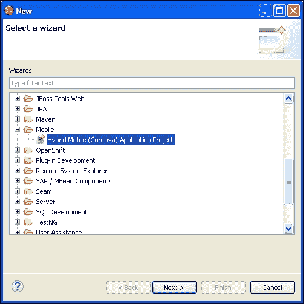
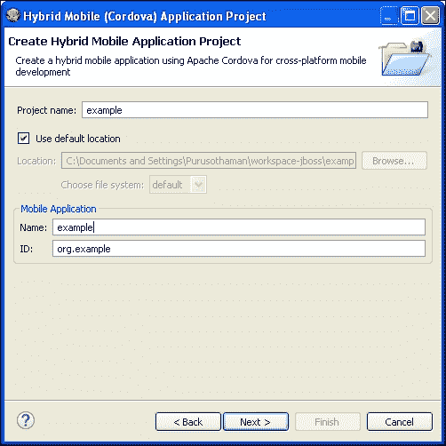
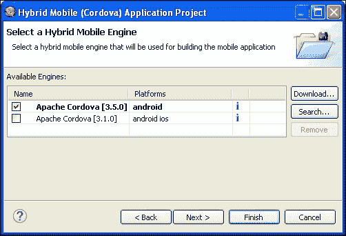
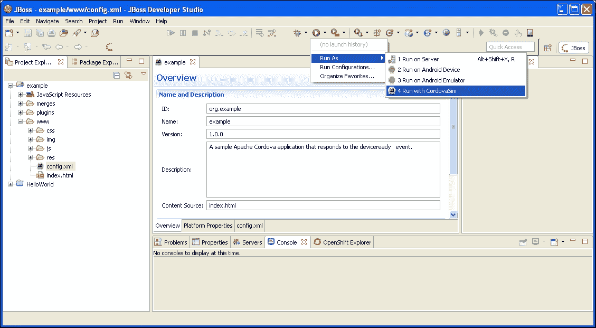
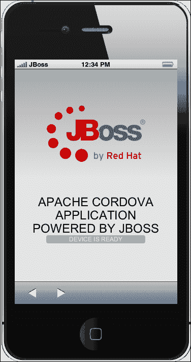

# 第一章. PhoneGap 简介

*PhoneGap 是一个混合应用框架，它允许您使用 HTML 和 JavaScript 构建原生应用。开发者可以编写一次代码，并将他们的应用部署到多个移动操作系统上。PhoneGap 提供了一个 JavaScript 编程接口，允许您使用纯 JavaScript 访问与操作系统相关的功能。本章涵盖了关于 PhoneGap 以及设置您的开发环境的信息。*

在本章中，我们将涵盖以下主题：

+   理解 PhoneGap 是什么

+   了解 Apache Cordova/PhoneGap 的历史概述

+   PhoneGap 和 Cordova 的演变

+   学习移动网页和移动应用之间的区别

+   学习如何配置您的开发环境和所有依赖项

+   学习如何使用 JBoss、Xcode 和 Visual Studio 创建新项目

# 关于 PhoneGap

PhoneGap，也称为 Apache Cordova，是一个开源的混合移动应用开发框架。它使用标准且广为人知的 Web 技术，如 HTML、**层叠样式表**（**CSS**）和 JavaScript，在不使用原生开发语言的情况下创建跨平台的移动应用。

如果您想开发原生安卓应用，您应该了解与 Java 和 Android SDK 相关的 API。对于 iPhone 应用，您需要了解 Objective-C 或苹果的新 Swift 语言。同样，对于所有其他移动平台，您需要了解它们各自的编程语言。您为某个平台编写的代码在另一个平台上可能无法工作。为了克服这些困难，我们现在有一个混合移动开发框架，称为 PhoneGap。您使用 PhoneGap 开发的程序可以部署到其他几个平台上。这是一个一次编写，到处部署的框架。

以下是 PhoneGap 目前支持的移动平台列表：

+   安卓

+   iOS

+   亚马逊 FireOS

+   黑莓 10

+   Firefox OS

+   Ubuntu

+   Windows Phone 8

+   Windows 8

+   Tizen

+   Windows 7

+   浏览器

该框架使开发者能够使用简单的 JavaScript 访问所有硬件相关功能。开发者将能够通过简单的函数访问设备联系人、位置、文件、设备信息等，更多功能。请注意，现在支持一个新的平台，称为“浏览器”。听起来很有趣？这取决于您来增加您的好奇心。

# PhoneGap 和 Apache Cordova

**PhoneGap**最初由 Nitobi 开发，该公司后来在 2011 年被 Adobe 收购。收购后，Adobe 将 PhoneGap 代码库捐赠给了**Apache 软件基金会**（**ASF**），项目名为**Cordova**，这是温哥华街道的名字，Nitobi 的办公室就位于那里，公司在那里创建了 PhoneGap 的第一个版本。

将代码库迁移到 ASF 的最大优势之一是任何人都可以轻松地为项目做出贡献。许多公司不仅对 Apache 风格的许可证感到舒适，而且已经与 Apache 签署了贡献者许可协议。对于有兴趣为充满活力的开源项目做出贡献的开发者来说，Apache Cordova 是一个很好的机会。

PhoneGap 是 Apache Cordova 的免费和开源分发版。将 Cordova 想象成 PhoneGap 及其相关服务（调试、模拟和构建服务）所构建的引擎。Adobe 提供了一个集成平台，只需单击一下即可为多个平台构建应用程序。如果你不想使用 Adobe 的构建功能，你必须手动为每个移动平台构建应用程序。除此之外，对于 PhoneGap 和 Cordova 开发者来说，没有任何变化。

Adobe 在该项目中继续扮演着重要角色，投资于其持续发展，并且公司决定保留 PhoneGap 这个名称来描述其 Cordova 项目的分发。Apache Cordova 项目的其他贡献者包括 Google、RIM、Microsoft、IBM、Nokia、Intel 和惠普。有关 Cordova 和 PhoneGap 的更多详细信息，请参考以下在线资源。它们提供了许多有用的信息和教程，供初学者开始开发：

+   [Apache Cordova 网站](http://cordova.apache.org/)

+   [PhoneGap 网站](http://phonegap.com/)

### 注意

在本书中，我们将使用 PhoneGap 和 Cordova 这两个术语，技术上它们是相同的。你可以将 Cordova 和 PhoneGap 互换使用。

## PhoneGap 和 Cordova 的发展历程

自 2012 年 1 月以来，PhoneGap 发展非常迅速，每年都有多次发布。Apache Cordova 使用 **语义化版本控制** 规范（更多信息请参阅 [`semver.org`](http://semver.org)）。这是一个非常好的实践，它告诉开发者一个发布版本是否有主要或次要的改进。

自 1.4 版本以来，该项目被称为 Apache Cordova。这个版本通常被认为是框架的第一个稳定版本，拥有相当完整和最新的文档。1.5 版本修复了长长的错误列表，但社区最初的反应并不非常积极，因为文档已经过时，对主要文件的一些更改导致了使用早期版本开发的应用程序构建问题。

1.6 版本对插件架构、相机和指南针 API 以及项目模板文件进行了一些改进。正如成熟社区通常所发生的那样，这次发布并不完美，但与之前的版本相比，整体质量有了显著提升。1.7 和 1.8 版本是错误修复，并增加了对 Bada 2.0 的支持。由于发布速度较快，社区反应也较为积极。1.9 版本解决了更多的错误修复，并增加了对 iOS 和 Android 平台新特性的支持。

Apache Cordova 2.x 增加了以下功能和支持：

+   定义一个独特的 JavaScript 文件，以便在所有平台上使用，这得益于 Cordova 应用程序框架 JavaScript 层的统一。

+   通过命令行工具（CLI）的引入，可以以标准方式执行常见操作，如项目创建、调试和仿真，适用于（Android、iOS 和 BlackBerry）

+   能够使用 Cordova WebView 将 PhoneGap 应用程序嵌入到更大的原生 iOS 和 Android 应用程序中。

+   支持 Windows phone 平台。

+   将**Web Inspector Remote**（**Weinre**）移植到 Node.js，并引入了一个便于使用**Node 包管理器**（**npm**）安装的 node 模块。

+   插件文档的改进。

+   对创建 iOS 应用程序的过程进行了多项改进。

+   每个平台可用的命令标准化（即`build`、`run`等）

随着 2.x 版本的发布，Apache Cordova 和 PhoneGap 已成为移动开发者工具箱中成熟、稳定且强大的工具。

自 2013 年 9 月引入 3.0 版本以来，PhoneGap 使用了一种新的插件架构，以保持应用程序核心小且性能快速。可以使用更新的 Cordova **命令行界面**（**CLI**）安装和卸载插件。PhoneGap 3.0 还引入了几个新的命令行工具；例如，用户现在可以使用 npm 轻松安装 PhoneGap，而无需下载 ZIP 文件。PhoneGap 3.0 版本还发布了两个新的 API，即 InAppBrowser（之前称为 ChildBrowser）和 Globalization API。他们也开始讨论停止对 webOS、Symbian、Blackberry（BB7 及更早版本）和 Windows Phone 7 的支持。

在 PhoneGap 3.1.0 版本中，提供了对 FirefoxOS 和 Windows 8 的基本支持，以及其他错误修复和平台增强。2013 年 11 月发布的 PhoneGap 3.2.0 版本专注于稳定性和几个错误修复。2013 年 12 月，发布了 PhoneGap 3.3.0 版本，增加了对 Android KitKat（v4.4）的支持。

随着 PhoneGap 3.4.0 的发布，增加了对 FirefoxOS 的高级支持。PhoneGap 3.5.0 是最后一个支持 Windows 7 的版本。随着 PhoneGap 3.6.3 的发布，增加了 Cordova 支持的命令。PhoneGap 的每个新版本都部署了几个新功能。在撰写本书时，我们有 PhoneGap 5.1.1，它提供了对 PhoneGap 桌面应用和移动应用的高级支持。

# 选择开发操作系统

PhoneGap 遵循规则。如果供应商只为单个操作系统发布 SDK，那么您将不得不使用该操作系统来构建和部署您的应用。

详细来说，对于每个 PhoneGap 平台：

+   您可以在任何主要的桌面操作系统上开发**Android**应用——Windows、Mac OS X 或 Linux

+   您可以在任何操作系统上开发**Symbian Web Runtime**应用，但您只能从 Windows 运行模拟器

+   您可以在任何主要的桌面操作系统上开发**BlackBerry**应用——SDK 可以安装在 Windows 或 Mac OS X 上（运行模拟器时，您需要安装 SDK 附带提供的虚拟机）

+   **Windows Phone 8** SDK 在 Windows 8 或 Windows 8 Pro 上运行

+   **iOS** SDK 需要 OS X 10.7 或更高版本（根据 OS X EULA，还需要一台 Mac 电脑）

### 注意

您可以使用 Ripple（目前孵化在 Apache 软件基金会[`incubator.apache.org/projects/ripple.html`](http://incubator.apache.org/projects/ripple.html)的 Chrome 扩展）或使用[`emulate.phonegap.com`](http://emulate.phonegap.com)提供的在线仿真服务在桌面浏览器中模拟应用。

实际上，您在移动开发上最好的选择是获取一台 Mac，并在单独的分区上安装 Windows，或者使用**Parallels**或**VMWare Fusion**在虚拟环境中运行它。根据苹果的法律条款，您不能在非苹果硬件上运行 Mac OS X；如果您坚持使用 Windows PC，您将能够为除 iOS 以外的每个平台构建。然而，您仍然可以通过使用 VirtualBox 并在 Windows PC 上运行 OS X 来使用 OS X。

总之，有了新的 CLI 工具，为所有主要移动平台构建应用变得越来越容易。移动开发者对构建跨平台应用中涉及的问题非常清楚；不出所料，[`build.phonegap.com`](http://build.phonegap.com)服务因其允许开发者使用他/她的首选操作系统而开始变得相当受欢迎。注册此服务后，可以从一个共同的代码库开始构建跨平台应用。您可以上传代码库或从 GitHub 仓库中拉取。本书的最后，我包括了一个关于移动应用分发过程的章节。

# 移动网页与移动应用

有许多讨论集中在决定应该进行哪种类型的发展：响应式网站或原生应用。一些流行的网站，例如 Gmail，既有移动友好的网站，也有原生应用。为了更好地理解这一点，让我们看看这些是什么：

| 响应式网站 | 移动应用 |
| --- | --- |
| 响应式网站可以在从移动设备到桌面计算机的各种设备上工作。这种设计方式通常被称为**响应式网页设计**（**RWD**）。 | 应用是为移动设备设计的。它们不是为桌面计算机设计的。 |
| 响应式设计为所有设备上的用户提供更好的观看体验。 | 移动应用提供典型的移动体验，整个界面都是针对移动设备设计的。 |
| RWD 涉及一些开发概念，如流体网格、CSS 媒体查询、响应式表格和图像。 | 使用与移动相关的布局模式。 |
| 响应式网站能够很好地适应设备的屏幕尺寸，这使得阅读内容更加容易。 | 内容通常是为移动屏幕尺寸设计的。可读性总是更好。 |
| 移动网页是一个普通的网站，它能够适应移动设备。 | 移动应用具有比简单网站更多的功能。 |
| 响应式设计是移动应用的低成本替代方案。 | 需要投入专门的开发时间和资源进行应用开发。 |
| 与任何其他网站一样，它们受限于浏览器的功能。 | 通过使用相机、加速度计等与设备相关的 API，提供丰富的用户体验。 |

关于响应式设计（RWD）及其背后的设计原则的更多信息，请阅读以下基础内容：[`developers.google.com/web/fundamentals/layouts/rwd-fundamentals/`](https://developers.google.com/web/fundamentals/layouts/rwd-fundamentals/)

总结来说，响应式设计和移动应用都有其优缺点。决定你要开发哪种类型的是你的业务或需求。如果你打算开发移动应用，你应该针对多个移动平台，而且在短时间内为所有平台编码是不太可能的。这时，使用 PhoneGap 开发的混合移动应用就显示出了其优势。

# 安装依赖项

为了准备好构建 PhoneGap 应用，必须从相应的官方网站下载并安装每个目标平台的最新 SDK：

+   **Android**：[`developer.android.com/sdk/index.html`](http://developer.android.com/sdk/index.html)

+   **BlackBerry 10**：[`developer.blackberry.com/html5/downloads/#blackberry10`](https://developer.blackberry.com/html5/downloads/#blackberry10)

+   **Firefox OS**：不需要特殊的 SDK

+   **iOS**：[`developer.apple.com/devcenter/ios/index.action`](https://developer.apple.com/devcenter/ios/index.action)

+   **Windows 8 Phone**：[`www.microsoft.com/en-in/download/details.aspx?id=35471`](http://www.microsoft.com/en-in/download/details.aspx?id=35471)

每个前面的平台 SDK 都有自己的设置配置，建议参考各自的网站以获取最新信息。要使用多个 IDE，例如 NetBeans、Eclipse 或 JBoss Developer Studio，我们需要 Java 可用。

## Java JDK

你需要安装最新的**Java JDK**（不仅仅是 JRE）。接下来，为`JAVA_HOME`创建一个环境变量，指向 Java JDK 安装的根文件夹。例如，如果你的安装路径是`C:\Program Files\Java\jdk7`，将`JAVA_HOME`设置为这个路径。之后，将 JDK 的`bin`目录（`C:\Program Files\Java\jdk7\bin`）也添加到`PATH`变量中。

## Apache Ant

我们需要安装并配置**Apache Ant**。更新你的`PATH`变量以包含安装文件夹中的`bin`文件夹。对于高级配置细节，请访问[`ant.apache.org/manual/index.html`](http://ant.apache.org/manual/index.html)。

由于 PhoneGap 框架的最新变化，始终建议使用命令行界面来创建新项目、更新框架或安装插件。要使用命令行，我们需要**Node.js**应用程序。首先，从[`nodejs.org`](http://nodejs.org)下载并安装 Node.js。一旦完成，你应该能够在命令行中通过调用`npm`或`node`来验证安装。你可能需要将`npm`目录添加到系统`PATH`中，以便调用全局安装的 npm 模块。

在每个安装的末尾，你应该能够使用以下命令验证每个软件包的安装：

```js
android list sdk
javac –version
ant –version
node -v

```

如果前面的任何命令行没有按预期工作，你可能需要重新检查你的系统`PATH`设置。例如，PhoneGap 和 Cordova 需要将`ANDROID_HOME`环境变量设置在`PATH`中。这应该指向`[ANDROID_SDK_DIR]\android-sdk`目录（例如，`c:\android\android-sdk`）。

接下来，更新你的`PATH`变量以包含`tools/`和`platform-tools/`文件夹。因此，使用`ANDROID_HOME`，你应该添加`%ANDROID_HOME%\tools`和`%ANDROID_HOME%\platform-tools`。

对于 OS X 用户，安装 ios-sim 也非常重要。ios-sim 工具是一个命令行实用程序，可以在模拟器上启动 iOS 应用程序。要安装此工具，你可以再次使用 npm，如下所示：

```js
npm install –g ios-sim

```

根据你的权限，你可能需要以管理员身份运行`npm`命令（即在`npm`命令前添加`sudo`）。

一旦安装了 SDK，建议您还安装 GitHub 客户端。GitHub 是一个社交编码平台，您可以在其中找到大多数酷的开源项目（如 Apache Cordova），包括访问最新的补丁、构建和源代码。您可以使用 PhoneGap 的免费在线构建服务从公共 GitHub 仓库轻松地为多个平台构建项目。

# 安装 PhoneGap

从 Apache Cordova 2.0 开始，安装过程和开发环境的设置已经变得容易得多。在 2.0 时代之前，PhoneGap 的安装过程很令人困惑，因为有很多依赖项。这些依赖项是由于，为了为不同的平台编译应用程序，您不仅需要平台特定的 SDK，还需要平台特定的工具；例如，为了构建 Android，需要 Eclipse、IntelliJ 或 Android Studio；为了构建 iOS，需要 Xcode；等等。

现在，您可以使用 Cordova 随附的一系列命令行工具，这使得开发跨平台应用程序更加容易。安装 Cordova 和 PhoneGap 现在就像运行几个命令一样简单。请注意，我们可以使用与 Cordova 或 PhoneGap 相关的 CLI 命令。PhoneGap CLI 提供的功能比其 Cordova 对应版本更多，例如支持 PhoneGap 桌面应用程序和移动应用程序。

为了启动开发，让我们创建一个新的项目。我们将使用 npm 实用程序 Node.js 自动下载最新的框架代码。

在 Windows 环境中，运行以下命令：

```js
C:\>npm install -g phonegap

```

在 Linux 和 OS X 上，运行以下命令：

```js
$ sudo npm install -g phonegap

```

在前面的命令中使用 `-g` 标志，我们指示 npm 全局安装 PhoneGap；否则，它将在当前目录中安装。一旦安装过程完成，请在命令行终端中运行以下命令以验证安装。这应该返回 PhoneGap 的最新版本号。

```js
phonegap --version

```

一旦我们验证了 Cordova 的安装，我们可以使用以下命令创建一个新的应用程序项目：

```js
phonegap create hello

```

完成此命令可能需要一些时间。这是创建一个名为 `hello` 的项目的最小语法要求。在当前工作目录中将会创建一个名为 `hello` 的新文件夹。目录内容将如下所示：

```js
├── hooks
├── merges
├── platforms
├── plugins
├── www
|   └── css
|   └── img
|   └── js
|   └── index.html
├── config.xml
```

在 `www` 文件夹中，您将找到运行与分发二进制文件捆绑的示例 PhoneGap 应用所需的 HTML/JS/CSS 文件。

# 设置您的开发环境

本节提供了设置 Android、iOS 和 Windows Phone 开发环境的详细指南。为了基于简单的文本编辑器设置开发环境，只需使用命令行工具运行几个命令即可。

# 行动时间 - 使用 PhoneGap 3.x 设置 Android

准备设置 Android 开发环境并使用 Android 作为目标平台创建 PhoneGap 应用。在前一节中，我们看到了如何创建一个新项目。现在，是时候将所需的平台添加到项目中了。像往常一样，在 OS X 上使用终端或在 Windows 上使用 DOS 提示符来运行这些命令。

1.  启动一个命令行工具（DOS 或终端）并将目录更改为我们刚刚下载的 Cordova/PhoneGap 分发目录，如下所示：

    ```js
    $ cd hello

    ```

1.  为了创建一个针对 Android 的 PhoneGap 项目，您只需运行命令将平台添加到项目中：

    ```js
    $ phonegap platform add android

    ```

该命令告诉 Cordova 为 Android 平台添加支持。在命令成功执行后，您可以在平台目录内看到一个名为 `android` 的新目录。它包含所有平台相关的文件。

现在是时候在模拟器中运行项目了。以下命令将需要一些时间来完成：

```js
$ phonegap emulate android

```

工具将检查是否已定义了一些虚拟设备，如果没有定义，将提示用户定义一个。如果已经定义了多个设备，工具将询问使用哪一个。

## *发生了什么？*

您已创建了一个 PhoneGap 项目，并在 Android SDK 中配置的测试设备之一中模拟了该应用。

## 与其他平台一起工作

要与 iOS、Windows Phone 等其他平台一起工作，您必须遵循与我们为 Android 所做的相同过程。您可以添加到项目中平台列表取决于平台名称。在添加平台之前，您应该确保您的机器上已安装所需的 SDK。

在 Windows 机器上，如果您已为每个平台安装了所需的 SDK，则可以运行以下任何命令。您不会在这里看到 iOS 平台，因为我们需要 Mac 机器来处理 iOS：

```js
C:\hello> phonegap platform add wp7
C:\hello> phonegap platform add wp8
C:\hello> phonegap platform add windows8
C:\hello> phonegap platform add amazon-fireos
C:\hello> phonegap platform add android
C:\hello> phonegap platform add blackberry10
C:\hello> phonegap platform add firefoxos

```

在前面的命令中，`wp7` 和 `wp8` 分别表示 Windows Phone 7 和 8。

在 Mac 机器上，安装相应的平台 SDK 后，您可以在以下平台上进行开发。您不会在这里看到 Windows Phone 平台，因为我们需要 Windows 操作系统来安装 Windows Phone SDK：

```js
$ phonegap platform add ios
$ phonegap platform add amazon-fireos
$ phonegap platform add android
$ phonegap platform add blackberry10
$ phonegap platform add firefoxos

```

# 开始使用 Android 和 JBoss

有几个用于 Java 的 IDE，其中一些是 **IntelliJ IDEA**、**Eclipse**、**NetBeans** 和 **JBoss Developer Studio**。Android Studio 是 Android 开发最推荐和最常用的 IDE。然而，它不支持 Cordova/PhoneGap 开发。与其他 IDE 相比，JBoss Developer Studio 提供了一种非常简单方便的方式来创建和操作 PhoneGap 项目。您可以从 JBoss 网站下载最新版本，网址为 [`www.jboss.org/products/devstudio/download/`](https://www.jboss.org/products/devstudio/download/)。为了运行基于 Apache Cordova/PhoneGap 的示例应用程序，您需要安装 Android SDK，并将 **JBoss Hybrid Mobile Tools** 插件添加到您的 JBoss 安装中。此工具扩展了 JBoss 的功能，让您可以快速设置新的 Cordova 项目，添加 Cordova 插件，调试应用程序，甚至导出已签名（或未签名）的 APK 文件以分发应用程序。

# 开始行动 - 使用 JBoss Developer Studio

为了将 Hybrid Mobile Tools 安装到 JBoss 中，只需执行以下步骤：

1.  启动 JBoss Developer Studio，然后导航到 **帮助** | **JBoss Central**。

1.  在 JBoss Developer Central 中点击 **软件/更新** 选项卡。

1.  输入 `JBoss Hybrid Mobile Tools` 或在列表中滚动以定位到 **JBoss Hybrid Mobile Tools + CordovaSim**。

1.  选择相应的复选框，然后点击 **安装**。

1.  安装后提示重启 IDE 时，点击 **是** 以重启 JBoss Developer Studio。

一旦 JBoss Hybrid Mobile Tools 安装配置正确，就可以使用相应的向导创建一个新项目。

前往 **JBoss Hybrid Mobile Tools** | **新建** | **其他**。接下来，在 **移动** 部分中选择 **Hybrid Mobile (Cordova) Application Project**。点击 **下一步**：



输入 **项目名称**、**名称** 和 **ID** 的值。我们将使用 `example` 作为 **名称**，`org.example` 作为 **ID**，如下截图所示：



点击 **下一步** 以选择要使用的 Cordova 版本。我们总是选择最新版本：



再次点击 **下一步** 将显示安装一些插件的选项。对于本教程，我们不需要安装任何插件。因此，我们不选择任何内容。

点击 **完成** 以退出向导。

在向导结束时，将为您创建一个默认应用程序。现在让我们构建创建的应用程序，看看它在模拟器上的样子。点击 **运行** 工具栏图标，并选择 **使用 CordovaSim 运行** 选项以打开模拟器：



## *刚才发生了什么？*

一旦构建过程完成，你将在屏幕上看到一个模拟器。有了这个，我们现在能够创建一个新的项目并成功模拟它：



# 开始使用 iOS 和 Xcode

为了开始为 iOS 设备开发应用，必须拥有一个 Mac 并下载 iOS SDK（Xcode），可在 Apple 开发者中心 [`developer.apple.com`](http://developer.apple.com) 获取。完成以下步骤以安装 Xcode：

1.  从 App Store 安装 Xcode。

1.  安装 Xcode 命令行工具（**Xcode 首选项** | **下载** | **组件** | **命令行工具** | **安装**）。

现在，让我们使用命令行工具创建一个 iOS 项目，如下所示：

```js
$ phonegap create hello
$ cd hello
$ phonegap platform add ios
$ phonegap build

```

执行上述命令后，你将创建一个 Xcode 项目。你可以看到 `hello/platforms/ios/hello.xcodeproj` 文件，你可以双击它来打开它。有了这个，我们的项目已经设置好，可以调试和部署了。

为了部署应用，在工具栏上的 **方案** 下拉菜单中更改 **目标** 为 **Hello**（或当前项目名称），并在工具栏上的 **方案** 下拉菜单中更改 **活动 SDK** 为 **iOS [版本] 模拟器**。完成这些操作后，点击 **运行** 按钮。

### 注意

如果你正在寻找一个具有高级重构功能、更好的代码补全、对单元测试的强大支持以及强大的代码检查工具的 Objective-C 工具，你应该考虑购买 **JetBrains** 的 **AppCode**。更多信息可在 [`www.jetbrains.com/objc/`](http://www.jetbrains.com/objc/) 找到。

# 开始使用 Windows Phone 和 Visual Studio

微软 Visual Studio 现在支持多设备混合应用的插件，包括 Cordova，这允许你在 Android/Windows Phone 上运行和调试应用。如果你想在实际设备上调试应用，你必须创建一个开发者账户在 [`dev.windowsphone.com/en-us/account`](https://dev.windowsphone.com/en-us/account)，以便解锁调试真实设备的功能。

# 摘要

在本章中，你学习了如何使用 Apache Cordova 包含的 CLI 工具设置你的开发环境，以及如何与多个平台协同工作。下一章将帮助你选择一个开发环境，并展示如何在多个平台上调试你的第一个应用。
