# 第二章：构建您的第一个 PhoneGap 项目

*在第一章*《PhoneGap 简介*》中，您学习了 PhoneGap 试图解决的问题之一——在多个平台上持续开发移动应用程序，以及如何设置您的构建环境。接下来，您将深入了解 PhoneGap 的内部结构。首先，您需要了解项目是如何构建的，以及 CLI 工具是如何使用的。

在本章中，您将：

+   查看 PhoneGap/Cordova 应用程序的结构

+   了解使用 Cordova 命令行工具

+   了解 Cordova 生命周期事件

+   创建一个示例

+   了解浏览器调试工具的概述

+   考虑到移动设备，回顾调试工作流程

+   学习如何构建和部署应用程序

# PhoneGap 应用程序的结构

在上一章中解释了创建新项目之后，您将在项目的根目录内看到以下结构：

+   `www`: 这个目录包含应用程序的源文件，因此我们将在该目录中进行大量操作。它包含`css`、`js`和`img`子目录，您可以将相应的文件放置在这些子目录中。除了 CSS、JavaScript 和图像等资产外，我们还将有与应用程序相关的 HTML 文件。

+   `merges`: 在这个文件夹中，您可以添加任何特定于平台的定制，这样您就不必每次与项目一起工作时都修改源文件。例如，我们可以使用这个功能在 Android 设备上使用不同的字体样式。您想要覆盖的平台将有一个类似于`www`文件夹的特定文件夹，包含自己的 CSS、JS、HTML 和图像内容：

    ```js
    merges/
    |-- ios/
    | '-- app.js
    |-- android/
    | '-- app.js
    www/
    '-- app.js
    ```

    在先前的目录结构中，全局应用程序包含`app.js`文件，而在`merges`目录中，每个平台都有一个单独的`app.js`文件。在构建过程中，全局的`app.js`文件将被平台特定的`app.js`文件替换。

+   `platforms`: 这个目录将包含平台相关的构建文件。对于我们将添加到项目中的每个平台，我们都可以看到一个子目录。

+   `plugins`: 这是您将找到项目中使用的插件的目录。每次我们安装新的插件时，它们都将被添加到这里。

+   `hooks`: 这个目录可以包含可以用来自定义 Cordova/PhoneGap 命令的脚本。这主要针对需要与构建系统和版本控制系统集成的高级用户。

+   `config.xml`: 这个配置文件将包含所有特定于应用程序的值，例如应用程序名称、包名、版本号以及其他此类配置。

# 使用 PhoneGap CLI

您可以使用 Cordova 命令行界面初始化项目代码，之后您可以使用各种平台的 SDK 进一步开发它们。在上一章中，我们讨论了如何创建新项目，添加所需的平台，并使用 CLI 构建它们。

除了使用 CLI 工具创建项目外，Cordova 的 CLI 还执行其他几个功能。由于安装 CLI 的步骤已经介绍，让我们继续介绍高级 CLI 使用。一旦创建项目，使用 `cd` 命令进入它，您就可以执行各种项目级命令。

以下是最常用的 CLI 命令列表：

+   `platform add <platform>`: 这会将一个平台添加为项目的构建目标。

+   `platform [rm | remove] <platform>`: 这会移除之前已添加到项目中的平台。

+   `platform [ls | list]`: 这会列出项目将为其构建的所有平台。

+   `platform [up | update] <platform>`: 这会更新给定平台使用的 Cordova 版本。

+   `plugin [ls | list]`: 这会列出项目中包含的所有插件。

+   `plugin add <path-to-plugin> [<path-to-plugin> ...]`: 这会将一个（或多个）插件添加到项目中。

+   `plugin [rm | remove] <plugin-name> [<plugin-name> ...]`: 这会从项目中移除一个（或多个）插件。

+   `plugin search [<keyword1> <keyword2> ...]`: 这会在插件注册表中搜索与关键词列表匹配的插件。

+   `prepare [platform...]`: 这会将文件复制到指定的平台，或所有平台。然后它就准备好由 Eclipse、Xcode 等构建了。

+   `compile [platform...]`: 这会将应用程序编译成针对每个目标平台的二进制文件。如果没有参数，它将为所有平台构建；否则，它将为指定的平台构建。

+   `build [<platform> [<platform> [...]]]`: 这是对 `cordova prepare` 后跟 `cordova compile` 的别名。

+   `emulate [<platform> [<platform> [...]]]`: 这将启动模拟器并将应用程序部署到它们。如果没有参数，它将为项目中添加的所有平台模拟应用程序；否则，它将为指定的平台模拟应用程序。

+   `serve [port]`: 这将启动一个本地 Web 服务器，允许您在指定的端口（默认 `8000`）上访问每个平台的 `www` 目录。

所有的上述 CLI 命令都需要在项目目录内执行。以下是一些示例用法：

```js
c:\hello>phonegap platform add android
c:\hello>phonegap platform add ios
c:\hello>phonegap platform remove android
c:\hello>phonegap platform list

```

`help` 命令是一个全局命令，它显示一个包含所有可用命令及其语法的使用帮助页面。此命令可以在任何命令窗口中执行，而无需一定在项目目录内：

```js
c:\> phonegap help

```

# Cordova 事件

要最大化使用 Cordova 的好处，您应该了解所有可用的事件。它们被称为 **生命周期事件**，因为它们是您应用程序生命周期的一部分。这些事件默认对所有应用程序都可用，开发者可以使用它们来实现更好的设计。尽管有多个事件，但我们将讨论最重要的和最常用的事件。

## `deviceready` 事件

`deviceready`事件是 Cordova 的重要事件，在 Cordova 的世界里，没有它你无法生存。当 Cordova 完全加载并且应用程序准备好使用时，会触发这个事件。我们应该知道应用程序何时准备好使用，因此这个事件就派上了用场。这个事件应该是所有应用程序功能的大门：

```js
document.addEventListener("deviceready", function() {
    // Application starts here
});
```

为了使代码易于理解，我们可以单独定义函数并将其绑定到事件，如下所示：

```js
document.addEventListener("deviceready", onDeviceReady);

function onDeviceReady() {
        // Application starts here
}
```

## 在线事件

当设备与互联网建立连接时，会触发`online`事件。通过这个事件，你可以确定你的应用程序当前是否处于在线状态。如果你的应用程序需要用户在线，这可能会很有帮助：

```js
document.addEventListener("online", onOnline);

function onOnline() {
    console.log('device is now online');
}
```

## 离线事件

如你所猜，`offline`事件是`online`事件的相反。当设备离线时，应用程序可以通过这个事件捕获它，并且开发者可以采取必要的行动：

```js
document.addEventListener("offline", onOffline);

function onOffline() {
   console.log('device is now offline');
}
```

### 注意

没有准确的方法来确定设备当前是处于**在线**还是**离线**状态。这些事件基于连接状态，有时可能会出错。请注意，即使设备连接到 2G、3G 或 Wi-Fi，这并不意味着设备在线。

## 暂停事件

当应用程序被移动到后台时，会触发`pause`事件，这通常发生在用户切换到另一个应用程序时。你可以使用这个事件来通知用户他们正在被带离应用程序：

```js
document.addEventListener("pause", onPause);
```

## 恢复事件

当应用程序再次被带到前台时，会触发`resume`事件。这通常发生在`pause`事件之后，因为应用应该在移动平台的前台之前处于后台：

```js
document.addEventListener("resume", onResume);
```

## 返回按钮事件

当用户在移动设备上按下返回按钮时，会触发`backbutton`事件。你可以使用这个事件来覆盖按下返回按钮时发生的默认操作：

```js
document.addEventListener("backbutton", onBackbutton);
```

有几个其他事件是由外部插件支持的。有一个这样的插件详单，可以通过向项目中添加适当的插件来使用。

### 注意

并非所有事件都支持所有平台。例如，`backbutton`事件在 iOS 设备上不受支持。有关每个事件支持的完整平台列表，请参阅[`cordova.apache.org/docs/en/edge/cordova_events_events.md.html#Events`](http://cordova.apache.org/docs/en/edge/cordova_events_events.md.html#Events)上的文档。

# 动手实践时间 - Hello World 示例

PhoneGap 是一个介于移动设备和应用程序之间的中间层；应用程序位于浏览器内部，使用 PhoneGap API，你可以连接到电话功能，如联系人相机。

PhoneGap 应用程序的用户界面层是一个占据设备宽度和高度 100%的网页浏览器视图；将用户界面层视为一个浏览器。用户界面层被称为**WebView**。PhoneGap 使用的 WebView 与原生操作系统使用的相同。

在讨论了 PhoneGap 的基础知识和命令行工具之后，我们现在将创建一个简单的应用程序。这不是典型的 Hello World 示例。使用已经学到的命令和通过 npm 配置的环境，让我们创建一个新的项目：

```js
C:\> phonegap create example1
C:\> cd example1
C:\example> phonegap platform add android

```

在完成前面的命令后，我们创建了一个名为`example1`的新项目，并将 Android 平台支持添加到了项目中。现在的目录结构如下：

```js
example1
├── config.xml
├── hooks
├── merges
├── platforms
├── plugins
   └── android
├── www
   └── css
   └── img
   └── js
   └── index.html
```

默认情况下，Cordova 的`create`脚本生成一个基于 Web 的应用程序骨架，其主页是项目的`www/index.html`文件。你可以随意编辑这个应用程序，但任何初始化都应该指定为`deviceready`事件处理程序的一部分，默认情况下从`www/js/index.js`引用。

当你打开`www`目录中存在的`index.html`文件时，你会看到 HTML 代码。`body`部分将与这里展示的代码类似。这是 CLI 工具为项目生成的默认`body`内容。它只显示一个带有图像和一些文本的页面：

```js
<body>
    <div class="app">
        <h1>Apache Cordova</h1>
        <div id="deviceready" class="blink">
            <p class="event listening">Connecting to Device</p>
            <p class="event received">Device is Ready</p>
        </div>
    </div>
    <script type="text/javascript" src="img/cordova.js"></script>
    <script type="text/javascript" src="img/index.js"></script>
    <script type="text/javascript">
        app.initialize();
    </script>
</body>
```

输出将是以下内容：

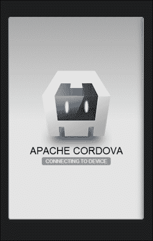

对于一个复杂的应用程序，页面不会这么简单。首先，让我们修改页面以添加一些文本。修改后的代码如下，这是一个简单的静态 HTML 内容：

```js
<body>
    <h1>First Project</h1>
    <h3>What we have learnt?</h3>
    <ul>
      <li>PhoneGap Structure</li>
      <li>CLI Commands</li>
      <li>Developer Tools</li>
      <li>Debugging in Browsers</li>
      <li>Cordova Events</li>
    </ul>
    <script type="text/javascript" src="img/cordova.js"></script>
    <script type="text/javascript">
      document.addEventListener('deviceready', deviceready, false);
      function deviceready() {
        alert("Example Event");
      }
    </script>
</body>
```

如果在 HTML 的`head`部分顶部包含了任何 JavaScript 外部文件，浏览器将停止解析，直到文件下载完成。因此，建议将任何 JavaScript 文件或代码块添加到`body`标签的末尾，以减少等待时间。

现在，大多数现代浏览器支持脚本上的`async`和`defer`属性。这些属性告诉浏览器，在脚本下载的同时，它安全地继续解析：

```js
<script type="text/javascript" src="img/script1.js" async></script>
<script type="text/javascript" src="img/script2.js" defer></script>
```

## *发生了什么？*

我们从默认创建的项目中移除了代码，并添加了我们自己的内容。请注意，我们添加了`deviceready`事件监听器。当应用加载并准备好执行时，该事件将显示一个警告框。`deviceready`事件应该是所有与设备相关的操作的入口点。

当我们构建和模拟示例项目时，我们将在模拟器中看到以下输出：

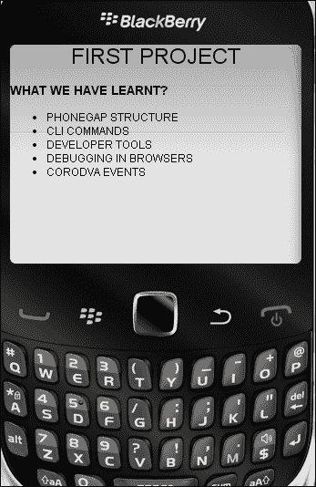

# WebKit 调试 – Chrome、Safari 和 Opera

基于 WebKit 的浏览器支持各种调试工具。例如，当遇到 JavaScript 问题时，你可以启动 Web Inspector 或开发者工具，并开始使用 JavaScript 控制台探索日志和错误。

在 Chrome 中，您可以从自定义菜单访问开发者工具（单击自定义菜单，然后转到 **工具** | **开发者工具**）。自定义菜单位于右上角。当使用 Safari 时，您首先需要通过打开 Safari 的 **偏好设置** 面板并选择菜单栏中的 **显示开发** 菜单复选框来启用开发者工具。然后，您可以通过选择应用程序的 **开发** 菜单中的 **显示 Web 检查器** 来访问检查器。

由于 Web 检查器是 WebKit 代码库的一部分，您可以在 Chrome 和 Safari 中使用相同的快捷键来访问调试工具。

在 Windows 和 Linux 上，按：

+   *Ctrl* + *Shift* + *I* 用于打开开发者工具

+   *Ctrl* + *Shift* + *J* 用于打开开发者工具并将焦点置于控制台

+   *Ctrl* + *Shift* + *C* 用于切换元素检查模式

在 OS X 上，按：

+   ⌥ ⌘ *I*（选项 + 命令 + *I*）打开开发者工具

+   ⌥ ⌘ *J*（选项 + 命令 + *J*）打开开发者工具并将焦点置于控制台

+   ⌥ ⌘ *C*（选项 + 命令 + *C*）用于切换元素检查模式

当访问开发者工具时，您可以通过单击相应的图标在工具之间切换。

**元素** 面板允许您以浏览器渲染网页的方式查看网页。当使用它时，您可以看到原始的 HTML 和 CSS，并探索 **文档对象模型**（**DOM**）。通过单击 **元素** 面板并在页面的源代码中移动，您可以识别 HTML 块，并实时更改 CSS 选择器的值以进行实验和修复可能的渲染问题：

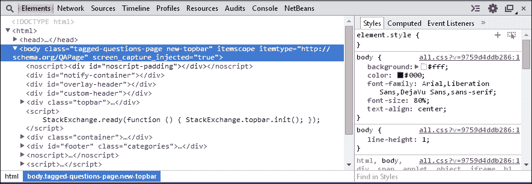

**资源** 面板允许您检查在检查的页面中加载和可用的资源。它允许您与包含框架资源的框架树（HTML、JavaScript、CSS、图像、字体等）交互，HTML5 数据库、本地存储、cookies 和 AppCache。

使用 **网络** 面板，您可以探索网页或应用程序从网络服务器请求的组件，这些请求需要多长时间，以及需要多少带宽。

使用 **资源** 面板，您可以访问页面中加载的所有资源。使用此面板访问 JavaScript，在代码中设置断点，并探索每个错误的堆栈跟踪。为了设置断点，选择您想要设置断点的脚本，然后点击您感兴趣的行号。当调试工具达到断点时，您可以通过探索调用堆栈（即执行到该断点的函数和方法链）和作用域变量来查看代码中的情况，并进入和退出函数：

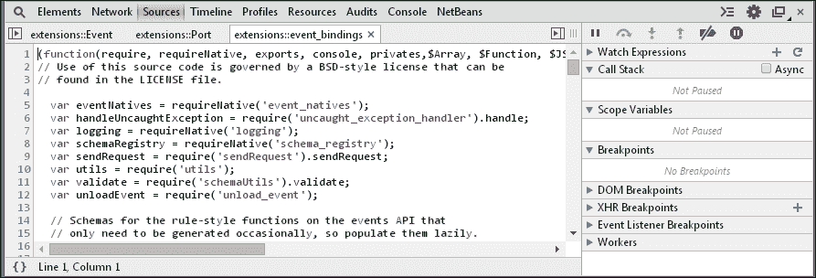

您可以直接在调试器中编辑 JavaScript，并通过使用导航箭头来回切换来实时查看您的更改。如果您希望调试器在每次抛出异常时停止代码执行，请使用面板左下角的**暂停所有**按钮。有关每个功能的详细信息，我们建议您参考[`developer.chrome.com/devtools/docs/javascript-debugging`](https://developer.chrome.com/devtools/docs/javascript-debugging)的官方文档。

**时间线**面板让您可以分析 WebKit 背后的各种活动，例如浏览器处理 DOM 事件、渲染页面布局和处理事件所需的时间。

一旦您按下记录按钮，您就可以开始检查您当前查看的页面中发生的事情。

事件和帧图标（在 Chrome 中可用）允许您访问两种不同的时间线数据视图，第一个是基于时间，第二个是基于帧；您可以通过使用顶部的灰色垂直控件来放大每个视图。

**内存**图标让您可以探索特定网页的内存使用情况；为了在探索过程中更加准确，按下面板底部的垃圾箱图标强制垃圾收集是一个好习惯。垃圾收集是一种自动内存管理形式；收集器试图回收垃圾或浏览器窗口不再使用的对象占用的内存。

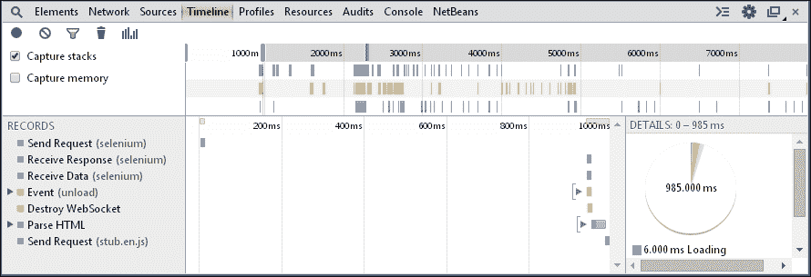

**配置文件**工具帮助您捕获和分析 JavaScript 脚本的性能。例如，您可以了解哪些函数执行时间最长，然后放大可能的瓶颈并确切了解在哪里进行优化。

**审计**面板就像有一个自己的网页优化顾问坐在您身边。此面板可以在页面加载时分析页面，并提供建议和优化以减少页面加载时间并提高感知响应性。

# Gecko 调试 – Firefox

Firefox 基于 Mozilla 基金会和 Mozilla 公司开发的许多应用程序中使用的 Gecko 开源布局引擎。它提供了良好的调试工具，并且发展迅速，包括像 Desktop WebRT 这样的创新项目，它允许您在运行时构建桌面 Web 应用程序，该应用程序提供类似原生的外观和感觉，以及 Windows、OS X 和其他桌面平台上的平台集成 API。

如果您不为 Android 或 iOS 开发应用程序，您可以使用 Firefox 布局引擎，它提供了一些强大的开发和调试工具。让我们快速了解如何使用 Firefox/Firebug 检查和调试您的应用程序；正如您将看到的，WebKit 和 Firefox 中可用的调试工具之间存在几个相似之处。

与 Firefox 集成的 Firebug 将一套强大的开发者工具放在你的指尖，其功能与 WebKit 网页检查器相媲美。为了安装 Firebug 扩展，你必须前往 [`www.getfirebug.com/downloads/`](https://www.getfirebug.com/downloads/) 并安装最新版本。安装后，你可以通过导航到**工具** | **Web 开发者** | **Firebug**来打开扩展。

Firebug 工具栏让你可以访问 HTML 源代码和 CSS 规则，让你可以探索和调试 JavaScript 函数，等等：

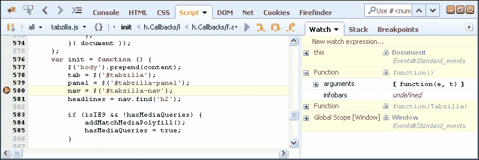

一旦调试器达到断点，你可以：

+   探索你在设置断点时定义的代码块中的变量

+   探索函数/方法调用的堆栈

+   创建监视器以了解变量内容在代码执行过程中的变化情况

Firebug 中的脚本控制台非常出色。你可以在右侧窗口中输入你的代码，然后通过点击面板右下角的**运行**按钮来运行它，并在控制台中查看结果：

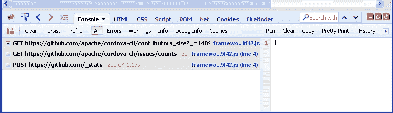

要过滤日志，请使用窗口顶部的**所有**、**错误**、**警告**、**信息**、**调试信息**和**Cookies**选择器。

如前所述，Firefox 有三个出色的原生开发工具：Scratchpad、Inspect 和响应式设计视图。你可以通过导航到**工具** | **Web 开发者**来通过菜单栏访问这些工具。

将 Scratchpad 视为一个文本编辑器；你可以用它来输入和执行 JavaScript。Scratchpad 与控制台的区别在于它看起来像文本编辑器，你可以在执行之前编写所有你想要的代码：

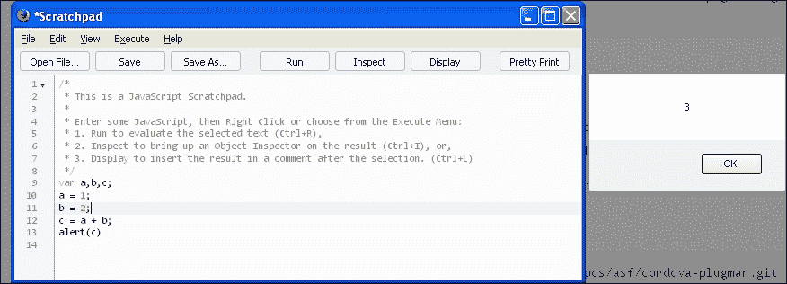

响应式设计视图工具允许你更改分辨率而不需要调整浏览器的大小。你还可以用它来模拟设备旋转：

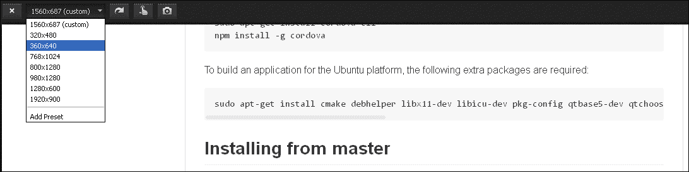

# Internet Explorer

在撰写本文时，Internet Explorer 仍然拥有广泛的安装基础；它也是开发者中最不受欢迎的浏览器。几乎每个开发者都曾在为 IE 优化网页时遇到过严重问题；这是因为 IE 在许多重要领域偏离了网络标准，但情况正在改变，IE 10 的预览在各种测试中都获得了良好的评分。对于开发者来说，Internet Explorer 11 更好。

开发者工具是在 Internet Explorer 8 中引入的，并在 Internet Explorer 9 中通过新功能进行了更新。Internet Explorer 10 的开发者工具增加了 Web Worker 调试和多个脚本源的支持。

你可以通过按 *F12* 或通过从菜单栏导航到**工具** | **开发者工具**来访问开发者工具：

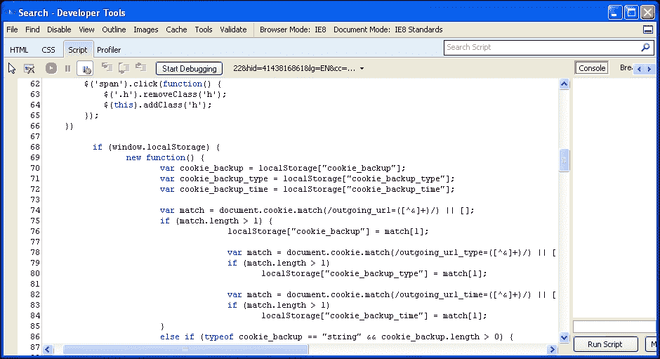

IE 10 开发者工具提供了与 Safari、Chrome 和 Firefox 开发者工具类似的用户界面。

# 调试工作流程

桌面浏览器是混合移动应用开发的强大工具。你可以在桌面浏览器中预览和调试大部分移动开发工作。因为 PhoneGap 利用了开放网络标准（HTML、CSS 和 JavaScript），你可以在桌面浏览器中开始工作，一旦功能完善，就可以转移到原生项目。这样，可以加快我们的开发周期，并有更多时间实现核心功能。你可以使用任何主流桌面浏览器的最新版本，如 Internet Explorer（IE）、Google Chrome、Firefox、Safari 或 Opera，以开始使用 PhoneGap 应用。所有这些浏览器都有用于记录和调试代码的开发者工具。

新开发者往往更喜欢基于 WebKit 的浏览器；在撰写本文时，Chrome 拥有最大的安装基础市场份额，其次是 Firefox 和 Internet Explorer。

### 注意

Chrome 还提供了一种名为**Google Packaged Apps**的技术，用于基于网络标准构建原生应用。更多关于它的信息可在[`developer.chrome.com/apps/about_apps`](https://developer.chrome.com/apps/about_apps)找到。

正如你所见，每个浏览器都提供了不同的调试工具，每个工具都有其优缺点。然而，无论你使用哪种工具，你的调试工作流程都是相同的。

在调查特定问题时，你通常会遵循以下流程：

1.  在调试器的代码视图中找到相关的代码。

1.  在你认为可能发生有趣事情的地方设置断点。

1.  如果是内联脚本，通过在浏览器中重新加载页面再次运行脚本，如果是事件处理器，则通过点击按钮来运行。

1.  等待调试器暂停执行，以便可以逐步执行代码。

1.  调查变量的值。例如，寻找本应包含值但未定义的变量，或者当你期望它们返回`true`时返回`false`。

如果需要，你可以使用控制台来评估代码或更改变量以进行测试。你还可以在实现之前执行复杂的 JavaScript 代码并测试解决方案。

通过学习哪段代码或输入导致了错误条件，并隔离它来识别问题是一种合适的方法。然而，在移动应用中，事情并不总是这么简单。PhoneGap 的优势在于你可以在浏览器等通用环境中开发和调试，但请记住，移动应用还需要在目标设备上进行测试和调试。

虽然这不是一种整洁的调试方式，但你可以使用控制台日志消息进行调试。这些日志消息将在浏览器开发工具的控制台中打印出来。这里提供了一个 JavaScript 代码示例供参考：

```js
console.log("Application running now");
```

对于 PhoneGap/Cordova，还有其他几种调试工具。虽然其中一些是免费服务，但也有一些是付费服务：

1.  **Ripple 模拟器**：[`emulate.phonegap.com/`](http://emulate.phonegap.com/)

1.  **GapDebug**: [`www.genuitec.com/products/gapdebug/`](https://www.genuitec.com/products/gapdebug/)

1.  **jsHybugger**: [`www.jshybugger.com/`](https://www.jshybugger.com/)

1.  **Weinre**: [`people.apache.org/~pmuellr/weinre-docs/latest/`](http://people.apache.org/~pmuellr/weinre-docs/latest/)

1.  **Adobe Edge Inspect**: [`creative.adobe.com/products/inspect`](https://creative.adobe.com/products/inspect)

1.  **Chrome**: [`developer.chrome.com/devtools/docs/remote-debugging`](https://developer.chrome.com/devtools/docs/remote-debugging)

# 构建和部署

一旦你的开发工作完成，你可能想在真实的移动设备上测试应用程序。每个移动平台都会有不同类型的二进制格式用于应用程序。例如，Android 应用程序文件将具有`.apk`扩展名。同样，每个平台都会有不同格式的应用程序。

要从源代码为所有平台创建二进制文件，你需要本地构建应用程序或使用云服务。

如果你是在本地构建应用程序，你需要运行命令行界面，并且所需的平台 SDK 应该安装在本机上。CLI 支持以下操作系统上的组合：

| Windows | Linux | Mac |
| --- | --- | --- |
| Amazon Fire OSAndroidBlackBerry 10Windows Phone 7Windows Phone 8Windows 8Firefox OS | Amazon Fire OSAndroidBlackBerry 10Firefox OS | iOS（仅在 Mac 上） |

此表清楚地表明，你无法在 Windows 机器上构建 iOS 应用程序或在 Mac 机器上构建 Windows 8 应用程序。你需要一台合适的机器，并在机器上安装所需的 SDK。

假设你已经安装并配置了所有所需的 SDK，要为每个平台构建应用程序，你可以使用 CLI 的**build**工具。

运行以下命令以构建项目中添加的所有平台的工程。如果你使用`platform add`命令向项目中添加了多个平台，构建将针对所有平台进行：

```js
C:\example1> phonegap build

```

如果你只想为特定平台构建应用程序，比如 Android 或 iOS，你可以使用以下命令单独针对它们：

```js
C:\example1> phonegap build android
C:\example1> phonegap build ios

```

`build`命令是准备和编译项目的快捷方式。你还可以按以下步骤构建项目：以下命令集相当于`build`命令：

```js
C:\example1> phonegap prepare android
C:\example1> phonegap compile android

```

一旦构建过程完成，特定平台的 app 将可在项目的`platforms`子目录中找到。

在了解了手动构建应用程序的方法后，现在让我们来了解一下 PhoneGap Build。如果你想要从源代码为所有平台创建二进制文件，你需要在机器上安装单个源代码的各个 SDK，这在实际操作中是不可能的。这就是我们觉得 PhoneGap Build 过程很方便的原因。PhoneGap Build 是一个基于单一源代码为所有移动平台创建二进制文件的在线服务。

它会提取源代码，并为所需的每个平台创建应用文件。这就像上传你的 Cordova/PhoneGap 项目，然后云服务完成剩余的工作。PhoneGap Build 流程的整体功能在以下图表中提供，该图表可在 [`build.phonegap.com`](https://build.phonegap.com) 获取：

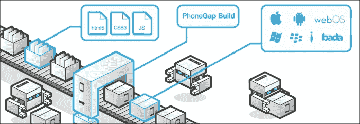

要使用 PhoneGap Build，你必须遵循以下步骤：

1.  完成你的 PhoneGap/Cordova 项目，并确保你的应用中包含了设计中的所有功能。

1.  PhoneGap Build 只需要你的项目 `assets` 目录的内容（HTML、CSS、JavaScript 和图片）。

1.  如果你包含了任何 `phonegap.js` 或 `cordova.js` 文件在你的资源中，请移除该文件，因为 PhoneGap Build 流程将自动注入所需的文件。

1.  你可以将项目上传到 PhoneGap Build 流程，并见证魔法发生。

你可以轻松地通过单次点击下载所有平台的应用构建版本：

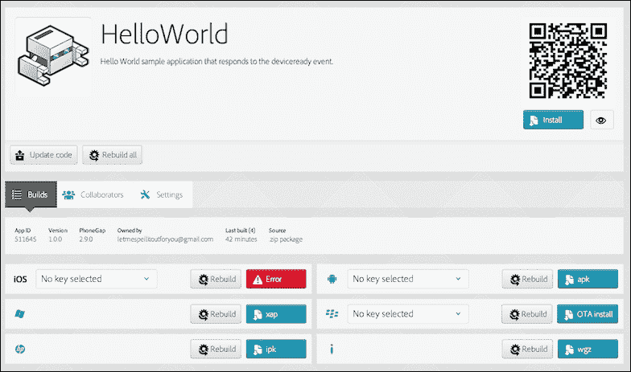

关于 PhoneGap Build 流程的更多详细信息可以在 [`docs.build.phonegap.com/en_US/`](http://docs.build.phonegap.com/en_US/) 获取。

# 摘要

在概述了几个工具和一些调试技术之后，本章为你准备进入下一步，即使用 Apache Cordova 及其 PhoneGap 发行版创建和构建多平台应用。你还学习了各种命令行工具和 Cordova 事件的使用。在下一章中，你将了解各种移动框架和模板，以开始你的移动开发。
