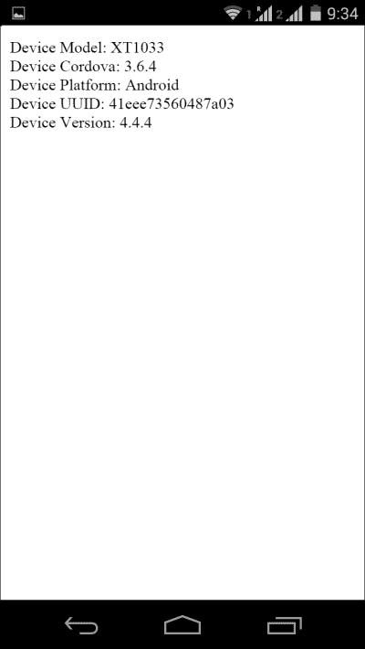

# 第四章：使用插件

*使用 Web 标准和 JavaScript 构建原生应用可能有其局限性，因为使用原生代码开发的应用可以深度与操作系统交互。但处理 PhoneGap 应用时，这仅部分正确，因为其架构允许开发者通过自定义插件扩展框架功能。*

在本章中，你将：

+   了解 PhoneGap 插件是什么以及如何在项目中安装插件

+   了解如何列出所有已安装的插件并移除不需要的插件

+   了解如何使用 Plugman 管理项目插件及其依赖关系

+   发现如何在项目中实现设备 API

# 插件简介

当你开发和部署一个新的简单混合应用时，该应用可能不会执行任何高级操作。我们知道混合应用是使用标准 Web 技术（如 HTML、CSS 和 JavaScript）开发的。我们需要某种机制让应用与各种设备级功能交互。为了实现这一点，我们使用 PhoneGap/Cordova API 的插件。自 3.0 版本以来，所有 PhoneGap API 都已转换为插件，这意味着对插件有深入理解现在对 PhoneGap 开发者来说更为重要。

PhoneGap 插件是 WebView 和应用程序运行的本地平台之间的桥梁。

为了能够快速有效地使用 PhoneGap 插件，了解框架的工作方式非常重要。一个 PhoneGap 应用由三个主要层组成。具体如下：

+   用户界面，使用 HTML、CSS 和 JavaScript 开发

+   业务逻辑，使用 JavaScript 开发

+   PhoneGap 框架，通过 JavaScript API 暴露给业务逻辑的本地代码

用户界面和业务逻辑是应用的主要源代码，以及大多数开发者集中开发努力的部分。插件严格集成在框架中，并通过 JavaScript 暴露给用户。你可以想象插件是框架的附加组件，其工作方式类似于所有 PhoneGap API。

## 插件入门

使用插件，您可以扩展 PhoneGap 框架以满足您应用程序的需求。这意味着没有令人信服的限制，但也意味着您应用程序的源代码必须为不同的平台维护。在[`plugins.cordova.io`](http://plugins.cordova.io)列出了所有平台的几个插件。为了确保现有的插件符合您的需求，您必须检查与您项目中使用的 PhoneGap 版本的兼容性，并最终更新源代码以符合规范。PhoneGap 的一个优势是其持续发布模型，因为这加快了新功能和错误修复的发布。但这也意味着插件应该得到维护，以满足框架的弃用策略。有关即将弃用的更新信息，请参考在线 Wiki，链接为[`wiki.apache.org/cordova/DeprecationPolicy`](http://wiki.apache.org/cordova/DeprecationPolicy)。

为了使用自定义插件中实现的功能，您必须在项目中安装它。在 PhoneGap 项目中手动管理插件并不是一件容易的事情；幸运的是，有一个命令行工具可以使您的生活更加轻松。

### 安装插件

您可以使用 Cordova 的 CLI 工具将插件安装到项目中。以下命令将插件添加到项目中，并在必要时对清单文件进行必要的更改：

```js
$ cordova plugin add PLUGIN.ID

```

在这里，`PLUGIN.ID`是插件在插件存储库中注册的 ID。

以下列表总结了目前可用的 API 以及将它们添加到 PhoneGap 项目的命令。如果您想删除插件，请使用`$ cordova plugin remove`命令代替。

+   基本设备信息：

    +   **设备 API**：这获取与设备相关的基本信息

        ```js
        $ cordova plugin add cordova-plugin-device

        ```

    +   **状态栏 API**：这自定义状态栏背景

        ```js
        $ cordova plugin add cordova-plugin-statusbar

        ```

+   网络和电池状态：

    +   **网络 API**：这获取蜂窝网络信息

        ```js
        $ cordova plugin add cordova-plugin-network-information 

        ```

    +   **电池 API**：这监控设备电池的状态

        ```js
        $ cordova plugin add cordova-plugin-battery-status

        ```

+   加速度计、指南针和地理位置：

    +   **设备运动（加速度计）API**：这处理设备的运动传感器

        ```js
        $ cordova plugin add cordova-plugin-device-motion

        ```

    +   **设备方向 API**：这获取设备方向

        ```js
        $ cordova plugin add cordova-plugin-device-orientation

        ```

    +   **地理位置 API**：这使得应用程序具有位置感知能力

        ```js
        $ cordova plugin add cordova-plugin-geolocation

        ```

+   相机、媒体捕获和媒体播放：

    +   **相机 API**：这使用设备的相机捕获照片

        ```js
        $ cordova plugin add cordova-plugin-camera

        ```

    +   **捕获 API**：这使用设备捕获所有媒体文件

        ```js
        $ cordova plugin add cordova-plugin-media-capture

        ```

    +   **媒体 API**：这记录和播放音频文件

        ```js
        $ cordova plugin add cordova-plugin-media

        ```

+   访问设备或网络上的文件：

    +   **文件 API**：这访问设备的文件系统

        ```js
        $ cordova plugin add cordova-plugin-file

        ```

    +   **文件传输 API**：这使用 API 上传或下载文件

        ```js
        $ cordova plugin add cordova-plugin-file-transfer

        ```

+   通过对话框或振动发送通知：

    +   **对话框 API**：使用此 API，通知和警报变得简单

        ```js
        $ cordova plugin add 
        cordova-plugin-dialogs

        ```

    +   **振动 API**：这会使设备振动

        ```js
        $ cordova plugin add cordova-plugin-vibration

        ```

+   联系人：

    +   **联系人 API**：这提供了对设备联系人列表的完全访问权限

        ```js
        $ cordova plugin add cordova-plugin-contacts

        ```

+   全球化：

    +   **全球化 API**：这为应用程序添加了地区支持

        ```js
        $ cordova plugin add cordova-plugin-globalization

        ```

+   启动画面：

    +   **启动画面 API**：此功能显示和隐藏启动画面

        ```js
        $ cordova plugin add cordova-plugin-splashscreen

        ```

+   应用程序内浏览器：

    +   **InApp Browser API**：此功能将在应用程序浏览器中打开任何 URL

        ```js
        $ cordova plugin add cordova-plugin-inappbrowser

        ```

虽然使用插件 ID 添加插件是最简单的方法，但还有其他高级选项。这些选项帮助我们自定义插件安装。我们不仅可以使用插件 ID，还可以使用此处所示的 GitHub 仓库 URL：

```js
$ cordova plugin add URL_TO_THE_GITHUB_REPO

```

在这里，`URL_TO_THE_GITHUB_REPO` 是插件（即 API）仓库的路径。

例如，你可以用以下方式安装 Device API 插件：

```js
$ cordova plugin add https://github.com/apache/cordova-plugin-device.git

```

或者，你也可以用这种方式安装 Device API 插件：

```js
$ cordova plugin add cordova-plugin-device

```

如果你使用的是 PhoneGap CLI 而不是 Cordova CLI，你可以使用这里提供的以下两个命令中的任何一个。以下示例命令将 Camera 插件安装到你的项目中。

```js
$ phonegap plugin add https://github.com/apache/cordova-plugin-camera.git

```

或者，你可以使用以下命令：

```js
$ phonegap plugin add cordova-plugin-camera

```

如果你想要安装特定版本的插件，你可以指定它并附带插件 ID：

```js
$ cordova plugin add cordova-plugin-camera@0.3.6

```

如果你想要从本地目录源安装插件，你可以使用以下格式，其中你可以指定源路径而不是 GIT 仓库 URL：

```js
cordova plugin add /path/to/directory

```

PhoneGap 将会在这个目录及其所有子目录中查找插件。

#### 列出已安装的插件

要列出应用程序项目中安装的所有插件，你可以使用 `list` 命令。它有三个变体，所有这些都会输出相同的内容：

```js
$ cordova plugin
$ cordova plugin list
$ cordova plugin ls

```

前面的三个命令都会列出安装的插件，包括插件 ID、版本和完整名称。

### 移除插件

有时候你可能需要从你的应用程序中移除不再需要的插件。与添加插件一样，移除插件也很简单。要移除插件，请通过列出中出现的相同插件 ID 来引用它。例如，以下是如何从项目中移除对 Camera API 的支持的示例：

```js
$ cordova plugin rm cordova-plugin-camera

```

或者，你可以使用这个命令来做同样的事情：

```js
$ cordova plugin remove cordova-plugin-camera

```

如果你想要一次性移除多个插件，你可以指定多个参数：

```js
$ cordova plugin rm cordova-plugin-console cordova-plugin-camera

```

## 使用 Plugman 使用插件

插件是通过一个名为 **Plugman** 的工具安装和移除的；从开发者的角度来看，这只是在 `cordova-cli` 工具中可用的一个命令。Apache Cordova Plugman 项目 [`github.com/apache/cordova-plugman`](http://github.com/apache/cordova-plugman) 是一个开源的命令行工具，作为 npm 模块分发，以简化插件的安装和卸载。Plugman 支持 Android、Amazon FireOS、BlackBerry 10、Windows Phone 8 和 iOS 平台。安装过程与其他任何 npm 模块相同；记住，如果你全局安装它（使用 `-g` 选项），你必须以 root 身份运行命令：

```js
$ npm install plugman -g

```

安装完成后，你可以使用以下命令从命令行工具获取插件源代码，安装和卸载插件，以及将插件打包以与你的应用程序一起分发（Plugman 是 `cordova-cli` 工具的一部分；如果你已经在使用它，则无需安装）：

+   `--fetch` 选项可以从目录、Git 仓库或按名称检索插件，并将其放入指定的插件目录：

    ```js
    $ plugman --fetch https://github.com/phonegap-build/GAPlugin.git --plugins_dir PATH_TO_YOUR_PLUGINS_DIR

    ```

+   `--install` 选项在 PhoneGap 项目中为特定目标平台安装插件。插件可以通过名称或 URL 安装：

    ```js
    $ plugman --platform PLATFORM --project PLATFORM_PROJECT_PATH --plugin https://github.com/phonegap-build/GAPlugin.git

    ```

    ### 小贴士

    `–-plugin` 参数可以是插件的名称或 Git 仓库的路径。默认情况下，Plugman 会启动 `install` 命令，并在 `plugins` 目录中不存在插件时获取插件。因此，`--install` 参数是可选的。

+   `--uninstall` 选项通过名称卸载之前安装的插件：

    ```js
    $ plugman --uninstall --platform PLATFORM --project PLATFORM_PROJECT_PATH --plugin PLUGIN_NAME

    ```

+   `--list` 选项列出之前使用 Plugman 获取的所有插件。

+   `--prepare` 选项设置插件，正确注入所需的 JavaScript 文件并定义适当的权限。当你安装或卸载插件时，`--prepare` 命令会隐式调用。

关键字 `PLATFORM` 可以有这些值之一：`ios`、`android`、`amazon-fireos`、`blackberry10` 或 `wp8`。此外，请注意，Plugman 是一个低级 CLI，因此你只能一次添加一个平台的插件。如果有多个目标平台，你需要使用 Plugman CLI 为每个平台安装插件。然而，如果你使用 Cordova CLI 安装插件，它将一次性为所有目标平台安装插件。

为了将插件添加到目标平台，你可以运行 `compile` 命令或 `prepare` 命令。

当使用 Plugman 作为独立工具时，你可以在安装时使用 `--variable` 参数指定变量。这些变量对于需要 API 密钥或其他自定义、用户定义参数的插件是必要的。

要获取 Plugman 命令及其语法的完整列表，你可以使用全局的 `help` 命令，如下所示：

```js
plugman - help

```

自从 PhoneGap 3.0 版本发布以来，所有 API 都可以作为外部插件使用；你将在本书的后面部分了解更多关于插件的内容。目前，你需要知道的是，将每个单独的 API 作为插件处理，可以使你根据项目需求组合出适合的 PhoneGap 版本。

# 探索 Device API

由于我们已经介绍了在 Cordova/PhoneGap 项目中使用插件的基本知识，我们现在将看看如何使用 Device 插件的示例。

设备 API 是 PhoneGap/Cordova 中最简单的 API 之一，它为你提供了有关其运行的设备的详细信息。这是当你刚开始学习插件时可以尝试的一个很好的 API。使用该 API，你可以获取以下设备属性：

+   设备平台

+   设备唯一 ID

+   设备版本号

+   设备型号名称

你可以使用这些属性为用户提供设备特定的功能。

# 行动时间 - 访问 Device API

你已经在 第二章 中使用了 `deviceready` 事件来处理我们应用的引导。使用设备 API 获取事件触发后你正在运行的设备类型信息。

1.  打开命令行工具，使用你之前安装的 Cordova 命令行工具创建一个新的 Cordova 项目：

    ```js
    $ cordova create DeviceApi

    ```

    这将在你的当前工作目录中创建一个名为 `DeviceApi` 的新目录。

1.  移动到刚刚创建的目录：

    ```js
    $ cd DeviceAPI

    ```

1.  在设备 API 上添加你想要测试的平台。例如，我们添加了 Android 平台：

    ```js
    $ cordova platform add android

    ```

1.  安装设备 API 插件。你也可以使用这里所示的最短方式安装插件，而不是使用整个 GIT 仓库 URL：

    ```js
    $ cordova plugin add cordova-plugin-device

    ```

1.  在你刚刚创建的项目文件夹中的 `www` 文件夹内，打开 `index.html` 文件，并添加一个带有 `id` 的 `div` 元素以渲染使用 PhoneGap API 收集的设备信息：

    ```js
    <div id='deviceInfo'>Loading device properties...</div>

    ```

1.  定义一个监听 `deviceready` 事件的监听器，以便访问所有支持的 API 属性：

    ```js
    document.addEventListener("deviceready", onDeviceReady, false);

    ```

1.  在 HTML 页面上显示设备信息：

    ```js
    function onDeviceReady() {
      var element = document.getElementById('deviceInfo');

      element.innerHTML = 'Device Model: '  + device.model + '<br />' + 
                          'Device Cordova: '  + device.cordova  + '<br />' + 
                          'Device Platform: '  + device.platform + '<br />' + 
                          'Device UUID: '     + device.uuid +    '<br />' + 
                          'Device Version: '  + device.version  + '<br />';
    }
    ```

1.  使用 Cordova 命令行工具构建项目：

    ```js
    $ cordova build

    ```

1.  使用以下命令在模拟器中查看应用程序。启动模拟器可能需要一些时间：

    ```js
    $ cordova run

    ```

整个代码已经在这里提供供你参考：

```js
<!DOCTYPE html>
<html>
<head>
<meta http-equiv="Content-Type" content="text/html; charset=UTF-8" />
<meta name="format-detection" content="telephone=no" />
<meta name="viewport" content="user-scalable=no, initial-scale=1, maximum-scale=1, minimum-scale=1, width=device-width;" />
<title>Hello Cordova</title>
</head>
<body>
<div id='deviceInfo'>Loading device properties...</div>

<script type="text/javascript" src="img/cordova.js"></script>
<script type="text/javascript">
        document.addEventListener('deviceready', onDeviceReady, false);

        function onDeviceReady() {
            var element = document.getElementById('deviceInfo');

            element.innerHTML = 'Device Model: ' +  device.model  + 
              '<br />'  +  'Device Cordova: '  +  device.cordova  + 
              '<br />'  +  'Device Platform: '  +  device.platform  + 
              '<br />'  +  'Device UUID: '     +  device.uuid  +    
              '<br />'  + 'Device Version: '  + device.version  +  '<br />';

        }
        </script>
</body>
</html>
```

这就是实际设备上的输出将看起来是什么样子。你实际设备上看到的值可能会根据你的设备而有所不同：



## *发生了什么？*

你处理了 `deviceready` 事件，使用 PhoneGap API 访问了相关的设备信息。你刚刚使用的设备对象描述了设备的硬件和软件：

+   `device.platform`: 这将获取操作系统名称

+   `device.uuid`: 这将获取通用唯一标识符

+   `device.version`: 这将获取操作系统版本

+   `device.cordova`: 这将获取设备上运行的 Cordova 版本

+   `device.model`: 这将获取型号名称

### 注意

由于 PhoneGap 的滚动发布模型，强烈建议你始终参考 GitHub 仓库 [`github.com/apache/cordova-plugin-device`](https://github.com/apache/cordova-plugin-device)，以检查特定的设备 API 是否将要被弃用。

# 自定义插件

我们看到了可用于 Cordova/PhoneGap 平台的基本插件列表以及如何在我们的应用程序中使用它们。开发者不仅限于使用这些小插件集。有数百个插件可用，并且每天都有许多新插件被添加。以下是一些最常用的第三方插件。在选择插件时，你应该注意它们对各种平台的支持情况。

+   **Social Sharing**: 这为您的应用程序添加社交分享功能（[`plugreg.com/plugin/EddyVerbruggen/SocialSharing-PhoneGap-Plugin`](http://plugreg.com/plugin/EddyVerbruggen/SocialSharing-PhoneGap-Plugin)）

+   **Push Notifications**: 这可以向您的用户发送定制的推送通知（[`plugreg.com/plugin/phonegap-build/PushPlugin`](http://plugreg.com/plugin/phonegap-build/PushPlugin)）

+   **Facebook Login**: 这允许用户使用 Facebook 登录到您的应用程序（[`plugreg.com/plugin/Wizcorp/phonegap-facebook-plugin`](http://plugreg.com/plugin/Wizcorp/phonegap-facebook-plugin)）

+   **ActionSheet**: 这可以在您的应用程序中显示出色的操作菜单（[`plugreg.com/plugin/EddyVerbruggen/cordova-plugin-actionsheet`](http://plugreg.com/plugin/EddyVerbruggen/cordova-plugin-actionsheet)）

+   **AppRate**: 这允许您的用户在 Google Play Store、Apple App Store 或 Windows Store 中为您的应用程序添加反馈和评分（[`plugreg.com/plugin/pushandplay/cordova-plugin-apprate`](http://plugreg.com/plugin/pushandplay/cordova-plugin-apprate)）

您可以从它们的 GitHub URL 或使用它们的插件 ID（如果已在 Cordova 插件存储库中注册）安装这些插件。以下是安装 Social Sharing 插件的两种方法。您可以使用以下命令：

```js
$ cordova plugin add https://github.com/EddyVerbruggen/SocialSharing-PhoneGap-Plugin.git

```

您也可以使用以下命令：

```js
$ cordova plugin add nl.x-services.plugins.socialsharing

```

您可以参考以下完整插件列表：[`plugins.cordova.io`](http://plugins.cordova.io) 或 [`plugreg.com`](http://plugreg.com)。

# 摘要

在本章中，您学习了有关插件以及如何在应用程序中列出、添加和删除它们的内容。使用这些技术，我们看到了如何在项目中安装 Device API 并获取设备详情。在接下来的章节中，我们将看到如何使用 Storage API 访问本地设备存储，以及如何使用 File API 列出/读取/写入文件。
