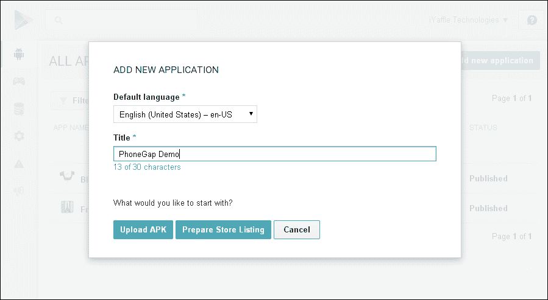
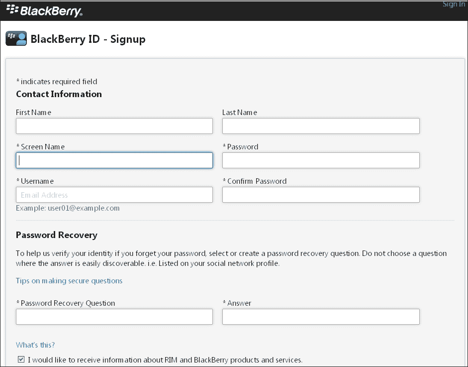

# 附录 B. 发布您的应用

PhoneGap 最好的特性之一是它允许您使用相同的代码库创建跨平台应用。这意味着您可以重用大部分代码，但您仍然需要为每个目标平台构建应用。您可以通过为想要支持的每个平台配置开发环境来实现这一点，或者您可以使用在线服务，如 PhoneGap Build 服务([`build.phonegap.com`](http://build.phonegap.com))或 Icenium([`www.icenium.com/`](http://www.icenium.com/))。两者都是基于云的服务；主要区别在于 PhoneGap Build 服务支持所有平台，而 Icenium 只支持 Android 和 iOS 平台，但确实提供了一个非常不错的在线编辑器。一旦构建完成，您必须为每个目标平台遵循不同的工作流程。

### 注意

此外，如果您在使用 PhoneGap 进行跨平台开发时，在开发阶段和准备构建时为每个平台使用测试设备总是一个好习惯。

# 在 Google Play 上发布

**Google Play**，之前称为**Android Market**，是 Android 应用的数字应用分发平台。为了在 Google Play 上发布应用，您必须使用您的 Google 账户登录并遵循[`play.google.com/apps/publish`](https://play.google.com/apps/publish)中概述的步骤。在注册时，您需要在添加开发者详细信息（即姓名、电话号码、电子邮件等）之前支付一次性的费用 25 美元。一旦完成注册流程，您就可以将您的应用添加到开发者控制台。

对于每个应用，您可以定义您想要分发的国家，定义您想要针对的运营商，指定它是否是免费应用（如果您想要销售应用，您必须提供一个有效的 Google Wallet 商户账户），设置 alpha 和 beta 测试组以及分阶段推出等。为了吸引新用户下载和安装应用，提供详细的信息、图标、截图等非常重要。

在[`support.google.com/googleplay/androiddeveloper/answer/1078870`](https://support.google.com/googleplay/androiddeveloper/answer/1078870)可获得的 Android 在线指南是了解所需图形资源的地方。

此外，您的应用大小必须小于 50 MB，并使用[`developer.android.com/tools/publishing/app-signing.html`](http://developer.android.com/tools/publishing/app-signing.html)中描述的 keystore 工具进行签名。对于需要超过 50 MB 的应用，请参阅[`developer.android.com/google/play/expansion-files.html`](http://developer.android.com/google/play/expansion-files.html)中的 APK 扩展详情。

### 注意

上传后，您的应用将在 60 分钟或更短的时间内可在 Google Play 市场提供。

# 在 Blackberry World 上发布

**BlackBerry World**（之前称为**BlackBerry App World**）是 BlackBerry 提供的一个应用程序分发服务，允许用户浏览、下载和更新第三方应用程序。为了在 Blackberry World 市场上发布应用程序，您需要拥有一个 BlackBerry 开发者账户（您可以在[`developer.blackberry.com/`](https://developer.blackberry.com/)免费创建）。您还需要申请成为供应商，并提供您的 BlackBerry ID 信息（完成申请需要 PayPal 账户），您可以在[`appworld.blackberry.com/isvportal/home.do`](https://appworld.blackberry.com/isvportal/home.do)进行操作。

在您作为供应商提交应用程序后，您将收到一封确认电子邮件，要求您提供官方文件以验证您的公司信息，或者如果您作为个人向供应商门户申请，则需要提供官方政府发行的身份证件（正反面）的复印件。

### 注意

验证过程可能需要长达两天，因此在计划特定日期发布时，您必须仔细考虑这一点。

当您的账户得到确认后，您可以添加一个应用程序（即产品），提供应用程序的名称、描述、标志、截图以及关于应用程序的任何其他所需详细信息。有关要求的详细信息，请参阅 BlackBerry World 应用程序商店中的在线信息，网址为[`developer.blackberry.com/devzone/blackberryworld/preparing_your_app_for_blackberry_world.html`](https://developer.blackberry.com/devzone/blackberryworld/preparing_your_app_for_blackberry_world.html)。

将应用程序发布到 Blackberry World 还涉及一个签名过程。此过程假设您已经下载并安装了位于[`developer.blackberry.com/html5/downloads/`](https://developer.blackberry.com/html5/downloads/)的 BlackBerry 10 WebWorks SDK。在您能够对 BlackBerry 10 应用程序进行签名之前，您必须完成位于[`www.blackberry.com/SignedKeys`](https://www.blackberry.com/SignedKeys)的网页表单。当您的应用程序被接受时，您将通过电子邮件收到两个`.csj`注册文件。每个文件都附有关于文件用途的信息，分别用于生成调试令牌和为市场签名应用程序。为了注册到 RIM 签名权威机构，您必须从您的命令行工具运行位于 BlackBerry 10 WebWorks SDK 安装文件夹中的`\dependencies\tools\bin`文件夹中的`.bar`文件。此工具创建以下用于数字签名的文件：`author.p12`、`barsigner.csk`和`barsigner.db`。

在应用命名方面要非常小心；以品牌/公司/产品开头的应用名称意味着存在关联，并且它是一个授权或官方应用程序。如果您将您的应用命名为 YouTube Player，它肯定会遭到拒绝（相反，您可以将其命名为 Player for YouTube）。

# 在苹果应用商店发布

苹果应用商店是苹果公司维护的 iOS 应用数字分发平台。用户可以在应用商店中浏览并直接将应用程序安装到 iOS 设备上。尽管苹果希望应用商店成为全球产品，但实际上其市场受到国家边界的限制。换句话说，可能存在与应用商店数量一样多的不同国家应用商店。要通过苹果应用商店发布应用程序，您需要拥有苹果开发者账户([`developer.apple.com/programs/register`](http://developer.apple.com/programs/register))并成为 iOS 开发者计划([`developer.apple.com/programs/ios/`](http://developer.apple.com/programs/ios/);年费为 99 美元)的成员。第一步是在开发者门户中注册应用 ID，然后您必须创建开发和分发证书。

然后，您需要设置分发证书。为此，您首先需要从您的计算机生成证书请求，并将其上传到开发者门户。在 Mac 上，您应该通过打开**实用工具**中可用的**钥匙串访问**应用程序，然后转到**钥匙串访问** | **证书助手** | **从证书颁发机构请求证书**来完成此操作。输入您的电子邮件地址和姓名，并选择**请求保存到磁盘**以将`CertificateSigningRequest.certSigningRequest`文件保存到您的桌面。转到开发者门户，上传证书请求，并完成生成分发证书所需的步骤。

当证书准备就绪时，您可以通过选择要提交的应用和要使用的证书来创建一个新的分发配置文件。下载文件，然后在 Xcode 中选择**窗口** | **组织者**，点击**设备**，选择**配置文件**，并将具有`.mobileprovision`扩展名的配置文件拖到组织者中。接下来，打开构建设置面板并设置代码签名身份；这样，当您创建存档时，应用程序就会被代码签名，您可以使用 Xcode 完成发布程序。在提交应用程序时，您还必须提供描述、多个截图、图标和其他信息。有关详细信息，请参阅在线文档[`developer.apple.com/library/ios/#documentation/IDEs/Conceptual/AppDistributionGuide/Introduction/Introduction.html`](https://developer.apple.com/library/ios/#documentation/IDEs/Conceptual/AppDistributionGuide/Introduction/Introduction.html)。

### 注意

验证过程因当前审查中的提交数量而异，但通常需要超过两天。您可以在[`reviewtimes.shinydevelopment.com/`](http://reviewtimes.shinydevelopment.com/)找到 App Store 的预估审查时间。

将您应用程序的简单版本作为首次发布可以帮助稍微加快审批过程。初始应用程序审批过程耗时最长；一旦批准，未来的更新就更容易完成。因此，将高级功能留到应用程序的后续版本中。

访问[`www.raywenderlich.com/8003/how-to-submit-your-app-to-apple-from-no-account-to-app-store-part-1`](http://www.raywenderlich.com/8003/how-to-submit-your-app-to-apple-from-no-account-to-app-store-part-1)，获取将应用程序发布到 Apple App Store 的详细教程。

# 在 Windows Phone Store 上发布

**Windows Phone Store**（以前称为**Windows Phone Marketplace**）是一个数字发行平台，允许用户浏览和安装由第三方开发的应用程序。用户界面以非常“Metro UI”的方式呈现，使用全景视图，用户可以浏览类别和标题，查看特色项目，并通过评分、评论、截图和定价信息获取详细信息。

要在 Windows Phone Dev Center 提交和管理应用程序，您首先必须使用 Microsoft 账户（以前称为 Windows Live ID）注册并成为会员。在注册时，您将被要求支付每年 99 美元的开发中心订阅费以及任何适用的税费。作为交换，您将能够向 Windows Phone Store 提交无限数量的付费应用程序（您也可以提交最多 100 个免费应用程序）。发布过程简单直接：您必须提供应用程序详细信息（名称、描述、截图等），然后提交与 Visual Studio 打包的 XAP 文件。在您可以将应用程序上传到商店之前，您必须打包和准备应用程序；打包过程从您基于模板创建 Windows Store 项目或项目时开始（有关打包过程的完整概述，请参阅[`msdn.microsoft.com/en-us/library/windows/apps/br230260.aspx`](http://msdn.microsoft.com/en-us/library/windows/apps/br230260.aspx)上的在线文档）。

### 注意

验证过程相当快，但如果您作为公司注册，您需要几天时间来完成注册过程。

为了缩短审查时间，您可以使用 Windows Phone SDK 中提供的**Windows 应用程序认证工具包**（**WACK**）在本地筛选您的应用程序。它通过在提交到 Windows Store 之前，为您提供一种方式来本地筛选应用程序中的问题，从而减少了审批周期。

# 摘要

在本附录中，你学习了如何在不同应用商店发布你的应用以及常见问题。很明显，苹果应用商店是需要最复杂工作流程的，但它也吸引了最多的开发者。你可以通过自己或通过如 PhoneGap Build 提供的服务支持，轻松管理所有不同市场的发布。
