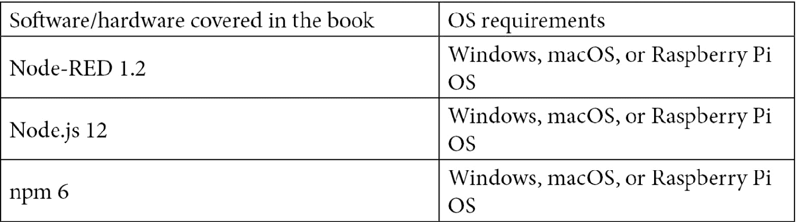

# 前言

Node-RED 是由 Node.js 制作的基于流的编程工具。这个工具主要用于连接物联网设备和软件应用程序。然而，它不仅可以涵盖物联网，还可以涵盖标准的 Web 应用程序。

Node-RED 正在扩展为一个无代码/低代码编程工具。本书涵盖了如何使用它的基础知识，包括从 1.2 版本发布的新功能，以及高级教程。

# 这本书适合谁

这本书最适合那些第一次学习无代码/低代码编程工具的软件编程人员。Node-RED 是一个基于流的编程工具，这个工具可以轻松构建任何软件应用程序的 Web 应用程序，如物联网数据处理，标准 Web 应用程序，Web API 等。因此，这本书将帮助 Web 应用程序开发人员和物联网工程师。

# 本书涵盖的内容

第一章《介绍 Node-RED 和基于流的编程》教会我们什么是 Node-RED。内容还涉及基于流的编程，解释了为什么开发了 Node-RED 以及它的用途。了解这个新工具 Node-RED 有助于改善我们的编程经验。

第二章《设置开发环境》涵盖了通过安装 Node-RED 设置开发环境。Node-RED 可以安装在 Node.js 可以运行的任何操作系统上，如 Windows，macOS，Rasberry Pi OS 等。我们可以通过命令行或使用安装程序在每个环境中安装 Node-RED。本章涵盖了特定操作系统的重要注意事项。

第三章《通过创建基本流了解 Node-RED 特性》教会我们关于 Node-RED 的基本用法。在 Node-RED 中，各种功能与称为节点的部分一起使用。在 Node-RED 中，我们使用称为流的概念创建应用程序，就像工作流一样。我们将通过组合基本节点创建一个示例流。

第四章《学习主要节点》教会我们如何利用更多的节点。我们不仅将了解 Node-RED 默认提供的节点，还将学习如何获取社区发布的各种节点以及如何使用它们。

第五章《在本地实现 Node-RED》教会我们在本地环境，即我们的桌面环境中利用 Node-RED 的最佳实践。由于 Node-RED 是基于 Node.js 的工具，它擅长构建服务器端应用程序。然而，服务器不仅仅存在于网络之外。通过在边缘设备（如树莓派）的本地环境中使用 Node-RED 的虚拟运行时，我们可以更方便地使用它。

第六章《在云中实现 Node-RED》教会我们在云平台上利用 Node-RED 的最佳实践。由于 Node-RED 是基于 Node.js 的工具，它擅长构建服务器端应用程序。通过在任何云平台上使用 Node-RED，我们可以更方便地使用它，因此我们将在 IBM Cloud 上使用 Node-RED 制作流程作为云平台的一个用例。

第七章《从 Node-RED 调用 Web API》教会我们如何利用 Node-RED 中的 Web API。为了最大限度地提高 Web 应用程序的吸引力，与各种 Web API 链接是必不可少的。在 Node-RED 中，调用 Web API 与常规 Node.js 应用程序中调用 Web API 之间的区别，可以帮助我们充分利用 Node-RED。

[*第八章*]（B16353_08_ePub_AM.xhtml#_idTextAnchor102），*使用 Git 的项目功能*，教我们如何在 Node-RED 中使用源代码版本控制工具。在 Node-RED 中，项目功能在 1.x 版本及更高版本中可用。项目功能可以与基于 Git 的每个源代码版本控制工具进行链接。通过将流程版本化到存储库中，我们的开发将加速。

[*第九章*]（B16353_09_ePub_AM.xhtml#_idTextAnchor110），*使用 Node-RED 创建 ToDo 应用程序*，教我们如何使用 Node-RED 开发标准的 Web 应用程序。这里的 Web 应用程序是一个简单的 ToDo 应用程序。整个应用程序的架构非常简单，将帮助我们了解如何使用 Node-RED 开发 Web 应用程序，包括用户界面。

[*第十章*]（B16353_10_ePub_AM.xhtml#_idTextAnchor121），*处理树莓派上的传感器数据*，教我们使用 Node-RED 进行 IoT 数据处理的应用程序开发方法。Node-RED 最初是为处理 IoT 数据而开发的。因此，Node-RED 今天仍在使用的许多用例都是 IoT 数据处理。Node-RED 将从传感器获取的数据传递给我们想要进行的每个过程，并将其发布。

[*第十一章*]（B16353_11_ePub_AM.xhtml#_idTextAnchor134），*通过在 IBM Cloud 中创建服务器端应用程序来可视化数据*，教我们关于在云平台上使用 Node-RED 进行 IoT 数据处理的应用程序开发方法。我们通常使用来自任何云平台的边缘设备的数据进行分析、可视化等。Node-RED 处理从 MQTT 代理订阅的数据，并为任何目的可视化它。

[*第十二章*]（B16353_12_ePub_AM.xhtml#_idTextAnchor142），*使用 Slack 和 IBM Watson 开发聊天机器人应用程序*，教我们如何创建聊天机器人应用程序。乍一看，Node-RED 和聊天机器人似乎没有关联，但许多聊天机器人应用程序在幕后使用 Node-RED。原因是 Node-RED 可以像工作流程一样对数据进行逐个数据的服务器端处理。在这里，我们创建一个在全球范围内使用的 Slack 上运行的聊天机器人。

[*第十三章*]（B16353_13_ePub_AM.xhtml#_idTextAnchor150），*在 Node-RED 库中创建和发布自己的节点*，教我们如何自己开发节点。对于许多用例，我们可以从 Node-RED 库中找到我们需要的处理节点。这是因为许多节点由许多开发人员的贡献在互联网上公开。通过开发自己的节点并将其发布到 Node-RED 库，让我们帮助大量其他 Node-RED 用户。

# 为了充分利用本书

您将需要 Node-RED 版本 1.2 或更高版本，Node.js 版本 12 或更高版本，npm 版本 6 或更高版本，并最好安装在计算机上的最新次要版本。但这是在本地环境中运行 Node-RED 的情况。在 IBM Cloud 上运行的情况下，这取决于云平台的环境，这是本书中的教程之一。所有代码示例都经过了 macOS、Windows 和 Raspberry Pi OS 的测试，但一些章节基于 macOS 具有命令行说明。



**如果您使用的是本书的数字版本，我们建议您自己输入代码或通过 GitHub 存储库访问代码（链接在下一节中提供）。这样做将帮助您避免与复制和粘贴代码相关的任何潜在错误。**

# 下载示例代码文件

您可以从 GitHub 上下载本书的示例代码文件[`github.com/PacktPublishing/-Practical-Node-RED-Programming`](https://github.com/PacktPublishing/-Practical-Node-RED-Programming)。如果代码有更新，将在现有的 GitHub 存储库上进行更新。

我们还有来自丰富书籍和视频目录的其他代码包可供下载[`github.com/PacktPublishing/`](https://github.com/PacktPublishing/)。快去看看吧！

# 下载彩色图像

我们还提供了一个 PDF 文件，其中包含本书中使用的屏幕截图/图表的彩色图像。您可以在这里下载：[`static.packt-cdn.com/downloads/9781800201590_ColorImages.pdf`](https://static.packt-cdn.com/downloads/9781800201590_ColorImages.pdf)。

# 使用的约定

本书中使用了许多文本约定。

`文本中的代码`：表示文本中的代码词，数据库表名，文件夹名，文件名，文件扩展名，路径名，虚拟 URL，用户输入和 Twitter 用户名。这是一个例子：“让我们使用`<h1>`标签将页面标题附加到正文。”

代码块设置如下：

```js
// generate random number
var min = 1 ;
var max = 10 ;
var a = Math.floor( Math.random() * (max + 1 - min) ) + min ;
// set random number to message
msg.payload = a;
// return message
return msg;
```

任何命令行输入或输出都以以下方式编写：

```js
$ node --version
v12.18.1
$ npm –version
6.14.5
```

**粗体**：表示一个新术语，一个重要的词，或者屏幕上看到的词。例如，菜单或对话框中的单词会以这种方式出现在文本中。这是一个例子：“在选择名称和付款计划后，点击**选择区域**按钮。”

提示或重要说明

会出现在这样。
