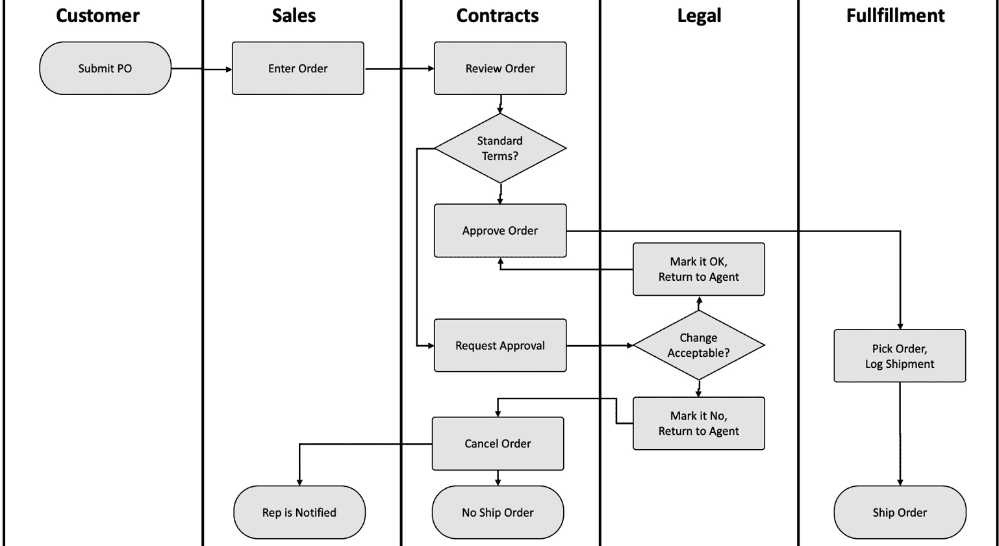
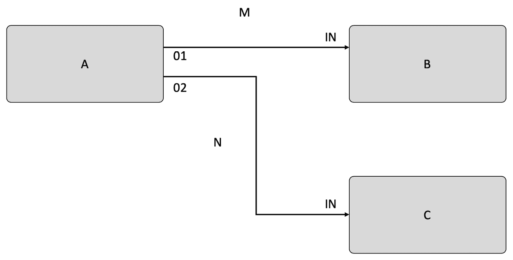
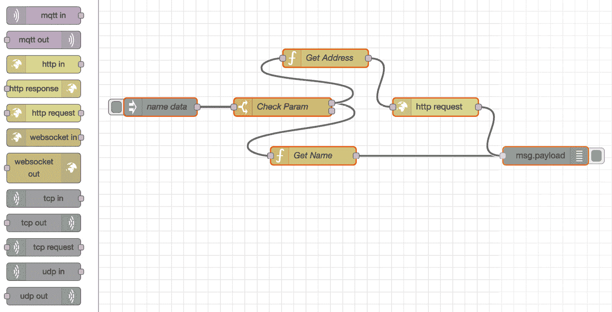
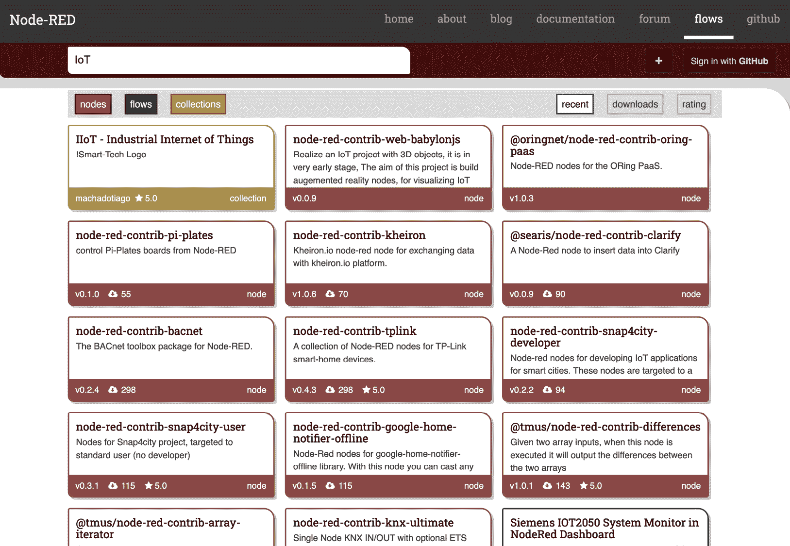
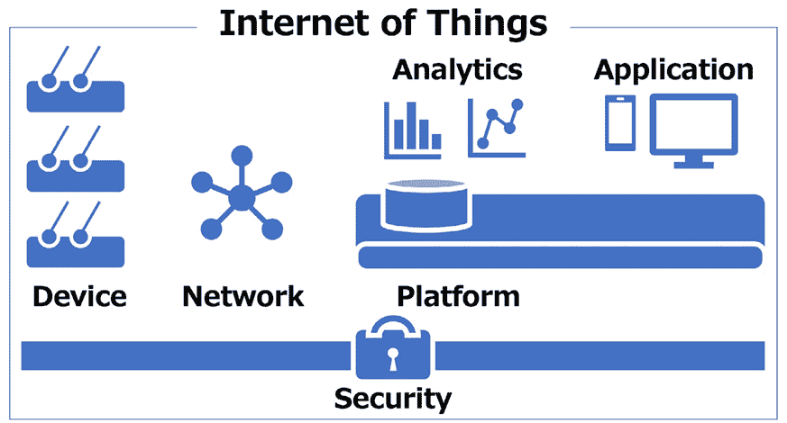
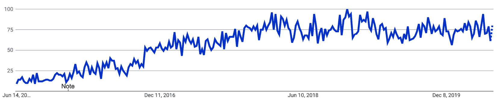

# 第一章：介绍 Node-RED 和基于流的编程

本章将帮助您从读者成长为 Node-RED 用户。首先，您将了解**基于流的编程（FBP）**工具的历史，而不仅仅是 Node-RED。然后，您将对 Node-RED 的整体有一个广泛的了解，作为构建 Web 应用程序和**物联网**（**IoT**）数据处理的有用工具，然后学习有关 Node-RED 的 IoT 和 Node.js 是什么。

提供技术内容将有助于加速软件应用程序的开发，但如果您看一下 Node-RED 工具本身的历史，将有助于您更好地理解为什么您需要像 Node-RED 这样的 FBP 工具。这就是本章将要做的事情。

更具体地，我们将涵盖以下主题：

+   什么是 FBP？

+   什么是 Node-RED？

+   Node-RED 的好处

+   Node-RED 和物联网

让我们开始吧！

# 什么是 FBP？

那么，首先什么是 FBP 呢？这是您在工作中使用的工作流程，您可以很容易地想象到。让我们回顾一下这些工作流程。

## 工作流程

在正常的工作流程中，方框和线表示进程流程。它可能只是一个业务设计。方框代表进程。方框处理由谁、何时、何地、什么以及多少来定义。有时，它就像明确地写出处理流程，例如使用游泳道或在方框内放置写定义。无论如何，看看方框应该能够看出将要做什么。

另一方面，让我们试着将这个业务流程总结为一个文件。你不觉得会很复杂吗？即使他们使用一些段落来组合，读者会在阅读时会感到困惑。他们将在什么时候做？这可能会令人困惑：

图 1.1 – 工作流程示例

现在，让我们回到软件编程。FBP 是一种用数据流定义应用程序的软件编程概念。处理的每个部分都是一个黑盒子。它们在预定义的连接的黑盒子之间传递数据。FBP 被认为是面向组件的，因为这些黑盒子进程可以重复连接，形成多个应用程序，而无需在内部进行修改。让我们更详细地探讨 FBP。

## 基于流的编程（FBP）

我认为 FBP 是工作流和数据流的良好结合。FBP 使用**数据工厂**的隐喻来定义应用程序。它将应用程序视为一组异步进程的网络，这些进程从某一点开始，并进行单个顺序处理，一次执行一个操作，直到结束，而不是通过使用结构化数据块流进行通信。这被称为**信息包**（**IP**）。这种观点侧重于数据及其转换过程，以产生所需的输出。网络通常在进程外部定义为一组由称为**调度器**的软件解释的连接列表。

进程通过固定容量连接进行通信。连接通过端口连接到进程。端口具有网络定义和进程代码所约定的特定名称。在这一点上，可以通过使用多个进程执行相同的代码。特定的 IP 通常只由单个进程拥有或在两个进程之间传输。端口可以是普通类型或数组类型。

FBP 应用程序通常比传统程序运行得更快，因为 FBP 进程可以继续运行，只要有空间放入数据并输出到处理。它不需要任何特殊的编程，并且可以充分利用机器上的所有处理器。

FBP 具有高级功能风格，因此系统的行为可以很容易地定义；例如，在分布式多方协议中，如分布式数据流模型中，可以准确分析确定变量或语句是否正确行为的标准：

图 1.2 - 简单的 FBP 设计示例

现在您已经对 FBP 有了扎实的了解，让我们学习如何以这种方式实现 Node-RED。

# 什么是 Node-RED？

Node-RED 是我们迄今为止描述的 FBP 工具之一。由 IBM 的新兴技术服务团队开发，Node-RED 现在属于 OpenJS 基金会。

## 概述

FBP 是由 J. Paul Morrison 在 20 世纪 70 年代发明的。正如我们之前提到的，FBP 将应用程序的行为描述为一个黑盒网络，在 Node-RED 中被描述为“节点”。每个节点中定义了处理；数据被传递给它，使用该数据进行处理，然后将该数据传递给下一个节点。网络起到了允许数据在节点之间流动的作用。

这种编程方法非常易于使用，可以用来直观地制作模型，并且易于多层用户访问。如果将问题分解为每个步骤，任何人都可以理解流程在做什么。这就是为什么您不需要在节点内部编写代码：

图 1.3 - Node-RED 流程编辑器作为 FBP 工具

## 流编辑器和运行时

Node-RED 不仅是一个编程工具，还是一个封装了 Node-RED 构建的应用程序的 Node.js 运行时的执行平台。

我们需要使用**流编辑器**为物联网、Web 服务等制作 Node-RED 应用程序。流编辑器也是一个 Node.js Web 应用程序。我们将在*第三章**，通过创建基本流程了解 Node-RED 特性*中清楚地告诉您如何使用流编辑器。

流编辑器是 Node-RED 的核心功能，实际上是一个使用 Node.js 制作的 Web 应用程序。它与 Node.js 运行时一起工作。这个流编辑器在浏览器中运行。您必须从调色板中选择要使用的节点，并将其拖到工作区。连线是将节点连接在一起的过程，从而创建一个应用程序。用户（开发人员）只需点击一次即可将应用程序部署到目标运行时。

包含各种节点的调色板可以轻松扩展，因为您可以安装开发人员创建的新节点，这意味着您可以将创建的流程轻松共享为 JSON 文件。在我们探讨 Node-RED 的好处之前，让我们先看一下其创建背后的简要历史。

## Node-RED 的历史和起源

在 2013 年初，来自 IBM 英国新兴技术服务团队的 Nick-O'Leary 和 Dave Conway-Jones 创建了 Node-RED。

最初，它只是一个**概念验证**（**PoC**），用于帮助可视化和理解**消息队列遥测传输**（**MQTT**）主题之间的映射，但很快，它成为了一个非常受欢迎的工具，可以轻松扩展到各种用途。

Node-RED 于 2013 年 9 月成为开源项目，现在仍然作为开源项目进行开发。它于 2016 年 10 月成为 JS 基金会的创始项目之一，后来与 Node.js 基金会合并，于 2019 年 3 月创建了 OpenJS 基金会。

OpenJS 基金会支持 JavaScript 和 Web 技术的增长，作为一个中立的组织来领导和共同资助任何项目和活动，这对整个生态系统都有益处。OpenJS 基金会目前托管了 30 多个开源 JavaScript 项目，包括 Appium、Dojo、jQuery、Node.js 和 webpack。

Node-RED 已根据 Apache 2 许可证提供，这使得它在个人和商业领域都可以广泛使用：

图 1.4 - Dave Conway-Jones 和 Nick O'Leary

为什么叫 Node-RED？

官方文档（[`nodered.org/about/`](https://nodered.org/about/)）指出，这个名字是一个简单的双关语，听起来像“Code Red”。这是一个死胡同，Node-RED 是对它在最初几天构思时的称呼的重大改进。 “Node”部分既反映了流/节点编程模型，也反映了底层的 Node.js 运行时。

Nick 和 Dave 从未就“RED”部分代表什么达成结论。“快速事件开发人员”是一个建议，但从未被迫正式确定任何事情。因此，“Node-RED”这个名字诞生了。

# Node-RED 的好处

让我们在这里思考一下。为什么要使用汽车？我认为答案非常简单明了。首先，我们可以得出答案，即它们被用作广义上的交通工具。还有其他交通选择，比如步行、骑自行车、乘火车和公交车。然后，我们有从这些其他选择中选择汽车的原因，如下所示：

+   你不会感到疲惫。

+   你可以快速到达目的地。

+   你可以按自己的步调前进。

+   你可以保持个人空间。

当然，也有一些缺点，但我认为这些是使用汽车的主要原因。虽然其他交通工具也可以达到同样的目的，但重要的是要考虑每种交通工具的优缺点，并根据你认为最适合你的原因使用汽车作为交通工具。

我们在软件中也可以看到同样的情况。例如，为什么要使用 Word、Excel 和 PowerPoint？你可能会使用 Word，因为这是写文件的最有效方式。然而，你也可以使用其他文字处理软件或手写。同样地，你可以使用其他方式制作电子表格，而不是 Excel。除了 PowerPoint，如果你想制作有效的演示材料，也有其他方式。然而，你可能会选择最适合你情况的工具。

让我们回顾一下 Node-RED 的用途。它是一个适用于为 Web 应用程序和物联网制作数据控制应用程序的 FBP 工具。它的开发环境和执行环境是基于浏览器的应用程序，使用了 Node.js，使其开发尽可能简单。

那么，使用提供这些功能的 Node-RED 的原因是什么呢？你想避免繁重的编码吗？你没有编码技能吗？当然，这些也是使用该程序的原因。

让我们回顾一下汽车的例子。在广义上，我们的困境（交通工具）在这里被开发（创建）Node.js 应用程序来描述软件工具所取代。诸如汽车、自行车、火车、公交车、船、飞机等交通选择都是选项，而在软件开发中，我们也有许多选择，比如使用 Node.js scratch，或使用 Node.js 的各种框架和使用 Node-RED。至于选择 Node-RED 的原因，让我们看一下一些重要的要点。

## 简化

使用 Node-RED 进行编程时，你会注意到它的简单性。正如无代码/低代码的名称所示，编码被消除，编程是通过最少的操作直观完成的。

## 效率

Node-RED 所代表的 FBP 几乎可以完全通过图形界面操作完成。Node-RED 流编辑器负责构建应用程序执行环境、库同步、集成开发环境（IDE）和编辑器准备，这样你就可以专注于开发。

## 通用

正如面向对象开发所代表的，将源代码作为一个通用组件是开发中最重要的想法之一。在基于常规编码的开发中，每个通用组件存在于函数和类中，但在 Node-RED 中，它们存在为易于理解的节点（只是一个框）。如果你没有一个作为通用组件想要使用的节点，任何人都可以立即创建一个并将其发布到世界上。

## 高质量

高质量是基于流程和可视化编程的真正价值。每个作为组件提供的节点都是一个经过单元测试的完整模块。因此，应用程序作者可以专注于在连接级别检查操作，而不必担心节点的内容。这是一个消除单个级别的人为错误并确保高质量的重要因素。

## 开源

Node-RED 是一款开源软件。因此，它可以根据 Apache2 许可灵活使用。一些人正在基于 Node-RED 开发自己的服务，而另一些人则正在更改自己的用户界面，并将其部署为内置。正如我们之前提到的，我们还建立了一个平台，可以发布我们自己开发的节点，以便任何人都可以使用它。

## Node-RED 库

该库索引了所有发布到公共 npm 存储库（[`www.npmjs.com/`](https://www.npmjs.com/)）的 Node-RED 模块，假设它们遵循适当的打包指南。

这是我们看到最多社区贡献的领域，有超过 2,000 个可用的节点 - 这意味着每个人都能找到适合自己的东西：

图 1.5 - Node-RED 库

## 各种平台

Node-RED 可以在各种平台上使用。这是因为 Node-RED 本身是一个 Node.js 应用程序，正如我们之前提到的。如果你有一个 Node.js 的运行环境，你就可以运行它。它主要用于边缘设备、云服务和嵌入式格式。

通过理解 Node-RED 和物联网之间的关系以及物联网的架构，可以对此有所了解，这将在下一节中解释。

# Node-RED 和物联网

再次强调，Node-RED 是一个**虚拟环境**，以革命性的方式在浏览器上结合硬件设备、API 和在线服务。它提供以下功能：

+   基于浏览器的用户界面。

+   与 Node.js 一起工作，且轻量级。

+   封装功能，可以作为节点使用（意味着功能被锁在一个抽象的胶囊中）。

+   您可以创建和添加自己的节点。

+   轻松访问 IBM 云服务。

换句话说，可以说这个工具适合构建与物联网相关的服务，比如设备上的数据控制，以及连接边缘设备和云服务。最初，Node-RED 的开发概念是为了物联网，所以这是有道理的。

现在，让我们来看一下物联网的基本结构，以便那些对物联网只有模糊概念的人能够理解。可以说，物联网基本上由六个层组成，如下图所示：

图 1.6 - 物联网六层

让我们更详细地看看这些。

**设备**

设备是所谓的边缘设备。物联网具有各种传感器，并处理从它们获取的数据。由于仅在边缘设备上拥有数据是没有意义的，我们需要通过网关将数据发送到网络。

**网络**

这是发送从设备获取的数据到互联网服务器所需的网络。通常指的是互联网。除了互联网，还可以通过蓝牙或串行进行 P2P 连接。

**平台**

接收和使用数据的一方是平台。我们可能还有一个用于激活和验证事物、管理通信和持久化接收到的数据的数据库。

**分析**

这是一个分析接收到的数据的层。广义上来说，它可以被分类为一个应用程序。这部分准备数据，使其能够以有意义的形式进行处理。

**应用程序**

应用程序根据数据分析结果提供特定的服务。它可以是 Web 或移动应用程序，也可以是硬件特定的嵌入式应用程序。可以说这是物联网解决方案的最终用户使用的层。

现在我们对物联网有了一定的了解，我们将探讨为什么应该使用 Node-RED。

## Node-RED 和物联网

在到目前为止解释物联网的过程中，我们已经明确说明了为什么 Node-RED 适合物联网。例如，你可以理解为什么为物联网开发的 FBP 工具在与 Node-RED 一起使用时能够生存下来。特别是，应该考虑以下三点：

+   由于它可以在边缘设备上运行（预装在特定版本的树莓派 OS 上），因此非常适合在设备层进行数据处理。

+   由于它可以在云上运行（作为 IBM Cloud 中的默认服务），因此很容易与存储和分析中间件进行链接。

+   由于可以涵盖 MQTT 和 HTTP 协议，因此在边缘设备和服务器处理云之间交换数据非常容易。

这样一来，Node-RED，它主要涵盖了物联网所需的元素，现在被用于各种应用，如 Web 服务和图表显示，以及物联网的编程。此外，截至 2020 年 6 月，如果你查看 Node-RED 的 Google 趋势，你会发现用户数量在逐渐增加。因此，Node-RED 是一个非常有吸引力的 FBP 工具：

图 1.7 - "Node-RED"的 Google 趋势

可以使用 Node-RED 的典型边缘设备是树莓派。当然，也可以在其他平台上使用 Node-RED，但它与树莓派配合得很好，树莓派还预装了操作系统的版本。

树莓派 OS 支持 Node-RED

Node-RED 也已经打包到了树莓派 OS 的存储库中，并出现在他们的推荐软件列表中。这使得可以使用`apt-get install Node-RED`进行安装，并包括了树莓派 OS 打包版本的 Node.js，但不包括 npm。更多信息可以在[`nodered.org/docs/getting-started/raspberrypi`](https://nodered.org/docs/getting-started/raspberrypi)找到。

IBM Cloud 是一个可以使用 Node-RED 的典型云平台。当然，你也可以在其他云上使用 Node-RED，但 IBM Cloud 提供了一个任何人都可以轻松开始使用的服务。

重要说明

Node-RED 在 IBM Cloud 平台上作为其目录中的 Starter Kits 应用程序之一可用。在 IBM Cloud 上作为 Web 应用程序使用流程编辑器非常容易（[`nodered.org/docs/getting-started/ibmcloud`](https://nodered.org/docs/getting-started/ibmcloud)）。

# 摘要

在本章中，你了解了什么是 FBP 和 Node-RED。因此，你现在明白了为什么 Node-RED 目前被很多人作为 FBP 工具所喜爱和使用。在这一点上，你可能想要使用 Node-RED 构建一个应用程序。在下一章中，我们将在我们的环境中安装 Node-RED，并更深入地了解它。
