# 第二章：设置开发环境

在本章中，您将安装使用 Node-RED 所需的工具。这不仅包括 Node-RED 本身，还包括其运行时 Node.js，以及如何更新 Node-RED 和 Node.js。

Node-RED 于 2019 年 9 月发布了 1.0 里程碑版本。这反映了该项目的成熟度，因为它已经被广泛用于生产环境。它继续开发并通过对底层 Node.js 运行时进行更改来保持最新状态。您可以在[`nodered.org/docs/getting-started/`](https://nodered.org/docs/getting-started/)上检查 Node-RED 安装的最新状态。

Node-RED 官方网站上有许多安装指南，例如本地安装、树莓派、Docker 和主要云平台。

在本章中，您将学习如何在本地计算机上安装 Node-RED，无论是在 Windows、Mac 还是在树莓派上运行。我们将涵盖以下主题：

+   为 Windows 安装`npm`和 Node.js

+   为 Mac 安装`npm`和 Node.js

+   为树莓派安装`npm`和 Node.js

+   为 Windows 安装 Node-RED

+   为 Mac 安装 Node-RED

+   为树莓派安装 Node-RED

本章结束时，我们将安装所有必要的工具，并准备好继续使用 Node-RED 构建一些基本流程。

作为参考，作者的测试操作环境是 Windows 10 2004 18363.476、macOS Mojave 10.14.6 (18G5033)和 Raspberry Pi OS 9.4 stretch。

# 技术要求

本章需要安装以下内容：

+   Node.js (v12.18.1)*

+   npm (v6.14.5)*

*写作时的 LTS 版本。

# 为 Windows 安装 npm 和 Node.js

如果您想在 Windows 上使用 Node-RED，必须通过以下网站安装 npm 和 Node.js：

https://nodejs.org/en/#home-downloadhead。

您可以直接在那里获取 Node.js 的 Windows 安装程序。之后，按照以下步骤操作：

1.  访问原始 Node.js 网站并下载安装程序。

您可以选择**推荐**或**最新功能**版本，但在本书中，应使用**推荐**版本：

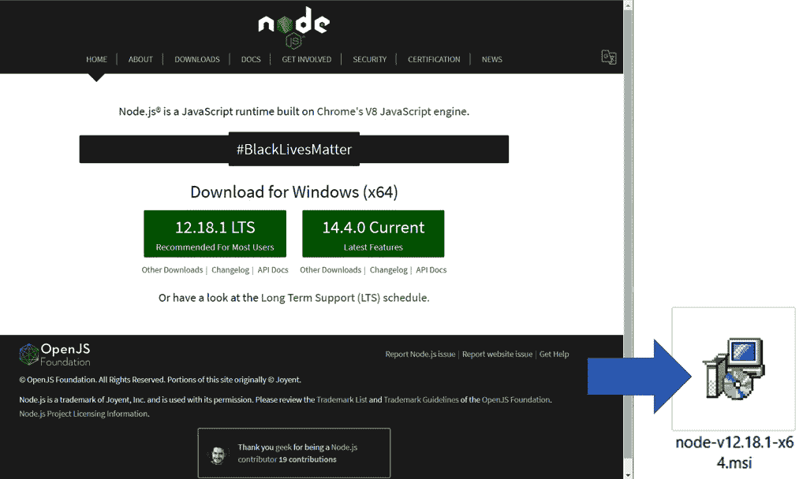

图 2.1–选择推荐版本安装程序

1.  单击下载的`msi`文件以开始安装 Node.js。它包括当前版本的 npm。Node-RED 在 Node.js 运行时上运行，因此需要它。

1.  只需根据安装向导的对话框按钮进行单击，尽管在安装过程中需要注意一些要点。

1.  接下来，您需要接受最终用户许可协议：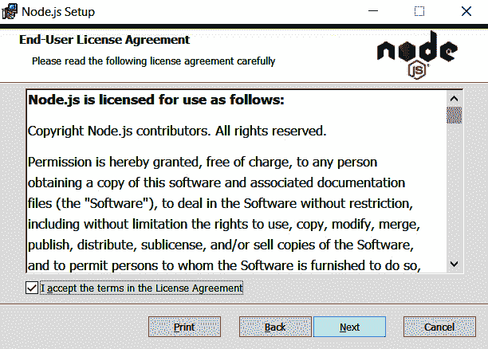

图 2.2–最终用户许可协议窗口

您还可以更改安装目标文件夹。在本书中，将使用默认文件夹（`C:/Program Files/nodejs/`）：

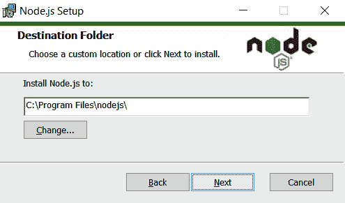

图 2.3–安装目标文件夹

1.  在下一个屏幕上不需要自定义设置。您可以只选择默认功能并单击**下一步**：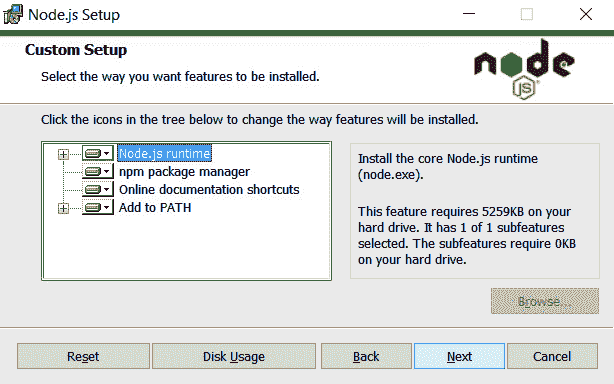

图 2.4–不需要自定义设置

1.  在接下来的屏幕上，您可以单击**下一步**而无需勾选任何内容。但是，可以在此处选择可以选择的工具进行安装。这包括安装和设置这些环境的路径（Visual C++、windows-build-tools 和 Python）：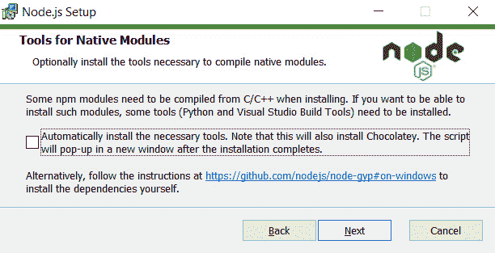

图 2.5–本机模块工具窗口

1.  当 Node.js 安装完成后，使用以下命令检查工具的版本：

```js
$ node --version
v12.18.1
$ npm –version
6.14.5
```

当 Node.js 和 npm 安装完成后，您可以检查它们的版本号。有了这些，您就可以安装 Node-RED 了。

重要提示

根据项目的不同，使用旧的 Node.js 版本进行操作是稳定的，但如果您使用不同版本的 Node.js，它可能不起作用。然而，每次切换项目都卸载当前的 Node.js 版本并安装所需的 Node.js 版本需要时间。因此，如果您使用 Windows，我建议使用 Node.js 版本管理工具，如 nodist ([`github.com/nullivex/nodist`](https://github.com/nullivex/nodist))。还有其他类型的 Node.js 版本控制工具，请尝试找到一个对您来说容易使用的。

# 为 Mac 安装 npm 和 Node.js

如果您想在 macOS 上使用 Node-RED，您必须通过以下网站安装`npm`和 Node.js：

https://nodejs.org/en/#home-downloadhead

您可以直接在那里获取 Mac 安装程序。

访问原始的 Node.js 网站并下载安装程序。您可以选择推荐版本或最新功能版本，但是对于本书，您应该使用推荐版本：

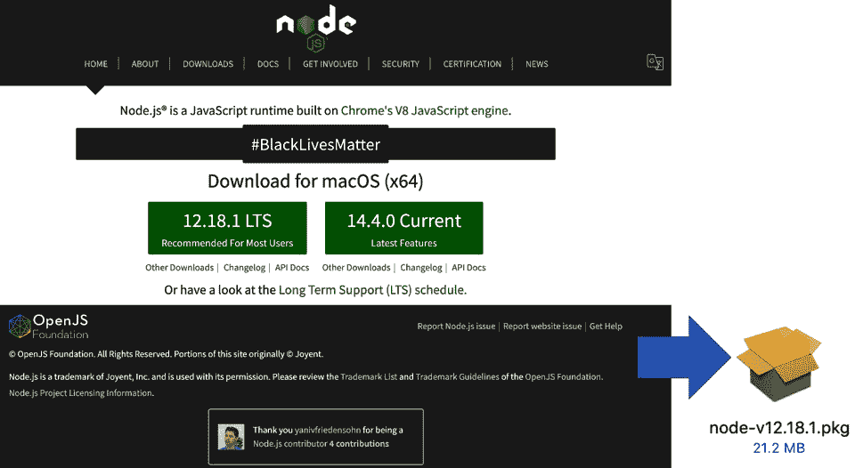

图 2.6-选择推荐版本的安装程序

点击您下载的`.pkg`文件开始安装 Node.js。它包括当前版本的`npm`。Node-RED 在 Node.js 运行时上运行，所以它是必需的。尽管在安装过程中有一些需要注意的地方，但只需按照安装向导进行简单点击即可。

您需要接受最终用户许可协议：

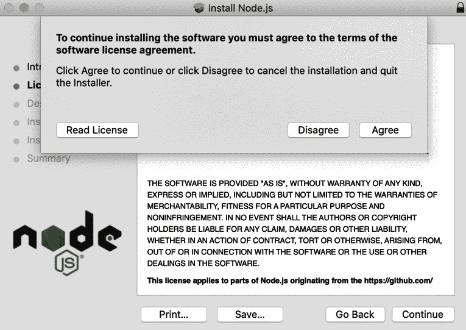

图 2.7-最终用户许可协议窗口

您可以更改安装位置。在本书中，将使用默认位置（Macintosh HD）：

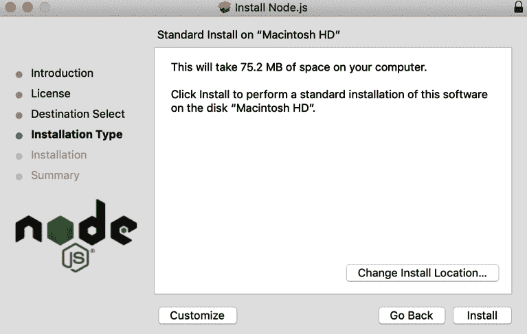

图 2.8-安装位置

当 Node.js 安装完成后，您可以使用以下命令检查工具的版本。一旦安装了 Node.js 和`npm`，您可以检查它们的版本号。您已经准备好安装 Node-RED 了：

```js
$ node --version
v12.18.1
$ npm –version
6.14.5
```

注意

根据项目的不同，使用旧的 Node.js 版本进行操作是稳定的，如果您使用不同版本的 Node.js，它可能不起作用。然而，每次切换项目都卸载当前的 Node.js 版本并安装所需的 Node.js 版本需要时间。因此，如果您使用 macOS，我建议使用 Node.js 版本管理工具，如 Nodebrew ([`github.com/hokaccha/nodebrew`](https://github.com/hokaccha/nodebrew))。还有其他类型的 Node.js 版本控制工具，请尝试找到一个对您来说容易使用的。

现在我们已经介绍了 Windows 和 Mac 的安装过程，让我们学习如何为树莓派安装`npm`和 Node.js。

# 为树莓派安装 npm 和 Node.js

如果您想在树莓派上使用 Node-RED，恭喜您-您已经准备好安装 Node-RED 了。这是因为 Node.js 和 npm 已经默认安装了。您可以使用现有的安装脚本来安装 Node-RED，包括 Node.js 和 npm。这个脚本将在本章的后面部分描述，在*为树莓派安装 Node-RED*部分，所以您现在可以跳过这个操作。

但是，您应该检查树莓派上的 Node.js 和 npm 版本。请键入以下命令：

```js
$ node --version
v12.18.1
$ npm –version
6.14.5
```

如果不是 LTS 版本或稳定版本，您可以通过 CLI 进行更新。请键入并运行以下命令来执行此操作。在这个命令中，最后一行使用了`lts`，但如果您想安装稳定版本，也可以将`lts`替换为`stable`：

```js
$ sudo apt-get update
$ sudo apt-get install -y nodejs npm
$ sudo npm install npm n -g
$ sudo n lts
```

现在我们已经成功检查了树莓派上 Node.js 和 npm 的版本，并进行了更新（如果适用），我们将继续安装 Windows 上的 Node-RED。

重要提示

Node-RED 项目提供的脚本负责安装 Node.js 和`npm`。通常不建议使用由树莓派 OS 提供的版本，因为它们的打包方式很奇怪。

# 为 Windows 安装 Node-RED

在本节中，我们将解释如何在 Windows 环境中设置 Node-RED。此过程适用于 Windows 10，但也适用于 Windows 7 和 Windows Server 2008 R2 及更高版本。目前不支持 Windows 7 或更早版本的 Windows Server 2008 R2，也不建议使用。

对于 Windows，将 Node-RED 安装为全局模块会将`node-red`命令添加到系统路径中。在命令提示符中运行以下命令：

```js
$ npm install -g --unsafe-perm node-red
```

安装完成 Node-RED 后，您可以立即使用 Node-RED。请运行以下命令。运行此命令后，您将识别用于访问 Node-RED 流编辑器的 URL。通常会分配 localhost（127.0.0.1）和默认端口 1880：

```js
$ node-red
Welcome to Node-RED
===================
…
[info] Starting flows
[info] Started flows
[info] Server now running at http://127.0.0.1:1880/
```

让我们在浏览器上访问 Node-RED。为此，请在命令提示符中收到的 URL 中输入。我强烈建议使用 Chrome 或 Firefox 来运行 Node-RED：

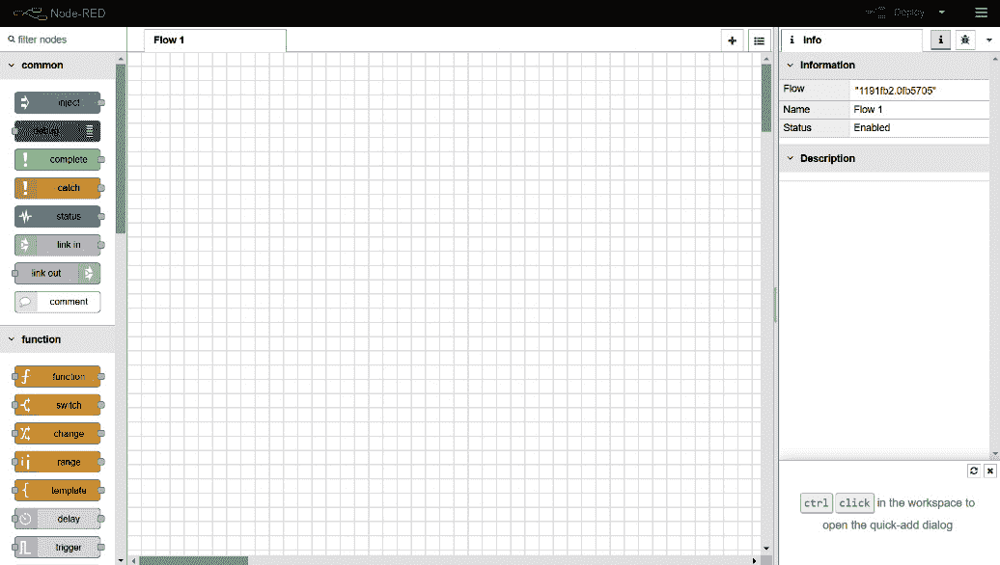

图 2.9 - Node-RED 流编辑器

现在，您已经准备好在 Node-RED 中编程。从*第三章*，*通过创建基本流了解 Node-RED 特性*，开始，我们将学习如何实际构建使用 Node-RED 的应用程序。

现在，让我们继续在 macOS 中安装 Node-RED。

# 在 Mac 上安装 Node-RED

在本节中，我们将解释如何在 macOS 环境中设置 Node-RED。此过程适用于 macOS Mojave。它可能适用于所有版本的 Mac OS X，但我强烈建议您使用当前版本的 macOS。

对于 macOS，将 Node-RED 安装为全局模块会将`node-red`命令添加到系统路径中。在终端中运行以下命令。根据您的本地设置，您可能需要在命令前加上`sudo`：

```js
$ sudo npm install -g --unsafe-perm node-red
```

您还可以使用其他工具安装 Node-RED。这主要适用于 Mac/Linux 或支持以下工具的操作系统：

1.  Docker ([`www.docker.com/`](https://www.docker.com/))，如果您有运行 Docker 的环境。

当前的 Node-RED 1.x 存储库在 Docker Hub 上已更名为"`nodered/node-red`"。

0.20.x 版本之前的版本可从[`hub.docker.com/r/nodered/node-red-docker`](https://hub.docker.com/r/nodered/node-red-docker)获取。

```js
$ docker run -it -p 1880:1880 --name mynodered nodered/node-red
```

1.  Snap（[`snapcraft.io/docs/installing-snapd`](https://snapcraft.io/docs/installing-snapd)），如果您的操作系统支持。

如果您将其安装为 Snap 软件包，可以在安全容器中运行它，该容器无法访问您必须使用的外部功能，例如以下功能：

+   访问主系统存储（只允许读/写本地主目录）。

+   Gcc：需要为要安装的节点编译二进制组件。

+   Git：如果您想利用项目功能，则需要。

+   直接访问 GPIO 硬件。

+   访问外部命令，例如在 Exec 节点中执行的流。

容器的安全性较低，但您也可以在**经典**模式下运行它们，这样您就可以获得更多访问权限。

运行以下命令以使用 Snap 安装 Node-RED：

```js
$ sudo snap install node-red
```

安装完成 Node-RED 后，您可以立即使用 Node-RED。请运行以下命令。运行此命令后，您可以找到用于访问 Node-RED 流编辑器的 URL。通常会分配 localhost（`127.0.0.1`）和默认端口`1880`：

```js
$ node-red
Welcome to Node-RED
===================
…
[info] Server now running at http://127.0.0.1:1880/
[info] Starting flows
[info] Started flows
```

让我们在浏览器上访问 Node-RED。在命令提示符中输入您收到的 URL。我强烈建议使用 Chrome 或 Firefox 来运行 Node-RED：

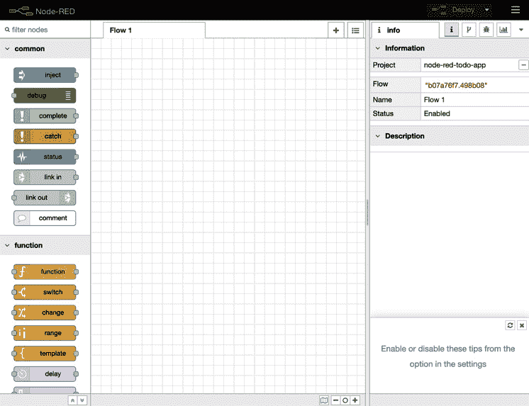

图 2.10 - Node-RED 流编辑器

现在，您已经准备好在 Node-RED 中编程。在*第三章*，*通过创建基本流了解 Node-RED 特性*，我们将学习如何实际使用 Node-RED 构建应用程序。

我们的最终安装将是在树莓派上的 Node-RED。

# 为树莓派安装 Node-RED

在本节中，我们将解释如何在树莓环境中设置 Node-RED。此过程适用于树莓派 OS Buster（Debian 10.x），但也适用于树莓派 OS Jessie（Debian 8.x）及以上版本。

你可以轻松检查你的树莓派 OS 版本。只需在终端上运行以下命令：

```js
$ lsb_release -a
```

如果您还想检查您的 Debian 版本，请运行以下命令：

```js
$ cat /etc/debian_version
```

您现在已经准备好安装 Node-RED。以下脚本安装 Node-RED，包括 Node.js 和`npm`。此脚本也可用于升级您已安装的应用程序。

注意

此说明可能会更改，因此建议根据需要参考官方文档。

此脚本适用于基于 Debian 的操作系统，包括 Ubuntu 和 Diet-Pi：

```js
$ bash <(curl -sL https://raw.githubusercontent.com/node-red/linux-installers/master/deb/update-nodejs-and-nodered)
```

您可能需要运行`sudo apt install build-essential git`以确保 npm 可以构建需要安装的二进制组件。

Node-RED 已经打包为树莓派 OS 存储库的一部分，并包含在*推荐软件*列表中。可以使用`apt-get install Node-RED`命令进行安装，它还包含了 Node.js 的树莓派 OS 打包版本，但不包括 npm。

虽然使用这些软件包可能一开始看起来很方便，但强烈建议使用安装脚本。

安装完成后，您可以启动 Node-RED 并访问 Node-RED 流编辑器。我们有两种启动方式，如下：

1.  通过 CLI 运行：如果您想在本地运行 Node-RED，可以在终端中使用`node-red`命令启动 Node-RED。然后，您可以通过按*Ctrl* + *C*或关闭终端窗口来停止它：

```js
$ node-red
```

1.  通过编程菜单运行：安装完 Node-RED 后，您可以从树莓派菜单启动它。单击**菜单 | 编程 | Node-RED**打开终端并启动 Node-RED。启动 Node-RED 后，您可以像在 CLI 中一样从浏览器访问 Node-RED 流编辑器：

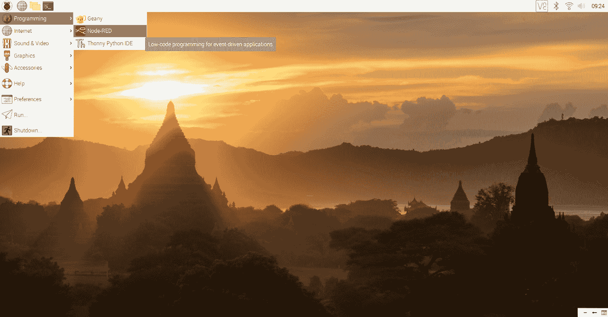

图 2.11 - 通过树莓派菜单访问 Node-RED

从菜单启动 Node-RED 后，您应该在终端上检查 Node-RED 运行进程，并找到 Node-RED 流编辑器的 URL。通常情况下，它与可以直接通过 CLI 启动的 URL 相同：

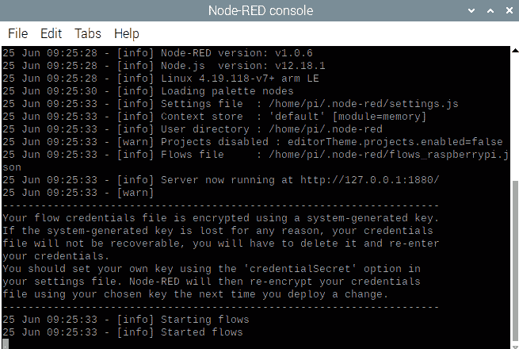

图 2.12 - 检查访问 Node-RED 流编辑器的 URL

让我们在浏览器上访问 Node-RED。您可以在命令提示符中收到的 URL 中输入。如果您的树莓派默认的 Web 浏览器是 Chromium，那么使用 Node-RED 应该没有问题。但是，如果您希望使用其他浏览器，我强烈建议安装 Chromium 来运行 Node-RED：

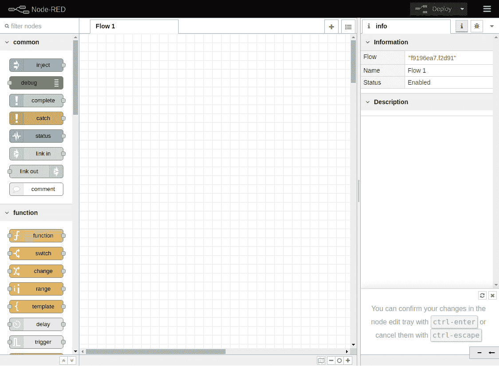

图 2.13 - Node-RED 流编辑器

就是这样！我们现在已经涵盖了开始使用 Node-RED 所需的每个工具的所有安装选项。

# 总结

在本章中，您已经准备好了环境，以便可以使用 Node-RED 流编辑器。在这一点上，我相信您已经可以访问 Node-RED 流编辑器，所以您会想要学习如何使用它。在下一章中，我们将在其中制作一个示例流，并了解 Node-RED 流编辑器的主要功能。
