# 第三章：通过创建基本流程了解 Node-RED 特性

在本章中，我们将使用 Node-RED Flow Editor 实际创建一个流程。通过创建一个简单的流程，您将了解如何使用该工具及其特性。为了更好地理解，我们将创建一些示例流程。

从现在开始，您将使用 Node-RED 创建名为流程的应用程序。在本章中，您将学习如何使用 Node-RED 以及如何将应用程序创建为流程。为此，我们将涵盖以下主题：

+   Node-RED Flow Editor 机制

+   使用 Flow Editor

+   为数据处理应用程序制作流程

+   为 Web 应用程序制作流程

+   导入和导出流程定义

在本章结束时，您将掌握如何使用 Node-RED Flow Editor，并知道如何使用它构建一个简单的应用程序。

# 技术要求

要完成本章，您需要以下内容：

+   Node-RED（v1.1.0 或更高版本）。

+   本章的代码可以在[`github.com/PacktPublishing/-Practical-Node-RED-Programming`](https://github.com/PacktPublishing/-Practical-Node-RED-Programming)的`Chapter03`文件夹中找到。

# Node-RED Flow Editor 机制

正如您在之前的章节中学到的，Node-RED 有两个逻辑部分：一个称为 Flow Editor 的开发环境，用于执行在那里创建的应用程序的执行环境。它们分别称为运行时和编辑器。让我们更详细地看看它们：

+   **运行时**：包括 Node.js 应用程序运行时。它负责运行部署的流程。

+   **编辑器**：这是一个 Web 应用程序，用户可以在其中编辑他们的流程。

主要的可安装包包括两个组件，一个用于提供 Flow Editor 的 Web 服务器，另一个用于管理运行时的 REST Admin API。在内部，这些组件可以分别安装并嵌入到现有的 Node.js 应用程序中，如下图所示：

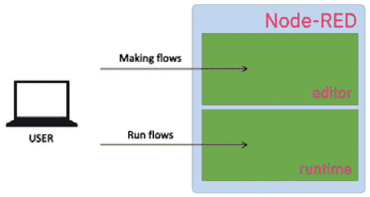

图 3.1 - Node-RED 概述

现在您了解了 Node-RED 的机制，让我们立即学习如何使用 Flow Editor。

## 使用 Flow Editor

让我们来看看 Flow Editor 的主要功能。

Flow Editor 的主要特点如下：

+   **节点**：Node-RED 应用程序的主要构建块，它们代表定义明确的功能块。

+   **Flow**：一系列通过连线连接在一起的节点，代表消息在应用程序中经过的一系列步骤。

+   **左侧面板是调色板**：编辑器中可用的节点集合，您可以使用它们来构建您的应用程序。

+   **部署按钮**：编辑应用程序后，按此按钮部署您的应用程序。

+   **侧边栏**：用于显示各种功能的面板，如处理参数设置、规格和调试器显示。

+   **侧边栏标签**：每个节点的设置，标准输出，变更管理等。

+   **主菜单**：流程删除，定义导入/导出，项目管理等。

这些功能在 Flow Editor 的屏幕上排列如下：

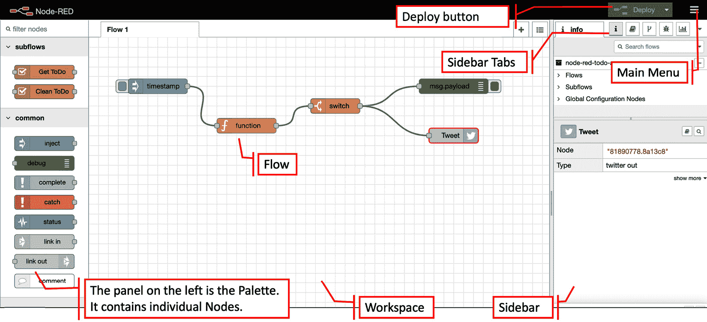

图 3.2 - Node-RED Flow Editor

在开始使用 Node-RED 之前，您需要了解 Flow 菜单中包含的内容。其内容可能会有所不同，取决于您使用的 Node-RED 版本，但它具有一些通用的设置项，如**流程项目管理**、**排列视图**、**导入/导出流程**、**安装库中发布的节点**等。有关如何使用 Node-RED 的更多信息，可以根据需要参考官方文档。

重要提示

Node-RED 用户指南：[`nodered.org/docs/user-guide/`](https://nodered.org/docs/user-guide/)。

以下图表显示了 Node-RED 中 Flow Editor 菜单选项的所有内容：

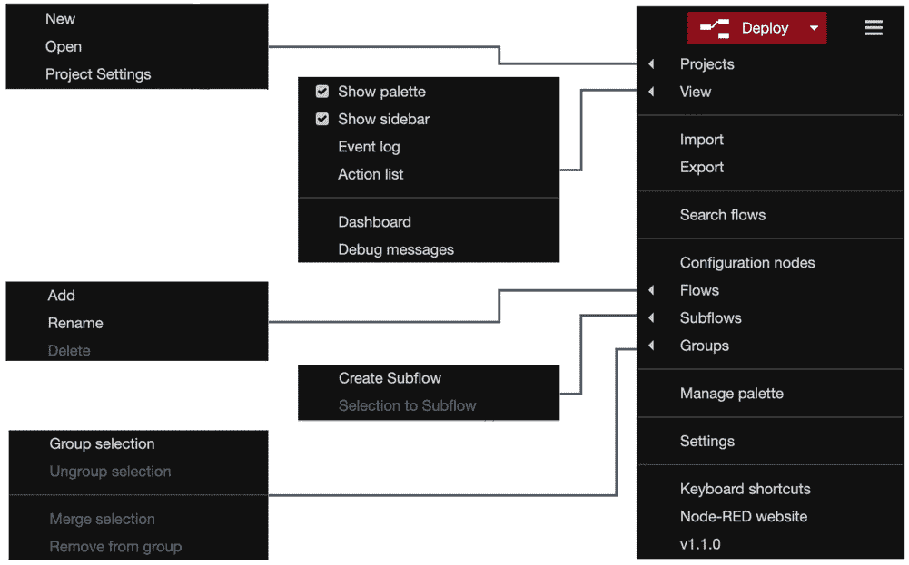

图 3.3 – Node-RED 流编辑器菜单

有了这个，你就可以使用 Node-RED 来构建一个应用程序了。所以，让我们开始吧！

首先，你需要在你的环境中运行 Node-RED。如果你还没有这样做，请参考*第二章**，设置开发环境*，了解如何在你的环境中设置它，比如 Windows、Mac 或树莓派。

Node-RED 运行后，让我们继续下一节，我们将制作我们的第一个流程。

# 制作数据处理应用程序的流程

在本节中，你将创建一个工作应用程序（在 Node-RED 中称为流程）。无论是**物联网**（**IoT**）还是作为 Web 应用程序的服务器处理，Node-RED 执行的基本操作都是顺序传输数据。

在这里，我们将创建一个流程，其中 JSON 数据是以伪方式生成的，最终通过 Node-RED 上的一些节点将数据输出到标准输出。

调色板的左侧有许多节点。请注意这里的**常用**类别。你应该能够很容易地找到**注入**节点，如下面的截图所示：

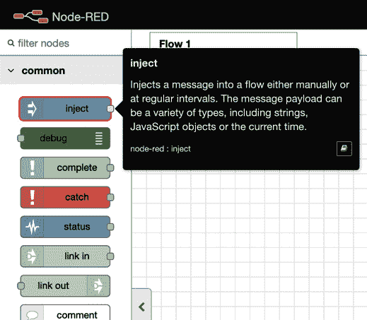

图 3.4 – 注入节点

这个节点可以将消息注入到下一个节点。让我们开始吧：

1.  将其拖放到 Flow 1（默认流程标签）的调色板上。

你会看到节点上标有**时间戳**这个词。这是因为它的默认消息载荷是一个时间戳值。我们可以改变数据类型，所以让我们把它改成 JSON 类型。

1.  当节点的**属性**面板打开时，双击节点并更改其设置：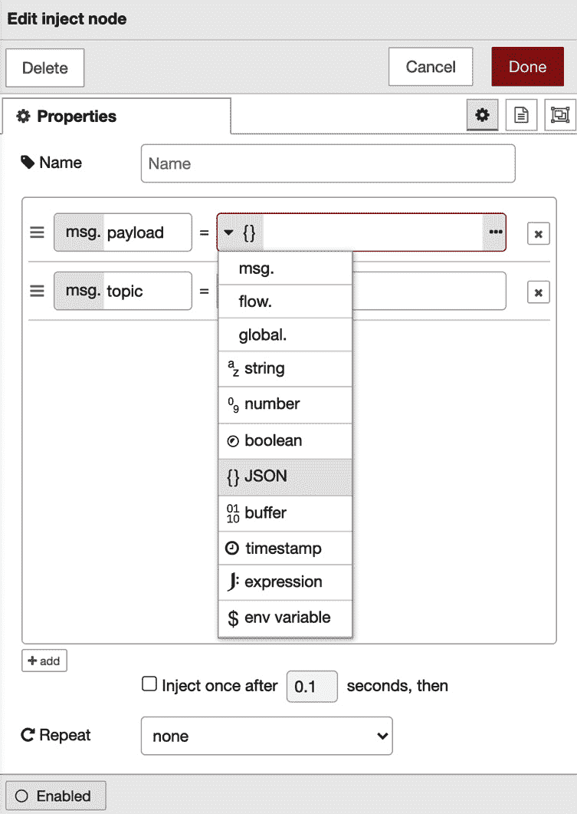

图 3.5 – 编辑注入节点属性面板

1.  点击第一个参数的下拉菜单，选择**{}JSON**。你可以通过点击右侧的**[…]**按钮编辑 JSON 数据。

1.  点击**[…]**按钮，JSON 编辑器将打开。你可以用基于文本的编辑器或可视化编辑器制作 JSON 数据。

1.  这次，让我们用一个名为`{"name" : "太极"}`的项目来制作 JSON 数据。你应该用你的名字替换我的名字：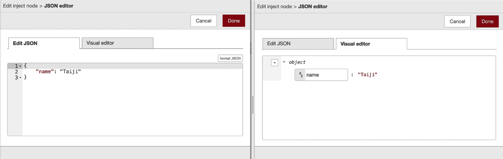

图 3.6 – JSON 编辑器

太棒了 - 你成功地制作了一些示例 JSON 数据！

1.  点击**完成**按钮并关闭此面板。

1.  同样，在调色板上放置一个**调试**节点。

1.  放置后，将**注入**和**调试**节点连接到它。

一旦你执行了这个流程，从**注入**节点传递的 JSON 数据将被**调试**节点输出到调试控制台（标准输出）。你不需要在**调试**节点上配置任何东西：

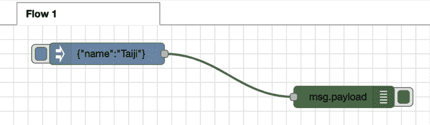

图 3.7 – 放置调试节点并连接它

1.  最后，你需要部署你创建的流程。在 Node-RED 流编辑器中，我们可以通过点击右上角的**部署**按钮将所有的流程部署到 Node-RED 运行时。

1.  在运行流程之前，你应该从节点菜单的侧边栏中选择**调试**选项卡，以启用调试控制台，如下面的截图所示：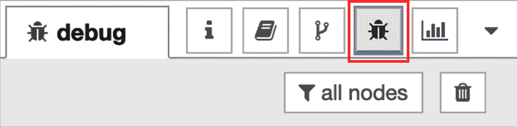

图 3.8 – 启用调试控制台

1.  让我们运行这个流程。点击**注入**节点的开关，看看在调试控制台上执行流程的结果：

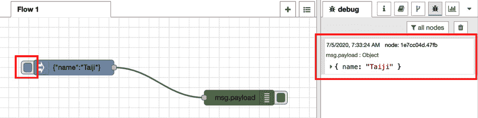

图 3.9 – 执行流程并检查结果

这是一个非常简单和容易的数据处理流程示例。在本书的后半部分，我们还将通过实际连接物联网设备并传递从 Web API 获取的数据来实验数据处理。在本节中，你只需要了解如何在 Node-RED 中处理数据就足够了。接下来，我们将实验制作一个用于 Web 应用程序的流程。

为 Web 应用程序制作流程

在这一部分，您将为 Web 应用程序创建一个新的流程。我们将以与创建先前的数据处理流程相同的方式创建此流程。

您可以在相同流程（Flow 1）的工作区中创建它，但为了清晰和简单起见，让我们按照以下步骤为流程创建一个新的工作区：

1.  从**Flow**菜单中选择**Flows | Add**。 Flow 2 将添加到 Flow 1 的右侧。这些流名称，如“Flow 1”和“Flow 2”，是创建时提供的默认名称。如果需要，可以重命名流程，使其具有更具体的名称：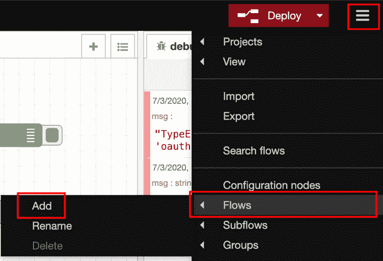

图 3.10 - 添加新流程

1.  从调色板的**network**类别中选择**http 输入**节点，然后将其拖放到 Flow 2 的调色板上（您刚刚添加的新流程选项卡）：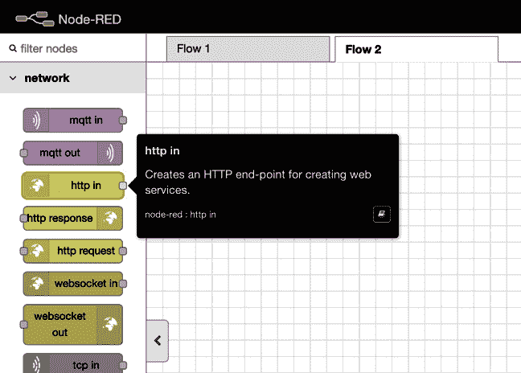

图 3.11 - 一个 http 输入节点

1.  双击节点以打开其**Edit**对话框。

1.  输入您将要创建的 Web 应用程序的 URL（路径）。

此路径将作为您将要创建的 Web 应用程序的 URL 的一部分，位于 Node-RED URL 下。在这种情况下，如果您的 Node-RED URL 是`http://localhost:1880/`，您的 Web 应用程序 URL 将是`http://localhost:1880/web`。可以在以下截图中看到示例：

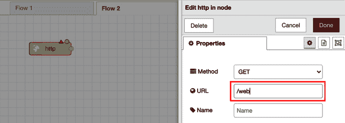

图 3.12 - 设置 URL 的路径

1.  要通过 HTTP 发送请求，需要一个 HTTP 响应。因此，在 Node-RED 的工作区上放置一个**http 响应**节点。

您可以在调色板的**network**类别中找到此节点，位于**http 输入**节点旁边。在这里，**http 响应**节点只是返回响应，因此您无需打开配置面板。您可以将其保留不变。如果要在响应消息中包含状态代码，可以从**settings**面板中进行设置，如下截图所示：

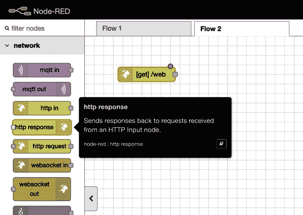

图 3.13 - 一个 http 响应节点

1.  在调色板上放置**http 响应**节点后，从**http 输入**节点添加一根导线到**http 响应**节点。

这完成了 Web 应用程序的流程，因为我们已经允许了 HTTP 请求和响应。您将在每个节点的右上角看到一个浅蓝色的点，表示它们尚未部署 - 因此，请确保单击**Deploy**按钮：

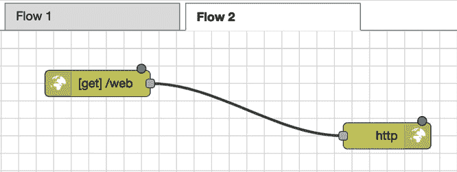

图 3.14 - 连接的节点

1.  一旦成功部署，打开浏览器中的新标签页。

1.  然后，访问显示在`http://localhost:1880/web`中的 Web 应用程序的 URL。

您会发现屏幕上只显示**{}**。这不是错误。这是发送 HTTP 请求并返回响应的结果。现在，由于我们尚未设置要传递给响应的内容，因此将空 JSON 作为消息数据传递。如下所示：

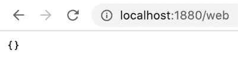

图 3.15 - Web 应用程序结果

这并不好，所以让我们创建一些内容。让我们做一些非常简单的事情，并实现一些简单的 HTML 代码。那么我应该在哪里编写这个？答案很简单。Node-RED 有一个模板节点，允许您将 HTML 代码指定为输出。让我们使用这个：

1.  将一个**模板**节点拖放到**http 输入**节点和**http 响应**节点之间的导线上，以便**模板**节点将连接到它：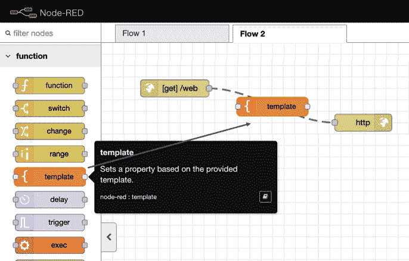

图 3.16 - 在我们现有的两个节点之间的导线上放置“模板”节点

1.  接下来，双击`<h1>`标签。使用`<h2>`标签排列类似菜单的内容。代码将如下所示：

```js
<html>
  <head>
    <title>Node-RED Web sample</title>
  </head>
  <body>
    <h1>Hello Node-RED!!</h1>
    <h2>Menu 1</h2>
    <p>It is Node-RED sample webpage.</p>
    <hr>
    <h2>Menu 2</h2>
    <p>It is Node-RED sample webpage.</p>
  </body>
</html>
```

注意

您还可以从本书的 GitHub 存储库中获取此代码[`github.com/PacktPublishing/-Practical-Node-RED-Programming/tree/master/Chapter03`](https://github.com/PacktPublishing/-Practical-Node-RED-Programming/tree/master/Chapter03)。

1.  完成**模板**节点的编辑后，单击**完成**按钮关闭它。

以下屏幕截图显示了您编辑模板节点时的外观：

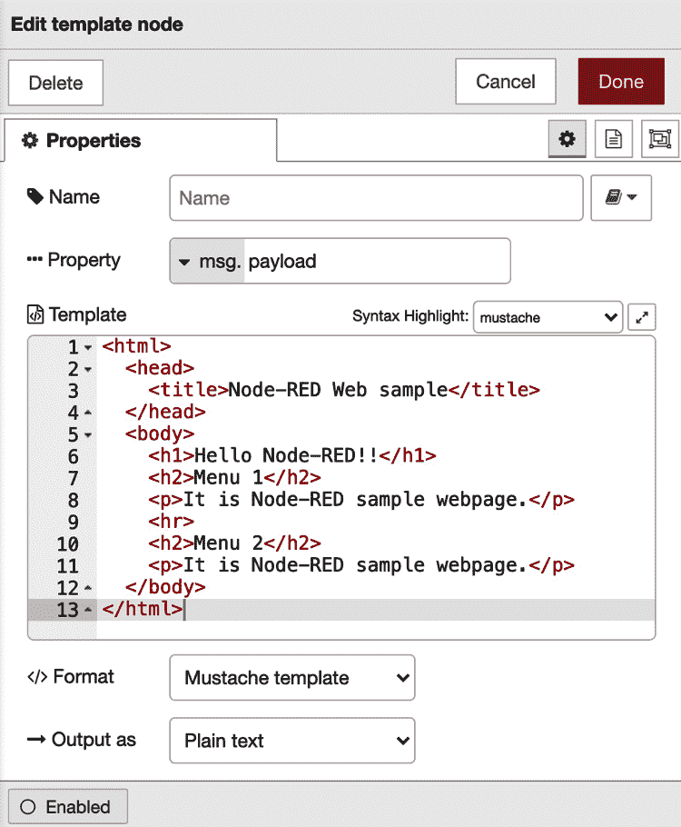

图 3.17-模板区域中的代码

有了这个，我们已经完成了准备要显示在我们页面上的 HTML。请确保再次单击`http://localhost:1880/web`。现在您应该看到以下输出：

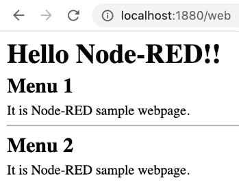

图 3.18-Web 应用程序的结果

此时，您应该了解如何在 Node-RED 上制作 Web 应用程序。我想到目前为止一切都很顺利。现在我们已经积累了一些动力，让我们继续学习。在下一节中，我们将导入和导出我们创建的流程定义。

# 导入和导出流程定义

在这一部分，您将导入和导出您创建的流程定义。通常，在开发时，需要备份源代码和版本控制。您还可以导入他人创建的源代码，或者导出自己的源代码并传递给他人。Node-RED 有类似的概念。在 Node-RED 中，导入和导出流本身是一种正常的做法，而不是导入或导出源代码（例如，前面描述的模板节点）。

因此，首先让我们导出到目前为止创建的流程。这很容易做到：

1.  只需在 Node-RED Flow Editor 的**Main**菜单下的**Edit**对话框中选择**导出**。

当显示**导出**菜单时，您只能选择当前流或所有流。您还可以选择原始 JSON（无缩进）或格式化 JSON（带缩进）。

1.  在这里，选择当前流并选择**格式化**。

1.  现在，您可以选择如何保存导出的 JSON 数据-在计算机的下载位置中保存`flows.json`。

1.  在文本编辑器中打开此文件，以便检查 JSON 文件的内容。

有了这个，我们已经学会了如何导出。

接下来，我们需要将此定义（`flows.json`）导入到我们的 Node-RED Flow Editor 中。请按照以下步骤操作：

1.  只需在 Node-RED Flow Editor 的**Flow**菜单中选择**导入**。

显示**导入**菜单时，您可以选择**粘贴流 json**或**选择基于文件的导入**。您还可以从流选项卡中选择**当前流**或**新流**。如果选择**新流**，将自动添加一个新的流选项卡。

1.  在这里，请选择您导出到本地计算机的`flows.json`。

1.  文件加载完成后，单击**导入**按钮：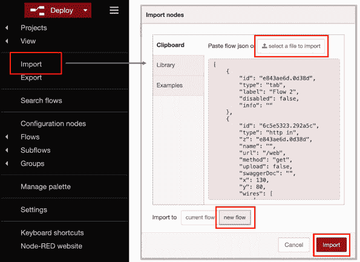

图 3.20-导入操作

1.  现在，您有了新的选项卡，名称为 Flow 2，与旧的 Flow 2 选项卡上相同的流。它已完全导入，但尚未部署，因此请单击**部署**按钮，如下所示：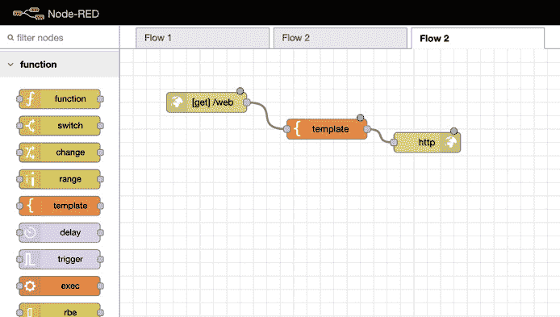

图 3.21-添加新流

有了这个，我们已经成功地准备好了我们导入的流程将显示在我们的网页上。请确保单击**部署**按钮。

1.  通过转到`http://localhost:1880/web`再次访问网页。

在这里，您将看到此网页与您导出的网页具有相同的设计。干得好！

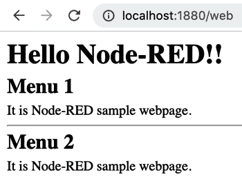

图 3.22-Web 应用程序的结果

现在，让我们结束这一章。

# 摘要

在本章中，您学习了如何使用 Node-RED Flow Editor 制作基本流程并导入/导出流程。现在您已经知道如何使用 Node-RED Flow Editor，您会想要了解更多其功能。当然，Node-RED 不仅具有诸如**Inject**、**http**和**template**等基本节点，还有更吸引人的节点，如**switch**、**change**、**mqtt**和**dashboard**。在下一章中，我们将尝试使用几个主要节点，以便我们可以编写 JavaScript，捕获错误，执行数据切换，延迟功能，使用 CSV 解析器等。
