# 第四章：学习主要节点

在本章中，您将了解 Node-RED 中使用的主要节点。Node-RED 是一个开源项目，默认情况下提供了一些主要节点，但可以根据需要导入和使用来自公共库的节点。

Node-RED 有很多节点。因此，本书不足以解释所有这些节点。因此，在本章中，让我们挑选主要节点和最常用的基本节点，并学习如何使用它们，探索本章中的这些主题：

+   什么是节点？

+   如何使用节点

+   从库中获取各种节点

在本章结束时，您将掌握如何在 Node-RED 流编辑器中使用主要节点。

# 技术要求

要在本章中取得进展，您需要以下技术要求：

+   Node-RED（v1.1.0 或更高版本）。

+   本章中使用的代码可以在[`github.com/PacktPublishing/-Practical-Node-RED-Programming`](https://github.com/PacktPublishing/-Practical-Node-RED-Programming)的`Chapter04`文件夹中找到。

# 什么是节点？

首先让我们了解 Node-RED 中的节点到底是什么。

Node-RED 是一个使用**图形用户界面**（**GUI**）工具编程 Node.js 应用程序的工具。Node-RED 还作为在 Node-RED 上编程的软件（Node-RED Flow）的执行环境。

通常，在使用 Node.js 进行编程时，源代码是用代码编辑器或**集成开发环境**（**IDE**）编写的。通过构建编写的源代码（编译，与依赖文件关联等），生成可执行文件。

在 Node-RED 上进行可视化编程基本上遵循相同的过程。不同之处在于，编码部分是将节点放置在 Node-RED 上，而不是编辑器。

在 Node-RED 中，使用 Node.js 编程时提供的基本处理由称为节点的实现部分提供。在正常的面向对象编程中，这些部分通常以常见部分的形式提供为库文件。

由于 Node-RED 是基于 GUI 的可视化编程工具，这些常见部分不仅仅是库文件。这些常见部分形状像盒子，在 Node-RED 中称为节点。此外，除了一些节点外，通常在编程时，节点可以将可以作为节点属性的变量（参数，参数等）设置为节点属性。

换句话说，由于已经编程了部分（节点），因此只需将它们放置在 GUI 中即可完成编程。以下图比较了纯 Node.js 编程与在 Node-RED 中创建流的情况：

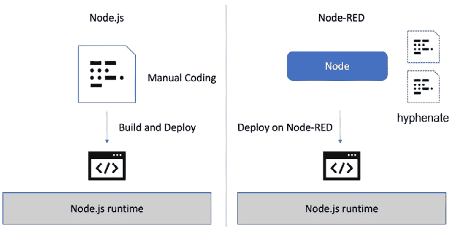

图 4.1 – Node-RED 与 Node.js 编程

现在您了解了 Node-RED 和节点的概念，让我们更仔细地看看节点。

当您启动 Node-RED 时，基本处理节点默认提供在 Node-RED 流编辑器中。这称为**预安装节点**。

以下是预安装节点的典型类别：

+   **常见**：这包括将特定数据注入流的节点，判断处理状态的节点以及用于调试输出日志的节点。

+   **功能**：这包括可以直接在 JavaScript 和 HTML 中编写的节点，可以转换参数变量的节点以及根据这些参数的内容进行条件分支的节点。

+   **网络**：这包括处理通信所需的协议处理的节点，如 MQTT，HTTP 和 WebSockets。

当然，这里给出的示例只是一小部分。实际上有许多更多的类别和节点。

重要提示

预安装的节点也取决于 Node-RED 版本。建议查看官方文档以获取有关您的 Node-RED 版本的信息：[`nodered.org/docs/`](https://nodered.org/docs/)。

节点在 Node-RED 流程编辑器中排列像零件一样，并且可以通过简单连接电线来使用。如前所述，除了一些节点外，您不必自己编写代码。

基本上，流程编辑器看起来像一个框，里面有一个设置窗口。在设置窗口中，您可以为每个节点设置所需的参数和配置：

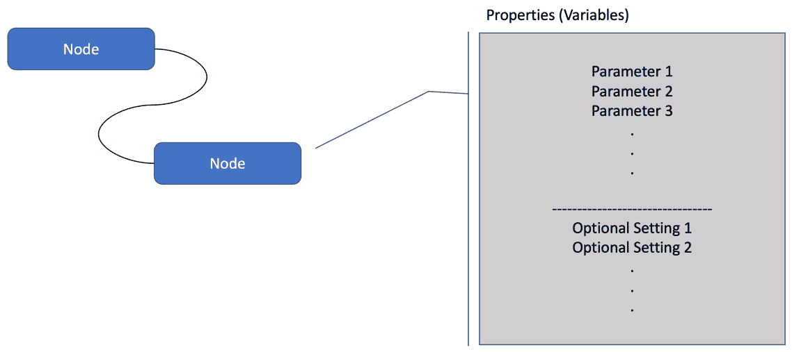

图 4.2 - 节点

这就是您需要了解的有关节点的所有概念。在下一节中，您将学习如何实际使用节点。

# 如何使用节点

在本节中，我们将学习如何使用节点。

在 Node-RED 中进行可视化编程与其他可视化编程工具有些不同，因为它使用基于流的编程。但请放心，这一点并不难。如果您实际创建了一些简单的流程，您应该能够掌握如何在 Node-RED 中使用节点。

因此，现在让我们使用一些典型的预安装节点创建一个示例流程。树莓派、Windows 和 macOS 系统的环境是相同的。请使用您喜欢的环境。

## 常见类别

让我们介绍一下我们将用来制作流程的节点。您可以从常见类别中将所有节点放置在调色板上。

使用常见类别中的节点创建一个示例流程。使用以下四个节点：

+   **inject**节点

+   **complete**节点

+   **catch**节点

+   **debug**节点

请按照以下图示放置和连接节点：

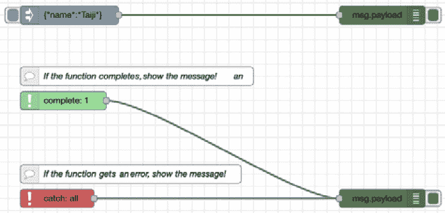

图 4.3 - 具有常见类别节点的流程

这里**inject**节点中的数据是简单的 JSON 数据。双击放置的**inject**节点以打开设置面板并设置 JSON 数据。请参考以下内容：

```js
{"name":"Taiji"}
```

您可以更改**inject**节点中的 JSON 数据以发送您想要发送的数据。此外，您应该设置**complete**节点的属性。打开设置面板并设置一个节点来观察状态。

将每个节点的参数设置如下：

+   使用以下 JSON 创建`msg.payload`：

```js
{"name": "Taiji"}
```

您可以在这里设置任何值：

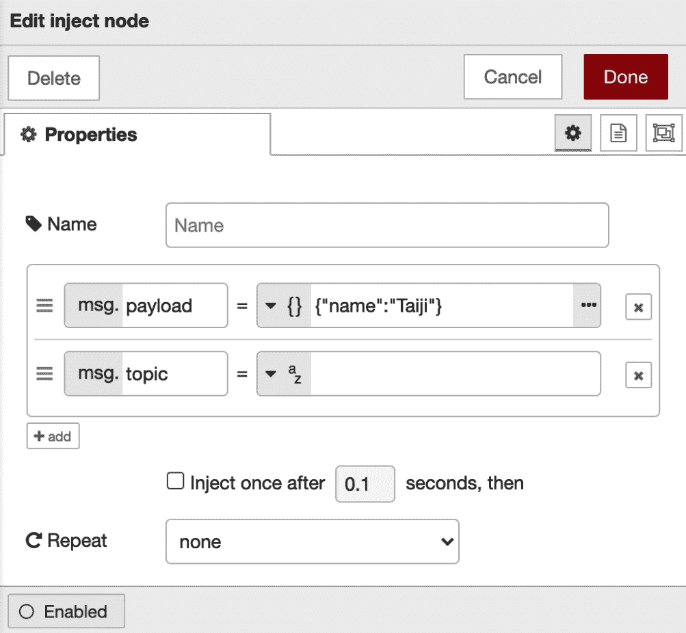

图 4.4 - 用于插入数据的注入节点

+   **complete**节点：

检查**属性**选项卡的第一个选项以观察**inject**节点的状态：

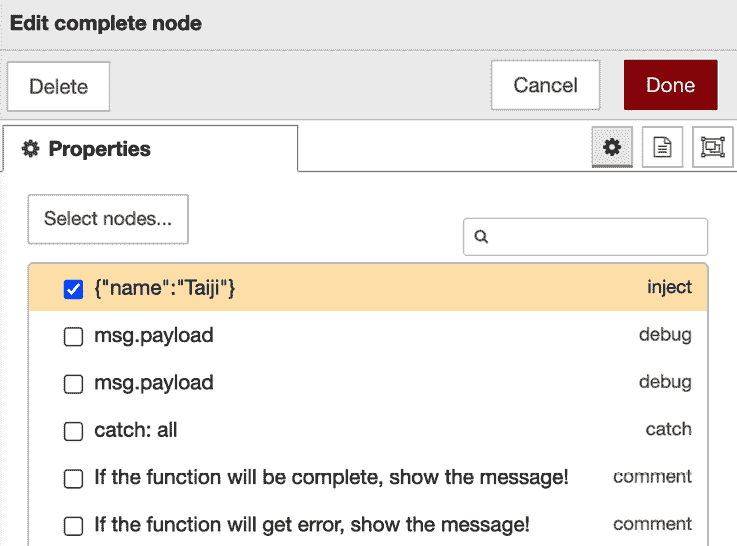

图 4.5 - 用于观察状态的完整节点

其他节点的属性无需更改。

设置更改后，您需要部署并单击**inject**节点的按钮。之后，您可以在**debug**选项卡的右侧面板中看到 JSON 数据。

您可以从本书的 GitHub 存储库中获取流程定义[`github.com/PacktPublishing/-Practical-Node-RED-Programming/blob/master/Chapter04/common-flows.json`](https://github.com/PacktPublishing/-Practical-Node-RED-Programming/blob/master/Chapter04/common-flows.json)。

## 函数类别

在本节中，我们将学习如何使用函数类别中的一些主要节点，并将使用这些节点制作一个流程。

使用函数类别中的节点创建一个示例流程。在这里，我们将使用以下六个节点：

+   **inject**节点

+   **function**节点

+   **switch**节点

+   **change**节点

+   **template**节点

+   **debug**节点

请按照以下图示放置和连接节点：

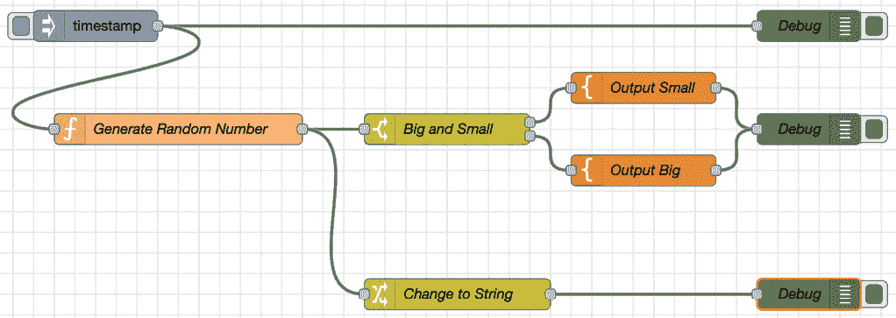

图 4.6 - 具有函数类别节点的流程

请按照以下步骤制作流程：

1.  将**inject**节点和**debug**节点放置在调色板上。这两个节点可以使用其默认参数。这里不需要更改设置。

1.  在调色板上放置一个**function**节点。

1.  打开**function**节点的设置面板，并输入以下代码：

```js
// generate random number
var min = 1 ;
var max = 10 ;
var a = Math.floor( Math.random() * (max + 1 - min) ) +   min ;
// set random number to message
msg.payload = a;
// return message
return msg;
```

1.  编码后，点击**Done**保存设置：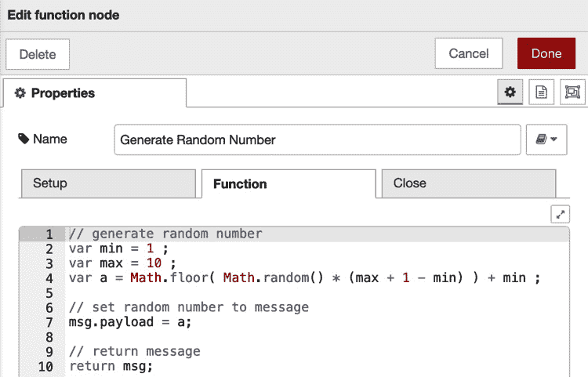

图 4.7–功能节点设置

1.  放置`6`

1.  `5`

应该如下所示：

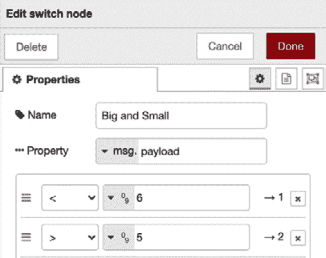

图 4.8–开关节点设置

如果输入参数为`5`或更少，则输出路由为`1`，如果输入参数为`6`或更多，则输出路由为`2`。这意味着下一个节点取决于输入参数的数量。

1.  在调色板上放置两个**template**节点。

之前的功能是**switch**节点，因此数据根据输出结果而分割。

1.  打开**switch**节点的每个`1`的设置面板：

```js
The number is small: {{payload}} !
```

一旦我们添加了前面的代码，**template**节点将看起来像以下屏幕截图：

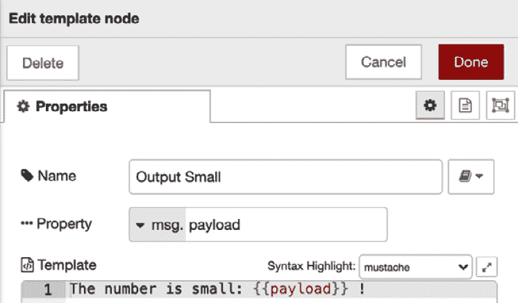

图 4.9–第一个模板节点设置

1.  输入第二个`2`的**switch**节点的以下代码：

```js
The number is big: {{payload}} !
```

它将看起来像以下屏幕截图：

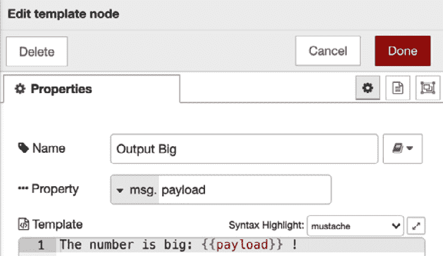

图 4.10–第二个模板节点设置

1.  将**change**节点放置在调色板上，打开**change**节点的设置面板，并查看**规则**下方的设置框。

1.  从**to**旁边的下拉菜单中选择**string**，并在旁边的文本框中输入所需的字符串。这里写着**已更改为字符串数据！**。请参考以下屏幕截图：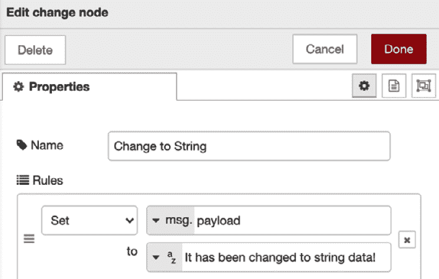

图 4.11–更改节点设置

1.  更改设置后，您需要部署并单击**inject**节点的按钮。

一旦您这样做，您可以在右侧面板的调试选项卡中看到数据，如下所示：

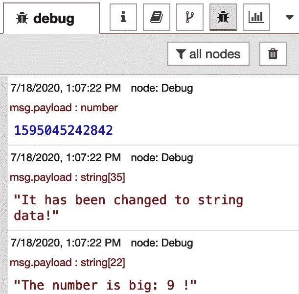

图 4.12–在调试选项卡中显示结果

第一个调试消息是默认的**inject**节点值作为时间戳。第二个是**change**节点后放置的**debug**节点的调试消息。最后一个取决于随机数，并由**template**节点格式化。

您可以从书的 GitHub 存储库中获取流程定义：[`github.com/PacktPublishing/-Practical-Node-RED-Programming/blob/master/Chapter04/function-flows.json`](https://github.com/PacktPublishing/-Practical-Node-RED-Programming/blob/master/Chapter04/function-flows.json)。

接下来，让我们了解一些默认未提供的节点。

# 从库中获取几个节点

您可以获得由 Node-RED 贡献者开发的几个更有吸引力的节点，并将它们安装在您的 Node-RED 流编辑器中。您可以找到新节点，分享您的流程，并查看其他人如何使用 Node-RED。在本节中，我们将学习如何从 Node-RED 库中获取几个其他节点。让我们首先访问 Node-RED 库站点：[`flows.nodered.org/`](https://flows.nodered.org/)。在以下屏幕截图中，您可以看到 Node-RED 库的外观：

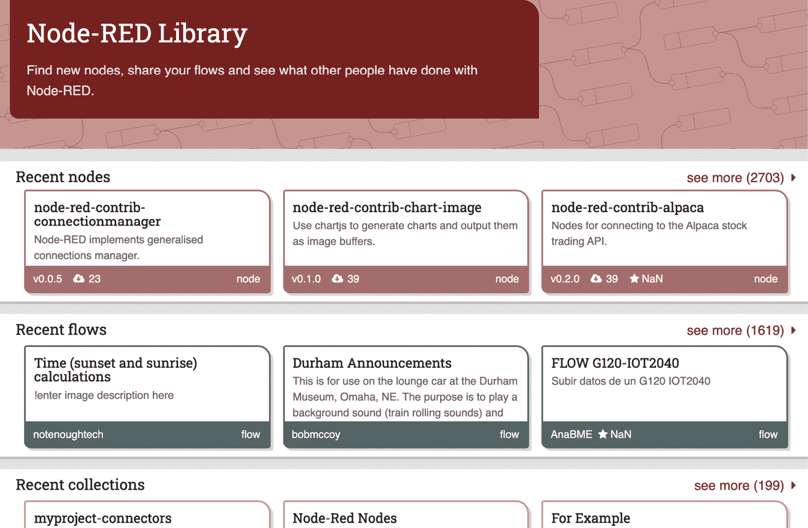

图 4.13–Node-RED 库

在您自己的 Node-RED 环境的流编辑器中使用此库非常容易。让我们看看如何从库中安装节点：

1.  从侧边栏菜单中选择**管理调色板**。您将看到**用户设置**面板打开，并选择了**调色板**选项卡。

1.  在搜索字段中键入`watson`，或者您想要使用的任何其他节点的名称。如果找到想要的节点，请单击**安装**按钮：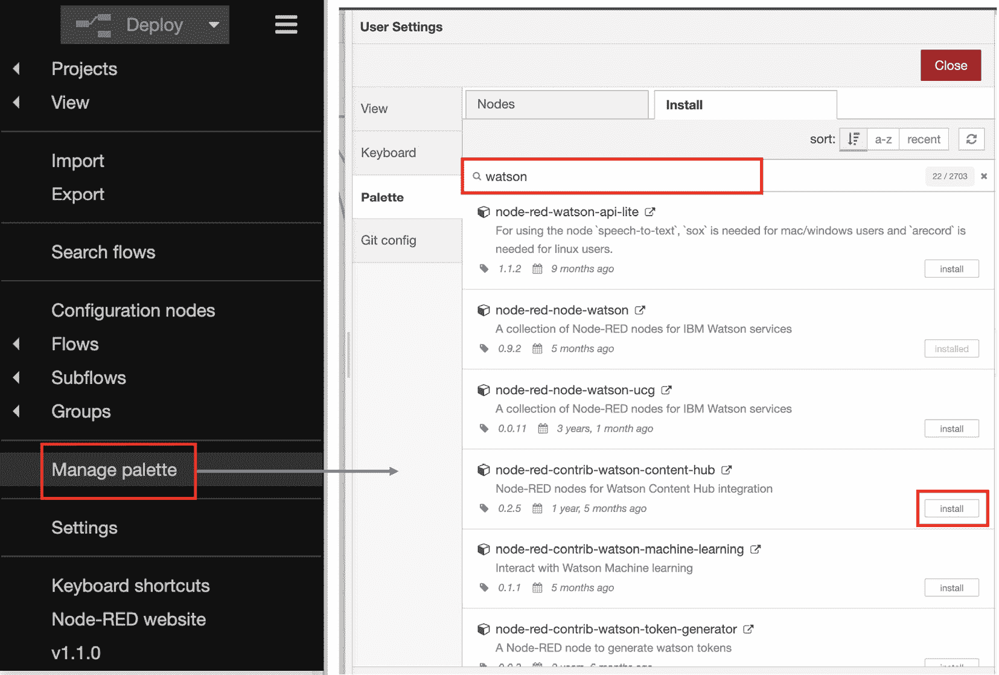

图 4.14–打开用户设置面板并找到要使用的节点

1.  单击**安装**按钮后，将出现一个弹出窗口，您需要再次单击**安装**。

一旦您这样做并且安装完成，您将收到一个弹出消息，上面写着**节点已添加到调色板**。

就是这样！你可以在调色板中看到你安装的所有节点，如下图所示：

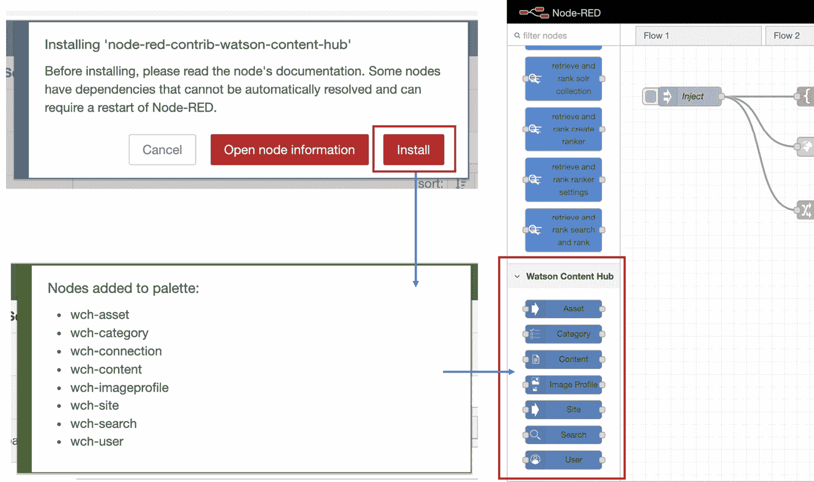

图 4.15 - 你安装的节点被添加到你的调色板中

提示

你可以在 Node-RED 库网站上搜索有用的节点。可以通过关键词搜索，并按照最近添加、下载次数和评分进行排序。我建议首先按下载次数排序，因为被许多开发者下载的节点很可能非常有用：[`flows.nodered.org/search?type=node&sort=downloads`](https://flows.nodered.org/search?type=node&sort=downloads)。

现在你已经成为了一个优秀的 Node-RED 用户，并且掌握了如何使用 Node-RED 流编辑器制作一些流程（应用程序）。

# 总结

在本章中，你学会了如何在 Node-RED 流编辑器中使用每个主要节点。你已经成功地制作了你的 Node-RED 流程！你在这里创建的流程步骤是你将来需要创建各种流程的大部分步骤。

本章学到的重要一点是，每个节点都有自己独特的特性。通过像拼图一样组合它们，我们可以创建一个类似于通过常规编程创建的应用程序的流程。

在下一章中，让我们为物联网边缘设备创建一个更实用的示例流程（应用程序）。
