# 第五章：本地实现 Node-RED

在本章中，让我们使用独立版本的 Node-RED。Node-RED 包括开发环境、执行环境和应用程序本身。您可以通过在本地环境中运行的独立版本来理解其机制。

具体来说，启动独立版本的 Node-RED 最常见的原因是在物联网边缘设备上使用它。物联网边缘设备通常具有传感器，这些传感器通常应用于“物联网”的“物”部分。在本章中，我们将查看边缘设备内的传感数据并创建一个示例流程。

让我们从以下四个主题开始：

+   在本地机器上运行 Node-RED

+   使用独立版本的 Node-RED

+   在边缘设备上使用物联网

+   创建一个示例流程

在本章结束时，您将学会如何构建处理物联网设备传感器数据的流程。

# 技术要求

要完成本章，您需要以下内容：

+   Node-RED（v1.1.0 或更高版本）：[`nodered.org/`](https://nodered.org/)

+   树莓派：[`www.raspberrypi.org/`](https://www.raspberrypi.org/)

本章中使用的代码可以在[`github.com/PacktPublishing/-Practical-Node-RED-Programming`](https://github.com/PacktPublishing/-Practical-Node-RED-Programming)的`Chapter05`文件夹中找到。

# 在本地机器上运行 Node-RED

现在我们可以为物联网边缘设备上的传感数据创建流程，在这种情况下，本地机器使用的是树莓派。关于这一点将在*使用独立版本的 Node-RED*部分中描述，但总的来说，本教程是为物联网边缘设备而设计的。

我已经解释了如何在树莓派上启动 Node-RED，所以您现在应该知道如何运行它，但如果您需要复习，请参考*第二章*中的*为树莓派安装 Node-RED*部分，*设置开发环境*。

现在，按照以下步骤在您的树莓派上启动 Node-RED：

1.  让我们从树莓派菜单中执行 Node-RED 开始：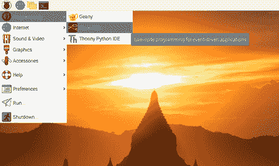

图 5.1 – 从树莓派菜单中运行 Node-RED

1.  您可以在终端上检查 Node-RED 的状态。如果显示**Started flows**，则 Node-RED 已准备就绪：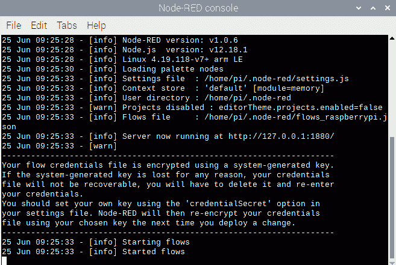

图 5.2 – 树莓派终端

1.  您可以通过`localhost:1880` URL 访问 Node-RED 流程编辑器：

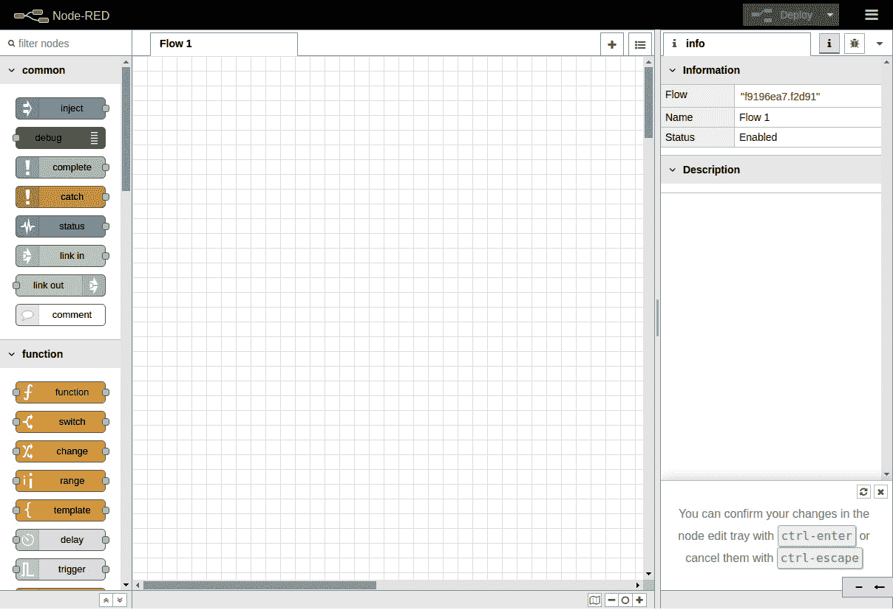

图 5.3 – Node-RED 流程编辑器

在使用流程编辑器之前，让我们学习一些概念。

# 使用独立版本的 Node-RED

现在我们将学习独立版本的 Node-RED 是什么，以及它与其他版本有何不同。通常我们使用 Node-RED 流程编辑器作为独立编辑器；然而，我们也可以在任何具有 Docker、Kubernetes 或 Cloud Foundry 等容器技术的云上使用 Node-RED 流程编辑器。我们将明确演示使用独立版本的用例，以学习如何使用它。

让我们思考一下 Node-RED 被使用的情况。

Node-RED 是用 Node.js 创建应用程序的工具。它也是执行环境。如果你能用 Node.js 编写应用程序，那就没问题。

那么，为什么要使用 Node-RED 构建应用程序呢？

一个答案是将每个数据处理单元视为黑匣子。这使得每个过程的作用非常清晰，易于构建和维护。

另一个答案是避免人为错误。由于每个过程都被模块化为一个节点，因此在使用该过程时，您只需要了解输入/输出规范。这意味着您可以避免人为错误，如编码错误和缺少测试规范。这也可以是无代码/低代码以及 Node-RED 的优势。

接下来，想象一个使用 Node-RED 的具体情况，具有刚刚描述的特征。

考虑一个控制数据并将其连接到下一个流程的业务逻辑。这在物联网解决方案中很常见。

物联网解决方案的标准架构是由边缘设备和云平台构建的。它将边缘设备获取的传感器数据发送到云端，然后在云端处理数据，如可视化、分析和持久化。

在本章中，我想专注于边缘设备部分。

边缘设备通常希望在将获取的传感器数据发送到云端之前对其进行一定程度的准备。这样做的原因是，如果您发送所有获取的数据，存在网络过载的风险。

因此，独立的 Node-RED 练习使用了树莓派，这是一个著名的物联网基础设施。

在本章中，我们将使用树莓派和 Grove Base 模块的**Grove Base HAT**。这是物联网边缘设备平台的标准之一，因此我们需要将 Grove Base 驱动程序安装到树莓派上。

重要提示

本章提供了一个使用 Grove Base HAT 的示例，这是相对便宜且可以购买的（链接在下一节中提到），但是任何可以连接到树莓派并在 Node-RED 上处理数据的传感器设备都可以处理数据。

当使用除 Grove Base HAT 传感器设备以外的模块时，请使用相应的节点并阅读本章。（如果没有相应的节点，则需要进行实现。）

您可以检查 Node-RED 库以查看是否存在与每个设备对应的节点：

[`flows.nodered.org/`](https://flows.nodered.org/)

让我们通过以下步骤准备在树莓派上使用 Grove Base HAT：

1.  让我们从在树莓派上执行以下命令开始：

```js
 $ curl -sL https://github.com/Seeed-Studio/grove.py/raw/master/install.sh | sudo bash -s -
```

1.  如果一切顺利，您将看到以下通知：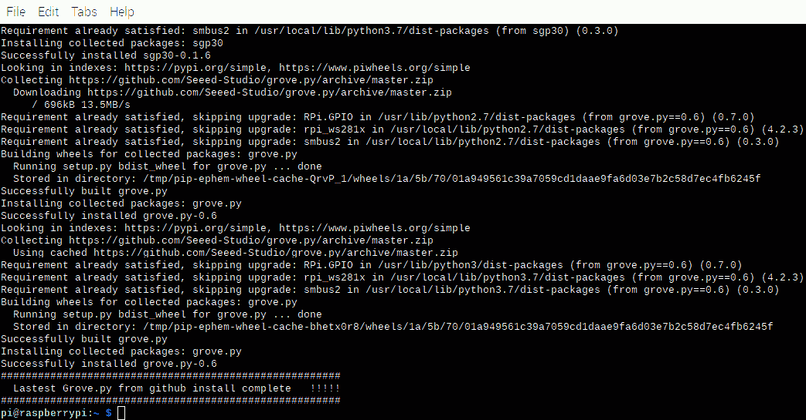

图 5.4 – 成功安装 grove.py

1.  接下来的步骤是启用 ARM I2C。我们可以通过执行以下命令来实现：

```js
 $ sudo raspi-config
```

1.  执行完命令后，您将看到以下配置窗口。请选择**接口选项**：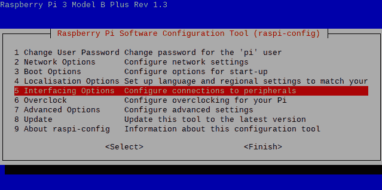

图 5.5 – 软件配置工具

1.  选择**I2C**：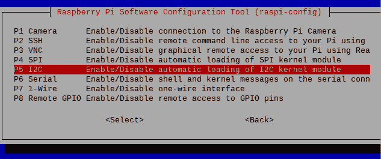

图 5.6 – 启用 I2C

1.  选择后，同一窗口将显示**是否要启用 ARM I2C 接口？**消息。请选择**是**以接受它。

您现在已成功启用了 I2C。重新启动树莓派并重新启动 Node-RED 流编辑器。通过这样做，您的树莓派已经可以使用 I2C 接口，下一步，我们需要通过 I2C 接口连接传感器设备和树莓派。

# 在边缘设备上使用物联网

现在让我们考虑物联网中边缘设备的案例研究。

物联网最近在几个行业中得到了采用，例如天气预报和农业领域；但是，基本构成是相同的。边缘设备获取的各种数据被发送到服务器端平台，如云端，并且数据在服务器端进行处理和可视化，这是充满资源的。有各种各样的可视化方式，但在最简单的情况下，将必要的数据值输出到日志作为标准输出。

在本章中，我想考虑物联网用例中的边缘设备部分。这是关于在传感器模块使用获取的传感器数据在去往服务器端进行格式化和缩小之前进行处理。

有哪些不同类型的传感器？

以下传感器通常在物联网的实验级别上使用：

+   温度

+   湿度

+   陀螺仪（加速度，角速度）

+   光

+   声音

+   压敏

+   磁性

在这里，我们将考虑使用光传感器和温度/湿度传感器将获取的值输出到日志的用例。

为了获取传感器数据，您需要一个设备。在这个示例流程（应用程序）中，使用的是树莓派，但它没有传感功能，因为它只是一个基础。使用老式的板，您必须焊接传感器设备/模块，但树莓派的方便之处在于有许多传感器模块套件可以一键连接。

如前所介绍的，我们将使用 Seeed 提供的 Grove 系列，该系列具有树莓派的传感器模块和连接板：[`wiki.seeedstudio.com/Grove_Base_Hat_for_Raspberry_Pi/`](https://wiki.seeedstudio.com/Grove_Base_Hat_for_Raspberry_Pi/)

让我们准备树莓派的 Grove Base HAT 模块。

重要提示

如果您没有树莓派的 Grove Base HAT 并且想要运行本教程，请通过官方网站购买（[`www.seeedstudio.com/Grove-Base-Hat-for-Raspberry-Pi.html`](https://www.seeedstudio.com/Grove-Base-Hat-for-Raspberry-Pi.html)）。

这就是用于树莓派的 Grove Base HAT 的样子：

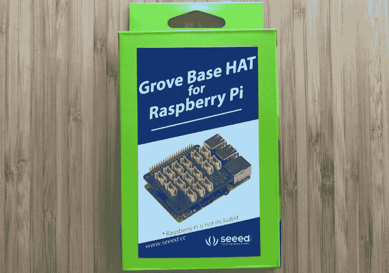

图 5.7 – 用于树莓派的 Grove Base HAT

我们需要将 Grove Base HAT 和传感器模块连接到树莓派。要做到这一点，请按照以下步骤进行：

1.  将 Grove Base HAT 放在树莓派上并拧紧：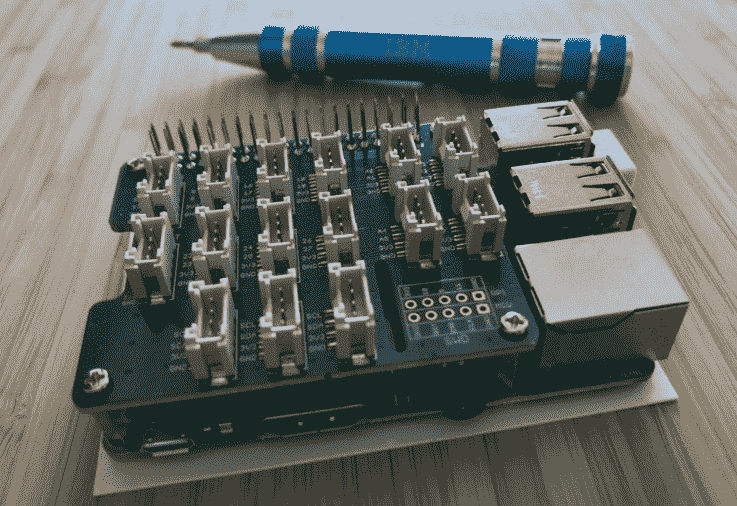

图 5.8 – 将 Base HAT 设置在您的树莓派上

这就是 Grove - 光传感器 v1.2 - LS06-S 光电晶体管的样子：

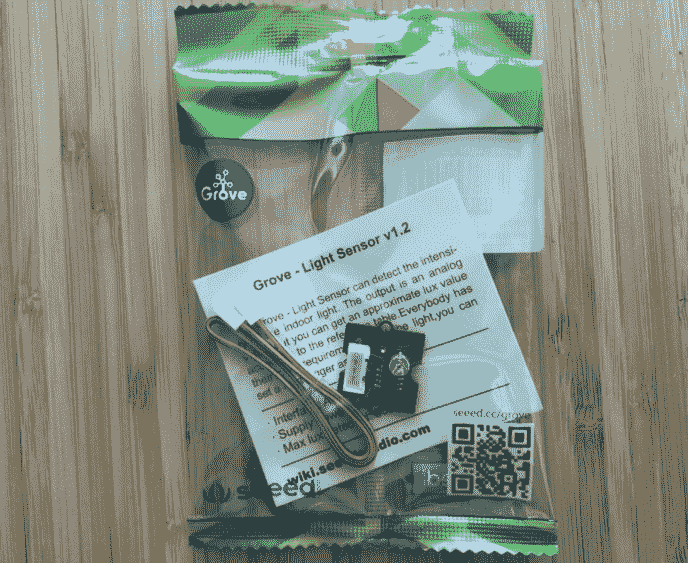

图 5.9 – Grove - 光传感器 v1.2

您可以从[`www.seeedstudio.com/Grove-Light-Sensor-v1-2-LS06-S-phototransistor.html`](https://www.seeedstudio.com/Grove-Light-Sensor-v1-2-LS06-S-phototransistor.html)获取它。

1.  将 Grove 光传感器连接到 Base HAT 的模拟端口：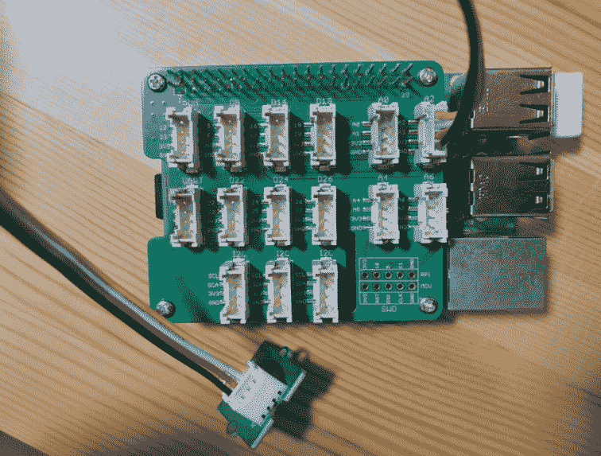

图 5.10 – 将光传感器连接到您的 Base HAT

重要提示

请注意！这家供应商**Seeed**有一个类似的温湿度传感器**SHT35**，但它不受 Grove Base HAT 节点支持。您需要使用**SHT31**。

这就是 Grove - 温湿度传感器（SHT31）的样子：

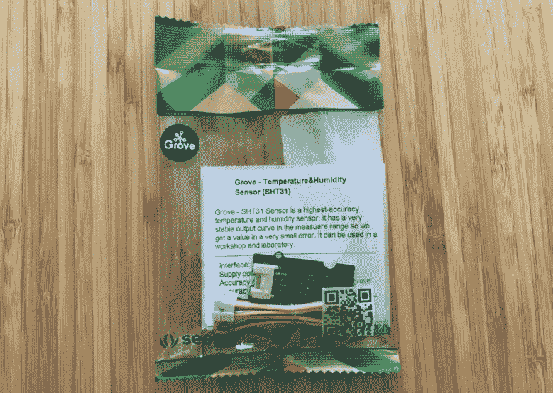

图 5.11 – Grove – 温湿度传感器（SHT31）

您可以从[`www.seeedstudio.com/Grove-Temperature-Humidity-Sensor-SHT31.html`](https://www.seeedstudio.com/Grove-Temperature-Humidity-Sensor-SHT31.html)获取它。

1.  将 Grove 温湿度传感器连接到 Base HAT 的 I2C 端口：

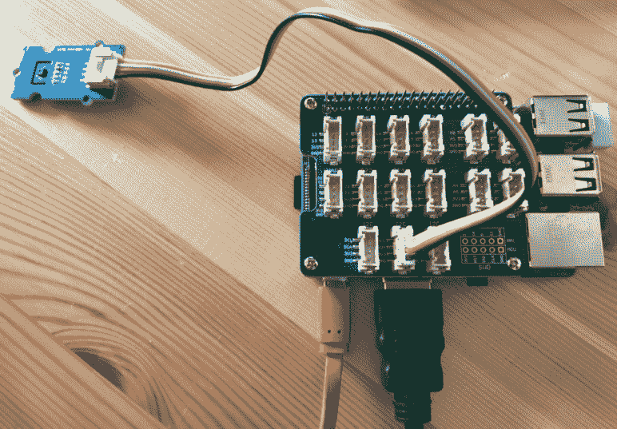

图 5.12 – 将温湿度传感器连接到您的 Base HAT

就是这样。现在您的设备已经设置好，我们准备进行下一步！在这一部分，我们已经了解了物联网边缘设备的流行简单用例，接下来，我们将为这些用例制作一个流程。

# 制作一个示例流程

在本节中，我们将在 Node-RED 流编辑器中创建这两个传感器数据输出流。

您将使用准备好的传感器模块收集数据，并创建一个示例流程，在 Node-RED 上将其可视化。通过使用两种不同的传感器模块，我们可以学习 Node-RED 中的数据处理基础知识。

## 用例 1 – 光传感器

第一个是光传感器。让我们创建一个流程（应用程序），检测光线并将固定点观察到的值输出到日志：

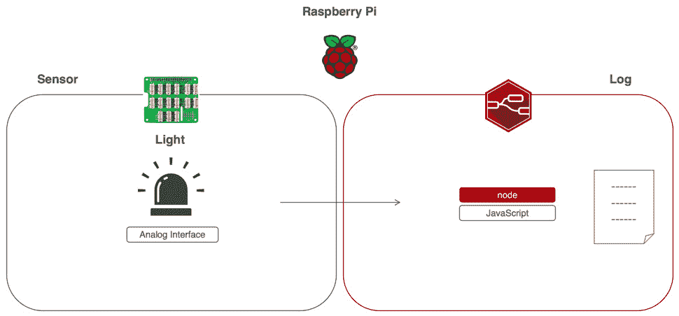

图 5.13 – 用例 1 – 获取光传感器数据

将光传感器模块连接到树莓派，并使用树莓派上的 Node-RED 流编辑器将获取的数据输出为标准输出。

## 用例 2 – 温湿度传感器

第二个是温度/湿度传感器。让我们创建一个应用程序（流），用于检测温度和湿度，并将通过固定点观察检测到的值输出到日志：

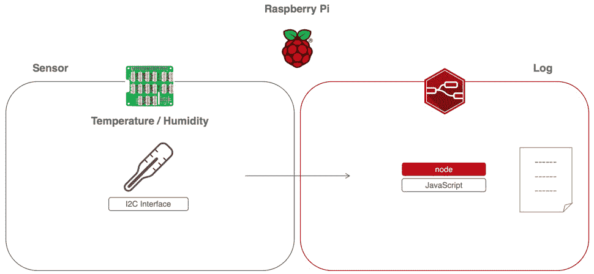

图 5.14 – 用例 2 – 获取温度/湿度数据

将温度/湿度传感器模块连接到树莓派，并使用树莓派上的 Node-RED 流程编辑器将获取的数据输出为标准输出。

如果您想在设备上对这两个用例进行现场测试，需要连接一个传感器，以获取传感器数据。

在创建流程之前，您可能需要准备这个。

这次，我们将使用 Grove Base HAT，它很容易与树莓派一起使用，由于上一步已经完成了设置，我们已经准备好在树莓派上访问数据。但是，我们还没有准备好 Node-RED。默认情况下，使用 Node-RED 访问这些数据是困难的。一种方法是使用 Function 节点并从头开始编写脚本，这非常困难但并非不可能。

为了处理 Raspberry Pi 在 Node-RED 上识别的传感器数据，需要一个专门用于 Grove Base HAT 的“节点”。

好消息是，您可以立即开始使用该节点。这是因为田中正吾（Seigo Tanaka）是 Node-RED 用户组日本董事会成员（[`nodered.jp/`](https://nodered.jp/)）和 Node-RED 贡献者，已经创建并发布了一个用于 Grove Base HAT 的节点。这是用于树莓派的 Grove Base HAT 节点：

```js
node-red-contrib-grove-base-hat
```

您可以在这里了解更多信息：[`www.npmjs.com/package/node-red-contrib-grove-base-hat`](https://www.npmjs.com/package/node-red-contrib-grove-base-hat)。

如果您需要复习如何安装发布在节点库中的节点，请阅读*第四章*中的*从库中获取多个节点*部分。

我之所以提到这一点，是因为下一步是将 Grove Base HAT 节点从库中安装到您的环境中。

让我们在 Node-RED 流程编辑器中启用 Grove Base HAT 节点：

1.  单击右上角的菜单，选择**管理调色板**以打开设置面板：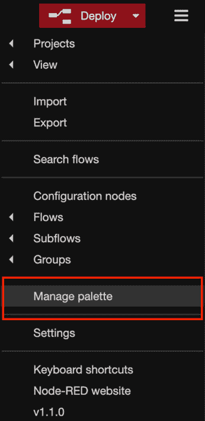

图 5.15 – 选择管理调色板

1.  打开设置面板后，在搜索窗口中输入您想要使用的节点名称。我们想要使用**node-red-contrib-grove-base-hat**，所以请键入以下内容：

```js
grove base
```

1.  之后，您可以在搜索窗口中看到**node-red-contrib-grove-base-hat**节点。单击**安装**按钮：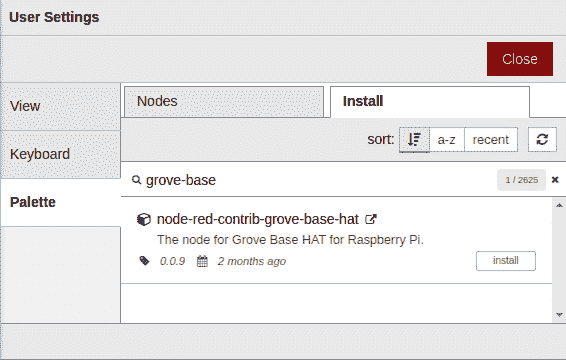

图 5.16 – 安装 node-red-contrib-grove-base-hat 节点

1.  单击**安装**按钮后，您将看到一条消息，要求您阅读文档以了解有关此节点的更多信息。如有必要，请阅读文档，然后单击消息框上的**安装**按钮：

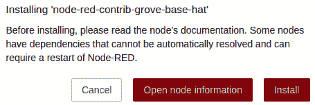

图 5.17 – 读取节点文档的消息窗口

现在您已经准备好使用 Grove Base HAT 节点了。检查流程编辑器中的调色板。在调色板底部，您可以看到已添加了 Grove Base HAT 节点：

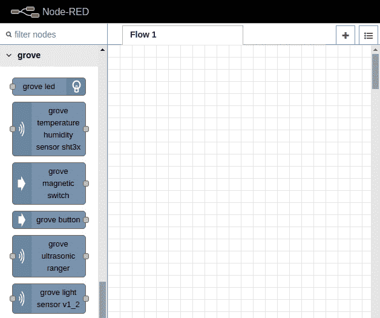

图 5.18 – 仪表板上的 Grove Base HAT 节点

Grove Base HAT 可以连接许多传感器模块。这次只使用了光线和温度/湿度传感器，但通过查看节点类型，还可以看到其他东西。

在这里创建的两个用例所遵循的程序也可以应用于使用其他传感器时。如果感兴趣，请尝试其他传感器。在下一节中，我们将为用例 1 创建一个流程。

## 为用例 1 制作流程 – 光传感器

在用例 1 中，Node-RED 可以用来处理从光传感器获取的光照强度作为 JSON 数据。该数据可以被处理为 JSON 数据，然后发送到服务器端，各种处理可以在边缘设备上轻松进行。

从光传感器获取的数值被 Node-RED 接收，并且输出为调试日志（标准输出）。我们可以通过以下步骤设置这一点：

1.  从流编辑器左侧的调色板中选择**grove light sensor v1_2**节点，然后将其拖放到工作区中放置：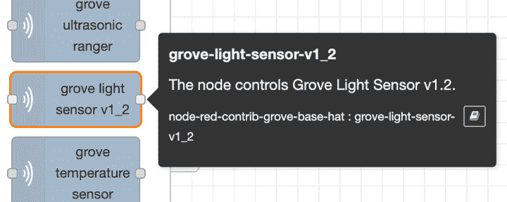

图 5.19 – grove light sensor v1_2

该节点允许传感器设备的值，通过 Raspberry Pi 通过 Grove Base HAT 持续获取，被处理为 Node-RED 上的 JSON 格式消息对象。

1.  在放置**grove-light-sensor-v1_2**节点后，放置**inject**节点和**debug**节点，并将它们连接，使得您放置的**grove-light-sensor-v1_2**节点被夹在它们之间：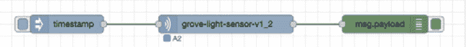

图 5.20 – 放置节点并为光传感器连接它们

1.  接下来，检查**grove-light-sensor-v1_2**节点的设置。双击节点打开设置面板。

1.  在设置面板中有一个名为**Port**的选择项。**A0**是默认选择项。

这个**Port**设置是为了指定 Grove Base HAT 上的哪个连接器从连接的模块获取数据。

1.  早些时候，我们将 Grove 光传感器连接到了 Grove Base HAT。如果按照本教程中的步骤进行连接，它应该连接到 A2 端口，因此选择**A2**作为节点设置值。如果连接到另一个端口，请选择您要连接的端口：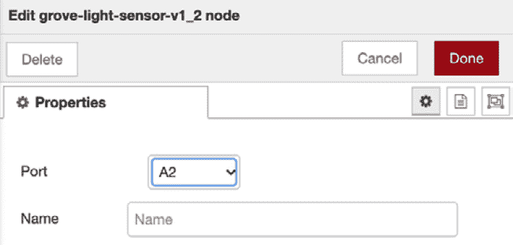

图 5.21 – 如果您将传感器连接到 Base HAT 的 A2，则选择 A2 作为端口

1.  在设置面板上检查和设置**Port**后，点击右上角的**Done**按钮关闭设置面板。

就是这样！不要忘记点击**deploy**按钮。

您应该记住如何从 inject 节点执行流程，因为您在上一章中学习了这个。点击 inject 节点上的开关来运行流程。当点击开关时的时间数据被输出为日志，所以请尝试点击几次。

重要提示

不要忘记显示调试窗口，以显示获取数据的值将输出到调试窗口。即使调试输出被激活，Node-RED 也不会自动显示调试窗口。

**debug**窗口中的输出结果如下：

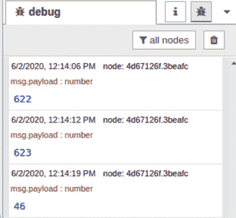

图 5.22 – 光传感器流的结果

您可以看到结果输出到**debug**窗口。

恭喜！通过这个，我们成功地创建了一个处理第一个光传感器值的基本流程（应用程序）与 Node-RED。

您也可以在这里下载流程定义文件：[`github.com/PacktPublishing/-Practical-Node-RED-Programming/blob/master/Chapter05/light-sensor-flows.json`](https://github.com/PacktPublishing/-Practical-Node-RED-Programming/blob/master/Chapter05/light-sensor-flows.json)。

## 为用例 2 制作流程 – 温湿度传感器

在用例 2 中，Node-RED 可以用来处理从温湿度传感器获取的温度和湿度作为 JSON 数据。这些数据可以被处理为 JSON 数据，然后发送到服务器端，各种处理可以在边缘设备上轻松进行。

从温湿度传感器获取的数值被 Node-RED 接收，并且输出为调试日志（标准输出）：

1.  从流程编辑器左侧的调色板中选择 **grove temperature humidity sensor sht3x** 节点，然后将其拖放到工作区中放置：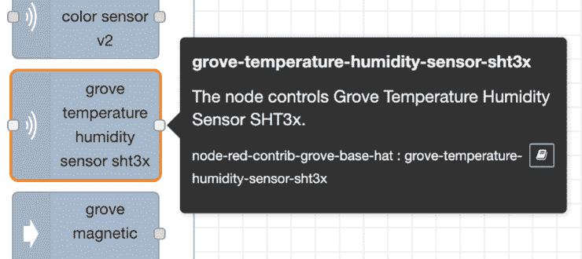

图 5.23 - grove temperature humidity sensor sht3x

这个节点允许将在树莓派上通过 Grove Base HAT 持续获取的传感器设备的值作为 JSON 格式的消息对象在 Node-RED 上处理。

1.  放置 **grove-temperature-humidity-sensor-sht3x** 节点后，分别放置 **inject** 和 **debug** 节点，并将它们连接起来，使得您放置的 **grove-temperature-humidity-sensor-sht3x** 节点被夹在它们之间：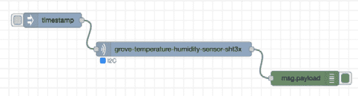

图 5.24 - 放置节点并为温湿度传感器连接线路

1.  接下来，检查 **grove-temperature-humidity-sensor-sht3x** 节点的设置，并双击节点打开设置面板。

实际上，这个节点没有要设置的值（严格来说，可以设置名称，但这个设置的有无不影响操作）：

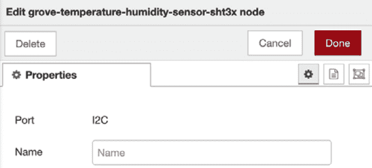

图 5.25 - 已设置为 I2C 端口

您可以在设置面板上看到端口被指定为 **I2C**（不可更改）。如果您按照本文档中的步骤将 Grove 温湿度传感器连接到 Grove Base HAT，模块应正确连接到 **I2C** 端口。如果它连接到除 I2C 之外的端口，请重新正确连接。

1.  在设置面板上检查 **端口**，然后点击右上角的 **完成** 按钮关闭设置面板。

就是这样！不要忘记点击 **部署** 按钮。

1.  点击注入节点上的开关以运行流程。当点击开关时的时间数据将作为日志输出，所以请尝试点击几次。

重要提示

如前所述，请不要忘记显示调试窗口，以显示获取数据的值将作为输出显示在调试窗口中。即使启用了调试输出，Node-RED 也不会自动显示调试窗口。

**调试** 窗口中的输出如下所示：

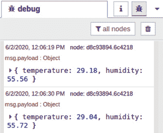

图 5.26 - 温湿度传感器流程的结果

您可以看到结果被输出到 **调试** 窗口。

恭喜！通过这个，我们已经成功创建了一个基本的流程（应用程序），用 Node-RED 处理第二个样本，即温湿度传感器的数值。

您也可以在这里下载这个流程定义文件：[`github.com/PacktPublishing/-Practical-Node-RED-Programming/blob/master/Chapter05/light-sensor-flows.json`](https://github.com/PacktPublishing/-Practical-Node-RED-Programming/blob/master/Chapter05/light-sensor-flows.json)。

干得好！现在您已经学会了如何在 Node-RED 上处理以 JSON 格式获得的光照传感器和温湿度传感器的数据。

# 总结

在本章中，您学会了如何通过将 Node-RED 与真实的 IoT 用例进行比较来创建一个样本流程（应用程序）。我们通过使用传感器模块和树莓派与 Node-RED 交换数据，对 IoT 有了一定的了解。

在这里创建的流程步骤将帮助您将来在边缘设备中使用其他传感器模块创建不同的流程。

在下一章中，我们将像这次一样使用 IoT 用例，但我们将在云端（服务器端）创建一个实际的样本流程（应用程序）。
