# 第六章：在云中实现 Node-RED

在本章中，我们将学习如何利用 Node-RED，在云平台上（主要是作为服务的平台）独立使用。**作为服务的平台**（**PaaS**）提供了一个作为应用执行环境的实例，应用开发人员只需专注于执行自己创建的应用，而不用耗费精力构建环境。Node-RED 实际上是一个 Node.js 应用，因此您可以在任何具有 Node.js 运行时环境的地方运行它。

有各种主要的大型云，如 Azure、AWS 和 GCP，但 Node-RED 在 IBM Cloud 中默认准备了一个入门应用（在 IBM Cloud 上可以启动的 Web 应用称为入门应用），所以我们将在本章中使用它。

在本章中，我们将涵盖以下主题:

+   在云上运行 Node-RED

+   在云中使用 Node-RED 的具体情况是什么？

+   服务器端的物联网案例研究

+   创建一个示例流程

在本章结束时，您将掌握如何在云上构建处理传感器数据的流程。

# 技术要求

本章中使用的代码可以在[`github.com/PacktPublishing/-Practical-Node-RED-Programming`](https://github.com/PacktPublishing/-Practical-Node-RED-Programming)的`Chapter06`文件夹中找到。

# 在云上运行 Node-RED

这次我们将使用 IBM Cloud。原因是 IBM Cloud 上有 Node-RED Starter Kit。这是一种软件样板，包括 Node-RED 在云上所需的服务，如数据库、CI/CD 工具等。

如果您还没有使用过 IBM Cloud，不用担心 - IBM 提供免费的 IBM Cloud 账户（Lite 账户），无需注册信用卡。您可以在[`ibm.biz/packt-nodered`](http://ibm.biz/packt-nodered)注册 IBM Cloud Lite 账户。

在 IBM Cloud 上使用 Node-RED 之前，您需要完成 IBM Cloud Lite 账户的注册流程。

重要提示

在本书中，我们强烈建议您在使用 IBM Cloud 时选择 Lite 账户。您可以随意从 Lite 账户升级到标准账户（PAYG/按使用付费），这意味着您可以通过注册信用卡自动升级到 PAYG。

请注意，使用 Lite 账户可以免费使用的服务，在 PAYG 中可能会收费。

现在，让我们按照以下步骤在 IBM Cloud 上启动 Node-RED：

重要提示

这里提供的说明/截图在撰写时是正确的。IBM Cloud 的用户界面变化如此之快，可能与当前的用户界面不同。

1.  使用您之前创建的账户登录 IBM Cloud ([`cloud.ibm.com`](https://cloud.ibm.com))：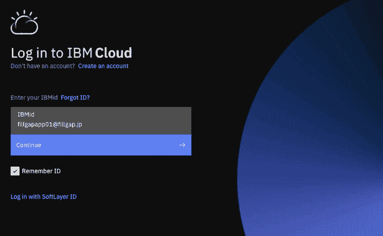

图 6.1 - 通过您的 Lite 账户登录

1.  登录 IBM Cloud 后，您将在屏幕上看到您自己的仪表板。如果这是您第一次使用 IBM Cloud，在仪表板上将不会显示任何资源: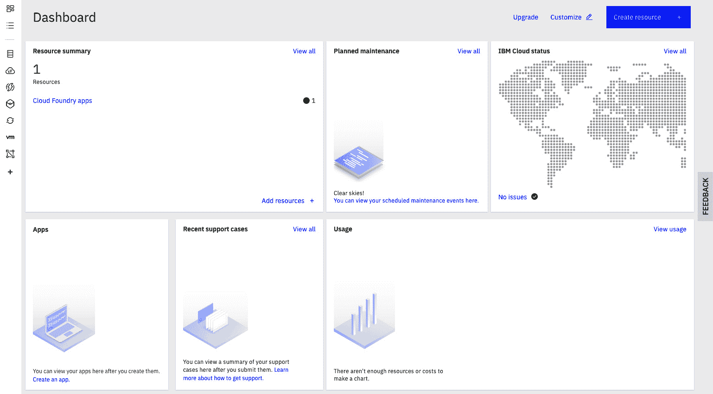

图 6.2 - IBM Cloud 仪表板

接下来，我们将在这个云平台上创建 Node-RED。

1.  我们将在云上创建 Node-RED 作为一个服务。从左上角的菜单中点击**应用开发**，然后点击**获取一个入门套件**按钮。这样可以创建一个新的应用服务: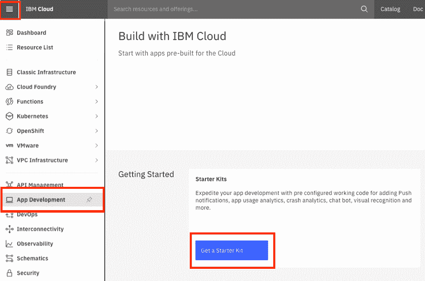

图 6.3 - 获取入门套件按钮

1.  如果您在搜索框中输入`Node-RED`，就可以找到 Node-RED。找到后，点击**Node-RED**面板: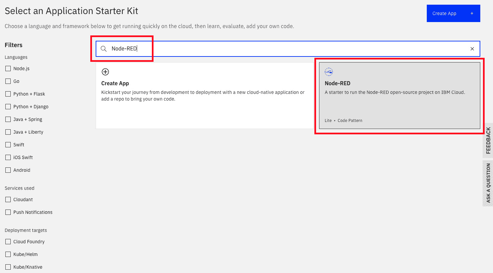

图 6.4 - Node-RED 入门套件

1.  点击**Node-RED**面板后，我们需要设置一些项目。

您可以通过提供自己的值自由更改每个项目，但在本章中，这里设置的值将用于解释目的。

请参阅*图 6.5*以进行配置的设置和值。请注意，一旦设置，这些项目将无法在以后更改。

1.  设置所有项目后，点击**创建**按钮：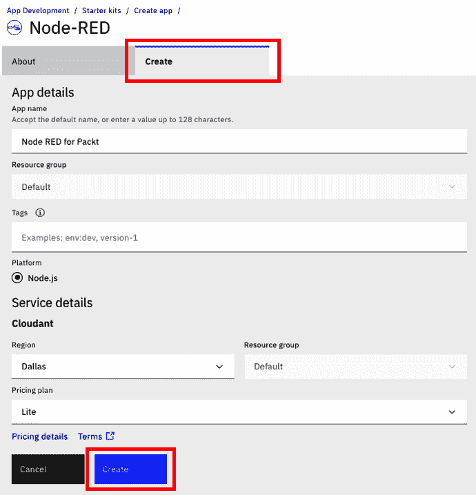

图 6.5 - 将 Node-RED 创建为 Node.js 应用程序

您现在已经创建了 Node-RED 应用程序的框架。之后，您将被自动重定向到**应用程序详细信息**屏幕，在那里您将能够看到链接服务的**Cloudant**实例也已经被配置。

然而，只有应用程序源代码和合作服务的实例被创建，它们尚未部署到 IBM Cloud 上的 Node.js 执行环境中。实际部署将在启用 CI/CD 工具链时完成。

1.  一切准备就绪后，点击屏幕中央的**部署您的应用**按钮以启用它：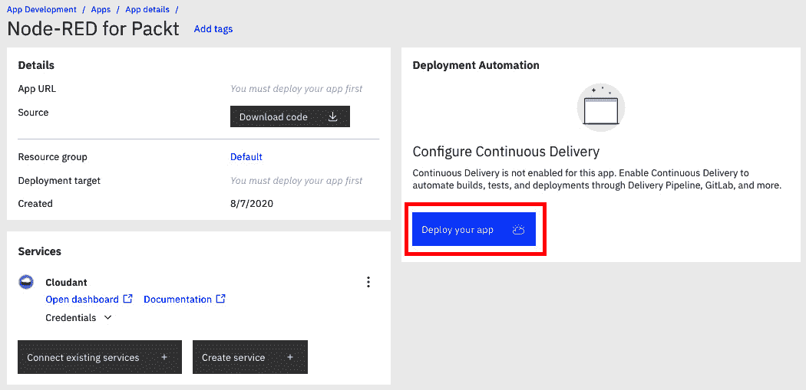

图 6.6 - 部署您的 Node-RED 应用程序

1.  点击**部署您的应用**按钮后，转到应用程序设置窗口。

1.  您将被要求创建 IBM Cloud API 密钥。不用担心，因为它将自动生成。点击**新建**按钮打开一个新的弹出窗口，然后在弹出窗口上点击**确定**按钮。一旦您这样做，IBM Cloud API 密钥将被生成：

IBM Cloud API 密钥

IBM Cloud API 密钥用于控制您的 IBM Cloud 帐户和各种服务（例如，在本教程中是 Cloud Foundry）。您可以使用它来为 IBM Cloud 上的服务发行外部访问令牌，例如。您可以在这里了解有关 IBM Cloud API 密钥的更多信息：[`cloud.ibm.com/docs/account?topic=account-manapikey`](https://cloud.ibm.com/docs/account?topic=account-manapikey)。

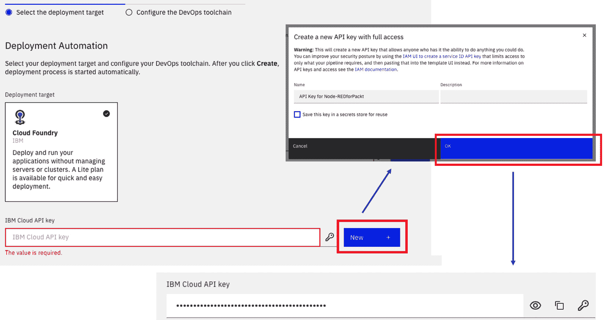

图 6.7 - 生成 IBM Cloud API 密钥

1.  在窗口中选择资源规范。

这一次，我们使用的是 IBM Cloud 的 Lite 帐户，因此我们在 IBM Cloud 上只有 256 MB 的内存可用于所有服务。因此，如果我们为 Cloud Foundry Node.js 服务使用 256 MB，我们将无法为其他服务使用更多内存。但是 Node-RED 需要 256 MB 才能在 IBM Cloud 上运行，因此请在这里使用 256 MB。默认情况下已经为实例分配了 256 MB，因此点击**下一步**按钮，不更改任何参数：

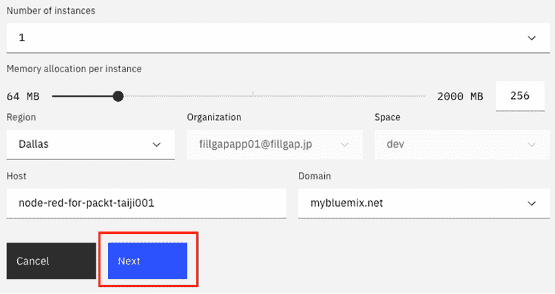

图 6.8 - Node.js 运行时实例详细信息

完成此操作后，将显示**DevOps 工具链**设置屏幕。

1.  点击**创建**按钮，填入默认值。

您可以将 DevOps 工具链名称更改为任何您喜欢的名称。这是用于标识您在 IBM Cloud 中创建的工具链的名称：

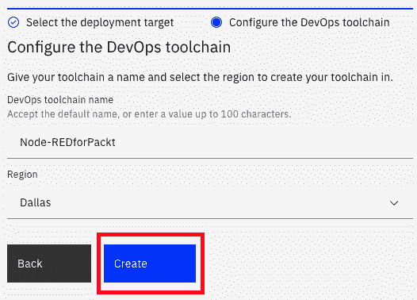

图 6.9 - 配置 DevOps 工具链窗口

现在，您可以使用环境（Node.js 运行时和 DevOps 工具链）来运行您在上一步中创建的 Node-RED 应用程序。您创建的 Node-RED 应用程序会通过工具链自动部署在 Node.js 运行时上。

1.  确认**交付管道**（DevOps 工具链中执行每个工具的管道）区域中显示的**状态**为**成功**，然后点击其上方的工具链名称（在本例中为**Node-REDforPackt**）：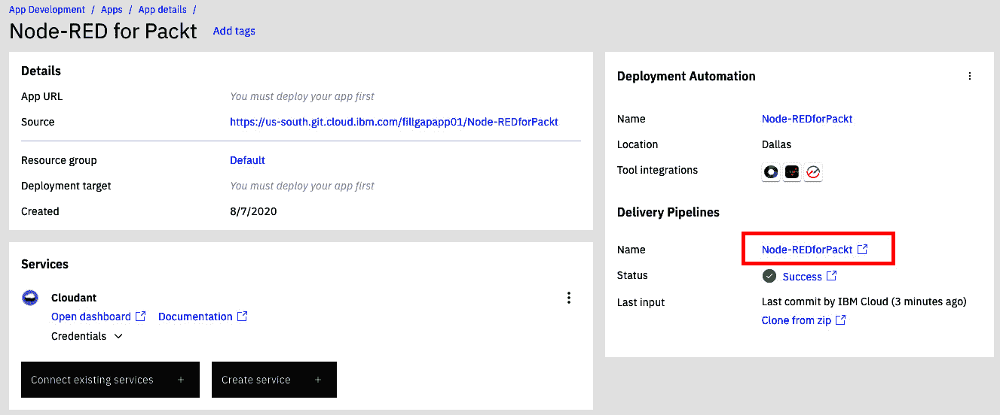

图 6.10 - 检查 Node-RED 的状态并转到 Pipeline 工具

在**交付管道**中，检查**构建**和**部署**面板的状态是否都是绿色并显示**阶段通过**。

1.  在**DEPLOY**面板下的**LAST EXECUTION RESULT**下点击**查看控制台**：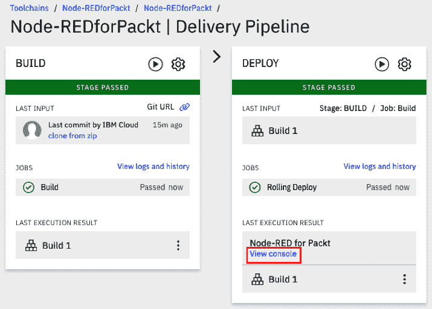

图 6.11 - 检查每个阶段的状态并转到应用程序控制台

1.  在 Node-RED 应用程序的控制台屏幕上，确认状态为**运行**，然后单击**查看应用 URL**：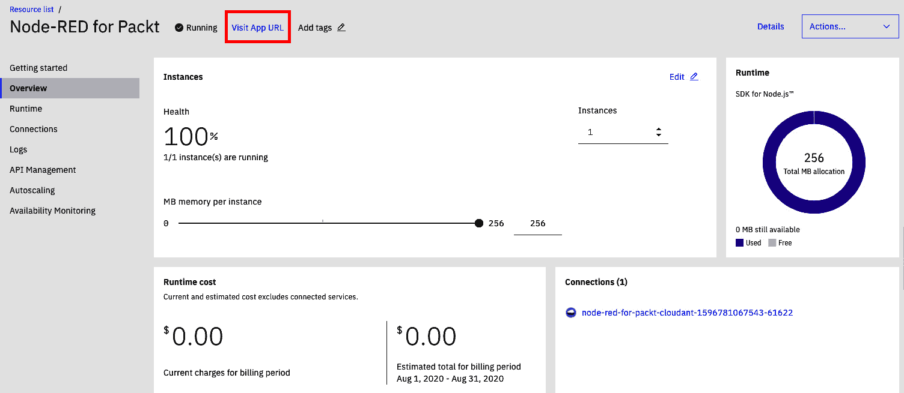

图 6.12 - 检查 Node-RED 是否正在运行并打开 Flow Editor

干得好！您在 IBM Cloud 上打开了 Node-RED 流编辑器。接下来，我们将开始使用您刚刚打开的 Node-RED 流编辑器。

如果在执行这些步骤时出现任何错误，最好删除 Cloud Foundry App、Cloudant 和 DevOps 工具链，并按照之前提到的相同步骤重新创建它们。

1.  设置**用户名**和**密码**以访问您在 IBM Cloud 上的流编辑器。

点击**访问应用 URL**后，您将被重定向到初始设置对话框，以便您可以在 IBM Cloud 上使用 Node-RED 流编辑器。

您可以通过单击每个**下一步**按钮来继续此对话框，但请注意，您应该选择**安全地设置编辑器，以便只有经过授权的用户才能访问它**，并使用**用户名**和**密码**登录以便登录到您自己的流编辑器。这是因为此流编辑器作为公共 Web 应用程序在 IBM Cloud 上。这意味着任何人都可以访问您的流编辑器，如果知道 URL 的话。因此，我强烈建议您选择此选项并设置您自己的**用户名**和**密码**值：

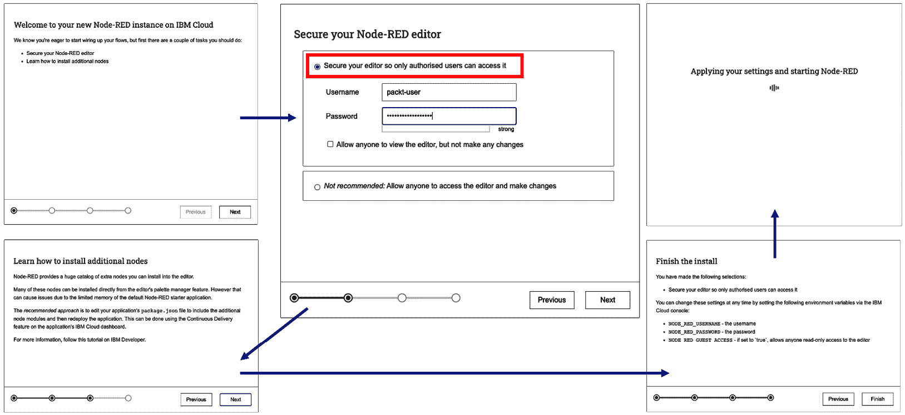

图 6.13 - 设置用户名和密码以访问流编辑器

我们快要完成了！

1.  单击**转到您的 Node-RED 流编辑器**按钮，然后使用在上一步中设置的**用户名**和**密码**详细信息登录：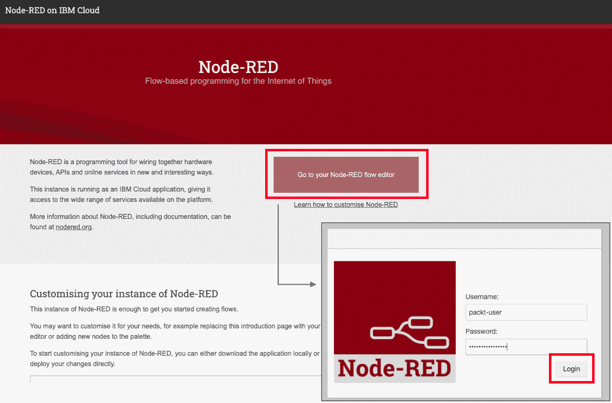

图 6.14 - 登录到您的 Node-RED 流编辑器

接下来，我们将检查 IBM Cloud 上的 Node-RED 流编辑器，并查看它是否可用。

1.  单击**注入**节点并检查结果：

图 6.15 - 默认示例流

](img/Figure_6.15_B16353.jpg)

图 6.15 - 默认示例流

当您单击**注入**节点时，您将在**调试**选项卡上看到结果值：

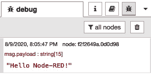

图 6.16 - 检查结果

现在，您可以在 IBM Cloud 上的 Node-RED 中创建一个流。Node-RED 流编辑器始终作为 IBM Cloud 上的 Node.js 应用程序运行。这意味着在 IBM Cloud 上启用了 Node.js 运行时服务（实例）。换句话说，与在树莓派上运行的 Node-RED 不同，此版本的 Node-RED 通过互联网访问流编辑器。

在接下来的部分，我将简要解释一下在这样的云上使用 Node-RED 的情况。

# 在云中使用 Node-RED 的具体情况是什么？

让我们重新审视 Node-RED 在云中的使用情况。

正如我们在上一章中提到的，Node-RED 既是一个工具，也是一个用 Node.js 编写的 Node.js 应用程序的执行环境。作为使用 Node-RED 构建应用程序的原因，我解释了通过黑箱化数据处理的各个单元，每个过程的作用变得非常清晰，易于构建和维护。

这不仅是在边缘设备上的原因，也是在服务器端（云端），用于持久化、分析和可视化由边缘设备收集的数据。

Node-RED 最大的特点是以消息的形式将 Node.js 的处理以顺序或并行的方式连接到输入/输出数据块的处理。可以说这非常适合物联网数据处理。

再次，正如我们在上一章中讨论的那样，物联网解决方案的标准架构是建立在边缘设备和云平台上的。它将边缘设备获取的传感器数据发送到云端，使其持久化，并为所需的处理链进行处理。

本章将重点关注云的这一部分。

边缘设备和云实际上还没有连接。假设数据已传递到云端，让我们将数据持久化存储在数据库中并进行可视化。

我们将使用在 IBM Cloud 上的 Node-RED 中所有开发人员都喜欢的仪表板节点。

在您在 IBM Cloud 上使用 Node-RED 之前，请安装一个新节点；即**node-red-dashboard**。

Node-RED 提供了**调色板管理器**，它易于安装，用于直接安装额外的节点。当您使用大量节点时，这非常有帮助。但是，由于 IBM Cloud Lite 帐户的 Node-RED 应用内存有限，可能会出现问题。

因此，在这里，我们需要获取`package.json`文件并在 IBM Cloud 上重新部署 Node-RED 应用程序。

您可以在[`flows.nodered.org/node/node-red-dashboard`](https://flows.nodered.org/node/node-red-dashboard)了解有关此节点的信息。

按照以下步骤对`package.json`文件进行更改：

1.  在 IBM Cloud 的 Node-RED **应用详情**页面上，点击**源代码**。这将把您重定向到一个 Git 仓库，您可以在那里编辑 Node-RED 应用的源代码：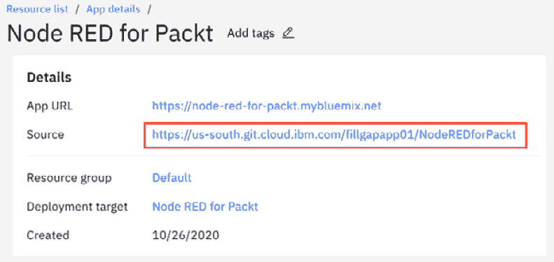

图 6.17 – 访问您的应用源代码

1.  点击文件列表上的`package.json`。这个文件定义了您的应用程序的模块依赖关系：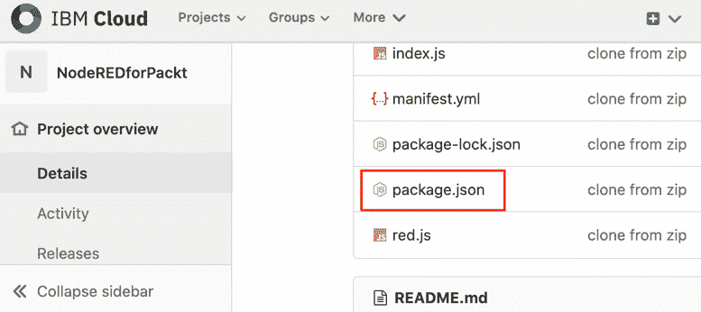

图 6.18 – 选择 package.json

1.  点击`dependencies`部分：

```js
"node-red-dashboard": "2.x",
```

1.  添加任何提交消息并点击**提交更改**按钮：

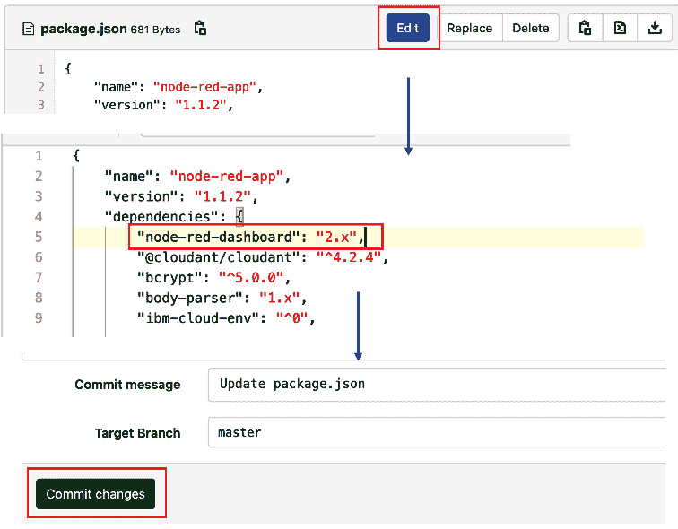

图 6.19 – 编辑 package.json 并添加 node-red-dashboard

之后，持续交付管道将自动开始构建和部署 Node-RED 应用程序。您可以随时在交付管道上检查状态，就像您在创建 Node-RED Starter 应用程序时所做的那样：

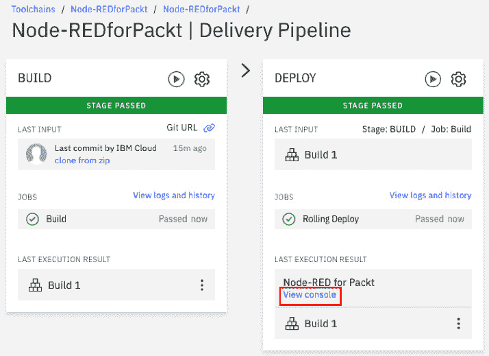

图 6.20 – 重新构建并自动部署您的应用程序

当您在 lite 帐户上收到**部署阶段**失败的内存限制错误时，请在 IBM Cloud 仪表板上停止您的 Node-RED 服务，然后运行**部署阶段**。您可以通过访问 IBM Cloud 仪表板并在**资源摘要**下点击**Cloud Foundry 应用**来停止 Node-RED 服务：

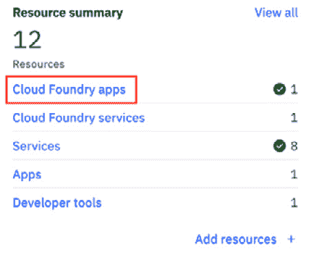

图 6.21 选择 Cloud Foundry 应用

之后，在**Cloud Foundry 应用**下的 Node-RED 记录上点击**停止**选项。

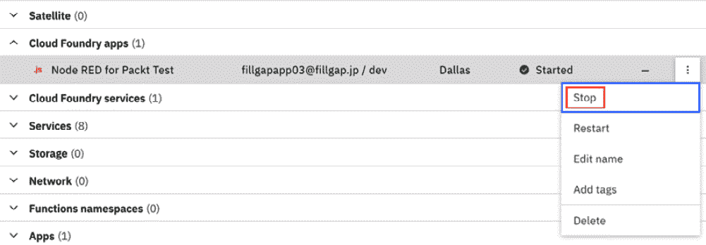

图 6.22 点击停止选项

就是这样。您可以通过关闭**调色板管理**屏幕并在流编辑器的左侧向下滚动来确认已添加仪表板节点，如下面的截图所示：

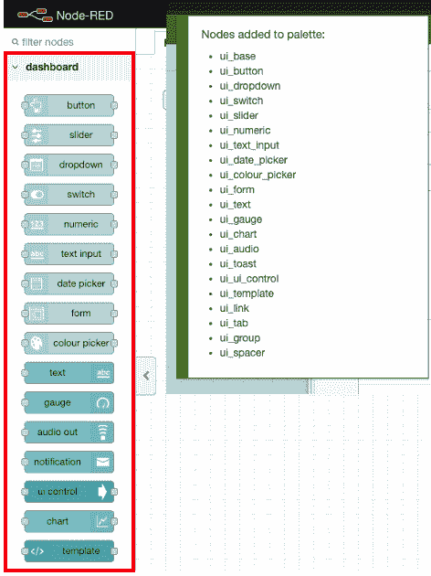

图 6.23 – 检查仪表板节点是否已安装

还有一件事：我们需要使用数据库，但 IBM Cloud 的 Node-RED 默认使用 Cloudant 数据库。我们将在下一节的案例研究中使用 Cloudant。

现在，您可以在 IBM Cloud 上使用 Node-RED 进行物联网服务器端的情况。

# 物联网案例研究重点在服务器端

现在，让我们考虑物联网的服务器端用例研究。

它并不取决于每个边缘设备的情况。它主要用于处理数据并将其存储在数据库中以进行可视化。

在本章中，我们将考虑物联网的用例；也就是说，假设使用传感器模块接收的传感器数据在服务器端接收，并进行后续处理。

与上一章不同的是，在这个服务器端处理教程中，数据的内容并不重要。主要目的是保存接收到的数据并根据需要进行可视化，因此我想定义以下两个用例。

## 用例 1 - 存储数据

第一个用例是存储数据。让我们创建一个应用程序（流程），将您从设备接收到的数据存储起来。在本节中，我们不使用来自设备的真实数据；我们只使用由 inject 节点生成的数据：

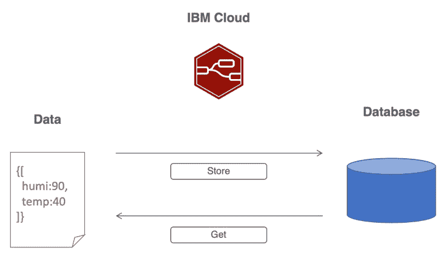

图 6.24 - 用例 1 概述

现在，让我们看看第二个用例。

## 用例 2 - 温度/湿度传感器

第二个用例是将数据显示为图表。让我们创建一个应用程序（流程），将您从设备接收到的数据发布到仪表板上。我们不会使用任何设备的真实数据，只使用由 inject 节点生成的数据：

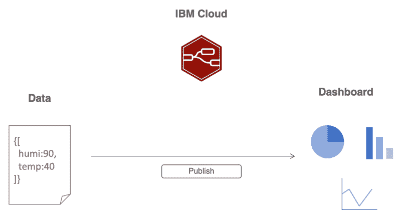

图 6.25 - 用例 2 概述

正如我们之前提到的，我们将使用 Cloudant 作为用例 1 的数据库，使用仪表板作为用例 2 的图表显示。这些已经准备好了。

# 创建一个示例流程

现在，让我们在 Node-RED 流编辑器上创建这两个服务器端用例流程。

请再次检查**Cloudant**节点和**仪表板**节点是否已安装在您的流编辑器上。如果没有，请按照本章*在云上使用 Node-RED 的具体情况*中提到的步骤安装这些节点。

现在，您需要在**Cloudant**上为本教程准备一个特定的数据库。请按照以下步骤进行：

1.  访问您的 IBM Cloud 仪表板，并从**资源摘要**区域点击**查看全部**：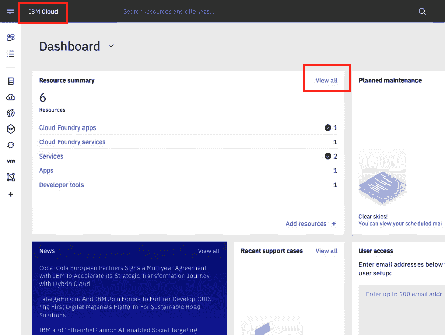

图 6.26 - IBM Cloud 仪表板视图

1.  您会发现使用 Node-RED 创建的**Cloudant**服务。请点击服务的名称：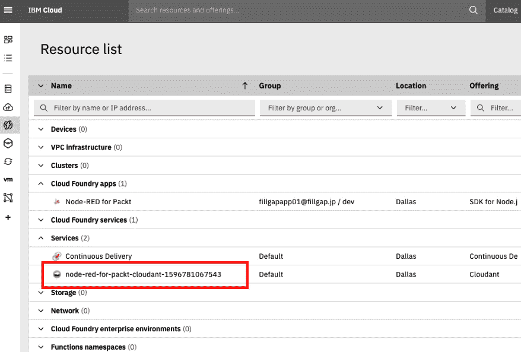

图 6.27 - 从资源列表中选择 Cloudant 服务

1.  点击**IBM Cloud**左上角的**启动仪表板**按钮：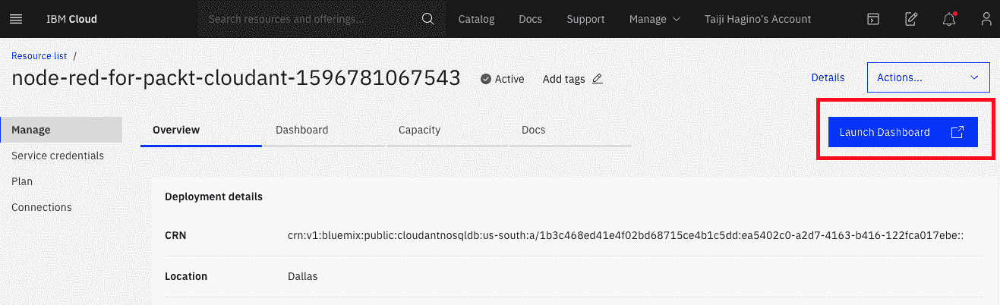

图 6.28 - 启动 Cloudant 仪表板

1.  启动 Cloudant 仪表板后，请点击`packt_db`。之后，点击**创建**按钮：

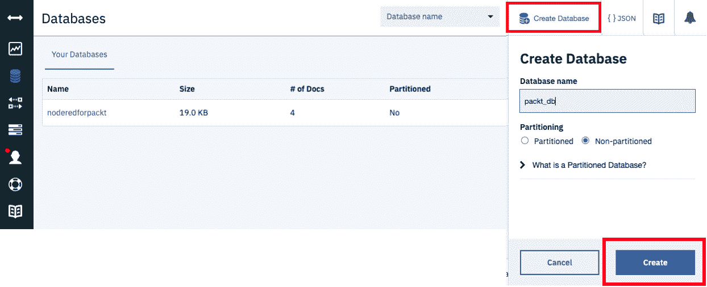

图 6.29 - 在 Cloudant 上创建一个新数据库

现在您已经为本教程创建了数据库，可以随时使用它！

## 为用例 1 创建一个流程 - 存储数据

在 IoT 中，服务器端处理从边缘设备接收到的数据开始。然而，正如我们之前提到的，我们将专注于将数据存储在数据库中，因此我们将使用由**inject**节点生成的虚拟数据。作为消息接收的数据块将在 Node-RED 上持久存储在 Cloudant 数据库中。

我们可以按照以下步骤制作流程：

1.  从左侧的调色板中将一个**inject**节点和一个**cloudant out**节点拖放到工作区中：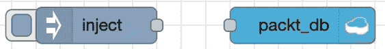

图 6.30 - 放置 Inject 节点和 cloudant out 节点

**inject**节点生成虚拟数据，而**cloudant out**节点将输入值原样存储在 Cloudant 数据库中。

1.  之后，我们还将创建一个从 Cloudant 检索数据的流程，但首先，让我们只创建保存数据的流程。连接这些节点：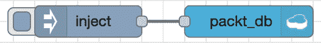

图 6.31 - 连接这两个节点

1.  接下来，修改**inject**节点的设置。双击节点打开**设置**面板。

1.  选择**JSON**作为第一个参数；也就是**msg.payload**，然后点击右侧的**[…]**按钮打开 JSON 编辑器：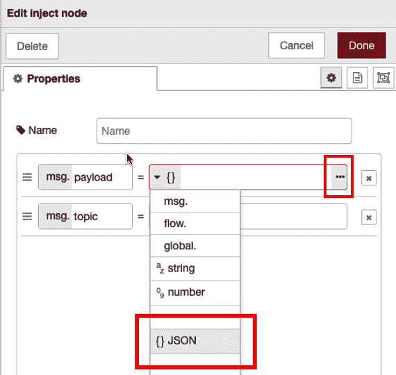

```js
{"temp":"29.18", "humi":"55.72"}
```

您可以使用选项卡在文本编辑器和可视化编辑器之间切换。请参考以下图片：

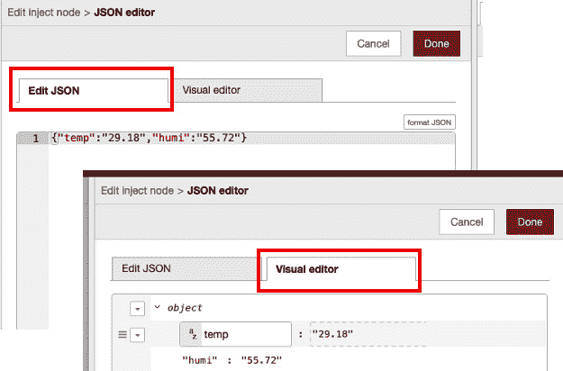

图 6.33 - 有两种类型的 JSON 编辑器可用

无需编辑**msg.topic**。

1.  设置**JSON**数据后，点击右上角的**完成**按钮关闭**设置**面板。

1.  然后，编辑`packt_db`的设置作为数据库名称。这个名称是您在 Cloudant 仪表板上命名的数据库。

第一个参数**Service**会自动设置；它是 IBM Cloud 上的您的 Cloudant 服务。第三个参数**Operation**不需要从其默认值更改。

1.  设置数据库名称后，点击右上角的**完成**按钮关闭**设置**面板：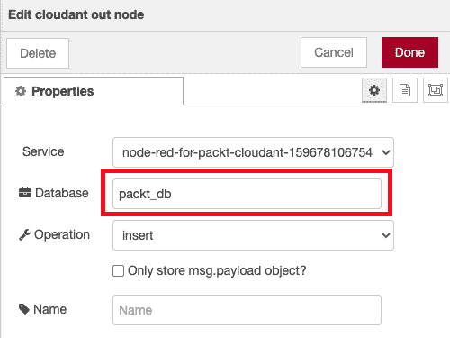

图 6.34 - 在 cloudant 输出节点上设置数据库名称

1.  就是这样！不要忘记点击**部署**按钮。

1.  点击**inject**节点上的按钮来运行流程。当按钮被点击时，数据将被存储在 Cloudant 数据库中。

此时，我们无法通过 Node-RED 流程编辑器检查 Cloudant 上的数据；我们只能在 Cloudant 仪表板上检查它：

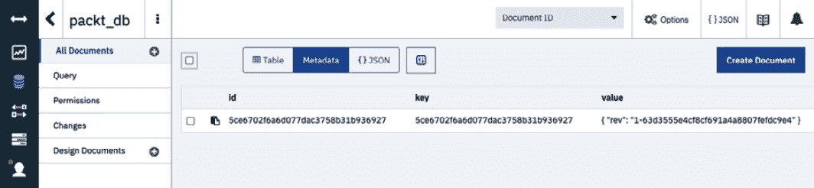

图 6.35 - Cloudant 仪表板上的结果

现在，让我们按照以下步骤创建一个从 Cloudant 获取数据的流程：

1.  从左侧的调色板中将一个**inject**节点、一个**cloudant in**节点和一个**debug**节点拖放到工作区中，以创建一个新的流程。

**inject**节点只是作为触发器执行这个流程，所以不需要更改其中的参数。**cloudant in**节点从您的 Cloudant 数据库获取数据。**debug**节点在调试选项卡上输出日志。

1.  连接这些节点：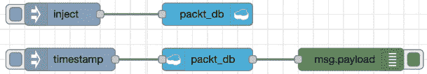

图 6.36 - 放置新的三个节点并将它们连接以获取数据

1.  接下来，通过双击节点来修改**cloudant in**节点的设置，以打开其**设置**面板。

1.  就像`packt_db`作为数据库的名称，并选择**所有文档**作为第三个参数，也就是**搜索方式**。

第一个参数**Service**会自动设置；它是 IBM Cloud 上的您的 Cloudant 服务。

1.  设置数据库名称和搜索目标后，点击右上角的**完成**按钮关闭**设置**面板：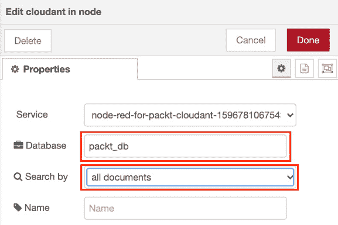

图 6.37 - 在 cloudant in 节点上设置数据库名称并搜索目标的结果

1.  就是这样！不要忘记点击**部署**按钮。

1.  点击**inject**节点上的按钮来运行流程。这样做时，您将从 Cloudant 数据库中获取数据。

您会看到结果被输出到**debug**窗口：

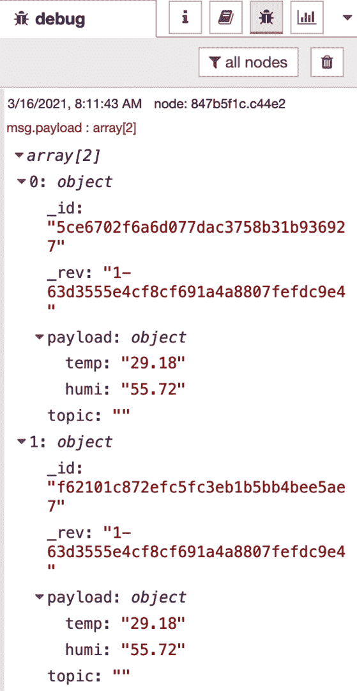

图 6.38 - 从 Cloudant 获取数据的结果

恭喜！通过这样，我们成功地创建了一个基本的流程（应用程序），它可以将传感器数据存储在 Node-RED 中的数据库中。

您也可以在这里下载流程定义文件：[`github.com/PacktPublishing/-Practical-Node-RED-Programming/blob/master/Chapter06/cloudant-flows.json`](https://github.com/PacktPublishing/-Practical-Node-RED-Programming/blob/master/Chapter06/cloudant-flows.json)

重要提示

此流程在 cloudant in/out 流中没有 Cloudant 服务名称的值。请检查一旦导入了此流程定义，您的服务名称是否已自动设置在其中。

现在您已经了解了如何在 Node-RED 上处理数据。我们将在下一节中可视化这些数据。

## 创建用例 2 的流程-可视化数据

第一个用例是将传感器数据存储在数据库中，而第二个用例是在 Node-RED 上可视化传感器数据。在 IoT 中，获取传感器数据后，我们必须以某种形式对其进行可视化。重点是检索和可视化用例 1 中存储的数据。我们将通过以下步骤来实现这一点：

1.  从左侧的调色板中将**inject**节点、**function**节点和**chart**节点放置在流程编辑器的工作区中，然后将这些节点连接起来：

图 6.39 - 放置节点并连接它们以显示数据

**Inject**节点只是作为触发器执行此流程，因此无需更改其中的参数。**function**节点生成要显示在 Node-RED 上的图表上的数字数据。最后，**chart**节点使数据能够出现在图表上。

1.  在**function**节点中编写代码以生成可以传递给图表节点的数字数据。

1.  双击节点以打开设置面板。然后，将以下代码添加到您放置的**function**节点中：

```js
// Set min and max for random number
var min = -10 ;
var max = 10 ;
// Generate random number and return it
msg.payload = Math.floor( Math.random() * (max + 1 - min) ) + min ;
return msg;
```

就是这样：

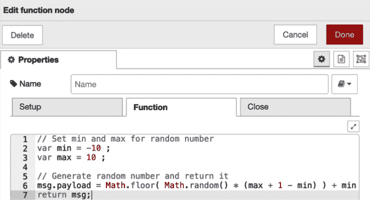

图 6.40 - 用于生成随机数的代码

1.  编写此脚本后，单击右上角的**Done**按钮关闭**Settings**面板。

1.  然后，在此处编辑`Packt Chart`的设置。

1.  输入名称后，单击`Packt Chart`。现在，单击右上角的**Done**按钮：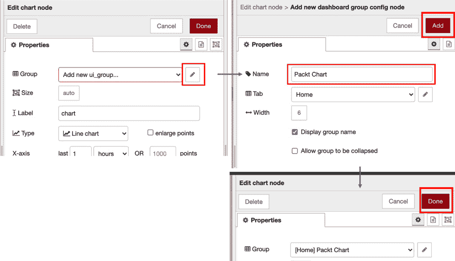

图 6.41 - 在图表节点上设置参数

1.  就是这样！不要忘记单击**Deploy**按钮。

1.  单击**inject**节点上的左按钮以运行流程。当单击按钮时，**function**节点生成的数据将被发送到**chart**节点。

您可以在仪表板窗口上查看结果。

1.  单击流程编辑器右上角的**Dashboard**按钮，然后单击**Open window**按钮。这两个按钮都是图标，因此请参考以下屏幕截图，以查看您必须单击哪些按钮：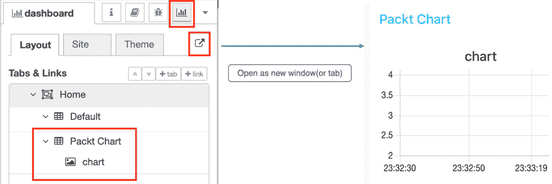

图 6.42 - 单击仪表板图标按钮并打开窗口图标按钮

1.  新窗口中的折线图将为空。请多次单击**inject**节点的开关。之后，您将看到折线图中填充了值：

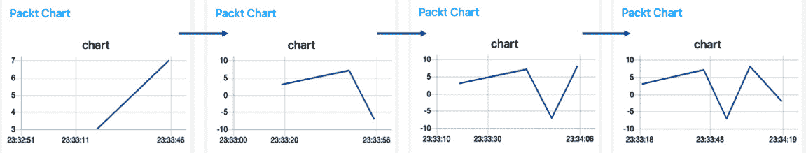

图 6.43 - 具有值的折线图

恭喜！通过这样做，我们已成功创建了一个基本的流程（应用程序），用 Node-RED 显示传感器数据的图表。

您还可以在此处下载此流程定义文件：[`github.com/PacktPublishing/-Practical-Node-RED-Programming/blob/master/Chapter06/dashboard-flows.json`](https://github.com/PacktPublishing/-Practical-Node-RED-Programming/blob/master/Chapter06/dashboard-flows.json)。

# 摘要

在本章中，您学会了如何通过遵循真实的 IoT 用例创建服务器端示例流程（应用程序）。这些都是简单的教程，但我相信对您有益，这样您就能够为 IoT 服务器端应用程序制作流程。

我们在这里创建的流程步骤将帮助您为将来创建其他服务器端应用程序的不同流程。

在下一章中，我们将使用与本章相同的 IoT 用例，但我们将创建一个实际的示例流程（应用程序），该流程将调用 Web API。
