# 第七章：从 Node-RED 调用 Web API

在本章中，让我们从 Node-RED 调用 Web API。基本上，在 Node-RED 中，处理是根据创建的流程进行的，但连接处理的是 JSON 数据。从这个意义上说，它与 Web API 非常兼容。

让我们从以下四个主题开始：

+   学习节点的输入/输出参数

+   学习节点的输入/输出参数

+   如何在节点上调用 Web API

+   如何使用 IBM Watson API

到本章结束时，你将掌握如何从 Node-RED 调用任何类型的 Web API。

# 技术要求

要在本章中继续进行，你将需要以下内容：

+   Node-RED（v1.1.0 或更高版本）

本章中使用的代码可以在[`github.com/PacktPublishing/-Practical-Node-RED-Programming`](https://github.com/PacktPublishing/-Practical-Node-RED-Programming)的`Chapter07`文件夹中找到。

# 学习 RESTful API

阅读本书的许多人可能已经熟悉 Web API。然而，为了使用 Node-RED 调用 Web API，让我们回顾一下 RESTful API。

**REST**代表**表述性状态转移**。RESTful API 基本上指的是根据“REST 原则”实现的 Web 系统的 HTTP 调用接口。因此，广义上来说，可以说 REST API 和 RESTful API 是相同的东西。那么，RESTful API 究竟是什么？我们将在本节中学习 RESTful API 的概述和原则，以及使用 RESTful API 的优缺点。

REST 是由 HTTP 协议创造者之一 Roy Fielding 在 2000 年左右提出的，是一组（或一种思维方式）适用于构建分布式应用程序时链接多个软件的设计原则。此外，RESTful API 是根据以下四个 REST 原则设计的 API：

+   **可寻址性**：它具有能够通过 URI 直接指向资源的属性。所有信息都应该由唯一的 URI 表示，这样你就可以一目了然地看到 API 版本，是否获取数据，更新等。

+   **无状态性**：所有 HTTP 请求必须完全分离。不应执行会话等状态管理。

+   **连接性**：这指的是在一条信息中包含“链接到其他信息”的能力。通过包含链接，你可以“连接到其他信息”。

+   **统一接口**：使用 HTTP 方法进行所有操作，如信息获取、创建、更新和删除。在这种情况下，HTTP 方法是获取（“GET”）、创建（“POST”）、更新（“PUT”）和删除（“DELETE”）。

这些是四个原则。从这四个原则中可以看出，REST 的一个主要特点是它更有效地利用了 HTTP 技术，并且与 Web 技术有很高的亲和性。因此，它目前被用于开发各种 Web 服务和 Web 应用程序。

随着智能手机的广泛使用，业务系统不仅可以在 PC 上使用，还可以在移动设备上使用，这一点变得越来越明显。此外，用户不仅选择一个系统，而是选择可以与多个系统和各种 Web 服务链接的系统。RESTful API 作为解决这些问题的不可或缺的工具受到了极大的关注。

如下图所示，可以从任何地方通过互联网调用 Web API：

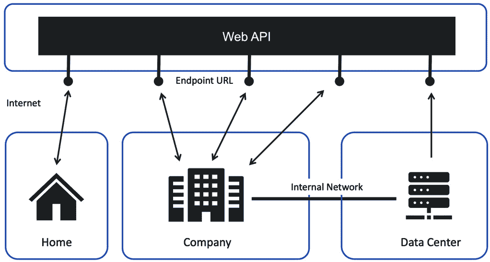

图 7.1 - RESTful API 图表

现在，让我们回顾一下 Node-RED 是什么。它的工作流工具样式类似于一个独立的工具，但 Node-RED 当然也是 Web 应用程序之一。换句话说，它是一个非常适合与此处描述的 RESTful API 一起使用的应用程序。

接下来，让我们再次介绍 Node-RED 节点具有哪些参数。

# 学习节点的输入/输出参数

在 Node-RED 中有许多节点，但适合调用 Web API（REST API）的并不多。调用 Web API 时常用的节点是`http request`节点。

要在 Node-RED 上调用外部 API，只需将 API 的端点 URL 设置为`http request`节点的 URL 属性。

例如，在调用 API 时需要在端点 URL 中设置参数时，可以设置连接的前一个节点的输出值。这种方法非常简单。在参数的值设置部分，可以设置`{{payload}}`变量，而不是字面字符串。

在`{{payload}}`中，输入从前一个处理节点继承的字符串。

以以下示例为例（请注意，此 URL 不存在）：`http://api-test.packt.com/foo?username={{payload}}&format=json`：

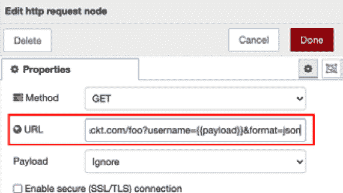

图 7.2 – 使用{{payload}}作为参数设置 API 端点 URL

`http request`节点的过程不能仅由`http request`节点执行。在`http request`节点之前，需要连接触发过程，例如`inject`节点。在那时，如果有要传递给 API 调用的参数，也就是`http request`节点，请在`msg.payload`中设置它。

如果要在`http request`节点中调用的 API 是`POST`，则通过在预处理节点中创建 JSON 数据，并将其存储在`msg.payload`中，然后连接到`http request`节点，可以将其作为请求参数满足。

通过像这样使用`http request`节点，可以轻松实现 API 协作。API 调用对于在 Node-RED 上链接多个服务非常重要。例如，Node-RED 的**function**节点基本上是通过 JavaScript 处理的，但是通过将用其他开发语言开发的程序制作成 API，可以通过从 Node-RED 调用来使用。

# 如何在节点上调用 Web API

到目前为止，我们已经了解了什么是 RESTful API，以及哪个节点适合调用 API。

在这部分，让我们创建一个实际从 Node-RED 调用 API 的流程，并学习如何调用 API 以及如何处理 API 的结果值。

首先要考虑一些事情，比如要调用哪个 API。幸运的是，互联网上发布了各种 API。

这次，我想使用 OpenWeatherMap API。在 OpenWeatherMap 中，例如，准备了以下用于数据获取的 API：

+   当前天气数据

+   每小时预报 4 天

+   每日预报 16 天

+   气候预报 30 天

+   天气警报

+   等等...

有关更多信息，请参阅 OpenWeatherMap 的官方网站：[`openweathermap.org/`](https://openweathermap.org/)。

好的，让我们准备使用 OpenWeatherMap API。

## 创建账户

要使用 OpenWeatherMap API，我们需要创建一个账户。请访问以下 URL：[`openweathermap.org/`](https://openweathermap.org/)。

如果您已经有账户，请直接登录，无需进行以下步骤。

对于第一次使用的人，请点击**登录**按钮，然后点击**创建账户**链接。注册很容易。只需按照指示操作，并在注册后确认 OpenWeatherMap 发送给您的电子邮件。这是创建账户页面的样子：

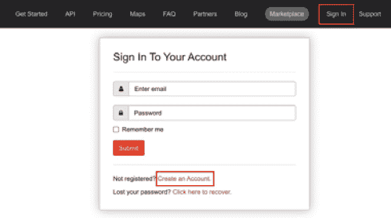

图 7.3 – 创建 OpenWeatherMap 账户

接下来，让我们创建一个 API 密钥。

## 创建 API 密钥

当您登录 OpenWeatherMap 时，可以看到**API 密钥**选项卡，请点击它。您已经有一个默认的 API 密钥，但请为本教程创建一个特定的 API 密钥。输入任何密钥字符串，然后点击**生成**按钮。

请注意，本书中显示的 API 密钥是我创建的示例，不能使用。请务必在您的账户中创建一个新的 API 密钥：

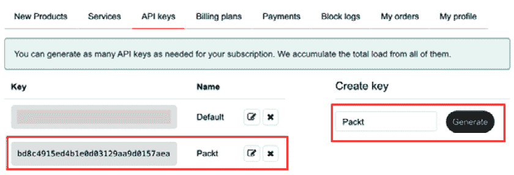

图 7.4 - 生成 API 密钥

重要提示

创建 API 密钥后，密钥将在 10 分钟到几个小时内不会激活。如果在访问下一节中描述的 API 端点 URL 时返回 Web 响应错误，例如 401，则指定的 API 密钥可能尚未激活，请等待并重试。

## 检查 API 端点 URL

要检查您的 API 端点 URL，请按照以下步骤操作：

1.  单击菜单栏上的**API**按钮。您可以在那里看到一些 API。

1.  在本教程中，我们将使用**当前天气数据**，所以请点击**当前天气数据**下的**API 文档**按钮：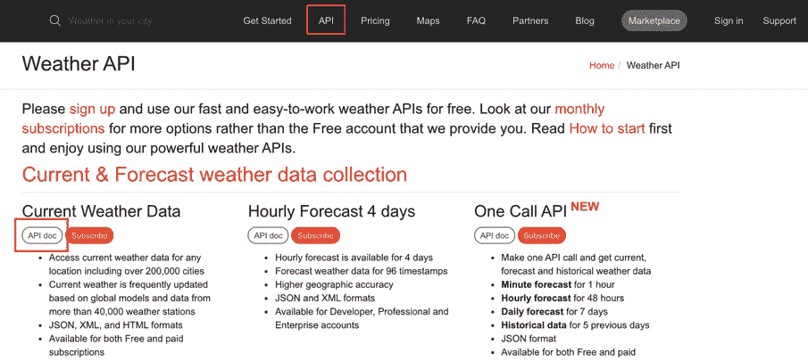

图 7.5 - 打开当前天气数据的 API 文档

1.  这个 API 有一些类型的参数，比如**按城市**，**按城市 ID**，**按邮政编码**等等。请选择带有城市名称和 API 密钥参数的**按城市名称**。

**API 文档**，**城市名称**，**州代码**和**国家代码**来自 ISO 3166。**API 调用**区域下的 URL 是使用此 API 的端点 URL。请将此 URL 复制到剪贴板：

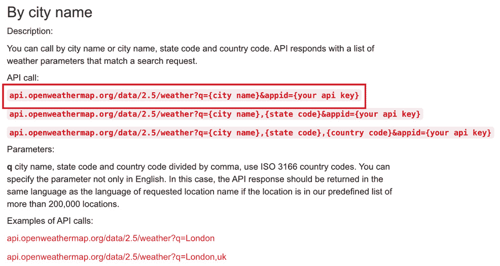

图 7.6 - 带参数的 API 端点 URL

接下来，让我们看看我们是否可以运行这个 API。

## 检查 API 是否可以运行

让我们尝试使用这个 API。您只需打开浏览器，粘贴 URL，并用您自己的城市名称和 API 密钥替换它。您可以选择任何城市名称，但 API 密钥是您在上一节中创建的特定密钥：

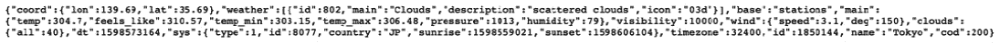

图 7.7 - 调用 API 并获取结果

我现在已经确认这个 API 可以正常工作。现在让我们从 Node-RED 调用这个 API 并使用它。

## 创建调用 API 的流程

现在让我们创建一个在 Node-RED 上调用 OpenWeatherMap API 的流程。在您的环境中启动 Node-RED。您可以使用独立的 Node-RED 或 IBM Cloud 上的 Node-RED：

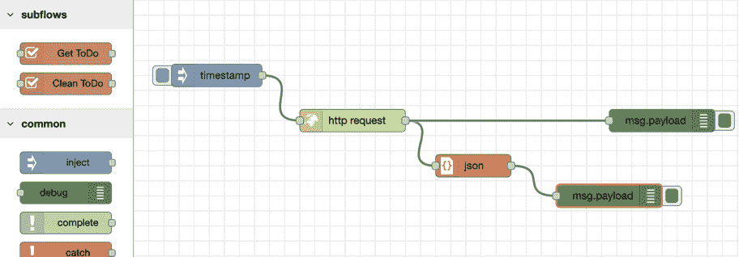

图 7.8 - 使用 API 的流程

对于这个，流程非常简单，很容易制作。请按照以下步骤制作流程：

1.  在调色板上放置一个**注入**节点和两个**调试**节点。这些节点可以使用默认设置。这里不需要更改设置。

1.  在调色板上放置**http 请求**节点，然后打开**http 请求**节点的设置面板，并在设置面板的**URL**文本框中使用您的参数（城市名称和 API 密钥）设置 API 端点 URL，如下图所示：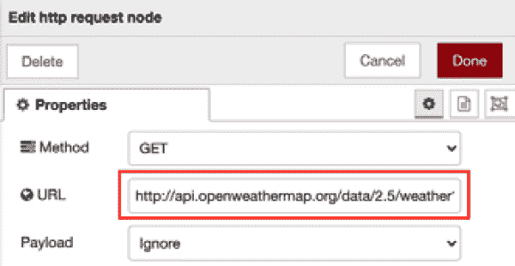

图 7.9 - 使用您的参数设置 API 端点 URL

1.  在调色板上放置一个**json**节点。此节点可以与默认设置一起使用。这里不需要更改设置。但是，以防万一，让我们确保**json**节点的**Action**属性设置为**在 JSON 字符串和对象之间转换**。这是一个选项，将把作为输入参数传递的 JSON 数据转换为 JavaScript 对象：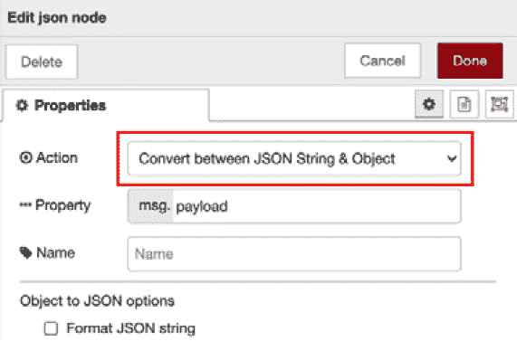

图 7.10 - 检查 Action 属性

1.  将所有节点连接如下图所示：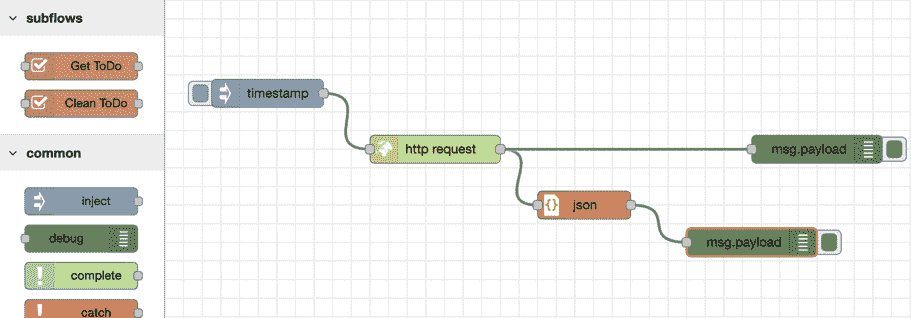

图 7.11 - 连接所有节点

请将**时间戳**节点和**http 请求**节点连接起来。**http 请求**节点的输出连接到**json**节点和**调试**节点。最后，请将**json**节点的输出连接到另一个**调试**节点。

1.  更改设置并连接所有节点后，您需要部署并单击**注入**节点的开关。现在您可以在右侧面板的**调试**窗口中看到数据：

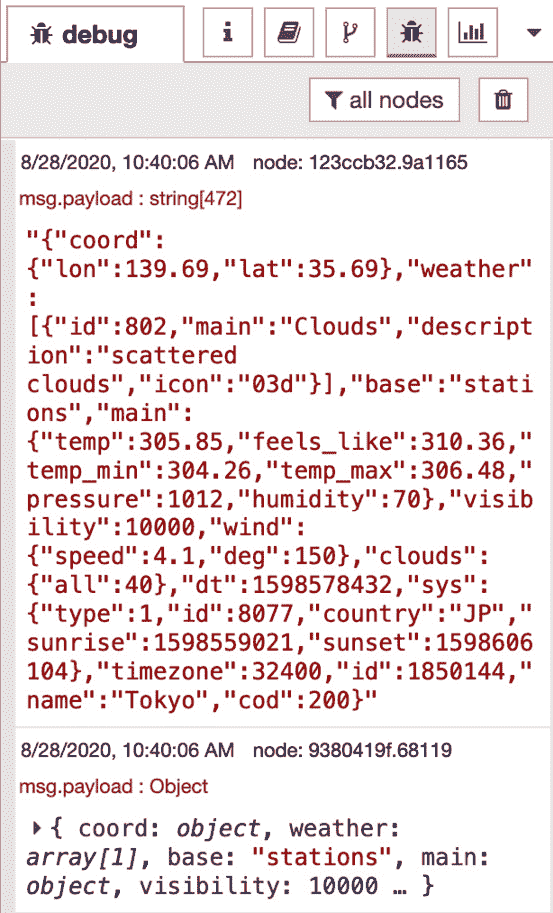

图 7.12 - 在调试窗口上的结果数据（JSON）

您还可以在与以下屏幕截图相同的**调试**窗口上查看结果数据的 JSON 对象：

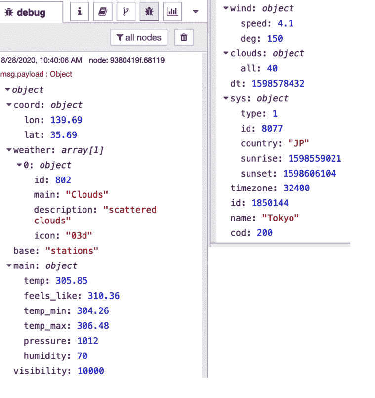

图 7.13 – 调试窗口上的结果数据（对象）

恭喜！您已成功通过调用 OpenWeatherMap API 创建了一个示例流程。如果您没有完全成功创建此流程，您也可以在此处下载此流程定义文件：[`github.com/PacktPublishing/-Practical-Node-RED-Programming/blob/master/Chapter07/open-weather-flows.json`](https://github.com/PacktPublishing/-Practical-Node-RED-Programming/blob/master/Chapter07/open-weather-flows.json)。

在下一节中，我们将学习在 IBM Cloud 上使用 Node-RED 的便利性以及 IBM Watson API。

# 如何使用 IBM Watson API

在上一节中，您学习了如何调用 API 并处理 API 的结果值。

在本节中，我们将创建一个实际从 Node-RED 调用 API 的流程，但我们将学习如何调用 IBM 提供的 Watson API。我们还将创建一个实际从 Node-RED 调用 API 的流程，但我们将学习如何调用 IBM 提供的 Watson API。

为什么要使用 Watson？Watson 是 IBM 提供的人工智能服务和 API 的品牌。

所有 Watson API 都可以从 IBM Cloud 上使用。因此，通过在 IBM Cloud 上运行 Node-RED，您可以有效地使用 Watson 的服务。这样做的好处是，当从 Node-RED 调用 Watson API 时，可以省略身份验证的实现。

Watson 可以从 IBM Cloud 以外的环境调用，因此可以直接从树莓派调用，也可以从 AWS 和 Azure 等云平台或本地环境中使用。请参见下图，显示 Watson API 的外观：

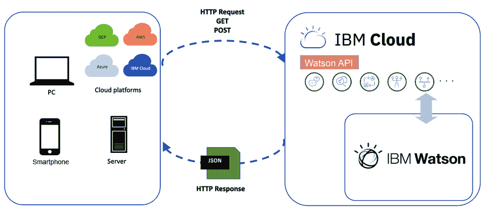

图 7.14 – Watson API 图表

有关更多信息，请参阅 IBM Watson 官方网站：[`www.ibm.com/watson`](https://www.ibm.com/watson)。

好的，让我们看看在 IBM Cloud 上使用 Node-RED 上的 Watson API 有多容易。

## 登录 IBM Cloud

如果您已经按照第一章的步骤进行操作，您应该已经有了 IBM Cloud 帐户。只需登录 IBM Cloud ([`cloud.ibm.com`](https://cloud.ibm.com))。

如果您没有 IBM Cloud 帐户，请从以下网址创建一个并登录 IBM Cloud。有关详细说明，请参阅*第六章*，*在云中实现 Node-RED*：[`ibm.biz/packt-nodered`](http://ibm.biz/packt-nodered)。

## 在 IBM Cloud 上启动 Node-RED

在上一节中，我们使用独立的 Node-RED 或 IBM Cloud 上的 Node-RED 创建了一个示例流程。当然，您可以使用独立版本的 Node-RED 来调用 Watson API，但会丢失一些好处。因此，在本部分中，我们将使用 IBM Cloud 上的 Node-RED。

与上一步一样，如果您还没有在 IBM Cloud 上使用 Node-RED，请返回到*第六章*，*在云中实现 Node-RED*，并按照其中的步骤激活 IBM Cloud 上的 Node-RED，然后再进行下一步。

## 创建 Watson API

接下来，在 IBM Cloud 上创建 Watson 的服务。严格来说，这意味着创建一个作为服务的实例，以便您可以调用 IBM Cloud 上提供的 Watson API 服务作为您自己的 API。

Watson 有几个 API，例如语音识别、图像识别、自然语言分析、情感分析等。这次，我想使用情感分析 API。

按照以下步骤创建 Watson Tone Analyzer API 服务：

1.  从目录中搜索 Watson。在仪表板上，请单击`tone analyzer`，然后选择**Tone Analyzer**面板：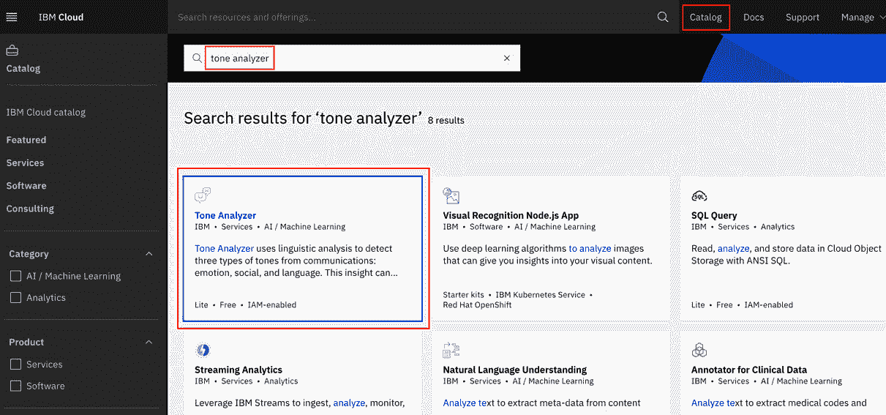

图 7.15 – 搜索 Watson 服务

1.  请参考以下列表和*图 7.16*填写每个属性：

a. `默认`（您可以将其修改为任何您想要使用的名称）

d. **资源组**：**默认**（对于 Lite 账户，您无法选择其他内容）

e. **标签**：N/A

1.  在输入/选择所有属性后，点击**创建**按钮：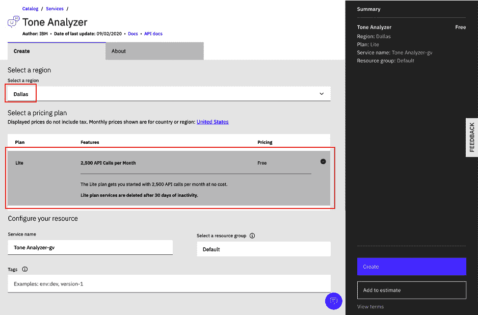

图 7.16 – 创建 Tone Analyzer 服务

1.  当创建并激活时，您可以在**Tone Analyzer**实例仪表板上看到状态为**活动**。请检查 API 密钥和 URL。API 密钥和 URL 在从任何应用程序调用 API 时使用。但是，在本教程中不使用这些，因为 IBM Cloud 上的 Node-RED 可以在不需要认证编码的情况下调用 Watson API。

您可以从此屏幕上的**管理**菜单中检查 API 密钥和 URL：

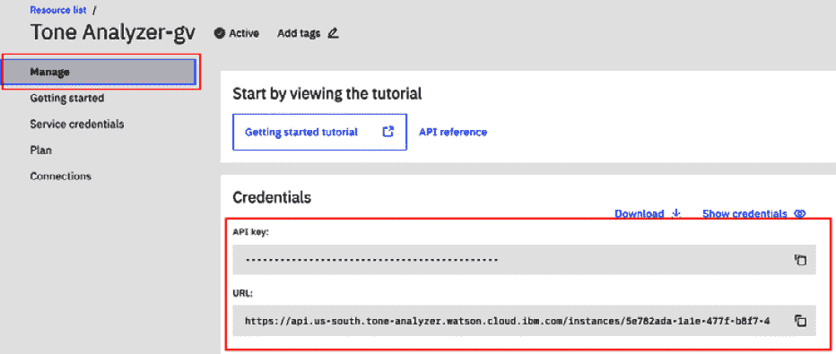

图 7.17 – 检查您的凭证

在下一节中，我们将连接 Node-RED 和 Tone Analyzer 服务。

## 连接 Node-RED 和 Tone Analyzer 服务

正如您已经知道的，Node-RED 可以在不需要认证编码的情况下调用 Watson API。在使用 Node-RED 与 Watson API 之前，我们需要连接 Node-RED 和 Watson API 实例。在上一步中，我们创建了**Tone Analyzer** API 实例，所以让我们按照以下步骤连接这两个实例：

1.  点击左上角的**IBM Cloud**标志按钮，转到主仪表板。

1.  点击**资源摘要**面板上的**查看全部**按钮。

1.  在**Cloud Foundry 应用**区域点击 Node-RED 实例（应用）名称：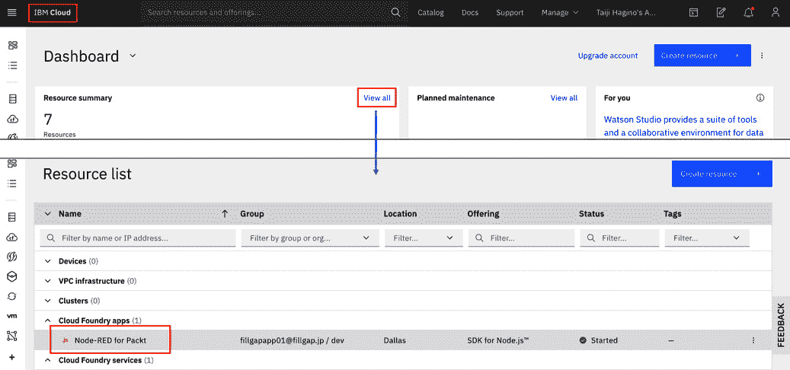

图 7.18 – 选择您创建的 Node-RED 服务

1.  点击**连接**菜单，然后点击**创建连接**按钮：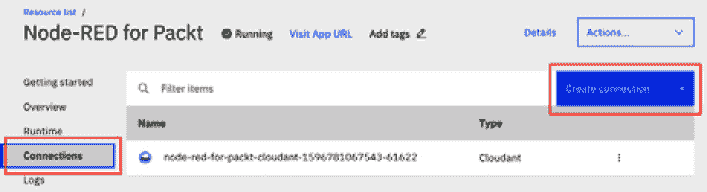

图 7.19 – 为 Node-RED 和 Watson 创建连接

1.  检查**Tone Analyzer**服务并点击**下一步**按钮：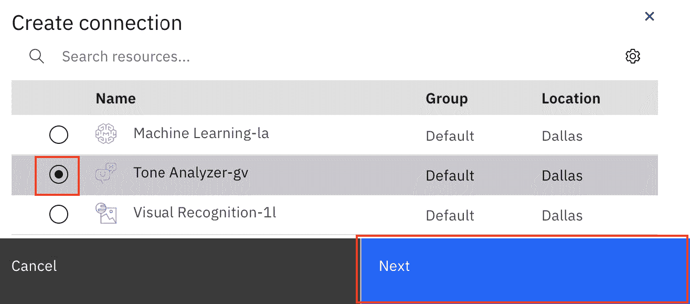

图 7.20 – 点击下一步按钮选择连接服务

1.  对于访问角色和服务 ID，无需进行修改。点击**连接**按钮：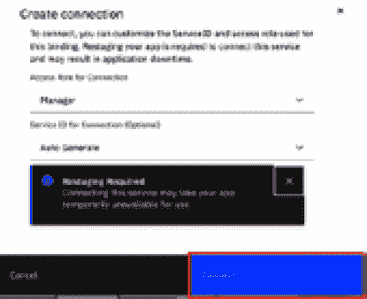

图 7.21 – 点击连接按钮完成连接

1.  我们需要重新启动 Node-RED 以激活连接。点击**重新启动**按钮：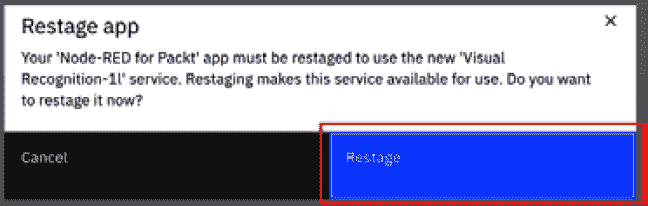

图 7.22 – 点击重新启动按钮开始重新启动 Node-RED 服务

1.  请等待直到您的 Node-RED 实例的重新设置完成。完成后，您将获得**运行**状态的成功连接。之后，请通过**访问应用 URL**链接打开 Node-RED 流程编辑器：

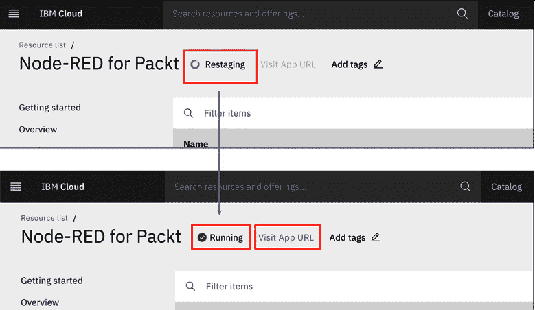

图 7.23 – 检查 Node-RED 服务的 Node.js 运行时状态

您已成功准备好 Node-RED 和 Watson API 流程。接下来，让我们通过调用 Tone Analyzer API 来创建流程。

## 通过调用 Tone Analyzer API 创建流程

现在，让我们创建一个在 Node-RED 上调用 Watson Tone Analyzer API 的流程。您已经在 IBM Cloud 上启动了 Node-RED。可以使用独立的 Node-RED 或 IBM Cloud 上的 Node-RED。

为了继续本教程，您需要安装以下两个节点：

+   **node-red-node-twitter**：这是一个获取和发布推文到 Twitter 的节点。

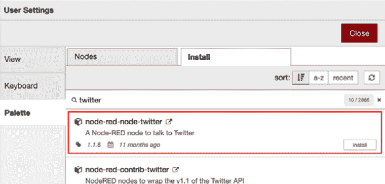

图 7.24 – 安装 node-red-node-twitter

+   `msg.payload`。在向 Watson Tone Analyzer API 传递参数时使用：

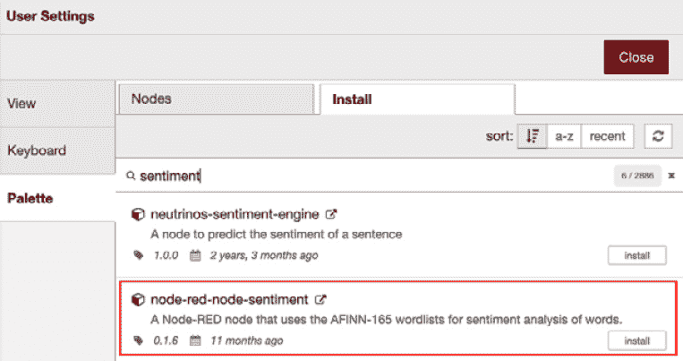

图 7.25 - 安装 node-red-node-sentiment

在调色板中搜索这些节点并将它们安装到您的 Node-RED 流编辑器中。之后，按照下图所示创建一个流程：

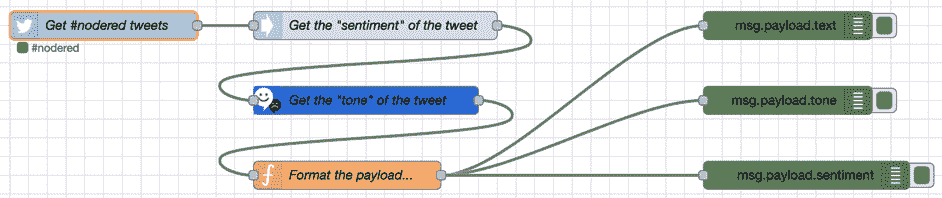

图 7.26 - 使用 Tone Analyzer API 的流程

在这个流程中，功能节点处理从 Twitter 获取的结果值中包含的文本、语调和情感，以便将它们作为单独的调试输出。这样可以更容易地查看结果。

这个流程比您在上一步创建的流程要复杂一些。请按照以下步骤进行流程：

1.  创建一个 Twitter ID（Twitter 账户）并在您的 Twitter 开发者帐户上创建一个应用程序，以便通过您的 Twitter 账户验证访问推文。

1.  在 Twitter 开发者的**项目和应用**下访问**概述**，然后单击**创建应用**按钮：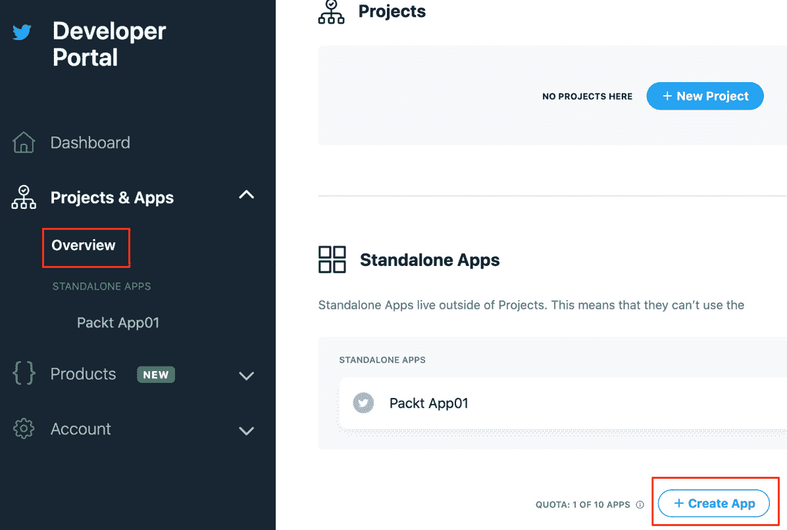

图 7.27 - 在 Twitter 开发者上创建应用程序

1.  使用任何字符串设置**应用程序名称**，然后单击**完成**按钮。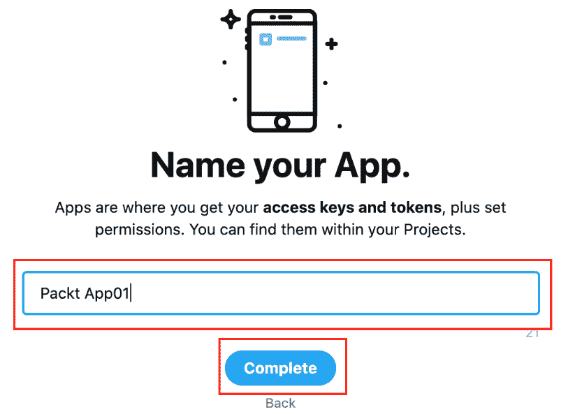

图 7.28 - 设置您的应用程序名称

1.  之后，请检查**访问令牌和访问令牌密钥**区域。

您将看到令牌。请注意并保存您的访问令牌和访问令牌密钥。这些也将用于**twitter in**节点的设置：

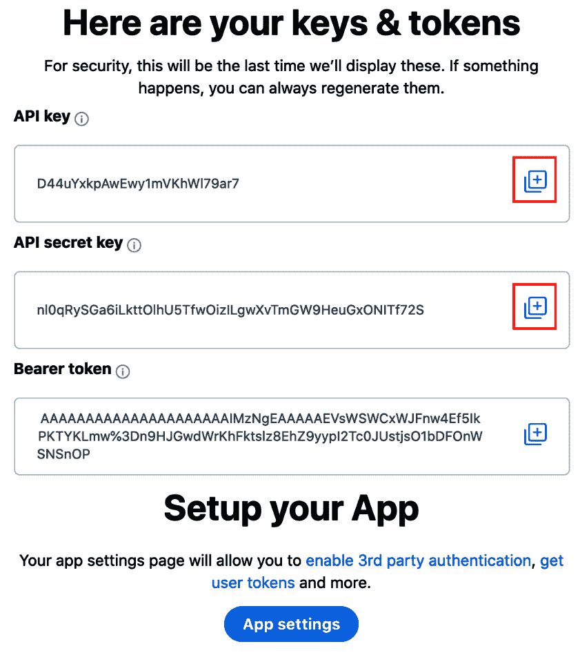

图 7.29 - 记下您的令牌和令牌密钥

1.  将**twitter in**节点放置在您的工作区，并双击它以打开设置窗口：

图 7.30 - 放置 twitter in 节点

1.  单击设置窗口上的编辑（铅笔图标）按钮以编辑您的 Twitter 信息：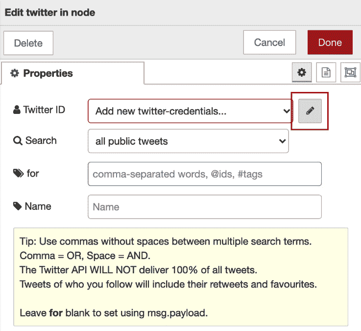

图 7.31 - 编辑 Twitter 属性

1.  设置您的 Twitter ID，API 密钥和令牌。

**API 密钥**、**API 密钥密钥**、**访问令牌**和**访问令牌密钥**的值应从*步骤 8*中的文本编辑器中获取。

1.  设置这些设置后，请单击**添加**按钮返回到**twitter in**节点的主设置窗口：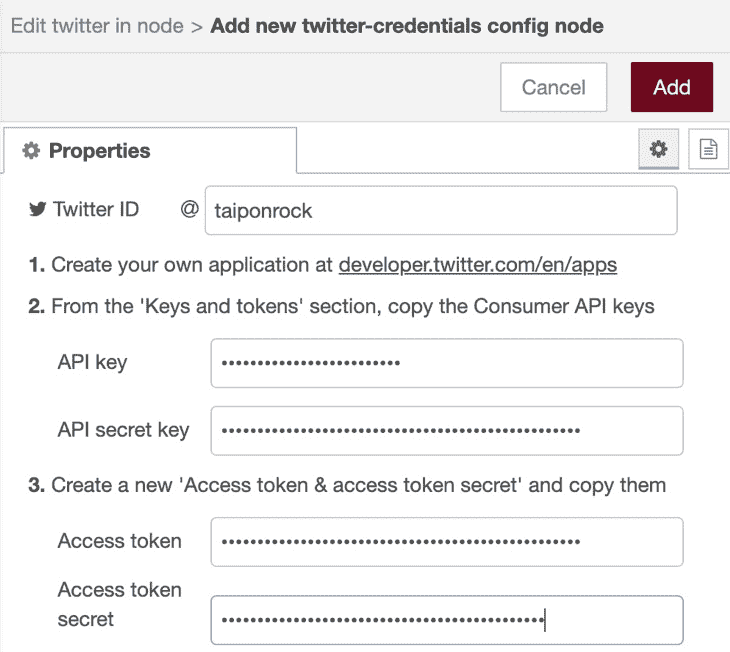

图 7.32 - 配置您的 Twitter 信息

1.  选择`#nodered`作为标签。您可以为**名称**设置任何名称。

1.  最后，单击**完成**按钮以完成添加这些设置并关闭窗口：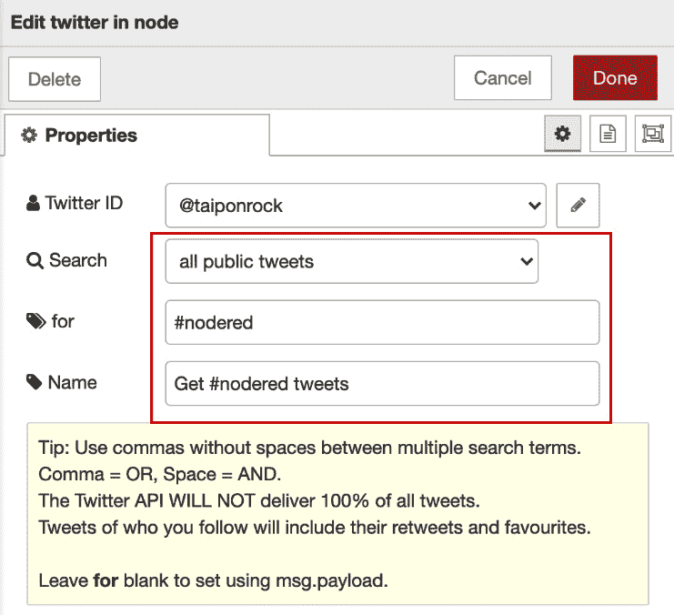

图 7.33 - 完成节点中 Twitter 的设置

1.  将**情感**节点放置在您的工作区。它将在**twitter in**节点之后连接。

对于这个节点，不需要设置或更改任何属性：

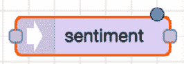

图 7.34 - 放置情感节点

1.  按顺序在您的工作区上的**情感**节点之后放置**情感分析器 v3**节点：

图 7.35 - 放置情感分析器 v3 节点

1.  打开**情感分析器 v3**节点的设置面板，并将**方法**和**URL**属性设置如下：

a. **名称**：您想要命名的任何字符串

b. **方法**：**一般语调**

c. **version_date**：**多个语调**

d. **语调**：**全部**

e. **句子**：**真**

f. **内容类型**：**文本**：

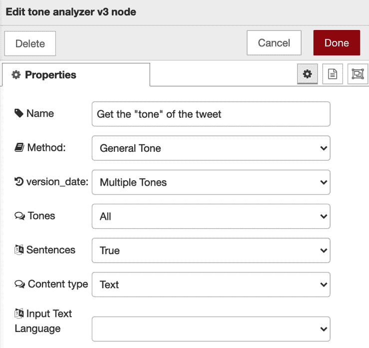

图 7.36 - 配置情感分析器 v3 节点属性

1.  按顺序在您的工作区上的**情感分析器 v3**节点之后放置**功能**节点：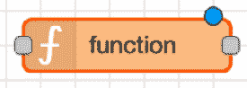

图 7.37 - 放置功能节点

1.  打开**function**节点的设置面板，并使用以下源代码编写 JavaScript：

```js
msg.payload = {
    "text" : msg.payload,
    "tone" : msg.response,
    "sentiment" : msg.sentiment
};
return msg;
```

有关**function**节点的编码，请参考以下屏幕截图：

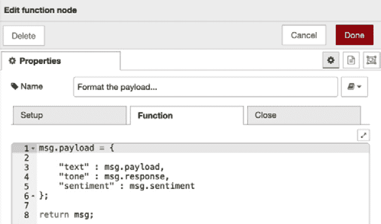

图 7.38 - 功能节点的 JavaScript 源代码

您可以在这里获取代码：[`github.com/PacktPublishing/-Practical-Node-RED-Programming/blob/master/Chapter07/format-payload.js`](https://github.com/PacktPublishing/-Practical-Node-RED-Programming/blob/master/Chapter07/format-payload.js)。

1.  最后，放置三个`msg.payload.text`：对于`msg.payload.tone`：对于`msg.payload.sentiment`：对于**调试**选项卡

有关布线说明，请参阅*图 7.26*。我们已经完成了流程节点的配置。

## 测试流程

流程现在已经完成。当您点击`twitter in`节点连接到您的 Twitter 帐户时，它将自动检索符合您标准的推文并处理后续流程。

这是自动完成的，因此您无需采取任何特殊操作。

在这里，它被设置为获取所有具有`#nodered`作为标签的推文。如果您没有收到很多推文，这意味着没有创建包含指定标签的推文，请更改`twitter in`节点中设置的标签并重试。

此流程的所有处理结果将显示在**调试**选项卡中。

从获取的推文中提取推文正文并显示的是`msg.payload.text`：

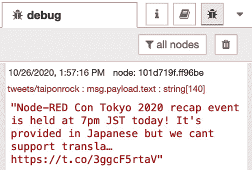

图 7.39 - 获取推文正文的结果

从获取的推文中提取和显示检测到的情绪的是`msg.payload.tone`：

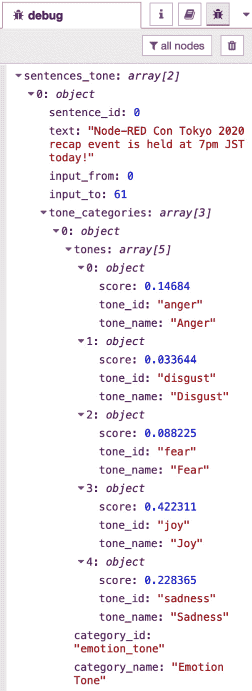

图 7.40 - 从推文中的语调分析结果

从获取的推文中判断情感是积极还是消极的是`msg.payload.sentiment`：

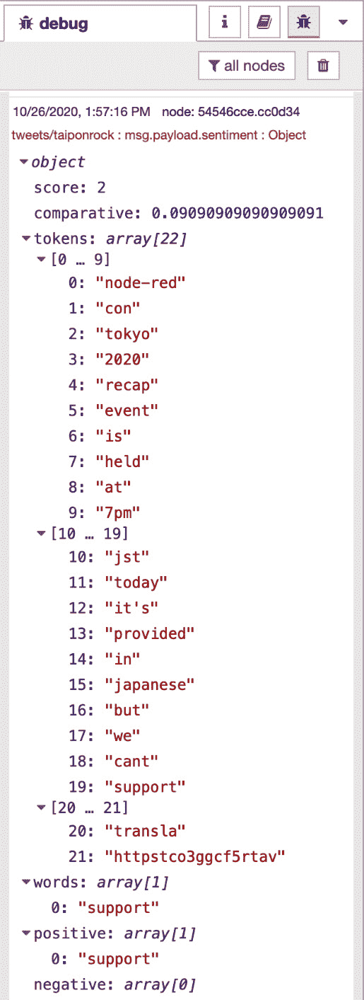

图 7.41 - 推文情感的结果

恭喜！您已成功调用 Watson API 创建了一个示例流。如果您没有完全成功创建此流程，您也可以在此处下载此流程定义文件：[`github.com/PacktPublishing/-Practical-Node-RED-Programming/blob/master/Chapter07/get-sentiment-twitter-flows.json`](https://github.com/PacktPublishing/-Practical-Node-RED-Programming/blob/master/Chapter07/get-sentiment-twitter-flows.json)。

# 总结

在本章中，我们学习了如何创建调用两种类型的 Web API 的示例流（应用程序）。我们逐渐习惯于创建复杂的流程。在 Node-RED 中经常发现调用 Web API 的用例。我们在这里学到的流程创建方法将帮助我们将来创建更复杂的流程。

在下一章中，让我们了解一个可以与 GitHub 等存储库集成的项目功能，这是从 Node-RED 版本 1.0 添加的功能。
