# 第八章：使用 Git 的项目功能

在本章中，您将学习到一个非常有用的**项目**功能。Node-RED 的项目功能是一种使用 Git 在 Node-RED 流程编辑器上进行版本管理的工具/功能。实际上，默认情况下是禁用的。启用此功能可以让您以一种新的方式管理您的流程。我相信许多开发人员熟悉 GitHub 和 GitLab 等 Git 服务。Node-RED 的项目功能使用 Git 和 GitHub 进行版本控制，因此我认为这非常容易理解。

以下是本章将涵盖的主题：

+   启用项目功能

+   使用 Git 存储库

+   连接远程存储库

在本章结束时，您将能够了解如何使用项目功能，如何将您自己的 Git 存储库连接到 Node-RED 流程编辑器，并如何使用版本控制工具 Git 管理流程作为项目。

在本章结束时，您将掌握如何使用项目功能并使用它制作应用程序。您可以在 GitHub 或 GitLab 等任何托管的 Git 服务中使用它。

# 技术要求

要在本章中取得进展，您将需要以下内容：

+   您可以通过官方网站创建 GitHub 帐户：[`github.com/`](https://github.com/)。

+   需要通过官方网站安装的 Git 客户端工具：[`git-scm.com/downloads`](https://git-scm.com/downloads)。

# 启用项目功能

例如，在您想要管理自己的流程同时与他人共享它，或者您想要更新他人创建的流程的情况下，当团队仅使用 Node-RED 流程编辑器时，开发会很困难。

Node-RED 的项目功能是一种管理与您制作的每个流程相关的文件的方法/功能。它涵盖了使用 Node-RED 可共享的创建应用程序所需的所有文件。

这些都受 Git 存储库支持。也就是说，所有文件都有版本。这使开发人员能够与其他用户合作。

在 Node-RED 版本 1.x 上，默认情况下禁用项目功能，因此必须在名为`settings.js`的`config`文件中启用它。

重要提示

在 Node-RED 的本地环境中创建项目时，到目前为止创建的流程可能会被覆盖为空白表格。您可以通过互联网下载此文档中创建的所有流程的流程配置的 JSON 文件，但是如果您在本地环境中的 Node-RED 中创建了自己的流程，则建议导出流程配置文件。

我们在本书中创建的所有流程定义和 JSON 文件都可以在此处下载：[`github.com/PacktPublishing/-Practical-Node-RED-Programming`](https://github.com/PacktPublishing/-Practical-Node-RED-Programming)。

现在让我们尝试项目功能。我们将在本地环境（如 macOS 或 Windows）上使用独立版本的 Node-RED。为了使用项目功能，我们首先需要启用它。让我们按照以下步骤启用它：

1.  需要重写`settings.js`文件以启用/禁用项目功能。首先找到此文件。`settings.js`文件可以在存储所有用户配置的 Node-RED 用户目录中找到。

在 Mac 上，默认情况下，此文件位于以下路径下：

`/Users/<User Name>/.node-red/settings.js`。

在 Windows 上，默认情况下，此文件位于以下路径下：

`C:\Users\<User Name>\.node-red\settings.js`

1.  编辑`settings.js`文件。可以使用任何文本编辑器打开`settings.js`。我在这里使用了`vi`。使用以下命令打开`settings.js`：

```js
$ vi /Users/<User Name>/.node-red/settings.js 
```

重要提示

请将命令替换为适用于您的环境的命令。

1.  编辑您的`settings.js`文件，并在`module.exports`块内的`editorTheme`块中设置`true`，以启用项目功能：

```js
module.exports = {
   uiPort: process.env.PORT || 1880,
   …
   editorTheme: {
       projects: {
           enabled: true
       }
   },
   …
}
```

1.  保存并关闭`settings.js`文件。

1.  通过运行以下命令重新启动 Node-RED 以启用我们修改的设置：

```js
$ node-red 
```

我们现在已成功启用了 Node-RED 的项目功能。

要使用此功能，您需要访问 Git 和 ssh-keygen 命令行工具。Node-RED 在启动时检查它们，并在缺少任何工具时通知您。

如果设置完成没有任何问题，并且您已重新启动 Node-RED，则项目功能将可用。接下来，让我们设置 Git 存储库以供使用。

# 使用 Git 存储库

我们在上一节中启用了项目功能。重新打开流程编辑器，您将被提示使用当时创建的流程内容创建您的第一个项目。这将是欢迎屏幕：

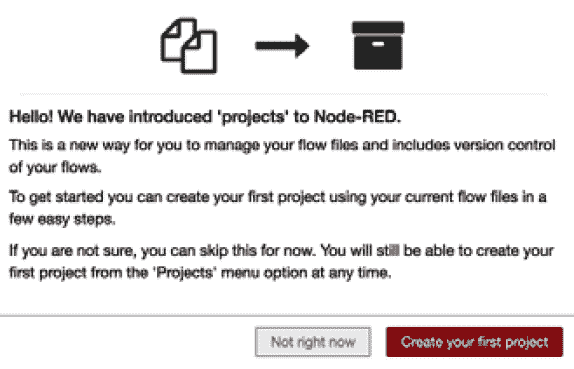

图 8.1 - 欢迎屏幕

我们需要设置 Git 等版本控制客户端。如前所述，Node-RED 的项目功能使用 Git 作为版本控制工具。与常规 Git 一样，您可以根据项目管理文件更改，并根据需要与远程存储库同步。

Git 跟踪谁做出了更改。它与您的用户名和电子邮件地址一起工作。用户名不必是您的真实姓名；您可以使用任何您喜欢的名称。

如果您的本地设备已经配置了 Git 客户端，Node-RED 将查找这些设置。

首先，在您的本地环境中执行版本控制。它利用了您本地环境中安装的 Git 客户端的功能。如果您尚未安装 Git，请提前安装。

现在，按照以下步骤在 Node-RED 流程编辑器上创建项目：

1.  首先，让我们创建一个项目。这非常容易。在项目创建窗口中输入项目名称和描述。

1.  命名流程文件。默认情况下，它已命名为`flow.json`。

换句话说，Node-RED 会自动将当前在流程编辑器上配置的流程迁移到一个新项目中。保持默认名称即可。当然，如果您愿意，也可以在此处选择重命名。

如果您将项目发布在 GitHub 等公共网站上，加密凭据文件是个好主意。

如果选择加密，必须创建一个用于加密的密钥。该密钥不包括在项目中，因此如果与某人共享项目，则需要单独向克隆项目的用户提供凭据文件解密密钥。

1.  在添加所需信息后，单击**创建项目**按钮：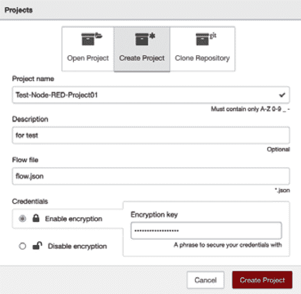

图 8.2 - 项目屏幕

恭喜！您已创建了您的第一个项目。

1.  接下来，检查项目历史。我们可以在 Node-RED 流程编辑器上使用版本控制功能。您可以通过单击右上角的**项目历史**按钮访问项目历史面板：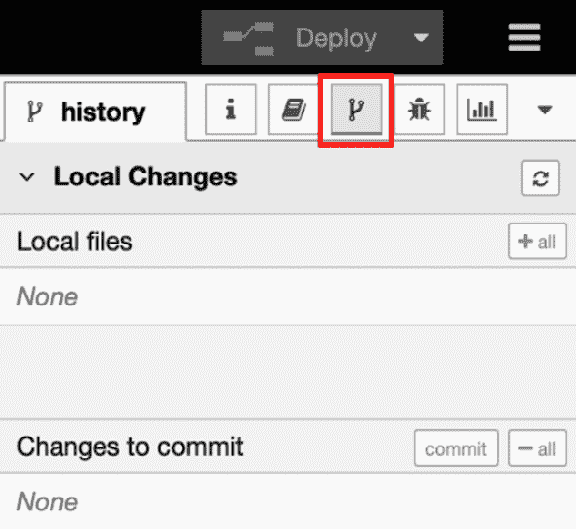

图 8.3 - 项目历史面板

1.  您可以在此面板上看到没有更改的项目。要检查更改历史功能是否已启用，请在此工作区上创建一个流程。

如果您经常使用 Git 或 GitHub，您应该能够通过查看此面板的结构来理解每个项目的含义和作用。如果项目下的文件结构或内容发生变化，目标文件将显示在**本地更改**区域。当您将更改移动到提交阶段（即添加时），目标文件的显示将移动到**要提交的更改**区域。如果输入提交消息并完成提交，版本将增加一次。

这与 Git 客户端所做的完全相同。

1.  创建一个简单的流程。您可以创建任何您选择的流程，例如，我在`flow.json`文件中使用了一个`flow.json`文件，这是整个流程的配置文件，已经更新。因此，`flow.json`已被识别为 Git 管理中要更改的文件：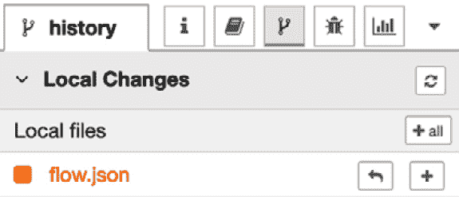

图 8.5-Node-RED 已经意识到 flow.json 已更改

1.  现在，让我们遵循 Git 的规范并继续进行。首先，将更改的文件放在提交阶段。这是 Git 的`git add`命令。

1.  单击`flow.json`文件已从**本地更改**区域移动到**提交**区域。

1.  接下来，让我们提交`flow.json`中的更改。单击`git commit`命令：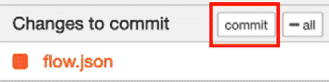

图 8.7-单击提交按钮提交文件

1.  单击**提交**按钮后，将打开提交注释窗口。请在此处输入提交注释，然后单击**提交**按钮：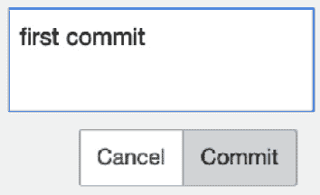

图 8.8-单击提交按钮完成提交过程

1.  提交现在已完成。最后，让我们检查**提交历史**区域。您会看到已创建一个新版本作为更改历史：

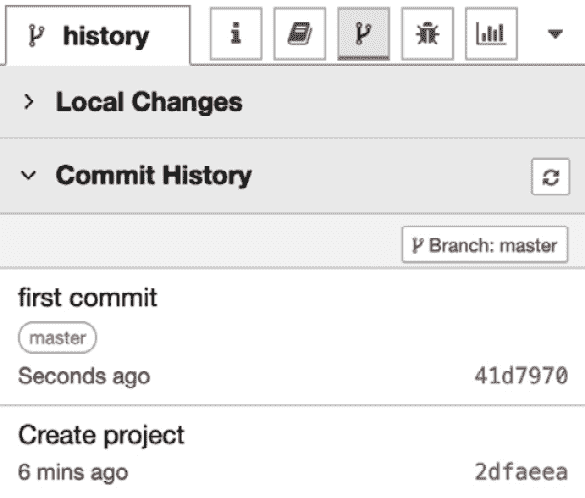

图 8.9-已添加新历史

在创建项目后，您可以像往常一样使用 Node-RED 编辑器。

现在，让我们为 Node-RED 流编辑器添加一个新的用户界面以实现项目功能。

## 访问项目设置

您正在处理的项目将显示在右侧窗格的顶部。在项目名称旁边，还有一个**显示项目设置**按钮：

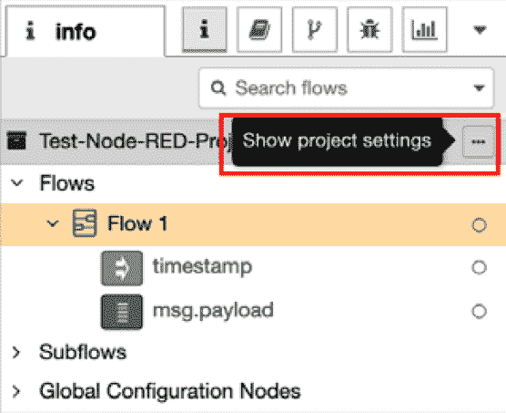

图 8.10-信息面板上的项目信息

您还可以从主菜单下的“项目 | 项目设置”选项中访问**项目设置**屏幕：

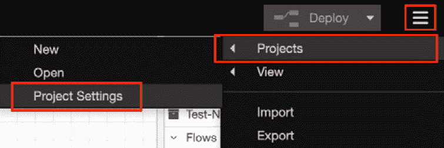

图 8.11-如何通过主菜单访问项目设置

当显示**项目设置**面板时，您会看到每个设置有三个选项卡：

+   此项目的`README.md`文件

+   **依赖项**：管理项目的节点列表

+   **设置**：管理项目设置和远程存储库：

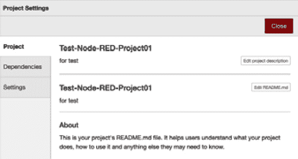

图 8.12-项目设置面板

如果要检查和修改 Git 设置，可以通过主菜单访问设置面板：

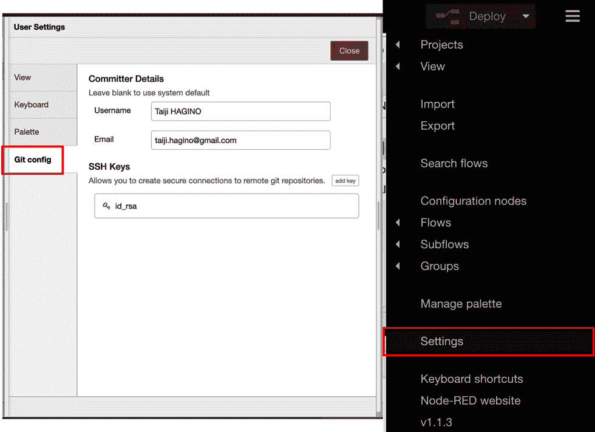

![图 8.13-用户设置面板上的 Git 配置现在您知道如何在本地环境中进行版本控制。下一步是了解如何连接远程存储库，比如 GitHub 服务。# 连接远程存储库现在，让我们学习如何将 Node-RED 连接到 GitHub 等远程存储库。在这里，我们将使用 GitHub 服务作为远程存储库。这就像通过 Node-RED 连接本地 Git 和远程 GitHub 一样。这并没有什么特别之处。对于经常使用 Git/GitHub 的人来说，这是很熟悉的，但它与 GitHub 用作客户端工具的情况非常相似。您可以很容易地使用 Node-RED 管理版本。通过以下步骤在 GitHub 上创建 Node-RED 项目的远程存储库：1.  首先，转到您的 GitHub 帐户并创建一个存储库。最好使用与您的本地存储库类似的项目名称。我们不会在这里详细介绍如何使用 GitHub，但由于它是一个可以直观使用的服务，我相信任何人都可以在没有任何问题的情况下使用它：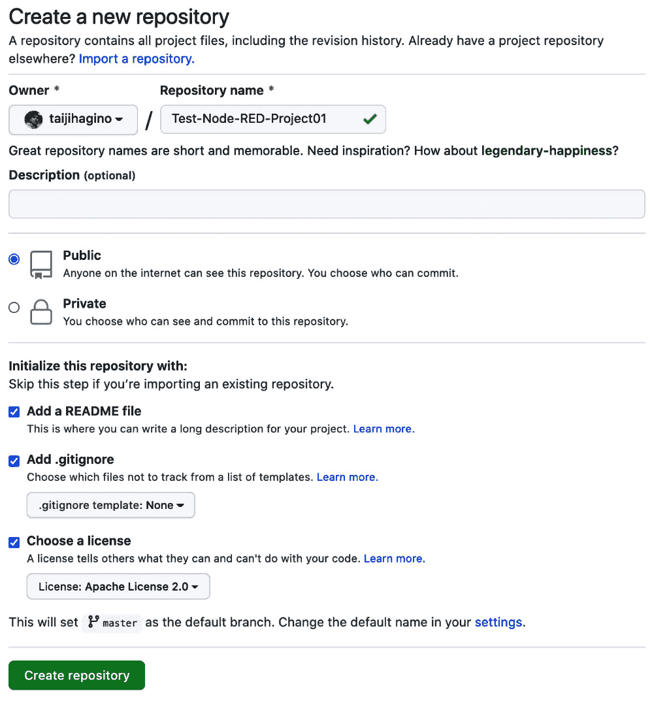

图 8.14-在 GitHub 上创建存储库

1.  配置您的 Node-RED 项目设置。要做到这一点，请返回到 Node-RED 流编辑器，然后转到**项目设置**以连接本地和远程存储库。打开**项目设置**面板后，单击**添加远程**按钮以配置远程存储库信息：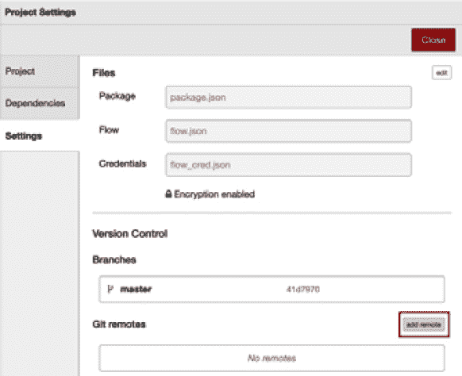

图 8.15 - 在项目设置面板上点击添加远程按钮

1.  请输入您在 GitHub 上创建的存储库 URL，然后单击**添加远程**按钮：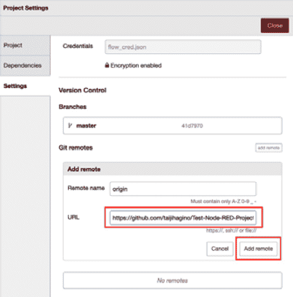

图 8.16 - 设置您的 GitHub 存储库的 URL

1.  单击设置面板右上角的**关闭**按钮以完成此配置。

1.  接下来，合并存储库。

GitHub 上的远程存储库现在已连接到您本地环境中的 Git 存储库。但它们尚未同步。您只需在本地拉取远程并进行合并。要做到这一点，请在侧边信息菜单中选择**历史**面板，然后在**提交历史**面板上单击**管理远程分支**按钮以连接到您的远程存储库：

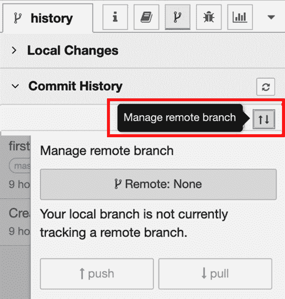

图 8.17 - 设置您的 GitHub 存储库的 URL

1.  选择您要推送的远程分支。通常会选择**origin/master**分支：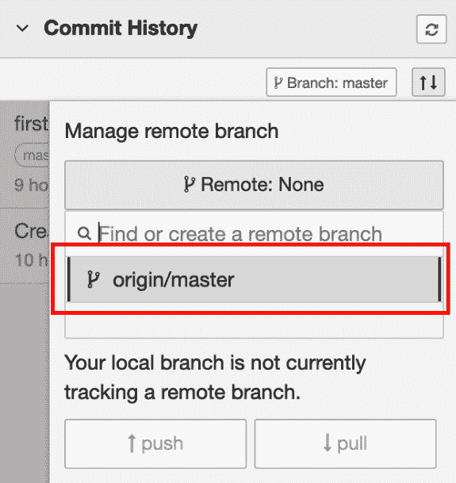

图 8.18 - 选择您的远程分支

这里，远程和本地之间存在差异，因为我们已经在本地创建了流程，并使用本地 Git 进行了版本控制。在这种情况下，您需要在将本地内容推送到远程之前，将远程内容拉取到本地。

1.  单击**pull**按钮：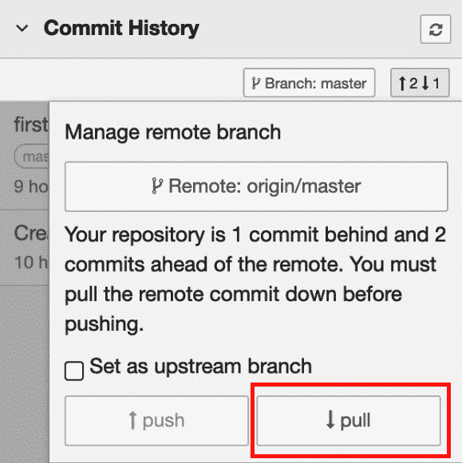

图 8.19 - 从远程存储库拉取提交

在途中会显示冲突的消息，但请继续进行合并。在合并过程中，将会询问您是要应用远程更改还是本地更改。在这种情况下，请应用本地端的更改以完成合并。

操作完成后，您将看到您的本地分支已与**提交历史**面板上的远程分支合并：

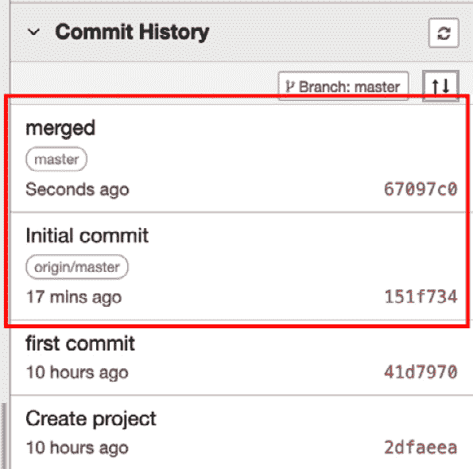

图 8.20 - 合并远程和本地存储库

1.  在此之后，选择**管理远程分支**按钮（上下箭头）：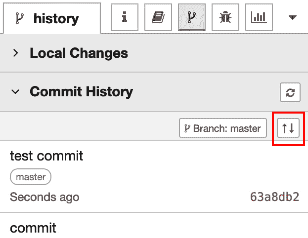

图 8.21 - 点击管理远程分支按钮

1.  选择要推送的分支，然后单击**push**按钮将这些更改发送（推送）到远程存储库：

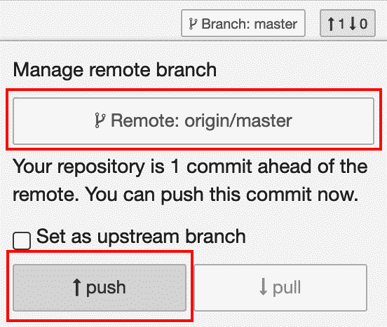

图 8.22 - 将更改发送到远程存储库

恭喜！现在您已经学会了如何在 Node-RED 上使用项目功能，您还可以将 Node-RED 的本地存储库连接到远程存储库。

# 摘要

在本章中，您学会了如何启用 Node-RED 的项目功能，并使用 GitHub 上创建的远程存储库集成本地版本控制 Git。在未来使用 Node-RED 开发团队时，这将非常有用。

在下一章中，我们将使用此项目功能在本地克隆待办事项应用程序的存储库。通过一起学习本章和下一章，您应该对项目功能有更深入的了解。
