# 第九章：使用 Node-RED 创建 ToDo 应用程序

在本章中，我们将在 Node-RED 中创建一个简单的 ToDo 应用程序。这是一个简单直接的教程，可以帮助你在 Node-RED 中创建应用程序（流程）。我们将使用上一章中介绍的项目功能，因此本章也将作为该功能的复习。

让我们从以下四个主题开始：

+   为什么应该使用 Node-RED 进行 Web 应用程序

+   创建数据库

+   如何连接数据库

+   运行应用程序

到本章结束时，你将掌握如何在 Node-RED 上制作一个带有数据库的简单 Web 应用程序。

# 技术要求

要完成本章，你需要以下内容：

+   Node.js 12.x 或更高版本 ([`nodejs.org/`](https://nodejs.org/)).

+   CouchDB 3.x ([`couchdb.apache.org/`](https://couchdb.apache.org/)).

+   一个 GitHub 账户，可从[`github.com/`](https://github.com/)获取。

+   本章中使用的代码可以在[`github.com/PacktPublishing/-Practical-Node-RED-Programming`](https://github.com/PacktPublishing/-Practical-Node-RED-Programming)的`Chapter09`中找到。

# 为什么应该使用 Node-RED 进行 Web 应用程序

到目前为止，本书已经解释了 Node-RED 是**物联网**(**IoT**)的易于使用的工具。在物联网领域，Node-RED 被用作解决方案的情况很多。

然而，最近，Node-RED 被认为是一个用于创建 Web 应用程序以及物联网的工具。

我认为其中一个原因是*无代码*和*低代码*的理念已经在世界范围内得到了广泛传播。如今，了解基于流的编程工具和可视化编程工具的人数正在增加，并且它们正在被用于各个领域。

Node-RED 是使用 Node.js 制作的，自然而然地可以用于 Web 应用程序。

我们在上一章学习的项目功能，与 Git/GitHub 合作，也可能成为 Web 应用程序开发文化流程的一部分。

在本章中，我们将创建一个非常适合作为教程开发的 ToDo 应用程序。

要创建的应用程序的整体图景如下：

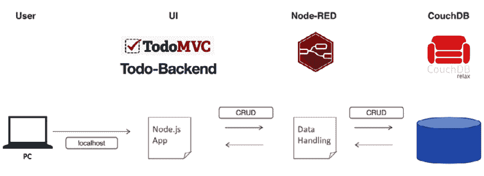

图 9.1 – 我们将创建的应用程序概述

*图 9.1*概述了应用程序的概况。该应用程序将从客户端 PC 浏览器访问。该应用程序的用户界面是使用 Node.js 框架**TodoMVC**和**Todo-Backend**制作的。数据处理编程是通过将 CouchDB 连接为存储数据的 Node-RED 构建的。

在这个应用程序中，用户界面和后端应用程序都不是基于 Node-RED 构建的。

该应用程序是直接在本地主机上作为 Node.js 应用程序实现的。我们将在稍后的步骤中介绍这一点，当访问 Node-RED 运行的本地主机端口时，我们将设置它重定向到本地主机 Node.js 应用程序。

在我们进行实际操作示例之前，我们应该了解一下这个应用程序使用了两个框架。我们将在这个实际操作教程中使用 Node-RED 制作我们的 ToDo 应用程序。该应用程序是通过这两个 Node.js 框架实现的：

+   **TodoMVC**: [`todomvc.com/`](http://todomvc.com/)


图 9.2 – TodoMVC

+   **Todo-Backend**: [`todobackend.com/`](https://todobackend.com/)

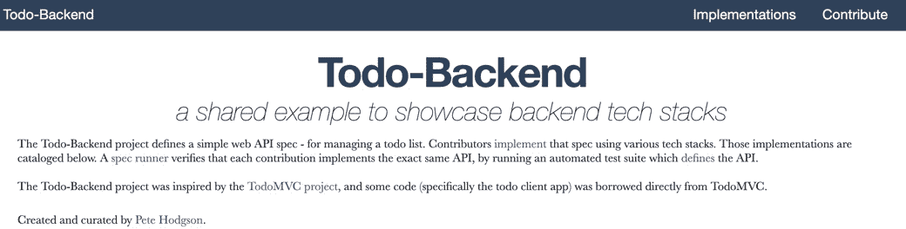

图 9.3 – Todo-Backend

正如你可以从可以通过链接 Web 应用程序框架创建 Node-RED 流的事实中看出来，Node-RED 与使用 Node.js 实现的 Web 应用程序及其周围的框架非常配合。这个实际操作教程将帮助你了解为什么 Node-RED 在以无代码/低代码方式开发 Web 应用程序方面如此受欢迎。

接下来，我们将进行实际操作步骤。

# 创建数据库

我们在上一节介绍了应用程序的整体情况，但更具体地，这个应用程序使用 CouchDB 作为数据库。在这个实践教程中，我们将创建一个在本地主机上运行的 Node-RED 应用程序。因此，你也需要在自己的本地机器上安装 CouchDB。

让我们按照以下步骤安装它：

1.  访问 CouchDB 网站[`couchdb.apache.org/`](https://couchdb.apache.org/)，然后点击**DOWNLOAD**按钮：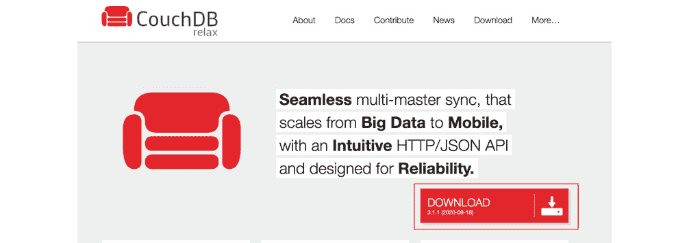

图 9.4 - 点击 DOWNLOAD 按钮

1.  根据本地机器上运行的系统选择一个文件：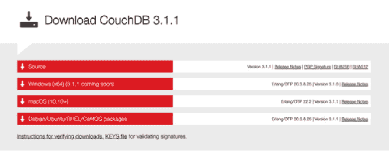

图 9.5 - 选择文件

1.  解压下载的 ZIP 文件并运行应用程序文件以启动 CouchDB，一旦文件下载完成：

图 9.6 - 启动 CouchDB

1.  运行 CouchDB 应用程序文件会启动浏览器并打开 CouchDB 管理控制台。如果没有自动打开，也可以从应用程序菜单手动打开：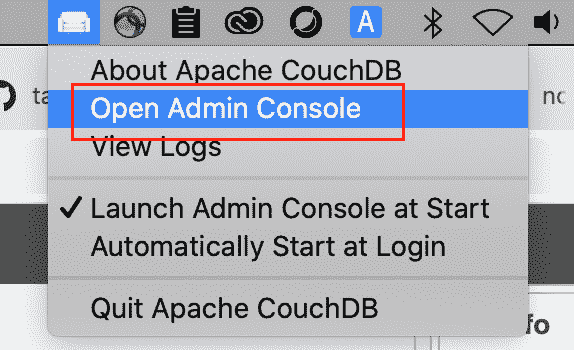

图 9.7 - 打开 CouchDB 管理控制台

1.  在 CouchDB 管理控制台中创建一个新的数据库。使用名称`todos`创建它。不需要分区。最后，点击**Create**按钮完成：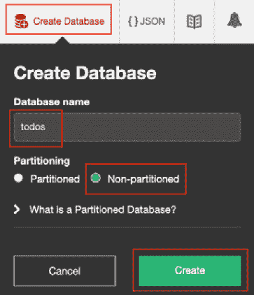

图 9.8 - 创建名为"todos"的新数据库

现在你可以在 CouchDB 管理控制台上看到名为**todos**的数据库：

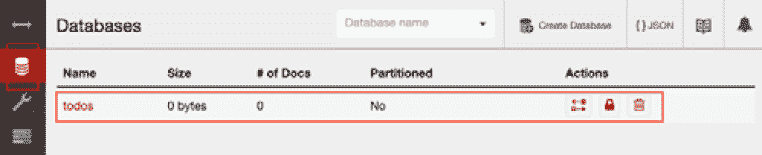

图 9.9 - 检查你创建的数据库

1.  创建一个管理员用户来访问这个数据库。为此，访问`admin`设置为用户名，`adminpass`设置为密码：

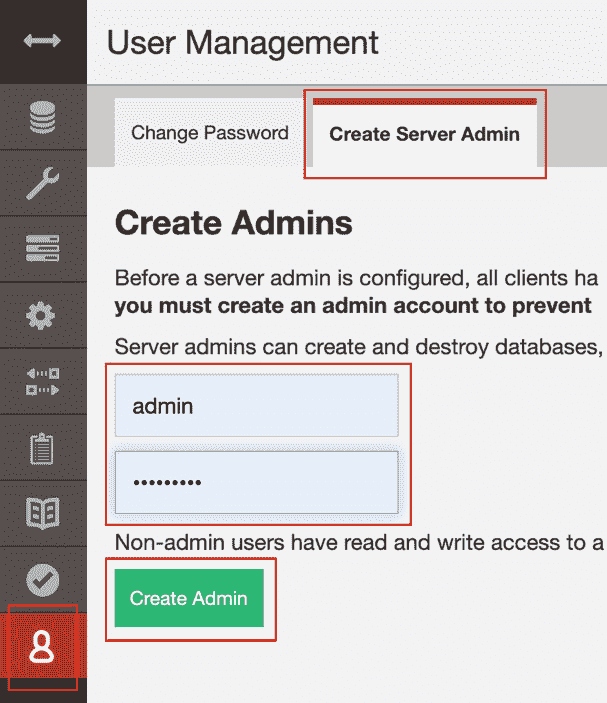

图 9.10 - 创建服务器管理员用户账户

这完成了所有与 CouchDB 相关的设置。接下来，让我们继续设置我们的 Node-RED 端。

# 如何连接到数据库

现在数据库实际上已经创建了，我们将朝着实践教程迈进，我们将从 GitHub 克隆 Node-RED 流，并实现从 Node-RED 流连接到该数据库。使用你在上一章学到的项目功能连接到你的 GitHub 存储库，加载准备好的流定义文件，并在本地环境中在 Node-RED 上实现它。由于你在上一章已经做过这个操作，这次不需要创建新的流。

## 配置 Node-RED

你需要做的第一件事是更改 Node-RED 流编辑器的本地主机路径（URL）。目前，你可以在`localhost:1880`访问流编辑器，但为了将由这个实践教程创建的 Web 应用程序的路径（URL）更改为`localhost:1880`，我们需要将流编辑器的路径更改为`localhost:1880/admin`。

这是因为你必须将 Node-RED 流编辑器的根路径移动到本地主机上运行的 Node.js ToDo 应用程序的相同端口上。

要配置 Node-RED，请按照以下步骤操作：

1.  打开设置文件（`~/.node-red/settings.js`）。

1.  找到你打开的`settings.js`文件中的`httpAdminRoot`设置。

这会更改你访问 Node-RED 流编辑器的路径。默认情况下，它使用根路径`/`，但是我们想要将其用于我们的应用程序，所以我们可以使用这个设置来移动编辑器。默认情况下是注释掉的，所以通过删除行首的`//`取消注释：

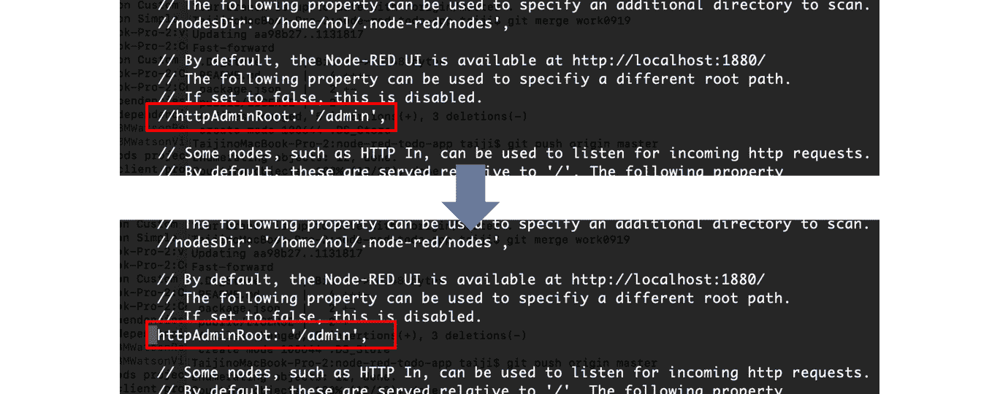

图 9.11 - 取消注释 httpAdminRoot 以启用流编辑器路径

1.  您现在已将流程编辑器移至`/admin`。在本地计算机上重新启动 Node-RED，并访问`http://localhost:1880/admin` URL 以运行您的 Node-RED 流程编辑器。

接下来，让我们克隆项目。

## 克隆 Node-RED 项目

这个实践教程为您提供了一个 Node-RED 项目的示例。在将其克隆到本地 Node-RED 实例之前，您应该首先分叉该项目，以便您有自己的副本可供使用。

分叉后，您需要将项目克隆到您的 Node-RED 实例中。

要克隆您的项目，请按照以下步骤进行：

1.  在[`github.com/taijihagino/node-red-todo-app`](https://github.com/taijihagino/node-red-todo-app)上打开示例项目。

1.  单击**fork**按钮以创建存储库的自己的副本。

1.  复制您分叉的存储库的 URL。

1.  通过`http://127.0.0.1:1880/admin/`访问 Node-RED 编辑器。

1.  在**项目欢迎**屏幕上单击**克隆存储库**按钮。如果您已经关闭了该屏幕，可以从主菜单中使用**项目 | 新建**重新打开它：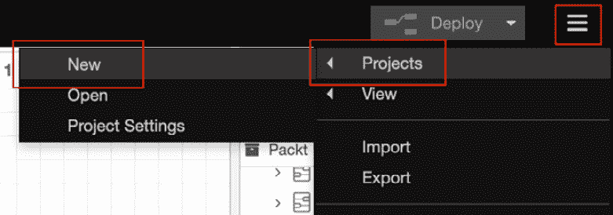

图 9.12 - 单击项目菜单下的新建以克隆存储库

1.  在**项目**屏幕上，提供您的存储库 URL、用户名和密码。这些在提交更改到项目时使用。如果您的本地 Git 客户端已配置，它将选择这些值。将**凭据加密密钥**字段留空是可以的：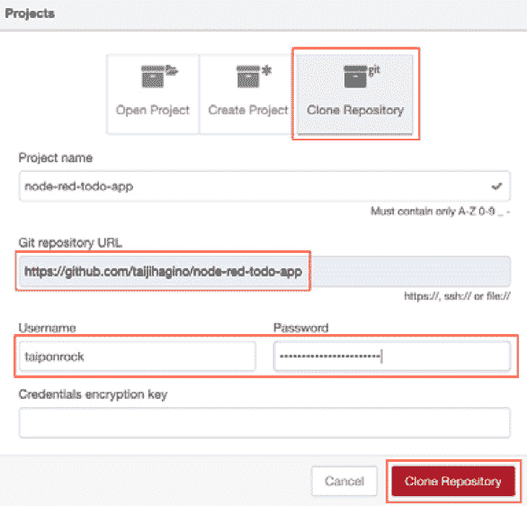

图 9.13 - 提供您的 GitHub 存储库信息

1.  这将克隆存储库到一个新的本地项目并开始运行它。在工作区中，您可以看到实现应用程序的每个部分的流程。

您将在所有**cloudant**节点上看到一些错误，但这些错误的原因来自连接设置。这些设置将在后续步骤中进行设置，所以现在不是问题：

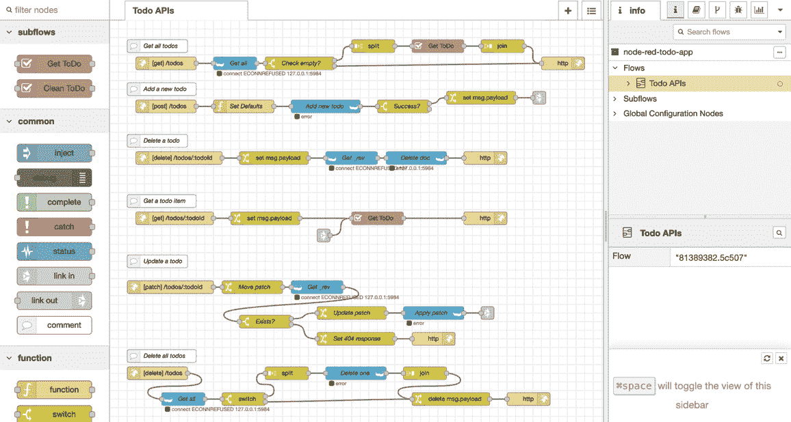

图 9.14 - 您克隆的流程概述

1.  该项目还包括一些需要由运行时提供的静态资源。为此，需要对如何访问此 Web 应用程序的设置文件进行一些更改。

首先，您必须在本地文件系统中找到您新克隆的项目。它将在`<node-red root>/projects/<name-of-project>`中。在该文件夹中，您将找到一个名为`public`的文件夹。这包含了此 ToDo 应用程序项目的静态资源，例如以下内容：

```js
/Users/taiji/.node-red/projects/node-red-todo-app
```

以下图像是一个示例。请在检查您自己的文件路径时使用它作为参考：

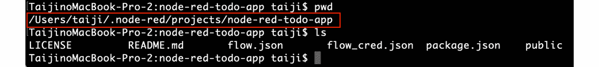

图 9.15 - ToDo 应用程序项目文件夹

1.  编辑您的设置文件（`~/.node-red/settings.js`），并在该文件中找到`httpStatic`属性。通过删除行首的`//`来取消注释，并使用绝对路径到`public`文件夹来设置其值。以下图像中的路径仅为示例；请用您的路径替换它：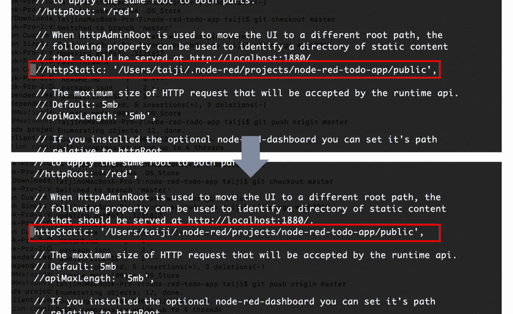

图 9.16 - 取消注释 httpStatic 并设置您的应用程序项目路径

1.  重新启动 Node-RED。

通过重新启动 Node-RED，更改的`settings.js`内容将被重新加载和应用。

接下来，让我们配置 Node-RED 和 CouchDB 连接。

## 配置 Node-RED 和 CouchDB 连接

正如您所知，我们正在使用**cloudant**节点连接到 CouchDB，对吗？

Cloudant 是基于 Apache CouchDB 的 JSON 数据库。Cloudant 具有 CouchDB 风格的复制和同步功能，因此您可以使用 Node-RED 提供的**cloudant**节点连接到 CouchDB。

如前所述，Node-RED 上的**cloudant**节点出现错误。这是因为从 GitHub 克隆时，本地系统对 CouchDB 的连接信息未正确设置。

在这里，我们将纠正 Node-RED 上**cloudant**节点的设置。

现在，根据以下步骤进行设置：

1.  双击任何**cloudant**节点以打开设置屏幕。如果您在其中设置了一个**cloudant**节点，则同一流程上的所有**cloudant**节点的设置都将被更新，因此您选择哪个**cloudant**节点并不重要：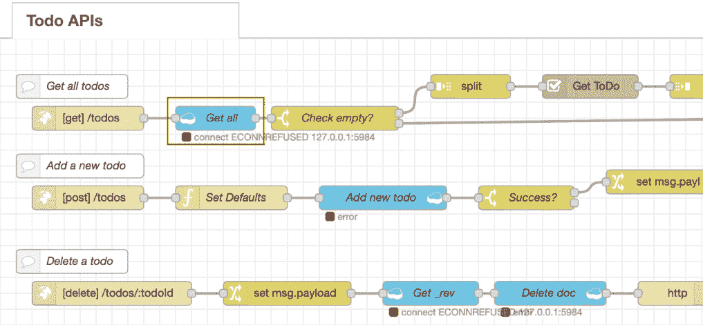

图 9.17–双击任何 cloudant 节点打开设置屏幕

1.  点击**cloudant**节点设置屏幕上**服务器**右侧的**铅笔标记**按钮，打开 CouchDB 的连接信息设置屏幕：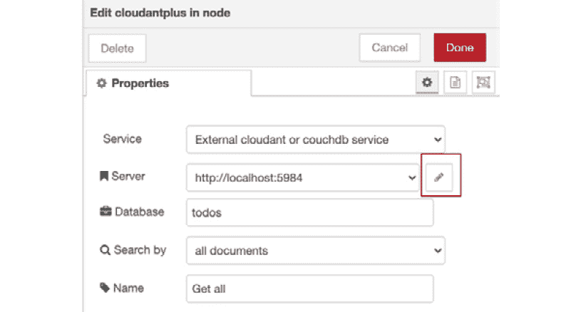

图 9.18–点击铅笔标记按钮

1.  当打开 CouchDB 的连接信息设置屏幕时，转到`http://localhost:5984`（如果您的 CouchDB 安装在不同的端口上，请相应地替换），并将**用户名**设置为您之前设置的 CouchDB 服务器管理员用户。对于**密码**，输入服务器管理员密码。

1.  在输入所有内容后，点击右上角的**更新**按钮返回到上一个屏幕：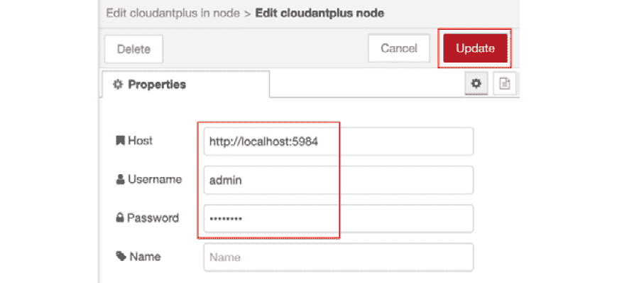

图 9.19–设置您的 CouchDB URL 和服务器管理员用户名/密码

1.  点击**完成**按钮并返回到您的 Node-RED 流程编辑器的工作区。您将看到所有**cloudant**节点旁边的**连接**上有一个绿色方块的消息：

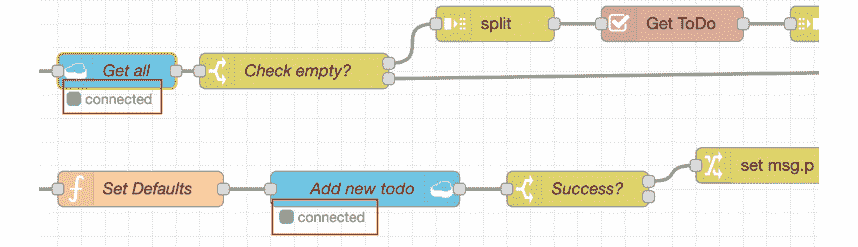

图 9.20–检查所有 cloudant 节点是否无错误

完美，您已成功配置了在 Node-RED 中启动 ToDo 应用程序的设置。接下来，让我们运行这个 ToDo 应用程序。

# 运行应用程序

如果一切正常，您应该能够在浏览器中打开`http://localhost:1880`并看到应用程序。

现在，让我们通过以下步骤确认 ToDo 应用程序是否正常工作：

1.  访问`http://localhost:1880`打开您的 ToDo 应用程序。

如果您在打开`localhost:1880`时看到 Node-RED 流程编辑器，则表示`httpAdminRoot`设置未启用，请再次检查您的`settings.js`文件。

当您访问此 URL 时，应显示以下屏幕：

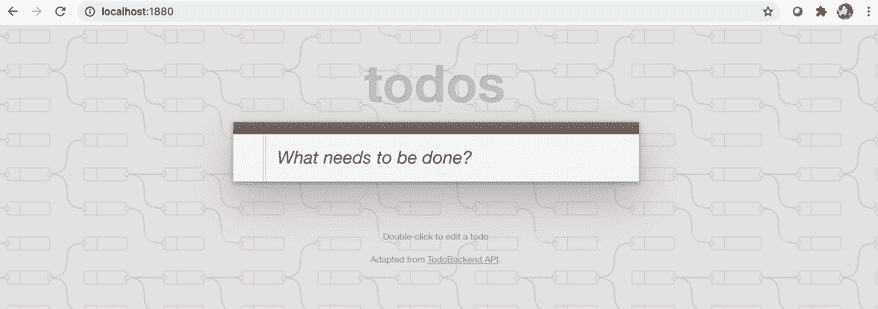

图 9.21–打开您的 ToDo 应用程序

1.  对于此测试，任何 ToDo 项目都可以，因此输入任何单词作为示例任务。在这里，我输入了`报告我的任务`：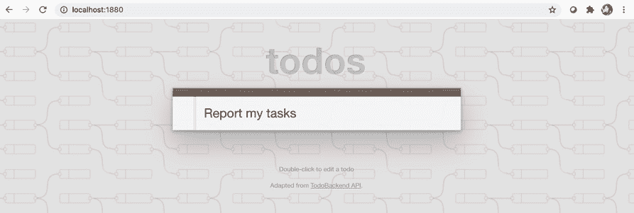

图 9.22–输入一个示例 ToDo 项目

1.  在文本框中输入值时，如果按下*Enter*键，该值将被注册为一个 ToDo 项目。在下面的截图中，我们可以看到它看起来已经在应用程序中注册了：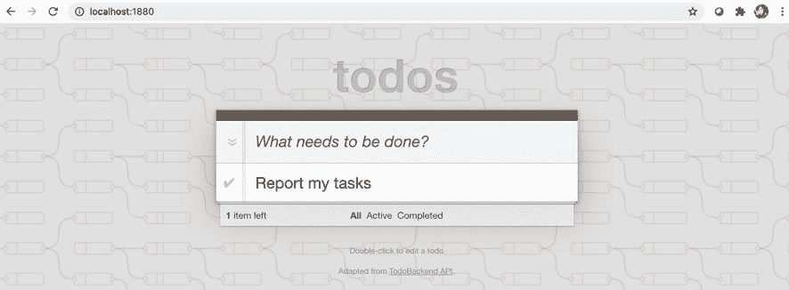

图 9.23–您输入的 ToDo 项目已被注册

让我们检查一下屏幕上显示为已注册的 ToDo 项目是否在数据库中注册。

1.  打开 CouchDB 管理控制台。

如果您忘记如何打开它，可以从 CouchDB 应用程序菜单中选择**打开管理控制台**选项打开它。如果重新打开管理控制台，或者时间已过，可能会要求您登录。在这种情况下，请使用您设置的服务器管理员用户名和密码登录。

1.  在侧边菜单中选择**数据库**选项，然后点击**todos**。您将看到您在 ToDo 应用程序上注册的记录。点击记录以查看更多细节：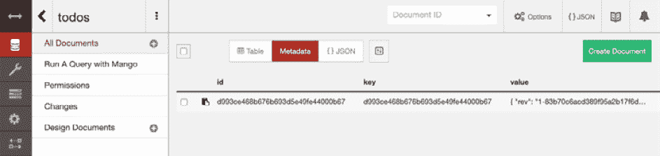

图 9.24 - 检查您的待办事项数据库中的记录

1.  您将看到您选择的记录的详细信息。数据是您通过 ToDo 应用程序注册的确切项目，即**报告我的任务**：

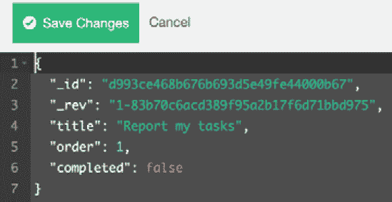

图 9.25 - 检查结果

恭喜！这完成了从 GitHub 克隆 ToDo 应用程序并在 Node-RED 中实现的实践教程。

本教程的重点是使用 Node-RED 的项目功能从 GitHub 存储库克隆和执行应用程序项目。

这个实践教程帮助我们了解，我们不一定需要在使用 Node-RED 制作的 Web 应用程序中实现用户界面和服务器端业务逻辑。我们看到 Node-RED 的一个特点是，我们构建的 Web 应用程序的用户界面和服务器端业务逻辑位于 Node-RED 之外，而仅数据处理功能（如访问数据库）由 Node-RED 内部完成。

我们使用的 GitHub 存储库包含两件事，即处理数据的 Node-RED 流程和在 Node-RED 之外运行的 ToDo 应用程序。这里的重点是使用 Node-RED 的项目功能从 GitHub 存储库克隆和执行应用程序项目。

# 摘要

在本章中，我们通过实践教程的形式体验了如何使用项目功能在 Node-RED 上实际运行 Web 应用程序。当然，这只是在 Node-RED 上创建 Web 应用程序（包括 UI，使用模板节点等）的一种方式。然而，记住这种模式对于您未来的开发任务肯定会有用。

在下一章中，我们将看到一个实际场景，我们将使用 Node-RED 将传感器数据从边缘设备发送到服务器端（云）。
