# 第十章：在树莓派上处理传感器数据

在本章中，我们将学习在**物联网**（**IoT**）中使用 Node-RED 处理来自边缘设备的数据的处理过程。我们不仅将涵盖数据处理，还将从边缘设备向服务器应用程序发送数据。对于设备，我想使用树莓派。完成本章中的教程后，你将能够处理边缘设备获取的传感器数据。

让我们从以下四个主题开始：

+   从树莓派上的传感器模块获取传感器数据

+   学习 MQTT 协议并使用 MQTT 节点

+   连接到 MQTT 代理

+   检查本地主机上数据的状态

# 技术要求

要在本章中取得进展，你需要以下内容：

+   从[`www.raspberrypi.org/`](https://www.raspberrypi.org/)获取的树莓派

+   本章中使用的代码可以在[`github.com/PacktPublishing/-Practical-Node-RED-Programming`](https://github.com/PacktPublishing/-Practical-Node-RED-Programming)的`Chapter10`文件夹中找到

# 从树莓派上的传感器模块获取传感器数据

在本章中，我们将学习如何使用 Node-RED 在树莓派上处理从传感器设备获取的数据，并将数据发布到 MQTT 代理。

对于传感器设备，我们将使用在*第五章*中使用的温湿度传感器，*本地实现 Node-RED*。有关连接和如何在树莓派上启用传感器设备的详细信息，请参阅*第五章*中的每个步骤，*本地实现 Node-RED*。

准备将你的温湿度传感器连接到你的树莓派。这就是边缘设备。你已经在*第五章*中购买并配置了你的边缘设备，*本地实现 Node-RED*。本章不使用光传感器：

+   边缘设备：**树莓派 3** (https://www.raspberrypi.org/)

+   传感器模块：**Grove 树莓派底板，Grove 温湿度传感器（SHT31）** ([`www.seeedstudio.com/Grove-Base-Hat-for-Raspberry-Pi.html`](https://www.seeedstudio.com/Grove-Base-Hat-for-Raspberry-Pi.html), [`www.seeedstudio.com/Grove-Temperature-Humidity-Sensor-SHT31.html`](https://www.seeedstudio.com/Grove-Temperature-Humidity-Sensor-SHT31.html))

## 准备设备

请准备好设备，以收集树莓派上的温湿度传感器数据，步骤如下：

1.  将传感器模块连接到你的树莓派。

当所有设备准备就绪时，连接树莓派和 Grove 树莓派底板，并将 Grove 温湿度传感器（SHT31）连接到 I2C 端口（任何 I2C 端口都可以）：

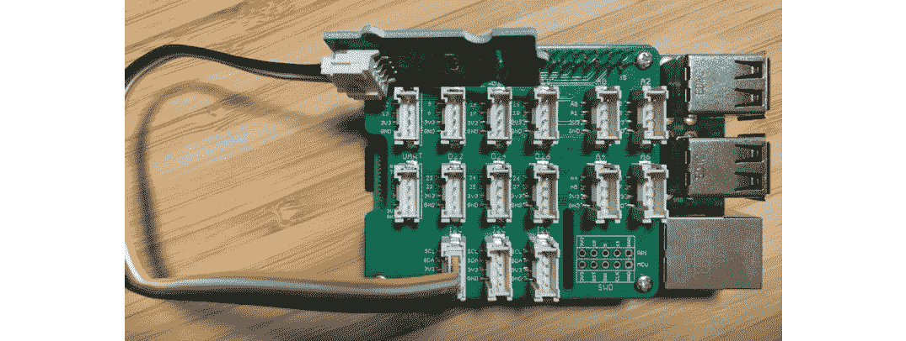

图 10.1 – 连接温湿度传感器到你的树莓派

1.  将你的树莓派连接到互联网。

我们将继续从树莓派连接到服务器端，所以请确保通过 Wi-Fi 连接到互联网。当然，你也可以通过使用 LAN 电缆连接到调制解调器来访问互联网。树莓派默认具有 LAN 电缆端口，所以你只需插入 LAN 电缆即可：

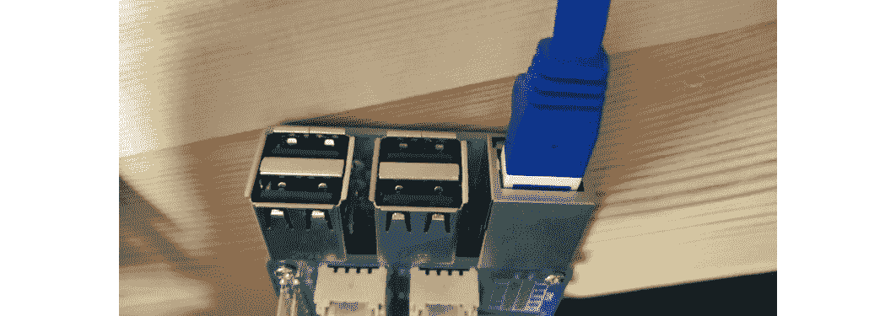

图 10.2 – 将你的树莓派连接到互联网

这就是我们继续所需的全部内容。接下来，我们将看到如何从传感器节点获取数据。

## 检查 Node-RED 以从传感器设备获取数据

正如你在*第五章*中已经学到的，*本地实现 Node-RED*，从 Grove 树莓派温湿度传感器模块获取数据应该很容易。

以下是从传感器节点获取数据的步骤：

1.  创建一个简单的流程来获取数据。从流程编辑器左侧的调色板中选择三个节点，即一个**inject**节点，一个**grove-temperature-humidity-sensor-sht3x**节点和一个**debug**节点，并将它们拖放到工作区中放置。

1.  放置它们后，请按照以下图示将它们依次连接：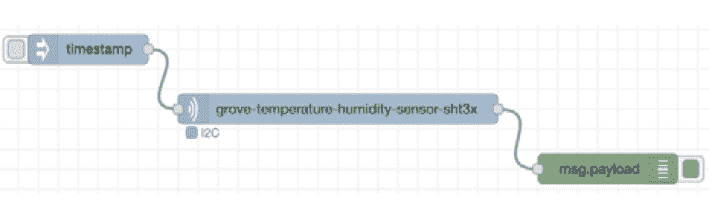

图 10.3 - 放置和连接节点

1.  检查**grove-temperature-humidity-sensor-sht3x**节点的设置。要检查设置，请双击**grove-temperature-humidity-sensor-sht3x**节点以打开设置屏幕。

在此设置屏幕上没有要设置的值或项目。您只需确保端口显示为**I2C**。检查后，关闭设置屏幕。

确保您看到一个蓝色的方形图标和**grove-temperature-humidity-sensor-sht3x**节点下方的**I2C**文本。这表示 Grove Base 温度/湿度传感器模块已成功连接到您的树莓派。如果此图标的颜色变为红色，则表示模块未正确连接到**I2C**端口，请重新正确连接硬件：

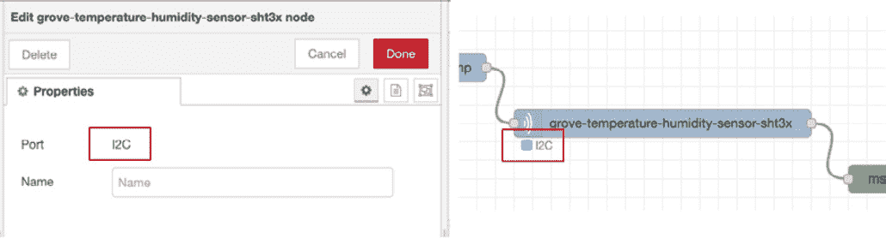

图 10.4 - 检查端口是否设置为 I2C

1.  执行流程并通过单击流程编辑器右上角的**部署**按钮来检查结果以完成部署。

1.  部署成功后，单击**inject**节点上的开关以启动流程：

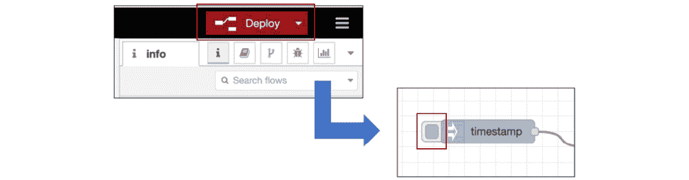

图 10.5 - 部署并单击注入节点上的按钮

如果您可以确认在流程编辑器的**debug**选项卡中以 JSON 格式显示了收集到的传感器数据的值，那么它已成功工作。这样，可以从传感器模块获取数据：

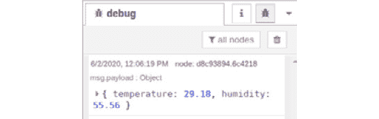

图 10.6 - 确保从传感器模块中可见数据

现在我们知道树莓派上的 Node-RED 可以处理传感器数据。让我们学习将这些数据发布到 MQTT 代理的过程。

# 学习 MQTT 协议并使用 MQTT 节点

现在传感器数据已成功获取，让我们将数据发送到服务器。

我们通常选择适合传输内容的协议；例如，在交换邮件时，我们使用 SMTP。目前，HTTP 被用作互联网上的通用协议。

例如，HTTP 用于互联网上的各种通信，如在浏览器中显示网页和在服务器之间交换数据。HTTP 是为在互联网上交换内容而创建的协议。在许多情况下，互联网上的网络设备，如路由器和防火墙，被设置为允许使用 HTTP 通信以用于各种目的，并且 HTTP 与互联网兼容。

在物联网世界中，MQTT 通常用作 HTTP 的通用协议。这意味着 MQTT 协议是物联网世界的标准，就像 HTTP 协议是网络世界的标准一样。

**MQTT**（**MQ Telemetry Transport**的缩写）是由 IBM 和 Eurotech 于 1999 年首次创建的通信协议。2013 年，这一协议的标准化由一个名为 OASIS 的国际标准化组织推动。

MQTT 旨在在 TCP/IP 上使用。简而言之，它专门用于互联网上的**机器对机器**（**M2M**）通信，以及机器与互联网上的其他资源之间的通信。这里所指的*机器*是微型计算机板，如个人电脑和小型 Linux 板（包括树莓派）。

自 1999 年以来，M2M 已经发展，出现了**IoT**这个词，当传统机器通过互联网进行通信时，现在很常用 MQTT。因此，MQTT 是物联网的最佳协议。MQTT 重要的原因之一是它提供了一种轻量级协议来处理窄带网络和低性能设备上的数据：

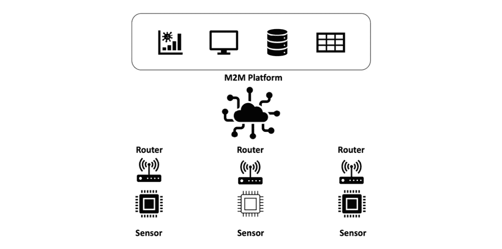

图 10.7 – 典型 M2M 通信的概念图

从前面的信息中，您可以看到为什么在物联网中使用 MQTT 协议。现在让我们思考 Node-RED 如何使用 MQTT 协议传输数据。

Node-RED 默认提供以下两个与 MQTT 相关的节点：

+   **mqtt in**：**mqtt in**节点连接到 MQTT 代理并订阅指定主题上的消息。

+   **mqtt out**：**mqtt out**节点连接到 MQTT 代理并发布消息：


图 10.8 – mqtt in 节点和 mqtt out 节点

您可以在 Node-RED 流编辑器的侧边栏的**网络**类别下找到这些。

如果您想为 MQTT 代理设置服务器地址和主题，并使用发布和订阅，可以使用这两个节点。

现在让我们尝试将传感器数据发送到本地 MQTT 代理。

# 连接到 MQTT 代理

现在，让我们通过 Node-RED 将树莓派上的传感器数据发送到 MQTT 代理。在这里，我们将使用流行的 MQTT 代理**Mosquitto**。在本章中，我们将准备设备以将设备数据发送到服务器。实际在服务器端接收和处理数据的任务将在下一章的实际示例中进行演示。因此，在这里，我们将使用 Mosquitto 仅用于检查数据传输是否正确执行。

## Mosquitto

Mosquitto 是根据开源 BSD 许可发布的，并为 MQTT V3.1/v3.1.1 提供代理功能。

它适用于主要的 Linux 发行版，如 RedHat Enterprise Linux，CentOS，Ubuntu 和 OpenSUSE，以及 Windows。它也适用于树莓派等小型计算机。

在本章中，我们将验证边缘设备的传感器数据是否可以通过 MQTT 代理发送到树莓派的本地主机。这非常容易。我相信，如果我们可以以这种方式将数据发送到 MQTT 代理，我们将能够立即在服务器端看到边缘设备的传感器数据。

以下是一个通用配置图，显示了 Mosquitto 的示例用法：

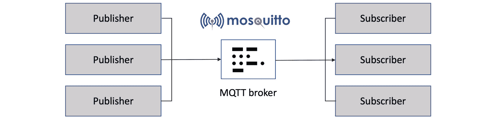

图 10.9 – Mosquitto 概述

在本章中，我们将实现从边缘设备到 Mosquitto 发送数据的 Node-RED 流程。下一章将实现使用 IBM Cloud 进行数据可视化。

重要提示

Mosquitto 是一个非常重要和有用的工具，是在 Node-RED 中实现物联网机制的平台。深入了解 Mosquitto 将帮助您使 Node-RED 更广泛地可用。

您可以在[`mosquitto.org/`](https://mosquitto.org/)了解更多关于 Mosquitto 的信息。

现在，让我们在您的树莓派上准备 Mosquitto。

## 准备您的树莓派上的 Mosquitto

在本节中，我们将启用 Mosquitto，以便它可以在树莓派上运行。流程很简单。只需安装 Mosquitto 并启动服务。请按照以下步骤在您的树莓派上准备：

1.  要安装 Mosquitto，请在终端上执行以下命令：

```js
$ sudo apt install mosquitto
```

1.  要启动 Mosquitto 服务，请在终端上执行以下命令：

```js
sudo systemctl start mosquitto
```

启动后，您可以使用以下命令检查 Mosquitto 服务的状态：

```js
sudo systemctl status mosquitto
```

在终端上看起来是这样的：

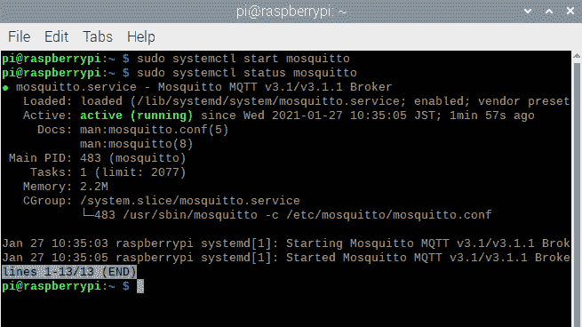

图 10.10 – Mosquitto 运行状态

1.  要安装 Mosquitto 客户端工具，请在终端上执行以下命令：

```js
$ sudo apt install mosquitto-clients
```

1.  要检查发布和订阅功能，请运行`packt`作为**主题**：

```js
$ sudo apt install mosquitto-clients
$ mosquitto_sub -d -t packt
```

在终端中的显示如下：

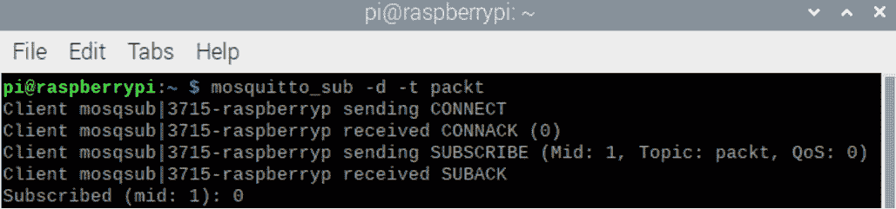

图 10.11 - 开始订阅 Mosquitto 与主题 packt

1.  使用另一个终端发送一些文本到这个代理的以下命令：

```js
$ mosquitto_pub -d -t packt -m "Hello Packt!"
```

在终端中的显示如下：

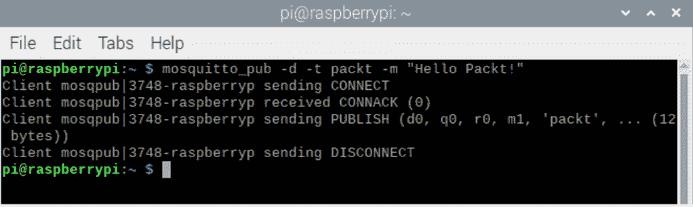

图 10.12 - 使用主题 packt 发布消息到 Mosquitto

您将在终端订阅到您发布的消息。

现在，您可以使用 Mosquitto 了。接下来，我们将在您的树莓派上的 Node-RED 上实现发布/订阅。

## 制作一个流程来获取传感器数据并将其发送到 MQTT 代理

现在，在您的树莓派上启动 Node-RED 流编辑器，并按照以下步骤创建一个流程：

1.  在之前*检查 Node-RED 是否可以从传感器设备获取数据*部分创建的流程中，在**grove-temperature-humidity-sensor-sht3x**节点之后放置**mqtt out**节点，并将**mqtt in**节点和**debug**节点与**mqtt out 流**分开。请按照以下图示连接它们：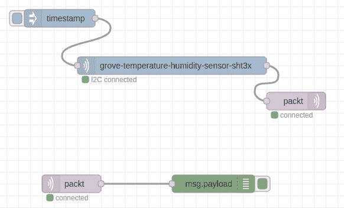

图 10.13 - 放置这些节点并连接它们

1.  编辑`localhost`

1.  端口：`1883`

*可以编辑`packt`

1.  `1`

1.  `true`

设置窗口应该是这样的：

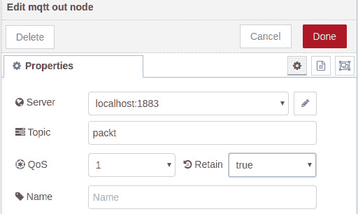

图 10.14 - 设置 mqtt out 节点的属性

1.  编辑`localhost`

1.  `1883`

*可以编辑`packt`

1.  `1`

1.  **输出**：**自动检测（字符串或缓冲区）**

设置窗口应该是这样的：

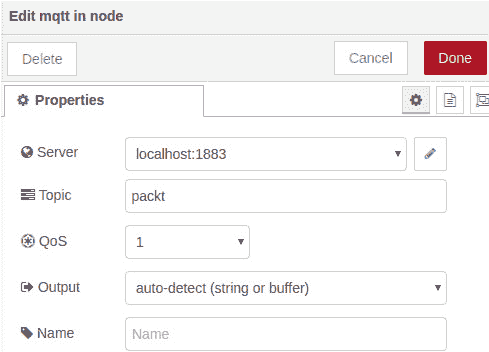

图 10.15 - 设置 mqtt in 节点的属性

有了这个，我们已经完成了通过**Mosquitto** MQTT 代理在您的树莓派 localhost 上订阅和发布主题`packt`的流程。接下来，我们将检查我们在 localhost 上的数据状态。

# 检查 localhost 上的数据状态

在本节中，我们将检查从您的树莓派发送的传感器数据是否可以通过 Node-RED 接收到 Mosquitto。

1.  在您的树莓派上的 Node-RED 实例上运行您在上一节中创建的流程。

1.  单击**inject**节点的开关以运行此流程并发布 Grove 温湿度传感器数据：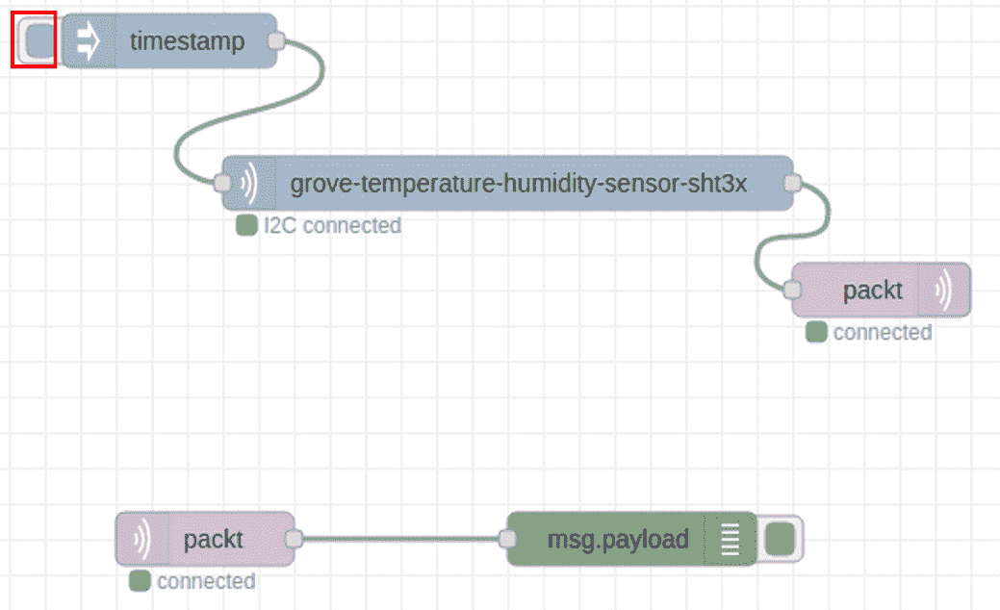

图 10.16 - 运行发布数据的流

1.  检查已订阅的数据。

当前在这个 Node-RED 实例中有两个流。一个是将数据发布到 Mosquitto MQTT 代理的流，另一个是从该代理订阅数据的流。订阅的流通常处于待机状态，因此当数据被发布时，订阅的数据会自动输出到**debug**选项卡。

1.  检查**debug**选项卡。您应该看到您发布的数据：

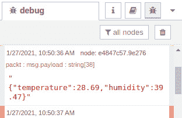

图 10.17 - 检查发布和订阅的结果\

恭喜！现在您知道如何处理树莓派和 Grove Base 传感器模块在边缘设备上获取的传感器数据，并将其发送到 MQTT 代理。

# 摘要

在本章中，通过实际操作教程的形式，我们体验了如何在边缘设备上处理传感器数据并将其发送到 MQTT 代理。这是使用 Node-RED 为物联网创建边缘设备端应用程序的一种方式。

在下一章中，我们将看一个实际的例子，接收传感器数据并通过 Node-RED 在服务器端（云端）进行可视化。
