# 第十一章：通过在 IBM Cloud 中创建服务器端应用程序来可视化数据

在本章中，我们将创建一个服务器应用程序，用于可视化从物联网边缘设备发送的数据，使用 Node-RED。对于服务器端应用程序，我想在这里使用 IBM Cloud。通过本章中的教程，您将掌握如何在服务器应用程序上可视化传感器数据。

让我们从以下主题开始：

+   准备一个公共 MQTT 代理服务

+   在边缘设备上从 Node-RED 发布数据

+   在云端 Node-RED 上订阅和可视化数据

在本章结束时，您将掌握如何在云平台上可视化传感器数据。

# 技术要求

要在本章中取得进展，您将需要以下内容：

+   IBM Cloud 帐户：[`cloud.ibm.com/`](https://cloud.ibm.com/)

+   CloudMQTT 帐户：[`cloudmqtt.com/`](https://cloudmqtt.com/)

+   本章中使用的代码可以在[`github.com/PacktPublishing/-Practical-Node-RED-Programming`](https://github.com/PacktPublishing/-Practical-Node-RED-Programming)的`Chapter11`文件夹中找到。

# 准备一个公共 MQTT 代理服务

回想一下上一章，*第十章*，*在树莓派上处理传感器数据*。我们将连接到边缘设备（树莓派）的温度/湿度传感器的数据发送到云端，并确认可以在云端观察到数据。

在上一章中，我们检查了如何使用名为**Mosquitto**的服务操作 MQTT 代理。这是为了专注于*从边缘设备发送数据*到 MQTT 代理。

然而，这是一个在树莓派上本地完成的机制。基本上，在尝试实现物联网机制时，MQTT 代理应该位于公共位置，并且可以通过互联网从任何地方访问。

在公共云中托管自己的**Mosquitto** MQTT 代理是可能的，但这会增加一些额外的复杂性，涉及设置和维护。有许多公共 MQTT 服务可用，可以使入门变得更容易。

在本章中，我们将使用名为**CloudMQTT**的服务作为 MQTT 代理，但您可以用您喜欢的服务替换 MQTT 代理部分。您还可以在 IaaS 上发布自己的 MQTT 代理，例如**Mosquitto**，而不是使用 SaaS：

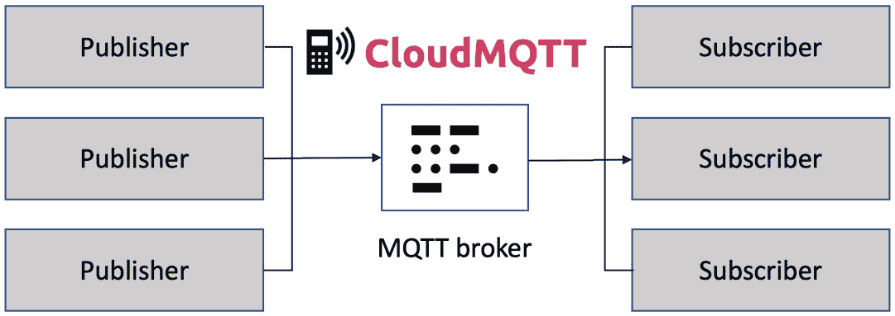

图 11.1 - CloudMQTT 概述

重要提示

MQTT 代理是一个服务器，它接收来自发布者的消息并将其发送给订阅者。

在 PubSub 中传递消息的服务器称为 MQTT 代理。

PubSub 是*发布者*和*订阅者*这两个词的结合：

a) 发布者是传递消息的人。

b) 订阅者是订阅消息的人。

您可以将其视为从客户端接收消息并将其分发给客户端的服务器。

MQTT 与普通的套接字通信不同，它是一对多的通信。换句话说，它有一种机制，可以将一个客户端的消息分发给许多人。这个系统允许我们实时同时向许多人传递消息。

我们现在将学习如何准备**CloudMQTT**。如前所述，**CloudMQTT**是作为 SaaS 发布的 MQTT 代理。如果您不使用**CloudMQTT**，想要使用另一个 SaaS MQTT 代理或在 IaaS 上发布 MQTT 代理，您可以跳过此步骤。但是，使用 MQTT 代理的基本配置信息保持不变，因此我相信这一步将帮助您配置任何 MQTT 代理。

执行以下步骤在**CloudMQTT**上创建一个 MQTT 代理服务：

1.  登录到[`cloudmqtt.com/`](https://cloudmqtt.com/)的**CloudMQTT**。

当您访问网站时，点击窗口右上角的**登录**按钮：

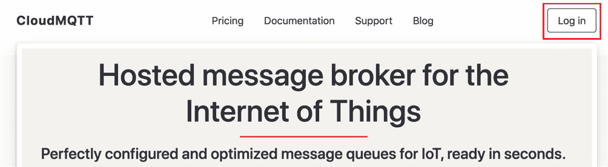

图 11.2 - CloudMQTT 网站

如果你已经有了 CloudMQTT 账户，请通过输入你的电子邮件地址和密码登录你的账户：

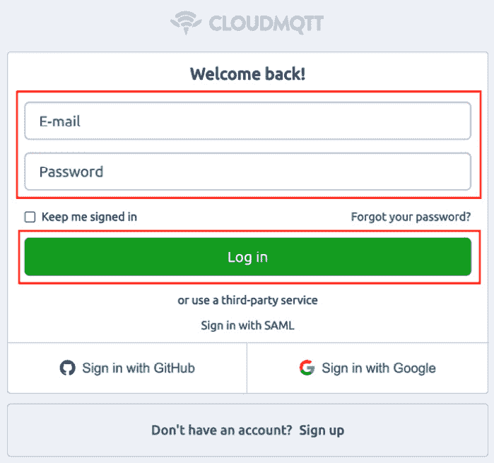

图 11.3 - 登录到 CloudMQTT

如果你还没有你的账户，请通过窗口底部的**Sign up**按钮创建一个新账户：

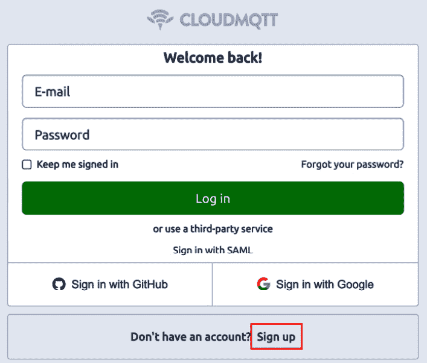

图 11.4 - 创建你的账户

1.  创建一个实例。

登录后，单击窗口右上角的**Create New Instance**按钮：

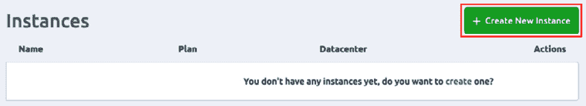

图 11.5 - 创建一个新实例

1.  选择一个名称和付款计划。

这个名称是为了你的 MQTT 代理服务。你可以给它任何你想要的名字。我用了`Packt MQTT Broker`。

不幸的是，免费计划**Cute Cat**已经不再可用。所以，我们将在这里选择最便宜的计划**Humble Hedgehog**。这个计划每月需要 5 美元。

使用这个付费服务取决于你。如果你想避免计费，你需要寻找一个免费的 MQTT 代理服务。

选择名称和付款计划后，单击**Select Region**按钮：

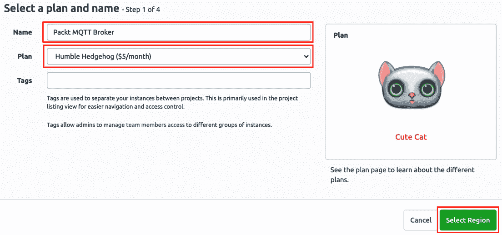

图 11.6 - 选择名称和付款计划

1.  选择一个区域和数据中心。

这个服务正在**AWS**上运行。所以，你可以选择数据中心所在的区域。你可以选择任何区域。在这里，我们使用**US-East-1**。

1.  做出选择后，点击**Review**按钮：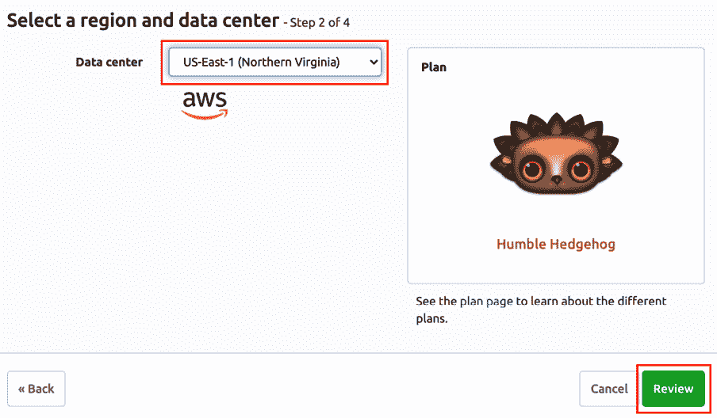

图 11.7 - 选择区域和数据中心

1.  接下来，完成 MQTT 代理实例的创建。

请检查付款计划、服务名称、服务提供商和数据中心区域。之后，点击**Create instance**按钮完成此实例的创建：

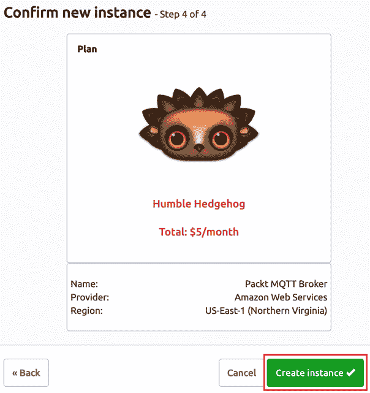

图 11.8 - 完成 MQTT 代理实例创建

# 在边缘设备上发布来自 Node-RED 的数据

在本节中，我们将配置我们的树莓派。首先，启动树莓派并打开 Node-RED 流编辑器。这个 Node-RED 流编辑器应该仍然有一个流来发送传感器数据，实现在*第十章*，*在树莓派上处理传感器数据*中。如果你已经删除了这个流，或者你还没有创建它，请参考*第十章*，*在树莓派上处理传感器数据*来重新执行它。双击组成流的**mqtt out**节点以打开设置窗口。我们上次使用了**Mosquitto**，但这次我们将连接到**CloudMQTT**。

执行以下步骤配置树莓派上的 Node-RED 连接到 CloudMQTT：

1.  访问你在*第十章*中创建的流程，*在树莓派上处理传感器数据*。

在本章中，我们只使用了一个带有**mqtt out**节点的流，因为这个场景只是为了向树莓派发送数据：

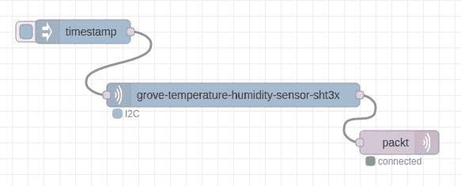

图 11.9 - 访问我们在上一章中创建的流程

1.  编辑`packt`

1.  `1`

1.  `true`

1.  单击**Edit**按钮（铅笔标记）右侧的**Server**以打开凭证属性：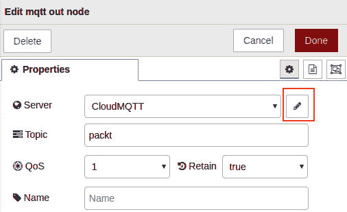

图 11.11 - 单击“编辑”按钮打开属性设置

1.  在服务器设置面板上，选择`driver.cloudmqtt.com`

1.  `18913`

**Connection**选项卡中的其他属性不应该被更改，必须保持它们的默认值。

你可以参考以下截图来设置**Connection**选项卡：

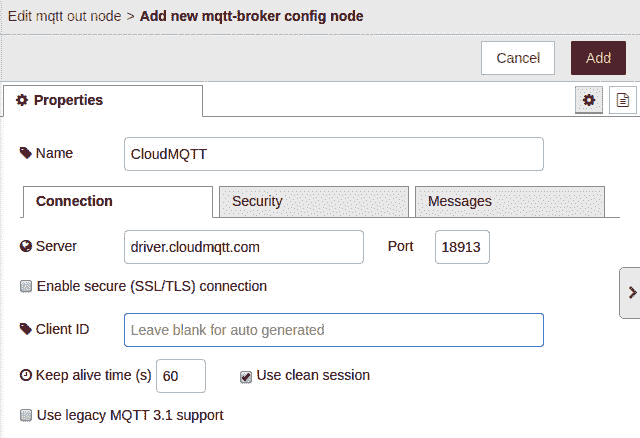

图 11.12 – MQTT 代理服务器设置

1.  接下来，选择**安全**选项卡来编辑配置以连接 MQTT 代理，并填写每个属性如下：

+   **用户名**：您从 CloudMQTT 获得的用户。

+   **密码**：您从 CloudMQTT 获得的密码。

您可以参考以下截图来设置**安全**选项卡：

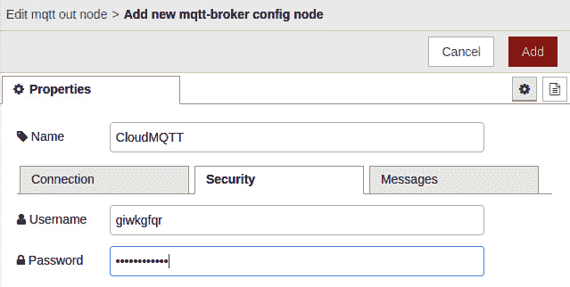

图 11.13 – MQTT 代理用户和密码设置

您可以在 CloudMQTT 管理菜单中检查这些属性。此菜单可以通过 CloudMQTT 仪表板的实例列表访问：[`customer.cloudmqtt.com/instance`](https://customer.cloudmqtt.com/instance)

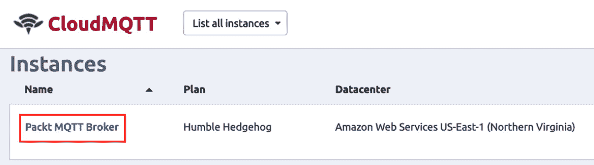

图 11.14 – CloudMQTT 实例列表

这完成了树莓派端的设置。接下来，让我们设置 Node-RED 流编辑器，以便可以在云端的 Node-RED 上获取（订阅）数据。

# 在云端 Node-RED 上订阅和可视化数据

在本节中，我们将看到如何使用 Node-RED 在云端可视化接收到的数据。这使用了我们在*第六章*中学到的仪表板节点之一，但这次，我们将选择 Gauge 的 UI，使其看起来更好一些。

这次使用的云端 Node-RED 运行在 IBM Cloud（PaaS）上，但是之前创建了 MQTT 代理服务的 CloudMQTT 是一种与 IBM Cloud 不同的云服务。

在本章中，我们将学习到 MQTT 代理存在的原因，以便可以从各个地方访问它，并且发布者（数据分发者）和订阅者（数据接收者）都可以在不知道它在哪里的情况下使用它。

## 在 IBM Cloud 上准备 Node-RED

现在，让我们通过以下步骤创建一个连接到 CloudMQTT 的 Node-RED 流。在这里，我们将在 IBM Cloud 上使用 Node-RED。请注意，这不是树莓派上的 Node-RED：

1.  打开 Node-RED 流编辑器，登录到您的 IBM Cloud，并从仪表板中调用您已经创建的 Node-RED 服务。

1.  要么点击**查看全部**，要么点击**Cloud Foundry 服务**在**资源摘要**仪表板上的瓷砖。点击任一选项都会带您到您在 IBM Cloud 上创建的资源列表：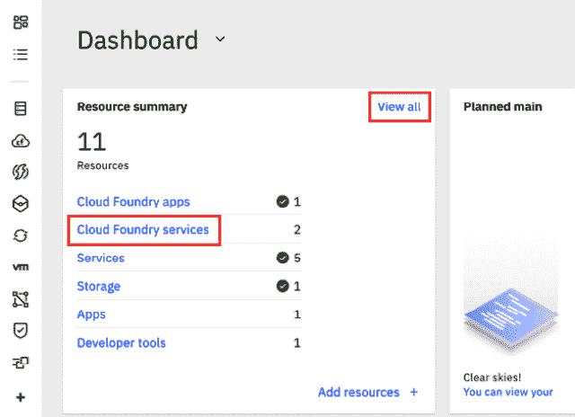

图 11.15 – 打开资源列表

如果您在 IBM Cloud 上尚未创建 Node-RED 服务，请参考*第六章*，*在云中实现 Node-RED*，在继续之前创建一个。

1.  在**资源列表**屏幕上显示的**Cloud Foundry 应用**下，点击您创建的 Node-RED 服务以打开 Node-RED 流编辑器：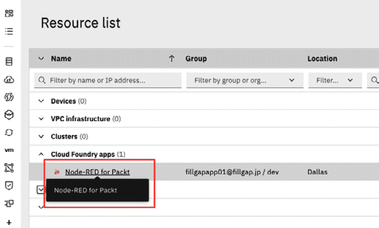

图 11.16 – 选择您创建的 Node-RED 服务

1.  然后，点击**访问应用 URL**来访问 Node-RED 流编辑器：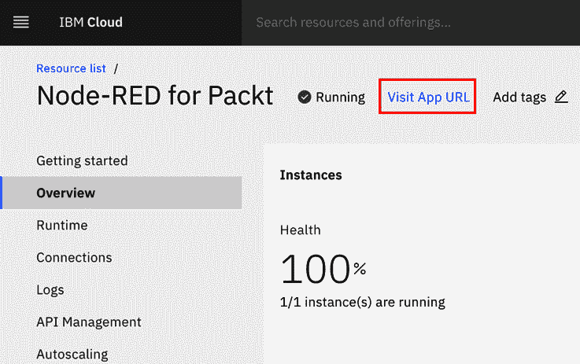

图 11.17 – 点击访问应用 URL

1.  当 Node-RED 流编辑器的顶部屏幕显示时，点击**转到您的 Node-RED 流编辑器**按钮来打开 Node-RED 流编辑器：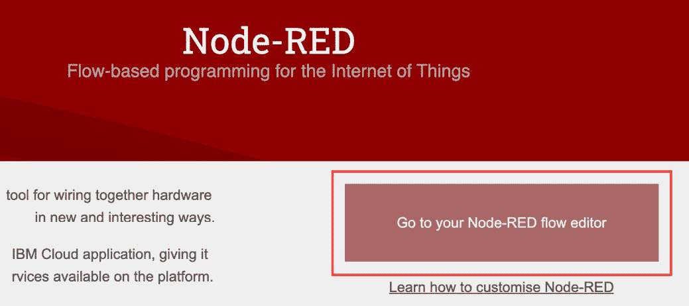

图 11.18 – 点击转到您的 Node-RED 流编辑器按钮

1.  创建一个流来可视化数据。

当您在 IBM Cloud 上访问您的 Node-RED 流编辑器时，请按以下步骤创建一个流。在每个**change**节点之后放置**mqtt in**节点，**json**节点，两个**change**节点和**gauge**节点。如果您想要获取此流的调试日志，请在任何节点之后添加**debug**节点。在本例中，在**mqtt in**节点和第一个**change**节点之后放置了两个**debug**节点。

您已经拥有**仪表板**节点，包括**仪表**节点。如果没有，请返回到*第六章*中的*为用例 2 制作流程-可视化数据*教程中，*在云中实现 Node-RED*，以获取**仪表板**节点：

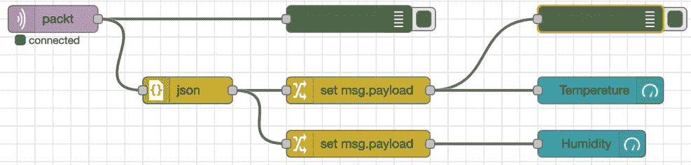

图 11.19 – 制作流程

1.  编辑`packt`

1.  `1`

1.  `auto-detect`（字符串或缓冲区）

1.  单击**右侧的编辑**按钮（铅笔图标）以打开凭据属性：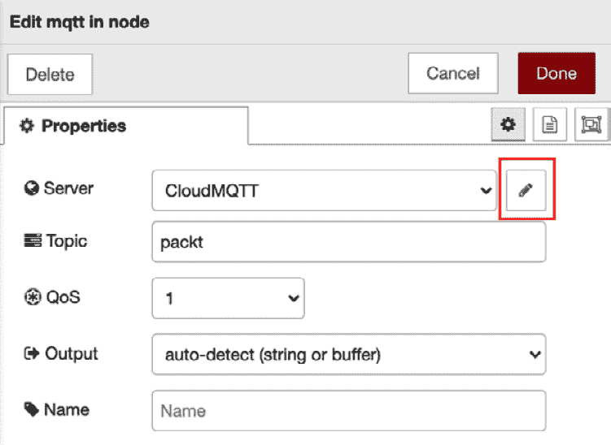

图 11.20 – 单击编辑按钮打开属性设置

1.  在服务器设置面板上，选择`driver.cloudmqtt.com`

1.  `18913`

**连接**选项卡的其他属性不应更改，必须保持其默认值。

您可以参考以下截图进行**连接**选项卡设置：

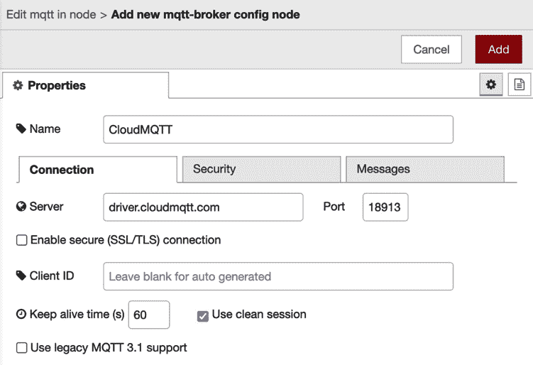

图 11.21 – MQTT 代理服务器设置

1.  接下来，选择**安全**选项卡以编辑连接 MQTT 服务器的配置，并使用以下值填写每个属性：

+   **用户名**：您从 CloudMQTT 获取的用户。

+   **密码**：您从 CloudMQTT 获取的密码。

您可以参考以下截图进行**安全**选项卡设置：

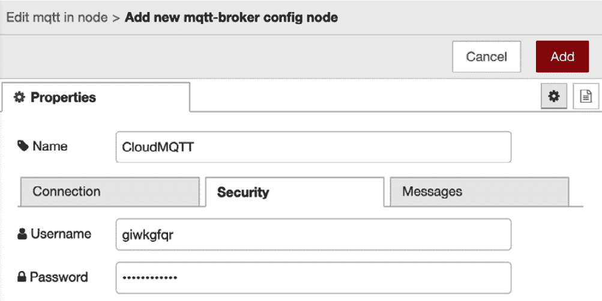

图 11.22 – MQTT 代理用户和密码设置

正如您可能已经注意到的那样，这些属性具有您在树莓派 Node-RED 上为**mqtt out**节点设置的相同值。如有必要，请参考 CloudMQTT 仪表板。

1.  现在，编辑 json 节点。双击**属性**中的`msg.payload`：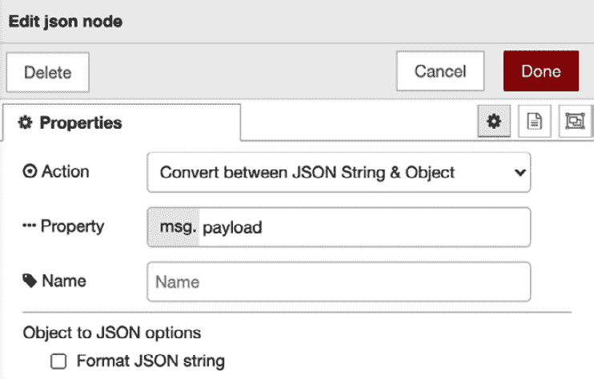

图 11.23 – 设置 json 节点属性

1.  编辑**规则**区域下**to**框中的`msg.payload.temperature`的设置。然后，单击**完成**按钮关闭设置窗口：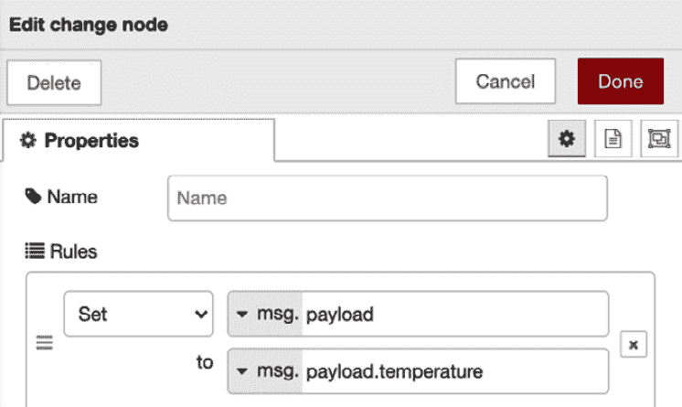

图 11.24 – 设置第一个更改节点的属性

1.  此外，在**规则**区域的**to**框中编辑第二个`msg.payload.humidity`的设置，然后单击**完成**按钮关闭设置窗口：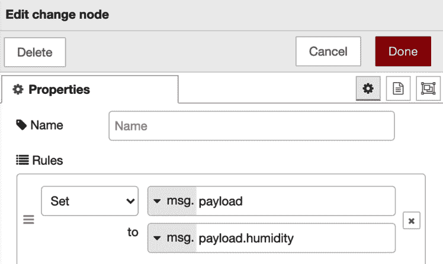

图 11.25 – 设置第二个更改节点的属性

1.  编辑第一个**仪表**节点的设置。双击第一个**仪表**节点以打开**设置**窗口，然后单击**右侧的编辑**按钮（铅笔图标）以打开属性：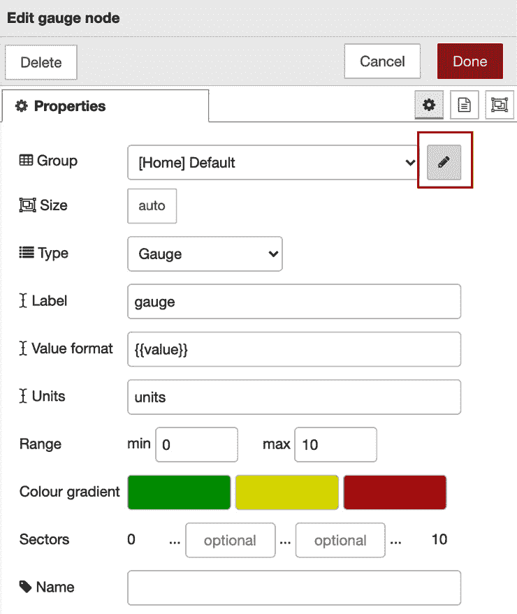

图 11.26 – 单击编辑按钮打开属性设置

1.  在仪表板的组设置面板中，使用以下值填写每个属性：

+   `树莓派传感器数据`

* 在此处提供任何名称都可以。此名称将显示在我们将创建的图表网页上。

其他属性不应更改，必须保持其默认值。您可以参考以下截图：

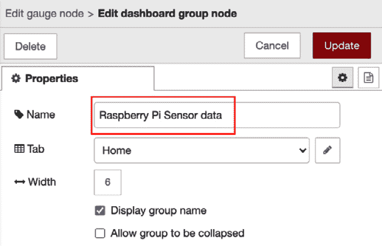

图 11.27 – 设置组名

1.  返回到`Temperature`的主面板

1.  `°C`（如果您希望使用华氏度，请使用°F）

1.  **范围**：-**15 ~ 50**（如果您希望使用华氏度，请相应调整范围）

其他属性不应更改其默认值。您可以参考以下截图进行设置：

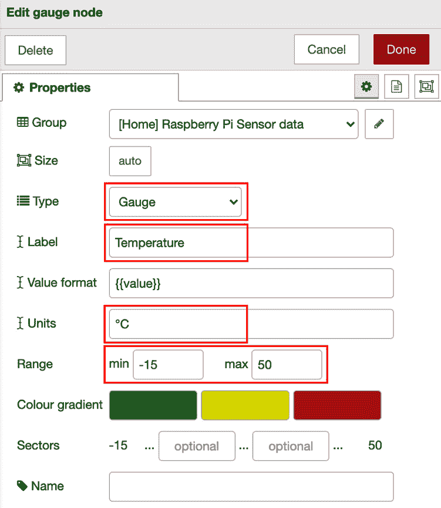

图 11.28 – 设置仪表节点属性

1.  编辑第二个`湿度`的设置

1.  `％`

1.  **范围**：**0 ~ 100**

其他属性不应更改其默认值。您可以参考以下屏幕截图进行设置：

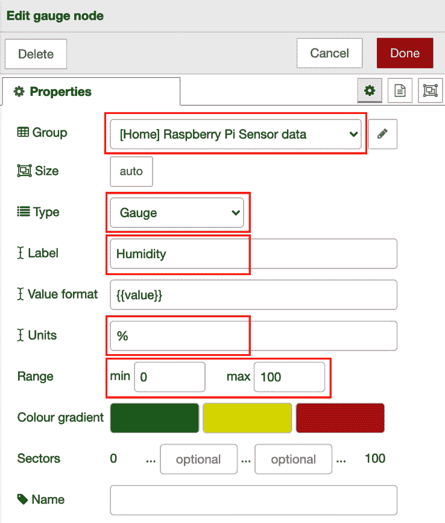

图 11.29 – 设置表盘节点属性

请确保在 Node-RED 上部署流程。

这完成了 IBM Cloud 上的 Node-RED 配置。这意味着此流程已经订阅（等待数据）使用主题`packt`进行 CloudMQTT 服务。接下来是发布和订阅数据的时间。

## 在 IBM Cloud 上可视化数据

在边缘设备端，即树莓派上，我们已准备好使用主题`packt`将传感器数据发布到 CloudMQTT。在云端，流程已经使用`packt`主题进行 CloudMQTT 服务。

对于树莓派，执行以下步骤发布您的数据：

1.  从您的树莓派发布数据。

访问您的树莓派上的 Node-RED 流程编辑器。单击**注入**节点的按钮以运行此流程以发布槽温度和湿度传感器数据：

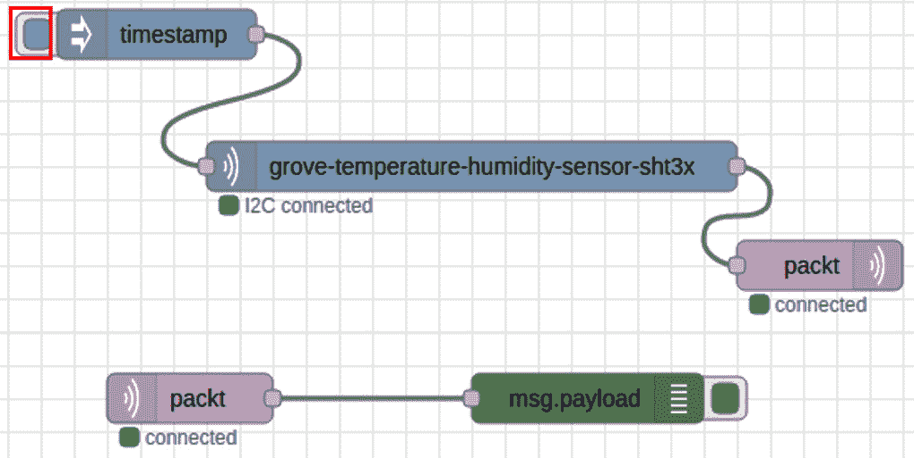

图 11.30 – 运行发布数据的流程

1.  检查 IBM Cloud 上数据的接收情况。

您将能够通过 CloudMQTT 接收（订阅）数据。您可以在 IBM Cloud 上的 Node-RED 流程编辑器的**调试**选项卡上检查：

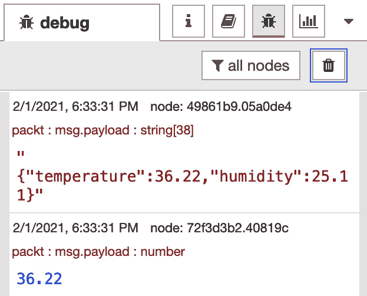

图 11.31 – 检查数据的订阅情况

1.  通过 IBM Cloud 上的 Node-RED 流程编辑器的**图表**选项卡打开图表网页，然后单击**打开**按钮（对角箭头图标）打开它：

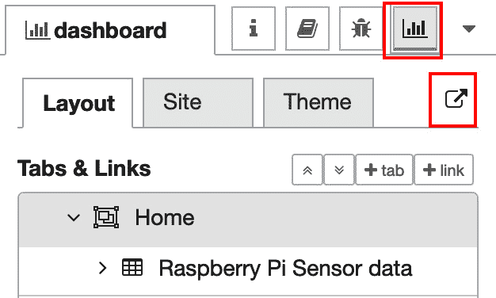

图 11.32 – 打开图表网页

您将看到显示数据的网页表盘图表：

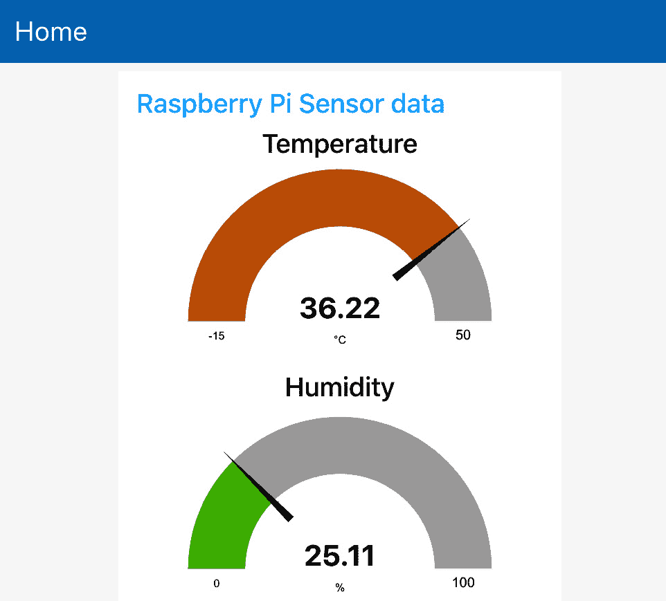

图 11.33 – 显示图表网页

恭喜！现在您知道如何观察从树莓派发送到服务器的数据并将其可视化为图表。

如果您希望在 Node-RED 上进行流程配置文件以使此流程生效，您可以在这里获取：[`github.com/PacktPublishing/-Practical-Node-RED-Programming/blob/master/Chapter11/getting-sensordata-with-iotplatform.json`](https://github.com/PacktPublishing/-Practical-Node-RED-Programming/blob/master/Chapter11/getting-sensordata-with-iotplatform.json)。

# 总结

在本章中，我们体验了如何接收从边缘设备发送的传感器数据并在服务器端进行可视化。

在本章中，我们在 IBM Cloud 上使用了 CloudMQTT 和 Node-RED。Node-RED 可以在任何云平台和本地运行，并且您可以尝试在任何环境中制作这种应用。因此，记住这种模式对于您未来在其他云 IoT 平台上的开发肯定会有用。

在下一章中，我们将介绍如何使用 Node-RED 制作一个聊天机器人应用的实际场景。这将为您介绍 Node-RED 的新用法。
