# 第十二章：使用 Slack 和 IBM Watson 开发聊天机器人应用程序

在这一章中，我们将使用 Node-RED 创建一个聊天机器人应用程序。对于聊天机器人应用程序的用户界面，我们将使用 Slack，并且我们将使用 IBM Watson AI 来进行技能。完成本章的教程后，您将学会如何将 Node-RED 与外部 API 结合起来创建一个应用程序。这将帮助您在未来使用 Node-RED 创建可扩展的 Web 应用程序。

让我们从以下主题开始：

+   创建 Slack 工作区

+   创建 Watson 助手 API

+   从 Node-RED 启用与 Slack 的连接

+   构建聊天机器人应用程序

在本章结束时，您将掌握如何使用 Node-RED 制作 Slack 聊天机器人应用程序。

# 技术要求

要在本章中取得进展，您将需要以下内容：

+   IBM Cloud 账户：[`cloud.ibm.com/`](https://cloud.ibm.com/)。

+   本章使用的代码可以在[`github.com/PacktPublishing/-Practical-Node-RED-Programming`](https://github.com/PacktPublishing/-Practical-Node-RED-Programming)的`Chapter12`文件夹中找到。

# 创建 Slack 工作区

这个实践教程使用**Slack**作为您的聊天机器人应用程序的用户界面。Node-RED 负责控制聊天机器人应用程序背后的消息交换。

这个聊天机器人应用程序的整体视图如下：

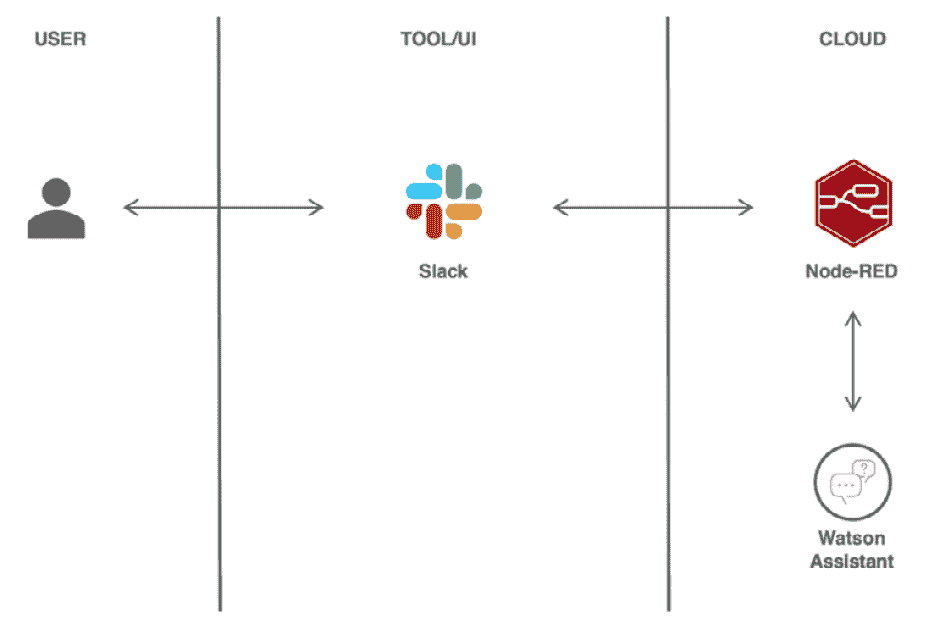

图 12.1 – 应用程序概述

首先，使用以下步骤为此应用程序创建一个 Slack 工作区。如果您已经有一个 Slack 工作区，可以使用现有的工作区。在这种情况下，跳过以下步骤，并在您的工作区中创建一个名为`learning-node-red`的频道：

1.  访问[`slack.com/create`](https://slack.com/create)，输入您的电子邮件地址，然后点击**下一步**按钮：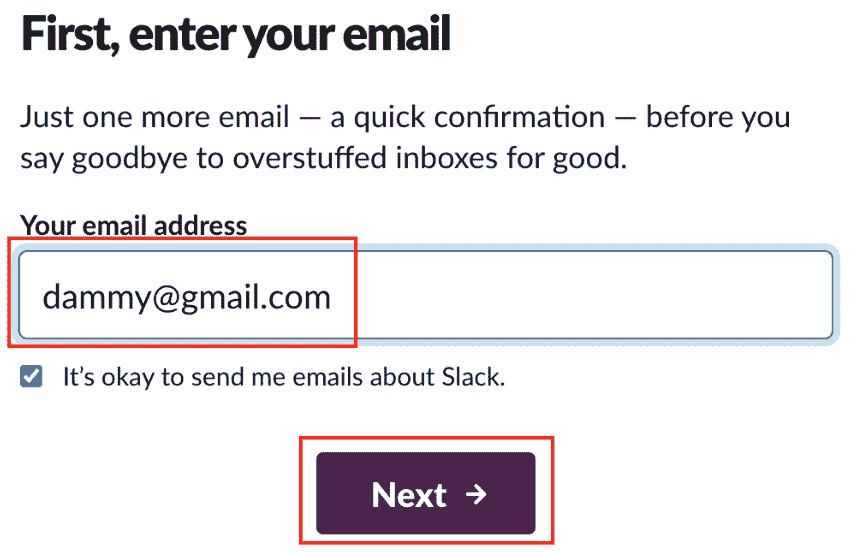

图 12.2 – 输入您的电子邮件地址

1.  从 Slack 收到的电子邮件中检查六位数验证码：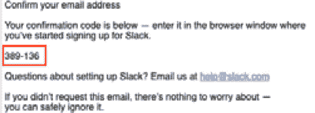

图 12.3 – 检查六位数验证码

1.  在您点击**下一步**并输入您的电子邮件地址后显示的窗口中输入验证码。输入验证码后，您将被自动重定向到下一个窗口：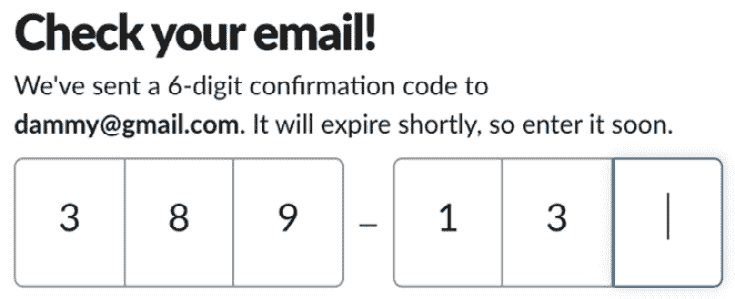

图 12.4 – 输入验证码

1.  给您的工作区取一个名字，然后点击**下一步**按钮：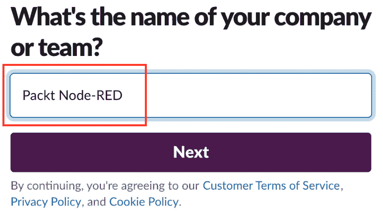

图 12.5 – 给您的工作区取一个名字

1.  在您的工作区中创建一个频道。您可以使用`Learning Node-RED`：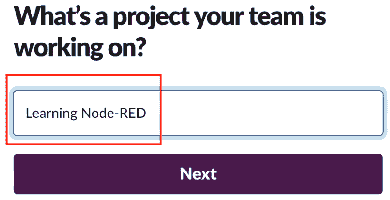

图 12.6 – 您的工作区名字

1.  点击**暂时跳过**而不添加队友：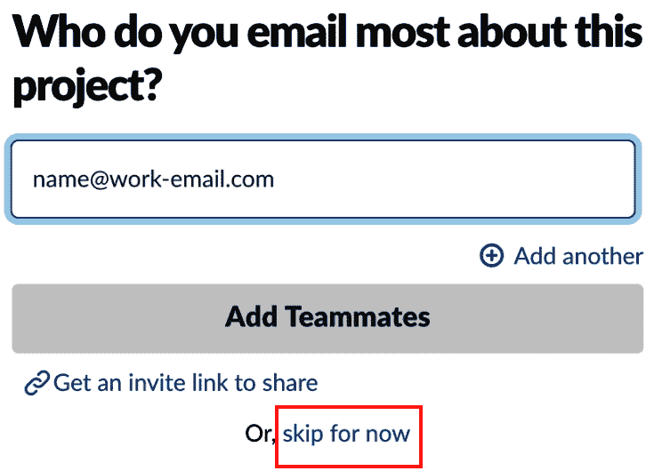

图 12.7 – 本教程不需要队友

1.  点击**在 Slack 中查看您的频道**打开您创建的工作区：

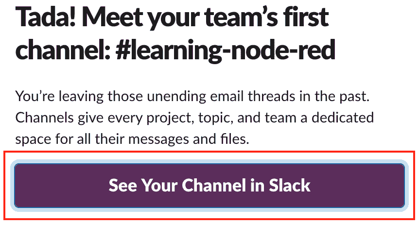

图 12.8 – 在 Slack 中查看您的频道

您已为本教程创建了工作区：

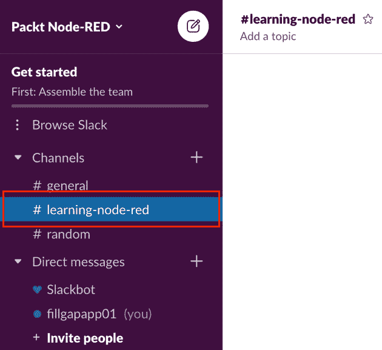

图 12.9 – 您已创建了工作区

重要提示

聊天机器人所在的频道最好是只有您参与的频道，除非有公共目的。这是因为聊天机器人的活动可能会对不喜欢（或对聊天机器人不感兴趣的）参与者造成干扰。

此时，您已经准备好在 Slack 中运行您的聊天机器人的工作区和频道。接下来，我们将创建一个将成为聊天机器人引擎的机制。

# 创建 Watson 助手 API

这个实践教程使用 IBM 的**Watson 助手 API**作为聊天机器人的引擎。Watson 助手可以使用自然语言分析来解释自然对话的意图和目的，并返回适当的答案。

有关 Watson 助手的详细信息，请访问以下网址：[`www.ibm.com/cloud/watson-assistant-2/`](https://www.ibm.com/cloud/watson-assistant-2/)。

要使用 Watson 助手 API，您需要在 IBM Cloud 上创建 Watson 助手 API 的实例。按照以下步骤创建它：

1.  登录到 IBM Cloud 仪表板，并在**目录**中搜索`助手`。单击搜索结果中的**助手**图块：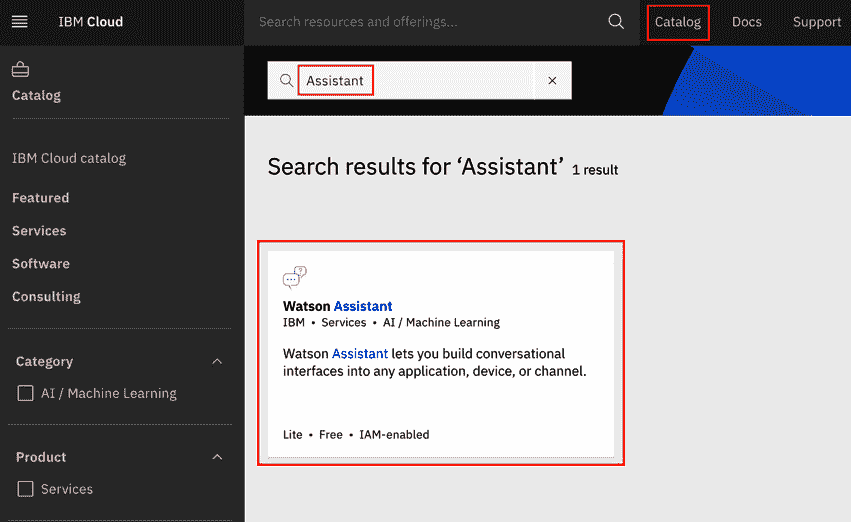

图 12.10 – 搜索 Watson 助手

1.  创建 Watson 助手 API 服务。为 Watson 助手服务数据中心选择一个**区域**。达拉斯很稳定，所以我们选择了**达拉斯**。

1.  选择**Lite**作为定价计划。其他项目，如服务名称和资源组，可以保留其默认值。

1.  单击**创建**按钮：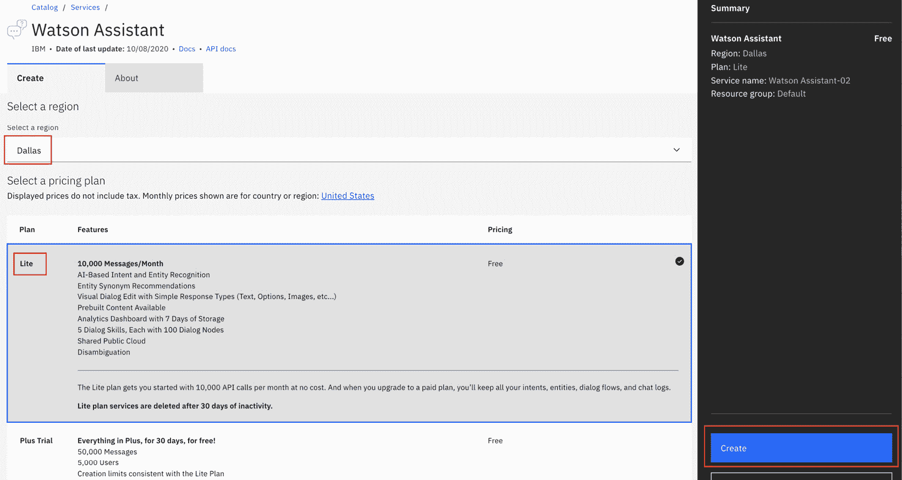

图 12.11 – 创建 Watson 助手服务

1.  启动 Watson 助手工具。单击**启动 Watson 助手**按钮打开 Watson 助手控制台：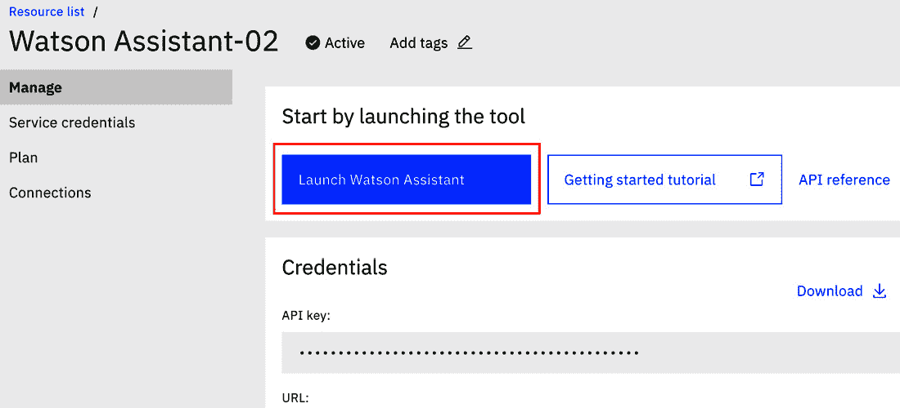

图 12.12 – 启动 Watson 助手控制台

1.  在您的**Watson 助手**服务中创建一个**技能**。

当您第一次打开 Watson 助手控制台时，您将自动转到**我的第一个技能**屏幕。

通常，您会在这里创建一个 Watson 助手技能，但是这个实践教程将专注于 Node-RED 而不是如何使用 Watson 助手。因此，通过导入预先准备的定义文件在 Watson 助手中创建一个技能。

如果您想创建自己的技能，那很好。在这种情况下，官方的 Watson 助手文档会帮助您：[`cloud.ibm.com/apidocs/assistant/assistant-v2`](https://cloud.ibm.com/apidocs/assistant/assistant-v2)。

1.  点击`告诉我一个笑话`。

1.  为此框架创建一个助手，将助手的名称设置为`Respond Joke Phrase`，然后单击**创建助手**按钮：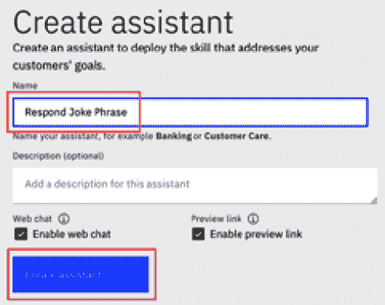

图 12.14 – 创建助手

1.  导入**对话**。创建助手后，将显示所创建助手的设置屏幕。在该设置屏幕上的**对话**区域中，单击**添加对话技能**按钮：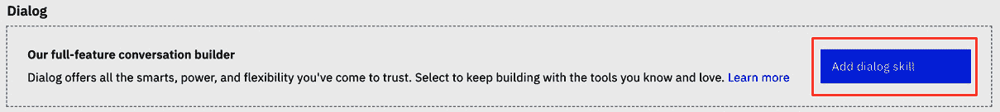

图 12.15 – 添加对话技能

1.  选择**导入技能**选项卡，并选择要导入的技能的 JSON 文件。在[`github.com/PacktPublishing/-Practical-Node-RED-Programming/blob/master/Chapter12/skill-Respond-Joke-Phrase.json`](https://github.com/PacktPublishing/-Practical-Node-RED-Programming/blob/master/Chapter12/skill-Respond-Joke-Phrase.json)下载此 JSON 文件。

1.  选择 JSON 文件后，单击**导入**按钮：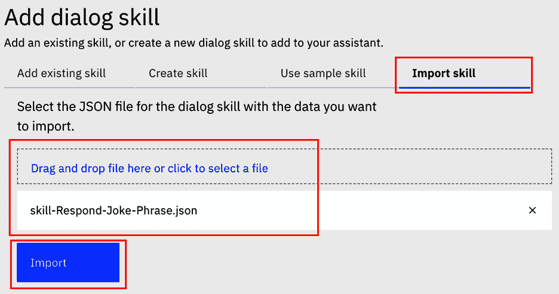

图 12.16 – 导入对话技能文件

您将在**对话**区域看到**Respond Joke Phrase**：

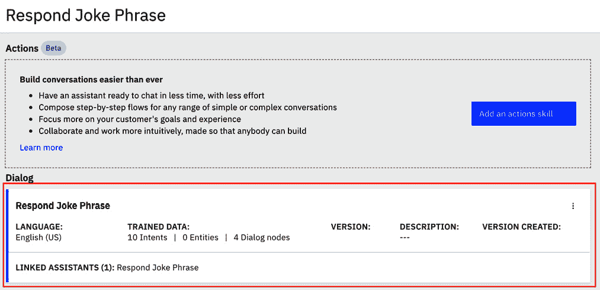

图 12.17 – 导入对话技能

1.  技能导入完成。您可以返回简单的问候和笑话短语，因此尝试使用 Watson 助手控制台中提供的**试一试**功能进行对话：

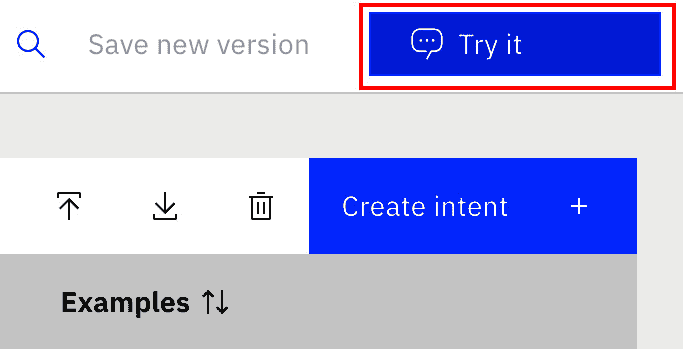

图 12.18 – 试一试

单击**试一试**按钮时，将打开聊天窗口。在聊天窗口中尝试输入以下对话：

`"你好`*"; "*`嗨";` `"告诉` `我` `笑话";` `"你` `知道` `笑话吗?"`*; 等等…

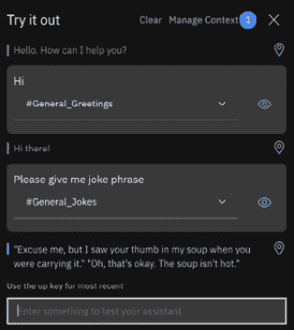

图 12.19 – 测试对话

如果您得不到一个好的答案，请尝试另一个短语。Watson 自然语言理解将在 Watson 助手的**试一试**窗口中说的对话分成意图或实体的类。如果对话没有分成所需的类，您可以在**试一试**窗口中训练助手 API。

现在您已经使用 Watson Assistant 创建了自动回答对话，还有一件事要做，那就是确认技能 ID。这是您以后需要从 Node-RED 操作 Watson Assistant 作为 API 所需的 ID。

通过以下步骤从**技能**屏幕检查技能 ID：

1.  在您创建的**技能**瓦片的右上角的**技能**菜单下点击**查看 API 详细信息**：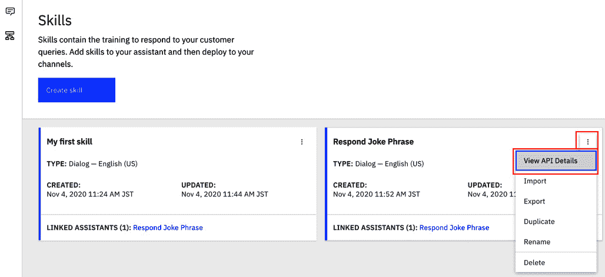

图 12.20 - 访问查看 API 详细信息菜单

1.  记下显示的**技能 ID**：

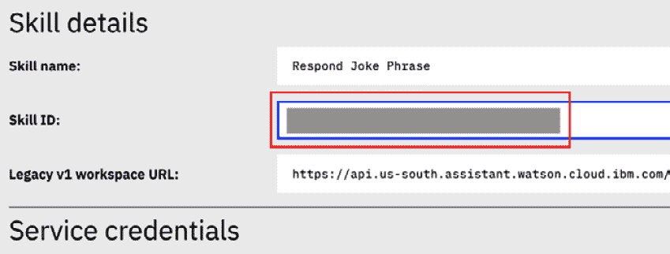

图 12.21 - 检查并记录技能 ID

我们现在已经创建了一个自动回复聊天的聊天机器人服务。接下来，让我们将其与 Slack 用户界面集成。

# 启用从 Node-RED 到 Slack 的连接

接下来，让我们继续在您的 Node-RED 环境中准备一个 Slack 节点。启动在 IBM Cloud 上创建的 Node-RED 流程编辑器。

在这一步中，您要做的是在您的 Node-RED 环境中安装一个连接到 Slack 的节点。这种方法很简单。您所要做的就是在**管理调色板**窗口中找到并安装节点，这在其他章节中已经做过多次。

按照以下步骤继续：

重要提示

我相信您在 IBM Cloud 上的 Node-RED 流程编辑器已经作为服务（作为 Node.js 应用程序）创建好了，但如果您还没有这样做，请参考*第六章**，在云中实现 Node-RED*，在继续本章之前在 IBM Cloud 上创建一个 Node-RED 服务。

1.  您需要安装**node-red-contrib-slack**节点才能从 Node-RED 中使用 Slack，因此点击**管理调色板**：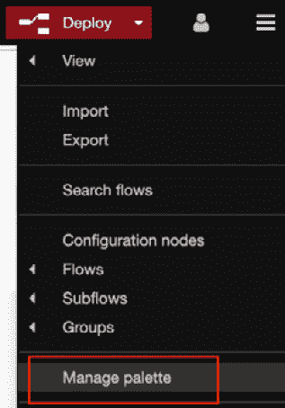

图 12.22 - 打开管理调色板窗口

1.  搜索`node-red-contrib-slack`节点并点击**安装**按钮：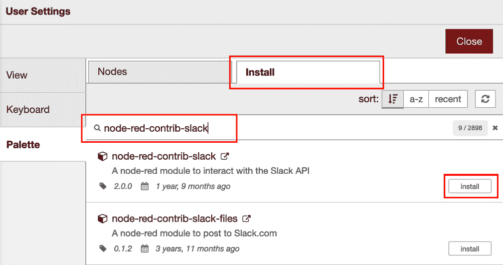

图 12.23 - 安装 node-red-contrib-slack 节点

1.  您将在调色板上看到属于**node-red-contrib-slack**的四个节点。您必须为构建此示例应用程序准备 Slack 节点：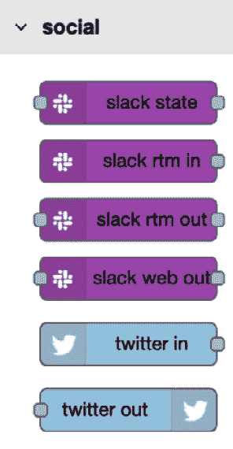

图 12.24 - Slack 节点将出现在您的调色板上

1.  通过在 Slack 应用程序（桌面或 Web）上通过**设置和管理** | **管理应用**访问**Slack App 目录**，在您的 Slack 工作区中创建一个机器人：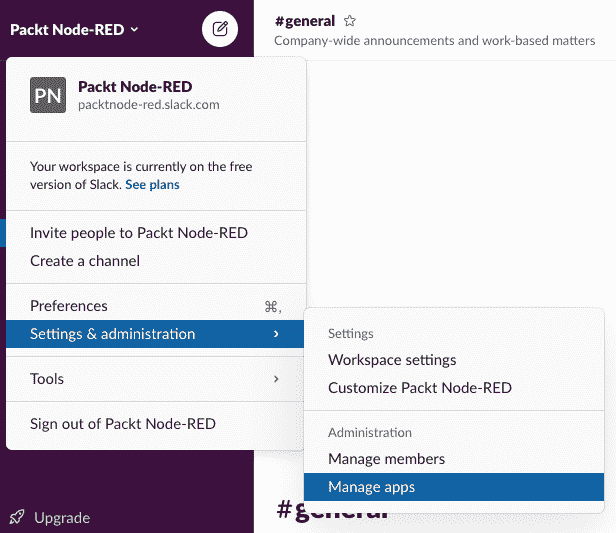

图 12.25 - 选择管理应用

1.  移动到 Slack App 目录网站后，点击`https://<your workspace>.slack.com/apps`。

以下 URL 仅供参考：[`packtnode-red.slack.com/apps`](https://packtnode-red.slack.com/apps)。

此 URL 根据 Slack 上每个工作区的名称自动生成。

1.  点击**获取基本应用程序**按钮，转到应用程序搜索窗口：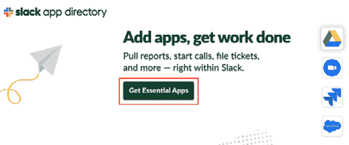

图 12.27 - 点击获取基本应用程序按钮

1.  搜索单词`bots`并点击结果中的**Bots**：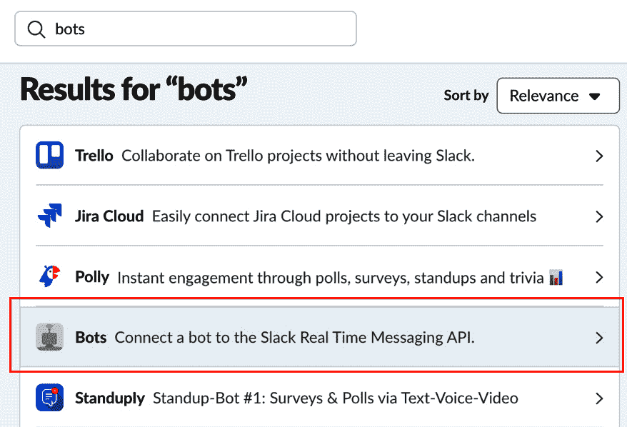

图 12.28 - 搜索 Bots 并选择它

1.  在**Bots**应用程序屏幕上点击**添加到 Slack**按钮：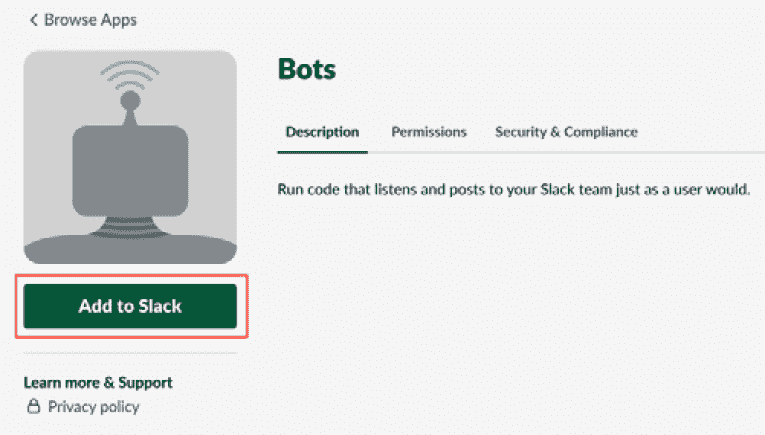

图 12.29 - 将 Bots 应用添加到您的工作区

1.  设置`packt-bot`。

1.  点击**添加机器人集成**按钮：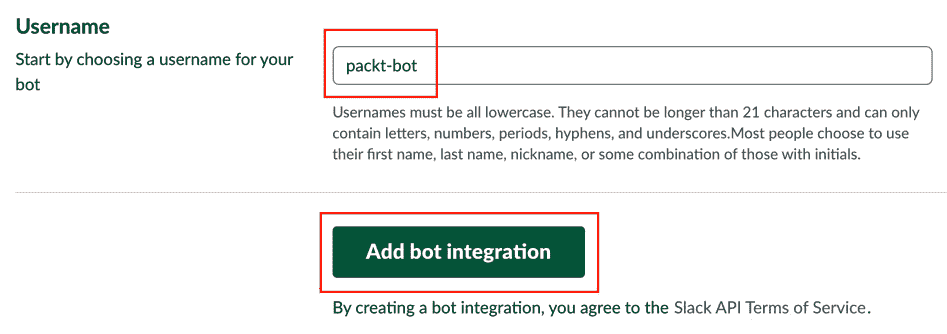

图 12.30 – 设置您的机器人名称

1.  在下一个屏幕上，将生成并显示用于使用机器人的 API 令牌。记下这个令牌，以免忘记。创建 Node-RED 流程时会使用这个 API 令牌：

重要提示

在与应用程序共享机器人用户令牌时要小心。不要在公共代码存储库中发布机器人用户令牌。这是因为任何人都可以使用这个 API 令牌访问机器人。

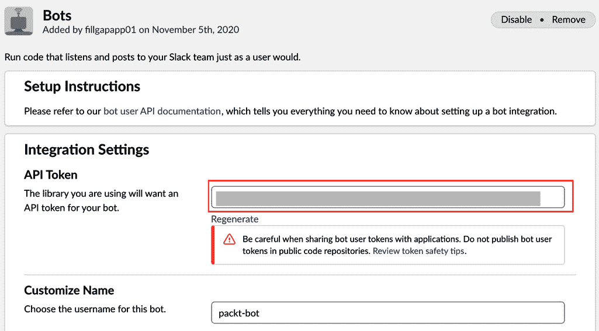

图 12.31 – 确认您的 API 令牌

1.  点击**保存集成**按钮完成 Bot 应用程序的集成：

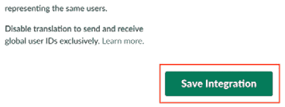

图 12.32 – Bot 应用程序集成完成

现在您已经准备好了。让我们继续进行流程创建过程。

# 构建一个聊天机器人应用程序

到目前为止，您已经在 Watson 助手中创建了一个聊天机器人引擎，创建了一个 Slack 工作区，并集成了 Bot 应用程序，您可以在该 Slack 工作区中使用。

在这里，我们将把这些服务与 Node-RED 结合起来，并创建一个机制，使得在 Slack 工作区中说话时，机器人会在 Node-RED 中回答。

按照以下步骤创建一个流程：

1.  将 Watson 助手连接到 Node-RED。通过 IBM Cloud 上的**资源列表**访问您的 Node-RED 服务仪表板。选择**连接**选项卡，然后点击**创建连接**按钮：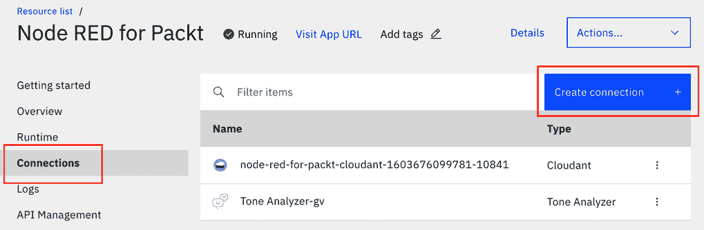

图 12.33 – 在 Node-RED 上创建新连接

1.  选择您创建的 Watson 助手服务，然后点击**下一步**按钮：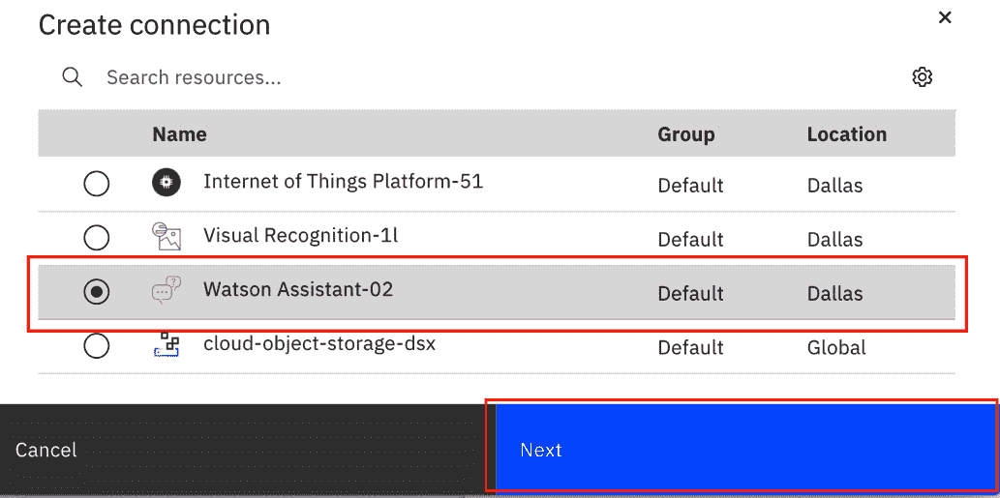

图 12.34 – 在 Node-RED 上创建新连接

1.  点击**连接**按钮，使用默认选项完成连接设置。执行此操作将重新启动 Node-RED 应用程序，这将需要几分钟来完成：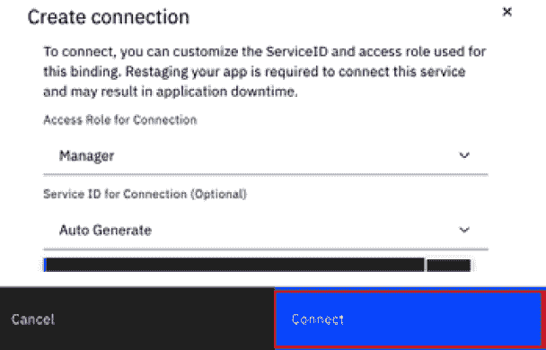

图 12.35 – 完成在 Node-RED 上创建新连接

1.  创建处理 Slack 上对话的流程。

您已经有了 Slack 节点和 Watson 节点，可以在这个实践教程中使用。

1.  放置一个**slack-rtm-in**节点，两个**function**节点，一个**assistant**节点，**slack-rtm-out**和一个**debug**节点。放置它们后，按照以下图示将它们依次连接起来：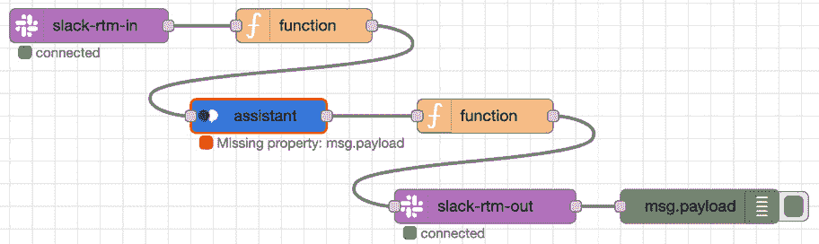

图 12.36 – 放置节点并连接它们

1.  为每个节点设置参数。

按照以下步骤设置每个节点的参数。对于需要编码的节点，请按照以下方式进行编码：

+   **slack-rtm-in**节点：

a) 点击编辑按钮（铅笔图标）打开**属性**面板：

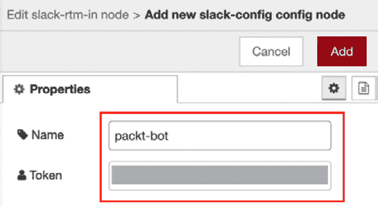

图 12.37 – 打开属性面板

b) 输入`packt-bot`：


图 12.38 – 设置连接 Slack 应用程序的配置属性

当您返回到此节点的主面板时，您会看到**Slack 客户端**属性中的配置已经设置。

c) 点击**完成**按钮关闭此设置：

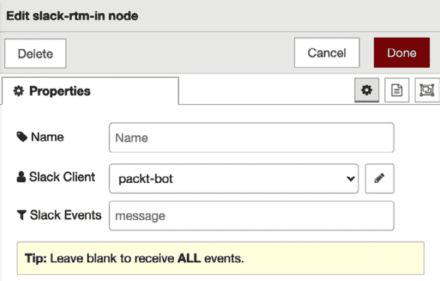

图 12.39 – 完成设置 slack-rtm-in 节点的属性

+   **function**节点（第一个）：

a) 在第一个**function**节点中，输入以下内容：

```js
global.set("channel",msg.payload.channel);
msg.topic = "message";
msg.payload = msg.payload.text;
return msg
```

您也可以参考以下图示：

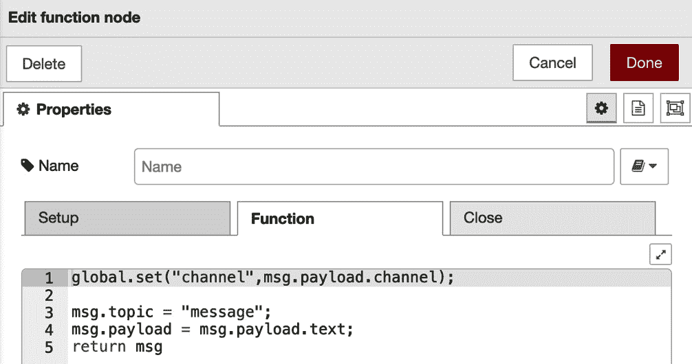

图 12.40 – 第一个 function 节点编码

在这个 function 节点中，从 Slack 发送的消息被从 Slack 发送的 JSON 数据中取出，并再次放入`msg.payload`中。

另一个重要的过程是将从 Slack 发送的频道信息存储在 Node-RED 的全局变量中。这里存储的频道信息将在稍后向 Slack 发送响应消息时使用。

+   **助手**节点：

在上一步中，您将 Watson 助手连接到了 Node-RED。这意味着您可以从 Node-RED 调用助手 API，而无需使用 API 密钥或密码。

当我双击**助手**节点以打开设置面板时，我没有看到任何属性，比如 API 密钥。如果您在设置面板中看到它们，这意味着 Watson 助手和 Node-RED 连接过程失败了。在这种情况下，请重新执行连接过程。

这里只有一个属性需要设置。在**assistant**节点的设置面板中，将您之前写下的 Watson 助手技能 ID 设置为**工作区 ID**属性：

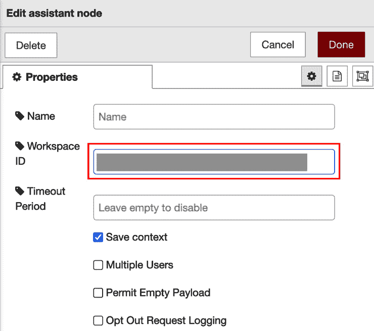

图 12.41 - 将技能 ID 设置为工作区 ID

这完成了**助手**节点的设置。保存您的设置并关闭设置面板。

+   **功能**节点（第二个节点）：

在第一个**功能**节点中，输入以下代码：

```js
var g_channel=global.get("channel");
msg.topic = "message";
msg.payload = {
    channel: g_channel,
    text: msg.payload.output.text[0]
}
return msg
```

您还可以参考以下图：

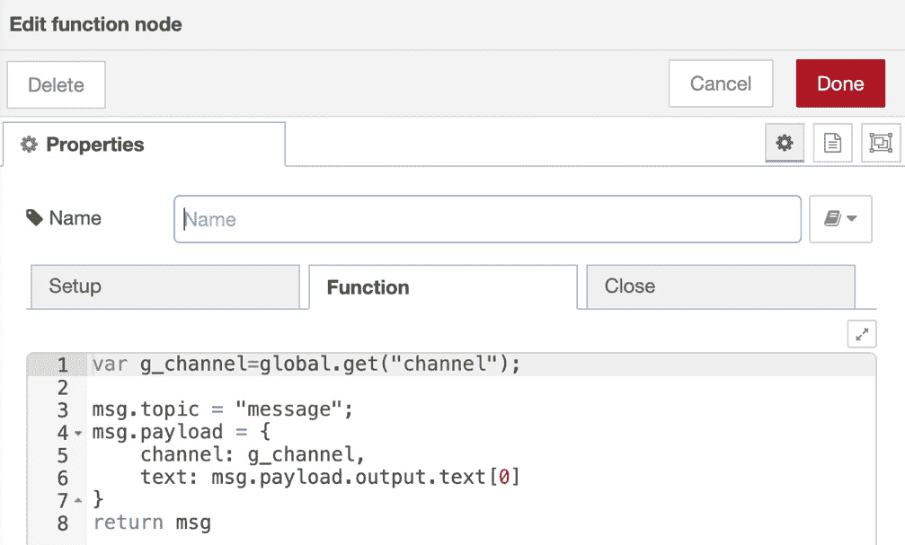

图 12.42 - 第二个功能节点编码

第二个功能节点将 Watson 助手返回的自动回复消息存储在`msg.payload.text`中，并获取保存在第一个功能节点中的 Slack 频道信息，并将其存储在`msg.payload.channel`中。

+   您创建的`packt-bot`已经放置在此节点属性中。如果尚未设置，请从下拉列表中手动选择。单击**完成**后，设置将完成：

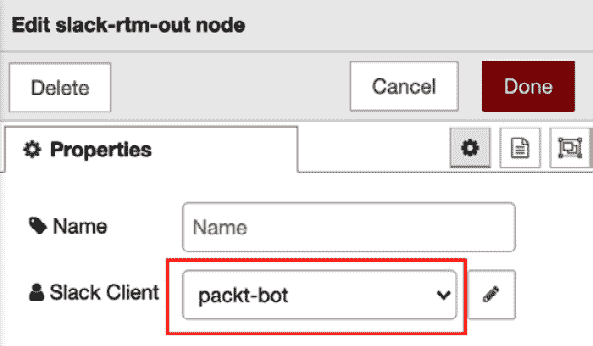

图 12.43 - 检查 slack-rtm-out 节点的属性设置

+   **调试**节点：

这里的调试节点只是简单地输出日志。不需要设置。

1.  在 Slack 上检查机器人应用。

使用 Slack 创建了一个自动回答聊天机器人。让我们尝试对话。

1.  在您的 Slack 工作区创建的频道上，添加您集成的机器人应用程序，并单击频道上的**添加应用**链接：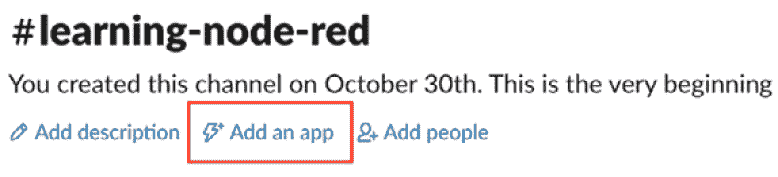

图 12.44 - 单击添加应用链接

1.  单击**添加**按钮将机器人应用添加到您的频道中：

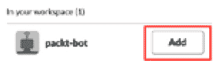

图 12.45 - 添加您创建的机器人应用

现在，让我们真正进行一次对话。在您添加了这个机器人应用的频道上提及并与您的机器人（例如`packt-bot`）交谈。由于我们这次学习的唯一对话是问候和听笑话，我们将从 Slack 发送一条看起来与这两者之一相关的消息。

首先，让我们打个招呼。您将看到一种问候的回应：

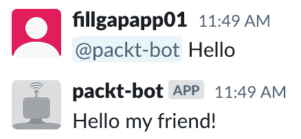

图 12.46 - 与聊天机器人交换问候

然后发送一条消息，比如`请` `告诉` `我` `一个` `笑话`。它会随机回复一个机器人选定的笑话：

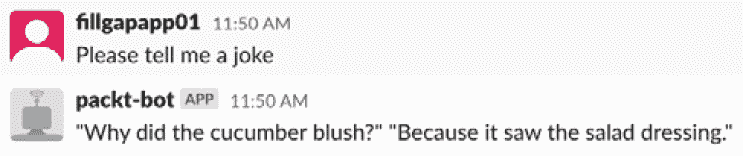

图 12.47 - 机器人回答一些笑话

干得好！您终于用 Node-RED 创建了聊天机器人应用。

如果您希望在 Node-RED 环境中创建此流程的流程配置文件，可以在此处获取：[`github.com/PacktPublishing/-Practical-Node-RED-Programming/blob/master/Chapter12/slack-watson-chatbot-flows.json`](https://github.com/PacktPublishing/-Practical-Node-RED-Programming/blob/master/Chapter12/slack-watson-chatbot-flows.json)。

# 总结

在本章中，我们体验了如何使用 Slack、Watson 和 Node-RED 制作聊天机器人应用程序。这次，我们使用 Slack 作为聊天平台，但您可以使用任何具有 API 的聊天平台，例如 LINE、Microsoft Teams 等，而不是 Slack。

本章对于创建任何非物联网应用程序也非常有帮助。Node-RED 可以通过与任何 Web API 链接来开发各种应用程序。

在下一章中，让我们开发自己的节点。当然，它可以在任何环境中使用。使用 Node-RED 开发自己的节点意味着开发一个无法通过现有节点完成的新节点。这无疑是 Node-RED 高级用户的第一步。
