# 第十三章：在 Node-RED 库中创建和发布自己的节点

到目前为止，我们已经学习了如何使用准备好的节点在 Node-RED 中进行操作。在本章中，您将学习如何创建自己的节点并将其发布到库中。完成本章的教程后，您将能够发布自己的节点供全球各地的开发人员使用。

让我们从以下主题开始：

+   创建您自己的节点

+   在本地环境中测试您自己的节点

+   将您自己的节点发布为 Node-RED 库中的模块

在本章结束时，您将掌握如何创建自己的节点。

# 技术要求

要在本章中继续进行，您将需要以下内容：

+   GitHub 帐户：[`github.com/`](https://github.com/)。

+   npm 帐户：[`www.npmjs.com/`](https://www.npmjs.com/)。

+   Node-RED（在本地环境中独立运行）。

+   IBM Cloud 帐户。

+   本章中使用的代码可以在[`github.com/PacktPublishing/-Practical-Node-RED-Programming`](https://github.com/PacktPublishing/-Practical-Node-RED-Programming)的`Chapter13`文件夹中找到。

+   本教程的步骤基本上在 Mac 上进行处理。如果您使用 Windows PC，请用您的环境替换命令和文件路径。

# 创建您自己的节点

在开发节点之前，有一些事情您需要首先了解。为节点开发设置了以下策略。让我们遵循这些策略并开发一个节点。

在创建新节点时，您需要遵循一些一般规则。它们遵循核心节点采用的方法，并提供一致的用户体验。

您可以在官方 Node-RED 网站上查看创建节点的规则：[`nodered.org/docs/creating-nodes/`](https://nodered.org/docs/creating-nodes/)。

## 节点程序开发

Node-RED 节点由两个文件组成：定义处理的 JavaScript 文件和提供 UI（例如设置屏幕）的 HTML 文件。在 JavaScript 文件中，您创建的节点的处理由一个函数来定义。该函数接收一个包含特定于节点的属性的对象。HTML 文件描述了 Node-RED 流编辑器显示的属性设置屏幕。在此 HTML 文件中显示的属性设置屏幕上输入的设置值从 JavaScript 文件中调用并进行处理。

在这里，我们将创建一个 GitHub 存储库，但如果您只想创建一个节点，则不需要 GitHub 存储库。在本章中，我们将使用 GitHub 存储库将创建的节点发布到库中，因此我希望您在步骤开始时创建存储库。

请按照以下步骤创建 GitHub 存储库：

1.  转到[`github.com/`](https://github.com/)并使用您的 GitHub 帐户登录。

1.  选择`node-red-contrib-<表示一组节点的名称>`，因此相应地指定 GitHub 存储库名称。在本例中，它是`node-red-contrib-taiponrock`。

1.  在指定存储库名称后，将存储库公开范围设置为**公共**，检查 README 文件，并指定许可证。在本例中，它是使用**Apache License 2.0**创建的。

1.  设置完所有内容后，点击**创建存储库**按钮创建存储库：

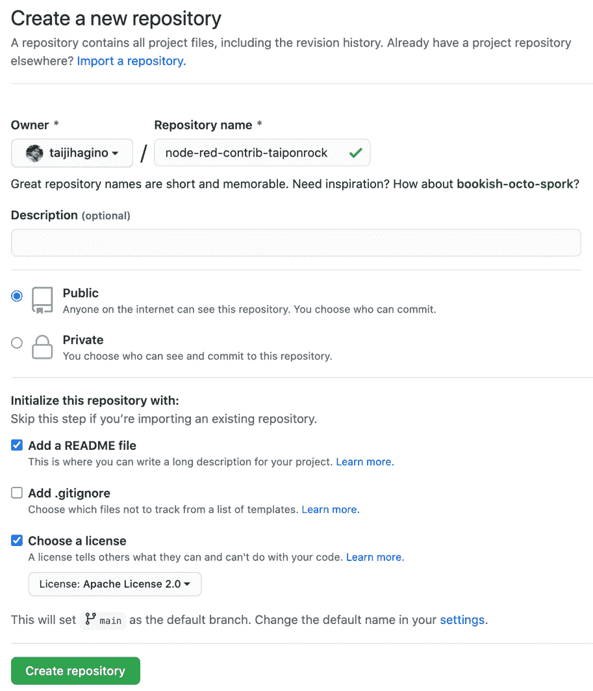

图 13.2 – 存储库创建为公共项目

您现在已经创建了 GitHub 存储库。

现在让我们按照以下步骤将我们刚刚创建的存储库克隆到我们的本地开发环境：

1.  将存储库 URL 复制到剪贴板。点击绿色的**Code**下拉菜单，然后点击**clipboard**按钮复制 URL：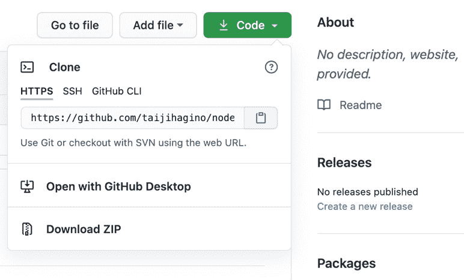

图 13.3 – 复制克隆此存储库的 URL

从命令行界面（如终端）本地克隆（git clone）存储库，其中**Bash**可以运行。

1.  转到要克隆（复制）存储库的工作目录。在这里，我在`user`目录下创建了一个工作目录并切换到它：

```js
$ mkdir work
$ cd work
```

1.  使用之前创建的存储库的 URL 执行`git clone`命令：

```js
$ git clone https://github.com/<GitHub account>/node-red-contrib-<Any specified string>.git
```

1.  克隆完成后，使用`ls`命令确认克隆成功：

```js
$ls
node-red-contrib-<Any specified string>
```

现在让我们创建一个 JavaScript 文件。

从这里开始，我们将创建实际的节点处理。但不用担心，我们已经准备好了代码。提供的代码非常简单，用于处理节点。只需将作为输入传递的字符串转换为小写。

1.  首先，切换到克隆存储库的目录：

```js
$ cd node-red-contrib-<arbitrary specified string>
```

1.  在此目录下，创建一个名为`node.js`的文件，如下所示：

```js
module.exports = function(RED) {
    function LowerCaseNode(config) {
        RED.nodes.createNode(this,config);
        var node = this;
        node.on('input', function(msg) {
            msg.payload = msg.payload.toLowerCase();
            node.send(msg);
        });
    }
    RED.nodes.registerType("lower-case",LowerCaseNode);
}
```

`node.js`已创建。

现在让我们创建一个 HTML 文件。

1.  在与`node.js`和`node.html`创建的目录相同的位置创建一个名为`node.html`的文件，如下所示：

```js
<script type="text/javascript">
    RED.nodes.registerType('lower-case',{
        category: 'function',
        color: '#a6bbcf',
        defaults: {
            name: {value:""}
        },
        inputs:1,
        outputs:1,
        icon: "file.png",
        label: function() {
            return this.name||"lower-case";
        }
    });
</script>
<script type="text/html" data-template-name="lower-case">
    <div class="form-row">
        <label for="node-input-name"><i class="icon-          tag"></i> Name</label>
        <input type="text" id="node-input-name"           placeholder="Name">
    </div>
</script>
<script type="text/html" data-help-name="lower-case">
    <p>A simple node that converts the message payloads         into all lower-case characters</p>
</script>
```

`node.html`已创建。这个 HTML 文件负责创建的节点的用户界面和设计。如前所述，一个节点总是由一个 HTML 文件和一个 JavaScript 文件组成。

节点实现几乎已经完成。接下来，让我们打包创建的节点，以便部署。

## 节点打包

现在我们已经创建了节点处理（JavaScript）和外观（HTML），是时候打包了。在 Node-RED 中，流编辑器本身是一个**Node.js**应用程序，运行在其上的每个节点也是一个 Node.js 应用程序。换句话说，这里的打包是使用 npm 进行的处理。

我们不会在这里详细介绍 npm。如果您想了解更多信息，请访问 npm 官方网站或参考各种技术文章：[`www.npmjs.com/`](https://www.npmjs.com/)。

现在，使用`npm`命令执行以下步骤：

1.  npm 初始化。在创建`node.js`和`node.html`的目录中执行以下命令：

```js
$ npm init
```

1.  运行`npm init`时，将会交互式地询问各种参数，根据您的需求输入。这些是我使用的参数：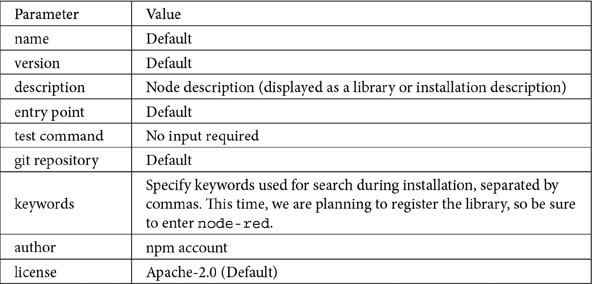

完成此步骤后，`npm init`命令将生成一个`package.json`文件：

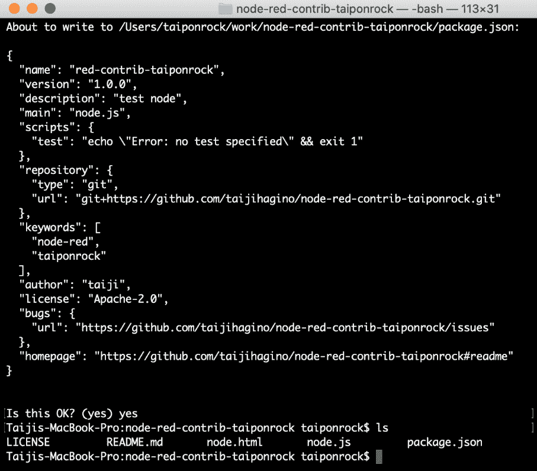

图 13.4 – npm init

1.  编辑`package.json`。您需要手动向`package.json`中添加 Node-RED 特定的设置。用文本编辑器打开`package.json`文件，并在 JSON 的与`"name"`和`"version"`相同级别处添加新属性：`"node-red": {"nodes": "{" lower-case ":" node.js "} }`：

```js
{
   "name": "node-red-contrib-<arbitrary string      specified>",
   "version": "1.0.0",
   (abridgement)
   "node-red": {
     "nodes": {
       "lower-case": "node.js"
     }
   },
   (abridgement)
}
```

以下截图可用作参考，可帮助您添加此属性：

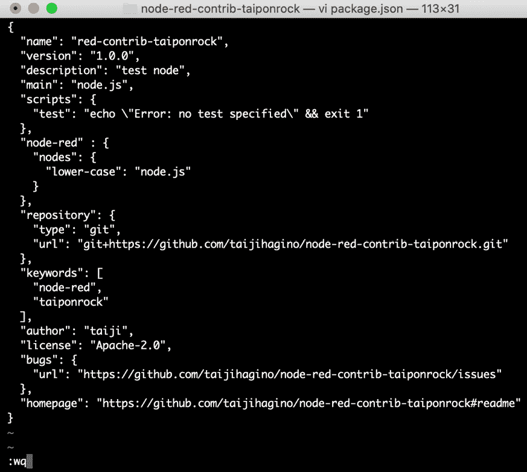

图 13.5 – 编辑 package.json

这样就完成了自己节点的打包。让我们在下一部分中实际使用这个节点。

# 在本地环境中测试您自己的节点

您已经完成了自己的节点。让我们将迄今为止创建的节点添加到本地环境中的 Node-RED 中。

对于您自己的节点，非常重要的是在本地检查它们的运行情况。在不确定它在您的环境中是否正常工作的情况下，将节点发布到互联网对许多开发人员来说并不是一个好主意。

因此，在本节中，您将在本地环境中测试自己的节点。

## 节点安装

您可以使用`npm link`命令在本地测试节点模块。这允许您在本地目录中开发节点，并在开发过程中将它们链接到本地 Node-RED 安装中。

这非常简单。按照以下步骤进行：

1.  在 CLI 上执行以下命令以添加一个节点并启动 Node-RED：

```js
$ cd <path to node module>
$ npm link
```

这将创建适当的符号链接到目录，并且 Node-RED 将在启动时发现节点。只需重新启动 Node-RED 即可获取节点文件的更改。

1.  在命令行上运行`node-red`命令以启动本地 Node-RED。如果已经启动，请重新启动。

重新启动后，您应该看到一个名为**lower case**的节点已添加到调色板的**function**类别中：

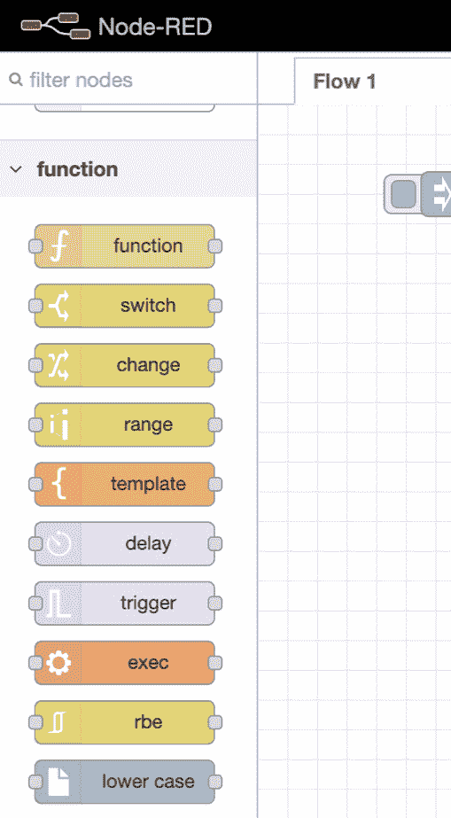

图 13.6 – 添加了小写节点

1.  让我们看看它是否可以正常使用。通过依次连接**inject** **lower case** **debug**的每个节点来创建一个流。

1.  对于**inject**节点的属性，将其设置为字符串类型，并将其设置为输出任何全大写字母的字符串，例如**MY NAME IS TAIJI**：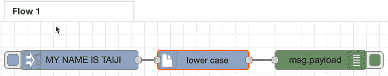

图 13.7 – 创建一个流

1.  当部署创建的流并执行**inject**节点时，您会看到作为此流参数的全大写字符串被转换为全小写字符串并输出到**debug**选项卡：

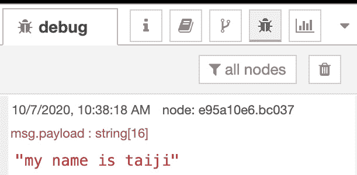

图 13.8 – 这个流的结果

接下来，让我们看看如何定制节点。

## 节点定制

我能够确认我创建的节点可以在本地环境中使用。从这里开始，我们将定制该节点。可以通过修改 JavaScript 和 HTML 来编辑节点的功能和外观。这些更改将在重新启动 Node-RED 时生效。

### 更改节点名称

目前，创建的节点的节点名称仍然是示例程序的小写版本。在这里，将此名称更改为您喜欢的任何名称。每个节点必须具有唯一名称，因此您应该选择尚不存在的名称。按照以下步骤更改节点的名称：

1.  在`package.json`文件中描述的`lower-case`更改为您自己的节点名称。

在示例中，节点的存储库是`node-red-contrib-taiponrock`，因此将其更改为`taiponrock`节点。

这是修改前的`package.json`文件的样子：

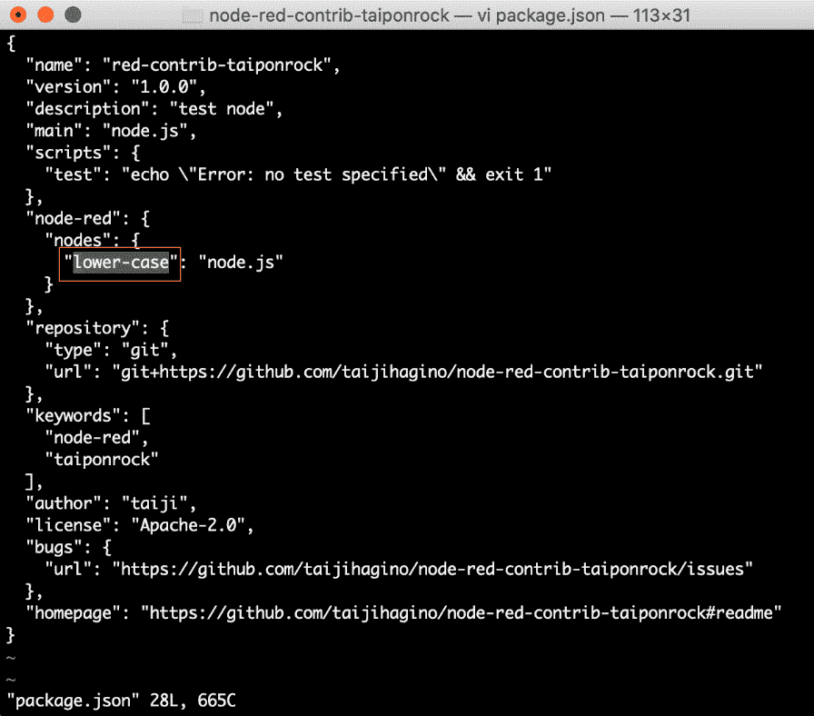

图 13.9 – 修改 package.json 前

修改后的样子如下：

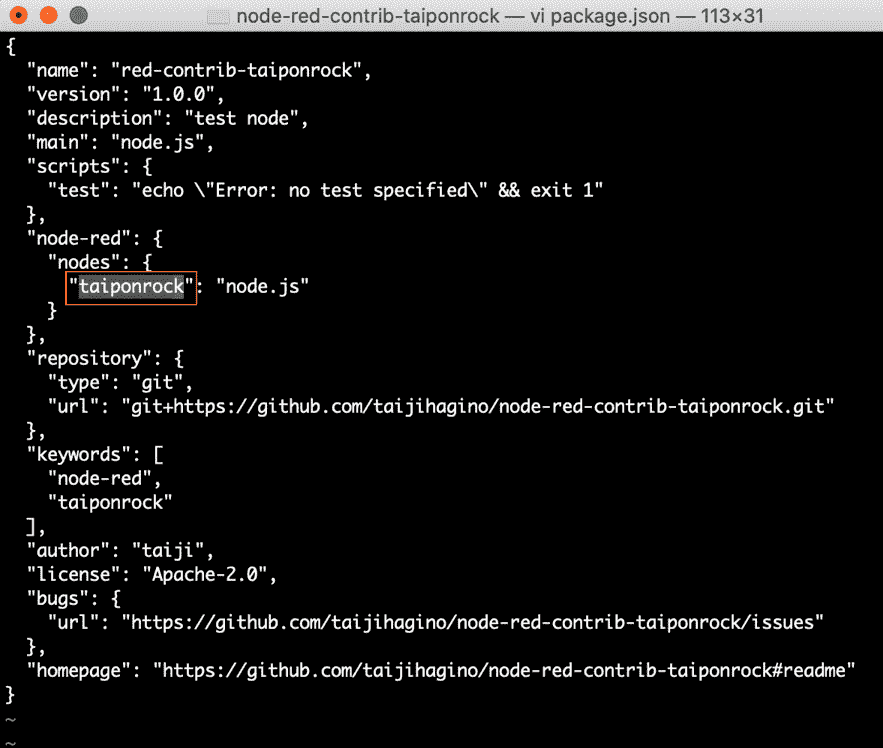

图 13.10 – 修改 package.json 后

1.  在`node.js`文件中描述的`lower-case`和`LowerCaseNode`更改为您自己的节点名称。

例如，将`lower-case`更改为`taiponrock`，将`LowerCaseNode`更改为`TaiponrockNode`。

这是修改前的`node.js`文件的样子：

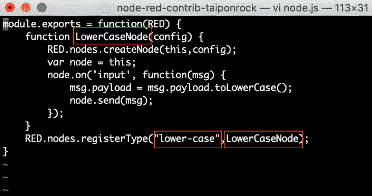

图 13.11 – 修改 node.js 前

这是修改后的`node.js`文件的样子：

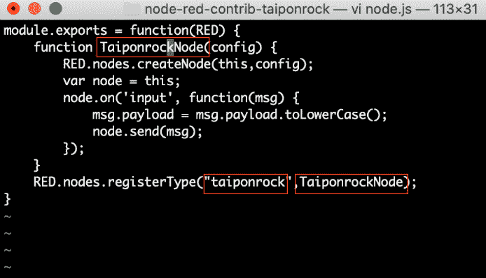

图 13.12 – 修改 node.js 后

1.  在`node.html`文件中描述的`lower-case`更改为您自己的节点名称。

例如，将`lower-case`更改为`taiponrock`。

这是修改前的`node.html`文件的样子：

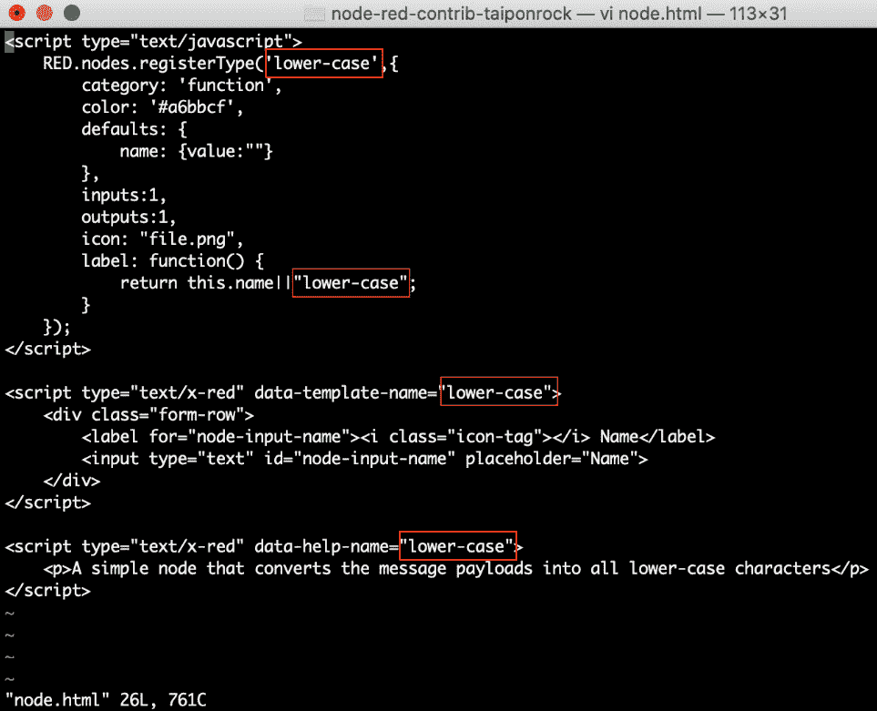

图 13.13 – 修改 node.html 前

这是修改后的`node.html`文件的样子：

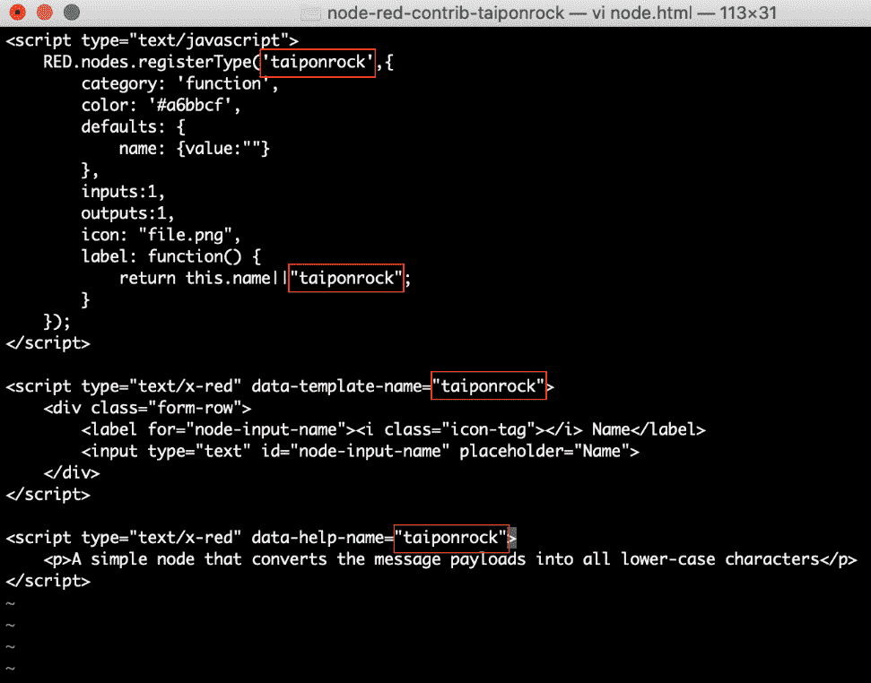

图 13.14 – 修改 node.html 后

重新启动 Node-RED 后，您会看到它已被正确重命名：

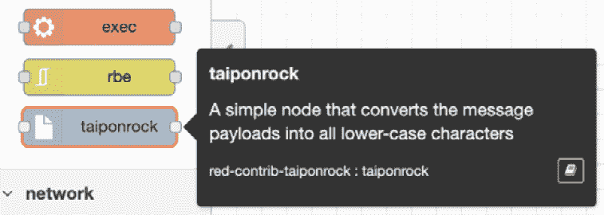

图 13.15 – 您的节点已被重命名

接下来，我们将看看如何更改特定节点的代码。

### 更改节点代码

实现节点处理的主要部分如下：

1.  更改代码。您可以通过重写`node.js`中定义的`msg.payload = msg.payload.toLowerCase();`来更改节点的处理：

```js
(abridgement)
node.on ('input', function (msg) {
     msg.payload = msg.payload.toLowerCase ();
     node.send (msg);
}
(abridgement)
```

在这里，为了使工作更易于理解，让我们改为仅返回您的姓名或昵称的字符串的方法。

1.  让我们将`node.js`重写如下：

```js
(abridgement)
node.on ('input', function (msg) {
     msg.payload = "Taiponrock";
     node.send (msg);
}
(abridgement)
```

1.  执行该流。

现在让我们看看它是否已更改。使用您之前创建的流程。此流程中的**lower case**节点已更改为更改了名称和处理的节点，但需要重新部署和提升。为了更容易理解，删除曾经是原始**lower case**节点的节点，并重新定位它。

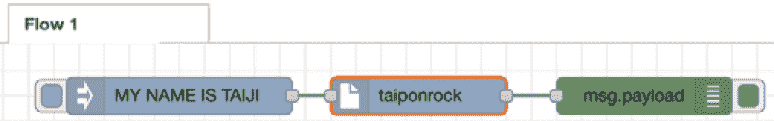

图 13.16 - 用重命名的节点替换您创建的节点并执行

1.  检查结果。当您部署创建的流程并执行**inject**节点时，您会看到在**debug**选项卡中显示了在*更改节点代码*部分中设置为常量的字符串（名称或昵称）。

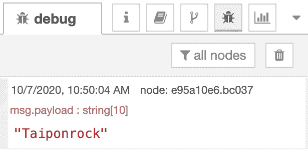

图 13.17 - 此流程的结果

在下一节中，我们将看到一些其他可以使用的节点自定义选项。

### 其他自定义选项

除了节点名称，您还可以以许多不同的方式自定义自己的节点，例如节点颜色，节点图标，节点类别，节点功能等。有关详细信息，请参阅官方文档：[`nodered.org/docs/creating-nodes/appearance`](https://nodered.org/docs/creating-nodes/appearance)。

现在我们已经在本地环境中测试和自定义了节点，让我们将节点发布到 Node-RED 库中。

# 将您自己的节点发布为 Node-RED 库中的模块

在这里，我们将在 Node-RED 库中发布创建的节点。为此，需要一些工作。到目前为止，您已经创建了自己的节点，并确认它只能在您的环境中使用。但是，由于这是您创建的唯一节点，让我们将其发布在互联网上，让世界上的每个人都可以使用它。为此，您需要将自己的节点发布到一个称为 Node-RED 库的位置，该位置可以在此处找到：[`flows.nodered.org/`](https://flows.nodered.org/)。

重要提示

Node-RED 库是一个社区发布节点和流的地方。因此，您应该避免暴露不完整或无用的节点。这是因为 Node-RED 用户应该能够找到他们想要的节点，而不希望有不需要的节点混合在一起。

因此，尽管本章将解释如何发布节点，请避免暴露测试节点或示例节点级别的节点。

## 发布您创建的节点

按照以下步骤在 Node-RED 库中发布您自己的节点：

1.  维护一个`README.md`文件。

我们将在`README.md`文件中写节点描述。考虑到英语是一种通用语言，最好用英语写。

例如，最好描述以下内容：

+   概述解释

+   如何使用节点

+   屏幕截图

+   使用此节点的示例流

+   先决条件环境

+   更改日志

在本节中，由于这是一个实践教程，`README.md`文件中只会写概述和用法。请使用以下内容更新`README.md`：

```js
# node-red-contrib-<Any specified string>
## Overview
This node is a node for forcibly converting all the alphabet character strings passed as input to the character string "Taipon rock".
Even if the input parameter passed is not a character string, "Taiponrock" is forcibly returned.
In this process, it is a wonderful node that changed the sample node that was executing toLowerCase, which is an instance method of String object in JavaScript, to a process that just returns a meaningless constant.
## how to use
It is used when you want to forcibly convert all the character strings of the parameters to be passed to "Taiponrock".
```

1.  上传文件 - 确保您在目录中有五个文件：`node.js`，`node.html`，`package.json`，`README.md`和`LICENSE`（如果包括`package.lock.json`也没关系）：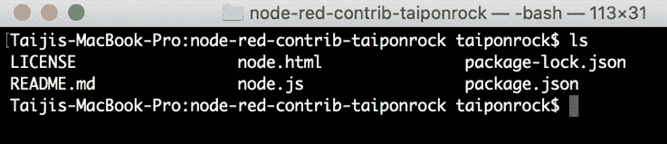

```js
push finishes without error, you can see that the target file has been uploaded in the repository on GitHub: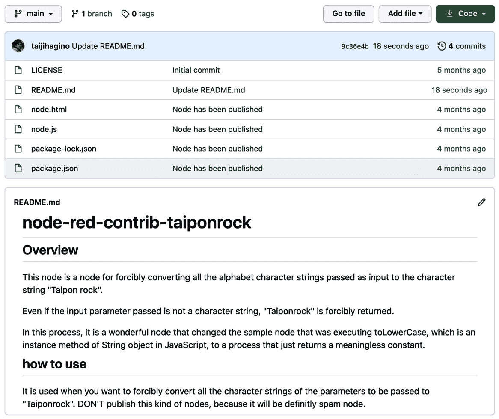Figure 13.19 – Your node files are uploaded
```

1.  发布您的节点（`npm publish`）。

现在让我们将节点公开为模块。使用`npm`命令上传文件集。再次在克隆的存储库目录中工作：

```js
npm publish. Don't forget to edit package.json to increase the version number, as the version must be up when you run npm publish a second time or later.When `publish` is completed normally, it will be published at `https://www.npmjs.com/package/node-red-contrib-<arbitrary character string>`.An example is `https://www.npmjs.com/package/node-red-contrib-taiponrock`: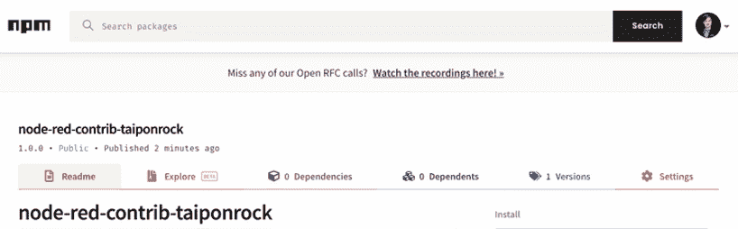Figure 13.20 – Your node has been published on npm
```

1.  从 Node-RED 库的**添加节点**中注册创建的节点。

1.  在**将您的节点添加到 Flow 库**中，输入您创建的节点的名称，然后单击**添加节点**按钮：

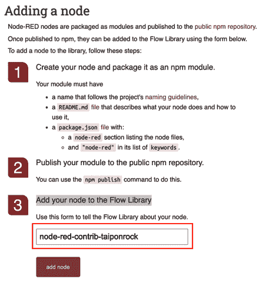

图 13.21 - 将您的节点添加到 Node-RED 库

注册完成后，您会看到已创建的节点已添加到库中：

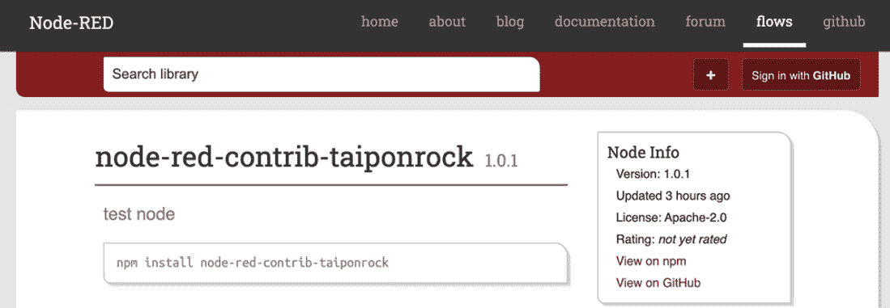

图 13.22 – 您的节点已在 Node-RED 库中发布

新节点的注册大约需要 15 分钟。请注意，通过 Node-RED 流程编辑器注册的节点，如果在 Node-RED 库上没有完全注册，将无法找到。

如果升级版本并重新发布，请从 Node-RED 库的节点页面刷新，并在节点屏幕右侧的**操作**面板中单击**检查更新**：

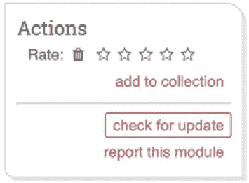

图 13.23 – 检查节点状态更新

接下来，让我们看看如何删除您发布的节点。

## 删除您发布的节点

删除已发布的节点时要小心。目前（截至 2020 年 10 月），根据 npm 的包取消发布政策，取消发布的截止时间为发布后的 24 至 72 小时。此外，即使在 72 小时或更长时间内下载量少于 300 次，也有可能取消发布对特定条件影响不大的软件包。

这些信息预计会不时更新，因此请参考 npm 官方网站获取最新信息：[`www.npmjs.com/policies/unpublish`](https://www.npmjs.com/policies/unpublish)。

取消发布后，请像更新时一样从 Node-RED 库的节点页面刷新。单击节点屏幕右侧**操作**面板底部的**请求刷新**。

要取消发布，请在模块目录（克隆存储库的目录）中执行以下命令：

```js
$ npm unpublish --force node-red-contrib- <arbitrary string>
```

如果此命令成功完成，则模块取消发布成功。

## 安装您发布的节点

建议您在将您的节点添加到**Node-RED 库**后等待至少 15 分钟。

在本地环境的 Node-RED 中，我反映了自制节点，以便可以直接使用。我还将其发布到 npm 进行发布，并在 Node-RED 库中注册了该节点。现在任何人都应该能够使用此节点。

在这里，让我们尝试并检查此次创建的节点是否可以从 IBM Cloud 的 Node-RED 中安装和使用，而不会出现任何问题。请按照以下步骤操作：

1.  登录 IBM Cloud，创建 Node-RED 服务，并启动 Node-RED 流程编辑器。

1.  在流程编辑器中打开**管理调色板**：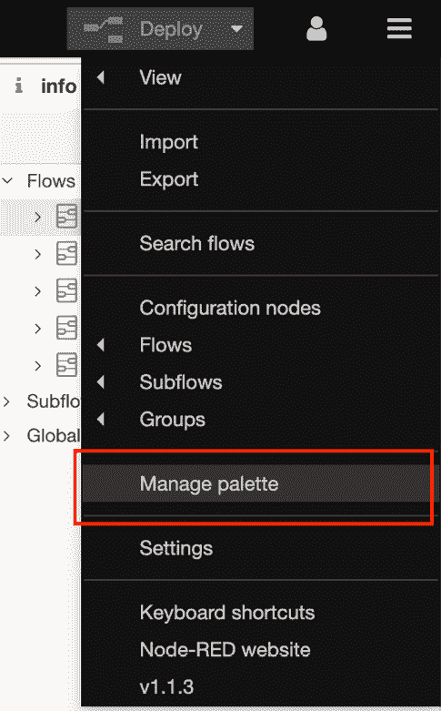

图 13.24 – 访问管理调色板

1.  选择**安装**选项卡，并开始在搜索字段中输入您创建的节点的名称。

如果您创建的节点显示在搜索结果中，这意味着它是公开的，并且是安装的目标。

1.  单击**安装**按钮进行安装。

如果它未显示在搜索结果中，则您可能在节点注册后未等待 15 分钟。请在 30 分钟或 1 小时后再试一次。如果仍然找不到您的节点，则可能有其他原因，请检查您迄今为止所做的步骤，并再次尝试：

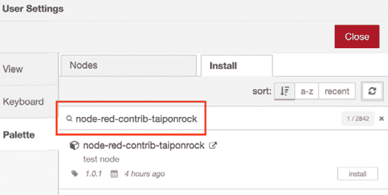

图 13.25 – 搜索并安装您的节点

1.  确认您在调色板上创建的节点已安装，创建如下图所示的流程，并执行**inject**节点：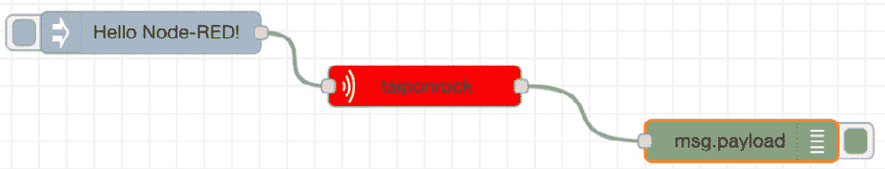

图 13.26 – 制作流程

在示例中，当首次启动 Node-RED 流程编辑器时，默认准备的流程之间插入了自制节点。

1.  运行**inject**节点后，请验证结果是否显示在**debug**窗口中：

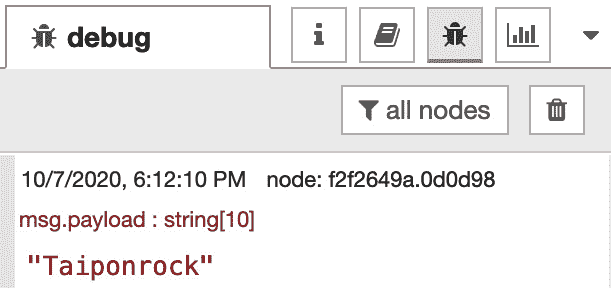

图 13.27 – 此流程的结果

干得好！您现在知道如何制作自己的节点并发布它。

# 摘要

恭喜！在本章中，你学会了如何创建自己的节点，如何自定义它，以及如何从 Node-RED 库或本地机器设置它。创建自己的节点并不像你想象的那么困难。如果你根据这个过程创建处理内容并安排外观，你可以发布自己的有用节点，这些节点还不存在，并且全世界的开发者都可以使用它！

此外，在本书的结尾，我会给你一个简要介绍 Node-RED 用户社区，所以一定要去了解一下。
