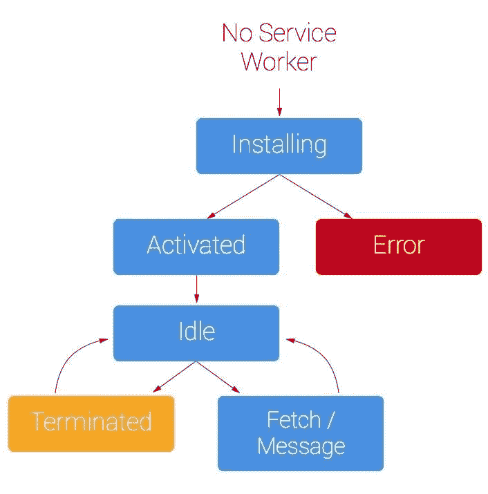
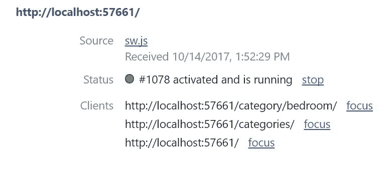
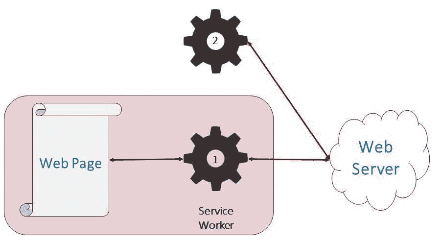
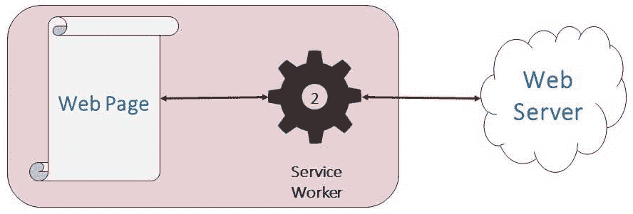
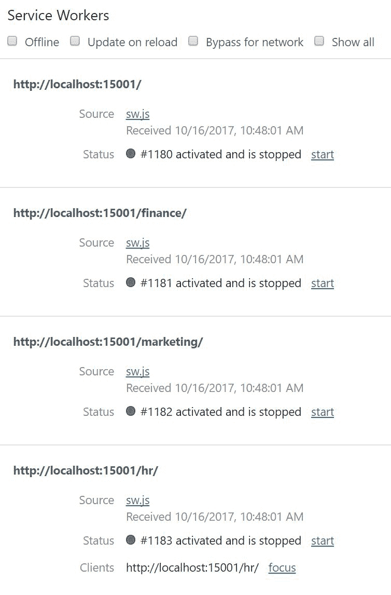

# 第五章：服务工作者生命周期

服务工作者生命周期是您必须掌握的最重要的概念之一，以便创建适当的服务工作者。服务工作者学科的这个部分通常被忽视，导致在 Stack Overflow 等网站上出现许多问题和挫败感。但掌握服务工作者生命周期可以使您无缝注册和更新服务工作者。

我认为开发者忽视了生命周期，因为它直到他们遇到由于不了解服务工作者生命周期而造成的障碍时才变得明显。大多数开发者感到困惑的问题是服务工作者何时变得活跃。

服务工作者遵循一个已知的生命周期，允许新的服务工作者在不干扰当前服务工作者的情况下准备自己。生命周期旨在提供最佳的用户体验。

当服务工作者被注册时，它不会立即接管客户端。有一些规则旨在最小化由于代码版本差异而导致的错误。

如果一个新的服务工作者刚刚接管了客户端的上下文，如果客户端或页面期望的是之前的版本，可能会出现问题。尽管服务工作者在单独的线程上运行，但 UI 代码可能依赖于服务工作者逻辑或缓存资源。如果新版本破坏了前端，用户体验可能会受到影响。

生命周期旨在确保在整个会话期间，处于范围内的页面或任务由同一个服务工作者（或没有服务工作者）控制：


生命周期包括注册、安装和激活步骤。安装和激活事件可以绑定处理程序，以便它们执行特定任务。

生命周期还涵盖了服务工作者更新，可能是最重要的生命周期步骤，以及注销。这两个任务可能不常用，但开发者仍然应该熟悉它们的工作方式。

每个阶段都可以用于不同的处理阶段来管理服务工作者、缓存资源和可能的状态数据。本章将详细介绍生命周期以及每个阶段如何被用来使您的应用程序性能更优、更易于管理。

本章将涵盖以下主题：

+   注册服务工作者

+   服务工作者客户端

+   更新服务工作者

+   服务工作者作用域

+   服务工作者更新

+   服务工作者事件

当服务工作者被注册时，脚本会被下载并安装。在这个时候，它不会接管任何活跃的客户端，包括注册服务工作者的页面。这是设计上的，以确保客户端体验不会因为服务工作者代码的变化而中断。

当服务工作者变为活跃时，它会声明或控制工作者范围内的任何客户端。由于可能存在控制客户端的先前工作者，新版本不会自动接管。如果两个版本之间存在逻辑差异，这可能会导致各种问题。

为了避免潜在的错误状态，服务工作者规范倾向于谨慎行事。你可以在安装事件处理程序中调用`skipWaiting`函数，使新版本变为活跃状态。在调用`skipWaiting`时，你可能仍然需要声明活跃的客户端：

```js
self.addEventListener('install', event => {
   self.skipWaiting();
   event.waitUntil(
     // caching etc
   );
 }); 
```

如果你使用`skipWaiting`，最好在你进行任何预缓存活动之前调用该方法，因为它们可能需要一段时间。这就是为什么预缓存逻辑被封装在`waitUntil`方法中。

`waitUntil`方法在任务完成处理之前保持事件处理程序打开。想想看，直到每个人都上或下电梯，你才关闭电梯门。如果你有扩展处理，服务工作者将不会关闭。

如果服务工作者长时间空闲，活跃的服务工作者将被终止以减少 CPU 负载和其他可能消耗的资源。这是好事，因为持续运行的服务工作者会耗尽你的设备电池。

警惕，如果你强制新的服务工作者变为活跃，你需要确保它不会破坏你的应用程序。当用户体验中断并显示错误消息时，用户不喜欢这种情况。

一个最佳实践是执行某种测试以验证应用程序的完整性。你可能还希望警告用户应用程序已被更新，可能鼓励手动刷新。

永远不要在没有警告访客的情况下自动刷新页面，因为这可能会造成困惑。消息 API 可以用来与用户通信以协调更新。

如果在服务工作者安装过程中出现任何错误，注册将失败，其生命周期将结束。安装后，服务工作者可以变为活跃。一旦活跃，它可以响应如`fetch`之类的功能事件。

安装处理程序期间的一个常见错误是缓存。`addAll`方法可能会收到 404 未找到的响应。当这种情况发生时，`addAll`方法会抛出异常。由于安装事件无法确定错误严重性或上下文，它会回滚。服务工作者永远不会安装。这在下图中表示为红色错误块。

你可以捕获异常并优雅地处理它们。你仍然可以发出单独的请求并缓存这些结果。这需要更多的代码，但可以为你提供一些对单个请求导致服务工作者安装失败的防护。你还可以确保即使有一个失败，好的响应也会被缓存。

下面的流程图演示了核心生命周期，但不会可视化服务工作者如何变为活跃：



# 注册服务工作者

服务工作者必须从网页中进行注册。这通常在一个常规的 UI 脚本中完成。在调用 `register` 方法之前，你应该检测浏览器是否支持服务工作者。如果支持，`navigator` 对象将有一个 `serviceWorker` 属性：

```js
if ('serviceWorker' in navigator) {
 } 
```

如果浏览器支持服务工作者，您就可以安全地注册您的服务工作者。`serviceWorker` 对象有一个 `register` 方法，因此您需要提供一个服务工作者脚本的 URL 引用：

```js
if ('serviceWorker' in navigator) {
 navigator.serviceWorker.register('/sw.js')
 .then(function(registration) {
 // Registration was successful
 });
 }
```

`serviceWorker.register("sw path"[, options])` 函数接受两个参数。第一个是服务工作者的路径。此路径相对于网站源或根文件夹。

第二个参数是可选的，它是一个包含注册选项的对象。目前，唯一可用的选项是 `scope`。使用对象是为了允许对 `register` 函数进行未来的修改。

`scope` 选项是一个字符串引用，指向服务工作者允许控制的相对于网站根目录的路径。在以下示例中，正在为人力资源部门注册一个服务工作者。相同的代码可以从网站的根域名或 `hr` 子文件夹中使用，因为所有路径都是相对于网站根目录的：

```js
navigator.serviceWorker.register('/hr/sw.js', {scope: '/hr/'})
 .then(function (registration) {
 // Registration was successful
 console.log('ServiceWorker registration successful with scope: ', registration.scope);
 });
```

您可以从网站的任何路径注册服务工作者，作用域仍然限制在服务工作者实际所在的位置。这意味着您也可以从人力资源应用程序中注册营销和财务服务工作者。然而，人力资源部门无法操纵那些应用程序中的任何内容，反之亦然。

脚本可以存储在其指定作用域的任何级别或以上。例如，如果您的应用程序的所有服务工作者都位于网站的根目录中，它们将需要不同的 `scope` 值：

```js
navigator.serviceWorker.register('/sw-hr.js', {scope: '/hr/'})
 .then(function (registration) {
 // Registration was successful
 console.log('ServiceWorker registration successful with scope: ', registration.scope);
 });
```

上述示例演示了如何将人力资源部门的客服人员存储在域的根目录中。将作用域设置为 `/hr/` 限制了其作用域仅限于 `hr` 文件夹及其以下。

对作用域的误解是新服务工作者开发者最常见的错误之一。第一步是接受服务工作者与我们过去二十年来编写的客户端 JavaScript 是不同的。

您应该努力将服务工作者脚本与传统的客户端脚本文件分开。将您注册的服务工作者文件放在应用程序的根目录中。您仍然可以从其他文件夹导入脚本，这使您能够在应用程序作用域之间重用代码。

**作用域**是一个有价值的特性，可以防止由于外部服务提供商或客户可能访问的网站而发生的糟糕事情。您可以将它视为隔离您的逻辑业务单元的一种方式。它也是保护您的应用程序免受潜在安全威胁的一种方式，如果您的域上的一个应用程序被破坏。

默认情况下，服务工作者的作用域限于脚本所在的文件夹。服务工作者不允许控制位于更高文件夹级别或同级文件夹中的托管页面。

# 服务工作者客户端

我在本章中多次提到了服务工作者客户端。明显的定义是打开网站页面的浏览器标签页。虽然这将在大多数情况下成立，但它不是唯一的客户端类型。

由于服务工作者在浏览器标签页的 UI 线程之外执行，它们可以为多个客户端提供服务。这包括多个标签页、推送通知和后台同步事件。后两者是没有传统用户界面的客户端。

服务工作者规范说明（[`w3c.github.io/ServiceWorker/#service-worker-client-concept`](https://w3c.github.io/ServiceWorker/#service-worker-client-concept)）：

"服务工作者客户端是一个环境。"

它继续定义了一系列潜在的客户类型。服务工作者客户端的概念设计不是为了考虑明显的浏览器标签页，而是任何可能触发服务工作者事件的进程。目前，这包括推送通知和后台同步事件。随着更多功能被标准化以使用服务工作者基础设施，未来是开放的。

以下截图显示了 Chrome 开发者工具列出了来自同一网站的三不同标签页：



每个标签页都是一个唯一的客户端。你可以点击任何客户端右侧的焦点链接，立即显示相应的浏览器标签页。

以下代码允许你检查当前作用域下的所有服务工作者注册：

```js
navigator.serviceWorker.getRegistrations()
 .then(function(registrations){
    registrations.forEach(function(registration) {
             console.log("registration: ", registration.scope);
          }, this);
 }); 
```

你可能会问，为什么当只能为一个作用域注册单个服务工作者时，还有`getRegistrations`方法？`getRegistrations`函数返回域内所有已注册服务工作者的列表。

`getRegistration`方法以类似的方式工作，但只返回当前作用域的已注册服务工作者：

```js
navigator.serviceWorker.getRegistration().then(function (registration) {
     if (registration) {
         console.log("registration: ", registration.scope);
     }
 }); 
```

`getRegistration`方法有一个可选参数，你可以指定一个 URL，它将返回控制 URL 作用域的服务工作者注册。例如，如果你提供了`/marketing/`，则`registration.scope`将返回`{domain}/marketing/`，前提是你已为该作用域注册了服务工作者。

# 服务工作者注册对象

注册服务工作者会在用户代理维护的服务工作者注册表中创建一个条目。当你注册或调用`getRegistration`或`getRegistrations`方法时，它们会返回匹配的注册对象（们）的引用。

注册对象包含以下成员：

**属性**

+   `scope`：服务工作者的作用域

+   `installing`：如果服务工作者正在安装，它返回一个`ServiceWorker`对象，否则返回 undefined

+   `waiting`: 如果服务工作者正在等待，它返回一个`ServiceWorker`对象，否则返回 undefined

+   `active`: 如果服务工作者是活动状态或正在激活，它返回一个`ServiceWorker`对象，否则返回 undefined

+   `navigationPreLoad`: 返回服务工作者`preLoadManager`的引用

+   `periodicSync`: 返回服务工作者`PeriodicSyncManager`的引用，用于后台同步

+   `pushManager`: 返回服务工作者`pushManager`的引用

+   `sync`: 返回服务工作者`syncManager`的引用

**方法**

+   `update`: 以编程方式检查服务工作者更新，绕过缓存

+   `unregister`: 以编程方式移除服务工作者

+   `getNotifications`: 返回一个解析为服务工作者通知数组的承诺

+   `showNotifications`: 显示由标题标识的通知

**事件**

+   `onupdatefound`: 任何有新服务工作者时都会触发

以下是如何处理`updatefound`事件的示例。当它触发时，注册的安装属性中应该有一个`serviceworker`对象。在这里，`serviceworker`对象（`newWorker`）已经对其状态属性进行了查询：

```js
reg.addEventListener('updatefound', () => {   // A wild service worker 
//   has appeared in reg.installing!
const newWorker = reg.installing;
console.log("newWorker.state: ", newWorker.state);
// "installing" - the install event has fired, but not yet complete
// "installed"  - install complete
// "activating" - the activate event has fired, but not yet complete
// "activated"  - fully active
// "redundant"  - discarded. Either failed install, or it's been
//   replaced by a newer version

newWorker.addEventListener('statechange', () => {
// newWorker.state has changed
console.log("service worker state change");
});

}); 
```

这个事件可以用来执行一系列逻辑，为客户端更新做准备，包括通知用户重新加载浏览器以利用新版本。

`update`和`unregister`方法将在第六章中介绍，*掌握 Cache API – 在播客应用程序中管理 Web 资源*。让我们花点时间看看推送通知是如何工作的。

# 更新服务工作者

以下图表显示了服务工作者在替换周期中经历的序列。第一个图表显示了如何注册新的服务工作者，并使其与现有服务工作者并存。新的服务工作者不是活动的，而是在等待所有活动客户端关闭：



一旦客户端关闭，初始服务工作者死亡，新的服务工作者开始其新的活动角色：


在新的服务工作者变为活动状态后，它是唯一存活的服务工作者：



# 服务工作者作用域

如前所述，服务工作者限制在单个域。域是您网站的地址，例如[`podcast.love2dev.com/`](https://podcast.love2dev.com/)。这是一个安全特性。限制服务工作者被称为**服务工作者作用域**。这防止外部脚本对你的网站进行恶意操作。

想象一下，如果你的客户也访问了你的竞争对手的网站，该网站安装了一个服务工作者。如果没有对服务工作者作用域的限制，他们可能理论上会操纵你的内容或监视你和你客户的私人数据。

事实上，第三方脚本不能从你网站上的页面注册服务工作者。这应该阻止外部脚本和服务提供商使用服务工作者与你的域名结合使用。

服务工作者限于原始域名，并且也限于其物理位置所在的文件夹。这意味着你可以在网站域名内的任何子文件夹中注册服务工作者。子脚本将控制来自其文件夹及其以下的任何请求。

如果另一个服务工作者在较低文件夹中注册，那么它将控制从该文件夹向下，依此类推。另一种思考服务工作者控制范围的方式是向下，而不是向上。位于子文件夹中的脚本不会对网站根目录触发的事件做出响应。

注意你的服务工作者文件的位置。常见的做法是将 JavaScript 文件存储在`/js`文件夹下。这对于传统的 UI JavaScript 来说是可行的，但当服务工作者文件存储在`js`文件夹下时，往往会引起混淆。最佳实践是将服务工作者放在你网站的根文件夹或其控制的范畴的根文件夹中。

范畴决定了哪些页面受服务工作者控制。一旦页面受服务工作者控制，来自该页面的所有 HTTP 请求（无论请求 URL 如何），都将触发服务工作者的 fetch 事件。

大多数情况下，这意味着你的服务工作者位于你域名网站的最高文件夹中。但有许多场景下情况并非如此。大型网站和公司内部网站通常是不同、隔离应用的集合。

在有不同应用岛屿的架构中，每个应用都可以有自己的服务工作者。例如，一个企业可能有 HR、财务和营销的兄弟网站。每个都可以有单独的服务工作者。不同的服务工作者彼此隔离，不能访问其他应用的范畴。

这些服务工作者可以在网站根域名内的任何位置注册。这意味着你可以从另一个范畴注册子应用的服务工作者。每个服务工作者仍然限于其所在的文件夹及其以下。

以下截图显示，可以为单个网站注册四个服务工作者，每个控制自己的范畴：



# 服务工作者更新

更新服务工作者文件也是一个复杂的概念。有几个因素决定何时更新你的服务工作者。更新周期只有在浏览器确定有新的服务工作者文件可用时才会开始。

一旦服务工作者注册，浏览器在确定是否有新版本可用时，会像对待任何其他文件一样对待该文件。它向服务器发出请求，这触发了已知的周期。

首先，是本地浏览器缓存（不是 service worker 缓存）中的文件。如果有可用的本地版本且尚未过时，它将被检索。接下来，请求通过网络发送到服务器。如果服务器响应 304，这意味着浏览器拥有最新版本。如果文件没有更改，则不会启动 service worker 更新周期。如果有新版本，则更新 service worker。

基本更新流程的一个例外是内置的防止大 Cache-Control 头值的保护措施。如果服务工作者在过去 24 小时内没有更新，浏览器将始终从服务器检索服务工作者。

Cache-Control 头告诉浏览器在浏览器存储中保留文件副本的时间长度。对于大多数资产，你希望缓存时间较长，例如一年，因为它们不经常更改。这可能导致你的应用程序无法更新的糟糕情况。

对于静态资产，如样式表和图像，常见的做法是使用由文件哈希生成的值来命名它们，并给它们分配一个非常长的生命周期。这意味着任何更新都会使用新的文件名并触发新的请求。你当然可以使用这种策略与 service workers 一起使用。

如果你使用相同的 service worker 文件名，那么你应该设置一个短的生命周期。这可以从几分钟到几小时不等。超过 24 小时的内容将被浏览器忽略。

如果浏览器在过去 24 小时内没有检查新的 service worker 版本，它将强制进行服务器端检查。这被添加到规范中作为安全预防措施，以防你部署了一个可能导致重大问题的 service worker，而你无法通过编程方式强制更新。

这种情况可能会发生，如果你为你的网站中注册了 service worker 的页面指定了较长的缓存时间，并且对 service worker 脚本也做了同样的处理。这意味着你可能会经历的最坏情况是从有缺陷的 service worker 安装之日起整整一天。

这不是解决糟糕问题的最佳方案，但至少有一个终极的安全措施来帮助你。如果你发现自己处于这种情况，你仍然可以立即部署更新，而尚未安装有缺陷版本的用戶将免受影响。

# Service worker 事件

服务工作者事件有两种类型：核心和功能。核心消息是使服务工作者成为服务工作者基本要素的。功能事件可以被视为对中央服务工作者骨干的扩展：

**核心事件**:

+   Install

+   Activate

+   消息

**功能事件**:

+   `fetch`

+   `sync`

+   `push`

这些事件中的每一个都可以用来触发处理。安装和激活事件是生命周期的一部分。在第七章，*服务工作者缓存模式*（Chapter 7），我们将深入研究不同的缓存模式。安装和激活事件对于管理预缓存资源和清理你的缓存模型非常有用。

当注册新的服务工作者时，安装事件立即触发。激活事件在服务工作者变得活跃时触发。这意味着任何现有的服务工作者都会被新的服务工作者替换。

当客户端使用 `postMessage` 方法发送消息时，会触发消息事件。

功能性事件是对外部动作的响应而触发的。我们已经探讨了推送和后台同步。在第六章，*掌握 Cache API – 在播客应用程序中管理网络资源*，我们将回顾 Fetch API 的工作原理，并开始探讨缓存策略。

# 摘要

服务工作者生命周期看起来很简单，直到你开始与它们一起工作。了解生命周期如何执行有助于你理解服务工作者的状态。

服务工作者（service worker）的生命周期旨在帮助我们避免在升级过程中可能破坏应用程序的情况。可以注册一个新的服务工作者，但需要等待任何现有的客户端关闭。当安全时，你可以使用 `skipWaiting` 方法允许新的服务工作者立即接管控制。

更复杂的应用程序也可能有多个具有不同作用域的服务工作者。这允许大型应用程序在不同子应用程序之间实现隔离控制。

现在你已经了解了如何使用服务工作者和服务工作者生命周期，在下一章中，你将看到如何使用 Fetch 和 Cache API 使 Podstr 应用程序离线工作，并将剧集保存到任何地方、任何时间都可以收听。
