# 第一章. 与响应式图像一起工作

> “一张图片胜过千言万语……”

这些词用于 1913 年俄亥俄州皮夸的皮夸汽车供应公司的广告中，至今仍具有现实意义。唯一的区别是技术的出现——随着手机、平板电脑和便携式设备的日益普及，需要在较小的设备上显示内容。虽然文本可能很容易显示，但图像则不然，但它们仍然同样重要。在本章中，我们将探讨一些你需要学习的技巧和窍门，以便在多种不同的设备上以正确的大小和质量显示图像。

创建响应式图像可以像所需的那样简单或复杂。在本章中，我们将涵盖一系列主题，包括：

+   与流体图像、图标和精灵一起工作

+   适应供应商前缀、图像格式和不同平台

+   适应高清/视网膜图像并使用`<picture>`标签

+   确定可用的视口以供使用

+   使用 CSS、JavaScript 或数据标签解决媒体查询

+   构建响应式轮播图和创建响应式地图

好奇吗？让我们开始吧！

# 开始

在本章中，我们将使用项目区域进行操作。在我们开始之前，强烈建议你创建一个项目文件夹。为了本章的目的，我将假设它叫做`code`；在其内部，你需要创建四个文件夹：`css`、`js`、`font`和`img`，如截图所示：

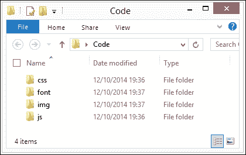

我们将在本章中引用创建的文件夹。

# 从流体图像开始

你有多少次创建了网页，却发现观众抱怨它们在移动设备上看起来很差？我敢打赌，这可能是图像内容的一个可能原因。图像被设置为固定大小，所以在较小的浏览器中无法很好地调整大小，对吧？

在本教程中，我们将探讨从固定图像转向在浏览器窗口调整大小或移动设备上查看内容时自动调整大小的图像所需的基本知识。

为了这个练习，我创建了一个关于加拿大派尤托湖的示例页面——如果你有幸能去参观，那将是加拿大真正令人惊叹的一部分！在本教程中，我们将进行一些更改，以帮助使图像在浏览器窗口调整大小时更好地响应。以下步骤将指导你完成练习：

1.  让我们先打开代码下载的副本，并提取`simplefluid1.html`和`simplefluid1.css`。这是一个关于加拿大派尤托湖的简单网页。

1.  尝试调整浏览器窗口的大小。注意它并没有调整任何内容？让我们通过对我们代码进行两个小的更改来解决这个问题。

1.  修改`simplefluid1.css`中的两行，如以下代码所示：

    ```js
    img { max-width: 100%; height: auto; float: left; padding: 10px; }
    #description { box-sizing: border-box; }
    #peytoe { ... padding: 0px 10px 10px; width: 66%; }
    ```

    我们刚刚进行的三个更改就是使内容响应式并适应调整大小窗口所需的所有内容。我们使用了`max-width`来控制图像的大小，而使用`height: auto`有助于保持图像的宽高比，防止其看起来扭曲。

    有些人可能会认为这就足够了，对吧？嗯，并不完全是这样；尝试将内容调整到更小的尺寸，我们可以看到图像开始溢出边界。

    要使图像真正适应，我们需要将尺寸转换为它们的百分比等效值；为此，我们可以使用公式 *目标 ÷ 上下文 = 结果*。让我们将其付诸实践。考虑 `443px`（图像宽度） / `800px`（原始框大小） * 100 = 55.375%。

1.  使用这个公式，继续修改 `img` 规则如下：

    ```js
    img { width: 55.375%; height: 37.125%; float: left; padding: 10px; }
    ```

如果在调整图像大小时一切顺利，内容将进行调整，但仍然保持在 `#peytoe` div 的范围内，如本截图所示：

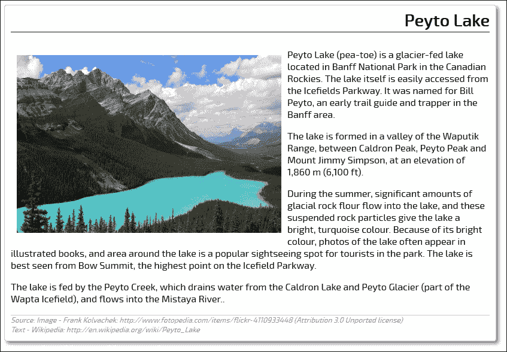

应该注意的是，这种方法可能并不适用于所有网站。例如，在将其缩小到更小尺寸之前，可能更倾向于先使用背景位置对其进行裁剪。这取决于你的设计以及所使用的图像类型和数量；这是在设计过程中需要考虑的事情。

现在我们已经看到了使图像响应式的基础知识，让我们继续前进，看看我们如何通过在支持的设备上使用更高质量的图像来改进这一点。但在我们这样做之前，值得介绍一些关于响应式设计的要点，特别是与使用供应商前缀和图像格式相关的内容。

# 供应商前缀和图像格式

我们将从一个问题开始本节。如果你认为创建响应式内容需要特殊的图像格式或大量的供应商前缀，请举手。如果你认为答案是肯定的，那么再想想——两到三年前，你可能不得不使用以下代码行作为示例媒体查询：

```js
@media only screen and (-webkit-min-device-pixel-ratio: 1.5),
only screen and (min--moz-device-pixel-ratio: 1.5),
only screen and (-o-device-pixel-ratio: 3/2), 
only screen and (min-device-pixel-ratio: 1.5) {
    /* High-res version of image assets go here */
}
```

现在，你只需要考虑大多数现代浏览器（即在过去 12 到 18 个月内发布的版本）的是这个——没有看到任何供应商前缀：

```js
(min-resolution: 192dpi) { 
    /* CSS styles here */
}
```

对于图像来说，也有一个类似的原则适用——不需要专门用于媒体查询的特殊格式，也不需要使用许多不同的格式来满足不同设备的需求。我们只需要选择一个格式——任何格式都可以。这里的例外是，虽然使用 PNG 或 JPG 图像会产生结果，但你可能会发现，在某些情况下，由于这些格式不适合放大，质量开始下降。

相反，在响应式设计中使用 SVG 格式会更好。这实际上是 XML，可以使用 Inkscape 或 Illustrator 等工具进行编辑；甚至可以在文本编辑器中编辑！不过，使用 SVG 的关键是它能够完美缩放；无论浏览器窗口的大小如何，图像质量都不会受到影响。它是标志、图案、图标等理想的格式，但不适用于照片，因为有损格式在缩放时表现不佳。

# 适应不同平台

到目前为止，你可能希望问自己，“关于移动设备怎么办？”毕竟，这是一个很好的问题：响应式设计的全部目的就是为了适应移动设备！我们将在本章中遇到的大部分技巧和窍门都适用于移动平台，尽管也有一些值得注意的有用指南：

+   缩小图片。使用任何在线服务，如 TinyPNG 或 XnConvert；它们需要尽可能小，同时不要牺牲太多质量。

+   在处理视网膜图片时要小心。这些图片在不同移动设备上的内存使用量可能会有很大差异，因此请确保适当地设置你的媒体查询。

+   如果你使用 jQuery 提供回退支持，那么考虑使用条件加载，仅在需要时调用 jQuery，而不是默认调用。

+   确保已创建同一图片的不同尺寸版本。如果小尺寸图片足够，就没有必要强迫移动用户下载大文件！要获取帮助，请在网上寻找类似 Andi Smith 的响应式图片工具[`www.andismith.com/grunt-responsive-images/`](http://www.andismith.com/grunt-responsive-images/)，它可以帮助自动化此过程。

+   在线应用程序中测试，例如在[`coolestguidesontheplanet.com/responsive/`](http://coolestguidesontheplanet.com/responsive/)可用的响应式工具，因为没有替代品可以测试！现在彻底测试并修复错误，比以后上线时遭受尴尬要好得多。

+   以移动优先的方式进行工作。移动设备需要设置为首先下载最小的图片；如果网站内已创建媒体查询，浏览器将自动处理替换为较大图片。

+   考虑使用类似网络 API([`code.tutsplus.com/tutorials/html5-network-information-api--cms-21598`](http://code.tutsplus.com/tutorials/html5-network-information-api--cms-21598))或 Modernizr([`www.modernizr.com`](http://www.modernizr.com))的东西来确定访问者是否在使用移动平台；如果需要，我们可以将这些链接到基于 jQuery/JavaScript 的媒体查询，以确定应该提供哪张图片。

+   不要使用`display: none`来隐藏图片，使用媒体查询来提供。使用前者方法即使图片被隐藏，仍然会下载它们。

    ### 小贴士

    记住 RevUnit 的 Seth Waite 说的这句话：“1/4 的人会放弃加载时间超过四秒的网页。”在移动设备上，这一点变得更加关键；加载大图像会直接导致加载时间过长！你可以在他的原始文章中看到更多[`sethwaite.com/2012/08/how-slow-website-speed-destroys-your-conversion-rates/`](http://sethwaite.com/2012/08/how-slow-website-speed-destroys-your-conversion-rates/)。

现在理论部分已经讲完，让我们开始编码！我们将从响应式媒体工作的关键元素之一开始——适应**高分辨率**（**hi-res**）或基于视网膜的图像。

# 适应高清或视网膜图像

你有多少次使用移动设备，比如 iPad，却发现图像质量很差？随着在 iPad 等设备上视网膜显示屏的出现，确保你的图像在高分辨率屏幕上有足够的质量变得越来越重要。

**视网膜显示屏**是苹果公司创造的专有营销术语，而不是科学术语。对一些人来说，它可能唤起复杂科学过程的画面；实际上，它只是双倍分辨率，其中像素被非常紧密地排列，以提供更高的质量和分辨率。例如，像素计数可以从第三代 MacBook Pro 的 220 **每英寸像素**（PPI）到 iPhone 6 Plus 的 401 PPI 不等！

将视网膜支持添加到我们的代码中很容易。我们有几种选择：

+   我们可以使用`background-size: cover`将图像设置为背景图像，以确保它覆盖整个显示。然后可以使用 CSS 媒体查询用更高分辨率的图像替换它们。

+   我们可以将图像调整为大视网膜图像，然后使用 CSS 在屏幕上调整它们的大小；这会导致文件更大，但不一定是两倍大，因为 JPEG 压缩的方式。尽管如此，我们可能需要使用`-ms-interpolation-mode: bicubic`来确保在某些浏览器中压缩级别尽可能高效！

我们总是可以将我们的代码设置为显示高分辨率图像；然而，显示这些图像的成本在于更大的文件大小；在**低分辨率**（**low-res**）设备上，质量将会丢失。

相反，我们可以使用插件，如 Retina JS，告诉浏览器仅在需要时提供高分辨率图像。让我们看看它是如何实际使用的：

1.  首先，将以下代码添加到一个新文件中，将其保存为`retina.html`：

    ```js
    <!DOCTYPE html>
    <html>
    <head>
      <meta charset="utf-8">
      <script src="img/retina.min.js"></script> 
    </head>
    <body>
      
    </body>
    </html>
    ```

1.  接下来，我们需要下载 RetinaJS 库——这个库可以在[`github.com/imulus/retinajs/releases/download/1.3.0/retina-1.3.0.zip`](https://github.com/imulus/retinajs/releases/download/1.3.0/retina-1.3.0.zip)（在撰写本书时，最新版本是 1.3.0）找到。提取`retina.min.js`并将其放入项目文件夹中的`js`子文件夹中。

1.  我们还需要两个图像：一个需要比另一个具有更高的分辨率；在这个例子中，我将使用代码下载中可用的两个 PNG 文件：`mothorchid.png`和`mothorchid@2x.png`。请注意，第二个文件必须在文件名末尾有`@2x`；这是使 Retina JS 工作的关键。

为了预览结果，建议使用 Google Chrome。我们可以轻松地模拟更改设备像素比设置；将其从`1`更改为`2`并刷新屏幕，以查看从低分辨率图像到高分辨率图像的变化。我们将在本章的*确定媒体查询*部分介绍如何创建支持高分辨率图像的媒体查询。

### 注意

在线有很多插件示例可以提供视网膜支持——两个示例是：`responsImg`，您可以从[`etiennetalbot.github.io/responsImg/`](http://etiennetalbot.github.io/responsImg/)下载。或者，您可以使用 Grunt 通过 Andi Smith 的 Grunt 响应式图像插件来完成这项繁重的工作，请参阅[`mattstow.com/experiment/responsive-images/responsive-images.html`](http://mattstow.com/experiment/responsive-images/responsive-images.html)。

# 使用精灵显示响应式图像

到目前为止，我们的示例都有一个共同点：它们与单个图像一起工作。这对于那些最多只出现一次或两次的情况来说是可以的，但如果你在整个网站上频繁地使用它们呢？每次都调用它们似乎是没有意义的。幸运的是，我们可以通过使用图像精灵来解决这个问题。

### 注意

关于图像精灵如何工作的讨论，请参阅 Chris Coyier 在[`css-tricks.com/css-sprites/`](http://css-tricks.com/css-sprites/)发表的有用文章。

对于初学者来说，图像精灵是将许多（理想情况下，较小的）图像组合成一个大图像，然后使用 CSS 样式规则显示该图像的相关部分的方法。我们通常可能会使用`background-position`来定位图像；使用像素值，这可以完美工作。我们可以使用相同的原理来处理响应式精灵，但有一个关键的区别：我们使用百分比值而不是像素！让我们以一些电池图标为例来看看如何实现：

1.  首先，从本书附带的代码下载中提取`imagesprites.html`的副本。它包含一些简单的标记，其中包含对我们将用于演示的电池图标的``引用。

    ### 注意

    到目前为止，你可能已经注意到一串随机的字符——这些是数据 URI；它们是使用响应式精灵图像创建服务在[`responsive-css.spritegen.com/`](http://responsive-css.spritegen.com/)生成的。目前，只需知道这些是将图像转换为减少从服务器不断请求图像所需格式的图像即可。

1.  在一个单独的文件中，添加以下代码，并将其保存为项目文件夹中的`css`子文件夹下的`imagesprites.css`：

    ```js
    #demo img { display: block; margin: 1em auto; }

    .battery { background-position: 0 0%; background-size: 100%; }
    .battery-charge { background-position: 0 25%; background-size: 100%; }
    .battery-full { background-position: 0 50%; background-size: 100%; }
    .battery-half { background-position: 0 75%; background-size: 100%; }
    .battery-plug { background-position: 0 100%; background-size: 100%; }

    .battery, .battery-charge, .battery-full, .battery-half, .battery-plug
    { max-width: 100%; background-size: 100%; background-image: url('../img/index.png'); }
    ```

1.  从代码下载中，从 `img` 文件夹中提取 `index.png` 的副本。这是我们之前在这个练习中使用的 CSS Sprites 服务预先制作好的精灵图像。将其保存在项目文件夹的 `img` 子文件夹中。所使用的电池图标来自 [`www.fatcow.com/free-icons`](http://www.fatcow.com/free-icons)。如果您有其他更愿意使用的图标，请相应地修改代码。

1.  如果我们预览结果，我们应该期望看到我们的响应式精灵图像出现。如果我们调整屏幕大小，它将自动更新图像的位置，如本截图所示：

然而，当我们使用这种方法时，有一些缺点我们需要注意：

+   如果我们尝试解码代码中给出的 base64 URI，它似乎没有生成有效的图像——这是怎么回事？

+   在 HTML 中使用长 URI 使得其难以阅读

+   这使得如果可能的话，很难甚至不可能将此代码用于 `@media` 查询或使用基于视网膜的图像

要了解这种方法的尴尬之处以及从 HTML 标记中移除使用 data URI 所需的代码更改，请查看随本书附带的代码下载中的 `imagesprites2.html` 和 `imagesprites2.css`。注意 CSS 如何发生了显著变化。

让我们改变方向——响应式设计的一个关键概念是确定在显示内容时我们可以使用的可用视口。让我们看看这意味着什么，当我们与图像一起工作时。

# 确定可用的视口以供使用

视口？您肯定是指屏幕空间或分辨率？在这种情况下，不是的。在设计响应式布局时，我们必须考虑到各种形状和大小的屏幕；仅仅针对特定的屏幕分辨率设计是不够的。相反，我们必须考虑到浏览器窗口（或视口）中的可用空间可能更小；我们必须设计我们的断点以适应这个可用空间。

要查看在多种设备上的可用视口，一个好的参考点是 [`viewportsizes.com/`](http://viewportsizes.com/)，然后导航到 [`viewportsizes.com/mine/`](http://viewportsizes.com/mine/)。这将显示当前可用的空间。有两种方式可以设置可用的视口以供使用：一种是通过 CSS/HTML 标记，另一种是通过 jQuery 或 JavaScript。我们将首先查看使用 CSS 方法。

## 使用 CSS 设置我们的视口

这可能是添加到任何响应式设计中最简单的设置之一，但它有可能引发一系列问题！使用 CSS 设置视口是一行代码；困难之处在于确定设置视口后正确定位元素的 CSS 样式。

### 小贴士

对于这个演示，建议您使用 Google Chrome。它有一个内置的设备模拟功能，这使得在不同视口中测试我们的结果变得容易。我将假设在这个演示中您已经安装了它。

我们将首先设置标记，这样我们至少可以看到当在 CSS 中没有设置视口时会发生什么：

1.  我们将像往常一样，首先准备我们的标记。从代码下载中提取文件：`viewport-css.html`、`viewport-css.css`和`pixel-grid.png`；分别将它们保存到`css`子文件夹和`img`子文件夹中。

1.  我们使用了 PT Sans 字体进行装饰。这个字体可以从[`www.fontsquirrel.com/fonts/PT-Sans`](http://www.fontsquirrel.com/fonts/PT-Sans)获取；您需要下载它并将字体提取到项目区域内的`fonts`子文件夹中。

1.  打开 Google Chrome，并在开发者工具栏中将**模拟**功能设置为模拟索尼 Xperia S、Ion 设备。

在这一点上，值得在浏览器中预览结果；如果一切顺利，我们应该看到类似于以下截图的结果：

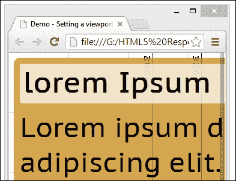

留意的人会发现显然有问题。我们的屏幕没有正确调整大小，文本被切掉了窗口的右边缘。现在让我们使用以下步骤来修复它：

1.  在`viewport-css.html`中，按照指示添加以下行：

    ```js
      <title>Demo - Setting a viewport using CSS</title>
     <meta name="viewport" content="width=360">
      <link href="css/viewport-css.css" rel="stylesheet">
    ```

1.  重新保存文件，然后在 Chrome 中刷新屏幕。如果一切顺利，我们现在可以看到我们的更改结果，文本大小正确，没有重叠：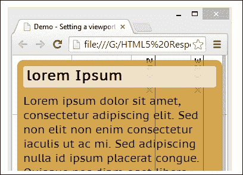

在这个例子中，我们使用了`<meta name="viewport" content="width=360">`，这设置了一个非常具体的宽度为 360 像素。对于没有使用特定宽度的更通用设置`<meta name="viewport" content="width=device-width, initial-scale=1">`可以设置代替。

当使用媒体查询时，我们总可以为查询内的元素设置大小。设置视口大小也很值得，这样在调整浏览器窗口大小时，项目就不会从页面上消失。

### 注意

对于使用视口`meta`标签的深入讨论，值得查看 Paul Underwood 的一篇文章，该文章可在[`www.paulund.co.uk/understanding-the-viewport-meta-tag`](http://www.paulund.co.uk/understanding-the-viewport-meta-tag)找到。

## 使用 JavaScript 获取视口

使用 CSS `<meta viewport>`标签的替代方法是使用 JavaScript（或者我们也可以同样使用 jQuery）。在这种情况下，我们可以计算出这些值，并以此为基础进行设计，而不是像上一个例子中那样简单地设置特定的大小。

让我们深入探讨，看看我们如何获取这些大小：

1.  我们将首先将以下标记添加到一个新文件中，将其保存为项目文件夹根目录下的`viewport-js.html`：

    ```js
    <!DOCTYPE html>
    <html>
    <head>
      <meta charset="utf-8" />
      <title>Demo - What's my Viewport Size?</title>
      <meta name="viewport" content="width=device-width, initial-scale=1, minimum-scale=1, maximum-scale=1" />
      <link rel="stylesheet" href="css/viewport-js.css">
    </head>
    <body>
      <div id="c">
      <p>Your viewport size:</p>
      <p id="ua"></p>
      </div>
      <div id="vp"><span id="w"></span><span id="h"></span></div>
      <script src="img/viewport-js.js"></script>
    </body>
    </html>
    ```

1.  接下来，将以下 JavaScript 添加到一个新文件中，并将其保存为项目文件夹中`js`子文件夹下的`viewport-js.js`：

    ```js
    (function() {
      if (typeof(document.documentElement.clientWidth) != 'undefined') {
        var $w = document.getElementById('w'),
              $h = document.getElementById('h'),
           $ua = document.getElementById('ua');
      $w.innerHTML = document.documentElement.clientWidth;
      $h.innerHTML = ' &times; ' + document.documentElement.clientHeight;
      window.onresize = function(event) {
        $w.innerHTML = document.documentElement.clientWidth;
        $h.innerHTML = ' &times; ' + document.documentElement.clientHeight;
      };
        $ua.innerHTML = navigator.userAgent;
      }
    })();
    ```

1.  我们需要一些基本的样式，所以请继续在`viewport-js.css`文件中添加以下内容，并将其保存到我们项目文件夹中的`css`子文件夹：

    ```js
    html, body { border: 0; margin: 0; padding: 0; font-family: 'Helvetica',courier new; font-weight: bold; }
    #vp { background: #e00; color: #fff; font-size: 3.125em; line-height: normal; padding: 3px; text-align: center; }
    #h { color: #ff8080; }
    #c { font-size: 1.25em; line-height: 1.5em; padding: 0 1em; }
    ```

    ### 小贴士

    **下载示例代码**

    您可以从您在[`www.packtpub.com`](http://www.packtpub.com)的账户中下载您购买的所有 Packt 书籍的示例代码文件。如果您在其他地方购买了这本书，您可以访问[`www.packtpub.com/support`](http://www.packtpub.com/support)并注册以直接将文件通过电子邮件发送给您。

1.  如果我们在浏览器中预览结果，我们会看到当前浏览器使用的用户代理字符串以及可用的视口区域大小，如图所示：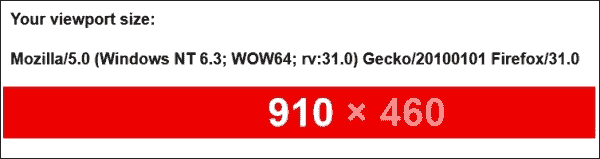

在线有很多很好的例子可以展示我们如何确定可用的视口区域；我们使用了 Matt Stow 在[`viewportsizes.com/`](http://viewportsizes.com/)制作的修改版。在其中，他还列出了各种设备的视口尺寸的详细列表。我们当然可以使用类似 Modernizr 的工具来执行相同的功能，但这是以依赖外部解决方案为代价的；我们这里的示例是用纯 JavaScript 编写的，消除了任何依赖，并使代码简洁。

# 解决媒体查询

现在我们已经确定了我们可以使用的空间大小，我们现在可以确定当达到可用空间的极限时元素会发生什么。如果我们想显示 hi-res 图片，这尤其相关。毕竟，我们不想展示高质量图片，如果它会耗尽我们设备的可用带宽！

让我们看看如何使用媒体查询在单个图片的 lo-res 和 hi-res 版本之间切换：

1.  我们将从设置我们演示所需的结构开始。从本书的代码包中提取`min-resolution.html`的副本，并将其保存到项目文件夹的根目录。

1.  在一个新文件中添加以下样式规则，并将其保存为项目文件夹中`css`子文件夹下的`min-resolution.css`。这里发生魔法，即从 lo-res 版本切换到我们的图片的 hi-res 版本：

    ```js
    #orchid { background-image: url('../img/mothorchid.png'); height: 24.31rem; width: 36.5rem; } 

    @media (min-resolution: 120dpi) { 
      #orchid { background-image: url('../img/mothorchid@2x.png'); 
        height: 24.31rem; width: 36.5rem; } 
    }
    ```

1.  从本书附带的代码下载中提取并保存`mothorchid.png`和`mothorchid@2x.png`的副本到我们项目文件夹的`img`子文件夹。

1.  如果我们预览我们的工作结果，我们首先会看到标准分辨率的图片`mothorchid.png`。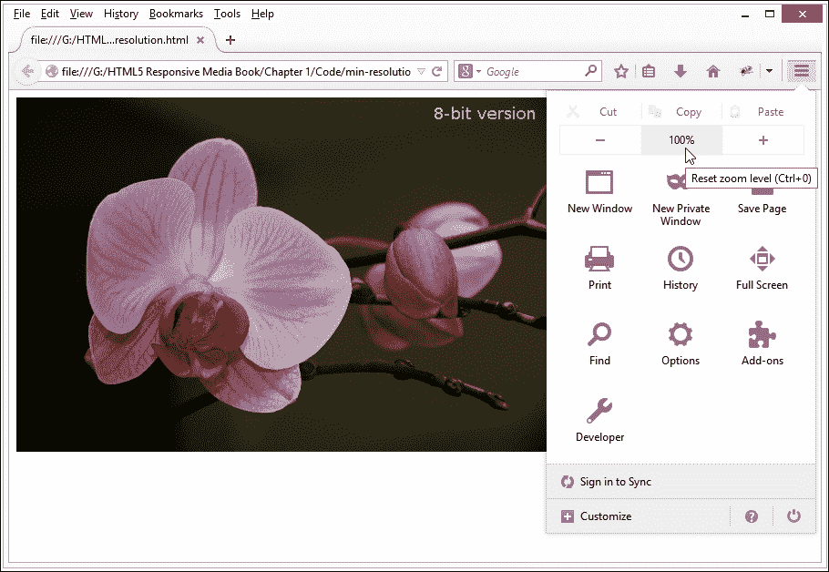

1.  然而，如果我们通过至少放大 133%来调整图片大小，我们会看到它切换到其 hi-res 等价版本。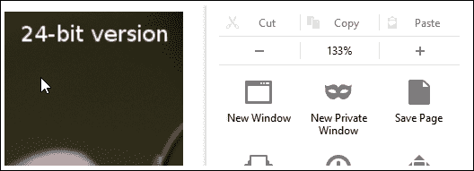

1.  点击**–**按钮将重置回 100%，我们会看到图片恢复到标准分辨率版本。

### 小贴士

**使用 Google Chrome？**

我们可以使用 Chrome 的开发者工具栏实现相同的效果。按 *Ctrl* + *Shift* + *I* 显示它，然后点击抽屉图标。现在，切换到 **屏幕** 选项卡，将设备像素比设置从 `1` 更改为 `2` 以显示高分辨率图像。更多详情请访问 [`developer.chrome.com/devtools/docs/device-mode`](https://developer.chrome.com/devtools/docs/device-mode)。

到目前为止，我们可以使用这个技巧来显示我们需要的任何高分辨率图像；关键是确保我们有两个图像，一个是标准分辨率，另一个是更高品质的。不过，有一个小提醒——如果你花时间研究不同类型的媒体查询，你可能会遇到类似以下代码的内容：

```js
@media (-webkit-min-device-pixel-ratio: 1.25),
(min-resolution: 120dpi){ 
    /* Retina-specific stuff here */
}
```

虽然仍然可以使用，但最初的 `–webkit-min-device-pixel-ratio` 设置已被弃用，取而代之的是 min-resolution；除非你需要为非常旧的浏览器提供支持，否则不需要使用它！

现在，我们可以在所有项目中轻松使用 CSS 查询，但仍然可能存在标准查询无法工作的情况。一个很好的例子是导航在不同尺寸下表现不同。幸运的是，我们有一个解决方案——我们可以使用 `breakpoints.js` 库来实现类似的效果。现在让我们深入探讨并查看一下。

# 使用纯 JavaScript 确定页面断点

到目前为止，我们主要与现代浏览器合作。它们有效地处理媒体查询，允许我们在正确的时间显示正确的图像。如果我们不得不支持老版本的 IE 浏览器，例如，没有某种形式的帮助就无法处理媒体查询，怎么办？没问题——进入 `breakpoints.js`，这是许多 JavaScript/jQuery 库之一，可以帮助我们模拟媒体查询。我感觉有一个练习即将到来，所以让我们开始构建一个示例来看看它是如何工作的：

1.  我们将开始设置演示的标记。这包含了一些简单的文本框，设置为在组中显示。为此，我们需要从本书附带的代码下载中提取 `breakpoints.html` 和 `breakpoints.css` 的副本。将它们都保存到项目文件夹中：HTML 文件在根目录下，CSS 文件在 `css` 子文件夹中。

1.  我们需要一个 jQuery 2.x 的副本——从之前演示的项目文件夹中应该已经有了；如果没有，可以从本书附带的代码下载中提取一个副本，或者从 [`code.jquery.com`](http://code.jquery.com) 提取。

    ### 注意

    虽然 `breakpoints.js` 已经有几年历史了，但我已经用 jQuery 2.1.1 测试过，没有发现任何明显的问题。

1.  接下来是至关重要的 `breakpoints.js` 库。请从本书附带的代码下载中提取一个副本，并将其保存到项目文件夹的 `js` 子文件夹中。新版本将在 [`xoxco.com/projects/code/breakpoints/`](http://xoxco.com/projects/code/breakpoints/) 上提供。

1.  我们需要添加初始化断点的调用，所以请继续在空 `<script>` 标签之间添加以下代码：

    ```js
      $(function () {
        $.breakpoints({
          '.article': {
            'small': [0, 320],
            'medium': [320, 480],
            'large': [480, null]
          }
        });
      });
    ```

1.  保存你的工作。如果一切顺利，我们应该在浏览器会话中预览到这三个框：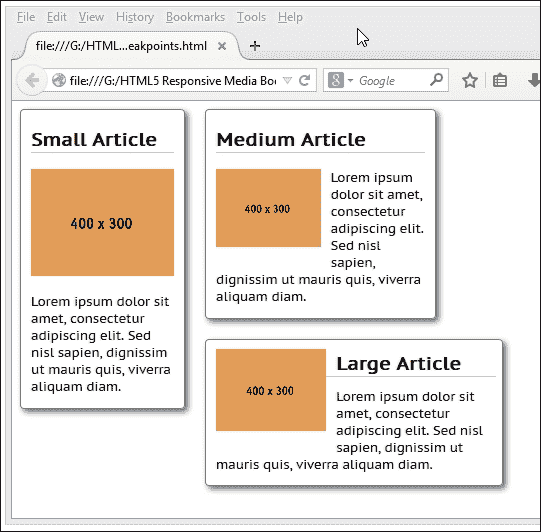

在这一点上，尝试调整浏览器窗口的大小。注意每个文本框是如何调整大小的。我们正在使用 Placehold.it 服务的图像占位符[`placehold.it/`](http://placehold.it/)；这些占位符会自动以相同的方式调整大小。

### 注意

本书代码下载中有一个此练习的工作示例——提取 `breakpoints-finished.html` 和 `breakpoints-finished.css`，以及 jQuery 和 `breakpoints.js`，然后将 HTML 和 CSS 文件重命名为 `breakpoints.html` 和 `breakpoints.css` 以查看演示。您需要将它们存储在项目文件夹的适当子文件夹中，以便它们能够正确工作。

但是等等！仔细查看 CSS，你会发现没有媒体查询。这就是 `breakpoints.js` 的美妙之处；它允许我们为那些原生不支持媒体查询的浏览器复制媒体查询。当然，这会带来一点额外的开销；我们可以使用条件注释（或 Modernizr）来解决这个问题，这样开销只会在需要时出现。

### 小贴士

网上还有其他示例可供选择。请查看[`www.responsivejs.com`](http://www.responsivejs.com)或通过 GitHub 搜索以找到替代方案。

让我们继续前进，看看切换图像的不同方法；到目前为止，我们已经使用了媒体查询来处理应该显示哪个图像。然而，我们并不局限于使用它们。我们可以使用源代码混洗的替代方法。

源代码混洗同时使用了 jQuery 和 CSS —— 如果禁用了 JavaScript，那么 CSS 媒体查询将启动并执行类似的功能。让我们通过一个示例来了解它是如何工作的，以及为什么这可能会为我们提供两种解决方案的最佳结合。

# 使用数据标签允许带宽限制

这个练习的标题听起来很复杂，但它旨在强调一个有趣的实验：“如果我们能够使用数据标签来切换图像呢？”

源代码混洗的直接好处是它将 CSS 媒体查询从 HTML 标记中分离出来（要了解我的意思，请查看下一节中 *使用 <picture> 标签* 所使用的 HTML 代码。）

这是一个有趣的概念，你可能希望考虑使用；为了了解它是如何工作的，我们将使用 UX 设计师 Jordan Moore 创建的一个示例的修改版。这个示例使用了 Jeremy Keith 的基于 JavaScript 的条件 CSS 库，效果显著。为了说明我的意思，让我们开始一个演示来看看它是如何工作的：

1.  我们的演示之旅从设置所需的标记开始。在一个新文件中，添加以下内容并将其保存为项目区域的根目录下的 `datatags.html`：

    ```js
    <!DOCTYPE html>
    <html>
      <head>
        <title>Responsive Images using data- tags - Demo</title>
        <meta charset="utf-8" />
        <meta name="viewport" content="width=device-width,initial-scale=1">
      <link rel="stylesheet" href="css/datatags.css">
      <script src="img/jquery.min.js"></script>
      <script src="img/onmediaquery.min.js"></script>
      <script src="img/datatags.js"></script>
      </head>
      <body>
        
      </body>
    </html>
    ```

1.  我们现在需要一些配套的文件。从代码包中提取 `small.jpg`、`medium.jpg` 和 `large.jpg` 并将它们保存到项目文件夹的 `img` 子文件夹中。

1.  接下来是三个我们需要用到的 JavaScript 文件：`jquery.min.js`、`onmediaquery.min.js`和`datatags.js`应从代码下载中提取，并保存到我们的项目区域的`js`子文件夹中。

1.  最后，我们需要一些样式。在一个新文件中，添加以下内容，并将其保存为`css`子文件夹中的`datatags.css`：

    ```js
    img { max-width: 100%; }
    body:after { content: "global"; display: none; }

    @media screen and (min-width: 35em) {
      body:after { content: "tablet"; display: none; }
    }

    @media screen and (min-width: 56em) {
      body:after { content: "desktop"; display: none; }
    }
    ```

1.  我们已经准备好了。如果一切顺利，我们应该首先看到我们的小图像，紧接着是任意一个大图像，这取决于浏览器窗口的大小。

在这个演示中需要注意的关键是，我们只能在视口已经较小的移动设备上看到`small.jpg`图像。在更大的设备和桌面电脑上，将根据有效的媒体查询显示`medium.jpg`或`large.jpg`图像。

# 与<picture>标签一起工作

在响应式设计中工作的时候，我们经常需要提供不同的图像，并使用一系列媒体查询在适当的时候显示正确的图像。这没问题，但有点费时费力。相反，我们可以使用即将推出的`<picture>`标签来产生更整洁的效果。

### 注意

对`<picture>`标签的支持仍然相对较新；我们必须使用 polyfill 来为某些浏览器提供对标签的支持。更多详情，值得查看 CanIUse.com 网站[`caniuse.com/#feat=picture`](http://caniuse.com/#feat=picture)。

让我们深入探讨，看看我们如何使用以下步骤来使用这个标签：

1.  我们将像往常一样，从本书附带的代码下载中提取`picturefill.html`、`picturefill.css`和`picturefill.js`文件的副本；将这些文件分别保存到我们的项目区域的根目录、`css`和`js`子文件夹中。

1.  在代码下载中，我们还需要三个图像：`small.jpg`、`medium.jpg`和`large.jpg`；这些图像也需要放入`img`子文件夹中。

现在，我们已经设置了我们的演示。接下来，尝试调整浏览器窗口的大小，注意这两张图像如何改变，尽管它们在不同的响应点。这个问题的关键是使用 Scott Jehl 创建的`picturefill.js` polyfill。这旨在复制`<picture>`的功能，直到浏览器原生支持它，我们才能移除回退。

该库通过以下脚本块调用——使用`document.createElement`创建一个虚拟的`picture`回退元素，因为在这个阶段它还不存在：

```js
  <script>
    document.createElement( "picture" );
  </script>
  <script async="true" src="img/picturefill.js"></script>
```

我们随后提供以下回退代码：

```js
  <p>Here's how that renders in the browser. Feel free to resize to see it change.</p>
  
```

这随后是原生的<picture>元素，它将在每个浏览器的下一个几个版本中得到 Firefox、Opera 和 Chrome 的支持：

```js
  <picture>
    <source srcset="img/large.jpg" media="(min-width: 768px)">
    <source srcset="img/medium.jpg" media="(min-width: 480px)">
    
  </picture>
```

值得了解`<picture>`元素。虽然这意味着我们必须将 CSS 媒体查询内联，但它会产生更干净的结果，因为我们不需要在单独的样式表中使用单独的媒体查询。

### 注意

与使用普通的 PNG 或 JPG 图像相比，您可能更喜欢使用 WebP 图像。它们在技术上相似，但提供了更好的压缩率。您可能需要为 GIMP 等应用程序添加额外的支持才能使用它们（访问 [`registry.gimp.org/node/25874`](http://registry.gimp.org/node/25874)）。

## 在我们的代码中维护 `<picture>` 标签

一个小小的警告：`<picture>` 标签仍然非常新，所以在它最终确定之前，预计会有一些整体设计上的变化。它可能会提出一些重要的问题，关于是否使用它适合您的需求以及如何在您的代码中维护它；例如，您是否愿意使用它，但接受并非每个浏览器可能都支持它？您的需求是否如此，以至于您现在还不能使用它，但可以接受使用 polyfill 作为临时措施？

如果您确实决定使用它，那么在实施过程中需要仔细规划。幸运的是，Scott Jehl 的实现（如本章所述），接近 `<picture>` 的预期最终版本；这应该会使转换相对容易。

### 注意

为了获得关于 `<picture>` 标签及其在响应式图片中使用状态的最新情况（有意为之！），值得查看响应式图片社区小组的网站：[`responsiveimages.org/`](http://responsiveimages.org/)。

在最后一个练习中，我们提到了一些不同的格式，以及类似于 WebP 的更好替代品；当进行响应式工作时，我们可以通过使用 SVG 来做得更好。如何？让我通过查看它如何用于改进可伸缩性来揭示一切。

# 使用 SVG 图像格式以实现可伸缩性

如果您在响应式媒体方面投入过任何时间，毫无疑问您会发现某些图像格式无法很好地缩放。为了解决这个问题，可能需要提供我们图像的几个不同版本，并设置代码在适当的点选择正确的版本。

我们真的想一直这样做吗？我 somehow 不这么认为。制作所有这些不同版本真的很痛苦！如果我们切换到基于矢量的 SVG 格式，就可以以不损失质量的方式平滑缩放，这将是一个更好的方法来实现相同的结果。让我们通过一个例子来深入了解它是如何工作的：

1.  我们将从准备我们将用于此演示目的的图像开始。我们将使用来自 XOO.me 网站的深色现代 LCD 显示 SVG 图像，网址为 [`xoo.me/template/details/12636-dark-modern-lcd-display-vector`](http://xoo.me/template/details/12636-dark-modern-lcd-display-vector)。如果您想使用替代品，请相应地更改代码；我们需要同一图像的 PNG 和 SVG 版本。

1.  将以下代码添加到新文件中，并将其保存为 `svgfallback.html`，位于我们的项目文件夹根目录下：

    ```js
    <!DOCTYPE html>
    <html>
    <head>
      <meta charset="utf-8">
      <link rel="stylesheet" href="css/svgfallback.css">
    </head>
    <body>
      This is an image displayed using SVG, with PNG fallback:
      <br>
      <div id="lcd"></div>
    </body>
    </html>
    ```

1.  接下来，将以下 CSS 样式添加到新文件中，并将其保存为 `svgfallback.css`，位于我们的项目文件夹 `css` 子文件夹中：

    ```js
    #lcd { background: url('../img/lcd.png');
      background-image: url('../img/lcd.svg'), none;
      width: 576px; height: 383px; background-repeat: no-repeat; }
    ```

1.  让我们看看在大多数浏览器中预览结果时会发生什么；它将显示我们液晶显示器的 SVG 图像。让我们首先在 DOM 检查器中查看我们页面的源代码，在那里我们可以看到 PNG 和 SVG 都勾选了，如截图所示；后者优先：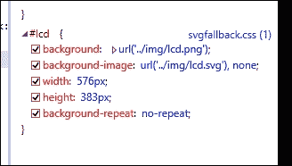

1.  为了证明它有效，以下是在所有荣耀中的 SVG 图像：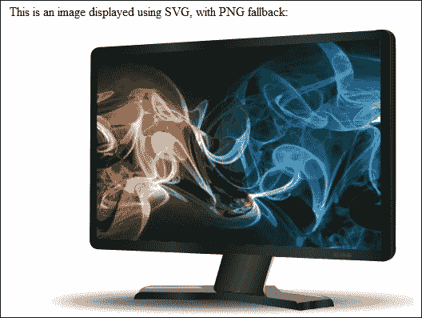

1.  要强制我们的演示显示 PNG 回退，我们需要模拟一个不支持 SVG 图像的原生浏览器；IE8 是这一点的完美候选人。我建议使用 IE 的较新版本，例如 9 或 10。我们可以使用其模拟模式来强制它在 IE8 模式下显示，因此选择 PNG 图像：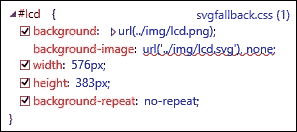

使用 SVG 的美丽之处在于，我们实际上可以使用文本编辑器编辑图像的内容；毕竟，SVG 图像只是普通的 XML 文件！SVG 图像有几个优点：

+   文件大小小，压缩效果好

+   它们可以缩放到任何大小而不会失去清晰度（除了非常小）

+   在视网膜显示屏上看起来很棒

+   它们设计控制，如交互性和过滤器

使用标准图像，如 PNG 或 JPG，将有效，但它们不会在其原生分辨率之外正确调整大小；相反，我们可能需要同一图像的几个版本才能正确查看它们。花时间了解 SVG 格式是值得的。有一篇有用的文章由 Nick Salloum 撰写，可在[`callmenick.com/2014/04/02/svg-fallback-with-png/`](http://callmenick.com/2014/04/02/svg-fallback-with-png/)找到，它赞扬了我们可以用来为 SVG 图像提供回退的不同机制。

如果你真的想深入了解编辑 SVG 图像，看看[`css-tricks.com/using-svg/`](http://css-tricks.com/using-svg/)。这是 Chris Coyier 写的一篇很好的文章，展示了我们如何编辑内容以真正改变其外观。

# 使用图像图标进行可扩展性

当我们创建响应式内容时遇到的一个主要问题是使用图标：它们的位图格式在调整大小时扩展性不好。这通常也适用于图标精灵；例如，如果你调整本章早期演示的电池图标大小，那么你很快就会注意到当抗锯齿启动时它变得多么像素化！

为了解决这个问题，设计师可能只是简单地放弃使用图标；另一种选择是用基于矢量的网络字体替换它们，例如在[`fortawesome.github.io/Font-Awesome/`](http://fortawesome.github.io/Font-Awesome/)可用的 Font Awesome 图标。在线有一篇由 Jason Cranford Teague 撰写的优秀文章[`webstandardssherpa.com/reviews/responsive-webfont-icons`](http://webstandardssherpa.com/reviews/responsive-webfont-icons)，赞扬了它们在可扩展性无失真的主要优点。

要看到它们在实际中的工作情况，我们将使用来自 Entypo 的一些社交媒体图标，由 Daniel Bruce 创建，可在[`www.entypo.com`](http://www.entypo.com)找到。在这个教程中，我们将使用 Teague 创建的一个简化示例版本，它使用了许多图标。您可以在[`webstandardssherpa.com/reviews/responsive-webfont-icons`](http://webstandardssherpa.com/reviews/responsive-webfont-icons)上看到原始文章。

为这个教程执行以下步骤：

1.  让我们先从这本书附带的代码下载中提取`webicons.html`和`webicons.css`的副本。我们不会从头开始构建（尤其是因为它使用了大量的 CSS），而是要看看一些关键概念。将`webicons.css`文件存储在我们的项目文件夹的`css`子文件夹中，而`webicons.html`文件应存储在根目录。

1.  如果我们在浏览器窗口中预览该文件，我们将看到一系列图标显示；截图显示了在 Firefox 中调整到 67%大小的它们：

1.  尝试放大和缩小。注意图标的大小是如何增加和减少，同时没有明显的质量损失吗？我们使用了网络字体，而不是标准图像；这个原则在我们的例子中用于简单的图标，如标志，效果非常好。这个问题的关键在于使用`rem`尺寸或根`em`尺寸。这个尺寸将每个字符的大小设置为 HTML 元素的字体大小，而不是父元素，这是`em`所使用的。

    ### 提示

    Jonathan Snook 有一篇有用的文章解释了`rem`和`em`是如何工作的，可在[`snook.ca/archives/html_and_css/font-size-with-rem`](http://snook.ca/archives/html_and_css/font-size-with-rem)找到。

1.  注意每个图标所设置的格式？这是字体的**Unicode 私有用途**区域；我们不是使用字体中的`t`（代表 Twitter 图标），而是可以使用这个私有用途区域。它达到了相同的效果。唯一的区别在于，当使用私有区域时，字母`t`不会显示。

    ### 注意

    关于 Unicode 私有用途区域的更多信息，请查看维基百科上的文章[`en.wikipedia.org/wiki/Private_Use_Areas`](http://en.wikipedia.org/wiki/Private_Use_Areas)。

让我们继续，看看一些响应式设计的实际应用示例，首先是*构建一个响应式轮播图*。

# 构建一个响应式轮播图

到目前为止，我们已经介绍了很多不同的技术，帮助我们生成响应式内容。大多数都是在开发环境中的简单示例。现在是时候看看一些实际应用中的示例，其中响应式功能得到了很好的利用。我们的第一个例子是一个响应式轮播图。网上有数十个示例库可以用来创建一个，所以没有必要从头开始构建！

让我们看看我最喜欢的之一——`ResponsiveSlides.js`；这是一个简单的库，提供了一个有用的解决方案，但并不试图做到一切。我们将借鉴他们的一个示例来看看它是如何工作的。

1.  和往常一样，我们需要从某个地方开始。让我们先从下载`ResponsiveSlides`库开始，网址是[`responsiveslides.com/`](http://responsiveslides.com/)；写作时的当前版本是 1.5.4。将其保存到我们项目文件夹的`js`子文件夹中。

1.  我们还需要`ResponsiveSlides`的样式文件以及 jQuery 库的副本。从代码下载中提取`carousel.css`的副本，并将其保存到我们项目文件夹的`css`子文件夹中；然后以相同的方式在`js`子文件夹中对 jQuery 进行操作。

    ### 注意

    `ResponsiveSlides`包附带 jQuery 1.8.3；我已经用 jQuery 2.1.1 的版本测试过，没有出现明显的不良影响。

1.  接下来，从本书附带的代码下载中提取`carousel.html`的副本；在`responsiveslides.js`库链接下面的空`<script>`标签之间添加以下代码：

    ```js
    <script>
      $(function () {
        $("#slides1").responsiveSlides({ auto: false, pagination: true, nav: true, fade: 500, maxwidth: 800
        });
      });
    <script>
    ```

1.  保存文件。如果我们在一个浏览器中预览结果，我们会看到我们的轮播图出现。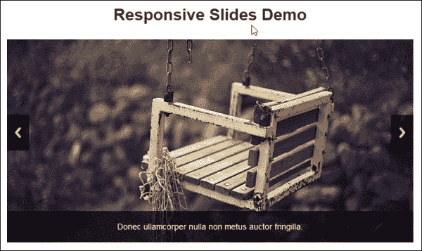

1.  现在尝试调整浏览器窗口的大小。我们应该看到轮播图的大小减小，但继续滚动图片时不会损失质量。

在线有很多响应式轮播图的例子——两个这样的例子是 WOW Slider 在[`wowslider.com/`](http://wowslider.com/)，以及[`www.wowslider.com/responsive-image-gallery-glass-collage.html`](http://www.wowslider.com/responsive-image-gallery-glass-collage.html)上的一个可能实现示例，Owl Carousel ([`www.owlgraphic.com/owlcarousel`](http://www.owlgraphic.com/owlcarousel)) 和 BXSlider，可在[`bxslider.com/`](http://bxslider.com/)找到。这完全取决于尝试选择一个并选择一个符合你需求的。

### 注意

本书附带的代码下载中有一个预构建的工作示例。提取`carousel-finished.html`和`carousel-finished.css`的副本，然后将它们重命名为`carousel.html`和`carousel.css`。你需要提取本练习中概述的配套库，以便它能够正确运行。

# 使用 Google Maps 创建响应式地图

在我们的两个真实世界示例中的第二个，我们将探讨如何使用 Google Maps 制作响应式地图。响应式地图，你可能会问？这应该自动完成，对吧？嗯，不是的，这使它在移动设备上的使用有些尴尬。幸运的是，我们可以轻松解决这个问题；它的好处是，它只需要一点额外的 CSS：

1.  让我们从浏览到[`maps.google.com`](http://maps.google.com)开始，然后输入我们选择的位置的邮政编码。在这个例子中，我将使用 Packt Publishing 的英国办公室，邮编为 B3 2PB。

1.  点击齿轮图标，然后选择**共享和嵌入地图**：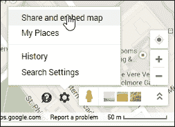

1.  在出现的对话框中，切换到**嵌入地图**选项卡，然后复制以`<iframe src=…`开头的文本字段内容。

1.  在随本书附带的代码下载副本中，使用您最喜欢的文本编辑器提取`googlemaps.html`的副本，并在`google-maps div`标签之间添加`<iframe>`代码。

1.  接下来，将以下 CSS 样式添加到新文件中，并将其保存为`googlemaps.css`：

    ```js
    #container { margin: 0 auto; padding: 5px; max-width: 40rem; }
    .google-maps { position: relative; padding-bottom: 60%; height: 0; overflow: hidden; }
    .google-maps iframe { position: absolute; top: 0; left: 0; width: 100% !important; height: 100% !important; }   
    ```

如果一切顺利，我们将看到带有我们办公室标记的伯明翰的谷歌地图图像：

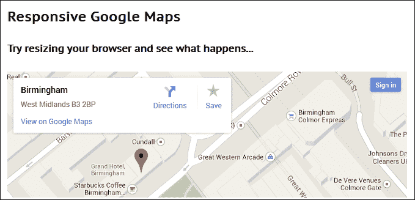

在这一点上，尝试调整浏览器窗口的大小。您将看到地图会自动调整大小；我们添加的 CSS 样式已覆盖了谷歌地图中使用的标准样式，使我们的地图能够适应任何我们想要使用的设备。

# 摘要

哇！在过去的几页中，我们确实覆盖了很多内容！让我们花点时间回顾一下，让所学的内容深入人心。

我们从创建基本流体图像开始，这是响应式设计的关键，应该成为任何响应式设计网站的基础。然后我们讨论了一些关键点，包括使用哪些图像格式，以及我们是否需要在代码中使用任何供应商前缀。接下来是关于如何为移动设备提供一些有用的技巧的讨论。我们看到许多都是常识，但特别适用于为移动设备设计。

我们的第一个编码示例是查看如何满足高清或视网膜图像的需求；然后我们转向检查我们如何也可以使用精灵为我们的项目添加响应式媒体。然后我们转向使用 jQuery 和 CSS 来调整可用视口空间的大小；然后我们可以使用这些来决定我们的媒体查询应该是什么样子。我们还介绍了如何使用 JavaScript 来定义媒体查询，以防我们需要在我们的网站上提供回退支持。

接下来，我们介绍了如何响应式地切换图像的几个示例——第一个使用数据标签，第二个使用即将推出的`<picture>`标签。我们还查看了一个技巧，我们可以同时提供两张图片，但依赖于浏览器选择它能够支持的图片。我们通过查看如何使用网络图标来提供响应式内容并保持高质量缩放来完成对图像的探讨。然后我们通过查看两个实际案例来结束本章，这些案例是构建响应式轮播图和创建响应式地图。

在下一章中，我们将探讨媒体内容的另一个主要元素，以及如何将视频响应式地添加到我们的网站上。
