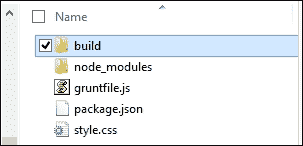
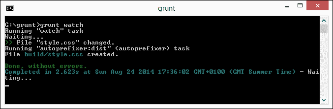

# 第二章：添加响应式视频内容

在互联网的历史上，自从它的早期，设计师和开发者就能够向网站添加图片——这些图片非常适合说明观点或概念，但它们在某个时间点是静态的记录。越来越多的开发者转向视频的力量来帮助说明某些内容：主题多种多样，从新闻到烹饪，甚至是一步一步的编码教程！随着移动媒体的出现，对响应式内容的需求不断增加——我们需要确保我们的内容可以在更多和更多的设备上无问题地查看。

在本章中，我们将探讨一些使我们的内容响应式所需的观念，同时也会介绍一些技巧和窍门，以便我们的内容能在多个平台上可用。在本章中，我们将涵盖以下主题：

+   确定对 `<video>` 格式的支持并选择正确的格式

+   嵌入 HTML5 视频内容

+   确定可用的视口

+   适应回退支持和应用供应商修复

+   使用 JavaScript 库提供支持

+   适应不同平台并显示全尺寸视频

好奇吗？让我们开始吧！

我们将从选择 HTML5 视频的正确格式的基础知识开始，但在开始之前，我们需要介绍一些简单的管理任务，这些任务将有助于我们整章的学习。

# 准备工作

为了本章的练习目的，我们将在整个章节中使用类似的标记；值得将以下代码保存为模板文件，以帮助您完成每个练习：

```js
<!DOCTYPE html>
<html>
<head>
  <meta charset="utf-8"/>
  <title>XXXXXXXXXX</title>
  <meta name="viewport" content="width=device-width, minimum-scale=1.0, maximum-scale=1.0" />
  <link href="css/XXXXXXXX.css" rel="stylesheet">
</head>
<body>
</body>
</html>
```

现在我们已经准备好了基础，让我们开始我们的旅程，学习如何使用响应式视频，首先看看可用的格式。

我们还将使用来自 Blender Foundation 的 Big Buck Bunny 项目的各种视频，具体为 852 x 480 和 1280 x 720 格式；您可以从[`www.bigbuckbunny.org/index.php/download/`](http://www.bigbuckbunny.org/index.php/download/)下载这些视频。

### 注意

本项目中使用的视频版权©2008，Blender Foundation，可在[www.bigbuckbunny.org](http://www.bigbuckbunny.org)找到。

还建议您为本章内容创建一个项目文件夹；我称之为 `code`。在里面，您需要创建两个文件夹：`css` 和 `js`。我们将在整章中引用这两个文件夹。

# 确定对 <video> 格式的支持

在我们创建响应式视频内容的旅程中，第一步是确定我们将使用哪种视频格式。浏览器中可用几种视频格式，但值得注意的两个是 WebM 和 MP4。前者仅由 Firefox、Chrome 和 Opera 支持；后者由所有主要桌面浏览器支持，除了 IE8 和 Opera。为了创建响应式内容，我们仍然需要与两者一起工作，因为移动平台尚未决定一个共同的标准：

| **浏览器** | Firefox | Chrome | Safari | IE (9+) | Opera | iOS | Android |
| --- | --- | --- | --- | --- | --- | --- | --- |
| **支持的格式** | MP4 | MP4 | MP4 | MP4 | WebM | MP4, WebM | MP4, WebM |

此表也可参考[`www.jwplayer.com/html5/`](http://www.jwplayer.com/html5/)（在 Jeroen Wijering 撰写的“HTML5 视频状态”文章中）。

由于 HTML5 视频标准仍处于某种程度的变动之中，值得查看 CanIUse.com 网站，以了解[`caniuse.com/#search=video`](http://caniuse.com/#search=video)上的最新进展。

### 注意

你可能会遇到关于 OGG 格式的引用，作为 HTML5 `<video>`标准；虽然这会工作得很好，但由于专利问题，该格式在 2007 年被从 HTML5 标准中移除。它不像其他格式那样得到广泛支持。

现在我们已经了解了视频格式，让我们来看看如何将我们的视频内容转换为正确的格式，以便使用。

# 选择正确的格式

到目前为止，我们已经了解到，要使用 HTML5 `<video>`标签，我们需要使用 WebM 或 MP4 格式（或者理想情况下两者都要，以确保覆盖）。可能你现有的内容不是这种格式；如果是这种情况，让我们看看我们如何将其转换。

有数十种应用程序可供下载，用于将一种格式转换为另一种格式——我个人的最爱是 Windows 上的 XMedia Recode，可在[`www.xmedia-recode.de`](http://www.xmedia-recode.de)找到。这允许转换到和从众多不同的格式，包括 WebM 和 MP4。让我们通过以下步骤看看它是如何工作的：

1.  我们首先从[`www.xmedia-recode.de/en/download.html`](http://www.xmedia-recode.de/en/download.html)下载 XMedia Recode 的副本；在撰写本文时，最新版本是 3.1.9.4。

1.  双击安装可执行文件以启动安装并接受向导中的所有默认设置。

    到目前为止，XMedia Recode 已经安装；我们现在需要运行转换过程。可以真正深入配置转换过程——目前，我们将坚持基本的转换，这对我们的需求来说是足够的。

1.  在 XMedia Recode 应用程序中，点击**打开文件**，然后选择您的视频并点击**打开**。

1.  等待 XMedia Recode 分析视频，然后从**输出格式**框中选择所需的格式。

1.  在窗口底部，我们需要选择我们的目标文件夹，所以请选择您存储视频内容的相同文件夹。

我们即将开始转换；要这样做，我们需要点击**添加到队列**然后点击**编码**以开始过程，如以下截图所示：


XMedia Recode 将在转换过程完成后提示。我们可以选择转换另一个视频或在此处关闭应用程序。对于我们使用 Apple Mac 或 Linux 的用户，有几种替代方案可用；它们执行与 XMedia Recode 类似的过程。几个值得考虑的选项是跨平台应用程序 Handbrake([`www.handbrake.fr`](http://www.handbrake.fr)——用于 MP4 转换)，以及可在[`www.firefogg.org`](http://www.firefogg.org)找到的基于浏览器的 Firefogg 小程序。尽管后者旨在转换为 OGG 格式，但它也可以将视频转换为 WebM 格式。

### 注意

关于 WebM 格式的更多信息，或者如果您在为 PC 配置它时遇到任何困难，请查看项目文档[`www.webmproject.org/tools`](http://www.webmproject.org/tools)。

我们现在有了准备好的视频，接下来是什么？啊，是的——让我们看看如何将它们嵌入到页面中，这样我们就可以看到如何使它们具有响应性。我们将使用 Big Buck Bunny 项目的转换视频作为我们的源媒体；如果您想尝试更小的视频，可以在[`techslides.com/sample-webm-ogg-and-mp4-video-files-for-html5/`](http://techslides.com/sample-webm-ogg-and-mp4-video-files-for-html5/)找到样本视频，它们同样适用。

# 嵌入 HTML5 视频内容

与所有项目一样，我们需要从某个地方开始——我们可以在视频上双击，让它在我们安装的任何支持该格式的应用程序中播放。然而，这并不是我们在这里要做的事情；我们想在浏览器中查看内容，并设置它自动调整大小！

以下步骤将向您展示如何使用我从开源 Big Bunny 项目[`www.bigbuckbunny.org`](http://www.bigbuckbunny.org)转换的视频来实现这一点：

1.  让我们先打开本书中之前创建的模板文件的副本，然后修改我们的演示中的`<title>`标签，如下代码片段所示：

    ```js
    <title>Demo: Controlling Video sizes using media queries</title>
    ```

1.  在我们的代码的`<body>`标签中，添加以下行；这些行引用了我们可以使用的不同视频格式，具体取决于我们正在使用的浏览器：

    ```js
      <video controls>
        <source src="img/bigbuckbunny.mp4" type="video/mp4">
        <source src="img/bigbuckbunny.webm" type="video/webm">
      </video>
    ```

    将结果保存为`basic.html`。在此阶段，如果我们想在浏览器中预览结果，我们可以清楚地看到我们有一个问题！视频没有调整大小，导致只有部分显示：

    

1.  幸运的是，这很容易修复；如果您预期会有很多复杂的 CSS 代码，那么不用担心；解决方案比您想象的要简单！将以下内容添加到新文件中，并将其保存为`basic.css`：

    ```js
    video {
        max-width: 100%;
        width: 100% !important;
        /* just in case, to force correct aspect ratio */
        height: auto !important;
    }
    ```

1.  在`basic.html`中，按照以下方式修改 CSS 样式表链接：

    ```js
    <link href="css/basic.css" rel="stylesheet"></head>
    ```

    如果我们刷新浏览器，现在我们可以看到内容是响应式的，当我们减小浏览器窗口大小时会自动调整大小：

    

现在，我们的初始内容已经设置并运行，我们需要考虑一个重要的问题——如果我们是为小视口设计，我们应该显示视频还是隐藏它？例如，在手机等较小设备上？所有这些问题都是很好的问题。让我们看看我们如何确定可用的视口大小，以便我们可以决定在设计中包含什么或不包含什么。

### 小贴士

如果你发现视频播放不正确，那么你可能需要在项目文件夹的根目录下创建一个`.htaccess`文件，然后在那个文件中添加以下代码行：

```js
AddType video/mp4 mp4
AddType video/ogg ogv
AddType video/webm webm
```

# 确定可用的视口以使用

如果你花过时间开发响应式布局的内容，你无疑会遇到媒体查询。同样的，这也适用于视频；你通常可以看到类似以下（简化）的示例：

```js
<video controls>
  <source src="img/the-sky-is-calling-large.mp4" media="screen and (min-width:800px)">
  <source src="img/the-sky-is-calling-small.mp4" media="screen and (max-width:799px)">
</video>
```

不幸的是，大多数浏览器已经取消了媒体查询的支持。这主要是因为当屏幕调整大小时，视频突然中断给用户带来的糟糕体验。幸运的是，我们可以产生类似的效果，尽管我们需要求助于 JavaScript 或 jQuery 来实现这一点。在下一个示例中，我们将展示如果屏幕调整到小窗口，将显示一个小视频；如果全屏显示，则隐藏它。让我们看看我们如何实现这一点：

1.  我们首先从本书附带的代码下载中提取`viewport.html`的副本，以及`video`、`js`和`css`文件夹。

1.  接下来是这个演示背后的真正魔法。在`js`文件夹中有一个`detect.js`的副本；它根据可用视口的大小控制视频的显示。让我们分部分来看，首先是创建`wi`变量，用于存储当前窗口大小：

    ```js
    $(window).ready(function() {
      var wi = $(window).width();  
    ```

1.  接下来是使用以下代码行渲染窗口的初始大小：

    ```js
      $("p.notification").text('Initial screen width is currently: ' + wi + 'px.');
    ```

1.  真正的魔法接下来发生。在调整大小的函数中，我们获取新的宽度，然后确定我们是否低于`480px`，如果为`true`，则设置视频显示：

    ```js
      $(window).resize(function() {
        var wi = $(window).width();

        var video = $("#video").html();

        if (wi <= 480){
          $("p.notification").text('Screen width is less than or equal to 480px. Width is currently: ' + wi + 'px.');
          if (video == "") {
            $("#video").append('<video controls><source src="img/bigbuckbunny-320px.mp4" type="video/mp4"></video>');
          }
        } 
    ```

1.  如果大小更大，则隐藏视频：

    ```js
          else {
          $("p.notification").text('Screen width is greater than 480px. Width is currently: ' + wi + 'px.');
          $("#video").html("");
        }
      });
    });
    ```

1.  现在，让我们在浏览器中运行这个演示，看看结果。如果我们尝试将浏览器窗口调整到`480px`以下，我们应该看到一个通知出现，以及视频，如下面的截图所示：

1.  尝试将窗口调整到更大的尺寸。注意视频不再显示。

虽然这个演示在本质上有些简单，但它表明我们可以模仿媒体查询的效果。因此，我们可以计算出我们有多少可用空间，并显示一个更大、高质量的视频，或者一个更小的视频。毕竟，我们不想在手机上下载一个巨大的视频，而有一个更小的版本可用！

### 小贴士

**我如何看到调整浏览器窗口大小后的效果？**

我们可以手动调整大小，但更好的解决方案是使用像 Malte Wasserman 创建的调整大小工具，它模拟了一系列大小，可在[`lab.maltewassermann.com/viewport-resizer/`](http://lab.maltewassermann.com/viewport-resizer/)找到。

这个例子确实打开了一些可能性，尽管它应该小心处理，并且任何解决方案在投入生产之前都需要进行全面测试。

# 满足回退支持

到目前为止，我们已经制作了 HTML5 格式的视频内容，并了解了如何在我们的页面上嵌入它。然而，有时我们可能在处理不支持某种视频格式的设备上工作。

虽然 HTML5 视频的支持一直在改善，但我们仍然处于这样一个阶段，即并非每个平台都支持相同的格式。这给我们留下了两个选择。我们可以尝试整合不同的格式，或者我们可以简单地设置内容以优雅地降级。我们已经探讨了提供不同格式的方法，所以让我们改变方向，看看我们如何使用 Modernizr 作为测试的基础来优雅地降级我们的内容。以下步骤将指导我们通过内容降级的过程：

1.  让我们从将以下代码添加到新文件并保存为`modernizr.html`开始：

    ```js
    <!DOCTYPE html>
    <html class="no-js">
    <head>
      <meta charset="utf-8"/>
      <title> Demo: Detecting support with Modernizr</title>
      <meta name="viewport" content="width=device-width, minimum-scale=1.0, maximum-scale=1.0" />
      <link rel="stylesheet" href="css/modernizr.css">
      <script src="img/jquery.js"></script>
      <script src="img/modernizr.min.js"></script>
      <script>
        $(document).ready(function() {
          if(Modernizr.video) {
            $("#html5video").html("");
            var videoHTML = '<video controls><source src="img/bigbuckbunny.mp4" type="video/mp4"><source src="img/bigbuckbunny.webm" type="video/webm"></video>';
            $("#html5video").html(videoHTML);
          }
        });
      </script>
    </head>
    <body>
      <div id="html5video">Sorry, HTML5 video is not enabled on this client</div>
    </body>
    </html>
    ```

1.  接下来，将以下代码添加到新文件中，并将其保存为`modernizr.css`。这将提供一些基本的样式，以防视频测试结果为否定：

    ```js
    video { width: 50%; }
    .no-js #html5video { background-color: #c00; color: #fff; font-weight: bold; font-family: arial, helvetica; font-size: 14px; border: 2px solid black; border-radius: 4px; width: 35%; padding: 10px; }
    ```

1.  我们需要提供一些额外的文件。从伴随本书的代码下载中提取`js`和`video`文件夹；将这些保存到项目文件夹中。

1.  为了测试这一点，我们将使用 Firefox；在浏览器地址栏中输入`about:config`以打开配置设置。

1.  在弹出的安全警告消息中点击**我会小心，我保证**！然后查找**javascript.enabled**并双击将其设置为**false**：

    到目前为止，让我们在浏览器中预览我们的努力结果。如果一切顺利，我们不应该看到我们的视频，而是一个以下警告：

    

1.  返回到第 5 步，但这次双击条目以启用 JavaScript 支持。完成后，刷新预览，我们应该看到我们非常熟悉的 Buck Bunny 视频。

现在，如果我们的视频内容由于某种原因无法转换为 HTML5 格式，会发生什么呢？一个很好的例子可能是内容仅以 YouTube 或 Vimeo 格式提供；版权限制可能阻止我们将其转换。但这不是问题；我们仍然可以使用它。虽然严格来说它不会是 HTML5 格式，但我们可以通过一些额外的工作使其具有响应性。

# 使用 JS 库提供支持

使用 HTML5 `<video>` 元素的一个关键好处是调整大小非常简单；使用这个标签使视频响应式只需要几行 CSS。然而，对于其他格式的视频来说，情况并非如此；我们可能会遇到不得不使用 YouTube 或 Vimeo 等格式的情况，这些格式依赖于使用 `<iframes>` 进行嵌入。

幸运的是，我们可以使这些视频响应式，尽管实现这一点的路径稍微复杂一些。这需要使用像 `FitVids.js` 这样的库，它可以在 [`www.fitvidsjs.com`](http://www.fitvidsjs.com) 找到，并且与 jQuery 一起工作。以下步骤将帮助我们使用 JS 库使视频响应式：

1.  我们首先需要下载 FitVids 库。浏览到 [`github.com/davatron5000/FitVids.js`](https://github.com/davatron5000/FitVids.js)，然后点击右侧的 **下载 ZIP**。从压缩包中提取并保存 `jquery.fitvids.js` 到你的项目文件夹中。

1.  接下来，在之前创建的模板文件的副本中，修改 `<head>` 部分如下所示：

    ```js
    <head>
      <meta charset="utf-8">
     <title>Demo - Using FitVids.js</title>
     <script src="img/jquery.js"></script>
     <script src="img/jquery.fitvids.js"></script>
    </head>
    ```

1.  我们需要在 `<body>` 标签中添加一些额外的标记。所以，请继续在 `<head>` 部分添加以下行：

    ```js
      <div id="main-container">
        <iframe width="560" height="315" frameborder="0" src="img/XSGBVzeBUbk" allowfullscreen> </iframe>
      </div>
      <script>
        $(document).ready(function(){
          $("#main-container").fitVids();
        });
      </script>
    ```

1.  如果我们在浏览器中预览结果并开始调整浏览器窗口大小，视频将自动调整大小：

我们不必非得使用 FitVids，尽管它是一个流行的选择；还有其他一些可以选择，它们的工作方式类似，如下所示：

+   FluidVids，来自 [`toddmotto.com/fluid-and-responsive-youtube-and-vimeo-videos-with-fluidvids-js/`](http://toddmotto.com/fluid-and-responsive-youtube-and-vimeo-videos-with-fluidvids-js/)

+   SimpleVid，可在 [`johnpolacek.github.io/SimpleVid/`](http://johnpolacek.github.io/SimpleVid/) 找到

+   ResponsiveVideo，可在 [`cbavota.bitbucket.org/responsive-video/`](http://cbavota.bitbucket.org/responsive-video/) 找到

作为一种替代方案，如果你只在你网站上处理少量视频，你可以使用在线服务 [EmbedResponsively.com](http://EmbedResponsively.com) 来手动使你的嵌入视频响应式。这是通过在 HTML 中添加一个容器，然后对其进行样式化以允许其响应式调整大小来实现的，这与我们使用 FitVids 库的方式非常相似。

到目前为止，我们已经使用 `<video>` 标签制作了视频内容，并看到了如何在我们的网站上实现响应式布局。然而，我们也需要考虑到在移动平台上提供内容的需求，所以现在让我们看看如何实现这一点。

# 适应不同平台

毫无疑问，响应式设计的一部分是产生能够在移动设备上工作的内容；否则它就不会是响应式的！我们可以花很多时间尝试从头开始开发，但这样做几乎没有意义。其他人已经制作了在桌面电脑上工作的播放器。

通过一点额外的努力，我们可以使播放器变得响应式。幸运的是，来自“地球上最酷的指南”网站的 Neil Gee 已经为我们做了艰苦的工作。让我们看看一个示例播放器，看看他是如何使其变得响应式的；我们将使用 VideoJS 作为我们的演示目的。为此演示，请执行以下步骤：

1.  我们将首先从本书附带的代码下载中提取`player`文件夹，并将其保存到我们的项目文件夹中。它包含一个工作视频播放器示例，已经配置好以供使用。我们将添加必要的更改以使其响应式。

1.  在`player.html`中，修改指向 CSS 样式表的链接，如下所示：

    ```js
    <link rel="stylesheet" href="css/video-js.css">
    <link rel="stylesheet" href="css/video-js-overrides.css">
    <script src="img/video.js"></script>
    ```

1.  接下来，在一个新文件中，添加以下 CSS 样式规则，并将其保存为`video-js-overrides.css`：

    ```js
    .video-js { padding-top: 56.25% }
    .vjs-fullscreen { padding-top: 0px }
    .vjs-default-skin .vjs-big-play-button { left: 40%; top: 45%; width: 10%; }

    // These two media queries resize and reposition the big play button to the center of the screen
    @media only screen and (max-width:599px) {
      .vjs-default-skin .vjs-big-play-button {top: 45%; width: 25%;}
    }

    @media only screen and (min-width:600px) and (max-width:768px) {
      .vjs-default-skin .vjs-big-play-button { top: 40%;
      width: 25%;font-size:5em;}
        }
    ```

1.  如果我们在浏览器中预览结果，我们会看到视频正常播放。为了获得更好的效果，建议使用 Google Chrome。我们可以使用开发者工具栏来模拟不同的设备，如下面的截图所示：

1.  选择**索尼爱立信 Xperia S, Ion**选项，在 Chrome 中会产生以下结果。在下面的截图中，屏幕已经通过更改开发者工具栏“屏幕”选项卡中的**分辨率**选项翻转成横幅模式：

尝试更改选项以模拟不同的设备；你将开始看到，无论设置什么大小，播放器仍然能够正常播放。

### 小贴士

代码下载中有一个完成的示例，作为`player-finished.html`和`player-finished.css`。将这两个文件重命名为`player.html`和`player.css`以查看最终成果。Neil 还对其他视频播放器进行了类似的处理——你可以在[`coolestguidesontheplanet.com/videodrome/videojs/`](http://coolestguidesontheplanet.com/videodrome/videojs/)上查看它们的文章。

# 允许供应商前缀

在编写代码的过程中，你是否注意到一些特别的地方，比如明显不需要供应商前缀？没错，为了制作一个基本的响应式视频解决方案，确实不需要任何前缀，所以现在讨论在我们的代码中允许它们的需求是合理的！

答案不在于提供处理`<video>`或`<iframe>`标签所需的基本样式，而在于我们将视频设置为全屏或背景显示时。前者仍然需要供应商前缀。虽然我们可以手动提供它们，但自动在编译时添加它们被认为是更好的做法。

### 注意

在我们继续之前，这个演示需要安装 Node；可以在 [`nodejs.org/`](http://nodejs.org/) 找到它。请在继续之前为您的平台安装它。

让我们看看如何使用 Grunt 的 Autoprefixer 插件，它与 [`www.caniuse.com`](http://www.caniuse.com) 的服务相结合；Grunt 插件可在 [`github.com/postcss/autoprefixer`](https://github.com/postcss/autoprefixer) 找到。以下步骤将帮助您了解添加前缀的过程：

1.  我们将首先为我们的编译创建一个新的文件夹。在我们的例子中，我将使用 `g:\grunt`；如果您使用其他名称，请相应调整。

1.  在文件夹内，添加一个名为 `build` 的新文件夹，并在其中添加三个新文件，分别是 `gruntfile.js`、`package.json` 和 `style.css`，具体请参考以下截图：

1.  在 `gruntfile.js` 文件中，添加以下代码：

    ```js
    module.exports = function (grunt) {
      grunt.initConfig({
        autoprefixer: {
          dist: {
            files: {'build/style.css': 'style.css'}
          }
        },
        watch: {
          styles: { 
            files: ['style.css'],
            tasks: ['autoprefixer']
          }
        }
      });
      grunt.loadNpmTasks('grunt-autoprefixer');
      grunt.loadNpmTasks('grunt-contrib-watch');
    };
    ```

1.  在 `package.json` 中添加以下代码：

    ```js
    {
      "name":"yourprojectname",
      "version":"0.0.1",
      "devDependencies":{
        "grunt":"*",
        "grunt-contrib-watch":"*",
        "grunt-autoprefixer":"*"
      }
    }
    ```

1.  从 Node 命令提示符中输入并运行以下命令以安装 Autoprefixer 和监视功能：

    ```js
    npm install grunt-cli grunt-contrib-watch grunt-autoprefixer

    ```

1.  Node 会自动安装所有依赖项。完成后，我们可以在提示符下运行以下行以启动 Grunt 监视任何更改：

    ```js
    Grunt watch

    ```

1.  然后，我们可以修改 `style.css` 文件，例如添加以下代码行：

    ```js
    a { width: calc(50% - 2em); transition: width 2s; }
    ```

    我们将看到 Grunt 自动启动并重新编译我们的代码：

    

我们可以通过查看在构建文件夹中出现的 `style.css` 文件来验证 Autoprefixer 是否已经完成了它的魔法。虽然我们的例子有点简单，但这个功能将在我们下一个演示中变得非常有用，该演示使用了许多 CSS3 供应商前缀属性，而 Autoprefixer 可以在编译过程中处理这些属性。

### 注意

如果您更喜欢使用非命令行替代方案，那么 SublimeText 的 Autoprefixer 值得一看；它可在 [`www.hongkiat.com/blog/css-automatic-vendor-prefix/`](http://www.hongkiat.com/blog/css-automatic-vendor-prefix/) 找到。

让我们继续前进，看看一些不同的东西。你有多少次遇到过启动时播放全尺寸视频的网站？这是一个非常酷的效果，尽管必须小心操作。让我们看看如何在实践中实现这一点。

# 显示全尺寸视频

到目前为止，我们已经涵盖了创建响应式视频的大量理论。现在是时候有点乐趣了！如果我们查看互联网，我们会看到许多设计师创建的网站，在查看内容时在背景中显示全尺寸视频。

在网上有很多如何实现这一点的例子。我们将使用由瑞典开发者 Anton Trollbäck 创建的 jQuery Cover 插件，该插件可以从[`github.com/antontrollback/cover`](https://github.com/antontrollback/cover)下载。让我们按照以下步骤使用以下步骤使视频以全尺寸显示：

1.  首先，从本书附带的代码下载中提取`fullsize.html`的副本。它包含一些基本的标记，使用 HTML5 视频标签包含两个 MP4 和 WebM 格式的视频，以及一些叠加文本。

1.  在`fullsize.html`中，在`<title>`声明下方立即添加以下行：

    ```js
        <link rel="stylesheet" href="css/fullsize.css">
        <script src="img/jquery.min.js"></script>
        <script src="img/jquery.cover.js"></script>
        <script>
          $(document).ready(function() {
            $('video').cover({
              ratio: 1080 / 1920
            });

            $(window).resize(function() {
              $('video').cover('set');
            });
          });
        </script>
    ```

1.  接下来，将以下行添加到`fullsize.css`文件的底部，并将其保存到项目文件夹中的`css`子文件夹：

    ```js
    #overlay { border: 1px solid #000; padding: 10px; width: 30%;
    opacity: 0.8; background-color: #000; margin-left: auto;  margin-right: auto; color: #fff; font-weight: bold; font-family: arial, helvetica; border-radius: 4px; margin-top: 5%; }
    video { margin-top: -5%; }
    ```

1.  从代码下载中复制`bigbuckbunny.mp4`和`bigbuckbunny.webm`视频，并将这些视频存储在项目文件夹中的`video`子文件夹内。我们还需要`jquery.js`和`jquery.cover.js`文件，所以将这些文件复制到`js`子文件夹。

到目前为止，我们应该有一个可以工作的演示。所以，在浏览器中预览结果；如果一切顺利，你应该会看到视频无声播放，如下面的截图所示：


现在，我们可以在打开时简单地播放全屏视频。

### 注意

代码包中包含了这个演示的示例。在查看最终文章之前，将`fullsize-finished.html`文件重命名为`fullsize.html`，将`fullsize-finished.css`文件重命名为`fullsize.css`。

创建全尺寸视频会产生一个引人入胜的效果，这需要谨慎管理。以下是一些需要考虑的点：

+   使用 Modernizr（或类似工具）来检测是否正在使用移动设备。如果是，则显示一个背景图像。

+   这个功能对于需要显示有限时间内容的大型公告很有用——但它很快就会失去吸引力！

+   不要设置视频显示声音；这只会让人们对访问你的网站感到厌烦。

+   如果你使用海报图像，尽量将文件大小保持在最小，同时不要过度降低质量。

+   尝试提供一种机制，以便在需要时可以关闭视频。并不是每个人都想看到它在运行。

+   你可能想要考虑使用类似网络 API 的东西来检测用户的互联网连接。如果他们没有快速连接，那么应该播放一个较小的视频，或者完全绕过该用户的功能。

最终，在实施此类功能之前，仔细考虑这一点是值得的。如果做得好，它可以产生出色的效果；这是一条很容易越过的细线！这种效果在音乐艺术家的网站上会很好。对于一些有趣的例子，请查看[`www.creativebloq.com/web-design/video-backgrounds-2131982`](http://www.creativebloq.com/web-design/video-backgrounds-2131982)。希望这能给你下一个项目带来一些灵感！

# 摘要

我们已经完成了对响应式视频的探索之旅，其中我们涵盖了各种有用的效果。让我们花一点时间回顾一下本章我们所学的内容。我们首先简要地看了看与响应式视频设计兼容的视频格式；作为其中的一部分，我们讨论了将其他格式转换为已知的 HTML5 视频格式是多么容易。

我们接着探讨了如何使用标准的 HTML5 标签将内容嵌入到页面中，并注意到了一些出现的问题。然后我们继续前进，研究了如何确定可用的视口大小，作为处理视频时媒体查询的替代方案。然后我们研究了支持其他格式，接着是使用 JavaScript 库为视频提供回退支持。

我们还介绍了如何使用流行的视频播放器，如 VideoJS，为不同的移动平台提供支持。然后我们以使用 Blender Foundation 制作的 Big Buck Bunny 视频为例，探讨了在网站上提供全尺寸视频支持。 

到目前为止，在这本书中，我们一直使用图像或视频。你的网站不太可能只要求其中之一。在下一章中，我们将看到如何包含两者，并探讨这样做可能遇到的陷阱，以避免页面重量过大和下载时间过长。
