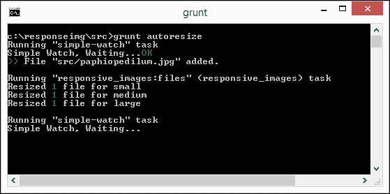

# 第三章。混合内容

> 69%的响应式设计移动网站的加载时间被认为“不可接受”……

一个令人震惊的事实，但绝对是真实的：2014 年 4 月，移动开发公司 Tribilis 进行的一项调查显示，在所调查的 155 个网站中，只有 21%的网站在智能手机上能在 4 秒或更短时间内加载完成。而且，加载时间较长的网站平均页面大小为 1.7 MB。

这是一些令人深思的想法，但它们完美地说明了在响应式设计中混合视频和图像的陷阱！我们需要在显示不太大也不太小的正确媒体内容的同时，保持页面加载时间短。本章通过一些示例并详细说明了与混合内容相关的一些陷阱，这些陷阱可能导致页面重量大和下载时间长。

本章将涵盖多个主题，包括：

+   在同一页面上混合视频和图像内容

+   考虑混合内容时的限制

+   使用预加载器来减少延迟

+   为我们的页面添加懒加载支持

+   考虑到移动设备

感兴趣吗？让我们开始吧！

# 在同一页面上混合视频和图像内容

在整本书中，我们看到了我们需要使用的一些技巧和窍门来使我们的媒体内容响应式，并处理了一些我们需要实施的样式的示例，以实现这一点。

然而，不太可能每个响应式网站都会有图像或视频；更有可能的是，至少在一些网站上会有两者的混合！这可能会带来它自己的问题，所以为了看看会发生什么，让我们运行一个简单的演示。

从代码下载中提取本章的`code`文件夹并将其保存到您的项目文件夹中；这包含一个简单的演示，展示了我们在响应式设计中混合视频和图像时面临的问题。如果我们直接运行`mix-responsive.html`演示，它看起来一开始看起来还不错，直到我们向下滚动并查看视频。布局不是理想的，但我们可以做一些更改：

+   浏览器窗口顶部的横幅图片太大。虽然这在桌面电脑上可能没问题，但会在智能手机上造成拥堵；需要调整大小。

+   嵌入的视频没有尊重其容器边界，结果是它溢出了整个页面，使得文字难以阅读。

+   我们可以改进横幅的使用。一旦我们将其改为更薄的设计，我们就可以添加一个媒体查询来切换到这个更薄设计的较小版本。

幸运的是，这些修复很容易。让我们看看需要做什么：

1.  将`mix-responsive.html`和`mix-responsive.css`分别保存为`mix-responsiveV2.html`和`mix-responsiveV2.css`（在同一文件夹中）。别忘了将 HTML 标记内的 CSS 文件链接更改为指向新文件！

1.  在第 28 行或其附近查找`banner` div，并移除``标签，以便 HTML 标记与以下代码行所示相同：

    ```js
    <div id="banner"></div>
    ```

1.  在下面，在第 34 行或其附近查找`<video controls>`；我们需要将其包含在一个包装`<div>`中：

    ```js
    <div id="video-wrapper">
      <video controls>
        <source src="img/bigbuckbunny-480px.mp4" type="video/mp4">
        <source src="img/bigbuckbunny-480px.webm" type="video/webm">
      </video>
    </div>

    ```

1.  打开`mix-responsiveV2.css`并添加以下样式：

    ```js
    #video-wrapper video { max-width: 100%; }
    #banner { background-image: url('../img/abstract-banner-large.jpg'); height: 15.31rem; width: 45.5rem; max-width: 100%; } 

    @media screen and (max-width: 30rem) {
      #banner { margin-top: 150px; background-image: url('../img/abstract-banner-medium.jpg'); height: 4.85rem; width: 45.5rem; max-width: 100%; }
    }
    ```

1.  保存文件。如果我们在一个浏览器中预览我们的工作结果，我们可以看到页面外观的显著改进。

现在尝试调整页面大小；你应该会看到视频和图像元素会完美地调整大小，没有任何溢出。简而言之，我们的改动非常简单。我们给视频添加了一个容器，并添加了`max-width`样式属性，将其设置为`100%`。然后我们用更薄的版本替换了笨重的横幅，设置它在调整大小时保留其容器的完整宽度。一旦屏幕宽度低于`30rem`，它就会切换到更小的版本。

### 小贴士

我们有一个包含修复的完成版演示。在代码下载中，查找并提取`mix-responsiveV2-finished.html`和`mix-responsiveV2-finished.css`。将两个文件都保存在与原始文件相同的位置以查看结果。

在我们继续并查看如何在混合内容时为移动设备做出让步之前，我想介绍一些可能对你有所帮助的小贴士：

+   我们直接在页面上嵌入了视频。它工作得非常好，但如果我们想给它增添一点额外的光彩，我们可以考虑使用覆盖层。有很多可供选择，但一个很好的（响应式）例子是 FrescoJS，可在[`www.frescojs.com/`](http://www.frescojs.com/)找到。

+   如果 CSS3 不受支持，可能需要求助于 jQuery 来为元素提供响应式功能。较老的浏览器，如 IE8 或以下版本，可能属于这一类。我们可以使用类似 Embedly jQuery 这样的工具来实现，可在[`embedly.github.io/embedly-jquery/`](http://embedly.github.io/embedly-jquery/)找到。

    ### 小贴士

    有一个关于如何配置 Embedly jQuery 的教程，可在[`embed.ly/docs/tutorials/responsive`](http://embed.ly/docs/tutorials/responsive)找到。

+   如果你需要为第三方嵌入的视频（如 YouTube）添加响应式代码，可以使用[`embedresponsively.com/`](http://embedresponsively.com/)提供的服务；只需输入要嵌入的任何视频或图像的 URL，然后点击**嵌入**以获取代码。

好的！我们继续！我们已经讨论了很多关于内容混合的问题，但正如我们在演示中看到的，还有一些方面可以改进。我们在演示中做出的改动只是我们可以用来消除内容混合的一些陷阱的一些指针，所以让我们更详细地看看几个例子。

# 考虑内容混合的陷阱

在过去几年中，响应式设计变得非常流行，访客使用各种设备在互联网上浏览内容。这增加了开发者确保他们的网站在各种不同的设备和平台上都能良好工作的压力。eMarketeer 最近的一项研究表明，五分之四的人将通过移动设备访问内容，并且预计这个数字在未来三年内将增加。

| 地区 | 2014 | 2015 | 2016 | 2017 |
| --- | --- | --- | --- | --- |
| 中东和非洲 | 94.0 | 94.0 | 95.0 | 96.0 |
| 亚洲太平洋 | 87.4 | 90.0 | 92.6 | 93.9 |
| 中东和东欧 | 72.4 | 80.6 | 86.6 | 91.7 |
| 北美 | 64.3 | 69.8 | 74.4 | 79.2 |
| 西欧 | 67.8 | 78.2 | 85.0 | 90.6 |
| 拉丁美洲 | 58.5 | 65.0 | 70.1 | 75.2 |
| **全球** | **79.1** | **83.6** | **87.3** | **90.1** |

上表中数字是从 2013 年 12 月的 eMarketeer 中获取的百分比值。

为了避免陷入制作出提供糟糕体验的响应式网站的陷阱，让我们看看在响应式设计中混合媒体源时需要考虑的一些陷阱：

+   页面上图像的大小和数量将直接影响访客查看页面的速度。为了减少影响，我们可以使用几种技术：

    +   图像压缩是第一个被广泛使用的简单技术。为了说明压缩图像的必要性，Tribilis 的一篇文章值得一读，可在[`blog.trilibis.com/trilibis-web-performance-survey-finds-69-percent-of-responsive-design-websites-fail-to-deliver-acceptable-load-times-on-mobile-devices-02759`](http://blog.trilibis.com/trilibis-web-performance-survey-finds-69-percent-of-responsive-design-websites-fail-to-deliver-acceptable-load-times-on-mobile-devices-02759)找到。它展示了当图像被压缩时的一些显著收益！

    +   下一个重要的技术是将小图像转换为数据 URI 或作为图像精灵的一部分。

    +   另一种技术是使用懒加载，只显示视口中可见的图像。

+   我们需要意识到设计中的断点，并调整我们的媒体查询以适应。对于图像可能有效的方法可能对视频同样有效，尤其是如果它们的大小不同的话。

+   将较小的图像缩放到更大的尺寸会导致质量损失；建议从大尺寸图像开始，并为较小的设备动态调整大小。一旦达到特定的断点，我们就可以默认使用较小的图像，以避免图像在没有针对特定断点/视口宽度进行调整时变得难以辨认。

+   当图像被缩小到非常小的尺寸时，缩放图像可能会引起问题。这些尺寸可能意味着我们无法正确查看图像，其含义将丢失，文件大小不会减小，而且可能最好是根本不显示它。

+   考虑将矢量图像转换为 SVG 格式。转换为标准图像格式，如 JPG、GIF 或 PNG，可能会导致与将小图像缩放到较大尺寸时相同的质量损失。SVG 图像可以很好地缩放而不会损失质量。

+   如果您的网站使用视频，那么一个可能会让您陷入困境的陷阱是使用的格式。尽管我们只需要为 MP4 或 WebM 支持进行编码，但并非每个设备都会使用这两种格式。对网络指标进行仔细分析可以帮助我们了解哪些操作系统被用来访问网站，从而帮助我们确定要使用哪种视频格式。

    ### 小贴士

    对于格式支持的最新检查，请查看[`www.jwplayer.com/html5`](http://www.jwplayer.com/html5)上可用的文章。

+   您是否使用图像来表示小元素，如按钮？如果是这样，请考虑将它们转换为 CSS3 等价物，至少对于可以支持它们的浏览器来说是这样。这意味着减少对服务器的请求（我们不会调用图像），并且 CSS 样式表已经被浏览器缓存，因此响应将更快。网上有很多示例；您可以在[`css-tricks.com/examples/ButtonMaker/`](http://css-tricks.com/examples/ButtonMaker/)尝试 Chris Coyier 的按钮创建器，或者在[`html-generator.weebly.com/css-shape-generator.html`](http://html-generator.weebly.com/css-shape-generator.html)尝试 CSS 形状生成器。

+   仅指定图像的宽度可能会导致许多浏览器必须处理的布局新调整大小页面的周期加倍或三倍。虽然这些周期中的每一个通常小于一毫秒，但它们会累积，尤其是在页面上有多个可缩放元素的情况下。在相同的声明中指定高度可以减少这个问题：

    ```js
    img, video { max-width: 100%; height: auto; }
    ```

+   如果您的网站需要以 4:3 或 16:9 的比率格式显示视频，那么这些视频可能无法正确调整大小。我们可以通过使用 HTML 中的包装器并设置正确的尺寸来解决这个问题，然后将视频拉伸以适应以下容器：

    ```js
    <div class="wrapper-with-intrinsic-ratio">
       <div class="element-to-stretch"></div>
    </div>
    ```

    CSS 样式可能看起来像这样：

    ```js
    .wrapper-with-intrinsic-ration {
      position: relative; height: 0;
      padding-top: 25px; /* to allow for the player chrome */
      padding-bottom: 56.25%  /* 9:16 = 0.5625 */
    }

    .element-to-stretch { position: absolute; top: 0; left: 0;
      width: 100%; height: 100%; background: teal; }
    ```

呼吁！当然有很多地方如果我们不小心就会被绊倒！让我们继续前进，看看我们可以用来帮助我们管理页面中媒体内容的几个技巧，首先是预加载图像的探讨。

# 使用预加载器减少延迟

在网页设计中，预加载内容不是一个新概念。其想法是减少在浏览器中查看页面所需的时间，因为一些（或全部）内容已经在查看页面之前被获取并缓存到浏览器中。

有许多使用 JavaScript（如[`www.createjs.com/#!/PreloadJS`](http://www.createjs.com/#!/PreloadJS)上的 PreloadJS）的示例。但这会给我们的页面增加额外的开销，我们可以避免，尤其是在响应式设计中。

相反，我们可以在适当的时候使用 CSS 来实现相同的效果，只要样式和图片被正确调用。这样，当我们在屏幕上渲染图片时，它们就会为我们准备好了。

### 注意

为了本演示的目的，我已经简化了代码，只关注预加载过程。

让我们通过一个简单的示例来看看预加载的实际应用：

1.  从本书附带的代码下载中，提取一个`preloading.html`的副本，然后将其保存在我们的项目文件夹中。

1.  接下来，从代码下载中提取`img01.png`到`img04.png`。这些图片应该放入我们项目文件夹中标记为`img`的子文件夹中。

1.  在一个新文件中，将以下样式添加到一个新的 CSS 样式表中。将其保存为`preloading.css`，位于项目文件夹中的`css`子文件夹内：

    ```js
    html { font-family: Verdana, Arial, Helvetica, sans-serif; }
    body { margin: 60px auto 0; padding: 0; background-color: #606061; color: #ffffff; }
    img { border: none; padding: 10px; max-width: 100%;}
    p { font-size: 1em; margin: 0 0 1em 0; }
    #container { position: absolute; top: 0; left: 0; background-color: #18191d; width: 100%; height: 40px; }
    #container p { color: #ffffff; margin: 10px auto 0; text-align: center; width: 310px; }
    #preload { margin-left: auto; margin-right: auto; width: 900px; }

    body:before {
      content: url(../img/img01.png) no-repeat -9999px -9999px,
               url(../img/img02.png) no-repeat -9999px -9999px,
        url(../img/img03.png) no-repeat -9999px -9999px,
        url(../img/img04.png) no-repeat -9999px -9999px;
      display: none;
    }
    ```

在我们预览我们的工作之前，快速查看这个过程是如何工作的是有用的。关键是添加到 body 中的类，在我们在代码中稍后使用它们之前检索图片：

```js
<body class="preload-images">
  <div id="container">
...
  <div id="preload">
    
...
```

如果我们预览我们的工作结果，我们将看到以下四张图片出现：


使用这种方法的美妙之处在于，我们不再需要使用另一个库，例如 PreloadJS。相反，现在我们可以选择在决定为不支持我们演示中使用的`body:before`技巧的旧浏览器提供支持时调用它。

让我们改变方向，看看硬币的另一面——懒加载。不，这并不是在周日早上起床（尤其是在前一晚玩得很晚之后）的一种形式（糟糕的笑话！），而是一种只在查看图片时加载和显示图片的方法。好奇吗？我将在我们下一个练习中揭示一切。

# 为我们的页面添加懒加载支持

响应式设计的主要目标之一应该是考虑任何可以用来减少我们页面整体加载时间的策略；这对于移动设备尤其如此。

到目前为止，你已经看到了我们如何预加载内容。在某些情况下，这可能不是理想的；相反，我们可以做相反的事情，直到我们准备查看内容时才加载内容：


这个过程被称为懒加载；它有效地将加载图片的焦点从前面（即在页面加载时）移到我们需要看到图片的时刻。为了说明这个过程，我们将使用 Bjørn Klinggard 的 bLazy 插件，可在[`dinbror.dk/blog/blazy/`](http://dinbror.dk/blog/blazy/)找到。这个库的伟大之处在于它轻量级，是用纯 JavaScript 编写的，因此没有依赖项！哦，我忘了——它也是响应式的。

让我们快速看一下一个演示（基于作者的原始作品），我们可以很容易地将其作为任何复杂响应式设计的起点：

1.  为了这个演示的目的，从本书附带的代码下载中提取`lazy loading`文件夹的副本。它包含我们演示所需的标记文件、图片、样式和 JavaScript。

1.  运行`lazyloading.html`文件。注意，为什么只有前几幅图片显示？如果我们向下滚动，我们可以看到绿色加载图片出现，下一幅图片在短暂延迟后出现。

    这个演示中的魔法集中在以下代码片段：

    ```js
      <div class="wrapper ratio_big-img loading">
        
      </div>
    ```

我们从一个占位符图片开始。在这个例子中，我们使用一个 1 像素的 PNG 文件，它可以很容易地转换为数据 URI 等效物，几乎没有开销。然后我们使用两个`data-src`标签，在窗口调整大小时在图片的小版本和大版本之间切换。

我们可以通过测试来确保图片确实只有在可见时才被加载。在这个例子中，使用 Firefox 的**开发者**工具栏，我们可以在**控制台**标签页中看到每个 URL 在查看时加载的情况，如下面的截图所示：


### 注意

一个需要注意的小点——在这个例子中，前面的截图显示了本地 Web 服务器的使用；无论图片是从文件系统还是通过 Web 服务器加载，原理都是相同的。

这个演示非常适合作为在网站上显示画廊效果的基座，尤其是在移动设备上查看时。稍作调整，我们甚至可以将其设置为显示基于视网膜的图片；尽管这将是留给你的一个挑战！让我们继续前进，讨论在设计响应式网站时的一个关键主题：为移动设备留出空间。

# 为移动设备留出空间

将视觉内容添加到我们的页面将使网站变得生动，但我们应该记住延迟时间的增加。延迟是移动设备上的主要杀手；例如，如果我们有一个 1MB 的页面，有 80 多个请求，加载页面可能需要超过 4 秒！

使用 JavaScript 在资源方面代价高昂。它需要时间，并且可能会阻塞页面的渲染。一个更好的替代方案是在需要时才加载资源。在桌面电脑上，这不太成问题，但对于移动设备来说变得至关重要。以谷歌的 Gmail 服务为例——使用这个原则将加载 JavaScript 的延迟从 2600 毫秒减少到仅仅 240 毫秒。考虑到这一点，让我们看看一些有用的提示，我们可以考虑它们以帮助减少在移动设备上混合响应式图片和视频的影响：

+   如果我们是为移动设备设计，确定我们的用户使用哪个平台是至关重要的。这将决定可以显示哪些内容。一种方法是我们可以使用懒加载（以媒体查询的形式）仅在需要时显示图片：

    ```js
    // equivalent to 720px
    @media all and (min-width: 45rem) {
      body:after { content: 'desktop'; display: none; }
    }
    ```

    另一种方法鼓励条件加载，只加载必要的元素和样式：

    ```js
    var size = window.getComputedStyle(document.body, ':after').getPropertyValue('content');
    if (size == 'desktop') {
    // load content here...
    }
    ```

    ### 小贴士

    这些方法不需要导入任何额外的库。如果我们的网站已经代码密集，并且我们想要避免添加更多内容到我们的网站，这是理想的。然而，在现实中，我们可能会考虑使用类似 RequireJS 的东西来管理文件的导入，尽管这会带来 RequireJS 库的开销！

+   一个好的做法是仔细考虑页面上所有的元素是否真的对于一个可用的移动体验是必需的。检查那些社交媒体按钮。例如，一些可能比你想象的要大，虽然可以用更小、更轻的版本替换，但对于移动设备来说，完全不包括它们可能更合理。或者，考虑使用条件加载来加载较大的元素，而较小的元素可以自动加载。一个很好的替代方案是考虑使用 FontAwesome 图标而不是图片。这将有助于减少服务器需要加载的文件数量（参见下一点）。

+   考虑使用数据 URI（通过生成服务，如[`datauri.net/`](http://datauri.net/)）或精灵/网络字体（如 Entype 或 FontAwesome）来代替图片。虽然数据 URI 或精灵可能不会使代码更小，但它们将减少对服务器的请求次数。使用网络字体也可以达到同样的效果；我们可以通过使用[`www.fontello.com`](http://www.fontello.com)上的 Fontello 服务构建自定义字体来更进一步。

+   如果你网站上使用视频，考虑在 YouTube 上托管它们。这将节省空间和带宽成本。此外，将有一个一致的格式，这减少了视频在移动设备上无法播放的风险。

+   在使用大尺寸、高质量图片时要小心——在移动设备上，当访客的数据使用量激增时，他们不会感谢你！有许多选项可以减少图片大小。我们将在本章后面查看两个这样的示例，它们使用 Node JS 自动调整图片大小和压缩。

    ### 注意

    或者，如果你需要在高像素密度显示上显示图片，将大小加倍但增加压缩将有助于减少文件大小。要查看实际效果，请查看[`greatfridays.com/blog/images-in-responsive-web-development/`](http://greatfridays.com/blog/images-in-responsive-web-development/)上的教程。你能在 PayPal 演示中使用的两个图片之间看到任何质量上的差异吗？

+   总是设置视频在移动设备上显示海报图片而不是自动播放。有许多选项可以生成图片（包括可以自动化的），所以没有借口。我们将在本章后面看到一个示例，它可以很容易地调整以生成额外的图片作为海报。

+   一个有用的工具是页面可见性或网络 API。这看起来非常简单易行，但可以开启多种可能的用途。其中一种用途是在浏览器窗口未被显示时暂时关闭任何正在播放的视频；这将有助于降低带宽成本。

+   如果您的网站需要大量的矢量图像，您将使用 SVG 格式的文件获得更好的结果。这些实际上是 XML 文件，可以无损缩放。

足够的理论——让我们实际尝试这两条建议；我们可以手动完成它们，但我们可以利用任务运行器自动完成它们。好奇吗？我将解释一切，从查看创建我们选择的图片的响应式版本开始。

## 自动创建响应式图片

为任何网站提供内容的关键部分当然是图片。这在响应式网站上尤为重要，因为我们已经看到，需要多个版本的同一图片来提供流畅的响应式解决方案。

我们当然可以手动创建每个版本的图片，但这是 21 世纪：谁愿意（或者甚至有时间）手动创建不同大小的图片？肯定有更好的方法。您是对的：我们可以自动化整个过程。让我们看看如何使用 Node JS 任务运行器作为自动化过程的基础。

### 注意

这个练习被设计成独立运行；随着您越来越习惯使用 Grunt，这些原则可以轻松地应用到更大、更复杂的 Grunt 流程中。

让我们从安装 Node JS 开始：

1.  我们将首先浏览到[`nodejs.org/download/`](http://nodejs.org/download/)下载您平台上的最新版本。它适用于 Windows、Mac 和 Linux 平台。双击**MSI 安装程序**并运行向导，接受所有默认设置。

1.  从代码下载中，提取`responseimg`文件夹并将其保存在您的 PC 上。

1.  打开 Node JS 命令提示符，然后切换到`responseimg`文件夹，并运行以下命令来安装`grunt-responsive-images`：

    ```js
    npm install

    ```

1.  这将安装`grunt-responsive-images`，以及依赖项和 Grunt；在这种情况下，我们正在使用`grunt-simple-watch`小程序自动监控我们的文件夹中的任何更改。

1.  在命令提示符下，切换到`src`文件夹，然后运行以下命令：

    ```js
    grunt autoresize

    ```

1.  这将启动`grunt-simple-watch`插件以自动监控`src`文件夹中的更改。在这个例子中，我已经将单个 JPEG 图像放入了`src`文件夹，这也在下面的屏幕截图中有显示：

1.  任何放入`src`文件夹的图片都将被用来创建三个新的图片，如下面的屏幕截图所示：

自动化流程现在已准备好使用。我们可以将任意数量的 JPEG 图像放入文件夹中；对于放入文件夹中的每一张新图像，都会生成三张新图像。

### 小贴士

我们正在使用插件中指定的默认图像大小；这些大小可以在我们的`gruntfile.js`文件中的插件选项中轻松自定义。

## 自动化缩小过程

我们当然可以进一步开发这个自动化流程。阅读 Node 的能力以及检查一些广泛创建的插件，这些插件可以帮助自动化那些手动完成时不会增加任何价值的耗时流程，这绝对值得。

让我们看看扩展我们的自动化流程的一种方法。我们已经设置了一个创建图像的流程，但有一些图像可能没有压缩到它们可能达到的程度。我们可以通过添加对压缩的支持，使用`grunt-contrib-imagemin`插件来解决这个问题：

1.  打开`gruntfile.js`文件的副本。我们首先需要添加对`grunt-contrib-imagemin`插件的支持，所以请按照以下代码片段所示进行修改：

    ```js
    files: ['src/*.jpg'],
    tasks: ['responsive_images', 'imagemin'],
    options: {
    ```

1.  接下来，修改代码以添加`imagemin`任务的代码块，如下代码片段所示：

    ```js
      dest: '../responseimg/assets'
        }
     },
     imagemin: {
     jpg: { options: { progressive: false }, files: [{ expand: true, cwd: 'assets/', src: '*.jpg', dest: 'assets/', ext: '.jpg' }]
     }

    ```

1.  当在 Grunt 中运行任务时，我们需要告诉它加载`grunt-contrib-imagemin`插件，所以请按照以下代码行所示将其添加到`gruntfile.js`文件中：

    ```js
    grunt.loadNpmTasks('grunt-responsive-images');
    grunt.loadNpmTasks('grunt-contrib-imagemin');

    ```

1.  我们需要进行最后一次修改，所以请按照以下代码行所示进行修改：

    ```js
    grunt.registerTask('default', ['simple-watch']);

    ```

1.  打开 NodeJS 命令提示符并运行以下命令，将插件及其依赖项添加到`package.json`文件中：

    ```js
    npm install grunt-contrib-imagemin --save-dev

    ```

1.  我们现在已准备好测试我们的 Grunt 包。在命令提示符中，将目录更改为项目文件夹，然后运行此命令：

    ```js
    grunt

    ```

1.  如果一切顺利，我们将看到 Grunt 任务运行并成功生成三张新图像，然后这些图像将被压缩。

自动化流程现在已准备好使用。尽管我们只将一张图像通过这个过程，但在此阶段我们可以将许多图像通过这个过程。我建议运行一些测试来评估你可以安全同时处理多少图像，因为这将取决于你的 PC 或 Mac 的资源。

# 摘要

呼吁！我们确实在这个小空间里装了很多东西！让我们回顾一下本章所学的内容。我们从一个混合视频和图像内容的演示开始，最初是为了亲眼看到混合内容时遇到的一些问题，但后来是使用你学到的一些技巧和窍门来使页面具有响应性。

在观看演示后，我们开始考虑一些混合内容可能遇到的陷阱；我们看到了在过去几年中，响应式使用的显著增加，这使得我们的设计在各种平台上工作变得至关重要。我们介绍了一些我们可以用来在设计中为移动平台做出让步的技巧。

我们在章节的最后部分展示了两个使用 NodeJS 自动创建我们图像的不同版本并自动缩小它们的演示；这说明了我们如何自动化这个过程并节省大量的手动工作。

现在我们有了我们的内容，我们需要彻底测试它以确保它能在广泛的设备上正常工作。我们将在下一章中查看测试过程，探讨我们在处理响应式媒体时需要了解的一些考虑因素和陷阱。
