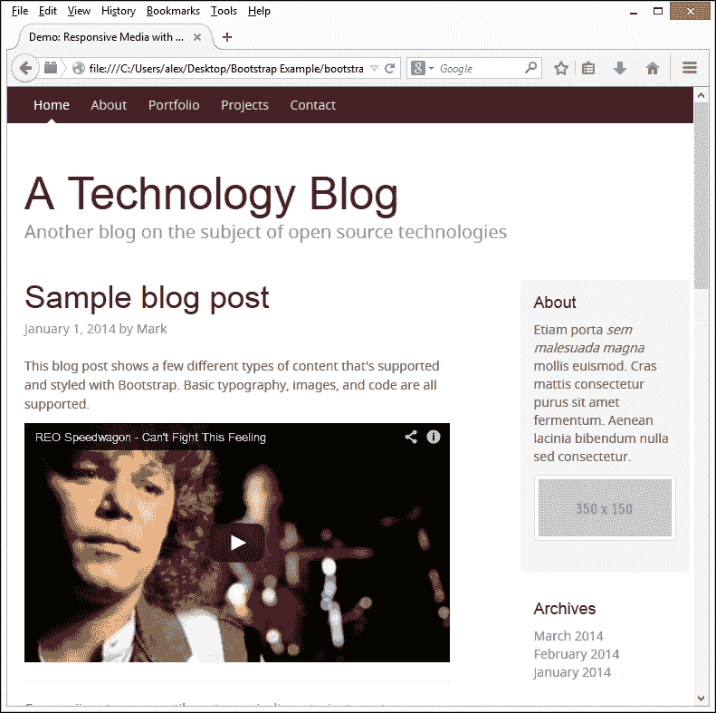
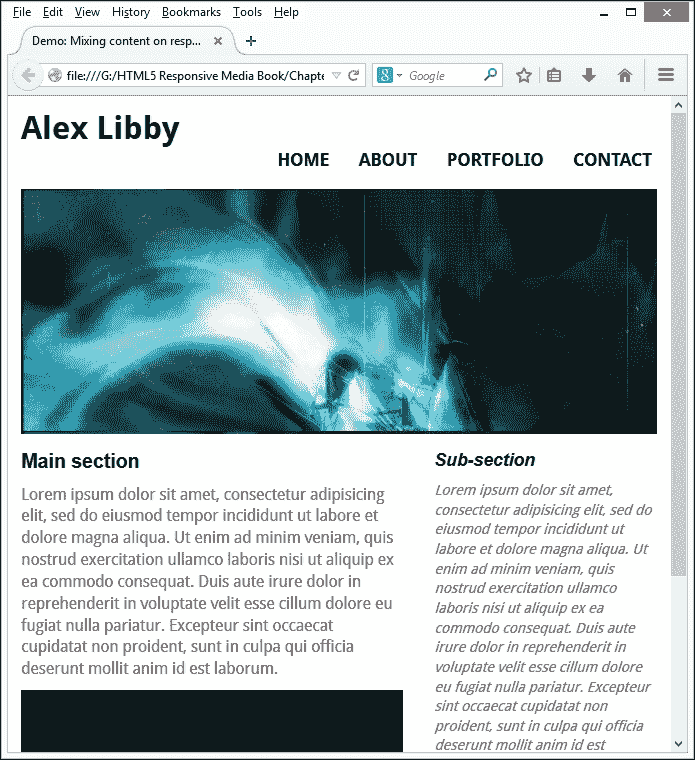

# 第五章：使用框架

在本书中，我们介绍了一些技巧和窍门，我们可以使用它们将媒体添加到我们的响应式网站中，包括图片和视频。这些技巧很好，但在现实生活中它们是如何工作的呢？

让我们现在来回答这个问题。我们无法忽视三个流行框架的快速崛起，即 Less CSS、WordPress 和当然还有 Twitter 的 Bootstrap。这些被用于全球成千上万的网站中——这绝对不是可以忽视的！在本章中，我们将通过一些简单的示例来展示如何使用这些工具来应用我们在书中介绍的一些技术。

在接下来的几页中，我们将涵盖以下主题：

+   将响应式媒体添加到 CMS 中

+   在框架如 Twitter Bootstrap 中实现响应式媒体

+   使用 Less CSS 预处理器创建 CSS 媒体查询

准备好了吗？让我们开始吧！

# 介绍我们的三个示例

在本书中，我们介绍了一些简单实用的技术，用于使网站中的媒体响应式化——这些技术很好，但没有什么能比得上看到这些原则在实际应用中的使用，对吧？

绝对可以！为了证明这一点，我们将在本章中查看三个示例，使用您可能熟悉的这些技术：WordPress、Bootstrap 和 Less CSS。每个演示都将假设一定的先验知识，因此可能值得先阅读一下。在所有三种情况下，我们应该看到，只需付出很少的努力，我们就可以轻松地将响应式媒体添加到这些技术中的每一个。让我们从查看如何与 WordPress 一起工作开始。

# 将响应式媒体添加到 CMS 中

我们将首先通过查看流行的 WordPress 系统来开始我们的三个示例。WordPress 是在 2003 年创建的，从小型独立交易商到财富 500 强公司都使用它来托管网站——这包括一些商业界的最大名字，如 eBay、UPS 和福特。WordPress 有两种版本；我们感兴趣的是可在 [`www.wordpress.org`](http://www.wordpress.org) 获取的自安装版本。

本示例假设您已经安装并运行了本地的 WordPress；如果没有，请访问 [`codex.wordpress.org/Installing_WordPress`](http://codex.wordpress.org/Installing_WordPress) 并按照教程开始。如果您还没有安装，我们还需要一个 DOM 检查器，如 Firebug。如果您需要安装，可以从 [`www.getfirebug.com`](http://www.getfirebug.com) 下载。

### 注意

如果您只能访问 WordPress.com（WordPress 的另一种版本），那么本节中的一些提示可能不会工作，因为该版本的 WordPress 有局限性。

好的，假设我们已经设置了 WordPress 并让其运行，让我们开始制作上传的媒体响应式化。

## 手动添加响应式媒体

如果我们回顾一下第一章，*使用响应式图片*，我们会发现，在大多数情况下，只需简单地将 `max-width: 100%` 应用于我们希望响应式的任何图片就足够了。

到这个时候，你可能可能认为在 WordPress 中工作我们必须做一些复杂的事情，对吧？错误！只要您使用 Twenty Fourteen 核心主题，工作就已经为您完成了。

### 注意

对于这个练习以及接下来的章节，我将假设您已经安装并/或激活了 WordPress 的 Twenty Fourteen 主题。

你不相信我？很容易验证：尝试将图片上传到 WordPress 中的帖子或页面。调整浏览器窗口大小——你应该看到图片随着浏览器窗口大小的变化而缩小或增大。如果我们使用 DOM 检查器（如 Firebug）查看 WordPress 的内部结构，我们可以很容易地看到代码与第一章中的代码没有区别。


如果我们使用 Firebug 查看其他地方的代码，我们也可以看到针对许多 `img` 标签设置了 `height: auto`；这通常是为了响应式图片，以确保它们保持正确的比例。

响应式样式在 Twenty Fourteen 主题中似乎工作得很好；如果您使用的是较旧的主题，我们可以在使用该主题时轻松地将相同的样式规则应用于存储在 WordPress 中的图片。

## 解决响应式问题

到目前为止，一切顺利。现在，我们已经设置了 Twenty Fourteen 主题，上传了各种大小的图片，我们尝试调整浏览器窗口……却发现图片似乎在某个点以上不再增长大小。至少增长得不好——这是怎么回事？

嗯，这是一个经典的陷阱：我们讨论了使用百分比值来动态调整图片大小，结果却发现我们给自己挖了个坑（当然，是比喻意义上的！）原因？让我们深入探究，以下步骤将帮助我们找到答案：

1.  浏览到您的 WordPress 安装并使用 *F12* 激活 Firebug。

1.  切换到 **HTML** 选项卡并选择您喜欢的图片。

1.  在 Firebug 中，查找 `<header class="entry-header">` 行，然后在窗口右侧的渲染样式中查找以下行：

    ```js
    .site-content .entry-header, .site-content .entry-content, .site-content .entry-summary, .site-content .entry-meta, .page-content {
        margin: 0 auto; max-width: 474px; 
    }
    ```

1.  眼尖的你们中应该能立刻发现问题——我们使用百分比来使每个图片的大小动态变化，但我们却限制了其父容器！为了解决这个问题，按照指示更改高亮行：

    ```js
    .site-content .entry-header, .site-content .entry-content, .site-content .entry-summary, .site-content .entry-meta, .page-content {
     margin: 0 auto; max-width: 100%;
    }
    ```

1.  为了平衡内容，我们需要对评论区域做同样的修改。所以，请按照以下方式将 `max-width` 更改为 `100%`：

    ```js
    .comments-area { margin: 48px auto; max-width: 100%; padding: 0 10px; }
    ```

1.  如果我们现在尝试调整浏览器窗口大小，我们应该看到图片大小会自动调整。

在这个阶段，更改不是永久的。为了解决这个问题，我们需要登录到 WordPress 的管理区域，转到**外观** | **编辑器**，并在**样式表（style.css）**文件的底部添加调整后的样式。

让我们继续。有人注意到这里使用的方法有两个相当关键的问题吗？希望你已经注意到，如果使用大图像并将其调整到更小的尺寸，我们仍在处理大文件。我们正在进行的更改对主题有很大的影响，尽管这只是一个小改动。即使它证明了我们可以使图像真正响应式，但这种改变在没有仔细考虑和大量测试的情况下，我们可能并不想进行。

我们可以改进这一点。然而，直接对 CSS 样式表进行更改并不是最佳选择；在升级到主题的新版本时，这些更改可能会丢失。我们可以通过使用自定义 CSS 插件来管理这些更改，或者（更好）使用一个插件，告诉 WordPress 在调整窗口大小到更小尺寸时自动将现有图像替换为小图像。

## 使用插件添加响应式图像

然而，使用像 Twenty Fourteen 这样的主题的一个缺点是图像的调整大小。虽然我们可以在调整浏览器窗口大小时增大或缩小图像，但我们实际上仍然在技术上改变了一个可能是不必要的大图像的大小！

这被认为是不良的做法（而且也是不礼貌的！）——在具有快速互联网连接的桌面浏览器上浏览可能不会产生太大的影响；对于移动设备来说，情况就不同了，我们选择的空间更小。

为了克服这个问题，我们需要采取不同的方法——让 WordPress 在达到特定大小或断点时自动替换较小的图像。而不是手动使用代码来做这件事，我们可以利用许多提供响应式功能的插件之一。

我感觉一个演示即将到来。现在是查看这样一个插件在行动中的好时机：

1.  让我们从下载我们的插件开始。在这个练习中，我们将使用 Kyle Ricks 的`PictureFill.WP`插件，该插件可在[`wordpress.org/plugins/picturefillwp/`](https://wordpress.org/plugins/picturefillwp/)找到。我们将使用使用`Picturefill.js`版本 2 的版本。这可以从[`github.com/kylereicks/picturefill.js.wp/tree/master`](https://github.com/kylereicks/picturefill.js.wp/tree/master)下载。点击**下载 ZIP**以获取最新版本。

1.  登录到您的 WordPress 安装的管理员区域，点击**设置**然后点击**媒体**。确保您的**缩略图**、**中等**和**大**尺寸的图片设置已设置为与您的设计中有用的断点相匹配的值。

1.  然后，我们需要安装这个插件。在管理员区域，转到**插件** | **添加新插件**来安装插件，并按正常方式激活它。

    到目前为止，我们已经在 WordPress 中安装了响应式功能——所有操作都由插件自动管理；无需更改任何设置（除非可能需要更改我们在步骤 2 中提到的图像大小）。

1.  切换回 WordPress 前端，尝试将屏幕大小调整为更小。

1.  按 *F12* 激活 Firebug 并切换到 **HTML** 选项卡。

1.  按 *Ctrl* + *Shift* + *C*（或 Mac 用户的 *Cmd* + *Shift* + *C*）切换元素检查器；将鼠标移至调整大小的图像上。

1.  如果我们在 WordPress 管理区域设置了正确的图像大小，并且窗口大小调整正确，我们可以期待看到以下截图所示的内容：

1.  为了确认我们确实使用了一个较小的图像，右键单击图像并选择**查看图像信息**；它将显示类似于以下截图的内容：

我们现在应该在 WordPress 安装中拥有一个完全功能的插件。一个好的建议是彻底测试它，至少要确保我们在 WordPress 中设置了正确的断点大小！

### 注意

**如果 WordPress 没有正确刷新我的缩略图图像会发生什么？**

这可能会发生。如果你发现这种情况，获取并安装 Regenerate Thumbnails 插件来解决这个问题；它可在[`wordpress.org/plugins/regenerate-thumbnails/`](https://wordpress.org/plugins/regenerate-thumbnails/)找到。

## 使用插件添加响应式视频

现在我们可以在 WordPress 中添加响应式图像了，让我们把注意力转向视频。添加它们的流程稍微复杂一些；我们需要使用代码来实现最佳效果。让我们看看我们的选项。

如果你自己托管视频，最简单的方法是添加一些额外的 CSS 样式规则。虽然这种方法消除了对 JavaScript 或 jQuery 的依赖，但结果并不完美，需要额外的样式来处理播放按钮覆盖层的重新定位。

### 注意

虽然我们正在本地工作，但我们应记住本章前面的注意事项；当升级时，CSS 样式表中的更改可能会丢失。如果可能，应使用自定义 CSS 插件来保留任何更改。

要使用纯 CSS 解决方案，只需要几个步骤：

1.  浏览到你的 WordPress 主题文件夹，并在你选择的文本编辑器中打开`styles.css`的副本。

1.  在文件末尾添加以下行并保存：

    ```js
    video { width: 100%; height: 100%; max-width: 100%; }
    .wp-video { width: 100% !important; }
    .wp-video-shortcode {width: 100% !important; }
    ```

1.  关闭文件。你现在已经为响应式视频打下了基础。

在这个阶段，你可能正在想，“太好了，我的视频现在已经是响应式的了。我可以自己处理播放按钮覆盖层的重新定位，没问题”；听起来很对？

想象一下，这就是这种方法的主要缺点！重新定位覆盖层不应该太难。真正的问题是硬件和带宽的高成本，这是为了托管任何合理质量的视频所必需的，即使我们花费时间重新定位覆盖层，高成本也会超过使用纯 CSS 解决方案的任何好处。

一个更好的选择是让像 YouTube 这样的服务为你完成所有艰苦的工作，并直接将你选择的视频从 YouTube 嵌入到你的页面中。这样做的主要好处是 YouTube 的服务器为你完成了所有艰苦的工作。你可以利用更大的观众群体，YouTube 会自动优化视频，以适应你的访客所使用的互联网连接的最佳分辨率。

### 注意

虽然面向初学者，但 wpbeginner.com 有一个有用的文章，位于[`www.wpbeginner.com/beginners-guide/why-you-should-never-upload-a-video-to-wordpress/`](http://www.wpbeginner.com/beginners-guide/why-you-should-never-upload-a-video-to-wordpress/)，讨论了为什么不建议自行托管视频以及使用外部服务的优点。

## 使用插件嵌入视频

将外部服务中的视频嵌入到 WordPress 中，讽刺的是比使用 CSS 方法简单得多。有数十个插件可以实现这一功能，但其中最简单易用（也是我个人最喜欢的）是 Todd Motto 的 FluidVids，可在[`github.com/toddmotto/fluidvids/`](http://github.com/toddmotto/fluidvids/)找到。

要在 WordPress 中使其工作，我们需要遵循以下步骤，以 YouTube 的视频作为我们的示例基础：

1.  浏览到你的 WordPress 主题文件夹，并在你常用的文本编辑器中打开`functions.php`的副本。

1.  在底部，添加以下几行：

    ```js
    add_action ( 'wp_enqueue_scripts', 'add_fluidvid' );

    function add_fluidvid() {
      wp_enqueue_script( 'fluidvids', get_stylesheet_directory_uri() . '/lib/js/fluidvids.js', array(), false, true ); 
    }
    ```

1.  保存文件，然后登录到你的 WordPress 安装的管理员区域。

1.  导航到**文章** | **新建文章**来添加文章，然后切换到你的文章编辑器的**文本**标签页，然后将[`www.youtube.com/watch?v=Vpg9yizPP_g&hd=1`](http://www.youtube.com/watch?v=Vpg9yizPP_g&hd=1)添加到页面上的编辑器中。

1.  点击**更新**以保存你的文章，然后点击**查看文章**以查看视频的实际效果。

没有必要进一步配置 WordPress——任何从 YouTube 或 Vimeo 等服务添加的视频都将自动由 FluidVids 插件设置为响应式。此时，尝试调整浏览器窗口的大小。如果一切正常，我们应该看到视频的大小会根据浏览器窗口的调整而缩小或增大：


为了证明代码正在工作，我们可以在 Firebug 中查看编译结果。我们将看到类似于以下截图的内容：


对于那些不太勇敢的人来说（!），幸运的是有一个 WordPress 插件可以实现相同的效果，无需配置。它可在 [`wordpress.org/plugins/fluidvids/`](https://wordpress.org/plugins/fluidvids/) 找到，并可以使用 WordPress 插件的正常流程下载和安装。

让我们改变轨道并继续我们的下一个演示。我感觉有必要做一些编码，所以让我们看看我们如何在 Bootstrap 等框架中实现响应式图片。

# 在 Bootstrap 中实现响应式媒体

一个问题——作为开发者，如果你没有听说过 Bootstrap，请举手？很好——没有太多的人放下手

你为什么问这个问题，你可能会问？简单——这是为了说明在流行的框架（如 Bootstrap）中，很容易为媒体添加基本响应式功能，如图片或视频。具体过程可能因框架而异，但结果可能非常相似。为了说明我的意思，让我们看看使用 Bootstrap 进行我们的第二个演示，我们将看到添加图片和视频到我们的 Bootstrap 网站是多么容易。

### 注意

如果你想要探索一些可用的免费 Bootstrap 模板，那么 [`www.startbootstrap.com/`](http://www.startbootstrap.com/) 值得一看！

## 使用 Bootstrap 的 CSS 类

在 Bootstrap 中使图片和视频响应式，与我们之前检查的方法略有不同；这仅仅是因为我们不必显式地定义每个样式属性，而是只需为媒体 HTML 添加适当的类，以便它能够响应式渲染。

为了这个演示的目的，我们将使用 Blog 页面示例的编辑版本，可在 [`www.getbootstrap.com/getting-started/#examples`](http://www.getbootstrap.com/getting-started/#examples) 找到；本书附带的代码下载中有一个编辑版本的副本。在我们开始之前，请先下载 Bootstrap 示例文件夹的副本。在里面，你可以找到需要的 CSS、图片和 JavaScript 文件，以及我们的 HTML 标记文件。

现在我们有了文件，以下是我们将在演示过程中实现的效果的截图：



让我们按照以下步骤开始我们的示例：

1.  打开 `bootstrap.html` 并查找以下行（在第 34 行到第 35 行附近）：

    ```js
        <p class="blog-post-meta">January 1, 2014 by <a href="#">Mark</a></p>
          <p>This blog post shows a few different types of content that's supported and styled with Bootstrap. Basic typography, images, and code are all supported.</p>
    ```

1.  立即下面，添加以下代码——这包含我们嵌入视频的标记，使用 Bootstrap 的响应式 CSS 样式：

    ```js
    <div class="bs-example">
      <div class="embed-responsive embed-responsive-16by9">
        <iframe allowfullscreen="" src="img/zpOULjyy-n8?rel=0" class="embed-responsive-item"></iframe>
      </div>
    </div>
    ```

1.  现在视频已经设置了样式，让我们继续添加一张图片——这张图片将放在右侧的**关于**部分。查找以下行，在第 74 行或第 75 行附近：

    ```js
        <h4>About</h4>
          <p>Etiam porta <em>sem malesuada magna</em> mollis euismod. Cras mattis consectetur purus sit amet fermentum. Aenean lacinia bibendum nulla sed consectetur.</p>
    ```

1.  立即下面，添加以下标记来表示我们的图片：

    ```js
    <a href="#" class="thumbnail">
      
    </a>
    ```

1.  保存文件并在浏览器中预览结果。如果一切顺利，我们可以看到我们的视频和图片出现，就像我们在演示开始时看到的那样。

在这一点上，尝试调整浏览器的大小——你应该会看到视频和占位图随着窗口大小的调整而缩小或增大。然而，Bootstrap 的伟大之处在于，每个类都已经设置了正确的样式。我们只需要将正确的类应用到适当的媒体文件上——对于视频是`.embed-responsive embed-responsive-16by9`，对于图片是`.img-responsive`——这样图片或视频就能在我们的网站上响应式地表现。

### 小贴士

在这个例子中，我们在代码中使用了 Bootstrap 的`.img-responsive`类；如果我们有很多图片，我们可以考虑使用`img { max-width: 100%; height: auto; }`代替。

到目前为止，我们已经以 WordPress 和 Bootstrap 这两种流行的框架为例进行了工作。这很好，但这可能意味着我们需要处理大量的 CSS 样式，尤其是如果我们正在使用媒体查询，就像我们在本书前面看到的那样！我们能做些什么吗？当然可以！是时候简要地看看 CSS 预处理以及它是如何帮助我们向页面添加响应式媒体的了。

# 使用 Less CSS 创建响应式内容

与框架一起工作通常意味着我们需要处理大量的 CSS 样式；如果我们不小心，这可能会变得难以管理！为了帮助解决这个问题，并且为了我们的第三个场景，我们回到基础，使用 Less CSS 预处理语言以不同的方式渲染 CSS。

为什么？因为作为 CSS 的超集（或扩展），Less 允许我们更高效地编写样式；然后将其编译成有效的 CSS。本例的目的是展示如果你已经在使用 Less，那么我们仍然可以应用本书中涵盖的相同原则，使我们的内容具有响应性。

### 小贴士

应该注意的是，这个练习假设您有一定的 Less 使用经验；如果您是第一次使用，您可能想阅读 Packt 出版社的我的书《Learning Less》。

为了理解我的意思——让我们重新设计第三章中的响应式演示“第三章：混合内容”，其中我们混合了视频和图片，用 Less 代替了常规 CSS。进行这些更改将涉及几个步骤，所以下面的截图可以提前让我们了解完成后的样子：



等一下！你们中那些敏锐的人可能会注意到这个版本和第三章中的版本“第三章：混合内容”之间没有什么不同。

你是对的。如果我们玩得得体，确实不应该有任何外观上的变化；使用 Less 的全部内容都是关于更高效地编写 CSS。让我们看看涉及的内容：

1.  我们将首先从本书附带的代码下载中提取 Less CSS 示例的副本——在里面，我们会找到我们需要的 HTML 标记、重置样式表、图片和视频。将文件夹保存在您的 PC 上本地。

1.  接下来，在新的文件中添加以下样式，并将其保存为`css`子文件夹中的`responsive.less`——我们将从一些基本元素（如视频和横幅）的样式开始：

    ```js
    #wrapper {width: 96%; max-width: 45rem; margin: auto; padding: 2%}
    #main { width: 60%; margin-right: 5%; float: left }
    #video-wrapper video { max-width:  100%; }
    #banner { background-image: url('../img/abstract-banner-large.jpg'); height: 15.31rem; width: 45.5rem; max-width: 100%; 
    float: left; margin-bottom: 15px; } 
    #skipTo { display: none; li { background: #197a8a }; }

    p { font-family: "Droid Sans",sans-serif; }
    aside { width: 35%; float: right; }
    footer { border-top: 1px solid #ccc; clear: both; height: 30px; padding-top: 5px; }
    ```

1.  我们需要为图片和链接添加一些基本的格式化样式，所以请立即在`#skipTo`规则下方添加以下内容：

    ```js
    a { text-decoration: none; text-transform: uppercase }
    a, img { border: medium none; color: #000; font-weight: bold; outline: medium none; }
    ```

1.  接下来是我们的页面导航。这些样式控制主要导航和当在较小设备上查看时出现的**跳转到…**链接。请立即在`a`和`img`的规则下方添加这些样式规则：

    ```js
    header { 
      font-family: 'Droid Sans', sans-serif; 
      h1 { height: 70px; float: left; display: block; font-weight: 700; font-size: 2rem; }
      nav { 
        float: right; margin-top: 40px; height: 22px; border-radius: 4px; 
        li { display: inline; margin-left: 15px; }
        ul { font-weight: 400; font-size: 1.1rem; }
        a { 
          padding: 5px 5px 5px 5px; 
          &:hover { background-color: #27a7bd; color: #fff; border-radius: 4px; }
          }
        }
      }
    ```

1.  我们需要添加控制较小设备显示的媒体查询，所以请在新文件中添加以下内容，并将其保存为`css`子文件夹中的`media.less`。我们将从设置媒体查询的屏幕尺寸开始：

    ```js
    @smallscreen: ~"screen and (max-width: 30rem)";

    @media @smallscreen {
      p { font-family: "Droid Sans", sans-serif; }

        #main, aside { margin: 0 0 10px; width: 100%; }
        #banner { margin-top: 150px; height: 4.85rem; max-width: 100%; background-image: url('../img/abstract-banner-medium.jpg'); width: 45.5rem; }
    ```

1.  接下来是处理我们调整大小窗口顶部**跳转到…**链接的媒体查询规则：

    ```js
        #skipTo {
          display: block; height: 18px;
          a { 
            display: block; text-align: center; color: #fff; font-size: 0.8rem;
            &:hover { background-color: #27a7bd; border-radius:0; height: 20px }
          }
        }
    ```

1.  我们不能忘记主要导航，所以请立即在`#skipTo`的代码块下方添加以下行：

    ```js
        header {  
          h1 { margin-top: 20px }
          nav { 
            float: left; clear: left; margin: 0 0 10px; width: 100%; 
            li { margin: 0; background: #efefef; display: block; margin-bottom: 3px; height: 40px; }
            a {
              display: block; padding: 10px; text-align: center; color: #000; 
              &:hover {background-color: #27a7bd; border-radius: 0; padding: 10px; height: 20px; }
            }
          }
        } 
      }
    ```

在这一点上，我们应该在预览我们工作的结果之前编译 Less 样式表。如果我们在一个浏览器中启动`responsive.html`，我们会看到我们的模拟投资组合页面出现，就像我们在练习开始时看到的那样。如果我们调整屏幕到其最小宽度，其响应式设计就会启动，对屏幕上的元素进行重新排序和调整大小，正如我们所期望的那样。

好的，那么我们现在有一个使用 Less CSS 进行样式的响应式页面；它仍然看起来代码很多，对吧？

## 详细分析代码

虽然对于这样一个简单的页面来说，代码似乎很多，但我们所使用的原则实际上非常简单，并且是我们之前在书中已经使用过的。你还不信？那么，让我们更详细地看看——这本书的重点是响应式图片和视频，所以我们将从视频开始。

打开`responsive.css`样式表，查找`#video-wrapper`视频类：

```js
#video-wrapper video { max-width:  100%; }
```

注意它被设置为`max-width`值为`100%`？我们之前在第二章中使用了`max-width`来样式化原始视频，*添加响应式视频内容*。这里没有不同。诚然，我们不想将大视频调整到非常小的尺寸——我们会使用媒体查询来替换为更小的版本。但是，对于大多数用途，`max-width`应该是足够的。

现在，对于图片，这稍微复杂一些，但它仍然使用了我们在第一章中应用的原则，*处理响应式图片*。让我们从`responsive.less`中的代码开始：

```js
#banner { background-image: url('../img/abstract-banner-large.jpg'); height: 15.31rem; width: 45.5rem; max-width: 100%; 
float: left; margin-bottom: 15px; }
```

在这里，我们再次使用了`max-width`值，就像我们在第一章中做的那样，*与响应式图片一起工作*。在这两种情况下，我们可以直接对元素进行样式化，而与视频不同，我们必须添加一个容器才能对其进行样式化。这种主题在`media.less`中的媒体查询设置中继续：

```js
@smallscreen: ~"screen and (max-width: 30rem)";
@media @smallscreen {
  ...
  #banner { margin-top: 150px; background-image: url('../img/abstract-banner-medium.jpg'); height: 4.85rem; width: 45.5rem; max-width: 100%; }
  ...
}
```

在这种情况下，我们正在对元素进行样式化，以覆盖视口的宽度，这与我们在第三章中做的方式完全相同，*混合内容*。

值得注意的是，你可能会问为什么我们在对图片进行样式化时使用`rem`值而不是百分比值？这是一个好问题——关键在于，当使用像素值时，这些值在响应式设计中扩展得不好。然而，`rem`值扩展得非常好；如果我们愿意，我们可以使用百分比值，尽管它们最适合于我们需要填充只覆盖屏幕一部分的容器的实例（就像我们在本演示的视频中做的那样）。

### 注意

一篇有趣的文章赞扬了我们使用 rem 单位的好处，可在[`techtime.getharvest.com/blog/in-defense-of-rem-units`](http://techtime.getharvest.com/blog/in-defense-of-rem-units)找到——值得一读。特别值得注意的是，在 Mobile Safari 中使用 rem 值的一个已知问题，在为移动平台开发时应予以考虑；鉴于所有可用的 iPhone，其使用率可以说高于 Firefox！更多详情请访问[`wtfhtmlcss.com/#rems-mobile-safari`](http://wtfhtmlcss.com/#rems-mobile-safari)。

## 转移到生产使用

在整个练习中，我们使用 Less 实时编译我们的样式。这对于开发目的来说是可行的，但不建议用于生产。一旦我们确定了网站所需的样式，我们应该始终考虑在将结果上传到我们的网站之前将它们预编译成有效的 CSS。

有许多选项可用于此目的；我个人的两个最喜欢的选项是 Crunch!，可在[`www.crunchapp.net`](http://www.crunchapp.net)找到，以及 Sublime Text 的 Less2CSS 插件，可在[`github.com/timdouglas/sublime-less2css`](https://github.com/timdouglas/sublime-less2css)找到。

### 注意

你可以从我的新书《Learning Less.js》中了解更多关于预编译 Less 代码的信息，由 Packt Publishing 出版。

# 摘要

哇！我们确实覆盖了很多内容；这表明给媒体添加基本响应式功能并不困难。让我们花点时间回顾一下你学到了什么。

我们以介绍三个现实场景开始了这一章，然后我们将覆盖这些场景。我们的第一个场景是使用 WordPress。我们介绍了虽然我们可以添加简单的 CSS 样式来使图片和视频响应式，但首选的方法是使用可用的几个插件来实现相同的结果。

我们接下来的场景是访问了一个非常熟悉的框架，即 Twitter Bootstrap。相比之下，我们发现这个框架更容易与之合作，因为样式已经被预定义，我们所需做的只是将正确的类添加到正确的选择器上。

我们的第三个也是最后一个场景完全相反，是关于使用 Less CSS 预处理器来处理我们本应手动创建的样式。我们看到了如何轻松地将我们在本章早期创建的样式进行重构，以生成一个更简洁、更高效的版本，该版本编译成有效的 CSS 而且设计上没有明显变化。

好吧，我们现在已经到达了这本书的结尾；所有美好的事物最终都必须结束！尽管如此，我希望你阅读这本书的乐趣和我写作这本书的乐趣一样多。希望我已经展示了将响应式媒体添加到您的网站并不需要像最初看起来那么复杂，并且这为您使用响应式媒体开发更复杂的东西提供了一个良好的基础。
