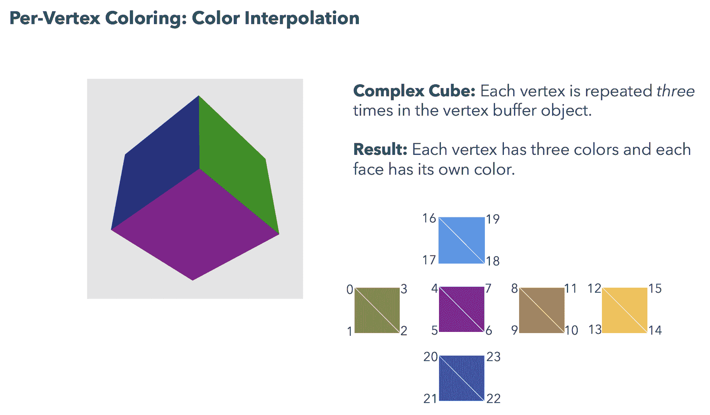

# 第六章：颜色、深度测试和 alpha 混合

在上一章中，我们介绍了全局与局部变换、矩阵栈、动画计时器和各种插值技术。在本章中，我们首先检查颜色在 WebGL 和 ESSL 中的结构和处理方式。我们将讨论在对象、光源和场景中使用颜色。然后，我们将看到 WebGL 如何利用深度缓冲区来处理当一个对象在另一个对象前面时，遮挡另一个对象的情况。最后，我们将介绍 alpha 混合，它允许我们在一个对象遮挡另一个对象时组合对象的颜色，同时也允许我们创建半透明对象。

在本章中，我们将涵盖以下主题：

+   在对象中使用颜色。

+   为光源分配颜色。

+   在 ESSL 程序中处理多个光源。

+   学习如何使用深度测试和 z 缓冲区。

+   学习如何使用混合函数和方程。

+   使用面剔除创建透明对象。

# 在 WebGL 中使用颜色

WebGL 为 RGB 模型提供了第四个属性。这个属性被称为**alpha 通道**。扩展后的模型被称为**RGBA**模型，其中 A 代表 alpha。alpha 通道包含一个介于`0.0`到`1.0`之间的值，就像其他三个通道（红色、绿色和蓝色）一样。以下图表显示了 RGBA 颜色空间。在水平轴上，你可以看到通过组合`R`、`G`和`B`通道可以获得的不同颜色。垂直轴对应于 alpha 通道：


alpha 通道携带有关颜色的额外信息。这些信息会影响颜色在屏幕上的渲染方式。在大多数情况下，alpha 值将表示颜色包含的不透明度。完全不透明的颜色将具有`1.0`的 alpha 值，而完全透明的颜色将具有`0.0`的 alpha 值。这是一般情况，但正如我们将看到的，当我们获得半透明颜色时，我们需要考虑其他因素。

透明与半透明

例如，玻璃对所有可见光都是透明的。半透明对象允许一些光通过它们。像磨砂玻璃和一些塑料这样的材料被称为半透明。当光线击中半透明材料时，只有一部分光线通过它们。

我们在我们的 WebGL 3D 场景中到处使用颜色：

+   **对象**：3D 对象可以通过为每个像素（片段）选择一个颜色或根据材料的漫反射属性选择对象将具有的颜色来进行着色。

+   **光源**：尽管我们一直在使用白光，但我们没有理由不能有环境或漫反射属性包含其他颜色的光源。

+   **场景**：我们场景的背景有一个颜色，我们可以通过调用`gl.clearColor`来改变它。此外，正如我们稍后将会看到的，需要对对象的颜色执行特殊操作以实现半透明效果。

# 对象中颜色的使用

如前几章所述，像素的最终颜色是通过设置一个输出 ESSL 变量在片段着色器中分配的。如果一个对象中的所有片段具有相同的颜色，我们可以说该对象具有恒定颜色。否则，该对象通常被认为是具有顶点颜色。

# 恒定着色

要获得恒定颜色，我们将所需颜色存储在一个传递到片段着色器的统一变量中。这个统一变量通常被称为对象的**漫反射材料属性**。我们还可以结合对象法线和光源信息来获取朗伯系数。我们可以使用朗伯系数按比例改变反射颜色，这取决于光线击中物体的角度。

如以下图所示，当我们不使用关于法线的信息来获取朗伯系数时，我们会失去深度感知。请注意，我们正在使用扩散光照模型：


# 顶点着色

在医疗和工程可视化应用中，我们常常会发现与我们要渲染的模型顶点相关的颜色图。这些图根据每个顶点的标量值分配颜色。这个想法的一个例子包括温度图表，它将蓝色表示为冷温度，将红色表示为热温度，并叠加在地图上。

要实现顶点着色，我们需要在顶点着色器中定义一个存储顶点颜色的属性：

```js
in vec4 aVertexColor;
```

下一步是将 `aVertexColor` 属性分配给一个变量，以便它可以传递到片段着色器。记住，变量是自动插值的。因此，每个片段的颜色将是其贡献顶点的加权结果。

如果我们想让我们的颜色图对光照条件敏感，我们可以将每个顶点颜色乘以光的漫反射分量。然后将结果分配给将要传递结果到片段着色器的变量。

以下图展示了这种情况下的两种不同可能性：在左侧，顶点颜色乘以光漫射项，没有来自光位置的加权；在右侧，朗伯系数生成预期的阴影，并提供了光源相对位置的信息：


在这里，我们正在使用一个映射到 `aVertexColor` 顶点着色器属性的顶点缓冲区对象。我们已经在 第二章，*渲染* 中学习了如何映射 VBO。

# 片段着色

我们也可以为我们渲染的对象的每个像素分配一个随机颜色。尽管 ESSL 没有预构建的随机函数，但我们可以使用算法来生成伪随机数。但话说回来，这种技术的目的和用途超出了本书的范围。

# 行动时间：给立方体上色

让我们来看一个简单的着色几何形状的例子：

1.  使用您的浏览器打开`ch06_01_cube.html`文件。您将看到一个类似于以下页面的页面：


1.  在这个练习中，我们将比较恒定颜色与顶点颜色。让我们谈谈页面的小部件：

    +   Lambert：当选中时，它将在最终颜色计算中包含 Lambert 系数。

    +   按顶点：之前解释过的两种着色方法：按顶点或恒定。

    +   复杂立方体：加载一个 JSON 对象，其中顶点被重复以获得每个顶点的多个法线和多个颜色。我们将在稍后解释这是如何工作的。

    +   Alpha 值：此滑块映射到顶点着色器中的`uAlpha`浮点统一变量。`uAlpha`设置顶点颜色的 alpha 值。

1.  通过点击“Lambert”禁用 Lambert 系数的使用。通过点击并拖动来旋转立方体。注意当 Lambert 系数不包括在最终颜色计算中时，深度感知的损失。Lambert 按钮映射到`uUseLambert`布尔统一变量。计算 Lambert 系数的代码可以在页面中包含的顶点着色器中找到：

```js
float lambertTerm = 1.0;

if (uUseLambert) {
  vec3 normal = vec3(uNormalMatrix * vec4(aVertexNormal, 1.0));
  vec3 lightDirection = normalize(-uLightPosition);
  lambertTerm = max(dot(normal, -lightDirection), 0.20);
}
```

1.  如果`uUseLambert`统一变量为`false`，则`lambertTerm`保持为`1.0`，不影响这里的最终漫反射项：

```js
Id = uLightDiffuse * uMaterialDiffuse * lambertTerm;
```

1.  否则，`Id`将包含 Lambert 系数。

1.  禁用 Lambert 后，点击“按顶点”按钮。旋转立方体以查看 ESSL 如何插值顶点颜色。允许我们从恒定漫反射颜色切换到顶点颜色的顶点着色器键代码片段使用`uUseVertexColors`布尔统一变量和`aVertexColor`属性。此片段在此处显示：

```js
if (uUseVertexColor) {
  Id = uLightDiffuse * aVertexColor * lambertTerm;
}
else {
  Id = uLightDiffuse * uMaterialDiffuse * lambertTerm;
}
```

1.  查看`common/models/geometries/cube-simple.json`文件。在那里，立方体的八个顶点在顶点数组中定义，并且对于每个顶点都有一个标量数组中的元素。正如您可能预期的，这些元素中的每一个都对应于相应的顶点颜色，如下所示：


1.  确保 Lambert 按钮未激活，然后点击“复杂立方体”按钮。通过在相应的 JSON 文件`common/models/geometries/cube-complex.json`中的顶点数组中重复顶点，我们可以实现独立的面着色。以下图表解释了`cube-complex.json`中顶点的组织方式。请注意，由于我们使用着色器属性定义颜色，我们需要重复每个颜色四次，因为每个面有四个顶点。这一想法在以下图表中展示：



1.  激活 Lambert 按钮以查看 Lambert 系数如何影响物体的颜色。尝试不同的按钮配置以查看会发生什么。

1.  让我们快速探索将 alpha 通道更改为小于`1.0`的值的效应。您看到了什么？请注意，对象并没有变得透明，而是开始失去颜色。要获得透明度，我们需要激活混合。我们将在本章的后面深入讨论混合。现在，在`configure`函数的源代码中取消注释这些行： 

```js
// gl.disable(gl.DEPTH_TEST);
// gl.enable(gl.BLEND);
// gl.blendFunc(gl.SRC_ALPHA, gl.ONE_MINUS_SRC_ALPHA);
```

1.  保存页面并在您的网络浏览器中重新加载。如果您选择顶点着色，复杂立方体并降低 alpha 值到`0.5`，您将看到以下截图类似的内容：


***发生了什么？***

我们研究了两种不同的对象着色方法：**常量着色**和**顶点着色**。在两种情况下，每个片段的最终颜色都是由片段着色器中的`out`限定符导出的颜色变量来指定的。

我们看到，通过激活 Lambert 系数的计算，我们获得了感知深度信息。

我们还看到，在我们的对象中重复顶点使我们能够获得不同的着色效果。例如，我们可以通过面而不是顶点来着色一个对象。

# 光照中的颜色使用

颜色是光照属性。在第三章中，我们学习了光照属性的数量取决于为场景选择的照明-反射模型。例如，使用 Lambertian 反射模型，我们只需要建模一个着色器统一变量：光照漫反射属性/颜色。相比之下，如果选择 Phong 反射模型，每个光源都需要有三个属性：环境光、漫反射和镜面反射颜色。

位置光

当着色器需要知道光照的位置时，通常将光照位置建模为一个统一变量。因此，具有位置光的光照模型将具有四个统一变量：环境光、漫反射、镜面反射和位置。

对于方向光，第四个统一变量是光的方向。更多信息，请参阅第三章，*灯光*。

我们已经看到，每个光照属性都由一个映射到着色器中`vec4`统一变量的 JavaScript 四元素数组表示。

作为快速提醒，我们应该使用哪些 WebGL 方法来检索和设置统一变量？在我们的情况下，我们用来将光照传递给着色器的两种方法如下：

+   `getUniformLocation`：在程序中定位统一变量并返回一个我们可以用来设置值的索引。

+   `uniform4fv`：由于光照分量是 RGBA，我们需要传递一个四元素浮点向量。

# 可扩展性问题

由于我们希望在场景中使用多个灯光，我们需要定义和映射所选光照模型的适当数量的统一变量。如果我们每个灯光有四个属性（环境、漫反射、镜面反射和位置），我们需要为每个灯光定义四个统一变量。如果我们想有三个灯光，我们需要编写、使用和映射十二个统一变量！在问题变得无法控制之前，我们需要解决这个问题。

# 我们可以使用多少统一变量？

OpenGL 着色语言 ES 规范定义了我们允许使用的统一变量的数量。

第 4.3.4 节 统一变量

对于每种着色器类型，可用于统一变量的存储量有一个实现相关的限制。如果超过这个限制，将导致编译时或链接时错误。

要找出你的 WebGL 实现的限制，你可以使用`gl.getParameter`函数和这些常量查询 WebGL：

```js
gl.MAX_VERTEX_UNIFORM_VECTORS
gl.MAX_FRAGMENT_UNIFORM_VECTORS
```

实现限制由您的浏览器提供，并且很大程度上取决于您的图形硬件。话虽如此，即使您的机器可能有足够的变量空间，这也并不意味着问题已经解决。我们仍然需要定义和映射每个统一变量，这通常会导致脆弱和冗长的代码，正如我们将在后面的练习中看到的。

# 简化问题

为了简化问题，我们可以假设所有灯光的环境分量是相同的。这将减少统一变量的数量——每个灯光少一个统一变量。然而，这并不是一个适用于更一般情况的扩展解决方案，在这种情况下，我们不能假设环境光恒定。

在我们深入探讨具有多个灯光的场景之前，让我们更新我们的架构以涵盖我们已解决的一些概念。

# 架构更新

随着我们通过这本书的进展，我们继续在适当的地方改进我们的架构，以反映我们所学的知识。在这个场合，我们将改进传递统一变量到程序的方式，并添加支持处理大量统一变量以定义多个灯光。

# 添加对光对象的支持

让我们详细地介绍这些变化。我们创建了一个新的 JavaScript 模块`Lights.js`，它包含两个对象：

+   `Light`：将光属性（位置、漫反射、镜面反射等）聚合在一个单一实体中。

+   `LightsManager`：包含场景中的灯光。这允许我们通过`index`或`name`检索每个灯光。

`LightsManager`还包含`getArray`方法，通过类型将属性数组扁平化：

```js
getArray(type) {
  return this.list.reduce((result, light) => {
    result = result.concat(light[type]);
    return result;
  }, []);
}
```

这将在我们稍后使用统一数组时很有用。

# 改进传递统一变量到程序的方式

我们还改进了传递统一变量的方式。在`configure`中，我们可以看到我们是如何将属性和统一变量传递给`program.load`，而不是像在介绍章节中那样手动将它们附加到实例上。

`configure` 函数是加载程序的适当位置。我们还将创建 JavaScript 变量和统一变量之间的动态映射。考虑到这一点，我们已经更新了 `program.load` 方法，使其接收两个数组：

+   `attributes`：一个数组，包含我们将要在 JavaScript 和 ESSL 之间映射的属性名称。

+   `uniforms`：一个数组，包含我们将要在 JavaScript 和 ESSL 之间映射的统一变量名称。

函数的实现现在如下所示：

```js
// Load up the given attributes and uniforms from the given values
load(attributes, uniforms) {
  this.useProgram();
  this.setAttributeLocations(attributes);
  this.setUniformLocations(uniforms);
}
```

最后两行对应于两个新函数，`setAttributeLocations` 和 `setUniformLocations`：

```js
// Set references to attributes onto the program instance
setAttributeLocations(attributes) {
  attributes.forEach(attribute => {
    this[attribute] = this.gl.getAttribLocation(this.program, attribute);
  });
}

// Set references to uniforms onto the program instance
setUniformLocations(uniforms) {
  uniforms.forEach(uniform => {
    this[uniform] = this.gl.getUniformLocation(this.program, uniform);
  });
}
```

如您所见，这些函数分别查找属性和统一变量列表，然后将位置作为属性附加到 `Program` 实例上。

简而言之，如果我们将 `uLightPosition` 统一变量名称包含在传递给 `program.load` 的 `uniforms` 列表中，那么我们就会有一个 `program.uLightPosition` 属性，它将包含相应统一变量的位置！真不错！

一旦我们在 `configure` 函数中加载了程序，我们可以立即使用以下代码初始化统一变量的值：

```js
gl.uniform3fv(program.uLightPosition, value);
```

# 动手实践：向场景添加蓝色光源

我们已经准备好查看本章的第一个示例。我们将在一个具有三个光源的**每片段**光照的场景中工作。

每个光源都有一个位置和漫反射颜色属性。这意味着每个光源都有两个统一变量。执行以下步骤：

1.  为了保持简单，我们假设所有三个光源的漫反射颜色相同。我们还去除了镜面反射属性。在您的浏览器中打开 `ch06_02_wall_initial.html` 文件。

1.  您将看到如下截图所示的场景，其中两个光源（红色和绿色）照亮了一面黑色墙壁：


1.  使用您的代码编辑器打开 `ch06_02_wall-initial.html` 文件。我们将更新顶点着色器、片段着色器、JavaScript 代码和 HTML 代码以添加蓝色光源。

1.  **更新顶点着色器**：转到可以看到这两个统一变量的顶点着色器：

```js
uniform vec3 uPositionRedLight; 
uniform vec3 uPositionGreenLight; 
```

1.  让我们在那里添加第三个统一变量：

```js
uniform vec3 uPositionBlueLight;
```

1.  我们还需要定义一个变量来携带插值后的光线方向到片段着色器。记住，这里我们使用的是每片段光照。检查变量在哪里定义：

```js
out vec3 vRedRay;
out vec3 vGreenRay;
```

1.  然后，在那里添加第三个变量：

```js
out vec3 vBlueRay;
```

1.  让我们看看顶点着色器的主体。我们需要根据场景中的位置更新每个光源的位置。我们通过编写以下代码来实现：

```js
vec4 blueLightPosition = uModelViewMatrix * vec4(uPositionBlueLight, 1.0);
```

1.  注意，其他两个光源的位置也在被计算。

1.  让我们计算从我们的蓝色光源到当前顶点的光线。我们通过编写以下代码来完成：

```js
vBlueRay = vertex.xyz - blueLightPosition.xyz;
```

1.  这就是我们需要在顶点着色器中修改的所有内容。

1.  到目前为止，我们已经包含了一个新的光源位置，并在顶点着色器中计算了光线。这些光线将由片段着色器进行插值。

1.  让我们通过包含我们新的蓝色光源源来计算墙上颜色的变化。滚动到片段着色器并添加一个新的统一变量——蓝色漫反射属性。查找在`main`函数之前声明的以下统一变量：

```js
uniform vec4 uDiffuseRedLight;
uniform vec4 uDiffuseGreenLight;
```

1.  插入以下行：

```js
uniform vec4 uDiffuseBlueLight;
```

1.  为了计算蓝色光源对最终颜色的贡献，我们需要获取在顶点着色器中定义的先前光线。这个变量在片段着色器中可用。您还需要在`main`函数之前声明它。查找以下：

```js
in vec3 vRedRay;
in vec3 vGreenRay;
```

1.  在其下方插入以下代码：

```js
in vec3 vBlueRay;
```

1.  假设所有光源的环境分量都是相同的。这在代码中通过只有一个`uLightAmbient`变量来反映。环境项`Ia`是`uLightAmbient`和墙壁材料环境属性的乘积：

```js
// ambient Term
vec4 Ia = uLightAmbient * uMaterialAmbient;
```

1.  如果`uLightAmbient`设置为`(1.0, 1.0, 1.0, 1.0)`且`uMaterialAmbient`设置为`(0.1, 0.1, 0.1, 1.0)`，则结果环境项`Ia`将非常小。这意味着在这个场景中环境光的影响将很低。相比之下，漫反射分量对每个光源都是不同的。

1.  让我们添加蓝色漫反射项的效果。在片段着色器的主函数中，查找以下代码：

```js
// diffuse Term
vec4 Id1 = vec4(0.0, 0.0, 0.0, 1.0);
vec4 Id2 = vec4(0.0, 0.0, 0.0, 1.0);
```

1.  在其下方立即添加以下行：

```js
vec4 Id3 = vec4(0.0, 0.0, 0.0, 1.0);
```

1.  滚动到以下：

```js
float lambertTermOne = dot(N, -normalize(vRedRay));
float lambertTermTwo = dot(N, -normalize(vGreenRay));
```

1.  在其下方添加以下行：

```js
float lambertTermThree = dot(N, -normalize(vBlueRay));
```

1.  滚动到以下：

```js
if (lambertTermOne > uCutOff) {
  Id1 = uDiffuseRedLight * uMaterialDiffuse * lambertTermOne;
}

if (lambertTermTwo > uCutOff) {
  Id2 = uDiffuseGreenLight * uMaterialDiffuse * lambertTermTwo;
}
```

1.  在其后插入以下代码：

```js
if (lambertTermThree > uCutOff) {
  Id3 = uDiffuseBlueLight * uMaterialDiffuse * lambertTermTwo;
}
```

1.  更新`fragColor`以包含`Id3`：

```js
fragColor = vec4(vec3(Ia + Id1 + Id2 + Id3), 1.0);
```

1.  这就是在片段着色器中需要做的所有事情。让我们继续到我们的 JavaScript 代码。到目前为止，我们已经编写了处理着色器中一个额外光源所需的代码。让我们看看我们如何从 JavaScript 端创建蓝色光源并将其映射到着色器中。滚动到`configure`函数并查找以下代码：

```js
const redLight = new Light('redLight');
redLight.setPosition(redLightPosition);
redLight.setDiffuse([1, 0, 0, 1]);

const greenLight = new Light('greenLight');
greenLight.setPosition(greenLightPosition);
greenLight.setDiffuse([0, 1, 0, 1]);
```

1.  插入以下代码：

```js
const blue = new Light('blueLight');
blue.setPosition([-2.5, 3, 3]);
blue.setDiffuse([0.0, 0.0, 1.0, 1.0]);
```

1.  滚动到定义`uniforms`列表的位置。如前所述，这种新机制使得获取统一变量的位置更容易。添加我们用于蓝色光源的两个新统一变量：`uDiffuseBlueLight`和`uPositionBlueLight`。列表应如下所示：

```js
const uniforms = [
  'uProjectionMatrix',
  'uModelViewMatrix',
  'uNormalMatrix',
  'uMaterialDiffuse',
  'uMaterialAmbient',
  'uLightAmbient',
  'uDiffuseRedLight',
  'uDiffuseGreenLight',
 'uDiffuseBlueLight',  'uPositionRedLight',
  'uPositionGreenLight',
 'uPositionBlueLight',  'uWireframe',
  'uLightSource',
  'uCutOff'
];
```

1.  让我们将新定义的光源的位置和漫反射值传递给`program`。在加载`program`的行之后找到以下行，并做出必要的更改：

```js
gl.uniform3fv(program.uPositionRedLight, redLight.position);
gl.uniform3fv(program.uPositionGreenLight, greenLight.position);
gl.uniform3fv(program.uPositionBlueLight, blueLight.position); 
gl.uniform4fv(program.uDiffuseRedLight, redLight.diffuse);
gl.uniform4fv(program.uDiffuseGreenLight, greenLight.diffuse);
gl.uniform4fv(program.uDiffuseBlueLight, blueLight.diffuse);
```

统一数组

每个光源使用一个统一的编码会使代码变得相当冗长。稍后我们将介绍如何使用统一数组来简化代码。

1.  让我们更新`load`函数。我们需要一个新的球体来表示蓝色光源，就像场景中已经有了两个球体一样：一个用于红色光源，另一个用于绿色光源。添加以下行：

```js
scene.load('/common/models/geometries/sphere3.json', 'blueLight');
```

1.  正如我们在 `load` 函数中看到的，我们正在加载相同的几何体（球体）三次。为了区分代表光源的球体，我们正在使用球体的局部变换（最初以原点为中心）。滚动到 `render` 函数并找到以下代码行：

```js
const modelViewMatrix = transforms.modelViewMatrix;

if (object.alias === 'redLight') {
  mat4.translate(
    modelViewMatrix, modelViewMatrix, 
    program.getUniform(program.uPositionRedLight)
  );
  object.diffuse = program.getUniform(program.uDiffuseRedLight);
  gl.uniform1i(program.uLightSource, true);
}

if (object.alias === 'greenLight') {
  mat4.translate(
    modelViewMatrix, modelViewMatrix,
    program.getUniform(program.uPositionGreenLight)
  );
  object.diffuse = program.getUniform(program.uDiffuseGreenLight);
  gl.uniform1i(program.uLightSource, true);
}
```

1.  添加以下代码：

```js
if (object.alias === 'blueLight') {
  mat4.translate(
    modelViewMatrix, modelViewMatrix,
    program.getUniform(program.uPositionBlueLight)
  );
  object.diffuse = program.getUniform(program.uDiffuseBlueLight);
  gl.uniform1i(program.uLightSource, true);
}
```

1.  就这样！将页面保存为不同的名称并在浏览器中测试它：


1.  如果你没有得到预期的结果，请返回并检查步骤。你可以在 `ch06_03_wall-final.html` 文件中找到完成的练习。

***发生了什么？***

我们通过添加一个额外的灯光：一个蓝色灯光，修改了我们的示例场景。我们更新了以下内容：

+   顶点着色器

+   片段着色器

+   `configure` 函数

+   `load` 函数

+   `draw` 函数

正如你所见，一次处理一个光属性并不非常高效。在本章的后面部分，我们将研究一种更有效的方法来处理 WebGL 场景中的灯光。

# 尝试一下：添加交互性

我们将向我们的控件小部件添加一个额外的滑块，以交互式地改变我们刚刚添加的蓝色灯光的位置。

我们将使用 **dat.GUI**，为每个蓝色光坐标创建一个。

dat.GUI

你可以在 GitHub 上找到有关 dat.GUI 的更多信息：[`github.com/dataarts/dat.gui`](https://github.com/dataarts/dat.gui)。

1.  创建三个滑块：一个用于蓝色光的 `X` 坐标，一个用于 `Y` 坐标，第三个用于 `Z` 坐标。

1.  最终的 GUI 应该包括新的蓝色光滑块，它们应该看起来像以下这样：


1.  使用页面上的滑块来指导你的工作。

1.  你可以在 `ch06_03_wall-final.html` 文件中找到完成的练习。

# 使用均匀数组处理多个灯光

正如我们所见，使用单独的均匀量处理光属性使代码冗长且难以维护。幸运的是，ESSL 提供了我们可以用来解决处理多个灯光问题的几个机制。其中之一是 **均匀数组**。

这种技术通过在着色器中引入可枚举的向量数组，使我们能够处理多个灯光。这允许我们通过在着色器中迭代灯光数组来计算光贡献。我们仍然需要在 JavaScript 中定义每个灯光，但由于我们不是为每个灯光属性定义一个均匀量，因此将映射到 ESSL 变得更简单。让我们看看这个技术是如何工作的。我们只需要在我们的代码中进行两个简单的更改。

# 均匀数组声明

首先，我们需要在我们的 ESSL 着色器内部声明光均匀数组。例如，包含三个灯光的光位置看起来是这样的：

```js
uniform vec3 uPositionLight[3];
```

重要的是要注意，ESSL 不支持动态初始化均匀数组。我们可以尝试以下方法：

```js
uniform int numLights;
uniform vec3 uPositionLight[numLights]; // will not work
```

如果是这样，着色器将无法编译，你将获得以下错误：

```js
ERROR: 0:12 — constant expression required
ERROR: 0:12 — array size must be a constant integer expression
```

然而，这个结构是有效的：

```js
const int numLights = 3;
uniform vec3 uPositionLight[numLights]; // will work 
```

我们为每个灯光属性声明一个统一的数组，无论我们将有多少灯光。因此，如果我们想传递关于五个灯光的漫反射和镜面反射组件的信息，例如，我们需要声明两个统一的数组，如下所示：

```js
uniform vec4 uDiffuseLight[5];
uniform vec4 uSpecularLight[5];
```

# JavaScript 数组映射

接下来，我们需要将包含灯光属性信息的 JavaScript 变量映射到程序中。例如，我们可能想要映射这三个灯光位置：

```js
const lightPosition1 = [0, 7, 3];
const lightPosition2 = [2.5, 3, 3];
const lightPosition3 = [-2.5, 3, 3];
```

如果是这样，我们需要检索统一数组的位置（就像在其他任何情况下一样）：

```js
const location = gl.getUniformLocation(program, 'uPositionLight');
```

唯一的不同之处在于我们将这些位置映射为一个连接的扁平数组：

```js
gl.uniform3fv(location, [0, 7, 3, 2.5, 3, 3, -2.5, 3, 3]);
```

这里有两个重要的点：

+   传递给`getUniformLocation`的统一变量的名称与之前相同。当使用`getUniformLocation`定位统一变量时，`uPositionLight`现在是一个数组这一事实并没有改变任何事情。

+   我们传递给统一的 JavaScript 数组是一个扁平数组。如果你按照以下方式编写，映射将不会工作：

```js
gl.uniform3fv(location, [
  [0, 7, 3],
  [2.5, 3, 3],
  [-2.5, 3, 3]
]);
```

因此，如果你为每个灯光有一个变量，你应该在将它们传递给着色器之前确保将它们连接起来。

# 动手时间：向场景添加白光

让我们看看如何向场景中添加一个新灯光的例子：

1.  在浏览器中打开`ch06_04_wall-light-arrays.html`文件。这个场景看起来与`ch06_03_wall-final.html`完全一样；然而，代码要简单得多，因为我们现在正在使用统一数组。让我们看看使用统一数组是如何改变我们的代码的。

1.  在你的代码编辑器中打开`ch06_04_wall-light-arrays.html`文件。让我们看看顶点着色器。注意使用常量整数表达式`const int numLights = 3;`来声明着色器将处理的灯光数量。

1.  在那里，你还可以看到正在使用统一数组来操作灯光位置。请注意，我们正在使用一个可变数组将光线（针对每个灯光）传递到片段着色器中：

```js
for(int i = 0; i < numLights; i++) {
  vec4 lightPosition = uModelViewMatrix * vec4(uLightPosition[i], 
   1.0);
  vLightRay[i] = vertex.xyz - lightPosition.xyz;
}
```

1.  这段代码计算每个灯光的一个可变光线。回想一下，`ch06_03_wall-final.html`文件中的相同代码看起来如下：

```js
vec4 redLightPosition = uModelViewMatrix * vec4(uPositionRedLight, 
 1.0);
vec4 greenLightPosition = uModelViewMatrix * 
 vec4(uPositionGreenLight, 1.0);
vec4 blueLightPosition = uModelViewMatrix * 
 vec4(uPositionBlueLight, 1.0);

vRedRay = vertex.xyz - redLightPosition.xyz;
vGreenRay = vertex.xyz - greenLightPosition.xyz;
vBlueRay = vertex.xyz - blueLightPosition.xyz;
```

1.  一旦比较了这两个片段，使用统一数组（和可变数组）的优势应该就很明显了。

1.  片段着色器也使用统一数组。在这种情况下，片段着色器遍历灯光的漫反射属性来计算每个灯光对最终颜色在墙面上的贡献：

```js
for(int i = 0; i < numLights; i++) {
  L = normalize(vLightRay[i]);
  lambertTerm = dot(N, -L);
  if (lambertTerm > uCutOff) {
    finalColor += uLightDiffuse[i] * uMaterialDiffuse * lambertTerm;
  }
}
```

1.  为了简洁起见，我们不会涵盖`ch06_03_wall-final.html`练习中的冗长版本，但你应该亲自查看并与这个版本进行比较。

1.  在`configure`函数中，通过省略其他不必要的灯光属性，包含统一名称的 JavaScript 数组的大小已经显著减小：

```js
const uniforms = [
  'uPerspectiveMatrix',
  'uModelViewMatrix',
  'uNormalMatrix',
  'uMaterialDiffuse',
  'uMaterialAmbient',
  'uLightAmbient',
  'uLightDiffuse',
  'uLightPosition',
  'uWireframe',
  'uLightSource',
  'uCutOff'
];
```

1.  由于`LightsManager`类的`getArray`方法，JavaScript 灯光和统一数组之间的映射现在更简单了。正如我们之前所描述的，`getArray`方法将灯光的数据连接成一个扁平数组。

1.  `load` 和 `render` 函数看起来完全一样。如果我们想添加一个新光源，我们仍然需要使用 `load` 函数加载一个新的球体（在我们的场景中代表光源），我们仍然需要在 `render` 函数中将球体转换到适当的位置。

1.  让我们看看添加新光源需要多少工作量。转到 `configure` 函数并创建一个新的光源对象，如下所示：

```js
const whiteLight = new Light('whiteLight');
whiteLight.setPosition([0, 10, 2]);
whiteLight.setDiffuse([1.0, 1.0, 1.0, 1.0]);
```

1.  将 `whiteLight` 添加到 `lights` 实例中：

```js
lights.add(whiteLight);
```

1.  移动到 `load` 函数并添加以下行：

```js
scene.load('/common/models/geometries/sphere3.json', 'whiteLight');
```

1.  就像在之前的 *Time for Action* 部分，将以下内容添加到 `render` 函数中：

```js
if (object.alias === 'whiteLight') {
  const whiteLight = lights.get(object.alias);
  mat4.translate(modelViewMatrix, modelViewMatrix, 
   whiteLight.position);
  object.diffuse = whiteLight.diffuse;
  gl.uniform1i(program.uLightSource, true);
}
```

1.  使用不同的名称保存网页，并使用您的浏览器打开它。我们还在 `ch06_05_wall-light-arrays-final.html` 中包含了完成的练习，包括一些对保持灯光配置更声明式的微小改进。以下图表显示了最终结果：


这就是你需要做的全部！如果你想要使用控件部件控制白色光源的属性，你需要编写相应的代码。

# Time for Action: Directional Point Lights

在 第三章，*灯光* 中，我们比较了方向光和位置光：


在点光源中，对于物体表面的每一个点，我们计算从光源到表面该点的方向。然后我们做与方向光相同的事情。记住，我们取了表面法线（表面面向的方向）和光方向的点积。如果两个方向匹配，这将给我们一个值为 `1` 的值，这意味着片段应该完全照亮，如果两个方向垂直，则为 `0`，如果它们相反，则为 `-1`。我们直接使用那个值来乘以表面的颜色，这样就得到了光照。

在本节中，我们将结合方向光和位置光。我们将创建第三种光源：一种**方向点光源**，通常称为**聚光灯**。这种光具有位置和方向属性。我们已经准备好这样做，因为我们的着色器可以轻松处理具有多个属性的光源：


创建这些光源的技巧是从每个顶点的法线中减去光方向向量。得到的向量将创建一个不同的朗伯系数，该系数将反射到由光源产生的锥体中：

1.  在浏览器中打开 `ch06_06_wall-spot-light.html`。如您所见，现在有三个光源现在都有一个方向：


1.  在您的源代码编辑器中打开 `ch06_06_wall-spot-light.html`。

1.  要创建一个光锥，我们需要为每个片段获取一个朗伯系数。正如我们在之前的例子中所做的那样，我们通过计算反转光线的点积和插值后的法线来获取这些系数。到目前为止，我们一直使用一个变量来完成这个任务：`vNormal`。

1.  到目前为止，一个变量已经足够，因为我们不需要更新法线，无论场景中有多少灯光。然而，要创建方向性点光源，我们必须更新法线，因为每个光源的方向将创建不同的法线。因此，我们用**变量数组**替换`vNormal`：

```js
out vec3 vNormal[numLights];
```

1.  减去光线方向从法线的行发生在`for`循环内部。这是因为我们为场景中的每个光源都这样做，因为每个光源都有自己的光线方向：

```js
for(int i = 0; i < numLights; i++) {
  vec4 positionLight = uModelViewMatrix * vec4(uLightPosition[i], 
   1.0);
  vec3 directionLight = vec3(uNormalMatrix * 
   vec4(uLightDirection[i], 1.0));
  vNormal[i] = normal - directionLight;
  vLightRay[i] = vertex.xyz - positionLight.xyz;
}
```

1.  在这里，光线方向通过法线矩阵变换，而光线位置通过模型-视图矩阵变换。

1.  在片段着色器中，我们计算朗伯系数：每个光源和片段一个。关键的区别在于片段着色器中的这一行：

```js
N = normalize(vNormal[i]);
```

1.  在这里，我们为每个光源获取插值后的更新后的法线。

1.  让我们通过限制允许的朗伯系数来创建一个截止值。在片段着色器中，至少有两种不同的方法来获取一个光锥。第一种方法是将朗伯系数限制在高于`uCutOff`统一变量（截止值）以上。让我们看看片段着色器：

```js
if (lambertTerm > uCutOff) {
  finalColor += uLightDiffuse[i] * uMaterialDiffuse;
}
```

1.  朗伯系数是反射光线与表面法线之间角度的余弦值。如果光线垂直于表面，我们将获得最高的朗伯系数，并且当我们远离中心时，朗伯系数将按照余弦函数变化，直到光线完全平行于表面。这将在法线和光线之间产生`90`度的余弦值。这产生了一个为零的朗伯系数：


1.  如果还没有这样做，请在您的浏览器中打开`ch06_06_wall-spot-light.html`。使用页面上的截止滑块。注意这如何通过使光锥变宽或变窄来影响光锥。在调整滑块后，你可能注意到这些灯光看起来不太真实。原因是最终的颜色与您获得的朗伯系数无关：只要朗伯系数高于设置的截止值，您就会从三个光源中获得完整的漫反射贡献。

1.  为了细化结果，请使用您的源代码编辑器打开网页。然后，转到片段着色器，并将计算最终颜色的行中的朗伯系数相乘：

```js
finalColor += uLightDiffuse[i] * uMaterialDiffuse * lambertTerm;
```

1.  使用不同的名称保存网页（这样你可以保留原始版本），然后在你的网络浏览器中加载它。你会注意到，随着你离开墙上每个光源反射的中心，光颜色会衰减。这可能看起来更好，但有一个更简单的方法来创建更逼真的光截止值：


1.  让我们使用**指数衰减因子**来创建一个截止值。在片段着色器中找到以下代码：

```js
if (lambertTerm > uCutOff) {
  finalColor += uLightDiffuse[i] * uMaterialDiffuse * lambertTerm;
}
```

1.  用以下内容替换它：

```js
finalColor += uLightDiffuse[i] * uMaterialDiffuse * pow(lambertTerm, 10.0 * uCutOff);
```

1.  注意我们已经移除了`if`条件。这次，衰减因子是`pow(lambertTerm, 10.0 * uCutOff);`。

1.  这种修改是有效的，因为因子以指数方式衰减最终颜色。如果 Lambert 系数接近零，最终颜色将被严重衰减：


1.  使用不同的名称保存网页并在你的浏览器中加载它。改进是显著的：


我们在这里包括了完成的练习：

+   `ch06_07_wall-spot-light-proportional.html`

+   `ch06_08_wall-spot-light-exponential.html`

***发生了什么？***

我们已经学习了如何实现方向性点光源。我们还讨论了改善光照效果的衰减因子。

# 场景中颜色的使用

现在是时候讨论透明度和 alpha 混合了。如前所述，alpha 通道可以携带关于物体颜色不透明度的信息。然而，正如我们在立方体示例中看到的，除非激活 alpha 混合，否则无法获得半透明物体。当场景中有多个物体时，事情会变得稍微复杂一些。为了管理这些困难，我们需要学习如何操作以使场景中的半透明和不透明物体保持一致。

# 透明度

渲染透明物体的第一种方法是使用**多边形 stippling**。这种技术包括丢弃一些片段，以便你可以透过物体看到。想象一下在你的物体表面打一些小孔。

OpenGL 通过`glPolygonStipple`函数支持多边形 stippling。这个函数在 WebGL 中不可用。你可以尝试通过在片段着色器中使用 ESSL discard 命令丢弃一些片段来复制这个功能。

更常见的是，我们可以使用 alpha 通道信息来获得半透明物体。然而，正如我们在立方体示例中看到的，修改 alpha 值并不会自动产生透明度。

创建透明度相当于改变我们已写入帧缓冲区的片段。例如，考虑一个场景，其中有一个不透明物体前面的半透明物体（从我们的摄像机视角看）。为了正确渲染场景，我们需要能够通过半透明物体看到不透明物体。因此，远物体和近物体之间的重叠片段需要以某种方式组合，以创建透明效果。

当场景中只有一个半透明物体时，这个想法同样适用。唯一的区别是，远片段对应于物体的背面，而近片段对应于物体的正面。在这种情况下，为了产生透明效果，需要将远片段和近片段组合。

为了正确渲染透明表面，我们需要了解两个重要的 WebGL 概念：**深度测试**和**alpha 混合**。

# 更新渲染管线

深度测试和 alpha 混合是片段经过片段着色器处理后的两个可选阶段。如果深度测试未激活，所有片段将自动可用于 alpha 混合。如果启用深度测试，那些未通过测试的片段将被管线自动丢弃，并且将不再可用于任何其他操作。这意味着丢弃的片段将不会被渲染。这种行为类似于使用 ESSL 丢弃命令。

以下图显示了深度测试和 alpha 混合执行的顺序：


现在，让我们看看深度测试是什么以及为什么它与 alpha 混合相关。

# 深度测试

每个由片段着色器处理的片段都携带一个相关的深度值。尽管片段是二维的，因为它们是在屏幕上渲染的，但深度值保留了片段与摄像机（屏幕）的距离信息。深度值存储在名为**深度缓冲区**或**z 缓冲区**的特殊 WebGL 缓冲区中。`z`来自`x`和`y`值对应于片段的屏幕坐标，而`z`值测量垂直于屏幕的距离。

在片段被片段着色器计算之后，它将可用于深度测试。这仅在启用深度测试的情况下才会发生。假设`gl`是包含我们的 WebGL 上下文的 JavaScript 变量，我们可以通过编写以下代码来启用深度测试：

```js
gl.enable(gl.DEPTH_TEST);
```

深度测试考虑了片段的深度值，并将其与已存储在深度缓冲区中的相同片段坐标的深度值进行比较。深度测试确定该片段是否被接受在渲染管线中进行进一步处理。

只有通过深度测试的片段将被处理。任何未通过深度测试的片段将被丢弃。

在正常情况下，当启用深度测试时，只有那些深度值低于深度缓冲区中相应片段的片段将被接受。

深度测试与渲染顺序是可交换的操作。这意味着无论哪个对象先被渲染，只要启用了深度测试，我们总是会得到一个一致的场景。

让我们用一个例子来说明这一点。以下图包含一个圆锥体和一个球体。使用以下代码禁用深度测试：

```js
gl.disable(gl.DEPTH_TEST);
```

首先渲染球体。正如预期的那样，当渲染圆锥体时，与圆锥体重叠的圆锥体片段不会被丢弃。这是因为重叠片段之间没有深度测试：


现在，让我们启用深度测试并渲染相同的场景。首先渲染球体。由于所有与球体重叠的圆锥体片段的深度值更高（它们离摄像机更远），这些片段未能通过深度测试并被丢弃，从而创建了一个一致的场景。

# 深度函数

在某些应用中，我们可能希望改变深度测试的默认行为，该行为会丢弃深度值高于深度缓冲区中相应片段的片段。为此，WebGL 提供了`gl.depthFunc(function)`方法。

此方法只有一个参数，即要使用的`function`：

| **参数** | **描述** |
| --- | --- |
| `gl.NEVER` | 深度测试始终失败。 |
| `gl.LESS` | 只有深度值低于深度缓冲区中当前片段的片段将通过测试。 |
| `gl.LEQUAL` | 深度值小于或等于深度缓冲区中相应当前片段的片段将通过测试。 |
| `gl.EQUAL` | 只有与深度缓冲区中当前片段具有相同深度的片段将通过测试。 |
| `gl.NOTEQUAL` | 只有那些与深度缓冲区中的片段深度值不同的片段将通过测试。 |
| `gl.GEQUAL` | 深度值大于或等于的片段将通过测试。 |
| `gl.GREATER` | 只有深度值更大的片段将通过测试。 |
| `gl.ALWAYS` | 深度测试始终通过。 |

WebGL 中默认禁用深度测试。当启用时，如果没有设置深度函数，则默认选择`gl.LESS`函数。

# Alpha 混合

只有当片段通过了深度测试时，才可用于 alpha 混合。默认情况下，深度测试是禁用的，这使得所有片段都可用于 alpha 混合。

使用以下代码行启用 alpha 混合：

```js
gl.enable(gl.BLEND);
```

对于每个可用的片段，alpha 混合操作通过适当的片段坐标从帧缓冲区中读取颜色，并根据片段着色器中先前计算的颜色与帧缓冲区中的颜色之间的线性插值创建一个新的颜色。

Alpha 混合

WebGL 中默认禁用 alpha 混合。

# 混合函数

在启用混合之后，下一步是定义一个混合函数。这个函数将确定从对象（源）中提取的片段颜色如何与帧缓冲区中现有的片段颜色（目标）结合。

我们将源和目标颜色组合如下：

```js
color = S * sW + D * dW;
```

更精确地说：

+   `S`: 源颜色（vec4）

+   `D`: 目标颜色（vec4）

+   `sW`: 源缩放因子

+   `dW`: 目标缩放因子

+   `S.rgb`: 源颜色的 RGB 分量

+   `S.a`: 源颜色的 alpha 分量

+   `D.rgb`: 目标颜色的 RGB 分量

+   `D.a`: 目标颜色的 alpha 分量

需要注意的是，渲染顺序将决定源片段和目标片段。参考上一节的示例，如果首先渲染球体，那么它将成为混合操作的目标，因为当锥体被渲染时，球体片段已经被存储在帧缓冲区中。换句话说，从渲染顺序的角度来看，alpha 混合是一个非交换的操作：


# 独立混合函数

还可以独立于 alpha 通道确定 RGB 通道如何组合。为此，我们使用`gl.blendFuncSeparate`函数。

我们以这种方式定义两个独立的函数：

```js
color = S.rgb * sW.rgb + D.rgb * dW.rgb;
alpha = S.a * sW.a + D.a * dW.a;
```

更精确地说：

+   `sW.rgb`: 源 RGB 分量

+   `dW.rgb`: 目标 RGB 的缩放因子（仅 RGB）

+   `sW.a`: 源 alpha 值的缩放因子

+   `dW.a`: 目标 alpha 值的缩放因子

然后，我们可能得到以下内容：

```js
color = S.rgb * S.a + D.rbg * (1.0 - S.a);
alpha = S.a * 1.0 + D.a * 0.0;
```

这将被转换为以下代码：

```js
gl.blendFuncSeparate(gl.SRC_ALPHA, gl.ONE_MINUS_SRC_ALPHA, gl.ONE, gl.ZERO);
```

`gl.blendFuncSeparate`函数的参数与`gl.blendFunc`相同。你可以在本节的后面找到更多关于这些函数的信息。

# 混合方程

我们可能遇到不想使用缩放或加法操作来插值源和目标片段颜色的情况。例如，我们可能想要从其中一个中减去另一个。在这种情况下，WebGL 提供了`gl.blendEquation`函数。这个函数接收一个参数，该参数确定对缩放后的源和目标片段颜色进行的操作。例如，`gl.blendEquation(gl.FUNC_ADD)`的计算如下：

```js
color = S * sW + D * dW;
```

并且，`gl.blendEquation(gl.FUNC_SUBTRACT)`对应以下内容：

```js
color = S * sW - D  * dW;
```

还有一个第三种选择，`gl.blendEquation(gl.FUNC_REVERSE_SUBTRACT)`，对应以下内容：

```js
color = D* dw - S * sW;
```

如预期的那样，你可以分别为 RGB 通道和 alpha 通道定义混合方程。为此，我们使用`gl.blendEquationSeparate`函数。

# 混合颜色

WebGL 提供了`gl.CONSTANT_COLOR`和`gl.ONE_MINUS_CONSTANT_COLOR`缩放因子。这些缩放因子可以与`gl.blendFunc`和`gl.blendFuncSeparate`一起使用。然而，我们首先需要建立混合颜色。我们通过调用`gl.blendColor`来实现这一点。

# WebGL Alpha-Blending API

以下表格总结了与执行 alpha 混合操作相关的 WebGL 函数：

| **WebGL 函数** | **描述** |
| --- | --- |
| `gl.enable | disable(gl.BLEND)` | 启用/禁用混合。 |

| `gl.blendFunc(sW, dW)` | 指定像素算术。`sW` 和 `dW` 的有效值如下：

+   `ZERO`

+   `ONE`

+   `SRC_COLOR`

+   `DST_COLOR`

+   `SRC_ALPHA`

+   `DST_ALPHA`

+   `CONSTANT_COLOR`

+   `CONSTANT_ALPHA`

+   `ONE_MINUS_SRC_ALPHA`

+   `ONE_MINUS_DST_ALPHA`

+   `ONE_MINUS_SRC_COLOR`

+   `ONE_MINUS_DST_COLOR`

+   `ONE_MINUS_CONSTANT_COLOR`

+   `ONE_MINUS_CONSTANT_ALPHA`

此外，`sW` 还可以是 `SRC_ALPHA_SATURATE`。|

| `gl.blendFuncSeparate(sW_rgb, dW_rgb, sW_a, dW_a)` | 分别指定 RGB 和 alpha 组件的像素算术。 |
| --- | --- |

| `gl.blendEquation(mode)` | 指定用于 RGB 混合方程和 alpha 混合方程的方程。`mode` 的有效值如下：

+   `gl.FUNC_ADD`

+   `gl.FUNC_SUBTRACT`

+   `gl.FUNC_REVERSE_SUBTRACT`

|

| `gl.blendEquationSeparate(modeRGB, modeAlpha)` | 分别设置 RGB 混合方程和 alpha 混合方程。 |
| --- | --- |
| `gl.blendColor(red, green, blue, alpha)` | 设置混合颜色。 |

| `gl.getParameter(name)` | 就像其他 WebGL 变量一样，可以使用 `gl.getParameter` 查询混合参数。相关的参数如下：

+   `gl.BLEND`

+   `gl.BLEND_COLOR`

+   `gl.BLEND_DST_RGB`

+   `gl.BLEND_SRC_RGB`

+   `gl.BLEND_DST_ALPHA`

+   `gl.BLEND_SRC_ALPHA`

+   `gl.BLEND_EQUATION_RGB`

+   `gl.BLEND_EQUATION_ALPHA`

|

# 颜色混合模式

根据对 `sW` 和 `dW` 的参数选择，我们可以创建不同的混合模式。在本节中，我们将了解如何创建加法、减法、乘法和插值混合模式。所有混合模式都源自之前的公式：

```js
color = S * (sW) + D * dW;
```

# 混合函数

加法混合简单地将源片段和目标片段的颜色相加，创建一个更亮的图像。我们通过以下方式获得加法混合：

```js
gl.blendFunc(gl.ONE, gl.ONE);
```

这将源片段和目标片段的权重 `sW` 和 `dW` 分配为 `1`。颜色输出将如下所示：

```js
color = S * 1.0 + D * 1.0;
color = S + D;
```

由于每个颜色通道都在 `[0, 1]` 范围内，混合将限制所有超过 `1` 的值。当所有通道都是 `1` 时，这会导致白色。

# 减法混合

同样，我们可以通过以下方式获得减法混合：

```js
gl.blendEquation(gl.FUNC_SUBTRACT);
gl.blendFunc(gl.ONE, gl.ONE);
```

这将改变混合方程如下：

```js
color = S * 1.0 - D * 1.0;
color = S - D;
```

所有负值都将设置为 `0`。当所有通道都是负值时，结果是黑色。

# 乘法混合

我们通过以下方式获得乘法混合：

```js
gl.blendFunc(gl.DST_COLOR, gl.ZERO);
```

这将在混合方程中反映为以下内容：

```js
color = S * D + D * 0.0;
color = S * D;
```

结果将始终是较暗的混合。

# 插值混合

如果我们将 `sW` 设置为 `S.a` 并将 `dW` 设置为 `1 - S.a`，那么我们得到以下内容：

```js
color = S * S.a + D *(1 - S.a);
```

这将通过使用源 alpha 颜色 `S.a` 作为缩放因子，在源颜色和目标颜色之间创建线性插值。在代码中，这被翻译为以下内容：

```js
gl.blendFunc(gl.SRC_ALPHA, gl.ONE_MINUS_SRC_ALPHA);
```

插值混合允许我们在目标片段通过深度测试的情况下创建透明效果。正如预期的那样，这要求对象从后向前渲染。

在下一节中，我们将在一个由圆锥体和球体组成的简单场景上尝试不同的混合模式。

# 行动时间：混合工作台

让我们通过一个示例来展示这些不同的混合函数的实际应用：

1.  在您的浏览器中打开`ch06_09_blending.html`文件。您将看到一个类似于以下截图的界面：


1.  此接口具有大多数允许您配置 alpha 混合的参数。默认设置是源`gl.SRC_ALPHA`和目标`gl.ONE_MINUS_SRC_ALPHA`。这些是插值混合的参数。您需要使用哪个滑块来更改插值混合的缩放因子？为什么？

1.  将球体 alpha 滑块更改为`0.5`。您将在球体表面看到一些类似阴影的碎片。这是因为球体的背面现在可见。要去除背面，请点击背面剔除。

1.  点击重置按钮。

1.  禁用 Lambert 项和地板按钮。

1.  启用背面剔除按钮。

1.  让我们实现乘法混合。源和目标需要有什么值？

1.  点击并拖动`canvas`。检查乘法混合在对象重叠处创建的暗区。

1.  使用提供的下拉菜单将混合函数更改为`gl.FUNC_SUBTRACT`。

1.  将源更改为`gl.ONE`并将目标更改为`gl.ONE`。

1.  这是哪种混合模式？点击并拖动`canvas`以检查重叠区域的显示。

1.  尝试不同的参数配置。请记住，您也可以更改混合函数。如果您决定使用恒定颜色或恒定 alpha，请使用颜色小部件和相应的滑块来修改这些参数的值。

***刚才发生了什么？***

您已经通过一个简单的练习看到了加法、乘法、减法和插值混合模式的工作方式。

您已经看到，`gl.SRC_ALPHA`和`gl.ONE_MINUS_SRC_ALPHA`的组合产生了透明效果。

# 创建透明对象

我们已经了解到，为了创建透明效果，我们需要：

+   启用 alpha 混合并选择插值混合函数

+   从后向前渲染对象的表面

当没有东西可以与之混合时，我们如何创建透明对象？换句话说，如果只有一个对象，我们如何使其透明？一个解决方案是使用**面剔除**。

面剔除允许我们**仅**渲染对象的背面或正面。我们在上一节中使用了这种技术，当时我们通过启用背面剔除按钮只渲染正面。

让我们使用本章前面提到的颜色立方体。我们将使其变得透明。为了达到这个效果，我们将执行以下操作：

1.  启用 alpha 混合并使用插值混合模式。

1.  启用面剔除。

1.  通过剔除正面来渲染背面。

1.  通过剔除背面来渲染正面。

与管道中的其他选项类似，剔除默认是禁用的。我们通过调用以下代码来启用它：

```js
gl.enable(gl.FACE_CULLING);
```

要仅渲染物体的背面，我们在调用 `drawArrays` 或 `drawElements` 之前，需要调用 `gl.cullFace(gl.FRONT)`。

同样，要仅渲染正面，我们在绘制调用之前使用 `gl.cullFace(gl.BACK)`。

以下图表总结了创建具有 alpha 混合和面剔除的透明物体所需的步骤：


在下一节中，我们将看到透明立方体的实际效果，并查看使其成为可能的代码。

# 行动时间：剔除

让我们通过一个示例来展示剔除操作：

1.  在你的浏览器中打开 `ch06_10_culling.html` 文件。

1.  你会看到界面与混合工作台练习相似。然而，在上行中，你会看到这三个选项：

    +   Alpha 混合：启用或禁用 alpha 混合。

    +   渲染正面：如果处于活动状态，则渲染正面。

    +   渲染背面：如果处于活动状态，则渲染背面。

1.  记住，为了混合工作，物体需要从后向前渲染。因此，立方体的背面首先被渲染。这反映在 `draw` 函数中：

```js
if (showBackFace) {
  gl.cullFace(gl.FRONT);
  gl.drawElements(gl.TRIANGLES, object.indices.length, 
   gl.UNSIGNED_SHORT, 0);
}

if (showFrontFace) {
  gl.cullFace(gl.BACK);
  gl.drawElements(gl.TRIANGLES, object.indices.length, 
   gl.UNSIGNED_SHORT, 0);
}
```

1.  返回到网页，注意插值混合函数如何产生预期的透明效果。将出现在按钮选项下的 alpha 值滑块移动以调整插值混合的缩放因子。

1.  审查插值混合函数。在这种情况下，目标面是背面（先渲染的）而源面是正面。如果源 alpha 值为 `1`，根据该函数你会得到什么？通过将 alpha 滑块移动到零来测试结果。

1.  让我们仅可视化背面。为此，禁用渲染正面按钮。使用 alpha 值滑块增加 alpha 值。你的屏幕应该看起来像这样：


1.  点击并拖动 `canvas` 上的立方体。注意每次你移动相机时背面是如何计算的。

1.  再次点击渲染正面以激活它。更改混合函数以获得减法混合。

1.  尝试使用本练习中提供的控件使用不同的混合配置。

***发生了什么？***

我们已经看到面剔除和 alpha 混合的插值模式如何帮助我们正确混合半透明物体的面。

现在，让我们看看如何在屏幕上有两个物体时实现透明度。在这种情况下，我们有一个想要使其透明的墙。在其后面是一个圆锥体。

# 行动时间：创建透明墙

让我们通过一个示例来展示如何使一个物体透明：

1.  在浏览器中打开`ch06_11_transparency-initial.html`。我们有两个完全不透明的对象：一个圆锥体在墙壁后面。点击并拖动`canvas`将相机移动到墙壁后面，以看到圆锥体，如下面的截图所示：


1.  使用提供的滑块更改墙壁的 alpha 值。

1.  如您所见，修改 alpha 值不会产生任何透明度。这是因为 alpha 混合没有被启用。让我们编辑源代码以包含 alpha 混合。在您的源代码编辑器中打开`ch06_11_transparency-initial.html`文件。滚动到`configure`函数并找到以下行：

```js
gl.enable(gl.DEPTH_TEST);
gl.depthFunc(gl.LESS);
```

1.  在它们下面，添加以下行：

```js
gl.enable(gl.BLEND);
gl.blendFunc(gl.SRC_ALPHA, gl.ONE_MINUS_SRC_ALPHA);
```

1.  将您的更改保存为`ch06_12_transparency-final.html`，并在您的网络浏览器中加载此页面。

1.  如预期的那样，当您使用相应的滑块修改墙壁的 alpha 值时，墙壁的透明度会发生变化。

1.  记住，为了使透明度有效，对象需要从前到后进行渲染。让我们看一下源代码。在您的源代码编辑器中打开`ch06_12_transparency-final.html`。

1.  圆锥体是场景中最远的对象。因此，它首先被加载。您可以通过查看`load`函数来验证这一点：

```js
function load() {
  scene.add(new Floor(80, 20));
  scene.load('/common/models/ch6/cone.json', 'cone');
  scene.load('/common/models/ch6/wall.json', 'wall', {
    diffuse: [0.5, 0.5, 0.2, 1.0],
    ambient: [0.2, 0.2, 0.2, 1.0]
  });
}
```

1.  它在`scene.objects`列表中的索引较低。在`render`函数中，对象按照它们在`scene.objects`列表中出现的顺序进行渲染：

```js
scene.traverse(object => {
  // ...
});
```

1.  如果我们将场景旋转，使得圆锥体靠近相机而墙壁远离，会发生什么？

1.  在您的浏览器中打开`ch06_12_transparency-final.html`，并旋转场景，使得圆锥体出现在墙壁前面。在圆锥体的 alpha 值降低的同时，保持墙壁的 alpha 值在`1.0`。

1.  如您所见，混合是不一致的。这与 alpha 混合无关，因为在`ch06_12_transparency-final.html`中，混合是启用的。这与**渲染顺序**有关。点击“墙壁优先”按钮。现在场景应该是一致的：


1.  “圆锥体优先”和“墙壁优先”按钮使用了我们在`Scene`类中包含的一些新函数来改变渲染顺序。这些函数是`renderSooner`和`renderFirst`。

1.  总的来说，我们已经将这些功能添加到`Scene`对象中，以处理渲染顺序：

    +   `renderSooner(objectName)`: 将`objectName`对象在`Scene.objects`列表中向上移动一个位置。

    +   `renderLater(objectName)`: 将`objectName`对象在`Scene.objects`列表中向下移动一个位置。

    +   `renderFirst(objectName)`: 将`objectName`对象移动到列表的第一个位置（索引 0）。

    +   `renderLast(objectName)`: 将`objectName`对象移动到列表的最后一个位置。

    +   `renderOrder()`: 列出`Scene.objects`列表中的对象，按它们渲染的顺序排列。这是它们在列表中存储的相同顺序。对于任何两个给定的对象，索引较低的对象将首先渲染。

1.  您可以使用浏览器中的 JavaScript 控制台中的这些函数，并查看它们对场景的影响。

***发生了什么？***

我们分析了一个简单的场景，其中我们实现了 alpha 混合。之后，我们分析了渲染顺序在创建一致透明度中的重要性。最后，我们介绍了`Scene`对象的新方法，这些方法控制着渲染顺序。

# 摘要

让我们总结一下本章所学的内容：

+   我们学习了如何广泛地使用颜色，包括在对象、灯光和场景中。具体来说，我们了解到一个对象可以按顶点、片段或具有恒定颜色进行着色。

+   我们回顾了灯光和光照模型的多种方法。

+   我们介绍了如何创建不同颜色的灯光，并利用方向光和点光源的概念来创建聚光灯。通过在我们的场景中引入多个光源，我们更新了我们的建筑模式，并使用统一数组来减少在 JavaScript 和 ESSL 之间创建和映射统一变量的复杂性。

+   我们了解到，适当的半透明度不仅仅需要在我们颜色向量中使用 alpha 值。正因为如此，我们探索了各种混合行为、渲染序列和 WebGL 函数来创建半透明对象。

+   我们学习了面剔除如何帮助在场景中存在多个半透明对象时产生更好的结果。

在下一章中，我们将学习如何利用纹理来帮助我们渲染场景中的图像。
