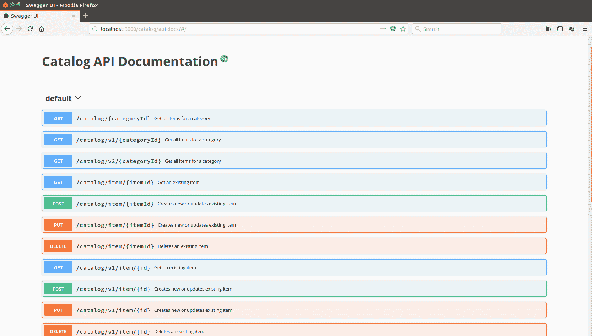

# 第一章：REST - 你不知道的

在过去的几年里，我们已经开始认为，为内容提供数据源、移动设备服务提供数据源或云计算都是由现代技术驱动的，例如 RESTful Web 服务。每个人都在谈论他们的无状态模型如何使应用程序易于扩展，以及它如何强调数据提供和数据消费之间的明确解耦。如今，架构师已经开始引入微服务的概念，旨在通过将核心组件拆分为简单执行单个任务的小独立部分来减少系统的复杂性。因此，企业级软件即将成为这些微服务的组合。这使得维护变得容易，并且在需要引入新部分时允许更好的生命周期管理。毫不奇怪，大多数微服务都由 RESTful 框架提供服务。这个事实可能会让人觉得 REST 是在过去的十年中发明的，但事实远非如此。事实上，REST 自上个世纪的最后一个十年就已经存在了！

本章将带领您了解**表述状态转移**（**REST**）的基础，并解释 REST 如何与 HTTP 协议配合。您将了解在将任何 HTTP 应用程序转换为 RESTful 服务启用应用程序时必须考虑的五个关键原则。您还将了解描述 RESTful 和经典**简单对象访问协议**（**SOAP**）的 Web 服务之间的区别。最后，您将学习如何利用已有的基础设施来使自己受益。

本章中，我们将涵盖以下主题：

+   REST 基础知识

+   REST 与 HTTP

+   描述、发现和文档化 RESTful 服务与经典 SOAP 服务之间的基本差异

+   利用现有基础设施

# REST 基础知识

实际上，这实际上是在 1999 年发生的，当时有一份请求提交给了**互联网工程任务组（IETF;** [`www.ietf.org/`](http://www.ietf.org/))，通过 RFC 2616：*超文本传输协议-HTTP/1.1*。其中一位作者 Roy Fielding 后来定义了围绕 HTTP 和 URI 标准构建的一组原则。这就诞生了我们今天所知的 REST。

这些定义是在 Fielding 的论文《网络软件架构的体系结构风格和设计》的第五章*表述状态转移（REST）*中给出的，该论文可以在[`www.ics.uci.edu/~fielding/pubs/dissertation/fielding_dissertation.pdf `](https://www.ics.uci.edu/~fielding/pubs/dissertation/fielding_dissertation.pdf)找到。该论文仍然可以在[`www.ics.uci.edu/~fielding/pubs/dissertation/rest_arch_style.htm`](http://www.ics.uci.edu/~fielding/pubs/dissertation/rest_arch_style.htm)找到。

让我们看看围绕 HTTP 和 URI 标准的关键原则，坚持这些原则将使您的 HTTP 应用程序成为 RESTful 服务启用应用程序：

1.  一切都是资源

1.  每个资源都可以通过**唯一标识符**（**URI**）进行识别

1.  资源通过标准的 HTTP 方法进行操作

1.  资源可以有多种表示形式

1.  以无状态方式与资源进行通信

# 原则 1 - 一切都是资源

要理解这一原则，必须构想通过特定格式而不是包含一堆字节的物理文件来表示数据的想法。互联网上的每个数据都有一个描述它的格式，称为内容类型；例如，JPEG 图像、MPEG 视频、HTML、XML、文本文档和二进制数据都是具有以下内容类型的资源：image/jpeg、video/mpeg、text/html、text/xml 和 application/octet-stream。

# 原则 2 - 每个资源都可以通过唯一标识符进行识别

由于互联网包含了如此多不同的资源，它们都应该通过 URI 访问，并且应该被唯一标识。此外，尽管它们的使用者更可能是软件程序而不是普通人，但 URI 可以采用可读性强的格式。

可读性强的 URI 使数据自我描述，并且便于进一步开发。这有助于将程序中的逻辑错误风险降到最低。

以下是目录应用程序中表示不同资源的一些示例 URI：

+   [`www.mycatalog.com/categories/watches`](http://www.mycatalog.com/categories/watches)

+   [`www.mycatalog.com/categories/watches?collection=2018`](http://www.mycatalog.com/categories/watches?collection=2018)

+   [`www.mycatalog.com/categories/watches/model-xyz/image`](http://www.mycatalog.com/categories/watches/model-xyz/image)

+   [`www.mycatalog.com/categories/watches/model-xyz/video`](http://www.mycatalog.com/categories/watches/model-xyz/video)

+   [`www.mycatalog.com/archives/2017/categories/watches.zip`](http://www.mycatalog.com/archives/2017/categories/watches.zip)

这些可读性强的 URI 以直接的方式公开了不同类型的资源。在前面的示例 URI 中，很明显数据是目录中的物品，这些物品被分类为手表。第一个链接显示了该类别中的所有物品。第二个只显示了 2018 年收藏中的物品。接下来是一个指向物品图像的链接，然后是一个指向示例视频的链接。最后一个链接指向一个 ZIP 存档中包含上一收藏物品的资源。每个 URI 提供的媒体类型都很容易识别，假设物品的数据格式是 JSON 或 XML，因此我们可以很容易地将自描述 URL 的媒体类型映射到以下之一：

+   描述物品的 JSON 或 XML 文档

+   图像

+   视频

+   二进制存档文件

# 原则 3 - 通过标准 HTTP 方法操作资源

原生 HTTP 协议（RFC 2616）定义了八种动作，也称为 HTTP 动词：

+   获取

+   发布

+   放置

+   删除

+   头

+   选项

+   跟踪

+   连接

前四个在资源上下文中感觉很自然，特别是在定义数据操作的动作时。让我们与相对 SQL 数据库进行类比，那里数据操作的本机语言是 CRUD（即 Create、Read、Update 和 Delete），源自不同类型的 SQL 语句，分别是 INSERT、SELECT、UPDATE 和 DELETE。同样地，如果你正确应用 REST 原则，HTTP 动词应该如下所示使用：

| **HTTP 动词** | **动作** | **HTTP 响应状态码** |
| --- | --- | --- |
| `GET` | 检索现有资源。 | 如果资源存在则返回`200 OK`，如果资源不存在则返回`404 Not Found`，其他错误则返回`500 Internal Server Error`。 |
| `PUT` | 更新资源。如果资源不存在，服务器可以决定使用提供的标识符创建它，或者返回适当的状态代码。 | 如果成功更新则返回`200 OK`，如果创建了新资源则返回`201 Created`，如果要更新的资源不存在则返回`404 Not found`，其他意外错误则返回`500 Internal Server Error`。 |
| `POST` | 使用服务器端生成的标识符创建资源，或者使用客户端提供的现有标识符更新资源。如果此动词仅用于创建而不用于更新，则返回适当的状态代码。 | 如果创建了新资源则返回`201 CREATED`，如果资源已成功更新则返回`200 OK`，如果资源已存在且不允许更新则返回`409 Conflict`，如果要更新的资源不存在则返回`404 Not Found`，其他错误则返回`500 Internal Server Error`。 |
| `DELETE` | 删除资源。 | `200 OK`或`204 No Content`如果资源已成功删除，`404 Not Found`如果要删除的资源不存在，`500 Internal Server Error`用于其他错误。 |

请注意，资源可以由`POST`或`PUT` HTTP 动词创建，具体取决于应用程序的策略。但是，如果必须在由客户端提供的特定 URI 下创建资源，则`PUT`是适当的操作：

```js
PUT /categories/watches/model-abc HTTP/1.1
Content-Type: text/xml
Host: www.mycatalog.com

<?xml version="1.0" encoding="utf-8"?>
<Item category="watch">
    <Brand>...</Brand>
    </Price></Price>
</Item>

HTTP/1.1 201 Created 
Content-Type: text/xml 
Location: http://www.mycatalog.com/categories/watches/model-abc

```

但是，在您的应用程序中，您可能希望由后端 RESTful 服务决定在何处公开新创建的资源，并因此在适当但仍未知或不存在的位置下创建它。

例如，在我们的示例中，我们可能希望服务器定义新创建项目的标识符。在这种情况下，只需使用`POST`动词到 URL 而不提供标识符参数。然后由服务本身提供新的唯一且有效的标识符，并通过响应的`Location`标头公开此 URL：

```js
POST /categories/watches HTTP/1.1
Content-Type: text/xml
Host: www.mycatalog.com

<?xml version="1.0" encoding="utf-8"?>
<Item category="watch">
    <Brand>...</Brand>
    </Price></Price>
</Item>

HTTP/1.1 201 Created 
Content-Type: text/xml 
Location: http://www.mycatalog.com/categories/watches/model-abc
```

# 原则 4-资源可以具有多个表示

资源的一个关键特征是它可以以与存储格式不同的格式表示。因此，可以请求或创建不同的表示。只要支持指定的格式，REST 启用的端点应该使用它。在前面的示例中，我们发布了手表项目的 XML 表示，但如果服务器支持 JSON 格式，以下请求也将有效：

```js
POST /categories/watches HTTP/1.1
Content-Type: application/json
Host: www.mycatalog.com

{
  "watch": {
    "id": ""watch-abc"",
    "brand": "...",
    "price": {
      "-currency": "EUR",
      "#text": "100"
    }
  }
}
HTTP/1.1 201 Created
Content-Type: application/json
Location: http://mycatalog.com/categories/watches/watch-abc   
```

# 原则 5-以无状态的方式与资源通信

通过 HTTP 请求进行的资源操作应始终被视为原子操作。应在 HTTP 请求中以隔离的方式执行所有对资源的修改。请求执行后，资源将处于最终状态；这隐含地意味着不支持部分资源更新。您应始终发送资源的完整状态。

回到我们的目录示例，更新给定项目的价格字段意味着使用完整文档（JSON 或 XML）进行 PUT 请求，其中包含整个数据，包括更新后的价格字段。仅发布更新后的价格不是无状态的，因为这意味着应用程序知道资源具有价格字段，也就是说，它知道它的状态。

RESTful 应用程序要求的另一个条件是，一旦服务部署在生产环境中，传入的请求很可能由负载均衡器提供服务，确保可伸缩性和高可用性。一旦通过负载均衡器公开，将应用程序状态保留在服务器端的想法就会受到威胁。这并不意味着您不允许保留应用程序的状态。这只是意味着您应该以 RESTful 的方式保留它。例如，在 URI 中保留部分状态，或使用 HTTP 标头提供附加的与状态相关的数据

您的 RESTful API 的无状态性使调用方与服务器端的更改隔离开来。因此，不希望调用方在连续请求中与同一服务器通信。这允许在服务器基础架构中轻松应用更改，例如添加或删除节点。

请记住，保持 RESTful API 的无状态性是您的责任，因为 API 的使用者期望它们是无状态的。

现在您知道 REST 大约有 18 年的历史，一个明智的问题是，“为什么它最近才变得如此受欢迎？”嗯，我们开发人员通常拒绝简单直接的方法，大多数时候更喜欢花更多时间将已经复杂的解决方案变得更加复杂和复杂。

以经典的 SOAP web 服务为例。它们的各种 WS-*规范如此之多，有时定义得如此松散，以至于为了使来自不同供应商的不同解决方案能够互操作，引入了一个单独的规范 WS-Basic Profile。它定义了额外的互操作性规则，以确保 SOAP-based web 服务中的所有 WS-*规范可以一起工作。

当涉及使用经典的 Web 服务通过 HTTP 传输二进制数据时，情况变得更加复杂，因为基于 SOAP 的 Web 服务提供了不同的传输二进制数据的方式。每种方式都在其他规范集中定义，比如**SOAP with** **Attachment References** (**SwaRef**)和**Message Transmission** **Optimization Mechanism (MTOM)**。所有这些复杂性主要是因为 Web 服务的最初想法是远程执行业务逻辑，而不是传输大量数据。

现实世界告诉我们，在数据传输方面，事情不应该那么复杂。这就是 REST 适应大局的地方——通过引入资源的概念和一种标准的方式来操作它们。

# REST 的目标

现在我们已经介绍了主要的 REST 原则，是时候深入探讨遵循这些原则时可以实现什么了：

+   表示和资源的分离

+   可见性

+   可靠性

+   可扩展性

+   性能

# 表示和资源的分离

资源只是一组信息，如原则 4 所定义，它可以有多种表示；但是它的状态是原子的。调用者需要在 HTTP 请求中使用`Accept`头指定所需的媒体类型，然后由服务器应用程序处理表示，返回资源的适当内容类型以及相关的 HTTP 状态码。

+   在成功的情况下返回`HTTP 200 OK`

+   如果给出了不支持的格式或任何其他无效的请求信息，则返回`HTTP 400 Bad Request`

+   如果请求了不支持的媒体类型，则返回`HTTP 406 Not Acceptable`

+   在请求处理过程中发生意外情况时，返回`HTTP 500 Internal Server Error`

假设在服务器端，我们有以 XML 格式存储的项目资源。我们可以有一个 API，允许消费者以各种格式请求项目资源，比如`application/xml`，`application/json`，`application/zip`，`application/octet-stream`等等。

由 API 自身来加载请求的资源，将其转换为请求的类型（例如 JSON 或 XML），并且可以使用 ZIP 进行压缩，或直接将其刷新到 HTTP 响应输出。

调用者将使用`Accept` HTTP 头来指定他们期望的响应的媒体类型。因此，如果我们想要以 XML 格式请求前一节中插入的项目数据，应执行以下请求：

```js
GET /category/watches/watch-abc HTTP/1.1 
Host: my-computer-hostname 
Accept: text/xml 

HTTP/1.1 200 OK 
Content-Type: text/xml 
<?xml version="1.0" encoding="utf-8"?>
<Item category="watch">
    <Brand>...</Brand>
    </Price></Price>
</Item>
```

要请求以 JSON 格式获取相同的项目，`Accept`头需要设置为`application/json`：

```js
GET /categoery/watches/watch-abc HTTP/1.1 
Host: my-computer-hostname 
Accept: application/json 

HTTP/1.1 200 OK 
Content-Type: application/json 
{
  "watch": {
    "id": ""watch-abc"",
    "brand": "...",
    "price": {
      "-currency": "EUR",
      "#text": "100"
    }
  }
}
```

# 可见性

REST 的设计是可见和简单的。服务的可见性意味着它的每个方面都应该是自描述的，并且遵循自然的 HTTP 语言，符合原则 3、4 和 5。

在外部世界的上下文中，可见性意味着监控应用程序只对 REST 服务和调用者之间的 HTTP 通信感兴趣。由于请求和响应是无状态和原子的，没有必要流动应用程序的行为，也不需要了解是否出现了问题。

记住，缓存会降低你的 RESTful 应用的可见性，一般情况下应该避免使用，除非需要为大量调用者提供资源。在这种情况下，缓存可能是一个选择，但需要仔细评估提供过时数据的可能后果。

# 可靠性

在谈论可靠性之前，我们需要定义在 REST 上下文中哪些 HTTP 方法是安全的，哪些是幂等的。因此，让我们首先定义什么是安全和幂等方法：

+   如果一个 HTTP 方法在请求时不修改或导致资源状态的任何副作用，则被认为是安全的。

+   如果一个 HTTP 方法的响应保持不变，无论请求的次数如何，那么它被认为是幂等的，重复相同的幂等请求总是返回相同的结果。

以下表格列出了 RESTful 服务中哪些 HTTP 方法是安全的，哪些是幂等的：

| **HTTP 方法** | **安全** | **幂等** |
| --- | --- | --- |
| `GET` | 是 | 是 |
| `POST` | 否 | 否 |
| `PUT` | 否 | 是 |
| `DELETE` | 否 | 是 |

消费者应该考虑操作的安全性和幂等性特性，以便可靠地提供服务。

# 可扩展性和性能

到目前为止，我们强调了对于 RESTful Web 应用程序来说，具有无状态行为的重要性。**万维网**（**WWW**）是一个庞大的宇宙，包含大量数据和许多渴望获取这些数据的用户。WWW 的发展带来了这样的要求，即应用程序应该在负载增加时能够轻松扩展。具有状态的应用程序的扩展难以实现，特别是当期望零或接近零的运行停机时间时。

这就是为什么对于任何需要扩展的应用程序来说，保持无状态是至关重要的。在最理想的情况下，扩展应用程序可能需要您为负载均衡器添加另一台硬件，或者在云环境中引入另一个实例。不需要不同的节点之间进行同步，因为它们根本不需要关心状态。可扩展性的主要目标是在可接受的时间内为所有客户提供服务。其主要思想是保持应用程序运行，并防止由大量传入请求引起的**拒绝服务**（**DoS**）。

可扩展性不应与应用程序的性能混淆。性能是通过处理单个请求所需的时间来衡量的，而不是应用程序可以处理的总请求数。Node.js 的异步非阻塞架构和事件驱动设计使其成为实现可扩展和性能良好的应用程序的合乎逻辑的选择。

# 使用 WADL

如果您熟悉 SOAP Web 服务，可能已经听说过**Web 服务定义语言**（**WSDL**）。它是服务接口的 XML 描述，并定义了调用的端点 URL。对于 SOAP Web 服务来说，必须由这样的 WSDL 定义来描述。

与 SOAP Web 服务类似，RESTful 服务也可以使用一种称为 WADL 的描述语言。**WADL**代表**Web 应用程序定义语言**。与 SOAP Web 服务的 WSDL 不同，RESTful 服务的 WADL 描述是可选的，也就是说，使用服务与其描述无关。

以下是描述我们目录服务的`GET`操作的 WADL 文件的示例部分：

```js
<?xml version="1.0" encoding="UTF-8"?>
<application xmlns="http://wadl.dev.java.net/2009/02" xmlns:service="http://localhost:8080/catalog/" xmlns:xsd="http://www.w3.org/2001/XMLSchema">
  <grammer>
    <include href="items.xsd" />
    <include href="error.xsd" />
  </grammer>
  <resources base="http://localhost:8080/catalog/categories">
    <resource path="{category}">
      <method name="GET">
        <request>
          <param name="category" type="xsd:string" style="template" />
        </request>
        <response status="200">
          <representation mediaType="application/xml" element="service:item" />
          <representation mediaType="application/json" />
        </response>
        <response status="404">
          <representation mediaType="application/xml" element="service:item" />
        </response>
      </method>
    </resource>
  </resources>
</application>
```

WADL 文件的这一部分显示了如何描述公开资源的应用程序。简而言之，每个资源必须是应用程序的一部分。资源提供了一个`base`属性，描述了它位于何处，并在方法中描述了它支持的每个 HTTP 方法。此外，可以在资源和应用程序中使用可选的`doc`元素来提供有关服务及其操作的额外文档。

尽管 WADL 是可选的，但它显著减少了发现 RESTful 服务的工作量。

# 使用 Swagger 记录 RESTful API

在 Web 上公开的 API 应该有很好的文档，否则开发人员将难以在其应用程序中使用它们。虽然 WADL 定义可能被认为是文档的来源，但它们解决了不同的问题——服务的发现。它们为机器提供服务的元数据，而不是为人类。Swagger 项目([`swagger.io/`](https://swagger.io/))解决了对 RESTful API 进行整洁文档的需求。它从几乎可读的 JSON 格式定义了 API 的元描述。以下是部分描述目录服务的示例`swagger.json`文件：

```js
{
  "swagger": "2.0",
  "info": {
    "title": "Catalog API Documentation",
    "version": "v1"
  },
  "paths": {
    "/categories/{id}" : {
      "get": {
        "operationId": "getCategoryV1",
        "summary": "Get a specific category ",
        "produces": [
          "application/json"
        ],
        "responses": {
          "200": {
            "description": "200 OK",
            "examples": 
              {"application/json": {                
                "id": 1,
                "name": "Watches",
                "itemsCount": 550
                }                
              } 
          },
          "404": {"description" : "404 Not Found"},
          "500": {"description": "500 Internal Server Error"}
        }
      }
    }
  },
  "consumes": ["application/json"]
}
```

`swagger.json`文件非常简单：它定义了 API 的名称和版本，并简要描述了它公开的每个操作，与示例有效负载很好地结合在一起。但它的真正好处来自 Swagger 的另一个子项目，称为`swagger-ui` ([`swagger.io/swagger-ui/`](https://swagger.io/swagger-ui/))，它实际上将`swagger.json`中的数据很好地呈现为交互式网页，不仅提供文档，还允许与服务进行交互：



我们将查看并利用`swagger-ui` Node.js 模块来提供我们将在本书中稍后开发的 API，以及最新的文档。

# 利用现有基础设施

开发和分发 RESTful 应用程序最好的部分是所需的基础设施已经存在，可供您使用。由于 RESTful 应用程序大量使用现有的网络空间，因此在开发时您无需做任何其他事情，只需遵循 REST 原则。此外，针对任何平台都有大量可用的库，我是指任何平台。这简化了 RESTful 应用程序的开发，因此您只需选择您喜欢的平台并开始开发。

# 摘要

在本章中，您了解了 REST 的基础知识，看了五个关键原则，将 Web 应用程序转变为 REST 启用的应用程序。我们简要比较了 RESTful 服务和传统的 SOAP Web 服务，最后看了一下 RESTful 服务的文档以及我们如何简化我们开发的服务的发现。

现在您已经了解了基础知识，我们准备深入了解 Node.js 实现 RESTful 服务的方式。在下一章中，您将了解 Node.js 的基本知识以及必须使用和了解的相关工具，以构建真正完整的网络服务。
