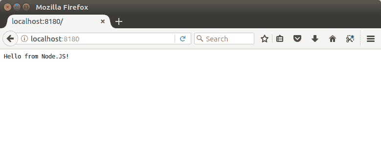
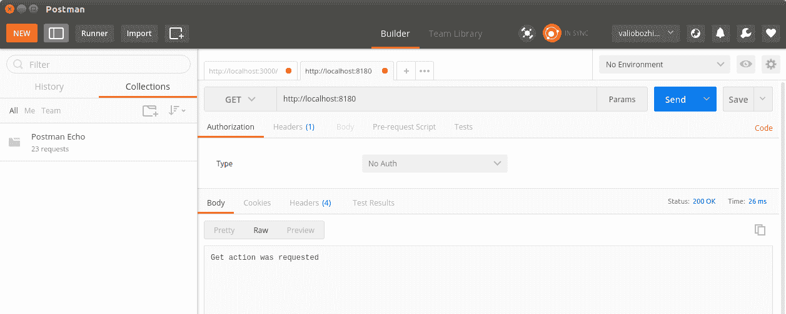
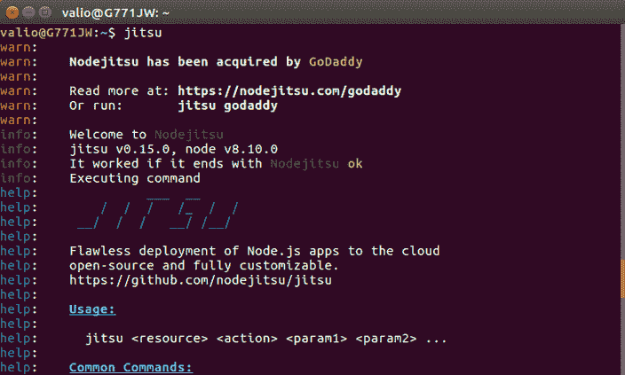

# 第二章：使用 Node.js 入门

在本章中，您将获得您的第一个真正的 Node.js 体验。我们将从安装 Node.js 开始，以及一些我们将在整本书中使用的模块。然后，我们将设置一个开发环境。在整本书中，将使用 Atom IDE。是的，GitHub 的在线编辑器终于登陆了桌面环境，并且可以在您喜欢的平台上使用！

接下来，我们将创建一个工作空间，并开始开发我们的第一个 Node.js 应用程序。这将是一个简单的服务器应用程序，用于处理传入的 HTTP 请求。我们将进一步演示如何将我们的 JavaScript 代码模块化和单元测试。最后，我们将在 Heroku 云应用平台上部署我们的第一个应用程序。

总之，在本章中，我们将涵盖以下主题：

+   安装 Node.js

+   安装 Express 框架和其他模块

+   设置开发环境

+   处理 HTTP 请求

+   模块化代码

+   测试 Node.js

+   部署应用程序

# 安装 Node.js

让我们从 Node.js 安装开始我们的 Node.js 之旅。Windows 和 macOS 都可以在[`nodejs.org/en/download/`](https://nodejs.org/en/download/)上找到安装程序。在撰写本文时，Node.js 10 刚刚发布为当前版本，并将于 2018 年 8 月成为下一个长期支持版本。Linux 用户可以从可用的 Linux 二进制文件构建 Node.js，或者利用他们的软件包管理器，因为 Node.js 在不同 Linux 发行版的大多数流行软件包存储库中都可用。例如，Ubuntu 和其他基于 Debian 的发行版应该首先指向最新的 Node.js 10 软件包，然后通过 shell 中的`apt-get`命令进行安装：

```js
curl -sL https://deb.nodesource.com/setup_10.x | sudo -E bash -
sudo apt-get install nodejs
```

如果您决定使用 macOS 或 Windows 可用的安装程序，向导将指导您完成一个相当典型的安装过程，您需要接受 Node.js 许可协议，然后提供安装路径。

通过软件包管理器执行安装的 Linux 用户需要单独安装**Node Package Manager (npm)**；我们将在下一节中进行安装。

安装成功后，您应该已经将 Node 设置在您的`PATH`环境变量中。

安装程序将为您预先选择 Node.js 运行时、npm、在线文档资源的快捷方式，以及将 Node.js 和 npm 添加到操作系统`PATH`环境变量的选项。

要验证您的安装是否成功，请从 shell 中执行以下操作：

```js
node --version 
```

在撰写本文时，最新的 Node.js 版本是 10.0.0，因此预期的输出版本号将是这个版本号。Node.js 10 将是下一个长期支持的版本，因此在接下来的几年里它将保持最新。

# Npm

Node.js 通过提供**npm**来方便地支持第三方开源开发的模块。它允许您作为开发人员轻松安装、管理甚至提供自己的模块包。npm 包存储库位于[`www.npmjs.org/`](http://www.npmjs.org/)，可以通过其命令行界面访问。

如果您没有使用安装程序，那么您需要单独安装`npm`。例如，Ubuntu 用户可以按照以下方式使用他们的软件包安装程序：

```js
apt-get npm install
```

如果您升级了 Node.js 安装，并且之前安装了 npm 5.6，系统会要求您将其升级到版本 6。要执行此操作，只需执行：

```js
sudo npm i -g npm
```

一旦安装了 npm，通过编辑`~/.profile`文件将其永久设置在用户配置文件的`PATH`环境变量中是很有用的，以便导出 npm 的路径如下：

```js
export PATH=$PATH:/path/to/npm
```

成功安装 npm 后，使用 npm 的`ls`选项来显示当前安装的 Node.js 模块：

```js
bojinov@developer-machine:~$ npm ls
/home/bojinov
├─┬ accepts@1.3.3
│ ├─┬ mime-types@2.1.13
│ │ └── mime-db@1.25.0
│ └── negotiator@0.6.1
├── array-flatten@1.1.1
├─┬ cache-control@1.0.3
│ ├─┬ cache-header@1.0.3
│ │ ├── lodash.isnumber@2.4.1 deduped
│ │ ├── lodash.isstring@2.4.1
│ │ └── regular@0.1.6 deduped
│ ├─┬ fast-url-parser@1.1.3
│ │ └── punycode@1.4.1
│ ├─┬ glob-slasher@1.0.1
│ │ ├── glob-slash@1.0.0
│ │ ├─┬ lodash.isobject@2.4.1
│ │ │ └── lodash._objecttypes@2.4.1
│ │ └─┬ toxic@1.0.0
│ │ └── lodash@2.4.2
│ ├─┬ globject@1.0.1
│ │ └── minimatch@2.0.10 extraneous
│ ├── lodash.isnumber@2.4.1
│ ├── on-headers@1.0.1
│ └── regular@0.1.6
├── content-disposition@0.5.1
├── content-type@1.0.2
├── cookie@0.3.1
├── cookie-signature@1.0.6
```

# 安装 Express 框架和其他模块

现在我们安装了`npm`，让我们利用它并安装一些在本书中将大量使用的模块。其中最重要的是 Express 框架([`www.expressjs.com/`](http://www.expressjs.com/))。它是一个灵活的 Web 应用程序框架，为 Node.js 提供了一个强大的 RESTful API，用于开发单页或多页 Web 应用程序。以下命令将从 npm 仓库下载 Express 模块，并使其可用于我们的本地 Node.js 安装：

```js
npm install -g express 
```

在成功安装后，你将在`npm ls`的结果中找到`express`模块。在本章的后面，我们将学习如何为我们的 Node.js 模块编写单元测试。为此，我们将需要`nodeunit`模块：

```js
npm install nodeunit -g 
```

`-g`选项会全局安装`nodeunit`。这意味着该模块将被存储在你的文件系统的一个中央位置；通常是`/usr/lib/node_modules`或者`/usr/lib/node`，但这可以配置到你的 Node.js 的全局配置。全局安装的模块对所有正在运行的 node 应用程序都是可用的。

本地安装的模块将存储在你项目的当前工作目录的`node_modules`子目录中，并且只对该单个项目可用。

现在，回到`nodeunit`模块——它提供了用于创建基本单元测试的基本断言测试函数，以及用于执行它们的工具。

在开始使用 Node.js 开发之前，我们还有一件事要了解：Node.js 应用程序的包描述文件。

所有的 Node.js 应用程序或模块都包含一个`package.json`描述文件。它提供关于模块、作者和它使用的依赖的元信息。让我们来看一下我们之前安装的`express`模块的`package.json`文件：

```js
{
  "_from": "express",
  "_id": "express@4.16.1",
  "_inBundle": false,
  "_integrity": "sha512-STB7LZ4N0L+81FJHGla2oboUHTk4PaN1RsOkoRh9OSeEKylvF5hwKYVX1xCLFaCT7MD0BNG/gX2WFMLqY6EMBw==",
  "_location": "/express",
  "_phantomChildren": {},
  "_requested": {
    "type": "tag", "registry": true, "raw": "express", "name": "express",
    "escapedName": "express","rawSpec": "", "saveSpec": null, "fetchSpec": "latest"
  },
  "_requiredBy": [
    "#USER"
  ],
  "_resolved": "https://registry.npmjs.org/express/-/express-4.16.1.tgz",
  "_shasum": "6b33b560183c9b253b7b62144df33a4654ac9ed0",
  "_spec": "express",
  "_where": "/home/valio/Downloads",
  "author": {
    "name": "TJ Holowaychuk",
    "email": "tj@vision-media.ca"
  },
  "bugs": {
    "url": "https://github.com/expressjs/express/issues"
  },
  "bundleDependencies": false,
  "contributors": [
    {
      "name": "Aaron Heckmann",
      "email": "aaron.heckmann+github@gmail.com"
    },
   ...,
    {
      "name": "Young Jae Sim",
      "email": "hanul@hanul.me"
    }
  ],
  "dependencies": {
    "accepts": "~1.3.4",
    "array-flatten": "1.1.1",
    "body-parser": "1.18.2",
    ...,
    "type-is": "~1.6.15",
    "utils-merge": "1.0.1",
    "vary": "~1.1.2"
  },
  "deprecated": false,
  "description": "Fast, unopinionated, minimalist web framework",
  "devDependencies": {
    "after": "0.8.2",
    "connect-redis": "~2.4.1",
    ...,
    "should": "13.1.0",
    "supertest": "1.2.0",
    "vhost": "~3.0.2"
  },
  "engines": {
    "node": ">= 0.10.0"
  },
  "files": ["LICENSE", "History.md", "Readme.md", "index.js","lib/"],
  "homepage": "http://expressjs.com/",
  "keywords": [
    "express", "framework", "sinatra", "web", "rest", "restful", "router", "app", "api"
  ],
  "license": "MIT",
  "name": "express",
  "repository": {
    "type": "git",
    "url": "git+https://github.com/expressjs/express.git"
  },
  "scripts": {
    "lint": "eslint .",
    "test": "mocha --require test/support/env --reporter spec --bail --check-leaks test/ test/acceptance/"
  },
  "version": "4.16.1"
}
```

包的名称和版本是每个模块的必需属性。所有其他的元信息，比如贡献者列表、仓库类型和位置、许可信息等等，都是可选的。其中一个最有趣的属性是`dependencies`属性。它告诉 npm 你的包依赖于哪些模块。让我们深入了解一下这是如何指定的。每个依赖都有一个名称和一个版本。

这告诉 npm 该包依赖于版本为 1.3.4 的`accepts`模块和版本为 1.8.2 的`body-parse`模块。所以，当 npm 安装该模块时，它将隐式地下载并安装依赖的最新次要版本，如果它们尚未可用。

依赖的版本是以以下格式指定的：`major.minor.patch-version`。你可以指定 npm 如果你想让 npm 使用确切指定的版本，或者你可以让 npm 始终下载最新可用的次要版本，通过以`~`开头的版本；参考`accepts`依赖。

有关版本控制的更多信息，请访问语义版本规范的网站[`www.semver.org/`](http://www.semver.org/)。

依赖于自动管理的版本可能导致向后不兼容，请确保每次切换版本时都测试你的应用程序。

# 设置开发环境

JavaScript 开发人员很少在 IDE 中开发他们的项目；他们中的大多数人使用文本编辑器，并倾向于对与他们观点相矛盾的任何东西持偏见。GitHub 终于通过发布桌面环境的 Atom IDE 来平息了他们中的大多数人。这可能解决不了关于哪种环境最好的争论，但至少会带来一些和平，并让人们专注于他们的代码，而不是工具，这最终是个人偏好的问题。本书中的示例是在 Atom IDE 中开发的，但请随意使用任何可以创建文件的软件，包括 vi 或 vim 等命令行编辑器，如果这样做会让您感觉像 JS 超级英雄，尽管请记住超级英雄已经过时了！

您可以从[`ide.atom.io/`](https://ide.atom.io/)下载 Atom IDE。

现在是启动我们的第一个 Node.js 应用程序的时候了，一个简单的 Web 服务器响应`Hello from Node.js`。从您的项目中选择一个目录，例如`hello-node`，然后从中打开一个 shell 终端并执行`npm init`：

```js
npm init

package name: (hello-node) 
version: (1.0.0) 
description: Simple hello world http handler
entry point: (index.js) app.js
test command: test
git repository: 
keywords: 
author: Valentin Bojinov
license: (ISC) 
About to write to /home/valio/nodejs8/hello-node/package.json:

{
 "name": "hello-node",
 "version": "1.0.0",
 "description": "Simple hello world http handler",
 "main": "app.js",
 "scripts": {
 "test": "test"
 },
 "author": "Valentin Bojinov",
 "license": "ISC"
}

Is this ok? (yes) yes

```

一个命令行交互向导将询问您的项目名称，版本，以及一些其他元数据，如 Git 存储库，您的姓名等等，并最终预览要生成的`package.json`文件；完成后，您的第一个 Node.js 项目准备开始。

现在是花一些时间研究本书中使用的代码约定的合适时机；当需要定义短回调函数时，将使用 ES6 内联匿名函数，而当期望可重用性和可测试性时，将使用常规的 javascript 函数。

启动 Atom IDE，选择文件|添加项目文件夹...，并导入您定义项目的目录。最后，在成功导入后，您将在项目中看到生成的`package.json`文件。右键单击目录，选择新建文件，并创建一个名为`hello-node.js`的文件：

```js
var http = require('http');

http.createServer((request, response) => {
  response.writeHead(200, {
    'Content-Type' : 'text/plain'
  });
  response.end('Hello from Node.JS');
  console.log('Hello handler requested');
}).listen(8180, '127.0.0.1', () => {
  console.log('Started Node.js http server at http://127.0.0.1:8180');
});
```

`hello-node.js`文件使用 Node.js HTTP 模块开始监听端口`8180`上的传入请求。它将对每个请求回复静态的`Hello from Node.JS`，并在控制台中记录一个 hello 日志条目。在启动应用程序之前，我们必须安装创建 HTTP 服务器的`http`模块。让我们全局安装它以及`--save`选项，这将在项目的`package.json`文件中添加对它的依赖。然后我们可以启动应用程序：

```js
npm install -g http --save
node hello-node.js  
```

从浏览器打开`http://localhost:8180/`将导致向服务器应用程序发送请求，这将在控制台中记录一个日志条目，并在浏览器中输出`Hello from Node.JS`：



# 处理 HTTP 请求

目前，我们的服务器应用程序无论处理什么类型的 HTTP 请求都会以相同的方式行为。让我们以这样的方式扩展它，使其更像一个 HTTP 服务器，并根据其类型开始区分传入请求，通过为每种类型的请求实现处理程序函数。

让我们创建一个名为`hello-node-http-server.js`的新文件：

```js
var http = require('http');
var port = 8180;

function handleGetRequest(response) {
  response.writeHead(200, {'Content-Type' : 'text/plain'});
  response.end('Get action was requested');
}

function handlePostRequest(response) {
  response.writeHead(200, {'Content-Type' : 'text/plain'});
  response.end('Post action was requested');
}

function handlePutRequest(response) {
  response.writeHead(200, {'Content-Type' : 'text/plain'});
  response.end('Put action was requested');
}

function handleDeleteRequest(response) {
  response.writeHead(200, {'Content-Type' : 'text/plain'});
  response.end('Delete action was requested');
}

function handleBadRequest(response) {
  console.log('Unsupported http mehtod');
  response.writeHead(400, {'Content-Type' : 'text/plain'  });
  response.end('Bad request');
}

function handleRequest(request, response) {
  switch (request.method) {
    case 'GET':
      handleGetRequest(response);
      break;
    case 'POST':
      handlePostRequest(response);
      break;
    case 'PUT':
      handlePutRequest(response);
      break;
    case 'DELETE':
      handleDeleteRequest(response);
      break;
    default:
      handleBadRequest(response);
      break;
  }
  console.log('Request processing completed');
}

http.createServer(handleRequest).listen(8180, '127.0.0.1', () => {
  console.log('Started Node.js http server at http://127.0.0.1:8180');
});
```

当我们运行此应用程序时，我们的 HTTP 服务器将识别`GET`、`POST`、`PUT`和`DELETE` HTTP 方法，并将在不同的函数中处理它们。对于所有其他 HTTP 请求，它将以`HTTP 400 BAD REQUEST`状态代码优雅地响应。为了与 HTTP 应用程序交互，我们将使用 Postman，可从[`www.getpostman.com/`](https://www.getpostman.com/)下载。这是一个轻量级的应用程序，用于向端点发送 HTTP 请求，指定 HTTP 标头，并提供有效载荷。试试并执行我们之前实现的每个处理程序函数的测试请求：



# 模块化代码

到目前为止，我们开发了一个简单的 HTTP 服务器应用程序，用于监听和处理已知的请求类型；但是，它的结构并不是很好，因为处理请求的函数不可重用。Node.js 支持模块，支持代码隔离和可重用性。

用户定义的模块是一个由一个或多个相关函数组成的逻辑单元。该模块可以向其他组件导出一个或多个函数，同时将其他函数保持对自身可见。

我们将重新设计我们的 HTTP 服务器应用程序，使整个请求处理功能都包装在一个模块中。该模块将只导出一个通用处理程序函数，该函数将以请求对象作为参数，并根据其请求类型将处理委托给模块外部不可见的内部函数。

让我们首先在项目中创建一个新的模块目录。我们将通过将以下函数提取到新创建的目录中的`http-module.js`文件中来重构我们以前的源文件：

```js
function handleGetRequest(response) {
  response.writeHead(200, {'Content-Type' : 'text/plain'});
  response.end('Get action was requested');
}

function handlePostRequest(response) {
  response.writeHead(200, {'Content-Type' : 'text/plain'});
  response.end('Post action was requested');
}

function handlePutRequest(response) {
  response.writeHead(200, {'Content-Type' : 'text/plain'});
  response.end('Put action was requested');
}

function handleDeleteRequest(response) {
  response.writeHead(200, {'Content-Type' : 'text/plain'});
  response.end('Delete action was requested');
}

function handleBadRequest(response) {
  console.log('Unsupported http mehtod');
  response.writeHead(400, {'Content-Type' : 'text/plain'  });
  response.end('Bad request');
}

exports.handleRequest = function(request, response) {
  switch (request.method) {
    case 'GET':
      handleGetRequest(response);
      break;
    case 'POST':
      handlePostRequest(response);
      break;
    case 'PUT':
      handlePutRequest(response);
      break;
    case 'DELETE':
      handleDeleteRequest(response);
      break;
    default:
      handleBadRequest(response);
      break;
  }
  console.log('Request processing completed');
}
```

该文件创建了一个用户定义的模块，导出`handleRequest`函数，使其可用于其他组件。所有其他函数只能在模块内部访问。虽然示例只导出一个函数，但模块可以导出尽可能多的函数。

让我们在我们的第一个项目的`main`目录中的`main.js`文件中使用新的`http-module`。我们必须使用 Node.js 内置的`http`模块创建一个`http`服务器，其`createServer`将其`handleRequest`函数作为参数传递。它将作为服务器在每个请求上调用的回调函数：

```js
var http = require('http');
var port = 8180;

var httpModule = require('./modules/http-module');

http.createServer(httpModule.handleRequest).listen(8180, '127.0.0.1', () => {
  console.log('Started Node.js http server at http://127.0.0.1:8180');
});
```

我们将创建服务器套接字的创建与处理与其绑定的传入请求的业务逻辑分开。使用`require`指令导入我们的模块。它使用相对路径。也可以使用 Postman 工具执行另一个测试请求来尝试这个版本。

幸运的是，在实现支持 RESTful 的应用程序时，我们不需要创建自己的 HTTP 处理程序。Express 框架将为我们完成这些工作。本章的示例旨在清楚地展示 Node.js 在处理 HTTP 请求和实现用户模块方面的可能性。我们将在第三章中详细了解 Express 框架，*构建典型的 Web API*。

# 测试 Node.js

现在我们将通过为 HTTP 模块提供一个单元测试来扩展我们的项目，但在深入研究之前，让我们先看看 Node.js 如何支持单元测试。在本章的开头，我们安装了 Nodeunit 模块。好吧，现在是时候开始尝试一下了。

首先，让我们创建另一个简单的 Node.js 模块，我们将用它来实现我们的第一个单元测试。然后我们将转向更高级的主题，比如模拟 JavaScript 对象并使用它们来为我们的 HTTP 模块创建单元测试。

我选择开发一个简单的数学模块，导出用于添加和减去整数的函数，因为它足够简单，每个操作的结果都是严格定义的。

让我们从模块开始，在我们的`module`目录中创建以下`math.js`文件：

```js
exports.add = function (x, y) { 
  return x + y; 
}; 
exports.subtract = function (x, y) { 
  return x - y; 
}; 
```

下一步是在项目的`test`子目录中创建一个`test-math.js`文件：

```js
var math = require('../modules/math');
exports.addTest = function (test) {
  test.equal(math.add(1, 1), 2);
  test.done();
};
exports.subtractTest = function (test) {
  test.equals(math.subtract(4,2), 2);
  test.done();
};
```

最后，使用 shell 终端运行`nodeunit test/test-math.js`来运行测试模块。输出将显示所有测试方法的结果，指定它们是否成功通过：

```js
nodeunit test/test-math.js    
    test-math.js
    test-math.js
 addTest
 subtractTest

OK: 2 assertions (5ms)
```

让我们修改`addTest`，使其出现故障，看看 Nodeunit 模块如何报告测试失败：

```js
exports.test_add = function (test) { 
    test.equal(math.add(1, 1), 3); 
    test.done(); 
}; 
```

这次执行测试会导致失败，并显示一些断言失败的消息，最后会有一个汇总，显示执行的测试中有多少失败了：

```js
nodeunit test-math.js
test-math.js
 addTest
at Object.equal (/usr/lib/node_modules/nodeunit/lib/types.js:83:39)
at Object.exports.addTest (../hello-node/test/test-math.js:
(..)

AssertionError: 2 == 3
 subtractTest
FAILURES: 1/2 assertions failed (12ms)
```

我们刚刚创建了 Nodeunit 的第一个单元测试。但是，它以一种相对隔离的方式测试数学函数。我想你会想知道我们如何使用 Nodeunit 来测试具有复杂参数的函数，比如绑定到上下文的 HTTP 请求和响应。这是可能的，使用所谓的**模拟对象**。它们是复杂基于上下文的参数或函数状态的预定义版本，在我们的单元测试中，我们想要使用这些对象来测试模块的行为以获取对象的确切状态。

要使用模拟对象，我们需要安装一个支持对象模拟的模块。那里有各种类型的测试工具和模块可用。然而，大多数都是设计用于测试 JavaScript 客户端功能。有一些模块，比如 JsMockito，这是 Java 著名 Mockito 框架的 JavaScript 版本，还有 node-inspector，这是一个提供 JavaScript 调试器的模块，它会在 Google Chrome 浏览器中隐式启动。

对于 Chrome 浏览器的本地支持是合理的，因为 Node.js 是构建在 Google V8 JavaScript 引擎之上的。由于我们正在开发服务器端应用程序，这些并不是最方便的工具，因为 JsMockito 不能作为 Node.js 模块进行插件化，并且在浏览器中使用调试器来调试后端应用程序对我来说并不合适。无论如何，如果你打算深入了解 Node.js，你应该一定要试试。

为了测试服务器端 JavaScript 模块，我们将使用 Sinon.JS 模块。像所有其他模块一样，它可以在 npm 仓库中找到，因此执行以下命令来安装它：

```js
npm install -g sinon
```

Sinon.JS 是一个非常灵活的 JavaScript 测试库，提供了对 JavaScript 对象进行模拟、存根和监视的功能。它可以在任何 JavaScript 测试框架中使用，网址是 [`sinonjs.org`](http://sinonjs.org)。让我们看看我们需要什么来测试我们的 HTTP 模块。它导出一个单一方法 `handleRequest`，该方法以 HTTP 请求和响应对象作为参数。基于请求的方法，该模块调用其内部函数来处理不同的请求。每个请求处理程序向响应写入不同的输出。

要在诸如 Nodeunit 这样的隔离环境中测试此功能，我们需要模拟对象，然后将其作为参数传递。为了确保模块的行为符合预期，我们需要访问存储在这些对象中的数据。

# 使用模拟对象

使用模拟对象时需要执行的步骤如下：

1.  使用 `sinon` 作为参数调用 `require` 函数，并从中导出一个 `test` 函数：

```js
var sinon = require('sinon'); 
exports.testAPI(test){...} 
```

1.  如下所示定义要模拟的方法的 API 描述：

```js
var api = {'methodX' : function () {},  
  'methodY' : function() {},  
  'methodZ' : function() {}}; 
```

1.  在导出的函数中使用 `sinon` 来根据 `api` 描述创建模拟对象：

```js
var mock = sinon.mock(api);
```

1.  设置模拟对象的期望。期望是在模拟对象上设置的，描述了模拟方法应该如何行为，它应该接受什么参数，以及它应该返回什么值。当模拟方法以与描述不同的状态调用时，期望在后来验证时将失败：

```js
mock.expects('methodX').once().withArgs('xyz') 
.returns('abc'); 
api.methodX('xyz') 
```

1.  上面的示例期望 `methodX` 被调用一次，并且带有 `xyz` 参数，它将强制该方法返回 `abc`。Sinon.JS 模块使我们能够实现这一点。

调用描述对象的方法，而不是模拟对象的方法。模拟对象用于设置模拟方法的期望，并在后来检查这些期望是否已经实现。

1.  在测试环境中使用模拟对象，然后调用其 `verify()` 方法。该方法将检查被测试代码是否与模拟对象正确交互，即该方法被调用的次数以及是否使用了预期的参数进行调用。如果任何期望未能满足，那么将抛出错误，导致测试失败。

1.  我们的测试模块的导出`test`函数有一个参数。该参数提供了可以用来检查测试条件的断言方法。在我们的示例中，我们模拟了该方法，以便在使用`'xyz'`参数调用时始终返回`abc`。因此，为了完成测试，可以进行以下断言，并且最后需要验证模拟对象：

```js
mock.expects('methodX').once().withArgs('xyz') 
.returns('abc');           
test.equals(api.methodX('xyz'), 'abc'); 
mock.verify(); 
```

1.  尝试修改传递给`methodX`的参数，使其不符合预期，您将看到这会破坏您的测试。

1.  让我们将这些步骤付诸实践，并在`test`目录中创建以下`test-http-module.js`文件：

```js
var sinon = require('sinon');
exports.handleGetRequestTest =  (test) => {
  var response = {'writeHead' : () => {}, 'end': () => {}};
  var responseMock = sinon.mock(response);
    responseMock.expects('end').once().withArgs('Get action was requested');
    responseMock.expects('writeHead').once().withArgs(200, {
      'Content-Type' : 'text/plain'});

  var request = {};
  var requestMock = sinon.mock(request);
  requestMock.method = 'GET';

  var http_module = require('../modules/http-module');
  http_module.handleRequest(requestMock, response);
  responseMock.verify();
  test.done();
};
```

1.  使用 Nodeunit 的`test-http-module.js`开始测试以验证其是否成功通过。您的下一步将是扩展测试，以便覆盖我们的 HTTP 模块中所有 HTTP 方法的处理：

```js
nodeunit test/test-http-module.js 

test-http-module.js
Request processing completed
 handleGetRequestTest

OK: 0 assertions (32ms)
```

# 部署应用程序

Node.js 具有事件驱动的、非阻塞的 I/O 模型，这使其非常适合在分布式环境中良好扩展的实时应用程序，例如公共或私有云平台。每个云平台都提供工具，允许其托管应用程序的无缝部署、分发和扩展。在本节中，我们将看一下两个公开可用的 Node.js 应用程序云提供商——Nodejitsu 和 Microsoft Azure。

但首先，让我们花一些时间来了解集群支持，因为这对于理解为什么 Node.js 非常适合云环境至关重要。Node.js 内置了集群支持。在您的应用程序中使用集群模块允许它们启动尽可能多的工作进程来处理它们将面临的负载。通常建议将工作进程的数量与您的环境的线程数或逻辑核心数匹配。

您的应用程序的核心是主进程。它负责保持活动工作进程的注册表和应用程序的负载，以及如何创建它。当需要时，它还会创建更多的工作进程，并在负载减少时减少它们。

云平台还应确保在部署应用程序的新版本时没有任何停机时间。在这种情况下，主进程需要被通知要分发新版本。它应该 fork 新的工作进程的新应用程序版本，并通知当前使用旧版本的工作进程关闭它们的监听器；因此，它停止接受连接并在完成后优雅地退出。因此，所有新的传入请求将由新启动的工作进程处理，并在过时的工作进程终止后，所有运行中的工作进程将运行最新版本。

# Nodejitsu

让我们更仔细地看一些 Node.js**平台即服务**（**PaaS**）提供。我们将首先看一下 Nodejitsu，可在[`www.nodejitsu.com`](https://www.nodejitsu.com)上找到。

这允许在云上无缝部署 Node.js 应用程序，具有许多有用的功能，用于 Node.js 应用程序的开发、管理、部署和监控。要与 jitsu 交互，您需要安装其命令行界面，该界面可作为 Node.js 模块使用：

```js
npm install -g jitsu 
```

安装 jitsu 并使用`jitsu`启动后，您将受到热烈欢迎，友好的控制台屏幕将向您介绍基本的 jitsu 命令，如下所示：



为了与 jitsu 交互，您需要注册。Jitsu 提供不同的定价计划，以及免费试用服务。

您可以从他们的网站或使用`jitsu signup`命令来执行此操作。然后，您可以开始使用命令行界面提供的工具。

# 微软 Azure

微软的云平台即服务 Azure 也提供 Node.js 应用程序的托管。他们选择了一个略有不同的方法，而不是提供一个命令行界面来与他们的存储库交互，他们利用了他们的 Git 集成；也就是说，您与 Azure 的交互方式与您与任何其他 Git 存储库的交互方式相同。如果您对 Git 不熟悉，我强烈建议您了解更多关于这个分布式源代码版本控制系统的知识。

如果您选择 Azure 作为您的平台，您会发现以下链接非常有用：[`azure.microsoft.com/en-us/develop/nodejs/`](http://azure.microsoft.com/en-us/develop/nodejs/)。

# Heroku

Heroku 是一个公共云服务，允许您管理、部署和扩展 Node.js 应用程序。准备将您的 Node 应用程序适应 Heroku 环境并不需要太多的努力，只要安装其命令行界面，可以在[`devcenter.heroku.com/articles/heroku-cli`](https://devcenter.heroku.com/articles/heroku-cli)或通过您的包管理器获得。

```js
npm install -g heroku-cli
```

您只需在`package.json`文件中提供一个`'start script'`元素，使用`git push master heroku`将其推送到相关的 Git 存储库，然后登录并创建您的应用程序，使用`heroku login`和`heroku create`命令。

# 自测问题

为了对您新获得的知识更有信心，浏览下一组陈述，并说明它们是真还是假：

1.  Node 模块可以向外部组件导出多个函数

1.  Node 模块是可扩展的

1.  模块总是需要明确声明它们对其他模块的依赖关系

1.  在测试环境中使用模拟时，模拟的方法是在模拟对象上调用的

1.  调试 Node.js 代码并不像其他非 JavaScript 代码那样直截了当

# 总结

在本章中，您获得了第一个 Node.js 体验，从一个简单的`Hello world`应用程序开始，然后转移到一个处理传入 HTTP 请求的更复杂的样本 HTTP 服务器应用程序。更加自信地使用 Node.js，您重构了应用程序以使用用户模块，然后使用模拟框架为您的模块创建了单元测试，以消除测试环境中复杂对象的依赖关系。

现在您已经了解了如何处理和测试传入的 HTTP 请求，在下一章中，我们的下一步将是定义典型 Web API 的外观以及如何进行测试。
